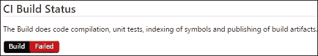
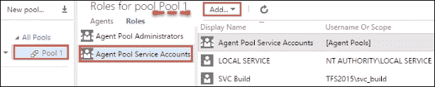

# 第四章 构建你的应用程序

|   | *"用代码行数来衡量编程进度，就像用飞机的重量来衡量建造进度一样。"* |   |
| --- | --- | --- |
|   | --*比尔·盖茨* |

TFS 在 TFS 2015 中推出了一种新的构建系统，叫做 TFBuild。在本章中，你将学习以下内容：

+   配置 TFBuild 代理、池和队列

+   使用无人值守安装设置 TFBuild 代理

+   在 TFBuild 中创建持续集成构建定义

+   将构建徽章固定到团队门户的欢迎页面

+   使用基于角色的访问管理构建资源

+   使用构建保留策略自动删除构建

+   使用用户能力识别池中的构建代理

+   在构建输出中使用构建号版本化 DLL

+   使用 TFBuild 扩展框架创建新构建任务

+   将 SonarQube 与 TFBuild 集成以管理技术债务

+   使用 TFBuild 构建 GitHub 代码库

# 介绍

作为开发人员，编译代码并运行单元测试可以确保你的代码更改不会影响现有的代码库。将代码更改集成到源代码控制库中，能够让其他用户验证他们的更改是否与你的更改兼容。作为最佳实践，团队通常每天将更改多次集成到共享库中，以减少引入破坏性更改或更糟糕的情况——互相覆盖的风险。

### 提示

**持续集成**（**CI**）是一种开发实践，要求开发人员每天多次将代码集成到共享的代码库中。每次提交都会通过自动构建进行验证，从而帮助团队及早发现问题。

作为 CI 过程的一部分运行的自动化构建通常被称为 CI 构建。关于 CI 构建应该做什么并没有明确的定义，但最基本的要求是编译代码并运行单元测试。在非开发者的远程工作区上运行 CI 构建，有助于发现那些可能被忽视的依赖关系，避免它们进入发布流程。我们可以无休止地讨论 CI 的好处；关键是它使你能够随时拥有潜在的可部署软件。

### 提示

可部署的软件是客户最为看重的实际资产。

从概念到应用，在本章中，你将学习如何利用 TFS 中的构建工具来设置一个以质量为中心的持续集成（CI）过程。但首先，让我们简单了解一下 TFS 中的构建系统。下图展示了 TFS 中构建系统的三代演变：


TFS 经历了三代构建系统。最初的是使用 XML 配置的 MSBuild；接下来是使用 Windows Workflow Foundation 配置的 XAML；现在是使用 JSON 配置的 TFBuild。基于 XAML 的构建系统将在 TFS 2015 中继续得到支持。XAML 构建系统无法自动迁移到 TFBuild，这通常是因为这两种构建系统架构的差异。

TFS 中的新构建系统称为 **Team Foundation Build**（**TFBuild**）。它是一个可扩展的基于任务的执行系统，具有丰富的 web 界面，允许创建、排队和监视构建。TFBuild 完全支持跨平台，底层构建代理能够在 Windows 和非 Windows 平台上原生运行。TFBuild 提供开箱即用的集成，支持集中版本控制（如 TFVC）以及分布式版本控制（如 Git 和 GitHub）。TFBuild 支持构建 .NET、Java、Android 和 iOS 应用程序。本章中的所有示例都基于 TFBuild。

TFBuild 是一个任务协调器，允许你运行任何构建引擎，如 Ant、CMake、Gradle、Gulp、Grunt、Maven、MSBuild、Visual Studio、Xamarin、XCode 等。TFBuild 支持工作项集成、发布构建产物和将测试执行结果发布到 TFS，与所选择的构建引擎无关。构建代理是可直接复制的，无需任何安装。代理会自动更新，因此无需更新基础设施中的每个代理：


TFBuild 提供了丰富的基于 web 的界面。它不需要 Visual Studio 来创建或修改构建定义。从简单到复杂，所有构建定义都可以轻松地在 web 门户中创建。该 web 界面可以在任何设备和任何平台上访问：


可以直接从 web 门户编写构建定义

构建定义是任务的集合。一个任务就是一个构建步骤。构建定义可以通过拖放任务来组成。每个任务都支持 **启用**、**遇到错误继续执行** 和 **始终运行** 标志，使得随着任务列表的增长，构建定义的管理变得更加容易：


构建系统支持调用 PowerShell、批处理、命令行和 shell 脚本。所有开箱即用的任务都是开源的。如果某个任务不满足你的需求，你可以从 GitHub 下载该任务：[`github.com/Microsoft/vso-agent-tasks`](https://github.com/Microsoft/vso-agent-tasks) 并进行自定义。如果你找不到某个任务，你也可以轻松创建一个。在本章中，你将了解更多关于自定义任务的内容。

构建定义的更改可以保存为草稿。构建定义在**历史**标签中保持所有更改的历史记录。还可以进行更改的并排对比。更改构建定义时输入的评论会显示在更改历史记录中：


构建定义可以保存为模板。这有助于在新的构建定义中标准化某些任务的使用：


现有的构建定义可以保存为模板

同一个构建可以设置多个触发器，包括 CI 触发器和多个定时触发器：


基于规则的保留策略支持设置多个规则。保留可以按“天”或“构建数量”来指定：


构建输出日志会在 Web 门户中实时显示。即使构建完成后，构建日志也可以从控制台访问：


构建报告经过改版，提供了更多关于构建执行的可见性，除此之外，测试结果现在可以直接从 Web 界面访问。`.trx`文件不需要下载到 Visual Studio 中查看测试结果。我们将在第五章，*测试你的应用程序*中详细介绍这一点：


旧的构建系统对每个构建控制器的团队项目集和每台构建机器的控制器有限制。TFBuild 取消了这一限制，支持在多个团队项目集之间重用队列。以下图示展示了新构建系统的架构：


在前面的图中，我们观察到以下内容：

+   可以在一台机器上配置多个代理

+   来自不同机器的代理可以被分组到一个池中

+   每个池只能有一个队列

+   同一个队列可以在多个团队项目集之间共享

为了演示 TFBuild 的功能，我们将使用 FabrikamTFVC 和 FabrikamGit 团队项目。如果你还没有这些团队项目，可以按照第一章，*创建一个使用 Scrum 模板的团队项目*的食谱操作。

# 配置 TFBuild 代理、池和队列

在本食谱中，你将学习如何配置代理并创建池和队列。你还将学习如何在多个团队项目集之间使用队列。

## 准备工作

场景：在 Fabrikam，FabrikamTFVC 和 FabrikamGit 团队项目需要各自的构建队列。FabrikamTFVC 团队的构建过程可以在 Windows 服务器上执行，而 FabrikamGit 团队的构建过程需要同时支持 Windows 和 OS X。团队希望在 Windows 服务器上设置三个构建代理，在 OS X 机器上设置一个构建代理。团队还希望将两个 Windows 代理分组到一个 Windows 池中，供 FabrikamTFVC 团队使用，并将一个 Windows 代理和一个 Mac 代理分组到另一个池中，供 FabrikamGit 团队使用：


权限：要配置构建代理，您应该属于构建管理员组。

在 Windows 系统上设置构建代理的前提条件如下：

+   构建代理应安装支持的 Windows 版本。支持的版本列表可以在 [`msdn.microsoft.com/en-us/Library/vs/alm/TFS/administer/requirements#Operatingsystems`](https://msdn.microsoft.com/en-us/Library/vs/alm/TFS/administer/requirements#Operatingsystems) 中找到。

+   构建代理应安装 Visual Studio 2013 或 2015。

+   构建代理应安装 PowerShell 3 或更高版本。

如果您选择保留 **Configure the build service to start automatically** 选项，构建代理将在 TFS 服务器安装过程中为您配置： 


在本例中，我们将从头开始配置代理。通过导航到 TFS 管理控制台中的 **Agent pools** 选项 `http://tfs2015:8080/tfs/_admin/_AgentPool` 来删除默认池或您创建的任何其他池：


## 如何操作

1.  登录到您希望设置代理的 Windows 机器。通过浏览器访问`http://tfs2015:8080/tfs/_admin/_AgentPool`，在 TFS 管理控制台中导航到 **Agent pools**。点击 **New Pool**，将池名称设置为 `Pool 1`，并取消勾选 **Auto-Provision Queue in Project Collections**：

1.  点击 **Download agent** 图标。将下载的文件夹复制到 `E:\` 并解压到 `E:\Win-A1`。您可以使用任何驱动器，但建议使用非操作系统驱动器：

1.  以管理员身份运行 PowerShell 控制台，并将当前路径更改为代理所在的位置，这里是 `E:\Win-A1`。在 PowerShell 控制台中调用 `ConfigureAgent.ps1` 脚本并按 *Enter* 键。这将启动构建代理配置工具：

1.  按照以下截图所示输入配置详细信息：

    ### 提示

    建议将构建代理安装为服务；但您也可以选择将代理作为交互式进程运行。如果您想调试构建或临时将机器用作构建代理，这个选项非常有用。

    配置过程会创建一个 JSON 设置文件，并创建工作和诊断文件夹：

    

1.  在 TFS 管理控制台中刷新**代理池**页面，新的配置代理将在**池 1**下显示：

1.  重复步骤 2 到 5 以在**池 1**中配置**Win-A2**。重复步骤 1 到 5 以在**池 2**中配置**Win-A3**。值得注意的是，每个代理都从各自的文件夹中运行：

1.  现在，登录到 Mac 机器并启动终端：

1.  通过运行这里显示的命令来全局安装代理安装程序。你将需要输入机器密码以授权安装：

    这将在用户配置文件中下载代理，如下所示：

    

    下载代理时执行的操作摘要

1.  运行以下命令以在用户配置文件中全局安装代理安装程序：

1.  运行以下命令将为代理创建一个名为`osx-A1`的新目录；在该目录中创建代理：

1.  代理安装程序已从用户配置文件复制到代理目录，如下所示：

1.  传递以下显示的参数以配置代理：

1.  这完成了在 Mac 上配置 xPlatform 代理的过程。在 TFS 管理控制台中刷新**代理池**页面，查看代理是否出现在**池 2**中：

1.  构建代理已在团队基础服务器级别进行配置。为了将构建代理用于团队项目集合，必须在构建代理和团队项目集合之间建立映射。这是通过创建队列来完成的。要配置队列，请通过访问`http://tfs2015:8080/tfs/DefaultCollection/_admin/_BuildQueue`，导航到集合管理控制台。在**构建**选项卡中，点击**新建队列**；此对话框允许你将池作为队列引用：

1.  将**池 1**映射为**队列 1**，将**池 2**映射为**队列 2**，如下所示：

1.  现在，TFBuild 代理、池和队列已经准备好使用。管理控制台中代理名称和队列前面的绿色条表示代理和队列处于在线状态。

## 它是如何工作的...

要测试该设置，请通过访问`http://tfs2015:8080/tfs/DefaultCollection/FabrikamTFVC/_build`，导航到 FabrikamTFVC 团队项目构建中心，创建一个新的构建定义。点击**添加新建构建定义**图标。在**常规**选项卡中，你会看到队列出现在**队列**下拉菜单中。这确认队列已正确配置，并可以在构建定义中进行选择：


池可以跨多个团队项目集合使用。如以下截图所示，在团队项目集合 2 中，点击 **新队列...** 会显示现有的池已经在默认集合中映射：


# 使用无人值守安装设置 TFBuild 代理

新的构建框架允许通过脚本注入一组参数值来无人值守地设置构建代理。此技术可用于启动新的代理，并将其附加到现有的代理池中。在本配方中，您将学习如何通过脚本配置和卸载构建代理。

## 准备工作

场景：FabrikamTFVC 团队希望能够通过脚本直接安装、配置和卸载构建代理，而无需通过团队门户进行此操作。

权限：要配置构建代理，您需要属于构建管理员组（Build Administrators Group）。

按照之前的配方 *配置 TFBuild 代理、池和队列* 下载构建代理。将该文件夹复制到`E:\Agent`。脚本会引用这个`Agent`文件夹。

## 如何操作...

1.  以提升权限模式启动 PowerShell，并执行以下命令：

    ```
    .\Agent\VsoAgent.exe /Configure /RunningAsService /ServerUrl:"http://tfs2015:8080/tfs" /WindowsServiceLogonAccount:svc_build /WindowsServiceLogonPassword:xxxxx /Name:WinA-10 /PoolName:"Pool 1" /WorkFolder:"E:\Agent\_work" /StartMode:Automatic

    ```

    ### 提示

    请相应地替换用户名和密码的值。

    执行脚本将产生以下输出：

    

1.  该脚本通过名称为**WinA-10**的代理作为 Windows 服务运行，服务帐户为`svc_build`。该代理被添加到**Pool 1**：

1.  要卸载**WinA-10**，请在提升权限的 PowerShell 提示符下运行以下命令：

    ```
    .\Agent\VsoAgent.exe /Unconfigure "vsoagent.tfs2015.WinA-10"

    ```

    ### 提示

    要卸载，脚本需要从`Agent`文件夹的范围之外执行。从`Agent`文件夹范围内运行脚本将导致错误信息。

    

## 工作原理...

新的构建代理本身支持通过脚本进行配置。未来的 TFS 2015 更新将发布一种新的功能，称为**个人访问令牌**（**PAT**）。PAT 允许您为特定范围生成个人 OAuth 令牌；它取代了将密码输入配置文件的需求。

# 在 TFBuild 中创建一个持续集成构建定义

在本配方中，您将学习如何编写一个持续集成构建定义。

## 准备工作

场景：FabrikamTFVC 团队希望设置一个在每次代码提交时执行的构建定义。团队希望使用**Pool 1**来运行此构建定义，该池已安装所需的框架来编译代码并执行单元测试。

要创建新的构建定义，您需要拥有构建定义作者或构建者的权限。可以通过将自己添加到构建管理员安全组中来授予此权限。

## 如何操作...

1.  通过浏览到`http://tfs2015:8080/tfs/DefaultCollection/FabrikamTFVC/_build`，导航到 FabrikamTFVC 团队门户中的**构建**中心。点击**+**图标以创建新的构建定义。在**定义模板**窗口中选择**Visual Studio**：

    这将加载一个名为**New Visual Studio definition 1**的空构建定义：

    

1.  导航到**常规**标签，按照以下截图中的示例设置各字段：

    构建作业超时允许你输入构建作业需要执行的最短时间，在此时间之前服务器会取消该构建。此字段中的空值或`0`值表示无限超时。

    **构建作业授权范围**的默认值是**项目集合**。只有当构建定义需要访问团队项目范围外的资源时，才应使用项目集合。

    **构建号格式**的默认值为`$(date:yyyyMMdd)$(rev:.r)`。作为开发最佳实践，建议始终在构建输出的 DLL 文件中打印构建号。此方法不适用于默认的构建号格式。将构建号格式更改为程序集版本格式，例如`1.0.$(date:yyyyMMdd)$(rev:.r)`。有关构建号宏的完整列表，请访问[`msdn.microsoft.com/en-us/library/hh190719.aspx`](https://msdn.microsoft.com/en-us/library/hh190719.aspx)。

1.  导航到**代码库**标签。它允许你为构建指定源代码控制设置。按照以下截图中的示例设置各字段。**清理**字段会强制每次构建都重新创建服务器工作区。通常，在构建之前清理工作区会使构建时间更长。如果只想将增量变更拉入构建工作区，请将该值设置为**false**。标签源会标记构建定义构建的代码版本。此处指定的**标签格式**字段将创建标签名称，格式为`BuildDefinitionName_BuildNumber`：

1.  导航到**触发器**标签并勾选 CI。按照此处截图中的示例配置过滤器。批量更改设置允许将为同一构建排队的多个提交合并成一个单一的 CI 构建：

    配置 CI 时需要应用至少一个过滤器。在设置为包含的路径下所做的任何检入都会触发构建定义。**排除**过滤器用于排除指定路径下的检入，避免触发构建定义。在这种情况下，任何在`$/FabrikamTFVC/Main/Source/lib`文件夹下的检入都不会触发此构建定义。导航到**选项**选项卡并按下图所示设置字段。**多配置**允许你在同一次构建过程中构建多个配置。如果构建的代码具有平台依赖性，建议将多个配置作为同一构建定义的一部分进行构建。选中**并行**后，多个配置的构建可以并行执行：

    

1.  现在，导航到**构建**选项卡。新的构建引擎以协调者的形式出现。需要在**构建**选项卡中指定协调的步骤。正如你在**构建**选项卡中看到的那样，四个构建步骤——**Visual Studio Build**、**Visual Studio Test**、**索引源并发布符号**以及**发布构建工件**——会通过所选模板预先添加给你。点击**Visual Studio Build**并更新下图所示的字段：

    构建选项卡包括 Visual Studio Build、Visual Studio Test、索引源并发布符号，以及发布构建工件任务。这些任务在使用 Visual Studio Build 模板创建新构建定义时会自动添加。

1.  选择你希望编译的解决方案的路径。将其保持为默认值`**/*.sln`将会构建**Repositories**选项卡中指定路径下的所有解决方案。

1.  **MSBuild 参数**文本框允许你传递额外的 MSBuild 参数。MSBuild 参数的完整列表可以在[`msdn.microsoft.com/en-us/library/ms164311.aspx`](https://msdn.microsoft.com/en-us/library/ms164311.aspx)找到。

1.  你会注意到平台和配置已预先配置了一个变量。变量使你能够集中管理值，而不是将它们硬编码到构建定义中。变量还允许你在运行时覆盖这些值。这些变量的值在**变量**选项卡中指定；你可以选择导航到**变量**选项卡以覆盖模板注入的默认值。

1.  选中**恢复 NuGet 包**复选框允许构建系统在构建执行期间下载任何依赖的 NuGet 包。

    ### 提示

    自动恢复 NuGet 包是一个非常有用的功能；它可以避免你将依赖包检查到 TFS 中。

1.  **高级**设置允许你指定特定版本的 MSBuild 或 Visual Studio 来编译代码。默认是 x86。

1.  **控制选项**文本框允许您禁用特定的构建定义；此选项还允许您指定构建错误时的行为。您可以选择在遇到第一个构建错误时停止构建过程。

1.  接下来，点击**Visual Studio 测试**步骤；您将看到左侧面板上的可配置变量列表。与构建步骤类似，此步骤还允许您选择用于执行测试的 VS Test Runner 版本。**高级**部分还允许您指定自定义测试适配器的路径。如果您计划使用非 VS Test Runner 执行测试，这将非常有用。勾选**启用代码覆盖率**复选框，其他字段保留默认值：

    勾选代码覆盖率启用复选框，其他字段保留默认值

    +   **测试程序集**：**测试程序集**字段应指定您希望 VS Test Runner 执行的测试项目的路径。此字段接受通配符；根据默认设置，所有输出为 `*test*.dll` 的项目将被测试运行器选择执行。

    +   **测试筛选条件**：此字段允许您使用特定筛选器运行选择性的测试。可以在**运行设置文件**字段中传递一个运行设置文件。如果开发团队希望在开发者机器和构建服务器上使用相同的测试设置执行测试，这将非常有用。可以通过**覆盖测试运行参数**字段覆盖测试设置文件中指定的测试运行参数。

1.  接下来，点击**索引源并发布符号**。在源代码编译过程中，构建引擎生成了符号文件。符号文件是与特定程序集匹配的 `.PDB` 文件，并包含调试工具使用的信息。对于 .NET 程序集，符号文件包含源文件名、行号和局部变量名。构建定义能够将符号发布到符号服务器。开发人员可以在 Visual Studio 中指向该符号服务器；这将在调试时自动下载正确的符号。如果您尚未拥有符号服务器，可以按照此处的说明设置基于文件共享的符号服务器：[`msdn.microsoft.com/en-us/library/windows/hardware/mt146873(v=vs.85).aspx`](https://msdn.microsoft.com/en-us/library/windows/hardware/mt146873(v=vs.85).aspx)。

    将构件名称设置为 Symbols_$(BuildConfiguration)

    最后，导航到**发布构建工件**任务。此任务允许您指定构建工件发布的位置。选择用于存储构件的服务器，此选项在大多数情况下是最佳和最简单的：

    

    在发布构件中，将构件类型设置为服务器

1.  点击**保存**并为构建定义命名；添加一个注释，如以下截图所示：

1.  点击**队列构建**以手动触发该构建定义的新构建。构建输出控制台开始实时显示构建代理的活动：

## 它是如何工作的...

正如你所注意到的，选择 Visual Studio 模板后，默认体验会为你预配置大部分设置，使你能够几乎立刻设置好 CI 流程。

## 还有更多...

在新的构建框架中，构建输出也进行了重构。如以下截图所示，构建输出包含了测试结果和代码覆盖率结果。输出还包括一个单独的视图，便于查看时间线和工件：


# 将构建徽章固定到团队门户中的欢迎页面

构建徽章是一个动态生成的图像，显示某个构建定义的最新构建状态。在本指南中，你将学习如何将构建徽章固定到团队门户中的仪表板。

## 准备工作

要修改构建定义，你需要拥有构建定义作者或构建者的权限。通过将自己添加到构建管理员安全组，可以授予此权限。

## 如何操作...

1.  导航到**构建**中心，进入 FabrikamTFVC 团队项目；浏览`http://tfs2015:8080/tfs/DefaultCollection/FabrikamTFVC/_build`。

1.  在左侧面板的构建定义菜单下找到构建定义**FabrikamTFVC CI**，然后选择编辑该构建定义。

1.  导航到构建定义的**常规**标签页，并勾选**启用徽章**选项：

1.  点击**保存**以更新更改，从而启用徽章构建定义。保存更改后，**徽章启用**字段旁会出现一个新的超链接**显示 URL...**。点击**显示 URL...**超链接并复制该超链接：

1.  浏览`http://tfs2015:8080/tfs/DefaultCollection/FabrikamTFVC/_welcome`，进入团队门户中的 FabrikamTFVC 团队的**欢迎**页面。

1.  编辑`README.md`并粘贴构建徽章的 URL。保存更改。在以下截图中，当前 FabrikamTFVC 构建的状态以红色显示为**失败**。通过的构建以绿色显示，部分成功的构建则以橙色显示：

## 它是如何工作的...

Team Foundation Server 构建 API 暴露了一个公共端点，用于显示最后一次构建的状态。通过传递构建定义 ID，URL 会调用该端点，要求将构建定义状态呈现为徽章`_apis/public/build/definitions/94fb1544-b441-45f5-a54d-466fc5d66817/4/badge`。

## 还有更多

现在，构建定义支持将更改保存为草稿。这可以通过选择**保存为草稿**选项来完成，如截图所示：


构建定义，也可以保存为草稿，支持队列构建功能。由草稿构建定义生成的构建，其构建名称中包含`DRAFT`关键字：


这为你提供了一种在广泛共享之前验证构建定义更改的好方法。

# 使用基于角色的访问管理构建资源

旧的构建资源权限模型是扁平化的，这意味着你只能授予某人管理所有或不管理任何构建资源的权限。在新的构建系统中，安全性是一个合理的层次结构，因此你可以按队列或池的基础来控制权限。该构建系统提供了“基于角色的访问控制”，而不是直接暴露底层权限。在这个教程中，你将学习如何在池和队列级别上为构建资源设置权限。

## 准备就绪

场景：要管理所有池的成员资格，你需要是团队基础管理员组的成员。要管理单个池的权限，需要是团队项目集合管理员组的成员。为了管理队列的权限，你需要是项目集合构建管理员组的成员。构建定义管理需要是构建管理员组的成员。

## 如何操作...

1.  通过浏览到`http://tfs2015:8080/tfs/_admin/_AgentPool`，在帐户管理控制台中导航到**代理**选项卡。点击**所有池**并将你打算在 TFS 中全局使用的构建代理服务帐户添加到**代理池服务帐户**角色：

    要将服务帐户的作用域限制为**Pool 1**，点击**Pool 1**，选择**代理池服务帐户**选项，然后点击**添加...**以添加帐户：

    

1.  通过浏览到`http://tfs2015:8080/tfs/DefaultCollection/_admin/_AgentQueue`，在默认项目集合作用域中，导航到**代理队列**选项卡。点击**所有队列**。从这里可以设置所有队列管理员、创建者和用户的角色成员资格：

在 Pool 1 级别，管理员、创建者和用户角色仅作用于 Pool 1 级别。这些权限可以通过点击**Pool 1**并将用户和组添加到相关角色来设置。

## 如何运作...

如下图所示，新的构建系统包含了一个基于角色的层次化访问控制模型。在接下来的部分中，我们将逐一介绍每个角色及其提供的访问权限：


+   **所有队列**：

    +   **代理队列管理员**：该角色中的用户能够管理项目集合中的所有队列。

    +   **代理队列创建者**：该角色的用户可以创建新队列。如果没有与队列同名的池，则会在队列创建时创建一个池，并将调用者添加为该队列和相应池的管理员。如果已经存在同名池，则调用者必须拥有池的**管理**权限（必须是池管理员），才能创建使用该池的新队列。

    +   **代理队列用户**：该角色的用户可以使用整个集合中的所有队列。使用意味着他们可以将队列分配给构建空间中的定义。

+   **单个队列**：

    +   **代理队列管理员**：与之前的角色相同，但权限仅限于特定队列。

    +   **代理队列用户**：与之前的角色相同，但权限仅限于特定队列。

+   **所有池**：

    +   **代理池管理员**：该角色的用户可以管理整个帐户中的所有池。

    +   **代理池服务账户**：该角色的用户可以连接到池并接收有关构建作业的消息，包括控制消息，如“更新自己”和“取消此作业”。

+   **单个池**：

    +   **代理池管理员**：与之前的角色相同，但权限仅限于特定池。

    +   **代理池服务账户**：与之前的角色相同，但权限仅限于特定池。

# 使用构建保留策略来自动化构建删除

构建保留策略允许您使用一组规则删除旧的构建及其输出和相关工件。旧构建系统中的构建保留策略有两个缺点：

+   保留策略只能应用于每个构建定义

+   保留仅基于构建的数量

新的构建系统允许全局保留策略；这使得管理构建保留更加容易。新系统支持按构建的年龄进行保留，简化了创建有意义的保留规则。在本教程中，您将学习如何在团队项目集合级别和构建定义级别分别应用构建保留策略。

## 准备就绪

要管理集合的构建资源，您需要是项目集合构建管理员组的成员。

场景：Fabrikam 团队希望在默认团队项目集合中强制执行所有构建定义的默认保留策略，保留期为 20 天。FabrikamTFVC 团队只希望将 FabrikamTFVC CI 构建定义的构建保留 5 天。在 Fabrikam，所有超过 45 天且未标记为永远保留的构建都应被删除。

保留策略适用于所有团队项目集合中的构建。如果有些构建需要比全局策略规定的最大保留期更长时间保留，可以通过将构建标记为永久保留来实现。浏览到您希望从保留策略中排除的特定构建。然后，右键点击该构建，并设置该构建的 **永久保留** 标志：


## 如何操作……

浏览到默认项目集合的 **构建** 标签页，路径为 `http://tfs2015:8080/tfs/DefaultCollection/_admin/_buildQueue`。

在 **最大保留策略** 部分，将 **保留天数** 文本框更新为 `45`。这将强制所有构建的最大保留期为 45 天，排除那些标记为永久保留的构建。点击 **保存更改** 以应用更改：


在 **默认保留策略** 部分，将 **保留天数** 文本框更新为 `20` 天。此设置将级联到所有新创建的构建定义。点击 **保存更改** 以应用更改：


导航到 FabrikamTFVC CI 构建定义，然后进入 **保留** 标签页。将 **保留天数** 的值更新为 `5` 天。可以通过点击删除图标删除保留规则；也可以通过点击 **添加新规则...** 图标添加新的保留规则：


## 它是如何工作的……

TFS 有一组计划任务，用于管理 TFS 中的各种操作。构建保留策略由 TFS Agent 协调；只有那些标记为永久保留的构建才会被排除在删除过程之外。目前，无法更改删除构建记录和测试记录的全局设置，也无法应用分支筛选器。

在构建定义级别，可以更改作为保留策略一部分被删除的内容。**删除测试结果** 设置仅删除测试运行、结果和附件，手动测试结果不会被删除：


## 还有更多内容……

新的构建系统还提供了在单个构建中关联标签并使用标签筛选构建的功能。让我们从标记一个构建开始。打开一个构建并在 **标签** 部分添加一些标签，如下图所示：


在构建列表页面，输入您希望用来筛选构建列表的标签。如以下截图所示，构建列表通过 **Bug#1291** 和 **Investigate** 标签进行筛选：


# 使用用户权限识别池中的构建代理

为特定构建设置专门的构建代理并不罕见。例如，一个应用程序可能依赖于 SharePoint SDK。可以设置一个构建代理来处理具有这种依赖关系的构建。新的构建系统引入了**能力**的概念。能力，最基本的形式，是一组键值对，用于识别构建服务器的能力。需要特定能力来执行的构建，可以通过引用这些键值对，将其路由到相关的构建代理。构建代理支持系统能力和用户能力。系统能力是构建代理上已经可用的软件框架列表，由构建代理生成。用户能力可以手动添加到构建代理；这是为构建代理标记键值对的一种有用方式。在本教程中，您将学习如何向构建代理添加用户能力，以便在构建代理池中识别它。

## 准备就绪

场景：FabrikamTFVC 团队有一个解决方案，依赖于 SharePoint 2016 SDK。它已向 Pool 1 添加了一个附加的代理，该代理已安装 SharePoint 2016 SDK。虽然其他构建定义可以同时使用**Win-A1**和**Win-A2**，但所有来自 FabrikamTFVC CI 构建的构建请求需要仅路由到**Win-A2**：


例如，要修改构建代理的能力，您需要是构建管理员组的成员。

## 如何操作…

1.  通过浏览`http://tfs2015:8080/tfs/_admin/_AgentPool`，导航到管理控制台中的**Agent pools**标签。

1.  点击**Pool 1**并选择**Win-A2**。在**USER CAPABILITIES**部分，点击**Add capability**超链接。将`SharePoint.SDK`添加为键，`2016`添加为值：

1.  导航到 FabrikamTFVC CI 构建，编辑构建定义，并浏览到**General**标签。在**Demands**部分，点击**Add demand**超链接。添加`SharePoint.SDK`并将比较符设置为**equals**，将**Value**字段设置为`2016`。点击**Save**以将更改应用到构建定义：

1.  点击**Queue build**图标。在弹出的窗口中，点击**Demands**标签。你会看到新添加的`SharePoint.SDK`需求出现在此视图中。需求可以直接在此窗口中添加、删除或编辑。点击**OK**触发该构建定义的构建：

## 它是如何工作的…

构建框架扫描**Pool 1**以查找与构建定义中指定的需求列表匹配的代理。如果没有代理满足构建定义提出的需求，排队构建时会生成警告消息，指示没有可用的构建代理来处理构建请求。

以下截图显示，构建已通过匹配构建需求和代理能力成功路由到 **Win-A2**：


先前版本的 TFS 通过构建代理和构建定义标签允许构建路由。新的构建系统通过提供自动生成的系统能力列表以及使用比较符来创作构建定义中的需求，丰富了这一体验。

# 在构建输出中为 DLL 版本打上构建号

可追溯性在软件开发生命周期中非常重要。团队努力实现需求与测试用例、代码提交与构建、代码更改与测试运行之间的可追溯性。说到可追溯性，将构建输出中的二进制文件映射回构建是非常有用的。在此教程中，你将学习如何为构建输出中的 DLL 文件打上它们生成时的构建号戳。

## 准备就绪

场景：FabrikamTFVC 团队希望标记构建中使用的源代码，并使用构建号标记标签和构建输出：


下载课程材料中提供的 `StampBuildNumber.ps1` 脚本。将 `StampBuildNumber.ps1` 脚本检查入 `script` 文件夹，如下图所示：


**权限**：你需要编辑构建定义权限以执行此操作；你可以通过被添加到构建管理员组来获得这些权限。

## 如何操作…

1.  通过浏览 `http://tfs2015:8080/tfs/DefaultCollection/FabrikamTFVC/_build` 导航到 FabrikamTFVC 团队项目中的 **构建** 中心，选择要编辑的 **FabrikamTFVC CI** 构建。

1.  导航到 **常规** 选项卡，修改 **构建号格式** 字段为 `1.0.$(Year:yy)$(DayOfYear).$(BuildID)`。

1.  在构建定义中的 **仓库** 选项卡中，选择成功构建后 **源代码标记** 选项，并将 **标记格式** 字段修改为 `$(build.buildNumber)`。

1.  导航到 **构建** 选项卡，点击 **添加构建步骤...**，然后选择 **PowerShell** 任务：

1.  更新 **PowerShell** 任务中的脚本文件路径，将其指向 `StampBuildNumber.ps1` 脚本的位置，在此案例中为 `$/FabrikamTFVC/Main/Source/script/StampBuildNumber.ps1`。该脚本期望构建号和代理工作区作为输入参数。这些值可以通过预定义变量 `$(Build.BuildNumber) $(Agent.BuildDirectory)\$(Build.Repository.Name)` 注入。可以在 [`msdn.microsoft.com/Library/vs/alm/Build/scripts/variables`](https://msdn.microsoft.com/Library/vs/alm/Build/scripts/variables) 找到预定义变量的完整列表。

1.  点击 **保存** 并输入评论，以应用对 FabrikamTFVC CI 构建定义所做的更改。排队一个构建来验证 DLL 中的构建号戳印：

    **构建 1.0.15289.68** 成功执行了 `StampBuildNumber.ps1` 脚本；构建号匹配的构建源标签将在成功构建后生成。构建输出可以从 **Artifacts** 视图中下载。**文件版本** 和 **产品版本** 字段的值与构建号相同。这提供了构建号在不同构件中的端到端映射。

## 它是如何工作的……

为了成功地在 DLL 上戳上构建号，构建号需要使用程序集版本格式。关于语义化版本控制（Semantic Versioning），有一些有趣的建议，您可以在[`semver.org/`](http://semver.org/)上阅读更多内容。

每个 C# 项目都包含一个 `AssemblyInfo.cs` 文件；如下图所示。此类包含 `AssemblyVersion` 和 `AssemblyFileVersion` 的属性。`StampBuildNumber.ps1` 脚本会将 `AssemblyVersion` 和 `AssemblyFileVersion` 字段覆盖为注入的构建号：


执行 `StampBuildNumber` 脚本的 PowerShell 任务需要在 Visual Studio Build 任务之前运行，以确保在编译过程中使用更新后的 `AssemblyVersion` 和 `AssemblyFileVersion` 属性值。

`StampBuildNumber` 脚本接受两个参数，如此处所示。这些参数通过构建定义中的预定义变量进行注入：


`Set-AssemblyVersion` 函数验证构建号值是否符合程序集版本格式。然后，在构建工作区中执行扫描以定位 `AssemblyInfo.cs` 类。接着，将 `AssemblyInfo.cs` 文件中的 `AssemblyVersion` 和 `AssemblyFileVersion` 属性替换为构建号的值：


以下截图展示了来自代理工作目录的处理过的 `AssemblyInfo.cs` 文件：


# 使用 TFBuild 可扩展性框架创建新的构建任务

新的构建系统提供了一系列预打包的构建任务。开箱即用的任务与流行的脚本引擎相辅相成。这有助于解决一些未被开箱任务直接覆盖的场景。新的构建系统从头开始架构，特别注重可扩展性。在本配方中，您将学习如何使用新构建系统中提供的可扩展性框架创建一个新的构建任务。

## 准备就绪

TFS 扩展命令行工具（`tfx-cli`）需要用于构建任务管理。该工具基于 Node.js。作为使用 `tfx-cli` 的先决条件，需要从 [`nodejs.org/en/download`](https://nodejs.org/en/download) 下载并安装 Node.js。扩展性命令行工具可以通过启动命令提示符并运行以下命令直接安装：

```
npm install -g tfx-cli

```


要与 TFS 进行身份验证，`tfx-cli` 工具仅接受 **个人访问令牌**（**PAT**）或备用凭据。由于 TFS 尚未发布对 PAT 的支持，因此需要使用备用凭据进行身份验证。有关如何设置备用凭据的指导，请参见 [`github.com/Microsoft/tfs-cli/blob/master/docs/configureBasicAuth.md`](https://github.com/Microsoft/tfs-cli/blob/master/docs/configureBasicAuth.md)。

以下截图演示了如何通过传递团队项目集的连接详情以及备用凭据来使用 `tfx-cli` 进行身份验证：


为了验证你是否正确完成了设置，可以通过运行命令 `tfx build tasks list` 来尝试获取构建任务列表：


## 如何操作...

1.  要创建新任务，运行命令 `tfx build tasks create`，如下所示：

    一个模板任务已下载到工作文件夹，准备好供你开始编辑：

    

1.  要将此任务上传到库中，请运行 `tfx build tasks upload.\MyTask`：

1.  导航到 FabrikamTFVC CI 构建定义，点击 **编辑** 来编辑构建定义。在任务列表中选择新添加的 **MyTask**，它会显示在 **Utility** 部分下。点击 **添加** 将此任务包含在定义中：

1.  更新 **消息** 文本框中的消息并保存更改。排队一个新构建：

    构建成功运行 **MyTask**，并在控制台输出中打印消息 `Hurray! My First Build Task...`：

    

## 它是如何工作的...

执行 `create new task` 命令时，一组模板文件会被下载。`task.json` 文件包含有关任务的元数据。如以下截图所示，该文件包含任务元数据、代理依赖关系、任务特定属性和输出行为。例如，如果默认类别是 `utility`，则可以通过更改类别的值来修改构建任务上传到的类别：


其他文件也有其重要意义：

+   `sample.ps1` 文件包含在 Windows 代理上运行时执行的 PowerShell 构建任务逻辑。

+   `sample.js` 文件包含在跨平台代理（如 OS X 或 Linux）上运行时执行的 JavaScript 构建任务逻辑。

+   `icon.png` 文件是默认图标，应替换为具有透明背景的自定义 32×32 PNG 文件。

如果你在寻找灵感，所有现有的现成任务都是开源的，可以直接通过 GitHub 上的贡献进行增强，链接在此：[`github.com/Microsoft/vso-agent-tasks`](https://github.com/Microsoft/vso-agent-tasks)。

# 将 SonarQube 与 TFBuild 集成以管理技术债务

技术债务可以被定义为当前状态与代码库最佳状态之间的差距。技术债务通过使代码难以理解、易于破坏、难以验证，进而产生计划外的工作，最终阻碍进展，从而消耗生产力。技术债务是不可避免的！它起初微小，并随着仓促的更改以及缺乏上下文和纪律而逐渐增长。组织通常发现，他们的超过 50% 的能力都被技术债务所消耗。如 第二章《设置和管理代码库》中所讨论的，最大的问题是识别和管理技术债务。SonarQube 是一个开源平台，是理解和管理技术债务的事实标准解决方案。在本教程中，你将学习如何通过 TFBuild 集成 SonarQube 来分析基于 .NET 的应用程序。

## 准备工作

SonarQube 是一个用于管理代码质量的开放平台。因此，它涵盖了代码质量的七个维度，如下图所示。SonarQube 最初在 Java 社区中非常有名，现在已经支持超过 20 种编程语言。微软和 SonarSource 的联合投资使得 SonarQube 更容易与 TFBuild 集成，并且在分析基于 .NET 的应用程序方面表现更好。你可以在 [`www.sonarqube.org/resources/`](http://www.sonarqube.org/resources/) 阅读更多关于 SonarQube 提供的功能。


在本教程中，我们将使用 SonarQube 分析 FabrikamTFVC 代码库中的技术债务。如果你还没有 SonarQube 实例，可以通过访问 [`github.com/SonarSource/sonar-.net-documentation/blob/master/doc/installation-and-configuration.md`](https://github.com/SonarSource/sonar-.net-documentation/blob/master/doc/installation-and-configuration.md) 按照说明进行设置。

要完成本教程，你需要 Sonar 数据库连接字符串和用户帐户详细信息，以便从 TFBuild 连接到 SonarQube。本教程使用了前面提到的安装和配置链接中描述的单服务器设置：

```
Database Connection String - jdbc:jtds:sqlserver://TFS2015:1433/Sonar;instance=SQLEXPRESS;SelectMethod=Cursor
UserName - SonarUser
Password - SonarUser
```

## 如何执行…

1.  通过浏览到 FabrikamTFVC 团队门户中的 **Build** 核心，导航到 FabrikamTFVC CI 构建定义。点击 **Edit** 超链接开始编辑 FabrikamTFVC CI 构建定义。

1.  通过点击**添加构建**步骤来添加新任务。在**构建**类别中，选择**SonarQube for MSBuild - 开始分析**和**SonarQube for MSBuild - 结束分析**：

1.  在 Visual Studio 构建任务之前组织开始分析任务，并在所有代码构建和测试任务执行完毕后组织结束分析任务：

1.  在**SonarQube 开始分析**任务中，指定 SonarQube 实例的连接详细信息。SonarQube 端点需要通过端点管理器进行映射和添加，如下所示：

1.  端点提供了类似于构建权限模型的基于角色的访问控制模型。用户和组可以通过此访问控制模型直接设置端点的管理和使用：

1.  选择 SonarQube 服务端点并更新数据库设置：

1.  更新项目设置，如下所示：

1.  保存构建定义的更改并排队一个新构建。使用**SonarQube 开始分析**任务中的信息，构建代理将连接到 SonarQube 实例。它将使用 Sonar MSBuild 运行器处理代码，执行 .NET 和 JavaScript 代码分析、代码克隆分析、代码覆盖分析，并计算 .NET 和 JavaScript 的度量标准。这些结果将由**SonarQube 结束分析**任务发布：

## 它是如何工作的…

SonarQubeMSBuild 运行器用于从 TFBuild 调用 SonarQube 分析。让我们查看运行器执行的代码分析结果。通过浏览`http://localhost:9000/`进入 SonarQube 仪表盘。主页显示**Fabrikam CallCenter (Main)** 项目，如下所示：


通过钻取**Fabrikam CallCenter (Main)** 项目的仪表盘，你可以看到各种分析的高级度量：


仪表盘为你提供代码、复杂性、重复、单元测试覆盖率和债务分析的高级总结

问题部分显示了使用 .NET 代码分析规则集在代码库中发现的所有问题的完整列表。可以在此视图中直接跟踪、抑制、分配问题并为发布计划做准备：


问题部分显示了在分析过程中识别出的代码库问题列表

## 还有更多…

新的构建框架提供了创建自定义变量的功能。变量提供了一种方式，可以在构建定义中的多个字段之间共享公共值。与值不同，变量可以在运行时动态更新。该框架还允许将变量标记为安全，这样它的值就不会显示在构建定义中，也不会在构建执行时记录。在本教程中，SonarQube 连接字符串和账户详情是直接传递给构建任务的。这些值也可以通过构建变量传递，如下图所示：


# 使用 TFBuild 构建 GitHub 代码仓库

新的构建系统提供与 GitHub 的无缝集成。在本教程中，您将学习如何使用 TFBuild 来构建 GitHub 中的仓库。

## 准备工作

如果您还没有 GitHub 仓库，可以从[`help.github.com/articles/create-a-repo`](https://help.github.com/articles/create-a-repo)创建一个。

在本教程中，我们将使用位于[`github.com/visualstudiogeeks/`](https://github.com/visualstudiogeeks/)的`VisualStudioGeeks`仓库。

## 如何操作…

1.  从个人资料菜单登录到 GitHub 仓库，导航到**设置**，然后选择**个人访问令牌**。点击**生成新令牌**按钮以创建新的个人访问令牌：

1.  指定令牌名称并选择访问范围。为了触发构建，需要选择`admin:repo_hook`访问级别：

1.  点击**生成令牌**按钮。复制访问令牌并将其保存在安全的位置。请注意，您将无法再次查看此令牌；如果丢失，必须重新生成一个新令牌：

1.  导航到 FabrikamTFVC 团队项目并浏览到**构建**中心。点击**+**图标以创建新的构建定义。选择 Visual Studio 模板，然后点击**确定**。将构建定义保存为`VisualStudioGeeks` CI。

1.  导航到**仓库**选项卡，并选择**仓库类型**为**外部 Git**。输入仓库名称、仓库 URL、用户名以及访问该仓库的个人访问令牌：

1.  在**触发器**选项卡中，选择**计划**选项，并指定从此构建定义触发构建的计划。保存对此构建定义的更改并触发一个新构建：

    如前图所示，`Build 20151020.5`成功地从仓库`VisualStudioGeeks`同步了代码。

## 工作原理...

为 Visual Studio Geeks 仓库生成的个人令牌，具有 `admin:repo_hook` 范围，提供了对仓库钩子的完全控制权限。此访问权限允许监听器订阅代码更改提交到仓库时生成的提交事件。尽管 TFBuild 在 TFS 2015 中提供了构建 GitHub 仓库的功能，但目前尚不支持持续集成流程。如 TFS 功能时间表所示，持续集成构建工作流预计将在 TFS 2015 的未来更新中引入：[`www.visualstudio.com/en-us/news/release-archive-vso.aspx`](https://www.visualstudio.com/en-us/news/release-archive-vso.aspx)。
