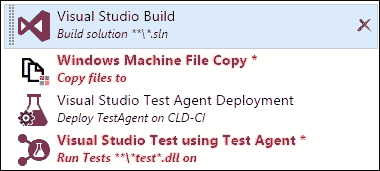
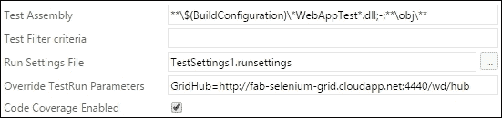
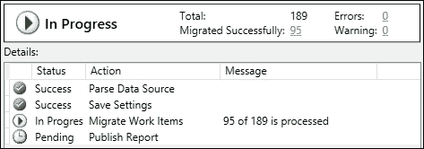
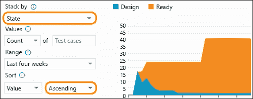

# 第五章：测试您的应用程序

|   | *“在水面上行走和从规范中开发软件很容易……如果两者都被冻结！”* |   |
| --- | --- | --- |
|   | --*Edward Berard* |

本章将涵盖以下内容：

+   在 CI 流水线中使用 TFBuild 运行 NUnit 测试

+   创建和设置机器组

+   通过 TFBuild 任务部署测试代理

+   在实验室机器组中分发测试执行

+   使用 TFBuild 在 Selenium 测试网格上触发 Selenium Web 测试

+   在 TFBuild 中集成云负载测试服务

+   从运行视图分析测试执行结果

+   从 TFS 导出和导入 Excel 中的测试用例

+   复制和克隆测试套件和测试用例

+   从测试中心导出测试工件和测试结果

+   在 Team Portal 的仪表板上绘制测试状态图表

# 介绍

软件团队时刻面临着交付更多、更快的压力。最终用户期望软件能正常工作。低质量的软件是不可接受的。但你可能会问，什么才是正确的质量标准呢？质量是一个非常主观的概念；因此，团队需要就其软件的质量标准达成一致。无法定义质量的团队通常会以覆盖率为测试目标，而非关注质量本身。

Team Foundation Server 中的工具包提供了手动和自动化测试的工具。**Microsoft Test Manager**（**MTM**），首次在 TFS 2010 中引入，使测试人员能够计划、跟踪和运行手动、探索性以及自动化测试。尽管 Test Manager 与 TFS 完全集成，但它并未与其他测试平台进行集成。Test Manager 的架构不支持扩展性。微软有支持每个开发者和每个应用的宏大目标；然而，无法在非 Windows 平台上运行的工具无法实现这一目标。测试工具正在逐步从 Test Manager 客户端迁移到基于 Web 的 Team Web Portal，以实现扩展性、跨平台可用性和与其他测试平台的集成。以下截图展示了测试中心中已经具备的测试功能、将逐步迁移的功能以及将保留在 MTM 中的功能。要查看所有功能的完整比较，请从课程材料中下载 `Microsoft Test Manager Vs Test Hub Feature Comparison.png`：


为了加快软件交付周期，软件测试需要融入到**持续集成**（**CI**）流水线中。为此，软件测试需要在开发过程中向左移动。**测试驱动开发**（**TDD**）使得开发人员能够编写可维护、灵活且易于扩展的代码。由单元测试支持的代码有助于识别变更的影响，并使开发人员能够自信地进行修改。除此之外，功能测试需要实现自动化。这使得软件测试人员能够专注于高价值的探索性测试，而不仅仅是覆盖测试矩阵。

DevOps 运动整体上支持将测试引入 CI 管道。TFS 中的工具已发展到支持这一点。2015 年之前的 TFS 版本配有独立的测试控制器和测试代理，而在 TFS 2015 中引入的新构建框架将测试运行器简化为构建定义中的一个任务。TFS 现在提供基于任务的开放和可扩展构建框架，不仅允许你选择自己喜欢的构建框架，还可以完全自主选择并组合你喜欢的测试框架。新的构建系统使代理成为一个通用的任务协调器，代理能够执行整个 CI 管道。这种新方法消除了管理多个单一用途代理的需求，减少了设置过程中的摩擦，并在无需繁琐配置的情况下提供了扩展选项。这还使得将其他测试框架和平台集成到同一管道中成为可能：


通过本章中的教程，你将学习如何利用构建定义中的任务按需配置测试代理，执行分布式测试，涵盖大量不同的自动化测试，如单元测试、功能性 UI 测试、Selenium 测试和远程机器组上的编码 UI 测试。我们还将探讨如何与 Visual Studio Team Systems 集成，运行云负载测试。最后，我们将查看来自测试执行的丰富测试报告和测试结果分析。

观察 TFS 中更大范围的 DevOps 能力所提供的丰富测试功能；如果你决定从现有的测试用例管理解决方案迁移到 Microsoft Test Manager，你可能会想知道迁移的可能性。我们将简要介绍几种今天可用的工具，帮助你完成迁移。最后，我们将探讨如何借助轻量级图表导出并可视化测试执行结果。

除了为手动和自动化测试人员提供世界级的工具外，TFS 还为利益相关者提供了丰富的集成测试工具。基于 Web 的测试扩展允许你直接从浏览器中对 Web 或移动应用程序进行探索性测试，支持任何平台（Windows、Mac 或 Linux）。你的利益相关者现在无需遵循预定义的测试用例或测试步骤。利益相关者可以捕捉并注释截图、记录 Bug 并共享笔记。测试会话记录并记录每一步，为开发人员提供丰富的操作日志，用于诊断应用程序和用户体验问题。阅读更多内容，请访问[`bit.ly/1I82pfK`](http://bit.ly/1I82pfK)。

这些投资正在将测试工具从优秀提升到卓越。现在正是测试领域一个令人兴奋的时刻！

# 在 CI 管道中使用 TFBuild 运行 NUnit 测试

传统上，使用 NUnit 框架的开发人员需要在构建机器上安装 NUnit 测试适配器。如果构建服务器数量较少，这种方法是可行的，但当构建服务器数量较多时，就会变得非常繁琐。除了安装 NUnit 适配器，还可以通过在构建控制器属性中使用自定义程序集字段，将 NUnit 适配器的 DLL 注入到构建机器中。这种方法在基于 TFVC 的代码库中有效，但在使用 Git 仓库时会遇到一些挑战。这是使用非 Microsoft 测试框架时常见的配置地狱的例子。

新的构建框架使得运行非 Microsoft 单元测试框架变得完全无需配置。在这个食谱中，你将学习如何在构建定义中使用 Visual Studio 测试任务来运行 NUnit 测试，或者一般地运行任何非 Microsoft 单元测试框架。

## 准备工作

为了创建构建定义，你需要是项目构建管理员组的成员。

## 如何操作...

1.  启动 Team Explorer 并连接到 FarbikamTFVC 团队项目。从源代码管理资源管理器中，打开 `FabrikamFiber.CallCenter.sln` 文件：

1.  按照[`bit.ly/1XgG0UG`](http://bit.ly/1XgG0UG)的说明创建一个新的 NUnit 测试项目。将项目命名为 `FabrikamFiber.Web.NUnit.Tests.csproj`。

1.  右键点击 `FabrikamFiber.Web.NUnit.Tests.csproj` 项目，从上下文菜单中选择 **管理 NuGet 包...**：

1.  从 NuGet 包管理器中搜索并安装 NUnit 测试适配器。

1.  打开解决方案的文件夹位置，你会注意到 `NUnitTestAdapter NuGet` 包已经添加到包文件夹中：

1.  在 Team Explorer 的 **待处理更改** 视图中检查代码更改：

1.  在 FabrikamTFVC 团队 Web 门户中，导航到 **BUILD** 中心，点击 **+** 图标以添加一个新的构建定义。使用 Visual Studio 构建模板创建：

1.  在 Visual Studio 构建任务中，确保选中 **恢复 NuGet 包** 标志。你无需在构建或测试任务中做任何其他更改。确保代码仓库在仓库标签页中映射为 FabrikamTFVC。将构建定义保存为 `FabrikamTFVC NUnit CI`。你可以在 *TFBuild 中创建持续集成构建定义* 这一食谱中，详细了解如何设置构建定义，第四章，*构建你的应用*。

1.  排队构建。构建完成后，你将在构建摘要部分看到测试结果的摘要。构建成功执行了所有 NUnit 测试，且无需针对 NUnit 进行任何手动配置：

## 工作原理

现在我们来了解一下 TFBuild 如何识别 NUnit 测试的测试运行器。打开 FabrikamTFVC 的 NUnit CI 构建定义。在 Visual Studio 测试任务的 **高级** 部分，你会看到一个用于指定自定义适配器路径的字段：


在 Visual Studio 构建任务中选中恢复 NuGet 包标志后，解决方案依赖的所有 NuGet 包将被下载到代理的工作目录中。Visual Studio 测试任务会扫描代理的工作目录，查找所有的测试适配器包。在这个例子中，NUnit 测试适配器的 NuGet 包已提交到源代码管理中。在包恢复过程中，这个包会被恢复到代理的工作目录中；因此，Visual Studio 测试任务在扫描时加载了 NUnit 测试适配器。

### 注意

TFBuild 将测试和覆盖率结果发布到 TFS，无论使用的测试框架是什么。这一过程由 TFBuild 框架自动处理。

这种方法非常适合扩展，因为随着你增加更多机器进行测试，不需要担心手动将 NUnit 测试适配器添加到测试机器上。这也简化了测试适配器的升级。测试任务可以加载一个测试适配器的多个版本，并使用单元测试引用的适配器。

**自定义测试适配器路径**字段在这种情况下并未实际使用。然而，如果你的解决方案使用的单元测试框架没有关联的 NuGet 包，那么这个字段非常有用，用于指定测试适配器的路径。测试适配器的路径需要通过构建代理的源目录变量来构建。`Build.SourceDirectory` 变量指向构建代理中源代码已同步的目录。如果你的自定义测试适配器位于 `$\FabrikamTFVC\myAdapters` 文件夹中，你需要指定路径：`$(Build.SourcesDirectory)\src\myAdapters\TestAdapter.1.2`。

# 创建和设置机器组

简单来说，机器组是机器的逻辑分组。机器组保存了组内机器的元数据、连接信息和登录详细信息。机器组可以直接在构建和发布定义中引用。在这个教程中，你将学习如何创建和设置机器组。

## 准备工作

场景：FabrikamTFVC 团队在 `Fabrikam.lab` 域中有一个实验环境。`Fabrikam.lab` 包括五台具有不同角色的服务器。FabrikamTFVC 团队希望能够直接从构建定义和发布定义中引用这些机器，以便在所有机器上部署测试代理并触发分布式测试运行。`Fabrikam.Lab` 由 Fabrikam 环境团队管理，后者不能与 FabrikamTFVC 团队共享环境凭据。在本食谱中，我们将演示 Fabrikam 环境团队为 FabrikamTFVC 团队设置和配置机器组 `Fabrikam-QA` 的过程：


机器组将被远程主机访问；远程主机很可能扮演构建代理或发布代理的角色。如以下图所示，远程主机与机器组处于同一网络，并与机器组建立了信任关系：


构建代理使用 Windows PowerShell 远程管理，这需要**Windows 远程管理**（**WinRM**）协议来连接到机器组中的机器。WinRM 必须在机器上启用，才能作为前提条件将其添加到机器组中。在这种情况下，Kerberos 将作为认证模式使用，因为代理和机器组在同一企业网络中。

| **目标机器状态** | 目标机器与自动化代理的信任关系 | 机器身份 | 认证账户 | 认证模式 | 认证账户在目标机器上的权限 | 连接类型 |
| --- | --- | --- | --- | --- | --- | --- |
| **在企业网络中的域加入机器** | 受信任 | DNS 名称 | 域账户 | Kerberos | 机器管理员 | WinRMHTTP |

在接下来的几个步骤中，我们将演示如何在一台机器上配置 WinRM，并且你将学习如何通过 WinRM 测试连接性：

1.  PowerShell 2.0 和 Windows 管理框架 4.0 ([`bit.ly/1kNlxuW`](http://bit.ly/1kNlxuW)) 需要在代理和机器组中的所有机器上安装。

1.  登录到 `QA-Web1.Farbikam.lab` 机器，右键点击 Windows PowerShell 快捷方式并选择**以管理员身份运行**启动 Windows PowerShell。

1.  默认情况下，WinRM 服务配置为手动启动并已停止。执行 `winrmquickconfig -q` 命令会执行一系列操作：

    1.  启动 WinRM 服务。

    1.  将 WinRM 服务的启动类型设置为**自动**。

    1.  创建一个监听器，以便接受任何 IP 地址上的请求。

    1.  为 WS-Management 通信启用防火墙例外。

    1.  如果尚未注册，注册 `Microsoft.PowerShell` 和 `Microsoft.PowerShell.Workflow` 会话配置。

    1.  如果尚未注册，在 64 位计算机上注册 `Microsoft.PowerShell32` 会话配置。

    1.  启用所有会话配置。

    1.  更改所有会话配置的安全描述符，以允许远程访问。

    1.  重启 WinRM 服务使前述更改生效。

1.  接下来的几条命令将为 WinRM 准备 Kerberos 认证。

1.  增加每个会话的最大内存分配：

    ```
    winrm set winrm/config/winrs '@{MaxMemoryPerShellMB="300"}'

    ```

1.  接下来，增加会话超时时间：

    ```
    winrm set winrm/config '@{MaxTimeoutms="1800000"}'

    ```

1.  允许代理和机器组之间的流量不加密：

    ```
    winrm set winrm/config/service '@{AllowUnencrypted="true"}'

    ```

1.  禁用基本认证：

    ```
    winrm set winrm/config/service/auth '@{Basic="false"}'

    ```

1.  设置防火墙例外，允许端口`5985`的传入流量；这是 WinRM 在使用 HTTP 时的默认端口：

    ```
    netshadvfirewall firewall set rule name="Windows Remote Management (HTTP-In)" profile=public protocol=tcplocalport=5985 remoteip=localsubnet new remoteip=any

    ```

1.  禁用客户端认证的摘要：

    ```
    winrm set winrm/config/client/auth '@{Digest="false"}'

    ```

1.  设置服务认证使用 Kerberos：

    ```
    winrm set winrm/config/service/auth '@{Kerberos="true"}'

    ```

1.  信任代理和机器组之间的所有连接：

    ```
    winrm set winrm/config/client '@{TrustedHosts="*"}'
    Set-Item WSMan:\localhost\Client\TrustedHosts *

    ```

1.  重启`win-rm`服务：

    ```
    Restart-Service winrm–Force

    ```

1.  为确保启用 Kerberos 认证，请运行以下命令：

    ```
    winrm get winrm/config/service/auth 

    ```

    

1.  现在，让我们验证是否在`QA-Web1.Fabrikam.lab`上正确设置了 WinRM。登录到实验室中的另一台虚拟机，这里以`QA-Web2.Fabrikam.lab`为例。右键点击 Windows PowerShell 快捷方式并选择**以管理员身份运行**来启动 PowerShell。执行以下命令：

    ```
    Test-Wsman –computerName QA-Web1.Fabrikam.lab

    ```

    

1.  执行以下命令以检查 WinRM 监听的端口：

    ```
    winrm e winrm/config/listener

    ```

    

    ### 注意

    如果你想更改 WinRM 当前配置的监听端口，请执行以下命令：

    ```
    Set-Item WSMan:\localhost\listener\*\Port 8888

    ```

1.  最重要的是，验证你是否能够通过从`QA-Web2.Fabrikam.lab`手动运行以下命令来启动`QA-Web1.Fabrikam.lab`上的 Pssession。一旦你执行第一条语句，你将被提示输入凭据。输入具有管理员权限的域账户：

    ```
    $cred = get-credential

    ```

1.  执行下一条命令将使用你的域账户连接到目标服务器；DNS 将用于解析目标名称：

    ```
    Enter-Pssession -ComputerNameQA-Web1.Fabrikam.lab–Credential $cred

    ```

    

1.  按照步骤 1 到 5 在实验室中的其他机器上配置 WinRM。按照步骤 6 验证 WinRM 连接性后再继续。

## 如何操作...

1.  进入 FabrikamTFVC 团队 Web 门户的测试中心，在**机器**页面上，点击**+**图标创建一个新的机器组：

1.  按照以下截图中的内容输入详细信息：

1.  由于远程机器与`Fabrikam.lab.Add`建立了信任关系，因此`Fabrikam.lab`中的 WinRM 协议将使用 HTTP，并且所有机器的详细信息。现在，点击**完成**以完成设置：

## 它是如何工作的...

Fabrikam-QA 机器组的设置为所有机器使用统一的管理员凭据。也可以为机器组中每台独立的机器指定不同的凭据：

1.  要为每台机器输入凭据，请勾选**为每台机器使用自定义凭据并结合全局凭据**。

1.  密码字段在用户界面中被隐藏。此外，该字段的值也不会打印在任何日志文件中。

1.  标签为查询机器提供了一个很好的方式。在构建定义中使用测试代理部署任务时，你可以指定机器组，并使用标签来过滤包含标签的机器执行操作。

1.  目前，机器组仅支持有限的场景，主要包括本地域加入的机器和 Azure 中的独立机器。请参考 [`bit.ly/1NFqYma`](http://bit.ly/1NFqYma) 获取完整的支持场景列表。

# 通过 TFBuild 任务部署测试代理

在 TFS 的早期版本中，测试控制器和代理通常作为单独的安装程序发布。虽然这些安装程序支持无人值守安装，但配置过程需要人工干预。这限制了按需扩展测试代理的能力。在 TFS 2015 中，测试控制器和代理不再作为单独的安装程序发布；相反，测试代理提供的功能已被简化为一个构建任务。在本教程中，你将学习如何在机器组中的多台机器上部署测试代理。

## 准备工作

场景：FabrikamTFVC 团队依赖于黄瓜框架（cucumber），由于黄瓜与构建代理上的现有框架存在冲突，无法在构建代理上安装。因此，FabrikamTFVC 团队希望将测试代理部署到 `QA-App1.Fabrikam.lab` 服务器上。该服务器已经是 Fabrikam-QA 机器组的一部分：


在本教程中，我们将使用 Fabrikam-QA 机器组。如果你尚未设置机器组，请按照教程 *创建并设置机器组* 中的指示操作。

## 如何操作...

1.  导航到 FabrikamTFVC 团队网站中的测试中心，在 **机器** 页面中，编辑 Fabrikam-QA 机器组。为机器 `QA-App1.Fabrikam.lab` 添加标签 `Framework: Cucumber` 并保存。

1.  导航到构建中心，使用空构建模板创建一个新的构建定义。确保在代码仓库标签中将仓库映射为 FabrikamTFVC。然后从测试部分添加 **Visual Studio 测试代理部署** 任务。该任务包括三个部分：配置 Fabrikam-QA 机器组、通过机器名称或标签选择机器，并使用标签 `Framework:Cucumber` 过滤机器：

1.  **代理配置**部分接受凭据，并且一旦安装，测试代理服务将以此身份运行。从**变量**选项卡创建测试代理的用户名和密码变量。将变量添加到**代理配置**部分。选中**交互式进程**选项以将代理作为交互式进程运行。如果没有请求将其作为交互式进程运行，则代理将作为 Windows 服务安装：

1.  **高级**部分允许你指定测试代理安装程序的位置。如果你想控制安装代理的版本，这非常有用。如果没有指定位置，将从 Internet 下载最新版本的测试代理。勾选启用数据收集选项：

1.  将构建定义保存为`FabrikamTFVC Agent Deployment`。从该构建定义排队一个新构建。构建完成后，导航到 `QA-App1.Fabrikam.lab` 服务器。测试代理已成功作为 Windows 服务安装。

## 它是如何工作的...

1.  构建代理从 Internet 下载测试代理安装程序到一个 `temp` 位置。然后将安装程序推送到远程 `QA-App1.Fabrikam.lab` 计算机进行安装：

1.  代理程序作为 Windows 服务安装在机器组中的计算机上：

# 在实验室机器组中分发测试执行

本章前面你学到了如何创建机器组并在机器组中的选定计算机上部署测试代理。TFBuild 框架提供了一个任务，用于将测试执行分发到多个测试代理。在这个配方中，你将学习如何触发跨多个测试运行器部署的测试农场进行分布式测试运行。

## 准备工作

场景：FabrikamTFVC 团队有超过 2,000 个自动化的代码 UI 测试，需要作为功能测试工作流的一部分执行。FabrikamTFVC 团队希望能够并行化测试执行。为此，团队希望将 Visual Studio 测试代理部署到 Fabrikam-QA 机器组中的所有计算机，然后通过在测试程序集级别分发测试执行来实现并行化：


在这个配方中，你将使用 Fabrikam-QA 机器组。如果你还没有设置机器组，按照 *创建和设置机器组* 配方中的说明操作。由于测试代理需要作为先决条件部署，才能分发测试，请按照 *通过 TFBuild 任务部署测试代理* 配方中的步骤操作，了解如何使用 TFBuild 在机器组中部署测试代理。

## 如何操作…

1.  在 FabrikamTFVC 团队 Web 门户中导航到构建中心，点击**编辑**以在编辑模式下打开 `FabrikamTFVC Agent Deployment`。

1.  点击**+**添加一个构建步骤，然后在**添加任务**窗口中，选择**构建**标签并添加 Visual Studio 构建任务。这个任务将用于编译测试项目：

1.  在**部署**标签下，添加**Windows 机器文件复制**任务。此任务将把测试程序集复制到需要执行测试的机器上：

1.  在**测试**标签下，添加**使用测试代理的 Visual Studio 测试**任务。这个任务将用于管理测试代理群组中的测试分发：

1.  点击关闭图标以关闭**添加任务**窗口。构建定义中的任务需要按照以下顺序排列：

1.  配置 Visual Studio 构建任务，以构建功能测试所涉及的解决方案：

1.  配置 Windows 机器文件复制任务，将测试程序集复制到机器组中机器上的目录中。建议使用配置变量将测试位置参数化。可以使用预配置的构建变量来构造需要复制的程序集路径，这些程序集位于构建代理的工作文件夹中。如果勾选了**清理目标**标志，构建引擎将在复制新文件之前删除目标文件夹中的内容。此任务的高级部分还包括一个启用并行复制文件的标志，可以使用此标志允许构建系统并行复制机器组中的机器上的二进制文件：

1.  不需要对 Visual Studio 测试代理部署任务进行更改。*通过 TFBuild 任务部署测试代理*配方中设置的配置将会在机器组中的所有机器上执行测试代理部署。使用测试代理的 Visual Studio 测试任务应紧随其后。选择 Fabrikam-QA 机器组作为目标机器组，在该机器组上执行测试。此外，还需要指定测试二进制文件的位置、测试程序集的模式、配置和测试执行的平台。在**高级**部分勾选代码覆盖率标志。你可以通过**覆盖测试运行参数**字段注入测试设置文件，选择性地覆盖测试设置文件中的配置：

1.  保存对构建定义的更改并排队新的构建。一旦构建完成，导航到构建摘要页面；使用测试代理的 Visual Studio 测试步骤的日志会显示测试分发的详细信息：

## 它是如何工作的…

让我们通过构建摘要中的测试代理任务查看 Visual Studio 测试的日志文件。如上图所示，测试 DLL 已经分发到组中的多个测试代理。分发是基于 DLL 而不是测试级别进行的。如果你的测试分布在多个项目中，这种 DLL 级别的分发可以显著减少执行时间，因为每个 DLL 都会分发到测试代理进行执行。

还值得注意的是，Windows 机器文件复制任务成功地将文件从代理工作目录移动到机器组中的`C:\Fabrikam\FunctionalTests\$(Build.BuildNumber)`文件夹：


你将在第六章，*发布你的应用*中了解更多关于 Windows 机器文件复制任务的内容，因为它将在发布管理中广泛用于部署。

# 使用 TFBuild 在 Selenium 测试网格上触发 Selenium Web 测试

如果你的软件需要支持多个设备和浏览器，测试成本可能会显著增加。客户端脚本框架和响应式设计技术的兴起使得每个浏览器提供独特的沉浸式用户体验。随着设备和浏览器矩阵的迅速增加，几乎不可能通过手动测试覆盖所有矩阵。现在有许多商业和开源工具可以帮助开发测试自动化。Selenium 可能是最广泛使用的开源解决方案。TFS 与开源工具的结合效果更佳。在本教程中，你将学习如何通过 TFBuild 执行 Selenium 测试。

## 准备就绪

场景：FabrikamGit 团队使用 Selenium 自动化了功能测试。现在，团队希望通过在 Chrome、Firefox 和 Internet Explorer 中运行测试来验证功能。FabrikamGit 团队希望通过 TFBuild 触发这些测试在 Selenium 网格上执行。


请按照[`bit.ly/1PSjfWy`](http://bit.ly/1PSjfWy)中的博客文章中的说明，在 Windows 机器上设置 Selenium 网格。为了本教程的目的，我们将按照一个简单的设置，在同一台机器上同时运行 Selenium Hub 和 Node：


本书提供的课程材料包括一个 Selenium 测试项目。下载`SeleniumHelloWorld.zip`文件夹；或者，你也可以使用自己的 Selenium 测试项目。将`Selenium.Web.Test.sln`提交并发布到 FabrikamGit 仓库的主分支：


更多关于如何提交并发布更改到 Git 仓库的信息，请参阅第二章的介绍部分，*设置与管理代码仓库*。SeleniumHQ 网站（[`bit.ly/1YmqRDJ`](http://bit.ly/1YmqRDJ)）提供了很棒的 C#教程，帮助编写 Selenium 测试。

## 如何操作…

1.  在 FabrikamGit 团队 Web 门户中，导航到**构建**中心。点击**+**图标以添加新的构建定义。选择 Visual Studio 构建模板并点击**创建**。在构建定义中导航到**仓库**选项卡，并将仓库映射到 FabrikamGit 仓库的主分支：

1.  在构建定义中，导航到**构建**选项卡，选择**Visual Studio 构建**任务。设置包含 Selenium 测试项目的解决方案名称。确保勾选了**恢复 NuGet 包**标志：

1.  选择 Visual Studio 测试任务，输入测试设置文件的路径，并通过**覆盖 TestRun 参数**字段注入 Selenium 网格的 URL：

1.  将构建定义保存为`FabrikamGitSelenium`。为此定义排队新的构建。构建执行完成后，您可以在构建摘要视图中查看测试结果：

## 它是如何工作的…

让我们从理解为什么 Selenium 网格 URL 通过**覆盖 TestRun 参数**字段被注入到 Visual Studio 测试任务开始。解决方案包含 Selenium 测试项目和`Run`设置文件。这是一个配置文件，保存了测试项目使用的测试设置。新的构建系统提供了通过**覆盖 TestRun 参数**字段直接传递值来覆盖`Test`设置文件中的值的能力，在这种特定情况下，是`SeleniumTestGridURL`的值。这个值被 Selenium 测试用来执行测试：


接下来，让我们查看此任务的构建执行日志文件；该文件提供了测试执行的清晰总结、持续时间和结果发布的更新：


最后但同样重要的是，TFBuild 系统会自动处理将测试结果发布回 TFS 的过程，无论使用的是哪种测试框架：


正如您在前面的截图中看到的，Selenium 测试项目的执行结果可以直接在构建摘要部分查看。

# 在 TFBuild 中集成云负载测试服务

> *“Amazon 的测试揭示：每增加 100 毫秒的加载时间，Amazon.com 的销售额就下降 1%（Kohavi 和 Longbotham 2007 年）。”*

性能测试不能是事后考虑！成熟的软件团队会在开发生命周期的早期进行性能测试。进行性能测试的最大障碍是需要大量基础设施来为应用程序生成足够的负载，而这些基础设施的成本高且利用率低。如今，许多按需付费的云负载测试服务已经可用。微软还提供了与 Visual Studio 团队服务（VSTS）集成的负载测试服务。每个 VSTS 账户每月都会获得 20,000 个虚拟用户分钟的负载测试配额，免费提供。在本教程中，您将学习如何将 VSTS 云负载测试服务集成到 TFS 中的 CI 流水线。

## 准备就绪

Visual Studio 团队服务对于最多五人的团队是免费的。您可以在[`bit.ly/1lANwhA`](http://bit.ly/1lANwhA)上创建一个免费账户。在本教程中，我们将使用账户[`tfs2015cookbook.visualstudio.com`](https://tfs2015cookbook.visualstudio.com)。

为了使 TFS 能够使用您的身份与 VSTS 账户进行身份验证，您需要在 VSTS 账户中生成一个个人访问令牌。请按照[`bit.ly/1I3kzVk`](http://bit.ly/1I3kzVk)上的说明生成个人访问令牌。

现在我们已经在 VSTS 中拥有了云负载测试服务和个人访问令牌，接下来需要将云负载测试服务作为端点添加到 TFS 中。添加 TFS 中的端点需要您拥有**编辑项目级别信息**的权限。您可以通过被添加到团队项目管理员组来获得此权限。请按照此处的说明，将云负载测试服务端点添加到 TFS。

导航到 FabrikamTFVC 团队管理控制台。在**服务**标签页中，点击**+**图标添加一个新端点。选择**通用**端点选项，并按照下图填写详细信息。将端点命名为`CLD-VSTS`。


## 如何操作…

1.  导航到 FabrikamTFVC 团队 Web 门户中的**构建**中心。编辑 FabrikamTFVC CI 构建定义。

1.  点击**+**图标，启动**添加新任务**窗口。在**测试**标签页中，选择并添加**基于云的 Web 性能测试**任务：

1.  云负载测试服务作为通用端点被添加到 Fabrikam 团队管理控制台。从注册连接下拉菜单中选择`CLD-VSTS`端点。输入您希望进行测试的端点。指定生成负载的位置：

1.  点击**保存**并触发队列一个新的构建。构建执行完成后，负载测试执行的结果将作为构建结果的一部分提供：

## 它是如何工作的…

你可以通过简单的配置开始对你的应用程序进行负载测试。入门非常容易，而且可以利用你 VSTS 账户中可用的免费云负载测试虚拟用户分钟。TFBuild 还包括一个基于云的负载测试任务，允许你运行多步骤的性能测试。

# 从运行视图分析测试执行结果

在 Team Foundation Server 2015 中，手动和自动化测试的执行结果都显示在**运行**页面中。该页面是 Team Web Portal 中的**测试**中心的新添加功能。**运行**页面为使用任何框架执行的测试提供了统一的分析体验。在本教程中，你将学习如何在 Team Web Portal 的**运行**视图中分析和处理测试执行结果。

## 如何操作...

1.  进入**测试**中心，点击**运行**以加载**运行**页面。**运行**页面显示了最近的测试运行。你可以一眼看到测试执行状态、测试配置、构建号、失败测试的数量和通过率：

1.  点击**过滤器**标签，进入**过滤器**视图。默认查询会显示过去 7 天的测试运行记录。修改并添加新的条件，以仅显示今天的自动化测试运行：

1.  查询将测试执行结果缩小为仅显示一次运行：

1.  双击测试运行 ID 以打开测试运行进行分析。此视图显示运行摘要，并通过图表可视化按属性、特征、配置、失败类型和解决方案来展示测试结果。与测试运行相关的任何附件也可以在此视图中查看：

1.  点击**测试结果**标签，查看此测试运行中执行的所有测试的列表。在 TFS 2015 之前，你需要下载 TRX 文件并在 Visual Studio 中打开它才能获取这些信息。这个视图提供了下一层的详细信息，包括测试执行时长和失败的错误消息：

1.  选择多个测试并点击**创建 Bug**来创建一个 Bug 类型的工作项。点击**更新分析**可以向测试结果添加评论。你还可以双击某个测试，进入该测试执行的更详细信息：

## 工作原理...

此功能为你提供了统一的测试分析体验，无论你选择使用何种框架执行测试。总的来说，你可以查询团队项目中所有可用的测试运行，深入查看特定测试运行，获取该运行的摘要视图，使用图表可视化测试运行，查询/筛选某次运行中的测试结果，深入查看特定测试结果，下载附件，最后但同样重要的是，分析测试失败并提交 Bug。

# 从 TFS 中导出和导入 Excel 格式的测试用例

虽然可以从 Microsoft Test Manager 和 Team Web Access 访问 TFS 中的测试用例，但你可能仍然会发现利益相关者希望从 Excel 中访问测试用例。作为偏好，部分利益相关者可能会觉得在 Excel 中记录测试用例更为方便。尽管 TFS 没有提供开箱即用的功能来导出和导入 Excel 格式的测试用例，但它提供了一个良好的**软件开发工具包**（**SDK**），可以用来创建工具以实现此类功能。在本教程中，你将学习如何使用“测试用例导出到 Excel”和“测试用例迁移 Plus（开源社区工具）”将测试用例导出到 Excel，并将测试用例从 Excel 导入到 TFS。

## 准备工作

下载并安装以下工具到你的机器上：

+   **测试用例** **导出工具**：[`tfstestcaseexporttoexcel.codeplex.com`](https://tfstestcaseexporttoexcel.codeplex.com)

+   **测试用例** **导入工具**：[`tcmimport.codeplex.com`](http://tcmimport.codeplex.com)

### 注意

安装这些工具需要提升权限。安装这些工具的机器需要安装 Excel 版本。无需在 TFS 应用程序层安装这些工具。

## 如何操作…

### 从 TFS 导出测试用例

1.  启动**测试用例导出**工具时，你将被提示连接到 TFS。连接后，你将看到与该计划相关联的测试计划和测试套件列表。选择测试套件和导出文件位置，并填写导出的输出位置和文件名，如下图所示：

1.  导出过程为你提供以下选项：

1.  选择**将每个测试套件导出到单独的工作表**选项，以将每个测试套件导出到一个单独的工作表。在上面的示例中，回归包、支付和网站将被导出到工作簿中的三个单独的工作表。

1.  导出完成后，打开导出位置的电子表格以查看导出的结果。

### 从 TFS 导入测试用例

1.  启动**测试用例迁移 Plus**工具以启动测试用例导入向导。

1.  从**源**选项卡中选择数据源。输入格式可以是**Excel 工作簿**或**MHT/Word**。在本教程中，我们将使用输入源格式为**Excel 工作簿**。输入输出文件夹位置。一旦工作簿被解析，你将看到选定工作表中的列列表。点击**下一步**以配置**目标**设置：

1.  从**目标**标签页，输入目标详细信息，如团队项目和工作项类型，以便将测试用例导入。 从**设置**标签页，选择创建一个新的设置文件，并点击**下一步**按钮（设置文件将保存您的选择，以供未来的导入使用）。 从**字段**映射标签页，将电子表格中的列映射到工作项。例如，电子表格中的**标题**字段映射到工作项的标题字段。

1.  从**链接映射**标签页，您可以选择启用工作项之间的链接，使用**其他**标签页指定如何从源 Excel 文件读取数据。点击**保存并迁移**以根据通过向导配置的设置开始迁移过程。这将触发导入过程；更新进度将在用户界面上显示：

1.  一旦导入完成，通过点击**关闭**图标按钮退出向导。导入工具会处理工作表并在与源工作表相同的位置生成报告。导入设置文件也会在相同的位置生成。该导入设置文件存储在导入过程中指定的设置。该设置文件可以用于将来的导入：

1.  打开`Report.xls`文件，所有成功导入的测试用例将列在**已通过**表中。任何在导入过程中出现问题的测试用例将列在警告表中，而任何无法导入的测试用例将列在失败表中。

1.  要查看导入的测试结果，请导航到 Team Web Portal 中的 FabrikamTest 中心。您将看到新的计划出现在测试计划下拉菜单中。以下截图展示了 Team Web Portal 中的测试套件和一个链接的测试用例：

## 它是如何工作的…

这绝不是一个测试用例迁移解决方案，但值得指出的是，如果您使用支持将测试用例提取到 Excel 的其他测试用例管理工具，您可以使用这些工具将工件导入到 TFS 中。

## 还有更多内容

既然我们谈到测试套件，值得强调的是，TFS 2015 现在支持将多个人分配给一个测试套件。您可以通过右键点击测试中心中的测试套件，并从上下文菜单中选择**分配人员**来启用此功能。如以下截图所示，新表单允许将多个测试人员分配给测试套件：


这将遍历测试套件，并为每个人创建测试用例。一个包含测试用例链接的电子邮件将发送给个人。这是让多个个人使用相同测试套件进行测试的好方法，同时您还可以单独跟踪每个个人的测试活动。

# 复制和克隆测试套件及测试用例

TFS 提供了两种用于测试套件和测试用例的复制操作，即**复制**和**克隆**。复制使用一种叫做浅拷贝的机制，它只是创建对工件的引用。如果对工件进行了任何修改，这些修改将反映到所有引用中。克隆使用深拷贝机制；新工件没有指向原始工件的引用，并且不会受到对原始工件所做更新的影响。使用浅拷贝的常见场景是在多个迭代中使用相同脚本进行测试。另一方面，使用深拷贝的常见场景是通过复制多个现有的测试套件和测试用例来创建回归测试脚本。在这个教程中，你将学习如何使用复制和克隆功能。

## 准备工作

在这个教程中，我们将使用 Microsoft 测试管理器。Microsoft 测试管理器随 Visual Studio 企业版或 Visual Studio 测试专业版一起安装。启动 Microsoft 测试管理器并连接到 FabrikamTFVC 团队项目。

## 如何操作…

### 复制（浅拷贝）

1.  在 Microsoft 测试管理器中，从**计划**选项卡中，选择一个静态测试套件来存放新副本。

1.  从工具栏中，点击**通过引用现有测试用例创建测试套件**按钮。

1.  在对话框中，选择你想要复制的测试计划和测试套件，然后点击**创建套件**。

### 克隆（深拷贝）

1.  在 Microsoft 测试管理器中，从**组织**选项卡中，选择一个测试计划。

1.  从工具栏中，点击**克隆**按钮。

1.  在对话框中，选择一个或多个你想要克隆的测试套件。你也可以选择克隆与所选测试套件关联的需求。

1.  输入目标测试计划的名称，并设置相关的区域路径和迭代路径。

1.  接下来，点击**克隆**按钮触发克隆操作。克隆日志将显示克隆过程的更新信息。

    ### 注意

    克隆测试用例在团队项目之间是支持的，但仅限于同一个团队项目集合内。

你还可以使用 `tcm.exe` 的 `/clone` 参数通过命令行克隆测试用例和测试套件。在以下示例中，你会注意到使用了 `/clone` 参数来克隆需求。目标中的区域路径和迭代路径字段的值将被指定的值覆盖：

```
tcm suites /clone /collection:http://tfs2015:8080/tfs/DefaultCollection
   /teamproject:FabrikamTFVC /destinationteamproject:FabrikamGit
   /clonerequirements
   /suiteid:234 /destinationsuiteid:567 
   /overridefield:"Iteration Path"=" FabrikamGit\sprint3"
   /overridefield:"Area Path"=" FabrikamGit\catalog"
```

## 它是如何工作的…

当你克隆一个测试套件时，以下对象会从源测试计划复制到目标测试计划：

| 测试计划对象 | 备注 |
| --- | --- |
| 测试用例 | 每个新测试用例保留其共享步骤。源测试用例和新测试用例之间会建立链接。新测试用例不包含测试运行、缺陷、测试结果和构建信息。 |
| 被克隆测试用例引用的共享步骤 | 所有源测试用例引用的共享步骤将在目标位置的克隆测试用例中保留。 |

| 测试套件 | 以下数据会被保留： |

+   测试套件的名称和层级结构

+   测试用例的顺序

+   分配的测试人员

+   配置

|

| 从克隆的测试用例中链接的操作记录 | 任何操作记录的链接会保留在克隆的测试用例中。 |
| --- | --- |
| 链接和附件 | 源中的任何链接和附件在克隆的测试用例中也可用。 |
| 测试配置 | 测试配置会在目标测试计划中重新应用。 |

# 从测试中心导出测试工件和测试结果

TFS 测试工件包括测试计划、测试套件、测试用例，当然还有测试结果。为了分享和报告，通常需要导出测试工件。在 TFS 2013 的时代，Test Scribe 作为 Visual Studio 扩展工具，是导出这些工件的唯一方式。现在，Test hub 提供了电子邮件或打印测试工件的功能，使你能够轻松与利益相关者分享测试工件。这个功能易于使用，可以在 Team Web Portal 的多个位置触发。在本教程中，你将学习如何从测试中心导出测试工件。

## 如何操作...

1.  浏览到 FabrikamTFVC 团队 Web 访问并进入 **测试** 中心。要在测试计划级别导出，选择测试计划，然后从工具栏中点击 **电子邮件或打印测试工件** 按钮：

1.  要在测试套件级别导出，选择测试套件，打开上下文菜单并选择 **导出** 选项：

1.  无论你选择从测试计划还是测试套件导出，在这两种情况下，你都会得到一个新表单来选择“导出内容的类型”和“导出方式”。在这个表单中，“内容的类型”指的是工件，而“导出方式”指的是电子邮件或打印。以下截图中的几个项目值得注意。**最新测试结果**选项是在更新 1 中新增的，选择此选项还会导出测试结果。选择 **选定的套件及其子项** 会递归导出所选套件的所有子项：

## 操作方式...

点击打印或电子邮件按钮将启动生成提取内容的过程；根据导出的工件的数量和大小，这一过程可能需要几秒钟才能完成。导出完成后，会弹出一个表单，显示导出的预览。你也可以在预览表单中编辑和格式化值。由于我们选择了电子邮件选项，该表单有一个字段，允许我们选择希望将导出内容发送给的电子邮件地址：


如下图所示，导出还包括测试步骤：


## 还有更多内容...

通过修改 TFS 在导出/打印过程中使用的底层模板，可以自定义导出的格式。在自定义模板之前，需注意以下几点：

您应当创建原始模板的备份，例如将其复制并重命名为`TestSuite-Original.xsl`。如果不这样做，在升级 TFS 时，您在`TestSuite.xsl`文件中所做的更改可能会被覆盖。导出不支持按项目进行自定义；样式更改将影响 TFS 实例中的所有项目。

按照此处列出的步骤将贵公司徽标添加到导出中：

1.  登录到 TFS 应用程序层，并导航到以下路径。将贵公司徽标（`companylogo.png`）添加到`C:\Program Files\Microsoft Team Foundation Server 14.0\Application Tier\Web Services\_static\tfs\12\_content`文件夹路径中。

1.  修改`C:\Program Files\Microsoft Team Foundation Server 14.0\Application Tier\Web Services\_tfs_resources\TestManagement\v1.0\Transforms\1033`文件夹中的`TestSuite.xsl`文件。

1.  在记事本中打开`TestSuite.xsl`文件，并添加以下代码行以将贵公司徽标包含到导出模板中：

    ```
    <div style="align:center;">
    
    </div>
    ```

1.  可以通过在 Team Web Portal 的测试中心生成导出，来测试自定义的结果。

# 在 Team Portal 中将测试状态图表化到仪表板

Team Web Portal 中的图表工具提供了一种极好的方式来分析和可视化测试用例执行情况。通过图表工具创建的图表可以固定到自定义仪表板上。图表和仪表板是出色的信息展示工具，可以与团队成员和利益相关者共享测试执行结果。在本教程中，您将学习如何将测试执行结果固定到 Team Portal 中的自定义仪表板上。

## 入门

按照第一章 *Team Project Setup*中“配置团队项目仪表板”部分中的步骤，为测试创建自定义仪表板。

## 如何操作...

1.  导航到 FabrikamTFVC Team Web Portal 中的**Test**中心。**Test Plan**页面为您提供所选测试套件的测试套件列表和测试用例列表。**Charts**标签为您提供了可视化这些信息的极好方式。点击**+**图标并选择**New test result**图表。选择条形图并按**Outcome**分组；这将在条形图中显示测试用例结果。点击**OK**保存图表。右键点击新创建的图表，将图表固定到测试仪表板上：

1.  现在，点击**+**图标并选择**新建测试用例**图表。测试用例图表类型支持趋势图，支持的趋势周期从 7 天到最多 12 个月。选择堆叠区域图类型，并选择按**状态**进行堆叠。这将帮助你可视化测试用例随时间变化的状态。点击“确定”以保存图表，右键单击图表并将其固定到仪表板：

## 它是如何工作的...

这些图表是通过事务数据库中的工作项数据进行计算的。当工作项更新时，图表会立即反映这些更新。要了解更多关于团队门户网站中图表功能的内容，请参考[`bit.ly/1PGP8CU`](http://bit.ly/1PGP8CU)的操作指南。
