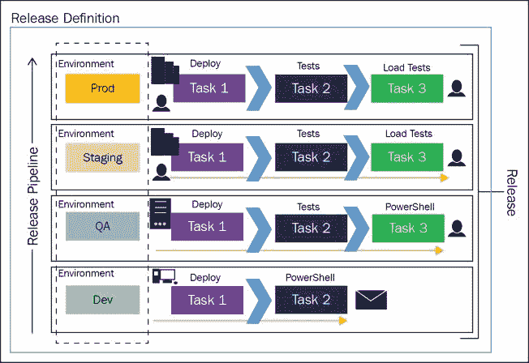
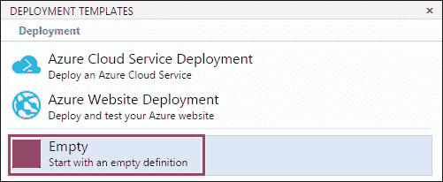
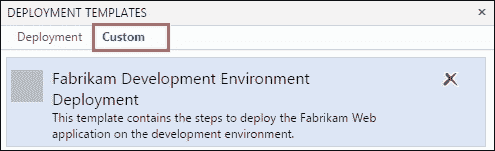

# 第六章：发布您的应用程序

|   | *“持续部署可以被视为持续集成的延伸，旨在最小化交付时间”* |   |
| --- | --- | --- |
|   | --*敏捷联盟* |

在本章中，我们将涵盖以下内容：

+   在团队 Web 门户中创建发布定义

+   将工件映射到发布定义

+   配置发布定义以实现持续部署

+   在发布定义中添加和配置环境

+   配置发布定义的安全性

+   配置发布的全局和本地变量

+   使用发布管理部署 Azure 网站

+   使用发布管理部署 IIS Web 应用程序

+   在发布管理中跟踪发布

# 介绍

迄今为止，在本书中我们讨论了规划、开发、测试和构建软件。软件团队需要数周甚至数月来开发和测试软件；然而，只有当软件到达预定用户手中时，它的价值才能得以体现。发布管理为此提供了支持：

|   | *“发布管理是通过不同的阶段和环境管理、规划、调度和控制软件构建的过程，包括测试和部署软件发布。”* |   |
| --- | --- | --- |
|   | --*维基百科* |

2013 年 6 月 3 日，微软收购了 InCycle 软件公司的 InRelease 产品。InRelease 产品被重新命名为 Microsoft Release Management，并集成到 Team Foundation Server 2013 中。Microsoft Release Manager 让微软在日益增长的发布管理市场中占有一席之地。尽管 Release Manager 与 Team Foundation Server 一起发布，但它需要单独安装和配置。尽管进行了多次改进以增强两者之间的集成，但在某些地方它们依然显得割裂。基于 WPF 的桌面客户端笨重且功能受限。Release Manager 不支持非.NET 应用程序，也无法在非 Windows 平台上使用。显然，Release Manager 仅仅是一个过渡性的解决方案，最终需要被一个更合适的方案取代。

微软最近在 Visual Studio Team Services 中发布了基于 Web 的 Release Management 解决方案。尽管该新解决方案尚未在 Team Foundation Server 2015 Update 1 中发布，但预计将在 TFS 2015 的 Update 2 或 Update 3 中首次亮相。旧版 Release Management 解决方案将不会再进行进一步投资，并将不可避免地被新的基于 Web 的 Release Management 解决方案所取代。鉴于此，本章将完全聚焦于新的基于 Web 的 Release Management 解决方案。要尝试本章中的操作，您需要创建一个 Visual Studio Team Services 账户；请按照[`bit.ly/1N50I7j`](http://bit.ly/1N50I7j)上的说明进行操作。

### 注意

本章中的配方基于新的基于 Web 的发布管理解决方案。预计新的基于 Web 的发布管理解决方案将在 Team Foundation Server 的更新 2 或更新 3 中可用。要尝试本章中的配方，请创建一个 Visual Studio Team Services 账户（[`bit.ly/1N50I7j`](http://bit.ly/1N50I7j)）。

新的基于 Web 的发布管理解决方案与产品非常紧密集成。无需单独安装或配置即可开始使用新的发布管理解决方案。发布管理器的安全基础设施与以前的版本不同，因为它不再管理自己的组和权限。在 VSTS 中为发布管理引入了新的权限，例如**创建发布定义**、**创建发布**和**管理审批人**。这些权限的默认值为 Team 项目级别的特定组设置。然后，这些权限可以被覆盖，适用于特定发布定义或发布定义中的特定环境。

Team 构建和发布管理共享相同的代理池和队列基础设施。统一的代理基础设施减少了管理和设置的开销。用于协调操作的任务也在构建和发布之间共享。这大大减少了发布管理的学习曲线。新的解决方案是基于 Web 的、开放的、可扩展的，并且完全支持跨平台。Team 构建和发布管理之间的底层框架是相同的，因此你在发布管理中得到的实时控制台输出与 Team 构建中的相同。发布定义支持更改修订和类似于构建定义的不同功能。发布管理支持草稿发布，类似于 Team 构建中的草稿构建功能。构建和发布管理之间有如此多的相似之处，唯一的区别是构建还可以访问部署任务，你可能会问，构建和发布管理有何不同？

构建和发布管理之间的界限已经变得模糊，因为两者有很多相似之处。关键的区别在于部署只是发布管理中执行的活动之一。如下面的图所示，新的发布管理解决方案允许创建发布流水线。发布流水线可以包含一个或多个环境。每个环境可以有一个或多个物理或虚拟的部署目标。环境提供了发布前和发布后的审批工作流，以及用于测试和部署的任务：



通过发布管理器部署的软件可以从 Team 构建、Jenkins、Team City、FTP 等注入。通过在发布流水线中的所有环境共享工件，它真正让你做到“构建一次，随处部署”。

为了降低入门门槛，发布管理器提供了开箱即用的部署模板。部署模板添加了在环境中进行某种类型部署所需的任务集。你仍然需要配置这些任务，但预先添加任务可以让你在发布配置中更快起步。该框架还允许你克隆或将已配置的环境保存为模板。再次强调，目的是加速发布配置，并最大限度地在不同发布定义之间重用。发布管理预计将很快通过发布管理 REST API 补充 REST API 库。这将允许你将发布管理集成到组织中使用的其他发布工作流部分，或者在你发现需要的地方扩展发布管理功能。

本章开始时，你将学习新的基于网页的发布管理解决方案中的不同功能；在后续的章节中，我们将介绍适用于 Azure 和本地 Web 应用程序的部署场景。最后但同样重要的是，我们将了解发布管理中可用的发布跟踪和报告功能。

# 在 Team Web Portal 中创建发布定义

在本食谱中，你将学习如何使用空白的部署模板创建一个新的发布定义。你还将了解发布定义中的不同功能。

## 准备就绪

要创建一个新的发布定义，你需要是发布管理员组的成员。这些权限同样适用于项目管理员组。

## 如何操作...

1.  导航到 FabrikamTFVC 团队项目中的**发布**中心：

1.  点击**+**图标以创建一个新的发布定义。这里有预配置的部署模板可以选择。在本食谱中，我们将从**空白**模板开始。与其他模板不同，**空白**模板会创建一个没有任何预先添加任务的空白发布定义：

1.  将发布定义命名为`FabrikamTFVC Web Release`：

1.  导航到**常规**标签，并将发布编号格式从`Release-$(rev:r)`更改为`Rel-$(System.TeamProject)-$(rev:r)`。从此定义生成的发布将具有格式为`Rel-FabrikamTFVC-1`的发布名称：

1.  点击**保存**按钮以保存发布定义。在本食谱中，我们已经创建了一个空白的发布定义。接下来，我们将在*工作原理...*部分逐步介绍发布定义的不同功能。

## 工作原理…

在这个食谱中，我们从一个空的发布模板开始。部署模板窗口提供了一个选项，可以从一个预配置的发布模板开始。预配置的部署模板会为默认环境添加一个环境以及所有必要的发布任务，只需您配置任务即可。如以下截图所示，**Azure 网站部署**模板添加了一个默认环境和两个任务，分别是**Azure Web 应用部署**和**Visual Studio 测试**。从长远来看，您将开始看到更多预配置的部署模板可以直接使用：


现在让我们了解 FabrikamTFVC Web 发布定义中的**环境**选项卡的功能：


+   **添加环境**：这是您的应用需要部署到的服务器集合。点击**添加环境**图标也会打开部署模板窗口。该窗口使您能够添加环境并为该环境部署应用时相关的任务。

+   **默认环境**：这是一个逻辑容器，包含了在该环境中发布应用所需的任务。如以下截图所示，一个环境支持一定的配置级别。我们将在*在发布定义中添加和配置环境*食谱中详细讲解环境支持的功能：

+   **添加任务**：这是发布过程中前往环境的一个步骤。一组预创建的任务已经默认可用。画廊还提供了脚本任务，允许您执行一些预创建任务中可能没有的操作。该框架具有完全的可扩展性；请参考第四章中的*使用 TFBuild 可扩展性框架创建新的构建任务*，了解如何添加您自己的任务。构建和发布中心共享一个公共任务画廊。这使得您可以在发布过程中使用构建过程中使用的任务。随着我们在本章后续的食谱中开始配置任务，您将会学到更多关于任务的内容。

转到**常规**选项卡。此选项卡允许您指定发布名称格式。发布定义的发布名称默认为按顺序编号。第一个发布名为`Release-1`，下一个发布为`Release-2`，以此类推。您可以通过编辑发布名称格式模板来更改此命名方案。该字段支持使用预定义的（如以下表格所列）。您还可以使用自定义变量；我们将在*为发布配置全局和本地变量*食谱中详细介绍变量：

| 变量 | 描述 |
| --- | --- |
| `Rev:rr` | 一个自动递增的数字，至少包含指定数量的数字。 |
| `Date`/`Date:MMddyy` | 当前日期，默认格式为 MMddyy。支持的日期组合包括 M/MM/MMM/MMMM，d/dd/ddd/dddd，y/yy/yyyy/yyyy，h/hh/H/HH，m/mm，s/ss。 |
| `System.TeamProject` | 该构建所属的团队项目名称。 |
| `Release.ReleaseId` | 发布的 ID，在整个项目中是唯一的。 |
| `Release.DefinitionName` | 当前发布所属的发布定义名称。 |
| `Build.BuildNumber` | 发布中包含的构建编号。如果一个发布包含多个构建，则在持续部署的情况下，这是触发该发布的构建编号；在手动触发的情况下，这是第一个构建的编号。 |
| `Build.DefinitionName` | 发布中包含的构建的定义名称。如果一个发布包含多个构建，则在持续部署的情况下，这是触发该发布的构建的定义名称；在手动触发的情况下，这是第一个构建的定义名称。 |
| `Artifact.ArtifactType` | 与发布关联的工件源类型。例如，这可以是 Team build 或 Jenkins。 |
| `Build.SourceBranch` | 发布中构建排队时的分支。对于 Git，这是以`refs/heads/master`形式表示的分支名称。对于 Team Foundation Version Control，这是工作区的根服务器路径，形式为`$/teamproject/branch`。在 Jenkins 工件源的情况下，该变量未设置。 |
| `Custom variable` | 在发布定义中定义的全局配置属性的值。 |

**历史**选项卡显示了自发布定义创建以来对其所做的更改列表。你还可以区分两次发布定义修订之间的更改。**工件**选项卡允许你映射作为发布定义一部分需要部署的不同工件；你将在*将工件映射到发布定义*食谱中学习**工件**选项卡的功能。**配置**选项卡允许你为发布定义配置变量；你将在*在发布定义中添加和配置环境*食谱中学习**配置**选项卡的功能。**触发器**选项卡使你能够将发布配置为持续部署，通过将触发器设置为持续集成。此配置将在映射到发布定义的底层工件发生变化时触发发布过程。你将在*为持续部署配置发布定义*食谱中了解更多信息。 |

# 映射工件到发布定义

发布定义允许你将应用程序部署到多个环境中。部署应用程序所需的文件和安装程序称为工件。目前，发布管理支持来自 Team Build、Jenkins 和本地 TFS 的工件。一个发布定义可以包含一个或多个工件。这种灵活性对于构建模块化软件并将其组合形成发布的团队来说非常有用。在本配方中，你将学习如何将 Team Build 定义的输出映射到发布定义中。

## 准备工作

要编辑发布定义，你需要是发布管理员组的成员。这些权限也适用于项目管理员组。

场景：FabrikamTFVC 团队有两个构建定义，分别是`FabrikamTFVC.Website`和`FabrikamTFVC.Services`。网站和服务是同一应用程序的两个组件，这些组件需要在发布时一起推出。为了支持这一场景，FabrikamTFVC 团队需要将`FabrikamTFVC.Website`和`FabrikamTFVC.Services`的安装程序映射到发布定义 FabrikamTFVC Web 中：


你可以按照第四章中*创建连续集成构建定义在 TFBuild 中的*配方步骤进行操作，*构建你的应用程序*。按照*在 Team Web Portal 中创建发布定义*配方中的步骤，创建 FabrikamTFVC Web 发布定义。

## 如何操作...

1.  导航到 FabrikamTFVC 团队项目中的**发布**中心，编辑 FabrikamTFVC Web 发布定义。如下面的截图所示，发布定义提示你将构建定义链接到此发布：

1.  点击构建定义的超链接，设置工件类型为**构建**，然后选择**FabrikamTFVC.Services**构建定义。底部的文本告诉你此构建定义正在发布的工件。点击**确定**，完成将`FabrikamTFVC.Services`构建定义映射到 FabrikamTFVC Web 发布定义的操作：

1.  现在，导航到**工件**选项卡，你将看到**FabrikamTFVC.Services**构建定义作为此发布定义的工件源显示出来：

1.  点击**链接工件源**，将**FabrikamTFVC.Website**的构建定义映射到此发布定义。一旦完成，你会看到**FabrikamTFVC.Services**和**FabrikamTFVC.Website**都作为该发布定义的工件源显示出来。点击**保存**以提交更改到构建定义：

## 工作原理...

发布定义中的工件使你能够真正实现“一次构建，到处部署”。工件在发布定义级别进行映射，并可供发布定义中的所有环境使用。

当排队发布时，你可以选择用于发布的构建版本。如以下截图所示，你可以选择用于此发布的构建版本。这些工件在所有选定的环境中都可用。一旦发布从发布定义中被触发，工件的版本将无法更改：


如前所示，你可以直接从构建触发发布。从构建中选择发布后，打开队列发布选项，允许你选择其他工件的版本以及构建需要部署的环境。当你选择 Team build 作为发布定义的工件时，你将享受到这种真正集成的体验：


当触发发布时，所选版本的工件会被下载到代理的工作目录中。然后，在该环境中运行的任务可以部署这些工件。工件的下载行为可以自定义；你可以跳过将工件下载到某个特定环境的代理中。这可以通过在环境的**常规**设置中设置**跳过工件下载**标志来完成：


## 还有更多...

发布管理当前支持 Team build、Jenkins、本地 TFS 和其他源作为有效的工件源。源需要作为服务终结点从 Team 管理控制台中添加。如以下截图所示，你必须使用 Jenkins 终结点并指定连接详细信息，创建一个 Jenkins 服务终结点。成功添加 Jenkins 连接终结点后，你可以在发布定义中选择 Jenkins 作为工件类型：


发布管理还支持添加其他工件源。如果你想连接到像 Team City、NuGet 仓库或文件共享这样的源，这个选项会非常合适。

# 配置持续部署的发布定义

持续部署是一种软件工程方法，在这种方法中，团队会在将增量更改提交到代码库时，同时部署软件。这种方法旨在更快速、更频繁地构建、测试和发布软件。发布定义已经存储了生成需要部署的工件的系统详细信息。当新版本的工件可用时，发布定义可以配置为触发发布。在本教程中，你将学习如何配置发布定义，以便当新工件版本可用时触发新的发布。

## 准备就绪

要编辑发布定义，你需要是发布管理员组的成员。这个权限同样适用于项目管理员组。

场景：FabrikamTFVC 团队已将**FabrikamTFVC.Website**和**FabrikamTFVC.Services**映射到 FabrikamTFVC Web 的发布定义中。团队现在希望，FabrikamTFVC 发布定义在**FabrikamTFVC.Services**的新成功构建可用时，自动触发新发布。

## 如何操作…

1.  转到 FabrikamTFVC 团队项目中的**发布**中心，并编辑 FabrikamTFVC Web 的发布定义。点击**触发器**选项卡以配置此发布定义的触发器：

1.  勾选**持续部署**复选框，并选择**FabrikamTFVC.Services**作为工件源标签的触发器。同时，选择你希望发布自动部署到的环境。将所有更改持续部署到选定环境是常见场景；然而，发布管理允许你选择一个或多个环境进行持续部署。点击**保存**以提交更改：

1.  转到**构建**中心并排队一个新的**FabrikamTFVC.Services**构建。一旦**FabrikamTFVC.Services**成功完成，来自 FabrikamTFVC Web 发布定义的发布将被触发。如果**FabrikamTFVC.Services**选项失败，则不会触发新发布：

## 如何运作…

FabrikamTFVC 发布定义现在已配置为检测何时在**FabrikamTFVC.Services**构建定义中有新的工件可用。在背后，这个配置会在构建和发布定义之间设置一个队列。成功构建的**FabrikamTFVC.Services**会生成一个事件；一旦 FabrikamTFVC Web 发布定义中的接收器收到此事件，就会触发一个新发布。

发布将在所有选定的环境中按顺序触发。目前，你无法设置触发器来并行自动部署到多个环境。预计未来将会有 REST API 可供从其他系统远程触发发布。

## 还有更多…

虽然**FabrikamTFVC.Services**不需要是持续集成构建，但即使它是手动触发的，只要构建生成新的成功工件，发布就会被触发。你可以选择从**构建**中心将构建设置为持续集成，如下图所示：


# 在发布定义中添加和配置环境

发布定义由一组环境组成。环境是一个逻辑容器，包含了发布需要部署的位置和方式。环境可以是本地服务器、云服务器、多个云，或应用商店。每个环境中部署应用的步骤可以相同也可以不同。环境中的部署步骤通过任务来描述。在本教程中，你将学习如何添加和配置环境。

## 准备就绪

要编辑发布定义，你需要是发布管理员组的成员。这些权限也可供项目管理员组使用。

场景：FabrikamTFVC 团队拥有一组按开发、QA、预发布和生产环境分类的服务器。该团队希望能够在单个发布过程中将应用程序部署到所有环境中。每个环境有不同的所有者和批准人。团队希望发布定义能够配置，使开发人员可以批准将发布部署到开发环境；QA 批准所有发布到 QA 环境的版本。QA 和发布经理批准预发布环境（预生产）中的版本。发布经理批准生产环境中的发布：


## 如何操作...

1.  导航到 FabrikamTFVC 团队项目中的**发布**中心，编辑发布定义 FabrikamTFVC Web。将默认环境重命名为**开发**：

1.  通过点击省略号启动上下文菜单来配置开发环境。从上下文菜单中选择**分配批准人...**:

1.  这个窗口允许你配置预部署和后部署批准的批准人，并设置环境的总体所有者，还可以选择启用电子邮件通知。点击**确定**保存已配置的更改。此屏幕允许将个人用户账户以及组添加为批准人和所有者：

1.  现在你可以点击**+**图标，向开发环境添加部署任务。添加和配置任务将在未来的教程中介绍。

1.  在开发环境中，通过点击省略号启动上下文菜单。从上下文菜单中选择**保存为模板...**:

1.  给部署模板起个名字并填写描述，如下图所示：

1.  点击**+**图标添加一个环境。这将启动部署模板窗口。如以下截图所示，你将看到一个新的**自定义**标签。该标签将列出团队保存的所有自定义模板。选择并添加此模板，它将添加一个带有在步骤 3 中设置的批准配置的新环境：

1.  现在，添加新的环境用于 QA、暂存和生产，并按照*准备就绪*部分的图示设置批准者。如以下截图所示，每个环境都有符号来提供有用的信息：

    +   这显示了环境中任务的数量。目前，在这个 QA 环境中没有设置任务。

    +   这显示了环境中批准者的数量。目前，已为暂存环境设置了四个批准者。

    +   这显示了环境中变量的数量。目前，生产环境中没有设置变量。

1.  点击环境中的省略号以启动上下文菜单。在上下文菜单中选择**克隆环境**。这将把选定的环境克隆到一个新环境中。这对于你想要复制一个现有环境而不将其保存为模板时非常有用。

1.  安全性也可以在环境级别进行配置。选择一个环境并从上下文菜单中启动安全配置。此屏幕允许你配置特定于环境的权限，例如哪些组可以删除发布环境、编辑发布环境、管理发布批准者以及管理发布权限：

1.  用于部署环境的代理也可以在环境级别进行配置。从环境上下文菜单中选择**代理选项...**：

    **代理选项**窗口有各种配置选项，例如是否下载工件、使用哪个代理以及代理要求。**变量**标签允许你为此环境指定变量：

    

    如果你试图将应用程序部署到的环境位于仅可通过特定代理访问的安全网络中，那么按环境配置代理的能力非常有用。你可以使用配置队列选项来选择包含你需要使用的代理的队列进行此次部署。

1.  点击**保存**以提交更改。通过点击**+**图标排队一个新的发布版本：

## 它是如何工作的...

这将为发布定义 FabrikamTFVC Web 排队一个新的发布版本。如**环境**列所示，发布代表每个环境都有一条线。第一条灰色线前的图标显示该环境中的发布版本正在等待批准：


双击发布版本以导航到该发布版本的日志**摘要**标签。你可以看到，该发布版本正在等待批准以部署到**开发**环境：


**开发**环境在部署应用程序之前已配置好以供预审批。该环境还配置为发送电子邮件通知。根据配置，环境会发送电子邮件通知：


一旦发布预审批被授予，发布就会启动：


当指定多个批准者时，每个批准者将按顺序收到通知。所有列出的批准者必须批准部署才能继续。如果你指定一个组作为批准者，则当有待批准的部署时，整个组将收到通知。但该组中只需一个用户批准或拒绝部署即可。

摘要视图为你提供发布的整体摘要：


**日志**视图为你提供环境中执行的所有操作的完整细分：


这对于识别发布过程中的瓶颈非常有用。我们将在*发布管理中的发布跟踪*中更详细地讨论发布跟踪。

# 配置发布定义的安全性

与 TFS 中的其他模块一样，发布管理也使用基于角色的权限模型进行安全性管理。权限定义了可以授予或拒绝用户和组的授权。在本节中，你将学习如何在发布管理中应用不同级别的安全性。

## 正在准备中

要管理发布管理的权限，你需要将**管理发布权限**设置为**允许**。默认情况下，项目管理员和发布管理员组的成员会自动设置为**允许**：


## 操作方法…

1.  导航到 FabrikamTFVC 团队项目中的**发布**中心。在**所有发布定义**的上下文菜单中，选择**安全性...**以打开权限对话框。这将允许你管理团队项目中所有发布定义的权限：

    权限对话框显示了组、用户和权限。此对话框可用于更改组的权限，并添加新的用户和组到这些组中：

    

1.  在前一步中，我们学习了如何管理**所有发布定义**的安全性。要管理特定发布定义的安全性，请打开该发布定义的上下文菜单，并从菜单中选择**安全性...**：

    权限对话框允许你管理此特定发布定义的现有用户、新用户和组的权限。

1.  到目前为止，我们已经看到了如何为所有发布定义和特定发布定义应用安全性。发布管理还允许在发布定义中的环境上应用安全性。右键单击**环境**上下文菜单中的 FabrikamTFVC Web 发布定义并选择**安全性...**：

    权限对话框允许您为此特定环境管理现有用户、新用户和组的权限。

## 它是如何工作的…

发布管理包含一个基于角色的权限模型，以下表格总结了可以应用的权限及其层级：

| 权限 | 描述 | 范围 |
| --- | --- | --- |
| 管理发布权限 | 可以更改其他任何权限 | 项目、发布定义和环境 |
| 删除发布定义 | 可以删除发布定义 | 项目和发布定义 |
| 删除发布环境 | 可以删除发布定义中的环境 | 项目、发布定义和环境 |
| 编辑发布定义 | 可以创建和编辑发布定义、配置变量、触发器和工件 | 项目和发布定义 |
| 编辑发布环境 | 可以编辑发布定义中的环境 | 项目、发布定义和环境 |
| 管理发布审批者 | 可以为发布定义中的环境添加或编辑审批者 | 项目、发布定义和环境 |
| 管理发布 | 可以编辑发布中的配置，并且可以启动、停止或重新启动发布部署 | 项目和发布定义 |
| 队列发布 | 可以创建新的发布 | 项目和发布定义 |
| 查看发布定义 | 可以查看发布定义 | 项目和发布定义 |
| 查看发布 | 可以查看属于发布定义的发布 | 项目和发布定义 |

这些权限的默认值已为所有团队项目集合和团队项目组设置。例如，项目集合管理员、项目管理员和发布管理员默认拥有所有上述权限。项目贡献者拥有除**管理发布权限**之外的所有权限。项目读取者默认被拒绝所有权限，除非是**查看发布定义**和**查看发布**。

# 配置发布的全局和局部变量

变量用于存储在发布过程中需要传递到任务中的值。与直接在任务中硬编码这些值相比，使用变量有很多优点：

+   变量支持以加密的方式存储值，使其无法被发布定义的用户查看或更改

+   将值存储在变量中有助于避免重复

+   变量可以在所有环境之间共享

+   变量可以在特定环境中的所有任务之间共享

在本教程中，你将学习如何为发布定义配置发布和环境变量。

## 准备工作

要编辑发布定义，你需要成为发布管理员组的成员。项目管理员组也具有这些权限。

场景：FabrikamTFVC 团队使用 Azure Blob 存储来存储 FabrikamTFVC Web 发布定义所需的文件。团队希望能够从整个发布定义中访问 Blob 存储连接详情。团队还需要存储某个任务在环境中所需的连接字符串详情。每个环境的连接字符串值不同。团队希望将这些值安全存储，以便连接字符串详情不会以明文形式显示：


## 如何操作…

1.  导航到 FabrikamTFVC 团队项目中的**发布**中心，并编辑 FabrikamTFVC Web 发布定义。点击**配置**选项卡。**配置**选项卡允许你添加可以跨发布定义共享的变量：

1.  点击**+**图标添加变量。根据以下截图，添加 Azure Blob 存储的连接详情。点击属性旁边的挂锁图标。此类属性的值将被安全存储，并且一旦保存后，用户无法查看。在部署过程中，发布管理服务会解密由任务引用的这些值，并通过安全的 HTTPS 通道将它们传递给代理：

1.  导航到**环境**选项卡，点击**开发**环境中的省略号，并从上下文菜单中选择**配置变量...**：

1.  点击**+**图标添加变量。添加连接字符串详情并点击挂锁图标以隐藏连接字符串。为存储数据库名称添加另一个变量。按照此步骤为所有其他环境配置这些变量：

1.  现在，导航到**配置**选项卡，并将右上角的变量类型更改为**环境变量**：

1.  这显示了所有环境的环境变量及其值的列表：

1.  你可以通过在视图列表旁边选择复选框来过滤掉不想查看环境变量的环境：

## 它是如何工作的…

在本配方中，我们在发布和环境级别配置了变量。在发布级别定义的变量可用于发布定义中所有环境的所有任务。在环境级别定义的变量仅对该环境中的任务可用；这些变量无法被其他环境访问。使用配置视图中的视图类型选项，您可以查看发布变量和环境变量。您可以点击属性旁边的挂锁图标来隐藏属性的值。此类属性的值会被安全存储，保存后无法被用户查看。在部署过程中，发布管理服务会解密任务引用的值，并通过安全的 HTTPS 通道将其传递给代理。您可以在任务中使用`$(variablename)`格式引用变量。除了使用自定义变量外，您还可以使用内置变量；内置变量的完整列表请参见[`bit.ly/1ON0Usg`](http://bit.ly/1ON0Usg)。

# 使用发布管理部署 Azure 网站

在本配方中，您将学习如何通过发布定义部署 Azure 网站。

## 准备就绪

要创建发布定义，您需要成为发布管理员组的成员。这些权限也适用于项目管理员组。

场景：**FabrikamTFVC.Website**构建定义生成一个作为工件的 Web 包。FabrikamTFVC 团队希望将 Web 包部署到 Azure 网站：


确保您拥有有效的 Azure 云订阅。从[`manage.windowsazure.com/publishsettings`](https://manage.windowsazure.com/publishsettings)下载 Azure 发布设置文件。设置 Azure 网站。在本配方中，我们将使用`https://fabrikamTFVC-dev.azurewebsites.net/`。

导航到 FabrikamTFVC 团队管理控制台。点击**服务**选项卡并创建一个新端点。从服务端点的上下文菜单中选择**Azure**。将连接类型更改为**基于证书**。复制 Azure 发布设置文件中的详细信息并填写 Azure 端点连接详情。点击**保存**创建 Azure 端点：


导航到 FabrikamTFVC 团队项目中的**构建**中心。如果尚未拥有此构建定义，请参考第四章中的*创建连续集成构建定义*配方，学习如何创建构建定义。在 Visual Studio 构建任务中，配置以下`MSBuild Arguments`：

```
/p:DeployOnBuild=true /p:WebPublishMethod=Package /p:PackageAsSingleFile=true /p:SkipInvalidConfigurations=true
```

配置**复制并发布构建工件**任务以发布 Web 部署包的内容。可以通过设置以下配置来实现：


保存更改并排队构建。构建成功完成后，你可以从工件资源管理器中看到 Web 部署包：


现在，我们有一个有效的 Azure 订阅和一个 Azure 网站（[`fabrikamTFVC-dev.azurewebsites.net`](https://fabrikamTFVC-dev.azurewebsites.net)）。我们有一个 Azure 服务端点以及一个生成 Web 部署包的构建定义，作为工件。

## 如何操作…

1.  导航到 FabrikamTFVC 团队的**发布**中心。点击**+**图标以创建一个新的发布定义。选择**Azure 网站部署**模板：

1.  **Azure 网站部署**模板添加了一个默认环境，其中包括**Azure Web 应用部署**和**Visual Studio 测试**任务：

1.  选择**Azure Web 应用部署**任务，并根据下图配置值。选择已配置为服务端点的 Azure 订阅。选择已创建 Web 应用`FabrikamTFVC-dev`的位置。指定工件库中 Web 部署包的路径：

1.  点击**保存**以将更改提交到此发布定义。创建一个新的发布。

## 如何运作…

发布代理使用 Azure 服务端点安全地将 Web 部署包发布到`FabrikamTFVC-dev`网站。发布中的日志标签显示处理的完整摘要：


服务端点有两个权限组，分别是**端点管理员**和**端点读取者**。需要管理此构建定义的人员应当属于端点管理员组，其他人可以属于端点读取者组：


# 使用发布管理部署 IIS Web 应用

在本教程中，你将学习如何使用发布管理部署 IIS Web 应用。

## 准备中

场景：FabrikamTFVC 团队在`Fabrikam.lab`域中有一组服务器，他们需要在这些服务器上执行 IIS Web 应用部署。

### 它需要安装在哪里？

如下图所示，服务器位于相同的域`Fabrikam.lab`中。IIS Web 应用部署需要在两台服务器上进行，即`QA-Web1.Fabrikam.lab`和`QA-Web2.Fabrikam.lab`：


代理使用 WinRM 协议连接到机器组中的机器。WinRM 需要在机器上启用，作为将其添加到机器组中的前提条件。请参考第五章中*创建并设置机器组*的食谱，来设置 Fabrikam-QA 机器组。网站将要部署到的机器组中的机器需要满足以下前提条件：

+   Web Deploy 3.5 或更高版本

+   应该已经安装并配置了 IIS Web

+   .NET 2 和.NET 4 应该通过`aspnet_iisreg -i`注册到 IIS

### 需要安装什么？

要在 IIS 上部署 Web 应用程序，需要确保 Web 部署包在目标机器上可用。你可以手动将 Web 部署包复制到目标机器，或者将其放置在目标机器可访问的 UNC 路径下。在本食谱中，我们将配置构建定义来生成 Web 部署包，并将其复制到所有目标机器上。

导航到 FabrikamTFVC 团队项目中的**构建**中心。编辑`FabrikamTFVC.Website`的构建定义。如果你还没有这个构建定义，可以参考第四章中*创建 TFBuild 中的持续集成构建定义*的食谱，了解如何创建构建定义。

如下图所示，在 Visual Studio 构建任务中，配置以下 MSBuild 参数：

```
/p:DeployOnBuild=true /p:WebPublishMethod=Package /p:PackageAsSingleFile=true /p:SkipInvalidConfigurations=true /p:PackageLocation="$(build.StagingDirectory)"
```

现在我们将使用**复制并发布构建工件**任务，将`$(build.stagingDirectory)`的内容上传为工件。复制根目录设置为`$(build.stagingDirectory)`，因为 Visual Studio 构建任务已经设置了 MSBuild 参数，指定了 Web 部署包要复制到`$(build.stagingDirectory)`。`**\*`搜索模式用于复制`$(build.stagingDirectory)`中的所有内容：


现在我们将使用 Windows 机器文件复制任务，将`$(build.stagingDirectory)`的内容复制到目标机器。机器文件中指定的机器名称需要已经配置为 WinRM。指定目标服务器上的本地文件夹或目标服务器可以访问的 UNC 路径。选中**清理目标**选项，将目标文件夹中的旧二进制文件覆盖为新二进制文件。同时，选中**并行复制文件**选项，加速在多台机器之间的复制操作。在**变量**选项卡中，添加两个变量，分别是`machine.username`和`machine.password`，用于存储目标机器的登录信息：


排队构建；构建成功完成后，导航到工件资源管理器。你应该能看到网站二进制文件，如下图所示：


现在，目标机器上的相同文件应该已经可以在`C:\Temp\FabrikamTFVC.Website`文件夹中找到。

在这个方案中，我们将创建一个新的发布定义，专门用于部署 IIS Web 应用程序和应用程序池。要创建发布定义，你需要是发布管理员组的成员。此权限也可供项目管理员组使用。

## 操作方法…

1.  在 FabrikamTFVC 团队项目中导航到**发布**中心。添加一个新的发布定义。选择一个空的部署模板，并将定义命名为 FabrikamTFVC Web 服务器发布定义。将默认环境重命名为 QA，并将 IIS Web 应用程序部署任务添加到该环境中：

1.  在**QA**环境中，点击省略号并从上下文菜单中选择**配置变量...**：

1.  为此环境添加两个变量，分别是`machine.username`和`machine.password`，它们包含需要部署 IIS 的机器的登录详情：

1.  现在配置 IIS Web 应用程序部署任务，首先指定机器和登录详情。我们将使用在前一步中定义的`machine.username`和`machine.password`变量。由于我们处于已配置为使用 HTTP 的 WinRM 闭域组中，选择**HTTP**：

1.  现在，指定 web 部署包的位置。由于 web 部署包是使用机器文件复制的，因此可以通过构建定义复制任务。你可以在此处直接指定本地目标机器的位置。可选地，你可以指定 web 部署参数文件并覆盖参数，以替换 web 配置中的网站属性，如应用程序名称、连接字符串、数据库详细信息等。或者，你也可以在部署后使用 PowerShell 脚本进行值替换：

1.  勾选**创建或更新应用程序池**选项，并指定应用程序池名称、.NET 版本、管道模式以及应用程序池的身份：

1.  点击**保存**并触发此发布定义的发布。等待发布完成，摘要视图将显示发布执行结果：

## 操作原理…

首先，让我们检查目标机器上的部署结果。如下面的截图所示，**FabrikamAppPool**已按照配置要求创建：


Web 部署包也已安装在默认网站下，并将网站二进制文件复制到`C:\inetpub`文件夹：


该任务使用标准的 Web 部署包功能进行 IIS 部署。使用 WinRM 允许发布管理代理远程协调此工作流。您可以在[`bit.ly/1XT0yTq`](http://bit.ly/1XT0yTq)了解有关 Web 部署的更多参数和功能。

## 还有更多

IIS Web 应用程序部署任务也有**创建或更新网站**部分。这让您可以更精细地控制网站结构的指定。您可以使用此功能更改网站的物理路径、配置要使用的绑定，以及协议、端口和主机名：


# 在发布管理中跟踪发布

通常，我们希望按状态查看发布列表，检查当前发布的状态，跟踪发布的批准情况，调查日志中的失败，并查看处理发布的代理的详细信息。在本教程中，您将了解发布管理中所有可用的发布跟踪功能。

## 如何操作…

1.  导航到 FabrikamTFVC 团队的**发布**中心。登录页面会显示所有发布定义的列表。这是一种快速查看发布状态的方式。该视图展示了有关状态的信息，以及发布定义、环境、构建、分支、开始时间和创建者等内容。使用持续部署配置触发的发布会在第一列显示一个图标：

1.  这个视图可以通过发布状态进行筛选。在右上角，将**状态**下拉菜单更改为**已拒绝**；这将使列表仅显示已拒绝的发布：

1.  切换到**概览**标签。这将帮助您可视化所有发布定义的状态。如以下截图所示，**Fabrikam 网站发布管道**定义的最后一个发布在**开发**环境中成功，但在**QA**环境中失败，并且在**暂存**和**生产**环境中没有尝试部署。您可以点击发布定义名称旁边的省略号来排队一个新发布、编辑定义或管理发布定义的安全性：

    Fabrikam 网站发布管道显示 QA 环境中 Release-21 的状态；FabrikamTFVC Web 发布管道显示 Rel-FabrikamTFVC-3 在各环境中的状态

1.  定位到**Release-11**并双击查看该发布。默认情况下，打开的是发布摘要视图。摘要视图显示了发布的详细信息、环境、问题、工作项和测试结果。你也可以在此视图中重新启动或放弃发布：

1.  若要进一步挖掘问题，点击错误信息或导航到日志视图。日志视图让你按环境和任务浏览日志，从而更容易调查失败的原因：

1.  你可以隐藏日志，通过从右上角更改选项，仅查看审批或任务：

1.  发布中的**提交**和**工作项**视图展示了关于代码更改和与此发布处理的工件相关的工作项信息：

1.  现在，在团队门户中导航到**团队项目集合管理**页面。点击**代理**队列，查看按队列分组的构建和代理列表。下图展示了 Fabrikam CI01 代理队列处理的所有构建和发布。你可以通过点击超链接的定义或名称，直接浏览失败的构建和发布：

## 它是如何工作的…

发布管理让你能够跟踪发布，并通过深入分析各级层次来缩小失败的原因。尽管目前没有将发布状态固定到仪表板的图表功能，但此领域计划在接下来的几个发布中进行大量投资；希望这些投资会包括改进可视化发布流水线的功能。
