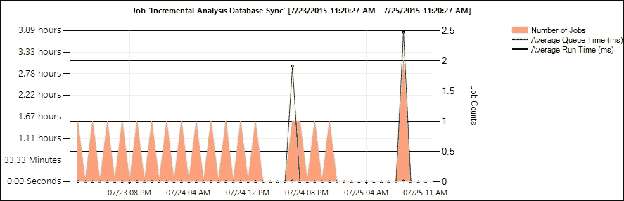

# 第七章：管理 Team Foundation Server

|   | *“是硬件让机器变快……是软件让快机器变慢。”* |   |
| --- | --- | --- |
|   | --*Craig Bruce* |

本章将涵盖以下内容：

+   诊断 TFS 中的构建

+   分析 TFS 数据库并配置测试保留策略

+   使用活动和作业监视日志诊断 TFS 问题

+   更改更新频率并强制重新构建 TFS 仓库

+   配置 TFS 缓存设置

+   管理 TFS 中的 CodeLens

+   与 TFS 代理服务器的持续同步

+   创建 TFS 数据库备份计划

+   清理 TFS 中的死工作区和暂存集

# 介绍

我们正进入自动驾驶汽车的时代；你可能会问：“为什么产品不能自行维护？”产品团队交付高质量的软件，但功能的实际使用与预期使用可能有很大差异。产品所依赖的基础构建块以及依赖于产品的框架生态系统也在不断发展。TFS 的管理负担并不高。管理需求与使用程度成正比。较小的团队可能能够在团队成员的日常活动中管理 TFS，而较大的团队则可能需要一名专职的 TFS 管理员。

TFS 管理员需要执行的关键任务可以大致分为三类：**更新**、**维护**和**优化**：


让我们详细解释这些任务：

**更新**：保持环境的安全性非常重要，因此，MBSA 工具标识为“关键”的所有安全更新应在 48 小时内应用。产品更新大约每季度发布一次。每个产品更新包含 bug 修复、性能增强和新功能。季度更新很少有重大变化，这也减少了测试升级的工作量。产品更新也应尽快应用。还建议将底层操作系统和 SQL Server 更新到最新的可用服务包。

**维护**：需要有一个清晰的灾难恢复和备份恢复策略。应密切监控 TFS 数据库的使用情况，以发现任何意外的增长模式。建议使用 TFS Perfmon 计数器来基准测试服务器性能，并定期重新评估，特别是在升级时。有关 TFS Perfmon 计数器的更多信息，请访问 [`bit.ly/1SijysU`](http://bit.ly/1SijysU)。维护 TFS 还包括日常清理活动，如管理权限、构建投放位置、测试附件、工作区、暂存集等。

**优化**：通过使用活动日志监控 TFS 的使用情况，你可以识别扩展性的需求。负载均衡 TFS 应用层通常是提供弹性和扩展 TFS 设置的第一步。如果团队在低带宽环境中工作，安装 TFS 代理服务器可以显著改善体验。通过密切监控构建和发布代理的使用情况，你可以通过增加额外的代理来补充构建队列。这有助于减少构建和发布的排队时间。

如果你的组织已设置了系统中心，现在可以下载 Visual Studio Team Foundation Server 2015 的管理包，下载地址为[`bit.ly/1lgcEJN`](http://bit.ly/1lgcEJN)。如果你最近从 TFS 2013 或任何较早版本升级，建议阅读有关在现有团队项目中启用 TFS 2015 特性的信息([`bit.ly/1P6IbLu`](http://bit.ly/1P6IbLu))。MSDN 提供了大量文档([`bit.ly/1R4Uh79`](http://bit.ly/1R4Uh79))，涵盖了关键的管理概念，并附有示例和操作指南。此外，本文([`bit.ly/1QGxVcQ`](http://bit.ly/1QGxVcQ))详细讨论了所有 TFS 管理员应关注的内容。TFS 管理和运维是一个相当庞大的话题。在本章中，我们将重点介绍每个 TFS 管理员应执行的一些关键管理活动。

# 在 TFS 中诊断构建问题

开发团队使用 TFBuild 来验证代码变更、检查代码质量和运行测试。构建是任何软件开发生命周期中至关重要的一部分。作为 TFS 管理员，你可能需要检查构建代理的问题或诊断特定的构建定义。在本篇教程中，我们将学习如何诊断构建代理和构建定义。

## 准备工作

从 TFS 管理控制台下载 TFBuild Agent。有关如何下载 TFBuild Agent 的更多信息，请参考第四章中的*配置 TFBuild Agent、池*和*队列*教程，*构建您的应用*。你需要拥有集合管理权限才能配置 TFBuild Agent。要创建或编辑构建定义，你需要是构建管理员组的成员。

## 如何操作…

1.  在诊断代理问题时，最好的起点是查看代理追踪日志。代理追踪日志存储在代理工作目录中的`_diag`文件夹内。

1.  如果在代理追踪日志中没有明显的异常，作为下一步，你应该对代理运行 HTTP 追踪。这可以通过使用 HTTP 代理工具来完成。如果你使用 Windows 系统，可以使用 Fiddler；其他平台可以使用 Charles Proxy。关于如何设置和捕获 HTTP 追踪，请参考[`bit.ly/1P6dqGt`](http://bit.ly/1P6dqGt)。

1.  在捕获 HTTP 跟踪时，代理需要以交互模式运行。浏览到已下载 TFBuild Agent 的位置。解压 TFBuild Agent。在管理员模式下打开命令提示符，并将工作目录设置为解压后的 TFBuild Agent 位置。如图所示，运行 `ConfigureAgent` 命令：

    `ConfigureAgent` 命令将提示配置代理的一些细节。当系统提示是否要将代理安装为 Windows 服务时，输入 *N*，这将使代理以交互过程运行，而不是将其安装为服务：

    

    所有代理活动将在命令提示符中以详细模式显示。这可能提供诊断代理问题的线索。

1.  在排查构建定义问题时，最好以详细模式运行构建定义。在详细模式下，代理会生成非常详细的日志；调查日志通常是识别导致意外行为问题的最佳方法。要以详细模式运行构建定义，请创建一个新的变量 `System.Debug`，并将该变量的值设置为 `true`：

## 它是如何工作的…

HTTP 跟踪可能包含凭据，因此请避免公开分享 HTTP 跟踪。目前，TFS 不支持个人访问令牌，因此作为替代方法，您可以创建一个临时帐户用于捕获跟踪；或者在与其他团队共享日志以供调查之前，先清理跟踪日志。

# 分析 TFS 数据库并配置测试保留策略

随着 TFS 使用量的增加，TFS 实例可能会积累大量的数据文件、构建、发布、工作项等。在大多数情况下，这是非常好的——毕竟，许多 **应用生命周期管理** (**ALM**) 特性的重要价值之一就是维护与生产软件相关的各种工件的可靠历史记录。然而，随着时间的推移，维护旧数据会带来隐性和显性成本，比如性能影响、增加的升级时间以及更高的磁盘空间需求。在本食谱中，您将学习如何分析 TFS 数据库的大小并为团队项目设置测试保留策略。

## 准备中

不建议直接查询 TFS 事务性数据库的实时实例。请在 SQL 的另一个实例上还原 TFS 事务性数据库的备份，并在该实例上执行本食谱中的查询，而不是在实时实例上执行。
要管理团队项目的测试保留策略，您需要是团队项目管理员组的成员。

## 如何操作...

让我们首先分析 TFS 数据库，了解存储分布：

1.  打开 SQL Server Management Studio，连接到 TFS 事务数据库所在的 SQL 实例，打开一个新查询窗口并运行以下 T-SQL 代码来获取 TFS 数据库的数据库大小：

    ```
    use [master]
    select DB_NAME(database_id) AS DBName, (size/128) SizeInMB
    FROM sys.master_files with (nolock)
    where type=0  and substring(db_name(database_id),1,4)='Tfs_' and DB_NAME(database_id)<>'Tfs_Configuration' order by size desc 
    GO
    ```

    执行上述代码后，你将获得以下输出：

    

1.  在 SQL Server Management Studio 中，将连接的数据库范围限定为`TFS_DefaultCollection`列。执行以下 T-SQL 代码以识别此集合中存储的分布：

    ```
    SELECT Owner = 
           CASE
                  WHEN OwnerId = 0 THEN 'Generic' 
                  WHEN OwnerId = 1 THEN 'VersionControl'
                  WHEN OwnerId = 2 THEN 'WorkItemTracking'
                  WHEN OwnerId = 3 THEN 'TeamBuild'
                  WHEN OwnerId = 4 THEN 'TeamTest'
                  WHEN OwnerId = 5 THEN 'Servicing'
                  WHEN OwnerId = 7 THEN 'WebAccess'
                  WHEN OwnerId = 8 THEN 'ProcessTemplate'
                  WHEN OwnerId = 9 THEN 'StrongBox'
                  WHEN OwnerId = 10 THEN 'FileContainer'
                  WHEN OwnerId = 11 THEN 'CodeSense'
                  WHEN OwnerId = 255 THEN 'PendingDeletion'
               END,
           SUM(CompressedLength) / 1024 as TotalSizeInKB
    FROM tbl_FileReference fr
    JOIN tbl_FileMetadata fm
    on fr.PartitionId = fm.PartitionId
    AND fr.ResourceId = fm.ResourceId
    WHERE fr.PartitionId = 1
    GROUP BY OwnerId
    ORDER BY 2 DESC
    ```

    存储被分类为各个所有权区域。这应该有助于在高层次上识别热点区域。

1.  以下查询将展示关于各个所有权区域的更多详细信息：

    ```
    use Tfs_DefaultCollection 
    select  SUBSTRING(a.filename,len(a.filename)- CHARINDEX('.',REVERSE(a.filename))+2,999)as Extension, sum(fm.compressedlength)/1024 as SizeInKB from tbl_Attachment as a 
    inner join tbl_FileReference as fr on a.TfsFileId= fr.fileid
    join tbl_FileMetadata fm on fr.PartitionId = fm.PartitionId and fm.ResourceId = fr.ResourceId
    group by SUBSTRING(a.filename,len(a.filename)- CHARINDEX('.',REVERSE(a.filename))+2,999)
    order by sum(fm.compressedlength) desc
    ```

1.  从目前的分析来看，我们已经缩小了范围，`TeamTest`是数据库中占用最多资源的部分。细节显示，这主要是由于手动和自动测试产生的大量测试运行、结果和附件。要为 FabrikamTFVC 项目配置测试保留策略，请导航到 Team Web Portal 中的 FabrikamTFVC 管理控制台并切换到**测试**选项卡。如以下截图所示，设置手动和自动测试的保留策略：

## 工作原理…

测试保留策略是 TFS 2015 中的新功能。测试保留策略允许你分别管理自动化和手动测试的保留策略。默认配置是保留无限期。根据本示例，我们已将自动化测试执行、结果和附件的保留期限设置为 30 天，而手动测试执行、结果和附件的保留期限设置为 365 天。这些保留策略会通过 TFS 中的作业自动处理。

### 提示

**警告**

删除任何文件时应谨慎操作，并*绝不直接从数据库中删除*。和往常一样，在修改、更新或删除之前，务必对数据库进行完整备份。

没有办法在中心位置配置测试保留策略。因此，测试保留策略需要为每个团队项目单独配置。

测试保留策略只是控制 TFS 数据库大小的方式之一。TFS 还支持构建保留策略；这一点在第四章的*使用构建保留策略自动删除构建*一节中有详细讨论。此外，您还可以通过销毁已删除的版本控制分支、团队项目、文件和 XAML 构建来释放更多空间。请参考[`bit.ly/1PMhuvB`](http://bit.ly/1PMhuvB)了解如何实现这一点。

# 使用活动和作业监视日志来诊断 TFS 问题

TFS 将活动和作业执行数据同时记录在后端数据库中。TFS 具有内置作业代理，在应用程序层上运行并记录有关作业和进程的诊断信息。通过查看性能不佳和失败作业，以及诊断信息，可以更快地缩小潜在问题的范围。TFS 的诊断页面包括活动日志和作业监控日志。在本示例中，您将学习如何使用 TFS 的诊断页面。

## 准备就绪

要使用诊断页面，您需要成为 TFS 管理员组的成员。通过浏览 `http://tfs2015:8080/tfs/_oi/` 来验证访问权限：


## 如何做到……

1.  要访问活动日志，请导航至 `http://tfs2015:8080/tfs/_oi/_diagnostics/activityLog`。如果您首次访问该页面，加载可能需要一些时间。

1.  该页面基本上展示了`tbl_Command`表中的数据。正如下图所示，页面包含命令、应用程序、状态、开始时间、执行时间、执行状态、身份、IP 地址、唯一标识符、用户代理、命令标识符、执行计数、认证和响应代码等列表项：

1.  双击列表中的项目以查看更多详细信息。如下图所示，对于协调工作空间命令的详细信息显示了操作的详细下一层级：

1.  **活动日志**页面还允许进行筛选和导出操作。由于`tbl_command`表中的数据仅保留 14 天，您可以将活动日志中的数据逐步导出到单独的存储库中，以保留这些有价值的信息用于历史趋势分析。

1.  单击**作业监控**选项卡以导航到**作业监控**视图。或者，您可以直接浏览 `http://tfs2015:8080/tfs/_oi/_jobMonitoring`。**作业监控**视图还包括三个子菜单：**作业摘要**、**作业队列**和**作业历史**：

1.  首先，让我们看看**作业摘要**视图。摘要视图显示了每个作业的总运行时间的图形表示。能够将作业执行时间与其他作业相对比有助于识别潜在问题。正如您在以下截图中所看到的，TFS 周期性身份同步和增量分析数据库同步作业处理时间较长，相比之下，优化数据库作业的处理时间较短：

1.  要获取有关增量分析数据库同步作业的更多信息，请点击作业名称旁边的蓝色条形图。这将导航到 **作业历史**标签。**作业历史**标签有两个图表，一个显示所有作业的执行时间，另一个显示增量分析数据库同步作业的详细信息。查看这两个图表可以帮助你比较它们之间的影响。下图展示了增量分析数据库同步作业的执行图。通过查看图表，你可以发现 07/25 号的作业明显超出了正常模式，花费的时间比平时要长得多。然而，图表中的队列时间指标显示，延迟是由于平均队列时间延长所导致的：

1.  返回到 **作业摘要**视图；该视图还有一个饼图，显示了 **成功**、**阻塞** 和 **禁用** 作业的分布。点击任何一项将导航到 **作业历史**视图，并提供每种类型作业的详细信息：

1.  最后但同样重要的是，**作业摘要**页面有一个作业运行次数的图表。该图表显示了某个特定作业的运行次数以及该作业的结果类型。点击图表中的任意条形图，查看该作业的详细信息。将鼠标悬停在图表上可以获取更多信息：

1.  接下来，导航到 **作业队列**标签。此标签中的图表描述了作业队列；它提供了每种队列类型的计数。点击条形图可以查看与每个队列类型相关的作业详情：

## 它是如何工作的……

建议不要直接查询 TFS 事务数据库。对数据库的任何更改都可能对 TFS 的功能产生重大影响。尽管某些更改可能不会立即显示影响，但这些更改可能会在升级时造成干扰。在诊断页面引入之前，唯一的办法就是直接查询数据库，获取并分析 `command` 和 `actions` 表中的数据。诊断页面使得访问这个宝贵的数据集变得更加容易。

所有内置的 TFS 作业都会在 `command` 表中跟踪其活动。日志记录由 TFS 框架内部处理。有一篇非常有趣的文章讲述了内置作业及其执行间隔；你可以在[`bit.ly/1kPSbfg`](http://bit.ly/1kPSbfg)上了解更多内容。

# 更改更新频率并强制重建 TFS 仓库

TFS 中的报告仓库是一个传统的数据仓库，由关系数据库和分析服务数据库组成。数据仓库聚合了所有操作数据，如版本控制、工作项跟踪、构建和测试。该仓库对应于`Tfs_Warehouse`关系数据库，数据立方体对应于 SQL Server 分析服务数据库`Tfs_Analysis`。TFS 仓库的默认重建频率为 2 小时。在本教程中，您将学习如何将 TFS 仓库的刷新频率从 2 小时手动更改为 1 小时。您还将学习如何强制重建 TFS 仓库的立方体。

### 注意

TFS 仓库的刷新频率默认是 2 小时；如果您将间隔缩短到低于默认的 2 小时，数据仓库的处理将频繁消耗服务器资源。如果您的 TFS 服务器有大量数据，减少刷新频率可能会对服务器性能产生不利影响。

## 准备就绪

若要完成此教程，您需要确保以下事项：

+   您正在使用的 TFS 部署配置了 TFS 仓库。您可以通过检查 TFS 管理控制台中的**Reporting**标签来验证：

+   您必须是 Team Foundation Administrators 安全组的成员，或必须将服务器级别的仓库管理权限设置为**允许**。

+   必须启动 Microsoft Team Foundation Server 应用池，以便使用仓库控制 Web 服务：

## 如何操作…

1.  登录 Team Foundation Server 应用层，并通过浏览`http://localhost:8080/tfs/TeamFoundation/Administration/v3.0/WarehouseControlService.asmx`验证仓库控制服务是否可用。如果未看到如以下截图所示的仓库控制 Web 服务，请重新访问*准备就绪*部分：

1.  在`WarehouseControlWebService`页面中，寻找`changesetting`网络方法。点击此方法以跳转到该函数的定义。这方法有两个输入参数，分别是`settingId`和`newValue`。在`settingId`文本框中输入`RunIntervalSeconds`。此属性表示仓库重建的频率。在`newValue`文本框中输入`3600`，其中`3600`代表 3600 秒（1 小时），即属性`RunIntervalSeconds`的新值：

1.  点击**Invoke**。这将把您重定向到响应页面。响应页面将列出该操作的结果。在这种情况下，消息确认运行间隔值已成功更新为 3600 秒：

1.  在这一步，我们将演示如何强制重建仓库。返回到仓库控制 Web 服务并选择 **ProcessWarehouse** Web 方法。该方法有两个输入参数，分别是 **collectionName** 和 **jobName**。在 **collectionName** 文本框中输入 **defaultcollection**，这是你想要强制重建的 TFS 集合。不要在 **jobName** 文本框中输入任何值：

    ### 提示

    你可以选择将 **collectionName** 文本框留空。这将强制重建所有团队项目集合。

1.  点击 **Invoke** 会将你重定向到响应页面。响应页面将列出操作的结果。服务返回 `True` 时，表示它成功启动了仓库的处理，`False` 则表示处理失败。`False` 的值意味着仓库当前正在处理：

## 它是如何工作的…

强制重建 TFS 仓库并不是你需要定期做的事情。然而，如果你移动、恢复、重命名或故障转移 TFS 的数据层，则需要进行 TFS 仓库和数据立方体的重建。如果你移动、附加、分离或删除了团队项目集合，则需要重建仓库以查看更新后的报告。

## 还有更多

`RebuildWarehouse` 命令也可以通过命令行工具使用。有关如何使用 `RebuildWarehouse` 命令的更多细节，可以参考 [`bit.ly/1HjaQdp`](http://bit.ly/1HjaQdp)。

# 配置 TFS 缓存设置

TFS 应用程序层维护一个文件缓存，以通过从缓存中提供文件，而不是每次从数据库中重新获取文件，来加速文件下载过程。缓存随着时间的推移而增长，可能会开始占用应用程序层的存储空间。缓存使用了相当一部分可用空间；如果你的主驱动器没有足够的可用空间，你将无法有效利用缓存功能。将 TFS 缓存移动到单独的目录中，可以释放主驱动器的存储空间，并为新驱动器规划更轻松的备份或恢复过程。将缓存目录更改为独立目录后，你可能会看到一定的性能提升。在本食谱中，你将学习如何将 TFS 缓存目录更改为不同的目录。

## 准备工作

你需要有权限登录到 TFS 应用程序层。

## 如何操作...

1.  登录到 TFS 应用程序层。导航到 TFS 的安装文件夹，默认安装位置是 `C:\Program Files\Microsoft Team Foundation Server 14.0`。

1.  TFS 的 `web.config` 文件位于 `C:\Program Files\Microsoft Team Foundation Server 14.0\Application Tier\Web Services` 文件夹中。在进行任何更改之前，请先备份 `web.config` 文件。打开 `web.config` 文件并搜索键 `dataDirectory`：

1.  将数据目录的值从默认值更改为新位置。在这个示例中，已为 TFS 缓存设置了一个新的驱动器`W`。重新指向缓存到`W:\TfsData\ApplicationTier\_fileCache`并保存配置文件中的更改：

1.  除此之外，你还可以选择添加`PercentageBasedPolicy`键，该键决定可以由缓存消耗的剩余空间的百分比。该键仅接受整数值：

    或者，可以使用`FixedSizeBasedPolicy`键。该键的值是缓存允许的总空间。例如，将其设置为`500`意味着缓存仅有 500 MB 可用空间用于存储。如果同时指定了`FixedSizeBasedPolicy`和`PercentageBasedPolicy`键，则`FixedSizeBasedPolicy`的值优先。

## 工作原理...

保存`web.config`将重新启动应用程序池，并立即生效更改。在版本控制上进行`get`操作，TFS 将缓存文件的副本作为结果返回给客户端，保存在新位置。

# 在 TFS 中管理 CodeLens

CodeLens 是 Microsoft Visual Studio 的一个功能，直接在代码编辑器中显示有关代码的信息。在有了 CodeLens 之前，人们不得不在多个不同的窗口中查找诸如方法引用、与方法关联的测试、代码行的最后更改或类的代码变动等信息。由于所有这些信息都在 TFS 中，你只需期望它们能够在一个地方找到。CodeLens 通过将这些信息直接放在代码编辑器中使其可用，正是这么做的。CodeLens 支持 TFVC 和 Git 仓库。CodeLens 现在支持 C#、VB、C++、SQL 和 JavaScript 文件。你可以在 Visual Studio 中了解更多关于 CodeLens 和其他质量和诊断工具的信息：[`bit.ly/1NNbtJ6`](http://bit.ly/1NNbtJ6)。

本书侧重于 TFS，你可能想知道为什么会讨论与 Visual Studio 特定功能相关的内容。TFS 负责准备由 CodeLens 在 Visual Studio 中提供的信息。TFS 具有专门的作业用于代码索引，并且生成的信息存储在 TFS 数据库中。在这个示例中，你将学习如何管理`TfsConfig CodeIndex`命令来检查 Team Project Collection 的索引状态，启用/禁用索引，查找大文件并忽略它们的索引，审查忽略列表并销毁代码索引。

## 准备工作

要使用`CodeIndex`命令，你需要是 Team Foundation Administrators 安全组的成员。此命令只能从 TFS 应用程序层调用；因此，你需要具有登录权限到 TFS 应用程序层。

## 如何操作...

1.  登录到 TFS 应用程序层并以提升的模式打开命令提示符。

1.  运行以下命令查看默认集合的索引状态：

    ```
    TFSConfig CodeIndex /indexingStatus /collectionName:"default collection"

    ```

1.  开始索引所有变更集：

    ```
    TFSConfig CodeIndex /setIndexing:on /collectionName:"default collection"

    ```

1.  停止索引之前创建的变更集，仅索引新的变更集：

    ```
    TFSConfig CodeIndex /setIndexing:keepupOnly /collectionName:"default collection"

    ```

1.  运行以下命令，列出默认集合中大小大于 10 KB 的前 50 个文件：

    ```
    TfsConfig CodeIndex /listLargeFiles /fileCount:50 /minSize:10 /collectionName:<CollectionName>

    ```

1.  运行以下命令将特定文件排除在索引之外，并将其添加到忽略文件列表：

    ```
    TFSConfig CodeIndex /ignoreList:add "$/Fabrikam Web Site/Catalog.cs" /collectionName:"default collection"

    ```

1.  运行以下命令查看所有未被索引的文件：

    ```
    TFSConfig CodeIndex /ignoreList:view

    ```

1.  运行以下命令清除先前索引的数据并重新启动索引：

    ```
    TFSConfig CodeIndex /reindexAll /collectionName:"default collection"

    ```

1.  运行以下命令删除代码索引并进行确认：

    ```
    TFSConfig CodeIndex /destroyCodeIndex /collectionName:"default collection"

    ```

## 它是如何工作的...

`TfsConfig` 命令使您能够管理 `CodeIndex` 功能。有关各个命令的更多详情，请参考 [`bit.ly/1NNcwZi`](http://bit.ly/1NNcwZi)。

# 与 TFS 代理服务器的持续同步

如今，地理上分布的团队远程访问 TFS 已经很常见。远程用户可能会受到其所在位置与 TFS 托管位置之间连接延迟的影响。此时，团队基础代理服务器（Team Foundation Proxy Server）提供了解决方案。关于 TFS 代理缓存所有请求的说法是一个常见误解。事实上，代理服务器只缓存基于 TFVC 的版本控制中的`Get`操作。代理服务器并不会执行持续的同步或复制操作，而是仅在第一次请求时缓存该项内容。虽然来自远程位置的首次调用者仍然会面临`get`操作的延迟，但所有后续请求将像本地访问一样快速地获取数据。如今，鼓励开发人员频繁提交代码。这意味着在低网络带宽区域操作的地理分布式团队，在执行源代码控制的获取操作时会感到延迟。在本节中，您将学习如何预缓存数据到 TFS 代理，以提高代理的整体性能。

## 准备工作

本节需要您已设置 TFS 代理服务器。如果您还没有，可以按照 [`bit.ly/1lfGDS7`](http://bit.ly/1lfGDS7) 的步骤配置 TFS 代理服务器。为代理服务器添加额外的驱动器。在本节中，我们将使用 `D:\TFS\Workspace` 作为附加目录。

场景：在一个远程地点工作的部分分布式团队网络带宽较差，需要从 TFS 服务器下载代码的操作通常较慢。团队已在其远程地点安装了 TFS 代理服务器；然而，在下载源代码的增量更改时，仍然会遇到延迟。团队希望能采取主动的解决方案，将增量的代码更改下载到代理服务器中，这样当团队执行 `Get` 操作时，代理服务器可以直接从本地缓存中提供内容，而不必重新向 TFS 发起请求。

## 如何操作...

1.  登录到 TFS 代理服务器的计算机，浏览到 `D:\TFS\Command` 目录，并创建一个名为 `PreGetTfsProxy.bat` 的新文件。

1.  将以下代码复制到`PreGetTfsProxy.bat`文件中并保存更改：

    ```
    @echo off 
    set local 
    set TFSPROXY=http://localhost:8081 
    echo Forcing Pre-cache of files using TFS VC proxy at %TFSPROXY% 
    cd D:\TFS\Workspace 
    "%PROGRAMFILES%\Microsoft Visual Studio 14\Common7\IDE\TF.exe" get 
    del /F /S /Q d:\ tfs\workspace\*.* 
    echo Pre-cache complete. 
    end local 
    ```

1.  双击`PreGetTfsProxy.bat`来运行脚本测试脚本。如果脚本设置正确，`D:\TFS\Workspace`位置现在应该包含从 TFS 获取的源代码。

1.  设置一个 Windows 定期任务，每 10 分钟运行一次`PreGetTfsProxy.bat`文件。您可以调整此作业的执行频率，以最适合您组织的情况。

## 工作原理...

安装 Team Foundation Server Proxy Server 会安装 Team Foundation Server 命令行工具。TFS 代理服务器的核心功能是在本地缓存从 TFS 请求的任何文件，因此对于那些文件的任何后续调用可以直接由代理服务器提供。通过节省到 TFS 服务器的往返时间，代理服务器可以显著减少执行`Get`操作时注意到的延迟。TFS 代理服务器不执行工作区同步操作，而是仅缓存从 TFS 服务器请求的文件。在这个示例中，我们在代理服务器上创建了一个临时工作区，并通过 Windows 定期任务安排了`Get`操作的执行，以主动获取增量代码更改。这将导致代理服务器在代理服务器上主动缓存更改。虽然这种方法简单，但在同步源代码的同时非常有效。

TFS 代理服务器可以显著缩短执行`Get`操作所需的时间。Perfmon 是使用性能计数器测量系统性能的非常有用的工具。按照[`bit.ly/1SZEN2T`](http://bit.ly/1SZEN2T)中的步骤测量带有和不带代理服务器的`Get`操作的时间是一般推荐的，基准性能提升了代理服务器之后应该重新验证。

# 创建 TFS 数据库备份计划

|   | *"如果你没有计划，你就是在计划失败！"* |   |
| --- | --- | --- |
|   | --*本杰明·富兰克林* |

没有人愿意成为一个没有完整备份的服务器管理员。TFS 数据库是产品的核心；数据库是使用 Web Portal、Visual Studio 和 Microsoft Test Manager 交互的数据存储库。在这个示例中，您将了解到 TFS 提供的数据库备份功能。

## 准备工作

要配置备份计划，您需要是 TFS 管理员组的成员、SQL Server 管理员组的成员，以及（如果您的部署使用 SharePoint 产品）农场管理员组的成员。

TFS 服务帐户必须在每个托管您要备份的数据库的 SQL Server 实例上，设置允许 SQL Server 执行备份和创建维护计划的权限。您需要一个网络共享来存储数据库备份。服务帐户需要对存储备份的网络共享、文件夹或存储设备具有完全控制权限。

## 如何操作...

1.  登录到 Team Foundation Server 应用层并打开 Team Foundation Server 管理控制台。通过点击左侧导航面板中的**计划备份**进入**计划备份**屏幕：

1.  如图所示，指定网络备份路径并将持续时间设置为 30 天：

    **高级**部分允许您指定备份的文件扩展名以及事务备份文件：

    

    您还可以选择一个唯一的扩展名，并将其配置为排除在病毒扫描之外。业界普遍接受的备份扩展名是：`bak`用于完整备份，`diff`用于差异备份，`trn`用于事务备份。

1.  下一屏幕允许您指定报告数据库。勾选该选项将报告数据库包含在备份计划中。这样您就可以将报告数据库与 TFS 数据库一起备份。

1.  报告服务需要一个加密密钥以在数据库恢复后访问报告，请在报告密钥页面设置加密密钥密码并点击**下一步**。

1.  您可以选择性地勾选**在备份计划中包含 SharePoint 数据库**选项来备份 SharePoint 数据库。

1.  点击“下一步”进入**警报**屏幕。**警报**屏幕可用于指定备份计划的警报设置。您可以选择在备份任务成功或失败时提醒用户：

1.  调度备份页面允许您选择**每日**、**手动**和**自定义**调度。**自定义**调度让您可以更灵活地设置完整备份的调度、差异备份调度以及事务备份的间隔时间。

1.  在审核页面确认设置并点击**下一步**以触发验证检查。验证成功通过后，您可以点击**配置**按钮，根据设置配置备份：

1.  导航到`\\tfs2015\backup`，您将找到`BackupSets.xml`、`BackupSettings.xml`和报告服务器的密钥。请复制并将其保存在安全的位置。

1.  您可以通过在 Team Foundation Server 管理控制台中点击**立即进行完整备份**链接来触发临时备份：

备份处理的更新会显示在弹出窗口中。备份完成后，您可以在网络共享中找到完整的备份集。

## 它是如何工作的…

了解数据的分类和关键性以及组织的恢复目标，对于制定组织的备份和恢复策略非常有帮助。某些组织可能有非常具体的备份需求，这些需求可能无法通过内置的“计划备份”进行配置。网站[`bit.ly/1IbxBLd`](http://bit.ly/1IbxBLd)详细讨论了这些使用案例。

Visual Studio ALM Rangers 提供了关于 TFS 灾难恢复规划的很好的指导。您可以在[`bit.ly/1Lwgx2y`](http://bit.ly/1Lwgx2y)阅读更多内容。

# 清理 TFS 中未使用的工作区和 shelvesets - 进行中

对于 TFVC 用户来说，创建工作区以临时下载文件或简单地忘记删除未使用的 shelvesets 是很常见的。作为团队基础服务器管理员，减少这些杂乱无章的文件会对你有所帮助。`tf.exe`命令行工具提供了用于管理工作区和 shelvesets 的命令。在本实例中，您将学习如何使用`tf.exe`工具删除未使用的工作区和 shelvesets。

## 准备工作

要修改或删除现有的工作区或 shelveset，必须将全局管理工作区权限设置为**允许**。

## 如何操作…

1.  以提升模式启动开发者命令提示符。

1.  以下命令将删除属于 TFS 默认集合的`Win2k12R2_John`工作区。有关如何使用`tf.exe`命令切换工作区的更多示例，请参阅[`bit.ly/1P6mo6t`](http://bit.ly/1P6mo6t)：

    ```
    tf workspace /delete /collection:"http://tfs2015:8080/tfs/defaultcollection" workspacename:"Win2k12R2_John" 

    ```

1.  类似于工作区删除，shelveset 删除也遵循类似的命令模式。以下命令将从 TFS 的默认集合中删除`Fabrikam_Delta`工作区。有关更多示例，请参阅[`bit.ly/1lHChUk`](http://bit.ly/1lHChUk)。

    ```
    tf shelve /delete shelvesetname:"Fabrikam_Delta" /collection:"http://tfs2015:8080/tfs/defaultcollection"

    ```

## 它是如何工作的…

TFS 命令行工具（`tf.exe`）随着 Visual Studio 的安装一起安装。TFS 命令行工具包含用于各种 TFS 操作的开关，使 TFS 管理员能够编写这些常规操作的脚本。您可以在[`bit.ly/1P6mo6t`](http://bit.ly/1P6mo6t)阅读更多有关这些操作的信息。

构建服务器是工作区的最大消耗者。长时间未使用的构建定义会保留工作区，并因此消耗大量存储。识别并手动删除这些死工作区是一项艰巨的任务。TFS 工作区清理工具是一个开源工具，托管在 CodePlex 上，可以通过删除若干天未使用的工作区来帮助您释放存储空间。您可以在[`bit.ly/1LxFDhv`](http://bit.ly/1LxFDhv)了解更多关于此工具的信息。
