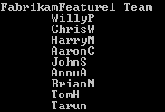

# 第八章：扩展和自定义 Team Foundation Server

|   | *“首先解决问题，然后再写代码。”* |   |
| --- | --- | --- |
|   | --*约翰·约翰逊* |

本章将涵盖以下主题：

+   从 NuGet Gallery 获取 TFS 对象模型

+   使用团队项目选择器程序化连接到 TFS

+   使用 TFS 对象模型确定 TFS 的版本

+   使用 TFS 对象模型程序化检索 TFS 权限

+   程序化获取团队项目的过程模板名称

+   使用 REST API 程序化获取构建详细信息

+   使用 REST API 程序化获取 Git 仓库列表

+   使用 REST API 程序化根据 ID 获取工作项

+   向现有的团队项目的产品待办项中添加团队字段

+   在工作项表单中添加多项选择控件

# 介绍

TFS 提供了集成的软件应用交付和生命周期管理工具。组织通常会使用不同的工具来管理生命周期的不同部分，例如，使用 Jira 进行敏捷项目管理，使用 TeamCity 进行构建，使用 Jenkins 进行发布管理，使用 ServiceNow 进行服务管理。客户期望能够在不同的系统之间集成和共享信息。Team Foundation Server 有一个相当大的工具和服务生态系统，以下截图显示了 TFS 生态系统中的一些合作伙伴，你可以在 [`vsipprogram.com/Directory`](https://vsipprogram.com/Directory) 找到完整的列表：


基本上不可能提供与每个其他系统的开箱即用集成；为了弥补这一差距，TFS 提供了一个非常丰富的库，允许你在 TFS 中检索、编辑、更新、插入和删除数据。该 API 使这些操作变得安全且可审计。如今，TFS 有两种扩展技术，如下图所示：


让我们详细解释这两种扩展技术：

+   **TFS 对象模型**：TFS 对象模型支持 .NET 和 Java 平台，并且自 TFS 2005 起就已包含在产品中。随着版本的发布，对象模型库增加了更多功能。使用对象模型构建的扩展可以集成到 Visual Studio 和 Team Explorer 中，也可以作为独立工具使用。对象模型有以下限制：

    +   它不支持团队网站门户的扩展性

    +   它不支持非 Windows 操作系统

    +   它不支持移动设备的客户端扩展

+   **RESTful 服务**：RESTful 服务首次在 TFS 2013 中亮相。RESTful 服务是基于 JSON 的 REST 服务，主要集中在弥补 TFS 对象模型的局限性。这些服务使团队 Web 门户的扩展性、非 Windows 平台的扩展以及移动设备的客户端扩展成为可能。RESTful 服务也可以在 TFS 对象模型中调用。这非常强大，因为它使你能够为 TFS 对象模型中没有任何扩展点的功能构建扩展性。例如，Team Rooms 是一个仅限 Web 的功能，在 TFS 对象模型中没有扩展点。Team Rooms Visual Studio 扩展（[`bit.ly/1TeNIO7`](http://bit.ly/1TeNIO7)）是使用 Team Rooms REST API 和 TFS 对象模型构建的。

TFS 对象模型和 RESTful 服务为扩展性提供了无限的机会。尽管今天可以将 RESTful 服务与 TFS 对象模型一起使用，但 RESTful 服务尚未完全准备好用于扩展 TFS 中的团队 Web 门户。RESTful 服务使用 OAuth 进行身份验证和授权，而 TFS 并没有提供 OAuth 令牌生成能力。作为一种变通方法，可以使用备用凭据来验证 REST API。由于需要在托管 TFS 的 IIS 实例上启用基本身份验证，组织可能会不愿意启用备用凭据。本文中的配方通过使用备用凭据实现了 REST API。请按照此处的说明启用备用凭据：[`bit.ly/1IhEQH1`](http://bit.ly/1IhEQH1)。

由于 TFS 没有 OAuth 令牌生成能力，因此无法为 TFS 构建团队 Web 门户扩展。OAuth 令牌生成能力预计将在 TFS 2015 的未来更新中发布。TFS 和 VSTS 的 RESTful 扩展模型是相同的。由于 VSTS 拥有 OAuth 令牌生成系统，因此你可以在 VSTS 中使用 RESTful 服务开始为 VSTS 中的团队 Web 门户构建扩展。RESTful 服务是最近在 VSTS 中引入的市场能力的基础。预计这一能力将在未来的 TFS 更新中提供。你可以在这里了解更多关于 VSTS 市场的信息：[`bit.ly/1Q6afgw`](http://bit.ly/1Q6afgw)。

除了涵盖扩展性外，我们还将学习 TFS 中定制化的可能性。TFS 提供了一个定制框架，使得在团队项目级别上进行定制成为可能。对团队项目的定制是通过过程模板应用的。过程模板是一个包含 XML 文件的集合，这些文件保存了需要应用于团队项目的工件和过程的指令。举个例子，过程模板中包含了关于安全组、区域、迭代、工作项和积压项的指令。模板还应用了这些工件所展现的工作流和行为，例如，CMMI 模板中的 Bug 工作项有一个“准备测试”状态，而 Scrum 模板中的 Bug 工作项则没有。虽然 TFS 默认加载了 Scrum、Agile 和 CMMI 过程模板，但 TFS 支持定制现有过程模板以及创建新的过程模板，以最好地满足你团队的需求。一个过程模板由九个插件组成；每个插件在团队项目设置过程中执行一组任务。下图展示了可以定制的插件和对象文件：


当前的过程模板结构和工具存在多种限制：

+   **工具**：要编辑过程模板，你需要安装过程模板编辑器。该编辑器只能通过安装 TFS 强力工具 ([`bit.ly/1jJkEmt`](http://bit.ly/1jJkEmt)) 来安装。过程模板编辑器与 TFS 的版本密切相关。该编辑器只能通过 Visual Studio 启动。该编辑器不支持非 Windows 平台。

+   **复杂性**：要编辑过程模板，你需要对过程模板和团队项目有深入的了解。过程模板编辑器很基础；它没有提供任何验证功能，也没有测试所做更改的方式。

+   **可维护性**：如果团队项目的过程模板已被修改，TFS 不会自动将该产品升级到最新的功能。这样的项目需要手动启用新功能。

为了去除当前过程模板定制工具的限制，正在团队 Web 门户中开发一个新的过程定制体验。这个新体验将是基于 Web 的，因此可以在非 Windows 设备上使用。新的体验将通过提供丰富的引导体验来简化常见任务的过程修改。新工具将使得团队项目在升级后能够自动更新新功能。为了实现这一点，过程模板中的所有系统字段将被锁定，无法定制。新工具已经在 VSTS 中发布预览版。你可以在 [`bit.ly/1OxP31n`](http://bit.ly/1OxP31n) 了解更多信息。预计新工具将在 TFS 2015 的未来更新中发布。本章中的示例基于使用过程模板编辑器定制过程模板。

总结一下，本章的扩展性方案基于 TFS 对象模型和带有备用凭据的 RESTful 服务。本章的自定义方案则基于过程模板编辑器。扩展性和自定义功能正在经历巨大的变化。虽然这两者的变更已经在 VSTS 中发布，但它们在 TFS 2015 Update 1 中不可用。预计这些变化将在未来的 TFS 2015 更新中提供。

# 从 NuGet Gallery 获取 TFS 对象模型

如果你之前使用过 TFS 对象模型，你会认识到获取 DLL 及其依赖项是一个繁琐的过程。TFS 的 DLL 需要从安装目录中提取。许可框架不允许分发这些 DLL。这意味着，任何与代码一起工作的人，要么需要安装所有依赖项，要么需要手动将 DLL 添加到项目引用中。在 TFS 2013 中，引入了一个独立安装程序，将所有 TFS 对象模型的二进制文件部署到机器上。虽然这简化了设置过程，但它确实增加了开发者的一步操作。这不仅复杂了开发过程，也使得构建和测试流程变得更加复杂。

NuGet 已经成为 Microsoft 开发平台（包括.NET）的标准包管理工具。NuGet 客户端工具提供了生成和使用软件包的能力。NuGet Gallery 是所有包作者和消费者使用的中央包仓库。通过 NuGet 提供对象模型似乎是自然而然的。随着 Team Foundation Server 2015 的发布，现在可以通过 NuGet 直接获取对象模型。此外，许可政策已被修改，以允许软件包的分发。在本方案中，你将学习如何通过 NuGet 获取 TFS 对象模型。

## 准备工作

本方案需要使用 Visual Studio 2015。如果你没有安装 Visual Studio，可以使用免费提供的 Visual Studio Community 版，下载地址为[`www.visualstudio.com/en-us/downloads/download-visual-studio-vs.aspx`](https://www.visualstudio.com/en-us/downloads/download-visual-studio-vs.aspx)。

## 如何操作...

1.  打开 Visual Studio，创建一个新的 Windows 控制台应用程序项目，并将项目命名为`asPlayPit`。

1.  在解决方案资源管理器中，右键点击项目并选择**管理 NuGet 包**。这将打开 Visual Studio 中的 NuGet 包搜索窗口。

1.  搜索并添加`Microsoft.TeamFoundationServer.Client`和`Microsoft.TeamFoundationServer.ExtendedClient`软件包。

1.  安装这些软件包时，还会安装相关的依赖包。一旦软件包安装成功完成，在`PlayPit`项目的解决方案资源管理器中展开引用部分。你会看到所有的 TFS 和依赖的 DLL 已经成功添加为项目引用。

## 它是如何工作的...

在 Team Foundation Server 2015 中，Team Explorer 现在作为 VSIX 包安装。这有两个影响：

+   每次安装的 Team Explorer 安装位置可能会有所不同。

+   TFS 程序集不再位于 **全局程序集缓存** (**GAC**) 中。

如果您正在开发扩展，您的扩展将无法自行解析 TFS 引用，因为 TFS DLL 已不再位于 GAC 中。因此，建议您在项目中添加对 TFS NuGet 包的引用来解决这些依赖关系。将 TFS DLL 移出 GAC 的主要原因是为了减少管理多个版本及其依赖关系的复杂性。

通过 NuGet 添加包会在解决方案级别创建一个 `package` 文件夹。所有添加的包也存储在该文件夹中。如以下截图所示，作为此配方一部分安装的 TFS 及相关包已被下载到该文件夹中：


在提交代码时，这些包也会被提交到源代码管理中。这样做的好处是，任何处理该代码的人都不需要担心引用问题。可以在解决方案级别启用 **自动恢复 NuGet 包** 选项。这样，在编译时，其他开发者机器上的所有 NuGet 引用都会被恢复（这不需要将包提交到源代码管理中）。它还适用于构建和测试工作流，显著减少了开发环境设置的开销。许可条款已经更改，现在您可以将 TFS 2015 客户端 OM 与您的应用一起重新分发。有关包、其内容和用途的更多细节，请参阅 [`bit.ly/1jkoSQj`](http://bit.ly/1jkoSQj)。

# 使用团队项目选择器以编程方式连接到 TFS。

TFS 对象模型提供了几种连接到 Team Foundation Server 的选项。**团队项目选择器** (**TPP**) 是其中之一；使用项目选择器的优点是用户可以看到他们熟悉的 TFS 连接对话框。用户可以通过该对话框指定 TFS 服务器的详细信息并进行身份验证。在此配方中，您将学习如何使用 TPP 以编程方式进行身份验证并连接到 TFS。

## 准备工作

请按照 *从 NuGet Gallery 获取 TFS 对象模型* 配方中的步骤，在 Visual Studio 中创建项目并将 TFS NuGet 包添加到该项目中。

## 如何操作…

1.  将以下代码复制到新创建项目中的 `Program.cs` 类中：

    ```
    // Global Variables
    private static TfsTeamProjectCollection _tfs;
    private static ProjectInfo _selectedTeamProject;

    // Connect to TFS Using Team Project Picker
    public static void ConnectToTfsUsingTeamProjectPicker()
    {
    // The user is allowed to select only one project
    var tfsPp = new TeamProjectPicker(TeamProjectPickerMode.SingleProject, false);

    tfsPp.ShowDialog();

           // The TFS project collection
           _tfs = tfsPp.SelectedTeamProjectCollection;

    if (tfsPp.SelectedProjects.Any())
           {
        //  The selected Team Project
              _selectedTeamProject = tfsPp.SelectedProjects[0];
           }
    }
    ```

1.  从 `Main` 调用 `ConnectToTfsUsingTeamProjectPicker` 方法。一旦触发 `tfsPp.ShowDialog()` 语句，TPP 窗口就会弹出。如下图所示，项目选择器允许您交互式地配置 TFS 服务器、集合和项目：

## 工作原理……

`TeamProjectPicker` 类接受 `TeamProjectPickerMode` 和 `DisableCollectionChange` 作为参数。在前面的代码片段中，我们强制 `TeamProjectPicker` 类以单项目模式启动，即只能选择一个团队项目。`false` 值用于覆盖，禁用选择器中可用的更改团队项目集合选项。其余代码仅是读取并将选定的团队项目名称存储在全局变量中。

你也可以传递 `TeamProjectPicker.MultiProject` 值，允许用户选择多个团队项目。你还可以通过传递 `true` 值给 `DisableCollectionChange` 参数来禁用更改项目集合的下拉菜单。

# 使用 TFS 对象模型确定 TFS 版本

如果你正在构建一个使用 TFS 对象模型的扩展，且目标是多个版本的 TFS，那么你很可能希望通过编程方式确定当前指向的 TFS 服务器版本。TFS 后期版本中引入的一些 API 服务在早期版本的 TFS 中不可用。不幸的是，API 并未暴露能够提供 TFS 精确版本的属性或函数。在这个配方中，你将学习如何通过编程方式确定 TFS 版本。

## 准备工作

按照 *从 NuGet Gallery 获取 TFS 对象模型* 配方中的步骤，在 Visual Studio 中创建一个项目。将项目命名为 `DetermineTFSVersion`，并向该项目添加 TFS NuGet 包。

## 如何实现...

1.  将以下代码复制到新创建项目中的 `Program.cs` 类中。

1.  在 `Main` 方法中，添加以下代码：

    ```
    var server = new TfsTeamProjectCollection(new Uri("http://tfs2015:8080/tfs"));
    server.EnsureAuthenticated();
    var serverVersion = server.ServerDataProvider.ServerVersion;
    Console.WriteLine("Server Version: {0}", serverVersion);
    Console.ReadKey();
    ```

1.  服务器版本将在控制台输出中打印出来，如以下输出所示：

## 它是如何工作的...

虽然此程序的输出不一定会给出 TFS 的完整程序集版本，但它有助于你了解产品的版本。在以下截图中，你可以看到 TFS 管理控制台中显示的 TFS 版本为 `14.0.24706.0`，而程序返回的是 `Dev14.M89-Part7`：


让我们逐步查看代码，理解具体做了什么：

+   `TfsTeamProjectCollection` 类用于初始化与服务器的新连接。在此情况下，服务器的详细信息作为 URI 传递给该类。建立与 TFS 服务器连接的其他方式已在本章 *使用团队项目选择器以编程方式连接到 TFS* 配方中讨论。

+   如果连接尚未通过身份验证，`EnsureAuthenticate` 方法会被调用，启动身份验证连接过程。

+   一旦连接已通过身份验证，`ServerVersion` 属性（嵌套在 `ServerDataProvider` 类中）将保存 TFS 服务器版本的值。

+   `ServerVersion`属性的值通过控制台的`WriteLine`方法打印到控制台。控制台的`ReadKey`方法用于暂停控制台，以便可以读取打印到控制台输出中的`ServerVersion`结果。

还有一种替代方法可以通过编程识别 TFS 的版本；TFS 位置服务返回 TFS 中可用服务的列表。此列表和服务的版本可以用来识别 TFS 的版本。关于这种方法的更多信息，请访问[`bit.ly/21l0YX8`](http://bit.ly/21l0YX8)。

# 使用 TFS 对象模型通过编程检索 TFS 权限

TFS 管理员通常需要发布和审查用户权限。在本食谱中，您将学习如何使用 TFS 对象模型通过编程生成 TFS 中团队项目用户的安全组、成员、权限和安全设置。

## 准备就绪

按照*从 NuGet Gallery 获取 TFS 对象模型*食谱中的步骤，在 Visual Studio 中创建一个项目，并将 TFS NuGet 包添加到该项目中。

## 如何操作...

1.  **通过编程连接到 TFS**：第一步需要建立与 TFS 的连接。可以使用以下代码片段完成此操作：

    ```
    var tfs = TfsTeamProjectCollectionFactory
                    .GetTeamProjectCollection(new Uri("http://tfs2015:8080/tfs")); 
    tfs.EnsureAuthenticated();
    ```

1.  **获取版本控制服务器服务的实例**：版本控制服务器服务公开了一个接口，其中包含一组方法，用于通过编程操作 TFS 版本控制组件：

    ```
    // Version control service exposes methods to work with TFS version control
    var vcs = tfs.GetService<VersionControlServer>();

    // Since we'll be reporting groups for all team projects, imp to get all team projects
    var teamProjects = vcs.GetAllTeamProjects(false);
    // Narrow down to the FabrikamTFVC Team Project
    var teamProject = teamProjects.FirstOrDefault(p=>p.Name == "FabrikamTFVC");
    ```

1.  **应用程序组**：`IGroupSecurityService`接口用于检索团队项目的组成员列表：

    ```
    // Group Security service exposes methods to get groups, users and security details
    var sec = tfs.GetService<IGroupSecurityService>();

    Identity[] appGroups = sec.ListApplicationGroups(teamProject.ArtifactUri. AbsoluteUri);
    ```

    通过 Team Explorer，您可以进入**设置**页面并点击**组成员资格**超链接来检索此信息。点击**组成员资格**超链接将带您进入 Team Web Portal 中的安全页面。以下截图的左侧显示了 FabrikamTFVC 项目安全页面中的组，右侧显示了通过编程返回的结果：

    

1.  **获取应用程序组中的成员**：每个应用程序组包含用户或进一步的 AD 组。以下代码片段遍历应用程序组的成员并获取每个成员的身份：

    ```
    foreach (Identity group in appGroups)
    {
    Identity[] groupMembers = sec.ReadIdentities(SearchFactor.Sid, new string[] { group.Sid }, QueryMembership.Expanded);

    foreach (Identity member in groupMembers)
                    {
    Console.WriteLine(member.DisplayName); 
    if (member.Members != null)
                        {
    foreach (string memberSid in member.Members)
                            {
                                Identity memberInfo = sec.ReadIdentity (SearchFactor.Sid, memberSid, QueryMembership.Expanded);
    var userName = memberInfo.Domain + "\\" + memberInfo.AccountName;
    Console.WriteLine(string.Format("       {0}", memberInfo.AccountName));
                            }
                        }
                    }
    }
    ```

    现在，程序不仅返回组的名称，还返回每个嵌套组中的成员：

    

1.  **获取用户会员设置**：应用程序组中的用户要么继承权限，要么直接分配权限。以下代码片段使用版本控制服务中的`GetPermissions`方法来计算用户的会员设置：

    ```
    var actualPermission = vcs.GetPermissions(new string[] { TeamProject.ServerItem }, RecursionType.Full);
    foreach (var memberOf in memberInfo.MemberOf)
       {
        // Get information about the members
    }
    ```

    通过 Team Explorer，您可以进入**设置**页面并点击**安全**超链接来检索此信息。点击**安全**超链接将打开 Team Web Portal 中的安全页面：

    

1.  **版本控制权限**：可以使用版本控制服务中的`GetEffectivePermissions`方法检索版本控制上的单个用户权限：

    ```
    var permissions = vcs.GetEffectivePermissions(userName, teamProject.ServerItem);

    foreach (var permission in permissions)
    {
    versionControlPerTmissions.Add(new VersionControlPermission(){Name = permission});
    }
    ```

    返回组中每个用户的版本控制权限。如下截图所示，用户`Tarun`是`Project Valid Users`组的成员，并具有`Manage Branch`权限：

    

# 以编程方式获取 Team Project 的流程模板名称

在此配方中，您将学习如何获取用于创建 Team Project 的流程模板名称。

## 准备工作

按照*从 NuGet Gallery 获取 TFS 对象模型*中的步骤，在 Visual Studio 中创建项目，并向此项目添加 TFS NuGet 包。

## 操作步骤...

1.  首先，以编程方式连接到 TFS。作为第一步，需要建立与 TFS 的连接。可以使用以下代码片段完成此操作：

    ```
    var tfs = TfsTeamProjectCollectionFactory
                    .GetTeamProjectCollection(new Uri("http://tfs2015:8080/tfs")); 
    tfs.EnsureAuthenticated();
    ```

1.  要获取 Team Project 的流程模板详细信息，我们需要`VersionControlServer`服务的一个实例和`Now`实例来获取`ICommonServerService`。`VersionControlServer`服务用于获取项目详细信息，特别是我们需要的`AbsoluteUri`。`AbsoluteUri`用于由`ICommonServerService`标识项目属性，例如流程模板名称：

    ```
    // Get an instance of the VersionControlServer
    var vcs = server.GetService<VersionControlServer>();
    // Get an instance of the ICommonStructureService
    var ics = server.GetService<ICommonStructureService>();
    ProjectProperty[] ProjectProperties = null;

    // Get the team project by name
    var teamProject= vcs.GetTeamProject("FabrikamTFVC");

    string ProjectName = string.Empty;
    string ProjectState = string.Empty;
    int templateId = 0;
    ProjectProperties = null;

    // Get the project properties using the ICommonStructureServer
    ics.GetProjectProperties(teamProject.ArtifactUri.AbsoluteUri, 
    out ProjectName, out ProjectState, 
    out templateId, out ProjectProperties);

    // Output all the project properties
    foreach (var pp in ProjectProperties)
    {
    Console.WriteLine(string.Format("{0} - {1}", pp.Name, pp.Value));
    }
    ```

    执行此操作将返回属性及其值的列表。如下截图所示，`Scrum`模板已用于创建 FabrikamTFVC Team Project。`SourceControlGitEnabled`和`SourceControlTfvcEnabled`属性告诉您 Team Project 中的源控制功能：

    

## 工作原理...

使用流程模板管理器从 TFS 下载 Scrum 流程模板。从下载位置打开`Classification`文件夹下的`Classification.xml`文件。API 基本上渲染了`Classification.xml`的内容：


您可以在`Classification.xml`文件中添加更多属性和值，并使用此模板版本创建 Team Projects。`ICommonStructureServer`服务中的`GetProjectProperties`方法将返回新添加的属性。此外，您还可以使用`ICommonStructureService`中的`UpdateProjectProperties`方法更新这些属性的值。

# 使用 REST API 以编程方式获取构建详细信息

在此步骤中，您将学习如何使用`BuildHttpClient` REST API 获取 Team Project 中带有详细信息的构建列表。

## 准备工作

正如在章节介绍中提到的，Team Foundation Server 2015 尚未具备 OAuth 令牌提供能力；因此，使用 REST API 的唯一方法是使用备用凭据。备用凭据使用基本身份验证作为认证协议。在使用基本身份验证时，用户凭据以明文形式发送到服务器。在专业环境中，这种设置是不能接受的。请按照 [`bit.ly/1Nfe8e0`](http://bit.ly/1Nfe8e0) 中的说明设置自签名证书，为 TFS 配置 SSL。通过 SSL，客户端和 TFS 之间的流量将被加密。

如果你只是想尝试一下 REST API 而不想涉及设置的复杂性，那么 API 沙盒是一个很好的起点：[`apisandbox.msdn.microsoft.com`](https://apisandbox.msdn.microsoft.com)。API 沙盒已经连接到一个示例 Visual Studio Team Services 帐户，它提供了预配置的代码示例来尝试 API 提供的功能，你还可以额外连接到你自己的 Visual Studio Team Services 实例。虽然 API 沙盒不能连接本地 TFS 实例，但是通过在构造服务 URL 中指定 API 版本参数，你可以调用旧版本的 API。API 沙盒的替代方案是 Postman ([`bit.ly/1l044iU`](http://bit.ly/1l044iU))。Postman 作为 Chrome 商店的免费扩展程序提供。它是一个非常好用的工具，可以更快地构建、测试和文档化 API。你可以直接在 Postman 中传递服务器 URL 和参数来触发所有的 REST 操作。这使得你也可以连接到本地的 TFS 实例；这对于尝试针对真实数据的 API 非常有用。

下载课程材料提供的 `RESTDemo` 解决方案。该解决方案包含三个项目，分别是 `GetBuildDetails`、`GetGitRepos` 和 `GetWorkitemById`。在 Visual Studio 中打开 `RESTDemo` 解决方案。在这个示例中，我们将通过 `GetBuildDetails` 项目来获取团队项目中具有详细信息的构建列表。

## 如何操作…

1.  在 `RESTDemo` 解决方案中，将 `GetBuildDetails` 设置为启动项目：

1.  运行 `GetBuildDetails` 项目，这将启动一个控制台，输入 TFS 服务器 URL，然后按 *Enter*：

1.  输入要连接到 TFS 的用户名和密码，然后按 *Enter*：

1.  输入您希望从中检索构建详细信息的项目名称：

1.  控制台将输出 FabrikamTFVC 中构建的列表以及构建的详细信息，如构建定义的名称、构建编号、结果、请求者、开始时间和完成时间：

## 工作原理…

我们将一起查看`GetBuildDetails`项目中的代码，以理解代码的工作原理。为了连接并从 TFS 获取数据，该项目需要 TFS API 二进制文件。该项目使用`Microsoft.TeamFoundationServer.ClientNuGet`包来获取正确的二进制文件引用：


从解决方案资源管理器中，打开`GetBuildDetails`项目中的`Program.cs`文件。该程序获取 TFS 服务器 URL、用户名和密码作为用户输入。密码在控制台中会显示为星号形式，将输入的字符替换为星号后再输出到控制台。创建一个`VssBasicCredential`实例，使用用户名和密码。然后，这些信息传递给`BuildHttpClient`。当创建`BuildHttpClient`类的实例时，构造函数将接收服务器 URL 和凭据。`BuildHttpClient`对象在实例化过程中会验证与 TFS 的连接：

```
var tfsServerUrl = Console.ReadLine(); 
var userName = Console.ReadLine(); 
var password = GetConsolePassword(); 
var projectName = Console.ReadLine(); 
var credentials = new VssBasicCredential(userName, password); 
BuildHttpClient buildClient = new BuildHttpClient(new Uri(tfsServerUrl), credentials); 
```

`BuildHttpClient`类包含`GetBuildsAsync`方法。团队项目名称作为参数传递给`GetBuildsAsync`方法：

```
var builds = buildClient.GetBuildsAsync(projectName).Result;
```

该功能返回一个构建列表。构建实体包含所有构建属性，如以下截图所示：


程序随后遍历构建列表，并将属性打印到控制台。您可以在[`www.visualstudio.com/integrate/api/build/overview`](https://www.visualstudio.com/integrate/api/build/overview)获取更多关于构建 REST API 的详情。

# 使用 REST API 以编程方式获取 Git 仓库列表

在本食谱中，您将学习如何使用`GitHttpClient` REST API 以编程方式获取团队项目中的 Git 仓库列表。

## 准备工作

请参考*准备工作*部分中*使用 REST API 以编程方式获取构建详情*食谱中的说明，了解设置细节。下载课程材料中提供的`RESTDemo`解决方案。在本食谱中，我们将通过`GetGitRepos`项目获取来自团队项目的 Git 仓库列表及其详情。

## 如何实现…

1.  在`RESTDemo`解决方案中，将`GetGitRepos`设置为启动项目：

1.  运行`GetGitRepos`项目，这将启动一个控制台。输入 TFS 服务器 URL 并按*Enter*：

1.  输入您想要连接到 TFS 的用户名和密码，然后按*Enter*：

1.  输入您希望从中获取构建详情的项目名称：

1.  控制台输出包含 FabrikamGit 项目的 Git 仓库列表，并附带仓库的详细信息，如其 ID、名称和远程 URL：

## 工作原理…

我们将通过`GetGitRepos`项目的代码来了解代码的工作原理。为了连接并从 TFS 获取数据，项目需要 TFS API 二进制文件；项目使用`Microsoft.TeamFoundationServer.ClientNuGet`包来获取正确的二进制引用：


从解决方案资源管理器中打开`GetGitRepos`项目中的`Program.cs`文件。程序从用户那里获取 TFS 服务器的 URL、用户名和密码作为输入。密码在控制台中通过将输入的字符转换为星号的形式进行掩码处理，然后输出到控制台。创建一个`VssBasicCredential`实例，包含用户名和密码。该信息随后传递给`GitHttpClient`。创建`GitHttpClient`类的实例，构造函数接受服务器 URL 和凭据。`GitHttpClient`类在实例化过程中验证与 TFS 的连接：

```
var tfsServerUrl = Console.ReadLine();
var userName = Console.ReadLine();
var password = GetConsolePassword();
var projectName = Console.ReadLine();
var credentials = new VssBasicCredential(userName, password);

GitHttpClient gitClient = new GitHttpClient(new Uri(tfsServerUrl), credentials);
```

`GitHttpClient`类包含`GetRepositoriesAsync`方法。团队项目名称作为参数传递给该方法：

```
var gitRepositories = gitClient.GetRepositoriesAsync(projectName, true).Result;
```

该函数返回一个`GitRepository`列表。`GitRepository`实体包含所有`GitRepository`的属性：


程序接着遍历`GitRepositories`列表，并将属性打印到控制台。你可以在[`www.visualstudio.com/integrate/api/git/overview`](https://www.visualstudio.com/integrate/api/git/overview)获取更多关于 Git REST API 的详细信息。

# 使用 REST API 通过 ID 编程获取工作项

在这个示例中，你将学习如何通过`WorkItemTrackingHttpClient` REST API 编程获取工作项的详细信息。

## 准备工作

请参考*通过 REST API 编程获取构建详细信息*示例中的*准备工作*部分获取设置详情。下载课程材料中提供的`RESTDemo`解决方案。在这个示例中，我们将通过`GetWorkItemById`项目来获取工作项的详细信息。

## 如何操作…

1.  在`RESTDemo`解决方案中，将`GetWorkItemById`设置为启动项目：

1.  运行`GetWorkItemById`项目，这将启动一个控制台，输入 TFS 服务器的 URL，按*Enter*键：

1.  输入你想要连接到 TFS 的用户名和密码，按*Enter*键：

1.  输入你想查询 API 的工作项 ID：

1.  控制台输出工作项的详细信息，如所属的团队项目、类型、标题、状态和创建者：

## 工作原理……

我们将通过`GetWorkItemById`项目中的代码来了解代码的工作原理。为了连接并从 TFS 获取数据，该项目需要 TFS API 的二进制文件；该项目使用`Microsoft.TeamFoundationServer.ClientNuGet`包来获取正确的二进制引用：


从解决方案资源管理器中，打开`Program.cs`文件，位于`GetWorkItemById`项目中。该程序获取 TFS 服务器的 URL、用户名和密码信息作为用户输入。密码在控制台上以星号形式显示，即在打印到控制台之前将输入的字符替换为星号。使用用户名和密码创建`VssBasicCredential`实例。然后将这些信息传递给`WorkItemTrackingHttpClient`。创建`WorkItemTrackingHttpClient`类的实例，构造函数接受服务器 URL 和凭据。`WorkItemTrackingHttpClient`类会在实例化过程中验证与 TFS 的连接。正如你可能已经注意到的，在这个示例中我们并不需要询问团队项目的名称，因为工作项 ID 是在团队项目集合级别作用域内的。这意味着工作项 ID 在团队项目集合级别是唯一的，既然 TFS 服务器 URL 包含集合名称，那么不需要单独请求此信息：

```
var tfsServerUrl = Console.ReadLine();
var userName = Console.ReadLine();
var password = GetConsolePassword();
var credentials = new VssBasicCredential(userName, password);

WorkItemTrackingHttpClient witClient =
new WorkItemTrackingHttpClient(new Uri(tfsServerUrl),
new VssBasicCredential(userName, password));
```

`WorkItemTrackingHttpClient`类包含`GetWorkItemAsync`方法。工作项 ID 作为参数传递给此方法。

```
var workItem = witClient.GetWorkItemAsync(Convert.ToInt32(workitemId)).Result;
```

该函数返回一个`WorkItem`类型的对象。`WorkItem`类包含关于工作项字段的信息，以及关于关系和修订的信息：


然后程序将字段的值打印到控制台：

```
Console.WriteLine($"Team Project: workItem.Fields["System.TeamProject"]}");
Console.WriteLine($"Type: {workItem.Fields["System.WorkItemType"]}");
Console.WriteLine($"Title: {workItem.Fields["System.Title"]}");
Console.WriteLine($"State: {workItem.Fields["System.State"]}");
Console.WriteLine($"Created By: {workItem.Fields["System.CreatedBy"]}");
```

你可以在[`www.visualstudio.com/integrate/api/wit/overview`](https://www.visualstudio.com/integrate/api/wit/overview)获取关于工作项 REST API 的更多详细信息。

# 向现有的团队项目中的产品待办事项添加团队字段

区域路径字段的最初目的是根据工作项所属的功能或技术领域对工作项进行逻辑分组，在这个字段被用作团队待办事项路径之前。如果你打算将区域路径用于工作项的功能或技术分组，你将需要一个新字段来将工作项分配到团队项目中的各个团队。在这个方案中，你将学习如何通过修改现有的流程模板向团队项目添加团队字段。

## 准备就绪

可以使用流程模板管理器下载流程模板。为此，请导航到团队资源管理器的**设置**页面。从**团队项目集合**视图中选择**流程模板管理器**超链接：


TFS 中的开箱即用流程模板已被锁定为不可编辑。这是通过向流程模板添加已知的 GUID 实现的。该 ID 帮助区分开箱即用的流程模板和其他模板。如果你打算自定义流程模板，建议将开箱即用的流程模板的 GUID 修改为不同的 GUID。如以下截图所示，可以通过下载流程模板并将 GUID 更改为不同的值来完成此操作：


修改现有的团队项目可能会导致数据损坏，因此建议在尝试本教程中突出显示的更改之前，使用更新后的流程模板创建一个测试项目。你需要是项目管理员组的成员才能对团队项目进行这些更改。

下载并安装 TFS Power Tools（[`bit.ly/1jJkEmt`](http://bit.ly/1jJkEmt)），这将安装流程编辑器扩展。

## 如何操作…

1.  创建一个 `ProcessTemplateRecipe` 目录，并创建一个新文件 `TeamGlobalList.xml`。将以下文本复制并保存到 `TeamGlobalList` 文件中：

    ```
    <?xml version="1.0" encoding="utf-8"?>
    <gl:GLOBALLISTS >
        <GLOBALLIST name="Teams">
            <LISTITEM value="Unassigned"/>
            <LISTITEM value="Fabrikam Feature 1"/>
            <LISTITEM value="Fabrikam Feature 2"/>
            <LISTITEM value="Fabrikam Feature 3"/>
            <LISTITEM value="Fabrikam Feature 4"/>
        </GLOBALLIST>
    </gl:GLOBALLISTS>
    ```

1.  打开 Visual Studio，并从**工具**菜单启动流程编辑器。在上下文菜单中，选择**导入全局列表**：

1.  要上传 `TeamGlobalList.xml` 文件，请导航到该目录并选择 `TeamGlobalList.xml`。要验证上传，请从服务器中选择**打开全局列表**：

1.  从服务器打开 WIT，方法是从**流程编辑器**菜单中选择此选项。选择 FabrikamTFVC 团队项目和产品待办事项类型的工作项：

1.  流程编辑器以图形界面启动产品待办事项类型的工作项：

1.  **新建**按钮用于向工作项类型添加一个新字段。点击**新建**并输入如下截图所示的详细信息：

1.  在**规则**选项卡中，点击**新建**，选择**允许的值**。点击**新建**并选择先前创建的团队全局列表：

1.  导航到**布局**选项卡，并在**状态组**列下为团队创建一个新控件。根据如下截图配置团队控件：

1.  点击预览表单按钮以加载工作项表单中的更改预览。在**工作项类型**表单中点击**保存**以应用更改。

## 它是如何工作的…

要测试这些更改，请创建一个新的**产品待办事项**类型的工作项。表单现在包括**团队**字段。这些更改已应用于 Visual Studio 和团队 Web 门户中的工作项表单：


通过选择将字段添加为维度，现在支持使用 TFS 数据仓库进行报告。如果你打算将此字段用于报告，这是非常棒的。

过程模板支持在工作项表单级别进行自定义，也支持在其他级别进行自定义，如安全组、项目默认设置、版本控制和报告。MSDN 提供了全面的指导和操作步骤，介绍了如何应用这些自定义设置；你可以在[`bit.ly/1lmwLGr`](http://bit.ly/1lmwLGr)了解更多信息。

# 在工作项表单中添加多项选择控件

原生情况下，团队项目中的工作项表单不支持多值字段。虽然过程模板中没有原生支持多值字段，但有一个开源的多值字段控件，它可以帮助你实现这一点。在本操作中，你将学习如何在现有的团队项目中设置并使用多值字段控件。

## 准备工作

从 CodePlex 下载并安装自定义工作项控件：[`witcustomcontrols.codeplex.com`](http://witcustomcontrols.codeplex.com)。下载包包括 Web 扩展和 Visual Studio 扩展。Visual Studio 扩展需要安装在你打算在 Visual Studio 中使用多值控件的所有机器上。如果你只打算在 Web 门户中使用该控件，则不需要在机器上安装此控件。你需要是项目管理员组的成员，才能进行这些更改。

在这个操作中，我们将扩展本章前面介绍的**团队全局列表**字段，该字段在*将团队字段添加到现有团队项目的产品待办事项中*的操作中已经设置过。

## 如何操作…

1.  通过浏览`http://tfs2015:8080/tfs/_admin/_extensions`启动 Team Web Portal 扩展控制台：

1.  单击**安装**按钮，以将多值字段控件扩展上传到 Web 门户。从下载位置选择并添加扩展：

1.  上传后启用扩展。这将激活整个 TFS 实例中的扩展：

1.  打开 Visual Studio 并启动过程编辑器，从上下文菜单中选择**从服务器打开 WIT**。连接到 FabrikamTFVC 团队项目并打开产品待办事项工作项类型。在前一个操作中，添加了**团队**字段，并将其与类型为`FieldType`的控件关联。导航到**布局**标签，找到**团队**字段，将控件类型更改为`MultiValueControl`。点击**保存**以应用更改：

## 它是如何工作的…

要测试更改，请使用团队 Web 门户创建一个类型为产品待办事项（Product Backlog Item）的新的工作项。如下面的截图所示，**团队**字段在每个团队名称旁边显示一个复选框，允许你选择多个项目。选择多个值并保存工作项的更改。工作项中设置的值也可以从**工作项查询**窗口中查询：


当你在安装了多值选择控件的计算机上使用 Visual Studio 打开产品待办事项工作项表单时，你也将看到多值选择器选项。
