# 第三章：构建单一容器应用

在这一章中，我们将编写第一个模块来部署我们的第一个容器化应用。我们将要部署的应用是来自 HashiCorp 的 Consul（[`www.consul.io/`](https://www.consul.io/)）。稍后我们会稍微介绍一下 Consul。我们首先要看的内容是如何构建一个包含正确文件结构、单元测试和 gems 的 Puppet 模块。一旦我们拥有了模块骨架，我们将探索使用 Puppet 在容器中部署 Consul 的两种方式。第一种方式是使用清单中的资源声明，第二种方式是使用 Docker Compose 作为模板 `.erb` 文件。这一章我们将涵盖以下主题：

+   构建 Puppet 模块骨架

+   使用资源声明编程

+   使用 `.erb` 文件编程

# 构建 Puppet 模块骨架

开发中的一项最重要的事情是拥有一个坚实的基础。编写 Puppet 模块也不例外。本章内容对本书的其余部分至关重要，因为从现在开始，我们将一遍又一遍地重用代码来构建所有模块。我们将首先学习如何使用 Puppet 模块生成器构建模块。一旦我们拥有了模块骨架，我们将探讨其结构。我们将了解 Puppet 使用 Ruby 实现的基础设施，最后学习基本的单元测试。

## Puppet 模块生成器

使用 Puppet 的一大优势是有很多工具可用，既来自社区，也来自 puppetlabs 自身。Puppet 模块生成器是一个由 puppetlabs 开发的工具，遵循最佳实践来创建模块骨架。这个工具的最大优点是它与每个 Puppet 代理的安装捆绑在一起。因此，我们不需要安装任何额外的软件。现在，让我们登录到上章中创建的 Vagrant 盒子。切换到 Vagrant 仓库的根目录，然后使用 `vagrant up && vagrant ssh` 命令登录。登录到盒子后，让我们使用 sudo 切换到 root 用户（`sudo -i`），并将目录切换到 `/vagrant`。这样做的原因是该文件夹将映射到我们本地的盒子中。之后，我们可以在本章稍后的部分使用我们喜欢的文本编辑器。进入 `/vagrant` 后，我们可以运行命令来构建 Puppet 模块骨架。对我来说，`puppet module generate <AUTHOR>-consul` 命令将如下所示：`puppet module generate scottyc-consul`。

然后脚本会提出一些问题，比如版本、作者名称、描述、源代码位置等。这些问题在你想要将模块发布到 Puppet Forge（[`forge.puppetlabs.com/`](https://forge.puppetlabs.com/)）时非常重要，但现在，我们只需按以下示例回答问题：

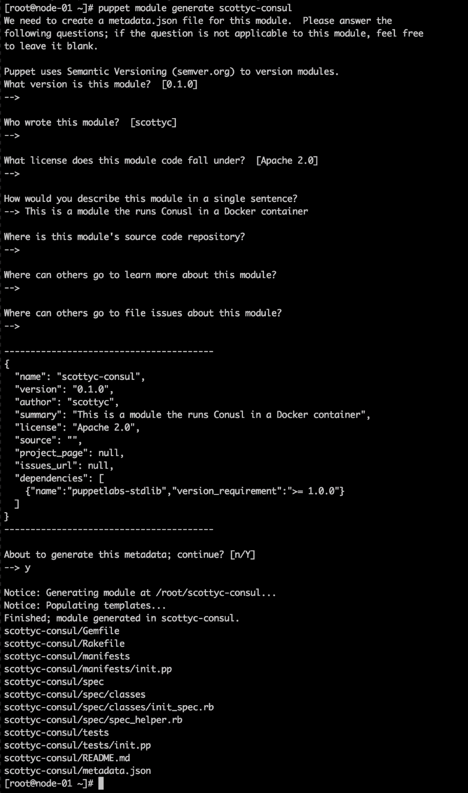

现在我们已经有了 Puppet 模块骨架，接下来我们来看一下它的结构是怎样的：

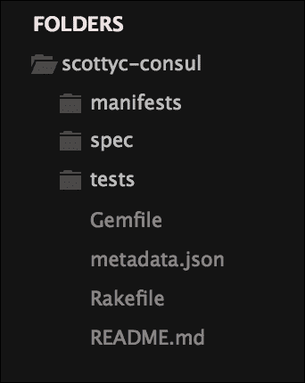

现在，我们将添加一些文件来帮助我们进行单元测试。第一个文件是`.fixtures.yml`。该文件由`spec-puppet`在我们运行单元测试时用来将任何模块依赖项拉取到`spec/fixtures`目录。对于这个模块，`.fixtures.yml`文件应如下图所示：

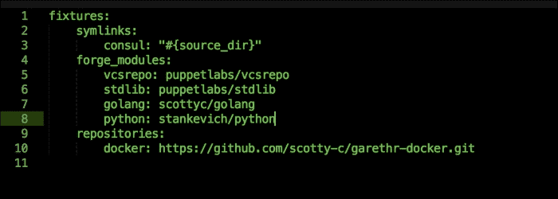

接下来，我们要添加的文件是`.rspec`文件。这个文件是`rspec-puppet`在需要`spec_helper`时使用的，它为我们的单元测试文件夹结构设置了模式。文件内容应如下截图所示：

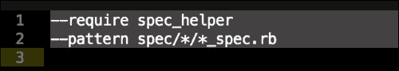

现在我们已经有了文件夹结构，让我们安装运行单元测试所需的 gems。我的个人偏好是将 gems 安装到 Vagrant 虚拟机中；如果你想在本地机器上使用也没问题。那么，让我们登录到 Vagrant 虚拟机（进入 Vagrant 仓库的根目录，使用`vagrant ssh`命令，然后使用`sudo -i`切换到 root 用户）。首先，我们将使用`yum install -y ruby`安装 Ruby。安装完成后，让我们进入`/vagrant/<your modules folder>`目录，然后运行`gem install bundler && bundle install`。你应该看到以下输出：

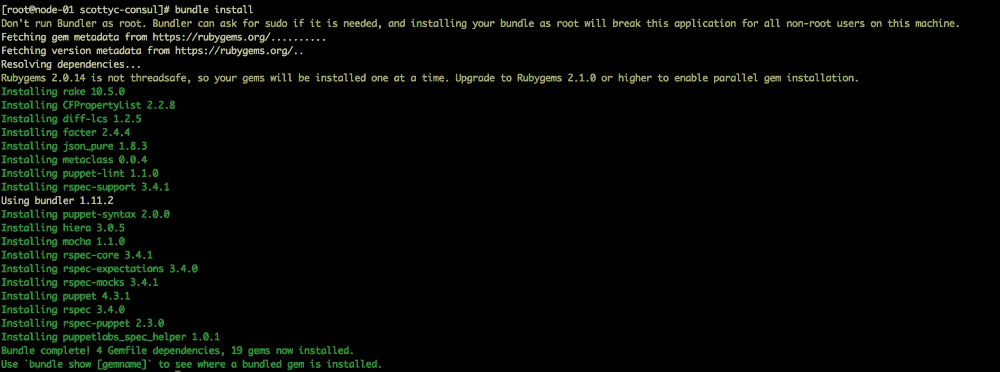

如前面的截图所示，我们收到了一些警告。这是因为我们以 root 用户运行了`gem install`。在生产系统中我们不会这么做，但由于这是我们的开发虚拟机，这不会造成问题。现在我们已经安装了所有单元测试所需的 gems，让我们在`/spec/classes/init_spec.rb`中添加一些基本的事实。我们将要添加的事实是`osfamily`和`operatingsystemrelease`。所以，文件将如下截图所示：

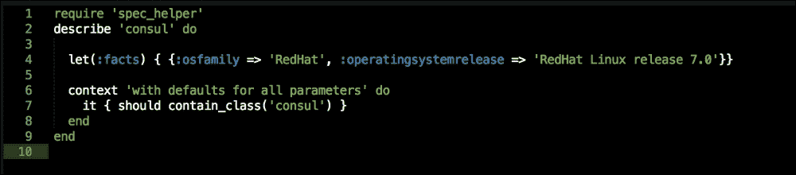

最后，我们将编辑的是仓库根目录中的`metadata.json`文件。该文件定义了我们的模块依赖项。对于这个模块，我们有一个依赖项`docker`，所以我们需要将其添加到`metadata.json`文件的底部，如下截图所示：

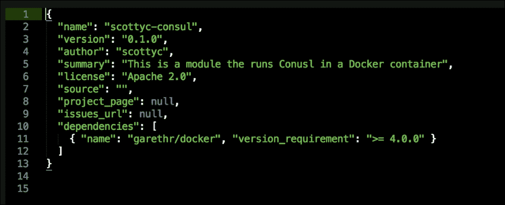

我们需要做的最后一件事是将所有内容放置在我们 Vagrant 仓库的适当位置。我们通过在 Vagrant 仓库的根目录中创建一个名为`modules`的文件夹来实现这一点。然后，我们执行`mv <AUTHOR>-consul/ modules/consul`命令。请注意，我们移除了作者名，因为我们需要该模块来复制在 Puppet 主机上的样子。现在我们已经准备好了基本的模块骨架，接下来可以开始编写代码了。

# 使用资源声明进行编码

在本节中，我们将使用我们的模块骨架来构建第一个 Docker 应用程序。我们将使用标准的 Puppet 清单来编写它。

但首先，为什么我们写的第一个模块是 Consul？我选择这个应用程序有几个原因。首先，Consul 拥有很多强大的功能，如服务发现和健康检查，还可以用作键值存储。第二个原因是，稍后在本书中，我们将使用我刚才提到的所有功能。因此，当我们查看 Docker Swarm 时，这将派上用场。

## 文件结构

让我们在 `manifests` 文件夹中创建两个新文件，`install.pp` 和 `params.pp`。结构应该如下所示：

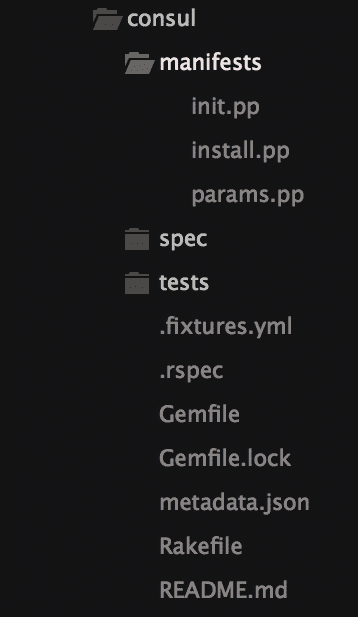

## 编写我们的模块

让我们开始编写我们的模块。我们将从 `init.pp` 开始；这个模块不会非常复杂，因为我们只需要添加几行代码和一些参数。正如前面的截图所示，我们在 `manifests` 目录中创建了三个文件。当我编写一个模块时，我总是喜欢从 `params.pp` 开始，因为它为我提供了一个很好的起始结构，可以用于编写提供模块逻辑的代码。所以，让我们看一下这个模块的 `params.pp`，如下图所示：

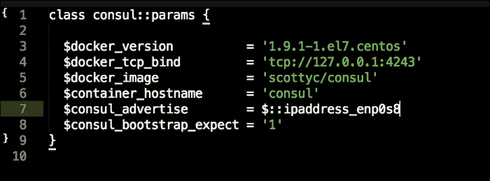

现在，让我们看一下我们设置的参数：

+   `$docker_version`：这是我们将要安装的 Docker 版本。

+   `$docker_tcp_bind`：这是 Docker API 将要绑定的 IP 地址和端口。

+   `$docker_image`：这是我们将从 Docker Hub 使用的 Docker 镜像。我们将使用我的 Consul 镜像。要了解更多关于该镜像的信息或获取 Dockerfile，请访问[`hub.docker.com/r/scottyc/consul/`](https://hub.docker.com/r/scottyc/consul/)。

+   `$container_hostname`：这将设置容器内的主机名。

+   `$consul_advertise`：这是 Consul 将要广播的 IP 地址。我们将使用一个内置的 Puppet fact，`$::ipaddress_enp0s8`。

+   `$consul_bootstrap_expect`：这设置了 Consul 集群中的节点数量。我们只使用一个节点。如果是生产集群，至少需要使用三个节点。

现在我们已经设置好了参数，让我们开始编写 `install.pp`。顾名思义，这个类将包含安装 Docker、拉取镜像并运行容器的逻辑。所以，让我们看看以下截图中显示的代码：

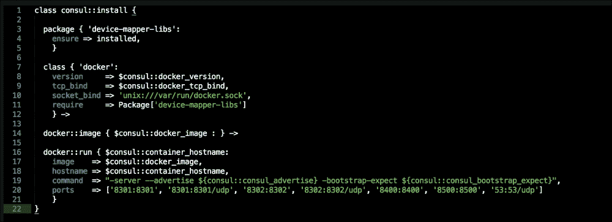

为了更深入地查看代码，我们将把类分为两部分，Docker 安装和容器配置。在 Docker 安装中，第一段代码是 `device-mapper-libs` 的简单包类型。我们确保安装这个包及其依赖项的原因是，它将成为 Docker 用来挂载容器文件系统的存储驱动。

现在，我们继续进行 Docker 安装。我们首先声明`docker`类。对于这个类，我们将设置 Docker 版本，调用我们在`params.pp`中设置的参数，我们使用的 Docker 版本是 1.9.1（这是编写本书时的最新版本）。接下来的配置是 Docker API 的 TCP 绑定。同样，我们将调用`params.pp`类并将其值设置为`tcp://127.0.0.1:4242`。这将使 API 绑定并监听本地主机地址的 TCP 端口`4242`。

我们将要为 Docker 安装设置的最后一个值是 Unix 套接字，Docker 将使用该套接字。我们将声明它，而不调用参数。代码的最后一部分确保`device-mapper-libs`在 Docker 之前安装，因为它是 Docker 安装的前提条件：

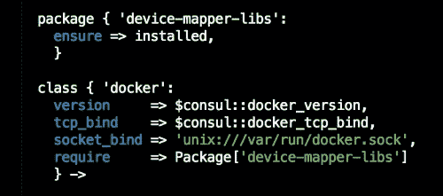

既然我们已经安装了 Docker，让我们来看一下构建 Consul 容器的代码。我们调用的第一个类是`docker::image`。在调用`docker::run`类之前，它会从 Docker Hub 拉取镜像。在`docker::run`类中，我们将`navmar`设置为与容器主机名相同的值。我们将从`params.pp`中获取该值，并将其设置为`consul`。

我们将要设置的下一个配置是镜像。这与调用`docker::image`不同。当你调用`docker::image`时，它会从 Docker Hub 拉取镜像到本地文件系统。当我们在`docker::run`类中设置镜像值时，它会设置容器部署所需的基础镜像值。该值被设置为`scottyc/consul`，我们同样会从`params.pp`中获取这个值。`hostname`参数将设置容器内的主机名。

现在我们来看`resource`属性，它将运行时配置的参数传递给容器。`command`属性是一个任意属性，允许你在启动时将配置传递给容器。在本例中，我们将为 Consul 设置传递启动配置，包括服务器角色、Consul 应用程序将绑定的 IP 地址，以及 Consul 集群中的服务器数量。在第一个例子中，我们传递给`command`属性的所有参数值都来自`params.pp`：

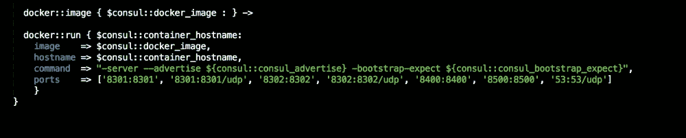

现在，最后但绝对重要的一步，让我们看看我们的`init.pp`文件包含了什么。你会注意到，在主类声明后面的顶部，所有参数都映射到了`params.pp`。我们这样做的原因是为了在`params.pp`中设置一些合理的配置或默认值，而对于敏感数据，我们可以通过 Hiera 查找来覆盖这些默认值。我们将在下一章中讨论 Hiera 查找。代码的最后一行包括了我们的`consul::install`类，这部分我们在前面的章节中已经讲解过：

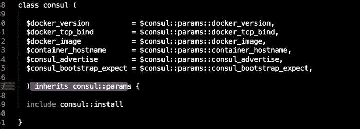

现在，让我们运行我们的模块。

## 运行我们的模块

现在我们已经编写了我们的模块，我确信我们都很乐意运行它；但是，在我们这样做之前，我们需要向`servers.yml`和`default.pp`添加一个配置片段。首先，我们需要确保我们的模块`consul`位于`modules/consul`中。接下来的步骤是打开我们的`servers.yml`文件，并在 shell 命令底部添加以下行：

```
- { shell: cp /home/vagrant/node-01/modules/* -R /tmp/modules }

```

这将把我们的模块复制到 Vagrant 盒子中的正确模块路径。我们还需要转发 Consul 端口，以便可以访问 GUI。通过添加`- { guest: 8500, host: 8500 }`到转发端口属性来完成。它应如下屏幕截图所示：

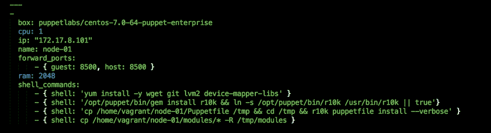

现在，让我们打开我们的`manifests`目录并编辑`default.pp`。我们只需要将我们的模块添加到节点定义中。您可以通过添加`include consul`配置来实现这一点，如下面的屏幕截图所示，并保存这两个文件：

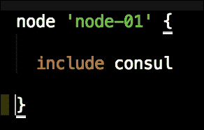

让我们前往我们的终端，将目录更改为我们的 Vagrant 存储库的根目录，并输入`vagrant up`命令。现在，如果此虚拟机已经在运行，可以执行`vagrant destroy -f && vagrant up`命令。输出应如下屏幕截图所示：

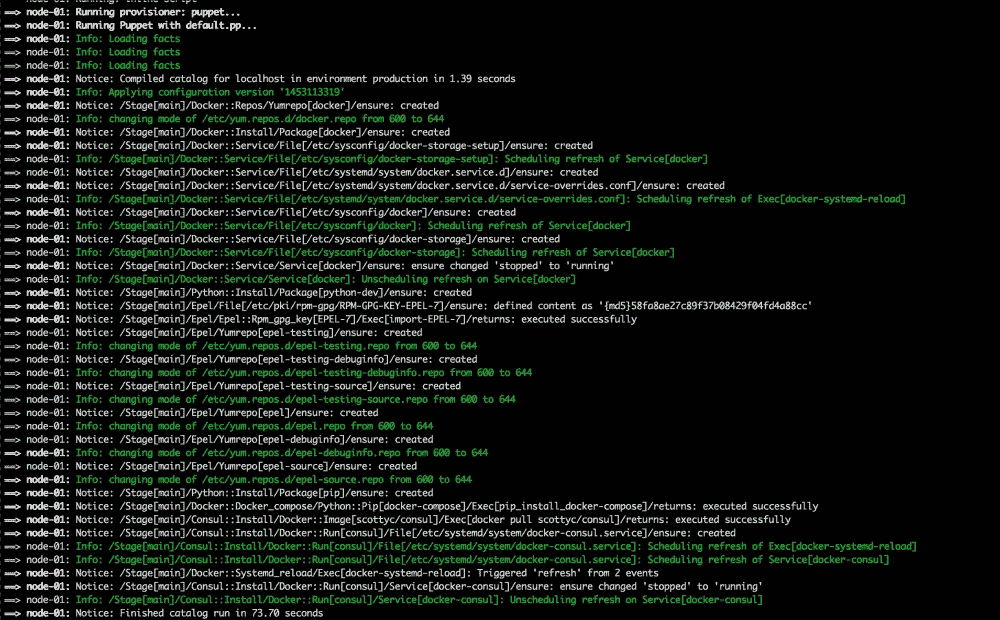

即使我们已经成功运行了 Puppet，容器首次启动可能需要几分钟，因为它从 Docker Hub 下载镜像，所以请耐心等待。您可以通过在浏览器中输入`127.0.0.1:8500`来轻松检查容器何时启动。您应该看到 Consul GUI，如以下屏幕截图所示：

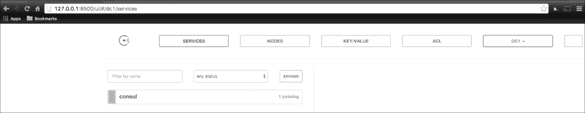

正如您所见，我们有一个名为`consul`的运行节点，这是我们给容器命名的主机名。

# 使用`.erb`文件进行编码

在本主题中，我们将使用`docker-compose`部署相同的容器，但有所不同。不同之处在于使用 Puppet，我们可以将`docker-compose.yml`文件转换为`docker-compose.yml.erb`。这使我们能够利用 Puppet 提供的所有工具来操作模板文件。这绝对是我喜欢使用 Puppet 部署容器的方式；然而，随着我们继续阅读本书，我会让您自己决定最喜欢的方法。

## 使用 Docker Compose 编写我们的模块

在本章中，我们将看看如何将`docker-compose`作为`.erb`模板文件使用。在本例中，我们仅部署单个容器，但是当应用程序包含五到六个带有链接的容器时，这种方式比使用标准清单声明更为高效。

因此，我们将采用上一主题中的`consul`模块，并现在修改它以使用`docker-compose`。如果您想保留该模块，只需复制即可。首先，我们不会触及`init.pp`和`params.pp`——它们将保持不变。现在，让我们来看看`install.pp`：

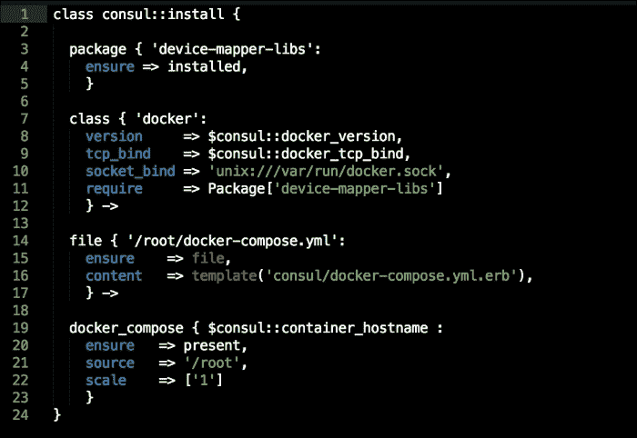

如你所见，在上面的截图中，类的上半部分完全相同。然而，我们仍然安装 `device-mapper-libs` 并以相同的方式声明 `docker` 类。下一个属性有所不同；这里，我们调用文件资源类型。原因是，这是用于将 `docker-compose` 文件放置到本地文件系统上的配置。你可以看到，我们正在使用一个位于模块 `templates` 目录中的模板文件来声明文件内容。稍后我们会回到这一部分。

现在，让我们看一下 `install.pp` 中的最后一个资源类型。我们调用了 `docker_compose` 类型，因为这是会运行 `docker-compose` 命令来启动容器的资源类型。我们来看看我们已经配置的属性。第一个是 `navmar`；这将设置容器的 Docker 名称标签。我们从 `params.pp` 中调用这个值，它将被设置为 `consul`。`ensure` 是一个 Puppet 元参数容器，它确保容器始终存在。

如果我们想删除容器，需要将该值设置为 `absent`。下一个属性是 `source`；它设置了 `docker-compose` 命令查找 `docker-compose` 文件的文件夹位置。我们已将其设置为 `root`。你可以将此值更改为系统中的任何文件夹。最后一个属性是 `scale`。它告诉 `docker-compose` 我们需要多少个容器。这个实例中，我们将值设置为 `1`。如果我们要部署一个 nginx 网页服务器集群，可能会将此值设置为 5。现在，让我们回到模板文件。我们需要做的第一件事是在 `consul` 模块的根目录下创建一个名为 `templates` 的文件夹：

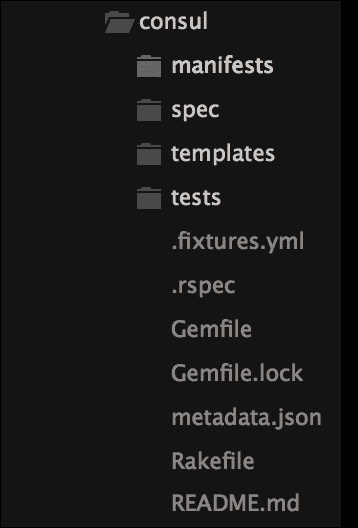

接下来的步骤是创建我们的 `.erb` 模板文件。在 `install.pp` 中，我们声明了文件名为 `docker-compose.yml.erb`，所以在我们的 `templates` 目录中，创建一个同名的文件。文件的内容应如下图所示：

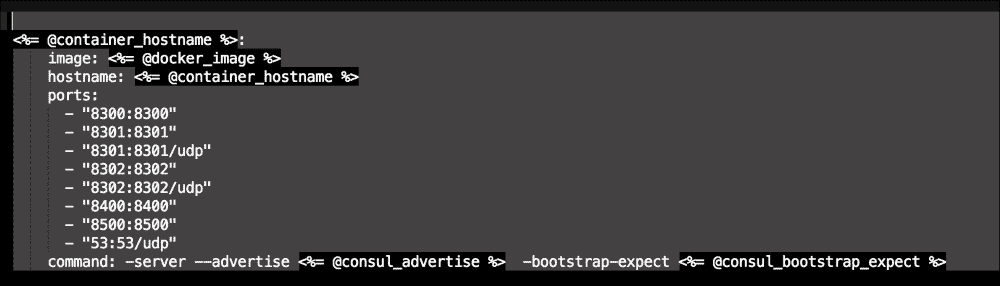

因此，你应该注意到上图中的第一个要点是设置的变量，例如 `<%= @container_hostname %>`。它映射回 `init.pp` 中的 `$container_hostname`。正如你所看到的，`image`、`hostname`、`ports` 和 `command` 等属性看起来非常熟悉。这是因为它们与我们在前一部分中声明的属性相同。在这个例子中，我们只为单个容器配置了 `docker-compose` 文件；在接下来的主题中，我们将探讨更复杂的配置。在我们深入探讨之前，先确保该模块能正常运行。

## 使用 Puppet 启动 Docker Compose

要运行我们的模块，确保模块位于 Vagrant 仓库根目录下的`modules/consul`目录中。我们已经配置了端口转发`8500`（`forwarded_ports: - { guest: 8500, host: 8500 }`），并通过`- { shell: cp /home/vagrant/node-01/modules/* -R /tmp/modules }`将我们的模块复制到模块路径目录。

一旦设置完成，在我们 Vagrant 仓库的根目录下运行`vagrant up`命令。如果你已经有一个正在运行的 box，请执行`vagrant destroy -f && vagrant up`命令。终端应该会显示以下输出：

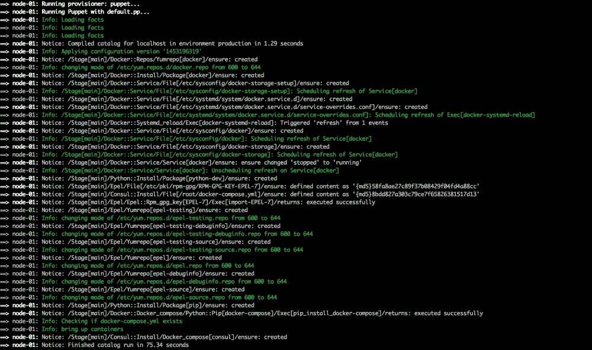

同样，我们可以访问`127.0.0.1:8500`来查看 Consul 的 GUI 界面：

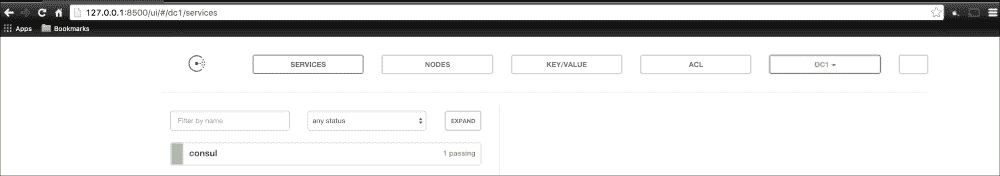

现在，让我们登录到我们的 Vagrant box；我们可以通过在终端中从 Vagrant 仓库的根目录执行`vagrant ssh`命令来实现。一旦登录，我们可以使用`su`切换到 root 用户（`sudo -i`）。然后，我们可以执行`docker ps`命令查看所有正在运行的容器。终端应该会显示以下输出：

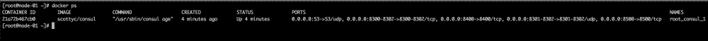

如你所见，容器已经启动并在运行。

# 总结

在本章中，我们使用 Puppet 部署了第一个容器。在这个过程中，我们实际上已经涵盖了许多内容。现在，我们已经拥有了创建 Puppet 模块的脚本，并且知道如何通过`metadata.json`和`.fixtures.yml`来映射 Puppet 模块的依赖关系。

在我们的工具箱中，现在有两种使用 Puppet 部署容器的方法，这将在接下来的章节中非常有用。
