# 第七章：容器调度器

现在，我们已经进入本书的核心部分。目前，关于这个话题有很多讨论。容器的未来将会是这样的，而调度器可以解决很多问题，比如根据负载将我们的应用程序负载分配到多个主机上，以及在原始主机失败时，在另一个实例上启动容器。在这一章中，我们将介绍三种不同的调度器。首先，我们将介绍 Docker Swarm，这是一个 Docker 开源调度器。我们将搭建五台服务器，并演示如何创建一个复制的主节点。然后，我们将运行几个容器，看看 Swarm 如何在节点之间调度它们。接下来，我们将介绍 Docker **UCP**（**Universal Control Plane**）。这是 Docker 的企业解决方案，并与 Docker Compose 集成。我们将搭建一个三节点集群并部署我们的 Consul 模块。由于 UCP 有图形化界面，我们将从那里了解 UCP 的调度方式。最后，我们将介绍 Kubernetes。这是谷歌提供的解决方案，也是开源的。对于 Kubernetes，我们将使用容器搭建一个单节点，并利用 Puppet 定义更复杂的类型。正如你所看到的，我们将从不同的角度来看待每个调度器，因为它们各自有不同的优缺点。根据你的使用场景，你可能会选择其中一个或多个调度器来解决你可能遇到的问题。

# Docker Swarm

对于我们的第一个调度器，我们将介绍 Docker Swarm。这是一个非常稳定的产品，在我看来，相较于 Kubernetes，它有些被低估了。在过去几次发布中，Swarm 有了长足的进展。现在它支持主节点复制，并能在主机失败时重新调度容器。那么，接下来我们将看一下我们要构建的架构，之后我们会进入编程部分。

## Docker Swarm 架构

在这个示例中，我们将搭建五台服务器，其中两台将作为主节点的复制，其他三台将加入 Swarm 集群。由于 Docker Swarm 需要一个键值存储后端，我们将使用 Consul。在这个示例中，我们不会使用我们的 Consul 模块，而是使用[`forge.puppetlabs.com/KyleAnderson/consul`](https://forge.puppetlabs.com/KyleAnderson/consul)。这样做的原因是，在这三个示例中，我们将采用不同的设计选择。因此，在构建解决方案时，你将面临多种实现方式。在这个例子中，我们将使用 Puppet 将 Swarm 和 Consul 安装到操作系统上，然后在其上运行容器。

## 编程

在这个例子中，我们将创建一个新的 Vagrant 仓库。所以，我们将使用 Git 克隆[`github.com/scotty-c/vagrant-template.git`](https://github.com/scotty-c/vagrant-template.git)到我们选择的目录中。我们首先要编辑的是 Puppetfile。它位于 Vagrant 仓库的根目录中。我们将向文件中添加以下更改：

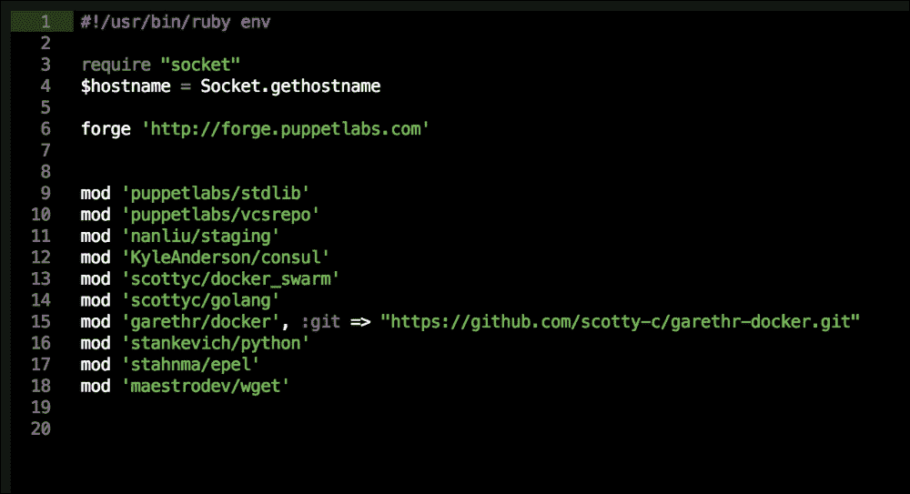

接下来我们将编辑的文件是 `servers.yaml`。同样，该文件位于我们 Vagrant 仓库的根目录下。我们将向其中添加五个服务器。因此，我会将该文件分解为五个部分，每个部分对应一个服务器。

首先，让我们看一下服务器 1 的代码：

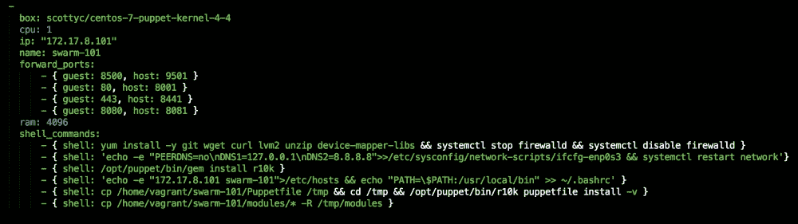

现在，让我们看看服务器 2 的代码：

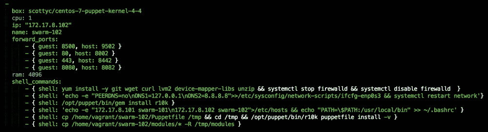

以下截图显示了服务器 3 的代码：

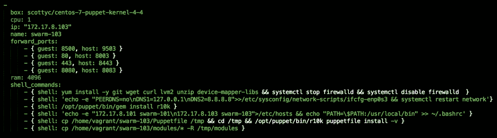

以下截图显示了服务器 4 的代码：

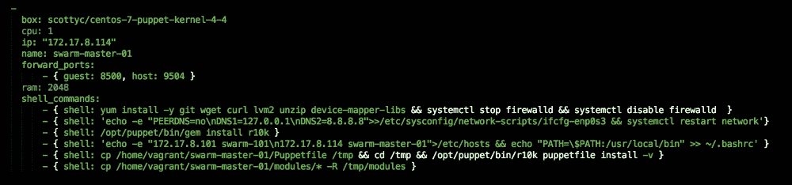

最终，服务器 5 的代码如下：

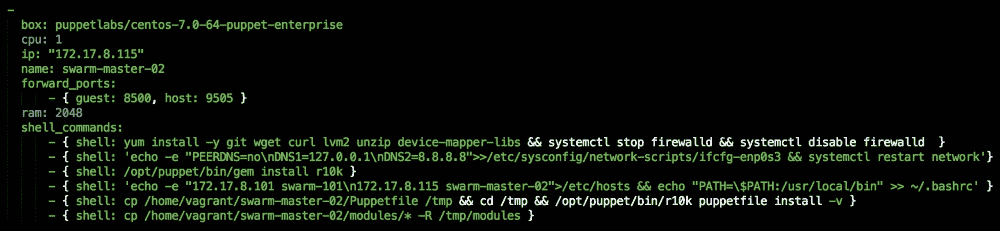

这一切对你来说应该比较熟悉。需要特别注意的是，我们已使用了服务器 1 至 3 作为我们的集群节点。4 和 5 将是我们的主节点。

接下来我们要做的是向 Hiera 添加一些值。这是我们第一次使用 Hiera，所以让我们查看位于 Vagrant 仓库根目录下的 `hiera.yaml` 文件，看看我们的配置，如下所示：

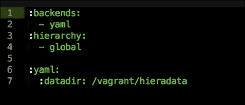

如你所见，我们有一个基本的层级结构。我们只需要查看一个文件，即我们的 `global.yaml` 文件。我们可以看到该文件位于 `hieradata` 文件夹中，因为它被声明为我们的 `data` 目录。因此，如果我们打开 `global.yaml` 文件，我们将向其中添加以下值：

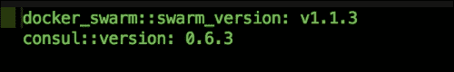

第一个值将告诉 Swarm 我们要使用哪个版本。最后一个值设置了我们将使用的 Consul 版本，即 `0.6.3`。

接下来我们需要做的是编写部署 Consul 和 Swarm 集群的模块。到目前为止，我们在书中已经创建了相当多的模块，因此这里不再重复讲解。我们将创建一个名为 `<AUTHOR>-config` 的模块。然后，我们将把该模块移到 Vagrant 仓库根目录下的 `modules` 文件夹中。现在，让我们看看我们将要添加到 `init.pp` 文件中的内容：

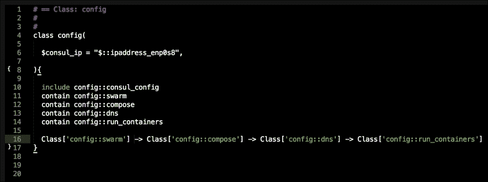

如你所见，这将设置我们的模块。我们需要为 `init.pp` 文件中的每个条目创建一个 `.pp` 文件，例如 `consul_config.pp`、`swarm.pp` 等等。我们还声明了一个名为 `consul_ip` 的变量，其值实际上来自 Hiera，因为我们之前就在那里设置了这个值。我们将按字母顺序查看我们的文件。因此，我们将从 `config::compose.pp` 开始，它如下所示：

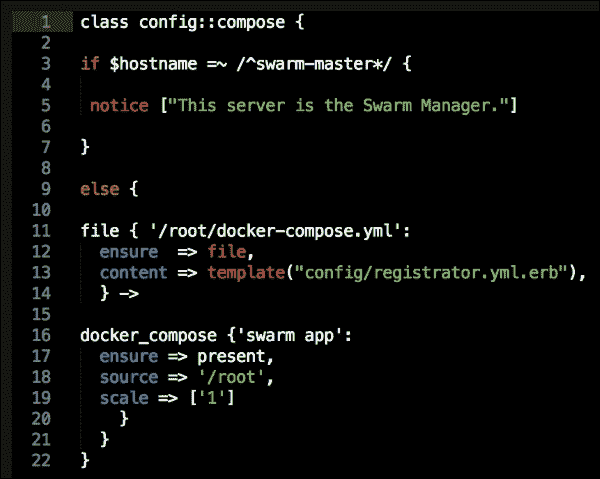

在这个类中，我们正在设置一个注册器。我们将使用 Docker Compose 来实现这一点，因为它是一种熟悉的配置，而且我们之前已经讲解过。你会注意到代码中有一个 `if` 语句。这是一个逻辑，只有在集群成员上才会运行容器。我们不希望在主节点上运行容器应用程序。接下来，我们将查看的文件是 `consul_config.pp`，它如下所示：

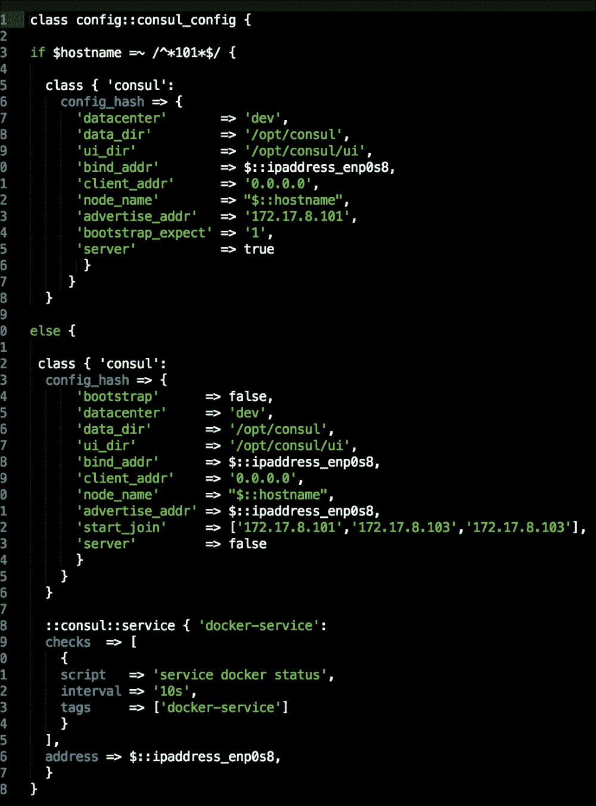

在这个类中，我们将配置 Consul，这个内容我们在本书中已经介绍过。我总是喜欢寻找多种方法来完成同样的任务，因为你永远不知道明天可能需要的解决方案，而且你总是想为每个任务选择合适的工具。因此，在这个例子中，我们将不会在容器中配置 Consul，而是直接在主机操作系统上配置。

你可以看到，代码被分成了三个块。第一个块引导我们的 Consul 集群。你会注意到，配置是熟悉的，因为它们与我们在前一章节中用来设置容器的配置相同。第二个代码块在集群引导后设置集群成员。我们之前没有见过这个第三个代码块。它为 Consul 设置了一个监控服务。这只是我们可以管理的一小部分，但我们将在下一章深入探讨。接下来让我们看看下一个文件，即`dns.pp`：

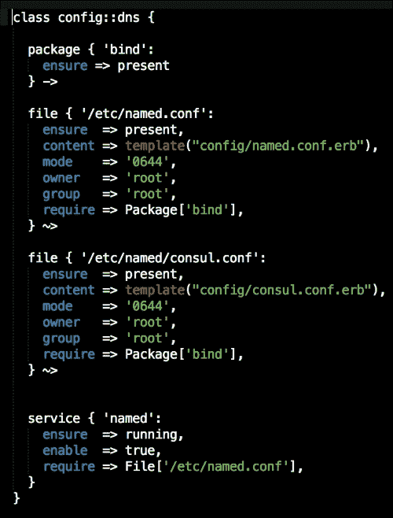

你会注意到，这个文件与我们在`consul`模块中使用的文件完全相同。所以，我们可以继续下一个文件，也就是`run_containers.pp`：

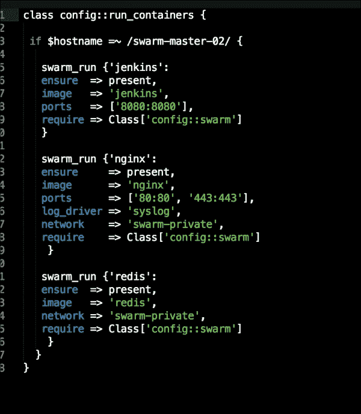

这是在我们的集群上运行容器的类。顶部声明了我们希望第二个主机发起对集群的调用。我们将部署三个容器应用。第一个是`jenkins`，如你所见，我们将把 Jenkins 的 Web 端口`8080`暴露给容器运行的主机。下一个容器是`nginx`，我们将同时将`80`和`443`端口转发到主机，并且将`nginx`连接到我们的私有网络，即`swarm-private`集群。为了从`nginx`获取日志，我们将告诉容器使用 syslog 作为日志驱动程序。我们将运行的最后一个应用是`redis`。这将作为`nginx`的后端。你会注意到，我们没有转发任何端口，因为我们将 Redis 隐藏在我们的内部网络中。现在我们的容器已经配置完毕，我们还有一个文件没有处理，那就是`swarm.pp`。这个文件将配置我们的 Swarm 集群和内部 Swarm 网络，如下所示：

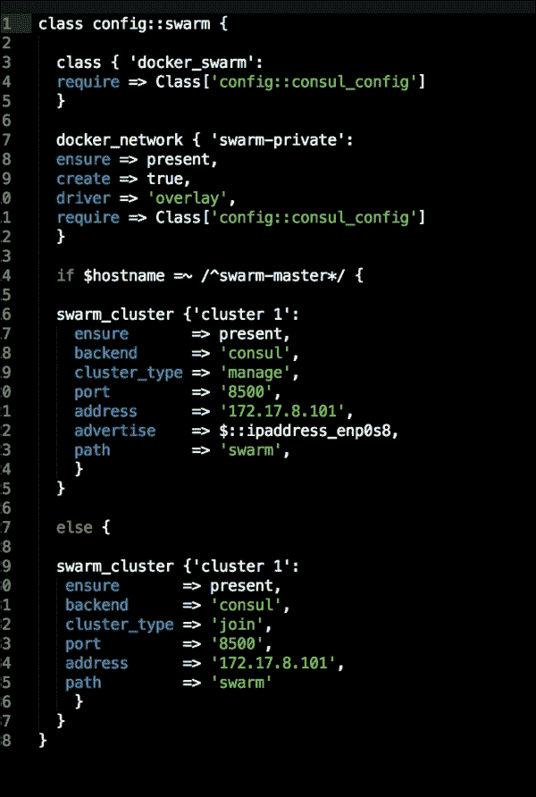

第一个资源声明将安装 Swarm 二进制文件。下一个资源将配置每个主机上的 Docker 网络。接下来的`if`语句将定义 Swarm 节点是主机还是集群的一部分，通过`hostname`来判断。如你所见，我们声明了一些默认值，这些值是告诉 Swarm 使用 Consul 作为后端的初始值。第二个值告诉 Swarm Consul 后端的 IP 地址，即`172.17.8.101`。第三个值告诉 Swarm 它可以在`8500`端口访问 Swarm。第四个值告诉 Swarm 在哪个接口上广播集群，在我们的情况下是`enp0s8`。最后一个值设置 Swarm 将使用的键值存储的根目录。现在，让我们在模块的根目录下创建`templates`文件夹。

我们将在那里创建三个文件。第一个文件将是 `consul.conf.erb`，其内容如下：

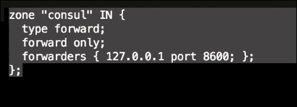

下一个文件将是 `named.conf.erb`，其内容如下：

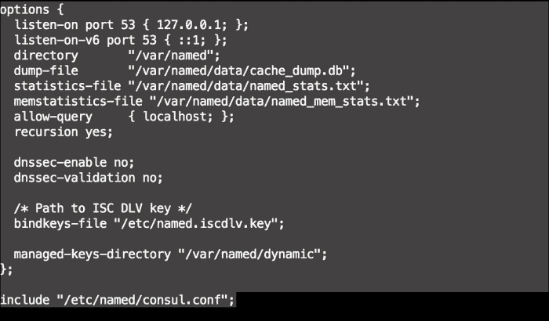

最后的文件将是 `registrator.yml.erb`，文件内容如下：

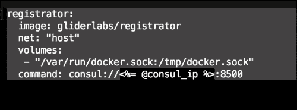

接下来，我们需要在 Vagrant 仓库根目录下的 `manifest` 文件夹中的 `default.pp` 清单文件中添加我们的 `config` 类：

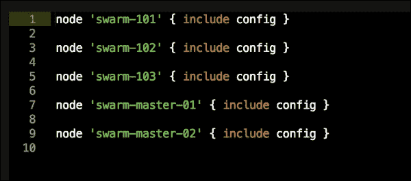

现在，我们的模块已完成，准备运行我们的集群。所以，让我们打开终端，将目录更改为 Vagrant 仓库的根目录，并输入 `vagrant up` 命令。现在，我们正在构建五个服务器，所以请耐心等待。待最后一个服务器构建完成后，终端输出应该与截图中所示的内容类似：

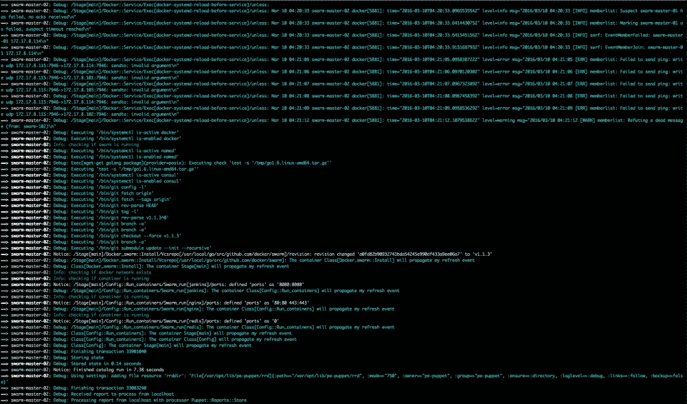

终端输出

现在，我们可以通过 `127.0.0.1:9501` 查看我们的 Consul 集群的 Web 界面（记得我们在 `servers.yaml` 文件中更改了端口），如下所示：

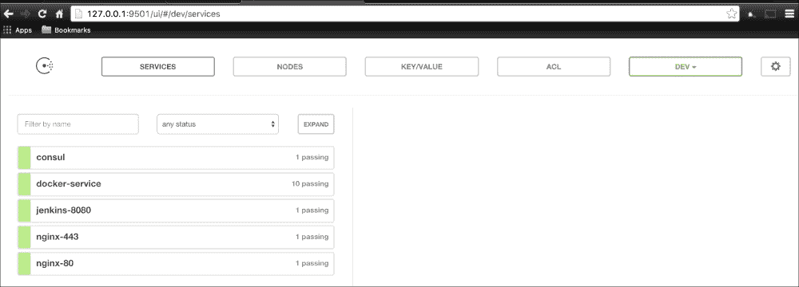

现在，让我们看看我们的 Jenkins 服务运行在哪个主机上：

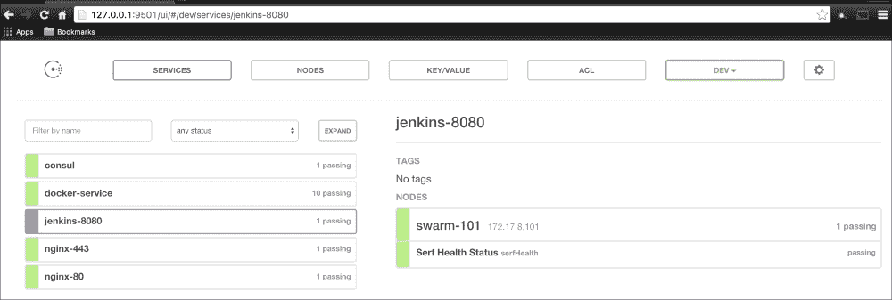

在这个例子中，我的服务在集群节点 101 上启动。你可能会在集群中得到一个不同的主机。所以，我们需要检查 `8080` 端口转发到我们的 `servers.yaml` 文件中的哪个端口。在我的例子中，它是 `8081`。所以，如果我打开浏览器，打开一个新标签页并访问 `127.0.0.1:8081`，我们会看到 Jenkins 页面，内容如下：

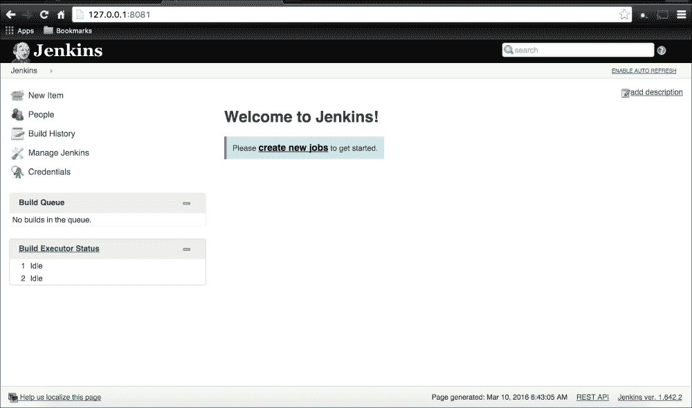

你可以用 nginx 做同样的事，我将把这个任务留给你作为挑战。

# Docker UCP

本主题将介绍 Docker 的新产品 UCP。该产品并非开源，因此需要付费许可。你可以获得一个 30 天的试用许可（[`www.docker.com/products/docker-universal-control-plane`](https://www.docker.com/products/docker-universal-control-plane)），我们将使用这个试用许可。Docker UCP 简化了管理调度器所有组件的复杂性，这可能在你的使用场景中是一个巨大的优势。Docker UCP 还带有一个 Web UI 用于管理。所以，如果容器调度器看起来令你感到棘手，这可能是一个完美的解决方案。

## Docker UCP 架构

在这个例子中，我们将构建三个节点。第一个将是我们的 UCP 控制器，其他两个节点将是 UCP HA 副本，提供故障容忍性。由于 UCP 是一个封装产品，我不会深入讨论所有的组成部分。

请参考下图，了解主要组件的可视化：

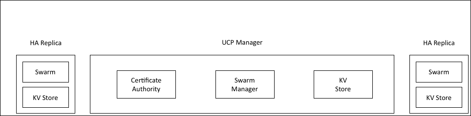

## 编码

在这个模块中，我们将做一些不同的事情，目的是展示我们的模块可以移植到任何操作系统。我们将使用 Ubuntu 14.04 服务器来构建这个模块。同样，对于这个环境，我们将创建一个新的 Vagrant 仓库。那么，让我们通过 Git 克隆我们的 Vagrant 仓库([`github.com/scotty-c/vagrant-template.git`](https://github.com/scotty-c/vagrant-template.git))。和上一个话题一样，我们首先会查看管道设置，然后再编写我们的模块。我们要做的第一件事是创建一个名为`config.json`的文件。该文件将包含你的 Docker Hub 认证信息：

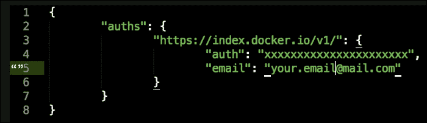

接下来是`docker_subscription.lic`文件。该文件将包含你的试用许可证。

现在，让我们来看一下 Vagrant 仓库根目录中的`servers.yaml`文件，如下所示：

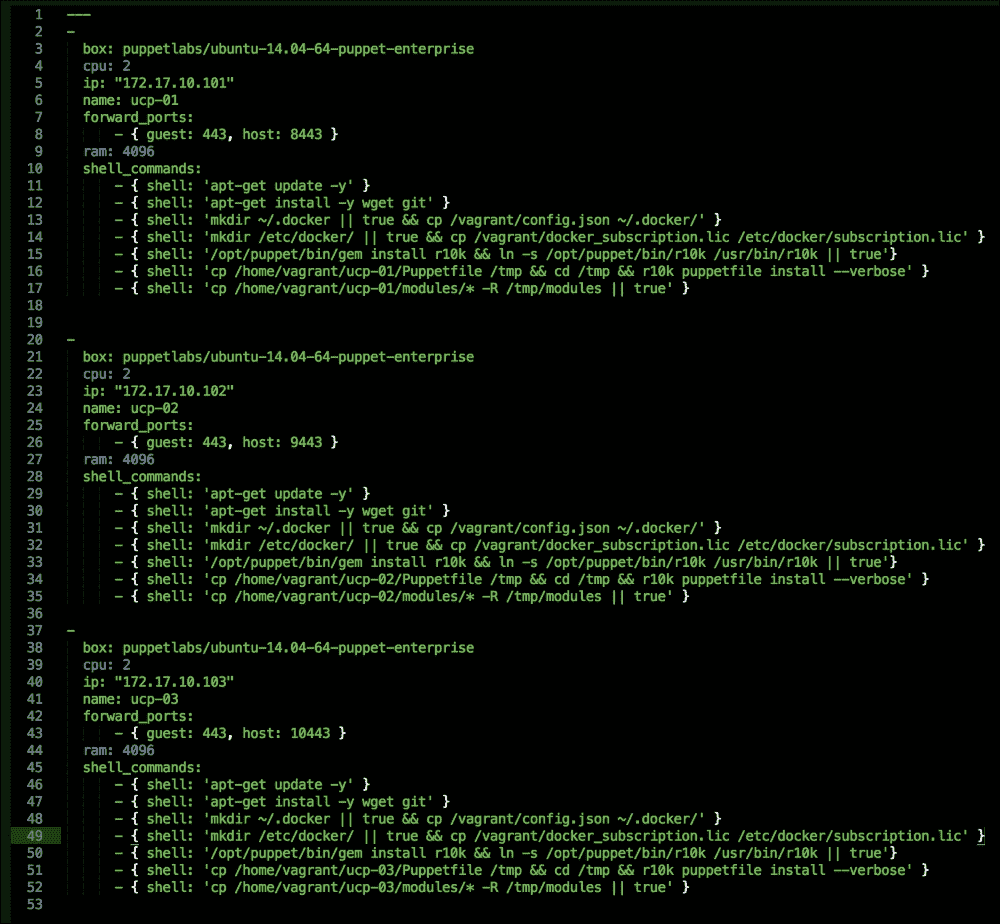

这里的主要内容是，我们现在使用的是`puppetlabs/ubuntu-14.04-64-puppet-enterprise` Vagrant 盒子。我们已经将`yum`改为`apt-get`。接着，我们将`config.json`和`docker_subscription.lic`文件复制到 Vagrant 盒子上的正确位置。

现在，我们将查看需要在我们的 Puppetfile 中进行的更改：

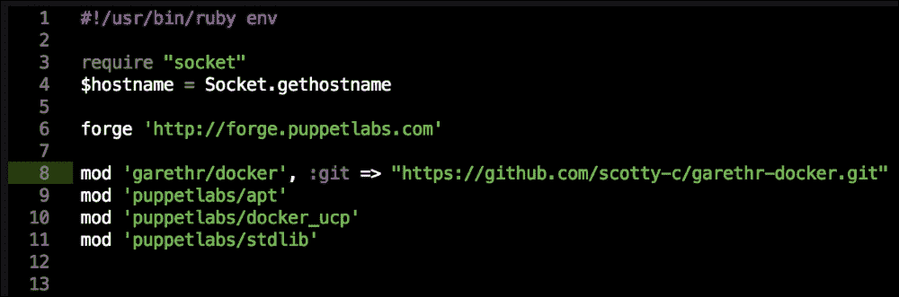

你会看到我们需要从 Forge 下载一些新的模块。Docker 模块是熟悉的，stdlib 模块也一样。我们还需要 Puppetlab 的`apt`模块来控制 Ubuntu 用来拉取 Docker 的仓库。最后一个模块是 Puppetlabs 为 UCP 本身提供的模块。要了解更多关于这个模块的信息，可以访问[`forge.puppetlabs.com/puppetlabs/docker_ucp`](https://forge.puppetlabs.com/puppetlabs/docker_ucp)。我们将编写一个包装此类并为我们的环境配置的模块。

现在，来看一下我们在`hieradata/global.yaml`中的 Hiera 文件：

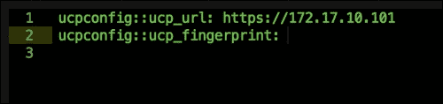

如你所见，我们添加了两个值。第一个是`ucpconfig::ucp_url:`，我们将其设置为我们的第一个 Vagrant 盒子。接下来的值是`ucpconfig::ucp_fingerprint:`，我们暂时将其留空。但请记住它，因为我们稍后会回来处理这个话题。

现在，我们将创建一个名为`<AUTHOR>-ucpconfig`的模块。我们已经做过几次了，所以一旦你创建了模块，就在我们的 Vagrant 仓库的根目录中创建一个名为`modules`的文件夹，并将`ucpconfig`移到该文件夹中。

然后，我们将在模块的`manifest`目录中创建三个清单文件。第一个文件将是`master.pp`，第二个文件将是`node.pp`，最后一个文件将是`params.pp`。

现在，让我们将代码添加到`params.pp`文件中，如下所示：

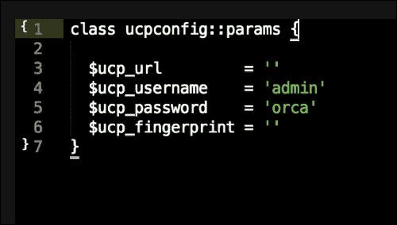

如你所见，我们有四个值：`Ucp_url`，它来自 Hiera；`ucp_username`，其默认值设置为 `admin`；接下来是 `ucp_password`，其默认值设置为 `orca`。最后一个值是 `ucp_fingerprint`，它也来自 Hiera。现在，在生产环境中，我会将用户名和密码都设置在 Hiera 中，并覆盖我们在 `params.pp` 中设置的默认值。在这个测试实验室中，我们将使用默认值。

我们接下来要查看的文件是我们的 `init.pp` 文件，内容如下：

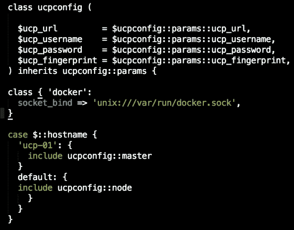

你可以看到，在类的顶部，我们正在映射我们的 `params.pp` 文件。接下来的声明安装 `docker` 类，并设置守护进程的 `socket_bind` 参数。接下来的一段逻辑定义了节点是否为主节点或普通节点，这取决于主机名。如你所见，我们只将 `ucp-01` 设置为我们的主节点。

现在，让我们看一下 `master.pp`：

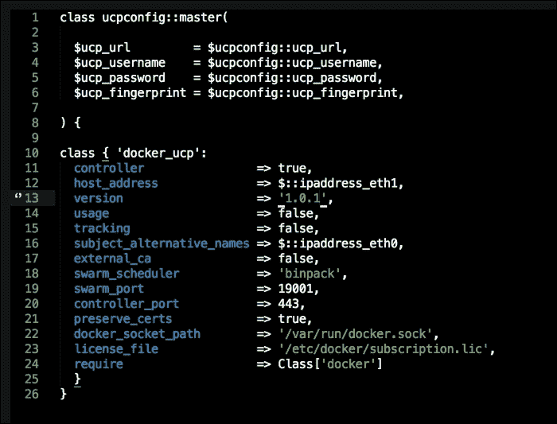

在这个类中，我们有安装 UCP 控制器或主节点的逻辑。在类的顶部，我们将参数映射到我们的 `init.pp` 文件。接下来的代码块调用了 `docker_ucp` 类。如你所见，我们将控制器的值设置为 `true`，主机地址设置为我们的第二个接口，集群的备用名称设置为我们的第一个接口，版本设置为 `1.0.1`（这是编写本书时的最新版本）。然后，我们将为控制器和 Swarm 设置端口。接着，我们会告诉 UCP Docker 套接字的位置，并提供许可证文件的位置。

现在，让我们看一下我们的最后一个文件，`node.pp`：

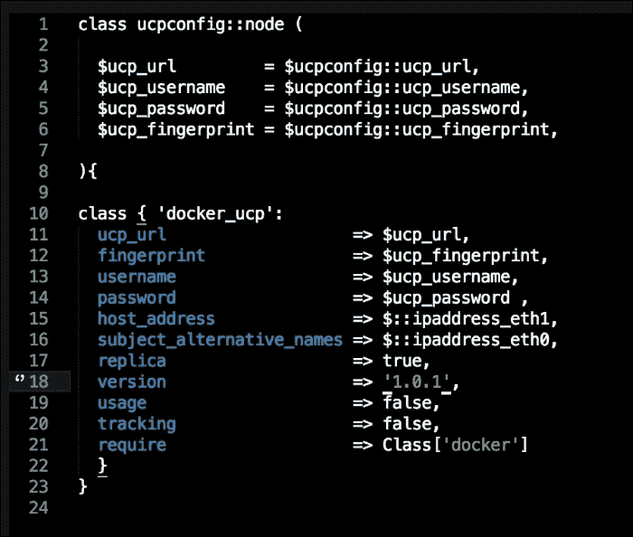

如你所见，大部分设置可能看起来很熟悉。需要注意的是，我们需要将节点指向控制器 URL（我们在 Hiera 中设置了该 URL）。稍后我们将了解管理员用户名和密码以及集群指纹。所以，这就完成了我们的模块。现在，我们需要将我们的类添加到节点中，这将通过在 Vagrant 仓库根目录下的 `manifests/default.pp` 位置添加 `default.pp` 清单文件来实现，具体如下：

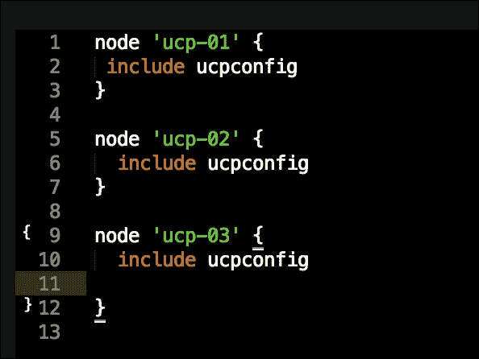

现在，我们进入终端并将目录切换到我们 Vagrant 仓库的根目录。这次，我们要做些不同的事情。我们将执行命令`vagrant up ucp-01`。这将只启动第一个节点。这样做是因为我们需要获取在 UCP 启动时生成的指纹。

我们的终端输出应如下图所示：

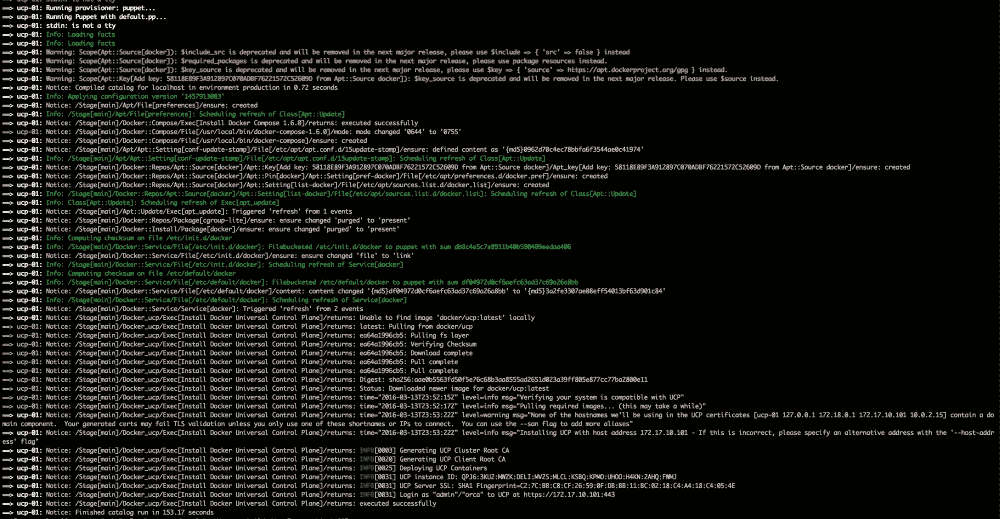

终端输出

你会注意到指纹已经显示在你的终端输出中。以我的示例为例，指纹是 `INFO[0031] UCP Server SSL: SHA1 Fingerprint=C2:7C:BB:C8:CF:26:59:0F:DB:BB:11:BC:02:18:C4:A4:18:C4:05:4E`。所以，我们将把这个指纹添加到我们的 Hiera 文件中，即 `global.yaml`：

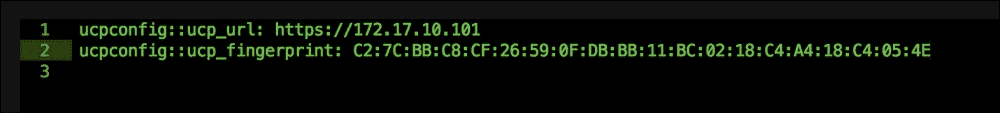

现在我们的第一个节点已经启动，我们应该能够登录 Web UI。我们在浏览器中执行此操作。我们将访问 `https:127.0.0.1:8443`，并看到如下登录页面：

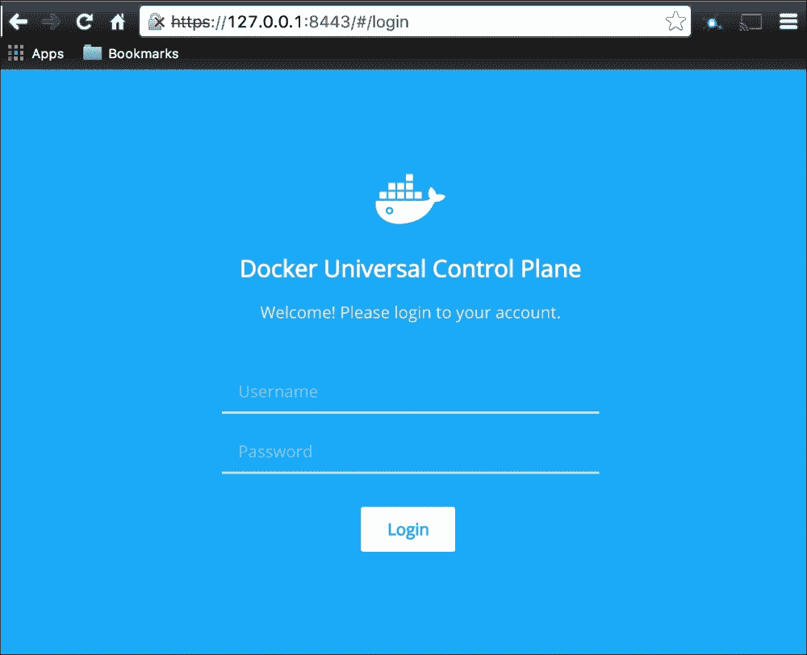

然后，我们将添加在 `params.pp` 文件中设置的用户名和密码：

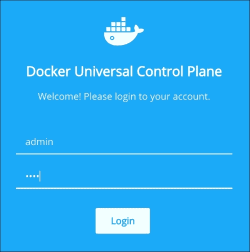

然后，在我们登录后，你会看到我们有一个健康集群，如下所示：

登录后健康集群

现在，让我们回到终端，执行 `vagrant up ucp-02 && vagrant up ucp-03` 命令。

完成后，如果我们查看 Web UI，就能看到集群中有三个节点，具体如下：

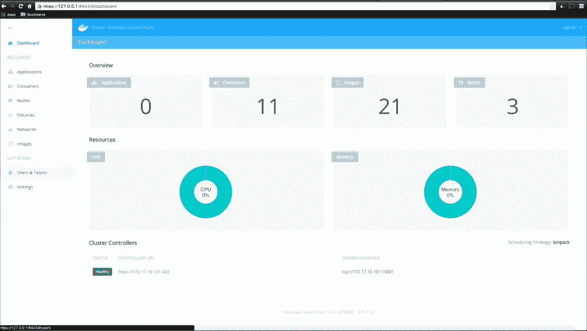

在本书中，我们不会深入探讨如何通过 Web UI 管理集群。我强烈建议你探索这个产品，它具有一些非常酷的功能。所有文档都可以在 [`docs.docker.com/ucp/overview/`](https://docs.docker.com/ucp/overview/) 获取。

# Kubernetes

当前 Kubernetes 备受关注。这是 Google 为容器世界提供的解决方案。Kubernetes 得到了 Google、CoreOS 和 Netflix 等重量级企业的支持。在我们考察过的所有调度器中，Kubernetes 是最复杂的，而且高度依赖于 API。如果你是 Kubernetes 的新手，我建议你进一步了解这个产品，参考 [`kubernetes.io/`](http://kubernetes.io/)。我们将首先了解 Kubernetes 的架构，因为它包含一些动态组件。然后，我们将编写模块，使用容器来完全构建 Kubernetes。

## 架构

我们将会在单个节点上构建 Kubernetes。这样做的原因是，它可以减少使用 Docker 桥接网络时 Flannel 的一些复杂性。本模块将帮助你深入了解 Kubernetes 的工作原理，并使用更高级的 Puppet 技巧。如果你掌握了这一章的内容并希望更进一步，我建议你访问 [`forge.puppetlabs.com/garethr/kubernetes`](https://forge.puppetlabs.com/garethr/kubernetes) 上的模块。这个模块能将 Puppet 和 Kubernetes 推向一个全新的水平。

所以我们要编写的代码如下图所示：

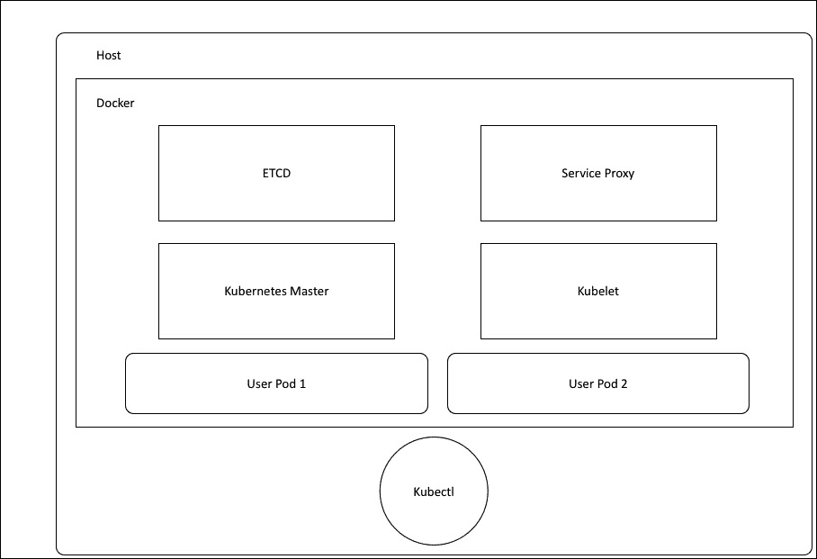

如你所见，我们有一个运行 **etcd** 的容器（要了解更多关于 etcd 的信息，请访问 [`coreos.com/etcd/docs/latest/`](https://coreos.com/etcd/docs/latest/)）。etcd 类似于我们熟悉的 Consul。在接下来的几个容器中，我们将使用 hyperkube ([`godoc.org/k8s.io/kubernetes/pkg/hyperkube`](https://godoc.org/k8s.io/kubernetes/pkg/hyperkube))。它将为我们在多个容器中负载均衡所需的 Kubernetes 组件。看起来挺简单，对吧？让我们进入代码，深入理解所有这些动态组件。

## 编码

我们将再次创建一个新的 Vagrant 仓库。我们不会再重复创建的步骤，因为我们在本章中已经介绍过两次。如果你不确定，只需查看本章的前面部分。

一旦我们创建了 Vagrant 仓库，接下来打开我们的 `servers.yaml` 文件，如下所示：

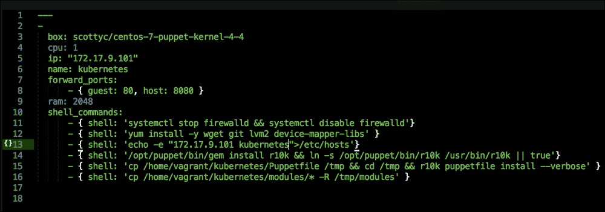

如你所见，这里没有什么特别的内容，我们在本书中都已经涉及过了。这里只有我们之前提到的单节点 `kubernetes`。接下来我们要查看的文件是我们的 Puppetfile。我们当然需要我们的 Docker 模块，`stdlib`，最后是 `wget`。我们需要 `wget` 来获取 `kubectl`：

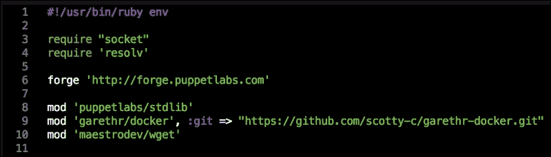

这就是我们设置仓库所需的所有基础设施。让我们创建一个新的模块，名为 `<AUTHOR>-kubernetes_docker`。一旦它创建完成，我们将把它移动到 Vagrant 仓库根目录下的 `modules` 目录中。

我们将在模块中创建两个新文件夹。第一个将是 `templates` 文件夹，另一个是 `lib` 目录。我们将在编码的后期介绍 `lib` 目录。我们首先要创建和编辑的文件是 `docker-compose.yml.erb`。这样做的原因是它是我们模块的基础。我们将向其中添加以下代码：

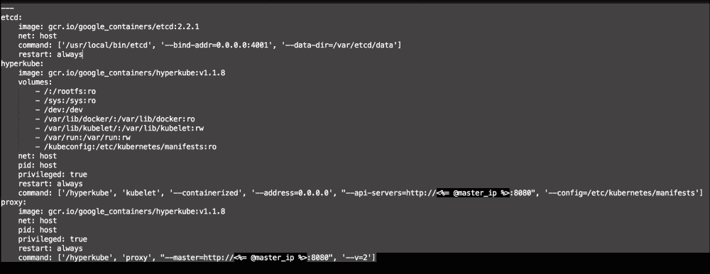

让我们将这个文件分成三个部分，因为里面有很多内容。第一块代码将会设置我们的 etcd 集群。你可以从截图的名称看出，我们使用的是 Google 官方镜像，并且我们使用的是 etcd 版本 2.2.1。我们将容器的访问权限授予主机网络。然后，在命令资源中，我们在启动时传递一些参数给 etcd。

下一个我们创建的容器是 hyperkube。同样，它是一个官方的 Google 镜像。现在，我们将赋予这个容器访问大量主机卷、主机网络和主机进程的权限，使得容器具有特权。这是因为第一个容器将引导 Kubernetes 启动，并且它将启动更多的容器来运行各种 Kubernetes 组件。现在，在命令资源中，我们再次传递一些参数给 hyperkube。我们需要关注的两个主要参数是 API 服务器地址和配置清单。你会注意到我们已经将文件夹 `/kubeconfig:/etc/kubernetes/manifests:ro` 映射过来了。我们将修改我们的清单文件，使得 Kubernetes 环境可以对外部可用。我们稍后会介绍这个，但我们先完成对这个文件中代码的分析。

最后的容器和第三块代码将会设置我们的服务代理。我们将赋予这个容器访问主机网络和进程的权限。在命令资源中，我们将指定该容器为代理。接下来需要注意的是，我们指定了代理可以找到 API 的位置。现在，让我们创建下一个文件，`master.json.erb`。这是 hyperkube 用来调度所有 Kubernetes 组件的文件，具体如下：

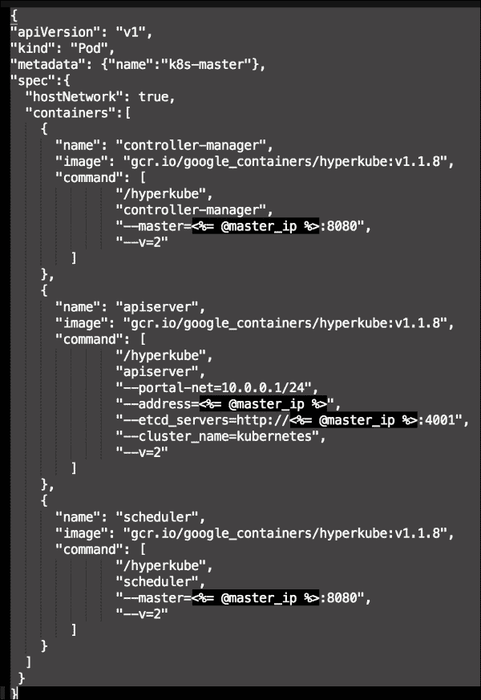

如你所见，我们已经定义了三个容器。这是我们第一次定义 Kubernetes pod（[`kubernetes.io/docs/user-guide/pods/`](http://kubernetes.io/docs/user-guide/pods/)）。Pod 是一组容器，它们共同构成一个应用程序。这与我们在 Docker Compose 中做的类似。如你所见，我们已将所有 IP 地址更改为 `<%= @master_ip %>` 参数。我们将创建四个新文件：`apps.pp`、`config.pp`、`install.pp` 和 `params.pp`。

现在，我们将继续操作 `modules` 清单目录中的文件。准备好，因为这里是魔法发生的地方。其实，这不完全正确。魔法发生在这里和我们的 `lib` 目录中。我们需要为 Puppet 编写一些自定义类型和提供程序，以便它能够控制 Kubernetes，因为 `kubectl` 是用户界面（关于类型，请访问 [`docs.puppetlabs.com/guides/custom_types.html`](https://docs.puppetlabs.com/guides/custom_types.html)，关于提供程序，请访问 [`docs.puppetlabs.com/guides/provider_development.html`](https://docs.puppetlabs.com/guides/provider_development.html)）。

让我们从 `init.pp` 文件开始，如下所示：

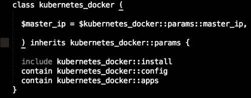

如你所见，这个文件里没有太多内容。我们将使用 `init.pp` 文件来控制类执行的顺序。我们还声明了 `param <%= @master_ip %>`。接下来，我们将继续操作 `install.pp` 文件，如下所示：

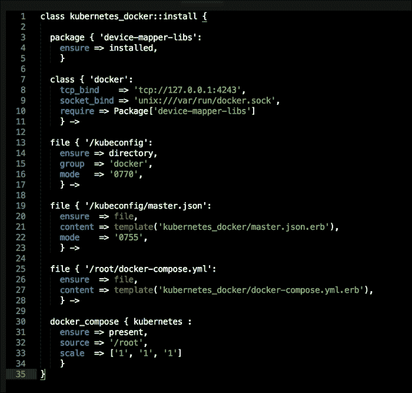

在这个文件中，我们像之前一样安装 Docker。我们将放置我们之前创建的两个模板。然后，我们将运行 Docker Compose 来启动我们的集群。接下来，我们将继续操作 `config.pp`，如下所示：

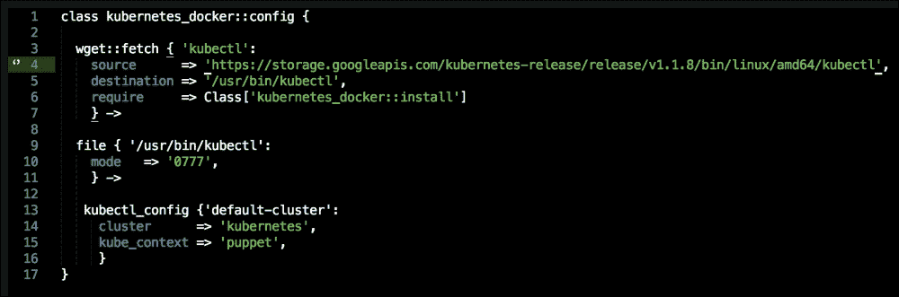

我们首先声明，我们希望将 `wget` 设置为我们的 `kubectl` 客户端，并将其放置在 `/usr/bin/` 目录下（[`kubernetes.io/docs/user-guide/kubectl/kubectl/`](http://kubernetes.io/docs/user-guide/kubectl/kubectl/)）。你需要真正理解这个接口的作用，否则接下来的步骤可能会让你有些迷茫。所以，我建议你对 kubectl 有一个相对清晰的认识，并了解它的功能。接下来，我们将使其可执行并对所有用户可用。现在，最后这段代码没有意义，因为我们还没有调用 `kubectl_config` 类：

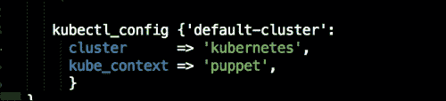

现在，我们需要跳转到 `lib` 目录。首先，我们将创建所有需要的文件夹。我们将首先在 `lib` 目录下创建一个名为 `puppet` 的文件夹。我们将先来看一下我们的自定义类型。我们将在 `puppet` 文件夹下创建一个名为 `type` 的文件夹。以下截图将帮助你理解结构：

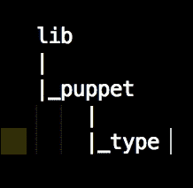

在 `type` 文件夹下，我们将创建一个名为 `kubectl_config.rb` 的文件。在该文件中，我们将添加新的 `type` 参数，如下所示：

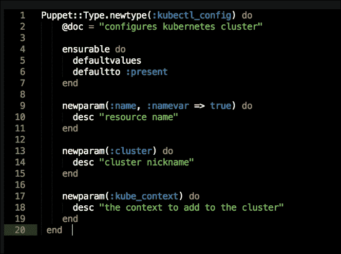

让我解释一下这里发生了什么。在第一行中，我们将声明我们的新类型`kubectl_config`。然后，当新类型被声明为`present`时，我们将设置其默认值。接下来，我们将为我们的类型声明三个值：`name`、`cluster`和`kube_context`。这些都是我们将添加到`config`文件中的设置，该文件将在与`kubectl`交互时使用。现在，我们将在`lib`目录下创建一个名为`provider`的文件夹。然后，在其中创建一个文件夹，文件夹名称与我们自定义类型`kubectl_config`相同。在该文件夹内，我们将创建一个名为`ruby.rb`的文件。在这个文件中，我们将放置提供逻辑的 Ruby 代码，如下所示：

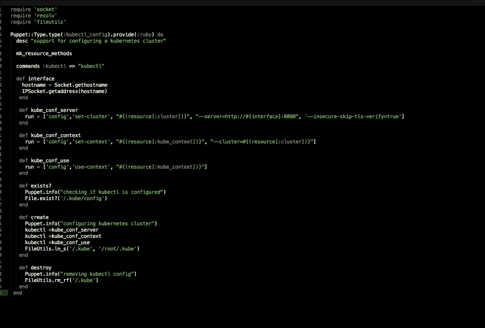

提供程序需要有三个方法，以便 Puppet 能够运行代码。它们是`exists?`、`create`和`destroy`。这些方法都很容易理解。`exists?`方法检查类型是否已经被 Puppet 执行，`create`运行类型，`destroy`在类型设置为`absent`时被调用。

我们现在将从上到下地处理这个文件。我们需要首先加载一些 Ruby 库，以支持我们的某些方法。然后，我们将把这个提供程序与我们的类型绑定。接下来我们需要声明的是`kubectl`可执行文件。

现在我们将编写我们的第一个方法`interface`。这个方法将从主机的主机名获取 IP 地址。接着我们将创建三个其他方法。我们还会创建一个数组，并将所有配置添加到其中。你会注意到，我们正在将我们的参数从类型映射到这些数组中。

在我们的`exists?`方法中，我们将检查我们的`kubectl`配置文件。

在我们的`create`方法中，我们调用`kubectl`可执行文件，并将我们的数组作为参数传递。然后，我们将把`config`文件链接到根目录的主目录（对于我们的实验室环境来说是可以的，在生产环境中，我会使用一个专门的用户账户）。

最后，如果类型被设置为`absent`，我们将删除`config`文件。然后我们将回到`manifests`目录，查看我们的最后一个文件，即`apps.pp`：

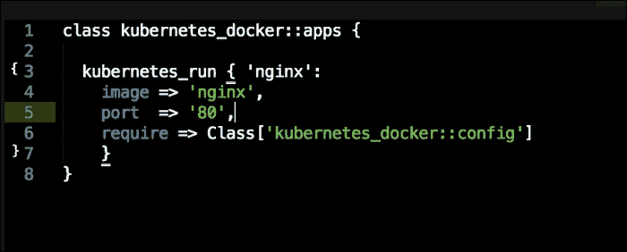

在这个文件中，我们将运行一个容器应用程序在我们的 Kubernetes 集群上。再一次，我们将编写另一个自定义类型和提供程序。在我们进入这个内容之前，我们应该先看看这个类中的代码。如你所见，我们的类型叫做`kubernetes_run`。我们可以看到我们的服务名称是`nginx`，我们将拉取的 Docker 镜像是`nginx`，然后我们将暴露端口`80`。

让我们回到`lib`目录。然后，我们将在`type`文件夹中创建一个名为`kubernetes_run.rb`的文件。在这个文件中，我们将像之前一样设置我们的自定义类型：

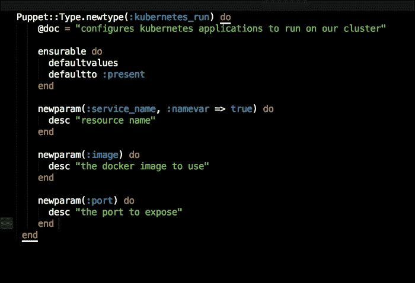

如你所见，我们正在映射与`apps.pp`文件中相同的参数。接着，我们将在`provider`文件夹下创建一个与`kubernetes_run`类型同名的文件夹。同样，在新创建的目录下，我们将创建一个名为`ruby.rb`的文件。它将包含如下截图中的代码：

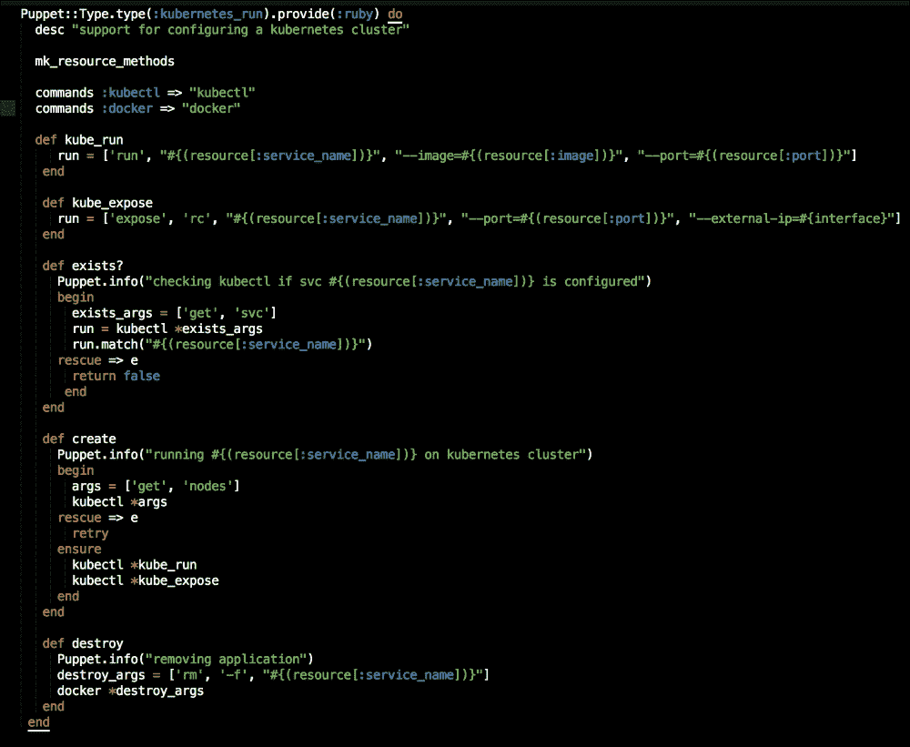

在这个文件中，我们这次将添加两个命令：第一个是`kubectl`，第二个是`docker`。我们将创建两个方法，同样使用数组来映射我们类型中的值。

现在，让我们看看我们的`exists?`方法。我们将传递一个数组作为参数给`kubectl`，以检查服务是否存在。如果`kubectl`在请求时抛出错误并返回`false`，我们将捕获这个错误。这用于在集群中没有部署任何服务的情况。

在我们的`create`方法中，我们将首先传递一个数组给`kubectl`以获取集群中的节点。我们将使用这个命令作为一个任意命令来确保集群正常运行。接着，我们会捕获错误并重试命令直到成功。一旦成功，我们将通过`ensure`资源部署我们的容器。

在`destroy`方法中，我们将使用`docker`来移除我们的容器。

现在，我们已经完成了所有的代码编写。接下来，我们只需要通过编辑 Vagrant 仓库根目录下`manifests`文件夹中的`default.pp`文件，将我们的类添加到节点中，如下所示：

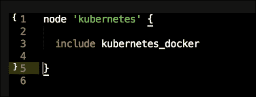

现在，让我们打开终端并将目录切换到 Vagrant 仓库的根目录，然后执行`vagrant up`命令。Puppet 执行完毕后，终端应该呈现如下截图：

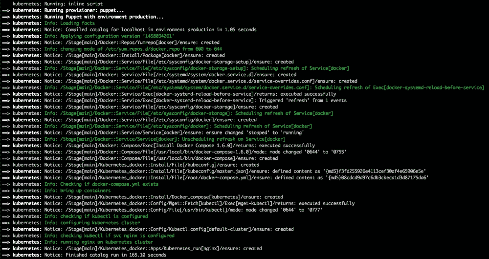

现在，我们将通过执行`vagrant ssh`命令登录到我们的 vagrant 盒子，然后输入`sudo -i`切换到 root 用户。成为 root 后，我们将查看集群中的服务。我们通过执行`kubectl get svc`命令来实现，如下所示：

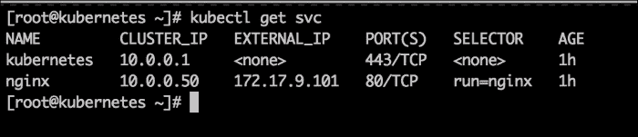

如你所见，我们的集群上正在运行两个服务：`Kubernetes`和`nginx`。如果我们打开网页浏览器并访问我们为第二个网络接口设置的地址`http://172.17.9.101`，我们将看到以下 nginx 默认页面：

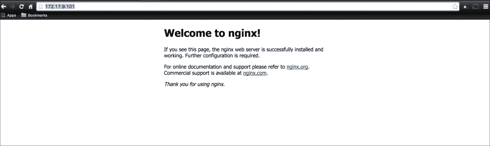

现在，我们的集群已经成功运行，并且`nginx`服务也在正常工作。

# 总结

我们介绍了我最喜欢的三个容器调度器，每一个都有各自的优缺点。现在，你已经掌握了相关的知识和所需的代码，可以对这三者进行一次充分的测试。我建议你这样做，这样在选择环境设计时，你可以做出正确的选择。
