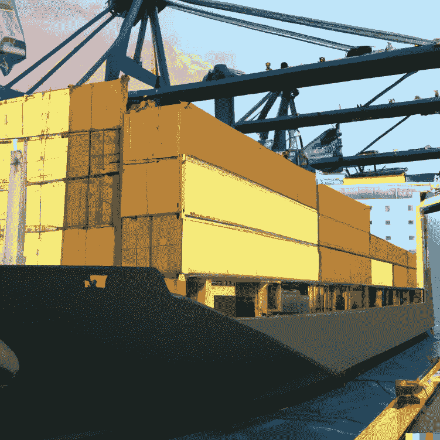
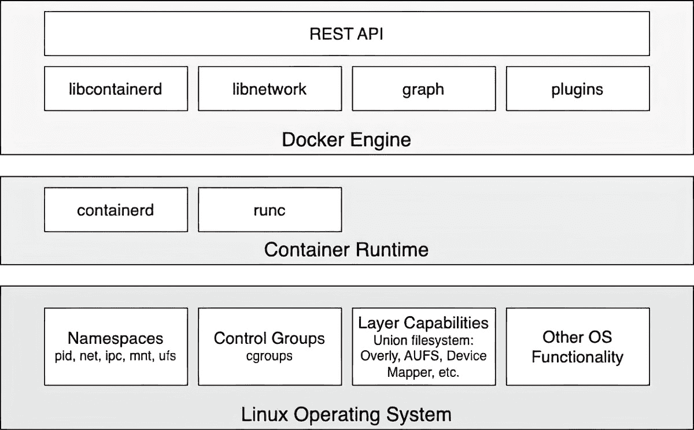

# 第一章：1

# 什么是容器，为什么我应该使用它们？

本章将带你进入容器及其编排的世界。本书从最基础的地方开始，假设你对容器的了解有限，因此将为你提供一个非常实用的介绍。

本章将重点讨论软件供应链及其内部的摩擦。接着，我们将介绍容器，它们用于减少这些摩擦，并在此基础上增加企业级安全性。我们还将探讨容器及其周围生态系统是如何组装的。我们将特别指出，作为 Docker 和其他供应商下游产品构建块的上游 **开源软件** (**OSS**) 组件，这些组件统一在代号 Moby 下。

本章涵盖以下主题：

+   什么是容器？

+   为什么容器很重要？

+   使用容器对我或我的公司有什么好处？

+   Moby 项目

+   Docker 产品

+   容器架构

完成本章后，你将能够做到以下几点：

+   使用类比，例如物理容器，用简短的几句话向感兴趣的外行解释容器是什么

+   通过类比，例如物理容器与传统运输、或者公寓与独栋住宅等，向感兴趣的外行解释为什么容器如此重要

+   至少列举出 Docker 产品（如 Docker Desktop）使用的四个上游开源组件

+   绘制一个 Docker 容器架构的高级草图

开始吧！

# 什么是容器？

软件容器是一个相当抽象的概念，因此从一个大多数人都很熟悉的类比开始可能会有所帮助。这个类比来自运输行业的集装箱。历史上，人们曾通过各种方式将货物从一个地方运送到另一个地方。在发明轮子之前，货物很可能是通过袋子、篮子或箱子由人类肩背运输，或者使用驴、骆驼或大象等动物运输。随着轮子的发明，运输效率有所提高，因为人类建造了可以推动手推车的道路，可以一次运输更多的货物。当第一台蒸汽驱动机和后来的汽油驱动引擎被引入时，运输变得更加高效。如今，我们通过飞机、火车、船只和卡车运输大量货物。同时，货物种类变得越来越多样，有时也变得更加复杂。在这几千年里，有一件事没有改变，那就是必须在目标地点卸货，并可能需要将货物重新装载到另一种运输工具上。举个例子，比如一个农民把装满苹果的手推车运到中央火车站，然后这些苹果与其他许多农民的苹果一起被装上火车。或者想象一个酿酒师将酒桶装载到卡车上运送到港口，然后这些酒桶被卸下并转移到船上，运往海外。

这种从一种运输方式卸货并装载到另一种运输方式的过程，实际上是一个非常复杂且繁琐的过程。每种类型的产品都有其特定的包装方式，因此必须按照特定的方式进行处理。此外，散装货物面临着被不道德的工人盗窃或在处理过程中损坏的风险。

图 1.1 – 水手从船上卸货

然后，集装箱出现了，它们彻底改变了运输行业。集装箱只是一个具有标准化尺寸的金属箱子。每个集装箱的长度、宽度和高度都是相同的。这一点非常重要。如果世界各国没有达成统一的标准尺寸，集装箱的使用就不会像现在这样成功。现在，借助标准化的集装箱，那些希望将货物从 A 地运输到 B 地的公司，会将货物装入这些集装箱中。然后，他们会联系运输公司，运输公司使用标准化的运输工具。这可以是可以装载集装箱的卡车，或者是每个车厢能够运输一个或多个集装箱的火车。最后，我们有专门运输大量集装箱的船只。运输公司从来不需要拆包和重新包装货物。对运输公司而言，集装箱只是一个黑箱，他们不关心里面是什么，通常情况下也无需关心。它只是一个具有标准尺寸的大铁箱子。将货物包装进集装箱的工作现在完全委托给了那些希望运输货物的一方，他们应该知道如何处理和包装这些货物。由于所有集装箱都有相同的约定形状和尺寸，运输公司可以使用标准化工具来处理集装箱；也就是说，起重机可以将集装箱从火车或卡车上卸下，并将它们装载到船上，反之亦然。只需一种类型的起重机就能处理所有随时间到来的集装箱。而且，运输工具也可以标准化，比如集装箱船、卡车和火车。正是由于这些标准化，运输货物的所有流程得以标准化，因此比集装箱出现之前更加高效。

图 1.2 – 集装箱船在港口装货

现在，你应该对为什么集装箱如此重要以及它们如何彻底改变整个运输行业有了深入的理解。我有意选择了这个类比，因为我们将在这里介绍的软件容器在所谓的软件供应链中，发挥的作用与集装箱在实体商品供应链中的作用完全相同。

那么，我们来看看将这整件事翻译到 IT 行业和软件开发中意味着什么，好吗？在过去，开发人员会开发新的应用程序。一旦应用程序在他们眼中完成，他们就会将该应用程序交给运维工程师，后者需要将其安装到生产服务器上并使其运行。如果运维工程师运气好，他们甚至能从开发人员那里得到一份相对准确的安装文档。到目前为止，一切都很好，生活也很简单。但当一个企业中有多个开发团队，各自开发出不同类型的应用程序，而这些应用程序又都需要安装到同一台生产服务器并保持运行时，事情就有点失控了。通常，每个应用程序都有一些外部依赖项，比如它是基于哪个框架构建的，使用了哪些库，等等。有时，两个应用程序使用的是相同的框架，但版本不同，可能兼容，也可能不兼容。随着时间的推移，我们的运维工程师的生活变得更加艰难。他们必须非常有创造性地思考如何在不破坏任何东西的情况下将不同的应用程序加载到他们的服务器上。现在，安装某个应用程序的新版本本身已经是一个复杂的项目，往往需要几个月的规划和测试。换句话说，软件供应链中充满了摩擦。

但是如今，公司越来越依赖软件，发布周期需要变得越来越短。公司已经不能再只在一年或两次发布应用更新了。应用需要在几周甚至几天内进行更新，有时甚至一天内更新多次。不遵守这一点的公司，可能会因为缺乏灵活性而面临倒闭风险。那么，解决办法是什么呢？最早的解决方案之一是使用**虚拟机**（**VMs**）。公司不是在同一台服务器上运行多个应用，而是将每个应用打包并在每个虚拟机上运行。这样，所有兼容性问题就消失了，生活似乎又变得美好了。不幸的是，这种幸福并没有持续多久。虚拟机本身相当笨重，因为它们每个都包含一个完整的操作系统，如 Linux 或 Windows Server，而这一切仅仅是为了运行一个单一的应用。这就好比在运输行业中，你为了运送一车香蕉，却使用了一整艘船。这简直是浪费！这种方式是永远无法盈利的。解决这个问题的终极方案是提供一种比虚拟机更轻量的解决方案，同时还能完美封装它需要运输的货物。这里的货物就是我们的开发人员编写的实际应用程序，此外——这一点很重要——还有应用程序的所有外部依赖，如框架、库、配置等。这种软件打包机制的“圣杯”便是**Docker 容器**。

开发人员将他们的应用程序、框架和库打包成 Docker 容器，然后将这些容器交给测试人员或运维工程师。对于测试人员和运维工程师来说，容器就像一个黑匣子。它是一个标准化的黑匣子。不过，所有的容器，无论内部运行什么应用，都可以被同等对待。工程师知道，只要任何一个容器能在他们的服务器上运行，那么其他容器也应该能运行。除了某些边缘情况（这些情况总是存在的），这一点基本成立。因此，Docker 容器是一种标准化的方式，用于打包应用及其依赖项。Docker 由此创造了“构建（Build）、运输（ship）和随处运行（run anywhere）”这一口号。

# 为什么容器如此重要？

现在，应用程序的新版本发布之间的时间变得越来越短，但软件本身并没有变得更简单。相反，软件项目的复杂性不断增加。因此，我们需要一种方法来驯服这个“野兽”，简化软件供应链。此外，我们每天都听到网络攻击不断上升的消息。许多知名公司受到了安全漏洞的影响。敏感的客户数据在这些事件中被盗，例如社会安全号码、信用卡信息、健康相关信息等等。但不仅仅是客户数据受到威胁——敏感的公司机密也被盗取。容器可以以多种方式提供帮助。在一份发布的报告中，Gartner 发现，运行在容器中的应用程序比没有运行在容器中的同类应用程序更加安全。容器使用 Linux 安全原语，例如 Linux 内核**命名空间**（**namespaces**），来将在同一台计算机上运行的不同应用程序进行沙箱隔离，并使用**控制组**（**cgroups**）来避免噪音邻居问题，即某个不良应用程序占用了服务器的所有可用资源，导致其他应用程序无法使用资源。由于容器镜像是不可变的，正如我们稍后将了解的那样，扫描它们以查找**常见漏洞和暴露**（**CVEs**）非常容易，这样可以提高我们应用程序的整体安全性。确保我们的软件供应链更加安全的另一种方法是让我们的容器使用**内容信任**（**content trust**）。内容信任确保容器镜像的作者就是他们所说的人，并且容器镜像的消费者可以确保该镜像在传输过程中没有被篡改。后者被称为**中间人攻击**（**MITM**）。

我刚才说的所有内容，当然，在不使用容器的情况下也能技术上实现，但由于容器引入了一个全球接受的标准，它们让实现这些最佳实践并强制执行变得更加容易。好的，但安全性并不是容器重要的唯一原因。还有其他原因。一个原因是，容器让开发者即使在自己的笔记本电脑上也能轻松模拟生产环境。如果我们能够将任何应用程序容器化，那么我们也可以将像 Oracle、PostgreSQL 或 MS SQL Server 这样的数据库容器化。现在，任何曾经在计算机上安装过 Oracle 数据库的人都知道，这并不是一件容易的事，而且会占用很多宝贵的硬盘空间。你肯定不想仅仅为了测试你开发的应用程序是否真正能端到端地工作，就把这个数据库安装在你的开发笔记本上。有了容器，我们可以像说“一、二、三”一样轻松地在容器中运行一个完整的关系型数据库。当我们完成测试时，只需停止并删除容器，数据库就会消失，且不会在我们的电脑上留下任何痕迹。由于容器相比虚拟机非常精简，因此在开发者的笔记本电脑上同时运行多个容器而不至于让笔记本电脑不堪重负是很常见的。容器重要的第三个原因是，运维人员终于可以集中精力做他们擅长的事——提供基础设施、运行和监控生产中的应用程序。当他们必须在生产系统上运行的所有应用程序都已经容器化时，运维人员就可以开始标准化他们的基础设施。每台服务器都变成了另一个**Docker 主机**。这些服务器上无需安装特殊的库或框架——只需要操作系统和像 Docker 这样的容器运行时。此外，运维人员也不再需要深入了解应用程序的内部结构，因为这些应用程序都是自包含在容器中，对于他们来说，这些容器就像运输行业人员看到的集装箱一样，应该是黑箱。

# 使用容器对我或我的公司有什么好处？

曾有人说过*“…今天每个规模较大的公司都必须承认，它们需要成为一家软件公司…”* 从这个角度来看，现代银行是一家专注于金融业务的软件公司。软件支撑着所有的业务，毫无疑问。随着每家公司都变成了软件公司，建立一个软件供应链变得至关重要。为了保持竞争力，公司必须确保其软件供应链既安全又高效。通过彻底的自动化和标准化，可以实现效率。但在安全性、自动化和标准化这三个领域中，容器技术已经证明了其优势。许多大型知名企业报告称，在将现有传统应用程序容器化并建立一个基于容器的完全自动化软件供应链后，它们能够将这些关键应用程序的维护成本降低 50%到 60%，并且能够将这些传统应用程序的新版本发布周期缩短至最多 90%。也就是说，容器技术的采用为这些公司节省了大量资金，同时加速了开发进程，缩短了上市时间。

# Moby 项目

最初，当 Docker（公司）推出 Docker 容器时，一切都是开源的。当时，Docker 并没有任何商业产品。Docker Engine 是公司开发的一个单体软件，它包含了许多逻辑组件，例如容器运行时、网络库、RESTful（REST）API、命令行接口等。其他供应商或项目，如 Red Hat 或 Kubernetes，也在他们自己的产品中使用 Docker Engine，但大多数情况下，他们仅使用了其部分功能。例如，Kubernetes 并没有使用 Docker Engine 的网络库，而是提供了自己的网络方式。Red Hat 则不频繁更新 Docker Engine，倾向于在旧版本的 Docker Engine 上应用非官方补丁，但他们仍然称之为 Docker Engine。

由于种种原因，Docker 意识到必须采取措施，明确区分 Docker 的开源部分和商业部分。此外，公司还希望防止竞争对手利用 Docker 这个名称谋取利益。这也是 Moby 项目诞生的主要原因。它作为大多数 Docker 开发并继续开发的开源组件的伞形项目。这些开源项目不再使用 Docker 名称。Moby 项目提供了用于镜像管理、密钥管理、配置管理以及网络和资源配置的组件。此外，Moby 项目还包括一些特殊的 Moby 工具，例如用于将组件组装成可运行工件的工具。某些技术上属于 Moby 项目的组件已经由 Docker 捐赠给了 **云原生计算基金会** (**CNCF**)，因此不再出现在组件列表中。最著名的有 **notary**、**containerd** 和 **runc**，其中 notary 用于内容信任，后两者构成了容器运行时。

根据 Docker 的说法，*“... Moby 是由 Docker 创建的一个开放框架，用于组装专门的容器系统，而无需重新发明轮子。它提供了一个“乐高积木”式的多个标准组件，以及一个将它们组装成* *自定义平台* 的框架....”*

# Docker 产品

过去，直到 2019 年，Docker 将其产品线分为两个部分。一个是 **社区版** (**CE**)，它是闭源的，但完全免费；另一个是 **企业版** (**EE**)，同样是闭源的，并且需要每年授权。这些企业产品提供 24/7 支持，并且有缺陷修复支持。

2019 年，Docker 认为他们的业务实际上是两个非常不同的部分。因此，他们将 EE 部分分拆，并将其出售给了 Mirantis。Docker 本身希望重新聚焦于开发者，并为他们提供构建容器化应用程序所需的最佳工具和支持。

## Docker Desktop

Docker 提供的产品包括 Docker Toolbox 和 Docker Desktop，其中 Docker Desktop 还提供适用于 Mac、Windows 和 Linux 的版本。这些产品主要面向开发者。Docker Desktop 是一款易于安装的桌面应用程序，可以在 macOS、Windows 或 Linux 机器上用于构建、调试和测试 Docker 化的应用程序或服务。Docker Desktop 是一个完整的开发环境，与各自底层操作系统的虚拟化框架、网络和文件系统深度集成。这些工具是运行 Docker 的最快、最可靠的方式。

注意

Docker Toolbox 已被弃用，不再进行积极开发。Docker 推荐改用 Docker Desktop。

## Docker Hub

Docker Hub 是最受欢迎的容器镜像查找和共享服务。可以创建个人用户账户和组织账户，用户可以在这些账户下上传并共享 Docker 镜像，可以在团队、组织或更广泛的公众之间共享。公共账户是免费的，而私有账户需要购买多种商业许可证之一。在本书后续部分，我们将使用 Docker Hub 来下载现有的 Docker 镜像，并上传和分享我们自己的自定义 Docker 镜像。

## Docker 企业版

Docker EE——现在由 Mirantis 拥有——由**Universal Control Plane**（**UCP**）和**Docker Trusted Registry**（**DTR**）组成，这两个组件都运行在 Docker Swarm 之上。它们都是 Swarm 应用程序。Docker EE 构建在 Moby 项目的上游组件之上，并添加了企业级功能，如**基于角色的访问控制**（**RBAC**）、多租户、混合集群的 Docker Swarm 和 Kubernetes、基于 Web 的 UI、内容信任，以及图像扫描等。

Docker Swarm

Docker Swarm 提供了一个强大而灵活的平台，用于在生产环境中部署和管理容器。它提供了构建、部署和管理应用程序所需的工具和功能，使您能够轻松自信地进行操作。

# 容器架构

现在，让我们讨论一下一个可以运行 Docker 容器的系统如何在高层次上进行设计。下图展示了安装了 Docker 的计算机的结构。请注意，安装了 Docker 的计算机通常被称为 Docker 主机，因为它可以运行或托管 Docker 容器：

图 1.3 – Docker 引擎的高级架构图

在前面的图中，我们可以看到三个关键部分：

+   在底部，我们有**Linux** **操作系统**

+   在中间，我们有**容器运行时**

+   在顶部，我们有**Docker 引擎**

容器之所以能够存在，是因为 Linux 操作系统提供了一些基本原语，如命名空间、控制组、层级功能等，所有这些都被容器运行时和 Docker 引擎以特定的方式使用。Linux 内核命名空间，如进程 ID（`pid`）命名空间或网络（`net`）命名空间，使得 Docker 能够封装或沙箱化在容器内运行的进程。控制组确保容器不会遭遇噪声邻居效应（noisy-neighbor syndrome），即在一个容器中运行的单个应用可能会消耗整个 Docker 主机的大部分或所有可用资源。控制组允许 Docker 限制每个容器分配的资源，如 CPU 时间或内存量。Docker 主机上的容器运行时由 containerd 和 runc 组成。runc 是容器运行时的低级功能，如容器创建或管理，而 containerd 基于 runc 提供更高级的功能，如镜像管理、网络能力或通过插件扩展功能。两者都是开源的，并由 Docker 捐赠给 CNCF。容器运行时负责容器的整个生命周期。它从注册表中拉取容器镜像（即容器的模板），如果需要的话，基于该镜像创建容器，初始化并运行容器，最终在需要时停止并从系统中移除容器。Docker 引擎提供了容器运行时之上的额外功能，如网络库或对插件的支持。它还提供了一个 REST 接口，通过该接口可以自动化所有容器操作。本书中我们将经常使用的 Docker 命令行接口就是这个 REST 接口的消费者之一。

# 总结

在本章中，我们探讨了容器如何大幅减少软件供应链中的摩擦，并在此基础上使供应链变得更加安全。在下一章，我们将熟悉容器的基本概念。我们将学习如何运行、停止和删除容器以及如何操作容器。我们还将对容器的结构有一个相当好的概览。我们将第一次真正动手操作容器，亲自体验这些容器。所以，敬请期待！

# 进一步阅读

以下是一些链接，提供了更多关于我们在本章中讨论的主题的详细信息：

+   *Docker* *overview*: [`docs.docker.com/engine/docker-overview/`](https://docs.docker.com/engine/docker-overview/)

+   *The Moby* *project*: [`mobyproject.org/`](https://mobyproject.org/)

+   *Docker* *products*: [`www.docker.com/get-started`](https://www.docker.com/get-started)

+   *Docker* *Desktop*: [`www.docker.com/products/docker-desktop/`](https://www.docker.com/products/docker-desktop/)

+   *Cloud-Native Computing* *Foundation*: [`www.cncf.io/`](https://www.cncf.io/)

+   *containerd*: [`containerd.io/`](https://containerd.io/)

+   *Docker 企业版入门* *3.1*: [`www.mirantis.com/blog/getting-started-with-docker-enterprise-3-1/`](https://www.mirantis.com/blog/getting-started-with-docker-enterprise-3-1/)

# 问题

请回答以下问题，以评估你的学习进度：

1.  哪些说法是正确的（可以有多个答案）？

    1.  容器是一种轻量级虚拟机

    1.  容器只能在 Linux 主机上运行

    1.  容器只能运行一个进程

    1.  容器中的主要进程总是拥有 PID 1

    1.  容器是由 Linux 命名空间封装并由 cgroups 限制的一个或多个进程

1.  请用自己的话，借助类比，解释什么是容器。

1.  为什么容器被认为是 IT 领域的游戏规则改变者？列出三到四个理由。

1.  当我们说“如果容器在某个平台上运行，那么它可以在任何地方运行”时，这是什么意思？列出两到三条原因，解释为什么这是正确的。

1.  以下说法是对还是错：*Docker 容器仅适用于基于微服务的现代绿地应用程序*？请说明你的理由。

1.  当企业将其传统应用程序容器化时，通常能节省多少成本？

    1.  20%

    1.  33%

    1.  50%

    1.  75%

1.  容器基于 Linux 的两个核心概念是什么？

1.  Docker Desktop 可以在哪些操作系统上使用？

# 答案

1.  正确答案是 *D* 和 *E*。

1.  Docker 容器对 IT 的意义，就像集装箱对运输行业的意义一样。它定义了如何包装货物的标准。在这种情况下，货物就是开发人员编写的应用程序。供应商（即开发者）负责将货物打包进容器，并确保一切如预期般适合。一旦货物被打包进容器，就可以进行运输。由于它是标准化的容器，运输商可以标准化其运输工具，如卡车、火车或船只。运输商并不关心容器内的具体内容。此外，从一种运输工具（如火车到船）转运的装卸过程可以高度标准化。这大大提高了运输效率。类比到 IT 中，运维工程师可以将开发人员构建的软件容器运送到生产系统，并以高度标准化的方式运行，而无需担心容器中的内容。它将正常运行。

1.  容器被认为是游戏规则改变者的一些原因如下：

    +   容器是自包含的，因此如果它们在一个系统上运行，就可以在任何可以运行 Docker 容器的地方运行。

    +   容器可以在本地和云端运行，也可以在混合环境中运行。这对于今天的典型企业至关重要，因为它使得从本地到云的平滑过渡成为可能。

    +   容器镜像是由最了解它们的人——开发者——构建或打包的。

    +   容器镜像是不可变的，这对于良好的发布管理非常重要。

    +   容器是基于封装（使用 Linux 命名空间和 cgroups）、机密管理、内容信任和镜像漏洞扫描的安全软件供应链的推动者。

1.  容器可以在任何能够托管容器的系统上运行。之所以可能，是因为以下原因：

    +   容器是自包含的黑匣子。它们不仅封装了应用程序，还封装了所有的依赖项，如库和框架、配置数据、证书等。

    +   容器基于广泛接受的标准，如 OCI。

1.  答案是错误的。容器对现代应用程序非常有用，也适用于将传统应用程序容器化。当企业进行后者时，其收益是巨大的。维护传统应用程序的成本节省可达到 50%或更多。据报道，这些传统应用程序的新版本发布周期可减少最多 90%。这些数字已经由真实的企业客户公开报道。

1.  50% 或更多。

1.  容器基于 Linux **命名空间**（网络、进程、用户等）和 **cgroups**。前者帮助隔离在同一台机器上运行的进程，而后者用于限制特定进程可以访问的资源，如内存或网络带宽。

1.  Docker Desktop 可在 macOS、Windows 和 Linux 上使用。
