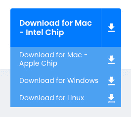

# 第二章：2

# 设置工作环境

在上一章中，我们了解了 Docker 容器是什么以及它们为何重要。我们了解了容器在现代软件供应链中解决了哪些问题。在本章中，我们将准备个人或工作环境，以便与 Docker 高效、有效地协作。我们将详细讨论如何为开发人员、DevOps 和操作员设置一个理想的工作环境，这个环境可以在使用 Docker 容器时进行使用。

本章涵盖以下主题：

+   Linux 命令行 Shell

+   Windows 的 PowerShell

+   安装和使用包管理器

+   安装 Git 并克隆代码仓库

+   选择和安装代码编辑器

+   在 macOS 或 Windows 上安装 Docker Desktop

+   安装 Docker Toolbox

+   在 Docker Desktop 上启用 Kubernetes

+   安装 minikube

+   安装 Kind

# 技术要求

本章内容需要你拥有一台安装了 macOS 或 Windows（最好是 Windows 11）操作系统的笔记本电脑或工作站。你还需要有免费的互联网接入权限来下载应用程序，并且需要有权限在笔记本电脑上安装这些应用程序。如果你使用的是 Linux 发行版操作系统（例如 Ubuntu 18.04 或更新版本），也可以跟随本书进行学习。我会尽量标明在哪些地方命令和示例与 macOS 或 Windows 上的有所不同。

# Linux 命令行 Shell

Docker 容器最初是在 Linux 上为 Linux 开发的。因此，使用 Docker 时的主要命令行工具，也称为 Shell，是 Unix Shell；记住，Linux 来源于 Unix。大多数开发人员使用 Bash Shell。在一些轻量级的 Linux 发行版中，如 Alpine，Bash 没有安装，因此你必须使用更简单的 Bourne Shell，称为 `sh`。每当我们在 Linux 环境中工作时，例如在容器内或在 Linux 虚拟机中，我们将根据可用性使用 `/bin/bash` 或 `/bin/sh`。

尽管 Apple 的 macOS 不是 Linux 操作系统，但 Linux 和 macOS 都是 Unix 的变种，因此支持相同的一组工具。其中包括 Shell。因此，当在 macOS 上工作时，你很可能会使用 Bash 或 zsh Shell。

本书假设你已熟悉 Bash 和 PowerShell 中最基本的脚本命令，特别是在 Windows 环境下。如果你是完全的新手，我们强烈建议你先熟悉以下备忘单：

+   *Linux 命令行备忘单* 由 Dave Child 编写，可在 [`bit.ly/2mTQr8l`](http://bit.ly/2mTQr8l) 查阅

+   *PowerShell 基本备忘单* 可在 [`bit.ly/2EPHxze`](http://bit.ly/2EPHxze) 查阅

# Windows 的 PowerShell

在 Windows 计算机、笔记本电脑或服务器上，我们有多种命令行工具可用。最常见的是命令提示符，它在任何 Windows 计算机上都可用已有几十年了。它是一个非常简单的 shell。对于更高级的脚本，微软开发了 PowerShell，PowerShell 功能强大，并且在 Windows 上工作的工程师中非常流行。最后，在 Windows 10 或更高版本中，我们有所谓的 Windows 子系统 Linux，它允许我们使用任何 Linux 工具，例如 Bash 或 Bourne shell。除此之外，还有其他工具能在 Windows 上安装 Bash shell，例如 Git Bash shell。在本书中，所有命令都将使用 Bash 语法。大多数命令也能在 PowerShell 中运行。

因此，我们建议你使用 PowerShell 或任何其他 Bash 工具在 Windows 上使用 Docker。

# 安装和使用包管理器

在 Linux、macOS 或 Windows 笔记本电脑上安装软件的最简单方法是使用一个好的包管理器。在 macOS 上，大多数人使用 Homebrew，而在 Windows 上，Chocolatey 是一个不错的选择。如果你使用的是基于 Debian 的 Linux 发行版，例如 Ubuntu，那么大多数人选择使用默认安装的包管理器 `apt`。

## 在 macOS 上安装 Homebrew

Homebrew 是 macOS 上最流行的包管理器，使用简单且非常多功能。在 macOS 上安装 Homebrew 很简单；只需按照 [`brew.sh/`](https://brew.sh/) 上的说明操作：

1.  简而言之，打开一个新的终端窗口并执行以下命令来安装 Homebrew：

    ```
    $ /usr/bin/ruby -e "$(curl -fsSL https://raw.githubusercontent.com/Homebrew/install/HEAD/install.sh)"
    ```

1.  安装完成后，通过在终端输入 `brew --version` 来测试 Homebrew 是否正常工作。你应该会看到类似这样的输出：

    ```
    $ brew --versionHomebrew 3.6.16Homebrew/homebrew-core (git revision 025fe79713b; last commit 2022-12-26)Homebrew/homebrew-cask (git revision 15acb0b64a; last commit 2022-12-26)
    ```

1.  现在，我们准备使用 Homebrew 安装工具和实用程序。如果我们想安装标志性的 Vi 文本编辑器（请注意，这不是本书中会使用的工具，它只是作为一个示例），我们可以这样做：

    ```
    $ brew install vim
    ```

这将为你下载并安装编辑器。

## 在 Windows 上安装 Chocolatey

Chocolatey 是一个流行的 Windows 包管理器，基于 PowerShell 构建。要安装 Chocolatey 包管理器，请按照 [`chocolatey.org/`](https://chocolatey.org/) 上的说明进行操作，或以管理员模式打开一个新的 PowerShell 窗口并执行以下命令：

```
PS> Set-ExecutionPolicy Bypass -Scope Process -Force; iex ((New-Object System.Net.WebClient).DownloadString('https://chocolatey.org/install.ps1'))
```

注意

重要的是以管理员身份运行前面的命令；否则，安装将不会成功。还需要注意的是，前面的命令是一个单独的命令，这里之所以分成多行，是因为行宽有限。

安装完 Chocolatey 后，使用 `choco --version` 命令进行测试。你应该看到类似于以下的输出：

```
PS> choco --version0.10.15
```

要安装一个应用程序，例如 Vi 编辑器，使用以下命令：

```
PS> choco install -y vim
```

`-y` 参数确保在安装过程中 Chocolatey 不会再次要求确认。正如之前提到的，我们在练习中不会使用 Vim；它仅作为示例使用。

注意

一旦 Chocolatey 安装了一个应用程序，你可能需要打开一个新的 PowerShell 窗口才能使用该应用程序。

# 安装 Git 并克隆代码库

我们将使用 Git 从 GitHub 仓库克隆本书附带的示例代码。如果你已经在电脑上安装了 Git，可以跳过这一部分：

1.  在 macOS 上安装 Git，打开一个终端窗口并使用以下命令：

    ```
    $ brew install git
    ```

1.  在 Windows 上安装 Git，打开一个 PowerShell 窗口并使用 Chocolatey 安装它：

    ```
    PS> choco install git -y
    ```

1.  最后，在 Debian 或 Ubuntu 机器上，打开一个 Bash 控制台并执行以下命令：

    ```
    $ sudo apt update && sudo apt install -y git
    ```

1.  安装完 Git 后，验证它是否正常工作。在所有平台上，使用以下命令：

    ```
    $ git --version
    ```

这将输出已安装的 Git 版本。在作者的 MacBook Air 上，输出如下：

```
git version 2.39.1
```

注意

如果你看到的是旧版本，那么你可能正在使用 macOS 默认安装的版本。通过运行 `$ brew` `install git` 来使用 Homebrew 安装最新版本。

1.  现在 Git 已经安装完毕，我们可以从 GitHub 克隆本书附带的源代码。执行以下命令：

    ```
    $ cd ~$ git clone https://github.com/PacktPublishing/The-Ultimate-Docker-Container-Book
    ```

这将把主分支的内容克隆到你的本地文件夹 `~/The-Ultimate-Docker-Container-Book` 中。这个文件夹现在将包含我们将在本书中一起完成的实验室的所有示例解决方案。如果你遇到困难，请参考这些示例解决方案。

现在我们已经安装了基础环境，让我们继续安装代码编辑器。

# 选择并安装代码编辑器

使用一个好的代码编辑器对于高效地使用 Docker 至关重要。当然，哪个编辑器最好是一个高度争议的话题，这取决于个人偏好。许多人使用 Vim，或者像 Emacs、Atom、Sublime、**Visual Studio Code**（**VS Code**）等其他编辑器，仅举几例。VS Code 是一个完全免费的轻量级编辑器，但它非常强大，并且支持 macOS、Windows 和 Linux。根据 Stack Overflow 的数据，它目前是最受欢迎的代码编辑器。如果你还没有选择其他编辑器，我强烈建议你试试 VS Code。

但如果你已经有了喜欢的代码编辑器，请继续使用它。只要你能编辑文本文件，就可以继续。如果你的编辑器支持 Dockerfile、JSON 和 YAML 文件的语法高亮，那就更好了。唯一的例外是 *第六章*，*在容器中调试代码*。该章中的示例将重点针对 VS Code 进行定制。

## 在 macOS 上安装 VS Code

按照以下步骤进行安装：

1.  打开一个新的终端窗口并执行以下命令：

    ```
    $ brew cask install visual-studio-code
    ```

1.  一旦 VS Code 安装成功，导航到你的主目录：

    ```
    $ cd ~
    ```

1.  现在，从这个文件夹中打开 VS Code：

    ```
    $ code The-Ultimate-Docker-Container-Book
    ```

VS 会启动并打开 `The-Ultimate-Docker-Container-Book` 文件夹，这是你刚刚下载的包含本书源代码的代码库，作为工作文件夹。

注意

如果你已经安装了 VS Code，而没有使用 brew，那么可以按照 [`code.visualstudio.com/docs/setup/mac#_launching-from-the-command-line`](https://code.visualstudio.com/docs/setup/mac#_launching-from-the-command-line) 中的指南，将 code 添加到你的路径中。

1.  使用 VS Code 探索你刚刚打开的文件夹中的代码。

## 在 Windows 上安装 VS Code

按照以下步骤进行安装：

1.  以 *管理员模式* 打开一个新的 PowerShell 窗口并执行以下命令：

    ```
    PS> choco install vscode -y
    ```

1.  关闭你的 PowerShell 窗口并打开一个新的窗口，以确保 VS Code 已加入你的路径。

1.  现在，导航到你的主目录：

    ```
    PS> cd ~
    ```

1.  现在，从该文件夹中打开 VS Code：

    ```
    PS> code The-Ultimate-Docker-Container-Book
    ```

VS 将启动并打开 `The-Ultimate-Docker-Container-Book` 文件夹，这里就是你刚刚下载的包含本书源代码的仓库所在的工作文件夹。

1.  使用 VS Code 探索你刚刚打开的文件夹中的代码。

## 在 Linux 上安装 VS Code

按照以下步骤进行安装：

1.  在基于 Debian 或 Ubuntu 的 Linux 机器上，你可以使用 Snap 安装 VS Code。打开 Bash 终端并执行以下语句来安装 VS Code：

    ```
    $ sudo snap install --classic code
    ```

1.  如果你使用的 Linux 发行版不是基于 Debian 或 Ubuntu 的，请按照以下链接获取更多详细信息：[`code.visualstudio.com/docs/setup/linux`](https://code.visualstudio.com/docs/setup/linux)。

1.  一旦成功安装 VS Code，导航到你的主目录：

    ```
    $ cd ~
    ```

1.  现在，从该文件夹中打开 VS Code：

    ```
    $ code The-Ultimate-Docker-Container-Book
    ```

VS 将启动并打开 `The-Ultimate-Docker-Container-Book` 文件夹，这里就是你刚刚下载的包含本书源代码的仓库所在的工作文件夹。

1.  使用 VS Code 探索你刚刚打开的文件夹中的代码。

## 安装 VS Code 扩展

扩展是使 VS Code 成为如此多功能编辑器的关键。在所有三个平台（macOS、Windows 和 Linux）上，你可以以相同的方式安装 VS Code 扩展：

1.  打开一个 Bash 控制台（或 Windows 中的 PowerShell），执行以下一组命令，安装我们将在本书接下来示例中使用的最基本扩展：

    ```
    code --install-extension vscjava.vscode-java-packcode --install-extension ms-dotnettools.csharpcode --install-extension ms-python.pythoncode --install-extension ms-azuretools.vscode-dockercode --install-extension eamodio.gitlens
    ```

我们正在安装一些扩展，这些扩展可以使我们在使用 Java、C#、.NET 和 Python 时更加高效。我们还在安装一个旨在增强我们使用 Docker 的体验的扩展。

1.  在成功安装上述扩展后，重新启动 VS Code 以激活这些扩展。你现在可以点击 VS Code 左侧活动面板中的 **扩展** 图标，查看所有已安装的扩展。

1.  要获取已安装的所有扩展列表，可以使用以下命令：

    ```
    $ code --list-extensions
    ```

接下来，我们安装 Docker Desktop。

# 在 macOS 或 Windows 上安装 Docker Desktop

如果你使用的是 macOS 或者已经在笔记本电脑上安装了 Windows 10 或更高版本，我们强烈推荐你安装 Docker Desktop。从 2022 年初开始，Docker 还发布了适用于 Linux 的 Docker Desktop 版本。Docker Desktop 在使用容器时能提供最佳体验。请按照以下步骤为你的系统安装 Docker Desktop：

1.  无论你使用的是哪个操作系统，请访问 [Docker 入门](https://www.docker.com/get-started) 页面：[`www.docker.com/get-started`](https://www.docker.com/get-started)：


图 2.1 – 开始使用 Docker

1.  在视图的右侧，你会看到一个蓝色的 **注册** 按钮，点击此按钮，如果你还没有 Docker Hub 账号，请创建一个。这个过程是免费的，但你需要一个账号来下载软件。

1.  在视图的左侧，你会看到一个蓝色的按钮，标有 **为 <你的操作系统> 下载**，其中 **<你的操作系统>** 可以是 Linux、Mac 或 Windows，取决于你使用的操作系统。在作者的例子中，显示的是 Mac 作为目标操作系统，但由于作者使用的是配备苹果 M1 芯片的 Mac，因此显示的 CPU 类型错误。

点击按钮右侧的小下拉三角形，可以查看完整的可用下载列表：



图 2.2 – Docker Desktop 目标列表

选择适合你的版本，并观察安装包的下载过程。

1.  下载完成后，继续安装，通常通过双击下载的安装包进行安装。

## 测试 Docker 引擎

现在你已经成功安装了 Docker Desktop，接下来让我们进行测试。我们将从命令行直接运行一个简单的 Docker 容器：

1.  打开终端窗口，执行以下命令：

    ```
    $ docker version
    ```

你应该会看到类似这样的内容：


图 2.3 – Docker Desktop 的 Docker 版本

在前面的输出中，我们可以看到它由两部分组成——一个客户端和一个服务器。在这里，服务器对应于 Docker 引擎，负责托管和运行容器。在撰写本文时，Docker 引擎的版本是`20.10.21`。

1.  为了检查是否能够运行容器，请在终端窗口中输入以下命令并按下 *Enter*：

    ```
    $ docker container run hello-world
    ```

如果一切顺利，你的输出应该类似于以下内容：


图 2.4 – 在 macOS 上通过 Docker Desktop 运行 Hello-World

如果你仔细阅读前面的输出，你会注意到 Docker 没有找到名为 `hello-world:latest` 的镜像，因此决定从 Docker 镜像注册表下载它。下载完成后，Docker 引擎会根据该镜像创建一个容器并运行它。应用程序在容器内运行，并输出所有文本，开头是 `Hello` `from Docker!`。

这证明 Docker 已经正确安装并在你的机器上正常工作。

1.  让我们尝试另一个有趣的测试镜像，通常用于检查 Docker 安装。运行以下命令：

    ```
    $ docker container run rancher/cowsay Hello
    ```

你应该会看到以下或类似的输出：


图 2.5 – 从 Rancher 运行 cowsay 镜像

很棒 – 我们已经确认 Docker 引擎在本地计算机上正常工作。现在，让我们确保 Docker Desktop 也同样工作正常。

## 测试 Docker Desktop

根据你所使用的操作系统（Linux、Mac 或 Windows），你可以在不同的区域访问 Docker Desktop 的上下文菜单。无论如何，你要寻找的符号是那个携带容器的小鲸鱼。以下是 Mac 上找到的符号：


+   **Mac**：你将在屏幕顶部菜单栏的右侧找到该图标。

+   **Windows**：你将在 Windows 系统托盘中找到该图标。

+   通过 **应用程序** 菜单打开 `Docker Desktop`，这将启动 Docker 菜单图标并打开 Docker 仪表盘，显示 Docker Desktop 的状态。

找到 Docker Desktop 的上下文菜单后，请按照以下步骤操作：

1.  点击 *鲸鱼* 图标以显示 Docker Desktop 的上下文菜单。在作者的 Mac 上，它看起来是这样的：


图 2.6 – Docker Desktop 的上下文菜单

1.  从菜单中选择 **仪表盘**。Docker Desktop 的仪表盘将打开：


图 2.7 – Docker Desktop 的仪表盘

我们可以看到仪表盘有多个标签，位于视图的左侧。目前，`hello-world` 和 `rancher/cowsay` Docker 镜像的状态都是 **Exited**。

请花些时间探索一下这个仪表盘。如果你迷路了也不用担心，随着我们继续本书的各章内容，一切会变得更加清晰。

1.  探索完成后，关闭仪表盘窗口。

注意

关闭仪表盘并不会停止 Docker Desktop。应用程序和 Docker 引擎会继续在后台运行。如果由于某种原因你想完全停止系统上的 Docker，可以从 *步骤 1* 中显示的上下文菜单中选择 **退出 Docker Desktop**。

恭喜你，已经成功在工作电脑上安装并测试了 Docker Desktop！接下来，我们将继续介绍一些其他有用的工具。

# 安装 Docker Toolbox

Docker Toolbox 已经推出几年，面向开发者使用。它在 Docker Desktop 等更新工具之前推出。Toolbox 允许用户在任何 macOS 或 Windows 计算机上优雅地操作容器。容器必须在 Linux 主机上运行。Windows 和 macOS 都无法原生运行容器。因此，我们需要在笔记本电脑上运行一个 Linux 虚拟机，在该虚拟机上运行容器。Docker Toolbox 在我们的笔记本上安装了 VirtualBox，用于运行我们所需的 Linux 虚拟机。

注意

Docker Toolbox 最近已被弃用，因此我们将不再进一步讨论它。不过，在某些特定场景下，它仍可能具有一定的参考价值，因此我们在此提及它。

# 在 Docker Desktop 上启用 Kubernetes

Docker Desktop 自带 Kubernetes 的集成功能。

什么是 Kubernetes？

Kubernetes 是一个强大的平台，用于自动化容器化应用程序的部署、扩展和管理。无论你是开发者、DevOps 工程师还是系统管理员，Kubernetes 都提供了你所需的工具和抽象层，帮助你以可扩展和高效的方式管理容器和应用程序。

该支持默认是关闭的。但不用担心——它非常容易开启：

1.  打开 Docker Desktop 的仪表板。

1.  在左上角，选择齿轮图标。这样会打开**设置**页面。

1.  在左侧，选择**Kubernetes**选项卡，然后勾选**启用 Kubernetes**复选框：


图 2.8 – 在 Docker Desktop 上启用 Kubernetes

1.  点击**应用并重启**按钮。

现在，你需要耐心等待，因为 Docker 正在下载所有支持基础设施，并启动 Kubernetes。

一旦 Docker 重启完成，你就可以开始使用 Kubernetes。请参阅*安装 minikube*部分，了解如何测试 Kubernetes。

# 安装 minikube

如果你使用的是 Docker Desktop，那么你可能根本不需要 minikube，因为 Docker Desktop 已经原生支持 Kubernetes。如果你不能使用 Docker Desktop，或者由于某些原因，你只能使用不支持 Kubernetes 的旧版本工具，那么安装 minikube 会是一个不错的选择。minikube 会在你的工作站上配置一个单节点的 Kubernetes 集群，并且可以通过 kubectl 访问，kubectl 是用于与 Kubernetes 交互的命令行工具。

## 在 Linux、macOS 和 Windows 上安装 minikube

要在 Linux、macOS 或 Windows 上安装 minikube，请访问以下链接：[`kubernetes.io/docs/tasks/tools/install-minikube/`](https://kubernetes.io/docs/tasks/tools/install-minikube/)。

请仔细遵循指示。具体来说，请执行以下操作：

1.  确保你已经安装了一个虚拟化管理程序，详细信息请参见这里：


图 2.9 – minikube 的先决条件

1.  在 **1 安装** 下，选择适合你的组合。例如，你可以看到作者选择的目标机器是 *MacBook Air M1 笔记本电脑*：


图 2.10 – 选择配置

### 使用 Homebrew 在 MacBook Air M1 上安装 minikube

按照以下步骤操作：

1.  在终端窗口中，执行之前显示的步骤。在作者的案例中，步骤如下：

    ```
    $ brew install minikube
    ```

1.  使用以下命令测试安装：

    ```
    $ brew versionminikube version: v1.28.0commit: 986b1ebd987211ed16f8cc10aed7d2c42fc8392f
    ```

1.  现在，我们准备开始创建集群。让我们从默认配置开始：

    ```
    $ minikube start
    ```

注意

minikube 允许你定义单节点和多节点集群。

1.  第一次执行时，由于 minikube 需要下载所有的 Kubernetes 二进制文件，可能会花费一些时间。完成后，屏幕上的最后一行输出应该类似于：

    ```
    Done! kubectl is now configured to use "minikube" cluster and "default" namespace by default
    ```

太好了，我们已经成功在系统上安装了 minikube！让我们尝试通过创建一个集群并在其中运行我们的第一个容器应用来玩一下 minikube。如果以下命令对你来说不太明白，别担心，我们将在接下来的章节中详细讨论。

## 测试 minikube 和 kubectl

让我们开始吧。请仔细按照以下步骤操作：

1.  让我们尝试使用 kubectl 访问我们的集群。首先，我们需要确保 kubectl 选择了正确的上下文。如果你之前安装了 Docker Desktop，现在又安装了 minikube，可以使用以下命令：

    ```
    $ kubectl config get-contexts
    ```

你应该看到这个：


图 2.11 – 安装 minikube 后 kubectl 的上下文列表

紧跟在名为 minikube 的上下文旁边的星号告诉我们，这是当前的上下文。因此，在使用 kubectl 时，我们将操作由 minikube 创建的新集群。

1.  现在，让我们使用这个命令查看集群中有多少个节点：

    ```
    $ kubectl get nodes
    ```

你应该看到类似这样的输出。请注意，显示的版本可能与你的情况有所不同：


图 2.12 – 显示 minikube 集群的节点列表

这里我们有一个单节点集群。该节点的角色是控制平面，这意味着它是主节点。一个典型的 Kubernetes 集群包含几个主节点和多个工作节点。我们在这里使用的 Kubernetes 版本是 `v1.25.3`。

1.  现在，让我们尝试在这个集群上运行一些应用。我们将使用 Nginx，这是一个流行的 Web 服务器。如果你之前已经克隆了这本书附带的 GitHub 仓库到你主目录下的 `The-Ultimate-Docker-Container-Book` 文件夹中，那么你应该会在这个文件夹中找到一个包含 `.yaml` 文件的子文件夹，我们将用这个文件进行测试：

    1.  打开一个新的终端窗口。

    1.  导航到 `The-Ultimate-Docker-Container-Book` 文件夹：

    ```
    $ cd ~/The-Ultimate-Docker-Container-Book
    ```

    1.  使用以下命令创建一个运行 Nginx 的 pod：

    ```
    $ kubectl apply -f setup/nginx.yaml
    ```

你应该看到这个输出：

```
pod/nginx created
```

1.  我们可以通过 kubectl 再次检查 pod 是否正在运行：

```
$ kubectl get pods
```

我们应该看到这个：

```
NAME     READY   STATUS     RESTARTS   AGEnginx     1/1    Running       0       11m
```

这表明我们有一个正在运行 Nginx 的 pod，且它已重启 0 次。

1.  为了访问 Nginx 服务器，我们需要用以下命令公开在 pod 中运行的应用程序：

    ```
    $ kubectl expose pod nginx --type=NodePort --port=80
    ```

这是我们从笔记本访问 Nginx 的唯一方式——例如，通过浏览器。通过上述命令，我们正在创建一个 Kubernetes 服务，输出中已显示该命令的生成情况：

```
service/nginx exposed
```

1.  我们可以使用 kubectl 列出集群中定义的所有服务：

    ```
    $ kubectl get services
    ```

我们应该看到这个：


图 2.13 – minikube 集群上的服务列表

在上述输出中，我们可以看到刚刚创建的第二个服务 Nginx。该服务属于 `NodePort` 类型；pod 的端口 `80` 已被映射到我们 minikube 中 Kubernetes 集群节点的端口 `30373`。

1.  现在，我们可以使用 minikube 创建一个隧道连接到我们的集群，并用正确的 URL 打开浏览器访问 Nginx web 服务器。使用以下命令：

    ```
    $ minikube service nginx
    ```

在终端窗口中的输出将如下所示：


图 2.14 – 打开对 minikube 上 Kubernetes 集群的访问

上述输出显示，minikube 为 nginx 服务创建了一个隧道，将节点端口 `30373` 映射到主机上的端口 `64171`，主机就是我们的笔记本。[](http://127.0.0.1:64171)

1.  [一个新的浏览器标签页](http://127.0.0.1:64171) 应该已自动打开，并将你导航至 `http://127.0.0.1:64171`。你应该能看到 Nginx 的欢迎页面：


图 2.15 – 在 minikube 上运行 Kubernetes 集群的 Nginx 欢迎页面

太棒了，我们已经成功地在 minikube 上的小型单节点 Kubernetes 集群上运行并访问了 Nginx web 服务器！一旦完成实验，到了清理的时候：

1.  通过在终端窗口中按 *Ctrl* + *C* 停止到集群的隧道连接。

1.  删除集群中的 nginx 服务和 pod：

    ```
    $ kubectl delete service nginx$ kubectl delete pod nginx
    ```

1.  使用以下命令停止集群：

    ```
    $ minikube stop
    ```

1.  你应该看到这个：


图 2.16 – 停止 minikube

## 使用多节点 minikube 集群

有时，单节点集群的测试并不够。别担心——minikube 会帮你解决这个问题。按照以下说明，在 minikube 中创建一个真正的多节点 Kubernetes 集群：

1.  如果我们想在 minikube 中使用包含多个节点的集群，可以使用以下命令：

    ```
    $ minikube start --nodes 3 –p demo
    ```

上述命令创建了一个包含三个节点的集群，并将其命名为 `demo`。

1.  使用 kubectl 列出所有集群节点：

    ```
    $ kubectl get nodesNAME          STATUS    ROLES            AGE      VERSIONdemo          Ready     control-plane    84s      v1.25.3demo-m02      Ready     <none>           45s      v1.25.3demo-m03      Ready     <none>           22s      v1.25.3
    ```

我们有一个包含 3 个节点的集群，其中 `demo` 节点是主节点，剩下的两个节点是工作节点。

1.  我们在这里不打算继续这个示例，所以使用以下命令来停止集群：

    ```
    $ minikube stop -p demo
    ```

1.  使用以下命令删除系统上的所有集群：

    ```
    $ minikube delete --all
    ```

这将删除默认集群（在我们案例中名为 minikube）和演示集群。

有了这个，我们将进入下一个在容器和 Kubernetes 工作中非常有用的工具。你应该在工作计算机上安装并随时准备好使用它。

# 安装 Kind

Kind 是另一个流行的工具，可以在本地机器上运行一个多节点 Kubernetes 集群。它非常容易安装和使用。让我们开始吧：

1.  使用适合你平台的包管理器来安装 Kind。你可以在这里找到更详细的[安装过程](https://kind.sigs.k8s.io/docs/user/quick-start/)信息：[`kind.sigs.k8s.io/docs/user/quick-start/`](https://kind.sigs.k8s.io/docs/user/quick-start/)：

    1.  在 MacOS 上，使用 Homebrew 通过以下命令安装 Kind：

    ```
    $ brew install kind
    ```

    1.  在 Windows 机器上，使用 Chocolatey 通过以下命令来做同样的事情：

    ```
    $ choco install kind -y
    ```

    1.  最后，在 Linux 机器上，你可以使用以下脚本从其二进制文件安装 Kind：[链接](https://kind.sigs.k8s.io/dl/v0.17.0/kind-linux-amd64)

    ```
    $ curl -Lo ./kind https://kind.sigs.k8s.io/dl/v0.17.0/kind-linux-amd64$ chmod +x ./kind$ sudo mv ./kind /usr/local/bin/kind
    ```

1.  安装 Kind 后，使用以下命令进行测试：

    ```
    $ kind version
    ```

如果你使用的是 Mac，它应该会输出类似这样的内容：

```
kind v0.17.0 go1.19.2 darwin/arm64
```

1.  现在，尝试创建一个由一个主节点和两个工作节点组成的简单 Kubernetes 集群。使用以下命令来实现：

    ```
    $ kind create cluster
    ```

一段时间后，你应该会看到以下输出：


图 2.17 – 使用 Kind 创建集群

1.  要验证集群是否已创建，请使用以下命令：

    ```
    $ kind get clusters
    ```

上述输出显示，正好有一个名为**kind**的集群，这是默认名称。

1.  我们可以使用`--name`参数创建一个具有不同名称的额外集群，如下所示：

    ```
    $ kind create cluster --name demo
    ```

1.  列出集群后将显示如下：

    ```
    $ kind show clustersKinddemo
    ```

这按预期工作。

## 测试 Kind

现在我们已经使用 Kind 创建了两个示例集群，让我们使用 kubectl 来操作其中一个集群，并在其上运行第一个应用程序。我们将使用 Nginx，就像我们在 minikube 中做的那样：

1.  现在我们可以使用**kubectl**访问并操作我们刚刚创建的集群。在创建集群时，Kind 也更新了我们的 kubectl 配置文件。我们可以使用以下命令进行再次确认：

    ```
    $ kubectl config get-contexts
    ```

它应该会产生以下输出：


图 2.18 – 为 kubectl 定义的上下文列表

你可以看到，kind 和 demo 集群是已知集群列表的一部分，并且 demo 集群是当前 kubectl 的上下文。

1.  如果星号显示的是另一个集群作为当前集群，使用以下命令将 demo 集群设置为当前集群：

    ```
    $ kubectl config use-context kind-demo
    ```

1.  让我们列出`sample-cluster`集群的所有节点：

    ```
    $ kubectl get nodes
    ```

输出应该是这样的：


图 2.19 – 显示 Kind 集群上节点列表

1.  现在，让我们尝试在这个集群上运行第一个容器。我们将像之前一样使用我们信任的 Nginx Web 服务器。使用以下命令来运行它：

    ```
    $ kubectl apply -f setup/nginx.yaml
    ```

输出应如下所示：

```
pod/nginx created
```

1.  要访问 Nginx 服务器，我们需要使用 kubectl 进行端口转发。使用以下命令实现：

    ```
    $ kubectl port-forward nginx 8080 80
    ```

输出应如下所示：

```
Forwarding from 127.0.0.1:8080 -> 80Forwarding from [::1]:8080 -> 80
```

1.  打开一个新的浏览器标签页，访问 `http://localhost:8080`；你应该能看到 Nginx 的欢迎界面：


图 2.20 – 在 Kind 集群上运行的 Nginx 欢迎界面

1.  一旦你完成了对 Nginx 的操作，使用以下命令从集群中删除该 Pod：

    ```
    $ kubectl delete –f setup/nginx.yaml
    ```

1.  在我们继续之前，让我们清理并删除刚刚创建的两个集群：

    ```
    $ kind delete cluster --name kind$ kind delete cluster --name demo
    ```

通过这些步骤，我们已经安装了成功在本地机器上与容器一起工作的所有工具。

# 总结

本章中，我们设置并配置了我们的个人或工作环境，以便能够高效地与 Docker 容器工作。这同样适用于开发人员、DevOps 和运维工程师。

我们从一个应该是每个严肃工程师手边的包管理器开始。它使得安装和管理应用程序及工具变得更加容易。接下来，我们确保使用了一个良好的脚本 shell —— 一个强大的编辑器。然后，我们确保安装了 Docker Desktop，利用它我们可以原生运行和测试容器。最后，我们在机器上安装并快速测试了 minikube 和 Kind。这些工具可以用来在本地 Kubernetes 集群上运行和测试容器。

在下一章中，我们将学习容器的关键概念。例如，我们将探讨如何运行、停止、列出和删除容器，但更重要的是，我们还将深入了解容器的结构。

# [进一步阅读](https://chocolatey.org/)

[考虑以下](https://chocolatey.org/)链接以便进一步阅读：

+   [*Chocolatey – Windows 的包管理器*](https://dockr.ly/2nuZUkU)*:* [`chocolatey.org/`](https://chocolatey.org/)

+   *通过 Docker* *Machine 在 Hyper-V 上运行 Docker*: [`bit.ly/2HGMPiI`](http://bit.ly/2HGMPiI)

+   *在* *容器内开发*: [`code.visualstudio.com/docs/remote/containers`](https://code.visualstudio.com/docs/remote/containers)

# 问题

基于本章所涵盖的内容，请回答以下问题：

1.  为什么我们要在本地计算机上安装和使用包管理器？

1.  使用 Docker Desktop，您可以开发和运行 Linux 容器。

    1.  正确

    1.  错误

1.  为什么良好的脚本编写技能（如 Bash 或 PowerShell）对于高效使用容器至关重要？

1.  请列举三到四个 Docker 认证可以运行的 Linux 发行版。

1.  你在系统上安装了 minikube。你会用这个工具来做哪些任务？

# 答案

以下是本章问题的答案：

1.  Linux 系统中的 `apk`、`apt` 或 `yum` 包管理器，macOS 中的 Homebrew，以及 Windows 中的 Chocolatey，都使得自动化安装应用程序、工具和库变得更加容易。相比用户在安装过程中需要点击一系列视图进行交互的过程，自动化安装更具可重复性。

1.  答案是 *正确*。是的，使用 Docker Desktop，你可以开发和运行 Linux 容器。虽然本书未涉及，但使用此版本的 Docker Desktop，也可以开发和运行原生的 Windows 容器。使用 macOS 和 Linux 版本时，你只能开发和运行 Linux 容器。

1.  脚本用于自动化流程，从而避免人为错误。构建、测试、共享和运行 Docker 容器这些任务应始终进行自动化，以提高其可靠性和可重复性。

1.  以下 Linux 发行版已认证可以运行 Docker：**Red Hat Linux**（**RHEL**）、CentOS、Oracle Linux、Ubuntu 等。

1.  minikube 使得在本地计算机上（如开发者的笔记本）定义和运行单节点或多节点集群成为可能。通过 minikube，你可以在本地机器上运行和测试容器化应用程序，无需依赖像 AWS、Microsoft Azure 或 Google Cloud 上运行的远程 Kubernetes 集群。

# 第二部分：容器化基础

本部分将教你如何启动、停止和删除容器，并如何检查容器以获取更多的元数据。此外，它还解释了如何运行额外的进程，以及如何附加到已运行容器中的主进程。还涵盖了如何从容器中检索日志信息，这些信息是由容器内运行的进程生成的。最后，本部分介绍了容器的内部工作原理，包括 Linux 命名空间和组等内容。

+   *第三章*，*掌握容器*

+   *第四章*，*创建和管理容器镜像*

+   *第五章*，*数据卷和配置*

+   *第六章*，*调试运行在容器中的代码*

+   *第七章*，*测试* *运行在容器中的应用程序*

+   *第八章*，*通过 Docker 小技巧提高生产力*
