# 第六章：6

# 调试在容器中运行的代码

在上一章中，我们学习了如何使用有状态容器——即那些消费和产生数据的容器。我们还学习了如何使用环境变量和配置文件，在运行时和镜像构建时配置容器。

本章中，我们将介绍一些常用技术，这些技术可以帮助开发人员在容器中运行代码时进行演进、修改、调试和测试。掌握这些技巧后，你将在容器中开发应用时享受无摩擦的开发过程，类似于开发本地运行的应用程序。

以下是我们将要讨论的主题列表：

+   发展和测试运行在容器中的代码

+   代码变更后的自动重启

+   在容器内逐行调试代码

+   在代码中插入日志，以产生有意义的日志信息

+   使用 Jaeger 进行监控和故障排除

完成本章后，你将能够做以下事情：

+   挂载在主机上的源代码到运行中的容器

+   配置运行在容器中的应用程序，在代码更改后自动重启

+   配置**Visual Studio Code**（**VS Code**）逐行调试在容器内运行的 Java、Node.js、Python 或.NET 应用程序

+   从应用代码中记录重要事件

+   使用 OpenTracing 标准和像 Jaeger 这样的工具，为你的多组件应用程序配置分布式追踪

# 技术要求

本章中，如果你想跟随代码进行操作，你需要在 macOS 或 Windows 上安装 Docker Desktop 和一个代码编辑器——最好是 VS Code。样例代码也可以在安装了 Docker 和 VS Code 的 Linux 机器上运行。

为了准备接下来的动手实验，请按照以下步骤操作：

1.  请导航到你克隆示例代码库所在的文件夹。通常情况下，这应该是`~/The-Ultimate-Docker-Container-Book`，因此请执行以下操作：

    ```
    $ cd ~/The-Ultimate-Docker-Container-Book
    ```

1.  创建一个名为`ch06`的新子文件夹并导航到它：

    ```
    $ mkdir ch06 && cd ch06
    ```

本章中讨论的所有示例的完整样本解决方案可以在`sample-solutions/ch06`文件夹中找到，或者直接在 GitHub 上查看：[`github.com/PacktPublishing/The-Ultimate-Docker-Container-Book/tree/main/sample-solutions/ch06`](https://github.com/PacktPublishing/The-Ultimate-Docker-Container-Book/tree/main/sample-solutions/ch06)。

# 发展和测试运行在容器中的代码

在继续之前，确保你的计算机已安装 Node.js 和`npm`。在 Mac 上，使用以下命令：

```
$ brew install node
```

在 Windows 上，使用以下命令：

```
$ choco install -y nodejs
```

当开发最终将运行在容器中的代码时，最好的做法通常是从一开始就将代码运行在容器中，以确保不会有任何意外情况。但我们必须以正确的方式做这件事，以免为我们的开发过程引入不必要的摩擦。首先，让我们看看我们可以如何在容器中运行和测试代码的一个简单方法。我们可以使用一个基本的 Node.js 样本应用程序来做到这一点：

1.  创建一个新的项目文件夹并导航到该文件夹：

    ```
    $ mkdir node-sample && cd node-sample
    ```

1.  让我们使用`npm`来创建一个新的 Node.js 项目：

    ```
    $ npm init
    ```

1.  接受所有默认设置。注意，`package.json`文件已经创建，内容如下：

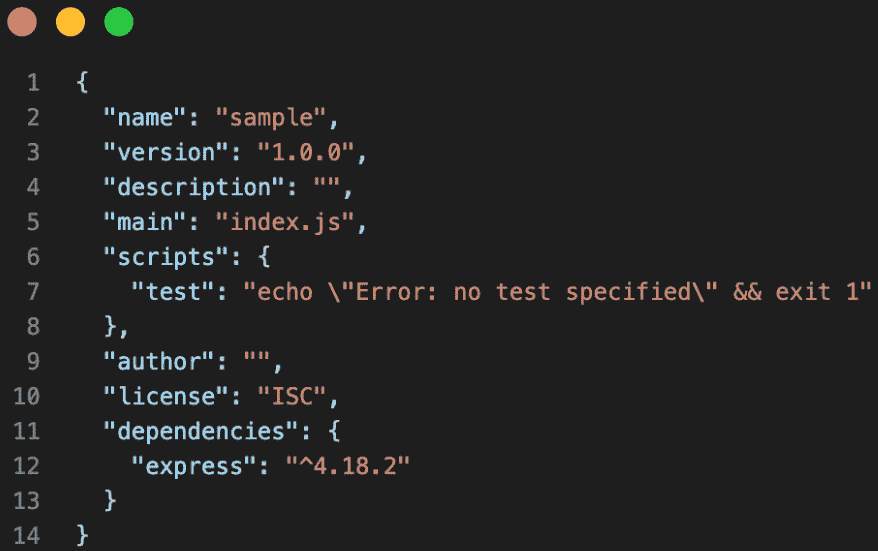

图 6.1 – 样本 Node.js 应用程序的 package.json 文件内容

1.  我们希望在 Node 应用程序中使用`Express.js`库，因此，使用`npm`来安装它：

    ```
    $ npm install express –save
    ```

这将安装我们机器上最新版本的`Express.js`，并且因为`–save`参数的存在，它会将类似下面的引用添加到我们的`package.json`文件中：

```
"dependencies": {    "express": "⁴.18.2"
}
```

请注意，在你的情况下，`express`的版本号可能不同。

1.  从这个文件夹中启动 VS Code：

    ```
    $ code .
    ```

1.  在 VS Code 中，创建一个名为`index.js`的新文件并将此代码片段添加到其中。别忘了保存：

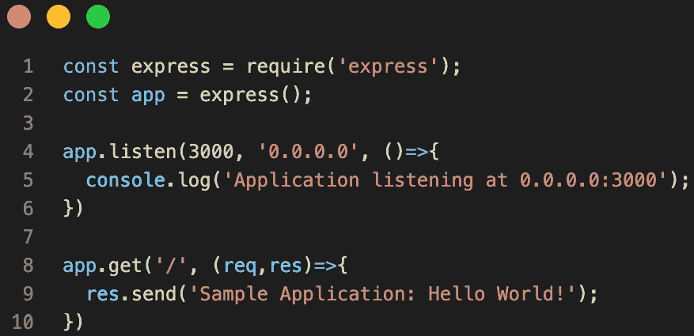

图 6.2 – 样本 Node.js 应用程序的 index.js 文件内容

1.  在终端窗口中，启动应用程序：

    ```
    $ node index.js
    ```

注意

在 Windows 和 Mac 上，当你第一次执行上述命令时，会弹出一个窗口，要求你在防火墙上批准它。

你应该看到这样的输出：

```
Application listening at 0.0.0.0:3000
```

这意味着应用程序正在运行，并准备在`0.0.0.0:3000`端点监听。

提示

你可能会想知道`0.0.0.0`这个主机地址的含义是什么，为什么我们选择了它。稍后当我们在容器中运行应用程序时会再提到这个问题。现在，只需要知道`0.0.0.0`是一个具有特殊意义的保留 IP 地址，类似于回环地址`127.0.0.1`。`0.0.0.0`地址的含义是本地机器上的所有 IPv4 地址。如果主机有两个 IP 地址，例如`52.11.32.13`和`10.11.0.1`，而主机上的服务器监听`0.0.0.0`，那么它将在这两个 IP 上都可以访问。

1.  现在，在你喜欢的浏览器中打开一个新标签页并导航到`http://localhost:3000`。你应该会看到这个：

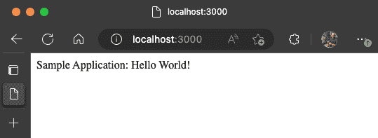

图 6.3 – 样本 Node.js 应用程序在浏览器中运行

很好 – 我们的 Node.js 应用程序在开发者机器上运行。通过在终端按下*Ctrl* + *C*来停止应用程序。

1.  现在，我们希望通过在容器内运行应用程序来测试目前为止开发的应用程序。为此，我们必须创建一个 Dockerfile，以便我们可以构建一个容器镜像，然后从该镜像运行容器。让我们再次使用 VS Code，向项目文件夹中添加一个名为`Dockerfile`的文件，并为其提供以下内容：

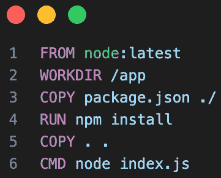

图 6.4 – 示例 Node.js 应用程序的 Dockerfile

1.  然后，我们可以使用这个 Dockerfile 构建一个名为`sample-app`的镜像，如下所示：

    ```
    $ docker image build -t sample-app .
    ```

基础镜像下载并在其上构建你的自定义镜像需要几秒钟。

1.  构建完成后，使用以下命令在容器中运行应用程序：

    ```
    $ docker container run --rm -it \    --name my-sample-app \    -p 3000:3000 \    sample-app
    ```

输出将如下所示：

```
Application listening at 0.0.0.0:3000
```

注意

上述命令会从`sample-app`容器镜像运行一个名为`my-sample-app`的容器，并将容器的端口`3000`映射到对应的宿主端口。这个端口映射是必要的，否则我们无法从容器外部访问容器内部运行的应用程序。我们将在*第十章*中详细了解端口映射，*使用* *单主机网络*。这与我们直接在宿主机上运行应用程序时是类似的。

1.  刷新之前的浏览器标签页（或者如果你已经关闭了，打开一个新的浏览器标签页并导航到`localhost:3000`）。你应该能看到应用程序仍然在运行，并产生与本地运行时相同的输出。这是好的。我们已经展示了我们的应用程序不仅可以在宿主机上运行，也可以在容器内部运行。

1.  在终端中按*Ctrl* + *C*停止并移除容器。

1.  现在，让我们修改代码并添加一些额外的功能。我们将在`/hobbies`处定义另一个`HTTP GET`端点。请将以下代码片段添加到`index.js`文件的末尾：

    ```
    const hobbies = [    'Swimming', 'Diving', 'Jogging', 'Cooking', 'Singing'];app.get('/hobbies', (req,res)=>{    res.send(hobbies);})
    ```

1.  我们可以通过运行以下命令在宿主机上测试新功能：

    ```
    $ node index.js
    ```

然后，我们可以在浏览器中导航到`http://localhost:3000/hobbies`。我们应该能在浏览器窗口看到预期的输出——一个包含爱好列表的 JSON 数组。完成测试后，别忘了按*Ctrl* + *C*停止应用程序。

1.  接下来，我们需要测试代码在容器内运行时的表现。所以，首先，我们必须创建一个新的容器镜像版本：

    ```
    $ docker image build -t sample-app .
    ```

这一次，构建应该比第一次更快，因为基础镜像已经在我们的本地缓存中。

1.  接下来，我们必须从这个新镜像运行一个容器：

    ```
    $ docker container run --rm -it \    --name my-sample-app \    -p 3000:3000 \    sample-app
    ```

1.  现在，我们可以在浏览器中导航到`http://localhost:3000/hobbies`，并确认应用程序在容器内也能正常工作。

1.  再次提醒，完成后不要忘记按*Ctrl* + *C*停止容器。

我们可以针对每个新增的特性或改进的现有特性，反复执行这组任务。事实证明，与所有我们开发的应用程序直接在主机上运行的时代相比，这种方法增加了不少摩擦。

然而，我们可以做得更好。在下一节中，我们将探讨一种技巧，允许我们消除大部分的摩擦。

## 将变化中的代码挂载到运行中的容器

如果在代码更改后，我们不需要重建容器镜像并重新运行容器，那会怎么样呢？如果在像 VS Code 这样的编辑器中保存更改时，变化能够立即反映到容器内部，那不是更好吗？实际上，通过卷映射，这是可能的。在上一章中，我们学习了如何将任意的主机文件夹映射到容器内部的任意位置。在本节中，我们将利用这一点。在*第五章*，*数据卷和配置*中，我们学习了如何将主机文件夹映射为容器中的卷。例如，如果我们想将主机文件夹`/projects/sample-app`挂载到容器的`/app`路径，语法如下：

```
$ docker container run --rm -it \    --volume /projects/sample-app:/app \
    alpine /bin/sh
```

注意`--volume <host-folder>:<container-folder>`这一行。主机文件夹的路径需要是绝对路径，在这个例子中是`/projects/sample-app`。

现在，如果我们想从`sample-app`容器镜像运行一个容器，并且我们从项目文件夹中进行操作，我们可以将当前文件夹映射到容器的`/app`文件夹，具体命令如下：

```
$ docker container run --rm -it \    --volume $(pwd):/app \
    -p 3000:3000 \
    sample-app
```

注意

请注意使用`$(pwd)`代替主机文件夹路径。`$(pwd)`代表当前文件夹的绝对路径，非常方便。

现在，如果我们使用上面的卷映射参数，那么`sample-app`容器镜像中`/app`文件夹中的任何内容将被映射主机文件夹中的内容所覆盖，在我们的例子中就是当前文件夹。这正是我们想要的——我们希望当前源文件从主机映射到容器中。让我们测试一下是否有效：

1.  如果你已经启动了容器，可以通过按*Ctrl* + *C*来停止它。

1.  然后，将以下代码片段添加到`index.js`文件的末尾：

    ```
    app.get('/status', (req,res)=>{    res.send('OK');})
    ```

别忘了保存。

1.  然后，再次运行容器——这次，不需要先重建镜像——观察发生了什么：

    ```
    $ docker container run --rm -it \    --name my-sample-app \    --volume $(pwd):/app \    -p 3000:3000 \    sample-app
    ```

1.  在浏览器中，导航到`http://localhost:3000/status`。你会在浏览器窗口中看到`OK`输出。或者，你可以在另一个终端窗口中使用`curl`来探测`/status`端点，如下所示：

    ```
    $ curl localhost:3000/statusOK
    ```

注意

对于所有在 Windows 和/或 Windows 版 Docker Desktop 上工作的用户，你可以使用 PowerShell 的`Invoke-WebRequest`命令，或简称`iwr`，代替`curl`。在这种情况下，前面的命令的等效命令是`PS> iwr -Url http://localhost:3000/status`。

1.  暂时让应用在容器中运行，并做另一次修改。当导航到`/status`时，我们希望返回的消息为`OK, all good`，而不仅仅是返回`OK`。进行修改并保存更改。

1.  然后，再次执行`curl`命令，或者如果你使用了浏览器，刷新页面。你看到了什么？对——什么都没发生。我们所做的更改没有反映在运行中的应用程序中。

1.  好的，让我们再次检查更改是否已经传播到运行中的容器中。为此，我们执行以下命令：

    ```
    $ docker container exec my-sample-app cat index.js
    ```

这将在我们已运行的容器中执行`cat index.js`命令。我们应该看到类似如下的内容——我已经简化了输出以便于阅读：

```
...app.get('/hobbies', (req,res)=>{
    res.send(hobbies);
})
app.get('/status', (req,res)=>{
    res.send('OK, all good');
})
...
```

如我们所见，修改已经按预期传播到容器中。那么，为什么这些更改没有反映在运行中的应用中呢？原因很简单：要使更改应用到应用程序中，必须重启 Node.js 示例应用程序。

1.  让我们尝试一下。通过按*Ctrl* + *C*停止运行的容器。然后，重新执行前面的`docker container run`命令，并使用`curl`探测`http://localhost:3000/status`端点。这次，应该会显示以下新消息：[`localhost:3000/status`](http://localhost:3000/status)

    ```
    $ curl http://localhost:3000/statusOK, all good
    ```

有了这个，我们通过将源代码映射到运行中的容器中，显著减少了开发过程中的摩擦。现在我们可以添加新代码或修改现有代码并进行测试，而无需首先构建容器镜像。然而，还是留下了一点摩擦。每次我们想测试新代码或修改过的代码时，都必须手动重新启动容器。我们能自动化这一过程吗？答案是肯定的！我们将在下一节中演示如何做到这一点。

# 代码更改后自动重启

在上一节中，我们展示了如何通过将源代码文件夹映射到容器中，极大地减少了摩擦，避免了每次都重建容器镜像并一遍遍重新运行容器。然而，我们仍然感觉到一些摩擦。容器内部运行的应用程序在代码更改时不会自动重启。因此，我们必须手动停止并重新启动容器，以使这些更改生效。

在这一节中，我们将学习如何将我们用多种语言编写的应用程序，如 Node.js、Java、Python 和.NET 容器化，并在检测到代码更改时自动重启它们。让我们从 Node.js 开始。

## Node.js 自动重启

如果你已经编程一段时间了，你肯定听说过一些有用的工具，它们可以运行你的应用程序，并在发现代码库中的更改时自动重启它们。对于 Node.js 应用程序，最流行的工具是`nodemon`。让我们来看看：

1.  我们可以使用以下命令在系统上全局安装`nodemon`：

    ```
    $ npm install -g nodemon
    ```

1.  现在`nodemon`已经可用，不再需要像在主机上那样启动我们的应用程序（例如`node index.js`），只需执行`nodemon`即可，我们应该看到以下输出：

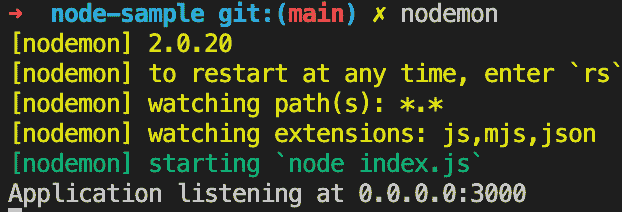

图 6.5 – 使用 nodemon 运行我们的 Node.js 示例应用程序

注意

正如我们所看到的，通过解析我们的`package.json`文件，`nodemon`已经识别出应该将`node index.js`作为启动命令。

1.  现在，尝试更改一些代码。例如，在`index.js`的末尾添加以下代码片段，然后保存文件：

    ```
    app.get('/colors', (req,res)=>{    res.send(['red','green','blue']);})
    ```

1.  查看终端窗口。看到了什么变化吗？你应该看到以下附加输出：

    ```
    [nodemon] restarting due to changes...[nodemon] starting `node index.js`Application listening at 0.0.0.0:3000
    ```

这表示`nodemon`已经检测到了一些更改，并自动重新启动了应用程序。

1.  在浏览器中尝试这个，通过访问`localhost:3000/colors`。你应该在浏览器中看到以下预期的输出：

    ```
    ["red", "green", "blue"]
    ```

这很酷 – 你可以在不手动重启应用程序的情况下获得这个结果。这使我们的生产力又提高了一点。现在，在容器内部能否做到同样的效果？

是的，我们可以。但是，我们不会使用在我们的 Dockerfile 最后一行定义的启动命令`node index.js`：

```
CMD node index.js
```

我们将使用`nodemon`。

我们是否需要修改我们的 Dockerfile？或者我们需要两个不同的 Dockerfile，一个用于开发，一个用于生产？

我们的原始 Dockerfile 创建了一个不幸没有包含`nodemon`的镜像。因此，我们需要创建一个新的 Dockerfile：

1.  创建一个新文件。我们称之为`Dockerfile.dev`。它的内容应该如下所示：

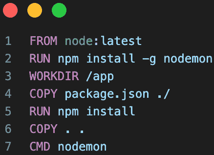

图 6.6 – 用于开发我们的 Node.js 应用程序的 Dockerfile

将这与我们的原始`Dockerfile`进行比较，我们在第二行添加了`nodemon`的安装。我们还修改了最后一行，现在使用`nodemon`作为启动命令。

1.  让我们构建我们的开发镜像，如下所示：

    ```
    $ docker image build \    -f Dockerfile.dev \    -t node-demo-dev .
    ```

请注意命令行参数`-f Dockerfile.dev`。由于我们使用的是非标准命名的 Dockerfile，必须使用这个参数。

1.  运行一个容器，就像这样：

    ```
    $ docker container run --rm -it \    -v $(pwd):/app \    -p 3000:3000 \    node-demo-dev
    ```

1.  现在，当应用程序在容器中运行时，改变一些代码，保存它，并注意到容器内的应用程序已经自动重新启动了。通过这种方式，我们在容器中运行时也实现了减少摩擦的效果，就像直接在主机上运行一样。

1.  当你完成时，按下*Ctrl* + *C*退出你的容器。

1.  使用以下命令清理系统并删除所有正在运行或悬挂的容器：

    ```
    $ docker container rm -f $(docker container ls -aq)
    ```

你可能会想，这只适用于 Node.js 吗？不，幸运的是，许多流行的编程语言都支持类似的概念。

## Java 和 Spring Boot 的自动重新启动

Java 和 Spring Boot 仍然是开发**业务线**（**LOB**）类型应用程序时最受欢迎的编程语言和库。让我们学习如何在开发这种应用程序并进行容器化时尽可能减少摩擦。

为了使此示例正常工作，你必须在电脑上安装 Java。写本文时，推荐的版本是 Java 17。你可以使用你喜欢的包管理工具进行安装，比如 Mac 上的 Homebrew 或 Windows 上的 Chocolatey。

你可能还需要确保你已经为 VS Code 安装了*Microsoft 的 Java 扩展包*。你可以在此处找到更多详细信息：[`marketplace.visualstudio.com/items?itemName=vscjava.vscode-java-pack`](https://marketplace.visualstudio.com/items?itemName=vscjava.vscode-java-pack)。

一旦你在电脑上安装并准备好 Java 17 SDK，请按照以下步骤操作：

1.  启动 Spring Boot 应用程序最简单的方法是使用`Spring Web`，并选择它（*不要*选择**Spring** **Reactive Web**）。

你的页面应该如下所示：

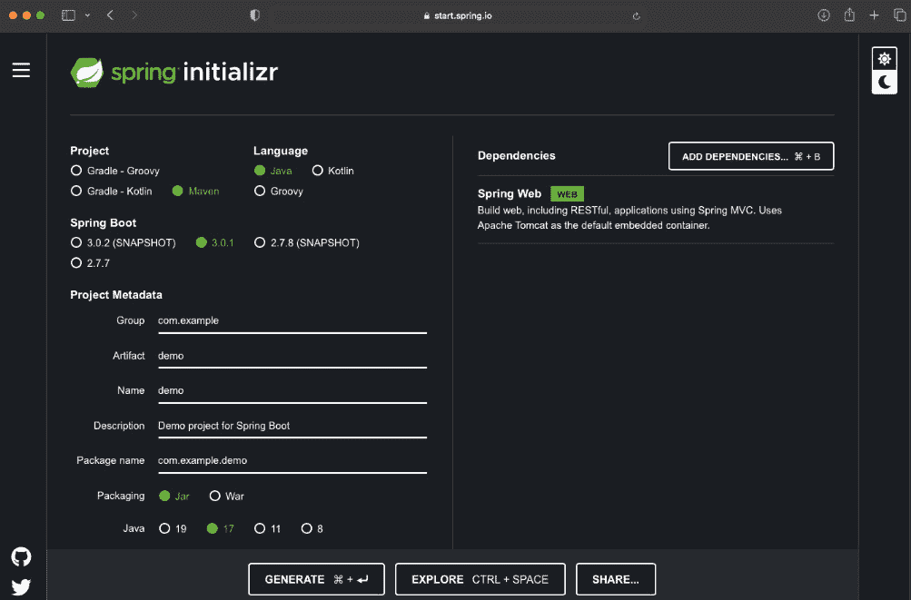

图 6.7 – 使用 Spring Initializr 引导新的 Java 项目

1.  点击`ch06/java-springboot-demo`。

1.  导航到此文件夹：

    ```
    $ cd ch06/java-springboot-demo
    ```

1.  使用以下命令从此文件夹中打开 VS Code：

    ```
    $ code .
    ```

1.  找到项目的主文件，名为`DemoApplication.java`，然后点击第 9 行的`main`方法，如下图所示：

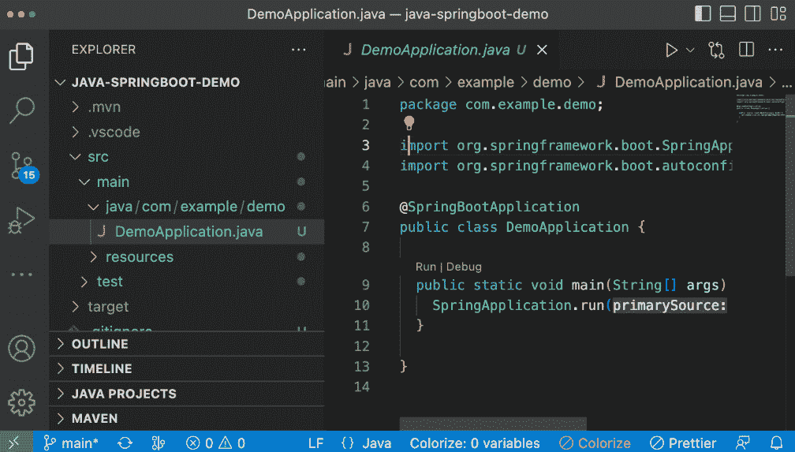

图 6.8 – 启动 Java Spring Boot 应用程序

1.  请注意，应用程序已经被编译，并且打开了一个终端窗口。将显示如下类似的内容：

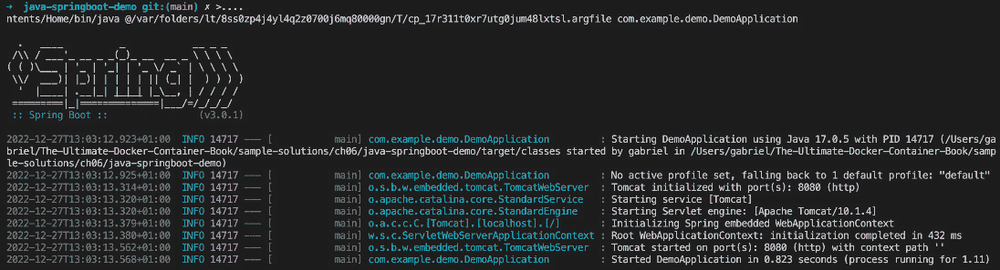

图 6.9 – 运行 Spring Boot 应用程序生成的输出

1.  在前面输出的倒数第二行，我们可以看到应用程序使用了 Tomcat Web 服务器，并且正在监听端口`8080`。

1.  现在，让我们添加一个端点，之后可以尝试访问它：

    1.  用`@RestController`注解装饰`DemoApplication`类。

    1.  添加一个返回字符串列表的`getSpecies`方法

    1.  用以下注解装饰该方法：

`@GetMapping("/species")`

不要忘记添加所需的`import`语句。完整的代码如下所示：

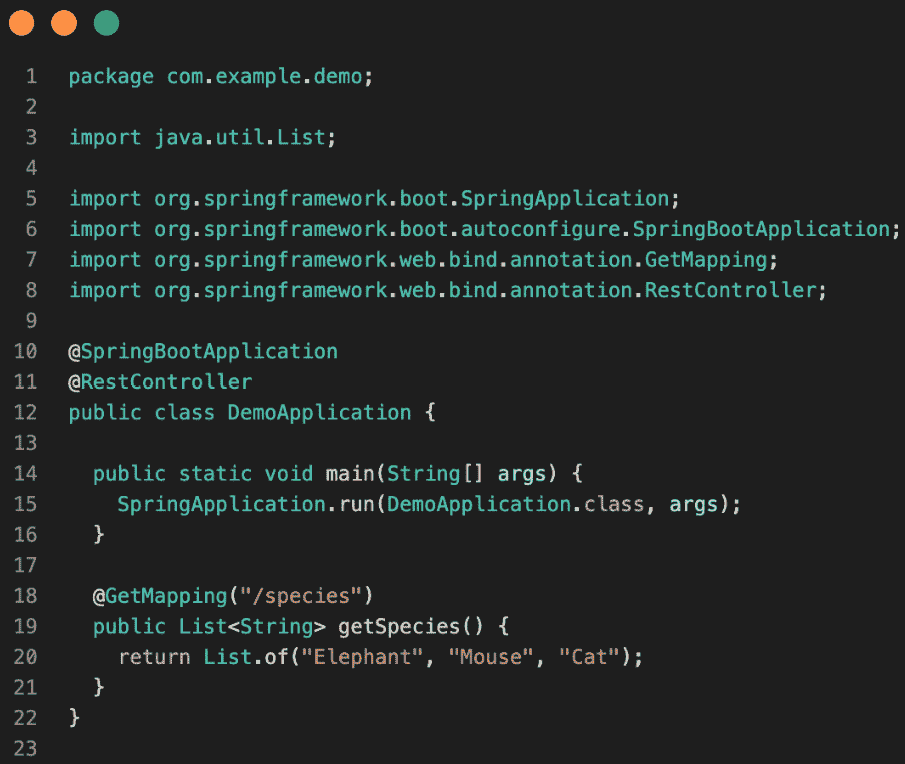

图 6.10 – Spring Boot 示例的完整演示代码

1.  使用`curl`或`/species`端点：

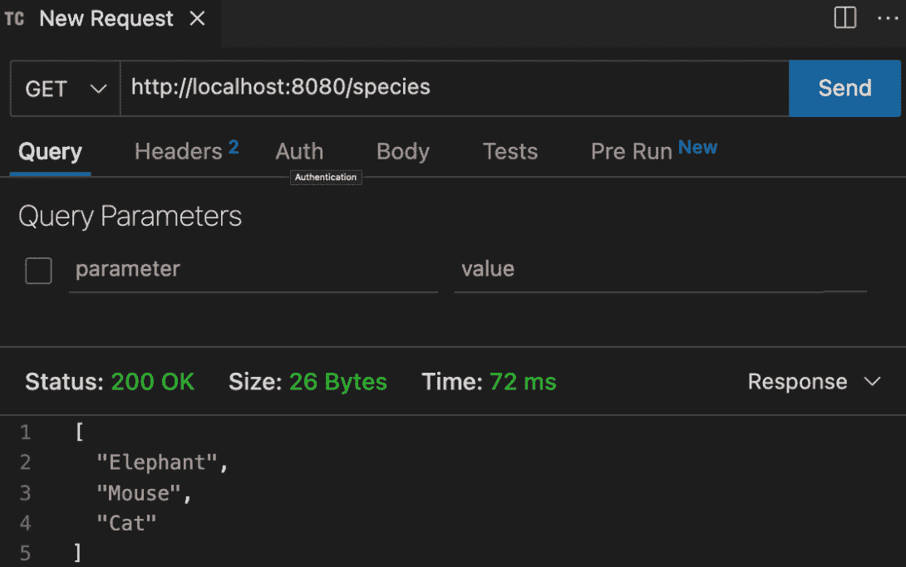

图 6.11 – 使用 Thunder Client 插件测试 Java 演示应用程序

1.  要为我们的 Java Spring Boot 应用程序添加自动重启支持，我们需要添加所谓的开发工具：

    1.  在你的 Java 项目中找到`pom.xml`文件并在编辑器中打开它。

    1.  将以下代码段添加到文件的依赖部分：

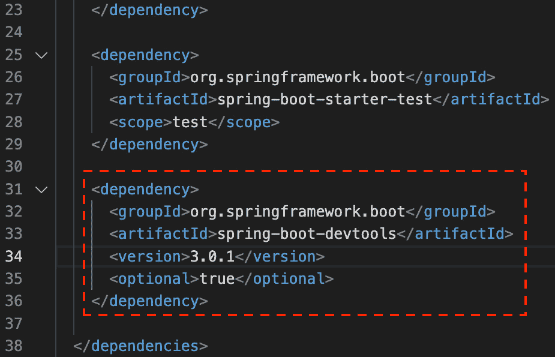

图 6.12 – 添加对 Spring Boot 开发工具的引用

请注意，依赖项定义中的版本节点可以省略，因为项目使用了`spring-boot-starter-parent`作为父级。

1.  停止并重新运行应用程序。

1.  修改`DemoApplication`类的第 20 行，添加`Crocodile`作为返回给调用者的第四个物种。

1.  保存你的更改，并观察应用程序自动重新构建并重启。

1.  使用`curl`或 Thunder Client 再次访问`/species`端点。这次应该返回一个包含刚刚添加的`Crocodile`在内的四个物种的列表。

很棒——我们有一个 Java Spring Boot 应用程序，当我们更改代码时，它会自动重新编译并重启。现在，我们需要像在 Node.js 示例中那样将整个应用容器化：

1.  将以下内容添加到项目根目录的`Dockerfile`中：

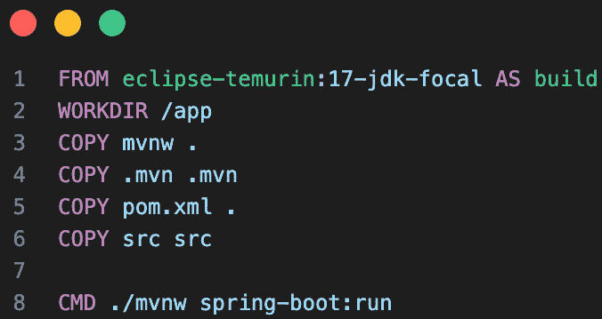

图 6.13 – Java Spring Boot 示例的 Dockerfile

注意

我们在这个示例中使用了`eclipse-temurin`镜像和`17-jdk-focal`标签，因为在撰写本文时，该镜像适用于现代 MacBook 上使用的 M1 或 M2 处理器。

1.  使用以下命令创建一个镜像，使用前面的 Dockerfile：

    ```
    $ docker image build -t java-demo .
    ```

1.  使用以下命令从这个 Docker 镜像创建一个容器：

    ```
    $ docker container run --name java-demo --rm \    -p 8080:8080    -v $(pwd)/.:/app    java-demo
    ```

注意

第一次运行容器时，由于需要下载所有 Maven 依赖项，因此编译会花费一些时间。

1.  尝试像之前一样访问`/species`端点。

1.  现在，修改一些代码——例如，向`getSpecies`方法中添加一个第五个物种，比如`Penguin`，然后保存更改。

1.  观察容器内运行的应用程序是如何被重新构建的。通过再次访问`/species`端点并确认返回五个物种，包括`Penguin`，来验证更改是否已被纳入。

1.  完成操作后，可以通过 Docker Desktop 的仪表盘或 VS Code 中的 Docker 插件停止容器。

嗯，这不是很简单吗？不过让我告诉你，这种设置开发环境的方式可以通过消除许多不必要的摩擦，让开发容器化应用变得更加愉快。

挑战

尝试找出如何将本地的 Maven 缓存映射到容器中，以进一步加速容器的首次启动。

接下来，我们将向你展示如何轻松地在 Python 中完成相同的操作，敬请期待。

## Python 的自动重启

让我们看看相同的操作在 Python 中是如何工作的。

### 前提条件

为了使这个示例能够正常工作，你需要在电脑上安装 Python 3.x。你可以通过你喜欢的包管理工具来安装，例如 Mac 上的 Homebrew 或 Windows 上的 Chocolatey。

在你的 Mac 上，使用此命令安装最新的 Python 版本：

```
$ brew install python
```

在你的 Windows 计算机上，使用此命令进行相同操作：

```
$ choco install python
```

使用此命令验证安装是否成功：

```
$ python3 --version
```

在作者的案例中，输出看起来是这样的：

```
Python 3.10.8
```

让我们开始吧：

1.  首先，为我们的示例 Python 应用程序创建一个新的项目文件夹，并导航到该文件夹：

    ```
    $ mkdir python-demo && cd python-demo
    ```

1.  使用以下命令从此文件夹中打开 VS Code：

    ```
    $ code .
    ```

1.  我们将创建一个使用流行 Flask 库的示例 Python 应用程序。因此，向此文件夹中添加一个名为 `requirements.txt` 的文件，内容如下：

    ```
    flask
    ```

1.  接下来，添加一个 `main.py` 文件，并将以下内容填入其中：

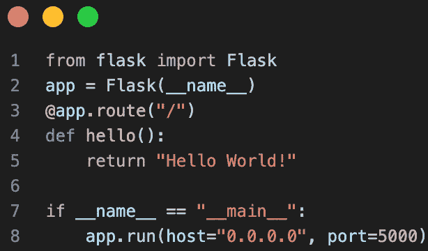

图 6.14 – 我们的示例 Python 应用程序的 main.py 文件内容

这是一个简单的 Hello World 类型的 [应用](http://localhost:5000/)，它在 `http://localhost:5000/` 实现了一个 RESTful 端点。

注意

在 `app.run` 命令中的 `host="0.0.0.0"` 参数是必要的，这样我们才能将 Python 应用监听的端口（`5000`）暴露给主机。稍后我们会用到这个。

请注意，有些人在 Mac 上运行时，使用端口 `5000` 时，出现错误提示：“地址已在使用中。端口 `5000` 已被另一个程序占用...”。遇到这种情况时，只需尝试使用不同的端口，例如 `5001`。

1.  在我们运行并测试此应用程序之前，我们需要安装必要的依赖项——在我们这个例子中是 Flask。在终端中运行以下命令：

    ```
    $ pip3 install -r requirements.txt
    ```

这应该会在主机上安装 Flask。我们现在可以开始了。

1.  在使用 Python 时，我们还可以使用 `nodemon` 使我们的应用在代码有任何更改时自动重启。例如，假设你启动 Python 应用的命令是 `python main.py`，在这种情况下，你只需像这样使用 `nodemon`：

    ```
    $ nodemon --exec python3 main.py
    ```

你应该看到以下输出：

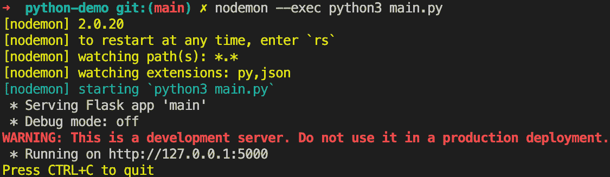

图 6.15 – 使用 nodemon 自动重启 Python 3 应用程序

1.  使用 `nodemon` 启动并监控 Python 应用程序时，我们可以使用 `curl` 测试应用程序。打开另一个终端窗口，并输入以下命令：

    ```
    $ curl localhost:5000
    ```

你应该在输出中看到以下内容：

```
Hello World!
```

1.  现在，让我们通过在 `/` 端点的定义后（即第 5 行后）添加以下代码片段来修改代码，并保存：

    ```
    from flask import jsonify@app.route("/colors")def colors():    return jsonify(["red", "green", "blue"])
    ```

`nodemon` 会发现更改并重启 Python 应用程序，如终端中输出的内容所示：

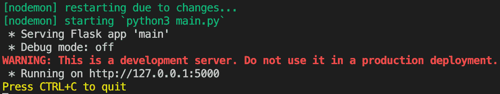

图 6.16 – nodemon 发现 Python 代码中的变化

1.  再次强调，信任是好的，但测试更好。因此，让我们再次使用我们的好朋友 `curl` 来探测新的端点，看看能得到什么：

    ```
    $ curl localhost:5000/colors
    ```

输出应该如下所示：

```
["red", "green", "blue"]
```

很好 – 它工作正常！到此为止，我们已经覆盖了 Python 部分。

1.  现在，到了将这个应用容器化的时候了。将一个名为 `Dockerfile` 的文件添加到项目中，内容如下：

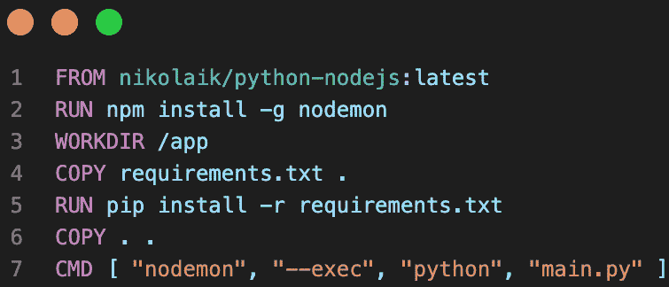

图 6.17 – 样例 Python 应用的 Dockerfile

请注意，在第 1 行，我们使用了一个包含 Python 和 Node.js 代码的特殊基础镜像。然后，在第 2 行，我们安装了 `nodemon` 工具，接着将 `requirements.txt` 文件复制到容器中并执行 `pip install` 命令。接下来，我们将所有其他文件复制到容器中，并定义每次创建该镜像实例（即容器）时的启动命令。

1.  使用以下命令构建 Docker 镜像：

    ```
    $ docker image build -t python-sample .
    ```

1.  现在，我们可以使用以下代码从此镜像启动一个容器：

    ```
    $ docker container run --rm \    -p 5000:5000 \    -v $(pwd)/.:/app \    python-sample
    ```

我们应该看到与在 *步骤 6* 中运行应用程序时，容器内部产生的输出类似，那时我们是本地运行应用程序的：

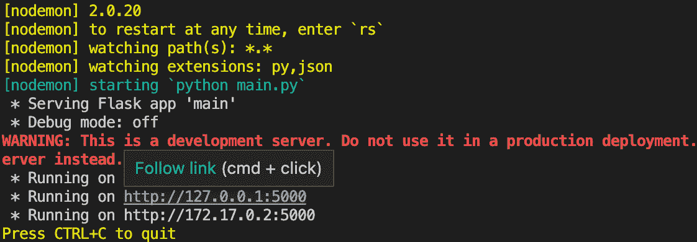

图 6.18 – 运行容器化的 Python 样例应用

请注意，我们如何将容器端口 `5000` 映射到相应的主机端口，以便我们可以从外部访问该应用程序。我们还将主机上的样例目录内容映射到正在运行的容器中的 `/app` 文件夹。这样，我们就可以更新代码，容器化的应用程序会自动重启。

1.  尝试更改应用程序代码，并在访问 `/colors` 端点时返回第四种颜色。保存更改并观察容器内运行的应用程序如何重新启动。

1.  使用`curl`命令验证返回的是否是包含四种颜色的数组。

1.  当你玩完这个示例后，按下终端窗口中运行容器的 *Ctrl* + *C* 来停止应用程序和容器。

有了这个示例，我们展示了一个完整的 Python 工作示例，帮助你在开发过程中大大减少与容器相关的摩擦。

.NET 是另一个流行的平台。让我们看看在 .NET 上开发 C# 应用程序时，是否可以做到类似的操作。

## .NET 的自动重启

我们的下一个候选示例是一个用 C# 编写的 .NET 应用程序。让我们看看动态代码更新和自动重启在 .NET 中是如何工作的。

### 前提条件

如果你之前没有安装，请在你的笔记本或工作站上安装 .NET。你可以使用你喜欢的包管理器，例如 Mac 上的 Homebrew 或 Windows 上的 Chocolatey。

在 Mac 上，使用以下命令安装 .NET 7 SDK：

```
$ brew install --cask dotnet-sdk
```

在 Windows 机器上，你可以使用以下命令：

```
$ choco install -y dotnet-sdk
```

最后，使用此命令验证你的安装：

```
$ dotnet –version
```

在作者的机器上，输出如下：

```
7.0.100
```

让我们开始：

1.  在一个新的终端窗口中，导航到本章文件夹：

    ```
    $ cd ~/The-Ultimate-Docker-Container-Book/ch06
    ```

1.  在该文件夹中，使用 `dotnet` 工具创建一个新的 Web API，并将其放置在 `dotnet` 子文件夹中：

    ```
    $ dotnet new webapi -o csharp-sample
    ```

1.  转到这个新项目文件夹：

    ```
    $ cd csharp-sample
    ```

1.  从该文件夹中打开 VS Code：

    ```
    $ code .
    ```

注意

如果这是你第一次在 VS Code 中打开 .NET 项目，编辑器可能会显示一个弹窗，询问你是否需要添加缺失的依赖项。此时，点击 **是** 按钮：

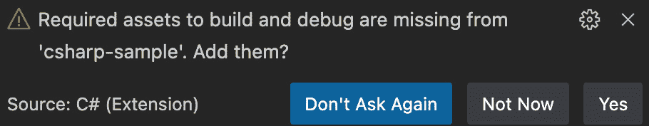

图 6.19 – 请求加载 .NET 示例应用程序的缺失资产

1.  在 VS Code 的项目资源管理器中，你应该看到以下内容：

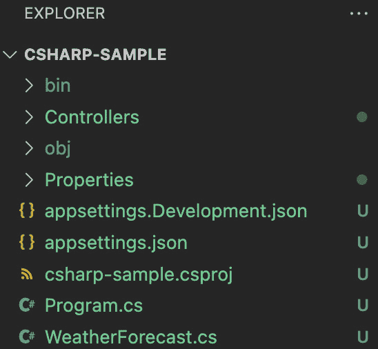

图 6.20 – 在 VS Code 项目资源管理器中查看 .NET 示例应用程序

1.  请注意包含 `WeatherForecastController.cs` 文件的 `Controllers` 文件夹。打开这个文件并分析其内容。它包含 `WeatherForecastController` 类的定义，该类实现了一个简单的 RESTful 控制器，提供 `/WeatherForecast` 的 GET 端点。

1.  在终端中，运行应用程序 `dotnet run`。你应该看到如下所示的内容：

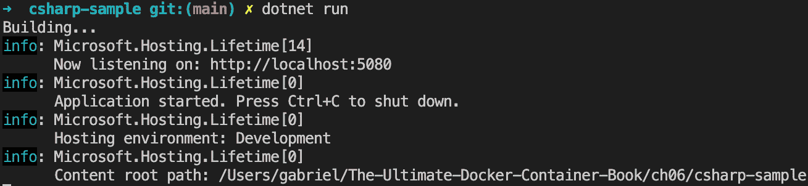

图 6.21 – 在主机上运行 .NET 示例 Web API

请注意上面[输出中的第四行](http://localhost:5080/)，.NET 告诉我们应用程序正在 `http://localhost:5080` 监听。在你的情况下，端口可能不同。请使用为你报告的端口进行后续所有操作。

1.  我们可以使用 `curl` 来测试应用程序，方法如下：

    ```
    $ curl http://localhost:5080/WeatherForecast
    ```

这将输出一个包含五个随机天气数据的 JSON 对象数组：

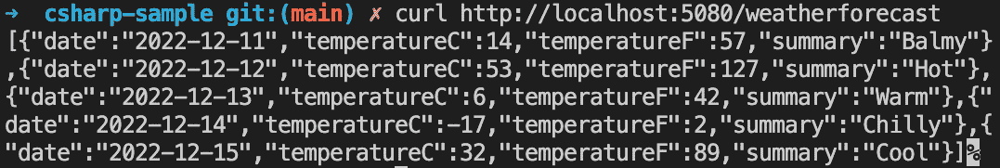

图 6.22 – .NET 示例应用程序生成的天气数据

1.  现在我们可以尝试修改 `WeatherForecastController.cs` 中的代码，返回 10 条数据而不是默认的 5 条。将第 24 行修改为如下所示：

    ```
    ...    return Enumerable.Range(1, 10).Select(......
    ```

1.  保存你的更改并重新运行 `curl` 命令。请注意，结果中不包含新添加的值。这是我们在 Node.js 和 Python 中观察到的相同问题。为了查看最新的返回值，我们需要（手动）重新启动应用程序。

1.  因此，在终端中，按 *Ctrl* + *C* 停止应用程序，然后使用 `dotnet run` 重新启动它。再次尝试 `curl` 命令。此时，结果应反映你所做的更改。

1.  幸运的是，`dotnet` 工具有一个 `watch` 命令。按 *Ctrl* + *C* 停止应用程序，然后执行这个稍作修改的命令：

    ```
    $ dotnet watch run
    ```

你应该看到类似以下的输出（已缩短）：

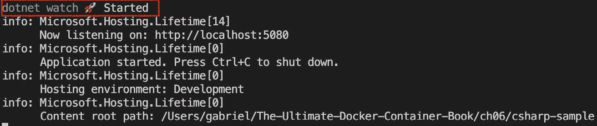

图 6.23 – 使用 watch 任务运行 .NET 示例应用程序

注意前面输出的第一行，它显示正在运行的应用程序现在已经开启监视以检测更改。

1.  在`WeatherForecastController.cs`中做另一个更改；例如，让`GET`端点方法返回 100 个天气项，然后保存更改。观察终端中的输出。它应该像这样：

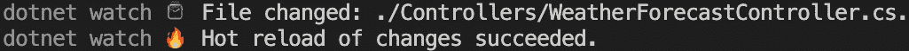

图 6.24 – 自动重启正在运行的.NET Core 示例应用

1.  通过在更改代码后自动重启应用，结果立即可用，我们可以通过运行以下`curl`命令轻松测试它：

    ```
    $ curl http://localhost:5080/WeatherForecast
    ```

这次应该输出 100 个天气项目，而不是 10 个。

1.  现在我们已经在主机上启用了自动重启，我们可以为容器内运行的应用编写一个`Dockerfile`来实现相同的功能。在 VS Code 中，向项目中添加一个名为`Dockerfile-dev`的新文件，并将以下内容添加到该文件中：

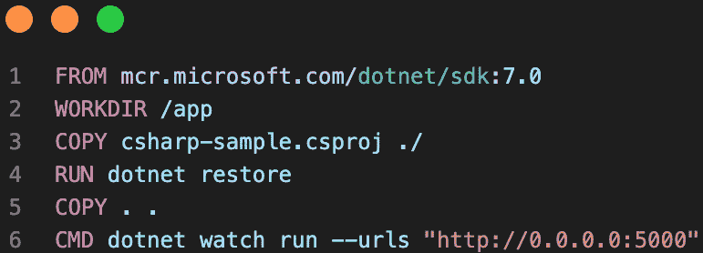

图 6.25 – .NET 示例应用的 Dockerfile

请注意第 6 行中的`--urls`命令行参数。这个参数明确告诉应用在容器内所有端点上监听端口`5000`（由特殊的`0.0.0.0` IP 地址表示）。如果我们保留默认的`localhost`，则无法从容器外部访问该应用。

端口已被占用

请注意，有人报告说，在 Mac 上使用端口`5000`时，会触发错误消息“地址已被使用。端口`5000`已被其他程序占用...”。这种情况下，只需尝试使用不同的端口，例如`5001`。

现在，我们准备好构建容器镜像：

1.  使用以下命令为.NET 示例构建容器镜像：

    ```
    $ docker image build -f Dockerfile-dev \    -t csharp-sample .
    ```

1.  一旦镜像构建完成，我们可以从中运行一个容器：

    ```
    $ docker container run --rm \    --name csharp-sample \    -p 5000:5000 \    -v $(pwd):/app \    csharp-sample
    ```

我们应该看到一个与原生运行时类似的输出。

1.  让我们用我们的朋友`curl`来测试应用：

    ```
    $ curl localhost:5000/weatherforecast
    ```

我们应该获得天气预报项的数组。没有意外 – 它按预期工作。

1.  现在，让我们在控制器中进行代码更改并保存。观察终端窗口中发生的情况。我们应该能看到类似如下的输出：

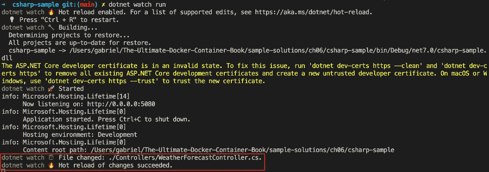

图 6.26 – 热重载容器内运行的.NET 示例应用

好吧，这正是我们预期的。通过这个，我们已经消除了在开发.NET 应用时使用容器引入的大部分摩擦。

1.  当你完成 .NET 示例应用程序的调试后，打开 Docker Desktop 应用程序的仪表盘。定位到 `csharp-sample` 容器并选择它。然后，点击红色的**删除**按钮，将其从系统中移除。这是最简单的方式，因为不幸的是，仅仅在你运行容器的终端窗口中按下 *Ctrl* + *C* 并不起作用。另一种方法是，你可以打开一个新的终端窗口并使用以下命令来移除容器：

    ```
    $ docker container rm --force csharp-sample
    ```

暂时就到这里。在本节中，我们探讨了在开发容器化应用程序时，如何减少与 Node.js、Python、Spring Boot、Java 或 .NET 编写的应用程序之间的摩擦。接下来，我们将学习如何逐行调试运行在容器中的应用程序。

# 容器内逐行调试代码

在我们深入探讨如何逐行调试容器内运行的代码之前，我要做一个免责声明。你将在本节中学到的内容通常应作为最后的手段，前提是其他方法无效。理想情况下，当你在开发应用程序时采用测试驱动的方法，代码通常是有保障的，因为你已经为其编写了单元测试和集成测试，并且在容器内运行它们。如果单元测试或集成测试未能提供足够的洞见，且你需要逐行调试代码，你可以直接在主机上运行代码，从而利用像 VS Code、Eclipse 或 IntelliJ 这样的开发环境的支持，以上只是其中的一些 IDE。

做好所有这些准备后，你应该很少需要手动调试容器内运行的代码。话虽如此，让我们看看无论如何你如何进行调试！

在本节中，我们将专注于如何使用 VS Code 调试。其他编辑器和 IDE 可能会提供类似或不提供此功能。

## 调试 Node.js 应用程序

我们从最简单的开始——一个 Node.js 应用程序。我们将使用在 `~/The-Ultimate-Docker-Container-Book/ch06/node-sample` 文件夹中的示例应用程序，这个文件夹是我们在本章之前使用过的：

1.  打开一个新的终端窗口，并确保你导航到这个项目文件夹：

    ```
    $ cd ~/The-Ultimate-Docker-Container-Book/ch06/node-sample
    ```

1.  从容器内打开 VS Code：

    ```
    $ code .
    ```

1.  在终端窗口中，从项目文件夹内运行一个包含我们示例 Node.js 应用程序的容器：

    ```
    $ docker container run --rm -it \    --name node-sample \    -p 3000:3000 \    -p 9229:9229 \    -v $(pwd):/app \    node-demo-dev node --inspect=0.0.0.0 index.js
    ```

注意

在前面的命令中，我们将端口 `9229` 映射到主机。该端口由 Node.js 调试器使用，VS Studio 将通过该端口与我们的 Node 应用程序进行通信。因此，打开这个端口是很重要的——但仅限于调试会话期间！另外，请注意，我们覆盖了在 Dockerfile 中定义的标准启动命令（记得它原本只是 `node index.js`），用的是 `node --inspect=0.0.0.0 index.js`。`--inspect=0.0.0.0` 命令行参数告诉 Node 以调试模式运行，并监听容器中的所有 IPv4 地址。

现在，我们准备为当前场景定义一个 VS Code 启动任务——也就是让我们的代码在容器内运行。

1.  在你的项目中添加一个名为`.vscode`的文件夹（请注意文件夹名称前的点）。在这个文件夹内，添加一个名为`launch.json`的文件，内容如下：

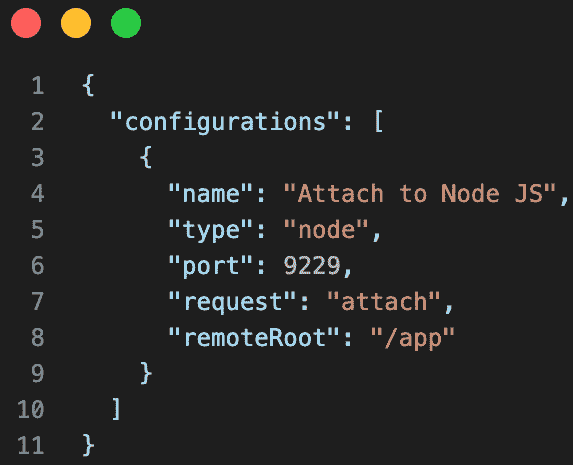

图 6.27 – 调试 Node.js 应用的启动配置

1.  要打开`launch.json`文件，按 *cmd* + *Shift* + *P*（Windows 上为 *Ctrl* + *Shift* + *P*）打开命令面板；搜索 `launch.json` 文件，应该会在编辑器中打开。

1.  打开 `index.js` 文件，然后点击左侧边栏第 25 行来设置一个断点：

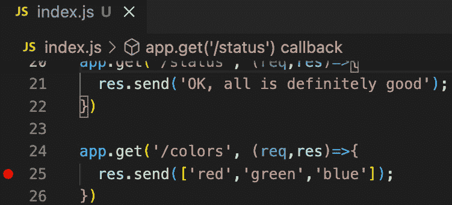

图 6.28 – 在我们的 Node.js 示例应用中设置断点

1.  按 *cmd* + *Shift* + *D*（Windows 上为 *Ctrl* + *Shift* + *D*）打开 VS Code 的调试视图。

1.  确保你在视图顶部绿色启动按钮旁边的下拉菜单中选择了正确的启动任务。选择 `launch.json` 文件，应该如下所示：

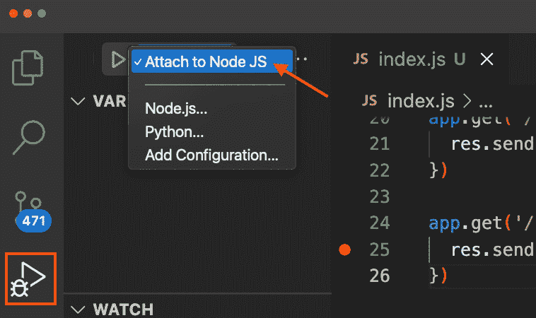

图 6.29 – 选择正确的启动任务来调试我们的 Node.js 应用

1.  接下来，点击绿色的启动按钮，将 VS Code 附加到容器内运行的 Node.js 应用。

1.  在另一个终端窗口中，使用 `curl` 访问 `/colors` 端点：

    ```
    $ curl localhost:3000/colors
    ```

观察代码执行在断点处停止：

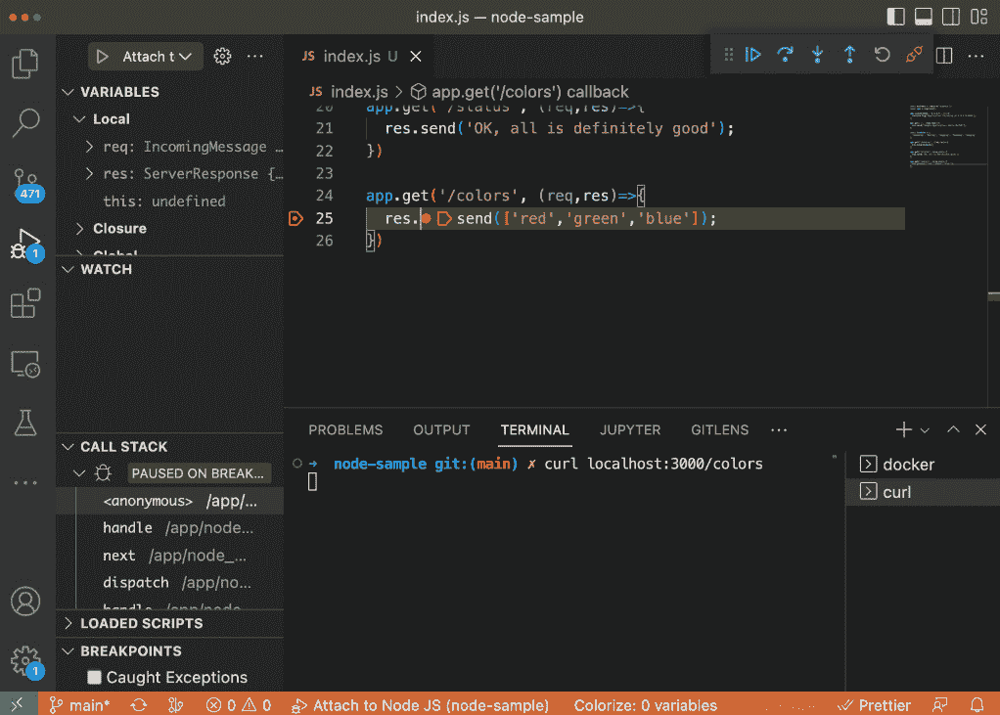

图 6.30 – 代码执行在断点处停止

在前面的截图中，我们可以看到一个黄色的条形，表示代码的执行已在断点处停止。在右上角，我们有一个工具栏，可以逐步导航代码。左侧则是 **VARIABLES**、**WATCH** 和 **CALL STACK** 窗口，我们可以用它们来观察正在运行的应用的细节。我们正在调试容器内运行的代码这一事实，可以通过我们在启动容器的终端窗口中看到输出调试器已附加来验证，这是我们在 VS Code 中启动调试的那一刻产生的。

1.  要停止容器，可以在终端窗口中输入以下命令：

    ```
    $ docker container rm --force node-sample
    ```

1.  如果我们想使用 `nodemon` 获得更多的灵活性，则需要稍微修改 `container run` 命令：

    ```
    $ docker container run --rm \    --name node-sample \    -p 3000:3000 \    -p 9229:9229 \    -v $(pwd):/app \    node-sample-dev nodemon --inspect=0.0.0.0 index.js
    ```

请注意我们是如何使用启动命令 `nodemon --inspect=0.0.0.0 index.js` 的。这将带来一个好处：每当代码发生更改时，容器内运行的应用将会自动重启，正如我们在本章前面所学的那样。你应该看到如下内容：

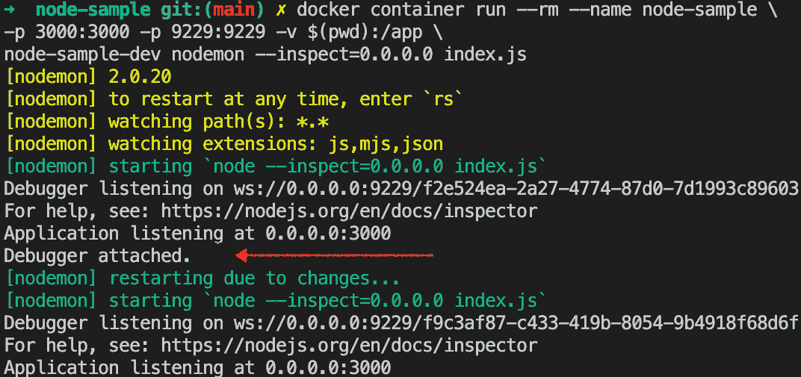

图 6.31 – 使用 nodemon 启动 Node.js 应用程序并打开调试功能

1.  不幸的是，应用程序重启的结果是调试器与 VS Code 失去连接。但别担心——我们可以通过在`launch.json`文件中的启动任务中添加`"restart": true`来减轻这个问题。修改任务，使其如下所示：

    ```
    {    "type": "node",    "request": "attach",    "name": "Docker: Attach to Node",    "remoteRoot": "/app",    "restart": true},
    ```

1.  保存更改后，通过点击调试窗口中的绿色启动按钮启动 VS Code 中的调试器。在终端中，你应该能看到调试器已附加，并显示一条消息作为输出。除此之外，VS Code 会在底部显示一个橙色状态栏，表示编辑器处于调试模式。

1.  在另一个终端窗口中，使用`curl`并尝试导航到`localhost:3000/colors`，以测试逐行调试是否仍然有效。确保代码执行在你设置的任何断点处停下来。

1.  一旦你验证调试仍然有效，尝试修改一些代码；例如，修改返回颜色的数组并添加另一个颜色。保存你的更改。观察`nodemon`如何重启应用程序，并且调试器自动重新附加到容器内运行的应用程序：

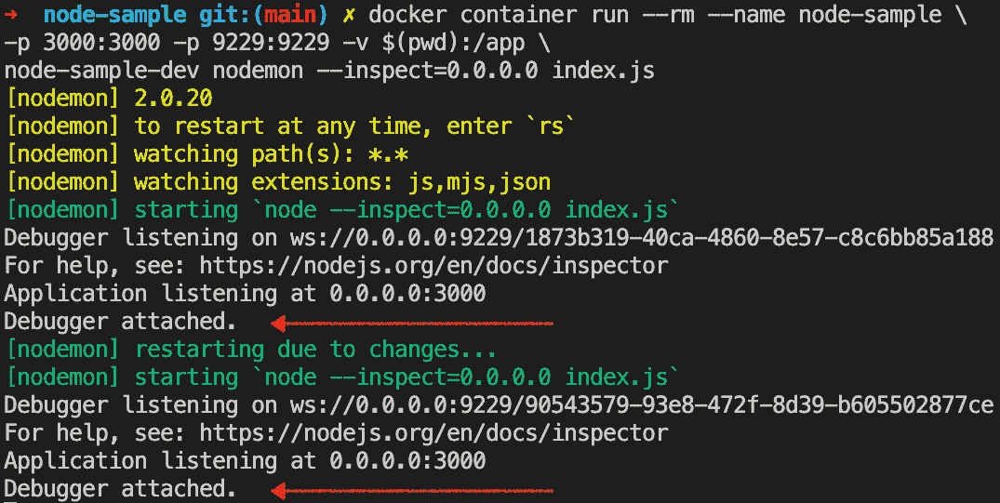

图 6.32 – nodemon 重启应用程序并且调试器自动重新附加到应用程序

到此为止，我们已经完成所有的设置，现在可以像在宿主机上运行代码一样，在容器内运行的代码进行操作。我们几乎去除了容器给开发过程带来的所有摩擦。现在我们可以尽情享受将代码部署到容器中的好处。

1.  清理时，在你启动容器的终端窗口中按下*Ctrl* + *C*以停止容器。

现在你已经学会了如何逐行调试运行在容器中的 Node.js 应用程序，让我们学习如何对 .NET 应用程序做同样的操作。

## 调试 .NET 应用程序

在这一部分，我们将快速演示如何逐行调试一个 .NET 应用程序。我们将使用本章前面创建的示例 .NET 应用程序：

1.  导航到项目文件夹并从其中打开 VS Code：

    ```
    $ cd ~/The-Ultimate-Docker-Container-Book/ch06/csharp-sample
    ```

1.  然后，通过以下命令打开 VS Code：

    ```
    $ code .
    ```

1.  要使用调试器，我们可以完全依赖 VS Code 命令的帮助。按*cmd* + *Shift* + *P*（Windows 上是*Shift* + *Ctrl* + *P*）来打开命令面板。

1.  搜索`Docker: 将 Docker 文件添加到工作区`并选择它：

    1.  选择`5000`。

一旦你输入了所有必需的信息，`Dockerfile` 和 `.dockerignore` 文件将被添加到项目中。花点时间查看这两个文件。注意，这个`Dockerfile`是定义为多阶段构建的。

上述命令还将`launch.json`和`tasks.json`文件添加到项目中新创建的`.vscode`文件夹中。这些文件将由 VS Code 使用，帮助它定义在我们要求其调试示例应用程序时应该执行的操作。

1.  让我们在`WeatherForecastController.cs`文件的第一个`GET`请求处设置一个断点。

1.  找到项目中的`.vscode/launch.json`文件并打开它。

1.  找到 Docker .NET Core 启动调试配置，并将红色矩形框标记的代码片段添加到其中：

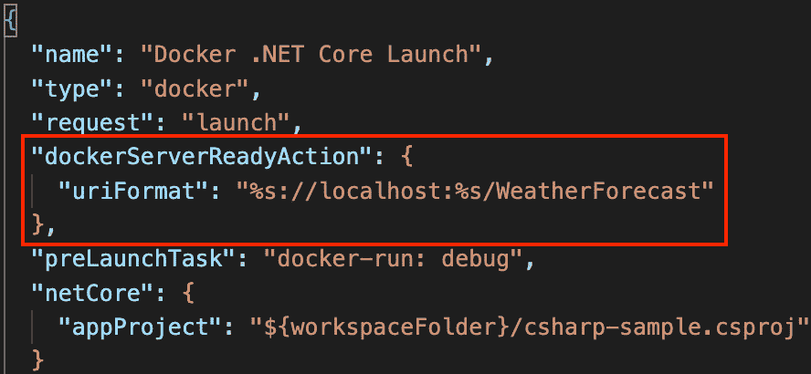

图 6.33 – 修改 Docker 启动配置

`launch.json`文件中的`dockerServerReadyAction`属性用于指定在 Docker 容器准备好接受请求时应采取的操作。

1.  切换到 VS Code 的调试窗口（在 Linux 或 Windows 上分别使用*Command* + *Shift* + *D*或*Ctrl* + *Shift* + *D*打开）。确保已选择正确的调试启动任务——它的名称是 Docker .NET Core Launch：

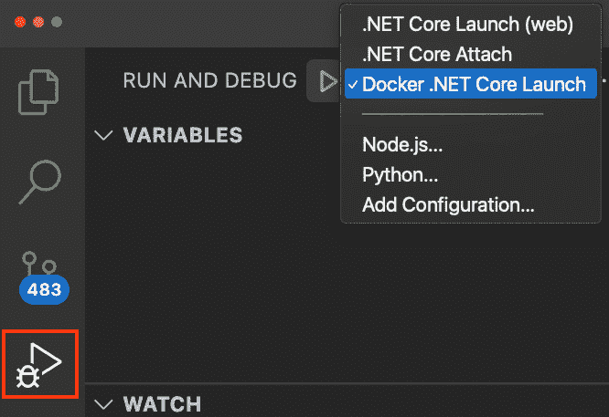

图 6.34 – 在 VS Code 中选择正确的调试启动任务

1.  现在，点击绿色的启动按钮以启动调试器。VS Code 将构建 Docker 镜像，运行容器，并配置容器进行调试。输出将在 VS Code 的终端窗口中显示。浏览器窗口将打开并导航到[`localhost:5000/wetherforecast`](http://localhost:5000/wetherforecast)，因为这是我们在启动配置中定义的内容（*第 6 步*）。与此同时，应用程序控制器中的断点被触发，如下所示：

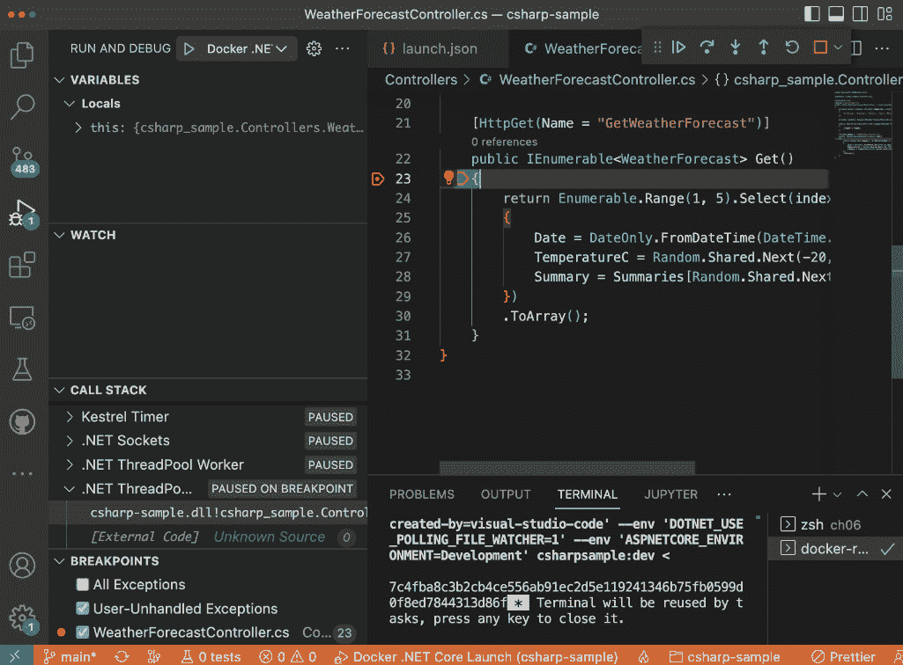

图 6.35 – 逐行调试在容器中运行的.NET Core 应用程序

1.  现在我们可以逐步执行代码、定义观察点或分析应用程序的调用栈，类似于我们在示例 Node.js 应用程序中所做的那样。点击调试工具栏上的**继续**按钮，或按*F5*继续执行代码。

1.  要停止应用程序，点击调试工具栏中的红色停止按钮，该按钮位于前述截图的右上角。

现在我们知道如何逐行调试在容器中运行的代码，是时候为我们的代码加入日志记录功能，以便它能够生成有意义的日志信息。

# 为代码加入日志记录功能以生成有意义的日志信息

一旦应用程序在生产环境中运行，交互式调试应用程序几乎是不可能的，或者强烈不建议这样做。因此，当系统表现异常或出现错误时，我们需要找到其他方法来查找根本原因。最好的方法是让应用程序生成详细的日志信息，开发人员可以使用这些信息来追踪错误。由于日志记录是一个常见的任务，所有相关的编程语言或框架都提供了使得在应用程序中生成日志信息的库，从而使得这一任务变得简单。

将应用程序输出的信息按日志的严重性级别进行分类是常见的做法。以下是这些严重性级别的列表，并附有每个级别的简短描述：

| **日志级别** | **描述** |
| --- | --- |
| 跟踪 | 非常详细的信息。在这个级别，你会捕捉应用程序行为的每一个可能细节。 |
| 调试 | 相对详细且主要用于诊断的信息，帮助你定位潜在的问题。 |
| 信息 | 正常的应用程序行为或里程碑，比如启动或关闭信息。 |
| 警告 | 应用程序可能遇到问题，或者你检测到了一个异常情况。 |
| 错误 | 应用程序遇到了严重问题。这很可能表示某个重要的应用程序任务失败。 |
| 致命 | 应用程序的灾难性故障。建议立即关闭应用程序。 |

表 6.1 – 生成日志信息时使用的严重性级别列表

日志库通常允许开发人员定义不同的日志目的地 —— 即日志信息的去向。常见的目的地有文件目的地或控制台输出流。当处理容器化应用程序时，强烈建议你将日志输出始终定向到控制台或 `STDOUT`。Docker 随后会通过 `docker container logs` 命令提供这些信息。其他日志收集器，如 Logstash、Fluentd、Loki 等，也可以用来抓取这些信息。

## 为 Python 应用程序添加日志功能

让我们尝试为现有的 Python 示例应用程序添加日志功能：

1.  首先，在你的终端中，导航到项目文件夹并打开 VS Code： 

    ```
    $ cd ~/The-Ultimate-Docker-Container-Book/ch06/python-demo
    ```

1.  使用以下命令打开 VS Code：

    ```
    $ code .
    ```

1.  打开 `main.py` 文件，并将以下代码片段添加到文件顶部：


图 6.36 – 为我们的 Python 示例应用程序定义一个日志记录器

在第 1 行，我们导入了标准的日志库。然后，在第 3 行，我们为我们的示例应用程序定义了一个日志记录器。在第 4 行，我们定义了用于日志记录的过滤器。在这个例子中，我们将其设置为 `WARN`。这意味着应用程序产生的所有日志消息，其严重性级别等于或高于 `WARN` 的都会被输出到定义的日志处理器或接收器中，这就是我们在本节开头所说的。在我们的例子中，只有日志级别为 `WARN`、`ERROR` 或 `FATAL` 的消息会被输出。

在第 6 行，我们创建了一个日志处理器或接收器。在我们的例子中，它是 `StreamHandler`，输出到 `STDOUT`。然后，在第 8 行，我们定义了日志记录器输出消息的格式。这里，我们选择的格式会输出时间和日期、应用程序（或日志记录器）名称、日志严重性级别，最后是我们开发者在代码中定义的实际消息。在第 9 行，我们将格式化器添加到日志处理器，而在第 10 行，我们将处理器添加到日志记录器。

注意

我们可以为每个日志记录器定义多个处理程序。

现在，我们已经准备好使用日志记录器了。

1.  让我们工具化 `hello` 函数，该函数在我们导航到 `/` 端点时被调用：

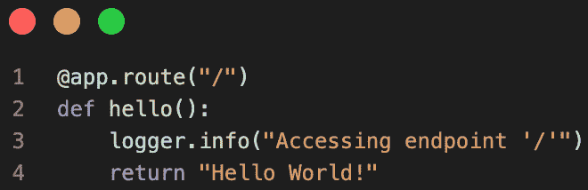

图 6.37 – 使用日志记录工具化一个方法

如前所示的截图中，我们在前面的代码段中添加了第 3 行，使用 `logger` 对象生成了一个 `INFO` 级别的日志消息。消息是 `"访问` `端点 '/'`"。

1.  让我们工具化另一个函数并输出一条 `WARN` 级别的消息：

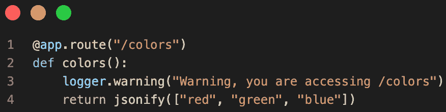

图 6.38 – 生成一个警告

这一次，我们在 `colors` 函数的第 3 行生成了一条 `WARN` 级别的日志消息。到目前为止，一切顺利——这并不难！

1.  现在，让我们运行应用程序并查看我们得到的输出：

    ```
    $ python3 main.py
    ```

1.  然后，在浏览器中，首先导航到 `localhost:5000/`，然后导航到 `localhost:5000/colors`。你应该看到类似以下的输出：

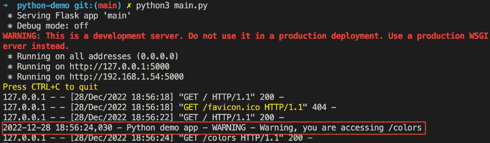

图 6.39 – 运行已工具化的示例 Python 应用程序

如你所见，只有警告消息被输出到控制台；`INFO` 消息没有显示。这是由于我们在定义日志记录器时设置的过滤器。此外，注意我们的日志消息是如何格式化的，开头包含日期和时间，然后是日志记录器的名称、日志级别，最后是第 3 行中定义的消息，如 *图 6.39* 中所示。

1.  完成后，按 *Ctrl* + *C* 停止应用程序。

现在我们已经学会了如何对 Python 应用程序进行工具化，接下来让我们学习如何对 .NET 做同样的事情。

## 对 .NET C# 应用程序进行工具化

让我们对示例 C# 应用程序进行工具化：

1.  首先，导航到项目文件夹，从这里打开 VS Code：

    ```
    $ cd ~/The-Ultimate.Docker-Container-Book/ch06/csharp-sample
    ```

1.  使用以下命令打开 VS Code：

    ```
    $ code .
    ```

1.  接下来，我们需要将包含日志库的 NuGet 包添加到项目中：

    ```
    $ dotnet add package Microsoft.Extensions.Logging
    ```

这应该将以下行添加到你的`dotnet.csproj`项目文件中：

```
<PackageReference Include="Microsoft.Extensions.Logging" Version="7.0.0" />
```

1.  打开`Program.cs`类，并注意到我们在第 1 行有以下语句：

    ```
    var builder = WebApplication.CreateBuilder(args);
    ```

默认情况下，此方法调用会向应用程序添加几个日志提供程序，其中包括控制台日志提供程序。这非常方便，并且使我们不必进行任何复杂的配置。你当然可以随时使用自己的设置覆盖默认设置。

1.  接下来，打开`Controllers`文件夹中的`WeatherForecastController.cs`文件，并添加以下内容：

    1.  添加一个类型为`ILogger`的实例变量`logger`。

    1.  添加一个构造函数，具有`ILogger<WeatherForecastController>`类型的参数。将此参数分配给`logger`实例变量：

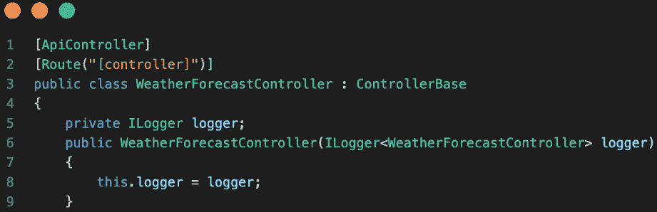

图 6.40 – 为 Web API 控制器定义日志记录器

1.  现在，我们准备在控制器方法中使用日志记录器。让我们在`Get`方法中添加一个*info*消息（如下代码中的第 4 行）：

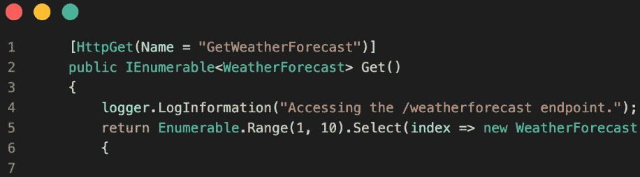

图 6.41 – 从 API 控制器记录 INFO 消息

1.  现在，让我们在`Get`方法后添加一个实现`/warning`端点的方法，并进行日志记录（此处为第 4 行）：

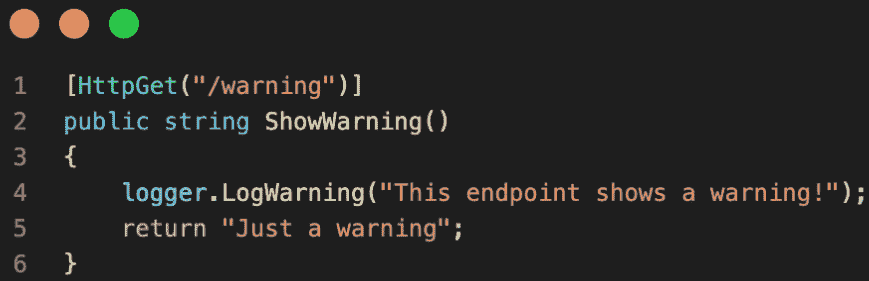

图 6.42 – 使用 WARN 日志级别记录消息

1.  让我们通过使用以下命令运行应用程序：

    ```
    $ dotnet run
    ```

1.  在新的浏览器标签页中，我们应该看到以下输出。为此，我们必须导航到`localhost:3000/weatherforecast`，然后是`localhost:3000/warning`：

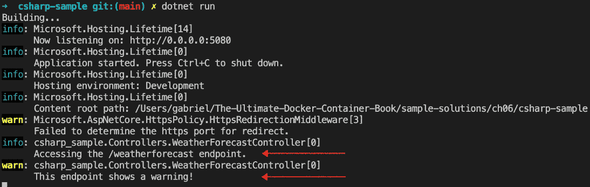

图 6.43 – 我们示例.NET 应用程序的日志输出

我们可以看到日志消息的输出，标有红色箭头，分别是`info`和`warn`类型。所有其他日志项均由 ASP.NET 库生成。如果需要调试应用程序，您可以看到有很多有用的信息。

1.  完成后，按*Ctrl* + *C*结束应用程序。

现在，我们已经学习了如何为代码添加日志记录，简化了在生产环境中查找问题根源的方式，接下来，我们将了解如何使用 Open Tracing 标准进行分布式追踪，并使用 Jaeger 作为工具来监控分布式应用程序。

# 使用 Jaeger 进行监控和故障排除

当我们想要在复杂的分布式系统中监控和故障排除事务时，我们需要比刚刚学到的东西更强大的工具。当然，我们可以并且应该继续通过有意义的日志消息来插桩我们的代码，但我们需要在此基础上再加上更多的功能。这个*更多*就是能够端到端地跟踪单个请求或事务，它穿越了由多个应用服务组成的系统。理想情况下，我们还希望捕获其他有趣的指标，例如每个组件花费的时间与请求总时长的对比。

幸运的是，我们不必从头开始发明轮子。有许多经过实战检验的开源软件帮助我们实现上述目标。一个这样的基础设施组件或软件的例子是 Jaeger（[`www.jaegertracing.io/`](http://www.jaegertracing.io/)）。使用 Jaeger 时，您运行一个中央 Jaeger 服务器组件，每个应用组件使用一个 Jaeger 客户端，将调试和跟踪信息透明地转发到 Jaeger 服务器组件。Jaeger 为所有主要编程语言和框架提供了客户端，例如 Node.js、Python、Java 和.NET。

本书中不会详细讨论如何使用 Jaeger 的所有细节，但我们会提供一个概念上的高级概述：

1.  首先，我们必须定义一个 Jaeger 跟踪器对象。这个对象协调了在我们分布式应用中跟踪请求的整个过程。我们可以使用这个跟踪器对象，并从中创建一个 logger 对象，应用代码可以使用它来生成日志项，类似于我们在之前的 Python 和.NET 示例中所做的。

1.  接下来，我们必须使用 Jaeger 所称的 span 来包装每个我们希望跟踪的代码方法。这个 span 有一个名称，并为我们提供了一个作用域对象。

1.  让我们来看一些 C#伪代码来说明这一点：


图 6.44 – 在 Jaeger 中定义一个 span – 伪代码

如您所见，我们正在对`SayHello`方法进行插桩。通过`using`语句创建一个 span，我们将整个应用代码包装在这个方法中。我们将这个 span 命名为`sayhello`；这将是我们在 Jaeger 生成的跟踪日志中识别该方法的 ID。

请注意，该方法调用了另一个嵌套方法`FormatString`。这个方法与所需的插桩代码非常相似。

我们的跟踪器对象在该方法中构建的 span 将是调用方法的子 span。这个子 span 被称为`format-string`。另外，请注意，在前面的代码中我们使用了 logger 对象，显式地生成了一个`INFO`日志级别的日志项：

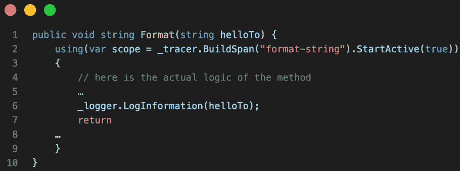

图 6.45 – 在 Jaeger 中创建子 span – 伪代码

在本章提供的代码中，你可以找到一个完整的 Java 和 Spring Boot 应用程序示例，其中包含一个 Jaeger 服务器容器和两个名为`api`和`inventory`的应用容器，它们使用 Jaeger 客户端库来对代码进行仪表化。按照以下步骤重建这个解决方案：

1.  导航到[`api`，如下所示：](https://start.spring.io)

[](https://start.spring.io)

![图 6.46 – 引导 Jaeger 示例的 API 组件图 6.46 – 引导 Jaeger 示例的 API 组件请注意，我们在这个示例中使用的是 Spring Boot 2.7.7 版本，因为在撰写时，Jaeger 和 Open Tracing 集成尚未支持 Spring Boot 3。还要注意，我们已经将 Spring Web 引用添加到了项目中。1.  点击`api.zip`，文件将被下载到你的计算机。1.  重复相同的步骤，但这次更改`inventory`。然后，点击`inventory.zip`，其中包含引导代码，文件将被下载到你的计算机。1.  导航到本章的源代码文件夹：    ```    $ cd ~/The-Ultimate-Docker-Container-Book/ch06    ```1.  然后，在其中创建一个名为`jaeger-demo`的子文件夹：    ```    $ mkdir jaeger-demo    ```1.  将两个 ZIP 文件解压到`jaeger-demo`文件夹中。确保子文件夹分别命名为`api`和`inventory`。1.  从此文件夹中打开 VS Code：    ```    $ code .    ```1.  接下来，在根目录创建一个`docker-compose.yml`文件，内容如下：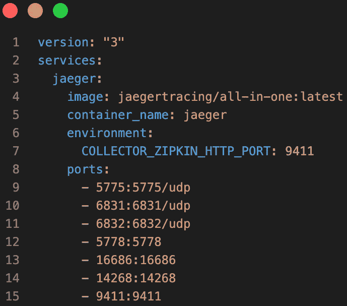

图 6.47 – Jaeger 示例的 Docker Compose 文件](https://start.spring.io)

[我们将在](https://start.spring.io) *第十一章*中详细解释什么是`docker-compose`文件，*使用 Docker Compose 管理容器*。

1.  使用以下命令运行 Jaeger：

    ```
    $ docker compose up -d
    ```

1.  在一个新的浏览器标签中，导航到 Jaeger UI，地址是`http://localhost:16686`。

1.  在你的 VS Code 中找到`api`和`inventory`项目的两个`pom.xml`文件。通过将以下代码片段添加到它们的`dependencies`部分，将 Jaeger 集成组件添加到每个文件：

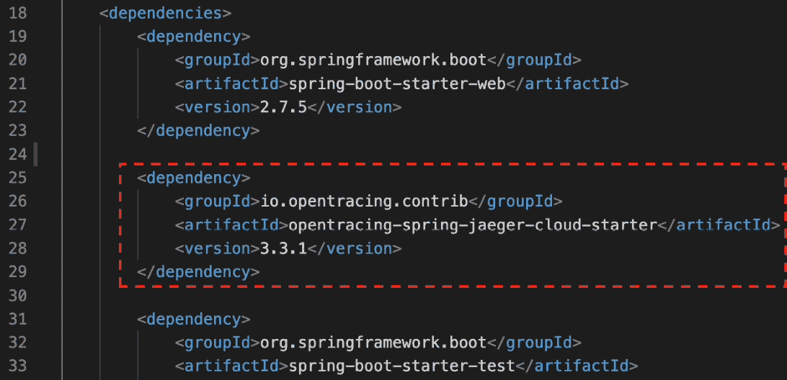

图 6.48 – 将 Jaeger 集成添加到 Java 项目

1.  在`inventory`项目中，找到启动类`InventoryApplication`，并为其添加一个生成`RestTemplate`实例的 bean。我们将使用它来访问外部 API 下载一些数据。代码片段应该如下所示：

    ```
    @BeanRestTemplate restTemplate() {    return new RestTemplate();}
    ```

1.  在`api`项目的启动类`ApiApplication`中做相同的操作。

1.  现在，让我们回到`inventory`项目。添加一个名为`Todo.java`的新文件，与启动类平级。文件内容如下：

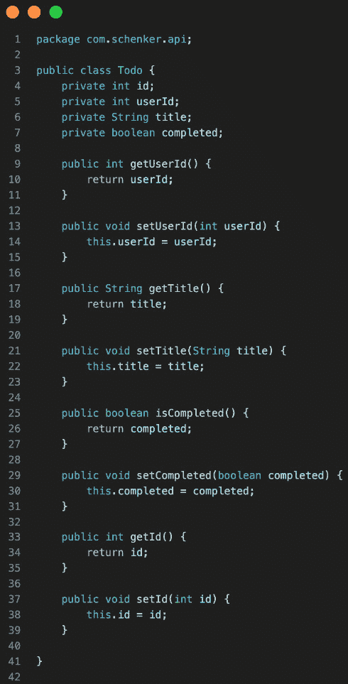

图 6.49 – Jaeger 示例中的 API 项目中的 Todo 类

这是一个非常简单的 POJO 类，我们将其用作数据容器。

1.  在`api`项目中做相同的操作。

1.  转到`inventory`项目，添加一个名为`TodosController.java`的新文件，内容如下：

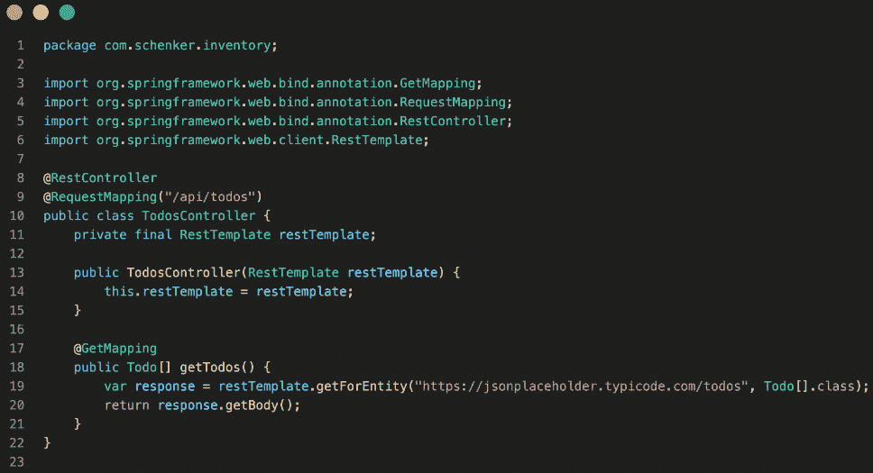

图 6.50 – Jaeger 演示的 TodosController 类

注意，在第 19 行，我们通过公共**JSONPlaceholder API**来下载待办事项列表，并在第 20 行将这些项目返回给调用者。这里没有什么特别的。

1.  对于`api`项目，添加一个名为`HelloController.java`的新文件，内容如下：

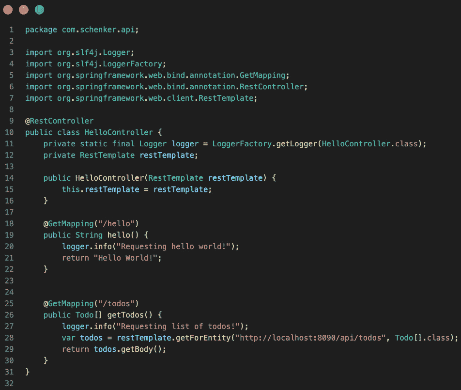

图 6.51 – Jaeger 演示的 HelloController 类

注意，第一个方法监听`/hello`端点，它只是返回一个字符串。然而，第二个端点监听`/todos`端点，它连接到`api`服务及其端点`/api/todos`。`api`服务会返回它从 JSON Placeholder API 下载的待办事项列表。这样，我们就有了一个真正的分布式应用程序，准备展示 Jaeger 和 Open Tracing 的强大功能。

1.  我们还没有完全完成。我们需要通过各自的`applications.properties`文件来配置这两个项目：

1.  在`api`项目中找到`application.properties`文件，并向其中添加以下行：

    ```
    spring.application.name=jaeger-demo:api
    ```

上述代码定义了服务的名称以及 Jaeger 如何报告该服务。

1.  在`inventory`项目中找到相同的文件，并向其中添加以下两行：

    ```
    server.port=8090spring.application.name=jaeger-demo:inventory
    ```

1.  第一行确保库存服务监听在端口`8090`，而不是默认的`8080`端口，以避免与将运行在默认端口的`api`服务发生冲突。

第二行定义了服务的名称以及 Jaeger 如何报告该服务。

1.  现在，在 VS Code 中点击各自启动类的`main`方法，启动`inventory`和`api`项目。

1.  使用`curl`或 Thunder Client 访问库存服务的[暴露端点](http://localhost:8090/api/todos)，地址为`http://localhost:8090/api/todos`。你也可以在新的浏览器标签页中执行相同操作。你应该会收到 100 条随机待办事项列表。

1.  现在，尝试访问`api`服务的[该链接](http://localhost:8080/api/todos) ，它位于`http://localhost:8080/todos`端点。应返回相同的待办事项列表，但这次，它们应该来自`api`服务，而不是直接来自 JSON Placeholder API。

1.  现在，回到你打开 Jaeger UI 的浏览器标签页。

1.  确保你在**搜索**标签页上。

1.  从**服务**下拉列表中选择**jaeger-demo:api**。

1.  点击**查找跟踪**。你应该能看到类似这样的内容：

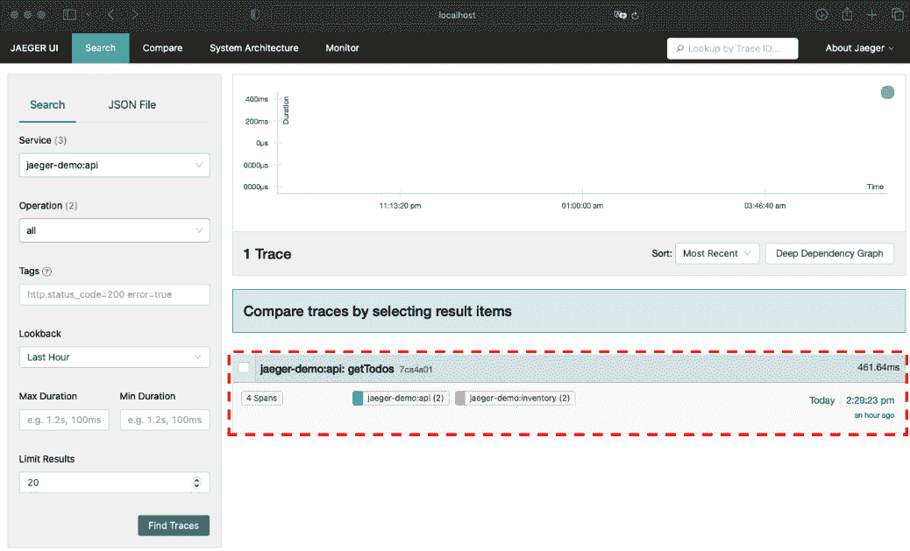

图 6.52 – api 服务的 Jaeger 跟踪

1.  点击跟踪以展开它。你应该会看到如下内容：

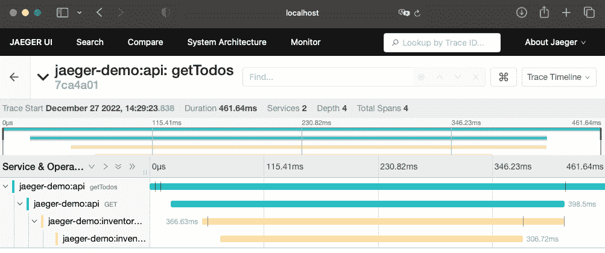

图 6.53 – api 服务的 Jaeger 跟踪详细信息

在这里，我们可以看到 `api` 服务如何调用 `inventory` 服务。我们还可以看到每个组件花费的时间。

1.  为了清理，停止 Jaeger 服务器容器：

    ```
    $ docker compose down
    ```

1.  同时，使用 *Ctrl* + *C* 停止 API。

在本演示中，我们看到仅仅通过添加一个将我们的 Spring Boot 应用与 Jaeger 和 Open Tracing 集成的组件，无需任何特殊代码，我们便获得了大量的洞察。然而，我们只是刚刚触及可能性的表面。

`api` 和 `inventory` 服务使用类似的 `Dockerfile`，正如我们在本章 Java 演示应用中所做的那样。各自的 `Dockerfile` 应位于 `api` 和 `inventory` 项目的根目录中。

然后，修改 `docker-compose.yml` 文件。完成后，使用以下命令运行整个应用：

```
$ docker compose up -d
```

如果你还不熟悉 Docker Compose，不用担心。我们将在 *第十一章* 中详细讨论这个非常有用的工具，*使用 Docker Compose 管理容器*。

# 总结

在这一章节中，我们学习了如何在容器内运行和调试 Node.js、Python、Java 和 .NET 代码。我们从将源代码从主机挂载到容器开始，以避免每次代码更改时都重新构建容器镜像。接着，我们通过启用容器内的自动应用重启功能，使得代码更改后能够更顺畅地进行开发。然后，我们学习了如何配置 VS Code，以便在容器内运行代码时启用完整的交互式代码调试。

最后，我们学习了如何为我们的应用添加监控，以便它们生成日志信息，帮助我们对生产环境中表现异常的应用或应用服务进行根本原因分析。我们首先通过使用日志库对代码进行监控。接着，我们使用 Open Tracing 标准进行分布式追踪，并使用 Jaeger 工具对 Java 和 Spring Boot 应用进行监控，从而获得应用内部运行的宝贵洞察。

在下一章节中，我们将展示如何利用 Docker 容器提升自动化，从在容器中运行简单的自动化任务，到使用容器构建 CI/CD 管道。

# 问题

尝试回答以下问题，以评估你的学习进度：

1.  请列举两种通过使用容器来减少开发过程中的摩擦的方法。

1.  如何在容器内实现实时代码？

1.  在容器内运行时，何时以及为何要逐行调试代码？

1.  为什么为代码添加良好的调试信息至关重要？

# 答案

这是本章节问题的答案：

1.  可能的答案：

    +   将源代码挂载到容器中

    +   使用一个工具，自动重启容器内运行的应用，当检测到代码更改时

    +   配置你的容器以进行远程调试

1.  你可以将包含源代码的文件夹从主机挂载到容器中。

1.  如果你无法通过单元测试或集成测试轻松覆盖某些场景，并且当应用程序在主机上运行时无法重现观察到的行为。另一种情况是由于缺少必要的语言或框架，无法直接在主机上运行应用程序。

1.  一旦应用程序投入生产环境，我们作为开发者通常无法轻易访问它。如果应用程序出现意外行为甚至崩溃，日志通常是我们唯一的可用信息来源，帮助我们重现情况并找出 bug 的根本原因。
