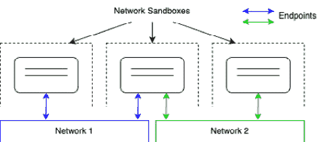
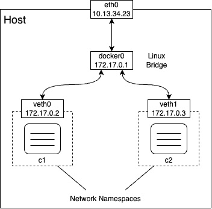
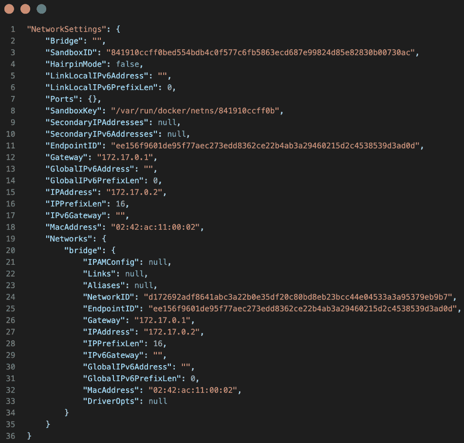
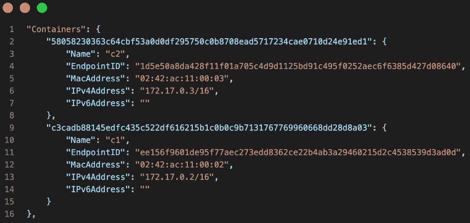
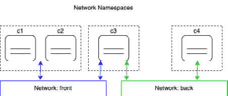
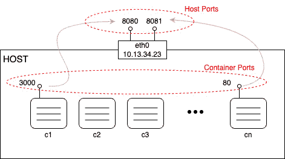
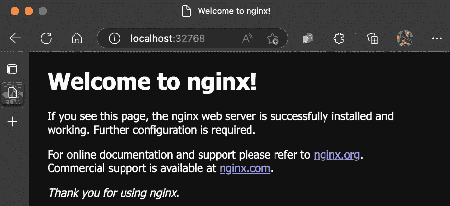

# 第十章：10

# 使用单主机网络

在上一章中，我们学习了分布式应用架构中使用的最重要的架构模式和最佳实践。

在本章中，我们将介绍 Docker 容器网络模型及其在桥接网络中的单主机实现。本章还介绍了**软件定义网络**（**SDN**）的概念，以及它们如何用于保护容器化的应用程序。此外，我们将演示如何将容器端口公开，从而使容器化的组件可以被外界访问。最后，我们将介绍 Traefik，一个反向代理，它可以用来在容器之间启用复杂的 HTTP 应用层路由。

本章涵盖以下主题：

+   解剖容器网络模型

+   网络防火墙

+   使用桥接网络

+   主机和空网络

+   在现有网络命名空间中运行

+   管理容器端口

+   使用反向代理进行 HTTP 层路由

完成本章后，你将能够完成以下任务：

+   创建、检查和删除自定义桥接网络

+   运行一个附加到自定义桥接网络的容器

+   通过将容器运行在不同的桥接网络上来隔离容器

+   将容器端口发布到你选择的主机端口

+   添加 Traefik 作为反向代理以启用应用层路由

# 技术要求

对于本章，你所需的唯一条件是一个能够运行 Linux 容器的 Docker 主机。你可以使用安装了 Docker Desktop 的笔记本电脑来完成这个任务。

首先，让我们创建一个用于本章的文件夹，在其中存储我们示例的代码：

1.  导航到你克隆本书所附仓库的文件夹。通常，这是以下路径：

    ```
    $ cd ~/The-Ultimat-Docker-Container-Book
    ```

1.  创建一个用于本章的子文件夹并导航到它：

    ```
    $ mkdir ch10 && cd ch10
    ```

让我们开始吧！

# 解剖容器网络模型

到目前为止，我们主要处理的是单个容器，但实际上，一个容器化的业务应用程序由多个容器组成，这些容器需要协同工作以实现目标。因此，我们需要一种方式使得各个容器之间能够通信。这是通过建立路径来实现的，我们可以利用这些路径在容器之间来回发送数据包。这些路径被称为网络。Docker 定义了一个非常简单的网络模型，即所谓的**容器网络模型**（**CNM**），以指定任何实现容器网络的软件必须满足的要求。以下是 CNM 的图形表示：



图 10.1 – Docker CNM

CNM 有三个元素——沙箱、端点和网络：

+   **网络沙箱**：沙箱完全隔离容器与外界的连接。沙箱容器不允许任何外部网络连接进入，但如果容器与外界完全没有任何通信，它在系统中几乎没有任何价值。为了弥补这一点，我们引入了第二个元素，即端点。

+   **端点**：端点是从外部世界到网络沙箱的受控网关，沙箱用来保护容器。端点将网络沙箱（而不是容器）连接到模型的第三个元素——网络。

+   **网络**：网络是传输通信实例数据包的路径，从端点到端点，或者最终从容器到容器。

需要注意的是，一个网络沙箱可以有零个到多个端点，换句话说，每个位于网络沙箱中的容器可以没有连接到任何网络，或者可以同时连接到多个不同的网络。在上面的示意图中，三个**网络沙箱**中的中间一个通过端点同时连接到**网络 1**和**网络 2**。

这种网络模型非常通用，并没有指定通过网络进行通信的各个容器运行的位置。例如，所有容器可以运行在同一主机上（本地），也可以分布在多个主机的集群中（全球）。

当然，CNM 仅仅是一个描述容器之间如何实现网络连接的模型。为了能够在容器中使用网络，我们需要 CNM 的实际实现。对于本地和全球范围，我们有多种 CNM 实现。在下表中，我们简要概述了现有实现及其主要特性。列表没有特定顺序：

| **网络** | **公司** | **范围** | **描述** |
| --- | --- | --- | --- |
| Bridge | Docker | 本地 | 基于 Linux 桥接的简单网络，允许在单一主机上进行网络连接 |
| Macvlan | Docker | 本地 | 在单一物理主机接口上配置多个二层（即 MAC）地址 |
| Overlay | Docker | 全球 | 基于**虚拟可扩展** **局域网**（**VXLan**）的多节点容器网络 |
| Weave Net | Weaveworks | 全球 | 简单、弹性、支持多主机的 Docker 网络 |
| Contiv 网络插件 | Cisco | 全球 | 开源容器网络 |

表 10.1 – 网络类型

所有 Docker 未直接提供的网络类型都可以作为插件添加到 Docker 主机中。

在下一节中，我们将描述网络防火墙的工作原理。

# 网络防火墙

Docker 一直秉持着“安全第一”的原则。这个理念直接影响了单主机和多主机 Docker 环境中网络的设计与实现。SDN（软件定义网络）既容易且便宜创建，又能够完美地将连接到此网络的容器与其他未连接的容器，以及外部世界隔离开来。所有属于同一网络的容器可以自由地相互通信，而其他容器则无法做到这一点。

在下图中，我们有两个网络，分别名为 **front** 和 **back**。容器 **c1** 和 **c2** 附加到 **front** 网络，容器 **c3** 和 **c4** 附加到 **back** 网络。**c1** 和 **c2** 可以自由地相互通信，**c3** 和 **c4** 也可以自由通信，但 **c1** 和 **c2** 无法与 **c3** 或 **c4** 进行通信，反之亦然：


图 10.2 – Docker 网络

那么，如果我们有一个由三个服务组成的应用程序：`webAPI`、`productCatalog` 和 `database`，该怎么办呢？我们希望`webAPI`能够与`productCatalog`进行通信，但不能与数据库通信，同时我们希望`productCatalog`能够与数据库服务进行通信。我们可以通过将`webAPI`和数据库放在不同的网络上，并将`productCatalog`连接到这两个网络来解决这个问题，如下图所示：


图 10.3 – 容器连接到多个网络

由于创建 SDN 很便宜，而且每个网络通过隔离资源以防止未授权访问提供了额外的安全性，强烈建议您设计并运行应用程序，使其使用多个网络，并且仅在绝对需要相互通信的服务才在同一网络上运行。在前面的例子中，`webAPI` 组件完全不需要与 `database` 服务直接通信，因此我们将它们放在了不同的网络上。如果最坏的情况发生，黑客侵入了 `webAPI`，他们也无法通过它访问数据库，除非黑客同时攻破了 `productCatalog` 服务。

现在我们可以讨论 CNM（容器网络模型）的第一个实现——桥接网络。

# 使用桥接网络

Docker 桥接网络是我们将详细探讨的 CNM 的第一个实现。这个网络实现基于 Linux 桥接。

当 Docker 守护进程第一次运行时，它会创建一个 Linux 桥接并将其命名为 `docker0`。这是默认行为，可以通过更改配置来进行修改。

然后，Docker 使用这个 Linux 桥接创建一个网络，并将其称为网络桥接。我们在 Docker 主机上创建的所有容器，如果没有显式绑定到其他网络，都会导致 Docker 自动将这些容器附加到该桥接网络上。

为了验证我们确实在主机上定义了一个名为`bridge`的桥接类型网络，我们可以使用以下命令列出主机上的所有网络：

```
$ docker network ls
```

这应提供类似以下的输出：


图 10.4 – 列出默认情况下所有可用的 Docker 网络

在你的情况下，ID 会不同，但其余的输出应保持一致。我们确实有一个名为`bridge`的第一个网络，使用的是`bridge`驱动程序。`local`范围意味着该类型的网络仅限于单个主机，不能跨多个主机。在*第十四章*，*介绍* *Docker Swarm*中，我们还将讨论其他具有全局范围的网络类型，意味着它们可以跨多个主机群集。

现在，让我们更深入地了解这个桥接网络的具体内容。为此，我们将使用 Docker 的`inspect`命令：

```
$ docker network inspect bridge
```

执行时，这将输出关于相关网络的大量详细信息。这些信息应如下所示：


图 10.5 – 检查 Docker 桥接网络时生成的输出

我们在列出所有网络时看到了`ID`、`Name`、`Driver`和`Scope`值，所以这并不新鲜，但让我们来看一下**IP 地址管理**（**IPAM**）块。

IPAM 是一款用于跟踪计算机上使用的 IP 地址的软件。IPAM 块中的重要部分是带有子网和网关值的*config*节点。桥接网络的子网默认定义为`172.17.0.0/16`。这意味着所有连接到此网络的容器将获得由 Docker 分配的 IP 地址，该地址来自给定的范围，即 `172.17.0.2` 至 `172.17.255.255`。`172.17.0.1` 地址保留给该网络的路由器，在这种网络类型中，路由器由 Linux 桥接担当。我们可以预期，Docker 首次将附加到该网络的容器将获得`172.17.0.2`地址。所有后续容器将获得更高的编号；下图说明了这一点：


图 10.6 – 桥接网络

在前面的图中，我们可以看到主机的网络命名空间，其中包括主机的`eth0`端点，如果 Docker 主机运行在裸机上，它通常是一个 NIC；如果 Docker 主机是虚拟机，它通常是一个虚拟 NIC。所有到主机的流量都通过`eth0`。Linux 桥接负责在主机的网络和桥接网络的子网之间路由网络流量。

什么是 NIC？

**网络接口卡**（**NIC**），有时也被称为网络接口连接器，是一种硬件组件，允许计算机或设备连接到网络。它作为计算机与网络之间的接口，允许数据的传输和接收。NIC 通常是主板上的内置组件，或者作为扩展卡安装，并支持各种类型的网络连接，例如以太网、Wi-Fi 或光纤连接。

默认情况下，只有出口流量被允许，所有入口流量都会被阻止。这意味着，虽然容器化应用程序可以访问互联网，但它们不能被任何外部流量访问。每个连接到网络的容器都获得自己的**虚拟以太网**（**veth**）连接到桥接网络。下图对此进行了说明：



图 10.7 – 桥接网络的详细信息

上面的图示从主机的角度展示了整个情况。我们稍后将在本节中探索从容器内部看到的情况。我们不仅限于使用桥接网络，因为 Docker 允许我们定义自己的自定义桥接网络。这不仅是一个“有用的功能”，它也是一种推荐的最佳实践——不要将所有容器都运行在同一个网络上。相反，我们应使用额外的桥接网络，进一步隔离那些不需要相互通信的容器。要创建一个名为 `sample-net` 的自定义桥接网络，请使用以下命令：

```
$ docker network create --driver bridge sample-net
```

如果我们这样做，就可以查看 Docker 为这个新的自定义网络创建了什么子网，如下所示：

```
$ docker network inspect sample-net | grep Subnet
```

这将返回以下值：

```
"Subnet": "172.18.0.0/16",
```

显然，Docker 刚刚为我们的新自定义桥接网络分配了下一个空闲的 IP 地址块。如果由于某些原因，我们希望在创建网络时指定自己的子网范围，可以通过使用 `--subnet` 参数来实现：

```
$ docker network create --driver bridge --subnet "10.1.0.0/16" test-net
```

注意

为了避免因重复的 IP 地址而发生冲突，请确保避免创建具有重叠子网的网络。

现在我们已经讨论了桥接网络是什么，以及如何创建自定义桥接网络，我们接下来要了解的是如何将容器连接到这些网络。

首先，让我们互动地运行一个 Alpine 容器，但不指定要连接的网络：

```
$ docker container run --name c1 -it --rm alpine:latest /bin/sh
```

在另一个终端窗口中，让我们检查 `c1` 容器：

```
$ docker container inspect c1
```

在大量输出中，让我们暂时集中关注提供网络相关信息的部分。这可以在`NetworkSettings`节点下找到。我在以下输出中列出了它：



图 10.8 – 容器元数据中的 NetworkSettings 部分

在前面的输出中，我们可以看到容器确实已连接到桥接网络，因为`NetworkID`等于`d172692...`，我们可以从前面的代码中看到它是桥接网络的 ID。我们还可以看到容器被分配了预期的 IP 地址`172.17.0.2`，并且网关位于`172.17.0.1`。

请注意，容器也有一个与之关联的`MacAddress`。这一点很重要，因为 Linux 桥接会使用`MacAddress`来进行路由。

到目前为止，我们是从容器网络命名空间之外的角度来处理的。现在，让我们看看当我们不仅在容器内部，而且在容器的网络命名空间内部时，情况会是什么样的。在`c1`容器内，我们使用`ip`工具检查正在发生的事情。运行`ip addr`命令并观察生成的输出，如下所示：


图 10.9 – 容器命名空间，IP 工具视图

前面输出中有趣的部分是`54:`，即`eth0`端点。Linux 桥接在容器命名空间外部创建的`veth0`端点映射到容器内部的`eth0`。Docker 总是将容器网络命名空间的第一个端点映射为`eth0`，从命名空间内部来看。如果网络命名空间附加到其他网络，那么该端点将映射为`eth1`，依此类推。

由于此时我们并不关心除了`eth0`之外的任何端点，我们可以使用该命令的更具体版本，这样会得到以下输出：


图 10.10 – 从容器内部看到的 eth0 端点

在输出中，我们还可以看到此容器网络命名空间由 Docker 分配的 MAC 地址（`02:42:ac:11:00:02`）和 IP 地址（`172.17.0.2`）。

我们还可以使用`ip` `route`命令获取一些关于请求如何路由的信息：

```
/ # ip route
```

这会给我们以下输出：

```
default via 172.17.0.1 dev eth0172.17.0.0/16 dev eth0 scope link  src 172.17.0.2
```

这个输出告诉我们，所有到达`172.17.0.1`网关的流量都通过`eth0`设备进行路由。

现在，让我们在同一网络上以`detach`模式运行另一个名为`c2`的容器：

```
$ docker container run --name c2 -d --rm alpine:latest ping 127.0.0.1
```

`c2`容器也会被附加到桥接网络上，因为我们没有指定其他网络。它的 IP 地址将是子网中的下一个空闲地址，即`172.17.0.3`，我们可以通过以下命令轻松测试：

```
$ docker container inspect --format "{{.NetworkSettings.IPAddress}}" c2
```

这将产生以下输出：

```
172.17.0.3
```

现在，我们有两个容器连接到桥接网络。我们可以再次尝试检查这个网络，在输出中找到所有连接到它的容器列表：

```
$ docker network inspect bridge
```

这些信息可以在`Containers`节点下找到：



图 10.11 – Docker 网络检查`bridge`网络输出中的容器部分

再次，我们已经缩短了输出，只保留相关部分以便于阅读。

现在，让我们创建两个额外的容器`c3`和`c4`，并将它们附加到我们之前创建的`sample-net`网络。为此，我们将使用`--network`参数：

```
$ docker container run --name c3 --rm -d \    --network sample-net \
    alpine:latest ping 127.0.0.1
$ docker container run --name c4 --rm -d \
    --network sample-net \
    alpine:latest ping 127.0.0.1
```

让我们检查一下`sample-net`网络，并确认`c3`和`c4`确实已连接到该网络：

```
$ docker network inspect sample-net
```

这将给我们以下的`Containers`部分输出：


图 10.12 – Docker 网络检查`test-net`命令输出中的容器部分

接下来，我们要问自己一个问题，即`c3`和`c4`容器是否可以自由地相互通信。为了证明这一点，我们可以通过`exec`进入`c3`容器：

```
$ docker container exec -it c3 /bin/sh
```

一旦进入容器，我们可以尝试通过名称和 IP 地址`ping`容器`c4`：

```
/ # ping c4
```

我们应该会看到这个输出：

```
PING c4 (172.20.0.3): 56 data bytes64 bytes from 172.20.0.3: seq=0 ttl=64 time=3.092 ms
64 bytes from 172.20.0.3: seq=1 ttl=64 time=0.481 ms
...
```

在这里，我们使用的是`c4`的 IP 地址，而不是容器的名称：

```
/ # ping 172.20.0.3
```

我们应该会看到以下结果：

```
PING 172.20.0.3 (172.20.0.3): 56 data bytes64 bytes from 172.20.0.3: seq=0 ttl=64 time=0.200 ms
64 bytes from 172.20.0.3: seq=1 ttl=64 time=0.172 ms
...
```

在这两种情况下，答案都证实了同一网络上附加的容器之间的通信正常。我们甚至可以使用想要连接的容器的名称，这表明 Docker 的 DNS 服务在该网络中起作用。

现在，我们希望确保`bridge`网络和`sample-net`网络是相互隔离的。为了证明这一点，我们可以尝试从`c3`容器`ping` `c2`容器，可以通过名称或 IP 地址。让我们从按名称 ping 开始：

```
/ # ping c2
```

这将产生以下输出：

```
ping: bad address 'c2'
```

以下是使用`c2`容器的 IP 地址进行 ping 测试的结果：

```
/ # ping 172.17.0.3
```

它给了我们以下输出：

```
PING 172.17.0.3 (172.17.0.3): 56 data bytes^C
--- 172.17.0.3 ping statistics ---
11 packets transmitted, 0 packets received, 100% packet loss
```

前面的命令一直处于挂起状态，我不得不用*Ctrl* + *C*终止命令。从 ping`c2`的输出中，我们还可以看到，跨网络的名称解析并不工作。这是预期的行为。网络为容器提供了额外的隔离层，从而增强了安全性。

之前我们学习了，容器可以附加到多个网络。让我们首先创建一个名为`test-net`的网络。请注意，以下命令没有定义网络的驱动程序；因此，使用的是默认驱动程序，恰好是 bridge 驱动程序：

```
$ docker network create test-net
```

然后，我们将`c5`容器附加到`sample-net`网络：

```
$ docker container run --name c5 --rm -d \    --network sample-net
    alpine:latest ping 127.0.0.1
```

然后，我们将`c6`容器同时附加到`sample-net`和`test-net`网络：

```
$ docker container run --name c6 --rm -d \    --network sample-net \
    alpine:latest ping 127.0.0.1
$ docker network connect test-net c6
```

现在，我们可以测试`c5`容器（附加在`test-net`网络上）是否能够从中访问`c6`，以及`sample-net`网络上附加的`c3`容器是否能够访问`c6`。结果将表明连接确实有效。

如果我们想删除一个现有的网络，可以使用`docker network rm`命令，但请注意，不能意外删除已经附加了容器的网络：

```
$ docker network rm test-net
```

结果是这个输出：

```
Error response from daemon: network test-net id 455c922e... has active endpoints
```

在继续之前，让我们清理并删除所有容器：

```
$ docker container rm -f $(docker container ls -aq)
```

现在，我们可以删除我们创建的两个自定义网络：

```
$ docker network rm sample-net$ docker network rm test-net
```

或者，我们可以使用 `prune` 命令删除所有没有容器连接的网络：

```
$ docker network prune --force
```

我在这里使用了 `--force`（或 `-f`）参数，以防止 Docker 再次确认我是否确实要删除所有未使用的网络。

使用 `docker network ls` 命令再次确认，只剩下 Docker 提供的三个默认网络。

接下来我们要检查的网络类型是 `host` 和 `null` 网络类型。

# 主机网络和空网络

在本节中，我们将讨论两种预定义的、稍微独特的网络类型：主机网络和空网络。我们先从前者开始。

## 主机网络

有时我们需要在主机的网络命名空间中运行容器。这在需要在容器中运行用于分析或调试主机网络流量的软件时可能是必要的，但请记住，这些情况是非常特定的。在容器中运行业务软件时，通常没有理由将容器连接到主机的网络。出于安全考虑，强烈建议你不要在生产或类似生产的环境中将任何容器连接到主机网络。

话虽如此，我们如何在主机的网络命名空间中运行容器呢？只需将容器附加到 `host` 网络即可：

1.  运行一个 Alpine 容器，并将其连接到 `host` 网络：

    ```
    $ docker container run --rm -it \    --network host \    alpine:latest /bin/sh
    ```

1.  使用 `ip` 工具从容器内部分析网络命名空间。你会发现，我们得到的结果和在主机上直接运行 `ip` 工具时完全一样。例如，我用以下命令检查了我的笔记本电脑上的 `eth0` 设备：

    ```
    / # ip addr show eth0
    ```

结果是，我得到了这个：


图 10.13 – 从容器内部查看 eth0 设备

在这里，我可以看到 `192.168.65.3` 是主机分配的 IP 地址，显示的 MAC 地址也对应于主机的地址。

1.  我们还可以检查路由：

    ```
    / # ip route
    ```

在我的 MacBook Air M1 上，我得到的是：


图 10.14 – 从容器内部查看的路由

在我们进入本章的下一部分之前，我再次强调，因潜在的安全漏洞和冲突，将容器运行在主机网络上可能是危险的：

+   **安全风险**：通过使用主机网络，容器拥有与主机相同的网络访问权限。这意味着，如果容器内运行的应用程序存在漏洞并被利用，攻击者可能会获得对主机网络的访问权限，进而危及其他服务或数据。

+   **端口冲突**：当容器使用主机网络时，它与主机共享相同的网络命名空间。这意味着，如果你的容器化应用程序和主机上的应用程序在同一端口上监听，就会发生冲突。

+   **隔离性**：使用 Docker 的主要好处之一是它在各个层面（进程、文件系统或网络）提供的隔离性。通过使用主机网络，你会失去这一层隔离，这可能会导致一些不可预见的问题。

因此，通常建议在运行 Docker 容器时使用用户定义的网络，而不是主机网络，因为它提供更好的隔离性，并减少冲突和安全漏洞的风险。

## 空网络

有时，我们需要运行一些不需要任何网络连接即可执行任务的应用服务或作业。强烈建议你在附加到 `none` 网络的容器中运行这些应用程序。这样，容器将完全隔离，从而避免任何外部访问。让我们运行这样一个容器：

```
$ docker container run --rm -it \    --network none \
    alpine:latest /bin/sh
```

进入容器后，我们可以验证是否没有 `eth0` 网络端点可用：

```
/ # ip addr show eth0ip: can't find device 'eth0'
```

也没有可用的路由信息，正如我们可以通过以下命令演示的那样：

```
/ # ip route
```

这不返回任何内容。

在接下来的章节中，我们将学习如何在另一个容器的现有网络命名空间中运行一个容器。

# 在现有网络命名空间中运行

通常，Docker 为我们运行的每个容器创建一个新的网络命名空间。容器的网络命名空间对应于我们之前描述的容器网络模型中的沙箱。当我们将容器附加到网络时，我们定义一个端点，将容器网络命名空间与实际网络连接起来。这样，我们每个网络命名空间都有一个容器。

Docker 为我们提供了另一种方法来定义容器运行的网络命名空间。在创建新容器时，我们可以指定它应该附加到（或者我们应该说是包含在）一个现有容器的网络命名空间中。通过这种技术，我们可以在单一网络命名空间中运行多个容器：



图 10.15 – 在单一网络命名空间中运行多个容器

在上面的图中，我们可以看到，在最左侧的网络命名空间中，我们有两个容器。由于这两个容器共享相同的命名空间，它们可以在 `localhost` 上相互通信。然后，网络命名空间（而不是单独的容器）被附加到 **front** 网络。

当我们想要调试现有容器的网络而不在该容器内运行其他进程时，这是非常有用的。我们可以简单地将一个特殊的实用容器附加到容器的网络命名空间中进行检查。这个特性也被 Kubernetes 在创建 Pod 时使用。我们将在本书后续章节中进一步了解 Kubernetes 和 Pod。

现在，让我们演示一下这是如何工作的：

1.  首先，我们创建一个新的`bridge`网络：

    ```
    $ docker network create --driver bridge test-net
    ```

1.  接下来，我们运行一个附加到这个网络的容器：

    ```
    $ docker container run --name web -d \    --network test-net \    nginx:alpine
    ```

1.  最后，我们运行另一个容器并将其附加到我们 web 容器的网络中：

    ```
    $ docker container run -it --rm \    --network container:web \    alpine:latest /bin/sh
    ```

特别要注意如何定义网络：`--network container:web`。这告诉 Docker 我们的新容器将使用与名为`web`的容器相同的网络命名空间。

1.  由于新容器与运行 nginx 的 web 容器处于相同的网络命名空间中，我们现在可以在`localhost`上访问 nginx 了！我们可以通过使用 Alpine 容器中的`wget`工具来证明这一点。我们应该看到以下内容：

    ```
    / # wget -qO – localhost<!DOCTYPE html><html><head><title>Welcome to nginx!</title>...</html>
    ```

请注意，为了便于阅读，我们已经缩短了输出。还要注意，运行两个附加到同一网络的容器和运行在相同网络命名空间中的两个容器之间有一个重要的区别。在这两种情况下，容器可以自由地相互通信，但在后一种情况下，通信是通过`localhost`进行的。

1.  要清理容器和网络，我们可以使用以下命令：

    ```
    $ docker container rm --force web$ docker network rm test-net
    ```

在接下来的部分，我们将学习如何在容器主机上公开容器端口。

# 管理容器端口

现在我们知道了如何通过将它们放置在不同网络上来隔离防火墙容器，以及如何使容器附加到多个网络，我们还有一个未解决的问题。如何将应用服务暴露给外部世界？想象一个运行 Web 服务器并托管我们以前的`webAPI`的容器。我们希望来自互联网的客户能够访问这个 API。我们设计它为一个可公开访问的 API。为了实现这一点，我们需要象征性地打开我们防火墙中的一扇门，通过这扇门，我们可以将外部流量引导到我们的 API。出于安全考虑，我们不仅仅想要敞开大门；我们希望有一个单一的可控门，流量通过它流动。

我们可以通过将容器端口映射到主机上的一个可用端口来创建这种类型的门。我们也称这个容器端口发布为端口。请记住，容器有自己的虚拟网络堆栈，主机也有。因此，容器端口和主机端口完全独立存在，并且默认情况下根本没有任何共同点，但现在我们可以通过这个链接将容器端口与空闲的主机端口连接起来，并引导外部流量，就像下图所示的那样：



图 10.16 – 将容器端口映射到主机端口

但现在是时候展示如何实际将容器端口映射到宿主机端口了。这是在创建容器时完成的。我们有不同的方式来做到这一点：

1.  首先，我们可以让 Docker 决定我们的容器端口应该映射到哪个宿主机端口。Docker 会从 `32xxx` 范围内选择一个空闲的宿主机端口。这个自动映射是通过使用 `-P` 参数完成的：

    ```
    $ docker container run --name web -P -d nginx:alpine
    ```

上述命令在容器中运行一个 nginx 服务器。nginx 在容器内监听端口 `80`。通过 `-P` 参数，我们告诉 Docker 将所有暴露的容器端口映射到 `32xxx` 范围内的一个空闲端口。我们可以通过使用 `docker container` `port` 命令来找出 Docker 正在使用的宿主机端口：

```
$ docker container port web80/tcp -> 0.0.0.0:32768
```

nginx 容器只暴露端口 `80`，我们可以看到它已经映射到宿主机端口 `32768`。如果我们打开一个新的浏览器窗口并访问 `localhost:32768`，我们应该会看到以下界面：



图 10.17 – nginx 欢迎页面

1.  另一种了解 Docker 为我们的容器使用哪个宿主机端口的方法是检查容器。宿主机端口是 `NetworkSettings` 节点的一部分：

    ```
    $ docker container inspect web | grep HostPort        "HostPort": "32768"
    ```

1.  最后，获取这些信息的第三种方法是列出容器：

    ```
    $ docker container lsCONTAINER ID IMAGE ... PORTS NAMES56e46a14b6f7 nginx:alpine ... 0.0.0.0:32768->80/tcp web
    ```

请注意，在前面的输出中，`/tcp` 部分告诉我们该端口已为 TCP 协议的通信打开，但未为 UDP 协议打开。TCP 是默认协议，如果我们希望明确指定打开端口用于 UDP 协议，我们必须显式地指定这一点。映射中的特殊（IP）地址 `0.0.0.0` 告诉我们，来自任何主机 IP 地址的流量现在可以访问 web 容器的端口 `80`。

1.  有时，我们希望将容器端口映射到一个非常特定的宿主机端口。我们可以通过使用 `-p` 参数（或 `--publish`）来实现。让我们来看一下如何通过以下命令实现：

    ```
    $ docker container run --name web2 -p 8080:80 -d nginx:alpine
    ```

`-p` 参数的值采用 `<host port>:<container port>` 的形式。因此，在上述案例中，我们将容器端口 `80` 映射到宿主机端口 `8080`。一旦 `web2` 容器启动，我们可以通过访问 `localhost:8080` 在浏览器中进行测试，我们应该会看到与之前自动端口映射示例中相同的 nginx 欢迎页面。

当使用 UDP 协议在某个端口上进行通信时，publish 参数的格式如下：`-p 3000:4321/udp`。请注意，如果我们希望在同一端口上同时支持 TCP 和 UDP 协议的通信，我们必须分别为每个协议映射端口。

在接下来的部分，我们将讨论使用反向代理进行 HTTP 路由。

# 使用反向代理进行 HTTP 层路由

假设你被指派将一个单体应用容器化。这个应用在多年的演化过程中变成了一个难以维护的庞然大物。即便是对源代码中的一个小功能进行修改，也可能由于代码库中紧密耦合的关系而破坏其他功能。由于复杂性，发布非常稀少，并且需要整个团队的支持。每次发布都需要停机，这会导致公司因错失商机而付出大量金钱，更别提它们的声誉损失了。

管理层已决定结束这一恶性循环，并通过将单体应用容器化来改善局势。仅此一步就能显著缩短发布周期，行业内已有实例证明了这一点。作为后续步骤，公司希望将单体应用中的每一部分功能拆分出来，并实现为微服务。这个过程将持续进行，直到单体应用完全被“饿死”。

但正是这个第二个问题让参与团队头疼不已。我们如何在不影响单体应用众多客户端的情况下，将单体应用拆分为松耦合的微服务呢？尽管单体应用的公共 API 非常复杂，但它具有良好的结构设计。公共 URI 是经过精心设计的，任何情况下都不应更改。例如，应用中实现了一个产品目录功能，可以通过[`acme.com/catalog?category=bicycles`](https://acme.com/catalog?category=bicycles)来访问，从而获取公司提供的自行车列表。

另一方面，还有一个名为`https://acme.com/checkout`的 URL，可以用来启动客户购物车的结账流程，等等。我希望你能理解我们想表达的意思。

## 容器化单体应用

让我们从单体应用开始。我准备了一个简单的代码库，它是用 Python 3.7 实现的，并使用 Flask 来实现公共的 REST API。这个示例应用并不是真正的完整应用，只是足够复杂，允许进行一些重新设计。示例代码可以在`ch10/e-shop`文件夹中找到。在这个文件夹内有一个名为`monolith`的子文件夹，里面包含了 Python 应用程序。请按照以下步骤操作：

1.  在新的终端窗口中，进入该文件夹，安装所需的依赖，并运行该应用：

    ```
    $ cd ~/The-Ultimate-Docker-Container-Book$ cd ch10/e-shop/monolith$ pip install -r requirements.txt$ export FLASK_APP=main.py$ flask run
    ```

该应用将启动并在本地主机的`5000`端口上监听：


图 10.18 – 运行 Python 单体应用

1.  我们可以使用`curl`来测试这个应用。打开另一个终端窗口，并使用以下命令获取公司提供的所有自行车列表：

    ```
    $ curl localhost:5000/catalog?type=bicycle
    ```

这将产生以下输出：

```
[{"id": 1, "name": "Mountanbike Driftwood 24", "unitPrice": 199},{"id": 2, "name": "Tribal 100 Flat Bar Cycle Touring Road Bike",
"unitPrice": 300}, {"id": 3, "name": "Siech Cycles Bike (58 cm)",
"unitPrice": 459}]
```

这里，我们有一个 JSON 格式的自行车类型列表。好吧，至此一切顺利。

1.  现在，让我们修改 `hosts` 文件，添加 `acme.com` 的条目，并将其映射到 `127.0.0.1`（回送地址）。这样，我们可以模拟一个真实客户端通过 `http://acme.com/catalog?type=bicycle` 访问应用程序，而不是使用 `localhost`。你需要使用 `sudo` 来编辑 macOS 或 Linux 上的 `/etc/hosts` 文件。你应该在 `hosts` 文件中添加一行，如下所示：

    ```
    127.0.0.1 acme.com
    ```

Windows 主机文件

在 Windows 上，你可以通过例如以管理员身份运行记事本，打开 `c:\Windows\System32\Drivers\etc\hosts` 文件并进行修改，来编辑该文件。

1.  保存你的更改，并通过 ping `acme.com` 来验证它是否有效：

    ```
    $ ping acme.comPING acme.com (127.0.0.1): 56 data bytes64 bytes from 127.0.0.1: icmp_seq=0 ttl=55 time<1 ms64 bytes from 127.0.0.1: icmp_seq=1 ttl=55 time<1 ms64 bytes from 127.0.0.1: icmp_seq=2 ttl=55 time<1 ms...
    ```

完成这一切之后，是时候将应用程序容器化了。我们需要对应用程序进行的唯一更改是确保应用程序的 Web 服务器监听 `0.0.0.0`，而不是 `localhost`。

1.  我们可以通过修改应用程序，并在 `main.py` 文件末尾添加以下启动逻辑来轻松完成此操作：

    ```
    if __name__ == '__main__':    app.run(host='0.0.0.0', port=5000)
    ```

1.  然后，我们可以按照以下方式启动应用程序：

    ```
    $ python main.py.
    ```

1.  现在，在 monolith 文件夹中添加一个 Dockerfile，内容如下：


图 10.19 – Monolith 的 Dockerfile

1.  在你的终端窗口中，从 monolith 文件夹内执行以下命令以为应用程序构建一个 Docker 镜像：

    ```
    $ docker image build -t acme/eshop:1.0 .
    ```

1.  镜像构建完成后，尝试运行应用程序：

    ```
    $ docker container run --rm -it \    --name eshop \    -p 5000:5000 \    acme/eshop:1.0
    ```

注意，现在在容器中运行的应用程序输出与直接在主机上运行应用程序时的输出无法区分。我们现在可以使用两个 `curl` 命令来访问目录和结账逻辑，从而测试应用程序是否仍然像以前一样工作：


图 10.20 – 在容器中运行时测试 monolith

显然，monolith 仍然完全按照之前的方式工作，即使使用正确的 URL，即 `http://acme.com`。太棒了！现在，让我们将 monolith 的一部分功能拆分为一个 Node.js 微服务，并将其单独部署。

## 提取第一个微服务

团队经过一些头脑风暴后决定，产品目录是一个很好的候选功能，可以从 monolith 中提取出来，既是一个紧密集成的功能，又足够自包含。他们决定将产品目录作为一个微服务实现，并使用 Node.js 来实现。

你可以在项目文件夹中的 `catalog` 子文件夹（即 `e-shop`）中找到他们编写的代码和 Dockerfile。它是一个简单的 Express.js 应用程序，复制了以前在 monolith 中提供的功能。让我们开始吧：

1.  在你的终端窗口中，从 `catalog` 文件夹内为这个新的微服务构建 Docker 镜像：

    ```
    $ docker image build -t acme/catalog:1.0 .
    ```

1.  然后，从你刚刚构建的新镜像运行一个容器：

    ```
    $ docker run --rm -it --name catalog -p 3000:3000 \    acme/catalog:1.0
    ```

1.  从另一个终端窗口，尝试访问微服务并验证它返回与 monolith 相同的数据：

    ```
    $ curl http://acme.com:3000/catalog?type=bicycle
    ```

请注意，与访问单体应用相同功能时的 URL 比较，在这里，我们访问的是 `3000` 端口的微服务（而不是 `5000` 端口）。

但是我们说过，我们不想更改访问我们电子商店应用的客户端。我们该怎么办？幸运的是，这类问题有解决方案。我们需要重新路由传入的请求。我们将在下一部分展示如何做到这一点。

## 使用 Traefik 重新路由流量

在上一部分中，我们意识到，我们必须将目标 URL 开头为 `http://acme.com:5000/catalog` 的传入流量重新路由到类似 `product-catalog:3000/catalog` 的替代 URL。我们将使用 Traefik 来完成这个任务。

Traefik 是一个云原生的边缘路由器，并且是开源的，这对我们的特定场景非常有用。它甚至有一个不错的 web UI，您可以用它来管理和监控您的路由。Traefik 可以非常直接地与 Docker 配合使用，稍后我们会看到。

为了与 Docker 进行良好的集成，Traefik 依赖于每个容器或服务中的元数据。这些元数据可以以包含路由信息的标签形式应用：

1.  首先，让我们看一下如何运行 `catalog` 服务。以下是 Docker 的 `run` 命令：

    ```
    $ docker container run --rm -d \    --name catalog \    --label traefik.enable=true \    --label traefik.port=3000 \    --label traefik.priority=10 \    --label traefik.http.routers.catalog.rule=\             "Host(\"acme.com\") && PathPrefix(\"/catalog\")" \    acme/catalog:1.0
    ```

让我们快速看一下我们定义的四个标签：

+   `traefik.enable=true`：这告诉 Traefik 该特定容器应包含在路由中（默认值为 `false`）。

+   `traefik.port=3000`：路由器应将请求转发到端口 `3000`（这是 Express.js 应用程序监听的端口）。

+   `traefik.priority=10`：这为该路由提供了较高的优先级。我们稍后会看到原因。

+   `traefik.http.routers.catalog.rule="Host(\"acme.com\") && PathPrefix(\"/catalog\")"`：该路由必须包含主机名 `acme.com`，并且路径必须以 `/catalog` 开头，才能被重新路由到该服务。例如，`acme.com/catalog?type=bicycles` 将符合此规则。

+   请注意第四个标签的特殊形式。它的一般形式是 `traefik.http.routers.<服务名称>.rule`。

1.  现在，让我们看看如何运行 `eshop` 容器：

    ```
    $ docker container run --rm -d \    --name eshop \    --label traefik.enable=true \    --label traefik.port=5000 \    --label traefik.priority=1 \    --label traefik.http.routers.eshop.rule=\              "Host(\"acme.com\")" \    acme/eshop:1.0
    ```

在这里，我们将所有匹配的请求转发到端口 `5000`，该端口对应于 `eshop` 应用程序监听的端口。请注意优先级，设置为 `1`（低）。这一点与目录服务的高优先级配合使用，允许我们将所有以 `/catalog` 开头的 URL 过滤出来，并将它们重定向到 `catalog` 服务，而其他所有 URL 将转到 `eshop` 服务。

1.  现在，我们终于可以将 Traefik 作为边缘路由器运行，作为我们应用程序前端的反向代理。这就是我们启动它的方式：

    ```
    $ docker run -d \    --name traefik \    -p 8080:8080 \    -p 80:80 \    -v /var/run/docker.sock:/var/run/docker.sock \    traefik:v2.0 --api.insecure=true --providers.docker
    ```

请注意我们如何使用 `-v`（或 `--volume`）参数将 Docker 套接字挂载到容器中，这样 Traefik 就能与 Docker 引擎交互。我们能够将 Web 流量发送到 Traefik 的端口 `80`，然后根据我们在参与容器的元数据中定义的路由规则将流量重新路由。此外，我们还可以通过端口 `8080` 访问 Traefik 的 Web UI。

1.  现在一切都在运行，也就是单体应用、名为 `catalog` 的第一个微服务，以及 Traefik，我们可以测试一切是否按预期工作。再次使用 `curl` 来测试：

    ```
    $ curl http://acme.com/catalog?type=bicycles$ curl http://acme.com/checkout
    ```

正如我们之前提到的，现在我们将所有流量发送到端口 `80`，这是 Traefik 监听的端口。这个代理会将流量重新路由到正确的目的地。

1.  在继续之前，请停止并删除所有容器：

    ```
    $ docker container rm -f traefik eshop catalog
    ```

本章内容到此为止。

# 总结

在本章中，我们学习了如何让运行在单一主机上的容器互相通信。首先，我们介绍了 CNM，它定义了容器网络的要求，然后我们看了 CNM 的几种实现方式，如桥接网络。接着，我们详细了解了桥接网络的工作原理，以及 Docker 为我们提供的关于网络和附加到这些网络的容器的各种信息。我们还学到了从容器内外两个不同的视角来观察容器网络。

在下一章中，我们将介绍 Docker Compose。我们将学习如何创建一个由多个服务组成的应用，每个服务都运行在一个容器中，以及 Docker Compose 如何通过声明式方法帮助我们轻松构建、运行和扩展这样的应用。

# 进一步阅读

这里有一些文章，详细描述了本章中介绍的主题：

+   *Docker 网络* *概述*：[`dockr.ly/2sXGzQ`](http://dockr.ly/2sXGzQn)n

+   *什么是* *桥接？*：[`bit.ly/2HyC3Od`](https://bit.ly/2HyC3Od)

+   *使用桥接* *网络*：[`dockr.ly/2BNxjRr`](http://dockr.ly/2BNxjRr)

+   *使用 Macvlan* *网络*：[`dockr.ly/2ETjy2x`](http://dockr.ly/2ETjy2x)

+   *使用主机* *网络进行网络连接*：[`dockr.ly/2F4aI59`](http://dockr.ly/2F4aI59)

# 问题

为了评估你在本章中获得的技能，请尝试回答以下问题：

1.  **容器网络** **模型**（**CNM**）的三个核心要素是什么？

1.  如何创建一个名为 `frontend` 的自定义 `bridge` 网络？

1.  如何运行两个附加到前端网络的 `nginx:alpine` 容器？

1.  对于前端网络，获取以下内容：

    +   所有附加容器的 IP 地址

    +   与网络相关的子网

1.  `host` 网络的作用是什么？

1.  请举出一到两个使用 `host` 网络适合的场景。

1.  `none` 网络的作用是什么？

1.  在什么场景下应该使用 `none` 网络？

1.  为什么我们要将反向代理（如 Traefik）与容器化应用一起使用？

# 答案

以下是本章问题的示例答案：

1.  Docker CNM 的三个核心元素如下：

    +   **沙盒**：容器的网络命名空间，其中容器的网络栈存在

    +   **端点**：将容器与网络连接的接口

    +   **网络**：一组可以直接相互通信的端点

1.  要创建一个名为 `frontend` 的自定义 Docker `bridge` 网络，可以使用 `docker network create` 命令，并将 `--driver` 标志设置为 `bridge`（这是默认驱动程序），同时使用 `--subnet` 标志指定网络的子网。以下是示例命令：

    ```
    $ docker network create --driver bridge \    --subnet 172.25.0.0/16 frontend
    ```

这将创建一个名为 `frontend` 的桥接网络，子网为 `172.25.0.0/16`。然后，你可以在启动容器时使用 `--network` 选项来使用此网络：

```
$ docker run --network frontend <docker-image>
```

1.  要运行两个附加到我们之前创建的 `frontend` 网络的 `nginx:alpine` 容器，可以使用以下 `docker` `run` 命令：

    ```
    $ docker run --name nginx1 --network frontend -d nginx:alpine$ docker run --name nginx2 --network frontend -d nginx:alpine
    ```

这些命令将启动两个名为 `nginx1` 和 `nginx2` 的容器，使用 `nginx:alpine` 镜像，并将它们连接到 `frontend` 网络。`-d` 标志使容器在后台以守护进程方式运行。然后，你可以通过容器名称（`nginx1` 和 `nginx2`）或它们在 `frontend` 网络中的 IP 地址来访问容器。

1.  这是解决方案：

    1.  要获取所有附加到 `frontend` Docker 网络的容器的 IP 地址，可以使用 `docker network inspect` 命令，后跟网络名称。以下是示例命令：

    ```
    $ docker network inspect frontend --format='{{range .Containers}}{{.IPv4Address}} {{end}}'
    ```

    1.  这将输出所有附加到 frontend 网络的容器的 IPv4 地址，地址之间以空格分隔。

    1.  要获取与 `frontend` 网络关联的子网，可以再次使用 `docker network inspect` 命令，后跟网络名称。以下是示例命令：

    ```
    $ docker network inspect frontend --format='{{json .IPAM.Config}}' | jq -r '.[].Subnet'
    ```

    1.  这将输出与 `frontend` 网络关联的子网，采用 CIDR 表示法（例如 `172.25.0.0/16`）。这里使用 `jq` 命令来解析 `docker network inspect` 命令的输出并提取子网信息。

1.  Docker `host` 网络是一种网络模式，允许 Docker 容器使用主机的网络堆栈，而不是创建一个单独的网络命名空间。换句话说，在 `host` 网络模式下运行的容器可以直接访问 Docker 主机的网络接口和端口。

使用 `host` 网络模式的目的是提高网络性能，因为它避免了容器化和网络虚拟化的开销。此模式通常用于需要低延迟网络通信或需要监听大量端口的应用程序。

然而，使用 `host` 网络模式也可能带来安全风险，因为它将容器的服务直接暴露在 Docker 主机的网络接口上，这可能使它们能够被同一网络上的其他容器或主机访问。

1.  Docker 的`host`网络模式适用于网络性能至关重要且不要求网络隔离的场景。例如，见以下内容：

    +   在容器化应用程序需要与主机机器上运行的其他服务（如数据库或缓存服务）通信的情况下，使用`host`网络模式可以通过消除网络配置管理的复杂性来提高性能，允许容器使用与主机机器相同的网络接口和 IP 地址，而无需管理容器与主机网络命名空间之间的端口映射。

1.  Docker 的`none`网络模式的目的是完全禁用容器的网络功能。当容器以`none`网络模式启动时，它没有任何网络接口，也无法访问主机机器的网络栈。这意味着该容器无法与外部世界或其他容器通信。

`none`网络模式适用于容器不需要网络连接的场景，例如运行一个批处理过程或一个只执行特定任务并随后退出的单次使用容器。它也可以出于安全目的使用，将容器与网络隔离，以防止潜在的网络攻击。

需要注意的是，当容器以`none`网络模式启动时，它仍然可以访问自己的文件系统以及挂载到其上的任何卷。然而，如果容器之后需要网络访问，它必须被停止并以不同的网络模式重新启动。

1.  Docker 的`none`网络模式适用于容器不需要网络连接的场景，例如以下情况：

    +   运行一个批处理过程或一个只执行特定任务并随后退出的单次使用容器

    +   运行一个不需要与其他容器或主机通信的容器

    +   运行一个不需要外部网络访问的容器，例如一个仅用于测试或调试的容器

    +   运行一个需要高安全性并与网络隔离的容器

1.  我们可能会将反向代理（如 Traefik）与容器化应用程序一起使用的原因有几个：

    +   **负载均衡**：反向代理可以将传入流量分配到运行在不同容器上的多个应用实例，确保没有单一实例因请求过多而被压垮。

    +   **路由**：使用反向代理，我们可以根据 URL 或域名将传入的请求路由到适当的容器。这允许我们在同一主机上运行多个应用程序，每个应用程序都有自己独特的域名或 URL。

    +   **SSL/TLS 终止**：反向代理可以终止 SSL/TLS 连接并处理证书管理，从而消除我们应用程序需要自行处理这些事务的需求。这可以简化我们的应用代码，并降低安全漏洞的风险。

    +   **安全性**：反向代理可以充当我们应用程序与公共互联网之间的缓冲区，提供额外的安全层。例如，它可以阻止某些类型的流量或过滤掉恶意请求。

    +   **可扩展性**：通过使用如 Traefik 这样的反向代理，我们可以通过添加或移除容器，快速而轻松地扩展应用程序。反向代理可以自动将流量路由到适当的容器，使得管理应用程序的基础设施变得更加容易。
