# 第十九章：19

# 监控和排查在生产环境中运行的应用程序

在上一章中，我们概览了在云中运行容器化应用程序的三种最流行方式——AWS EKS、Azure AKS 和 Google GKE。然后我们探索了每个托管解决方案，并讨论了它们的优缺点。

本章介绍了用于为在 Kubernetes 集群上运行的单个服务或整个分布式应用程序进行监控和添加监控的方法。你将学习基于关键指标进行警报的概念。本章还展示了如何在不改变集群或集群节点的情况下，排查生产环境中运行的应用服务问题。

以下是我们将在本章中讨论的主题：

+   监控单个服务

+   使用 OpenTracing 进行分布式追踪

+   利用 Prometheus 和 Grafana 监控分布式应用程序

+   基于关键指标定义警报

+   排查在生产环境中运行的服务故障

阅读本章并仔细完成练习后，你将掌握以下技能：

+   使用 OpenTracing 为你的服务添加监控

+   配置应用程序级别的服务监控

+   使用 Prometheus 收集并集中聚合相关的应用程序指标

+   使用 Grafana 监控应用程序

+   定义并连接基于关键指标规则触发的警报

+   使用特殊工具容器排查在生产环境中运行的服务故障

不再多说，让我们直接进入本章内容。

# 技术要求

在本章中，我们将使用 Docker Desktop 及其单节点 Kubernetes 集群。确保你已按照*第二章*《设置工作环境》的说明正确安装并配置 Docker Desktop。

我们还将使用来自 GitHub 实验室仓库中`~/The-Ultimate-Docker-Container-Book/sample-solutions/ch19`文件夹的文件，访问链接：[`github.com/PacktPublishing/The-Ultimate-Docker-Container-Book/tree/main/sample-solutions/ch19`](https://github.com/PacktPublishing/The-Ultimate-Docker-Container-Book/tree/main/sample-solutions/ch19)。

# 监控单个服务

对分布式、关键任务应用程序的有效监控至关重要，这类似于核电站或飞机驾驶舱中的仪表。我们的应用服务和基础设施需要类似“传感器”的设备来收集重要数据，这些传感器的功能类似于监控复杂系统中温度或流量的传感器。

这些“传感器”收集数值——或指标——以提供我们应用性能的洞察。指标可以是功能性指标，即提供与业务相关的数据，也可以是非功能性指标，即无论应用程序的业务类型如何，均能提供系统性能的洞察。

功能性指标可能包括在电子商务平台上的每分钟结账数量，或者在过去 24 小时内音乐流媒体服务中播放次数最多的五首歌曲。非功能性指标可能显示网页请求的平均延迟、返回的 4xx 状态码数量，或资源使用情况，如 RAM 或 CPU 周期。

在分布式系统中，需要一个集中式服务来汇总这些指标。这类似于飞机驾驶舱整合所有必要的读数，消除了飞行员在飞行过程中检查飞机各个部件的需要。

Prometheus 是一个开源项目，捐赠给了**云原生计算基金会**（**CNCF**），它是一个流行的服务，用于指标的暴露、收集和存储。它与 Docker 容器、Kubernetes 以及许多其他系统兼容良好。在本章中，我们将使用 Prometheus 来演示如何为服务添加指标工具。

# 使用 OpenTracing 进行分布式追踪

OpenTracing 是一种用于分布式追踪的开放标准，它提供了一个厂商中立的 API 和分布式系统的工具。 在 OpenTracing 中，追踪记录了事务或工作流在分布式系统中传播的过程。追踪的概念借用了科学界的一种工具，称为**有向无环图**（**DAG**），它将一个过程的各个部分从清晰的开始到清晰的结束进行分阶段。

**分布式追踪**是一种跟踪单个请求并记录请求在通过我们基础设施中的所有服务时的方式。它可以帮助我们了解每个服务处理请求所需的时间，并识别系统中的瓶颈。它还可以帮助我们识别在出现问题时，哪个服务是导致问题的根源。

使用 OpenTracing 进行分布式追踪可以帮助我们深入了解分布式系统，理解请求是如何在其中流动的。它还可以帮助我们识别性能问题，并更快地排查问题。

## 一个 Java 示例

让我们创建一个最简单的 Java 示例，使用 Spring Boot 示例来实现 OpenTracing：

1.  从导航到你的源代码文件夹开始：

    ```
    $ cd ~/The-Ultimate-Docker-Container-Book
    ```

1.  然后创建一个子文件夹 `ch19` 并导航到它：

    ```
    $ mkdir ch19 && cd ch19
    ```

1.  访问 [`start.spring.io/`](https://start.spring.io/) 创建一个 `SpringBoot` 应用程序。

1.  使用 `Gradle – Groovy` 作为项目，`Java` 作为语言。

1.  保持其他所有默认设置。

1.  创建应用程序并下载 ZIP 文件。

1.  将其解压到 `ch19/java` 子文件夹中。

1.  修改你的 `build.gradle` 文件，使其看起来像这样：

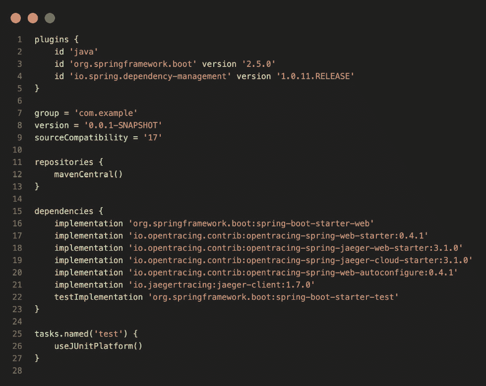

图 19.1 – 使用 OpenTracing 时的 build.gradle 文件

1.  修改你的 `DemoApplication.java` 文件，使其看起来像这样：

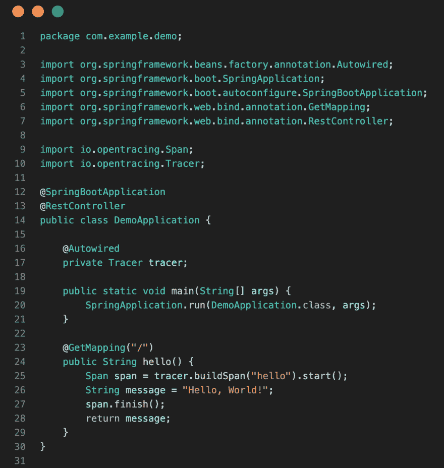

图 19.2 – 演示 OpenTracing 的 DemoApplication.java 文件

1.  通过点击`DemoApplication`类的`main`方法来运行应用程序。

1.  在终端窗口中，使用`curl`访问 http://localhost:8080 端点。响应应该是`Hello, World!`。

1.  观察 VS Code 终端窗口中的输出。你应该会看到类似这样的内容：

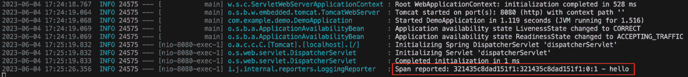

图 19.3 – 在一个简单的 Java 和 Spring Boot 应用中使用 OpenTracing

这表明一个 span 已被创建并上报。

接下来，让我们看看如何为 Node.js 服务添加监控。

## 为 Node.js 服务添加监控

在本节中，我们将学习如何通过以下步骤为 Node.js 编写的微服务添加监控：

1.  进入你的源代码文件夹：

    ```
    $ cd ~/The-Ultimate-Docker-Container-Book/ch19
    ```

1.  创建一个名为`node`的新文件夹，并进入该文件夹：

    ```
    $ mkdir node && cd node
    ```

1.  在此文件夹中运行`npm init`，并接受所有默认选项，除了入口点，将其从默认的`index.js`更改为`server.js`。

1.  我们需要使用以下命令将`express`添加到项目中：

    ```
    $ npm install --save express
    ```

注意

从 npm 5.0.0 版本开始，你不再需要使用这个选项。现在，npm 默认会将所有已安装的包作为依赖项保存。

1.  现在，我们需要使用以下命令安装 Prometheus 适配器到 Node Express 中：

    ```
    $ npm install --save prom-client
    ```

1.  向文件夹中添加一个名为`server.js`的文件，内容如下：

    ```
    const app = require("express")();app.get('/hello', (req, res) => {    const { name = 'World' } = req.query;    res.json({ message: `Hello, ${name}!` });});app.listen(port=3000, () => {    console.log('Example api is listening on http://localhost:3000');});
    ```

这是一个非常简单的 Node Express 应用，只有一个端点 – `/``hello`。

1.  在前面的代码中，第 1 行之后添加以下代码片段来初始化 Prometheus 客户端：

    ```
    const client = require("prom-client");const register = client.register;const collectDefaultMetrics =    client.collectDefaultMetrics;collectDefaultMetrics({ register });
    ```

1.  接下来，添加一个端点来暴露指标。你可以在定义`/``hello`端点之后直接添加它：

    ```
    app.get('/metrics', (req, res) => {    res.set('Content-Type', register.contentType);    res.end(register.metrics());});
    ```

1.  现在让我们运行这个示例微服务：

    ```
    $ npm start
    ```

你应该会看到类似这样的输出：

```
> node@1.0.0 start> node server.js
Example api is listening on http://localhost:3000
```

我们可以在前面的输出中看到该服务正在监听`3000`端口。

1.  现在，让我们尝试访问我们在代码中定义的`/metrics`端点的指标。为此，打开一个新的终端窗口，并使用以下命令：

    ```
    $ curl localhost:3000/metrics
    ```

你应该会看到类似这样的输出：

```
# HELP process_cpu_user_seconds_total Total user CPU time spent in seconds.# TYPE process_cpu_user_seconds_total counter
process_cpu_user_seconds_total 0.081801
# HELP process_cpu_system_seconds_total Total system CPU time spent in seconds.
# TYPE process_cpu_system_seconds_total counter
process_cpu_system_seconds_total 0.02082
# HELP process_cpu_seconds_total Total user and system CPU time spent in seconds.
# TYPE process_cpu_seconds_total counter
process_cpu_seconds_total 0.102621
…
```

请注意，前面的输出已被缩短以便于阅读。我们得到的输出是一个相当长的指标列表，准备供 Prometheus 服务器使用。

这其实很简单，不是吗？通过添加一个 Node 包并在我们的应用程序启动时添加几行简单的代码，我们就能访问到大量的系统指标。

现在让我们定义我们自己的自定义指标。我们将它定义为一个`counter`对象：

1.  将以下代码片段添加到`server.js`中，以定义一个名为`my_hello_counter`的自定义计数器：

    ```
    const helloCounter = new client.Counter({    name: 'my_hello_counter',    help: 'Counts the number of hello requests',});
    ```

1.  在现有的`/hello`端点中，添加代码来增加计数器。修改后的端点应该如下所示：

    ```
    app.get('/hello', (req, res) => {    helloCounter.inc();    const name = req.query.name || 'World';    res.json({ message: `Hello, ${name}!` });});
    ```

1.  使用`npm start`重新运行应用程序。

1.  为了测试新的计数器，让我们两次访问我们的`/hello`端点：

    ```
    $ curl localhost:3000/hello?name=Sue$ curl localhost:3000/hello?name=Marc
    ```

1.  访问`/``metrics`端点时，我们将得到这个输出：

    ```
    $ curl localhost:3000/metrics
    ```

分析前面命令生成的输出，并在输出的末尾找到类似这样的内容：

```
…# HELP my_hello_counter Counts the number of hello requests
# TYPE my_hello_counter counter
my_hello_counter 2
...
```

我们在代码中定义的计数器显然起作用，并且输出了我们添加的`HELP`文本。

现在我们知道如何为 Node Express 应用程序添加指标，接下来我们做同样的操作，为基于.NET 的微服务添加指标。

## 为.NET 服务添加指标

让我们从创建一个基于 Web API 模板的简单.NET 微服务开始：

1.  导航到你的源代码文件夹：

    ```
    $ cd ~/The-Ultimate-Docker-Container-Book/ch19
    ```

1.  创建一个新的`dotnet`文件夹，并导航到该文件夹：

    ```
    $ mkdir dotnet && cd dotnet
    ```

1.  使用`dotnet`工具来搭建一个名为`sample-api`的新微服务：

    ```
    $ dotnet new webapi --output sample-api
    ```

1.  我们将使用用于.NET 的 Prometheus 适配器，它是作为一个名为`prometheus-net.AspNetCore`的 NuGet 包提供的。使用以下命令将该包添加到`sample-api`项目中：

    ```
    $ dotnet add sample-api package prometheus-net.AspNetCore
    ```

1.  打开你喜欢的代码编辑器；例如，使用 VS Code 时，执行以下操作：

    ```
    $ code .
    ```

1.  定位到`Program.cs`文件并打开它。在文件的开始处，添加一个`using`语句：

    ```
    using Prometheus;
    ```

1.  然后，在文件的代码中，紧跟`app.MapControllers()`命令后面，添加`app.MapMetrics()`命令。你的代码应该如下所示：

    ```
    …app.UseAuthorization();app.MapControllers();app.MapMetrics();app.Run();
    ```

请注意，上述内容适用于 7.x 版本或更新版本的.NET。如果你使用的是早期版本，配置可能略有不同。有关更多详细信息，请查阅[`github.com/prometheus-net/prometheus-net`](https://github.com/prometheus-net/prometheus-net)。

1.  这样，Prometheus 组件将开始发布 ASP.NET 的请求指标。让我们试试吧。首先，使用以下命令启动应用程序：

    ```
    $ dotnet run --project sample-api
    ```

上面命令的输出应该如下所示：

```
Building...info: Microsoft.Hosting.Lifetime[14]
      Now listening on:
info: Microsoft.Hosting.Lifetime[0]
      Application started. Press Ctrl+C to shut down.
info: Microsoft.Hosting.Lifetime[0]
      Hosting environment: Development
info: Microsoft.Hosting.Lifetime[0]
      Content root path: /Users/.../ch19/dotnet/sample-api
...
```

上述输出告诉我们，微服务正在监听 http://localhost:5204。

1.  现在，我们可以使用`curl`来调用服务的指标端点：

    ```
    $ curl http://localhost:5204/metrics
    ```

上面命令的（简化）输出类似于以下内容：

```
# HELP process_private_memory_bytes Process private memory size# TYPE process_private_memory_bytes gauge
process_private_memory_bytes 55619584
# HELP process_virtual_memory_bytes Virtual memory size in bytes.
# TYPE process_virtual_memory_bytes gauge
process_virtual_memory_bytes 2221930053632
# HELP process_working_set_bytes Process working set
# TYPE process_working_set_bytes gauge
process_working_set_bytes 105537536
…
prometheus_net_metric_families{metric_type="histogram"} 0
prometheus_net_metric_families{metric_type="summary"} 0
prometheus_net_metric_families{metric_type="counter"} 3
prometheus_net_metric_families{metric_type="gauge"} 12
```

我们得到的是微服务的系统指标列表。过程非常简单：我们只需要添加一个 NuGet 包和一行代码，就能让我们的服务实现指标采集！

如果我们想要添加我们自己的（功能性）指标呢？这同样简单。假设我们想测量对`.NET scaffolding`为我们创建的`/weatherforecast`端点的并发访问数量。为此，我们定义一个仪表，并使用它将适当端点的逻辑包装起来。

指标类型

Prometheus 支持四种类型的指标：

+   **计数器**：一个累积型指标，表示一个单一的单调递增计数器，其值只能增加或在重启时重置为零。

+   **仪表**：一个表示单一数值的指标，该值可以任意上升或下降。仪表通常用于衡量温度或当前内存使用量等值。

+   **直方图**：一种采样观察结果的指标（通常是请求时长或响应大小等），并将其计数在可配置的桶中。它还提供所有观察值的总和。

+   **总结**：类似于直方图，摘要会对观察结果进行采样。它不仅提供了观察结果的总计数和所有观察值的总和，还会计算在滑动时间窗口上的可配置分位数。

我们可以通过以下步骤定义我们自己的量表：

1.  在 `Controllers` 文件夹中找到 `WeatherForecastController.cs` 类。

1.  在文件顶部添加`using Prometheus;`。

1.  在`WeatherForecastController`类中定义一个私有的 `Gauge` 类型变量 `callsInProgress`：

    ```
    private static readonly Gauge callsInProgress = Metrics    .CreateGauge("myapp_calls_in_progress",    "Number of weather forecast operations ongoing.");
    ```

1.  用 `using` 语句包裹 `Get` 方法的逻辑：

    ```
    [HttpGet]public IEnumerable<WeatherForecast> Get(){    using(callsInProgress.TrackInProgress())    {        // code of the Get method    }}
    ```

1.  重启微服务。

1.  使用 `curl` 调用 `/weatherforecast` 端点几次：

    ```
    $ curl http://localhost:5204/weatherforecast
    ```

1.  使用 `curl` 获取度量，方法和本节前面所做的相同：

    ```
    $ curl http://localhost:5204/metrics
    ```

你应该看到类似以下的输出（已简化）：

```
...# HELP myapp_calls_in_progress Number of weather forecast operations ongoing.
# TYPE myapp_calls_in_progress gauge
myapp_weather_forecasts_in_progress 0
...
```

你会注意到，列表中现在有一个新的度量叫做`myapp_weather_forecasts_in_progress`。它的值为零，因为当前你没有对跟踪的端点发出任何请求，量表类型的度量仅衡量正在进行的请求数量。

恭喜，你刚刚定义了第一个功能性度量！这只是一个开始；还有许多更复杂的可能性等待你探索。

基于 Node.js 或 .NET 的应用服务并不特殊。对用其他语言编写的服务（如 Kotlin、Python 或 Go）进行监控同样简单直接。

在学习如何对应用服务进行监控，以便它暴露出重要的度量后，让我们来看看如何使用 Prometheus 来收集和聚合这些值，以便我们监控一个分布式应用。

# 利用 Prometheus 和 Grafana 监控分布式应用

现在我们已经学习了如何对应用服务进行监控，使其暴露 Prometheus 度量，接下来是展示如何收集这些度量并将它们转发到 Prometheus 服务器，在那里所有度量将被聚合并存储。然后，我们可以使用 Prometheus 的（简单）Web UI 或者更复杂的解决方案，如 Grafana，在仪表盘上显示重要的度量。

与大多数用于收集应用服务和基础设施组件度量的工具不同，Prometheus 服务器承担了工作负载并定期抓取所有定义的目标。这样，应用程序和服务就无需担心转发数据。你也可以把它描述为拉取度量，而不是推送度量。

这使得 Prometheus 服务器非常适合我们的案例。我们现在将讨论如何将 Prometheus 部署到 Kubernetes，然后是我们两个示例应用服务。最后，我们将把 Grafana 部署到集群中，并使用它在仪表盘上显示我们的自定义度量。

## 架构

让我们快速概述一下计划系统的架构。如前所述，我们有微服务、Prometheus 服务器和 Grafana。此外，一切将部署到 Kubernetes。以下图示显示了它们之间的关系：

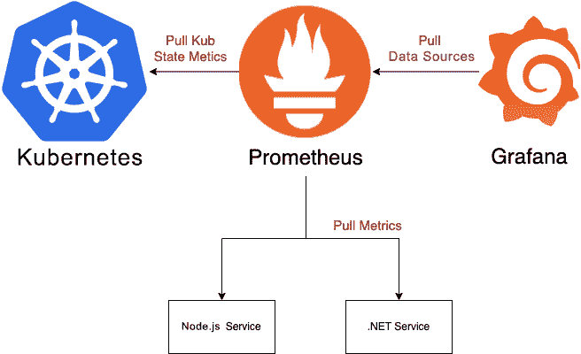

图 19.4 – 使用 Prometheus 和 Grafana 进行监控的应用程序概览

在图表的顶部中央，我们有 Prometheus，它定期从 Kubernetes 中抓取指标，如左侧所示。它还定期从服务中抓取指标，在我们的案例中是从之前章节中创建和配置的 Node.js 和 .NET 示例服务中抓取。最后，在图表的右侧，我们有 Grafana，它定期从 Prometheus 拉取数据，然后将其显示在图形化仪表板上。

## 将 Prometheus 部署到 Kubernetes

如上所示，我们首先将 Prometheus 部署到 Kubernetes。让我们首先定义一个 Kubernetes YAML 文件，用于部署 Prometheus。我们需要定义一个 Kubernetes Deployment，它将创建一个 Prometheus 服务器实例的 ReplicaSet，然后我们将定义一个 Kubernetes 服务，将 Prometheus 暴露给我们，这样我们就可以从浏览器标签页中访问它，或者 Grafana 可以访问它。让我们开始吧：

1.  导航到源文件夹：

    ```
    $ cd ~/The-Ultimate-Docker-Container-Book/ch19
    ```

1.  创建一个名为`kube`的文件夹，并进入该文件夹：

    ```
    $ mkdir -p ch19/kube && cd ch19/kube
    ```

1.  向此文件夹添加一个名为`prometheus.yaml`的文件。

1.  将以下代码片段添加到此文件中；它定义了 Prometheus 的 Deployment：

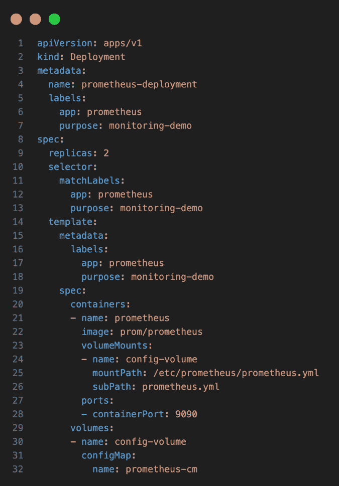

图 19.5 – Prometheus 部署

我们正在定义一个包含两个 Prometheus 实例的 ReplicaSet。每个实例都被分配了两个标签，`app: prometheus`和`purpose: monitoring-demo`，用于标识。值得注意的是，在容器规格的`volumeMounts`部分。我们在此处将一个名为`prometheus-cm`的 Kubernetes `ConfigMap` 对象挂载到容器中，这个对象包含 Prometheus 配置，挂载位置是 Prometheus 期望其配置文件存在的地方。`ConfigMap` 类型的卷在前面代码片段的最后四行中进行了定义。

请注意，我们稍后会定义 ConfigMap。

1.  现在，让我们定义 Prometheus 的 Kubernetes 服务。将这个片段追加到之前的文件中：

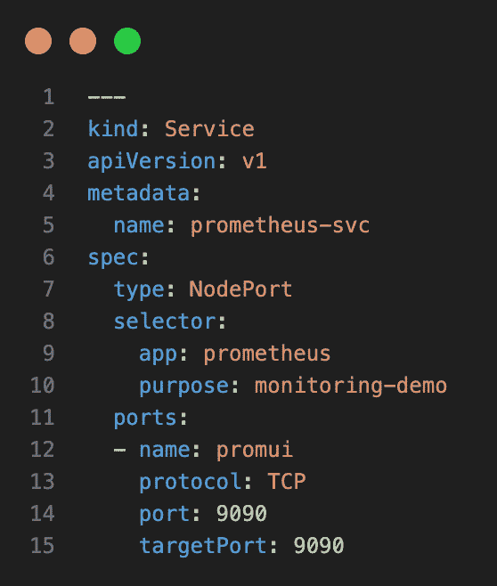

图 19.6 – Prometheus 服务

请注意，片段开头的三个破折号（`---`）是必须的，用于在 YAML 文件中分隔各个对象定义。

我们将服务命名为`prometheus-svc`，并将其设置为`NodePort`（而不仅仅是`ClusterIP`类型的服务），以便能够从主机访问 Prometheus 的 Web UI。

1.  现在我们可以为 Prometheus 定义一个简单的配置文件。此文件基本上指示 Prometheus 服务器从哪些服务抓取指标，以及抓取的频率。首先，创建一个名为`ch19/kube/config`的子文件夹：

    ```
    $ mkdir config
    ```

1.  向`config`文件夹添加一个名为`prometheus.yml`的文件，并向其中添加以下内容：

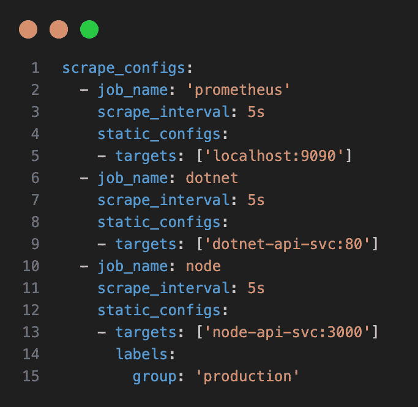

图 19.7 – Prometheus 配置

在前面的文件中，我们为 Prometheus 定义了三个作业：

+   第一个任务，名为 `prometheus`，每五秒从 Prometheus 服务器本身抓取一次指标。它在 `localhost:9090` 目标处找到这些指标。请注意，默认情况下，指标应该暴露在 `/metrics` 端点上。

+   第二个任务，名为 `dotnet`，从位于 `dotnet-api-svc:80` 的服务抓取指标，这将是我们之前定义和配置的 .NET Core 服务。

+   最后，第三个任务对我们的 Node 服务做了相同的操作。请注意，我们还为该任务添加了一个名为 `'production'` 的标签。这样可以进一步对任务进行分组。

1.  现在我们可以在 Kubernetes 集群中使用下一个命令定义 `ConfigMap` 对象。从 `ch19/kube` 文件夹中执行以下命令：

    ```
    $ kubectl create configmap prometheus-cm \--from-file config/prometheus.yml
    ```

什么是 Kubernetes ConfigMap？

Kubernetes ConfigMap 是一个 API 对象，用于以键值对的形式存储非机密的配置数据。这可以包括环境特定的 URL、命令行参数或任何其他应用程序运行所需的参数。

ConfigMap 的主要优点是它允许你将配置细节与应用程序代码解耦。这有助于使你的应用程序更具可移植性，并更易于扩展。

ConfigMap 可以通过多种方式被 Pods 消耗：作为环境变量、作为容器的命令行参数，或作为卷中的配置文件。这种灵活性使得开发人员能够根据具体情况选择最合适的方法。

1.  现在我们可以使用以下命令将 Prometheus 部署到我们的 Kubernetes 服务器：

    ```
    $ kubectl apply -f prometheus.yaml
    ```

这会返回以下响应：

```
deployment.apps/prometheus-deployment createdservice/prometheus-svc created
```

1.  让我们再次确认部署是否成功：

    ```
    $ kubectl get all
    ```

下面是前面命令的输出：

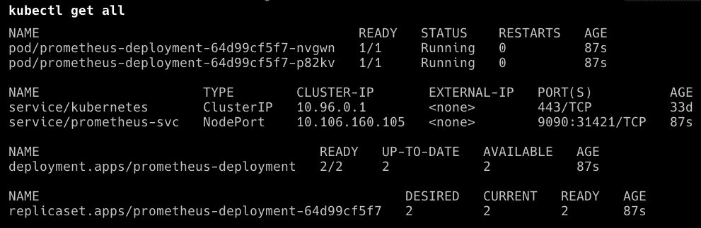

图 19.8 – 在 Kubernetes 集群上创建的 Prometheus 资源

密切关注 Pods 列表，确保它们都已启动并正在运行。请注意 `prometheus-svc` 对象的端口映射。在作者的案例中，`9090` 端口映射到 `31421` 主机端口。在你的情况下，后者可能会有所不同，但它也会在 3xxxx 范围内。

1.  现在我们可以访问 Prometheus 的 web UI。打开一个新的浏览器标签页，导航到 `http://localhost:<port>/targets`，其中 `<port>` 在作者的案例中是 `31421`。你应该会看到类似下面的内容：

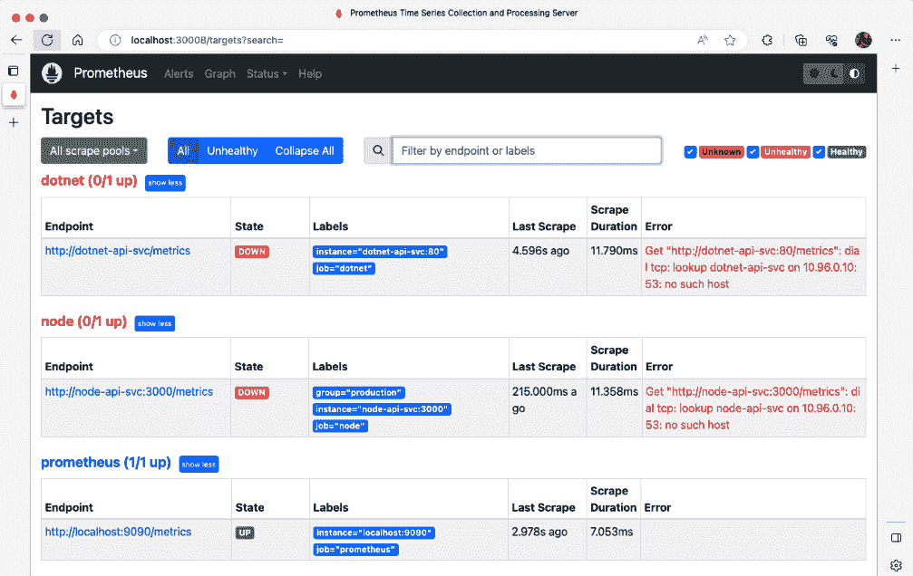

图 19.9 – Prometheus web UI 显示已配置的目标

在前面的截图中，我们看到为 Prometheus 定义了三个目标。列表中的第三个目标处于运行状态，并且 Prometheus 可以访问它。它是我们在配置文件中为抓取来自 Prometheus 本身指标的任务定义的端点。其他两个服务目前未运行，因此它们的状态为关闭。

1.  现在通过点击 UI 顶部菜单中的相应链接，导航到 **Graph** 页面。

1.  在搜索框中开始输入，已知的指标列表将会显示。检查 Prometheus 找到的所有列出的指标。在这种情况下，它仅是 Prometheus 服务器本身定义的指标列表：

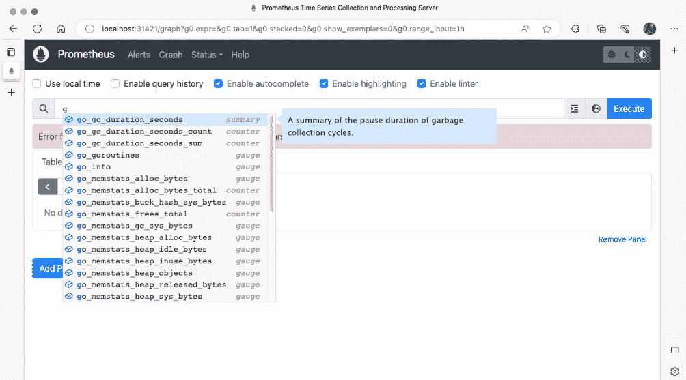

图 19.10 – Prometheus web UI 显示可用的指标

这样，我们就准备好将之前创建的.NET 和 Node 示例服务部署到 Kubernetes 了。

## 将我们的应用服务部署到 Kubernetes

在我们能够使用之前创建的示例服务并将其部署到 Kubernetes 之前，必须为它们创建 Docker 镜像，并将其推送到容器注册中心。在我们的案例中，我们将它们推送到 Docker Hub。

我们从.NET Core 示例开始：

1.  向`ch19/dotnet/sample-api`项目文件夹添加一个包含以下内容的 Dockerfile：

    ```
    FROM mcr.microsoft.com/dotnet/sdk:7.0 AS build-envWORKDIR /appCOPY *.csproj ./RUN dotnet restoreCOPY . ./RUN dotnet publish -c Release -o outFROM mcr.microsoft.com/dotnet/aspnet:7.0WORKDIR /appCOPY --from=build-env /app/out .ENTRYPOINT ["dotnet", "sample-api.dll"]
    ```

1.  使用此命令在`dotnet/sample-api`项目文件夹内创建 Docker 镜像：

    ```
    $ docker image build -t fundamentalsofdocker/ch19-dotnet-api:2.0 .
    ```

请注意，您可能需要将前面的和后续命令中的`fundamentalsofdocker`替换为您自己的 Docker Hub 用户名。

1.  确保您已登录 Docker。如果没有，请使用以下命令进行登录：

    ```
    $ docker login
    ```

1.  将镜像推送到 Docker Hub：

    ```
    $ docker image push fundamentalsofdocker/ch19-dotnet-api:2.0
    ```

现在我们对 Node 示例 API 做同样的操作：

1.  向`ch19/node`项目文件夹添加一个包含以下内容的 Dockerfile：

    ```
    FROM node:ltsWORKDIR /appCOPY package.json ./RUN npm ci --only=productionCOPY . .EXPOSE 3000CMD ["node", "server.js"]
    ```

1.  使用此命令在`ch19/node`项目文件夹内创建 Docker 镜像：

    ```
    $ docker image build -t fundamentalsofdocker/ch19-node-api:2.0 .
    ```

再次提醒，您可能需要将前面和后续命令中的`fundamentalsofdocker`替换为您自己的 Docker Hub 用户名。

1.  将镜像推送到 Docker Hub：

    ```
    $ docker image push fundamentalsofdocker/ch19-node-api:2.0
    ```

通过此操作，我们已经准备好定义部署这两个服务所需的 Kubernetes 对象。定义内容较长，可以在仓库中的`sample-solutions/ch19/kube/app-services.yaml`文件中找到。

请打开那个文件并分析其内容。

我们使用这个文件来部署服务：

1.  确保您在`kube`子文件夹内。

1.  使用以下命令来部署这两个服务：

    ```
    $ kubectl apply -f app-services.yaml
    ```

这是输出结果：

```
deployment.apps/dotnet-api-deployment createdservice/dotnet-api-svc created
deployment.apps/node-api-deployment created
service/node-api-svc created
```

1.  使用`kubectl get all`命令再次检查服务是否正常运行。确保 Node 和.NET 示例 API 服务的所有 Pod 都已启动并运行。

1.  列出所有 Kubernetes 服务，以找出每个应用服务的主机端口：

    ```
    $ kubectl get services
    ```

输出应如下所示：

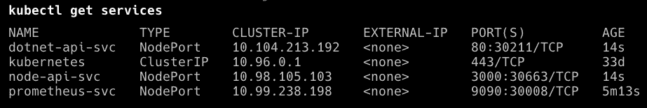

图 19.11 – kubectl get services 输出

在作者的案例中，.NET API 映射到端口`30211`，Node API 映射到端口`30663`。您的端口可能会有所不同。

1.  使用`curl`访问.NET 服务的`/metrics`端点：

    ```
    $ curl localhost:30211/metrics
    ```

输出应如下所示：

```
# HELP process_cpu_seconds_total Total user and system CPU time spent in seconds.# TYPE process_cpu_seconds_total counter
process_cpu_seconds_total 0.4
# HELP prometheus_net_meteradapter_instruments_connected Number of instruments that are currently connected to the adapter.
# TYPE prometheus_net_meteradapter_instruments_connected gauge
prometheus_net_meteradapter_instruments_connected 0
# HELP prometheus_net_exemplars_recorded_total Number of exemplars that were accepted into in-memory storage in the prometheus-net SDK.
# TYPE prometheus_net_exemplars_recorded_total counter
prometheus_net_exemplars_recorded_total 0
...
```

1.  现在对 Node 服务做同样的操作：

    ```
    $ curl localhost:30663/metrics
    ```

这次，输出结果如下所示：

```
# HELP process_cpu_user_seconds_total Total user CPU time spent in seconds.# TYPE process_cpu_user_seconds_total counter
process_cpu_user_seconds_total 1.0394399999999997 1578294999302
# HELP process_cpu_system_seconds_total Total system CPU time spent in seconds.
# TYPE process_cpu_system_seconds_total counter
process_cpu_system_seconds_total 0.3370890000000001 1578294999302
...
```

1.  在 Prometheus 中再次检查`/targets`端点，确保这两个微服务现在可以访问：

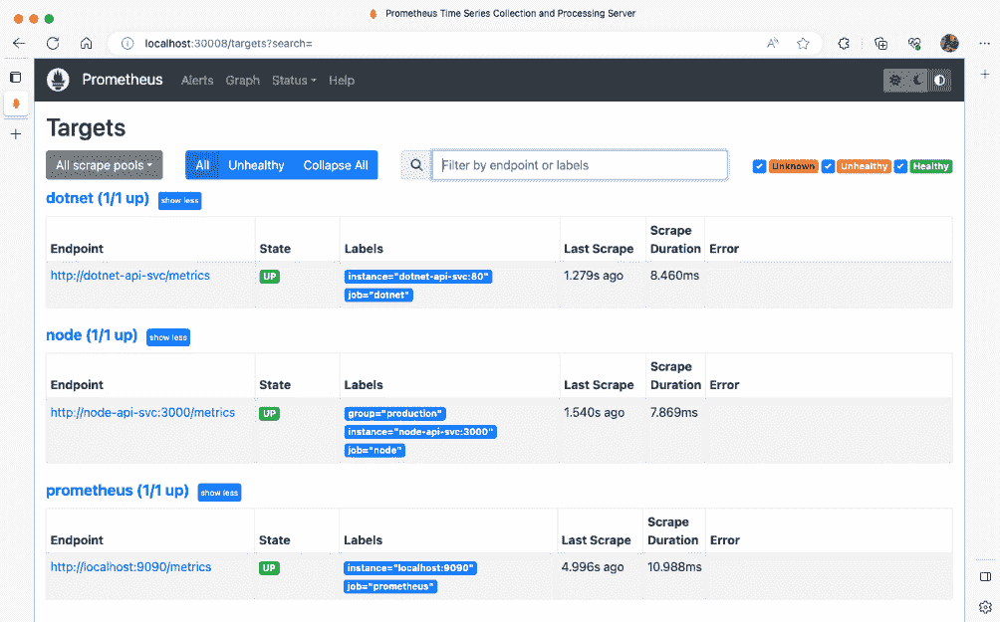

图 19.12 – Prometheus 显示所有目标都在运行

1.  为了确保我们为 Node.js 和.NET 服务定义并暴露的自定义指标已经生效，我们需要至少访问一次每个服务。因此，使用`curl`多次访问各自的端点：

    ```
    # access the /weatherforecast endpoint in the .NET service$ curl localhost:30211/weatherforecast# and access the /hello endpoint in the Node service$ curl localhost:30663/hello
    ```

1.  我们还可以在 Prometheus 的图形视图中看到这两个指标：

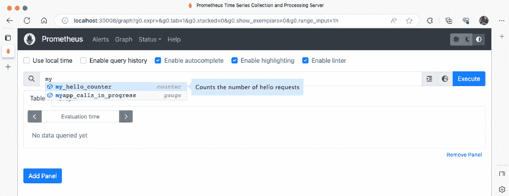

图 19.13 – Prometheus 中的自定义指标

最后一步是将 Grafana 部署到 Kubernetes，以便我们能够创建复杂且具有图形化吸引力的仪表盘，显示应用服务和/或基础设施组件的关键指标。

## 将 Grafana 部署到 Kubernetes

现在让我们也将 Grafana 部署到我们的 Kubernetes 集群中，这样我们就可以像管理我们分布式应用的其他组件一样管理这个工具。作为允许我们创建用于监控应用的仪表盘的工具，Grafana 可以被视为关键任务工具，因此需要这样处理。

将 Grafana 部署到集群是非常直接的。我们可以按以下步骤操作：

1.  在`ch19/kube`文件夹中添加一个新的文件，命名为`grafana.yaml`。

1.  在此文件中，添加 Grafana 的 Kubernetes Deployment 定义：

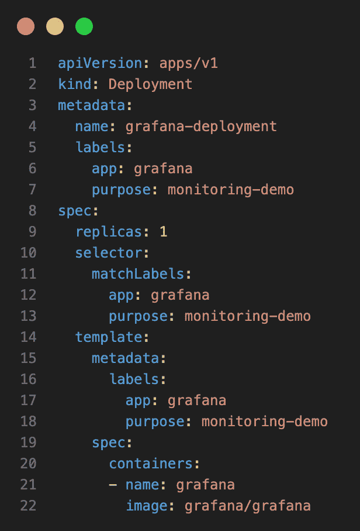

图 19.14 – grafana.yaml 文件的内容

如果你不想自己输入代码，可以在你的仓库的`sample-solutions/ch19/kube`子文件夹中找到该文件。

该定义没有什么意外。在这个示例中，我们运行的是单实例的 Grafana，并且它使用`app`和`purpose`标签进行标识，类似于我们为 Prometheus 使用的标签。这次不需要特殊的卷映射，因为我们只使用默认配置。

1.  我们还需要暴露 Grafana，因此需要将以下代码片段附加到前面的文件中，以定义 Grafana 的服务：

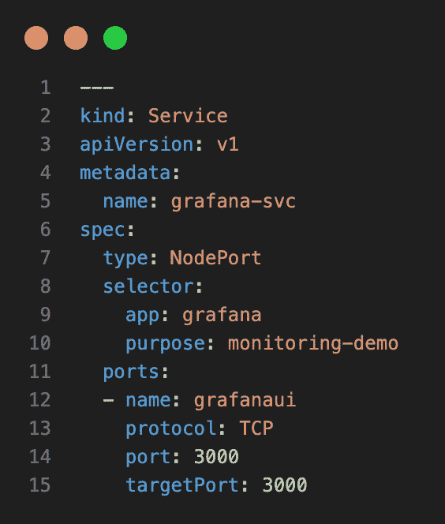

图 19.15 – Grafana 的 Kubernetes 服务

我们再次使用了`NodePort`类型的服务，以便从主机访问 Grafana UI。

1.  现在我们可以使用以下命令部署 Grafana：

    ```
    $ kubectl apply -f grafana.yaml
    ```

这将产生以下输出：

```
deployment.apps/grafana-deployment createdservice/grafana-svc created
```

1.  让我们找出可以访问 Grafana 的端口号：

    ```
    $ kubectl get services/grafana-svc
    ```

这将给我们带来以下内容：

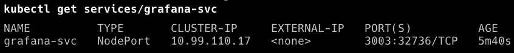

图 19.16 – 获取 Grafana 服务的详细信息

1.  打开一个新的浏览器标签，导航至`http://localhost:<port>`，其中`<port>`是你在上一阶段识别的端口号，在我的情况下是`32736`。你应该看到类似这样的内容：

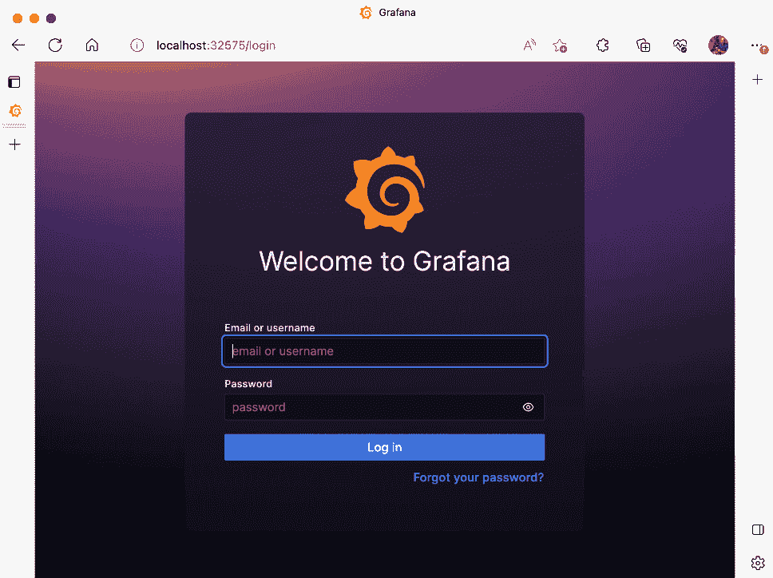

图 19.17 – Grafana 的登录界面

1.  使用默认用户名`admin`登录，密码也是`admin`。当系统提示更改密码时，暂时点击**跳过**链接。你将被重定向到**首页**仪表盘。

1.  在**首页**仪表盘上，点击**创建你的第一个数据源**，然后从数据源列表中选择**Prometheus**。

1.  添加`http://prometheus-svc:9090`作为 Prometheus 的 URL，并点击绿色的**保存 &** **测试**按钮。

1.  在 Grafana 中，返回到**首页**仪表盘，然后选择**新建** **仪表盘**链接。

1.  点击**添加查询**，然后从**指标**下拉菜单中选择我们在 .NET 示例服务中定义的自定义指标：

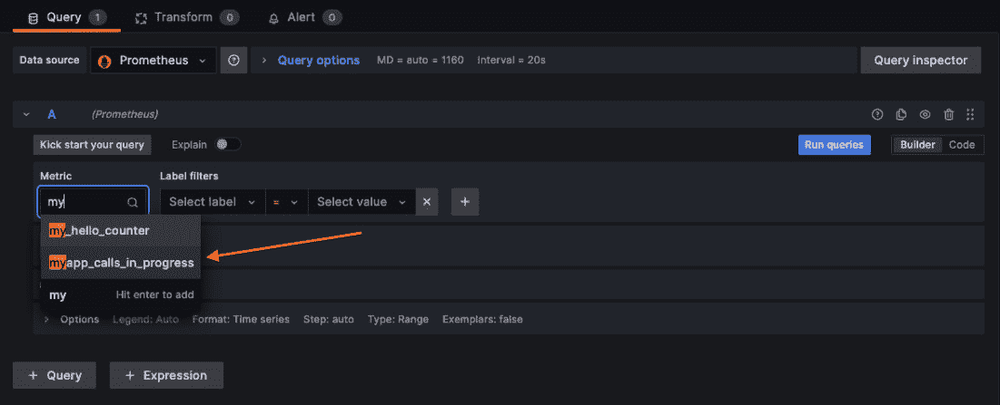

图 19.18 – 在 Grafana 中选择 .NET 自定义指标

1.  将**相对时间**的值从**1 小时**改为**5 分钟**（5m）。

1.  更改仪表盘的刷新率，刷新率位于视图的右上角，设置为**5 秒**（5s）。

1.  对 Node 示例服务中定义的自定义指标做相同的操作，这样你将在新仪表盘上有两个面板。

1.  根据[`grafana.com/docs/grafana/latest/guides/getting_started/`](https://grafana.com/docs/grafana/latest/guides/getting_started/)的文档修改仪表盘及其面板，以便根据自己的喜好进行定制。

1.  使用`curl`访问示例服务的两个端点，并观察仪表盘。它可能看起来像这样：

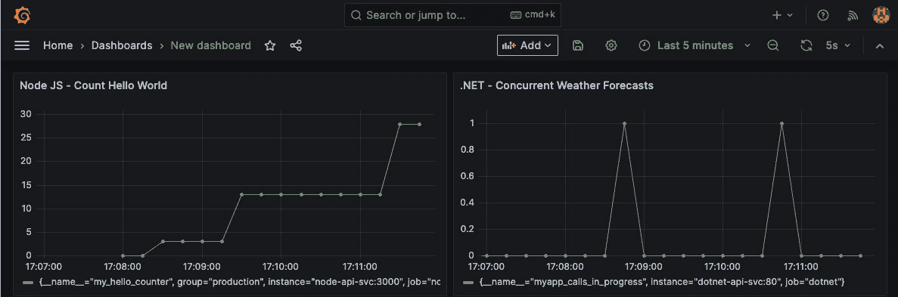

图 19.19 – 带有我们两个自定义指标的 Grafana 仪表盘

总结来说，我们可以说 Prometheus 非常适合用来监控我们的微服务，因为我们只需要暴露一个指标端口，因此不需要增加太多复杂性或运行额外的服务。Prometheus 然后负责定期抓取配置好的目标，这样我们的服务就不需要担心这些指标的输出。

# 基于关键指标定义警报

如果你认为仅仅收集日志和指标并在吸引人的仪表盘中显示它们就足够了，你会感到失望。如果我们只是使用仪表盘，一些支持人员将需要不断站在大量监视器前，全天候、每年 365 天待命，以防万一。委婉地说，这份工作是枯燥的。如果那个人打瞌睡了怎么办？我们必须调整方法。让我们从定义什么是指标开始。

## 指标

指标作为警报规则的输入值。必须识别出关键指标，如果它们超过预设值并持续一段时间，就需要触发警报。例如，考虑 CPU 使用率。

基于关键指标定义警报是监控和维护 Docker 和 Kubernetes 系统健康的重要部分。警报使我们能够基于指标定义条件，并在这些条件满足时发送通知，从而使我们能够迅速响应潜在问题。

在 Kubernetes 中，我们可以使用像 Prometheus 这样的工具，根据 PromQL 表达式定义警报规则。这些规则允许我们基于从集群收集的度量数据指定条件，并在这些条件满足时向外部服务发送通知。例如，我们可以定义一个警报，当集群节点的 CPU 或内存利用率超过某个阈值时触发。

在 Docker 中，我们可以使用像 cAdvisor 或 Docker stats 这样的工具来收集容器的度量数据，然后使用监控和警报工具根据这些度量数据定义警报。例如，我们可以定义一个警报，当运行的容器数量超过某个阈值时触发。

在定义警报时，我们需要遵循最佳实践，确保警报既有效又可操作。关于 Kubernetes 的一些警报最佳实践包括以下内容：

+   **基于症状的警报**：警报应基于那些具有显著影响的症状，而不是基于度量数据中出现的异常值。

+   **基于主机或 Kubernetes 节点层的警报**：监控主机和节点的健康状况，以确保集群平稳运行。

+   **基于 Kubernetes 基础设施的警报**：监控 Kubernetes 控制平面和其他内部服务的健康状况。

+   **基于 Kubernetes 上运行的服务的警报**：监控在 Kubernetes 上运行的应用程序的健康状况。

+   **基于应用层度量的警报**：监控应用程序特定的度量数据，以确保应用程序顺利运行。

现在让我们来讨论当发生异常情况时的警报处理。

## 警报

让我们来定义警报，当出现异常情况时发送警报。我们可以通过不同的方式进行警报通知。如果你正在值班，可能会收到寻呼信息、短信、电子邮件，甚至是激活警报音和闪烁的警告灯。一切都取决于具体的使用场景。我们只需要说明，作者参与了多个程序，这些程序采用了上述所有的警报通知方式。

以 CPU 使用情况为例。当一个 Kubernetes 集群节点的 CPU 使用率超过 95% 且持续超过一分钟时，**系统可靠性工程师**（**SRE**）需要收到通知。

但是，你可能会想，谁来制定这些指南呢？运营团队——或者更准确地说，是 SRE 们——负责确定哪些非功能性度量数据是重要的，并在需要时决定何时通知他们，即使是在深夜。公司必须明确规定功能性度量数据及其容忍度或其他标准，这些标准将触发每个度量的警报。

## 定义警报

仅仅收集和展示度量数据是不够的，无论它们是与基础设施相关还是与业务相关。为了为这些度量数据制定**服务水平目标**（**SLOs**）和**服务水平协议**（**SLAs**），我们首先必须确定真正定义系统状态的关键指标。随后，我们制定指导方针，规定一个度量数据超出适当的 SLO 或 SLA 的频率和持续时间。如果违反这些规则，我们会发送警报。

让我们定义几个潜在的警报候选项来了解这一点。第一个示例是系统级统计数据，而第二个是功能性或与业务相关的度量标准。你能区分它们吗？

+   我们将银行应用程序中使用的总 CPU 百分比定义为一个统计数据。*该比例不应超过 99%*可能是 SLO。规则可能是：如果 CPU 百分比在一分钟内超过 99%超过 50%，则应发送警报。

+   我们可以将为客户提供报价的时间指定为一个关键统计数据，适用于提供人寿保险的应用程序。该度量的 SLA 可能是：99%的报价请求必须在 50 毫秒内处理完毕。没有请求可以超过 1,000 毫秒。如果 SLA 在一个小时内被违反超过三次，根据警报规则，应该发送警报。

前者是一个基础设施度量，而后者是一个商业度量。

选定的目标人员，例如 SRE 或开发人员，可以通过多种渠道接收警报，包括电子邮件、短信、自动电话、Slack 消息、音频警报、光学警报等。

一旦我们创建并配置了这些警报，服务人员就可以进行其他活动，而不必主动监控系统。如果发生任何重大或异常情况，他们将确保得到通知并作出响应。

## 运行手册

假设已经触发了一个警报。那么接下来怎么办？运行手册可以在这种情况下提供帮助。运行手册概述了每个警报需要通知谁，该人员需要做什么来解决潜在问题，如果问题无法解决，应将问题升级到谁那里。创建运行手册是一个困难的过程，不容小觑。然而，它们是企业的关键工具。SRE 的能力是有限的。有些生产问题非常严重，以至于必须通知 C 级管理人员。假设你经营一个在线商店，由于**支付服务提供商**（**PSP**）故障，无法在平台上处理支付，这意味着你的应用程序现在缺少一个关键的需求。实质上，在问题修复之前，你无法开展业务；你不认为 CTO 应该知道这个情况吗？

让我们谈谈一个当前的热门话题：生产系统中出现的问题。我们需要迅速找出问题的根本原因。

# 在生产环境中排查服务问题

最佳实践是创建仅包含绝对必要内容的最小化生产镜像。这包括通常用于调试和排查应用程序的常见工具，如 `netcat`、`iostat`、`ip` 等。理想情况下，生产系统仅在集群节点上安装容器编排软件（如 Kubernetes）和一个最小化操作系统（如 CoreOS）。而应用容器理想情况下只包含运行所必需的二进制文件。这可以最小化攻击面，并降低处理漏洞的风险。此外，小型镜像有一个优势，即下载速度快，占用的磁盘和内存空间少，启动速度更快。

但如果我们在 Kubernetes 集群中运行的某个应用服务表现异常，甚至崩溃，这可能会成为一个问题。有时候我们无法仅通过生成并收集的日志来找到问题的根本原因，这时我们可能需要直接在集群节点上排查该组件。

我们可能会想通过 SSH 连接到指定的集群节点，并运行一些诊断工具。但这是不可能的，因为集群节点仅运行一个最小化的 Linux 发行版，并未安装这些工具。作为开发者，我们现在可以请求集群管理员安装所有我们打算使用的 Linux 诊断工具。但这并不是一个好主意。首先，这会为集群节点上可能存在的易受攻击的软件敞开大门，危及在该节点上运行的所有其他 pod，也会为集群本身敞开一道门，黑客可能会利用这一点。此外，给予开发者对生产集群节点的直接访问始终是一个不好的主意，无论你多么信任他们。只有有限数量的集群管理员才应该有权限这么做。

更好的解决方案是让集群管理员代表开发者运行一个所谓的堡垒容器。这个堡垒容器或排错容器已经安装了我们需要的所有工具，帮助我们准确找出应用服务中 bug 的根本原因。它也可以在主机的网络命名空间中运行，因此它将能够完全访问容器主机的所有网络流量。

## netshoot 容器

前 Docker 员工 Nicola Kabar 创建了一个实用的 Docker 镜像，名为 `nicolaka/netshoot`，这是 Docker 的现场工程师常用来排查在 Kubernetes 或 Docker Swarm 上运行的应用程序问题的工具。正如创建者所言，这个容器的目的如下：

“目的：Docker 和 Kubernetes 网络故障排除可能会变得复杂。通过正确理解 Docker 和 Kubernetes 网络工作原理以及使用正确的工具，你可以进行故障排除并解决这些网络问题。netshoot 容器具有一套强大的网络故障排除工具，可以用于故障排除 Docker 网络问题。”

- Nicola Kabar

若要使用此容器进行调试，我们可以按如下步骤进行：

1.  使用以下命令启动一个临时的堡垒容器，在 Kubernetes 上进行调试：

    ```
    $ kubectl run tmp-shell --rm -i --tty \    --image nicolaka/netshoot
    ```

你将看到以下提示：

```
bash-5.0#
```

1.  你现在可以在这个容器中使用像 `ip` 这样的工具：

    ```
    bash-5.0# ip a
    ```

在我的机器上，如果 pod 在 Docker Desktop 上运行，输出结果类似于以下内容：


图 19.20 – 使用 netshoot 容器运行 `ip a` 命令的输出

1.  要退出这个故障排除容器，只需按 *Ctrl* + *D* 或键入 `exit` 然后按 *Enter*。

1.  如果我们需要更深入地了解并在与 Kubernetes 主机相同的网络命名空间中运行容器，那么我们可以使用这个命令：

    ```
    $ kubectl run tmp-shell --rm -i --tty \    --overrides='{"spec": {"hostNetwork": true}}' \    --image nicolaka/netshoot
    ```

1.  如果我们在这个容器中再次运行 `ip` 命令，我们也会看到容器主机所看到的一切，例如所有的 `veth` 端点。

`netshoot` 容器安装了工程师解决网络相关问题时所需的所有常用工具。更熟悉的一些工具有 `ctop`、`curl`、`dhcping`、`drill`、`ethtool`、`iftop`、`iperf` 和 `iproute2`。

# 总结

在本书的最后一章，我们探讨了用于为单个服务或整个分布式应用程序添加监控和仪表化的不同技术，尤其是在 Kubernetes 集群上运行时。你已经了解了基于关键指标的告警概念。此外，我们还展示了如何在不改变集群或运行服务的集群节点的情况下，故障排除生产环境中运行的应用服务。

随着本书的结束，我们想感谢你对本书的兴趣并坚持读到最后。我们希望提供的信息和示例有助于加深你对 Docker 和 Kubernetes 的理解。这些技术是构建和部署现代应用程序的强大工具，我们希望本书能帮助你获得有效使用它们的知识和信心。再次感谢你的阅读，祝你未来一切顺利！

# 问题

为了评估你的学习进度，请回答以下问题：

1.  为什么为你的应用服务添加监控是重要的？

1.  你能向一个感兴趣的外行人描述 Prometheus 是什么吗？

1.  导出 Prometheus 指标非常简单。你能用简单的语言描述如何为 Node.js 应用程序做这件事吗？

1.  你需要调试一个在 Kubernetes 上运行的生产服务。不幸的是，仅凭该服务生成的日志无法提供足够的信息来定位根本原因。你决定直接在相应的 Kubernetes 集群节点上进行故障排查。你该如何进行？

# 答案

以下是前面问题的示例答案：

1.  由于性能和安全原因，我们不能在生产系统上进行任何实时调试，包括交互式或远程调试。然而，应用服务可能会因为代码缺陷或其他基础设施相关问题（例如网络故障或外部服务不可用）而表现出异常行为。为了快速确定服务异常或失败的原因，我们需要尽可能多的日志信息。这些信息应该为我们提供线索，引导我们找到错误的根本原因。当我们对服务进行监控时，我们正是通过这种方式操作——以日志条目和已发布的度量标准的形式生成尽可能多的信息。

1.  Prometheus 是一个用于收集其他基础设施服务和最重要的应用服务提供的功能性或非功能性度量标准的服务。由于 Prometheus 本身会定期从所有配置的服务中拉取这些度量标准，因此服务本身无需担心发送数据。Prometheus 还定义了生产者呈现度量标准的格式。

1.  为了对基于 Node.js 的应用服务进行监控，我们需要执行以下四个步骤：

    1.  向项目中添加一个 Prometheus 适配器。Prometheus 的维护者推荐使用一个名为 `siimon/prom-client` 的库。

    1.  在应用程序启动时配置 Prometheus 客户端。这包括定义一个度量标准注册表。

    1.  暴露一个 HTTP GET 端点/metrics，在此端点返回在度量标准注册表中定义的度量标准集合。

    1.  最后，定义自定义的计数器、仪表盘或直方图类型的度量标准，并在我们的代码中使用它们；例如，我们每次调用某个端点时，都会增加一个计数器类型的度量标准。

1.  通常在生产环境中，Kubernetes 集群节点仅包含最小化的操作系统，以保持尽可能小的攻击面并避免浪费宝贵的资源。因此，我们不能假设在相应主机上可以使用通常用于排查应用程序或进程问题的工具。一个强大且推荐的排查方法是在临时 Pod 中运行一个特殊的工具或排查容器。然后可以使用这个容器作为堡垒，帮助我们调查受影响服务的网络和其他问题。许多 Docker 领域工程师在客户现场成功使用的容器是 `nicolaka/netshoot`。
