# 第二章 探索 Docker

阅读完这一章后，你会发现自己更能舒适地谈论和使用 Docker。本章将涵盖以下话题：

+   Docker 镜像

+   Docker 容器

+   Docker 命令行界面

+   Docker Registry Hub

在构建 PaaS 时，你会发现这些话题非常重要，整个书中你都会使用和与它们交互。

# Docker 镜像

一开始，很难理解 Docker 镜像和 Docker（或 Linux）容器之间的区别。

想象一下，我们的 Linux 内核是零层。每当我们运行一个 Docker 镜像时，会在内核层上方添加一层。这层镜像（层一）是只读的，无法更改，也无法持有状态。

一个 Docker 镜像可以建立在另一个 Docker 镜像的基础上，而另一个 Docker 镜像又建立在另一个 Docker 镜像的基础上，依此类推。第一个镜像层称为**基础镜像**，除了最后一个镜像层之外的所有其他镜像层都称为**父镜像**。它们继承了父镜像的所有属性和设置，并在 Dockerfile 中添加了自己的配置。

Docker 镜像通过镜像 ID 进行标识，它是一个 64 字符长的十六进制字符串，但在操作镜像时，我们几乎从不使用该 ID 引用镜像，而是使用镜像名称。要列出所有本地可用的 Docker 镜像，我们使用`docker images`命令。请查看以下图像，看看镜像是如何列出的：

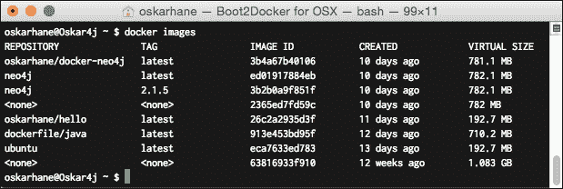

镜像可以分发不同的版本供我们选择，这个机制被称为**标签**。前面的截图通过**neo4j**镜像展示了**latest**和**2.1.5**标签。这是拉取特定标签镜像的命令示例：

```
docker pull ubuntu:14.04
docker pull ubuntu:12.02

```

# Docker 容器

当我们执行`docker run imagename`时，会创建一个 Docker 容器。在所有镜像层之上，添加了一个可写层。这个层上有在 CPU 上运行的进程，并且可以有两种不同的状态：运行中或已退出。这就是容器。当我们通过 Docker 运行命令启动一个容器时，它进入运行状态，直到因为某种原因停止，或者被我们停止，然后进入退出状态。

当我们有一个容器正在运行时，对其文件系统所做的所有更改都是在启动和停止之间保持永久的。请记住，对容器文件系统所做的更改不会写入底层的 Docker 镜像。

我们可以从同一个镜像启动任意多个容器实例，它们将彼此并排运行，并且完全隔离。我们对容器所做的所有更改仅限于该容器本身。

如果对容器的底层镜像进行了更改，运行中的容器不会受到影响，并且不会自动更新。如果我们想要将容器更新为其镜像的新版本，我们必须小心，确保正确设置了数据结构，否则可能会丢失容器中的所有数据。本书稍后会向你展示如何在没有丢失数据风险的情况下存储重要数据。

对应的截图如下所示：

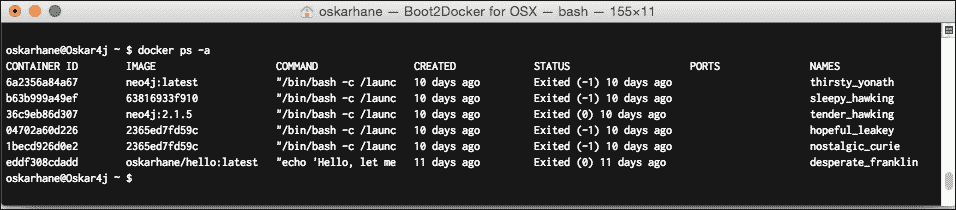

一个由 64 个字符组成的十六进制字符串被称为 **容器 ID**，它用于标识 Docker 容器。这个 ID 在与容器交互时可以使用，并且根据我们运行的容器数量，通常只需要输入容器 ID 的前四个字符。我们也可以使用容器的名称，但通常输入 ID 的前几个字符更方便。

# Docker 命令行界面

命令行界面是我们与守护进程使用 Docker 命令进行通信的地方。Docker 守护进程是后台进程，它接收我们输入的命令。

在上一章中，我们运行了一些 Docker 命令来启动和停止容器，并列出容器和镜像。现在，我们将学习一些更多的命令，这些命令将帮助我们在处理 PaaS 容器时，具体如下：

+   `docker logs <container-ID|name>`：所有写入到 `STDOUT` 的容器信息都将被记录在文件中，通过此命令可以访问。这是从容器内部输出信息的一个非常方便的方式，如下所示：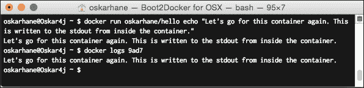

+   `docker export <container-ID|name>`：如果你有一个容器包含你想要导出的数据，可以使用这个命令。它会创建一个 tar 存档并将其发送到 `STDOUT`：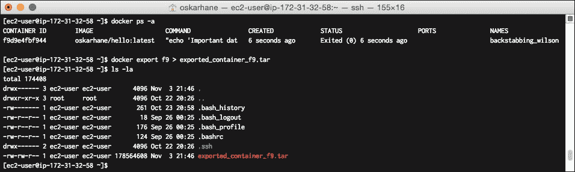

+   `docker cp CONTAINER:PATH HOSTPATH`：如果你不想导出整个容器文件系统，而只想导出某个目录或文件，你可以使用 `docker cp`，而不是 `export`，如下截图所示：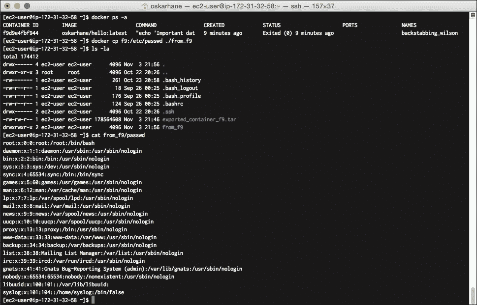

# Docker 注册中心 Hub

Docker 流行的一个重要原因是它的社区，以及你可以轻松分享、查找和扩展 Docker 镜像的方式。其核心平台是 Docker 注册中心 Hub，可以在 [`hub.docker.com/`](https://hub.docker.com/) 找到。

## 浏览仓库

在这里，我们可以搜索并以多种方式浏览镜像仓库，找到我们需要的内容。如果查看流行的镜像，我们可以看到其他人使用最多的镜像。

如果我们点击 Ubuntu 仓库，我们会看到很多关于该镜像的信息，包括可用的标签、用户评论、它的星标数量以及最后更新时间。

截图显示如下：

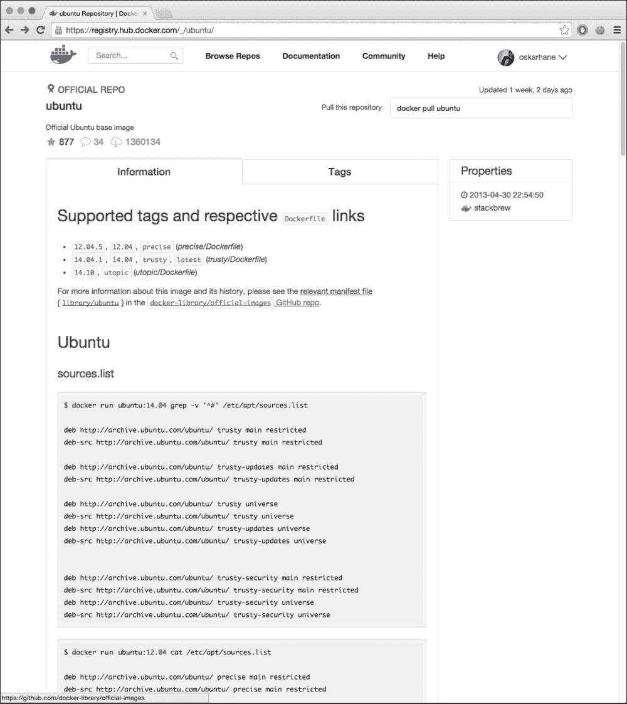

如果我们点击主视图中的标签，我们将看到一个叫做 `Dockerfile` 的文件。这是镜像描述文件，它在镜像创建时运行。在本书的后面，我们也会自己写一个。

如果你对 Docker Hub 上的某个镜像感兴趣，我建议你阅读它的 Information/README 文件，以及其他用户的评论。通常，你会在其中找到有价值的信息，帮助你选择正确的镜像，并展示如何按照维护开发者的意图运行它。

通常，你会发现一些镜像几乎符合你的需求，因为大多数镜像都非常通用，但作为开发者，你可能需要安装特定的设置或服务。

## 探索发布的镜像

以官方的 WordPress Docker 镜像为例（[`registry.hub.docker.com/_/wordpress/`](https://registry.hub.docker.com/_/wordpress/)）。你可以在 Docker Hub 的浏览页面上找到它，或者直接搜索。

现在先不考虑这些缺点，看看信息页面上说了些什么：

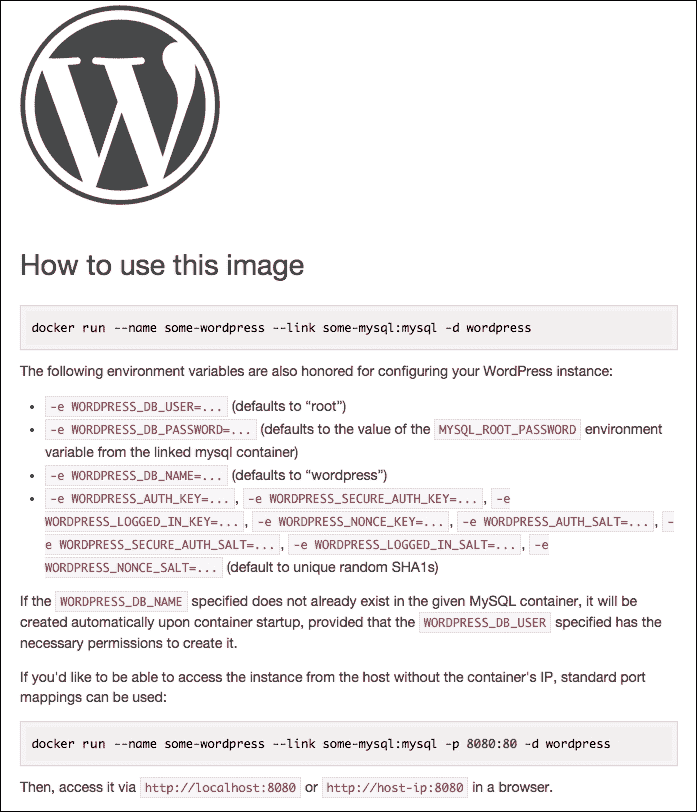

这个镜像会读取 Docker 容器的环境变量。这意味着镜像必须通过使用 `docker run –e` 命令注入环境变量，或者你可以 `--link` 另一个容器到它，并注入这些变量。我们将在本书后面讨论容器链接。

让我们看看如果拉取这个镜像会得到什么。点击 Apache 目录中的 Dockerfile 链接：

```
FROM php:5.6-apache

RUN a2enmod rewrite

# install the PHP extensions we need
RUN apt-get update && apt-get install -y libpng12-dev libjpeg-dev && rm -rf /var/lib/apt/lists/* \
 && docker-php-ext-configure gd --with-png-dir=/usr --with-jpeg-dir=/usr \
 && docker-php-ext-install gd
RUN docker-php-ext-install mysqli

VOLUME /var/www/html

ENV WORDPRESS_VERSION 4.1.1
ENV WORDPRESS_UPSTREAM_VERSION 4.1.1
ENV WORDPRESS_SHA1 15d38fe6c73121a20e63ccd8070153b89b2de6a9

# upstream tarballs include ./wordpress/ so this gives us /usr/src/wordpress
RUN curl -o wordpress.tar.gz -SL https://wordpress.org/wordpress-${WORDPRESS_UPSTREAM_VERSION}.tar.gz \
 && echo "$WORDPRESS_SHA1 *wordpress.tar.gz" | sha1sum -c - \
 && tar -xzf wordpress.tar.gz -C /usr/src/ \
 && rm wordpress.tar.gz

COPY docker-entrypoint.sh /entrypoint.sh

# grr, ENTRYPOINT resets CMD now
ENTRYPOINT ["/entrypoint.sh"]
CMD ["apache2-foreground"]

```

好的，我们看到它基于 Debian Wheezy，并安装了 Apache2、PHP5 和一些其他的东西。之后，它设置了一些环境变量，然后下载了 WordPress。

我们看到几行以 `COPY` 命令开头。这意味着文件随 Docker 镜像一起传送，并在容器启动时复制到容器内部。这就是 WordPress 镜像随附的 `docker-apache.conf` 文件的样子：

```
<VirtualHost *:80>
 DocumentRoot /var/www/html
 <Directory /var/www/html>
 AllowOverride all
 </Directory>
</VirtualHost>
# vim: syntax=apache ts=4 sw=4 sts=4 sr noet

```

上面的代码行告诉 Apache 在哪里查找文件。

那么 `docker-entrypoint.sh` 文件呢？

`ENTRYPOINT` 关键字告诉 Docker 守护进程，如果没有指定其他内容，那么每次运行容器时都应该执行这个文件。就好像整个容器是一个可执行文件一样。

如果我们看看这个文件的内容，我们会发现它基本上是设置了与 MySQL 数据库的连接，并配置了 `.htaccess` 和 WordPress：

```
#!/bin/bash
set -e
if [ -z "$MYSQL_PORT_3306_TCP" ]; then
 echo >&2 'error: missing MYSQL_PORT_3306_TCP environment variable'
 echo >&2 '  Did you forget to --link some_mysql_container:mysql ?'
 exit 1
fi

```

首先检查的是用户是否为 MySQL 连接设置了环境变量。如果没有，它将退出并将一些信息写入 `STDERR`。

你不妨尝试一下，看看你是否能触发写入 `STDERR` 的 MySQL 错误，错误信息是 **error: missing MYSQL_PORT_3306_TCP environment variable**，如以下所示：

```
docker run –-name some-wordpress –d wordpress

```

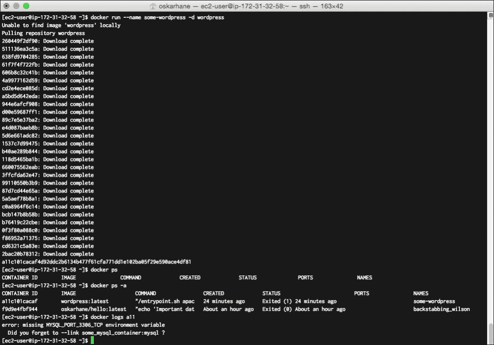

`--name some-wordpress` 命令为容器命名，这样我们以后可以通过这个名字引用它。此外，`–d` 参数告诉容器在分离模式下运行，这意味着它不再接受我们启动它时发出的命令。最后的 `wordpress` 参数是我们要运行的 Docker 镜像名称。

如果我们查看新容器的日志，就会看到截图所示的错误信息。

让我们运行一个 MySQL 容器，看看是否能让它正常工作。访问 [`registry.hub.docker.com/_/mysql/`](https://registry.hub.docker.com/_/mysql/) 来访问 Docker 注册表中心的官方 MySQL 镜像库。在这里，它指出为了启动 MySQL 实例，我们需要在 shell 中执行 **docker run --name some-mysql -e MYSQL_ROOT_PASSWORD=mysecretpassword -d mysql**。由于我们目前只是为了教育目的，因此不需要选择一个强密码作为 root 用户密码。在下载一些依赖镜像后，我们应该能够通过执行 `docker ps` 来看到我们正在运行的容器。如果看到，使用 `docker logs some-mysql` 查看安装日志，如下所示：

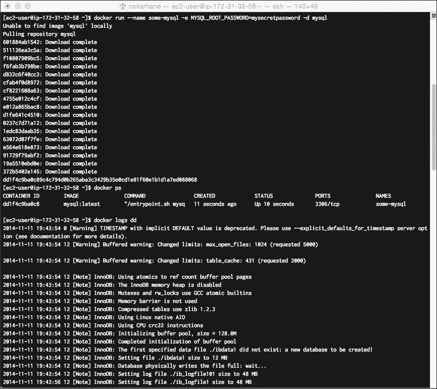

很棒，现在我们有了一个运行中的 MySQL 容器，它是启动 WordPress 实例所需要的。让我们在 MySQL 链接就位的情况下启动一个新的 WordPress 实例：

```
docker run --name some-wordpress --link some-mysql:mysql –p 80 -d wordpress

```

`--link` 参数通过将环境变量注入到 `some-wordpress` 容器中，暴露 `some-mysql` 容器的环境变量、接口和暴露端口。

要打开一个可以从外部访问的端口，通过 `–p 80` 参数暴露端口 80。

如果你收到如下错误信息 **Error response from daemon: Conflict, The name some-wordpress is already assigned to a11c101cacaf.**，你需要删除（或重命名）该容器，才能再次将 `some-wordpress` 分配给容器。你需要给新容器起一个新名字，或删除旧的（失败的）WordPress 容器。调用 `docker rm some-wordpress` 删除旧容器并使用所需的名称。

当容器正在运行时，调用 `docker ps` 命令以找出我们的端口是如何分配给容器的私有端口 80。

我们可以查看容器列表中的端口栏，或者可以通过调用 `docker port some-wordpress 80` 明确查找，如下所示：

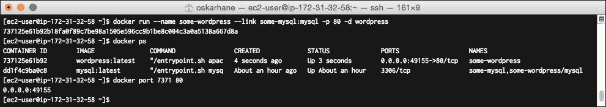

在我的案例中，它是端口**49155**。

在你的网页浏览器中输入 Docker 主机的**ip:port**，查看是否能访问它。如果你使用的是 Windows 或 OS X 本地计算机，可以通过调用 `boot2docker ip` 查找 Docker IP。如果你使用的是本地 Linux，**127.0.0.1** 应该可以。

我是在 Amazon EC2 上进行的操作，所以我需要进入 EC2 管理控制台获取我的公共 IP 或公共 DNS。

在浏览器中输入 `http://yourip:yourport`（在我的案例中是 `http://myamazon-dns.com:49155`），你应该会看到这个界面：

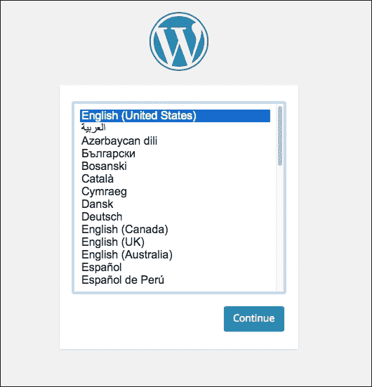

### 注意

默认的 Amazon AWS 安全策略会阻止默认的 Docker 公共端口，因此我们需要在 EC2 控制台的**安全组**部分进行更改。有关如何操作，请参见 第一章中的 *Docker 在 Amazon EC2 上* 部分，*安装 Docker*。

太棒了，成功了！

# 概要

Docker 镜像可以视为容器的只读模板，指定了在容器启动时需要安装、复制、配置和暴露的内容。

我们进一步了解了如何与 Docker 守护进程及单独的 Docker 容器进行交互，以读取日志、复制文件并导出完整的文件系统。

介绍了 Docker Hub，我们查看了官方 WordPress Docker 镜像的构成，以及它们如何在 Dockerfile 和一定程度上在 `ENTRYPOINT` 文件中配置操作系统。

我们下载并运行了预期失败的 WordPress 镜像，之后通过将所需的 MySQL 容器与之链接修复了它。

在下一章，我们将创建一个 Dockerfile，并将 Docker 镜像发布到 Docker 注册中心，以便我们能够将定制的 Docker 镜像传输到我们决定放置 PaaS 的任何地方。
