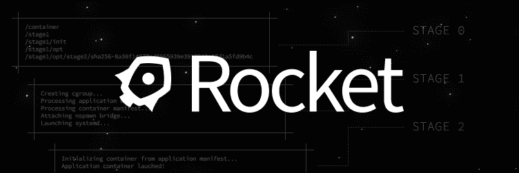

# 第八章. 接下来是什么？

到目前为止，我们的 PaaS 在单个主机上运行，如果需要扩展，这可能会成为一个问题。这个领域有很多进展，我挑选了一些项目将在本章中介绍。这些项目在成熟度上差异很大，有的已经可以投入生产使用，而有的仍处于原型阶段。在本章中，我们将涵盖以下主题：

+   什么是十二要素应用？

+   Flynn

+   Deis

+   火箭

+   编排工具

# 什么是十二要素应用？

今天的许多应用程序，实际上都是您在网页浏览器中运行的 Web 应用程序。Gmail、Slack、Wunderlist、Trello 等都属于 Web 应用或软件即服务。

正是这种类型的应用程序适合在 PaaS 上运行。

十二要素应用是一种构建软件即服务应用的方法论，符合以下标准：

+   使用声明性格式设置自动化，并最小化新加入项目的开发人员的时间和成本

+   与底层操作系统有一个清晰的契约，提供在执行环境之间的最大可移植性

+   适合部署在现代云平台上，避免了对服务器和系统管理的需求

+   最小化开发与生产之间的差异，实现最大敏捷性的持续部署

+   在不对工具、架构或开发实践做出重大改变的情况下进行扩展

十二要素定义如下：

+   **代码库**（一个代码库在版本控制中追踪，多个部署）：将您的代码放在版本控制系统中，例如 Git。

+   **依赖关系**（显式声明并隔离依赖关系）：这会列出您的应用程序依赖的所有库的所有版本，并将其集中在一个地方。

+   **配置**（将配置存储在环境中）：由于配置会在不同环境之间变化，例如数据库的用户名或密码，它不应成为代码的一部分。您可以将配置文件设置在环境变量中，并让您的应用程序在运行时读取它们。

+   **后台服务**（将后台服务视为附加资源）：这些包括所有后台服务，如邮件服务器、数据库和缓存系统等。这些将通过 URL 端点进行引用。这样，您的代码就不必关心后台服务是运行在同一台机器上，还是跨越全球。

+   **构建、发布、运行**（严格区分构建和运行阶段）：构建阶段创建包、资产和二进制文件。这是开发人员的工作。当您将一个包放置到服务器上时，您就准备进入运行阶段，启动应用程序并使其在服务器上可用。这个阶段应该尽可能简单，以便任何人都可以执行。

+   **进程**（将应用程序作为一个或多个无状态进程执行）：正如本书前面所述，您应该将应用程序数据与应用程序服务分开，也就是说，这使得服务成为无状态的。所有状态应该存储在共享存储和数据库中。

+   **端口绑定**（通过端口绑定导出服务）：例如，后台服务；你的服务应该可以通过 URL 端点访问。

+   **并发性**（通过进程模型进行扩展）：这保持每个进程都是一个独立的服务。这样，你可以仅扩展那些真正需要扩展的应用程序部分。

+   **可处置性**（通过快速启动和优雅关闭最大化健壮性）：这是针对应用程序启动的要求，启动应该快速，且你的应用程序应该能够自行从崩溃中恢复。

+   **开发/生产一致性**（保持开发、暂存和生产环境尽可能相似）：这使得你的开发环境和设置尽可能与生产环境和设置一致。Docker 在这一点上表现尤为出色。

+   **日志**（将日志视为事件流）：将应用程序的错误日志放置在一个集中位置，在出现新错误时会收到通知。

+   **管理进程**（将管理/维护任务作为一次性进程运行）：如果你在做管理任务，将它们运行在生产环境中的一台机器上，且该机器使用的是最新的代码库。你应该直接对数据库运行查询。

我鼓励你访问[`12factor.net`](http://12factor.net)以便阅读更多关于十二因子的内容。这是一个很好的阅读，你会理解为什么在以下项目中做出了一些设计决策。

# Flynn

创建 Dokku 的那位人，Jeff Lindsay，也共同创建了 Flynn。Flynn 就像一个超级 Dokku，除了其他功能外，它允许你在多个主机上运行 PaaS。

> *“Flynn 有两个特性：*
> 
> *一个组件的发行版，开箱即用地为公司提供一个合理的起点，用于构建运行其应用程序和服务的内部平台。*
> 
> *一组独立项目的横幅，这些项目一起构成了构建分布式系统的工具包或松散框架。*
> 
> *Flynn 既是一个整体，也是许多部分，这取决于对你最有用的是什么。共同的目标是将多年构建分布式系统的经验和最佳实践民主化。它是操作员和开发者之间的软件层，使他们的工作更轻松。*

我尝试过几次使用 Flynn，但总是回到使用 Dokku，因为我发现 Dokku 更容易使用，而且我的客户不需要像多主机 PaaS 这样的额外功能。

URL：[`flynn.io`](http://flynn.io)

状态：由于处于测试阶段，因此不适合在生产环境中使用。

# Deis

Deis 构建在一个轻量级的 Linux 发行版上，旨在运行容器，名为 CoreOS，并基于 Docker，利用那里提供的分布式服务，如 etcd。

> *“Deis 是一个轻量级的应用平台，将十二因子应用作为 Docker 容器部署并扩展，在一组 CoreOS 机器上运行。”*

我发现 Deis 是一个非常有前景的项目，想要更深入地使用它。我目前仅仅了解了一些，但到目前为止看到的效果不错。

Deis 可以使用 Docker 部署在 Linux 上运行的任何语言或框架，还包括 Heroku 的构建包，支持 Ruby、Python、Node.js、Java、Clojure、Scala、Play、PHP、Perl、Dart 和 Go。

工作流程类似于 Heroku，你只需部署十二因子应用，也就是将应用状态保存在后端服务中。

**有趣的事实**：Deis 在财政上支持/资助 Dokku。

**网址**：[`deis.io`](http://deis.io)

**状态**：Deis 从版本 1.0 起已准备好用于生产环境。

# Rocket

CoreOS 一直是运行多主机 Docker PaaS 最流行的方式之一。他们做得非常出色，并构建了一些多主机 PaaS 工具，如 Deis，这些工具使用 CoreOS 的工具和服务来提供他们版本的 PaaS。

2014 年 12 月，CoreOS 团队决定宣布他们自己的容器运行时：Rocket。Rocket 是 Docker 的直接竞争对手。他们推出 Rocket 的原因是因为他们认为 Docker 已经偏离了最初的理念——运行可重用的标准容器。CoreOS 团队认为，Docker 通过增加越来越多的功能和服务，正在逐渐远离最初的理念。

> *“Rocket 是一个新的容器运行时，旨在可组合性、安全性和速度方面进行优化。今天我们在 GitHub 上发布了一个原型版本，开始收集社区反馈，并解释为什么我们要构建 Rocket。”*

根据 CoreOS 团队的说法，他们将继续使 CoreOS 成为运行 Docker 的完美平台。我猜我们将看到未来会发生什么，但我希望他们能坚持自己的承诺。

**网址**：[`github.com/coreos/rocket`](https://github.com/coreos/rocket)

**状态**：Rocket 目前处于非常早期的阶段，尚未准备好用于生产环境。

# 编排工具

我现在介绍的工具是帮助你集中精力编写代码，并为你提供一种轻松将应用部署到生产环境的方法。如果你更感兴趣的是一个编排工具——帮助你管理容器集群的工具——现在也有一些这样的工具可供选择。目前让我想起的工具有 Google 的 Kubernetes、Apache Mesos/Marathon、CoreOS Fleet，以及即将发布的 Docker Swarm。

# 总结

当你觉得是时候将你的 PaaS 从单一主机迁移到多个主机进行扩展时，这些工具正是你应该寻找的。我相信未来会出现一些有竞争力的工具，因为这是一个目前非常热门的领域。
