# 第一章. 镜像与容器

本课程将涵盖有关容器化的基本概念，为我们后续构建的镜像和容器打下基础。我们还将了解 Docker 如何以及为何参与 DevOps 生态系统。在开始之前，我们将了解虚拟化与 Docker 中容器化的区别。

# 课程目标

本课程结束时，您将能够：

+   描述 Docker 如何改善 DevOps 工作流

+   解析 Dockerfile 语法

+   构建镜像

+   设置容器和镜像

+   设置本地动态环境

+   在 Docker 容器中运行应用程序

+   获取关于如何通过 Docker Hub 管理镜像的基本概述

+   将 Docker 镜像部署到 Docker Hub

# 虚拟化与容器化

这个框图概述了典型的虚拟机设置：

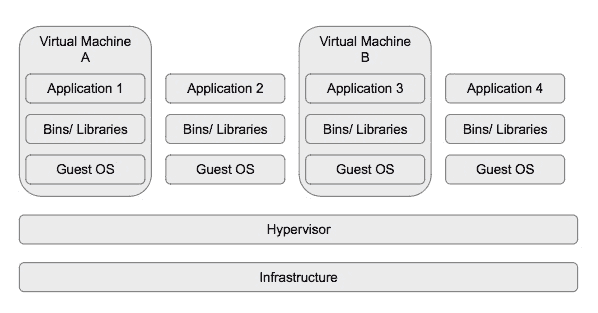

在虚拟机中，物理硬件被抽象化，因此我们可以在一台服务器上运行多个服务器。一个虚拟机监控程序（Hypervisor）帮助实现这一点。

虚拟机有时需要一些时间启动，并且在容量上比较昂贵（它们的大小可以达到 GB 级别），尽管它们相对于容器的最大优势是能够运行不同的 Linux 发行版，如 CentOS，而不仅仅是 Ubuntu：

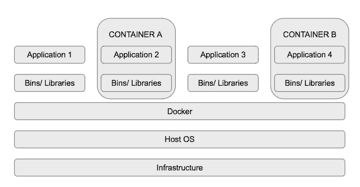

在容器化中，只有应用层（即代码和依赖项打包的地方）被抽象化，这使得多个容器可以在相同的操作系统内核上运行，但在独立的用户空间中。

容器使用更少的空间并且启动速度快。这使得开发变得更容易，因为您可以快速删除和启动容器，而无需考虑服务器或开发人员工作空间的大小。

让我们通过简要概述 Docker 在 DevOps 工作流和 Docker 环境中的作用来开始本课程。

# Docker 如何改善 DevOps 工作流

DevOps 是一种思维方式，一种文化，以及一种思考方式。最终目标是尽可能地提高和自动化流程。用通俗的话来说，DevOps 要求人们从最懒的角度思考，将大部分，甚至是所有流程尽可能自动化。

Docker 是一个开源容器化平台，改善了开发生命周期中软件交付的过程。请注意，它既不是现有平台的替代品，也不是组织希望它成为替代品。

Docker 抽象了配置管理的复杂性，类似于 Puppet。通过这种设置，shell 脚本变得不再必要。Docker 还可以在小型或大型部署中使用，从一个简单的 Hello World 应用到一个完整的生产服务器。

作为不同级别的开发者，无论是初学者还是专家，您可能已经使用过 Docker，而您可能并没有意识到。如果您已经设置了一个持续集成管道来在线运行测试，大多数服务器都使用 Docker 来构建和运行您的测试。

由于 Docker 的灵活性，它在技术社区中获得了广泛支持，因此许多组织开始为其服务运行容器。这些组织包括以下几家：

+   持续集成和持续交付平台，如 Circle CI、Travis CI 和 Codeship

+   云平台如 **Amazon Web Services** **(AWS)** 和 **Google Cloud Platform** **(GCP)** 允许开发者从容器中运行应用程序

+   思科和阿里巴巴集团也在容器中运行他们的一些服务

Docker 在 DevOps 工作流中的作用包括但不限于以下几点：

### 注意

Docker 在开发工作流中的应用案例示例。

统一需求意味着使用单一配置文件。Docker 将需求抽象化并限制为一个 Dockerfile 文件。

操作系统的抽象意味着我们不需要担心构建操作系统，因为已经存在预构建的镜像。

Velocity 必须定义一个 Dockerfile 并构建容器进行测试，或者直接使用已经构建好的镜像，而无需编写 Dockerfile。Docker 使开发团队能够避免因为“自动化工具 X”过于复杂而需要投入大量学习曲线的成本。

## Docker 环境回顾

我们之前已经介绍了容器化的基本概念。让我再强调一下 Docker 为我们带来的替代工作流。

通常，我们有两个组成部分来构建一个有效的应用程序：项目代码库和配置脚本。代码库是应用程序代码，它由版本控制管理，并托管在 GitHub 等平台上。

配置脚本可以是一个简单的 shell 脚本，在主机机器上运行，该机器可以是从 Windows 工作站到云中的完全专用服务器的任何地方。

使用 Docker 并不会干扰项目代码库，而是在配置方面进行创新，改善工作流和交付速度。以下是 Docker 如何实现这一点的示例设置：

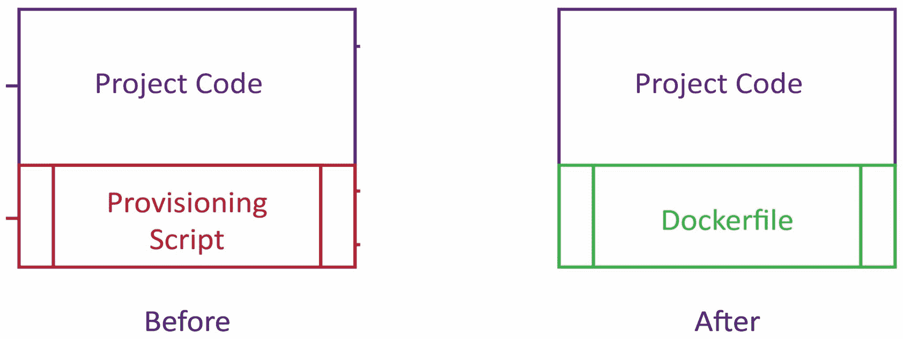

**Dockerfile** 取代了配置脚本。两者结合（项目代码和 Dockerfile）构成了 **Docker 镜像**。一个 Docker 镜像可以作为一个应用程序运行。这个从 Docker 镜像启动的运行应用程序被称为 **Docker 容器**。

Docker 容器允许我们在计算机上运行应用程序，且该环境是完全新的、一次性的。这意味着什么呢？

这意味着我们能够在计算机上声明并运行 Linux 或任何其他操作系统，然后在其中运行我们的应用程序。这也强调了我们可以无限次地构建和运行容器，而不会干扰我们计算机的配置。

通过这点，我向你介绍了四个关键字：**镜像**、**容器**、**构建** 和 **运行**。接下来我们将深入探讨 Docker CLI 的细节。

# 基本的 Docker 终端命令

打开命令提示符，检查 Docker 是否已安装在你的工作站中。输入 `docker` 命令，终端应显示以下内容：

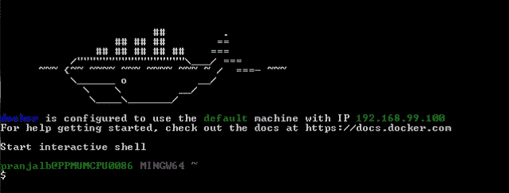

这是 Docker 可用子命令的列表。要了解每个子命令的作用，在终端输入 `docker-subcommand –help`：

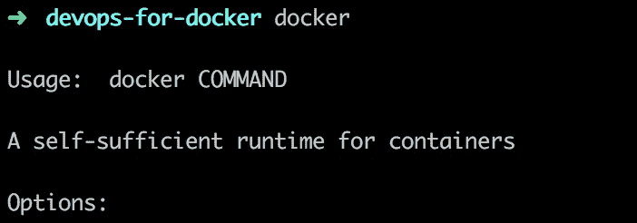

运行 `docker info` 并注意以下内容：

+   容器

+   镜像

+   服务器版本

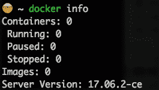

这个命令显示系统范围的信息。服务器版本号在某些时候很重要，尤其是当新版本引入了不兼容的内容时。Docker 为其社区版提供了稳定版和边缘版。

现在我们将查看一些常用命令。

这个命令从 **Docker Hub** 搜索镜像：

```
docker search <term> (for example, docker search ubuntu)
```

Docker Hub 是默认的 Docker 注册表。Docker 注册表保存命名的 Docker 镜像。Docker Hub 基本上是“Docker 镜像的 GitHub”。之前，我们看过如何在不构建容器的情况下运行 Ubuntu 容器；这里存储并版本化了 Ubuntu 镜像：

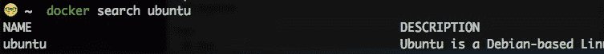

“有私有 Docker 注册表，了解这一点很重要。”? Docker Hub 位于 [hub.docker.com](http://hub.docker.com)。一些镜像托管在 [store.docker.com](http://store.docker.com)，但 Docker Store 包含官方镜像。然而，它主要关注 Docker 镜像商店的商业化方面，并提供工作流程。

注册页面如下所示：

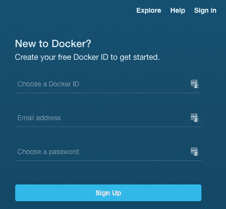

登录页面如下所示：

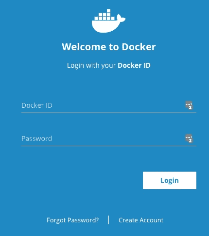

从结果中，你可以通过星标数量了解用户如何评价该镜像。你还可以看出该镜像是否为官方镜像。这意味着该镜像是由注册表推荐的，在这种情况下是 Docker Hub。建议新用户使用官方镜像，因为它们有很好的文档，安全，推广最佳实践，并且适用于大多数使用场景。一旦你选定了一个镜像，你就需要将其保存在本地。

### 注意

确保你能够从 Docker Hub 搜索到至少一个镜像。镜像种类从操作系统到库都有，例如 Ubuntu、Node.js 和 Apache。

这个命令允许你从 Docker Hub 搜索：

```
docker search <term>

```

例如，`docker search ubuntu`。

这个命令从注册表拉取镜像到你的本地机器：

```
docker pull

```

例如，`docker pull ubuntu`。

一旦这个命令开始运行，你会注意到它正在使用默认标签：`latest`。在 Docker Hub 中，你可以看到标签的列表。对于 **Ubuntu**，它们列在这里：[`hub.docker.com/r/library/ubuntu/`](https://hub.docker.com/r/library/ubuntu/) 以及它们各自的 Dockerfiles：

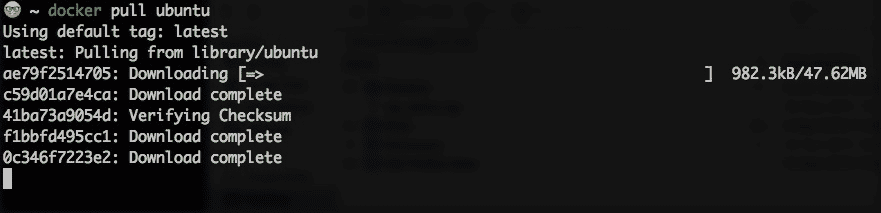

从 Docker Hub 下载 Ubuntu 镜像配置文件：[`hub.docker.com/r/library/ubuntu/`](https://hub.docker.com/r/library/ubuntu/)。

## 活动 1 — 使用 docker pull 命令

让你熟悉`docker pull`命令。

本次活动的目标是通过运行列出的命令，并在探索过程中通过操作构建的容器，帮助你牢固掌握`docker-pull` CLI，同时还可以查找其他命令的帮助。

1.  Docker 是否正常运行？在终端或命令行应用中输入`docker`。

1.  该命令用于从 Docker Hub 拉取镜像`。`

    ```
    docker pull

    ```

镜像种类从操作系统到库不等，例如 Ubuntu、Node.js 和 Apache。该命令允许你从 Docker Hub 拉取镜像：

例如，`docker pull ubuntu`。

该命令列出我们本地拥有的 Docker 镜像：

+   `docker images`

当我们运行该命令时，如果我们已经从 Docker Hub 拉取了镜像，我们将能看到一份镜像列表：

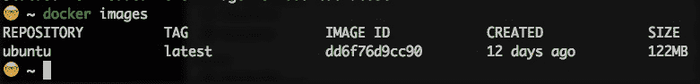

它们会根据仓库、标签、镜像 ID、创建日期和大小列出。如果镜像是从其他仓库获取的，仓库名将是镜像名称，除非它来自不同的注册中心。在这种情况下，你将看到没有`http://`和**顶级域名（TLD）**的 URL，如`>registry.heroku.com/<image-name>`，这是来自 Heroku 注册中心的镜像。

该命令将检查名为`hello-world`的镜像是否存在本地：

```
docker run <image>

```

例如，`docker run hello-world`：

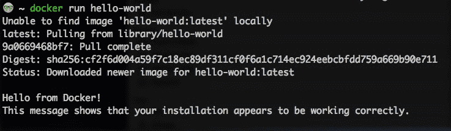

如果镜像不在本地，它将默认从 Docker Hub 拉取，并作为容器运行。

该命令列出正在运行的容器：

```
docker ps
```

如果没有正在运行的容器，你应该看到一个空白屏幕，显示以下标题：

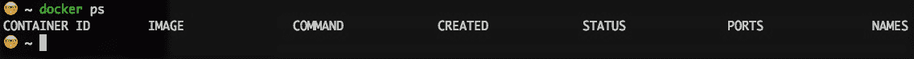

## 活动 2 — 分析 Docker CLI

确保通过在终端中输入`docker`来启动 Docker CLI。

你被要求展示迄今为止涵盖的命令。

让你熟悉 Docker CLI。本次活动的目标是通过运行列出的命令，并在探索过程中通过操作构建的容器，帮助你牢固掌握`docker-compose` CLI，同时还可以查找其他命令的帮助。目标是能够灵活使用 CLI，以便在实际场景中应用，如运行自动化脚本。

1.  Docker 是否正常运行？在终端或命令行应用中输入`docker`。

1.  使用 CLI 搜索官方的 Apache 镜像，使用`docker search apache:`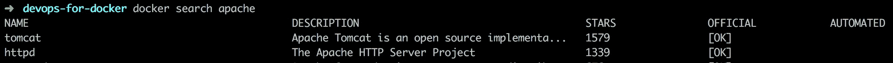

1.  尝试使用`docker pull apache`拉取镜像。

1.  使用`docker images`确认镜像是否在本地可用。

1.  奖励：使用`docker run apache`将镜像作为容器运行。

1.  奖励：使用`docker stop <container ID>`停止容器。

1.  奖励：使用`docker rm <container ID>`删除容器和镜像。

# Dockerfile 语法

每个 Docker 镜像都从**Dockerfile**开始。要创建一个应用程序或脚本的镜像，只需创建一个名为**Dockerfile**的文件。

### 注意

它没有扩展名，并且以大写字母 D 开头。

Dockerfile 是一个简单的文本文件，其中写入了构建容器的所有命令。Dockerfile 总是从基础镜像开始。它包含创建应用程序或运行脚本的步骤。

在构建之前，让我们快速浏览一些编写 Dockerfiles 的最佳实践。

一些最佳实践包括但不限于以下内容：

+   **关注点分离**：确保每个 Dockerfile 尽可能专注于一个目标。这将使其更容易在多个应用中重复使用。

+   **避免不必要的安装**：这将减少复杂性，并使镜像和容器足够紧凑。

+   **重用已经构建的镜像**：Docker Hub 上有许多已构建并版本化的镜像；因此，建议通过导入来重用这些镜像，而不是重新实现已有的镜像。

+   **限制层数**：最少的层数可以让构建更加紧凑或小巧。内存是构建镜像和容器时需要考虑的关键因素，因为这也会影响到镜像的使用者或客户端。

我们将从简单的 Python 和 JavaScript 脚本开始。选择这些语言是因为它们的流行性和易于演示的特点。

## 为 Python 和 JavaScript 示例编写 Dockerfiles

### 注意

对所选语言不需要任何先前的经验，因为这些语言旨在动态展示任何语言如何采用容器化。

### Python

在我们开始之前，创建一个新的目录或文件夹；让我们将其作为工作区。

打开目录并运行`docker search python`。我们选择官方镜像：`python`。官方镜像在**OFFICIAL**列中标注为**[OK]**：

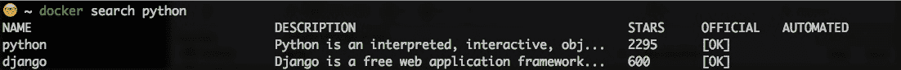

访问[hub.docker.com](http://hub.docker.com)或[store.docker.com](http://store.docker.com)，搜索 python 以获取正确的标签，或者至少了解带有最新标签的 Python 镜像的版本。我们将在*主题 D*中更多讨论标签。

镜像标签应为类似`3.x.x`或`3.x.x-rc`的语法格式。

创建一个名为`run.py`的文件，并在第一行输入以下内容：

```
print("Hello Docker - PY")
```

在同一文件夹级别创建一个新文件，并命名为**Dockerfile**。

### 注意

我们没有为 Dockerfile 提供扩展名。

在**Dockerfile**中添加以下内容：

```
FROM python
ADD . .
RUN ls
CMD python run.py
```

如前所述，**FROM**命令指定基础镜像。

该命令也可以从**继承**的角度使用。这意味着，如果已有包含所需软件包的镜像，就不必在 Dockerfile 中再包括额外的软件包安装。

**ADD** 命令将源文件复制到镜像文件系统中的目标位置。这意味着脚本的内容将被复制到指定的目录。

在这种情况下，因为 `run.py` 和 Dockerfile 在同一层级，所以 `run.py` 被复制到我们构建的基础镜像文件系统的工作目录中。

**RUN** 命令是在构建镜像时执行的。这里运行 `ls` 只是为了让我们查看镜像文件系统的内容。

**CMD** 命令在基于我们将要使用这个 Dockerfile 创建的镜像运行容器时使用。这意味着在 Dockerfile 执行结束时，我们打算运行一个容器。

### JavaScript

退出当前目录并创建一个新目录。这个目录将展示一个 Node 应用程序。

在脚本中添加以下行并保存：

```
console.log("Hello Docker - JS")
```

运行 `docker search node` —— 我们将选择官方镜像：`node`

记住，官方镜像在 **OFFICIAL** 列中有 **[OK]** 的标记：

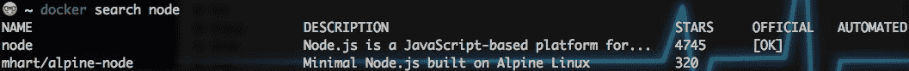

请注意，Node 是基于 Google 高性能、开源的 JavaScript 引擎 V8 的 JavaScript 运行时。

访问 [hub.docker.com](http://hub.docker.com) 并搜索 Node，以获取正确的标签，或者至少了解带有最新标签的 Node 镜像的版本。

创建一个新的 **Dockerfile** 并添加以下内容：

这应该与脚本在同一文件级别。

```
FROM node
ADD . .
RUN ls
CMD node run.js

```

我们先覆盖这些内容。

## 活动 3 — 构建 Dockerfile

确保通过在终端中输入 `docker` 来运行 Docker CLI。

让你熟悉 Dockerfile 语法。本活动的目标是帮助理解和实践使用第三方镜像和容器。这有助于更大程度地理解容器化如何影响协作。通过构建已有的功能或资源，可以加快产品交付速度。

你被要求编写一个简单的 Dockerfile，打印 `hello-world`。

1.  Docker 是否正在运行？在终端或命令行应用程序中输入 `docker`。

1.  创建一个新目录并创建一个新的 Dockerfile。

1.  编写一个包含以下步骤的 Dockerfile：

    ```
    FROM ubuntu:xenial 
    RUN apt-get install -y apt-transport-https curl software-properties-common python-software-properties
    RUN curl -fsSL https://apt.dockerproject.org/gpg | apt-key add 
    RUN echo 'deb https://apt.dockerproject.org/repo ubuntu-xenial main' > /etc/apt/sources.list.d/docker.list
    RUN apt-get update
    RUN apt-get install -y python3-pip
    RUN apt-get install -y build-essential libssl-dev libffi-dev python-dev

    ```

# 构建镜像

在我们开始构建镜像之前，先理解一下上下文。镜像是一个独立的包，可以运行应用程序或分配的服务。镜像是通过 Dockerfile 构建的，Dockerfile 是定义镜像构建方式的模板。

容器被定义为镜像的运行时实例或版本。注意，这将在你的计算机或主机上作为一个完全隔离的环境运行，这使得它可以被丢弃并用于像测试这样的任务。

Dockerfile 准备好后，让我们进入 Python Dockerfile 目录并构建镜像。

## docker build

构建镜像的命令如下：

```
docker build -t <image-name> <relative location of the Dockerfile>
```

`-t` 代表标签。`<image-name>` 可以包括特定标签，比如 latest。建议你按照这种方式操作：始终为镜像打标签。

**Dockerfile 的相对位置** 这里会用一个 `点 (.)` 来表示 Dockerfile 与代码在同一层级；也就是说，它位于项目的根目录。如果不是这种情况，你需要进入 Dockerfile 所在的目录。

例如，如果它在 Docker 文件夹中，你会使用 `docker build -t <image-name> docker`，或者如果它在比根目录更高的文件夹中，你会使用两个点。如果它在比根目录更高两层的文件夹中，则使用三个点代替一个点。

### 注意

终端上的输出与你在 Dockerfile 中写的步骤进行对比。你可能想要有两个或更多 Dockerfile 来配置不同的情况，例如，一个 Dockerfile 用于构建生产就绪的应用，另一个用于测试。不管你有什么理由，Docker 都有解决方案。

默认的 Dockerfile 名称是 Dockerfile。按照最佳实践，任何额外的 Dockerfile 会命名为 `Dockerfile.<name>`，比如，`Dockerfile.dev`。

要使用非默认的 Dockerfile 构建镜像，请运行以下命令：`docker build -f Dockerfile.<name> -t <image-name> <Dockerfile 的相对位置>`

### 注意

如果你在 Dockerfile 中进行了修改后重新构建镜像，但没有指定不同的标签，那么将会构建一个新的镜像，且之前的镜像会被命名为`<none>`。

`docker` build 命令有多个选项，你可以通过运行 `docker build --help` 来查看。使用类似 latest 的标签来标记镜像也用于版本控制。我们将在 *主题 F* 中详细讨论这个问题。

要构建镜像，请在 Python 工作空间中运行以下命令：

```
>$ docker build -t python-docker .

```

### 注意

这里的尾部点是语法中一个重要的部分：

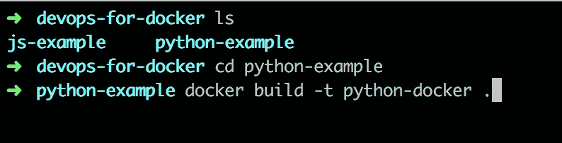

### 注意

这里的尾部点是语法中一个重要的部分：

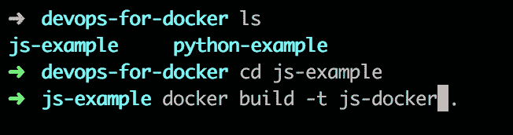

打开 JavaScript 目录并按如下方式构建 JavaScript 镜像：

```
>$ docker build -t js-docker .

```

运行这些命令将根据 **Dockerfile** 中的四行命令概述四个步骤。

运行 `docker images` 会列出你创建的两个镜像以及你之前拉取的任何其他镜像。

## 移除 Docker 镜像

`docker rmi <image-id>` 命令用于删除镜像。提醒你，镜像 ID 可以通过运行 `docker images` 命令找到。

要删除未标记的镜像（假设它们不相关），掌握 bash 脚本编程会派上用场。请使用以下命令：

```
docker rmi $(docker images | grep "^<none>" | awk "{print $3}")
```

这会简单地搜索在 `docker images` 命令的行中包含 `<none>` 的镜像，并返回位于第三列的镜像 ID：

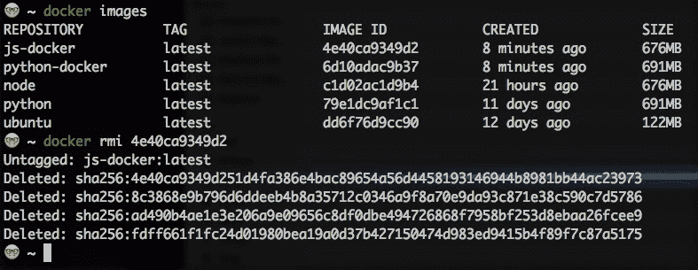

## 活动 4 — 利用 Docker 镜像

确保 Docker CLI 正在运行，可以在终端中输入 `docker` 来检查。

帮助你熟悉从镜像运行容器。

你被要求从 *活动 C* 中编写的 Dockerfile 构建一个镜像。停止正在运行的容器，删除镜像，并使用不同的名称重新构建它。

1.  Docker 是否正在运行？在终端或命令行应用中输入 `docker`。

1.  打开 JavaScript 示例目录。

1.  运行 `docker build -t <选择一个名称>`（观察步骤并记录结果）。

1.  运行 `docker run <你选择的名称>`。

1.  运行 `docker stop <容器 ID>`。

1.  运行 `docker rmi <在此添加镜像 ID>`。

1.  运行 `docker build -t <选择新的名称>`。

1.  运行 `docker ps`（注意结果；旧镜像应该不存在）。

# 从镜像运行容器

还记得我们提到容器是从镜像构建的吗？命令 `docker run <镜像>` 会基于该镜像创建一个容器。可以说，容器是镜像的运行实例。另一个提醒是，这个镜像可以是本地镜像，也可以是从镜像库获取的。

继续运行已经创建的镜像 `docker run python-docker` 和 `docker run js-docker:`

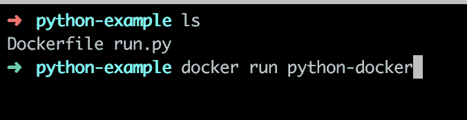

你注意到什么了吗？容器运行时会将输出发送到终端的相应行。注意，在 Dockerfile 中以 CMD 开头的命令就是运行的命令：

```
docker build -t python-docker:test .  and docker build -t js-docker:test .
```

然后，运行以下命令：

```
python-docker:test and docker run js-docker:test
```

### 注意

你在终端上不会看到任何输出。

这不是因为我们没有在容器启动后运行的 `CMD` 命令。对于从 **Python** 和 **Node** 构建的两个镜像，都有一个从基础镜像继承的 `CMD` 命令。

### 注意

创建的镜像始终继承自基础镜像。

我们运行的两个容器包含运行一次后退出的脚本。检查 `docker ps` 的结果时，你不会看到之前运行的两个容器。然而，运行 `docker ps -a` 会显示这些容器及其状态为已退出。

有一个命令列，显示了容器从哪个镜像继承的 CMD。

运行容器时，你可以按如下方式指定名称：

`docker run --name <容器名称> <镜像名称>`（例如，`docker run --name py-docker-container python-docker`）：

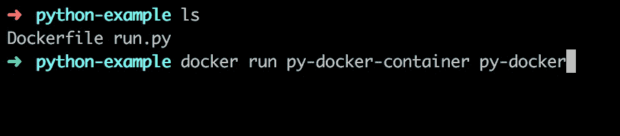

我们之前提到过，你只需要保持相关的 Docker 镜像，而不是带有 `<none>` 标签的 Docker 镜像。

至于容器，你需要注意的是，你可以从一个镜像创建多个容器。`docker rm <容器 ID>` 是删除容器的命令。这个命令适用于已经退出的容器（即不再运行的容器）。

### 注意

对于仍在运行的容器，你需要执行以下操作之一：

在移除容器之前，先停止容器（`docker stop <容器 ID>`）。

强制移除容器（`docker rm <容器 ID> -f`）

如果你运行 `docker ps`，你不会看到任何容器，但如果我们运行 `docker ps -a`，你会发现容器被列出，且它们的命令列将显示继承的 CMD 命令：`python3` 和 `node`：

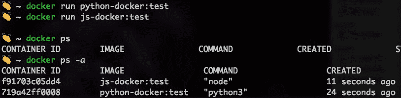

## Python

Python 镜像的 Dockerfile 中的 CMD 是 `python3`。这意味着在容器中运行的是 `python3` 命令，容器执行完后会退出。

### 注意

记住这一点，你就可以在不安装 Python 的情况下运行 Python。

尝试运行这个命令：`docker run -it python-docker:test`（使用我们刚创建的镜像）。

我们进入容器中的交互式 bash shell。`-it` 指示 Docker 容器创建该 shell。该 shell 运行 `python3`，它是 Python 基础镜像中的 CMD：

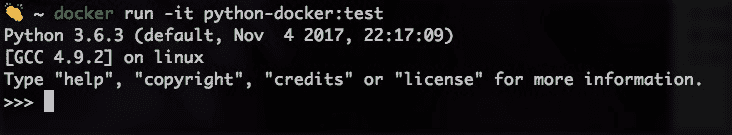

在命令 `docker run -it python-docker:test python3 run.py` 中，`python3 run.py` 会像在容器内的终端中一样运行。请注意，`run.py` 在容器内，因此可以运行。如果使用 `docker run -it python python3 run.py`，则表示没有 `run.py` 脚本：

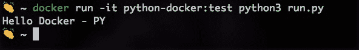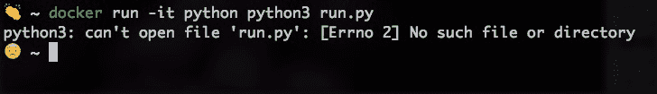

同样的概念也适用于 JavaScript，显示了这一概念在各类技术中的普适性。

`docker run -it js-docker:test`（我们刚创建的镜像）将运行一个节点（节点基础镜像中的 CMD）：

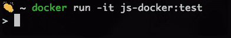

`docker run -it js-docker:test node run.js` 将输出 `Hello Docker - JS:`

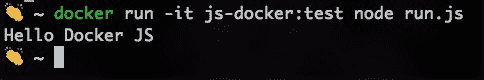

这证明了 Docker 镜像中的继承因素。

现在，恢复 Dockerfile 至其原始状态，并保留 **CMD 命令** 在最后一行。

# 镜像版本控制与 Docker Hub

还记得在*D 主题*中讨论过版本控制镜像吗？我们通过添加 `latest` 并使用一些数字标记我们的镜像，比如 `3.x.x` 或 `3.x.x-rc`，来实现版本控制。

在本主题中，我们将学习如何使用标签进行版本控制，并查看官方镜像过去是如何版本化的，从而学习最佳实践。

这里使用的命令如下：

```
docker build -t <image-name>:<tag> <relative location of the Dockerfile>
```

比如说，我们知道 Python 有几个版本：Python 3.6、3.5 等。Node.js 也有更多版本。如果你查看官方的 Node.js 页面，你会看到列表顶部显示以下内容：

9.1.0, 9.1, 9, latest (9.1/Dockerfile)（截至 2017 年 11 月）：

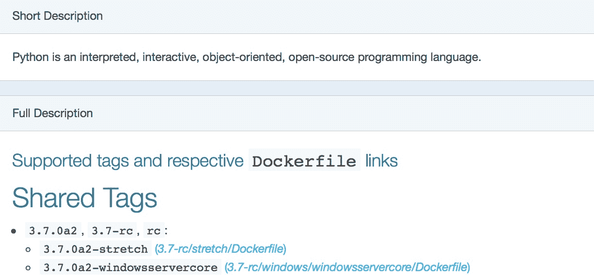

这种版本控制系统叫做 semver：语义化版本控制。该版本号的格式为 MAJOR、MINOR、PATCH，按递增方式表示：

**重大变更**：对于不兼容向后的更改

**次要版本**：当你进行向后兼容的更改时

**补丁版本**：当你进行向后兼容的 bug 修复时

你会注意到镜像上附加有诸如 `rc` 等预发布和构建元数据标签。

在构建镜像时，特别是为了发布给公众或你的团队时，使用 semver 是最佳实践。

也就是说，我提倡你总是这样做，并把它作为个人座右铭：semver 是关键。它会消除在使用镜像时的歧义和混淆。

# 部署 Docker 镜像到 Docker Hub

每次我们运行 `docker build` 时，创建的镜像会在本地可用。通常，Dockerfile 和代码库是一起托管的；因此，在新机器上，用户需要使用 `docker build` 来创建 Docker 镜像。

通过 Docker Hub，任何开发者都有机会将 Docker 镜像托管到平台，并能在任何运行 Docker 的机器上拉取。这完成了两件事：

+   消除了重复运行 `docker build` 的任务

+   提供了一种额外的共享应用程序的方法，与共享应用代码库链接和详细描述设置过程的 **README** 相比，这种方法更容易设置

`docker login` 是通过命令行界面连接 **Docker Hub** 的命令。你需要在 hub.docker.com 上拥有一个账户，并通过终端输入用户名和密码。

`docker push <docker-hub-username/image-name[:tag]>` 是将镜像推送到 Docker Hub 注册表的命令：

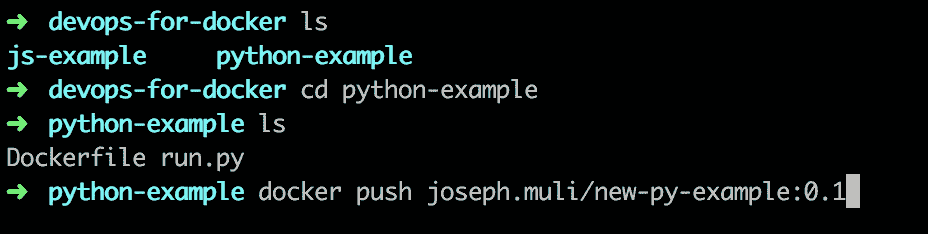

在 [hub.docker.com](http://hub.docker.com) 上简单搜索你的镜像，就能看到 Docker 镜像的输出。

在新机器上，简单的 `docker pull <docker-hub-username/your-image-name>` 命令即可在本地生成镜像的副本。

# 总结

在本课中，我们完成了以下任务：

+   回顾了 DevOps 工作流以及一些 Docker 的使用案例

+   讲解了 Dockerfile 语法

+   对应用程序镜像的构建和容器的运行有了一个高层次的理解

+   构建了多个镜像，为它们打上版本标签，并推送到 Docker Hub
