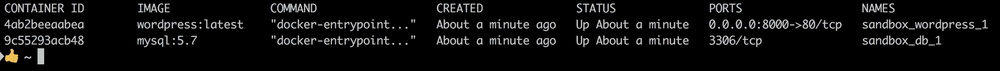

# 第二章 应用容器管理。

在本节中，我们将把我们构建的一个容器扩展为多层次的架构。这将涉及将应用程序拆分为不同的逻辑部分。例如，我们可以让一个应用程序在 Docker 容器上运行，而将应用程序的数据存储在一个独立的数据库容器中；然而，这两个容器应该作为一个整体工作。为此，我们将使用 Docker 的工具来运行多容器应用程序。这个工具叫做 `docker-compose`。总之，`docker-compose` 是用来定义和运行多容器 Docker 应用程序的工具。

# 课程目标。

本节结束时，您将能够：

+   获取多容器应用程序设置的概览。

+   学习 `docker-compose` 文件和命令行界面（CLI）。

+   管理多个容器和分布式应用程序包。

+   使用 `docker-compose` 设置网络。

+   处理和调试不同的应用程序层。

# docker-compose 工具

让我们通过了解什么是多容器架构、它为什么重要以及 Docker 如何通过 `docker-compose` 工具在这种场景中表现得如此出色来开始本节课。

我们最近了解了应用程序是如何工作的，包含其独立的元素：前端、后端和数据库。

要使用 Docker 运行这样的多层应用程序，您需要在不同的终端会话中运行以下命令来启动容器：

```
- docker run <front-end>
- docker run <back-end>
- docker run <database>
```

### 注意

您可以使用（`-d`）选项将 `docker run` 运行在分离模式，以防止我们在不同的会话中运行这三个命令，例如：`docker run <front-end> -d`。

也就是说，链接不同容器（网络设置）确实变得特别具有挑战性。

`docker-compose` 来拯救一天。我们可以从一个文件 `docker-compose.yml` 中定义和运行多个容器。在接下来的主题中，我们将进一步讨论这一点。首先，安装它。

## 安装 docker-compose。

如果您在 *第一课*，*镜像和容器* 中经历了 Docker 的安装，`docker-compose` 很可能已经与 Docker 一起安装。要确认这一点，请在终端中运行 `docker-compose`。

如果命令被识别，您应该会看到如下输出：


Windows 用户应该安装 Docker 的社区版，以便与 Docker 一起安装 `docker-compose`。Docker Toolbox 在其安装中包括了 `docker-compose`。

### 注意

有关 `docker-compose` 安装的更多步骤，请参阅文档：[`docs.docker.com/compose/install/`](https://docs.docker.com/compose/install/)。

说到这个，注意卸载它的各种方式。要卸载该程序：

进入 **程序和功能**。

找到 Docker，右键点击，然后选择 **卸载**。

# 多容器应用程序设置概览。

在上一课中，我们介绍了 Docker 和容器化。我们运行了示例 Python 和 JavaScript 脚本，演示了应用程序如何被容器化以及如何构建镜像。我们现在准备运行一个超越这些的应用程序。

在 Dockerfile 中，每一行描述一个层。Docker 中使用的联合文件系统允许不同目录透明叠加，形成一个统一的文件系统。基础层始终是一个镜像，你在其上构建。每添加一行命令，比如 RUN、CMD 等，都会为其添加一个层。层的优势在于，只要层未被修改，就不必重新构建该部分镜像。其次，镜像从 Docker 镜像仓库拉取时，是按层拉取的，因此可以减少在拉取和推送镜像时出现的连接中断等问题。

许多应用程序都建立在一个常见的结构下：**前端，后端**和**数据库**。让我们进一步分解并理解如何设置这些。

## 前端

当你打开一个 web 应用时，看到的页面属于前端的一部分。有时，前端包含控制器（逻辑端）和视图层（哑端）。布局和内容的样式（即 HTML 和 CSS）属于视图层。这里的内容由控制器管理。

控制器根据用户的操作和/或数据库更改影响视图层中呈现的内容。以 Twitter 应用为例：如果有人关注你，你的数据就发生了变化。控制器将捕捉此更改，并更新视图层显示新的关注者数量。

## 后端

你可能听说过模型-视图-控制器（MVC）**。** 模型位于应用程序的后端。以 Twitter 的早期示例为例，模型不涉及 HTML 或其布局。它处理应用程序的状态：关注者数量、正在关注的人数、推文、图片、视频等。

### 注意

这是后端层包含内容的摘要。后端主要处理应用程序的逻辑。这包括操作数据库的代码；也就是说，所有查询都来自后端。但是，请求来自**前端**。例如，当用户点击按钮时发生这种情况。

你可能也听说过 API 这个术语。API 是应用程序接口的缩写。它同样位于后端。API 暴露了应用程序的内部工作方式。

这意味着 API 也可以是应用程序的后端或逻辑层。

让我们使用 Twitter 的例子来说明。像发布推文和搜索推文这样的操作可以很容易地作为 API 存在，可以从任何前端应用程序调用，如果 API 被公开的话。

### 注意

Docker 和`docker-compose` CLI 实际上是 API 调用，例如在与外部资源或内容（如 Docker Hub）交互时。

## 数据库

数据库包含有组织的数据（信息），这些数据可以轻松访问、管理和更新。我们有基于文件的数据库和基于服务器的数据库。

基于服务器的数据库涉及一个服务器进程运行，接受请求并读取和写入数据库文件。数据库可以托管在云中，例如。

### 注意

基于服务器的数据库托管在虚拟主机上，通常是云平台，如 Google Cloud Platform 和 Amazon Web Services。例子包括 Amazon RDS 和 Google Cloud SQL for PostgreSQL。

从以下链接获取基于服务器的数据库：

+   [`aws.amazon.com/rds/postgresql/`](https://aws.amazon.com/rds/postgresql/)

+   [`cloud.google.com/sql/docs/postgres`](https://cloud.google.com/sql/docs/postgres)

简而言之，开发一直涉及构建应用程序层，而交付一直是个麻烦，因为云平台的价格和涉及的开发及运维（简称 DevOps）。

Docker 和`docker-compose`帮助我们将所有应用程序组件管理为一个单一的包，这样既便宜、又快捷、易于管理。`docker-compose`帮助我们通过一个文件以非常简单的定义来协调所有应用程序层。

在我们总结本概述时，了解开发人员随着时间的推移，已创造出不同的技术栈变体，以总结其应用程序的前端、后端和数据库结构非常重要。以下是它们及其含义的列表（在本课程中我们不会深入讨论）：

+   PREN - PostgresDB, React, Express, Node.js

+   MEAN - MongoDB, Express, Angular, Node.js

+   VPEN - VueJS, PostgresDB, Express, Node.js

+   LAMP - Linux, Apache, MySQL, PHP

### 注意

了解应用程序按照这种方式构建，以便管理关注点的分离非常重要。

通过了解应用程序结构，我们可以进入`docker-compose` CLI 并将这些知识付诸实践。

## 使用 docker-compose

使用`docker-compose`需要三个步骤：

1.  使用`Dockerfile`将应用程序环境构建为镜像。

1.  使用`docker-compose.yml`文件定义您的应用程序运行所需的服务。

1.  运行`docker-compose up`以启动应用程序。

### 注意

`docker-compose`是一个**命令行接口（CLI）**，就像 Docker CLI 一样。运行`docker-compose`会列出命令及其使用方法。

我们在上一节课中已经了解了镜像，因此步骤 1 已经完成。

某些`docker-compose`版本与某些 Docker 版本不兼容。

我们将花一些时间讨论步骤 2。

这是`docker-compose`文件：

+   它运行我们在上一节课中创建的两个镜像：


### 注意

请参考位于`Code/Lesson-2/example-docker-compose.yml`的完整代码。

访问[`goo.gl/11rwXV`](https://goo.gl/11rwXV)获取代码。

### docker-compose 首次运行

1.  创建一个新目录并命名为 `py-js`；如果你更喜欢，可以使用其他目录名称。

1.  在目录中创建一个新文件，并命名为 `docker-compose.yml`。复制上面图片中的内容，或使用在 example-`docker-compose.yml` 中共享的示例。

1.  从该目录下运行命令 `docker-compose up`。

注意运行 `js-docker` 和 `python-docker` 的输出。这是因为我们已经从上一课构建了这两个本地镜像。

如果没有相关镜像，运行 `docker-compose up` 会导致错误，或者尝试从 Docker Hub 拉取镜像（如果它在线存在）：


+   一个运行 **WordPress** 的 `docker-compose.yml` 文件。WordPress 是一个免费的开源 **内容管理系统** **(CMS)**，基于 PHP 和 MySQL。

## 活动 1 — 使用 docker-compose 运行 WordPress

让你熟悉运行 `docker-compose` 命令。

你被要求使用 `docker-compose` 构建一个 WordPress 网站。

1.  创建一个新目录并命名为 `sandbox`。

1.  创建一个新文件并命名为 `docker-compose.yml`。添加 `wordpress-docker-compose.yml` 中的代码，或复制以下图示：

### 注意

查看 `Code/Lesson-2/wordpress-docker-compose.yml` 中的完整代码。

访问 [`goo.gl/t7UGvy`](https://goo.gl/t7UGvy) 以获取代码。

### 注意

注意文件中的缩进。建议在缩进时使用相同数量的制表符和空格。

在 `sandbox` 目录下运行 `docker-compose up`：


### 注意

你会注意到，基于一个文件，我们已经启动了一个应用程序。这个例子完美展示了 `docker-compose` 的强大功能。

运行 `docker ps`。你将看到正在运行的容器：



打开你的浏览器并访问地址：`http://0.0.0.0:8000/`。我们将设置好的 WordPress 网站展示出来。

按照设置步骤操作，一瞬间，你就可以拥有一个准备好的 WordPress 网站。

### docker-compose 文件：docker-compose.yml

`docker-compose.yml` 是一个 YAML 文件，它定义了 **服务、网络** 和 **卷**。

### 注意

服务是应用容器定义，包括与应用相关的所有组件，例如 **数据库、前端** 或 **后端**。定义服务时真正重要的是组件，它们包括网络、卷和环境变量。

任何 `docker-compose.yml` 文件的第一行定义了 `docker-compose` 文件格式的版本。

通过运行 `docker -v`，你可以知道正在运行的 Docker 版本，从而知道在文件的第一行使用哪个版本。

对于 `docker-compose` 文件格式 1.0，第一行是可选的。每个 `docker-compose` 文件都引入了新的配置或弃用了之前的配置。

我们将使用版本 3.3，程序应与版本 3.0 及以上兼容。

确保每个人都在运行版本 3 及以上，并且至少使用 Docker 1.13.0+版本。

接下来是**服务**。我们使用这个简化的骨架：


### 注意

注意缩进。

在上述示例中，我们有两个服务，分别是`db`和`web`。这两个服务缩进仅一次。

在定义服务后的下一行定义了要从中构建镜像的镜像或 Dockerfile。

第 4 行将指定`db`服务容器运行的镜像。我们之前提到过一些堆栈；`db`镜像可以是任何基于服务器的数据库。

### 注意

要确认您想使用的堆栈是否存在，请运行以下命令：`docker search <image or name of your preferred stack>`（例如，`docker search mongo`或`docker search postgres`）。

第 6 行解释了 Web 服务镜像将从`docker-compose.yml`相对位置（`.`）中的 Dockerfile 构建。

我们还可以在第 6 行定义 Dockerfile 的名称。`docker-compose`将会搜索列出名称的文件，例如，在`docker-compose.yml`中：

```
Line 5| web:build: Dockerfilevolumes:
```

第 7 行到第 10 行进一步定义了 Web 服务。

如我们在构建并运行 WordPress 时所使用的`docker-compose.yml`所示，有两个服务：`db`和`wordpress`。在`docker ps`的输出中，这些是容器名称：`sandbox_wordpress_1`和`sandbox_db_1`。

下划线前的第一个单词表示存放`docker-compose.yml`的目录名称。容器名称中的第二个单词是服务名称，正如在`docker-compose.yml`中定义的那样。

我们将在接下来的主题中深入讨论更多内容。

### docker-compose CLI

一旦安装了`docker-compose`，我提到过，当您运行`docker-compose`时，您应该会看到一系列选项。运行`docker-compose -v`。

### 注意

这两个命令，`docker-compose`和`docker-compose -v`，是唯一可以在您当前打开的终端命令行或 Git bash 中运行的命令。

否则，`docker-compose`中的其他选项仅在`docker-compose.yml`文件存在的情况下运行。

让我们深入了解常用命令：`docker-compose build`。

该命令构建在模板`docker-compose.yml`中的`docker-compose line: (build: .)`所引用的镜像。

构建镜像也可以通过命令`docker-compose up`来实现。请注意，除非镜像尚未构建，或者有最近的更改影响到需要运行的容器，否则不会发生此操作。

### 注意

即使这两个服务是从 Docker 注册表中的镜像运行，而不是从目录中的 Dockerfile 构建，针对 WordPress 的示例此命令仍然有效。这将是**拉取**镜像，而**不是构建**，因为我们是从 Dockerfile 构建的。

该命令列出了在`docker-compose.yml`中配置的服务：

+   `docker-compose config --services`

该命令列出所创建容器使用的镜像：

+   `docker-compose images`

该命令列出服务的日志：

+   `docker-compose logs`

`docker-compose logs <service>`列出特定服务的日志，例如`docker-compose logs db`。

该命令列出基于`docker-compose`运行的容器：

+   `docker-compose ps`

请注意，在大多数情况下，`docker-compose ps`和`docker ps`的结果是不同的。在`docker-compose`上下文中没有运行的容器将不会被`docker-compose ps`命令显示出来。

该命令构建、创建、重建并运行服务：

+   `docker-compose up`

### 注意

当运行`docker-compose up`时，如果某个服务退出，整个命令会退出。

运行`docker-compose up -d`相当于在分离模式下运行`docker-compose up`。也就是说，命令会在后台运行。

## 活动 2 — 分析 docker-compose CLI

让你熟悉`docker-compose` CLI。

你被要求演示运行两个容器所带来的变化差异。

在 WordPress 的`docker-compose.yml`所在的目录下——在我这边是 sandbox——运行*活动 B-1*的命令，然后运行以下命令：

```
docker-compose up -d
docker-compose stop
docker-compose rm
docker-compose start
docker-compose up -d
docker-compose stop
docker-compose start
```

# 管理多个容器和分布式应用程序包

这是运行 Django 应用程序的`docker-compose.yml`文件。一个类似的应用可以在`docker-compose`文档的 Django 示例中找到。

从以下地址下载 Django 示例：[`docs.docker.com/compose/django/`](https://docs.docker.com/compose/django/)：


### 注意

请参考位于`Code/Lesson-2/django-docker-compose.yml`的完整代码。

访问[`goo.gl/H624J1`](https://goo.gl/H624J1)以获取代码。

## 改进 Docker 工作流程

为了提供更多的上下文，说明`docker-compose`如何参与以及它如何改进 Docker 工作流程。

1.  创建一个新的目录，并命名为`django_docker`。

1.  在`django-docker`目录中，创建一个新的`docker-compose.yml`文件，并添加上述图中的信息，或使用提供的`django-docker-compose.yml`脚本。

1.  创建一个新的 Dockerfile，并添加提供的 Dockerfile 脚本中的内容。

1.  创建一个 requirements 文件；只需复制提供的`django-requirements.txt`文件。

1.  运行`docker-compose` up 并观察日志。

注意，我们可以通过一个简单的命令`docker-compose up`来启动两个容器。

### 注意

不需要 Django 的先前经验；这只是为了基本的演示目的。`Code/Lesson-2/django-requirements.txt`。

### **Django Compose 文件解析**

首先，这个文件包含多少个服务？是的，两个：`db`和`web`。服务`db`基于 Postgres 镜像，服务`web`是从同一目录下包含此`docker-compose.yml`文件的 Dockerfile 构建的。

如果没有`docker-compose`文件，`db`服务容器本应以以下方式运行：


这个命令翻译成如下内容：


在终端中打开另一个标签页或窗口并运行`docker ps`。你将看到正在运行的容器。

另一方面，根据示例，`web`服务容器将按照以下步骤运行：


第二个命令的分解格式如下：

```
docker run (the command)
          -p  shows the <workstation-port>:<container-port>   (8000:8000)
          -v: shows the <present-working-directory>  `pwd` <working-directory-in-container>  (:/django_docker)
          <docker image> (django-web)
          <command-to-run-when-the-container-starts> (python3 manage.py runserver 0.0.0.0.8000)
```

因此，上述命令翻译成以下内容：


使用`docker-compose.yml`的一个优点是，你不需要一次又一次地在终端中运行命令，而是可以通过一个命令来运行文件中包含的所有容器。

我们在上一课没有讲解卷和端口的内容。现在我会花时间帮助大家理解这个部分。

### 使用卷来持久化数据

卷用于持久化由 Docker 容器生成和使用的数据。

### 注意

卷会持久化对本地文件或脚本的任何更新。这会在容器端同步进行相应的更改。

在这种情况下，命令如下：


在 docker run 选项中，紧接着主命令后的是：

```
-v .:/django_docker
```

这在`docker-compose.yml`文件中。


### 注意

只要在`docker-compose`文件中定义了卷，当本地发生更改时（如文件更新），这些更改会自动同步到容器中的文件。


### 端口

Django 与其他 Web 服务器一样，运行在特定的端口上。用于构建 Django 镜像的 Dockerfile 中有一个类似这样的命令：`EXPOSE 8000`。当容器运行时，这个端口会保持开放，并可以连接。

在 Django 的 Dockerfile 中，我们将端口定义为`8000`，并在数字前加上了地址`(0.0.0.0):`


数字`0.0.0.0`定义了运行容器的主机地址。

### 注意

这个地址告诉`docker-compose`在我们的机器上（或者简而言之，本地主机）运行容器。如果我们跳过地址并仅暴露端口，设置可能会导致意外结果，比如空白页面。

请参考`docker run`选项中的以下行：

```
	-p 8000:8000
```


在`docker-compose.yml`文件中的以下几行：


`docker-compose`端口格式将本地工作站的端口映射到容器端口。格式如下：

```
-p <workstation-port>:<container-port>
```

这使我们能够从本地机器访问映射自容器端口的 8000 端口。

在最后有一个选项`depends_on`，这是`docker-compose.yml`特有的。`depends_on`指定了容器启动的顺序，一旦我们运行`docker-compose`命令，它将按照此顺序启动。

在我们的例子中，`depends_on`选项位于 Web 服务下。这意味着 Web 服务容器依赖于`db`服务容器：


## 活动 3 — 运行 docker-compose 文件

让你熟悉`docker-compose`语法和命令。

你被要求构建并运行一个简单的 Python 应用程序，该应用程序从镜像`josephmuli/flask-app`暴露端口 5000。定义一个`docker-compose`文件，并将 Postgres 镜像作为数据库进行扩展。确保数据库与应用程序相关联。

1.  我已经预先构建了一个名为`josephmuli/flask-app`的镜像。在你的`docker-compose.yml`文件中扩展这个镜像。

1.  确保编写版本 3 的`docker-compose`并定义这两个服务。

1.  在端口`5000`上运行应用程序。

1.  打开浏览器并检查监听端口。

# 使用 docker-compose 进行网络配置

默认情况下，`docker-compose`为你的应用程序设置一个单一网络，在该网络中每个容器都可以访问并发现其他容器。

网络根据所在目录的名称命名。因此，如果你的目录名为`py_docker`，当你运行`docker-compose up`时，创建的网络名称将是`py_docker_default`。

我们在上一部分提到过端口，当创建 WordPress 容器时。为了更好地解释网络，我们将使用用于启动 WordPress 应用程序的`docker-compose.yml`：


在这个文件中，我们有两个服务：`db`和`wordpress`。

在 WordPress 服务中，我们有`ports`选项将端口`80`映射到端口`8000`。难怪 WordPress 应用程序在浏览器中运行在`0.0.0.0:8000`上。

`db`服务中没有`ports`选项。然而，如果你访问`docker hub mysql 页面`，你会注意到端口`3306`已暴露。这是 MySQL 的标准端口。你可以从以下链接获取更多关于 MySQL 的信息：[`hub.docker.com/r/library/mysql`](https://hub.docker.com/r/library/mysql)。

### 注意

我们没有为数据库映射端口，因为我们不一定需要将端口映射到我们的计算机；相反，我们希望将 WordPress 应用程序映射到数据库，以便进行通信。

我们没有为`db`映射端口，因为我们不一定需要将端口映射到本地工作站或计算机。我们只需要它在容器环境中暴露出来，这样它就可以像第 23 行中所示那样从 Web 服务进行连接：`WORDPRESS_DB_HOST: db:3306`。

### 注意

在`docker-compose`文件中，这就是你如何将一个容器连接到另一个容器：

1.  注意你想要连接的镜像暴露的端口。

1.  引用连接到该容器的服务；在我们的例子中，`db`服务由 WordPress 服务连接。

    由于我们将服务命名为`db`，我们将这个连接称为`db:3306`。

    因此，格式为`<service>:<port`由该`service`暴露>。

## 运行 WordPress 容器

以便提供更多关于容器如何连接、同步和通信的背景。

在 compose 文件中，你注意到重启选项了吗？该选项的可用值如下：

+   否

+   始终

+   错误重启

+   除非停止


如果没有指定，默认值是`no`。这意味着无论如何容器都不会重新启动。然而，这里的`db`服务已指定为 restart: always，所以容器会一直重启。

让我们看看 Django 示例，了解那里网络是如何工作的。这是`docker-c` `ompose.yml`：


你可能会发现，在 WordPress 站点中并没有立即显示网络部分。这是一个片段：

```
DATABASES = {
'default': {
'ENGINE': 'django.db.backends.postgresql',
'NAME': 'postgres',
'USER': 'postgres',
'HOST': 'db',
'PORT': 5432,
}
}
```

这里的问题是，我们是如何知道名称和用户是`postgres`，主机是`db`，端口是`5432`的？

这些是我们运行的`postgres`镜像和容器中设置的默认值。

为了更清晰，你可以查看官方 Postgres Docker 库中的这一行：

你可以从 GitHub 获取 Postgres Docker 示例： [`github.com/docker-library/postgres/blob/master/10/docker-entrypoint.sh#L101.`](https://github.com/docker-library/postgres/blob/master/10/docker-entrypoint.sh#L101.)


如前所述，主机是`DB`，因为服务名称是通过运行`postgres`镜像创建的`db`。

你可以从 GitHub 获取 Postgres Docker 示例： [`github.com/docker-library/postgres/blob/master/10/Dockerfile#L132:`](https://github.com/docker-library/postgres/blob/master/10/Dockerfile#L132:)


间接地，它证明了为什么`settings.py`是按那种方式配置的。

# 总结

在本节中，我们做了以下事情：

+   讨论并展示了多容器设置

+   讲解了`docker-compose`命令，以并行方式构建和运行多个容器

+   获得了关于网络容器的高级理解，以及如何将数据从本地机器持久化到容器中

+   通过 Docker Hub 构建并运行应用程序，甚至不需要设置它们。
