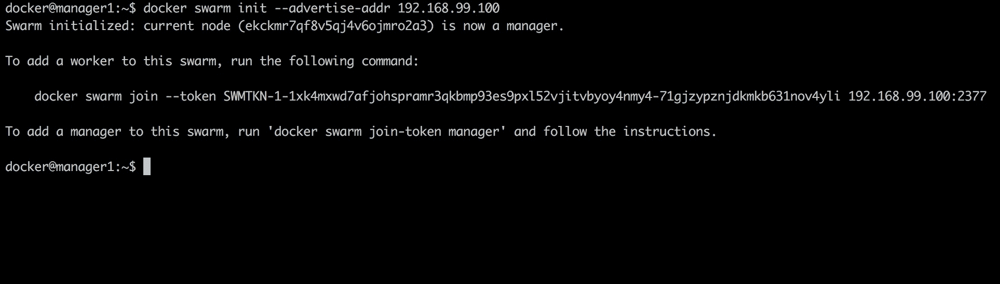

# 第三章 编排与交付

创建 Docker 主机集群的主要动机是为了设计高可用性。大多数，甚至所有的集群和编排工具，如 Docker Swarm 和 Kubernetes，都通过创建主从关系来利用集群的优势。这确保了当某一节点在环境中宕机时，始终有其他节点可以回退使用。在将集群部署到云服务提供商时，有几种技术可以帮助确保环境的高可用性，例如 Consul，并且可以通过将主节点和从节点部署到不同的可用区，利用云平台的原生容错设计。

# 课程目标

本课程结束后，你将能够：

+   获取 Docker Swarm 模式的概览

+   使用 Docker 引擎创建 Docker 引擎的集群

+   管理服务和应用程序在集群中

+   向上或向下扩展服务以处理应用程序的更多请求

+   负载均衡 Docker Swarm 部署

+   保护 Docker 容器和部署

# 编排

在我们的本地环境中运行容器是简单的，不需要很多努力；但在云环境中，我们需要一种不同的心态和工具来帮助我们实现这一目标。我们的环境应该是**高可用的、容错的**，并且**易于扩展**。协调资源和/或容器的过程，形成一个统一的工作流，这就是编排。

首先，让我们熟悉一些在编排中常用的术语：

+   `docker-engine`：指我们目前在计算机上安装的 Docker 捆绑包或安装。

+   `docker-machine`：帮助我们在虚拟主机上安装 Docker 的工具

+   `虚拟主机`：这些是运行在物理主机下的虚拟服务器

+   `docker-swarm`：Docker 的集群工具

+   `docker 主机`：已设置或安装 Docker 的主机或服务器

+   `节点`：连接到集群的 Docker 主机

+   `集群`：一组 Docker 主机或节点

+   `副本`：实例的副本或多个副本

+   `任务`：在节点上运行的定义操作

+   `服务`：一组任务

### 注意

以下是本课程中最常见的术语：

+   `docker-engine`：在我们的计算机上运行 Docker。

+   `docker-machine`：帮助我们安装 Docker 的工具或命令行接口（CLI）

+   `虚拟主机`：在物理主机上运行的主机或服务器。

+   `docker-swarm`：Docker 的集群工具

+   `Docker 主机`：任何运行 Docker 的服务器或主机

+   `节点`：指任何绑定到集群的主机。

+   `集群`：一组受管理和控制的主机。

+   `副本`：其他运行主机的复制，用于不同的任务

+   `任务`：如安装、升级或删除等操作。

+   `服务`：多个任务定义一个服务。

现在，既然我们至少了解了上述术语，我们准备使用`docker-machine`实现一个 Docker Swarm 编排流程。

# Docker Swarm 概览

Docker Swarm 是一个为 Docker 容器设计的**集群**工具。它允许你将多个 Docker**节点**作为一个单一的**虚拟系统**来建立和管理 Docker 集群。这意味着我们可以在多个主机上运行 Docker。

我们通过一个管理器来控制 swarm 集群，管理器主要**处理**和**控制**容器。使用 swarm 管理器，你可以创建一个主管理实例和多个**副本**实例，以防主实例失败。这意味着在一个 swarm 中，你可以拥有多个管理器！

### 注意

swarm 是从一个管理节点创建的，其他 Docker 机器加入集群，作为工作节点或管理节点。

集群很重要，因为它创建了一个协作系统的组，提供冗余，从而创建一个容错环境。例如，如果一个或多个节点发生故障，Docker Swarm 会切换到另一个正常运行的节点。

**Swarm 管理器**执行以下角色：

+   接受`docker`命令

+   对集群执行命令

+   支持高可用性；部署主实例和备份实例，以便在主实例发生故障时可以接管

Docker Swarm 使用**调度**来优化资源，并确保环境中的效率。它**分配容器**到最合适的**节点**。这意味着 Docker Swarm 会将容器分配到最健康的节点。

### 注意

请记住，节点是**运行 Docker 的主机**，而不是**容器**。

Swarm 可以配置为使用以下任何调度策略：

+   **随机**：将一个新容器部署到随机节点。

+   **扩展**：Swarm 将一个新容器部署到容器数量最少的节点。

+   **Binpack**：binpack 策略涉及将一个新容器部署到容器数量最多的节点。

你可以在以下地址下载 VirtualBox：[`www.virtualbox.org/wiki/Downloads`](https://www.virtualbox.org/wiki/Downloads)：


### 注意

为了模拟 Docker Swarm 集群，我们需要在本地安装一个虚拟化管理程序（虚拟化管理程序类型 2 是一个安装在现有操作系统上的软件应用程序，用于管理虚拟机），在这种情况下是 VirtualBox，它将允许我们通过`docker-machine`创建多个本地运行 Docker 的主机，并将它们添加到 swarm 集群中。部署到云服务商时，通常通过其计算服务来实现，例如 AWS 上的 EC2。

对于 Windows 操作系统，选择你的操作系统发行版，你应该会立即开始下载。运行可执行文件并安装 VirtualBox。

# 使用 Docker 引擎创建 Swarm

在我们创建 swarm 之前，先快速了解一下`docker-machine cli`。在终端输入`docker-machine`应该会显示以下输出：


在此下方，我们列出了命令列表：


### 注意

记住当你需要澄清某些问题时，始终使用`help`选项，即`docker-machine stop --help`

为了创建我们的第一个 Docker Swarm 集群，我们将首先使用`docker-machine`来创建我们的管理节点和工作节点。

在创建第一台机器之前，快速回顾一下我们的目标：我们将拥有四台 docker-machine，一台管理节点和三台工作节点；它们都运行在 VirtualBox 上，因此有四台**虚拟机**。

## 创建 Docker 机器

此命令用于创建一个新的虚拟 Docker 主机：

```
docker-machine create --driver <driver> <machine_name>

```

这意味着我们的 Docker 主机将在**VirtualBox**上运行，但由`docker-machine`进行管理和控制。`--driver`选项指定用于创建机器的驱动程序。在本例中，我们的驱动程序是**VirtualBox**。

我们的命令将是`docker-machine create --driver virtualbox manager1`。

### 注意

我们在命令中需要指定驱动程序，因为它是我们主机的基础，这意味着我们的`manager1`机器将在 VirtualBox 上作为虚拟主机运行。有多个供应商提供的驱动程序，但这是演示目的下最好的选择。


## 列出已创建的机器

这个命令将列出当前主机上的所有 Docker 机器，并显示更多信息，比如机器的状态、驱动程序等：`docker-machine ls`


### 注意

列出我们的机器非常重要，因为它可以更新我们的机器状态。我们并不会收到错误通知，而错误有时可能积累成灾难性事件。在对机器进行操作之前，这可以提供一个简短的概览。可以通过`docker-machine status`命令进行更详细的检查。

## 工作节点创建

我们将遵循相同的过程为我们的 Swarm 集群创建三台工作节点，换句话说，运行`docker-machine create --driver virtualbox <machine_name>`三次，并在每次运行时将`worker1`、`worker2`和`worker3`作为`<machine_name>`的值：


最后，最后一个工作节点将显示如下：


完成后，运行`docker-machine ls`，如果创建成功，您将看到类似以下的输出：


### 注意

根据机器的用途命名可以帮助我们避免错误地调用到错误的主机。

## 初始化我们的 Swarm

现在我们的机器已经运行，接下来是创建我们的 Swarm。这将通过管理节点`manager1`来完成。以下是我们实现完整 Swarm 的步骤：

1.  连接到管理节点。

1.  将`manager1`节点声明为管理节点，并宣传其地址。

1.  获取节点加入 Swarm 的邀请地址。

我们将使用`ssh`进行连接。`ssh`是一种安全的网络协议，用于访问或连接主机或服务器。

### 注意

Docker 机器通过`docker-machine cli`进行控制。Docker Swarm 作为一个服务运行，将所有的 Docker 机器结合起来，并将它们统一在一个管理机器或节点下。这并不意味着 swarm 集群中的所有机器在任何方面都是平等或相似的，它们可能正在运行不同的服务或操作，例如数据库主机和 Web 服务器。Docker Swarm 的作用是帮助编排这些主机。

此命令用于获取一台或多台 Docker 机器的 IP 地址：

```
docker-machine ip <machine_names>

```

此命令用于获取一台或多台 Docker 机器的 IP 地址。`<machine_name>`是我们需要获取 IP 地址的机器的名称。在我们的例子中，我们将用它来获取`manager1`节点的 IP 地址，因为初始化 swarm 模式时需要它：


## 连接到一台机器

此命令用于通过`SSH:`登录到一台机器。

```
docker-machine ssh <machine_name>

```

成功连接到我们的`manager1`后，我们应该获得如下所示的输出：


### 注意

在云服务商上使用`ssh 协议`将需要通过用户名和密码或`ssh 密钥`进行身份验证和/或授权。由于这是一个演示，我们不会深入讨论这一部分。

## 初始化 Swarm 模式

这是初始化 swarm 模式的命令：

```
docker swarm init --advertise-addr <MANAGER_IP>

```

让我们在管理节点内部运行此命令来初始化一个 swarm。`advertise-addr`选项用于指定将被广播给 swarm 中其他成员的地址，以便进行 API 访问和网络连接。

在这种情况下，它的值是`manager IP 地址`，该值是我们之前通过运行`docker-machine ip manager1`获得的：

### 注意

我们之前提到过，Docker Swarm 是一个通过管理节点将所有机器连接和编排在一起的服务。为了实现这一点，Docker Swarm 允许我们通过管理节点的地址来广播集群，在`docker swarm init`命令中包含`advertise-addr`。



运行该命令的输出显示我们的节点现在是一个管理节点！

请注意，我们还拥有两个命令：一个应该允许我们邀请其他节点加入集群，另一个用于将另一个管理节点添加到集群中。

### 注意

在设计高可用性时，建议拥有多个管理节点，以便在主管理节点发生故障时，其他节点可以接管。

### 注意

确保保存输出中列出的两个命令，因为它们将在将其他主机添加到 swarm 时非常有用。

## 将 Worker 节点添加到我们的 Swarm

此命令用于添加 swarm 工作节点`：`

```
docker swarm join --token <provided_token> <manager_ip>:<port>

```

在我们将工作节点添加到 swarm 之前，我们需要通过`ssh`连接到它们。

我们通过运行`docker-machine ssh <node_name>`来实现这一点，然后运行我们从`manager1 节点`获得的邀请命令。

### 注意

`docker-machine` 命令可以从任何目录运行，并始终与已创建的机器配合使用。

首先，我们将使用 `exit` 命令退出管理节点：


然后，我们通过 `ssh` 连接到工作节点：


最后，我们将节点添加到集群中：


## 查看集群状态

我们使用此命令查看集群状态：

```
docker node ls
```

我们使用此命令查看集群状态。此命令在管理节点上运行，并显示我们集群中所有节点的状态和可用性。在管理节点上运行此命令时，输出类似于以下内容：


## 活动 1 — 向集群添加节点

确保您有一个管理节点和节点邀请命令。

让您熟悉 `ssh` 和集群管理。

您需要连接到至少两个节点并将它们添加到集群中。

1.  `Ssh` 连接到您的第一个节点：

1.  在节点上运行邀请命令以加入集群。记住，我们在首次初始化管理节点时获得了此命令：

1.  退出节点，`ssh` 连接到另一个节点并运行命令：

1.  使用 `Ssh` 连接到管理节点，通过 `docker node ls` 检查集群状态：

# 在 Swarm 中管理服务和应用程序

现在我们的集群已准备好，是时候在集群上安排一些服务了。如前所述，管理节点的作用是接受 Docker 命令并将其应用到集群中。因此，我们将在管理节点上创建服务。

### 注意

此时，工作节点几乎不能做什么，因为它们完全受管理节点控制。

## 创建服务

此命令用于创建服务：

```
docker service create --replicas <count> -p <host_port>:<container_port> --name <service_name> <image_name>

```

我们像之前提到的那样在管理节点上运行此命令。我们将使用前一节中构建的 WordPress 示例。由于我们本地已有该镜像，因此无需从 Hub 拉取。

我们的副本数量将设置为三，因为我们目前有三个工作节点；通过运行 `docker node ls` 确认您的节点数量。

### 注意

我们没有创建副本数量；这引入了以下主题。`-p <host_port>:<container_port>` 将容器映射到我们计算机定义的端口，对应容器端口。我们不需要副本数量与节点数量相等。其他节点可以处理不同的应用层，例如数据库：


我们基于 WordPress 镜像创建了一个 web，并将主机端口 `80` 映射到容器端口 `80`。

## 列出服务

此命令用于查看当前正在运行的服务：

```
docker service ls
```

此命令用于查看当前正在运行的服务及更多信息，如副本、镜像、端口等。

从以下输出中，我们可以看到刚启动的服务及其相关信息：


## 服务状态

此命令用于检查我们的服务是否在运行：

```
docker service ps <service_name>
```

查看服务列表无法提供我们所需的所有信息，例如服务部署在哪些节点上。然而，我们可以知道服务是否在运行以及是否遇到任何错误。当我们在管理节点上运行此命令时，我们会看到以下输出：


### 注意

查看状态非常重要。在我们对节点进行升级或更新的情况下，运行`docker ps`可以告知我们节点的状态。在理想的 Docker Swarm 设置中，当某个节点宕机时，管理节点会将流量重新分配到可用节点，因此很难察觉到停机，除非有监控系统。在与节点交互之前，务必先运行此命令检查节点的状态。

## 我们如何知道网站是否正在运行？

我们可以通过在浏览器中打开任何一个工作节点的 IP 地址来验证 WordPress 是否正在运行：


以下是 WordPress 在浏览器中显示的截图：


### 注意

打开运行 WordPress Web 服务的任何 IP 地址，包括管理节点，将打开相同的地址。

## 活动 2 — 在 Swarm 上运行服务

确保你有一个正在运行的管理节点。

让你熟悉在 Swarm 中管理服务。

你被要求将一个新的`postgres`服务添加到 Swarm 中。

1.  创建一个新节点并命名为`dbworker`：

    ```
    docker-machine create --driver virtualbox dbworker
    ```

    

1.  将新工作节点添加到 Swarm：

1.  创建一个新的数据库服务并命名为`db`，使用 postgres 镜像作为基础：

    ```
    docker service create --replicas 1 --name db postgres
    ```

    以下是输出的截图：

    

1.  通过以下步骤验证`postgres`是否在运行：

    1.  将运行在`dbworker node`中的`postgres`容器映射到你的计算机：

        ```
        docker run --name db -e POSTGRES_PASSWORD=postgres -d -p 5432:5432 postgres

        ```

        

    1.  运行`docker ps`列出正在运行的容器；这应该显示我们的`postgres`容器，并且状态应为`UP`：

    1.  通过以下方式退出并停止容器：

# 扩展服务

随着请求量的增加或减少，需要扩展基础设施。我们最近使用节点副本运行了我们所安装的同一个 WordPress。

### 注意

这是一个非常基础的生产级设置示例。理想情况下，我们需要更多的管理节点和副本，但由于我们正在运行一个演示，这就足够了。

扩展涉及根据应用程序的流量增加和减少资源。

## 扩展我们的数据库服务

我们将以数据库服务为例，展示如何扩展服务。在实际场景中，像 Google Cloud Platform 和 Amazon Web Services 这样的云服务可能会定义自动扩展服务，创建多个副本并通过名为**负载均衡**的服务在副本之间分配流量。我们将在下一个活动中深入探讨这一点。首先，我们从基础开始，了解扩展是如何工作的。扩展数据库的命令格式如下：

```
docker service scale <service_name>=<count>
```

要扩展服务，传入我们创建服务时提供的服务名称和希望扩展到的副本数。

### 注意

`--detach=false` 让我们查看复制进度。命令是 `docker service scale <service_name>=<count>:`


从上面的输出中，我们可以看到我们的`db`服务已被复制。现在我们在`dbworker`节点上运行了两个数据库服务。

## Swarm 如何知道在哪里调度服务？

我们之前已经讨论过调度模式，包括以下几种：

+   随机

+   扩展

+   Binpack

Docker Swarm 的默认调度策略是`spread`，它将新服务分配给资源**最少**的节点。

### 注意

如果 Swarm 中没有额外的未分配节点，则您想要扩展的服务将会在当前运行的节点上复制。

Swarm 管理器将使用扩展策略，并根据资源分配。

然后，我们可以使用 `docker service ls` 命令验证操作是否成功，我们可以看到副本数为二：


缩容与扩容非常相似，唯一的区别是我们传递的副本数比之前少。从以下输出中，我们将副本数缩减为一个，并验证副本数确实为一：


## Swarm 如何在副本之间负载均衡请求？

负载均衡器有助于处理和管理应用程序中的请求。在一个应用程序处理大量请求的情况下（例如在 5 分钟内处理 1,000 个请求），我们需要在应用程序上（特别是逻辑部分，即后台）配置多个副本和负载均衡器。负载均衡器有助于分配请求，防止实例过载，从而避免停机。

当部署到像**Google Cloud Platform**或**Amazon Web Services**这样的云平台时，您可以使用外部负载均衡器将请求路由到您的 Swarm 主机。

Docker Swarm 包含一个内置的路由服务，使得即使某个节点上没有服务运行，群集中的每个节点也能接受对公开端口的传入连接。默认情况下，`postgres` 服务使用端口 `5432`。

## 活动 3 — 在 Swarm 中扩展服务

确保你的 Swarm 至少包含一个管理节点、两个服务和三个工作节点。

让你熟悉扩展服务和复制节点的操作。

你被要求将 Web 服务扩展到四个副本，并将数据库服务扩展到两个副本。

1.  创建了三个新的工作节点，其中两个用于 Web 服务，一个用于数据库服务。

1.  连接到管理节点并扩展 Web 和数据库服务。

1.  使用 docker service ls 确认服务副本数量；最终结果应该如下：

    +   WordPress Web 服务应该有两个副本

    +   Postgres 数据库服务应该有四个副本

# 总结

本课中，我们完成了以下内容：

+   讨论了编排，并提到了一些示例工具

+   讨论了集群及其重要性，尤其是在生产环境中

+   通过在 VirtualBox 上运行 Docker Machines 学习了虚拟主机

+   详细了解了 Docker Swarm 以及如何创建和管理一个节点集群

+   介绍了示例服务，包括在我们的集群中运行的 Wordpress

+   获得了关于使用 `docker-machine cli` 的高级理解

+   讨论了负载均衡以及 Docker Swarm 如何管理这一过程

恭喜你顺利完成！以下是我们通过课程所获得的知识回顾。

本书中，我们涵盖了以下内容：

+   讨论了 DevOps 以及 Docker 如何促进工作流

+   理解了如何在 Dockerfile 中创建应用程序模板

+   构建了镜像和容器并推送到 Docker Hub

+   通过 `docker-compose` 管理容器

+   学习了如何通过 Docker Swarm 协调我们的应用程序
