# 第一章：*第一章*：介绍持续交付

大多数开发人员面临的一个常见问题是如何快速且安全地发布实现的代码。传统的交付过程充满了陷阱，通常会导致开发人员和客户的失望。本章将介绍**持续交付**（**CD**）方法的理念，并为本书的其余部分提供背景。

在本章中，我们将涵盖以下主题：

+   理解 CD

+   自动化部署流水线

+   CD 的前提条件

+   结合 CD 和微服务

+   构建 CD 过程

# 理解 CD

CD 的最准确定义由*Jez Humble*提出，内容如下：

“持续交付是将所有类型的变更——包括新功能、配置更改、错误修复和实验——安全、快速且可持续地推送到生产环境或用户手中的能力。”

这个定义涵盖了关键点。

为了更好地理解这个问题，让我们假设一个场景。你负责一个产品——比如说，一个电子邮件客户端应用。用户向你提出一个新需求：他们希望按大小排序电子邮件。你决定开发大约需要 1 周时间。*用户何时能使用这个功能？* 通常，在开发完成后，你会将完成的功能交给**质量保证**（**QA**）团队，然后再交给运维团队，这会花费额外的时间，从几天到几个月不等。

因此，尽管开发只花了 1 周时间，但用户需要等几个月才能收到！CD 方法通过自动化手动任务解决了这个问题，使用户能够在新功能实现的第一时间就收到它。

为了帮助你理解需要自动化什么以及如何自动化，我们将首先描述当前大多数软件系统所使用的交付过程。

## 传统交付过程

传统交付过程，如其名称所示，已经实施多年，并且在大多数 IT 公司中得到应用。我们来定义它是如何工作的，并评论它的不足之处。

### 介绍传统的交付过程

每个交付过程都以客户定义的需求开始，并以产品发布到生产环境结束。这两个阶段之间存在差异。传统上，这个过程是这样的：

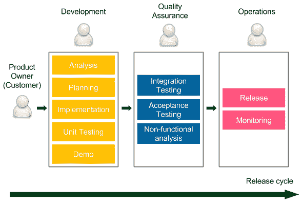

图 1.1 – 发布周期图

发布周期从**产品负责人**提供的需求开始，产品负责人代表**客户**（利益相关者）。然后，分为三个阶段，在这些阶段中，工作会在不同的团队之间传递：

+   **开发**：开发人员（有时与业务分析师一起）进行产品开发。他们通常使用敏捷技术（Scrum 或 Kanban）来提高开发速度并改善与客户的沟通。会组织演示会议以获得客户的快速反馈。所有优秀的开发技术（如**测试驱动开发**（**TDD**）或极限编程实践）都是欢迎的。一旦实现完成，代码会传给 QA 团队。

+   **质量保证**：这个阶段通常称为**用户验收测试**（**UAT**），需要将代码冻结在主代码库上，以确保没有新的开发会破坏测试。QA 团队会进行一系列的**集成测试**、**验收测试**和**非功能性分析**（性能、恢复、安全等）。任何检测到的缺陷都会返回给开发团队，所以开发人员通常工作非常繁忙。在 UAT 阶段完成后，QA 团队会批准已计划好用于下一个发布的功能。

+   **运维**：最后阶段，通常也是最短的阶段，涉及将代码交给运维团队，以便他们执行发布并监控生产环境。如果出现任何问题，他们会联系开发人员，帮助解决生产系统的问题。

发布周期的长短取决于系统和组织，但通常从 1 周到几个月不等。我听说过最长的周期是 1 年。我亲自参与过的最长周期是按季度进行的，每个部分如下：

+   **开发**：1.5 个月

+   **UAT**：1 个月 3 周

+   **发布（和严格的生产监控）**：1 周

传统交付过程在 IT 行业广泛使用，因此这可能不是你第一次读到这样的方式。然而，它也有几个缺点。让我们明确地看看它们，以便理解为何我们需要追求更好的方法。

### 传统交付过程的缺点

传统交付过程的最显著缺点如下：

+   **慢速交付**：客户在需求明确后很久才收到产品。这导致市场响应时间不理想，且客户反馈延迟。

+   **长反馈周期**：反馈周期不仅与客户有关，也与开发人员相关。想象一下，如果你不小心创建了一个 BUG，并且在 UAT 阶段才得知。*修复你两个月前做的事情需要多久？* 即便是处理小 BUG，也可能需要几周。

+   **缺乏自动化**：稀少的发布不鼓励自动化，这导致发布过程不可预测。

+   **风险较大的热修复**：热修复通常不能等待完整的 UAT 阶段，因此它们通常会以不同的方式进行测试（UAT 阶段会缩短）或根本不进行测试。

+   **压力**：不可预测的发布对运维团队来说是很有压力的。更糟糕的是，发布周期通常安排得很紧，这给开发人员和测试人员增加了额外的压力。

+   **沟通不畅**：从一个团队传递到另一个团队的工作代表着瀑布式方法，人们开始只关心他们自己的部分，而不是完整的产品。如果出了什么问题，这通常导致责备游戏，而不是合作。

+   **责任共享**：没有团队从头到尾对产品负责：

    +   **对开发人员来说**：*完成* 意味着需求已经被实现。

    +   **对测试人员来说**：*完成* 意味着代码已经经过测试。

    +   **对运维人员来说**：*完成* 意味着代码已经发布。

+   **低工作满意度**：每个阶段对不同的团队都很有趣，但其他团队需要支持这个过程。例如，开发阶段对开发人员来说很有趣，但在其他两个阶段，他们仍然需要修复 bug 并支持发布，这通常对他们来说一点都不有趣。

这些缺点仅仅是传统交付过程挑战的冰山一角。你可能已经感受到，开发软件必须有更好的方法，而这种更好的方法显然就是 CD 方法。

## CD 的好处

*你的组织部署一个涉及单行代码的更改需要多长时间？* *你是否可以重复、可靠地做到这一点？* 这些是**玛丽**和**汤姆·波彭迪克**（《实施精益软件开发》的作者）提出的著名问题，被**杰兹·汉布尔**和其他人引用了很多次。对这些问题的回答是你交付过程健康状况的唯一有效衡量标准。

为了能够持续交付，并且不需要大量花费在全天候工作的运维团队上，我们需要自动化。简而言之，持续交付（CD）就是将传统交付过程的每个阶段转变为一系列称为*自动化部署流水线*或*CD 流水线*的脚本。然后，如果不需要手动步骤，我们可以在每次代码更改后运行这个流程，并持续将产品交付给用户。

CD 让我们摆脱乏味的发布周期，并带来以下好处：

+   **快速交付**：市场推出时间显著缩短，因为客户可以在开发完成后立即使用产品。记住，软件直到交到用户手中才能产生收益。

+   **快速反馈周期**：想象一下，你在代码中引入了一个 bug，而这个 bug 当天就进入了生产环境。*修复当天工作的问题需要多长时间？*可能不会太久。这与快速回滚策略一起，是保持生产稳定的最佳方式。

+   **低风险发布**：如果你每天发布，这个过程就会变得可重复且安全得多。俗话说，*如果它伤害你，那就更频繁地做它*。

+   **灵活的发布选项**：如果你需要立即发布，一切已经准备就绪，因此没有额外的时间/成本与发布决策相关。

不用多说，我们完全可以通过消除所有交付阶段，直接从生产环境开始开发，来实现所有这些好处。然而，这样做会导致质量的下降。引入持续交付的困难在于，大家担心在消除所有手动步骤的同时，质量也会下降。在本书中，我们将向你展示如何安全地进行持续交付，并解释为什么，与普遍的看法相反，持续交付的产品包含的 bug 更少，更能满足客户的需求。

## 成功案例

我最喜欢的关于持续交付的故事是在 Rolf Russell 的一次演讲中听到的。故事如下。2005 年，Yahoo! 收购了 Flickr，这在开发者的世界中是两种文化的碰撞。那时，Flickr 是一家具有初创公司思维的公司，而 Yahoo! 则是一个庞大的企业，拥有严格的规则和安全至上的态度。他们的发布流程差异巨大。Yahoo! 使用传统的交付流程，而 Flickr 每天发布多次。开发者实施的每个变化都会在当天进入生产环境。他们甚至在页面底部放置了一个页脚，显示上次发布的时间和做出更改的开发者头像。

Yahoo! 很少进行部署，每次发布都会带来很多经过充分测试和准备的变化。Flickr 则采用非常小的增量方式工作；每个功能被划分为小的增量部分，每一部分都会迅速部署到生产环境中。差异如下面的图示所示：

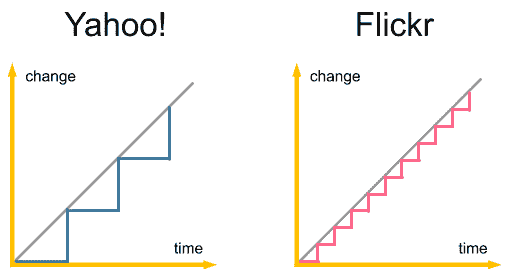

图 1.2 – Yahoo! 和 Flickr 发布周期的比较

你可以想象，当两家公司开发者碰面时发生了什么。Yahoo! 把 Flickr 的同事当作不负责任的初级开发者，一群不懂自己在做什么的软件牛仔。所以，他们首先想做的就是为 Flickr 的交付流程增加一个 QA 团队和 UAT 阶段。然而，在他们进行更改之前，Flickr 的开发者只有一个愿望。他们希望评估整个 Yahoo! 所有产品中最可靠的那些。令他们吃惊的是，即使是 Yahoo! 的所有软件，Flickr 也有着最低的宕机时间。最初，Yahoo! 团队不明白这一点，但他们还是让 Flickr 保持现有流程。毕竟，他们是工程师，因此评估结果是确凿的。过了一段时间，Yahoo! 的开发者才意识到，持续交付流程对 Yahoo! 的所有产品都有好处，并开始逐步在各个产品中推广。

故事中最重要的问题仍然是：*为什么 Flickr 是最可靠的系统？* 其背后的原因就是我们在前面提到过的内容。如果以下情况成立，则发布的风险较小：

+   代码变更的差异很小

+   这个过程是可重复的

这就是为什么，尽管发布本身是一项复杂的活动，但如果频繁进行发布，它反而更安全。

Yahoo!和 Flickr 的故事只是众多成功公司的一个例子，在这些公司中，CD 过程证明是正确的选择。如今，即使是小型组织，也通常会频繁发布软件，像亚马逊、Facebook、谷歌和 Netflix 这样的行业领袖每天都会执行成千上万次的发布。

信息

你可以在[`continuousdelivery.com/evidence-case-studies/`](https://continuousdelivery.com/evidence-case-studies/)上阅读更多关于 CD 过程和个案研究的内容。

请记住，统计数据每天都在改善。然而，即使没有任何数据，想象一下这样一个世界：你实现的每一行代码都安全地进入了生产环境。客户能够快速反应并调整需求，开发人员很高兴，因为他们不需要解决那么多的漏洞，而管理者也满意，因为他们总是知道工作进展的当前状态。毕竟，记住唯一真正衡量进展的标准是已发布的软件。

# 自动化部署管道

我们已经知道什么是 CD 过程以及为什么要使用它。在这一节中，我们将描述如何实施它。

我们首先要强调，传统交付过程中的每一个阶段都非常重要，否则这个过程根本不会被创造出来。没有人愿意在没有测试的情况下交付软件！UAT 阶段的角色是发现漏洞，确保开发人员创建的内容正是客户所需要的。运维团队的角色也是如此——软件必须被配置、部署到生产环境并进行监控。这是不可忽视的。因此，*我们如何自动化这个过程，以保持所有阶段的完整性？* 这就是自动化部署管道的作用，它由三个阶段组成，如下图所示：

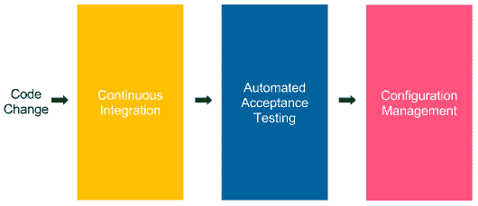

](img/B18223_01_03.jpg)

图 1.3 – 自动化部署管道

自动化部署管道是一系列脚本，执行顺序是在每次代码变更提交到仓库后进行的。如果过程成功，它最终会被部署到生产环境。

每个步骤都对应于传统交付过程中的一个阶段，如下所示：

+   **持续集成**：这会检查不同开发者编写的代码是否已被整合。

+   **自动化验收测试**：这会检查开发人员实现的功能是否满足客户的需求。这个测试还替代了手动 QA 阶段。

+   **配置管理**：这取代了手动操作阶段；它配置环境并部署软件。

让我们更深入地了解每个阶段，理解它的责任以及它包括哪些步骤。

## 持续集成

**持续集成**（**CI**）阶段为开发人员提供了第一轮反馈。它从代码库中检出代码，编译它，运行单元测试，并验证代码的质量。如果任何一步失败，管道执行将被停止，开发人员应该做的第一件事是修复 CI 构建。这个阶段的关键是时间；它必须及时执行。例如，如果这个阶段花费了 1 小时才能完成，开发人员就会更快地提交代码，这将导致管道不断失败。

CI 管道通常是起点。设置它很简单，因为一切都在开发团队内部完成，不需要与 QA 和运维团队达成协议。

## 自动化验收测试

自动化验收测试阶段是一套与客户（和 QA）一起编写的测试，旨在取代手动 UAT 阶段。它作为质量门，决定产品是否准备好发布。如果任何一个验收测试失败，管道执行将被停止，后续步骤将不再运行。它阻止了配置管理阶段的继续，因此也阻止了发布。

自动化验收阶段的整个理念是将质量融入产品，而不是事后验证。换句话说，当开发人员完成实现时，软件会与验收测试一起交付，这些测试验证软件是否符合客户的要求。这是软件测试思维的一大转变。现在不再是由单个人（或团队）批准发布，而是所有的一切都取决于通过验收测试套件。这也是为什么创建这个阶段通常是 CD 过程最困难的部分。它需要与客户的密切合作，并在过程开始时（而不是结束时）创建测试。

注意

在遗留系统中引入自动化验收测试尤其具有挑战性。我们将在*第九章*《高级持续交付》中详细讨论这个话题。

通常会有很多关于测试类型及其在 CD 过程中的位置的混淆。如何自动化每种类型的测试，覆盖范围应该是什么，以及 QA 团队在开发过程中的角色通常也不清晰。让我们通过敏捷测试矩阵和测试金字塔来澄清这些问题。

### 敏捷测试矩阵

Brian Marick 在一系列博客文章中，以敏捷测试矩阵的形式对软件测试进行了分类。它将测试分为两个维度——面向业务或技术，并支持程序员或对产品的批评。让我们来看一下这种分类：

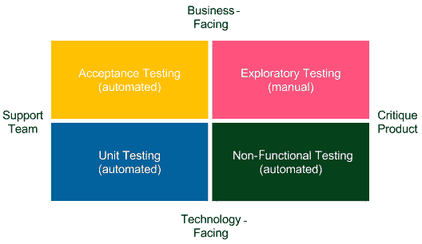

图 1.4 – Brian Marick 的测试矩阵

让我们来看看每种测试类型：

+   **验收测试（自动化）**：这些测试代表了从业务角度来看功能性要求。它们以故事或示例的形式由客户和开发人员编写，以便双方能就软件应如何工作达成一致。

+   **单元测试（自动化）**：这些测试帮助开发人员提供高质量的软件，并最小化错误的数量。

+   **探索性测试（手动）**：这是手动的黑盒测试阶段，旨在打破或改进系统。

+   **非功能性测试（自动化）**：这些测试代表了与性能、可扩展性、安全性等相关的系统属性。

这个分类回答了关于 CD 过程中的一个重要问题：*质量保证（QA）在过程中的角色是什么？*

手动 QA 执行探索性测试，这意味着他们会与系统进行互动，尝试打破它，提问并思考改进之处。自动化 QA 则帮助进行非功能性测试和验收测试；例如，他们编写代码来支持负载测试。通常，QA 在交付过程中没有特殊的位置，而是作为开发团队的一员。

注意

在自动化的 CD 流程中，执行重复任务的手动 QA 已经没有位置了。

你可能会看着这个分类，想知道为什么没有看到集成测试。*根据 Brian Marick 的说法，它们在哪里，我们又该如何在 CD 流水线中放置它们？*

为了更好地解释这一点，我们需要提到集成测试的含义在不同上下文中的差异。对于（微）服务架构，集成测试通常意味着与验收测试相同，因为服务较小，只需要单元测试和验收测试。如果你构建一个模块化应用程序，那么集成测试通常意味着组件测试，绑定多个模块（但不是整个应用程序）并一起测试。在这种情况下，集成测试介于验收测试和单元测试之间。它们的编写方式类似于验收测试，但通常更加技术性，且需要模拟不仅是外部服务，还有内部模块。集成测试类似于单元测试，代表了代码的视角，而验收测试代表了用户的视角。在 CD 流水线中，集成测试作为一个单独的阶段实现。

### 测试金字塔

前一部分解释了每种测试类型在过程中的含义，但并未提到我们应该开发多少测试。那么，*在单元测试的情况下，代码覆盖率应该是多少？验收测试又该如何？*

为了回答这些问题，*Mike Cohn*在他的书《*Succeeding with Agile*》中创造了所谓的**测试金字塔**。下图应能帮助你更好地理解这一点：

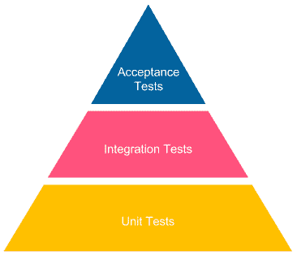

](img/B18223_01_05.jpg)

图 1.5 – Mike Cohn 的测试金字塔

当我们往金字塔上层移动时，测试变得更慢且更昂贵。它们通常需要触及用户界面，并且需要雇佣一个独立的测试自动化团队。这就是为什么验收测试不应该追求 100%的覆盖率。相反，它们应该以功能为导向，只验证选定的测试场景。否则，我们将花费大量资金用于测试开发和维护，而我们的 CD 管道构建将需要很长时间才能执行完毕。

在金字塔的底部，情况则不同。单元测试既便宜又快速，因此我们应该追求 100%的代码覆盖率。它们由开发人员编写，提供它们应该是任何成熟团队的标准流程。

我希望敏捷测试矩阵和测试金字塔能澄清验收测试的作用和重要性。

现在，让我们来看一下 CD 过程的最后一个阶段：配置管理。

## 配置管理

配置管理阶段负责追踪和控制软件及其环境中的变化。它包括准备和安装必要工具、扩展服务实例的数量及其分布、基础设施清单以及所有与应用程序部署相关的任务。

配置管理是解决手动部署和配置生产环境中的应用程序所带来问题的一种方案。这个常见做法会导致一个问题，即我们无法再知道每个服务的运行位置及其属性。配置管理工具（如 Ansible、Chef 和 Puppet）使我们能够将配置文件存储在版本控制系统中，并跟踪对生产服务器所做的每一次更改。

替换运营团队手动任务的额外工作包括处理应用监控。这通常通过将运行系统的日志和指标流式传输到一个公共仪表盘来完成，该仪表盘由开发人员（或下节中提到的 DevOps 团队）进行监控。

近期与配置管理相关的另一个术语是**基础设施即代码**（**IaC**）。如果你使用云而不是裸机服务器，那么像 Terraform 或 AWS CloudFormation 这样的工具可以让你将基础设施的描述（不仅仅是软件）存储在版本控制系统中。我们将在*第七章*中讨论配置管理和 IaC，*使用 Ansible 进行配置管理*。

# CD 的前提条件

本书的其余部分将专注于如何实现成功 CD 管道的技术细节。然而，这一过程的成功不仅仅依赖于本书中介绍的工具。在这一部分，我们将从整体上审视整个过程，并在以下三个方面定义 CD 的要求：

+   组织结构及其对开发过程的影响

+   你的产品及其技术细节

+   你的开发团队及你们采用的实践

让我们从组织先决条件开始。

## 组织先决条件

你们组织的运作方式对引入 CD 过程的成功有很大的影响。这有点类似于引入 Scrum。许多组织想要使用敏捷流程，但他们并没有改变他们的文化。除非组织的结构为此进行了调整，否则你无法在开发团队中使用 Scrum。例如，你需要一个产品负责人、相关利益方和一个管理团队，他们理解在 sprint 过程中需求不可能变更。否则，即使你有好的意图，也无法成功。同样的情况适用于 CD 过程；它要求你调整组织的结构。我们来看三个方面：DevOps 文化、过程中的客户和商业决策。

### DevOps 文化

很久以前，当软件由个人或小团队编写时，开发、质量保证和运维之间没有明确的分隔。一个人编写代码，测试它，然后将其投入生产。如果出现问题，同一个人会调查问题，修复它，并重新部署到生产环境中。随着开发过程的组织方式逐渐变化，系统变得更大，开发团队也在不断壮大。于是，工程师们开始在某个领域中变得更加专业化。这是非常有道理的，因为专业化提升了生产力。然而，副作用是沟通成本的增加。如果开发人员、QA 和运维位于组织的不同部门，坐在不同的楼栋，或者外包到不同的国家，这种现象尤为明显。这种组织结构不利于 CD 过程。我们需要更好的方法；我们需要采用 DevOps 文化。

DevOps 文化在某种意义上意味着回归根本。一个人或一个团队负责所有三个领域，如下图所示：

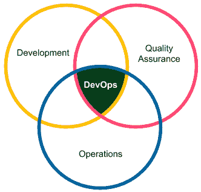

图 1.6 – DevOps 文化

能够在不降低生产力的情况下转向 DevOps 模式的原因是自动化。与 QA 和运维相关的大部分任务被移到自动化交付管道中，因此可以由开发团队来管理。

信息

一个 DevOps 团队不一定需要由开发人员组成。许多转型中的组织中，一个非常常见的场景是创建由四个开发人员、一个 QA 和一个运维人员组成的团队。然而，他们需要紧密合作（坐在同一片区域，一起进行站立会议，共同开发同一个产品）。

小型 DevOps 团队的文化会影响软件架构。功能需求必须被分离为（微）服务或模块，以便每个团队可以处理独立的部分。

信息

组织结构对软件架构的影响早在 1967 年就被观察到，并被公式化为 Conway 定律：“*任何设计系统的组织（广义定义）都会产生一个设计，其结构是该组织沟通结构的复制*。”

### 客户在过程中

在持续交付（CD）采纳过程中，客户（或产品负责人）的角色略有变化。传统上，客户参与定义需求、回答开发人员的问题、参加演示并参与用户验收测试（UAT）阶段，以确定所构建的产品是否符合他们的预期。

在 CD 中，没有 UAT，客户在编写验收测试的过程中至关重要。对于一些已经以可测试的方式编写需求的客户来说，这并不是一个很大的变化。而对另一些客户来说，则意味着需要改变他们的思维方式，使需求更加面向技术。

信息

在敏捷环境中，有些团队甚至不接受没有附带验收测试的用户故事（需求）。这些技术，尽管听起来可能过于严格，但往往能带来更高的开发生产力。

### 业务决策

在大多数公司中，业务对发布计划有一定的影响。毕竟，决定交付哪些功能以及何时交付，涉及到公司内不同部门（例如，市场部）的协调，并且可能对企业的战略至关重要。因此，发布计划必须在业务和开发团队之间重新审视和讨论。

有一些技术手段，比如功能切换（feature toggles）或手动管道步骤，能够帮助按指定时间发布功能。我们将在本书后续部分描述这些技术。准确来说，*持续交付*（continuous delivery）与*持续部署*（continuous deployment）并不相同。后者意味着每次提交到代码仓库都会自动发布到生产环境。持续交付则更为宽松，它意味着每次提交都会生成一个发布候选版本，从而允许最后一步（从发布到生产）是手动进行的。

注意

在本书的其余部分，我们将交替使用“持续交付”和“持续部署”这两个术语。

## 技术和开发前提

从技术角度来看，有一些要求需要牢记。我们将在本书中讨论这些要求，因此这里只简单提及，不再详细说明：

+   **自动化构建、测试、打包和部署操作**：所有操作都需要能够自动化。如果我们处理的是一个无法自动化的系统，例如由于安全原因或其复杂性，便无法创建完全自动化的交付管道。

+   **快速管道执行**：管道必须迅速执行，最好在 5 到 15 分钟内完成。如果我们的管道执行需要数小时或数天，那就无法在每次提交代码时都执行。

+   **快速故障恢复**：需要能够快速回滚或恢复系统的可能性。否则，由于频繁发布，我们会危及生产环境的健康。

+   **零停机部署**：部署过程中不能有任何停机时间，因为我们每天都会发布多次。

+   **基于主干的开发**：开发人员必须定期提交代码到一个主分支。如果每个人都在自己的分支中开发，集成就会变得稀少，这意味着发布也会很少，而这正是我们想要避免的。

在本书中，我们将详细了解这些前提条件以及如何解决它们。考虑到这一点，让我们进入本章的最后一节，介绍我们计划在本书中构建的系统，以及我们将为此目的使用的工具。

# 结合持续交付（CD）和微服务

我们生活在微服务的世界里。如今，每个系统要么是基于微服务的，要么正在变成基于微服务的。在 Sam Newman 的畅销书《构建微服务》首次发布之后，软件世界转向了这种细粒度模块化的系统，所有的通信都是通过网络进行的。一些公司更进一步，意识到他们需要整合一些微服务，因为他们创建了太多的微服务。还有一些公司甚至退回一步，将微服务整合成单体系统。

微服务的话题本身非常广泛，超出了本书的范围，但了解微服务架构如何影响持续交付管道仍然很重要。我们是否应该为每个服务创建单独的管道？如果是，那我们该如何测试各个服务之间以及服务与整个系统之间的交互？

在回答这些问题之前，让我们看看下图，它展示了一个小型基于微服务的系统：

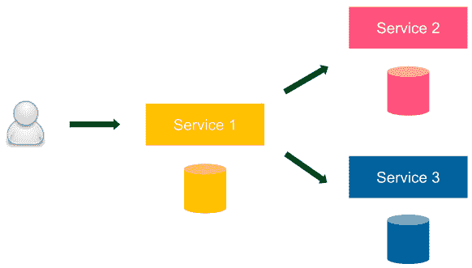

图 1.7 – 示例微服务系统

我们的系统中有三个服务，每个服务都有一个数据库。用户只与*服务 1*进行交互。作为一个更具体的例子，这个系统可以代表一个在线商店，其中*服务 1*可能代表结账服务，*服务 2*可能代表产品目录服务，*服务 3*可能代表客户服务。

我们可以为整个系统实现一个 CD 流水线，或者为每个微服务实现一个单独的 CD 流水线。哪种方法更合适呢？我们来考虑一下这两种选择。如果我们创建一个 CD 流水线，这意味着自动化验收测试阶段将从最终用户的角度对整个系统进行测试，这似乎是正确的。然而，一个 CD 流水线也意味着我们同时部署所有服务，这与微服务原则完全相悖。记住，在每个基于微服务的系统中，服务是松耦合的，并且应该始终是可独立部署的。

所以，我们需要采取第二种方法，为每个服务创建一个单独的 CD 流水线。然而，在这种情况下，自动化验收测试阶段从未对整个系统进行测试。那么，我们如何确保从最终用户的角度来看，一切都正常呢？为了回答这个问题，我们需要更多关于微服务架构的背景信息。

在微服务架构中，每个服务都是一个独立的单元，通常由一个独立的团队开发和维护。服务是松耦合的，它们通过一个明确定义的 API 进行通信，该 API 应始终保持向后兼容。在这种情况下，每个内部微服务与外部服务没有太大区别。这就是为什么我们应该始终能够在不测试其他服务的情况下部署新服务。请注意，这并不排除为整个系统进行单独验收测试的可能性。它解释的是，整个系统的验收测试不应成为单个服务部署的门槛。

信息

CD 流程适用于单体系统和基于微服务的系统。在前者的情况下，我们应该始终为每个微服务创建一个单独的 CD 流水线。

为了简化起见，本书中的所有示例都呈现了一个由单一服务组成的系统。

# 构建 CD 流程

到目前为止，我们已经介绍了关于 CD 流程的理念、好处和前提条件。在本节中，我们将描述本书中将使用的工具及其在整个系统中的位置。

信息

如果你对 CD 流程的概念感兴趣，可以看看 *Jez Humble* 和 *David Farley* 合著的精彩书籍《*Continuous Delivery: Reliable Software Releases through Build, Test, and Deployment Automation*》。

## 介绍工具

首先，工具的重要性总是低于理解它在流程中的作用。换句话说，任何工具都可以被一个执行相同角色的工具替代。例如，Jenkins 可以被 Atlassian Bamboo 替代，Chef 可以用 Ansible 代替。这就是为什么每一章都会以该工具为何必要以及它在整个流程中作用的概述开始。然后，工具会与其替代品进行比较。这将为你提供在你的环境中选择合适工具的灵活性。

另一种方法可能是从理念层面描述 CD 过程；然而，我坚信，提供一个精确的例子，并附上代码片段——这样你自己也能运行的示例——会让你对这个概念有更好的理解。  

信息  

本书有两种阅读方式。第一种是阅读并理解 CD 过程的概念。第二种是在阅读的同时创建环境并执行所有脚本，以理解细节。  

让我们快速了解一下本书中将使用的工具。然而，本节仅是对每项技术的简要介绍——更多的细节将在本书后续章节中提供。  

### Docker 生态系统  

Docker，作为容器化运动的明确领导者，近年来在软件行业占据了主导地位。它允许我们将应用程序打包成环境无关的镜像，并将服务器视为资源的农场，而不是必须为每个应用程序配置的机器。Docker 是本书的明确选择，因为它适应了（微）服务世界和 CD 过程。  

Docker 包含以下几项额外技术：  

+   **Docker Hub**：这是一个 Docker 镜像的注册中心  

+   **Kubernetes**：这是一个容器编排工具  

    信息  

    在本书的第一版中，Docker Compose 和 Docker Swarm 被介绍为用于集群化和调度多容器应用的工具。然而，从那时起，Kubernetes 已成为市场的领导者，并被取而代之。  

### Jenkins

Jenkins 是目前市场上最流行的自动化服务器。它有助于创建 CI 和 CD 管道，通常也可用于任何其他自动化脚本序列。Jenkins 高度依赖插件，并且拥有一个活跃的社区，不断通过新功能扩展其功能。更重要的是，它允许我们将管道写成代码，并支持分布式构建环境。  

### Ansible  

Ansible 是一种自动化工具，帮助进行软件配置、配置管理和应用部署。它的流行速度超过了任何其他配置管理引擎，并将很快超越其两大竞争对手：Chef 和 Puppet。它采用无代理架构，并与 Docker 无缝集成。  

### GitHub  

GitHub 是所有托管版本控制系统中最好的。它提供了一个非常稳定的系统，一个出色的基于 Web 的 UI，并且为公共仓库提供免费服务。话虽如此，任何源代码管理服务或工具都可以与 CD（持续交付）配合使用，无论它是基于云的还是自托管的，是否基于 Git、SVN、Mercurial 或任何其他工具。  

### Java/Spring Boot/Gradle  

Java 多年来一直是最流行的编程语言。因此，它将用于本书中的大多数代码示例。与 Java 一起，许多公司使用 Spring 框架进行开发，所以我们也使用它来创建一个简单的 Web 服务，解释一些概念。Gradle 用作构建工具，它虽然不如 Maven 流行，但发展势头更快。像往常一样，任何编程语言、框架或构建工具都可以替换，CD 流程保持不变，所以如果你的技术栈不同，也不必担心。

### 其他工具

Cucumber 被任意选作验收测试框架。其他类似的解决方案包括 FitNesse 和 Jbehave。对于数据库迁移过程，我们将使用 Flyway，但任何其他工具都可以，如 Liquibase。

## 创建一个完整的 CD 系统

你可以从两个角度来了解本书的组织方式。

第一个角度是基于自动化部署流水线的步骤。每一章都会将你带得更接近完整的 CD 流程。如果你查看各章的名称，其中有些甚至与流水线的阶段名称相同：

+   CI 流水线

+   自动化验收测试

+   使用 Ansible 进行配置管理

剩余的章节提供了对过程的介绍、总结或补充信息。

本书还有第二个角度的内容。每一章描述了环境中的一个部分，这些部分也为 CD 流程的顺利进行做好了充分准备。换句话说，本书一步一步、技术一项一项地展示了如何构建一个完整的系统。为了帮助你了解我们将在本书中构建的系统，接下来我们来看看每一章中系统如何逐步演变。

注意

如果此时你还不理解这些概念和术语，不用担心。我们将在相应的章节中从头开始学习所有内容。

### 引入 Docker

在*第二章*，*引入 Docker*中，我们将从系统的核心开始，构建一个已打包为 Docker 镜像的工作应用。本章的输出如下图所示：

图 1.8 – 引入 Docker

一个 Docker 化的应用（Web 服务）作为容器在**Docker 主机**上运行，并且可以访问，因为它将直接在主机机器上运行。这是通过端口转发（在 Docker 术语中是端口发布）实现的。

### 配置 Jenkins

在*第三章*，*配置 Jenkins*中，我们将准备 Jenkins 环境。得益于多个代理（从属）节点的支持，它能够处理繁重的并发负载。结果如下图所示：

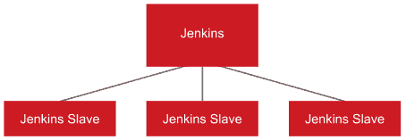

图 1.9 – 配置 Jenkins

**Jenkins** 主机接收构建请求，但执行过程从某个 **Jenkins Slave**（代理）机器开始。这种方法提供了 Jenkins 环境的水平扩展。

### CI 管道

在*第四章*，《*持续集成管道*》中，我们将向您展示如何创建 CD 管道的第一阶段：提交阶段。该章节的输出如下图所示：

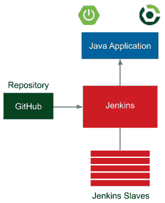

图 1.10 – CI 管道

该应用程序是一个简单的 Web 服务，使用 Java 和 Spring Boot 框架编写。Gradle 用作构建工具，GitHub 用作源代码仓库。每次提交到 GitHub 都会自动触发 Jenkins 构建，Jenkins 使用 Gradle 编译 Java 代码，运行单元测试并执行其他检查（如代码覆盖率、静态代码分析等）。一旦 Jenkins 构建完成，会发送通知给开发人员。

在本章结束后，您将能够创建一个完整的 CI 管道。

### 自动化验收测试

在*第五章*，《*自动化验收测试*》中，我们将结合本书标题中提到的两项技术：*Docker* 和 *Jenkins*。这将导致下图所示的系统：

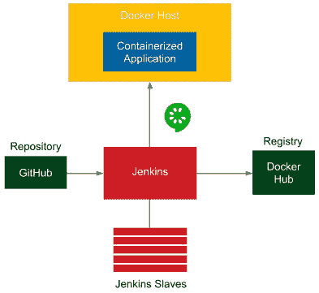

图 1.11 – 自动化验收测试

上述图表中的额外元素与自动化验收测试阶段相关：

+   **Docker 注册库**：在 CI 阶段之后，应用程序被打包成 JAR 文件，然后作为 Docker 镜像。该镜像随后被推送到 **Docker 注册库**，它充当容器化应用程序的存储库。

+   **Docker 主机**：在执行验收测试套件之前，必须先启动应用程序。Jenkins 触发 **Docker 主机** 机器从 **Docker 注册库** 拉取容器化的应用程序并启动它。

+   **Cucumber**：在应用程序启动在 **Docker 主机** 上之后，Jenkins 会运行一套使用 **Cucumber** 框架编写的验收测试。

### 使用 Kubernetes 集群

在*第六章*，《*使用 Kubernetes 集群*》中，我们将用 Kubernetes 集群替换单个 Docker 主机，并将单个独立应用程序替换为两个依赖的容器化应用程序。输出为下图所示的环境：

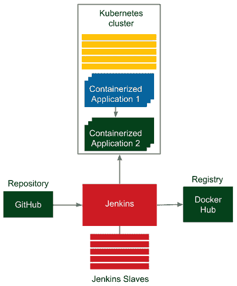

图 1.12 – 使用 Kubernetes 集群

Kubernetes 提供了一层抽象，管理一组 Docker 主机，并允许依赖应用程序之间的简单通信。我们不再需要考虑应用程序部署在哪台机器上。我们关心的只是实例的数量。

### 使用 Ansible 进行配置管理

在 *第七章*，《*使用 Ansible 进行配置管理*》中，我们将使用 Ansible 创建多个环境。输出结果如下图所示：

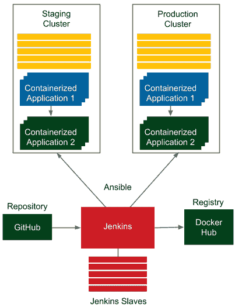

图 1.13 – 使用 Ansible 进行配置管理

Ansible 负责管理环境，允许你在多个机器上部署相同的应用程序。结果是，我们拥有一个镜像环境用于测试和生产。

在本章中，我们还将触及 IaC，并展示如果使用云环境，如何使用 Terraform。

### CD 流水线/高级 CD

在最后两章——即 *第八章*，《*持续交付流水线*》和 *第九章*，《*高级持续交付*》——我们将把应用程序部署到预发布环境，运行验收测试套件，并将应用程序发布到生产环境，通常会在多个实例中进行。最终的改进是，我们将能够通过将 Flyway 迁移集成到交付过程中，自动管理数据库架构。此书中将创建的最终环境如下面的图所示：

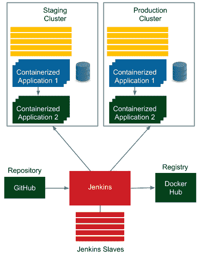

图 1.14 – CD 流水线/高级 CD

我希望你已经对我们将在本书中构建的内容感到兴奋。我们将逐步进行，解释每个细节和所有可能的选项，帮助你理解这些过程和工具。阅读完本书后，你将能够在你的项目中引入或改进 CD 流程。

# 总结

在这一章中，我们介绍了 CD 流程，包括其背后的理念、先决条件以及本书中将使用的工具。关键点是，当前大多数公司使用的交付流程存在显著不足，可以通过现代自动化工具进行改进。CD 方法提供了多个优势，其中最显著的包括快速交付、快速反馈周期和低风险发布。CD 流水线包括三个阶段：CI、自动化验收测试和配置管理。引入 CD 通常需要组织改变其文化和结构。在 CD 上下文中，最重要的工具是 Docker、Jenkins 和 Ansible。

在下一章，我们将介绍 Docker，并向你展示如何构建一个 Docker 化的应用程序。

# 问题

为了测试你对本章内容的理解，请回答以下问题：

1.  传统交付过程的三个阶段是什么？

1.  CD 流水线的三个主要阶段是什么？

1.  至少列出使用 CD 的三个好处。

1.  在 CD 流水线中应该自动化哪些类型的测试？

1.  我们应该增加更多的集成测试还是单元测试？解释原因。

1.  DevOps 这个术语是什么意思？

1.  本书将使用哪些软件工具？请列出至少四个。

# 进一步阅读

要了解更多关于 CD 概念及其背景的信息，请参考以下资源：

+   *持续交付*，作者：Jez Humble 和 David Farley: [`continuousdelivery.com/`](https://continuousdelivery.com/)

+   *测试金字塔*，作者：Martin Fowler: [`martinfowler.com/bliki/TestPyramid.html`](https://martinfowler.com/bliki/TestPyramid.html)

+   *敏捷成功之道：使用 Scrum 进行软件开发*，作者：Mike Cohn

+   *构建微服务：设计精细化系统*，作者：Sam Newman
