# *第二章*：介绍 Docker

在本章中，我们将讨论现代 **持续交付**（**CD**）过程是如何通过引入 Docker 来实现的，Docker 是改变了 **信息技术**（**IT**）行业及服务器使用方式的技术。

本章涵盖以下主题：

+   什么是 Docker？

+   安装 Docker

+   运行 Docker hello-world

+   Docker 组件

+   Docker 应用

+   构建 Docker 镜像

+   Docker 容器状态

+   Docker 网络

+   使用 Docker 卷

+   在 Docker 中使用名称

+   Docker 清理

+   Docker 命令概述

# 技术要求

完成本章内容，你需要满足以下硬件/软件要求：

+   至少需要 4 **千兆字节**（**GB**）的 **随机存取存储器**（**RAM**）

+   macOS 10.15+、Windows 10/11 Pro 64 位、Ubuntu 20.04+ 或其他 Linux 操作系统

所有示例和练习的解决方案可以在 [`github.com/PacktPublishing/Continuous-Delivery-With-Docker-and-Jenkins-3rd-Edition/tree/main/Chapter02`](https://github.com/PacktPublishing/Continuous-Delivery-With-Docker-and-Jenkins-3rd-Edition/tree/main/Chapter02) 找到。

本章的《代码实战》视频可以在 [`bit.ly/3LJv1n6`](https://bit.ly/3LJv1n6) 上观看。

# 什么是 Docker？

Docker 是一个开源项目，旨在通过使用软件容器来帮助应用程序部署。这种方法意味着将应用程序与完整的环境（文件、代码库、工具等）一起运行。因此，Docker —— 类似于虚拟化 —— 允许将应用程序打包成一个可以在任何地方运行的镜像。

## 容器化与虚拟化

如果没有 Docker，隔离和其他好处可以通过使用硬件虚拟化来实现，这通常被称为 **虚拟机**（**VMs**）。最受欢迎的解决方案有 VirtualBox、VMware 和 Parallels。虚拟机仿真计算机架构，并提供物理计算机的功能。如果将每个应用程序作为独立的虚拟机镜像交付并运行，则可以实现完全的应用隔离。

以下图表展示了虚拟化的概念：

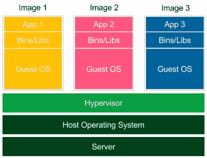

图 2.1 – 虚拟化

每个应用程序都作为一个包含所有依赖项和客操作系统的独立镜像启动。这些镜像由 **虚拟机管理程序**（**hypervisor**）运行，虚拟机管理程序仿真物理计算机架构。这种部署方法得到了许多工具（如 Vagrant）的广泛支持，并且专为开发和测试环境而设计。然而，虚拟化有三个显著的缺点，如下所述：

+   **低性能**：虚拟机仿真整个计算机架构以运行客操作系统，因此执行每个操作时都有显著的开销。

+   **高资源消耗**：仿真需要大量资源，并且必须为每个应用单独执行。这就是为什么在标准桌面机器上，只有少数应用可以同时运行。

+   **大图像大小**：每个应用程序都配备了完整的操作系统，因此在服务器上部署意味着需要传输和存储大量数据。

容器化的概念提供了一种不同的解决方案，正如我们在这里看到的：

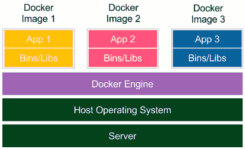

图 2.2 – 容器化

每个应用程序与其依赖项一起交付，但不包括操作系统。应用程序直接与主机操作系统接口，因此没有额外的来宾操作系统层。这带来了更好的性能，并且没有浪费资源。此外，发布的 Docker 镜像要小得多。

请注意，在容器化的情况下，隔离发生在主机操作系统的进程级别。然而，这并不意味着容器共享它们的依赖项。每个容器都有自己的库，并且版本正确，如果其中任何一个库被更新，其他容器不会受到影响。为了实现这一点，Docker 引擎为容器创建了一组 Linux 名称空间和控制组。这就是 Docker 安全性基于 Linux 内核进程隔离的原因。尽管这种解决方案已经足够成熟，但可能会被认为比虚拟机提供的基于操作系统的完全隔离稍微不那么安全。

## Docker 的需求

Docker 容器化解决了传统软件交付中出现的许多问题。让我们仔细看看。

### 环境

安装和运行软件是复杂的。你需要关于操作系统、资源、库、服务、权限、其他软件以及应用程序所依赖的一切做出决策。然后，你需要知道如何安装它。更重要的是，可能会存在一些冲突的依赖关系。*那该怎么办呢？* *如果你的软件需要升级某个库，而其他资源不需要怎么办？* 在一些公司中，这类问题通过设立*应用程序类别*来解决，每个类别由专用服务器提供支持，例如，使用 Java 7 的 Web 服务服务器和使用 Java 8 的批处理作业服务器。然而，这种解决方案在资源分配方面并不平衡，并且需要大量 IT 运维团队来管理所有生产和测试服务器。

环境复杂性的另一个问题是，它通常需要专业人员来运行应用程序。一个技术能力较弱的人可能很难设置 MySQL、**开放数据库连接**（**ODBC**）或任何其他稍微复杂的工具。对于那些不是以特定操作系统二进制文件形式交付的应用程序，尤其如此，这些应用程序需要源代码编译或其他特定于环境的配置。

### 隔离

保持工作区整洁。一个应用程序可以改变另一个应用程序的行为。想象一下可能发生什么。应用程序共享一个文件系统，如果应用程序*A*将数据写入错误的目录，应用程序*B*就会读取到错误的数据。它们共享资源，因此，如果应用程序*A*有内存泄漏，它不仅会冻结自己，还可能冻结应用程序*B*。它们共享网络接口，因此如果应用程序*A*和*B*都使用端口`8080`，其中一个就会崩溃。隔离还涉及到安全性方面。如果运行一个有缺陷的应用程序或恶意软件，可能会对其他应用程序造成损害。这就是为什么将每个应用程序保存在一个独立的沙箱中是一个更安全的做法，它限制了可能对应用程序本身造成的损害范围。

### 组织应用程序

服务器通常最终看起来很杂乱，有大量正在运行的应用程序，没人知道它们的任何情况。*你将如何检查哪些应用程序正在服务器上运行，并且它们各自依赖了哪些库？* 它们可能依赖于库、其他应用程序或工具。如果没有详尽的文档，我们能做的就是查看正在运行的进程并开始猜测。Docker 通过将每个应用程序作为独立的容器来保持事物的有序，这样就可以列出、搜索和监控它们。

### 可移植性

*一次编写，处处运行*，这是早期 Java 版本广告中的口号。的确，Java 很好地解决了可移植性问题。然而，我仍然能想到一些失败的情况；例如，不兼容的本地依赖项或旧版的 Java 运行时环境。此外，并非所有软件都是用 Java 编写的。

Docker 将可移植性的概念提升了一个层次；如果 Docker 版本兼容，那么无论编程语言、操作系统还是环境配置如何，运送的软件都能正常工作。因此，Docker 可以用以下口号来表达：*运送整个环境，而不仅仅是代码*。

## 小猫与牲畜

传统软件部署和基于 Docker 的部署之间的区别，常用小猫与牲畜的类比来表达。每个人都喜欢小猫。小猫是独一无二的。每只小猫都有自己的名字并需要特别照顾。小猫是带有感情的。当它们死去时，我们会哭泣。相反，牲畜的存在仅仅是为了满足我们的需求。甚至“牲畜”这个词是单数的，因为它只是一群被一起对待的动物——没有名字，没有独特性。当然，它们是独一无二的（就像每台服务器都是独特的），但这并不重要。这就是为什么 Docker 背后的思想最直观的解释是：*把你的服务器当作牲畜对待，而不是宠物*。

## 替代的容器化技术

Docker 并不是市场上唯一的容器化系统。实际上，Docker 的早期版本基于开源的**Linux Containers**（**LXC**）系统，这是一个替代性的容器平台。其他知名的解决方案有**Windows Server containers**、**OpenVZ** 和**Linux Server**。然而，Docker 由于其简便性、良好的市场营销和创业方式，超越了所有其他系统。它能在大多数操作系统上运行，允许你在不到 15 分钟的时间内做一些有用的事情，并且拥有很多易用的功能、优秀的教程、一个强大的社区，可能还有 IT 行业中最棒的 logo！

我们已经理解了 Docker 的基本概念，接下来让我们进入实际部分，从头开始：Docker 安装。

# 安装 Docker

Docker 的安装过程既快速又简单。目前，它支持大多数 Linux 操作系统，并且为多个操作系统提供了专用的二进制文件。macOS 和 Windows 也通过原生应用得到很好的支持。然而，重要的是要理解 Docker 内部是基于 Linux 内核及其特性，这也是为什么在 macOS 和 Windows 上它使用虚拟机（macOS 使用 HyperKit，Windows 使用 Hyper-V）来运行 Docker Engine 环境。

## Docker 的先决条件

Docker Community Edition 的系统要求因操作系统不同而有所不同，具体如下：

+   **macOS**：

    +   macOS 10.15 或更新版本

    +   至少 4 GB 内存

    +   安装前没有 VirtualBox 版本 4.3.30 或更高版本

+   **Windows**：

    +   64 位 Windows 10/11

    +   已启用 Hyper-V 包

    +   至少 4 GB 内存

+   **Linux**：

    +   64 位架构

    +   Linux 内核 3.10 或更高版本

如果你的机器不满足这些要求，解决方案是使用**VirtualBox**并安装 Ubuntu 操作系统。这个变通方法虽然听起来很复杂，但不一定是最糟糕的选择，特别是考虑到在 macOS 和 Windows 上 Docker Engine 环境本身就是虚拟化的。而且，Ubuntu 是使用 Docker 的最佳支持系统之一。

信息

本书中的所有示例都已在 Ubuntu 20.04 操作系统上进行过测试。

## 在本地机器上安装

Docker 安装过程非常简单，详细步骤可以参考官方页面：[`docs.docker.com/get-docker/`](https://docs.docker.com/get-docker/)。

### Docker Desktop

在本地环境中使用 Docker 的最简单方法是安装 Docker Desktop。通过这种方式，只需几分钟，你就可以拥有一个完整的 Docker 开发环境并运行起来。对于 Windows 和 macOS 用户，Docker Desktop 提供了一个本地应用程序，隐藏了所有设置的复杂性。技术上，Docker 引擎安装在一个虚拟机内，因为 Docker 需要 Linux 内核才能运行。然而，作为用户，你根本不需要考虑这一点——只需安装 Docker Desktop，就可以开始使用 `docker` 命令。你可以在下图中看到 Docker Desktop 的概览：

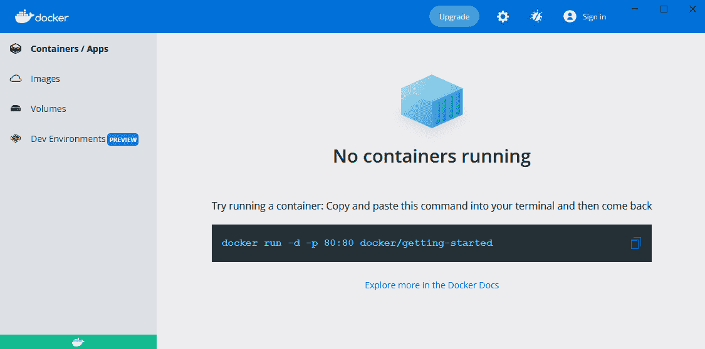

图 2.3 – Docker Desktop

除了 Docker 引擎外，Docker Desktop 还提供了以下一些附加功能：

+   一个 **用户界面** (**UI**) 用于显示镜像、容器和卷

+   本地 Kubernetes 集群

+   自动 Docker 更新

+   与本地文件系统集成的卷挂载

+   （Windows）支持 Windows 容器

+   （Windows）与 **Windows 子系统 Linux** (**WSL**)/**WSL 版本 2** (**WSL2**) 的集成

    注意

    请访问 [`docs.docker.com/get-docker/`](https://docs.docker.com/get-docker/) 获取 Docker Desktop 安装指南。

### Docker for Ubuntu

访问 [`docs.docker.com/engine/install/ubuntu/`](https://docs.docker.com/engine/install/ubuntu/) 查找如何在 Ubuntu 机器上安装 Docker 的指南。

在 Ubuntu 20.04 上，我执行了以下命令：

```
$ sudo apt-get update
$ sudo apt-get -y install ca-certificates curl gnupg lsb-release
$ curl -fsSL https://download.docker.com/linux/ubuntu/gpg | sudo gpg --dearmor -o /usr/share/keyrings/docker-archive-keyring.gpg
$ echo "deb [arch=$(dpkg --print-architecture) signed-by=/usr/share/keyrings/docker-archive-keyring.gpg] https://download.docker.com/linux/ubuntu $(lsb_release -cs) stable" | sudo tee /etc/apt/sources.list.d/docker.list > /dev/null
$ sudo apt-get update
$ sudo apt-get -y install docker-ce docker-ce-cli containerd.io
```

完成所有操作后，Docker 应该已经安装。但此时，只有 `root` 用户被允许使用 Docker 命令。这意味着每个 Docker 命令前都必须加上 `sudo` 关键字。

我们可以通过将其他用户添加到 `docker` 组来允许他们使用 Docker，方法如下：

```
$ sudo usermod -aG docker <username>
```

成功注销后，一切设置完成。然而，对于最新的命令，我们需要采取一些预防措施，以避免将 Docker 权限赋予不必要的用户，从而在 Docker 引擎环境中创建漏洞。在服务器机器上安装时尤其需要注意这一点。

### Docker for 其他 Linux 发行版

Docker 支持大多数 Linux 发行版和架构。详情请查看官方页面 [`docs.docker.com/engine/install/`](https://docs.docker.com/engine/install/)。

### 测试 Docker 安装

无论你选择了哪种安装方式（macOS、Windows、Ubuntu、Linux 或其他），Docker 应该已经设置好并准备就绪。测试的最佳方法是运行 `docker info` 命令。输出信息应该类似于以下内容：

```
$ docker info
Containers: 0
   Running: 0
    Paused: 0
   Stopped: 0
    Images: 0
…
```

## 在服务器上安装

为了通过网络使用 Docker，可以利用云平台提供商，或者手动在专用服务器上安装 Docker。

在第一种情况下，Docker 配置在不同平台间有所不同，但通常在专门的教程中都有详细描述。大多数云平台都允许通过用户友好的网页界面创建 Docker 主机，或提供执行命令的具体描述。

第二种情况（手动安装 Docker）确实需要简要说明一下。

### 专用服务器

手动在服务器上安装 Docker 与本地安装并没有太大区别。

还需要两个额外的步骤，其中包括让 Docker 守护进程监听网络套接字和设置安全证书。更多细节请参见这里：

1.  默认情况下，出于安全考虑，Docker 通过一个非网络化的 Unix 套接字运行，只允许本地通信。需要在所选的网络接口套接字上开启监听，以便外部客户端能够连接。在 Ubuntu 系统中，Docker 守护进程是由 `systemd` 配置的，因此，要修改其启动配置，我们需要修改`/lib/systemd/system/docker.service` 文件中的一行，如下所示：

    ```
    ExecStart=/usr/bin/dockerd -H <server_ip>:2375
    ```

通过修改这一行，我们启用了通过指定的 `systemd` 配置访问 Docker 守护进程，相关的配置可以在 [`docs.docker.com/config/daemon/systemd/`](https://docs.docker.com/config/daemon/systemd/) 中找到。

1.  这一步是关于服务器配置的 Docker 安全证书。这只允许通过证书认证的客户端访问服务器。Docker 证书配置的详细描述可以在 [`docs.docker.com/engine/security/protect-access/`](https://docs.docker.com/engine/security/protect-access/) 中找到。这一步不是强制性的；然而，除非你的 Docker 守护进程服务器位于有防火墙的网络中，否则它是必需的。

    信息

    如果你的 Docker 守护进程运行在公司网络中，你需要配置 **超文本传输协议** (**HTTP**) 代理。详细描述可以在 [`docs.docker.com/config/daemon/systemd/`](https://docs.docker.com/config/daemon/systemd/) 中找到。

Docker 环境已设置完毕并准备好，因此我们可以开始第一个示例。

# 运行 Docker hello-world

在控制台中输入以下命令：

```
$ docker run hello-world
Unable to find image 'hello-world:latest' locally
latest: Pulling from library/hello-world
1b930d010525: Pull complete
Digest: sha256:2557e3c07ed1e38f26e389462d03ed943586f744621577a99efb77324b0fe535
Status: Downloaded newer image for hello-world:latest
Hello from Docker!
This message shows that your installation appears to be working correctly.
...
```

恭喜！你刚刚运行了第一个 Docker 容器。我希望你已经能看出 Docker 是多么简单。让我们来看看在幕后发生了什么，如下所示：

1.  你使用 `run` 命令运行了 Docker 客户端。

1.  Docker 客户端联系 Docker 守护进程，并请求从名为 `hello-world` 的镜像创建一个容器。

1.  Docker 守护进程检查本地是否存在`hello-world`镜像，如果没有，则从远程 Docker Hub 仓库请求 `hello-world` 镜像。

1.  Docker Hub 仓库包含了`hello-world`镜像，因此它被拉取到 Docker 守护进程中。

1.  Docker 守护进程从 `hello-world` 镜像创建了一个新容器，启动了可执行文件并产生了输出。

1.  Docker 守护进程将此输出流式传输到 Docker 客户端。

1.  Docker 客户端将其发送到你的终端。

预计的流程如以下图所示：

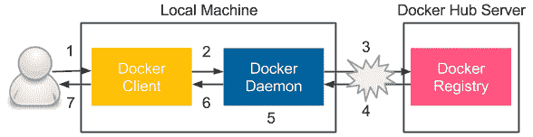

图 2.4 – docker run 命令执行步骤

现在让我们来看一下本节中展示的每个 Docker 组件。

# Docker 组件

Docker 实际上是一个包含多个组件的生态系统。让我们从仔细了解 Docker 客户端-服务器架构开始，描述所有这些组件。

## Docker 客户端和服务器

让我们看一下以下图表，它展示了 Docker 引擎的架构：

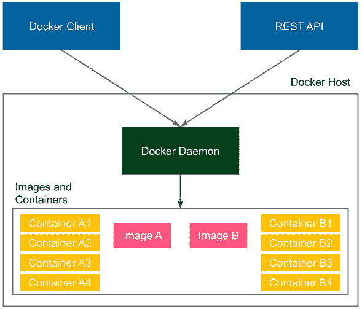

图 2.5 – Docker 客户端-服务器架构

Docker 引擎由以下三个组件组成：

+   在后台运行的**Docker 守护进程**（服务器）

+   作为命令工具运行的**Docker 客户端**

+   **Docker 表述性状态转移（REST）应用程序编程接口（API）**

安装 Docker 意味着安装所有组件，以便 Docker 守护进程始终作为服务在我们的计算机上运行。在`hello-world`示例中，我们使用 Docker 客户端与 Docker 守护进程交互；然而，我们也可以通过 REST API 做完全相同的事情。此外，在`hello-world`示例中，我们连接到了本地 Docker 守护进程，但我们也可以使用相同的客户端与运行在远程机器上的 Docker 守护进程进行交互。

提示

要在远程机器上运行 Docker 容器，可以使用`-H`选项：`docker -H <server_ip>:2375 run hello-world`。

## Docker 镜像和容器

**镜像**是 Docker 世界中的一个无状态构建块。你可以把镜像看作是运行你的应用程序所需的所有文件的集合，以及如何运行它的配方。镜像是无状态的，因此你可以通过网络传输它，存储到注册表中，给它命名，进行版本管理，并将其保存为文件。镜像是分层的，这意味着你可以在另一个镜像的基础上构建镜像。

容器是镜像的一个运行实例。如果我们想要有多个相同应用程序的实例，我们可以从同一个镜像创建多个容器。由于容器是有状态的，这意味着我们可以与它们交互并对其状态进行更改。

让我们来看一个**容器**和**镜像**分层结构的示例：

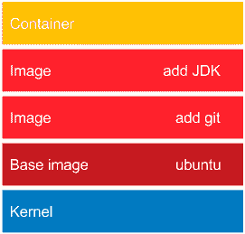

图 2.6 – Docker 镜像的分层结构

在最底部，总是有一个基础镜像。在大多数情况下，这代表了一个操作系统，我们在现有的基础镜像上构建我们的镜像。从技术上讲，可以创建你自己的基础镜像；然而，这种需求很少。

在我们的示例中，`ubuntu` 基础镜像提供了 Ubuntu 操作系统的所有功能。`add git` 镜像添加了 Git 工具集。接着，有一个镜像添加了 `add JDK` 镜像。这样的容器可以，例如，从 GitHub 仓库下载一个 Java 项目并将其编译为 **Java ARchive**（**JAR**）文件。结果是，我们可以使用这个容器来编译和运行 Java 项目，而无需在操作系统上安装任何工具。

需要注意的是，分层是一种非常聪明的机制，用于节省带宽和存储空间。假设我们有一个以下基于 Ubuntu 的应用程序：

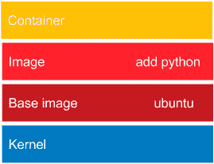

图 2.7 – 重用 Docker 镜像的层

这一次，我们将使用 Python 解释器。当安装 `add python` 镜像时，Docker 守护进程会注意到 `ubuntu` 镜像已经安装，所需要做的只是添加一个非常小的 Python 层。因此，`ubuntu` 镜像是一个被重用的依赖项。如果我们想在网络中部署我们的镜像，同样适用。当我们部署 Git 和 JDK 应用程序时，需要传输整个 `ubuntu` 镜像。然而，在随后部署 Python 应用程序时，我们只需要传输小的 `add python` 层。

现在我们已经了解了 Docker 生态系统的组成，让我们描述一下如何运行打包为 Docker 镜像的应用程序。

# Docker 应用程序

很多应用程序以 Docker 镜像的形式提供，可以从互联网上下载。如果我们知道镜像名称，那么就像运行 hello-world 示例一样，只需要运行它就可以了。*我们如何在 Docker Hub 上找到所需的应用程序镜像？* 以 **MongoDB** 为例。以下是我们需要遵循的步骤：

1.  如果我们想在 Docker Hub 上找到它，我们有两种选择，具体如下：](https://hub.docker.com/search/)

    +   [在 Docker Hub 上搜索](https://hub.docker.com/search/) `docker search` 命令。

在第二种情况下，我们可以执行以下操作：

```
$ docker search mongo
NAME   DESCRIPTION                    STARS   OFFICIAL AUTOMATED
mongo  MongoDB document databases...  8293    [OK] 
...
```

1.  有许多有趣的选项。*我们如何选择最佳镜像？* 通常，最吸引人的是没有任何前缀的镜像，因为这意味着它是官方的 Docker Hub 镜像，因此应该是稳定和维护的。带有前缀的镜像是非官方的，通常作为开源项目维护。在我们的例子中，最佳选择似乎是 `mongo`，因此为了运行 MongoDB 服务器，我们可以执行以下命令：

    ```
    $ docker run mongo
    Unable to find image 'mongo:latest' locally
    latest: Pulling from library/mongo
    7b722c1070cd: Pull complete
    ...
    Digest: sha256:a7c1784c83536a3c686ec6f0a1c570ad5756b94a1183af88c07df82c5b64663c
    {"t":{"$date":"2021-11-17T12:23:12.379+00:00"},"s":"I",  "c":"CONTROL",  "id":23285,   "ctx":"-","msg":"Automatically disabling TLS 1.0, to force-enable TLS 1.0 specify --sslDisabledProtocols 'none'"}
    ...
    ```

这就是我们需要做的。MongoDB 已经启动。作为 Docker 容器运行应用程序就是这么简单，因为我们不需要考虑任何依赖项；它们都与镜像一起提供。Docker 可以作为一个运行应用程序的有用工具，但真正的强大之处在于构建你自己的 Docker 镜像，将程序与环境一起打包。

信息

在 Docker Hub 服务上，你可以找到很多应用程序，它们存储了成千上万种不同的镜像。

# 构建 Docker 镜像

在这一部分，我们将展示如何使用两种不同的方式构建 Docker 镜像：`docker`的`commit`命令和 Dockerfile 自动化构建。

## docker commit

让我们从一个示例开始，准备一个包含 Git 和 JDK 工具包的镜像。我们将使用 Ubuntu 20.04 作为基础镜像。无需自己创建，绝大多数基础镜像都可以在 Docker Hub 仓库中找到。操作步骤如下：

1.  从`ubuntu:20.04`运行一个容器，并将其连接到命令行，如下所示：

    ```
    $ docker run -i -t ubuntu:20.04 /bin/bash
    ```

我们已经拉取了`ubuntu:20.04`镜像，将其作为容器运行，并以交互方式（`-i`标志）调用了`/bin/bash`命令。你应该能够看到容器的终端。由于容器是有状态且可写的，我们可以在它的终端中做任何我们想做的事情。

1.  安装 Git 工具包，如下所示：

    ```
    root@dee2cb192c6c:/# apt-get update
    root@dee2cb192c6c:/# apt-get install -y git
    ```

1.  通过运行以下命令检查是否安装了 Git 工具包：

    ```
    root@dee2cb192c6c:/# which git
    /usr/bin/git
    ```

1.  退出容器，如下所示：

    ```
    root@dee2cb192c6c:/# exit
    ```

1.  通过比较容器的唯一`ubuntu`镜像，检查容器中发生了什么变化，如下所示：

    ```
    $ docker diff dee2cb192c6c
    ```

上述命令应打印容器中所有更改的文件列表。

1.  将容器提交为镜像，如下所示：

    ```
    $ docker commit dee2cb192c6c ubuntu_with_git
    ```

我们刚刚创建了第一个 Docker 镜像。现在让我们列出所有 Docker 主机上的镜像，查看该镜像是否存在，如下所示：

```
$ docker images
REPOSITORY       TAG      IMAGE ID      CREATED            SIZE
ubuntu_with_git  latest   f3d674114fe2  About a minute ago 205 MB
ubuntu           20.04    20bb25d32758  7 days ago         87.5 MB
mongo            latest   4a3b93a299a7  10 days ago        394 MB
hello-world      latest   fce289e99eb9  2 weeks ago        1.84 kB
```

正如预期的那样，我们看到了`hello-world`、`mongo`（之前安装过）、`ubuntu`（从 Docker Hub 拉取的基础镜像）以及新建的`ubuntu_with_git`镜像。顺便提一下，我们可以观察到每个镜像的大小与我们在镜像上安装的内容相对应。

现在，如果我们从该镜像创建一个容器，它将安装 Git 工具，如下所示的代码片段所示：

```
$ docker run -i -t ubuntu_with_git /bin/bash
root@3b0d1ff457d4:/# which git
/usr/bin/git
root@3b0d1ff457d4:/# exit
```

## Dockerfile

使用`commit`命令手动创建每个 Docker 镜像可能会很繁琐，尤其是在构建自动化和持续交付过程中。幸运的是，Docker 提供了一种内建语言，可以指定构建 Docker 镜像时需要执行的所有指令。

让我们从一个与 Git 类似的示例开始。这次，我们将准备一个`ubuntu_with_python`镜像，如下所示：

1.  创建一个新目录，并在其中创建一个名为`Dockerfile`的文件，内容如下：

    ```
    FROM ubuntu:20.04
    RUN apt-get update && \
        apt-get install -y python
    ```

1.  运行以下命令以创建`ubuntu_with_python`镜像：

    ```
    $ docker build -t ubuntu_with_python .
    ```

1.  运行以下命令，检查镜像是否已创建：

    ```
    $ docker images
    REPOSITORY              TAG     IMAGE ID       CREATED SIZE
    ubuntu_with_python      latest  d6e85f39f5b7  About a minute ago  147 MB
    ubuntu_with_git_and_jdk latest  8464dc10abbb  3 minutes ago       580 MB
    ubuntu_with_git         latest  f3d674114fe2  9 minutes ago       205 MB
    ubuntu                  20.04   20bb25d32758  7 days ago          87.5 MB
    mongo                   latest  4a3b93a299a7  10 days ago         394 MB
    hello-world             latest  fce289e99eb9  2 weeks ago         1.84 kB 
    ```

现在，我们可以从镜像中创建一个容器，并检查 Python 解释器是否存在，方法与执行`docker commit`命令后一样。请注意，尽管`ubuntu`镜像是`ubuntu_with_git`和`ubuntu_with_python`的基础镜像，但它只列出了一次。

在本示例中，我们使用了前两个 Dockerfile 指令，如下所示：

+   `FROM`定义了在其上构建新镜像的基础镜像。

+   `RUN`指定了在容器内执行的命令。

其他广泛使用的指令详细说明如下：

+   `COPY/ADD` 将文件或目录复制到镜像的文件系统中。

+   `ENTRYPOINT` 定义了在可执行容器中应该运行的应用程序。

所有 Dockerfile 指令的完整指南可以在官方 Docker 页面找到，网址是 [`docs.docker.com/engine/reference/builder/`](https://docs.docker.com/engine/reference/builder/)。

## 完整的 Docker 应用程序

我们已经拥有构建一个完全可工作的应用程序作为 Docker 镜像所需的所有信息。作为示例，我们将一步一步地准备一个简单的 Python `hello-world` 程序。无论我们使用哪种环境或编程语言，步骤始终相同。

### 编写应用程序

创建一个新目录，并在此目录中创建一个名为 `hello.py` 的文件，内容如下：

```
print "Hello World from Python!"
```

关闭文件。这就是我们应用程序的源代码。

### 准备环境

我们的环境将在 Dockerfile 中表示。我们需要指令来定义以下内容：

+   应使用哪个基础镜像

+   如何安装 Python 解释器

+   如何将 `hello.py` 包含到镜像中

+   如何启动应用程序

在同一目录中创建 Dockerfile，方法如下：

```
FROM ubuntu:20.04
RUN apt-get update && \
    apt-get install -y python
COPY hello.py .
ENTRYPOINT ["python", "hello.py"]
```

### 构建镜像

现在，我们可以以与之前完全相同的方式构建镜像，如下所示：

```
$ docker build -t hello_world_python .
```

### 运行应用程序

我们通过运行容器来启动应用程序，方法如下：

```
$ docker run hello_world_python
```

你应该会看到一个友好的 **Hello World from Python!** 消息。这个示例中最有趣的地方是，我们能够运行用 Python 编写的应用程序，而无需在主机系统中安装 Python 解释器。这是因为打包成镜像的应用程序已经包含了所需的环境。

提示

Docker Hub 服务中已经存在带有 Python 解释器的镜像，因此在实际场景中，使用该镜像就足够了。

## 环境变量

我们已经运行了第一个自制的 Docker 应用程序。然而，*如果应用程序的执行依赖于某些条件怎么办？*

例如，在生产服务器的情况下，我们希望将 `Hello` 打印到日志中，而不是打印到控制台，或者我们可能希望在测试阶段和生产阶段有不同的依赖服务。一种解决方案是为每种情况准备一个单独的 Dockerfile；但是，还有一种更好的方法：环境变量。

让我们将 `hello-world` 应用程序修改为打印 `Hello World from <name_passed_as_environment_variable> !`。为了实现这一点，我们需要按照以下步骤操作：

1.  更改 `hello.py` Python 脚本以使用环境变量，如下所示：

    ```
    import os
    print "Hello World from %s !" % os.environ['NAME']
    ```

1.  构建镜像，方法如下：

    ```
    $ docker build -t hello_world_python_name .
    ```

1.  运行容器并传递环境变量，方法如下：

    ```
    $ docker run -e NAME=Rafal hello_world_python_name
    Hello World from Rafal !
    ```

1.  或者，我们可以在 Dockerfile 中定义一个环境变量值，如下所示：

    ```
    ENV NAME Rafal
    ```

1.  以不指定 `-e` 选项的方式运行容器，如下所示：

    ```
    $ docker build -t hello_world_python_name_default .
    $ docker run hello_world_python_name_default
    Hello World from Rafal !
    ```

环境变量在我们需要根据 Docker 容器的用途拥有不同版本时特别有用；例如，为生产和测试服务器提供单独的配置文件。

信息

如果环境变量同时在 Dockerfile 和作为标志中定义，则标志优先。

# Docker 容器状态

迄今为止，我们运行的每个应用程序都应该执行某些工作然后停止——例如，我们打印了`Hello from Docker!`并退出。然而，有些应用程序应该持续运行，比如服务。

要在后台运行容器，我们可以使用`-d`（`--detach`）选项。我们可以尝试使用`ubuntu`镜像，如下所示：

```
$ docker run -d -t ubuntu:20.04
```

此命令启动了 Ubuntu 容器，但并没有将控制台附加到它。我们可以使用以下命令查看它是否正在运行：

```
$ docker ps
CONTAINER ID   IMAGE           COMMAND       STATUS         PORTS 
NAMES
95f29bfbaadc   ubuntu:20.04    "/bin/bash"   Up 5 seconds kickass_stonebraker
```

此命令打印所有处于**运行中**状态的容器。*那么我们的旧容器，它们已经退出了呢？* 我们可以通过打印所有容器来找到它们，如下所示：

```
$ docker ps -a
CONTAINER ID   IMAGE          COMMAND       STATUS       PORTS  
NAMES
95f29bfbaadc   ubuntu:20.04   "/bin/bash"    Up 33 seconds kickass_stonebraker
34080d914613   hello_world_python_name_default "python hello.py" Exited lonely_newton
7ba49e8ee677 hello_world_python_name "python hello.py" Exited mad_turing
dd5eb1ed81c3 hello_world_python "python hello.py" Exited thirsty_bardeen
...
```

请注意，所有旧的容器都处于**退出**状态。我们还有两个状态尚未观察到：**暂停**和**重启**。

所有状态及其之间的转换展示在以下图表中：

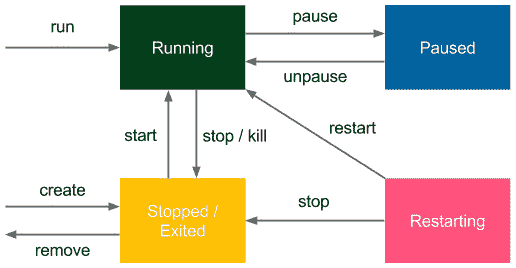

图 2.8 – Docker 容器状态

暂停 Docker 容器是非常罕见的，技术上它是通过使用`SIGSTOP`信号冻结进程来实现的。重启是当容器使用`--restart`选项运行时的一种临时状态，用于定义重启策略（Docker 守护进程能够在失败时自动重启容器）。

上图还显示了用于将 Docker 容器状态从一个状态转换到另一个状态的 Docker 命令。

例如，我们可以停止运行 Ubuntu 容器，如下所示：

```
$ docker stop 95f29bfbaadc    
$ docker ps
CONTAINER ID IMAGE COMMAND CREATED STATUS PORTS NAMES
```

信息

我们一直使用`docker run`命令来创建并启动容器。然而，也可以仅创建一个容器而不启动它（使用`docker create`）。

掌握了 Docker 状态的细节后，让我们描述一下 Docker 世界中的网络基础知识。

# Docker 网络

现在的大多数应用程序都不是孤立运行的；它们需要通过网络与其他系统进行通信。如果我们想在 Docker 容器内运行网站、Web 服务、数据库或缓存服务器，我们需要首先了解如何运行服务并将其端口暴露给其他应用程序。

## 运行服务

让我们从一个简单的示例开始，并直接从 Docker Hub 运行一个 Tomcat 服务器，如下所示：

```
$ docker run -d tomcat
```

Tomcat 是一个 Web 应用服务器，其用户界面可以通过端口`8080`访问。因此，如果我们在机器上安装了 Tomcat，我们可以在`http://localhost:8080`访问它。然而，在我们的案例中，Tomcat 是在 Docker 容器内运行的。

我们以与第一个`Hello World`示例相同的方式启动它。我们可以看到它正在运行，如下所示：

```
$ docker ps
CONTAINER ID IMAGE  COMMAND           STATUS            PORTS    NAMES
d51ad8634fac tomcat "catalina.sh run" Up About a minute 8080/tcp jovial_kare
```

由于它是以守护进程方式运行（使用 `-d` 选项），所以我们不会立即在控制台看到日志。然而，我们可以通过执行以下代码来访问它：

```
$ docker logs d51ad8634fac
```

如果没有错误，我们应该看到很多日志，这表明 Tomcat 已经启动并且可以通过端口 `8080` 访问。我们可以尝试访问 `http://localhost:8080`，但无法连接。这是因为 Tomcat 已经在容器内启动，我们正在尝试从外部连接。换句话说，只有在通过命令连接到容器的控制台并在那里检查时，我们才能访问它。*我们如何使运行中的 Tomcat 从外部可访问呢？*

我们需要启动容器，并指定端口映射，使用 `-p`（`--publish`）标志，如下所示：

```
-p, --publish <host_port>:<container_port>
```

所以，让我们首先停止运行中的容器并启动一个新容器，如下所示：

```
$ docker stop d51ad8634fac
$ docker run -d -p 8080:8080 tomcat
```

等待几秒钟后，Tomcat 应该已经启动，我们应该能够打开其页面——`http://localhost:8080`。

以下截图演示了如何发布 Docker 容器端口：

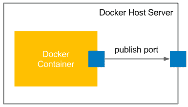

图 2.9 – 发布 Docker 容器端口

这样一个简单的端口映射命令在大多数常见的 Docker 用例中就足够了。我们能够将（微型）服务作为 Docker 容器部署并暴露它们的端口以促进通信。然而，让我们深入探讨一下背后发生了什么。

信息

Docker 还允许我们使用 `-p <ip>:<host_port>:<container_port>` 来发布到特定的主机网络接口。

## 容器网络

我们已经连接到运行在容器内的应用程序。实际上，连接是双向的，因为如果你记得我们之前的示例，我们从内部执行了 `apt-get install` 命令，包是从互联网下载的。*这是怎么可能的？*

如果你检查你机器上的网络接口，你会看到其中一个接口叫做 `docker0`，如下所示：

```
$ ifconfig docker0
docker0 Link encap:Ethernet HWaddr 02:42:db:d0:47:db 
     inet addr:172.17.0.1 Bcast:0.0.0.0 Mask:255.255.0.0
...
```

`docker0` 接口是 Docker 守护进程创建的，用于与 Docker 容器连接。现在，我们可以看到通过 `docker inspect` 命令查看到的 Tomcat Docker 容器内创建了哪些接口，如下所示：

```
$ docker inspect 03d1e6dc4d9e
```

这会以 **JavaScript 对象表示法** (**JSON**) 格式打印出关于容器配置的所有信息。其中，我们可以找到与网络设置相关的部分，如下所示的代码片段：

```
"NetworkSettings": {
     "Bridge": "",
     "Ports": {
          "8080/tcp": [
               {
                    "HostIp": "0.0.0.0",
                    "HostPort": "8080"
               }
          ]
          },
     "Gateway": "172.17.0.1",
     "IPAddress": "172.17.0.2",
     "IPPrefixLen": 16,
}
```

信息

为了过滤 `docker inspect` 的响应，我们可以使用 `--format` 选项——例如，`docker inspect --format '{{ .NetworkSettings.IPAddress }}' <container_id>`。

我们可以观察到 Docker 容器的 IP 地址是 `172.17.0.2`，它与 Docker 主机的 IP 地址 `172.17.0.1` 进行通信。这意味着，在我们之前的示例中，即使没有端口转发，使用 `http://172.17.0.2:8080` 也可以访问 Tomcat 服务器。然而，在大多数情况下，我们是在服务器机器上运行 Docker 容器，并希望将其暴露到外部，因此我们需要使用 `-p` 选项。

请注意，默认情况下，容器不会从外部系统打开任何路由。我们可以通过调整 `--network` 标志来更改这种默认行为，并按如下方式设置：

+   `bridge`（默认）：通过默认的 Docker 桥接网络

+   `none`：无网络

+   `container`：与其他（指定的）容器共同加入的网络

+   `host`：主机的网络堆栈

+   `NETWORK`：用户创建的网络（使用 `docker network create` 命令）

可以使用 `docker network` 命令列出并管理不同的网络，具体如下：

```
$ docker network ls
NETWORK ID    NAME    DRIVER  SCOPE
b3326cb44121  bridge  bridge  local 
84136027df04  host    host    local 
80c26af0351c  none    null    local
```

如果我们指定 `none` 作为网络，就无法连接到容器，反之亦然；容器也没有网络访问外部世界的能力。`host` 选项使得 `bridge`）成为可用，因为它让我们明确指定应该发布哪些端口，并且既安全又可访问。

## 暴露容器端口

我们曾多次提到容器暴露端口。事实上，如果我们深入 GitHub 上的 Tomcat 镜像（[`github.com/docker-library/tomcat`](https://github.com/docker-library/tomcat)），可以看到 Dockerfile 中有以下一行：

```
EXPOSE 8080
```

该 Dockerfile 指令规定应该从容器中暴露端口 `8080`。然而，正如我们已经看到的，这并不意味着端口会自动发布。`EXPOSE` 指令只是通知用户应该发布哪些端口。

## 自动端口分配

让我们尝试在不停止第一个 Tomcat 容器的情况下运行第二个 Tomcat 容器，如下所示：

```
$ docker run -d -p 8080:8080 tomcat
0835c95538aeca79e0305b5f19a5f96cb00c5d1c50bed87584cfca8ec790f241
docker: Error response from daemon: driver failed programming external connectivity on endpoint distracted_heyrovsky (1b1cee9896ed99b9b804e4c944a3d9544adf72f1ef3f9c9f37bc985e9c30f452): Bind for 0.0.0.0:8080 failed: port is already allocated.
```

这个错误可能是常见的。在这种情况下，我们必须自己处理端口的唯一性，或者让 Docker 自动分配端口，可以使用以下任一版本的 `publish` 命令：

+   `-p <container_port>`：将容器端口发布到未使用的主机端口

+   `-p`（`--publish-all`）：将容器暴露的所有端口发布到未使用的主机端口，具体如下：

    ```
    $ docker run -d -P tomcat
    078e9d12a1c8724f8aa27510a6390473c1789aa49e7f8b14ddfaaa328c8f737b
    $ docker port 078e9d12a1c8
    8080/tcp -> 0.0.0.0:32772
    ```

我们可以看到第二个 Tomcat 实例已发布到端口 `32772`，因此可以通过 `http://localhost:32772` 访问。

了解了 Docker 网络基础知识后，让我们看看如何使用 Docker 卷为 Docker 容器提供持久层。

# 使用 Docker 卷

假设你想将一个数据库作为容器运行。你可以启动这样的容器并输入数据。*数据存储在哪里？* *当你停止或移除容器时会发生什么？* 你可以重新启动一个新的容器，但数据库会再次为空。除非这是你的测试环境，否则你期望数据能够永久保存。

Docker 卷是 Docker 主机的目录，挂载在容器内。它允许容器像写入自己的文件系统一样写入主机的文件系统。这个机制在下图中展示：

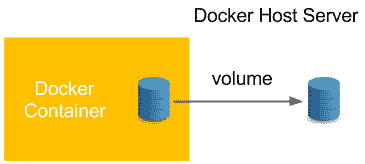

图 2.10 – 使用 Docker 卷

Docker 卷使得容器的数据得以持久化和共享。卷也清晰地将处理过程与数据分开。让我们从以下示例开始：

1.  使用`-v <host_path>:<container_path>`选项指定卷，然后连接到容器，方法如下：

    ```
    $ docker run -i -t -v ~/docker_ubuntu:/host_directory ubuntu:20.04 /bin/bash
    ```

1.  在容器中的`host_directory`创建一个空文件，方法如下：

    ```
    root@01bf73826624:/# touch /host_directory/file.txt
    ```

1.  通过运行以下命令检查文件是否在 Docker 主机的文件系统中创建：

    ```
    root@01bf73826624:/# exit
    exit
    $ ls ~/docker_ubuntu/
    file.txt
    ```

1.  我们可以看到文件系统已共享，因此数据得以永久保存。停止容器并运行一个新的容器，看看我们的文件是否还在，方法如下：

    ```
    $ docker run -i -t -v ~/docker_ubuntu:/host_directory ubuntu:20.04 /bin/bash
    root@a9e0df194f1f:/# ls /host_directory/
    file.txt
    root@a9e0df194f1f:/# exit
    ```

1.  不使用`-v`标志来指定卷，而是可以在 Dockerfile 中将其作为指令指定，如以下示例所示：

    ```
    VOLUME /host_directory
    ```

在这种情况下，如果我们不使用`-v`标志运行 Docker 容器，容器的`/host_directory`路径将映射到主机的卷的默认目录`/var/lib/docker/vfs/`。如果你交付一个应用程序作为镜像并且知道它由于某种原因需要持久存储（例如存储应用程序日志），这是一个很好的解决方案。

信息

如果一个卷在 Dockerfile 和作为标志都被定义，则`flag`命令具有优先权。

Docker 卷可以更复杂，特别是在数据库的情况下。然而，Docker 卷的更复杂用法超出了本书的范围。

信息

在 Docker 中进行数据管理的一个非常常见的方法是引入一个额外的层，即数据卷容器。数据卷容器是一个 Docker 容器，其唯一目的是声明一个卷。然后，其他容器可以使用它（通过`--volumes-from <container>`选项），而不需要直接声明卷。了解更多请访问[`docs.docker.com/storage/volumes/`](https://docs.docker.com/storage/volumes/)。

了解 Docker 卷后，让我们看看如何使用名称使得操作 Docker 镜像/容器更加方便。

# 在 Docker 中使用名称

到目前为止，当我们操作容器时，我们总是使用自动生成的名称。这种方法有一些优点，例如名称唯一（没有命名冲突）和自动化（无需做任何事）。然而，在许多情况下，给容器或镜像起一个用户友好的名称更好。

## 命名容器

有两个好理由来给容器命名：方便性和自动化的可能性。让我们看一下原因，具体如下：

+   **方便性**：用名称来操作容器比检查哈希或自动生成的名称更简单。

+   **自动化**：有时，我们希望依赖于容器的特定命名。

例如，我们可能希望有相互依赖的容器，并将一个容器链接到另一个容器。因此，我们需要知道它们的名称。

为了给容器命名，我们使用`--name`参数，如下所示：

```
$ docker run -d --name tomcat tomcat
```

我们可以通过 `docker ps` 来检查容器是否具有有意义的名称。这样，任何操作都可以使用容器的名称进行，例如以下示例：

```
$ docker logs tomcat
```

请注意，当容器被命名时，它不会失去其身份。我们仍然可以通过自动生成的哈希 ID 来引用容器，就像我们之前做的那样。

信息

一个容器总是有一个 ID 和一个名称。我们可以通过任意一个来引用它们，而且它们都是唯一的。

## 镜像打标签

镜像可以打标签。我们在创建自己的镜像时已经做过这件事——例如，在构建 `hello_world_python` 镜像时，如下所示：

```
$ docker build -t hello_world_python .
```

`-t` 标志描述镜像的标签。如果我们不使用它，镜像将没有标签，因此我们必须通过其 ID（哈希值）来引用它，才能运行容器。

镜像可以有多个标签，它们应该遵循以下命名约定：

```
<registry_address>/<image_name>:<version>
```

一个标签由以下部分组成：

+   `registry_address`：注册表的 IP 和端口或别名

+   `image_name`：构建的镜像名称，例如 `ubuntu`

+   `version`：镜像的版本，可以是任何形式的版本，例如 `20.04`、`20170310`

我们将在 *第五章* 中讨论 Docker 注册表，*自动化验收测试*。如果镜像保存在官方的 Docker Hub 注册表中，我们可以跳过注册表地址。这就是为什么我们运行 `tomcat` 镜像时没有任何前缀的原因。最后的版本总是被标记为 `latest`，并且可以省略，因此我们运行 `tomcat` 镜像时没有任何后缀。

信息

镜像通常有多个标签；例如，以下三个标签表示同一个镜像：`ubuntu:18.04`、`ubuntu:bionic-20190122` 和 `ubuntu:bionic`。

最后但同样重要的是，我们需要学习如何在玩 Docker 之后进行清理。

# Docker 清理

在本章中，我们已经创建了许多容器和镜像。然而，这仅仅是你在实际场景中会看到的一小部分。即使容器未运行，它们也需要存储在 Docker 主机上。这可能会迅速导致存储空间不足并停止机器。我们该如何解决这个问题呢？

## 清理容器

首先，让我们看一下存储在我们机器上的容器。以下是我们需要遵循的步骤：

1.  要打印所有容器（无论其状态如何），我们可以使用 `docker ps -a` 命令，如下所示：

    ```
    $ docker ps -a
    CONTAINER ID IMAGE  COMMAND           STATUS  PORTS  NAMES
    95c2d6c4424e tomcat "catalina.sh run" Up 5 minutes 8080/tcp tomcat
    a9e0df194f1f ubuntu:20.04 "/bin/bash" Exited         jolly_archimedes
    01bf73826624 ubuntu:20.04 "/bin/bash" Exited         suspicious_feynman
    ...
    ```

1.  为了删除一个停止的容器，我们可以使用`docker rm`命令（如果容器正在运行，我们需要先停止它），如下所示：

    ```
    $ docker rm 47ba1c0ba90e
    ```

1.  如果我们想要删除所有停止的容器，可以使用以下命令：

    ```
    $ docker container prune
    ```

1.  我们还可以采用另一种方法，通过使用`--rm`标志，要求容器在停止后自动删除自己，如以下示例所示：

    ```
    $ docker run --rm hello-world
    ```

在大多数现实场景中，我们不会使用已停止的容器，它们通常仅用于调试目的。

## 清理镜像

清理镜像与清理容器一样**重要**。它们可能占用大量空间，尤其是在 CD 流程中，每次构建都会生成一个新的 Docker 镜像。这可能很快导致*磁盘空间不足*的错误。具体步骤如下：

1.  要查看 Docker 容器中的所有镜像，我们可以使用`docker images`命令，如下所示：

    ```
    $ docker images
    REPOSITORY TAG                         IMAGE ID     CREATED     SIZE
    hello_world_python_name_default latest 9a056ca92841 2 hours ago 202.6 MB
    hello_world_python_name latest         72c8c50ffa89 2 hours ago 202.6 MB
    ...
    ```

1.  要删除一个镜像，我们可以使用以下命令：

    ```
    $ docker rmi 48b5124b2768
    ```

1.  对于镜像，自动清理过程稍微复杂一些。镜像没有状态，因此我们不能要求它们在不使用时自动删除。一个常见的策略是设置一个定时清理任务，删除所有旧的和未使用的镜像。我们可以使用以下命令来实现：

    ```
    docker volume prune command.
    ```

在清理部分结束后，我们已经完成了主要的 Docker 描述。接下来，让我们简要总结一下并回顾一下最重要的 Docker 命令。

提示

使用`docker system prune`命令删除所有未使用的容器、镜像和网络。此外，你还可以添加`–volumes`参数来清理卷。

# Docker 命令概览

所有 Docker 命令可以通过执行以下`help`命令找到：

```
$ docker help
```

要查看任何特定 Docker 命令的所有选项，我们可以使用`docker help <command>`，如下所示：

```
$ docker help run
```

官方 Docker 页面上也有非常好的 Docker 命令解释，[`docs.docker.com/engine/reference/commandline/docker/`](https://docs.docker.com/engine/reference/commandline/docker/) 上有详细说明。值得一读，或者至少浏览一下。

在本章中，我们介绍了最有用的命令及其选项。作为快速回顾，以下是它们的总结：

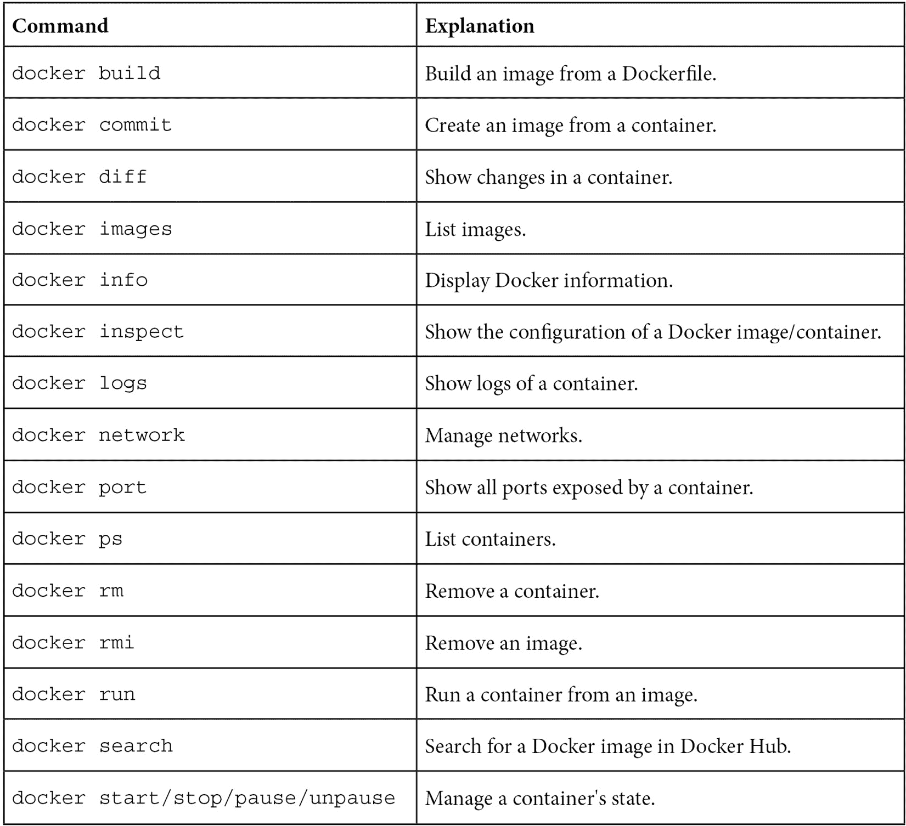

# 概要

在本章中，我们讲解了 Docker 的基础知识，这足以构建镜像和运行作为容器的应用程序。以下是主要要点总结。

容器化技术通过使用 Linux 内核特性来解决隔离和环境依赖问题。这是基于进程分离机制，因此不会出现真正的性能下降。Docker 可以安装在大多数系统上，但仅在 Linux 上原生支持。Docker 允许我们从互联网上获取可用的镜像并构建我们自己的镜像。镜像是将应用程序与所有依赖项打包在一起的文件。

Docker 提供了两种构建镜像的方法——使用 Dockerfile 或提交容器。在大多数情况下，使用第一种方法。Docker 容器可以通过发布它们暴露的端口进行网络通信。Docker 容器可以通过卷共享持久存储。为了方便，Docker 容器应该命名，Docker 镜像应该打标签。在 Docker 的世界里，关于如何标记镜像有一个特定的约定。为了节省服务器空间并避免 *磁盘空间不足* 错误，应该定期清理 Docker 镜像和容器。

在下一章中，我们将介绍 Jenkins 配置，并了解如何将 Jenkins 与 Docker 配合使用。

# 练习

我们在这一章中已经覆盖了很多内容。为了巩固我们所学的知识，推荐以下两个练习：

1.  运行 `CouchDB` 作为 Docker 容器并发布其端口，如下所示：

    提示

    你可以使用 `docker search` 命令查找 `CouchDB` 镜像。

    1.  运行容器。

    1.  发布`CouchDB`端口。

    1.  打开浏览器并检查`CouchDB`是否可用。

1.  创建一个包含 REST 服务的 Docker 镜像，回复 `Hello World` 到 `localhost:8080/hello`。使用你喜欢的任何语言和框架。以下是你需要遵循的步骤：

    提示

    创建 REST 服务的最简单方法是使用 Python 和 Flask 框架（[`flask.palletsprojects.com/`](https://flask.palletsprojects.com/)）。请注意，许多 Web 框架默认只在本地主机接口上启动应用程序。为了发布端口，必须在所有接口上启动它（在 Flask 框架中使用 `app.run(host='0.0.0.0')`）。

    1.  创建一个 Web 服务应用程序。

    1.  创建一个 Dockerfile 来安装依赖和库。

    1.  构建镜像。

    1.  运行发布端口的容器。

    1.  使用浏览器（或 `curl`）检查它是否正确运行。

# 问题

为了验证你在本章中获得的知识，请回答以下问题，使用 L-编号进行列表。

1.  容器化（如 Docker）和虚拟化（如 VirtualBox）之间的主要区别是什么？

1.  将应用程序提供为 Docker 镜像的好处是什么？请至少列举两点。

1.  Docker 守护进程是否可以在 Windows 和 macOS 上原生运行？

1.  Docker 镜像和 Docker 容器之间有什么区别？

1.  当说 Docker 镜像有层时，这意味着什么？

1.  创建 Docker 镜像的两种方法是什么？

1.  哪个命令用于从 Dockerfile 创建 Docker 镜像？

1.  哪个命令用于从 Docker 镜像运行 Docker 容器？

1.  在 Docker 术语中，发布端口是什么意思？

1.  什么是 Docker 卷？

# 进一步阅读

如果你对深入了解 Docker 和相关技术感兴趣，请查阅以下资源：

+   Docker 文档——*入门*：[`docs.docker.com/get-started/`](https://docs.docker.com/get-started/)

+   *Docker 书籍* 由 *詹姆斯·特恩布尔* 编写：[`dockerbook.com/`](https://dockerbook.com/)
