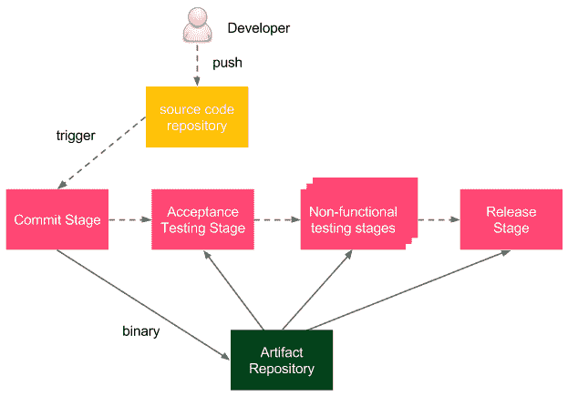
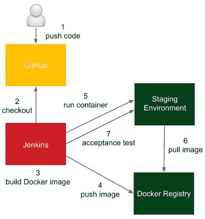
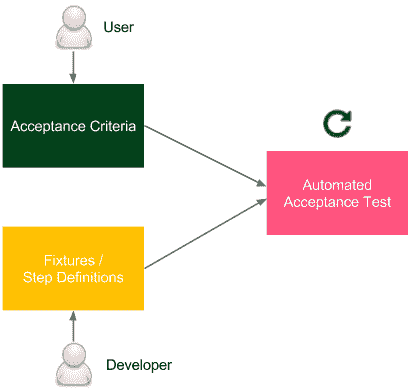
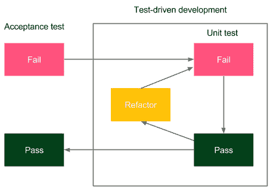

# *第五章*：自动化验收测试

我们已经配置了**持续交付**（**CD**）过程中的提交阶段，现在是时候处理验收测试阶段了，这通常是最具挑战性的部分。通过逐步扩展管道，我们将看到一个执行良好的验收测试自动化的不同方面。

本章涵盖以下主题：

+   引入验收测试

+   安装和使用 Docker Registry

+   Jenkins 管道中的验收测试

+   编写验收测试

# 技术要求

为完成本章内容，您需要以下软件：

+   Jenkins

+   Docker

+   **Java 开发工具包**（**JDK**）8+

所有示例和练习的解决方案可以在[`github.com/PacktPublishing/Continuous-Delivery-With-Docker-and-Jenkins-3rd-Edition/tree/main/Chapter05`](https://github.com/PacktPublishing/Continuous-Delivery-With-Docker-and-Jenkins-3rd-Edition/tree/main/Chapter05)找到。

本章的 Code in Action 视频可以通过[`bit.ly/3Ki1alm`](https://bit.ly/3Ki1alm)观看。

# 引入验收测试

**验收测试**是用来确定业务需求或合同是否满足的步骤。它涉及从用户角度对完整系统进行黑盒测试，测试通过的结果意味着软件交付的接受。有时也称为**用户验收测试**（**UAT**）或终端用户测试，这是开发过程中的一个阶段，软件面对的是*真实世界*的受众。

许多项目依赖于**质量保证人员**（**QA**）或用户执行的手动步骤来验证**功能**和**非功能要求**（**FRs**和**NFRs**），但从更合理的角度来看，还是将它们作为程序化的可重复操作来执行。

然而，自动化验收测试可能会因为其特性而变得困难，正如这里所描述的那样：

+   **面向用户**：这些测试需要与用户一起编写，这需要在技术和非技术两个世界之间达成理解。

+   **依赖集成**：被测试的应用程序应与其依赖项一起运行，以确保整个系统正常工作。

+   **暂存环境**：暂存（测试）环境需要与生产环境完全相同，以确保相同的功能和非功能行为。

+   **应用程序身份**：应用程序应该只构建一次，并将相同的二进制文件传输到生产环境。这消除了不同构建环境的风险。

+   **相关性与后果**：如果验收测试通过，那么从用户的角度来看，应用程序应该已准备好发布。

我们将在本章的不同部分解决这些问题。通过只构建一次 Docker 镜像并使用 Docker 注册表进行存储和版本控制，可以实现应用程序身份。如何以用户面向的方式创建测试将在《编写验收测试》一节中解释，而环境身份则由 Docker 工具本身解决，并且可以通过下一章中描述的其他工具进一步改进。

信息

验收测试可以有多种含义；在本书中，我们将验收测试视为从用户角度出发的完整集成测试套件，不包括性能、负载和恢复等非功能需求（NFRs）。

既然我们已经理解了验收测试的目标和意义，接下来让我们描述我们需要的第一个方面——**Docker 注册表**。

# 安装和使用 Docker 注册表

Docker 注册表是一个存储 Docker 镜像的地方。准确来说，它是一个无状态的服务器应用程序，允许镜像被发布（推送）并随后被检索（拉取）。在*第二章*，《介绍 Docker》中，我们已经看到过官方 Docker 镜像的例子，例如 `hello-world`。我们从 Docker Hub 拉取了这些镜像，Docker Hub 是一个官方的基于云的 Docker 注册表。拥有一个独立的服务器来存储、加载和搜索软件包是一个更为通用的概念，叫做软件仓库，或者更广义地称为文物库。让我们更深入地了解这个概念。

## 文物库

虽然源代码管理存储源代码，但文物库专门用于存储软件二进制文物，如编译后的库或组件，稍后用于构建完整的应用程序。*为什么我们需要使用单独的服务器和工具来存储二进制文件？* 下面是原因：

+   **文件大小**：文物文件可能很大，因此系统需要对其下载和上传进行优化。

+   **版本**：每个上传的文物需要有一个版本，以便轻松浏览和使用。然而，并非所有版本都必须永久保存；例如，如果发现了一个 bug，我们可能对相关文物不感兴趣并将其删除。

+   **修订映射**：每个文物应指向源代码管理的一个修订版本，并且更重要的是，二进制文件的创建过程应当是可重复的。

+   **包**：文物以编译和压缩的形式存储，这样就不需要重复这些耗时的步骤。

+   **访问控制**：用户可以根据访问源代码和文物二进制文件的权限设置不同的限制。

+   **客户端**：文物库的用户可以是团队或组织外部的开发人员，他们希望通过公共**应用程序编程接口**（**API**）使用该库。

+   **使用场景**：文物二进制文件用于确保每个环境中部署的构建版本完全相同，以便在失败时轻松回滚。

    信息

    最流行的制品库是**JFrog Artifactory**和**Sonatype Nexus**。

制品库在 CD 过程中的作用特殊，因为它保证在所有管道步骤中使用相同的二进制文件。

让我们看一下下面的图表来理解它是如何工作的：



图 5.1 – CD 过程中的制品库

**开发人员**将变更推送到**源代码仓库**，触发管道构建。作为**提交阶段**的最后一步，创建并存储一个二进制文件到**制品库**中。之后，在交付过程的所有其他阶段，都会使用相同的二进制文件（被拉取并使用）。

信息

二进制文件通常被称为**发布候选版**，将二进制文件移动到下一阶段的过程称为**晋升**。

根据不同的编程语言和技术，二进制格式可能有所不同。例如，在 Java 的情况下，通常会存储**Java ARchive**（**JAR**）文件，而在 Ruby 的情况下，则是 gem 文件。我们使用 Docker，因此我们会将 Docker 镜像作为制品存储，存储 Docker 镜像的工具被称为**Docker Registry**。

信息

一些团队同时维护两个制品库，一个用于存储 JAR 文件的制品库，另一个用于存储 Docker 镜像的 Docker Registry。虽然在 Docker 引入的初期阶段，这种做法可能有用，但没有必要一直维护两个库。

## 安装 Docker Registry

首先，我们需要安装一个 Docker Registry。有很多可用的选项，但它们都属于两个类别：基于云的 Docker Registry 和自托管的 Docker Registry。我们来深入了解一下它们。

### 基于云的 Docker Registry

使用基于云的服务的好处在于你不需要在自己本地安装或维护任何东西。有很多云服务可供选择，但 Docker Hub 无疑是最受欢迎的。这就是为什么我们在本书中会一直使用它的原因。

#### Docker Hub

Docker Hub 提供 Docker Registry 服务和其他相关功能，例如构建镜像、测试镜像，以及直接从代码仓库拉取代码。Docker Hub 是基于云的，因此实际上不需要任何安装过程。你需要做的就是创建一个 Docker Hub 账户，步骤如下：

1.  在浏览器中打开[`hub.docker.com/`](https://hub.docker.com/)。

1.  在**注册**中，填写密码、电子邮件地址和 Docker **标识符**（**ID**）。

1.  在收到电子邮件并点击激活链接后，会创建一个账户。

Docker Hub 无疑是最简单的选择，适合初学者使用，并允许存储私有和公共镜像。

#### Docker Hub 替代品

还有更多值得一提的云服务。首先，以下三个主要云平台每个平台都提供自己的 Docker Registry：

+   亚马逊**弹性容器注册表**（**ECR**）

+   谷歌制品库

+   Azure 容器注册表

其他广泛使用的解决方案包括：

+   Quay 容器注册表

+   JFrog Artifactory

+   GitLab 容器注册表

所有上述提到的注册表都实现了相同的 Docker 注册表协议，因此好消息是无论选择哪个，使用的命令完全相同。

### 自托管 Docker 注册表

云解决方案可能并不总是可接受的。它们对企业并非免费的，更重要的是，许多公司有政策要求不将软件存储在自己的网络之外。在这种情况下，唯一的选择是安装自托管 Docker 注册表。

Docker 注册表的安装过程快速且简单，但要确保其安全性并使其对公众可用，需要设置访问限制和域证书。这就是为什么我们将此部分分为三个部分，如下所示：

+   安装 Docker 注册表应用

+   添加域证书

+   添加访问限制

让我们看看每个部分。

#### 安装 Docker 注册表应用

Docker 注册表作为 Docker 镜像提供。要启动它，我们可以运行以下命令：

```
$ docker run -d -p 5000:5000 --restart=always --name registry registry:2
```

提示

默认情况下，注册表数据存储为 Docker 卷，位于默认主机文件系统的目录中。要更改它，您可以添加`-v <host_directory>:/var/lib/registry`。另一个选择是使用卷容器。

此命令启动注册表并通过端口`5000`使其可访问。`registry`容器从注册表镜像（版本 2）启动。`--restart=always`选项使容器在停止时自动重新启动。

提示

考虑设置负载均衡器，并在用户数量较多时启动几个 Docker 注册表容器。请注意，在这种情况下，它们需要共享存储或有一个同步机制。

#### 添加域证书

如果注册表运行在本地主机上，那么一切正常，不需要其他安装步骤。然而，在大多数情况下，我们希望为注册表配置专用服务器，以便图像能够广泛可用。在这种情况下，Docker 需要使用`--insecure-registry`标志来保护注册表。

信息

您可以阅读有关创建和使用自签名证书的内容：[`docs.docker.com/registry/insecure/#use-self-signed-certificates`](https://docs.docker.com/registry/insecure/#use-self-signed-certificates)。

一旦证书被 CA 签署或自签署，我们可以将`domain.crt`和`domain.key`移动到`certs`目录，并启动注册表，注册表将监听默认的**超文本传输安全协议**（**HTTPS**）端口，如下所示：

```
$ docker run -d -p 443:443 --restart=always --name registry -v `pwd`/certs:/certs -e REGISTRY_HTTP_ADDR=0.0.0.0:443 -e REGISTRY_HTTP_TLS_CERTIFICATE=/certs/domain.crt -e REGISTRY_HTTP_TLS_KEY=/certs/domain.key registry:2
```

不推荐使用`--insecure-registry`标志，因为它没有进行适当的 CA 验证。

信息

详细了解如何在官方 Docker 文档中设置 Docker 注册表并使其安全：[`docs.docker.com/registry/deploying/`](https://docs.docker.com/registry/deploying/)。

#### 添加访问限制

除非我们在高度安全的私有网络内使用注册表，否则应该配置身份验证。

最简单的方法是使用`registry`镜像中的`htpasswd`工具创建一个带有密码的用户，如下所示：

```
$ mkdir auth
$ docker run --entrypoint htpasswd httpd:2 -Bbn <username> <password> > auth/htpasswd
```

该命令运行`htpasswd`工具来创建一个`auth/htpasswd`文件（其中包含一个用户）。然后，我们可以使用该文件中的用户来运行注册表，以便授权访问，如下所示：

```
$ docker run -d -p 443:443 --restart=always --name registry -v `pwd`/auth:/auth -e "REGISTRY_AUTH=htpasswd" -e "REGISTRY_AUTH_HTPASSWD_REALM=Registry Realm" -e REGISTRY_AUTH_HTPASSWD_PATH=/auth/htpasswd -v `pwd`/certs:/certs -e REGISTRY_HTTP_ADDR=0.0.0.0:443 -e REGISTRY_HTTP_TLS_CERTIFICATE=/certs/domain.crt -e REGISTRY_HTTP_TLS_KEY=/certs/domain.key registry:2
```

该命令除了设置证书之外，还会创建一个访问限制，限制仅有`auth/passwords`文件中指定的用户可以访问。

结果是，在使用注册表之前，客户端需要指定用户名和密码。

重要提示

如果使用了`--insecure-registry`标志，访问限制将不起作用。

## 使用 Docker 注册表

当我们的注册表配置好之后，我们可以分三步展示如何使用它，如下所示：

+   构建镜像

+   推送镜像到注册表

+   从注册表拉取镜像

### 构建镜像

让我们使用*第二章*中的示例，*介绍 Docker*，并构建一个安装了 Ubuntu 和 Python 解释器的镜像。在一个新的目录中，我们需要创建一个 Dockerfile，如下所示：

```
FROM ubuntu:20.04
RUN apt-get update && \
    apt-get install -y python
```

现在，我们可以通过以下命令构建镜像：

```
$ docker build -t ubuntu_with_python .
```

在镜像构建完成后，我们可以将其推送到 Docker 注册表。

### 推送镜像到注册表

为了推送创建的镜像，我们需要根据命名约定对其进行标签，如下所示：

```
<registry_address>/<image_name>:<tag>
```

`registry_address`值可以是以下之一：

+   Docker Hub 中的用户名

+   域名或`localhost:5000`

    信息

    在大多数情况下，`<tag>`是镜像/应用版本的形式。

让我们给镜像添加标签，以便使用 Docker Hub，如下所示：

```
$ docker tag ubuntu_with_python leszko/ubuntu_with_python:1
```

请记得使用您的 Docker Hub 用户名，而不是`leszko`。

提示

我们也可以在`build`命令中对镜像进行标签，例如：`docker build -t leszko/ubuntu_with_python:1`。

如果仓库已配置访问限制，我们需要先进行授权，如下所示：

```
$ docker login --username <username> --password <password>
```

信息

如果您使用的是除 Docker Hub 以外的 Docker 注册表，则还需要添加`login`命令，例如`docker login quay.io`。

现在，我们可以使用`push`命令将镜像存储到注册表中，如下所示：

```
$ docker push leszko/ubuntu_with_python:1
```

请注意，不需要指定注册表地址，因为 Docker 使用命名约定来解析它。镜像已存储，我们可以通过 Docker Hub 网页界面查看它，地址为[`hub.docker.com`](https://hub.docker.com)。

### 从注册表拉取镜像

为了演示注册表的工作原理，我们可以在本地删除镜像并从注册表中拉取它，如下所示：

```
$ docker rmi ubuntu_with_python leszko/ubuntu_with_python:1
```

我们可以通过执行`docker images`命令看到镜像已经被移除。接下来，通过执行以下代码从注册表中取回镜像：

```
$ docker pull leszko/ubuntu_with_python:1
```

提示

如果您使用的是免费的 Docker Hub 账户，在拉取`ubuntu_with_python`仓库之前，可能需要将其更改为`public`。

我们可以通过`docker images`命令确认镜像是否已生成。

当我们配置好注册表并理解它的工作原理后，我们可以看到如何在 CD 流水线中使用它，并构建验收测试阶段。

# Jenkins 流水线中的验收测试

我们已经理解了验收测试的概念，并且知道如何配置 Docker 注册表，所以我们已经准备好在 Jenkins 流水线中实现它。

让我们看看下面的图示，它展示了我们将要使用的过程：



图 5.2 – Jenkins 流水线中的验收测试

流程如下：

1.  开发者将代码更改推送到 GitHub。

1.  Jenkins 检测到更改，触发构建，并检出当前代码。

1.  Jenkins 执行提交阶段并构建 Docker 镜像。

1.  Jenkins 将镜像推送到**Docker 注册表**。

1.  Jenkins 在预生产环境中运行 Docker 容器。

1.  预生产环境中的 Docker 主机需要从 Docker 注册表拉取镜像。

1.  Jenkins 在预生产环境中运行的应用程序上执行验收测试套件。

    信息

    为了简化起见，我们将本地运行 Docker 容器（而不是在单独的预生产服务器上运行）。若要远程运行，需要使用`-H`选项或配置`DOCKER_HOST`环境变量。

让我们继续在*第四章*，*持续集成流水线*中开始的流水线，并添加以下三个阶段：

+   `Docker build`

+   `Docker push`

+   `Acceptance test`

请记住，您需要在 Jenkins 执行器（代理或主机，若是无代理配置）上安装 Docker 工具，以便它可以构建 Docker 镜像。

提示

如果您使用动态配置的 Docker 代理，请确保使用`leszko/jenkins-docker-slave`镜像。记得在 Docker 代理配置中也要标记`privileged`选项。

## Docker 构建阶段

我们希望将计算器项目作为 Docker 容器运行，因此需要创建一个 Dockerfile 并在 Jenkinsfile 中添加`Docker build`阶段。

### 添加 Dockerfile

让我们在计算器项目的根目录中创建一个 Dockerfile，如下所示：

```
FROM openjdk:11-jre
COPY build/libs/calculator-0.0.1-SNAPSHOT.jar app.jar
ENTRYPOINT ["java", "-jar", "app.jar"]
```

信息

Gradle 的默认构建目录是`build/libs/`，`calculator-0.0.1-SNAPSHOT.jar`是将应用程序打包成的完整 JAR 文件。请注意，Gradle 使用`0.0.1-SNAPSHOT`的 Maven 风格版本自动为应用程序进行了版本控制。

Dockerfile 使用了一个包含`openjdk:11-jre`的基础镜像。它还复制了应用程序 JAR（由 Gradle 创建）并运行它。现在让我们通过执行以下代码来检查应用程序是否构建并运行：

```
$ ./gradlew build
$ docker build -t calculator .
$ docker run -p 8080:8080 --name calculator calculator
```

使用前面的命令，我们构建了应用程序，构建了 Docker 镜像，并运行了 Docker 容器。过一会儿，我们应该能够在浏览器中打开 `http://localhost:8080/sum?a=1&b=2`，并看到结果为 `3`。

我们可以停止容器并将 Dockerfile 推送到 GitHub 仓库，如下所示：

```
$ git add Dockerfile
$ git commit -m "Add Dockerfile"
$ git push
```

### 将 Docker build 添加到管道中

我们需要执行的最后一步是将 `Docker build` 阶段添加到 Jenkinsfile 中。通常，JAR 打包也会作为一个单独的 `Package` 阶段声明，如下代码片段所示：

```
stage("Package") {
     steps {
          sh "./gradlew build"
     }
}
stage("Docker build") {
     steps {
          sh "docker build -t leszko/calculator ."
     }
}
```

信息

我们没有明确地为镜像指定版本，但每个镜像都有一个唯一的哈希 ID。我们将在后续章节中讨论显式版本控制。

请注意，我们在镜像标签中使用了 Docker Registry 名称。无需将镜像同时标记为 `calculator` 和 `leszko/calculator`。

当我们提交并推送 Jenkinsfile 后，管道构建应该会自动开始，我们应该看到所有的框都变成绿色。这意味着 Docker 镜像已成功构建。

提示

如果在 Docker 构建阶段看到失败，最有可能是你的 Jenkins 执行器无法访问 Docker 守护进程。如果你使用 Jenkins 主机作为执行器，请确保 `jenkins` 用户已添加到 `docker` 用户组中。如果你使用 Jenkins 代理，请确保它们能够访问 Docker 守护进程。

## Docker push 阶段

当镜像准备好后，我们可以将其存储在注册表中。`Docker push` 阶段非常简单，只需要在 Jenkinsfile 中添加以下代码：

```
stage("Docker push") {
     steps {
          sh "docker push leszko/calculator"
     }
}
```

信息

如果 Docker Registry 限制了访问权限，首先，我们需要使用 `docker login` 命令登录。不言而喻，凭据必须妥善保管——例如，使用专门的凭据存储，如官方 Docker 页面中所描述的 [`docs.docker.com/engine/reference/commandline/login/#credentials-store`](https://docs.docker.com/engine/reference/commandline/login/#credentials-store)。

一如既往，向 GitHub 仓库推送更改会触发 Jenkins 开始构建，过一会儿，我们应该能看到镜像自动存储到注册表中。

## 验收测试阶段

为了执行验收测试，我们首先需要将应用程序部署到预发布环境，然后在该环境中运行验收测试套件。

### 将预发布部署添加到管道中

让我们添加一个阶段来运行 `calculator` 容器，如下所示：

```
stage("Deploy to staging") {
     steps {
          sh "docker run -d --rm -p 8765:8080 --name calculator leszko/calculator"
     }
}
```

运行此阶段后，`calculator` 容器作为守护进程运行，公开其端口为 `8765`，并在停止时自动移除。

最后，我们准备将验收测试添加到 Jenkins 管道中。

### 将验收测试添加到管道中

验收测试通常需要运行一个专门的黑盒测试套件，用以检查系统的行为。我们将在*编写验收测试*章节中详细介绍这一点。目前，为了简化处理，我们只需通过`curl`工具调用 web 服务端点，并使用`test`命令检查结果来进行验收测试。

在项目的根目录下，我们创建一个`acceptance_test.sh`文件，如下所示：

```
#!/bin/bash
test $(curl localhost:8765/sum?a=1\&b=2) -eq 3
```

我们使用`a=1`和`b=2`参数调用`sum`端点，期望收到`3`的响应。

然后，可以添加一个`验收测试`阶段，如下所示：

```
stage("Acceptance test") {
     steps {
          sleep 60
          sh "chmod +x acceptance_test.sh && ./acceptance_test.sh"
     }
}
```

由于`docker run -d`命令是异步的，我们需要使用`sleep`操作来等待，以确保服务已经启动。

信息

没有一种好的方法可以检查服务是否已经在运行。睡眠的替代方案可以是一个脚本，每秒检查一次服务是否已启动。

此时，我们的流水线已经执行了自动化验收测试。我们永远不应该忘记的最后一件事是，添加一个清理阶段。

### 添加清理阶段环境

作为验收测试的最后阶段，我们可以添加暂存环境的清理操作。执行此操作的最佳位置是在`post`部分，以确保即使在失败的情况下也会执行。以下是我们需要执行的代码：

```
post {
     always {
          sh "docker stop calculator"
     }
}
```

该语句确保`calculator`容器在 Docker 主机上不再运行。

# 编写验收测试

到目前为止，我们使用`curl`命令执行了一系列验收测试。显然，这是一种相当简化的做法。从技术上讲，如果我们写了`curl`调用。然而，这种解决方案将非常难以阅读、理解和维护。更重要的是，脚本对非技术性、与业务相关的用户来说完全无法理解。*我们如何解决这个问题，并创建结构良好的、易于用户阅读且满足其根本目标的测试：自动检查系统是否按预期工作？* 我将在本节中回答这个问题。

## 编写面向用户的测试

验收测试是面向用户编写的，应该易于用户理解。这就是编写验收测试的方法选择取决于客户是谁的原因。

举个例子，假设你是一个纯技术人员。如果你编写了一个优化数据库存储的 web 服务，而该系统只被其他系统使用，并且其他开发者只能读取系统数据，你的测试可以像单元测试一样进行表达。一般来说，如果测试既能被开发人员也能被用户理解，那么这个测试就是好的。

在现实生活中，大多数软件是为了交付特定的商业价值而编写的，而这种商业价值是由非开发人员定义的。因此，我们需要一种共同的语言来进行协作。一方面是业务方，了解需要什么，但不清楚如何实现；另一方面是开发团队，知道如何做，但不知道做什么。幸运的是，有许多框架帮助连接这两个世界，例如**Cucumber**、**FitNesse**、**JBehave** 和 **Capybara**。它们彼此有所不同，每一个都可能是一本独立的书的主题；然而，编写验收测试的基本理念是相同的，如下图所示：



图 5.3 – 面向用户的验收测试

**验收标准**由用户（或作为其代表的产品负责人）在开发人员的帮助下编写。它们通常以以下场景的形式编写：

```
Given I have two numbers: 1 and 2
When the calculator sums them
Then I receive 3 as a result
```

开发人员编写测试实现，称为**固定器**或**步骤定义**，将人性化的**领域特定语言**（**DSL**）规范与编程语言进行集成。结果是我们拥有了一个可以轻松集成到 CD 管道中的自动化测试。

不必多说，编写验收测试是一个持续的敏捷过程，而非瀑布式过程。它需要不断的协作，在此过程中，测试规范由开发人员和业务人员共同改进和维护。

信息

在具有**用户界面**（**UI**）的应用程序中，直接通过界面进行验收测试（例如，通过录制 Selenium 脚本）可能会很有吸引力。然而，如果这种方法没有正确实施，可能会导致测试变得缓慢且与界面层紧密耦合。

让我们看看编写验收测试在实际中的样子，以及如何将其绑定到 CD 管道。

## 使用验收测试框架

让我们使用 Cucumber 框架，并为计算器项目创建一个验收测试。正如前面所述，我们将分三阶段进行，具体如下：

1.  创建验收标准

1.  创建步骤定义

1.  运行自动化验收测试

### 创建验收标准

让我们将业务规范放在 `src/test/resources/feature/calculator.feature` 中，具体如下：

```
Feature: Calculator
  Scenario: Sum two numbers
    Given I have two numbers: 1 and 2
    When the calculator sums them
    Then I receive 3 as a result
```

这个文件应该由用户在开发人员的帮助下创建。请注意，它是以非技术人员能够理解的方式编写的。

### 创建步骤定义

下一步是创建 Java 绑定，以便特性规范可以执行。为此，我们创建一个新文件 `src/test/java/acceptance/StepDefinitions.java`，具体如下：

```
package acceptance;
import io.cucumber.java.en.Given;
import io.cucumber.java.en.Then;
import io.cucumber.java.en.When;
import org.springframework.web.client.RestTemplate;
import static org.junit.Assert.assertEquals;
/** Steps definitions for calculator.feature */
public class StepDefinitions {
    private String server = System.getProperty("calculator.url");
    private RestTemplate restTemplate = new RestTemplate();
    private String a;
    private String b;
    private String result;
    @Given("^I have two numbers: (.*) and (.*)$")
    public void i_have_two_numbers(String a, String b) throws Throwable {
        this.a = a;
        this.b = b;
    }
    @When("^the calculator sums them$")
    public void the_calculator_sums_them() throws Throwable {
        String url = String.format("%s/sum?a=%s&b=%s", server, a, b);
        result = restTemplate.getForObject(url, String.class);
    }
    @Then("^I receive (.*) as a result$")
    public void i_receive_as_a_result(String expectedResult) throws Throwable {
        assertEquals(expectedResult, result);
    }
}
```

特性规范文件中的每一行（`Given`、`When` 和 `Then`）由 `(.*)` 匹配，并作为参数传递。请注意，服务器地址作为 `calculator.url` Java 属性传递。该方法执行以下操作：

+   `i_have_two_numbers`：将参数保存为字段

+   `the_calculator_sums_them`：调用远程计算器服务并将结果存储在一个字段中

+   `i_receive_as_a_result`：断言结果符合预期

### 运行自动化验收测试

要运行自动化测试，我们需要做一些配置，如下所示：

1.  添加 Java Cucumber 库。在 `build.gradle` 文件中，向 `dependencies` 部分添加以下代码：

    ```
            testImplementation("io.cucumber:cucumber-java:7.2.0")
            testImplementation("io.cucumber:cucumber-junit:7.2.0")
    ```

1.  添加 Gradle 目标。在同一个文件中，向 `dependencies` 部分添加以下代码：

    ```
           tasks.register('acceptanceTest', Test) {
           include '**/acceptance/**'
           systemProperties System.getProperties()
         }

         test {
           useJUnitPlatform()
           exclude '**/acceptance/**'
         }       
    ```

这将测试分为单元测试（通过 `./gradlew test` 运行）和验收测试（通过 `./gradlew acceptanceTest` 运行）。

1.  添加 JUnit 测试运行器，添加一个新文件，`src/test/java/acceptance/AcceptanceTest.java`，内容如下：

    ```
            package acceptance;
            import io.cucumber.junit.CucumberOptions;
            import io.cucumber.junit.Cucumber;
            import org.junit.runner.RunWith;
            /** Acceptance Test */
            @RunWith(Cucumber.class)
            @CucumberOptions(features = "classpath:feature")
            public class AcceptanceTest { }
    ```

这是验收测试套件的入口点。

配置完成后，如果服务器在本地主机上运行，我们可以通过执行以下代码进行测试：

```
$ ./gradlew acceptanceTest \
-Dcalculator.url=http://localhost:8765
```

显然，我们可以添加此命令来代替 `acceptance_test.sh`。这样，Cucumber 验收测试将在 Jenkins 流水线中运行。

## 验收测试驱动开发

验收测试，和 CD 过程中的大多数方面一样，更多的是关于人，而不是技术。当然，测试的质量依赖于用户和开发人员的参与，但也有一个可能不太直观的因素——测试创建的时机。

最后一个问题是：*在软件开发生命周期的哪个阶段应该准备验收测试？* 或者换句话说：*我们应该在编写代码之前还是之后创建验收测试？*

从技术上讲，结果是相同的；代码已经通过单元测试和验收测试的覆盖。然而，写测试先行的想法是令人诱惑的。**测试驱动开发**（**TDD**）的理念可以很好地应用于验收测试。如果单元测试在代码之前编写，那么最终的代码会更加简洁和结构化。同理，如果在系统功能之前编写验收测试，那么最终的功能会更好地对应客户的需求。

这个过程，通常被称为验收 TDD，在以下图表中展示：



图 5.4 – 验收 TDD

用户（与开发人员）以人类友好的 DSL 格式编写验收标准规范。开发人员编写夹具，测试失败。然后，功能开发开始，在内部使用 TDD 方法论。一旦功能完成，验收测试应该通过，这标志着功能的完成。

一个非常好的做法是将 Cucumber 功能规格附加到问题跟踪工具中的请求票证（例如 JIRA），以便功能总是与其接受测试一起被请求。有些开发团队采取更激进的方式，如果没有准备好接受测试，他们会拒绝开始开发过程。这是很有道理的。毕竟，如何开发出客户无法测试的东西呢？

# 总结

在本章中，你学习了如何构建一个完整且功能齐全的接受测试阶段，这是 CD 过程中的一个关键部分。以下是关键要点：

+   创建接受测试可能很困难，因为它们结合了技术挑战（应用程序依赖关系、环境设置）和个人挑战（开发人员/业务协作）。

+   接受测试框架提供了一种使用人类友好的语言编写测试的方法，使非技术人员也能理解它们。

+   Docker Registry 是一个用于 Docker 镜像的工件库。

+   Docker Registry 非常适合与 CD 过程配合使用，因为它提供了一种在各个阶段和环境中使用完全相同的 Docker 镜像的方法。

在下一章中，我们将介绍集群和服务依赖关系，这是创建完整 CD 管道的下一步。

# 练习

我们在本章中涵盖了许多新内容，为了帮助你的理解，我建议做以下练习：

1.  创建一个基于 Ruby 的 Web 服务，`book-library`，用于存储书籍。

接受标准以以下 Cucumber 功能的形式提供：

```
Scenario: Store book in the library
  Given Book "The Lord of the Rings" by "J.R.R. Tolkien" with ISBN number "0395974682"
  When I store the book in library
  Then I am able to retrieve the book by the ISBN number
```

按照以下步骤进行：

1.  为 Cucumber 测试编写步骤定义。

1.  编写 Web 服务（最简单的方式是使用 Sinatra 框架（http://www.sinatrarb.com/），但也可以使用 Ruby on Rails）。

1.  书籍应具有以下属性：`name`、`author`和`ISBN`）。

1.  Web 服务应具有以下端点：

    +   `POST /books` 用于添加一本书

    +   `GET /books/<isbn>` 用于检索书籍

1.  数据可以存储在内存中。

1.  最后，检查接受测试是否通过（绿色）。

1.  通过以下方式将`book-library`作为 Docker 镜像添加到 Docker Registry：

    1.  在 Docker Hub 上创建一个帐户。

    1.  为应用程序创建一个 Dockerfile。

    1.  构建 Docker 镜像并根据命名惯例对其进行标记。

    1.  将镜像推送到 Docker Hub。

1.  创建一个 Jenkins 管道来构建 Docker 镜像，推送到 Docker Registry，并执行接受测试，方法如下：

    1.  创建一个`Docker build`阶段。

    1.  创建`Docker login`和`Docker push`阶段。

    1.  在管道中添加`Acceptance test`阶段。

    1.  运行管道并观察结果。

# 问题

为了验证从本章获得的知识，请回答以下问题：

1.  什么是 Docker Registry？

1.  什么是 Docker Hub？

1.  Docker 镜像的命名惯例是什么（稍后推送到 Docker Registry）？

1.  什么是暂存环境？

1.  你会使用哪些 Docker 命令来构建镜像并将其推送到 Docker Hub？

1.  接受测试框架，如 Cucumber 和 FitNesse，主要的目的是什么？

1.  Cucumber 测试的三个主要部分是什么？

1.  什么是接受 TDD？

# 深入阅读

要了解更多关于 Docker Registry、接受测试和 Cucumber 的信息，请参考以下资源：

+   **Docker Registry 文档**: [`docs.docker.com/registry/`](https://docs.docker.com/registry/)

+   *Jez Humble*, *David Farley*—*持续交付*: [`continuousdelivery.com/`](https://continuousdelivery.com/)

+   **黄瓜框架**: [`cucumber.io/`](https://cucumber.io/)
