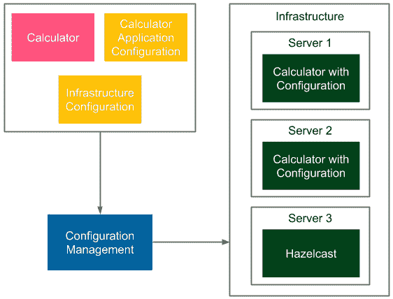
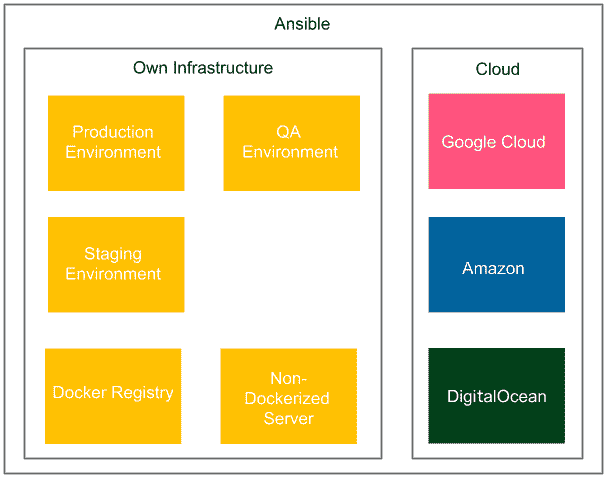
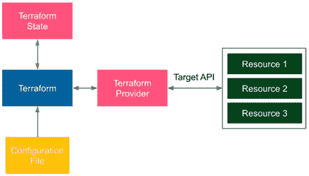

# 第七章：使用 Ansible 进行配置管理

我们已经覆盖了持续交付过程中的两个最关键的阶段：提交阶段和自动化验收测试。我们还解释了如何为应用程序和 Jenkins 代理集群化你的环境。在本章中，我们将重点讨论配置管理，它将虚拟容器化环境与真实服务器基础设施连接起来。

本章将涵盖以下内容：

+   配置管理简介

+   安装 Ansible

+   使用 Ansible

+   使用 Ansible 部署

+   Ansible 与 Docker 和 Kubernetes

+   基础设施即代码简介

+   Terraform 简介

# 技术要求

要跟随本章的指引，你需要以下硬件/软件：

+   Java 8+

+   Python

+   安装了 Ubuntu 操作系统和 SSH 服务器的远程机器

+   AWS 账户

所有示例和练习解决方案都可以在 GitHub 上找到：[`github.com/PacktPublishing/Continuous-Delivery-With-Docker-and-Jenkins-3rd-Edition/tree/main/Chapter07`](https://github.com/PacktPublishing/Continuous-Delivery-With-Docker-and-Jenkins-3rd-Edition/tree/main/Chapter07)。

本章的代码实践视频可以在 [`bit.ly/3JkcGLE`](https://bit.ly/3JkcGLE) 查看。

# 配置管理简介

配置管理是控制配置变化的过程，以确保系统在一段时间内保持完整性。尽管这个术语并不是起源于 IT 行业，但目前它被广泛应用于软件和硬件的领域。在此背景下，它涉及以下几个方面：

+   **应用配置**：这涉及决定系统如何运行的软件属性，通常以标志或属性文件的形式传递给应用程序，例如数据库地址、文件处理的最大块大小或日志记录级别。这些配置可以在不同的开发阶段应用：构建、打包、部署或运行。

+   **服务器配置**：这定义了每个服务器上应安装的依赖项，并指定应用程序的编排方式（哪个应用程序运行在哪个服务器上，以及运行多少个实例）。

+   **基础设施配置**：这涉及服务器基础设施和环境配置。如果你使用的是本地服务器，那么这部分与手动硬件和网络安装有关；如果使用的是云解决方案，那么这部分可以通过**基础设施即代码**（**IaC**）方法自动化。

作为示例，我们可以考虑使用 Hazelcast 服务器的计算器 Web 服务。让我们看一下下面的图表，展示了配置管理是如何工作的：



图 7.1 – 示例配置管理

配置管理工具读取配置文件并准备环境。它安装依赖的工具和库，并将应用程序部署到多个实例上。此外，在云部署的情况下，它还可以提供必要的基础设施。

在前面的例子中，**基础设施配置**指定了所需的服务器，而**服务器配置**定义了**计算器**服务应该部署在**服务器 1**和**服务器 2**的两个实例上，并且 Hazelcast 服务应该安装在**服务器 3**上。**计算器应用程序配置**指定了 Hazelcast 服务器的端口和地址，以便各个服务能够通信。

信息

配置可以根据环境类型（QA、暂存或生产环境）有所不同；例如，服务器地址可能会不同。

配置管理有很多方法，但在我们深入探讨具体解决方案之前，先评论一下一个好的配置管理工具应该具备哪些特性。

## 优秀配置管理的特点

现代配置管理解决方案应该是什么样的？让我们看看最重要的几个因素：

+   **自动化**：每个环境都应该是自动可重现的，包括操作系统、网络配置、已安装的软件和已部署的应用程序。在这种方法中，解决生产环境问题意味着仅仅是自动重建环境。更重要的是，它简化了服务器的复制，并确保暂存和生产环境完全相同。

+   **版本控制**：每一次配置更改都应该被追踪，这样我们就知道是谁、为什么以及何时做出的更改。通常，这意味着将配置保存在源代码仓库中，可以与代码一起存储，也可以存放在单独的位置。推荐使用前者，因为配置属性的生命周期与应用程序本身不同。版本控制还可以帮助解决生产环境问题；配置可以随时回滚到上一个版本，并自动重建环境。唯一的例外是存储凭证和其他敏感信息；这些信息绝对不能被提交到版本控制中。

+   **增量更改**：应用配置更改不应该需要重建整个环境。相反，配置中的小更改应该只会影响相关的基础设施部分。

+   **服务器配置**：得益于自动化，添加新服务器应该像将其地址添加到配置中（并执行一个命令）一样快速。

+   **安全性**：对配置管理工具及其控制下的机器的访问应该得到充分保护。当使用 SSH 协议进行通信时，访问密钥或凭证需要得到妥善保护。

+   **简洁性**：团队中的每个成员都应该能够阅读配置，进行修改，并将其应用到环境中。配置项本身也应该尽可能简单，且那些不需要改变的配置最好保持硬编码。

在创建配置时，甚至在选择合适的配置管理工具时，记住这些要点非常重要。

## 配置管理工具概览

在传统意义上，在云时代之前，配置管理指的是在所有服务器都已经到位时开始的过程。因此，起点是一组可以通过 SSH 访问的 IP 地址。为此，最流行的配置管理工具有 Ansible、Puppet 和 Chef。每个工具都是不错的选择；它们都是开源产品，提供免费的基础版本和付费的企业版。它们之间最重要的区别如下：

+   **配置语言**：Chef 使用 Ruby，Puppet 使用自己的 DSL（基于 Ruby），而 Ansible 使用 YAML。

+   **基于代理**：Puppet 和 Chef 使用代理进行通信，这意味着每台被管理的服务器都需要安装一个特殊的工具。而 Ansible 则不需要代理，使用标准的 SSH 协议进行通信。

无代理特性是一个显著的优势，因为它意味着不需要在服务器上安装任何东西。而且，Ansible 正在快速崛起，这也是为什么它被选择用于本书的原因。然而，其他工具也可以在持续交付过程中成功使用。

随着云转型的进行，配置管理的意义也在扩大，开始包括所谓的 **IaC**（基础设施即代码）。作为输入，你不再需要一组 IP 地址，而只需要提供你喜欢的云服务提供商的凭据。然后，IaC 工具可以为你配置服务器。此外，每个云服务提供商都提供一系列服务，因此在许多情况下，你甚至不需要配置裸机服务器，而是直接使用云服务。虽然你仍然可以使用 Ansible、Puppet 或 Chef 达到这个目的，但有一个专门针对 IaC 用例的工具叫做 Terraform。

我们首先描述使用 Ansible 的经典配置管理方法，然后介绍使用 Terraform 的 IaC 解决方案。

# 安装 Ansible

Ansible 是一个开源的无代理自动化引擎，用于软件配置、管理和应用部署。它的第一次发布是在 2012 年，基础版本对个人和商业使用都是免费的。企业版叫做 **Ansible Tower**，它提供了 GUI 管理和仪表盘、REST API、基于角色的访问控制以及其他一些功能。

我们将分别介绍安装过程以及 Ansible 如何单独使用，或与 Docker 一起使用的描述。

## Ansible 服务器要求

Ansible 使用 SSH 协议进行通信，并且对它管理的机器没有特殊要求。也没有中央主服务器，因此只需在任何地方安装 Ansible 客户端工具；然后我们可以使用它来管理整个基础设施。

信息

被管理的机器的唯一要求是必须安装 Python 工具（显然，也需要安装 SSH 服务器）。然而，这些工具几乎在任何服务器上默认都能使用。

## Ansible 安装

安装说明将根据操作系统有所不同。以 Ubuntu 为例，只需运行以下命令：

```
$ sudo apt-get install software-properties-common
$ sudo apt-add-repository ppa:ansible/ansible
$ sudo apt-get update
$ sudo apt-get install ansible
```

信息

你可以在官方 Ansible 页面找到所有操作系统的安装指南，地址为 [`docs.ansible.com/ansible/latest/installation_guide/intro_installation.html`](https://docs.ansible.com/ansible/latest/installation_guide/intro_installation.html)。

安装过程完成后，我们可以执行 `ansible` 命令来检查是否一切安装成功：

```
$ ansible –version
ansible [core 2.12.2]
  config file = /etc/ansible/ansible.cfg
...
```

# 使用 Ansible

为了使用 Ansible，我们首先需要定义库存，它表示可用的资源。然后，我们将能够执行单个命令或使用 Ansible 剧本定义一组任务。

## 创建库存

库存是 Ansible 管理的所有服务器的列表。每个服务器只需要安装 Python 解释器和 SSH 服务器。默认情况下，Ansible 假定使用 SSH 密钥进行身份验证；然而，也可以通过在 Ansible 命令中添加 `--ask-pass` 选项来使用用户名和密码。

提示

可以使用 `ssh-keygen` 工具生成 SSH 密钥，通常它们存储在 `~/.ssh` 目录中。

库存默认定义在 `/etc/ansible/hosts` 文件中（但可以通过 `–i` 参数定义位置），它的结构如下：

```
[group_name]
<server1_address>
<server2_address>
...
```

提示

库存语法还支持服务器的范围，例如 `www[01-22].company.com`。如果 SSH 端口不是 `22`（默认端口），还应指定端口号。

库存文件中可以包含多个组。例如，让我们在一个服务器组中定义两台机器：

```
[webservers]
192.168.64.12
192.168.64.13
```

我们还可以创建带有服务器别名的配置，并指定远程用户：

```
[webservers]
web1 ansible_host=192.168.64.12 ansible_user=ubuntu
web2 ansible_host=192.168.64.13 ansible_user=ubuntu
```

上面的文件定义了一个名为 `webservers` 的组，该组包含两台服务器。Ansible 客户端将以 `ubuntu` 用户身份登录这两台服务器。当我们创建好库存后，让我们了解如何使用它在多台服务器上执行相同的命令。

信息

Ansible 提供了从云提供商（例如，Amazon EC2/Eucalyptus）、LDAP 或 Cobbler 动态拉取库存的功能。关于动态库存的更多信息，请参阅 [`docs.ansible.com/ansible/latest/user_guide/intro_dynamic_inventory.html`](https://docs.ansible.com/ansible/latest/user_guide/intro_dynamic_inventory.html)。

## 临时命令

我们可以运行的最简单的命令是在所有服务器上进行 ping 测试。假设我们有两台远程机器（`192.168.64.12` 和 `192.168.64.13`），它们配置了 SSH 服务器，并且有一个清单文件（如上一节所定义），我们可以执行 `ping` 命令：

```
$ ansible all -m ping
web1 | SUCCESS => {
    "ansible_facts": {
        "discovered_interpreter_python": "/usr/bin/python3"
    },
    "changed": false,
    "ping": "pong"
}
web2 | SUCCESS => {
    "ansible_facts": {
        "discovered_interpreter_python": "/usr/bin/python3"
    },
    "changed": false,
    "ping": "pong"
}
```

我们使用了 `-m <module_name>` 选项，它允许指定应该在远程主机上执行的模块。结果是成功的，这意味着服务器是可达的，且身份验证已正确配置。

注意，我们使用了 `all`，因此所有服务器都会被处理，但我们也可以通过 `webservers` 组名或单个主机别名来调用它们。作为第二个例子，我们只在其中一台服务器上执行 shell 命令：

```
$ ansible web1 -a "/bin/echo hello"
web1 | CHANGED | rc=0 >>
hello
```

`-a <arguments>` 选项指定传递给 Ansible 模块的参数。在这个例子中，我们没有指定模块，因此这些参数作为一个 shell Unix 命令执行。结果是成功的，并且打印出了 `hello`。

提示

如果 `ansible` 命令是第一次连接到服务器（或者服务器被重新安装），则会出现密钥确认提示信息（即 SSH 消息，当主机不在 `known_hosts` 文件中时）。由于这可能会中断自动化脚本，我们可以通过在 `/etc/ansible/ansible.cfg` 文件中取消注释 `host_key_checking = False` 来禁用提示信息，或者通过设置环境变量 `ANSIBLE_HOST_KEY_CHECKING=False` 来实现。

在最简单的形式中，Ansible 临时命令的语法如下所示：

```
$ ansible <target> -m <module_name> -a <module_arguments>
```

临时命令的目的是在不需要重复执行的情况下快速完成某些任务。例如，我们可能想检查某台服务器是否在线，或者在圣诞假期期间关闭所有机器。这个机制可以看作是在一组机器上执行命令，同时利用模块提供的额外语法简化。然而，Ansible 自动化的真正威力在于剧本。

## 剧本

**Ansible 剧本** 是一个配置文件，用来描述如何配置服务器。它提供了一种定义应在每台机器上执行的任务顺序的方式。剧本采用 YAML 配置语言表示，使其既易于阅读又易于理解。我们先从一个示例剧本开始，然后看看如何使用它。

### 定义一个剧本

一个剧本由一个或多个剧集（play）组成。每个剧集包含一个主机组名称、要执行的任务和配置细节（例如，远程用户名或访问权限）。一个示例剧本可能如下所示：

```
---
- hosts: web1
  become: yes
  become_method: sudo
  tasks:
  - name: ensure apache is at the latest version
    apt: name=apache2 state=latest
  - name: ensure apache is running
    service: name=apache2 state=started enabled=yes
```

这个配置包含一个剧集，它执行以下操作：

+   仅在 `web1` 主机上执行

+   使用 `sudo` 命令获得 root 权限

+   执行两个任务：

    +   `apt` Ansible 模块（通过两个参数调用，`name=apache2` 和 `state=latest`）检查服务器上是否安装了 `apache2` 软件包，如果没有，它将使用 `apt-get` 工具进行安装。

    +   `service` Ansible 模块（通过三个参数 `name=apache2`、`state=started` 和 `enabled=yes` 调用）检查 `apache2` Unix 服务是否已启动，如果未启动，它将使用 `service` 命令启动它。

请注意，每个任务都有一个人类可读的名称，该名称用于控制台输出，其中 `apt` 和 `service` 是 Ansible 模块，而 `name=apache2`、`state=latest` 和 `state=started` 是模块参数。在使用临时命令时，您已经看到了 Ansible 模块和参数。在前面的 playbook 中，我们只定义了一个 play，但可以有多个 play，每个 play 可以与不同的主机组相关联。

信息

请注意，由于我们使用了 `apt` Ansible 模块，因此该 playbook 仅适用于 Debian/Ubuntu 服务器。

例如，我们可以在清单中定义两个服务器组：`database` 和 `webservers`。然后，在 playbook 中，我们可以指定应该在所有数据库托管机器上执行的任务，以及应该在所有 Web 服务器上执行的一些不同任务。通过使用一个命令，我们可以设置整个环境。

### 执行 playbook

当 `playbook.yml` 定义好后，我们可以使用 `ansible-playbook` 命令来执行它：

```
$ ansible-playbook playbook.yml
PLAY [web1] ***************************************************************
TASK [setup] **************************************************************
ok: [web1]
TASK [ensure apache is at the latest version] *****************************
changed: [web1]
TASK [ensure apache is running] *******************************************
ok: [web1]
PLAY RECAP ****************************************************************
web1: ok=3 changed=1 unreachable=0 failed=0 
```

提示

如果服务器需要输入 `sudo` 命令的密码，则需要在 `ansible-playbook` 命令中添加 `--ask-sudo-pass` 选项。也可以通过设置额外变量 `-e ansible_become_pass=<sudo_password>` 来传递 `sudo` 密码（如果需要）。

playbook 配置已执行，因此 `apache2` 工具已安装并启动。请注意，如果任务已对服务器做出更改，则标记为 `changed`。相反，如果没有任何更改，任务将标记为 `ok`。

提示

可以通过使用 `-f <num_of_threads>` 选项并行运行任务。

### playbook 的幂等性

我们可以再次执行该命令，如下所示：

```
$ ansible-playbook playbook.yml
PLAY [web1] ***************************************************************
TASK [setup] **************************************************************
ok: [web1]
TASK [ensure apache is at the latest version] *****************************
ok: [web1]
TASK [ensure apache is running] *******************************************
ok: [web1]
PLAY RECAP ****************************************************************
web1: ok=3 changed=0 unreachable=0 failed=0
```

请注意，输出略有不同。这次命令没有更改服务器上的任何内容。这是因为每个 Ansible 模块设计为幂等的。换句话说，多次执行相同的模块，效果应与只执行一次相同。

实现幂等性最简单的方法是首先检查任务是否已执行过，只有在未执行时才执行该任务。幂等性是一个强大的功能，我们应该始终以这种方式编写 Ansible 任务。

如果所有任务都是幂等的，我们可以执行任意次数。在这种情况下，我们可以将 playbook 看作是远程机器所需状态的描述。然后，`ansible-playbook` 命令负责将机器（或机器组）带入该状态。

### 处理程序

有些操作应该仅在其他任务发生变化时执行。例如，假设你将配置文件复制到远程机器，并且只有在配置文件发生变化时，Apache 服务器才应该重新启动。*我们该如何处理这种情况呢？*

Ansible 提供了一个事件驱动机制来通知变化。为了使用它，我们需要知道两个关键字：

+   `handlers`：指定在通知时执行的任务。

+   `notify`：指定应该执行的处理器。

让我们看一个示例，说明如何将配置复制到服务器，并且只有在配置发生变化时才重新启动 Apache：

```
tasks:
- name: copy configuration
  copy:
    src: foo.conf
    dest: /etc/foo.conf
  notify:
  - restart apache
handlers:
- name: restart apache
  service:
    name: apache2
    state: restarted
```

现在，我们可以创建`foo.conf`文件并运行`ansible-playbook`命令：

```
$ touch foo.conf
$ ansible-playbook playbook.yml
...
TASK [copy configuration] ************************************************
changed: [web1]
RUNNING HANDLER [restart apache] *****************************************
changed: [web1]
PLAY RECAP ***************************************************************
web1: ok=5 changed=2 unreachable=0 failed=0   
```

信息

处理器总是在 play 的最后执行，并且只会执行一次，即使被多个任务触发。

Ansible 已经复制了文件并重新启动了 Apache 服务器。重要的是要理解，如果我们再次运行命令，什么也不会发生。但是，如果我们更改了`foo.conf`文件的内容，然后运行`ansible-playbook`命令，文件会再次被复制（并且 Apache 服务器会被重新启动）：

```
$ echo "something" > foo.conf
$ ansible-playbook playbook.yml
...
TASK [copy configuration] *************************************************
changed: [web1]
RUNNING HANDLER [restart apache] ******************************************
changed: [web1]
PLAY RECAP ****************************************************************
web1: ok=5 changed=2 unreachable=0 failed=0   
```

我们使用了`copy`模块，它足够智能，可以检测文件是否已更改，然后在服务器上进行相应的修改。

提示

Ansible 中也有发布-订阅机制。使用它意味着将一个主题分配给多个处理器。然后，一个任务通过通知该主题来执行所有相关的处理器。

### 变量

虽然 Ansible 自动化使得多个主机的操作变得相同且可重复，但不可避免的是，服务器可能需要一些差异。例如，考虑应用端口号。根据机器的不同，它可能会有所不同。幸运的是，Ansible 提供了变量，这是一种很好的机制来处理服务器之间的差异。让我们创建一个新的 playbook 并定义一个变量：

```
---
- hosts: web1
  vars:
    http_port: 8080
```

配置定义了`http_port`变量，其值为`8080`。现在，我们可以通过使用`Jinja2`语法来使用它：

```
tasks:
- name: print port number
  debug:
    msg: "Port number: {{ http_port }}"
```

提示

`Jinja2`语言不仅仅允许获取变量。我们可以使用它来创建条件、循环等更多功能。你可以在 Jinja 页面找到更多详细信息：[`jinja.palletsprojects.com/`](https://jinja.palletsprojects.com/)。

`debug`模块在执行时打印消息。如果我们运行`ansible-playbook`命令，我们可以看到变量的使用：

```
$ ansible-playbook playbook.yml
...
TASK [print port number] **************************************************
ok: [web1] => {
      "msg": "Port number: 8080"
}  
```

除了用户定义的变量外，还有预定义的自动变量。例如，`hostvars`变量存储了一个映射，包含了所有主机的相关信息。使用 Jinja2 语法，我们可以迭代并打印所有主机的 IP 地址：

```
---
- hosts: web1
  tasks:
  - name: print IP address
    debug:
      msg: " {{
              hostvars[host]['ansible_host'] }} "
```

然后，我们可以执行`ansible-playbook`命令：

```
$ ansible-playbook playbook.yml
...
TASK [print IP address] **************************************************
ok: [web1] => {
      "msg": " 192.168.64.12  192.168.64.13 "
}
```

请注意，通过使用 Jinja2 语言，我们可以在 Ansible playbook 文件中指定流程控制操作。

## 角色

我们可以通过使用 Ansible playbooks 在远程服务器上安装任何工具。假设我们想要在服务器上安装 MySQL。我们可以轻松地准备一个类似于 `apache2` 包的 playbook。然而，如果仔细想想，MySQL 服务器是一个相当常见的案例，肯定有人已经为此准备了 playbook，那么我们或许可以直接重用它。这就是 Ansible 角色和 Ansible Galaxy 发挥作用的地方。

### 了解角色

Ansible 角色是一个结构良好的 playbook 部分，准备好可以被包含到 playbook 中。角色是独立的单元，始终具有以下目录结构：

```
templates/
tasks/
handlers/
vars/
defaults/
meta/
```

信息

你可以在 Ansible 官方页面上了解更多关于角色以及每个目录含义的内容，网址是 [`docs.ansible.com/ansible/latest/user_guide/playbooks_reuse_roles.html`](https://docs.ansible.com/ansible/latest/user_guide/playbooks_reuse_roles.html)。

在每个目录中，我们可以定义 `main.yml` 文件，其中包含可以包含到 `playbook.yml` 文件中的 playbook 部分。以 MySQL 为例，GitHub 上有一个角色定义在 [`github.com/geerlingguy/ansible-role-mysql`](https://github.com/geerlingguy/ansible-role-mysql) 上。这个仓库包含可以在我们的 playbook 中使用的任务模板。让我们来看一下 `tasks/setup-Debian.yml` 文件的部分内容，它在 Ubuntu/Debian 中安装 `mysql` 包：

```
...
- name: Ensure MySQL Python libraries are installed.
  apt:
    name: "{{ mysql_python_package_debian }}"
    state: present

- name: Ensure MySQL packages are installed.
  apt:
    name: "{{ mysql_packages }}"
    state: present
  register: deb_mysql_install_packages
...
```

这只是 `tasks/main.yml` 文件中定义的任务之一。其他任务负责将 MySQL 安装到其他操作系统上。

如果我们使用这个角色来安装服务器上的 MySQL，只需创建以下 `playbook.yml` 即可：

```
---
- hosts: all
  become: yes
  become_method: sudo
  roles:
  - role: geerlingguy.mysql
```

这样的配置会使用 `geerlingguy.mysql` 角色在所有服务器上安装 MySQL 数据库。

### Ansible Galaxy

Ansible Galaxy 对 Ansible 就像 Docker Hub 对 Docker 一样——它存储常见的角色，供他人重用。你可以在 Ansible Galaxy 页面浏览可用的角色，网址是 [`galaxy.ansible.com/`](https://galaxy.ansible.com/)。

要从 Ansible Galaxy 安装一个角色，我们可以使用 `ansible-galaxy` 命令：

```
$ ansible-galaxy install username.role_name
```

该命令会自动下载角色。以 MySQL 为例，我们可以通过执行以下命令下载该角色：

```
$ ansible-galaxy install geerlingguy.mysql
```

该命令会下载 `mysql` 角色，之后可以在 playbook 文件中使用它。如果你按照前面片段中描述的方式定义了 `playbook.yml`，则以下命令会将 MySQL 安装到所有服务器中：

```
$ ansible-playbook playbook.yml
```

现在你已经了解了 Ansible 的基础知识，让我们来看一下如何使用它来部署我们自己的应用程序。

# 使用 Ansible 部署

我们已经涵盖了 Ansible 的最基本特性。现在，让我们暂时忘记 Docker、Kubernetes 和我们至今学到的大多数内容。让我们仅使用 Ansible 配置一个完整的部署步骤。我们将在一台服务器上运行计算器服务，在另一台服务器上运行 Hazelcast 服务。

## 安装 Hazelcast

我们可以在新的 playbook 中指定一个任务。让我们创建一个`playbook.yml`文件，内容如下：

```
---
- hosts: web1
  become: yes
  become_method: sudo
  tasks:
  - name: ensure Java Runtime Environment is installed
    apt: 
      name: default-jre
      state: present
      update_cache: yes
  - name: create Hazelcast directory
    file:
      path: /var/hazelcast
      state: directory
  - name: download Hazelcast
    get_url:
      url: https://repo1.maven.org/maven2/com/hazelcast/hazelcast/5.0.2/hazelcast-5.0.2.jar
      dest: /var/hazelcast/hazelcast.jar
      mode: a+r
  - name: copy Hazelcast starting script
    copy:
      src: hazelcast.sh
      dest: /var/hazelcast/hazelcast.sh
      mode: a+x
  - name: configure Hazelcast as a service
    file:
      path: /etc/init.d/hazelcast
      state: link
      force: yes
      src: /var/hazelcast/hazelcast.sh
  - name: start Hazelcast
    service:
      name: hazelcast
      enabled: yes
      state: started
```

配置将在`web1`服务器上执行，并且需要 root 权限。它执行几个步骤，最终将完成 Hazelcast 服务器的安装。让我们逐步查看我们定义的内容：

1.  **准备环境**：此任务确保 Java 运行时环境已安装。基本上，它为服务器环境做准备，以确保 Hazelcast 能够拥有所有必要的依赖项。对于更复杂的应用程序，依赖工具和库的列表可能会更长。

1.  **下载 Hazelcast 工具**：Hazelcast 以 JAR 形式提供，可以从互联网上下载。我们硬编码了版本，但在实际情况中，最好将其提取到一个变量中。

1.  `/etc/init.d/`目录。

1.  **启动 Hazelcast 服务**：当 Hazelcast 被配置为 Unix 服务时，我们可以以标准方式启动它。

在同一目录下，让我们创建`hazelcast.sh`，这是一个负责将 Hazelcast 作为 Unix 服务运行的脚本（如下所示）：

```
#!/bin/bash
### BEGIN INIT INFO
# Provides: hazelcast
# Required-Start: $remote_fs $syslog
# Required-Stop: $remote_fs $syslog
# Default-Start: 2 3 4 5
# Default-Stop: 0 1 6
# Short-Description: Hazelcast server
### END INIT INFO
java -cp /var/hazelcast/hazelcast.jar com.hazelcast.core.server.HazelcastMemberStarter &
```

完成此步骤后，我们可以执行 playbook 并在`web1`服务器上启动 Hazelcast。然而，我们先创建第二个任务来启动计算器服务，然后一起运行。

## 部署网页服务

我们将通过两步准备`calculator`网页服务：

1.  更改 Hazelcast 主机地址。

1.  将计算器部署添加到 playbook 中。

### 更改 Hazelcast 主机地址

之前，我们硬编码了 Hazelcast 主机地址为`hazelcast`，所以现在我们应该将它更改为`src/main/java/com/leszko/calculator/CalculatorApplication.java`文件中的`192.168.64.12`（与我们的清单中`web1`的 IP 地址相同）。

提示

在实际项目中，应用程序的属性通常保存在`properties`文件中。例如，对于 Spring Boot 框架，它是一个名为`application.properties`或`application.yml`的文件。然后，我们可以使用 Ansible 更改它们，从而更加灵活。

### 将计算器部署添加到 playbook 中

最后，我们可以将部署配置作为新任务添加到`playbook.yml`文件中。它与我们为 Hazelcast 创建的配置类似：

```
- hosts: web2
  become: yes
  become_method: sudo
  tasks:
  - name: ensure Java Runtime Environment is installed
    apt:
      name: default-jre
      state: present
      update_cache: yes
  - name: create directory for Calculator
    file:
      path: /var/calculator
      state: directory
  - name: copy Calculator starting script
    copy:
      src: calculator.sh
      dest: /var/calculator/calculator.sh
      mode: a+x
  - name: configure Calculator as a service
    file:
      path: /etc/init.d/calculator
      state: link
      force: yes
      src: /var/calculator/calculator.sh
  - name: copy Calculator
    copy:
      src: build/libs/calculator-0.0.1-SNAPSHOT.jar
      dest: /var/calculator/calculator.jar
      mode: a+x
    notify:
    - restart Calculator
  handlers:
  - name: restart Calculator
    service:
      name: calculator
      enabled: yes
      state: restarted
```

配置与我们在 Hazelcast 案例中看到的非常相似。唯一的不同之处是，这次我们不会从互联网上下载 JAR 文件，而是从我们的文件系统中复制它。另一个不同之处是，我们使用 Ansible 处理器重新启动服务。这样做是因为我们希望每次复制新版本时重新启动计算器。

在我们一起开始之前，我们还需要定义`calculator.sh`：

```
#!/bin/bash
### BEGIN INIT INFO
# Provides: calculator
# Required-Start: $remote_fs $syslog
# Required-Stop: $remote_fs $syslog
# Default-Start: 2 3 4 5
# Default-Stop: 0 1 6
# Short-Description: Calculator application
### END INIT INFO
java -jar /var/calculator/calculator.jar &
```

当一切准备就绪时，我们将使用此配置来启动完整的系统。

## 执行部署

像往常一样，我们可以使用`ansible-playbook`命令执行 playbook。在此之前，我们需要使用 Gradle 构建计算器项目：

```
$ ./gradlew build
$ ansible-playbook playbook.yml
```

部署成功后，服务应该可以使用，我们可以通过`http://192.168.64.13:8080/sum?a=1&b=2`检查其是否正常工作（IP 地址应该与我们的库存中标记为`web2`的 IP 地址相同）。如预期，它应该返回`3`作为输出。

请注意，我们通过执行一条命令配置了整个环境。更重要的是，如果我们需要扩展服务，只需将新服务器添加到库存中并重新运行`ansible-playbook`命令。另外，注意我们可以将其打包为 Ansible 角色并上传到 GitHub，从此每个人都可以在他们的 Ubuntu 服务器上运行相同的系统。这就是 Ansible 的强大之处！

我们已经展示了如何使用 Ansible 进行环境配置和应用部署。接下来的步骤是将 Ansible 与 Docker 和 Kubernetes 结合使用。

# Ansible 与 Docker 和 Kubernetes

正如你可能已经注意到的，Ansible 和 Docker（以及 Kubernetes）都解决了类似的软件部署问题：

+   **环境配置**：Ansible 和 Docker 都提供了配置环境的方法；然而，它们采用了不同的手段。Ansible 通过脚本（封装在 Ansible 模块内）来实现，而 Docker 则将整个环境封装在一个容器内。

+   **依赖关系**：Ansible 提供了一种方式，在相同或不同的主机上部署不同的服务，并允许它们一起部署。Kubernetes 具有类似的功能，可以同时运行多个容器。

+   **可扩展性**：Ansible 通过提供库存和主机组来帮助扩展服务。Kubernetes 具有类似的功能，能够自动增加或减少运行中的容器数量。

+   `playbook.yml`。在 Docker 和 Kubernetes 的情况下，我们有用于环境的`Dockerfile`和用于依赖关系与扩展的`deployment.yml`。

+   **简易性**：这两种工具都非常简单易用，通过配置文件和仅仅一条命令执行就能设置整个运行环境。

如果我们对比这些工具，Docker 做得更多，因为它提供了隔离性、可移植性以及某种程度的安全性。我们甚至可以设想，使用 Docker/Kubernetes 而不依赖任何其他配置管理工具。那么，*我们为什么还需要 Ansible 呢？*

## Ansible 的优点

Ansible 可能显得有些冗余；然而，它为交付过程带来了额外的好处，具体如下：

+   **Docker 环境**：Docker/Kubernetes 主机本身需要配置和管理。每个容器最终都在 Linux 机器上运行，这些机器需要进行内核补丁、Docker 引擎更新和网络配置等工作。而且，可能有不同的服务器机器使用不同的 Linux 发行版，Ansible 的责任是确保一切正常运行。

+   **非 Docker 化应用**：并非所有内容都运行在容器中。如果部分基础设施已经容器化，而部分则采用传统方式或部署在云中，那么 Ansible 可以通过执行剧本配置文件来管理这一切。没有将应用程序作为容器运行可能有不同的原因；例如，性能、安全性、特定的硬件要求或与遗留软件的兼容性。

+   **清单**：Ansible 提供了一种非常友好的方式来通过清单管理物理基础设施，清单中存储着所有服务器的信息。它还可以将物理基础设施分为不同的环境——生产、测试和开发。

+   **云资源配置**：Ansible 可以负责配置 Kubernetes 集群或在云中安装 Kubernetes；例如，我们可以设想一种集成测试，其中第一步是在 **Google Cloud Platform**（**GCP**）上创建 Kubernetes 集群（只有在此之后，我们才能部署整个应用程序并执行测试过程）。

+   **GUI**：Ansible 提供了图形化管理工具（商业版 Ansible Tower 和开源版 AWX），旨在提升基础设施管理的体验。

+   **改进测试过程**：Ansible 可以帮助进行集成测试和验收测试，因为它可以封装测试脚本。

我们可以把 Ansible 看作是负责基础设施的工具，而 Docker 和 Kubernetes 是负责环境配置和集群的工具。下图展示了一个概览：



图 7.2 – Ansible 作为基础设施管理器

Ansible 管理基础设施：**Kubernetes 集群**、**Docker 服务器**、**Docker 镜像库**、**没有 Docker 的服务器**以及 **云服务提供商**。它还负责服务器的物理位置。通过使用清单主机组，它可以将 Web 服务与靠近其地理位置的数据库连接。

让我们来看一下如何使用 Ansible 在服务器上安装 Docker 并部署一个示例应用程序。

## Ansible Docker 执行剧本

Ansible 与 Docker 平稳集成，因为它提供了一套专门为 Docker 设计的模块。如果我们为基于 Docker 的部署创建 Ansible 执行剧本，那么第一项任务是确保 Docker 引擎已安装在每台机器上。然后，它应该使用 Docker 运行一个容器。

首先，让我们在 Ubuntu 服务器上安装 Docker。

### 安装 Docker

我们可以通过以下任务在 Ansible 执行剧本中安装 Docker 引擎：

```
- hosts: web1
  become: yes
  become_method: sudo
  tasks:
  - name: Install required packages
    apt:
      name: "{{ item }}"
      state: latest
      update_cache: yes
    loop:
    - apt-transport-https
    - ca-certificates
    - curl
    - software-properties-common
    - python3-pip
    - virtualenv
    - python3-setuptools
  - name: Add Docker GPG apt Key
    apt_key:
      url: https://download.docker.com/linux/ubuntu/gpg
      state: present
  - name: Add Docker Repository
    apt_repository:
      repo: deb https://download.docker.com/linux/ubuntu focal stable
      state: present
  - name: Update apt and install docker-ce
    apt:
      name: docker-ce
      state: latest
      update_cache: yes
  - name: Install Docker Module for Python
    pip:
      name: docker
```

信息

每个操作系统的执行脚本略有不同。这里展示的是用于 Ubuntu 20.04 的版本。

该配置安装了 Docker 和 Docker Python 工具（Ansible 所需）。请注意，我们使用了新的 Ansible 语法 `loop`，以便让剧本更加简洁。

安装 Docker 后，我们可以添加一个任务来运行 Docker 容器。

### 运行 Docker 容器

运行 Docker 容器通过使用`docker_container`模块来完成，具体如下所示：

```
- hosts: web1
  become: yes
  become_method: sudo
  tasks:
  - name: run Hazelcast container
    community.docker.docker_container:
      name: hazelcast
      image: hazelcast/hazelcast
      state: started
      exposed_ports:
      - 5701
```

信息

您可以阅读更多有关`docker_container`模块的所有选项，网址为[`docs.ansible.com/ansible/latest/collections/community/docker/docker_container_module.html`](https://docs.ansible.com/ansible/latest/collections/community/docker/docker_container_module.html)。

在前面介绍的两个 playbook 中，我们使用 Docker 配置了 Hazelcast 服务器。请注意，这非常方便，因为我们可以在多个（Ubuntu）服务器上运行相同的 playbook。

现在，让我们来看看 Ansible 如何帮助 Kubernetes。

## Ansible Kubernetes Playbook

类似于 Docker，Ansible 也可以帮助管理 Kubernetes。当您的 Kubernetes 集群配置完成后，您可以使用 Ansible 的`k8s`模块创建 Kubernetes 资源。以下是一个示例 Ansible 任务，用于在 Kubernetes 中创建命名空间：

```
- name: Create namespace
  kubernetes.core.k8s:
    name: my-namespace
    api_version: v1
    kind: Namespace
    state: present
```

这里的配置确保在 Kubernetes 集群中创建一个名为`my-namespace`的命名空间。

信息

您可以在[`docs.ansible.com/ansible/latest/collections/kubernetes/core/k8s_module.html`](https://docs.ansible.com/ansible/latest/collections/kubernetes/core/k8s_module.html)找到更多关于 Ansible `k8s`模块的信息。

我们已经介绍了使用 Ansible 进行配置管理，这在您的部署环境由裸金属服务器构成时是一个完美的方案。您也可以将 Ansible 与云服务提供商一起使用，并且有许多专门为此目的设计的模块。例如，`amazon.aws.ec2_instance` 让您可以创建和管理 AWS EC2 实例。然而，云计算有更好的解决方案。让我们看看它们是什么，以及如何使用它们。

# 引入 IaC

IaC（基础设施即代码）是管理和提供计算资源的过程，取代了物理硬件配置。它通常与云计算方法相关，您可以以可编程的方式请求所需的基础设施。

管理计算机基础设施一直是一个艰巨、耗时且容易出错的任务。您必须手动放置硬件、连接网络、安装操作系统并维护其更新。随着云计算的出现，一切变得简单；您只需要写几个命令或在 Web UI 中点击几下即可。IaC 更进一步，它允许您以声明的方式指定所需的基础设施。为了更好地理解它，让我们看看下面的图示：


图 7.3 – IaC

你准备好基础设施的声明性描述，例如，你需要三台服务器，一个 Kubernetes 集群和一个负载均衡器。然后，你将这个配置传递给一个工具，该工具使用云特定的 API（例如，AWS API），以确保基础设施符合要求。请注意，你应将基础设施配置存储在源代码仓库中，并且可以从相同的配置创建多个相同的环境。

你可以看到，IaC 的概念与配置管理非常相似；然而，配置管理确保你的软件按指定方式配置，而 IaC 确保你的基础设施按指定方式配置。

现在，让我们来看看使用 IaC 的好处。

## IaC 的好处

基础设施为所有 DevOps 活动带来了许多好处。我们来逐一了解其中最重要的一些：

+   **速度**：创建整个基础设施不过是运行一个脚本，这大大缩短了我们可以开始部署应用程序的时间。

+   **成本降低**：自动化基础设施的提供减少了操作服务器环境所需的 DevOps 团队成员数量。

+   **一致性**：IaC 配置文件成为唯一的真实来源，因此它们确保每个创建的环境都是完全相同的。

+   **风险降低**：基础设施配置存储在源代码仓库中，并遵循标准的代码审查流程，这降低了出错的概率。

+   **协作**：多人可以共享代码并在相同的配置文件上工作，从而提高工作效率。

我希望这些要点已经让你相信 IaC 是一种很好的方法。现在，让我们来看看你可以使用的 IaC 工具。

## IaC 工具

在谈到 IaC 时，有许多工具可以使用。选择取决于你所使用的云服务提供商和你自己的偏好。我们来看看最流行的解决方案：

+   **Terraform**：市场上最流行的 IaC 工具。它是开源的，使用基于插件的模块，称为 *providers*，来支持不同的基础设施 API。目前，已有超过 1,000 个 Terraform providers，包括 AWS、Azure、GCP 和 DigitalOcean。

+   **云服务提供商特定**：每个主要的云服务提供商都有自己的 IaC 工具：

    +   **AWS CloudFormation**：一项由亚马逊提供的服务，允许你以 YAML 或 JSON 模板文件的形式指定 AWS 资源。

    +   **Azure 资源管理器**（**ARM**）：一项微软 Azure 服务，允许你使用 ARM 模板文件创建和管理 Azure 资源。

    +   **Google Cloud 部署管理器**：一项由谷歌提供的服务，允许你使用 YAML 文件管理 Google Cloud Platform 资源。

+   **通用配置管理**：Ansible、Chef 和 Puppet 都提供专门的模块来为最流行的云解决方案提供基础设施。

+   **Pulumi**：一个非常灵活的工具，允许你使用通用编程语言（如 JavaScript、Python、Go 或 C#）来指定所需的基础设施。

+   **Vagrant**：通常与虚拟机管理相关，提供了一些插件，利用 AWS 等云提供商来配置基础设施。

在所有提到的解决方案中，Terraform 是最受欢迎的。因此，我们将花一些时间来理解它是如何工作的。

# Terraform 介绍

Terraform 是一个由 HashiCorp 创建并维护的开源工具。它允许你以人类可读的配置文件形式指定你的基础设施。与 Ansible 类似，它以声明式的方式工作，这意味着你指定期望的结果，而 Terraform 确保你的环境按照指定方式创建。

在我们深入具体示例之前，先花点时间了解一下 Terraform 是如何工作的。

## 理解 Terraform

Terraform 读取配置文件并相应地调整云资源。让我们看一下下面的图示，展示了这个过程：



](img/B18223_07_04.jpg)

图 7.4 – Terraform 工作流

用户创建 **配置文件** 并启动 **Terraform** 工具。然后，**Terraform** 检查 **Terraform 状态** 并使用 **Terraform 提供者** 将声明式配置文件转换为针对 **目标 API** 的请求，这个 API 是特定于给定云提供商的。举例来说，我们可以考虑一个定义三个 AWS EC2 实例的配置文件。Terraform 使用 AWS 提供者，执行请求到 AWS API，确保创建了三个 AWS EC2 实例。

信息

有超过 1,000 个 Terraform 提供者可用，你可以通过 Terraform 注册表浏览它们，网址是 [`registry.terraform.io/`](https://registry.terraform.io/)。

Terraform 工作流始终包括三个阶段：

+   **Write**：用户将云资源定义为配置文件。

+   **Plan**：Terraform 比较配置文件与当前状态，并准备执行计划。

+   **Apply**：用户批准计划，Terraform 使用云 API 执行计划中的操作。

这种方法非常方便，因为在计划阶段，我们可以始终检查 Terraform 在实际应用更改之前，将会对我们的基础设施进行哪些更改。

现在我们理解了 Terraform 背后的理念，让我们从 Terraform 的安装过程开始，看看它在实际中是如何工作的。

## 安装 Terraform

安装过程取决于操作系统。以 Ubuntu 为例，你可以执行以下命令：

```
$ curl -fsSL https://apt.releases.hashicorp.com/gpg | sudo apt-key add -
$ sudo apt-add-repository "deb [arch=amd64] https://apt.releases.hashicorp.com $(lsb_release -cs) main"
$ sudo apt-get update
$ sudo apt-get install terraform
```

信息

你可以在 Terraform 官方网站上找到所有操作系统的安装指南，网址是 [`www.terraform.io/downloads`](https://www.terraform.io/downloads)。

安装过程完成后，我们可以验证`terraform`命令是否正常工作：

```
$ terraform version
Terraform v1.1.5
```

在 Terraform 配置完成后，我们可以进入 Terraform 示例。

## 使用 Terraform

作为示例，让我们使用 Terraform 来配置一个 AWS EC2 实例。为此，我们需要首先配置 AWS。

### 配置 AWS

要从你的机器访问 AWS，你需要以下内容：

+   一个 AWS 账户

+   已安装 AWS CLI

    信息

    你可以在 [`aws.amazon.com/free`](https://aws.amazon.com/free) 创建一个免费的 AWS 账户。要安装 AWS CLI 工具，请查看以下说明：[`docs.aws.amazon.com/cli/latest/userguide/getting-started-install.html`](https://docs.aws.amazon.com/cli/latest/userguide/getting-started-install.html)。

让我们使用以下命令配置 AWS CLI：

```
$ aws configure
```

AWS 命令会提示你输入 AWS 访问密钥 ID 和 AWS 秘密访问密钥。

信息

有关如何创建 AWS 访问密钥对的说明，请访问 [`docs.aws.amazon.com/cli/latest/userguide/cli-configure-quickstart.html#cli-configure-quickstart-creds`](https://docs.aws.amazon.com/cli/latest/userguide/cli-configure-quickstart.html#cli-configure-quickstart-creds)。

完成这些步骤后，你的 AWS 账户访问已配置，我们可以开始使用 Terraform 进行操作。

### 编写 Terraform 配置

在一个新目录中，让我们创建 `main.tf` 文件并添加以下内容：

```
terraform {
  required_version = ">= 1.1"                 (1)
  required_providers {
    aws = {                                   (2)
      source  = "hashicorp/aws"
      version = "~> 3.74"
    }
  }
}
provider "aws" {
  profile = "default"                         (3)
  region  = "us-east-1"                       (4)
}
resource "aws_instance" "my_instance" {       (5)
  ami           = "ami-04505e74c0741db8d"     (6)
  instance_type = "t2.micro"                  (7)
}
```

在上述配置中，我们定义了以下部分：

1.  Terraform 工具版本应至少为 `1.1`。

1.  配置使用 `hashicorp/aws` 提供程序：

    +   提供程序版本需要至少为 `3.74`。

    +   Terraform 将自动从 **Terraform Registry** 下载它。

1.  `aws` 提供程序的凭证存储在 AWS CLI 创建的 `default` 位置中。

1.  提供程序在 `us-east-1` 区域创建所有资源。

1.  提供程序创建一个名为 `my_instance` 的 `aws_instance`（AWS EC2 实例）。

1.  一个 EC2 实例是从 `ami-04505e74c0741db8d`（`us-east-1` 区域中的 Ubuntu 20.04 LTS）创建的。

1.  实例类型为 `t2.micro`。

你可以看到整个配置是声明式的。换句话说，我们定义我们想要的目标，而不是如何实现它的算法。

当配置创建时，我们需要从 Terraform Registry 下载所需的提供程序。

### 初始化 Terraform 配置

让我们执行以下命令：

```
$ terraform init
```

该命令会下载所有必需的提供程序并将它们存储在 `.terraform` 目录中。现在，让我们最终应用 Terraform 配置。

### 应用 Terraform 配置

在进行任何 Terraform 更改之前，最好先执行 `terraform plan` 来检查我们即将面临的更改：

```
$ terraform plan
Terraform used the selected providers to generate the following execution plan. Resource actions are indicated with the following symbols:
  + create
...
```

我们可以看到，通过应用配置，我们将在基础设施中创建一个资源，正如控制台输出所描述的那样。

现在，让我们应用我们的配置：

```
$ terraform apply
...
Do you want to perform these actions?
  Terraform will perform the actions described above.
  Only 'yes' will be accepted to approve.
  Enter a value: yes
...
Apply complete! Resources: 1 added, 0 changed, 0 destroyed.
```

在确认更改后，你应该会看到大量日志，最后的 `Apply complete!` 消息，表示我们的基础设施已经创建完成。

现在，让我们验证一切是否如预期。

### 验证基础设施

从 Terraform 的角度来看，我们可以执行以下命令来查看我们基础设施的状态：

```
$ terraform show
# aws_instance.my_instance:
resource "aws_instance" "my_instance" {
...
}
```

这将打印出我们所创建资源的所有信息。

信息

和 Ansible 一样，Terraform 倾向于进行幂等操作。这就是为什么，如果我们再次执行 `terraform plan` 或 `terraform apply`，什么也不会改变。你只会看到以下消息：`No changes. Your infrastructure matches the configuration`。

我们现在可以验证我们的 AWS EC2 实例是否真正创建了。由于我们已经安装了 AWS CLI，我们可以使用以下命令检查：

```
$ aws ec2 describe-instances --region us-east-1
{
    "Reservations": [
        {
            "Groups": [],
            "Instances": 
                {
                    "AmiLaunchIndex": 0,
                    "ImageId": "ami-04505e74c0741db8d",
                    "InstanceId": "i-053b633c810728a97",
                    "InstanceType": "t2.micro",
...
```

如果你愿意，你也可以在 AWS 网络控制台中检查实例是否已创建。

。

为了使我们的示例完整，让我们也来看看如何删除已创建的资源。

### 销毁基础设施

让我们使用以下命令删除我们创建的资源：

```
$ terraform destroy
aws_instance.my_instance: Refreshing state... [id=i-053b633c810728a97]
Terraform used the selected providers to generate the following execution plan. Resource actions are indicated with the following symbols:
  - destroy
...
Do you really want to destroy all resources?
  Terraform will destroy all your managed infrastructure, as shown above.
  There is no undo. Only 'yes' will be accepted to confirm.
  Enter a value: yes
...
Destroy complete! Resources: 1 destroyed.
```

在用户确认之后，Terraform 删除了所有资源。你可以检查我们的 AWS EC2 实例是否已不存在。

作为 Terraform 的最后一步，让我们看看它是如何与 Kubernetes 交互的。

## Terraform 和 Kubernetes

当涉及到 Terraform 和 Kubernetes 之间的交互时，有两种不同的用例：

+   部署一个 Kubernetes 集群

+   与 Kubernetes 集群交互

让我们逐一展示它们。

### 部署一个 Kubernetes 集群

每个主要的云提供商都提供托管的 Kubernetes 集群，我们可以使用 Terraform 来部署它们。以下是可用的 Terraform 提供程序：

+   **AWS**：这可以在 Amazon **Elastic Kubernetes Service** (**EKS**) 中部署集群。

+   **Google**：这可以在 **Google Kubernetes Engine** (**GKE**) 中部署集群。

+   **AzureRM**：这可以在 **Azure Kubernetes Service** (**AKS**) 中部署集群。

使用这些提供程序中的每一个都相对简单，且工作方式类似于我们在 Terraform 示例中描述的方式。

提示

如果你在裸机服务器上安装 Kubernetes，你应该使用配置管理工具，例如 Ansible。要部署云托管的 Kubernetes 集群，你可以使用 Ansible 或 Terraform，但前者更为适合。

让我们也来看看 Terraform 在 Kubernetes 中的第二种使用方式。

### 与 Kubernetes 集群交互

类似于 Ansible，我们可以使用 Terraform 与 Kubernetes 集群进行交互。换句话说，我们可以使用专门的 Terraform Kubernetes 提供程序，而不是使用 `kubectl` 命令应用 Kubernetes 配置。

一个示例的 Terraform 配置，用于更改 Kubernetes 资源，示例如下：

```
resource "kubernetes_namespace" "example" {
  metadata {
    name = "my-first-namespace"
  }
}
```

上述配置在 Kubernetes 集群中创建了一个名为 `my-namespace` 的命名空间。

提示

有多种方式可以与 Kubernetes 集群交互：`kubectl`、Ansible、Terraform 或其他工具。一般来说，我会首先尝试最简单的方法，即 `kubectl` 命令，只有在有特殊需求时才会使用 Ansible 或 Terraform；例如，当你需要同时管理多个 Kubernetes 集群时。

我们已经讲解了 Terraform 的基础内容，现在让我们通过简短的总结来结束这一章。

# 总结

我们已经讲解了配置管理和 IaC 方法，以及相关的工具。请注意，是否在你的持续交付管道中使用 Ansible、Terraform 或两者都不使用，取决于你的具体用例。

当你需要管理多个裸金属服务器时，Ansible 的优势尤为明显。因此，如果你的发布意味着在多个服务器上同时进行相同的更改，你很可能会将 Ansible 命令放入管道中。

Terraform 在你使用云时效果最佳。因此，如果你的发布意味着对云基础设施进行更改，那么 Terraform 是最佳选择。

然而，如果你的环境只有一个 Kubernetes 集群，那么在管道中执行 `kubectl` 命令并没有问题。

本章的其他要点如下：

+   配置管理是创建和应用应用程序配置的过程。

+   Ansible 是最流行的配置管理工具之一。它不需要代理，因此不需要特殊的服务器配置。

+   Ansible 可以与临时命令一起使用，但真正的强大之处在于 Ansible playbook。

+   Ansible playbook 是定义如何配置环境的文件。

+   Ansible 角色的目的是为了重用 playbook 的部分内容。

+   Ansible Galaxy 是一个在线服务，用于共享 Ansible 角色。

+   IaC（基础设施即代码）是管理云资源的过程。

+   Terraform 是最流行的 IaC 工具。

在下一章，我们将总结持续交付过程并完成最终的 Jenkins 管道。

# 练习

在本章中，我们讲解了 Ansible 的基础知识以及如何将它与 Docker 和 Kubernetes 一起使用。作为练习，请尝试以下任务：

1.  创建服务器基础设施并使用 Ansible 管理它：

    1.  连接一台物理机器或运行 VirtualBox 虚拟机来模拟远程服务器。

    1.  配置 SSH 访问远程机器（SSH 密钥）。

    1.  在远程机器上安装 Python。

    1.  创建一个包含远程机器的 Ansible 清单。

    1.  运行 Ansible 临时命令（使用`ping`模块）检查基础设施是否配置正确。

1.  创建一个基于 Python 的 `hello world` Web 服务，并使用 Ansible playbook 将其部署到远程机器：

    1.  服务可以与我们在本章练习中描述的完全相同。

    1.  创建一个剧本，将服务部署到远程机器。

    1.  运行`ansible-playbook`命令并检查服务是否已部署。

1.  使用 Terraform 配置一个 GCP 虚拟机实例：

    1.  在 GCP 中创建一个账户。

    1.  安装`gcloud`工具并进行身份验证（`gcloud init`）。

    1.  生成凭据并将其导出到`GOOGLE_APPLICATION_CREDENTIALS`环境变量中。

    1.  创建一个 Terraform 配置文件，配置一个虚拟机实例。

    1.  使用 Terraform 应用配置。

    1.  验证实例是否已创建。

# 问题

为了验证你对本章内容的理解，请回答以下问题：

1.  什么是配置管理？

1.  配置管理工具是无代理（agentless）是什么意思？

1.  三个最流行的配置管理工具是什么？

1.  什么是 Ansible 清单（inventory）？

1.  Ansible 的临时命令和剧本有什么区别？

1.  什么是 Ansible 角色？

1.  什么是 Ansible Galaxy？

1.  什么是 IaC？

1.  哪些是最流行的 IaC 工具？

# 进一步阅读

要了解更多关于配置管理和 IaC 的内容，请参考以下资源：

+   **官方 Ansible 文档**：[`docs.ansible.com/`](https://docs.ansible.com/)

+   **官方 Terraform 文档**：[`www.terraform.io/docs`](https://www.terraform.io/docs)

+   **Michael T. Nygard，《Release It!》**：([`pragprog.com/titles/mnee2/release-it-second-edition/`](https://pragprog.com/titles/mnee2/release-it-second-edition/))

+   **Russ McKendrick，《Learn Ansible》**：([`www.packtpub.com/virtualization-and-cloud/learn-ansible`](https://www.packtpub.com/virtualization-and-cloud/learn-ansible))
