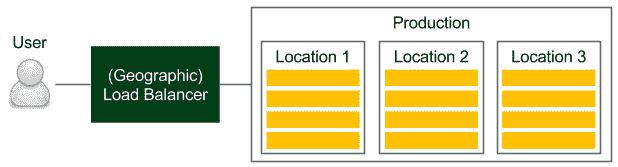
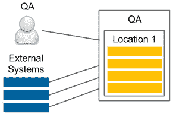
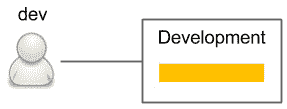

# 第八章：*第八章*：持续交付流水线

本章我们将重点讨论最终流水线中缺失的部分——即环境和基础设施、应用程序版本管理以及非功能性测试。

我们将讨论以下主题：

+   环境和基础设施

+   非功能性测试

+   应用程序版本管理

+   完成持续交付流水线

# 技术要求

要跟随本章内容，您需要以下资源：

+   一个 Jenkins 实例（在 Jenkins 代理上安装了 Java 8+、Docker 和 `kubectl`）

+   Docker 注册表（例如，Docker Hub 上的帐户）

+   两个 Kubernetes 集群

本章中的所有示例和练习解决方案都可以在 GitHub 上找到，链接：[`github.com/PacktPublishing/Continuous-Delivery-With-Docker-and-Jenkins-3rd-Edition/tree/main/Chapter08`](https://github.com/PacktPublishing/Continuous-Delivery-With-Docker-and-Jenkins-3rd-Edition/tree/main/Chapter08)。

本章的 Code in Action 视频可以在以下链接查看：[`bit.ly/3JeyQ1X`](https://bit.ly/3JeyQ1X)。

# 环境和基础设施

到目前为止，我们已将应用程序部署到一些服务器——也就是 Docker 主机、Kubernetes 集群和纯 Ubuntu 服务器（在 Ansible 的情况下）。然而，当我们深入思考 **持续交付**（**CD**）过程（或者一般的软件交付过程）时，我们需要逻辑地将资源进行分组。这一点很重要，主要有两个原因：

+   机器的物理位置很重要

+   不应在生产机器上进行测试

考虑到这些事实，在本节中，我们将讨论不同类型的环境，它们在 CD 过程中的角色，以及我们的基础设施的安全性方面。

## 环境类型

有四种常见的环境类型——**生产**、**预发布**、**QA**（测试）和 **开发**。我们将逐一讨论它们。

### 生产

生产环境是终端用户使用的环境。它存在于每个公司中，并且是最重要的环境。

下图展示了大多数生产环境的组织方式：



](img/B18223_08_01.jpg)

图 8.1 – 生产环境

用户通过负载均衡器访问服务，负载均衡器选择机器。如果应用程序发布在多个物理位置，则（第一个）设备通常是基于 DNS 的地理负载均衡器。在每个位置，我们都有一个服务器集群。例如，如果我们使用 Docker 和 Kubernetes，这意味着在每个位置，我们至少有一个 Kubernetes 集群。

机器的物理位置很重要，因为请求-响应时间会因物理距离的不同而有显著差异。此外，数据库和其他依赖服务应部署在接近服务所在机器的地方。更重要的是，数据库应该按分片方式进行划分，以最小化不同地点之间的复制开销；否则，我们可能会陷入等待数据库在不同实例间达成一致的情况，而这些实例可能相距较远。关于物理方面的更多细节超出了本书的范围，但需要记住的是，Docker 和 Kubernetes 本身并不能解决这个问题。

信息

容器化和虚拟化使你可以将服务器视为无限资源；然而，某些物理方面，如位置，仍然是相关的。

### 测试环境

测试环境是部署发布候选版本的地方，用于在正式上线前进行最终测试。理想情况下，这个环境应该是生产环境的镜像。

以下图表展示了在交付过程中，这种环境应该是什么样子的：

![图 8.2 – 测试环境]

](img/B18223_08_02.jpg)

图 8.2 – 测试环境

请注意，测试环境是生产环境的克隆。如果应用部署在多个地点，那么测试环境也应该有多个地点。

在持续交付（CD）过程中，所有自动化的验收测试（包括功能性和非功能性测试）都会在这个环境中运行。虽然大多数功能性测试通常不要求与生产环境完全相同的基础设施，但在非功能性测试（尤其是性能测试）的情况下，这一点是必须的。

为了节省成本，测试基础设施与生产环境不同并不罕见（通常包含较少的机器）。然而，这种做法可能导致许多生产问题。*Michael T. Nygard* 在《Release It! 设计与部署生产就绪软件》中举了一个真实案例，说明测试环境中使用的机器比生产环境中的要少。

故事是这样的：在某家公司，系统在某次代码变更后变得极其缓慢，尽管所有压力测试都通过了。*这是怎么可能的？* 这种情况发生的原因是有一个同步点，其中每个服务器都需要与其他服务器通信。在测试环境中，只有一台服务器，因此没有阻塞。但在生产环境中，服务器数量很多，导致服务器之间相互等待。这个例子只是冰山一角，如果测试环境与生产环境不同，很多生产问题可能无法通过验收测试。

### QA

QA 环境（也叫做测试环境）是为 QA 团队执行探索性测试以及外部应用程序（依赖我们的服务）进行集成测试而设计的。QA 环境的用例和基础设施如以下图所示：



图 8.3 – QA 环境

虽然暂存环境不需要保持稳定（在 CD 情况下，它会在每次提交到代码仓库后进行更改），但 QA 实例需要提供一定的稳定性，并暴露与生产环境相同（或向后兼容的）API。与暂存环境不同，基础设施可以与生产环境不同，因为它的目的是不保证发布候选版本的正常运行。

一个非常常见的情况是将较少的机器（例如，仅来自一个位置）分配给 QA 实例。

信息

部署到 QA 环境通常是在单独的流水线中完成的，使其独立于自动发布流程。这种方法很方便，因为 QA 实例的生命周期与生产实例不同（例如，QA 团队可能希望在从主干分出的实验代码上进行测试）。

### 开发

开发环境可以作为所有开发者共享的服务器，或者每个开发者可以拥有自己的开发环境。以下是一个简单的示意图：



图 8.4 – 开发环境

开发环境始终包含最新版本的代码。它用于实现开发者之间的集成，可以与 QA 环境一样对待。然而，它是开发者使用的，而不是 QA 人员使用的。

现在我们已经查看了所有环境，接下来看看它们如何适应 CD 流程。

## 持续交付中的环境

在 CD 流程中，暂存环境是不可或缺的。在一些极为少见的情况下，当性能不是关键且项目没有太多依赖时，我们可以在本地（开发）Docker 主机上进行验收测试，但这应该是一个例外，而不是常规。在这种情况下，我们始终面临环境相关的生产问题的风险。

其他环境通常在 CD 中不重要。如果我们希望每次提交后都部署到 QA 或开发环境，那么我们可以为此目的创建单独的流水线（小心不要遮蔽主发布流水线）。在许多情况下，部署到 QA 环境是手动触发的，因为它与生产环境的生命周期不同。

## 环境安全

所有环境都需要得到充分的安全保护——这是显而易见的。更为显而易见的是，最重要的要求是保持生产环境的安全，因为我们的业务依赖于它，任何安全漏洞的后果都可能是最严重的。

信息

安全性是一个广泛的话题。本节我们将专注于与 CD 过程相关的主题。然而，搭建完整的服务器基础设施需要更多的安全知识。

在 CD 过程中，Jenkins 代理必须能够访问服务器，以便它能够部署应用程序。

有不同的方式为代理提供服务器的凭证：

+   **将 SSH 密钥放入代理中**：如果我们不使用动态 Docker 从节点配置，那么可以配置 Jenkins 代理机器，使其包含私有的 SSH 密钥。

+   **将 SSH 密钥放入代理镜像中**：如果我们使用动态 Docker 从节点配置，我们可以将 SSH 私钥添加到 Docker 代理镜像中；然而，这样会产生一个可能的安全漏洞，因为任何可以访问该镜像的人都将可以访问生产服务器。

+   **使用 Jenkins 凭证**：我们可以配置 Jenkins 存储凭证并在流水线中使用它们。

+   **复制到从节点 Jenkins 插件**：我们可以在启动 Jenkins 构建时将 SSH 密钥动态复制到从节点中。

每种解决方案都有一些优缺点。使用任何一种时，我们都必须格外小心，因为当代理可以访问生产环境时，任何进入该代理的人都可能侵入生产环境。

最具风险的解决方案是将 SSH 私钥放入 Jenkins 代理镜像中，因为镜像存储的每个地方（无论是 Docker 注册表还是 Jenkins 内部的 Docker 主机）都需要得到良好的安全保护。

现在我们已经讲解了基础设施，接下来让我们看一个我们还没有涉及的话题——非功能性测试。

# 非功能性测试

我们在前几章中学到了很多关于功能性需求和自动化验收测试的知识。*但是我们应该如何处理非功能性需求呢？* 或者更具挑战性的是，*如果没有需求呢？* *我们是否应该在 CD 过程中跳过它们？* 我们将在本节中回答这些问题。

软件的非功能性方面始终很重要，因为它们可能会对系统的运行造成重大风险。

例如，许多应用程序失败是因为它们无法承受用户数量突然增加的负载。在他的某本书中，*Jakob Nielsen* 写到关于用户体验的观点，*1 秒钟大约是用户思维流畅不被打断的极限*。想象一下，如果我们的系统在负载不断增加时，开始超出这个极限，用户可能因为性能问题而停止使用该服务。考虑到这一点，非功能性测试和功能性测试同样重要。

长话短说，我们应该始终采取以下步骤进行非功能性测试：

1.  确定哪些非功能方面对我们的业务至关重要。

1.  对于每一个测试，我们都需要做以下几点：

    +   像我们为验收测试所做的那样指定测试

    +   在 CD 管道中添加一个阶段（在验收测试后，应用程序仍部署在预发布环境中）

1.  应用程序只有在所有非功能测试通过后，才会进入发布阶段。

无论是哪种类型的非功能测试，基本思想总是相同的。然而，方法可能略有不同。我们来看看不同测试类型及其带来的挑战。

## 非功能测试的类型

功能测试始终与同一方面相关——系统的行为。相反，非功能测试则关注许多不同的方面。我们来讨论一些最常见的系统属性以及如何在 CD 过程中进行测试。

### 性能测试

性能测试是最常用的非功能测试。它们测量系统的响应性和稳定性。我们可以创建的最简单性能测试是向**Web**服务发送请求并测量其**往返时间**（**RTT**）。

性能测试有不同的定义。它们通常包括负载、压力和可扩展性测试。有时，它们也被描述为白盒测试。在本书中，我们将性能测试定义为一种最基本的黑盒测试形式，用来衡量系统的延迟。

对于性能测试，我们可以使用专用框架（对于 Java，最流行的是 JMeter），或者仅仅使用我们在验收测试中使用的相同工具。简单的性能测试通常作为管道阶段添加，就在验收测试之后。这样的测试应该在 RTT 超出给定限制时失败，并且可以发现导致我们服务变慢的错误。

小贴士

Jenkins 的 JMeter 插件可以显示性能趋势随时间的变化。

### 负载测试

负载测试用于检查在大量并发请求时系统的表现。虽然系统在处理单个请求时可能非常快速，但这并不意味着它在同时处理 1,000 个请求时依然足够快。在负载测试中，我们会测量多个并发调用的平均请求响应时间，这些调用通常会从多台机器上进行。负载测试是发布周期中非常常见的 QA 阶段。为了自动化这一过程，我们可以使用与简单性能测试时相同的工具；但是在面对更大规模的系统时，我们可能需要一个独立的客户端环境来执行大量的并发请求。

### 压力测试

压力测试，也叫**容量测试**或**吞吐量测试**，是一种测试，旨在确定有多少并发用户能够访问我们的服务。它听起来可能和负载测试相似，但在负载测试中，我们会将并发用户数（吞吐量）设置为给定的数值，检查响应时间（延迟），并在超过这个限制时使构建失败。然而，在压力测试中，我们保持延迟不变，并增加吞吐量，以发现系统仍然可以操作的最大并发调用数。因此，压力测试的结果可能是一个通知，告知我们的系统可以处理 10,000 个并发用户，这有助于我们为高峰使用期做准备。

压力测试不太适合用于 CD 流程，因为它需要长时间的测试，并且并发请求数量不断增加。它应该作为一个单独的脚本，在一个独立的 Jenkins 管道中准备，并在我们知道代码更改可能会引发性能问题时按需触发。

### 可扩展性测试

可扩展性测试解释了当我们增加更多的服务器或服务时，延迟和吞吐量如何变化。理想的特征是线性的，这意味着如果我们有一台服务器，且在 100 个并发用户使用时，平均请求-响应时间为 500 毫秒，那么增加另一台服务器应该能保持响应时间不变，并且允许我们再增加 100 个并发用户。实际上，由于需要在服务器之间保持数据一致性，这通常很难实现。

可扩展性测试应该实现自动化，并提供一张图表，显示机器数量与并发用户数量之间的关系。这些数据有助于确定系统的极限，以及何时增加更多机器不再有效。

可扩展性测试，与压力测试类似，也很难融入 CD 管道，应该单独保持。

### 长期测试

压力测试，也称为**耐力测试**或**长期测试**，是将系统运行长时间，查看在一定时间后性能是否下降。它们能检测内存泄漏和稳定性问题。由于它们需要系统长时间运行，因此在持续集成（CD）管道内运行并不合理。

### 安全测试

安全测试处理与安全机制和数据保护相关的不同方面。一些安全方面是纯粹的功能性需求，如认证、授权和角色分配。这些元素应该像其他功能需求一样，在验收测试阶段进行检查。其他安全方面是非功能性的；例如，系统应防止 SQL 注入。客户可能不会明确指定这样的需求，但它是隐含的。

安全测试应该作为持续交付过程中的一个管道阶段。它们可以使用与验收测试相同的框架编写，也可以使用专门的安全测试框架，例如 **行为驱动开发**（**BDD**）安全性。

信息

安全性也应该始终是解释性测试过程的一部分，在这个过程中，测试人员和安全专家会发现安全漏洞并添加新的测试场景。

### 可维护性测试

可维护性测试解释了一个系统的维护简单性。换句话说，它们评估代码质量。我们已经在提交阶段描述了检查测试覆盖率和执行静态代码分析的步骤。Sonar 工具也可以提供代码质量和技术债务的概览。

### 恢复测试

恢复测试是一种用于确定系统在因软件或硬件故障崩溃后能够多快恢复的技术。最理想的情况是，如果系统根本不崩溃，即使其一部分服务宕机。一些公司甚至故意进行生产故障测试，检查它们是否能在灾难中生还。最著名的例子是 Netflix 和他们的 Chaos Monkey 工具，该工具会随机终止生产环境中的实例。这种方法迫使工程师编写能让系统在故障时具有恢复力的代码。

恢复测试不是持续交付过程的一部分，而是定期检查系统整体健康状况的事件。

提示

你可以在[`github.com/Netflix/chaosmonkey`](https://github.com/Netflix/chaosmonkey)了解更多关于 Chaos Monkey 的信息。

许多非功能性测试类型与代码和持续交付（CD）过程的关系更近或更远。有些与法律相关，例如合规性测试，而其他则与文档或国际化相关。还有可用性测试和容量测试（它检查系统在处理大量数据时的表现）。然而，这些测试中的大多数与持续交付过程无关。

## 非功能性挑战

非功能性方面给软件开发和交付带来了新的挑战。让我们现在来看看其中的一些：

+   **长时间的测试运行**：测试可能需要很长时间才能完成，并可能需要特殊的执行环境。

+   **渐进性质**：很难设定何时测试应当失败的限制值（除非 SLA 定义得很好）。即使设定了边界值，应用程序也可能会逐步接近该限制。在大多数情况下，代码更改不会导致测试失败。

+   **模糊的需求**：用户在非功能性需求方面通常没有太多输入。他们可能会提供一些关于请求-响应时间或用户数量的指导，但他们可能不了解可维护性、安全性或可扩展性。

+   **多样性**：有很多不同的非功能性测试，选择应该实施哪些测试意味着需要做出一些妥协。

解决非功能性方面的最佳方法是执行以下步骤：

1.  列出所有非功能性测试类型。

1.  明确划掉不需要的测试。你可能不需要某种测试的原因有很多种，例如以下几种：

    +   该服务非常小，一个简单的性能测试就足够了。

    +   该系统仅限内部使用，且仅供只读，因此可能不需要任何安全检查。

    +   该系统仅为单台机器设计，无需进行扩展。

    +   创建某些测试的成本太高。

1.  将你的测试分成两组：

    +   **持续交付**：可以将其添加到流水线中。

    +   **分析**：由于其执行时间、性质或相关成本，无法将其添加到流水线中。

1.  对于 CD 组，实现相关的流水线阶段。

1.  对于分析组，请执行以下操作：

    +   创建自动化测试

    +   安排它们应该运行的时间

    +   安排会议讨论它们的结果并采取行动

        提示

        一种非常好的方法是进行夜间构建，包含那些不适合 CD 流水线的长时间测试。然后，可以安排每周的会议来监控和分析系统性能的趋势。

如我们所见，非功能性测试有很多类型，它们给交付过程带来了额外的挑战。然而，为了系统的稳定性，这些测试绝不应该被跳过。技术实现会根据测试类型有所不同，但在大多数情况下，它们可以像功能性验收测试一样实现，并应在预发布环境中运行。

提示

如果你对非功能性测试、系统属性和系统稳定性感兴趣，可以阅读*Michael T. Nygard*的书籍《Release It!》。

现在我们已经讨论了非功能性测试，让我们看一下另一个方面——应用程序版本控制，这是我们之前没有详细讨论过的。

# 应用程序版本控制

到目前为止，在每次 Jenkins 构建过程中，我们都会创建一个新的 Docker 镜像，将其推送到 Docker 注册中心，并在整个过程中使用*最新*版本。然而，这种解决方案至少有三个缺点：

+   如果在 Jenkins 构建过程中，在验收测试后，有人推送了新的镜像版本，那么我们可能会发布未经测试的版本。

+   我们总是推送一个以相同方式命名的镜像，因此它实际上会在 Docker 注册中心被覆盖。

+   仅使用它们的哈希式 ID 来管理没有版本的镜像非常困难。

*管理 Docker 镜像版本与 CD 流程的推荐方法是什么？* 在本节中，我们将探讨不同的版本控制策略，并学习如何在 Jenkins 流水线中创建版本。

## 版本控制策略

有多种方法可以对应用程序进行版本控制。

让我们讨论可以与 CD 流程一起应用的最流行的解决方案（当每次提交都会创建一个新版本时）：

+   `x.y.z`）。此方法要求 Jenkins 向代码库提交更改，以增加当前的版本号，通常该版本号存储在构建文件中。此解决方案得到了 Maven、Gradle 和其他构建工具的广泛支持。标识符通常由三个数字组成：

    +   `x`：这是主版本号；当此版本号增加时，软件不需要向后兼容。

    +   `y`：这是次版本号；当此版本号增加时，软件需要向后兼容。

    +   `z`：这是构建号（也称为**修补版本**）；有时也将其视为向后兼容和向前兼容的更改。

+   **时间戳**：使用构建的日期和时间作为应用程序版本，比顺序编号更简洁，但在 CD 过程中非常方便，因为它不需要 Jenkins 将其提交回代码库。

+   **哈希**：一个随机生成的哈希版本与日期时间的优势相似，并且可能是最简单的解决方案。缺点是无法通过查看两个版本来判断哪个是最新版本。

+   **混合**：如前所述，有许多解决方案的变体——例如，主版本号和次版本号与日期时间结合使用。

所有这些解决方案都可以与 CD 过程一起使用。然而，语义版本控制需要在构建执行过程中向代码库提交更改，以便在源代码库中增加版本号。

信息

Maven（以及其他构建工具）推广了版本快照，它为尚未发布并且仅用于开发过程的版本添加了`SNAPSHOT`后缀。由于 CD 意味着发布每一次更改，因此没有快照。

现在，让我们学习如何在 Jenkins 流水线中适配版本控制。

## Jenkins 流水线中的版本控制

正如我们之前提到的，使用软件版本控制时有不同的选择，每种方式都可以在 Jenkins 中实现。

举个例子，使用日期和时间。

信息

要使用来自 Jenkins 的时间戳信息，您需要安装 Build Timestamp 插件，并在 Jenkins 配置中设置时间戳格式为`yyyyMMdd-HHmm`。

在我们使用 Docker 镜像的地方，我们需要添加`${BUILD_TIMESTAMP}`标签后缀。

例如，`Docker 构建`阶段应该如下所示：

```
sh "docker build -t leszko/calculator:${BUILD_TIMESTAMP} ."
```

在进行这些更改后，当我们运行 Jenkins 构建时，镜像应该会使用时间戳的版本标签，并存储在我们的 Docker 注册表中。

版本控制完成后，我们终于准备好完成 CD 流水线。

# 完成持续交付流水线

既然我们已经了解了 Ansible、环境、非功能性测试和版本控制，我们就可以扩展 Jenkins 流水线，并完成一个简单但完整的 CD 流水线。

按照以下步骤操作：

1.  创建预发布和生产环境的清单。

1.  在 Kubernetes 部署中使用版本。

1.  使用远程 Kubernetes 集群作为 staging 环境。

1.  更新验收测试，以便它们使用 staging Kubernetes 集群。

1.  将应用程序发布到生产环境。

1.  添加一个冒烟测试，以确保应用程序已经成功发布。

我们从创建一个清单开始。

## 清单

在上一章中，我们描述了 Ansible 时查看了清单文件。为了概括这个概念，清单包含了描述如何访问环境的列表。在这个例子中，我们将直接使用 Kubernetes，因此 Kubernetes 配置文件，通常存储在 `.kube/config` 中，将作为清单使用。

信息

正如我们在上一章中解释的，根据你的需求，你可以直接使用 `kubectl`，或者通过 Ansible 或 Terraform 来使用它。这些方法适用于 CD 流水线。

配置两个 Kubernetes 集群 – `staging` 和 `production`。你的 `.kube/config` 文件应该类似于下面的示例：

```
apiVersion: v1
clusters:
- cluster:
    certificate-authority-data: LS0tLS1CR...
    server: https://35.238.191.252
  name: staging
- cluster:
    certificate-authority-data: LS0tLS1CR...
    server: https://35.232.61.210
  name: production
contexts:
- context:
    cluster: staging
    user: staging
  name: staging
- context:
    cluster: production
    user: production
  name: production
users:
- name: staging
  user:
    token: eyJhbGciOiJSUzI1NiIsImtpZCI6I...
- name: production
  user:
    token: eyJ0eXAiOiJKV1QiLCJhbGciOiJSU...
```

Kubernetes 配置为每个集群存储以下信息：

+   `cluster`：集群的地址（Kubernetes 主节点端点）及其 CA 证书

+   `context`：集群和用户的绑定

+   `user`：访问 Kubernetes 集群的授权数据

    提示

    创建两个 Kubernetes 集群的最简单方法是使用 `kubectl` 和 `gcloud container clusters get-credentials`，最后通过 `kubectl config rename-context <original-context-name> staging` 重命名集群上下文。注意，你可能还需要创建一个 GCP 防火墙规则，以允许流量进入你的 Kubernetes 节点。

你还需要确保 Kubernetes 配置在 Jenkins 代理节点上可用。正如我们在前面部分提到的，仔细考虑你的安全性，确保没有未经授权的人通过 Jenkins 代理访问你的环境。

现在我们已经定义了清单，可以准备 Kubernetes 部署配置，使其能够与应用程序版本管理一起工作。

## 版本管理

Kubernetes YAML 文件与我们在前几章中定义的相同。唯一的区别是，我们需要为应用程序版本引入一个模板变量。让我们在 `deployment.yaml` 文件中做一个修改：

```
image: leszko/calculator:{{VERSION}}
```

然后，我们可以在 `Jenkinsfile` 中填写版本：

```
stage("Update version") {
    steps {
        sh "sed -i 's/{{VERSION}}/${BUILD_TIMESTAMP}/g' deployment.yaml"
    }
}
```

现在，我们可以更改验收测试，使用远程的 staging 环境。

## 远程 staging 环境

根据我们的需求，我们可以通过在本地 Docker 主机上运行应用程序（如前所述）或使用远程（且集群化的）staging 环境来进行测试。前者的解决方案更接近生产环境，因此可以视为更好的选择。

为此，我们需要将使用的命令从 `docker` 改为 `kubectl`。让我们修改 `Jenkinsfile` 中的相关部分：

```
stage("Deploy to staging") {
    steps {
        sh "kubectl config use-context staging"
        sh "kubectl apply -f hazelcast.yaml"
        sh "kubectl apply -f deployment.yaml"
        sh "kubectl apply -f service.yaml"
    }
}
```

首先，我们将`kubectl`切换到`staging`上下文。然后，我们部署了 Hazelcast 服务器。最后，我们将`Calculator`部署到 Kubernetes 服务器上。此时，我们在 staging 环境中已经有了一个完全功能的应用程序。接下来，让我们看看如何修改接受测试阶段。

## 接受测试环境

`接受测试`阶段与上一章中完全相同。我们需要更改的唯一内容是服务的 IP 和端口，使用远程 Kubernetes 集群中的地址。正如我们在*第六章*《使用 Kubernetes 进行集群化》中所解释的那样，如何进行此操作取决于你的 Kubernetes 服务类型。我们使用的是`NodePort`，因此我们需要在`Jenkinsfile`中做以下更改：

```
stage("Acceptance test") {
    steps {
        sleep 60
        sh "chmod +x acceptance-test.sh && ./acceptance-test.sh"
    }
} 
```

`acceptance-test.sh`脚本应如下所示：

```
#!/bin/bash
set -x
NODE_IP=$(kubectl get nodes -o jsonpath='{ $.items[0].status.addresses[? 
        (@.type=="ExternalIP")].address }')
NODE_PORT=$(kubectl get svc calculator-service -o=jsonpath='{.spec.ports[0].nodePort}')
./gradlew acceptanceTest -Dcalculator.url=http://${NODE_IP}:${NODE_PORT}
```

首先，我们使用`sleep`等待应用程序部署完成。然后，使用`kubectl`获取服务的 IP 地址（`NODE_IP`）和端口（`NODE_PORT`）。最后，我们执行了接受测试套件。

提示

如果你使用 Minishift 作为 Kubernetes 集群，那么你可以使用`minishift ip`获取`NODE_IP`。如果你使用 Docker for Desktop，那么你的 IP 将是`localhost`。

现在所有测试都已经就绪，是时候发布应用程序了。

## 发布

生产环境应该尽可能接近 staging 环境。发布的 Jenkins 阶段也应该尽可能接近`部署到 staging`步骤。

在最简单的情况下，唯一的区别将是 Kubernetes 配置上下文和应用程序配置（例如，在 Spring Boot 应用程序的情况下，我们将设置不同的 Spring 配置文件，这样就会使用不同的`application.properties`文件）。在我们的例子中，应用程序没有属性文件，因此唯一的区别是`kubectl`上下文：

```
stage("Release") {
    steps {
        sh "kubectl config use-context production"
        sh "kubectl apply -f hazelcast.yaml"
        sh "kubectl apply -f deployment.yaml"
        sh "kubectl apply -f service.yaml"
    }
}
```

一旦发布完成，我们可能认为一切都已完成；然而，有一个阶段是缺失的——烟雾测试。

## 烟雾测试

烟雾测试是接受测试的一个非常小的子集，其唯一目的就是检查发布过程是否成功完成；否则，可能会出现应用程序本身没有问题，但发布过程中存在问题，导致生产环境无法正常工作。

烟雾测试通常与接受测试的定义相同。因此，流水线中的`烟雾测试`阶段应该是这样的：

```
stage("Smoke test") {
    steps {
        sleep 60
        sh "chmod +x smoke-test.sh && ./smoke-test.sh"
    }
}
```

一旦一切设置完成，CD 构建应该会自动运行，应用程序应该被发布到生产环境。这样，我们就完成了对 CD 流水线的分析，这是最简单但完全实用的形式。

## 完整的 Jenkinsfile

总结一下，在过去的几章中，我们经历了多个阶段，最终我们创建了一个完整的 CD 流水线，可以用于许多项目。

以下是`Calculator`项目的完整`Jenkinsfile`：

```
pipeline {
  agent any
  triggers {
    pollSCM('* * * * *')
  }
  stages {
    stage("Compile") { steps { sh "./gradlew compileJava" } }
    stage("Unit test") { steps { sh "./gradlew test" } }
    stage("Code coverage") { steps {
      sh "./gradlew jacocoTestReport"
      sh "./gradlew jacocoTestCoverageVerification"
    } }
    stage("Static code analysis") { steps {
      sh "./gradlew checkstyleMain"
    } }
    stage("Build") { steps { sh "./gradlew build" } }
    stage("Docker build") { steps {
      sh "docker build -t leszko/calculator:${BUILD_TIMESTAMP} ."
    } }
    stage("Docker push") { steps {
      sh "docker push leszko/calculator:${BUILD_TIMESTAMP}"
    } }
    stage("Update version") { steps {
        sh "sed -i 's/{{VERSION}}/${BUILD_TIMESTAMP}/g' deployment.yaml"
    } }
    stage("Deploy to staging") { steps {
      sh "kubectl config use-context staging"
      sh "kubectl apply -f hazelcast.yaml"
      sh "kubectl apply -f deployment.yaml" 
      sh "kubectl apply -f service.yaml"
    } }
    stage("Acceptance test") { steps {
      sleep 60
      sh "chmod +x acceptance-test.sh && ./acceptance-test.sh"
    } }  
    // Performance test stages
    stage("Release") { steps {
      sh "kubectl config use-context production"
      sh "kubectl apply -f hazelcast.yaml"
      sh "kubectl apply -f deployment.yaml" 
      sh "kubectl apply -f service.yaml"
    } }
    stage("Smoke test") { steps {
      sleep 60
      sh "chmod +x smoke-test.sh && ./smoke-test.sh"
    } } 
  }
}
```

上述代码是对整个 CD 过程的声明性描述，从检出代码开始，到将其发布到生产环境结束。恭喜你，使用这段代码，你已经完成了本书的主要目标，那就是创建一个 CD 管道！

# 总结

在本章中，我们完成了 CD 管道，这意味着我们终于可以发布应用程序。以下是本章的关键要点：

+   在 CD 过程中，两个环境是不可或缺的：staging 和 production。

+   非功能性测试是 CD 过程的重要组成部分，应该始终作为管道阶段进行考虑。

+   不适合 CD 过程的非功能性测试应作为周期性任务，用于监控整体性能趋势。

+   应用程序应始终进行版本控制；然而，版本控制策略取决于应用程序的类型。

+   一个最小的 CD 管道可以通过一系列脚本实现，最终以两个阶段结束：发布和烟雾测试。

+   烟雾测试应该始终作为 CD 管道的最后一个阶段，以检查发布是否成功。

在下一章，我们将研究 CD 管道的一些高级方面。

# 练习

在本章中，我们涵盖了 CD 管道的许多新方面。为了帮助你理解这些概念，我们建议你完成以下练习：

1.  添加一个性能测试，测试`hello world`服务：

    1.  `hello world`服务可以来自前一章。

    1.  创建一个`performance-test.sh`脚本，进行 100 次调用并检查平均请求响应时间是否小于 1 秒。

    1.  你可以使用 Cucumber 或`curl`命令来执行脚本。

1.  创建一个 Jenkins 管道，构建`hello world` Web 服务为一个版本化的 Docker 镜像，并执行性能测试：

    1.  创建一个`Docker build`（和`Docker push`）阶段，构建带有`hello world`服务的 Docker 镜像，并将时间戳添加为版本标签。

    1.  使用前几章的 Kubernetes 部署来部署应用程序。

    1.  添加`Deploy to staging`阶段，将镜像部署到远程机器。

    1.  添加`Performance testing`阶段，执行`performance-test.sh`。

    1.  运行管道并观察结果。

# 问题

要检查你对本章的知识掌握情况，请回答以下问题：

1.  至少列出三种不同类型的软件环境。

1.  staging 和 QA 环境之间有什么区别？

1.  至少列出五种非功能性测试类型。

1.  所有非功能性测试都应该是 CD 管道的一部分吗？

1.  至少列出两种应用程序版本控制策略。

1.  什么是烟雾测试？

# 进一步阅读

若要了解更多关于 CD 管道的内容，请参阅以下资源：

+   *Sameer Paradkar：精通非功能性需求*：[`www.packtpub.com/application-development/mastering-non-functional-requirements`](https://www.packtpub.com/application-development/mastering-non-functional-requirements)。

+   *Sander Rossel: 持续集成、交付和部署*: [`www.packtpub.com/application-development/continuous-integration-delivery-and-deployment`](https://www.packtpub.com/application-development/continuous-integration-delivery-and-deployment).
