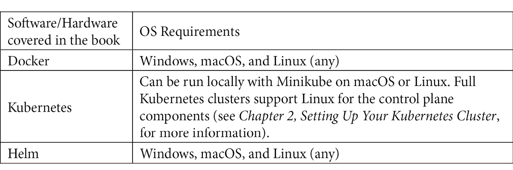

# 前言

本书的目标是为你提供必要的知识和工具，帮助你使用 Kubernetes 构建云原生应用。Kubernetes 是一项强大的技术，为工程师提供了使用容器构建云原生平台的有力工具。该项目本身在不断发展，包含了许多不同的工具来应对常见的场景。

本书的布局并没有专注于 Kubernetes 工具集的某一特定领域，我们将首先为你提供 Kubernetes 默认功能中最重要部分的全面总结——让你掌握运行 Kubernetes 应用所需的所有技能。接着，我们将为你提供应对 Kubernetes 安全性和故障排除的工具，适用于 Day 2 场景。最后，我们将超越 Kubernetes 的边界，探索一些强大的模式和技术，以在 Kubernetes 之上构建——如服务网格和无服务器架构。

# 本书适合谁阅读

本书面向 Kubernetes 初学者，但你应该熟悉容器和 DevOps 原则，以便充分理解本书内容。对 Linux 有一定的基础会有所帮助，但不是绝对必要的。

# 本书内容

*第一章*，*与 Kubernetes 通信*，介绍了容器编排的概念以及 Kubernetes 的基本工作原理。它还提供了你与 Kubernetes 集群进行通信和身份验证所需的基本工具。

*第二章*，*设置 Kubernetes 集群*，带你通过几种流行的方式创建 Kubernetes 集群，既可以在本地计算机上，也可以在云上进行。

*第三章*，*在 Kubernetes 上运行应用容器*，向你介绍了在 Kubernetes 上运行应用的最基本构建块——Pod。我们将讨论如何创建 Pod，以及 Pod 生命周期的具体细节。

*第四章*，*扩展和部署你的应用程序*，回顾了高级控制器，它们可以实现应用程序多个 Pod 的扩展和升级，包括自动扩展。

*第五章*，*服务与入口 – 与外界通信*，介绍了几种将运行在 Kubernetes 集群中的应用暴露给外部用户的方法。

*第六章*，*Kubernetes 应用配置*，赋予你为 Kubernetes 上运行的应用提供配置（包括安全数据）所需的技能。

*第七章*，*Kubernetes 上的存储*，回顾了为 Kubernetes 上运行的应用提供持久和非持久存储的方法和工具。

*第八章*，*Pod 调度控制*，介绍了控制和影响 Kubernetes 节点上 Pod 调度的几种不同工具和策略。

*第九章*，*Kubernetes 中的可观测性*，涵盖了 Kubernetes 环境中可观测性的多个要素，包括度量、追踪和日志记录。

*第十章*，*Kubernetes 故障排除*，回顾了 Kubernetes 集群可能出现故障的一些关键方式，并介绍了如何有效地排查 Kubernetes 中的问题。

*第十一章*，*Kubernetes 中的模板代码生成和 CI/CD*，介绍了 Kubernetes YAML 模板工具以及 Kubernetes 中 CI/CD 的一些常见模式。

*第十二章*，*Kubernetes 安全性和合规性*，涵盖了 Kubernetes 上的安全基础，包括 Kubernetes 项目的一些近期安全问题，以及集群和容器安全的工具。

*第十三章*，*通过 CRD 扩展 Kubernetes*，介绍了自定义资源定义（CRD）以及向 Kubernetes 添加自定义功能的其他方法，如操作员。

*第十四章*，*服务网格与无服务器架构*，回顾了 Kubernetes 中的一些高级模式，教您如何为集群添加服务网格并启用无服务器工作负载。

*第十五章*，*Kubernetes 中的有状态工作负载*，详细介绍了在 Kubernetes 上运行有状态工作负载的具体内容，包括如何运行一些生态系统中强大的有状态应用程序的教程。

# 为了最大化从本书中获得的收获

由于 Kubernetes 是基于容器的，本书中的一些示例可能使用的是自出版以来有所变化的容器。其他示例可能使用的是在 Docker Hub 上不存在的容器。这些示例应作为运行您自己应用容器的基础。



在某些情况下，像 Kubernetes 这样的开源软件可能会发生破坏性更改。本书是基于 Kubernetes 1.19 版本的，但请始终查阅文档（无论是 Kubernetes 还是本书中涉及的其他开源项目的文档）以获取最新的信息和规格。

**如果您使用的是本书的数字版本，我们建议您自己输入代码，或通过 GitHub 仓库访问代码（链接将在下一部分提供）。这样做将帮助您避免由于复制粘贴代码而可能出现的错误。**

# 下载示例代码文件

您可以从 GitHub 下载本书的示例代码文件，地址是[`github.com/PacktPublishing/Cloud-Native-with-Kubernetes`](https://github.com/PacktPublishing/Cloud-Native-with-Kubernetes)。如果代码有更新，它将会在现有的 GitHub 仓库中更新。

我们还提供了来自我们丰富书籍和视频目录的其他代码包，可以在[`github.com/PacktPublishing/`](https://github.com/PacktPublishing/)找到。快去看看吧！

# 下载彩色图像

我们还提供了一个 PDF 文件，包含本书中使用的截图/图表的彩色图像。您可以在此处下载：[`www.packtpub.com/sites/default/files/downloads/9781838823078_ColorImages.pdf`](http://www.packtpub.com/sites/default/files/downloads/9781838823078_ColorImages.pdf)。

# 使用的约定

本书中使用了一些文本约定。

`文本中的代码`：表示文本中的代码词、数据库表名、文件夹名称、文件名、文件扩展名、路径名、虚拟 URL、用户输入以及 Twitter 账号。例如：“在我们的案例中，我们希望让集群中的每个已认证用户都能创建特权 Pod，因此我们绑定到`system:authenticated`组。”

代码块如下所示：

```
apiVersion: networking.k8s.io/v1
kind: NetworkPolicy
metadata:
  name: full-restriction-policy
  namespace: development
spec:
  policyTypes:
  - Ingress
  - Egress
  podSelector: {}
```

当我们希望引起您对代码块中特定部分的注意时，相关行或项目将以粗体显示：

```
spec:
  privileged: false
  allowPrivilegeEscalation: false
  volumes:
 - 'configMap'
 - 'emptyDir'
 - 'projected'
 - 'secret'
 - 'downwardAPI'
 - 'persistentVolumeClaim'
  hostNetwork: false
  hostIPC: false
  hostPID: false
```

任何命令行输入或输出如下所示：

```
helm install falco falcosecurity/falco
```

**粗体**：表示新术语、重要单词或屏幕上看到的单词。例如，菜单或对话框中的单词在文本中会这样出现。示例：“Prometheus 还提供了一个**Alerts**选项卡，用于配置 Prometheus 警报。”

提示或重要备注

如此显示。

# 联系我们

我们欢迎读者的反馈。

**一般反馈**：如果您对本书的任何方面有疑问，请在邮件主题中提到书名，并通过 customercare@packtpub.com 与我们联系。

**勘误**：尽管我们已经尽力确保内容的准确性，但错误仍然可能发生。如果您发现本书中有错误，我们将非常感激您能向我们报告。请访问[www.packtpub.com/support/errata](http://www.packtpub.com/support/errata)，选择您的书籍，点击“勘误提交表单”链接并输入详细信息。

**盗版**：如果您在互联网上发现我们作品的任何非法复制品，我们将非常感激您能提供该位置地址或网站名称。请通过版权@packt.com 与我们联系，并提供该材料的链接。

**如果你有兴趣成为作者**：如果你在某个领域有专长，并且有兴趣撰写或参与编写一本书，请访问[authors.packtpub.com](http://authors.packtpub.com)。

# 评价

请留下评论。阅读并使用完本书后，为什么不在您购买书籍的网站上留下评论呢？潜在读者可以看到并利用您公正的意见来做出购买决策，我们 Packt 公司也能了解您对我们产品的看法，而我们的作者则能看到您对他们书籍的反馈。谢谢！

如需了解更多关于 Packt 的信息，请访问[packt.com](http://packt.com)。
