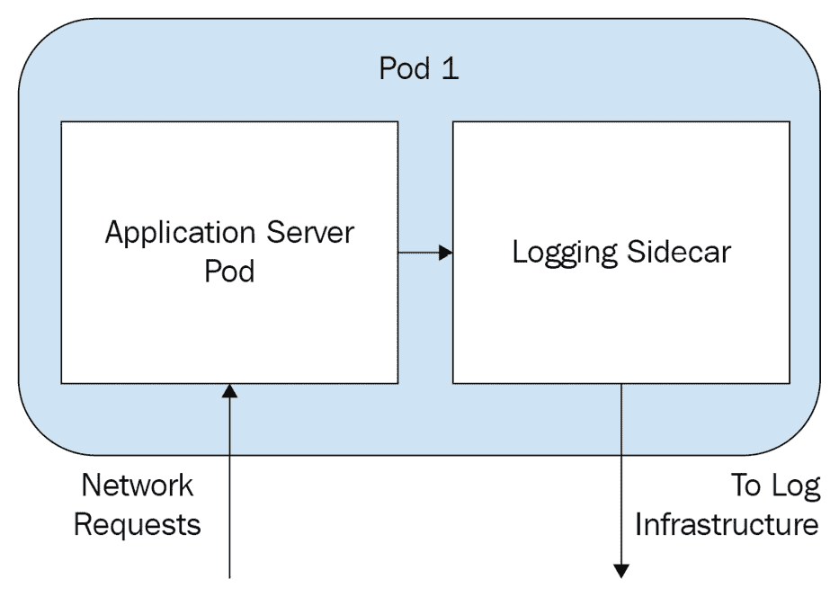
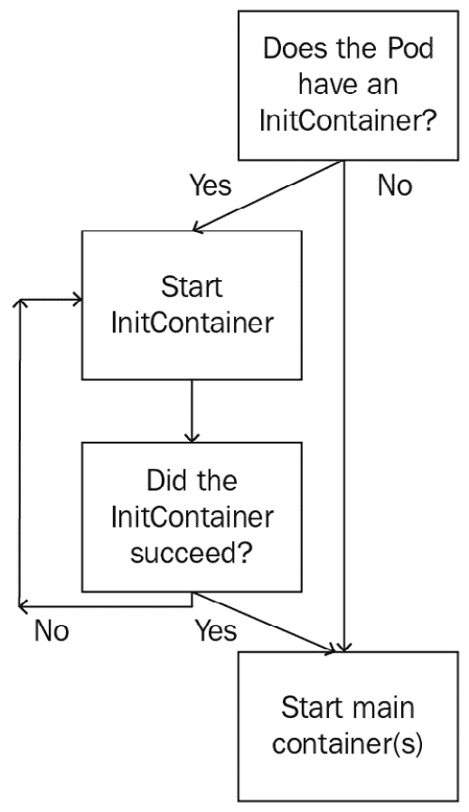

# *第三章*: 在 Kubernetes 上运行应用容器

本章包含了 Kubernetes 提供的最小乐高模块——Pod 的全面概述。包括对 PodSpec YAML 格式及其可能配置的解释，以及 Kubernetes 如何处理和调度 Pod 的简要讨论。Pod 是 Kubernetes 上运行应用程序的最基本方式，并且在所有高级应用程序控制器中都有使用。

在本章中，我们将讨论以下主题：

+   什么是 Pod？

+   命名空间

+   Pod 生命周期

+   Pod 资源规格

+   Pod 调度

# 技术要求

为了运行本章中详细介绍的命令，您需要一台支持`kubectl`命令行工具的计算机，并且需要一个工作中的 Kubernetes 集群。请参阅*第一章*，*与 Kubernetes 通信*，了解几种快速启动 Kubernetes 的方法，以及如何安装`kubectl`工具的说明。

本章中使用的代码可以在本书的 GitHub 仓库中找到，链接如下：

[`github.com/PacktPublishing/Cloud-Native-with-Kubernetes/tree/master/Chapter3`](https://github.com/PacktPublishing/Cloud-Native-with-Kubernetes/tree/master/Chapter3)

# 什么是 Pod？

Pod 是 Kubernetes 中最简单的计算资源。它指定一个或多个容器，由 Kubernetes 调度器在节点上启动和运行。Pod 有许多潜在的配置和扩展，但仍然是 Kubernetes 上运行应用程序的最基本方式。

重要提示

单独使用 Pod 并不是在 Kubernetes 上运行应用程序的最佳方式。为了充分利用像 Kubernetes 这样的容器编排工具的真正能力，Pod 应被视为一次性资源。这意味着应将容器（因此也包括 Pod）视为牲畜，而不是宠物。要真正利用容器和 Kubernetes，应用程序应在自愈、可扩展的组中运行。Pod 是这些组的构建块，我们将在后续章节中讲解如何以这种方式配置应用程序。

# 实现 Pods

Pod 是通过 Linux 隔离原则（如组和命名空间）实现的，通常可以看作是一个逻辑主机。Pod 可以运行一个或多个容器（这些容器可以基于 Docker、CRI-O 或其他运行时），并且这些容器之间可以像虚拟机中的不同进程那样进行通信。

为了使两个不同 Pod 中的容器能够通信，它们需要通过 Pod 的 IP 访问另一个 Pod（及其容器）。默认情况下，只有运行在同一 Pod 中的容器可以使用较低层次的通信方式，尽管可以配置不同的 Pod，使其通过主机 IPC 相互通信。

## Pod 范式

从最基本的层面来看，Pod 有两种类型：

+   单容器 Pod

+   多容器 Pod

一般来说，最佳实践是每个 Pod 只包含一个容器。这样做可以让你分别扩展应用的不同部分，并且在创建能够正常启动和运行的 Pod 时通常会更简单。

另一方面，多容器 Pod 更为复杂，但在某些情况下非常有用：

+   如果你的应用有多个部分运行在独立的容器中，但它们是紧密耦合的，你可以将它们放在同一个 Pod 中运行，以便实现无缝的通信和文件系统访问。

+   在实现*侧车*模式时，工具容器会与主应用一起注入，用于处理日志、指标、网络或更高级的功能，如服务网格（关于这方面的内容可以参考*第十四章*，*服务网格与无服务器架构*）。

下图展示了一个常见的侧车实现：



图 3.1 – 常见侧边栏实现

在这个示例中，我们有一个 Pod，里面有两个容器：一个运行 Web 服务器的应用容器和一个日志应用，它从我们的服务器 Pod 拉取日志并将其转发到日志基础设施。这是*侧车*模式的一个非常典型的应用，尽管许多日志收集器是在节点级别工作，而不是 Pod 级别，因此这并不是在 Kubernetes 中从我们的应用容器收集日志的普遍方式。

## Pod 网络

正如我们刚刚提到的，Pods 有自己的 IP 地址，可以用于 Pod 间的通信。每个 Pod 都有一个 IP 地址以及端口，如果 Pod 中有多个容器，这些端口是容器之间共享的。

在一个 Pod 内，如前所述，容器之间可以不通过 Pod 的 IP 来通信——它们可以直接使用 localhost。这是因为 Pod 内的容器共享一个网络命名空间——本质上，它们通过相同的*桥接*进行通信，而这个桥接是通过虚拟网络接口实现的。

## Pod 存储

Kubernetes 中的存储是一个庞大的话题，我们将在*第七章*，*Kubernetes 上的存储*中深入探讨——但现在，你可以将 Pod 存储理解为附加到 Pod 上的持久性或非持久性卷。非持久性卷可以被 Pod 用于存储数据或文件，具体取决于卷的类型，但它们会在 Pod 关闭时被删除。持久性卷将在 Pod 关闭后仍然存在，甚至可以在多个 Pod 或应用之间共享数据。

在我们继续讨论 Pods 之前，我们先简要讨论一下命名空间。由于我们在与 Pods 的操作中将使用`kubectl`命令，因此了解命名空间如何与 Kubernetes 和`kubectl`关联是非常重要的，因为这可能是一个大“陷阱”。

## 命名空间

我们在*第一章*《与 Kubernetes 通信》的授权部分中简要讨论了命名空间，但在这里我们将重申并扩展它们的目的。命名空间是一种在集群中逻辑上分离不同区域的方法。一个常见的用例是为每个环境设置一个命名空间——一个用于开发环境，一个用于暂存环境，一个用于生产环境——它们都存在于同一个集群中。

正如我们在*授权*部分中提到的，可以在每个命名空间的基础上指定用户权限——例如，允许用户将新应用和资源部署到`dev`命名空间，而不能部署到生产环境。

在你的运行集群中，你可以通过运行`kubectl get namespaces`或`kubectl get ns`来查看现有的命名空间，这将输出如下内容：

```
NAME          STATUS    AGE
default       Active    1d
kube-system   Active    1d
kube-public   Active    1d
```

要强制创建命名空间，你可以简单地运行`kubectl create namespace staging`，或者运行`kubectl apply -f /path/to/file.yaml`，并使用以下 YAML 资源规格：

Staging-ns.yaml

```
apiVersion: v1
kind: Namespace
metadata:
  name: staging
```

如你所见，`Namespace`规格非常简单。让我们继续讨论一些更复杂的内容——PodSpec 本身。

## Pod 生命周期

若要快速查看集群中正在运行的 Pods，可以运行`kubectl get pods`或`kubectl get pods --all-namespaces`，分别查看当前命名空间（由`kubectl`上下文定义，或者如果未指定则是默认命名空间）或所有命名空间中的 Pods。

`kubectl get pods`的输出如下所示：

```
NAME     READY   STATUS    RESTARTS   AGE
my-pod   1/1     Running   0          9s
```

如你所见，Pods 有一个`STATUS`值，告诉我们 Pod 当前处于哪个状态。

Pod 状态的值如下：

+   `Running`状态表示 Pod 已经成功启动其容器，且没有任何问题。如果 Pod 只有一个容器，且其状态为`Running`，则表示容器尚未完成或退出其进程。它也可能正在重启，你可以通过检查`READY`列来判断。例如，如果`READY`值为`0/1`，则意味着 Pod 中的容器当前未通过健康检查。这可能有多种原因：容器可能仍在启动中，数据库连接可能不可用，或某些重要的配置可能阻止了应用进程的启动。

+   如果容器已完成其进程命令，则为`Succeeded`状态。

+   `Pending`状态表示 Pod 中至少有一个容器正在等待其镜像。这通常是因为容器镜像仍在从外部仓库拉取，或因为 Pod 本身正在等待`kube-scheduler`调度。

+   `Unknown`状态意味着 Kubernetes 无法确定 Pod 当前的状态。这通常表示 Pod 所在的节点正在经历某种错误。可能是磁盘空间不足、与集群其他部分断开连接，或遇到其他问题。

+   `Failed` 状态，表示 Pod 中一个或多个容器已经以失败状态终止。此外，Pod 中的其他容器必须已经以成功或失败状态终止。这可能是由于集群删除 Pod 或容器应用程序内部的某些问题导致进程中断。

## 理解 Pod 资源规格

由于 Pod 资源规格是我们深入研究的第一个内容，我们将花时间详细讲解 YAML 文件的各个部分以及它们如何组合在一起。

让我们从一个完全规范化的 Pod 文件开始，然后我们可以拆解它并进行回顾：

Simple-pod.yaml

```
apiVersion: v1
kind: Pod
metadata:
  name: myApp
  namespace: dev
  labels:
    environment: dev
  annotations:
    customid1: 998123hjhsad 
spec:
  containers:
  - name: my-app-container
    image: busybox
```

这个 Pod YAML 文件比我们在第一章中看到的稍微复杂一些。它展示了一些新的 Pod 功能，我们稍后将进行回顾。

### API 版本

从第 1 行开始：`apiVersion`。正如我们在 *第一章* 中提到的，*与 Kubernetes 通信*，`apiVersion` 告诉 Kubernetes 在创建和配置资源时应该查看哪个版本的 API。Pod 在 Kubernetes 中已经存在很长时间，因此 PodSpec 已经固定为 API 版本 `v1`。其他资源类型可能除了版本名外，还包含组名——例如，Kubernetes 中的 CronJob 资源使用 `batch/v1beta1` `apiVersion`，而 Job 资源则使用 `batch/v1` `apiVersion`。在这两种情况下，`batch` 对应于 API 组名。

### 类型

`kind` 值对应于 Kubernetes 中资源类型的实际名称。在这种情况下，我们要指定一个 Pod，这就是我们填写的内容。`kind` 值总是采用驼峰命名法，例如 `Pod`、`ConfigMap`、`CronJob` 等等。

重要说明

要查看完整的 `kind` 值列表，请参考官方 Kubernetes 文档：[`kubernetes.io/docs/home/`](https://kubernetes.io/docs/home/)。新的 Kubernetes `kind` 值会在新版本中添加，因此本书中讨论的值可能不是完整的列表。

### 元数据

元数据是一个顶级键，可以在其下有多个不同的值。首先，`name` 是资源的名称，它是通过 `kubectl` 显示的内容，并且在 `etcd` 中存储的名称。`namespace` 对应于资源应创建的命名空间。如果 YAML 规范中未指定命名空间，则资源将创建在 `default` 命名空间中——除非在 `apply` 或 `create` 命令中指定了命名空间。

接下来，`labels` 是用于向资源添加元数据的键值对。与其他元数据不同，`labels` 是 Kubernetes 原生 `selectors` 默认使用的，用于过滤和选择资源——但它们也可以用于自定义功能。

最后，`metadata`块可以包含多个`annotations`，这些`annotations`像`labels`一样，可以被控制器和自定义的 Kubernetes 功能使用，用于提供额外的配置和特定功能的数据。在这个 PodSpec 中，我们在`metadata`中指定了几个注解：

pod-with-annotations.yaml

```
apiVersion: v1
kind: Pod
metadata:
  name: myApp
  namespace: dev
  labels:
    environment: dev
  annotations:
    customid1: 998123hjhsad
    customid2: 1239808908sd 
spec:
  containers:
  - name: my-app-container
    image: busybox
```

通常情况下，最好使用`labels`来处理 Kubernetes 特定的功能和选择器，而使用`annotations`来添加数据或扩展功能——这只是一个约定。

### Spec

`spec`是包含资源特定配置的顶级键。在这种情况下，由于我们的`kind`值是`Pod`，我们将添加一些特定于 Pod 的配置。所有后续的键都会在`spec`键下缩进，并表示我们的 Pod 配置。

### 容器

`containers`键期望一个包含一个或多个容器的列表，这些容器将在 Pod 内运行。每个容器的规格将暴露它自己的配置值，这些值会在资源 YAML 中容器列表项下进行缩进。我们将在这里回顾其中一些配置，但完整的配置清单请参考 Kubernetes 文档（[`kubernetes.io/docs/home/`](https://kubernetes.io/docs/home/)）。

### 名称

在容器规格中，`name`与容器在 Pod 中的名称相关。容器名称可以用来通过`kubectl logs`命令特定地访问某个容器的日志，但我们稍后会讲到。现在，确保为 Pod 中的每个容器选择一个清晰的名称，以便在调试时更容易。

### 镜像

对于每个容器，`image`用于指定应该在 Pod 中启动的 Docker（或其他运行时）镜像的名称。镜像将从配置的仓库中拉取，默认是公共的 Docker Hub，也可以是私有仓库。

就这样——这就是你在 Kubernetes 中指定并运行一个 Pod 所需的一切。从此之后，`Pod`部分中的所有内容都属于*附加配置*范围。

### Pod 资源规格

Pods 可以配置特定的内存和计算资源分配。这样可以防止资源消耗较大的应用程序影响集群性能，同时也有助于防止内存泄漏。可以指定两种资源——`cpu`和`memory`。对于每种资源，都有两种不同类型的规格——`Requests`和`Limits`，总共有四个可能的资源规格键。

内存请求和限制可以使用任何典型的内存数量后缀进行配置，或者使用其二的幂等效值——例如，50 Mi（兆二进制字节），50 MB（兆字节）或 1 Gi（吉比字节）。

CPU 请求和限制可以通过使用 `m`（对应于 1 毫 CPU）或仅使用十进制数来配置。因此，`200m` 相当于 `0.2`，等于 20% 或一个逻辑 CPU 的五分之一。无论核心数量如何，此数量将是相同的计算能力。1 CPU 等于 AWS 中的虚拟核心或 GCP 中的核心。让我们看看这些资源请求和限制在我们的 YAML 文件中是什么样子的：

pod-with-resource-limits.yaml

```
apiVersion: v1
kind: Pod
metadata:
  name: myApp
spec:
  containers:
  - name: my-app-container
    image: mydockername
    resources:
      requests:
        memory: "50Mi"
        cpu: "100m"
      limits:
        memory: "200Mi"
        cpu: "500m"
```

在这个 `Pod` 中，我们有一个运行 Docker 镜像的容器，该镜像具有对 `cpu` 和 `memory` 的请求和限制。在这种情况下，我们的容器镜像名称 `mydockername` 是一个占位符 - 但如果你想在这个示例中测试 Pod 资源限制，你可以使用 busybox 镜像。

### 容器启动命令

当一个容器在 Kubernetes Pod 中启动时，它会运行容器规范中指定的默认启动脚本 - 例如 Docker 容器规范中指定的脚本。为了使用不同的命令或附加参数覆盖此功能，你可以提供 `command` 和 `args` 键。让我们来看一个配置了 `start` 命令和一些参数的容器：

pod-with-start-command.yaml

```
apiVersion: v1
kind: Pod
metadata:
  name: myApp
spec:
  containers:
  - name: my-app-container
    image: mydockername
    command: ["run"]
    args: ["--flag", "T", "--run-type", "static"]
```

如你所见，我们指定了一个命令以及作为字符串数组的参数列表，用逗号分隔，空格应用空格。

### 初始化容器

`init` 容器是 Pod 中的特殊容器，在普通 Pod 容器启动之前启动、运行和关闭。

`init` 容器可用于许多不同的用例，例如在应用程序启动之前初始化文件或确保在启动 Pod 之前运行其他应用程序或服务。

如果指定了多个 `init` 容器，它们将按顺序运行，直到所有 `init` 容器都关闭。因此，`init` 容器必须运行一个完成并具有终点的脚本。如果你的 `init` 容器脚本或应用程序继续运行，Pod 中的普通容器将不会启动。

在下面的 Pod 中，`init` 容器正在运行一个循环，通过 `nslookup` 检查我们的 `config-service` 是否存在。一旦它发现 `config-service` 已经启动，脚本就会结束，这将触发我们的 `my-app` 应用容器启动：

pod-with-init-container.yaml

```
apiVersion: v1
kind: Pod
metadata:
  name: myApp
spec:
  containers:
  - name: my-app
    image: mydockername
    command: ["run"]
  initContainers:
  - name: init-before
    image: busybox
    command: ['sh', '-c', 'until nslookup config-service; do echo config-service not up; sleep 2; done;']
```

重要提示

当 `init` 容器失败时，Kubernetes 将自动重新启动 Pod，类似于通常的 Pod 启动功能。可以通过在 Pod 级别更改 `restartPolicy` 来更改此功能。

下面是显示 Kubernetes 中典型 Pod 启动流程的图表：



图 3.2 – 初始化容器流程图

如果一个 Pod 有多个 `initContainer`，它们将按顺序调用。这对于设置了必须按顺序执行的模块化步骤的 `initContainers` 非常有价值。下面的 YAML 显示了这一点：

pod-with-multiple-init-containers.yaml

```
apiVersion: v1
kind: Pod
metadata:
  name: myApp
spec:
  containers:
  - name: my-app
    image: mydockername
    command: ["run"]
  initContainers:
  - name: init-step-1
    image: step1-image
    command: ['start-command']
  - name: init-step-2
    image: step2-image
    command: ['start-command']
```

例如，在这个`Pod` YAML 文件中，`step-1 init`容器需要先成功运行，才能启动`init-step-2`，而且只有当两个容器都显示成功时，`my-app`容器才会启动。

### 在 Kubernetes 中引入不同类型的探针

为了知道容器（因此也知道 Pod）何时失败，Kubernetes 需要知道如何测试容器是否正常运行。我们通过定义`probes`来实现这一点，Kubernetes 会在指定的间隔时间内运行这些探针，以判断容器是否工作正常。

Kubernetes 允许我们配置三种类型的探针——准备就绪探针、存活探针和启动探针。

### 准备就绪探针

首先，准备就绪探针可以用来判断容器是否准备好执行某些操作，比如通过 HTTP 接受流量。这些探针在应用程序的初期阶段非常有用，比如容器可能仍在获取配置，尚未准备好接受连接。

让我们看看配置了准备就绪探针的 Pod 是怎样的。以下是附带准备就绪探针的 PodSpec：

pod-with-readiness-probe.yaml

```
apiVersion: v1
kind: Pod
metadata:
  name: myApp
spec:
  containers:
  - name: my-app
    image: mydockername
    command: ["run"]
    ports:
    - containerPort: 8080
    readinessProbe:
      exec:
        command:
        - cat
        - /tmp/thisfileshouldexist.txt
      initialDelaySeconds: 5
      periodSeconds: 5
```

首先，如您所见，探针是按容器定义的，而不是按 Pod 定义的。Kubernetes 会对每个容器运行所有的探针，并利用这些信息来判断 Pod 的整体健康状态。

### 存活探针

存活探针可以用来判断应用程序是否由于某种原因（例如内存错误）失败。对于长时间运行的应用容器，存活探针非常有用，它能帮助 Kubernetes 回收旧的或故障的 Pod，替换成新的 Pod。虽然探针本身不会导致容器重启，但其他 Kubernetes 资源和控制器会检查探针状态，并在必要时使用它来重启 Pod。以下是附带存活探针定义的 PodSpec：

pod-with-liveness-probe.yaml

```
apiVersion: v1
kind: Pod
metadata:
  name: myApp
spec:
  containers:
  - name: my-app
    image: mydockername
    command: ["run"]
    ports:
    - containerPort: 8080
    livenessProbe:
      exec:
        command:
        - cat
        - /tmp/thisfileshouldexist.txt
      initialDelaySeconds: 5
      failureThreshold: 3
      periodSeconds: 5
```

如您所见，我们的存活探针（liveness probe）的定义与准备就绪探针（readiness probe）相同，唯一的不同是增加了`failureThreshold`。

`failureThreshold`的值将决定 Kubernetes 在采取行动之前尝试探测的次数。对于存活探针，当`failureThreshold`被超越时，Kubernetes 会重启 Pod；而对于准备就绪探针，Kubernetes 则会简单地将 Pod 标记为`Not Ready`。该阈值的默认值是`3`，但可以更改为大于或等于`1`的任何值。

在这种情况下，我们使用`exec`机制来进行探测。稍后我们会回顾各种可用的探测机制。

### 启动探针

最后，启动探针（startup probe）是一种特殊类型的探针，它只会在容器启动时运行一次。有些（通常是较旧的）应用程序在容器中启动时可能需要很长时间，因此通过在容器首次启动时提供一些额外的宽限期，您可以避免存活探针或准备就绪探针失败，从而导致重启。以下是配置了启动探针的 Pod 示例：

pod-with-startup-probe.yaml

```
apiVersion: v1
kind: Pod
metadata:
  name: myApp
spec:
  containers:
  - name: my-app
    image: mydockername
    command: ["run"]
    ports:
    - containerPort: 8080
    startupProbe:
      exec:
        command:
        - cat
        - /tmp/thisfileshouldexist.txt
      initialDelaySeconds: 5
      successThreshold: 2
      periodSeconds: 5
```

启动探针提供的好处不仅仅是延长存活性探针或就绪探针之间的时间——它们还可以让 Kubernetes 在解决启动后发生的问题时保持快速反应（更重要的是）并防止启动缓慢的应用程序不断重启。如果你的应用程序启动需要很多秒，甚至一两分钟，你将更容易实现启动探针。

`successThreshold` 就是字面意思，它是与 `failureThreshold` 对应的另一面。它指定容器被标记为 `Ready` 之前需要连续多少次成功。对于那些在启动时可能会波动直到稳定的应用程序（例如某些自我集群化应用程序），更改此值可能会很有用。默认值是 `1`，对于存活性探针，唯一的可能值是 `1`，但是我们可以更改就绪探针和启动探针的值。

### 探针机制配置

有多种机制可以指定三种探针之一：`exec`、`httpGet` 和 `tcpSocket`。

`exec` 方法允许你指定一个将在容器内运行的命令。成功执行的命令将导致探针通过，而失败的命令将导致探针失败。到目前为止，我们配置的所有探针都使用了 `exec` 方法，因此配置应该是显而易见的。如果所选命令（带有以逗号分隔的参数列表）失败，则探针将失败。

`httpGet` 方法允许你指定一个容器上的 URL，该 URL 将通过 HTTP `GET` 请求访问。如果 HTTP 请求返回的状态码在 `200` 到 `400` 之间，则探针成功。任何其他 HTTP 状态码都将导致探针失败。

`httpGet` 的配置如下所示：

pod-with-get-probe.yaml

```
apiVersion: v1
kind: Pod
metadata:
  name: myApp
spec:
  containers:
  - name: my-app
    image: mydockername
    command: ["run"]
    ports:
    - containerPort: 8080
    livenessProbe:
      httpGet:
        path: /healthcheck
        port: 8001
        httpHeaders:
        - name: My-Header
          value: My-Header-Value
        initialDelaySeconds: 3
        periodSeconds: 3
```

最后，`tcpSocket` 方法将尝试打开容器上指定的套接字，并使用结果来决定探针的成功或失败。`tcpSocket` 的配置如下所示：

pod-with-tcp-probe.yaml

```
apiVersion: v1
kind: Pod
metadata:
  name: myApp
spec:
  containers:
  - name: my-app
    image: mydockername
    command: ["run"]
    ports:
    - containerPort: 8080
    readinessProbe:
      tcpSocket:
        port: 8080
      initialDelaySeconds: 5
      periodSeconds: 10
```

如你所见，这种类型的探针需要一个端口，每次检查发生时都会对该端口进行 ping 操作。

### 常见的 Pod 状态转换

在 Kubernetes 中，失败的 Pod 往往会频繁地在状态之间转换。对于第一次使用者来说，这可能会令人感到困惑，因此将 Pod 状态与探针功能之间的互动分解开来是很有价值的。再次重申，以下是我们的状态：

+   `运行中`

+   `成功`

+   `待处理`

+   `未知`

+   `失败`

常见的流程是运行 `kubectl get pods -w`（`-w` 标志为命令添加监视功能），并查看有问题的 Pod 在 `待处理` 和 `失败` 之间转换。通常，发生的情况是 Pod（及其容器）正在启动并拉取镜像——这就是 `待处理` 状态，因为健康检查尚未开始。

一旦初始探测超时（正如我们在前一节中看到的可配置的），第一个探测失败。这可能持续几秒钟甚至几分钟，具体取决于失败阈值设置的高低，状态仍然固定在`Pending`。

最终，我们达到了失败阈值，我们的 Pod 状态转为`Failed`。此时，会有两种可能发生，决策完全基于 PodSpec 中的 `RestartPolicy`，可以是`Always`、`Never`或者`OnFailure`。如果 Pod 失败且`restartPolicy`为`Never`，则 Pod 将保持在失败状态。如果是其他两个选项之一，Pod 将自动重启，并返回到`Pending`状态，这就是我们永无止境的过渡循环的根本原因。

作为不同的例子，您可能会看到 Pod 永远停留在`Pending`状态。这可能是因为 Pod 无法在任何节点上调度。这可能是由于资源请求约束（我们将在本书后面深入介绍，在*第八章*中的*Pod 放置控制*），或其他问题，比如节点无法访问。

最后，使用`Unknown`状态，通常 Pod 被调度的节点由于某些原因无法访问 – 比如节点可能已关闭，或通过网络无法访问。

### Pod 调度

Pod 调度的复杂性以及 Kubernetes 允许您影响和控制它的方式将保存在我们的*第八章*中的*Pod 放置控制*中，但现在我们将回顾基础知识。

在决定在哪里调度一个 Pod 时，Kubernetes 考虑了许多因素，但最重要的是要考虑（当不涉及 Kubernetes 允许我们使用的更复杂控制时）Pod 优先级、节点可用性和资源可用性。

Kubernetes 调度器运行一个常量控制循环，监视集群中未绑定（未调度）的 Pod。如果找到一个或多个未绑定的 Pod，调度器将使用 Pod 优先级来决定首先调度哪一个。

一旦调度程序决定要调度一个 Pod，它将执行多轮和类型的检查，以找到调度 Pod 的节点的局部最优解。后面的检查轮次由精细的调度控制指导，我们稍后会深入探讨在*第八章*中的*Pod 放置控制*。现在，我们先担心前几轮的检查。

首先，Kubernetes 检查当前时间哪些节点是可调度的。节点可能是不工作或者遇到其他问题，这将阻止新的 Pod 被调度。

其次，Kubernetes 通过检查哪些节点与 PodSpec 中声明的最小资源需求匹配，来筛选可调度的节点。

在这一点上，在缺乏任何其他放置控制的情况下，调度器将做出决策并将我们的新 Pod 分配给一个节点。当该节点上的 `kubelet` 看到它分配了一个新的 Pod 时，该 Pod 将被启动。

# 摘要

在本章中，我们了解到 Pods 是我们在 Kubernetes 中处理的最基本的构建块。对 Pods 及其所有微妙之处有深入的理解非常重要，因为在 Kubernetes 上所有的计算都使用 Pods 作为构建块。现在可能已经很明显了，但 Pods 是非常小、个体化的东西，不是很结实。在 Kubernetes 上以单个 Pod 运行应用程序而没有控制器是一个糟糕的决定，你的 Pod 出现任何问题都会导致停机。

在下一章中，我们将看到如何通过使用 Pod 控制器一次运行多个应用程序副本来防止这种情况发生。

# 问题

1.  你如何使用命名空间来分隔应用程序环境？

1.  Pod 状态显示为 `Unknown` 的可能原因是什么？

1.  限制 Pod 内存资源的原因可能是什么？

1.  如果运行在 Kubernetes 上的应用程序经常在失败的探测重启 Pod 之前无法及时启动，你应该调整哪种探测类型？就绪性、存活性还是启动？

# 进一步阅读

+   Kubernetes 官方文档：[`kubernetes.io/docs/home/`](https://kubernetes.io/docs/home/)

+   *Kubernetes 逆天之路*：[`github.com/kelseyhightower/kubernetes-the-hard-way`](https://github.com/kelseyhightower/kubernetes-the-hard-way)
