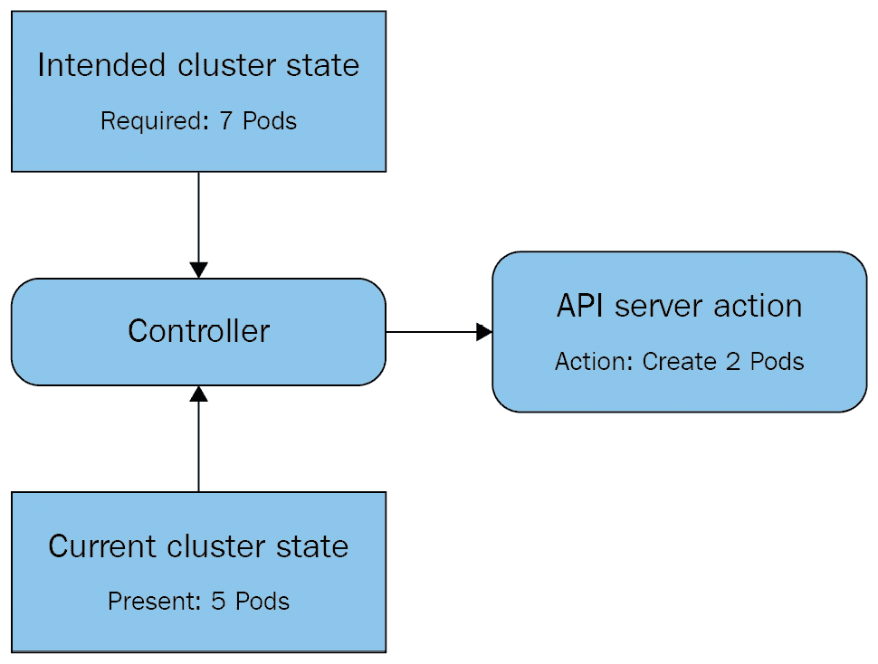

# *第四章*：扩展和部署您的应用程序

本章中，我们将学习用于运行应用程序和控制 Pods 的高级 Kubernetes 资源。首先，我们将讨论 Pod 的缺点，然后介绍最简单的 Pod 控制器 —— ReplicaSets。接下来，我们将介绍 Deployments，这是最流行的 Kubernetes 应用程序部署方法。然后，我们将介绍一些特殊资源，帮助您部署特定类型的应用程序 —— 水平 Pod 自动扩展器、DaemonSets、StatefulSets 和 Jobs。最后，我们将通过一个完整的示例展示如何在 Kubernetes 上运行一个复杂的应用程序。

本章将涵盖以下主题：

+   理解 Pod 的缺点及其解决方案

+   使用 ReplicaSets

+   控制 Deployments

+   利用水平 Pod 自动扩展器

+   实现 DaemonSets

+   审查 StatefulSets 和 Jobs

+   综合应用

# 技术要求

为了运行本章详细介绍的命令，您需要一台支持 `kubectl` 命令行工具的计算机，以及一个可工作的 Kubernetes 集群。请参阅*第一章*，*与 Kubernetes 通信*，了解几种快速启动 Kubernetes 的方法，以及如何安装 `kubectl` 工具的说明。

本章中使用的代码可以在本书的 GitHub 仓库中找到，地址是 [`github.com/PacktPublishing/Cloud-Native-with-Kubernetes/tree/master/Chapter4`](https://github.com/PacktPublishing/Cloud-Native-with-Kubernetes/tree/master/Chapter4)。

# 理解 Pod 的缺点及其解决方案

正如我们在上一章*第三章*，*在 Kubernetes 上运行应用程序容器*中回顾的那样，Kubernetes 中的 Pod 是在一个节点上运行的一个或多个应用容器的实例。创建一个 Pod 就足够了，这与在任何其他容器中运行应用程序的方式是一样的。

也就是说，使用单个 Pod 来运行应用程序忽视了运行容器本身的许多优势。容器允许我们将应用程序的每个实例视为一个无状态的项目，可以通过启动新的应用实例来根据需求扩展或缩减。

这既能让我们轻松地扩展应用程序，又能通过在特定时间提供多个应用实例，使应用程序更加可用。如果其中一个实例崩溃，应用程序仍然会继续运行，并会自动扩展到崩溃前的状态。在 Kubernetes 中，我们通过使用 Pod 控制器资源来实现这一点。

## Pod 控制器

Kubernetes 提供了多种现成的 Pod 控制器选择。最简单的选择是使用 ReplicaSet，它为特定的 Pod 保持一定数量的 Pod 实例。如果某个实例失败，ReplicaSet 会启动一个新的实例来替代它。

其次，Deployments 本身控制一个 ReplicaSet。Deployments 是 Kubernetes 中运行应用程序时最常见的控制器，它们使得通过对 ReplicaSet 进行滚动更新轻松升级应用程序。

Horizontal Pod Autoscalers 通过允许应用程序根据性能指标自动扩展到不同数量的实例，将 Deployments 提升到一个新水平。

最后，存在一些特殊的控制器，在某些情况下可能非常有价值：

+   DaemonSets，运行应用程序的一个实例在每个节点上，并维护它们

+   StatefulSets，用于保持 Pod 的身份静态，以帮助运行有状态的工作负载

+   Jobs，启动后运行直到完成，然后在指定数量的 Pods 上关闭

无论是像 ReplicaSet 这样的默认 Kubernetes 控制器，还是自定义控制器（例如，PostgreSQL Operator），控制器的实际行为应该是容易预测的。标准控制循环的简化视图大致如下图所示：



图 4.1 – Kubernetes 控制器的基本控制循环

正如你所看到的，控制器不断地检查**预期集群状态**（我们希望有七个此应用的 Pod）与**当前集群状态**（我们现在有五个此应用的 Pod 正在运行）之间的差异。当预期状态与当前状态不符时，控制器会通过 API 采取行动，将当前状态修正为与预期状态一致。

到目前为止，你应该明白为什么在 Kubernetes 中控制器是必要的：单独的 Pod 并不是一个足够强大的基本元素，无法提供高度可用的应用程序。接下来我们将讨论最简单的这种控制器：ReplicaSet。

# 使用 ReplicaSets

ReplicaSet 是最简单的 Kubernetes Pod 控制器资源。它们替代了较旧的 ReplicationController 资源。

ReplicaSet 和 ReplicationController 之间的主要区别在于，ReplicationController 使用一种更基础的*选择器*—决定哪些 Pods 应该被控制的过滤器。

虽然 ReplicationController 使用基于简单等式的（*key=value*）选择器，ReplicaSet 使用具有多种可能格式的选择器，如 `matchLabels` 和 `matchExpressions`，本章将讨论这些格式。

重要提示

除非你有充分的理由，否则没有必要使用 ReplicationController，直接使用 ReplicaSet 即可。

ReplicaSet 允许我们告知 Kubernetes 维护一个特定 Pod 规格的特定数量的 Pods。ReplicaSet 的 YAML 配置与 Pod 的 YAML 非常相似。实际上，整个 Pod 规格嵌套在 ReplicaSet YAML 的 `template` 键下。

还有一些其他关键的区别，可以通过以下代码块观察到：

replica-set.yaml

```
apiVersion: apps/v1
kind: ReplicaSet
metadata:
  name: myapp-group
  labels:
    app: myapp
spec:
  replicas: 3
  selector:
    matchLabels:
      app: myapp
  template:
    metadata:
      labels:
        app: myapp
    spec:
      containers:
      - name: myapp-container
        image: busybox
```

如你所见，除了`template`部分（本质上是 Pod 定义）之外，我们的 ReplicaSet spec 中还有`selector`键和`replicas`键。让我们从`replicas`开始。

## 副本

`replicas`键指定副本数，ReplicaSet 将确保在任何给定时间都有正确数量的副本在运行。如果一个 Pod 崩溃或停止工作，ReplicaSet 会创建一个新的 Pod 来替代它。这使得 ReplicaSet 成为一个自愈资源。

ReplicaSet 控制器如何判断一个 Pod 何时停止工作？它会查看 Pod 的状态。如果 Pod 的当前状态不是“*Running*”或“*ContainerCreating*”，ReplicaSet 将尝试启动一个新的 Pod。

正如我们在*第三章*中讨论的，*在 Kubernetes 上运行应用程序容器*，Pod 在容器创建后的状态由活性、就绪性和启动探针控制，这些探针可以专门为 Pod 配置。这意味着你可以设置特定于应用程序的方式来判断 Pod 是否出现故障，而你的 ReplicaSet 可以介入并启动一个新的 Pod 替代它。

## 选择器

`selector`键非常重要，因为 ReplicaSet 的工作方式依赖于它——它是一个核心实现为 selector 的控制器。ReplicaSet 的任务是确保与其 selector 匹配的正在运行的 Pod 数量正确。

假设，举个例子，你有一个正在运行你的应用程序`MyApp`的 Pod。这个 Pod 使用`selector`键标记为`App=MyApp`。

现在，假设你想创建一个 ReplicaSet 来添加额外的三个实例，以扩展你现有的应用程序。你创建一个具有相同 selector 的 ReplicaSet，并指定三个副本，计划总共运行四个实例，因为你已经有一个在运行。

一旦你启动 ReplicaSet，会发生什么？你会发现运行该应用程序的 Pod 总数是三个，而不是四个。这是因为 ReplicaSet 具有接管孤立 Pod 并将其纳入控制的能力。

当 ReplicaSet 启动时，它会发现已经存在一个与其`selector`键匹配的 Pod。根据需要的副本数量，ReplicaSet 将关闭现有的 Pod 或启动新的与`selector`匹配的 Pod，以确保正确的副本数。

## 模板

`template`部分包含 Pod，并支持与 Pod YAML 一样的所有字段，包括 metadata 部分和 spec 本身。大多数其他控制器遵循这种模式——它们允许你在更大的控制器 YAML 中定义 Pod spec。

你现在应该理解了 ReplicaSet spec 的各个部分及其作用。接下来，我们将实际使用我们的 ReplicaSet 来运行应用程序。

## 测试 ReplicaSet

现在，让我们部署我们的 ReplicaSet。

复制之前列出的`replica-set.yaml`文件，并使用以下命令在与 YAML 文件相同的文件夹中运行它：

```
kubectl apply -f replica-set.yaml
```

要检查 ReplicaSet 是否已正确创建，请运行 `kubectl get pods` 命令以获取默认命名空间中的 Pods。

由于我们没有为 ReplicaSet 指定命名空间，它将默认创建。`kubectl get pods` 命令应该返回如下内容：

```
NAME                            READY     STATUS    RESTARTS   AGE
myapp-group-192941298-k705b     1/1       Running   0          1m
myapp-group-192941298-o9sh8     1/1       Running   0        1m
myapp-group-192941298-n8gh2     1/1       Running   0        1m
```

现在，尝试使用以下命令删除一个 ReplicaSet 的 Pod：

```
kubectl delete pod myapp-group-192941298-k705b
```

ReplicaSet 总是会尝试保持指定数量的副本在线。

让我们再次使用 `kubectl get` 命令查看正在运行的 pods：

```
NAME                         READY  STATUS             RESTARTS AGE
myapp-group-192941298-u42s0  1/1    ContainerCreating  0     1m
myapp-group-192941298-o9sh8  1/1    Running            0     2m
myapp-group-192941298-n8gh2  1/1    Running            0     2m
```

如你所见，我们的 ReplicaSet 控制器正在启动一个新的 Pod，以保持副本数为三个。

最后，让我们使用以下命令删除我们的 ReplicaSet：

```
kubectl delete replicaset myapp-group
```

在清理过集群后，我们来继续了解更复杂的控制器——Deployments。

# 控制 Deployments

尽管 ReplicaSet 包含了运行高可用性应用所需的大部分功能，但大多数情况下，你会想要使用 Deployments 来在 Kubernetes 上运行应用。

与 ReplicaSets 相比，Deployments 有一些优势，并且它们实际上是通过拥有和控制 ReplicaSet 来工作的。

Deployment 的主要优势在于它允许你指定一个 `rollout` 程序——即应用升级是如何部署到 Deployment 中各个 pod 的。这使你可以轻松配置控制，以阻止错误的升级。

在我们复习如何执行此操作之前，先看一下 Deployment 的完整规格：

deployment.yaml

```
apiVersion: apps/v1
kind: Deployment
metadata:
  name: myapp-deployment
  labels:
    app: myapp
spec:
  replicas: 3
  strategy:
    type: RollingUpdate
    rollingUpdate:
      maxSurge: 25%
      maxUnavailable: 25% 
  selector:
    matchLabels:
      app: myapp
  template:
    metadata:
      labels:
        app: myapp
    spec:
      containers:
      - name: myapp-container
        image: busybox
```

如你所见，这与 ReplicaSet 的规格非常相似。我们在这里看到的区别是规格中出现了一个新键：`strategy`。

使用 `strategy` 设置，我们可以告诉 Deployment 以何种方式升级应用，可以选择 `RollingUpdate` 或 `Recreate`。

`Recreate` 是一种非常基础的部署方法：Deployment 中的所有 Pods 会同时被删除，然后使用新版本创建新的 Pods。`Recreate` 并未提供多少控制，以应对不良的部署——如果新 Pods 出现无法启动的情况，我们将面临一个完全无法工作的应用。

而使用 `RollingUpdate`，Deployment 更新的速度较慢，但控制得更好。首先，新应用将逐步滚动发布，一次一个 Pod。我们可以为 `maxSurge` 和 `maxUnavailable` 设置值来调优策略。

滚动更新是这样工作的——当 Deployment 规格更新为新的 Pod 容器版本时，Deployment 会一次删除一个 Pod，创建一个带有新应用版本的新 Pod，等待新 Pod 注册为 `Ready`（根据就绪检查确定），然后继续下一个 Pod。

`maxSurge` 和 `maxUnavailable` 参数允许你加快或减慢这一过程。`maxUnavailable` 让你可以调整在发布过程中不可用的 Pod 的最大数量。它可以是百分比或固定数值。`maxSurge` 让你可以调整每次最多可以创建超过 Deployment 副本数的 Pod 数量。像 `maxUnavailable` 一样，它可以是百分比或固定数值。

下图展示了 `RollingUpdate` 过程：


图 4.2 – Deployment 的 RollingUpdate 过程

如你所见，`RollingUpdate` 过程遵循几个关键步骤。Deployment 尝试逐个更新 Pods，只有一个 Pod 成功更新后，更新才会进行到下一个 Pod。

## 使用命令式命令控制 Deployments

正如我们所讨论的，我们可以通过简单地更新 YAML 文件来改变 Deployment，使用声明式方法。然而，Kubernetes 还为我们提供了一些 `kubectl` 中的特殊命令，用于控制 Deployment 的各个方面。

首先，Kubernetes 允许我们手动缩放一个 Deployment——也就是说，我们可以编辑应该运行的副本数量。

要将 `myapp-deployment` 缩放到五个副本，我们可以运行以下命令：

```
kubectl scale deployment myapp-deployment --replicas=5
```

同样地，如果需要，我们可以将`myapp-deployment`回滚到旧版本。为了演示这一点，首先让我们手动编辑我们的 Deployment，使用新版本的容器：

```
Kubectl set image deployment myapp-deployment myapp-container=busybox:1.2 –record=true
```

该命令告诉 Kubernetes 将我们 Deployment 中的容器版本更改为 1.2。然后，我们的 Deployment 将按照前述图示中的步骤滚动更新。

现在，假设我们想回到更新容器镜像版本之前的版本。我们可以使用 `rollout undo` 命令轻松实现：

```
Kubectl rollout undo deployment myapp-deployment
```

在我们之前的案例中，我们只有两个版本，初始版本和更新容器的版本，但如果有其他版本，我们可以在 `undo` 命令中这样指定：

```
Kubectl rollout undo deployment myapp-deployment –to-revision=10
```

这应该能让你看出为什么 Deployments 如此有价值——它们让我们能够精确控制应用程序新版本的发布过程。接下来，我们将讨论一个与 Deployments 和 ReplicaSets 协同工作的智能缩放器。

# 利用水平 Pod 自动缩放器

正如我们所看到的，Deployments 和 ReplicaSets 允许你指定在某一时间点应该有多少个副本可用。然而，这两个结构都不支持自动缩放——它们必须手动进行缩放。

**水平 Pod 自动缩放器** (**HPA**) 通过作为一个更高级的控制器，提供这种功能，能够根据 CPU 和内存使用等指标来改变 Deployment 或 ReplicaSet 的副本数。

默认情况下，HPA 可以基于 CPU 利用率进行自动缩放，但通过使用自定义指标，可以扩展这一功能。

HPA 的 YAML 文件如下所示：

hpa.yaml

```
apiVersion: autoscaling/v1
kind: HorizontalPodAutoscaler
metadata:
  name: myapp-hpa
spec:
  maxReplicas: 5
  minReplicas: 2
  scaleTargetRef:
    apiVersion: apps/v1
    kind: Deployment
    name: myapp-deployment
  targetCPUUtilizationPercentage: 70
```

在前面的规格中，我们有 `scaleTargetRef`，它指定了 HPA 应该自动扩展的对象，以及调优参数。

`scaleTargetRef` 的定义可以是 Deployment、ReplicaSet 或 ReplicationController。在此案例中，我们已将 HPA 定义为扩展我们之前创建的 Deployment，`myapp-deployment`。

对于调优参数，我们使用基于默认 CPU 利用率的扩展，因此可以使用 `targetCPUUtilizationPercentage` 来定义每个运行我们应用程序的 Pod 的目标 CPU 利用率。如果我们 Pod 的平均 CPU 使用率超过 70%，HPA 会扩展 Deployment 规格，如果使用率长时间低于该值，它会将 Deployment 缩减。

一个典型的扩容事件如下所示：

1.  一个 Deployment 的平均 CPU 使用率超过了三个副本的 70%。

1.  HPA 控制循环会注意到 CPU 利用率的增加。

1.  HPA 会通过新的副本数量来编辑 Deployment 规格。这个数量是根据 CPU 利用率计算的，目的是使每个节点的 CPU 使用率保持在 70% 以下的稳定状态。

1.  Deployment 控制器启动一个新的副本。

1.  该过程会重复，以便扩展或缩减 Deployment。

总结来说，HPA 会跟踪 CPU 和内存利用率，并在超出边界时启动扩容事件。接下来，我们将回顾 DaemonSets，它提供了一种非常特定类型的 Pod 控制器。

# 实现 DaemonSets

从现在开始直到本章结束，我们将回顾更多适用于具有特定要求的应用程序运行的细分选项。

我们将从 DaemonSets 开始，它类似于 ReplicaSets，区别在于每个节点的副本数固定为一个副本。这意味着集群中的每个节点在任何时候都会保持一个应用程序副本处于活动状态。

重要提示

需要记住的是，在没有额外的 Pod 调度控制（如污点或节点选择器）的情况下，此功能仅会在每个节点上创建一个副本，后者我们将在*第八章*中详细介绍，*Pod 调度控制*。

对于典型的 DaemonSet，它最终呈现为如下图所示：


图 4.3 – DaemonSet 分布在三个节点上

如上图所示，集群中的每个节点（用方框表示）包含一个由 DaemonSet 控制的应用程序 Pod。

这使得 DaemonSets 非常适合运行在节点级别收集指标或提供基于每个节点的网络进程的应用程序。一个 DaemonSet 规格如下所示：

daemonset-1.yaml

```
apiVersion: apps/v1 
kind: DaemonSet
metadata:
  name: log-collector
spec:
  selector:
      matchLabels:
        name: log-collector   
  template:
    metadata:
      labels:
        name: log-collector
    spec:
      containers:
      - name: fluentd
        image: fluentd
```

如你所见，这与典型的 ReplicaSet 规格非常相似，唯一不同的是我们没有指定副本数量。这是因为 DaemonSet 会尝试在集群中的每个节点上运行一个 Pod。

如果你希望指定一个子集的节点来运行你的应用程序，可以使用如下文件中的节点选择器来实现：

daemonset-2.yaml

```
apiVersion: apps/v1 
kind: DaemonSet
metadata:
  name: log-collector
spec:
  selector:
      matchLabels:
        name: log-collector   
  template:
    metadata:
      labels:
        name: log-collector
    spec:
      nodeSelector:
        type: bigger-node 
      containers:
      - name: fluentd
        image: fluentd
```

这个 YAML 文件将限制我们的 DaemonSet 仅匹配标签中 `type=bigger-node` 选择器的节点。在*第八章*中，我们将深入学习更多关于节点选择器的内容，*Pod 放置控制*。现在，让我们讨论一种非常适合运行有状态应用程序（如数据库）的控制器——StatefulSet。

# 理解 StatefulSets

StatefulSets 与 ReplicaSets 和 Deployments 非常相似，但有一个关键区别使它们更适合有状态工作负载。StatefulSets 保持每个 Pod 的顺序和身份，即使这些 Pods 被重新调度到新的节点上。

例如，在一个包含 3 个副本的 StatefulSet 中，Pod 1、Pod 2 和 Pod 3 会始终存在，并且这些 Pods 会在 Kubernetes 和存储中保持其身份（我们将在*第七章*中讨论 *Kubernetes 存储*）。不管发生什么重新调度，它们的身份都会保持不变。

让我们看一下一个简单的 StatefulSet 配置：

statefulset.yaml

```
apiVersion: apps/v1
kind: StatefulSet
metadata:
  name: stateful
spec:
  selector:
    matchLabels:
      app: stateful-app
  replicas: 5
  template:
    metadata:
      labels:
        app: stateful-app
    spec:
      containers:
      - name: app
        image: busybox
```

这个 YAML 文件将创建一个包含五个副本的 StatefulSet 来运行我们的应用程序。

让我们看看 StatefulSet 如何与典型的 Deployment 或 ReplicaSet 不同地维护 Pod 身份。我们可以使用以下命令获取所有 Pods：

```
kubectl get pods
```

输出应如下所示：

```
NAME      		   READY     STATUS    RESTARTS   AGE
stateful-app-0     1/1       Running   0         55s
stateful-app-1     1/1       Running   0         48s
stateful-app-2     1/1       Running   0         26s
stateful-app-3     1/1       Running   0         18s
stateful-app-4     0/1       Pending   0         3s
```

如你所见，在这个例子中，我们有五个 StatefulSet Pods，每个 Pod 都有一个数字标识符来表示其身份。这个特性对于有状态应用程序（如数据库集群）非常有用。在 Kubernetes 上运行数据库集群时，主节点与副本节点的身份非常重要，我们可以使用 StatefulSet 身份来轻松管理这一点。

另一个值得注意的地方是，你可以看到最后一个 Pod 仍在启动中，并且随着数字身份的增加，Pod 的年龄也会增加。这是因为 StatefulSet Pods 是逐个顺序创建的。

StatefulSets 与持久化的 Kubernetes 存储配合使用，以运行有状态应用程序。我们将在*第七章*中了解更多关于这个内容，*Kubernetes 存储*，但现在让我们讨论另一个有着非常特定用途的控制器：Jobs。

# 使用 Jobs

Kubernetes 中 Job 资源的目的是运行可以完成的任务，这使得它们不适合长期运行的应用程序，但非常适合批处理作业或类似任务，这些任务可以从并行化中受益。

以下是 Job 规范 YAML 文件的样子：

job-1.yaml

```
apiVersion: batch/v1
kind: Job
metadata:
  name: runner
spec:
  template:
    spec:
      containers:
      - name: run-job
        image: node:lts-jessie
        command: ["node", "job.js"]
      restartPolicy: Never
  backoffLimit: 4
```

这个 Job 将启动一个 Pod，并运行命令 `node job.js`，直到它完成，此时 Pod 会关闭。在这个和未来的例子中，我们假设使用的容器镜像包含一个文件 `job.js`，该文件运行作业逻辑。默认情况下，`node:lts-jessie` 容器镜像不会包含此文件。这是一个没有并行化的 Job 示例。如你所知，从 Docker 使用中可以得知，多个命令参数必须作为字符串数组传递。

为了创建一个可以并行运行的作业（也就是说，多个副本同时运行作业），你需要以一种能够在结束进程之前确定作业是否完成的方式开发应用代码。为了做到这一点，每个作业实例需要包含代码，确保它执行正确的批量任务部分，并防止重复工作。

有几种应用模式可以启用此功能，包括互斥锁和工作队列。此外，代码需要检查整个批量任务的状态，这可以通过更新数据库中的一个值来处理。一旦作业代码发现大任务已完成，它应该退出。

完成上述操作后，你可以使用`parallelism`键向作业代码中添加并行性。以下代码块展示了这一点：

job-2.yaml

```
apiVersion: batch/v1
kind: Job
metadata:
  name: runner
spec:
  parallelism: 3
  template:
    spec:
      containers:
      - name: run-job
        image: node:lts-jessie
        command: ["node", "job.js"]
      restartPolicy: Never
  backoffLimit: 4
```

如你所见，我们添加了`parallelism`键并设置为三份副本。此外，你可以将纯作业并行性替换为指定的完成次数，在这种情况下，Kubernetes 会跟踪作业的完成次数。你仍然可以为这种情况设置并行性，但如果没有设置，它默认会是 1。

这个规格将运行一个作业`4`次直到完成，每次运行时有`2`次迭代：

job-3.yaml

```
apiVersion: batch/v1
kind: Job
metadata:
  name: runner
spec:
  parallelism: 2
  completions: 4
  template:
    spec:
      containers:
      - name: run-job
        image: node:lts-jessie
        command: ["node", "job.js"]
      restartPolicy: Never
  backoffLimit: 4
```

Kubernetes 中的作业为抽象一次性处理提供了很好的方式，许多第三方应用程序将其集成到工作流中。如你所见，它们非常易于使用。

接下来，我们来看一个非常相似的资源，CronJob。

## CronJobs

CronJobs 是 Kubernetes 中的一个资源，用于定时执行作业。这与您在最喜爱的编程语言或应用框架中可能找到的 CronJob 实现非常相似，唯一的关键区别是：Kubernetes 的 CronJob 触发 Kubernetes 作业，它提供了一个额外的抽象层，可以用于触发例如每晚的批处理作业。

Kubernetes 中的 CronJob 使用非常典型的 cron 表示法进行配置。让我们来看一下完整的规格：

cronjob-1.yaml

```
apiVersion: batch/v1beta1
kind: CronJob
metadata:
  name: hello
spec:
  schedule: "0 1 * * *"
  jobTemplate:
    spec:
      template:
        spec:
          containers:
           - name: run-job
             image: node:lts-jessie
             command: ["node", "job.js"]
          restartPolicy: OnFailure
```

这个 CronJob 将在每天凌晨 1 点创建一个与我们之前的作业规格完全相同的作业。为了快速回顾 cron 时间表示法，了解我们凌晨 1 点作业的语法，继续阅读。如果需要更全面的 cron 表示法回顾，请查阅[`man7.org/linux/man-pages/man5/crontab.5.html`](http://man7.org/linux/man-pages/man5/crontab.5.html)。

cron 表示法由五个值组成，用空格分隔。每个值可以是数字、字符或组合。每个值代表一个时间值，格式如下，从左到右：

+   分钟

+   小时

+   每月的某一天（例如`25`）

+   月份

+   星期几（例如，`3` = 星期三）

上述 YAML 假设是一个非并行的 CronJob。如果我们想增加 CronJob 的批量处理能力，可以像之前为作业规格设置并行性一样为 CronJob 添加并行性。以下代码块展示了这一点：

cronjob-2.yaml

```
apiVersion: batch/v1beta1
kind: CronJob
metadata:
  name: hello
spec:
  schedule: "0 1 * * *"
  jobTemplate:
    spec:
      parallelism: 3
      template:
        spec:
          containers:
           - name: run-job
             image: node:lts-jessie
             command: ["node", "job.js"]
          restartPolicy: OnFailure
```

请注意，为了使其正常工作，您在 CronJob 容器中的代码需要优雅地处理并行性，可以使用工作队列或其他类似模式来实现。

我们现在已经审查了 Kubernetes 默认提供的所有基本控制器。接下来，让我们利用我们的知识，在 Kubernetes 上运行一个更复杂的应用示例。

# 将所有内容组合起来

我们现在有了一套在 Kubernetes 上运行应用程序的工具集。让我们看看一个现实世界的例子，看看这些如何结合起来，在 Kubernetes 资源上运行具有多个层和功能的应用程序：


图 4.4 – 多层应用程序架构

如您所见，我们的应用程序架构包含一个运行 .NET Framework 应用程序的 Web 层，一个运行 Java 的中间层或服务层，一个运行 Postgres 的数据库层，最后是一个日志/监控层。

我们为每个层选择的控制器取决于我们计划在每个层上运行的应用程序。对于 Web 层和中间层，我们运行的是无状态的应用和服务，因此我们可以有效地使用 Deployments 来处理更新发布、蓝绿部署等。

对于数据库层，我们需要数据库集群知道哪个 Pod 是副本，哪个是主节点——因此我们使用 StatefulSet。最后，我们的日志收集器需要在每个节点上运行，所以我们使用 DaemonSet 来运行它。

现在，让我们逐一查看每个层的示例 YAML 规格。

让我们从基于 JavaScript 的 Web 应用程序开始。通过在 Kubernetes 上托管这个应用程序，我们可以进行金丝雀测试和蓝绿部署。需要注意的是，本节中的一些示例使用了在 DockerHub 上不可公开访问的容器镜像名称。要使用此模式，您可以将示例适配到自己的应用容器，或者如果您想运行它而不涉及实际的应用逻辑，可以直接使用 busybox。

Web 层的 YAML 文件可能如下所示：

example-deployment-web.yaml

```
apiVersion: apps/v1
kind: Deployment
metadata:
  name: webtier-deployment
  labels:
    tier: web
spec:
  replicas: 10
  strategy:
    type: RollingUpdate
    rollingUpdate:
      maxSurge: 50%
      maxUnavailable: 25% 
  selector:
    matchLabels:
      tier: web
  template:
    metadata:
      labels:
        tier: web
    spec:
      containers:
      - name: reactapp-container
        image: myreactapp
```

在前面的 YAML 中，我们使用 `tier` 标签来标记我们的应用程序，并将其作为我们的 `matchLabels` 选择器。

接下来是中间层服务层。让我们来看一下相关的 YAML：

example-deployment-mid.yaml

```
apiVersion: apps/v1
kind: Deployment
metadata:
  name: midtier-deployment
  labels:
    tier: mid
spec:
  replicas: 8
  strategy:
    type: RollingUpdate
    rollingUpdate:
      maxSurge: 25%
      maxUnavailable: 25% 
  selector:
    matchLabels:
      tier: mid
  template:
    metadata:
      labels:
        tier: mid
    spec:
      containers:
      - name: myjavaapp-container
        image: myjavaapp
```

如您在前面的代码中所见，我们的中间层应用程序与 Web 层设置非常相似，并且我们使用了另一个 Deployment。

现在进入有趣的部分——让我们来看一下 Postgres StatefulSet 的规格。为了适应页面，我们略微截断了这个代码块，但您应该能够看到最重要的部分：

example-statefulset.yaml

```
apiVersion: apps/v1
kind: StatefulSet
metadata:
  name: postgres-db
  labels:
    tier: db
spec:
  serviceName: "postgres"
  replicas: 2
  selector:
    matchLabels:
      tier: db
  template:
    metadata:
      labels:
        tier: db
    spec:
      containers:
      - name: postgres
        image: postgres:latest
        envFrom:
          - configMapRef:
              name: postgres-conf
        volumeMounts:
        - name: pgdata
          mountPath: /var/lib/postgresql/data
          subPath: postgres
```

在上面的 YAML 文件中，我们可以看到一些新概念，这些概念我们之前没有讨论过——ConfigMaps 和卷。我们将在*第六章*，*Kubernetes 应用配置*，以及*第七章*，*Kubernetes 存储* 中更详细地了解它们的工作原理，但现在我们先专注于其余的配置部分。我们有我们的 `postgres` 容器，并在默认的 Postgres 端口 `5432` 上设置了一个端口。

最后，让我们来看一下我们日志应用的 DaemonSet。这里是 YAML 文件的一部分，我们为了长度方便，已将其截断：

example-daemonset.yaml

```
apiVersion: apps/v1
kind: DaemonSet
metadata:
  name: fluentd
  namespace: kube-system
  labels:
    tier: logging
spec:
  updateStrategy:
    type: RollingUpdate
  template:
    metadata:
      labels:
        tier: logging
    spec:
      tolerations:
      - key: node-role.kubernetes.io/master
        effect: NoSchedule
      containers:
      - name: fluentd
        image: fluent/fluentd-kubernetes-daemonset:v1-debian-papertrail
        env:
          - name: FLUENT_PAPERTRAIL_HOST
            value: "mycompany.papertrailapp.com"
          - name: FLUENT_PAPERTRAIL_PORT
            value: "61231"
          - name: FLUENT_HOSTNAME
            value: "DEV_CLUSTER"
```

在这个 DaemonSet 中，我们设置了 FluentD（一款流行的开源日志收集器）将日志转发到 Papertrail，一款基于云的日志收集器和搜索工具。同样，在这个 YAML 文件中，我们有一些之前没有涉及过的内容。例如，`tolerations` 部分对于 `node-role.kubernetes.io/master` 实际上允许我们的 DaemonSet 将 Pod 放置在主节点上，而不仅仅是工作节点。我们将在*第八章*中回顾这种操作，*Pod 调度控制*。

我们还在 Pod 配置中直接指定了环境变量，这对于相对基础的配置是可以的，但可以通过使用 Secrets 或 ConfigMaps（我们将在*第六章*，*Kubernetes 应用配置* 中回顾）来改进，以避免将其直接写入 YAML 代码中。

# 总结

在本章中，我们回顾了在 Kubernetes 上运行应用的一些方法。首先，我们回顾了为什么仅凭 Pod 本身不足以保证应用可用性，并介绍了控制器。接着，我们回顾了一些简单的控制器，包括 ReplicaSets 和 Deployments，然后讨论了具有更具体用途的控制器，如 HPA、Jobs、CronJobs、StatefulSets 和 DaemonSets。最后，我们将所有学习内容结合起来，实现在 Kubernetes 上运行复杂应用的过程。

在下一章中，我们将学习如何使用 Services 和 Ingress 将我们的应用（现在已经高可用地运行）暴露给外界。

# 问题

1.  ReplicaSet 和 ReplicationController 有什么区别？

1.  Deployment 相较于 ReplicaSet 有什么优势？

1.  Job 的一个好的使用场景是什么？

1.  为什么 StatefulSets 更适合有状态工作负载？

1.  我们如何通过 Deployments 支持金丝雀发布流程？

# 进一步阅读

+   官方 Kubernetes 文档: [`kubernetes.io/docs/home/`](https://kubernetes.io/docs/home/)

+   Kubernetes Job 资源文档: [`kubernetes.io/docs/concepts/workloads/controllers/job/`](https://kubernetes.io/docs/concepts/workloads/controllers/job/)

+   FluentD DaemonSet 安装文档: [`github.com/fluent/fluentd-kubernetes-daemonset`](https://github.com/fluent/fluentd-kubernetes-daemonset)

+   *Kubernetes The Hard Way*: [`github.com/kelseyhightower/kubernetes-the-hard-way`](https://github.com/kelseyhightower/kubernetes-the-hard-way)
