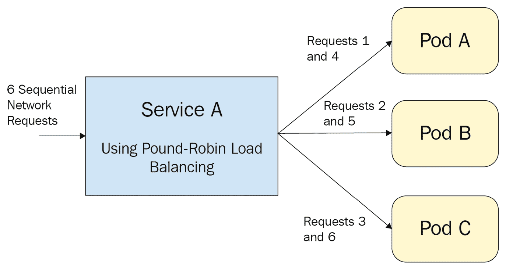
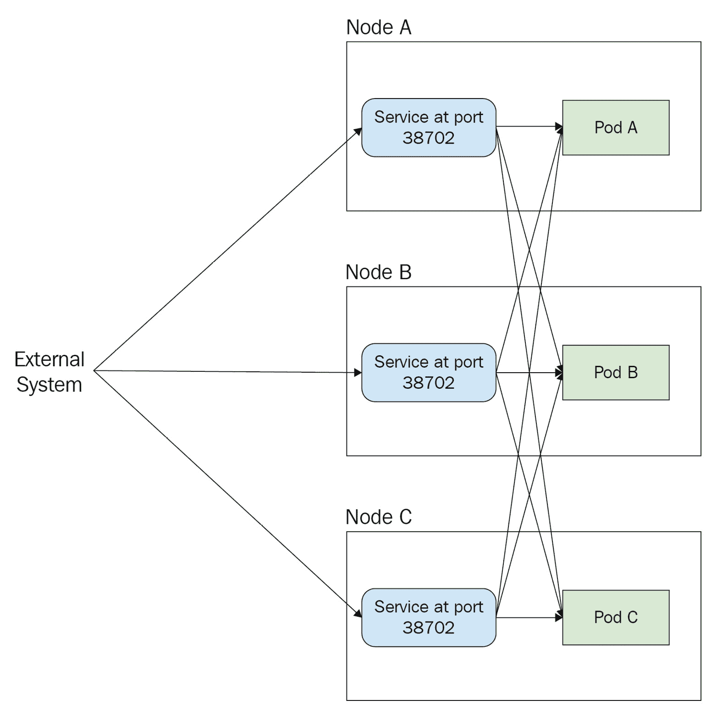
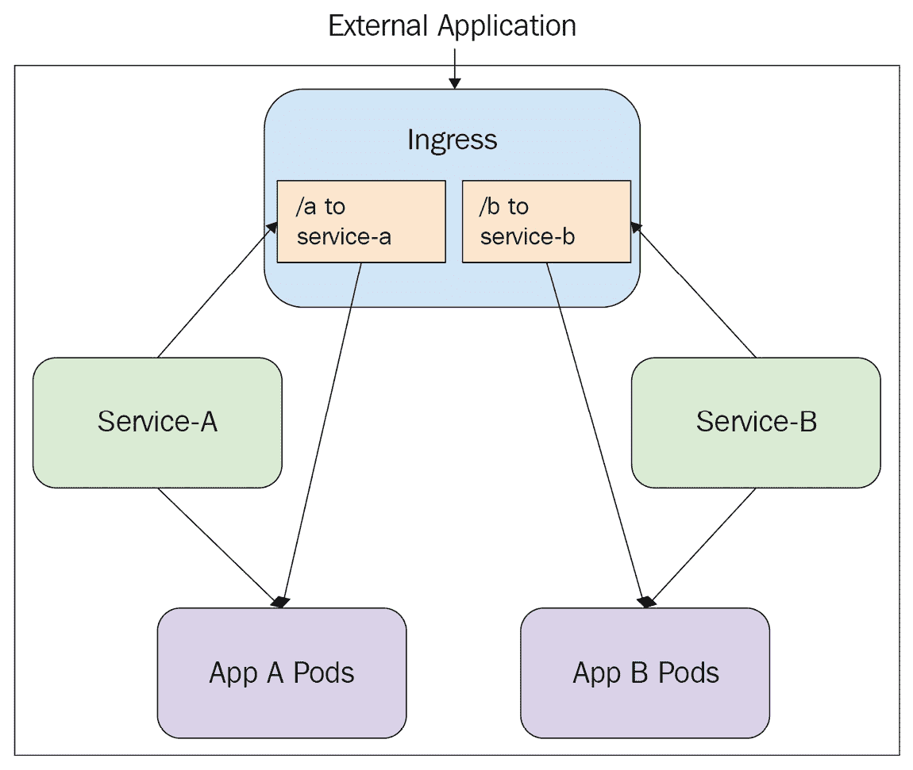

# 第五章：*第五章*：服务和 Ingress——与外界通信

本章包含了 Kubernetes 提供的允许应用程序彼此通信，以及与集群外部资源通信的方法的全面讨论。你将学习到 Kubernetes 服务资源及其所有可能的类型——ClusterIP、NodePort、LoadBalancer 和 ExternalName——以及如何实现它们。最后，你将学习如何使用 Kubernetes Ingress。

在本章中，我们将讨论以下主题：

+   理解 Services 和集群 DNS

+   实现 ClusterIP

+   使用 NodePort

+   设置 LoadBalancer 服务

+   创建 ExternalName 服务

+   配置 Ingress

# 技术要求

为了运行本章中详细说明的命令，你需要一台支持 `kubectl` 命令行工具并且有一个正常工作的 Kubernetes 集群的计算机。查看 *第一章*，*与 Kubernetes 通信*，以了解几种快速启动和运行 Kubernetes 的方法，并查看如何安装 `kubectl` 工具的说明。

本章中使用的代码可以在本书的 GitHub 仓库中找到，网址为 [`github.com/PacktPublishing/Cloud-Native-with-Kubernetes/tree/master/Chapter5`](https://github.com/PacktPublishing/Cloud-Native-with-Kubernetes/tree/master/Chapter5)。

# 理解 Services 和集群 DNS

在前几章中，我们讨论了如何使用包括 Pods、Deployments 和 StatefulSets 在内的资源，在 Kubernetes 上有效运行应用程序。然而，许多应用程序（如 web 服务器）需要能够接受来自其容器外部的网络请求。这些请求可能来自其他应用程序或从设备访问公共互联网。

Kubernetes 提供了多种资源类型，用于处理允许集群外部和内部资源访问运行在 Pods、Deployments 等上的应用程序的各种场景。

这些分为两大资源类型：Services 和 Ingress：

+   **服务**有多个子类型——ClusterIP、NodePort 和 LoadBalancer——通常用于从集群内部或外部提供对单一应用程序的简单访问。

+   **Ingress** 是一种更高级的资源，它创建一个控制器，用于处理基于路径名和主机名的路由，指向集群内部运行的各种资源。Ingress 通过使用规则将流量转发到 Services。你需要使用 Services 来使用 Ingress。

在开始介绍我们第一种服务资源类型之前，让我们先回顾一下 Kubernetes 如何在集群内部处理 DNS。

## 集群 DNS

让我们首先讨论 Kubernetes 中哪些资源默认会获得自己的 DNS 名称。Kubernetes 中的 DNS 名称仅限于 Pods 和 Services。Pod 的 DNS 名称包含多个部分，结构类似子域名。

在 Kubernetes 中运行的 Pod 的典型 **完全限定域名** (**FQDN**) 如下所示：

```
my-hostname.my-subdomain.my-namespace.svc.my-cluster-domain.example
```

让我们从最右边开始逐步分解：

+   `my-cluster-domain.example` 对应于集群 API 自身配置的 DNS 名称。根据用于设置集群的工具和其运行的环境，这可以是外部域名或内部 DNS 名称。

+   `svc` 是一个部分，即使在 Pod DNS 名称中也会出现 - 所以我们可以假设它会出现。然而，正如您很快将看到的那样，您通常不会通过它们的完全限定域名访问 Pod 或服务。

+   `my-namespace` 是相当不言自明的。DNS 名称的这一部分将是您的 Pod 操作所在的任意命名空间。

+   `my-subdomain` 对应于 Pod 规范中的 `subdomain` 字段。该字段完全是可选的。

+   最后，`my-hostname` 将设置为 Pod 元数据中 Pod 名称。

总体而言，这个 DNS 名称允许集群中的其他资源访问特定的 Pod。单独来看并不是特别有帮助，特别是当您使用通常具有多个 Pod 的部署和有状态集时。这就是服务的用武之地。

让我们来看一下服务的 A 记录 DNS 名称：

```
my-svc.my-namespace.svc.cluster-domain.example
```

如您所见，这与 Pod DNS 名称非常相似，不同之处在于在我们的命名空间左侧仅有一个值 - 这是服务名称（与 Pod 一样，这是基于元数据名称生成的）。

这些 DNS 名称处理的结果之一是，在命名空间内部，您可以仅通过其服务（或 Pod）名称和子域名访问服务或 Pod。

例如，取我们之前的服务 DNS 名称。从 `my-namespace` 命名空间内部，可以通过 DNS 名称 `my-svc` 简单访问服务。从 `my-namespace` 命名空间外部，可以通过 `my-svc.my-namespace` 访问服务。

现在我们已经学会了如何在集群内部使用 DNS，我们可以讨论如何将其转换为服务代理。

## 服务代理类型

Services，尽可能简单地解释，提供了一个抽象层，用于将请求转发到运行应用程序的一个或多个 Pod。

在创建服务时，我们定义一个选择器，告诉服务将请求转发到哪些符合服务选择器的 Pod。通过 `kube-proxy` 组件的功能，在请求到达服务时，它们将被转发到匹配服务选择器的各个 Pod。

Kubernetes 中有三种可能的代理模式可以使用：

+   **用户空间代理模式**：最古老的代理模式，自 Kubernetes 版本 1.0 起可用。该代理模式将以轮询方式将请求转发到匹配的 Pod。

+   **Iptables 代理模式**：自 1.1 版本起可用，并且自 1.2 版本起成为默认选项。与用户空间模式相比，这种模式的开销更低，可以使用轮询或随机选择。

+   **IPVS 代理模式**：自 1.8 版本起提供的最新选项。该代理模式允许使用其他负载均衡选项（不仅限于轮询）：

    a. 轮询

    b. 最少连接（最少数量的开放连接）

    c. 源哈希

    d. 目标哈希

    e. 最短预期延迟

    f. 永不排队

对于不熟悉循环负载均衡的人，相关讨论将解释什么是循环负载均衡。

循环负载均衡涉及从头到尾遍历服务端点的潜在列表，每次网络请求都会进行一次遍历。下图展示了这一过程的简化视图，它与 Kubernetes 中服务背后的 Pod 相关：



图 5.1 – 服务负载均衡到 Pods

正如你所看到的，服务会交替发送请求到不同的 Pod。第一个请求发送到 Pod A，第二个请求发送到 Pod B，第三个请求发送到 Pod C，然后它会循环往复。现在我们知道服务是如何处理请求的，让我们从 ClusterIP 开始，回顾主要的服务类型。

# 实现 ClusterIP

ClusterIP 是一种简单的服务类型，暴露在集群内的内部 IP 上。这种类型的服务无法从集群外部访问。让我们来看一下服务的 YAML 文件：

clusterip-service.yaml

```
apiVersion: v1
kind: Service
metadata:
  name: my-svc
Spec:
  type: ClusterIP
  selector:
    app: web-application
    environment: staging
  ports:
    - name: http
      protocol: TCP
      port: 80
      targetPort: 8080
```

与其他 Kubernetes 资源一样，我们有 `metadata` 块，其中包含我们的 `name` 值。正如我们在讨论 DNS 时提到的，`name` 值是你可以从集群中的其他地方访问服务的方式。正因如此，ClusterIP 是一个很好的选择，适用于仅需通过集群内其他 Pods 访问的服务。

接下来，我们有 `Spec`，它由三大部分组成：

+   首先，我们有 `type`，它对应于我们的服务类型。由于默认类型是 `ClusterIP`，如果您想使用 ClusterIP 服务，实际上不需要指定类型。

+   接下来，我们有 `selector`。我们的 `selector` 由键值对组成，这些键值对必须与相关 Pods 元数据中的标签匹配。在这种情况下，我们的服务将寻找标签为 `app=web-application` 和 `environment=staging` 的 Pods 来转发流量。

+   最后，我们有 `ports` 块，在这里我们可以将服务上的端口映射到 Pods 上的 `targetPort` 号。在这种情况下，服务上的端口 `80`（HTTP 端口）将映射到应用程序 Pod 上的端口 `8080`。可以在服务上打开多个端口，但当打开多个端口时，`name` 字段是必需的。

接下来，让我们深入了解 `protocol` 选项，因为这些对我们讨论服务端口非常重要。

## 协议

在我们之前的 ClusterIP 服务中，我们选择了 `TCP` 作为协议。Kubernetes 当前（截至版本 1.19）支持几种协议：

+   **TCP**

+   **UDP**

+   **HTTP**

+   **PROXY**

+   **SCTP**

这是一个可能会引入新功能的领域，特别是在涉及 HTTP（L7）服务时。目前，所有这些协议在不同环境或云服务提供商中并未完全得到支持。

重要说明

若要了解更多信息，您可以查阅 Kubernetes 的官方文档（[`kubernetes.io/docs/concepts/services-networking/service/`](https://kubernetes.io/docs/concepts/services-networking/service/)），以了解当前的服务协议状态。

现在我们已经讨论了带有 Cluster IP 的服务 YAML 文件的具体细节，接下来可以讨论下一个服务类型——NodePort。

# 使用 NodePort

NodePort 是一个面向外部的服务类型，这意味着它实际上可以从集群外部进行访问。在创建 NodePort 服务时，会自动创建一个具有相同名称的 ClusterIP 服务，并通过 NodePort 进行路由，因此你仍然可以从集群内部访问该服务。这使得 NodePort 成为在负载均衡器服务不可行或无法使用时，对外部应用程序进行访问的一个不错的选择。

NodePort 听起来就像它的名字——这种类型的服务在集群中的每个节点上打开一个端口，可以通过该端口访问服务。该端口默认位于`30000`-`32767`范围内，并且在创建服务时会自动链接。

这是我们 NodePort 服务的 YAML 文件：

nodeport-service.yaml

```
apiVersion: v1
kind: Service
metadata:
  name: my-svc
Spec:
  type: NodePort
  selector:
    app: web-application
  ports:
    - name: http
      protocol: TCP
      port: 80
      targetPort: 8080
```

如你所见，与 ClusterIP 服务的唯一区别是服务类型——然而，值得注意的是，我们在 `ports` 部分指定的端口 `80` 只会在访问自动创建的 ClusterIP 版本的服务时使用。要从集群外部访问服务，我们需要查看生成的端口链接，以便在节点 IP 上访问该服务。

要做到这一点，我们可以使用以下命令创建服务：

```
kubectl apply -f svc.yaml 
```

然后运行以下命令：

```
kubectl describe service my-svc
```

前面命令的结果将是以下输出：

```
Name:                   my-svc
Namespace:              default
Labels:                 app=web-application
Annotations:            <none>
Selector:               app=web-application
Type:                   NodePort
IP:                     10.32.0.8
Port:                   <unset> 8080/TCP
TargetPort:             8080/TCP
NodePort:               <unset> 31598/TCP
Endpoints:              10.200.1.3:8080,10.200.1.5:8080
Session Affinity:       None
Events:                 <none>
```

从这个输出中，我们查看 `NodePort` 行，看到为此服务分配的端口是 `31598`。因此，可以通过 `[NODE_IP]:[ASSIGNED_PORT]` 在任何节点上访问该服务。

或者，我们可以手动为服务分配一个 NodePort IP。手动分配 NodePort 的 YAML 文件如下：

manual-nodeport-service.yaml

```
apiVersion: v1
kind: Service
metadata:
  name: my-svc
Spec:
  type: NodePort
  selector:
    app: web-application
  ports:
    - name: http
      protocol: TCP
      port: 80
      targetPort: 8080
      nodePort: 31233
```

如你所见，我们选择了一个位于 `30000`-`32767` 范围内的 `nodePort`，在此情况下为 `31233`。要查看这个 NodePort 服务如何在节点之间工作，可以查看下面的示意图：



图 5.2 – NodePort 服务

如你所见，虽然服务可以在集群中的每个节点（节点 A、节点 B 和节点 C）上访问，但网络请求仍会在所有节点的 Pods（Pod A、Pod B 和 Pod C）之间进行负载均衡，而不仅仅是访问的节点。这是一种有效的方式，确保应用程序可以从任何节点进行访问。然而，在使用云服务时，你已经有了一系列工具来在服务器之间分发请求。下一个服务类型 LoadBalancer 让我们可以在 Kubernetes 上使用这些工具。

# 设置 LoadBalancer 服务

LoadBalancer 是 Kubernetes 中一种特殊的服务类型，它根据集群运行的位置配置一个负载均衡器。例如，在 AWS 中，Kubernetes 会配置一个弹性负载均衡器。

重要提示

要查看所有负载均衡服务及其配置，请查看 Kubernetes 服务文档中的[`kubernetes.io/docs/concepts/services-networking/service/#loadbalancer`](https://kubernetes.io/docs/concepts/services-networking/service/#loadbalancer)。

与`ClusterIP`或 NodePort 不同，我们可以以云特定的方式修改负载均衡服务的功能。通常，这是通过在服务的 YAML 文件中使用注释块来完成的——正如我们之前讨论过的，这只是一些键值对。要查看 AWS 的配置方式，我们来看一下负载均衡服务的规格：

loadbalancer-service.yaml

```
apiVersion: v1
kind: Service
metadata:
  name: my-svc
  annotations:
    service.beta.kubernetes.io/aws-load-balancer-ssl-cert: arn:aws.. 
spec:
  type: LoadBalancer
  selector:
    app: web-application
  ports:
    - name: http
      protocol: TCP
      port: 80
      targetPort: 8080
```

虽然我们可以在没有任何注释的情况下创建负载均衡器，但支持的 AWS 特定注释使我们能够（如前面的 YAML 代码所示）指定我们希望附加到负载均衡器的 TLS 证书（通过其在 Amazon 证书管理器中的 ARN）。AWS 的注释还允许配置负载均衡器的日志等。

这里是截至本书写作时，AWS 云提供商支持的一些关键注释：

+   `service.beta.kubernetes.io/aws-load-balancer-ssl-cert`

+   `service.beta.kubernetes.io/aws-load-balancer-proxy-protocol`

+   `service.beta.kubernetes.io/aws-load-balancer-ssl-ports`

    重要说明

    可以在 Kubernetes 官方文档的**云提供商**页面上找到所有提供商的完整注释列表及解释，[`kubernetes.io/docs/tasks/administer-cluster/running-cloud-controller/`](https://kubernetes.io/docs/tasks/administer-cluster/running-cloud-controller/)。

最后，通过负载均衡服务，我们已经覆盖了你可能最常用的服务类型。然而，对于那些服务本身运行在 Kubernetes 外部的特殊情况，我们可以使用另一种服务类型：ExternalName。

# 创建 ExternalName 服务

类型为 ExternalName 的服务可以用来代理那些实际上并没有在你的集群中运行的应用程序，同时仍然保持服务作为一个抽象层，可以随时更新。

让我们设定一下场景：你有一个在 Azure 上运行的遗留生产应用程序，你希望从集群内访问它。你可以通过`myoldapp.mydomain.com`来访问这个遗留应用程序。然而，你的团队目前正在将这个应用程序容器化，并在 Kubernetes 上运行，而这个新版本现在正在你的`dev`命名空间环境中工作。

不必让你的其他应用程序根据环境与不同的地方进行通信，你可以始终指向一个名为`my-svc`的服务，无论是在生产（`prod`）命名空间还是开发（`dev`）命名空间中。

在`dev`中，这个服务可以是一个`ClusterIP`服务，指向你新容器化的应用程序所在的 Pod。以下 YAML 展示了正在开发中的、容器化服务应该如何工作：

clusterip-for-external-service.yaml

```
apiVersion: v1
kind: Service
metadata:
  name: my-svc
  namespace: dev
Spec:
  type: ClusterIP
  selector:
    app: newly-containerized-app
  ports:
    - name: http
      protocol: TCP
      port: 80
      targetPort: 8080
```

在`prod`命名空间中，这个服务将成为一个`ExternalName`服务：

externalname-service.yaml

```
apiVersion: v1
kind: Service
metadata:
  name: my-svc
  namespace: prod
spec:
  type: ExternalName
  externalName: myoldapp.mydomain.com
```

由于我们的`ExternalName`服务实际上并没有将请求转发到 Pod，因此我们不需要选择器。相反，我们指定一个`ExternalName`，即我们希望服务指向的 DNS 名称。

以下图示展示了`ExternalName`服务如何在此模式中使用：


图 5.3 – ExternalName 服务配置

在前面的图示中，我们的**EC2 运行传统应用程序**是一个外部 AWS 虚拟机，位于集群外部。我们的**Service B**类型是**ExternalName**，将请求路由到该虚拟机。这样，我们的**Pod C**（或者集群中的任何其他 Pod）可以通过 ExternalName 服务的 Kubernetes DNS 名称，轻松访问外部的传统应用程序。

使用`ExternalName`，我们已经完成了对所有 Kubernetes 服务类型的回顾。接下来，我们将介绍一种更复杂的应用暴露方式——Kubernetes Ingress 资源。

# 配置 Ingress

如本章开头所提到的，Ingress 提供了一种细粒度的机制，用于将请求路由到集群内。Ingress 并不取代服务，而是增强它们的功能，如基于路径的路由。为什么需要这个？有很多原因，包括成本。一个包含 10 条路径指向`ClusterIP`服务的 Ingress，比为每条路径创建一个新的负载均衡器服务便宜得多——而且它保持了简单易懂。

Ingress 与 Kubernetes 中的其他服务不同。仅创建 Ingress 本身不会做任何事情。你需要两个额外的组件：

+   一个 Ingress 控制器：你可以从多种实现中选择，通常是基于 Nginx 或 HAProxy 等工具构建的。

+   针对目标路由的 ClusterIP 或 NodePort 服务。

首先，让我们讨论如何配置 Ingress 控制器。

## Ingress 控制器

通常，集群不会预配置任何现有的 Ingress 控制器。你需要选择并将其部署到集群中。`ingress-nginx`可能是最受欢迎的选择，但还有其他几个——可以参见[`kubernetes.io/docs/concepts/services-networking/ingress-controllers/`](https://kubernetes.io/docs/concepts/services-networking/ingress-controllers/)查看完整列表。

让我们学习如何部署 Ingress 控制器——为了本书的目的，我们将使用 Kubernetes 社区创建的 Nginx Ingress 控制器，`ingress-nginx`。

安装可能因控制器不同而有所不同，但对于`ingress-nginx`来说，主要有两个部分。首先，要部署主控制器本身，可以运行以下命令，具体命令可能会根据目标环境和最新的 Nginx Ingress 版本有所变化：

```
kubectl apply -f https://raw.githubusercontent.com/kubernetes/ingress-nginx/controller-v0.41.2/deploy/static/provider/cloud/deploy.yaml
```

其次，我们可能需要根据运行环境配置 Ingress。对于运行在 AWS 上的集群，我们可以配置 Ingress 入口点，使用我们在 AWS 中创建的弹性负载均衡器。

重要提示

要查看所有特定环境的设置说明，请参阅 `ingress-nginx` 文档：[`kubernetes.github.io/ingress-nginx/deploy/`](https://kubernetes.github.io/ingress-nginx/deploy/)。

Nginx ingress 控制器是一组 Pods，每当创建一个新的 Ingress 资源（一个自定义的 Kubernetes 资源）时，它会自动更新 Nginx 配置。除了 Ingress 控制器，我们还需要一种方式将请求路由到 Ingress 控制器——这被称为入口点。

### Ingress 入口点

默认的 `nginx-ingress` 安装还会创建一个单一的 Service，用于将请求发送到 Nginx 层，在此时 Ingress 规则接管。根据你配置 Ingress 的方式，这可以是一个 LoadBalancer 或 NodePort Service。在云环境中，你可能会使用云 LoadBalancer Service 作为集群 Ingress 的入口点。

### Ingress 规则和 YAML

现在我们已经启动了 Ingress 控制器，可以开始配置我们的 Ingress 规则了。

让我们从一个简单的示例开始。我们有两个服务，`service-a` 和 `service-b`，我们希望通过 Ingress 在不同的路径上公开它们。一旦你的 Ingress 控制器和任何相关的弹性负载均衡器（假设我们在 AWS 上运行）创建完成，首先让我们通过以下步骤创建我们的服务：

1.  首先，让我们看一下如何在 YAML 中创建 Service A。我们将文件命名为`service-a.yaml`：

    ```
    apiVersion: v1
    kind: Service
    metadata:
      name: service-a
    Spec:
      type: ClusterIP
      selector:
        app: application-a
      ports:
        - name: http
          protocol: TCP
          port: 80
          targetPort: 8080
    ```

1.  你可以通过运行以下命令创建我们的 Service A：

    ```
    kubectl apply -f service-a.yaml
    ```

1.  接下来，让我们创建我们的 Service B，其 YAML 代码与之前非常相似：

    ```
    apiVersion: v1
    kind: Service
    metadata:
      name: service-b
    Spec:
      type: ClusterIP
      selector:
        app: application-b
      ports:
        - name: http
          protocol: TCP
          port: 80
          targetPort: 8000
    ```

1.  通过运行以下命令创建我们的 Service B：

    ```
    kubectl apply -f service-b.yaml
    ```

1.  最后，我们可以创建我们的 Ingress，并为每个路径设置路由规则。以下是我们 Ingress 的 YAML 代码，它将根据基于路径的路由规则分配请求：

ingress.yaml

```
apiVersion: networking.k8s.io/v1
kind: Ingress
metadata:
  name: my-first-ingress
  annotations:
    nginx.ingress.kubernetes.io/rewrite-target: /
spec:
  rules:
  - host: my.application.com
    http:
      paths:
      - path: /a
        backend:
          serviceName: service-a
          servicePort: 80
      - path: /b
        backend:
          serviceName: service-b
          servicePort: 80
```

在我们前面的 YAML 配置中，ingress 有一个单一的 `host` 值，这将对应通过 Ingress 传入流量的 host 请求头。然后，我们有两个路径，`/a` 和 `/b`，它们分别指向我们之前创建的两个 `ClusterIP` 服务。为了以图形化的方式展示这个配置，我们来看一下下图：



图 5.4 – Kubernetes Ingress 示例

如你所见，我们简单的基于路径的规则使得网络请求能够直接路由到正确的 Pods。这是因为`nginx-ingress`使用 Service 选择器获取 Pod IP 列表，但并不直接通过 Service 与 Pods 通信。而是，Nginx（在这种情况下）的配置会随着新的 Pod IP 上线而自动更新。

`host` 值其实并不是必需的。如果你省略它，任何通过 Ingress 传入的流量，无论 host 请求头是什么（除非它匹配其他指定 host 的规则），都会按照规则路由。以下 YAML 显示了这种情况：

ingress-no-host.yaml

```
apiVersion: networking.k8s.io/v1
kind: Ingress
metadata:
  name: my-first-ingress
  annotations:
    nginx.ingress.kubernetes.io/rewrite-target: /
spec:
  rules:
   - http:
      paths:
      - path: /a
        backend:
          serviceName: service-a
          servicePort: 80
      - path: /b
        backend:
          serviceName: service-b
          servicePort: 80
```

即使没有主机头值，之前的 Ingress 定义仍会将流量引导到基于路径的路由规则。

同样，你也可以根据主机头（host header）将流量拆分成多个独立的分支路径，如下所示：

ingress-branching.yaml

```
apiVersion: networking.k8s.io/v1
kind: Ingress
metadata:
  name: multiple-branches-ingress
spec:
  rules:
  - host: my.application.com
    http:
      paths:
      - backend:
          serviceName: service-a
          servicePort: 80
  - host: my.otherapplication.com
    http:
      paths:
      - backend:
          serviceName: service-b
          servicePort: 80
```

最后，在许多情况下，你还可以通过 TLS 加密来保护你的 Ingress，尽管这一功能因不同的 Ingress 控制器而有所不同。对于 Nginx，可以通过使用 Kubernetes Secret 来实现。我们将在下一章详细讨论这个功能，但现在可以先查看 Ingress 侧的配置：

ingress-secure.yaml

```
apiVersion: networking.k8s.io/v1
kind: Ingress
metadata:
  name: secured-ingress
spec:
  tls:
  - hosts:
    - my.application.com
    secretName: my-tls-secret
  rules:
    - host: my.application.com
      http:
        paths:
        - path: /
          backend:
            serviceName: service-a
            servicePort: 8080
```

该配置将在默认命名空间中查找名为 `my-tls-secret` 的 Kubernetes Secret，并将其附加到 Ingress 上以进行 TLS 加密。

这就结束了我们对 Ingress 的讨论。许多 Ingress 功能可能与您选择的 Ingress 控制器相关，因此请查看您所选择实现的文档。

# 总结

在本章中，我们回顾了 Kubernetes 提供的各种方法，用于将运行在集群上的应用程序暴露给外部世界。主要的方法是 Services 和 Ingress。在 Services 中，你可以使用 ClusterIP Services 进行集群内路由，使用 NodePort 直接通过节点的端口访问服务。LoadBalancer Services 允许你使用现有的云负载均衡系统，而 ExternalName Services 则允许你将请求路由到集群外部的资源。

最后，Ingress 提供了一个强大的工具，可以通过路径在集群中路由请求。要实现 Ingress，你需要在集群上安装一个第三方或开源的 Ingress 控制器。

在下一章中，我们将讨论如何使用两种资源类型（ConfigMap 和 Secret）将配置信息注入到运行在 Kubernetes 上的应用程序中。

# 问题

1.  对于仅在集群内访问的应用程序，你会使用哪种类型的 Service？

1.  如何判断一个 NodePort 服务在哪个端口上激活？

1.  为什么 Ingress 比单纯使用 Services 更具成本效益？

1.  除了支持遗留应用程序外，ExternalName Services 在云平台上还有什么用处？

# 进一步阅读

+   来自 Kubernetes 文档的云服务提供商信息：[`kubernetes.io/docs/tasks/administer-cluster/running-cloud-controller/`](https://kubernetes.io/docs/tasks/administer-cluster/running-cloud-controller/)
