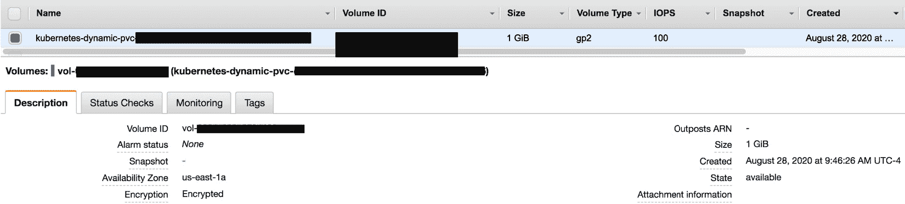

# *第七章*：Kubernetes 上的存储

在本章中，我们将学习如何在 Kubernetes 上提供应用存储。我们将回顾 Kubernetes 上的两种存储资源：卷和持久卷。卷适用于短暂的数据需求，而持久卷对于在 Kubernetes 上运行任何有状态的工作负载是必需的。通过本章中所学的技能，你将能够以多种方式和环境配置在 Kubernetes 上运行的应用存储。

在本章中，我们将讨论以下主题：

+   理解卷和持久卷之间的区别

+   使用卷

+   创建持久卷

+   持久卷声明

# 技术要求

为了运行本章详细介绍的命令，你需要一台支持`kubectl`命令行工具并且有一个正常运行的 Kubernetes 集群的计算机。有关如何快速启动 Kubernetes 的几种方法以及如何安装`kubectl`工具的说明，请参见*第一章*，*与 Kubernetes 通信*。

本章中使用的代码可以在本书的 GitHub 仓库中找到：[`github.com/PacktPublishing/Cloud-Native-with-Kubernetes/tree/master/Chapter7`](https://github.com/PacktPublishing/Cloud-Native-with-Kubernetes/tree/master/Chapter7)。

# 理解卷和持久卷之间的区别

完全无状态的容器化应用可能只需要容器文件本身的磁盘空间。在运行此类应用时，Kubernetes 上不需要额外的配置。

然而，这在现实世界中并不总是成立。正在迁移到容器的传统应用可能因多种原因需要磁盘空间卷。为了为容器存储文件，你需要 Kubernetes 的卷资源。

在 Kubernetes 中可以创建两种主要的存储资源：

+   卷

+   持久卷

两者的区别在于名称：卷与特定 Pod 的生命周期相关，而持久卷在删除之前始终存在，并且可以跨不同的 Pod 共享。卷在 Pod 内共享容器数据时非常有用，而持久卷则可以用于许多可能的高级用途。

让我们先看一下如何实现卷。

# 卷

Kubernetes 支持多种不同的卷子类型。大多数可以用于卷或持久卷，但有些是特定于某一种资源的。我们将从最简单的开始，回顾几种类型。

重要说明

你可以在 https://kubernetes.io/docs/concepts/storage/volumes/#types-of-volumes 查看卷类型的完整当前列表。

这里是卷子类型的简短列表：

+   `awsElasticBlockStore`

+   `cephfs`

+   `ConfigMap`

+   `emptyDir`

+   `hostPath`

+   `local`

+   `nfs`

+   `persistentVolumeClaim`

+   `rbd`

+   `Secret`

如您所见，ConfigMaps 和 Secrets 实际上作为 *卷类型* 实现。此外，列表中还包括云提供商的卷类型，例如 `awsElasticBlockStore`。

与持久卷不同，持久卷是独立于任何 Pod 创建的，创建卷通常是在 Pod 的上下文中进行的。

要创建一个简单的卷，您可以使用以下 Pod YAML：

pod-with-vol.yaml

```
apiVersion: v1
kind: Pod
metadata:
  name: pod-with-vol
spec:
  containers:
  - name: busybox
    image: busybox
    volumeMounts:
    - name: my-storage-volume
      mountPath: /data
  volumes:
  - name: my-storage-volume
    emptyDir: {}
```

该 YAML 将创建一个 Pod 和一个类型为 `emptyDir` 的卷。`emptyDir` 类型的卷使用 Pod 被分配到的节点上已存在的存储进行配置。如前所述，卷与 Pod 的生命周期相关，而不是与其容器的生命周期相关。

这意味着，在一个包含多个容器的 Pod 中，所有容器都能够访问卷数据。我们来看一个 Pod 的示例 YAML 文件：

pod-with-multiple-containers.yaml

```
apiVersion: v1
kind: Pod
metadata:
  name: my-pod
spec:
  containers:
  - name: busybox
    image: busybox
    volumeMounts:
    - name: config-volume
      mountPath: /shared-config
  - name: busybox2
    image: busybox
    volumeMounts:
    - name: config-volume
      mountPath: /myconfig
  volumes:
  - name: config-volume
    emptyDir: {}
```

在此示例中，Pod 中的两个容器都可以访问卷数据，尽管路径不同。容器之间甚至可以通过共享卷中的文件进行通信。

规格中重要的部分是 `volume spec` 本身（`volumes` 下的列表项）和卷的 `mount`（`volumeMounts` 下的列表项）。

每个挂载项包含一个名称，该名称对应于 `volumes` 部分中卷的名称，以及一个 `mountPath`，该路径指定卷将挂载到容器的哪个文件路径。例如，在前面的 YAML 中，卷 `config-volume` 将在 `busybox` Pod 中通过 `/shared-config` 访问，而在 `busybox2` Pod 中则通过 `/myconfig` 访问。

卷的规格本身需要一个名称——在本例中是 `my-storage`，并且需要根据卷类型指定其他键/值，这里是 `emptyDir`，并且只需要空括号。

现在，让我们来看一个将云提供的卷挂载到 Pod 的示例。要挂载一个 AWS **弹性块存储**（**EBS**）卷，可以使用以下 YAML：

pod-with-ebs.yaml

```
apiVersion: v1
kind: Pod
metadata:
  name: my-app
spec:
  containers:
  - image: busybox
    name: busybox
    volumeMounts:
    - mountPath: /data
      name: my-ebs-volume
  volumes:
  - name: my-ebs-volume
    awsElasticBlockStore:
      volumeID: [INSERT VOLUME ID HERE]
```

只要您的集群已正确设置以通过 AWS 进行身份验证，该 YAML 文件将把现有的 EBS 卷附加到 Pod 上。如您所见，我们使用 `awsElasticBlockStore` 键来专门配置要使用的确切卷 ID。在本例中，EBS 卷必须已经存在于您的 AWS 账户和区域中。使用 AWS **弹性 Kubernetes 服务**（**EKS**）会更容易，因为它允许我们在 Kubernetes 中自动配置 EBS 卷。

Kubernetes 还包括 Kubernetes AWS 云提供商中的功能，用于自动配置卷——但这些功能仅适用于持久卷。我们将在 *持久卷* 部分讨论如何获取这些自动配置的卷。

# 持久卷

持久卷相较于普通的 Kubernetes 卷有一些关键优势。如前所述，它们的生命周期与集群的生命周期绑定，而不是与单个 Pod 的生命周期绑定。这意味着持久卷可以在 Pods 之间共享并且只要集群在运行，就可以被重复使用。因此，这种模式更适合用于外部存储，如 EBS（AWS 的块存储服务），因为存储本身比单个 Pod 的生命周期要长。

使用持久卷实际上需要两个资源：`PersistentVolume` 本身和 `PersistentVolumeClaim`，后者用于将 `PersistentVolume` 挂载到 Pod。

我们从 `PersistentVolume` 本身开始 – 看一下创建 `PersistentVolume` 的基本 YAML 配置：

pv.yaml

```
apiVersion: v1
kind: PersistentVolume
metadata:
  name: my-pv
spec:
  storageClassName: manual
  capacity:
    storage: 5Gi
  accessModes:
    - ReadWriteOnce
  hostPath:
    path: "/mnt/mydata"
```

现在让我们来仔细分析一下。从规范中的第一行开始 – `storageClassName`。

这个配置中的第一项，`storageClassName`，表示我们希望使用的存储类型。对于 `hostPath` 卷类型，我们只需指定 `manual`，但是对于 AWS EBS，比如，你可以创建并使用名为 `gp2Encrypted` 的存储类，将 AWS 中的 `gp2` 存储类型与启用加密的 EBS 匹配。因此，存储类是某一特定卷类型的配置组合，可以在卷的规范中引用。

继续我们之前的 AWS `StorageClass` 示例，让我们为 `gp2Encrypted` 配置一个新的 `StorageClass`：

gp2-storageclass.yaml

```
kind: StorageClass
apiVersion: storage.k8s.io/v1
metadata:
  name: gp2Encrypted
  annotations:
    storageclass.kubernetes.io/is-default-class: "true"
provisioner: kubernetes.io/aws-ebs
parameters:
  type: gp2
  encrypted: "true"
  fsType: ext4
```

现在，我们可以使用 `gp2Encrypted` 存储类创建我们的 `PersistentVolume`。然而，也有一种快捷方式可以使用动态配置的 EBS（或其他云）卷来创建 `PersistentVolumes`。当使用动态配置卷时，我们首先创建 `PersistentVolumeClaim`，然后它会自动生成 `PersistentVolume`。

## 持久卷声明

我们现在知道你可以轻松地在 Kubernetes 中创建持久卷，然而这并不能让你将存储绑定到 Pod。你需要创建一个 `PersistentVolumeClaim`，它声明一个 `PersistentVolume`，并允许你将该声明绑定到一个或多个 Pod。

基于上一节的 `StorageClass`，让我们做一个声明，该声明将自动创建一个新的 `PersistentVolume`，因为没有其他持久卷使用我们期望的 `StorageClass`：

pvc.yaml

```
kind: PersistentVolumeClaim
apiVersion: v1
metadata:
  name: my-pv-claim
spec:
  storageClassName: gp2Encrypted
  accessModes:
    - ReadWriteOnce
  resources:
    requests:
      storage: 1Gi
```

运行 `kubectl apply -f` 命令处理该文件时，应会创建一个新的自动生成的 **Persistent Volume**（**PV**）。如果你的 AWS 云服务商配置正确，这将导致创建一个新的类型为 GP2 并启用了加密的 EBS 卷。

在将我们基于 EBS 的持久卷附加到 Pod 之前，让我们确认 EBS 卷是否在 AWS 中正确创建。

为此，我们可以导航到 AWS 控制台，确保我们在与 EKS 集群相同的区域。然后，进入 **服务** > **EC2**，并在左侧菜单下的 **弹性块存储** 中点击 **卷**。在此部分中，我们应该看到一行自动生成的与我们 PVC 声明相同大小（**1 GiB**）的卷。它应该属于 GP2 类，并且应启用加密。让我们看看在 AWS 控制台中这将是什么样子：



图 7.1 – 自动创建的 AWS 控制台 EBS 卷

如你所见，我们在 AWS 中成功创建了我们的动态生成的 EBS 卷，启用了加密，并分配了 **gp2** 卷类型。现在我们已经创建了卷，并确认它已在 AWS 中创建，我们可以将它附加到 Pod 上。

## 将持久化卷声明（PVC）附加到 Pod

现在我们有了 `PersistentVolume` 和 `PersistentVolumeClaim`，我们可以将它们附加到 Pod 中进行使用。这个过程与附加 ConfigMap 或 Secret 非常相似——这也有道理，因为 ConfigMap 和 Secret 本质上是卷的一种类型！

查看允许我们将加密的 EBS 卷附加到 Pod 的 YAML 文件，并将其命名为 `pod-with-attachment.yaml`：

Pod-with-attachment.yaml

```
apiVersion: v1
kind: Pod
metadata:
  name: my-pod
spec:
  volumes:
    - name: my-pv
      persistentVolumeClaim:
        claimName: my-pv-claim
  containers:
    - name: my-container
      image: busybox
      volumeMounts:
        - mountPath: "/usr/data"
          name: my-pv
```

运行 `kubectl apply -f pod-with-attachment.yaml` 将会创建一个 Pod，并通过我们的声明将 `PersistentVolume` 挂载到 `/usr/data`。

为了确认卷已成功创建，让我们 `exec` 进入 Pod，并在我们挂载卷的位置创建一个文件：

```
> kubectl exec -it shell-demo -- /bin/bash
> cd /usr/data
> touch myfile.txt
```

现在，让我们使用以下命令删除 Pod：

```
> kubectl delete pod my-pod
```

然后使用以下命令重新创建它：

```
> kubectl apply -f my-pod.yaml
```

如果我们做得对，当再次运行 `kubectl exec` 进入 Pod 时，我们应该能够看到我们的文件：

```
> kubectl exec -it my-pod -- /bin/bash
> ls /usr/data
> myfile.txt
```

成功！

我们现在知道如何为 Kubernetes 创建一个由云存储提供的持久化卷。然而，你可能在本地运行 Kubernetes，或者使用 minikube 在笔记本电脑上运行。让我们看看一些可以替代使用的持久化卷子类型。

# 没有云存储的持久化卷

我们之前的示例假设你在云环境中运行 Kubernetes，并且可以使用云平台提供的存储服务（如 AWS EBS 等）。然而，这并不总是可能的。你可能在数据中心环境中运行 Kubernetes，或者在专用硬件上运行。

在这种情况下，有许多为 Kubernetes 提供存储的潜在解决方案。一种简单的方案是将卷类型更改为 `hostPath`，它在节点现有存储设备上工作，创建持久卷。这在例如 minikube 上运行时非常有用，但它并没有像 AWS EBS 那样提供强大的抽象。对于一个具有类似云存储工具（如 EBS）功能的本地工具，我们可以使用 Ceph 和 Rook。欲了解完整文档，请参阅 Rook 文档（它也会教你使用 Ceph），访问 [`rook.io/docs/rook/v1.3/ceph-quickstart.html`](https://rook.io/docs/rook/v1.3/ceph-quickstart.html)。

Rook 是一个流行的开源 Kubernetes 存储抽象层。它可以通过多种提供者提供持久卷，如 EdgeFS 和 NFS。在这种情况下，我们将使用 Ceph，这是一个开源存储项目，提供对象存储、块存储和文件存储。为了简化操作，我们将使用块模式。

在 Kubernetes 上安装 Rook 实际上非常简单。我们将带你从安装 Rook，到设置 Ceph 集群，最后在我们的集群上配置持久卷。

## 安装 Rook

我们将使用 Rook GitHub 仓库提供的典型 Rook 安装默认设置。这可以根据使用案例进行高度定制，但它将使我们能够快速为工作负载设置块存储。请按照以下步骤操作：

1.  首先，让我们克隆 Rook 仓库：

    ```
    > git clone --single-branch --branch master https://github.com/rook/rook.git
    > cd cluster/examples/kubernetes/ceph
    ```

1.  我们的下一步是创建所有相关的 Kubernetes 资源，包括几个 **自定义资源定义**（**CRD**）。我们将在后续章节中讲解这些，但现在可以认为它们是 Rook 特有的新的 Kubernetes 资源，超出了典型的 Pods、Services 等。要创建常见资源，请运行以下命令：

    ```
    > kubectl apply -f ./common.yaml
    ```

1.  接下来，让我们启动 Rook 操作符，它将处理为特定 Rook 提供者（在这种情况下为 Ceph）配置所有必要资源的工作：

    ```
    > kubectl apply -f ./operator.yaml
    ```

1.  在下一步之前，请通过以下命令确保 Rook 操作符 Pod 实际正在运行：

    ```
    > kubectl -n rook-ceph get pod
    ```

1.  一旦 Rook Pod 处于 `Running` 状态，我们就可以设置我们的 Ceph 集群了！这个 YAML 配置也在我们从 Git 克隆的文件夹中。使用以下命令创建它：

    ```
    > kubectl create -f cluster.yaml
    ```

这个过程可能需要几分钟。Ceph 集群由几种不同类型的 Pod 组成，包括操作符、**对象存储设备**（**OSD**）和管理器。

为了确保我们的 Ceph 集群正常工作，Rook 提供了一个工具箱容器镜像，允许你使用 Rook 和 Ceph 命令行工具。要启动工具箱，你可以使用 Rook 项目提供的工具箱 Pod 规范，详情请访问 [`rook.io/docs/rook/v0.7/toolbox.html`](https://rook.io/docs/rook/v0.7/toolbox.html)。

这是工具箱 Pod 规范的示例：

rook-toolbox-pod.yaml

```
apiVersion: v1
kind: Pod
metadata:
  name: rook-tools
  namespace: rook
spec:
  dnsPolicy: ClusterFirstWithHostNet
  containers:
  - name: rook-tools
    image: rook/toolbox:v0.7.1
    imagePullPolicy: IfNotPresent
```

正如你所看到的，Pod 使用的是 Rook 提供的特殊容器镜像。该镜像内置了所有你需要用来调查 Rook 和 Ceph 的工具。

一旦工具箱 Pod 启动，你可以使用`rookctl`和`ceph`命令来检查集群状态（有关具体操作，请参阅 Rook 文档）。

## rook-ceph-block 存储类

现在集群正常运行，我们可以创建将由 PV 使用的存储类。我们将这个存储类命名为`rook-ceph-block`。这是我们的 YAML 文件（`ceph-rook-combined.yaml`），它将包括我们的`CephBlockPool`（它将处理 Ceph 中的块存储——有关更多信息，请参阅[`rook.io/docs/rook/v0.9/ceph-pool-crd.html`](https://rook.io/docs/rook/v0.9/ceph-pool-crd.html)）以及存储类本身：

ceph-rook-combined.yaml

```
apiVersion: ceph.rook.io/v1
kind: CephBlockPool
metadata:
  name: replicapool
  namespace: rook-ceph
spec:
  failureDomain: host
  replicated:
    size: 3
---
apiVersion: storage.k8s.io/v1
kind: StorageClass
metadata:
   name: rook-ceph-block
provisioner: rook-ceph.rbd.csi.ceph.com
parameters:
    clusterID: rook-ceph
    pool: replicapool
    imageFormat: "2"
currently supports only `layering` feature.
    imageFeatures: layering
    csi.storage.k8s.io/provisioner-secret-name: rook-csi-rbd-provisioner
    csi.storage.k8s.io/provisioner-secret-namespace: rook-ceph
    csi.storage.k8s.io/node-stage-secret-name: rook-csi-rbd-node
    csi.storage.k8s.io/node-stage-secret-namespace: rook-ceph
csi-provisioner
    csi.storage.k8s.io/fstype: xfs
reclaimPolicy: Delete
```

如你所见，YAML 规范定义了我们的`StorageClass`和`CephBlockPool`资源。正如我们在本章之前提到的，`StorageClass`是我们告诉 Kubernetes 如何完成`PersistentVolumeClaim`的方式。而`CephBlockPool`资源则告诉 Ceph 如何以及在哪里创建分布式存储资源——在这种情况下，它指定了存储的复制数量。

现在我们可以为 Pod 提供一些存储了！让我们使用新创建的存储类来创建一个新的 PVC：

rook-ceph-pvc.yaml

```
kind: PersistentVolumeClaim
apiVersion: v1
metadata:
  name: rook-pvc
spec:
  storageClassName: rook-ceph-block
  accessModes:
    - ReadWriteOnce
  resources:
    requests:
      storage: 1Gi
```

我们的 PVC 属于存储类`rook-ceph-block`，因此它将使用我们刚刚创建的新存储类。现在，让我们在 YAML 文件中将 PVC 分配给 Pod：

rook-ceph-pod.yaml

```
apiVersion: v1
kind: Pod
metadata:
  name: my-rook-test-pod
spec:
  volumes:
    - name: my-rook-pv
      persistentVolumeClaim:
        claimName: rook-pvc
  containers:
    - name: my-container
      image: busybox
      volumeMounts:
        - mountPath: "/usr/rooktest"
          name: my-rook-pv
```

当 Pod 创建时，Rook 应该会启动一个新的持久卷并将其附加到 Pod 上。让我们查看 Pod，看看是否工作正常：

```
> kubectl exec -it my-rook-test-pod -- /bin/bash
> cd /usr/rooktest
> touch myfile.txt
> ls
```

我们得到以下输出：

```
> myfile.txt
```

成功！

虽然我们刚刚使用了 Rook 和 Ceph 的块存储功能，但它也有文件系统模式，这有一些好处——让我们讨论一下为什么你可能会想使用它。

## Rook Ceph 文件系统

Rook 的 Ceph 块存储提供程序的缺点是一次只能被一个 Pod 写入。为了使用 Rook/Ceph 创建一个`ReadWriteMany`持久卷，我们需要使用文件系统提供程序，它支持 RWX 模式。有关更多信息，请查阅 Rook/Ceph 文档：[`rook.io/docs/rook/v1.3/ceph-quickstart.html`](https://rook.io/docs/rook/v1.3/ceph-quickstart.html)。

在创建 Ceph 集群之前，所有的步骤都是适用的。在这一点上，我们需要创建我们的文件系统。让我们使用以下 YAML 文件来创建它：

rook-ceph-fs.yaml

```
apiVersion: ceph.rook.io/v1
kind: CephFilesystem
metadata:
  name: ceph-fs
  namespace: rook-ceph
spec:
  metadataPool:
    replicated:
      size: 2
  dataPools:
    - replicated:
        size: 2
  preservePoolsOnDelete: true
  metadataServer:
    activeCount: 1
    activeStandby: true
```

在这种情况下，我们将元数据和数据复制到至少两个池中以提高可靠性，这在`metadataPool`和`dataPool`块中进行配置。我们还使用`preservePoolsOnDelete`键在删除时保留池。

接下来，让我们为 Rook/Ceph 文件系统存储创建一个新的存储类。以下 YAML 文件实现了这一点：

rook-ceph-fs-storageclass.yaml

```
apiVersion: storage.k8s.io/v1
kind: StorageClass
metadata:
  name: rook-cephfs
provisioner: rook-ceph.cephfs.csi.ceph.com
parameters:
  clusterID: rook-ceph
  fsName: ceph-fs
  pool: ceph-fs-data0
  csi.storage.k8s.io/provisioner-secret-name: rook-csi-cephfs-provisioner
  csi.storage.k8s.io/provisioner-secret-namespace: rook-ceph
  csi.storage.k8s.io/node-stage-secret-name: rook-csi-cephfs-node
  csi.storage.k8s.io/node-stage-secret-namespace: rook-ceph
reclaimPolicy: Delete
```

这个`rook-cephfs`存储类指定了我们之前创建的池，并描述了存储类的回收策略。最后，它使用了几个注解，具体解释请参见 Rook/Ceph 文档。现在，我们可以通过 PVC 将其附加到部署，而不仅仅是 Pod！来看一下我们的 PV：

rook-cephfs-pvc.yaml

```
kind: PersistentVolumeClaim
apiVersion: v1
metadata:
  name: rook-ceph-pvc
spec:
  storageClassName: rook-cephfs
  accessModes:
    - ReadWriteMany
  resources:
    requests:
      storage: 1Gi
```

这个持久卷引用了我们在`ReadWriteMany`模式下的新`rook-cephfs`存储类——我们请求分配`1 Gi`的数据。接下来，我们可以创建我们的`Deployment`：

rook-cephfs-deployment.yaml

```
apiVersion: v1
kind: Deployment
metadata:
  name: my-rook-fs-test
spec:
  replicas: 3
  strategy:
    type: RollingUpdate
    rollingUpdate:
      maxSurge: 25%
      maxUnavailable: 25% 
  selector:
    matchLabels:
      app: myapp
  template:
      spec:
  	  volumes:
    	  - name: my-rook-ceph-pv
        persistentVolumeClaim:
          claimName: rook-ceph-pvc
  	  containers:
    	  - name: my-container
         image: busybox
         volumeMounts:
         - mountPath: "/usr/rooktest"
           name: my-rook-ceph-pv
```

这个`Deployment`通过`volumes`下的`persistentVolumeClaim`块引用了我们的`ReadWriteMany`持久卷声明。部署后，所有的 Pod 现在都可以读写同一个持久卷。

完成此步骤后，你应该能很好地理解如何创建持久卷并将其附加到 Pod。

# 总结

本章中，我们回顾了在 Kubernetes 上提供存储的两种方法——卷和持久卷。首先，我们讨论了这两种方法的区别：卷与 Pod 的生命周期绑定，而持久卷的生命周期直到它们或集群被删除。然后，我们了解了如何实现卷并将其附加到 Pod。最后，我们将学习从卷到持久卷的扩展，探讨了如何使用多种不同类型的持久卷。这些技能将帮助你在各种环境中——从本地到云——为应用程序分配持久存储和非持久存储。

在下一章中，我们将暂时脱离应用程序的关注点，讨论如何控制 Kubernetes 中 Pod 的调度位置。

# 问题

1.  卷和持久卷有什么区别？

1.  什么是`StorageClass`，它与卷有什么关系？

1.  如何在创建 Kubernetes 资源（例如持久卷）时自动配置云资源？

1.  在哪些使用场景下，你认为使用卷而非持久卷会受到限制？

# 深入阅读

请参考以下链接了解更多信息：

+   Ceph 存储快速入门（适用于 Rook）：[`github.com/rook/rook/blob/master/Documentation/ceph-quickstart.md`](https://github.com/rook/rook/blob/master/Documentation/ceph-quickstart.md)

+   Rook 工具箱：[`rook.io/docs/rook/v0.7/toolbox.html`](https://rook.io/docs/rook/v0.7/toolbox.html)

+   云服务提供商：[`kubernetes.io/docs/tasks/administer-cluster/running-cloud-controller/`](https://kubernetes.io/docs/tasks/administer-cluster/running-cloud-controller/)
