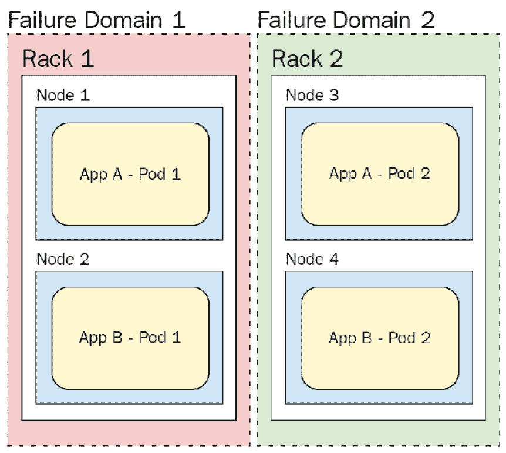

# *第八章*：Pod 放置控制

本章描述了在 Kubernetes 中控制 Pod 放置的各种方式，并解释了为何实现这些控制可能是个好主意。Pod 放置指的是控制 Pod 在 Kubernetes 中被调度到哪个节点。我们从简单的控制方式如节点选择器开始，然后介绍更复杂的工具，如污点和容忍，最后讨论两个 beta 功能——节点亲和性和 Pod 间亲和性/反亲和性。

在前几章中，我们学习了如何在 Kubernetes 上最佳运行应用 Pod——通过使用部署协调和扩展它们，通过 ConfigMaps 和 Secrets 注入配置，通过持久卷添加存储等方式。

然而，在所有这些过程中，我们始终依赖 Kubernetes 调度器将 Pod 放置在最优的节点上，但并未向调度器提供关于 Pod 的太多信息。到目前为止，我们已经为 Pod 添加了资源限制和请求（Pod 规范中的`resource.requests`和`resource.limits`）。资源请求指定 Pod 在节点上调度所需的最小可用资源量，而资源限制则指定 Pod 允许使用的最大资源量。然而，我们并未对 Pod 必须运行的节点或节点集设置任何特定要求。

对于许多应用和集群来说，这种方式是可行的。然而，正如我们在第一部分中看到的那样，在许多情况下，使用更细粒度的 Pod 放置控制是一种有效的策略。

本章将覆盖以下主题：

+   确定 Pod 放置的使用场景

+   使用节点选择器

+   实现污点和容忍

+   使用节点亲和性控制 Pod

+   使用 Pod 间亲和性和反亲和性

# 技术要求

为了运行本章详细介绍的命令，您需要一台支持`kubectl`命令行工具的计算机，并且需要一个正在运行的 Kubernetes 集群。请参阅*第一章*，*与 Kubernetes 的通信*，了解如何快速启动并运行 Kubernetes，并查看如何安装`kubectl`工具的说明。

本章中使用的代码可以在本书的 GitHub 仓库找到，链接：[`github.com/PacktPublishing/Cloud-Native-with-Kubernetes/tree/master/Chapter8`](https://github.com/PacktPublishing/Cloud-Native-with-Kubernetes/tree/master/Chapter8)。

# 确定 Pod 放置的使用场景

Pod 放置控制是 Kubernetes 提供的工具，帮助我们决定将 Pod 调度到哪个节点，或在没有所需节点时完全阻止 Pod 调度。这可以用于多种不同的模式，但我们将回顾其中一些主要模式。首先，Kubernetes 本身默认完全实现了 Pod 放置控制——我们来看看是如何做到的。

## Kubernetes 节点健康放置控制

Kubernetes 使用一些默认的放置控制来指定哪些节点在某些方面不健康。这些通常是通过污点和容忍来定义的，我们将在本章稍后详细回顾。

Kubernetes 使用的一些默认污点（我们将在下一节讨论）如下：

+   `memory-pressure`

+   `disk-pressure`

+   `unreachable`

+   `not-ready`

+   `out-of-disk`

+   `network-unavailable`

+   `unschedulable`

+   `uninitialized`（仅适用于云服务提供商创建的节点）

这些条件可以将节点标记为无法接收新的 Pod，尽管这些污点的处理方式在调度程序中有一定灵活性，正如我们稍后将看到的那样。这些系统创建的放置控制的目的是防止不健康的节点接收可能无法正常运行的工作负载。

除了系统创建的用于节点健康的放置控制之外，还有几个用例，你作为用户可能希望实现更精细的调度，正如我们将在下一节中看到的那样。

## 需要不同节点类型的应用程序

在异构 Kubernetes 集群中，每个节点的性能不尽相同。你可能有一些更强大的虚拟机（或裸金属）和一些性能较弱的虚拟机，或者有不同的专用节点集合。

例如，在运行数据科学管道的集群中，你可能有支持 GPU 加速的节点来运行深度学习算法，常规计算节点来服务应用程序，具有大量内存的节点用于基于已完成的模型进行推理等等。

通过使用 Pod 放置控制，你可以确保你的平台的各个部分运行在最适合当前任务的硬件上。

## 需要特定数据合规性的应用程序

类似于之前的例子，其中应用程序的需求可能要求不同类型的计算，某些数据合规需求可能需要特定类型的节点。

例如，云服务提供商如 AWS 和 Azure 通常允许你购买具有专用租赁的虚拟机（VM）——这意味着没有其他应用程序会在底层硬件和虚拟机监控器上运行。这与其他典型的云提供商虚拟机不同，后者可能会让多个客户共享一台物理机器。

对于某些数据法规要求，为了保持合规，必须采用这种专用租赁级别。为了满足这一需求，你可以使用 Pod 放置控制来确保相关应用程序只在具有专用租赁的节点上运行，同时通过在更典型的虚拟机上运行控制平面来降低成本。

## 多租户集群

如果你正在运行一个有多个租户的集群（例如通过命名空间分隔），你可以使用 Pod 放置控制来为某个租户保留特定的节点或节点组，以物理或其他方式将其与集群中的其他租户隔离。这类似于 AWS 或 Azure 中的专用硬件概念。

## 多个故障域

尽管 Kubernetes 已经通过允许在多个节点上调度工作负载来提供高可用性，但也可以扩展这一模式。我们可以创建自己的 Pod 调度策略，考虑到跨多个节点的故障域。处理这种情况的一种很好的方法是通过 Pod 或节点亲和性或反亲和性特性，我们将在本章后面讨论这些内容。

目前，假设我们的集群部署在裸金属环境中，每个物理机架有 20 个节点。如果每个机架都有自己的专用电源连接和备份，那么可以将其视为一个故障域。当电源连接发生故障时，机架上的所有机器都会失败。因此，我们可能希望鼓励 Kubernetes 将两个实例或 Pod 分别运行在不同的机架/故障域上。下图显示了应用程序如何跨故障域运行：



图 8.1 - 故障域

如图所示，当应用程序 Pod 分布在多个故障域而不仅仅是同一故障域的多个节点上时，即使*故障域 1*发生故障，我们仍然可以保持正常运行。*App A - Pod 1*和*App B - Pod 1*位于同一（红色）故障域。然而，如果该故障域（*Rack 1*）出现故障，我们仍然能在*Rack 2*上保持每个应用程序的副本。

我们在这里使用“鼓励”一词，因为可以将 Kubernetes 调度程序中的某些功能配置为硬性要求或尽力而为。

这些示例应该能帮助你深入理解一些潜在的高级调度控制用例。

现在让我们讨论实际的实现，逐一讨论每个调度工具集。我们将从最简单的节点选择器开始。

# 使用节点选择器和节点名称

节点选择器是 Kubernetes 中一种非常简单的调度控制方式。每个 Kubernetes 节点可以在元数据块中用一个或多个标签进行标记，Pod 可以指定节点选择器。

要标记现有节点，可以使用`kubectl label`命令：

```
> kubectl label nodes node1 cpu_speed=fast
```

在这个例子中，我们将`node1`节点标记为`cpu_speed`，值为`fast`。

现在，假设我们有一个真正需要快速 CPU 周期来有效执行的应用程序。我们可以为我们的工作负载添加一个`nodeSelector`，确保它仅在具有快速 CPU 速度标签的节点上进行调度，如下方代码片段所示：

pod-with-node-selector.yaml

```
apiVersion: v1
kind: Pod
metadata:
  name: speedy-app
spec:
  containers:
  - name: speedy-app
    image: speedy-app:latest
    imagePullPolicy: IfNotPresent
  nodeSelector:
    cpu_speed: fast
```

部署时，无论是作为部署的一部分还是单独部署，我们的`speedy-app` Pod 将仅在具有`cpu_speed`标签的节点上进行调度。

请记住，与我们稍后将介绍的其他更高级的 Pod 调度选项不同，节点选择器没有灵活性。如果没有具有所需标签的节点，应用程序将根本无法调度。

对于一个更简单（但更加脆弱）的选择器，你可以使用`nodeName`，它指定 Pod 应该被调度到哪个确切的节点。你可以像这样使用它：

pod-with-node-name.yaml

```
apiVersion: v1
kind: Pod
metadata:
  name: speedy-app
spec:
  containers:
  - name: speedy-app
    image: speedy-app:latest
    imagePullPolicy: IfNotPresent
  nodeName: node1
```

如你所见，这个选择器只允许 Pod 被调度到`node1`，所以如果它因为某种原因当前不接受 Pod，Pod 就不会被调度。

对于稍微更精细的调度控制，让我们继续讨论污点和容忍度。

# 实现污点和容忍度

Kubernetes 中的污点和容忍度类似于反向节点选择器。与节点通过拥有正确的标签吸引 Pod（这些标签被选择器消耗）不同，我们对节点施加污点，这样就会排斥所有 Pod 不被调度到该节点上，然后我们为 Pod 添加容忍度，这样它们就能被调度到这些有污点的节点上。

正如本章开头所提到的，Kubernetes 使用系统创建的污点来标记节点为不健康，并防止新的工作负载被调度到这些节点上。例如，`out-of-disk`污点会阻止任何新的 Pod 被调度到带有该污点的节点上。

让我们拿前面用节点选择器做的相同案例，使用污点和容忍度来实现。因为这基本上是我们之前设置的反向操作，所以我们首先使用`kubectl taint`命令给节点添加一个污点：

```
> kubectl taint nodes node2 cpu_speed=slow:NoSchedule
```

让我们解析一下这个命令。我们给`node2`添加了一个名为`cpu_speed`的污点，并设置了值`slow`。我们还用一个效果来标记这个污点——在这种情况下是`NoSchedule`。

一旦我们完成了示例（如果你正在跟着命令一起操作，暂时不要这么做），我们可以使用减号操作符移除`taint`：

```
> kubectl taint nodes node2 cpu_speed=slow:NoSchedule-
```

`taint`效果让我们可以对调度器如何处理污点进行更精细的控制。这里有三种可能的效果值：

+   `NoSchedule`

+   `NoExecute`

+   `PreferNoSchedule`

前两个效果，`NoSchedule`和`NoExecute`提供的是强制性效果——也就是说，像节点选择器一样，只有两种可能性，要么 Pod 上有容忍度（我们马上会看到），要么 Pod 不会被调度。`NoExecute`通过驱逐所有具有容忍度的 Pod 来扩展了这个基本功能，而`NoSchedule`则允许现有的 Pod 留在原地，但防止任何没有容忍度的新 Pod 加入。

另一方面，`PreferNoSchedule`给 Kubernetes 调度器提供了一些灵活性。它告诉调度器尽量为 Pod 找到没有未容忍污点的节点，但如果没有找到这样的节点，就继续调度 Pod。它实现了一个软效果。

在我们的案例中，我们选择了`NoSchedule`，所以不会有新的 Pod 被分配到该节点——除非，当然，我们提供一个容忍度。现在我们来做这个假设。假设我们有一个第二个应用，它不在乎 CPU 时钟速度。它很高兴能在我们的慢节点上运行。以下是 Pod 清单：

pod-without-speed-requirement.yaml

```
apiVersion: v1
kind: Pod
metadata:
  name: slow-app
spec:
  containers:
  - name: slow-app
    image: slow-app:latest
```

目前，我们的 `slow-app` Pod 不会在任何有污点的节点上运行。为了让这个 Pod 能够在有污点的节点上被调度，我们需要为这个 Pod 提供一个容忍——我们可以这样做：

pod-with-toleration.yaml

```
apiVersion: v1
kind: Pod
metadata:
  name: slow-app
spec:
  containers:
  - name: slow-app
    image: slow-app:latest
tolerations:
- key: "cpu_speed"
  operator: "Equal"
  value: "slow"
  effect: "NoSchedule"
```

让我们来分析一下 `tolerations` 条目，它是一个值的数组。每个值都有一个 `key`——即与污点名称相同的内容。接着是一个 `operator` 值。这个 `operator` 可以是 `Equal` 或 `Exists`。对于 `Equal`，你可以像前面的代码中一样使用 `value` 键来配置污点必须等于的值，从而使 Pod 能容忍该污点。对于 `Exists`，污点名称必须出现在节点上，但值不重要，正如在这个 Pod 规范中所示：

pod-with-toleration2.yaml

```
apiVersion: v1
kind: Pod
metadata:
  name: slow-app
spec:
  containers:
  - name: slow-app
    image: slow-app:latest
tolerations:
- key: "cpu_speed"
  operator: "Exists"
  effect: "NoSchedule"
```

正如你所看到的，我们使用了 `Exists` `operator` 值，允许我们的 Pod 容忍任何 `cpu_speed` 污点。

最后，我们有我们的 `effect`，它与污点本身的 `effect` 起作用的方式相同。它可以包含与污点效果相同的值——`NoSchedule`、`NoExecute` 和 `PreferNoSchedule`。

拥有 `NoExecute` 容忍的 Pod 将无限期容忍与该污点相关联的污点。然而，你可以添加一个名为 `tolerationSeconds` 的字段，让 Pod 在指定的时间过去后离开污点节点。这使得你可以指定在一段时间后生效的容忍。让我们来看一个例子：

pod-with-toleration3.yaml

```
apiVersion: v1
kind: Pod
metadata:
  name: slow-app
spec:
  containers:
  - name: slow-app
    image: slow-app:latest
tolerations:
- key: "cpu_speed"
  operator: "Equal"
  Value: "slow"
  effect: "NoExecute"
  tolerationSeconds: 60
```

在这种情况下，已经在一个带有 `slow` 污点的节点上运行的 Pod，当污点和容忍被执行时，将在该节点上停留 `60` 秒，然后才会被重新调度到另一个节点。

## 多个污点和容忍

当 Pod 和节点上有多个污点或容忍时，调度器会检查它们所有的污点。这里没有`OR`逻辑运算符——如果节点上的任何一个污点没有在 Pod 上找到匹配的容忍，该 Pod 就不会被调度到该节点（`PreferNoSchedule`除外，在这种情况下，调度器会尽量避免将 Pod 调度到该节点）。即使节点上有六个污点，Pod 容忍其中五个，它仍然不会因为 `NoSchedule` 污点而被调度，并且它仍会因为 `NoExecute` 污点而被驱逐。

对于一个提供更细粒度控制的工具，让我们来看看节点亲和性。

# 使用节点亲和性控制 Pod

正如你可能已经猜到的，污点和容忍——虽然比节点选择器更灵活——仍然无法解决某些用例，并且通常只允许一种*过滤*模式，你可以使用 `Exists` 或 `Equals` 匹配特定的污点。在更高级的用例中，你可能需要更灵活的节点选择方法——而 *亲和性* 是 Kubernetes 中用来解决这个问题的一个特性。

节点亲和性有两种类型：

+   **节点亲和性**

+   **Pod 之间的亲和性**

节点亲和性是与节点选择器类似的概念，只不过它允许更强大的选择特性集合。让我们看一下示例 YAML，并逐一解析其中的各个部分：

pod-with-node-affinity.yaml

```
apiVersion: v1
kind: Pod
metadata:
  name: affinity-test
spec:
  affinity:
    nodeAffinity:
      requiredDuringSchedulingIgnoredDuringExecution:
        nodeSelectorTerms:
        - matchExpressions:
          - key: cpu_speed
            operator: In
            values:
            - fast
            - medium_fast
  containers:
  - name: speedy-app
    image: speedy-app:latest
```

如你所见，我们的`Pod` `spec`中有一个`affinity`键，并且我们指定了一个`nodeAffinity`设置。节点亲和性有两种可能的类型：

+   `requiredDuringSchedulingIgnoredDuringExecution`

+   `preferredDuringSchedulingIgnoredDuringExecution`

这两种类型的功能分别与`NoSchedule`和`PreferNoSchedule`的工作原理直接对应。

## 使用`requiredDuringSchedulingIgnoredDuringExecution`节点亲和性

对于`requiredDuringSchedulingIgnoredDuringExecution`，Kubernetes 将永远不会调度没有与节点匹配的条款的 Pod。

对于`preferredDuringSchedulingIgnoredDuringExecution`，它会尽量满足软要求，但如果无法满足，它仍然会调度 Pod。

节点亲和性相较于节点选择器和污点容忍的真正优势在于选择器中你可以实现的实际表达式和逻辑。

`requiredDuringSchedulingIgnoredDuringExecution`和`preferredDuringSchedulingIgnoredDuringExecution`的功能差异较大，因此我们将分别进行回顾。

对于我们的`required`亲和性，我们可以指定`nodeSelectorTerms`——它可以是一个或多个包含`matchExpressions`的块。对于每个`matchExpressions`块，可以有多个表达式。

在我们在前一部分看到的代码块中，我们只有一个单一的节点选择器术语，一个`matchExpressions`块——它本身只有一个表达式。这个表达式查找`key`，它就像节点选择器一样，代表一个节点标签。接下来，它有一个`operator`，它为我们提供了一些灵活性，允许我们选择如何识别匹配。以下是运算符的可选值：

+   `In`

+   `NotIn`

+   `Exists`

+   `DoesNotExist`

+   `Gt`（注：大于）

+   `Lt`（注：小于）

在我们的例子中，我们使用的是`In`运算符，它将检查指定的值是否为多个选项之一。最后，在我们的`values`部分，我们可以列出一个或多个必须匹配的值，依据运算符的不同，表达式才会成立。

如你所见，这使我们在指定选择器时具有更大的粒度。让我们看看使用不同运算符的`cpu_speed`示例：

pod-with-node-affinity2.yaml

```
apiVersion: v1
kind: Pod
metadata:
  name: affinity-test
spec:
  affinity:
    nodeAffinity:
      requiredDuringSchedulingIgnoredDuringExecution:
        nodeSelectorTerms:
        - matchExpressions:
          - key: cpu_speed
            operator: Gt
            values:
            - "5"
  containers:
  - name: speedy-app
    image: speedy-app:latest
```

如你所见，我们使用了一个非常细粒度的`matchExpressions`选择器。现在，利用更高级的运算符匹配，我们可以确保我们的`speedy-app`仅在具有足够时钟速度（在此案例中为 5 GHz）的节点上调度。我们不再将节点分为像`slow`和`fast`这样的广泛组别，而是可以在规格中更加细致。

接下来，我们来看另一个节点亲和性类型——`preferredDuringSchedulingIgnoredDuringExecution`。

## 使用`preferredDuringSchedulingIgnoredDuringExecution`节点亲和性

这种语法稍有不同，并为我们提供了更多的细粒度来影响这个`软`要求。让我们来看一个实现这一点的 Pod 规格 YAML 文件：

pod-with-node-affinity3.yaml

```
apiVersion: v1
kind: Pod
metadata:
  name: slow-app-affinity
spec:
  affinity:
    nodeAffinity:
      preferredDuringSchedulingIgnoredDuringExecution:
      - weight: 1
        preference:
          matchExpressions:
          - key: cpu_speed
            operator: Lt
            values:
            - "3"
  containers:
  - name: slow-app
    image: slow-app:latest
```

这与我们的`required`语法有些不同。

对于`preferredDuringSchedulingIgnoredDuringExecution`，我们可以为每个条目分配一个`weight`值，并指定一个相关的偏好，这可以再次是一个`matchExpressions`块，里面包含多个使用相同`key-operator-values`语法的表达式。

`weight`值是这里的关键区别。由于`preferredDuringSchedulingIgnoredDuringExecution`是一个`speedy-app`的使用案例：

pod-with-node-affinity4.yaml

```
apiVersion: v1
kind: Pod
metadata:
  name: speedy-app-prefers-affinity
spec:
  affinity:
    nodeAffinity:
      preferredDuringSchedulingIgnoredDuringExecution:
      - weight: 90
        preference:
          matchExpressions:
          - key: cpu_speed
            operator: Gt
            values:
            - "3"
      - weight: 10
        preference:
          matchExpressions:
          - key: memory_speed
            operator: Gt
            values:
            - "4"
  containers:
  - name: speedy-app
    image: speedy-app:latest
```

在我们确保`speedy-app`运行在最佳节点上的过程中，我们决定仅实现`软`要求。如果没有快速节点存在，我们仍然希望我们的应用能够被调度并运行。为此，我们指定了两个偏好——一个`cpu_speed`超过 3（3 GHz）的节点和一个内存速度超过 4（4 GHz）的节点。

由于我们的应用更多是受 CPU 限制而非内存限制，我们决定适当加权我们的偏好。在这种情况下，`cpu_speed`的`weight`为`90`，而`memory_speed`的`weight`为`10`。

因此，任何满足我们`cpu_speed`要求的节点，其计算得分将远高于仅满足`memory_speed`要求的节点——但仍然低于同时满足两者的节点。当我们尝试为这个应用调度 10 个或 100 个新的 Pod 时，你可以看到这个计算有多么重要。

## 多个节点亲和性

当我们处理多个节点亲和性时，有几个关键的逻辑需要记住。首先，即使只有一个节点亲和性，如果它与同一 Pod 规格上的节点选择器结合使用（这确实是可能的），节点选择器必须在任何节点亲和性逻辑发挥作用之前被满足。这是因为节点选择器只实现硬性要求，且两者之间没有`OR`逻辑运算符。`OR`逻辑运算符会检查两个要求，并确保至少有一个满足——但节点选择器不允许我们这样做。

其次，对于`requiredDuringSchedulingIgnoredDuringExecution`节点亲和性，`nodeSelectorTerms`下的多个条目是通过`OR`逻辑运算符处理的。如果其中一个条目被满足，但不是全部，Pod 仍然会被调度。

最后，对于任何具有多个条目在`matchExpressions`下的`nodeSelectorTerm`，所有条目必须被满足——这是一个`AND`逻辑运算符。让我们来看一个示例的 YAML 文件：

pod-with-node-affinity5.yaml

```
apiVersion: v1
kind: Pod
metadata:
  name: affinity-test
spec:
  affinity:
    nodeAffinity:
      requiredDuringSchedulingIgnoredDuringExecution:
        nodeSelectorTerms:
        - matchExpressions:
          - key: cpu_speed
            operator: Gt
            values:
            - "5"
          - key: memory_speed
            operator: Gt
            values:
            - "4"
  containers:
  - name: speedy-app
    image: speedy-app:latest
```

在这种情况下，如果一个节点的 CPU 速度为`5`，但未满足内存速度要求（或反之亦然），该 Pod 将不会被调度。

关于节点亲和性还有一点需要注意的事情是，正如你可能已经注意到的那样，两个亲和性类型都没有提供与我们的污点和容忍设置中相同的 `NoExecute` 功能。

一个额外的节点亲和性类型 – `requiredDuringSchedulingRequiredDuringExecution` – 将在未来版本中添加此功能。到 Kubernetes 1.19 为止，这个功能尚不存在。

接下来，我们将查看 Pod 之间的亲和性和反亲和性，它们定义了 Pods 之间的亲和性规则，而不是节点的规则。

# 使用 Pod 之间的亲和性和反亲和性

Pod 之间的亲和性和反亲和性允许你根据节点上已经存在的其他 Pods 来决定 Pods 应该如何运行。由于集群中的 Pods 数量通常远大于节点数量，而且一些 Pod 亲和性和反亲和性规则可能相对复杂，因此如果你在许多节点上运行大量 Pods，这项功能可能会对你的集群控制平面造成很大负担。因此，Kubernetes 文档不建议在集群中有大量节点时使用这些功能。

Pod 亲和性和反亲和性工作方式完全不同——让我们先分别看看它们，然后再讨论如何将它们结合使用。

## Pod 亲和性

与节点亲和性一样，我们深入查看 YAML 文件，以讨论 Pod 亲和性规范的组成部分：

pod-with-pod-affinity.yaml

```
apiVersion: v1
kind: Pod
metadata:
  name: not-hungry-app-affinity
spec:
  affinity:
    podAffinity:
      requiredDuringSchedulingIgnoredDuringExecution:
      - labelSelector:
          matchExpressions:
          - key: hunger
            operator: In
            values:
            - "1"
            - "2"
        topologyKey: rack
  containers:
  - name: not-hungry-app
    image: not-hungry-app:latest
```

就像节点亲和性一样，Pod 亲和性让我们可以选择两种类型：

+   `preferredDuringSchedulingIgnoredDuringExecution`

+   `requiredDuringSchedulingIgnoredDuringExecution`

同样，类似于节点亲和性，我们可以有一个或多个选择器——它们被称为 `labelSelector`，因为我们选择的是 Pods 而不是节点。`matchExpressions` 功能与节点亲和性相同，但 Pod 亲和性新增了一个名为 `topologyKey` 的全新键。

`topologyKey` 本质上是一个选择器，它限制了调度器查看是否有相同选择器的其他 Pods 正在运行的范围。这意味着 Pod 亲和性不仅仅意味着同一节点上具有相同类型（选择器）的其他 Pods；它还可以意味着多个节点的组合。

让我们回到本章开始时的故障域示例。在那个示例中，每个机架都是一个故障域，每个机架上有多个节点。为了将这个概念扩展到 `topologyKey`，我们可以给每个机架上的节点贴上 `rack=1` 或 `rack=2` 标签。然后我们可以像在 YAML 中那样使用 `topologyKey` 机架，指定调度器应该检查所有运行在具有相同 `topologyKey` 的节点上的 Pods（在这个例子中，意味着在同一机架上的 `Node 1` 和 `Node 2` 上的所有 Pods），以便应用 Pod 亲和性或反亲和性规则。

因此，总结一下，我们的示例 YAML 文件告诉调度器的是：

+   这个 Pod *必须* 被调度到带有标签 `rack` 的节点上，其中标签 `rack` 的值将节点分成不同的组。

+   然后，Pod 会被调度到一个已经存在带有`hunger`标签且值为 1 或 2 的 Pod 的组中。

本质上，我们将集群划分为拓扑域——在这种情况下是机架——并规定调度器仅将相似的 Pod 调度到共享相同拓扑域的节点上。这与我们的第一个失败域示例相反，在那个例子中，我们不希望 Pod 尽可能共享相同的域——但是也有一些理由你可能希望将相似的 Pod 保持在同一个域内。例如，在多租户环境中，租户希望在一个域内拥有专用硬件租用权时，你可以确保属于某个租户的每个 Pod 都被调度到同一个拓扑域上。

你可以以相同的方式使用`preferredDuringSchedulingIgnoredDuringExecution`。在我们讨论反亲和性之前，先看一个使用 Pod 亲和性和`preferred`类型的示例：

pod-with-pod-affinity2.yaml

```
apiVersion: v1
kind: Pod
metadata:
  name: not-hungry-app-affinity
spec:
  affinity:
    podAffinity:
      preferredDuringSchedulingIgnoredDuringExecution:
      - weight: 50
        podAffinityTerm:
          labelSelector:
            matchExpressions:
            - key: hunger
              operator: Lt
              values:
              - "3"
          topologyKey: rack
  containers:
  - name: not-hungry-app
    image: not-hungry-app:latest
```

与之前一样，在这段代码中，我们有我们的`weight`——在这种情况下是`50`——以及我们的表达式匹配——在这种情况下，使用小于（`Lt`）运算符。这个亲和性会促使调度器尽可能将 Pod 调度到一个节点上，或者与另一个在同一机架上运行且`hunger`小于 3 的 Pod 共享同一节点。`weight`由调度器用来比较节点——如在关于节点亲和性的章节中所讨论的——*使用节点亲和性控制 Pod*（参见`pod-with-node-affinity4.yaml`）。在这个特定场景中，`50`的权重没有任何区别，因为亲和性列表中只有一个条目。

Pod 反亲和性通过使用相同的选择器和拓扑结构扩展了这一范式——让我们详细看看它们。

## Pod 反亲和性

Pod 反亲和性允许你防止 Pod 与匹配选择器的 Pod 在同一拓扑域上运行。它们实现了与 Pod 亲和性相反的逻辑。让我们深入看看一些 YAML 代码并解释它是如何工作的：

pod-with-pod-anti-affinity.yaml

```
apiVersion: v1
kind: Pod
metadata:
  name: hungry-app
spec:
  affinity:
    podAntiAffinity:
      preferredDuringSchedulingIgnoredDuringExecution:
      - weight: 100
        podAffinityTerm:
          labelSelector:
            matchExpressions:
            - key: hunger
              operator: In
              values:
              - "4"
              - "5"
          topologyKey: rack
  containers:
  - name: hungry-app
    image: hungry-app
```

与 Pod 亲和性类似，我们使用`affinity`键作为指定反亲和性的地方，在`podAntiAffinity`下。与 Pod 亲和性一样，我们可以使用`preferredDuringSchedulingIgnoredDuringExecution`或`requireDuringSchedulingIgnoredDuringExecution`。我们甚至使用与 Pod 亲和性相同的语法来选择选择器。

唯一的实际语法差异是在`affinity`键下使用`podAntiAffinity`。

那么，这个 YAML 文件是做什么的呢？在这种情况下，我们正在向调度器推荐（一个`软`需求），它应该尝试将 Pod 调度到一个节点，在该节点或任何其他具有相同`rack`标签值的节点上，不运行带有`hunger`标签值为 4 或 5 的 Pod。我们在告诉调度器，*尽量不要将这个 Pod 和任何更多饥饿的 Pod 放在同一个区域*。

该功能为我们提供了一种通过故障域来分离 Pod 的绝佳方式——我们可以将每个机架指定为一个域，并为其指定具有自身选择器的反亲和性。这样，调度器将在一个优选的亲和性下，尽力将 Pod 的克隆调度到不同的故障域节点上，从而在发生故障域故障时提高应用的可用性。

我们甚至可以将 Pod 的亲和性与反亲和性结合使用。让我们看看这将如何运作。

## 结合亲和性和反亲和性

这正是一个可能给你的集群控制平面带来不必要负担的情况。将 Pod 的亲和性与反亲和性结合使用，可以允许非常复杂的规则传递给 Kubernetes 调度器，而调度器则肩负着实现这些规则的艰巨任务。

让我们看看结合这两个概念的 Deployment 规格的 YAML。请记住，亲和性和反亲和性是应用于 Pod 的概念——但通常我们不会指定没有控制器的 Pod，如 Deployment 或 ReplicaSet。因此，这些规则是在 Deployment YAML 的 Pod 规格级别应用的。为了简洁起见，我们仅展示 Deployment 的 Pod 规格部分，但你可以在 GitHub 仓库中找到完整的文件：

pod-with-both-antiaffinity-and-affinity.yaml

```
apiVersion: apps/v1
kind: Deployment
metadata:
  name: hungry-app-deployment
# SECTION REMOVED FOR CONCISENESS  
     spec:
      affinity:
        podAntiAffinity:
          preferredDuringSchedulingIgnoredDuringExecution:
          - labelSelector:
              matchExpressions:
              - key: app
                operator: In
                values:
                - other-hungry-app
            topologyKey: "rack"
        podAffinity:
          requiredDuringSchedulingIgnoredDuringExecution:
          - labelSelector:
              matchExpressions:
              - key: app
                operator: In
                values:
                - hungry-app-cache
            topologyKey: "rack"
      containers:
      - name: hungry-app
        image: hungry-app:latest
```

在这段代码中，我们告诉调度器将 Deployment 中的 Pod 视作：Pod 必须被调度到一个带有`rack`标签的节点上，该节点或任何其他带有相同`rack`标签值的节点上，必须有一个带有`app=hungry-label-cache`标签的 Pod。

其次，调度器必须尝试将 Pod 调度到一个带有`rack`标签的节点上，前提是该节点或任何其他带有相同`rack`标签值的节点上，没有运行带有`app=other-hungry-app`标签的 Pod。

简而言之，我们希望`hungry-app`的 Pod 与`hungry-app-cache`的 Pod 在同一拓扑中运行，并且如果可能的话，我们不希望它们与`other-hungry-app`的 Pod 处于同一拓扑。

由于巨大的能力带来了巨大的责任，而我们在 Pod 亲和性和反亲和性工具方面的能力强大且可能会降低性能，Kubernetes 确保对它们的使用设置了一些限制，以防止奇怪的行为或显著的性能问题。

## Pod 的亲和性和反亲和性限制

亲和性和反亲和性的最大限制是你不能使用空的`topologyKey`。如果不限制调度器将什么视为单一拓扑类型，可能会发生一些意想不到的行为。

第二个限制是，默认情况下，如果你使用的是反亲和性的硬性版本——`requiredOnSchedulingIgnoredDuringExecution`，你不能仅使用任何标签作为`topologyKey`。

Kubernetes 只允许使用 `kubernetes.io/hostname` 标签，这意味着如果你使用 `required` 反亲和性时，每个节点上只能有一个拓扑结构。对于 `prefer` 反亲和性或任何亲和性（即使是 `required` 的）而言，并没有这样的限制。虽然可以更改这一功能，但这需要编写自定义准入控制器——我们将在*第十二章*《Kubernetes 安全性与合规性》和*第十三章*《使用 CRD 扩展 Kubernetes》中讨论这一内容。

到目前为止，我们对放置控制的讨论并没有涉及命名空间。然而，对于 Pod 的亲和性和反亲和性，命名空间确实是相关的。

## Pod 亲和性和反亲和性命名空间

由于 Pod 的亲和性和反亲和性会根据其他 Pod 的位置导致行为变化，因此命名空间在决定哪些 Pods 适用于亲和性或反亲和性时是一个相关的因素。

默认情况下，调度器只会查看创建带有亲和性或反亲和性 Pod 的命名空间。在我们之前的所有示例中，我们并没有指定命名空间，因此将使用默认命名空间。

如果你想添加一个或多个命名空间，以便 Pods 会影响亲和性或反亲和性，你可以使用以下 YAML 配置：

pod-with-anti-affinity-namespace.yaml

```
apiVersion: v1
kind: Pod
metadata:
  name: hungry-app
spec:
  affinity:
    podAntiAffinity:
      preferredDuringSchedulingIgnoredDuringExecution:
      - weight: 100
        podAffinityTerm:
          labelSelector:
            matchExpressions:
            - key: hunger
              operator: In
              values:
              - "4"
              - "5"
          topologyKey: rack
          namespaces: ["frontend", "backend", "logging"]
  containers:
  - name: hungry-app
    image: hungry-app
```

在这个代码块中，调度器在尝试匹配反亲和性时，会查看前端、后端和日志命名空间（如 `podAffinityTerm` 块中的 `namespaces` 键所示）。这允许我们在验证规则时，限制调度器操作的命名空间。

# 总结

在本章中，我们了解了 Kubernetes 提供的几种不同的控制方式，以通过调度器强制执行某些 Pod 放置规则。我们了解到，有“硬性”要求和“软性”规则，后者会尽力调度 Pods，但不一定会阻止违反规则的 Pods 被放置。我们还了解了你可能希望实现调度控制的一些原因，比如现实中的故障域和多租户。

我们了解到，有一些简单的方法可以影响 Pod 的放置，比如节点选择器和节点名称——此外，还有更高级的方法，如污点和容忍度，Kubernetes 本身也默认使用这些方法。最后，我们发现 Kubernetes 提供了一些高级工具，用于节点和 Pod 的亲和性和反亲和性，这使我们能够为调度器创建复杂的规则集。

在下一章中，我们将讨论 Kubernetes 的可观察性。我们将学习如何查看应用程序日志，并使用一些优秀的工具实时查看集群中发生的事情。

# 问题

1.  节点选择器和节点名称字段的区别是什么？

1.  Kubernetes 如何使用系统提供的污点（taints）和容忍（tolerations）？出于什么原因？

1.  在使用多种类型的 Pod 亲和性或反亲和性时，为什么需要小心？

1.  如何在为三层 Web 应用程序跨多个失败区域平衡可用性与性能优化的情况下使用节点或 Pod 亲和性和反亲和性？可以举例说明。

# 进一步阅读

+   欲了解更详细的默认系统污点和容忍解释，请访问 [`kubernetes.io/docs/concepts/scheduling-eviction/taint-and-toleration/#taint-based-evictions`](https://kubernetes.io/docs/concepts/scheduling-eviction/taint-and-toleration/#taint-based-evictions)。
