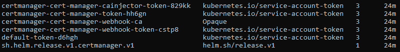
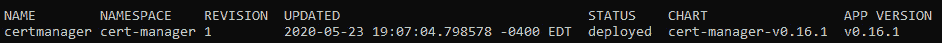

# *第十一章*：Kubernetes 上的模板代码生成与 CI/CD

本章讨论了几种更简单的方式来模板化和配置具有大量资源的 Kubernetes 部署。同时，详细介绍了在 Kubernetes 上实现 **持续集成**/**持续部署** (**CI**/**CD**) 的多种方法，并探讨了每种方法的优缺点。具体来说，我们讨论了集群内 CI/CD，其中一些或所有的 CI/CD 步骤在 Kubernetes 集群中执行；以及集群外 CI/CD，其中所有步骤都在集群外部完成。

本章的案例研究将包括从头开始创建 Helm chart，并解释 Helm chart 中的每个部分及其工作原理。

首先，我们将介绍 Kubernetes 资源模板生成的概况，以及为什么应该使用模板生成工具。接下来，我们将介绍如何将 CI/CD 实现到 Kubernetes 中，首先使用 AWS CodeBuild，然后使用 FluxCD。

在本章中，我们将覆盖以下主题：

+   理解 Kubernetes 上模板代码生成的选项

+   使用 Helm 和 Kustomize 在 Kubernetes 上实现模板

+   理解 Kubernetes 上的 CI/CD 模式——集群内和集群外

+   在 Kubernetes 上实现集群内和集群外的 CI/CD

# 技术要求

为了运行本章详细介绍的命令，你需要一台支持 `kubectl` 命令行工具的计算机，并且有一个正常工作的 Kubernetes 集群。请参考 *第一章*，*与 Kubernetes 通信*，了解如何快速启动 Kubernetes 的几种方法，并获取如何安装 kubectl 工具的说明。此外，你还需要一台支持 Helm CLI 工具的计算机，它通常与 kubectl 有相同的前提条件——详情请查看 Helm 文档：[`helm.sh/docs/intro/install/`](https://helm.sh/docs/intro/install/)。

本章中使用的代码可以在本书的 GitHub 仓库中找到：

[`github.com/PacktPublishing/Cloud-Native-with-Kubernetes/tree/master/Chapter11`](https://github.com/PacktPublishing/Cloud-Native-with-Kubernetes/tree/master/Chapter11)。

# 理解 Kubernetes 上模板代码生成的选项

正如 *第一章* 中所讨论的，*与 Kubernetes 通信*，Kubernetes 的最大优势之一是它的 API 可以通过声明式资源文件进行通信。这使得我们可以运行像 `kubectl apply` 这样的命令，并确保控制平面确保集群中运行的资源与我们的 YAML 或 JSON 文件匹配。

然而，这种功能引入了一些笨重性。因为我们希望所有的工作负载都在配置文件中声明，任何大型或复杂的应用程序，特别是包含多个微服务的应用，可能会导致需要编写和维护大量的配置文件。

这个问题在多环境下更加复杂。假设我们有开发、预发布、UAT 和生产环境，这将需要为每个 Kubernetes 资源创建四个独立的 YAML 文件，假设我们希望保持每个资源一个文件以便清晰。

解决这些问题的一种方法是使用支持变量的模板化系统，允许通过注入不同的变量集，使单个模板文件适用于多个应用程序或多个环境。

目前有几个受社区支持的流行开源选项可供选择。在本书中，我们将重点介绍两个最流行的工具：

+   Helm

+   Kustomize

还有许多其他可用的选项，包括 Kapitan、Ksonnet、Jsonnet 等，但对这些选项的全面评审超出了本书的范围。我们先来回顾 Helm，它在许多方面是最受欢迎的模板化工具。

## Helm

实际上，Helm 充当了模板化/代码生成工具和 CI/CD 工具的双重角色。它允许你创建基于 YAML 的模板，这些模板可以通过变量填充，从而在应用程序和环境之间实现代码和模板的重用。它还配有 Helm CLI 工具，根据模板本身推出应用程序的更改。

因此，你很可能会在 Kubernetes 生态系统中到处看到 Helm，作为安装工具或应用程序的默认方式。在本章中，我们将使用 Helm 的两种用途。

现在，我们来看看 Kustomize，它与 Helm 有很大的不同。

## Kustomize

与 Helm 不同，Kustomize 是 Kubernetes 项目官方支持的，支持直接集成到 `kubectl` 中。与 Helm 不同，Kustomize 使用原生 YAML 文件而不支持变量，而是推荐一种 *分支和修补* 工作流，根据选择的修补程序用新的 YAML 替换 YAML 的某些部分。

现在我们对这些工具的区别有了基本的了解，我们可以在实践中使用它们。

# 在 Kubernetes 上使用 Helm 和 Kustomize 实现模板化

既然我们了解了选项，现在可以通过一个示例应用程序来实现每个选项。这将帮助我们理解每个工具如何处理变量以及模板化的过程。我们从 Helm 开始。

## 使用 Helm 与 Kubernetes

如前所述，Helm 是一个开源项目，它使得在 Kubernetes 上进行应用程序模板化和部署变得简单。为了本书的目的，我们将专注于最新版本（截至写作时），即 Helm V3。之前的版本 Helm V2 有更多的组成部分，包括一个名为 *Tiller* 的控制器，它会在集群上运行。Helm V3 被简化，仅包含 Helm CLI 工具。然而，它确实使用集群中的自定义资源定义来跟踪发布，稍后我们将看到。

我们从安装 Helm 开始。

### 安装 Helm

如果您想使用 Helm 的特定版本，可以按照 [`helm.sh/docs/intro/install/`](https://helm.sh/docs/intro/install/) 上的特定版本文档进行安装。对于我们的用例，我们将仅使用 `get helm` 脚本，它将安装最新版本。

您可以按如下方式获取并运行脚本：

```
curl -fsSL -o get_helm.sh https://raw.githubusercontent.com/helm/helm/master/scripts/get-helm-3
chmod 700 get_helm.sh
./get_helm.sh
```

现在，我们应该能够运行 `helm` 命令。默认情况下，Helm 将自动使用您现有的 `kubeconfig` 集群和上下文，因此，为了为 Helm 切换集群，您只需使用 `kubectl` 更改 `kubeconfig` 文件，像平时一样操作即可。

要使用 Helm 安装应用程序，请运行 `helm install` 命令。但是，Helm 是如何决定安装什么以及如何安装的呢？我们需要讨论 Helm 图表、Helm 仓库和 Helm 发布的概念。

### Helm 图表、仓库和发布

Helm 提供了一种通过变量模板和部署 Kubernetes 上的应用程序的方法。为此，我们通过一组模板来指定工作负载，这被称为 *Helm 图表*。

一个 Helm 图表由一个或多个模板、一些图表元数据以及一个 `values` 文件组成，该文件将模板变量填充为最终值。实际上，您将为每个环境（或者应用程序，如果您将模板用于多个应用程序）准备一个 `values` 文件，该文件将为共享模板提供新的配置。模板和值的组合将用于将应用程序安装或部署到您的集群中。

那么，Helm 图表可以存储在哪里呢？您可以像处理任何其他 Kubernetes YAML 文件一样将它们放在 Git 仓库中（这种方式适用于大多数用例），但 Helm 还支持仓库的概念。Helm 仓库通过 URL 表示，可以包含多个 Helm 图表。例如，Helm 有自己的官方仓库，网址是 [`hub.helm.sh/charts`](https://hub.helm.sh/charts)。同样，每个 Helm 图表由一个包含元数据文件、`Chart.yaml` 文件、一个或多个模板文件，并可选地包含一个值文件的文件夹组成。

为了安装带有本地值文件的本地 Helm 图表，您可以将每个路径传递给 `helm install`，如下命令所示：

```
helm install -f values.yaml /path/to/chart/root
```

然而，对于常见的安装图表，您也可以直接从图表仓库安装图表，您还可以选择将自定义仓库添加到本地 Helm，以便能够轻松地从非官方源安装图表。

例如，要通过官方 Helm 图表安装 Drupal，您可以运行以下命令：

```
helm install -f values.yaml stable/drupal
```

这段代码从官方 Helm 图表仓库安装图表。要使用自定义仓库，您只需先将其添加到 Helm 中。例如，要安装托管在 `jetstack` Helm 仓库中的 `cert-manager`，我们可以执行以下操作：

```
helm repo add jetstack https://charts.jetstack.io
helm install certmanager --namespace cert-manager jetstack/cert-manager
```

这段代码将 `jetstack` Helm 仓库添加到你的本地 Helm CLI 工具中，然后通过托管在该仓库中的图表安装 `cert-manager`。我们还将发布命名为 `cert-manager`。在 Helm V3 中，发布是通过 Kubernetes 秘密来实现的。当我们在 Helm 中创建发布时，它会作为秘密存储在相同的命名空间中。

为了说明这一点，我们可以使用前面的 `install` 命令创建一个 Helm 发布。我们现在来执行：

```
helm install certmanager --namespace cert-manager jetstack/cert-manager
```

该命令应该会产生以下输出，具体输出可能会根据当前的 Cert Manager 版本略有不同。为了易于阅读，我们将把输出分成两个部分。

首先，命令的输出给出了 Helm 发布的状态：

```
NAME: certmanager
LAST DEPLOYED: Sun May 23 19:07:04 2020
NAMESPACE: cert-manager
STATUS: deployed
REVISION: 1
TEST SUITE: None
```

如你所见，这一部分包含了部署的时间戳、命名空间信息、版本号和状态。接下来，我们将看到输出中的注释部分：

```
NOTES:
cert-manager has been deployed successfully!
In order to begin issuing certificates, you will need to set up a ClusterIssuer
or Issuer resource (for example, by creating a 'letsencrypt-staging' issuer).
More information on the different types of issuers and how to configure them
can be found in our documentation:
https://cert-manager.io/docs/configuration/
For information on how to configure cert-manager to automatically provision
Certificates for Ingress resources, take a look at the `ingress-shim`
documentation:
https://cert-manager.io/docs/usage/ingress/
```

如你所见，我们的 Helm `install` 命令已成功执行，并给出了来自 `cert-manager` 的一些使用信息。在安装 Helm 包时，这些输出可能非常有用，因为它们有时会包括文档，如之前的代码片段。现在，为了查看我们的发布对象在 Kubernetes 中的样子，我们可以运行以下命令：

```
Kubectl get secret -n cert-manager
```

这将产生以下输出：



图 11.1 – 来自 kubectl 的秘密列表输出

如你所见，其中一个秘密的类型为 `helm.sh/release.v1`。这是 Helm 用来跟踪 Cert Manager 发布的秘密。

最后，要查看 Helm CLI 中列出的发布，我们可以运行以下命令：

```
helm ls -A
```

该命令将列出所有命名空间中的 Helm 发布（就像 `kubectl get pods -A` 会列出所有命名空间中的 Pod 一样）。输出将如下所示：



图 11.2 – Helm 发布列表输出

现在，Helm 具有更多的组成部分，包括 `升级`、`回滚` 等，我们将在下一部分进行回顾。为了展示 Helm 的功能，我们将从零开始创建并安装一个图表。

### 创建 Helm 图表

所以，我们想为我们的应用程序创建一个 Helm 图表。让我们先设定一下场景。我们的目标是将一个简单的 Node.js 应用程序轻松部署到多个环境中。为此，我们将创建一个包含应用程序组件的图表，并将其与三个独立的值文件（`dev`、`staging` 和 `production`）结合，目的是将应用程序部署到这三个环境中。

让我们从 Helm 图表的文件夹结构开始。正如我们之前提到的，Helm 图表由模板、元数据文件和可选的值组成。我们将在实际安装图表时注入这些值，但我们可以按照以下方式组织我们的文件夹：

```
Chart.yaml
charts/
templates/
dev-values.yaml
staging-values.yaml
production-values.yaml
```

我们尚未提到的一点是，你实际上可以在现有 chart 中拥有一个 Helm charts 文件夹！这些子 chart 可以方便地将复杂的应用拆分成多个组件。出于本书的目的，我们将不会使用子 chart，但如果你的应用变得过于复杂或模块化，不适合使用单一 chart，那么这是一个非常有用的功能。

此外，你可以看到我们为每个环境都提供了不同的环境文件，这些文件将在我们安装命令时使用。

那么，`Chart.yaml` 文件是什么样子的呢？这个文件将包含一些关于你的 chart 的基本元数据，通常至少包含如下内容：

```
apiVersion: v2
name: mynodeapp
version: 1.0.0
```

`Chart.yaml` 文件支持许多可选字段，你可以在 [`helm.sh/docs/topics/charts/`](https://helm.sh/docs/topics/charts/) 查看，但为了本教程的目的，我们将保持简单。必须字段包括 `apiVersion`、`name` 和 `version`。

在我们的 `Chart.yaml` 文件中，`apiVersion` 对应于该 chart 所对应的 Helm 版本。有点让人困惑的是，当前版本的 Helm，即 Helm V3，使用 `apiVersion` `v2`，而旧版本的 Helm，包括 Helm V2，也使用 `apiVersion` `v2`。

接下来，`name` 字段对应于我们 chart 的名称。这个非常直观，尽管请记住，我们可以为一个 chart 的特定版本命名——这一点对于多个环境非常有用。

最后，我们有 `version` 字段，它对应于 chart 的版本。此字段支持 **SemVer**（语义化版本控制）。

那么，我们的模板到底是什么样子的呢？Helm charts 在后台使用 Go 模板库（更多信息请参见 [`golang.org/pkg/text/template/`](https://golang.org/pkg/text/template/)），并支持各种强大的操作、辅助函数等等。目前，我们将保持极其简单，以便让你了解基本概念。全面讨论 Helm chart 的创建可能本身就是一本书！

首先，我们可以使用 Helm CLI 命令来自动生成我们的 `Chart` 文件夹，其中包含所有前述文件和文件夹，缺少子 chart 和值文件。让我们来试一下——首先用以下命令创建一个新的 Helm chart：

```
helm create myfakenodeapp
```

这个命令将在名为 `myfakenodeapp` 的文件夹中创建一个自动生成的 chart。让我们使用以下命令检查 `templates` 文件夹的内容：

```
Ls myfakenodeapp/templates
```

这个命令将会产生如下输出：

```
helpers.tpl
deployment.yaml
NOTES.txt
service.yaml
```

这个自动生成的 chart 作为起点会非常有帮助，但为了本教程的目的，我们将从头开始创建这些文件。

创建一个名为 `mynodeapp` 的新文件夹，并将我们之前展示的 `Chart.yaml` 文件放入其中。然后，在其中创建一个名为 `templates` 的文件夹。

有一点需要记住：Kubernetes 资源 YAML 本身就是一个有效的 Helm 模板。你不需要在模板中使用任何变量。你可以只写普通的 YAML，Helm 安装依然能正常工作。

为了演示这个过程，我们先从向模板文件夹添加一个模板文件开始。命名为 `deployment.yaml`，并包含以下非变量的 YAML：

deployment.yaml：

```
apiVersion: apps/v1
kind: Deployment
metadata:
  name: frontend-myapp
  labels:
    app: frontend-myapp
spec:
  replicas: 2
  selector:
    matchLabels:
      app: frontend-myapp
  template:
    metadata:
      labels:
        app: frontend-myapp
    spec:
      containers:
      - name: frontend-myapp
        image: myrepo/myapp:1.0.0
        ports:
        - containerPort: 80
```

如你所见，这个 YAML 文件只是一个常规的 Kubernetes 资源 YAML。我们在模板中并没有使用任何变量。

现在，我们已经具备了安装 chart 的足够信息。接下来我们来做这个操作。

### 安装和卸载 Helm chart。

要使用 Helm V3 安装一个 chart，你需要在 chart 的 `root` 目录下运行 `helm install` 命令：

```
helm install myapp .
```

这个安装命令创建了一个名为 `frontend-app` 的 Helm 发布，并安装了我们的 chart。此时，我们的 chart 仅由一个包含两个 pod 的单一部署组成，应该能够通过以下命令在集群中看到它运行：

```
kubectl get deployment
```

这应该会产生以下输出：

```
NAMESPACE  NAME            READY   UP-TO-DATE   AVAILABLE   AGE
default    frontend-myapp  2/2     2            2           2m
```

从输出中可以看到，我们的 Helm `install` 命令已经成功地在 Kubernetes 中创建了一个部署对象。

卸载我们的 chart 同样简单。我们可以通过运行以下命令来卸载所有通过我们的 chart 安装的 Kubernetes 资源：

```
helm uninstall myapp
```

这个 `uninstall` 命令（在 Helm V2 中是 `delete`）只需要我们的 Helm 发布名称。

到目前为止，我们还没有使用 Helm 的真正强大功能——我们一直把它当作 `kubectl` 的替代工具，且没有添加任何新特性。让我们通过在 chart 中实现一些变量来改变这一点。

### 使用模板变量。

向 Helm chart 模板中添加变量就像使用双大括号 – `{{ }}` – 语法一样简单。我们放入双大括号中的内容将直接来自我们在安装 chart 时使用的值，并采用点表示法。

让我们来看一个简短的示例。到目前为止，我们已经将应用名称（和容器镜像名称/版本）硬编码进了 YAML 文件。如果我们想使用 Helm chart 部署不同的应用或不同的应用版本，这将大大限制我们。

为了解决这个问题，我们将向 chart 添加模板变量。看一下这个生成的模板：

Templated-deployment.yaml：

```
apiVersion: apps/v1
kind: Deployment
metadata:
  name: frontend-{{ .Release.Name }}
  labels:
    app: frontend-{{ .Release.Name }}
    chartVersion: {{ .Chart.version }}
spec:
  replicas: 2
  selector:
    matchLabels:
      app: frontend-{{ .Release.Name }}
  template:
    metadata:
      labels:
        app: frontend-{{ .Release.Name }}
    spec:
      containers:
      - name: frontend-{{ .Release.Name }}
        image: myrepo/{{ .Values.image.name }}
:{{ .Values.image.tag }}
        ports:
        - containerPort: 80
```

让我们回顾一下这个 YAML 文件，并检查我们使用的变量。在这个文件中，我们使用了几种不同类型的变量，但它们都使用相同的点表示法。

Helm 实际上支持几个不同的顶级对象。这些是你可以在模板中引用的主要对象：

+   `.Chart`：用于引用 `Chart.yaml` 文件中的元数据值。

+   `.Values`：用于引用在安装时从 `values` 文件传入的值。

+   `.Template`：用于引用当前模板文件的一些信息。

+   `.Release`：用于引用 Helm 发布的信息。

+   `.Files`：用于引用 chart 中非 YAML 模板的文件（例如，`config` 文件）。

+   `.Capabilities`：用于引用目标 Kubernetes 集群的信息（换句话说，版本）。

在我们的 YAML 文件中，我们使用了多个这样的引用。首先，我们在多个位置引用了我们发布的`name`（包含在`.Release`对象中）。接下来，我们利用`Chart`对象将元数据注入到`chartVersion`键中。最后，我们使用`Values`对象来引用容器镜像的`name`和`tag`。

现在，最后一个我们缺少的就是我们将通过`values.yaml`或者 CLI 命令注入的实际值。其他所有内容都将通过 `Chart.yaml` 创建，或者我们将在运行时通过 `helm` 命令注入的值来完成。

考虑到这一点，让我们从模板中创建我们的值文件，我们将传递我们的镜像`name`和`tag`。因此，让我们以正确的格式将它们包括在内：

```
image:
  name: myapp
  tag: 2.0.1
```

现在我们可以通过 Helm 图表安装我们的应用程序！使用以下命令来实现：

```
helm install myrelease -f values.yaml .
```

如您所见，我们正在使用`-f`键传入我们的值（您也可以使用`--values`）。该命令将安装我们的应用程序发布版本。

一旦我们有了一个发布版本，我们可以使用 Helm CLI 升级到新版本或回滚到旧版本——我们将在下一节中介绍。

### 升级与回滚

现在我们有了一个活动的 Helm 发布版本，我们可以对其进行升级。让我们对`values.yaml`文件进行一些小的更改：

```
image:
  name: myapp
  tag: 2.0.2
```

为了将其作为我们发布的新版本，我们还需要更改我们的图表 YAML 文件：

```
apiVersion: v2
name: mynodeapp
version: 1.0.1
```

现在，我们可以使用以下命令升级我们的发布版本：

```
helm upgrade myrelease -f values.yaml .
```

如果出于任何原因，我们希望回滚到早期版本，我们可以使用以下命令进行操作：

```
helm rollback myrelease 1.0.0
```

如您所见，Helm 允许无缝的模板化、发布、升级和回滚应用程序。正如我们之前提到的，Kustomize 涉及许多相同的要点，但以完全不同的方式来实现——让我们看看它是如何做到的。

## 使用 Kustomize 与 Kubernetes

虽然 Helm 图表可能变得相当复杂，但 Kustomize 使用没有任何变量的 YAML，而是使用基于补丁和覆盖的方法来应用不同的配置到 Kubernetes 资源的基础集合。

使用 Kustomize 非常简单，正如我们在本章前面提到的，使用它没有任何前置的 CLI 工具。所有操作都通过 `kubectl apply -k /path/kustomize.yaml` 命令完成，无需安装任何新工具。然而，我们也将展示使用 Kustomize CLI 工具的流程。

重要提示

要安装 Kustomize CLI 工具，您可以查看安装说明：[`kubernetes-sigs.github.io/kustomize/installation`](https://kubernetes-sigs.github.io/kustomize/installation)。

当前，安装使用以下命令：

```
curl -s "https://raw.githubusercontent.com/\
kubernetes-sigs/kustomize/master/hack/install_kustomize.sh"  | bash
```

现在我们已经安装了 Kustomize，让我们将 Kustomize 应用到现有的用例中。我们将从我们原始的 Kubernetes YAML 文件开始（在我们开始添加 Helm 变量之前）：

plain-deployment.yaml：

```
apiVersion: apps/v1
kind: Deployment
metadata:
  name: frontend-myapp
  labels:
    app: frontend-myapp
spec:
  replicas: 2
  selector:
    matchLabels:
      app: frontend-myapp
  template:
    metadata:
      labels:
        app: frontend-myapp
    spec:
      containers:
      - name: frontend-myapp
        image: myrepo/myapp:1.0.0
        ports:
        - containerPort: 80
```

在创建了初始的`deployment.yaml`文件后，我们现在可以创建一个 Kustomization 文件，我们称之为`kustomize.yaml`。

当我们稍后使用 `-k` 参数调用 `kubectl` 命令时，`kubectl` 将查找此 `kustomize` YAML 文件，并使用它来确定对所有其他传递给 `kubectl` 命令的 YAML 文件应用哪些补丁。

Kustomize 允许我们修补单个值或设置常见值以自动设置。一般来说，Kustomize 会创建新行，或者如果键已在 YAML 中存在，则更新旧行。有三种方法可以应用这些更改：

+   在 Kustomization 文件中直接指定更改。

+   使用 `PatchStrategicMerge` 策略与 `patch.yaml` 文件一起使用 Kustomization 文件。

+   使用 `JSONPatch` 策略与 `patch.yaml` 文件一起使用 Kustomization 文件。

让我们从使用一个 Kustomization 文件来专门修补 YAML 开始。

### 在 Kustomization 文件中直接指定更改

如果我们想直接在 Kustomization 文件中指定更改，我们可以这样做，但我们的选择会有些限制。我们可以在 Kustomization 文件中使用的键类型如下：

+   `resources` – 指定在应用补丁时要自定义的文件

+   `transformers` – 直接从 Kustomization 文件中应用补丁的方法

+   `generators` – 从 Kustomization 文件中创建新资源的方法

+   `meta` – 设置可以影响生成器、变换器和资源的元数据字段

如果我们想在 Kustomization 文件中指定直接补丁，我们需要使用变换器。前面提到的 `PatchStrategicMerge` 和 `JSONPatch` 合并策略是两种变换器。然而，为了直接应用对 Kustomization 文件的更改，我们可以使用几种变换器，包括 `commonLabels`、`images`、`namePrefix` 和 `nameSuffix`。

在以下 Kustomization 文件中，我们使用 `commonLabels` 和 `images` 变换器对初始部署 `YAML` 进行更改。

Deployment-kustomization-1.yaml:

```
apiVersion: kustomize.config.k8s.io/v1beta1
kind: Kustomization
resources:
- deployment.yaml
namespace: default
commonLabels:
  app: frontend-app
images:
  - name: frontend-myapp
    newTag: 2.0.0
    newName: frontend-app-1
```

这个特定的 `Kustomization.yaml` 文件将镜像标签从 `1.0.0` 更新为 `2.0.0`，将应用名称从 `frontend-myapp` 更新为 `frontend-app`，并将容器名称从 `frontend-myapp` 更新为 `frontend-app-1`。

要全面了解这些变换器的具体细节，您可以查看 Kustomize 文档，网址为 [`kubernetes-sigs.github.io/kustomize/`](https://kubernetes-sigs.github.io/kustomize/)。Kustomize 文件假设 `deployment.yaml` 与其本身位于同一文件夹中。

要查看 Kustomize 文件应用于我们的部署时的结果，我们可以使用 Kustomize CLI 工具。我们将使用以下命令来生成经过 Kustomize 处理的输出：

```
kustomize build deployment-kustomization1.yaml
```

该命令将输出以下内容：

```
apiVersion: apps/v1
kind: Deployment
metadata:
  name: frontend-myapp
  labels:
    app: frontend-app
spec:
  replicas: 2
  selector:
    matchLabels:
      app: frontend-app
  template:
    metadata:
      labels:
        app: frontend-app
    spec:
      containers:
      - name: frontend-app-1
        image: myrepo/myapp:2.0.0
        ports:
        - containerPort: 80
```

如您所见，我们的 Kustomization 文件中的自定义设置已被应用。由于 `kustomize build` 命令输出 Kubernetes YAML，我们可以轻松地将输出部署到 Kubernetes，方法如下：

```
kustomize build deployment-kustomization.yaml | kubectl apply -f -
```

接下来，让我们看看如何使用带有 `PatchStrategicMerge` 的 YAML 文件修补我们的部署。

### 使用 PatchStrategicMerge 指定更改

为了说明`PatchStrategicMerge`策略，我们再次从相同的`deployment.yaml`文件开始。这一次，我们将通过结合使用`kustomization.yaml`文件和`patch.yaml`文件来发布我们的更改。

首先，让我们创建我们的`kustomization.yaml`文件，样式如下：

Deployment-kustomization-2.yaml：

```
apiVersion: kustomize.config.k8s.io/v1beta1
kind: Kustomization
resources:
- deployment.yaml
namespace: default
patchesStrategicMerge:
  - deployment-patch-1.yaml
```

正如你所看到的，我们的 Kustomization 文件在`patchesStrategicMerge`部分引用了一个新文件`deployment-patch-1.yaml`。可以在这里添加任意数量的补丁 YAML 文件。

然后，我们的`deployment-patch-1.yaml`文件是一个简单的文件，镜像了我们的部署并包含我们打算进行的更改。它的样式如下：

Deployment-patch-1.yaml：

```
apiVersion: apps/v1
kind: Deployment
metadata:
  name: frontend-myapp
  labels:
    app: frontend-myapp
spec:
  replicas: 4
```

这个补丁文件是原始部署中字段的一个子集。在这个例子中，它仅仅将`replicas`从`2`更新到`4`。同样地，要应用这些更改，我们可以使用以下命令：

```
 kustomize build deployment-kustomization2.yaml
```

然而，我们也可以在`kubectl`命令中使用`-k`标志！它的样式如下：

```
Kubectl apply -k deployment-kustomization2.yaml
```

这个命令等同于以下命令：

```
kustomize build deployment-kustomization2.yaml | kubectl apply -f -
```

类似于`PatchStrategicMerge`，我们也可以在 Kustomization 中指定基于 JSON 的补丁——现在我们来看看它。

### 使用 JSONPatch 指定更改

使用 JSON 补丁文件指定更改的过程与使用 YAML 补丁非常相似。

首先，我们需要我们的 Kustomization 文件。它的样式如下：

Deployment-kustomization-3.yaml：

```
apiVersion: kustomize.config.k8s.io/v1beta1
kind: Kustomization
resources:
- deployment.yaml
namespace: default
patches:
- path: deployment-patch-2.json
  target:
    group: apps
    version: v1
    kind: Deployment
    name: frontend-myapp
```

正如你所看到的，我们的 Kustomize 文件有一个`patches`部分，它引用了一个 JSON 补丁文件和一个目标。你可以在此部分引用任意数量的 JSON 补丁。`target`用于确定在资源部分指定的哪个 Kubernetes 资源将接收该补丁。

最后，我们需要我们的补丁 JSON 本身，它的样式如下：

Deployment-patch-2.json：

```
[
  {
   "op": "replace",
   "path": "/spec/template/spec/containers/0/name",
   "value": "frontend-myreplacedapp"
  }
]
```

这个补丁应用后将对第一个容器的名称执行`replace`操作。你可以沿着原始的`deployment.yaml`文件路径看到它引用了第一个容器的名称。它将把这个名称替换为新的值`frontend-myreplacedapp`。

现在，我们已经掌握了 Kubernetes 资源模板和使用 Kustomize 与 Helm 发布的基础知识，我们可以继续进行自动化部署到 Kubernetes 的工作。在接下来的部分，我们将介绍两种实现 CI/CD 与 Kubernetes 的方法。

# 理解 Kubernetes 上的 CI/CD 范式——集群内外

持续集成和部署到 Kubernetes 可以有多种形式。

大多数 DevOps 工程师都会熟悉像 Jenkins、TravisCI 等工具。这些工具的共同之处在于它们提供了一个执行环境，用于构建应用程序、执行测试并在受控环境中调用任意的 Bash 脚本。其中一些工具在容器内运行命令，而另一些则不在容器内运行。

在 Kubernetes 的使用中，存在多种观点，关于如何以及在哪里使用这些工具。还有一种新型的 CI/CD 平台，它们与 Kubernetes 原语紧密耦合，许多这样的平台是为在集群内部运行而设计的。

为了全面讨论工具如何与 Kubernetes 相关，我们将把管道分为两个逻辑步骤：

1.  **构建**：编译、测试应用程序，构建容器镜像，并发送到镜像仓库

1.  **部署**：通过 kubectl、Helm 或其他工具更新 Kubernetes 资源

本书的重点主要放在第二个以部署为重点的步骤上。尽管许多可用的选项都同时处理构建和部署步骤，但构建步骤几乎可以在任何地方发生，因此在涉及 Kubernetes 细节的书中，构建步骤并不值得我们过多关注。

鉴于这一点，为了讨论我们的工具选项，我们将在管道的部署部分将我们的工具集分为两类：

+   集群外 CI/CD

+   集群内 CI/CD

## 集群外 CI/CD

在第一种模式中，我们的 CI/CD 工具运行在目标 Kubernetes 集群之外。我们称之为集群外 CI/CD。有一种灰色地带，工具可能在一个专门用于 CI/CD 的 Kubernetes 集群中运行，但我们暂时忽略这种情况，因为这两类之间的区别仍然有效。

你经常会看到 Jenkins 等行业标准工具与这种模式一起使用，但任何能够运行脚本并安全存储秘钥的 CI 工具都能在这里使用。一些例子包括 `,` **CircleCI**、**TravisCI**、**GitHub Actions** 和 **AWS CodeBuild**。Helm 也是这种模式的一个重要组成部分，因为集群外的 CI 脚本可以调用 Helm 命令来代替 kubectl。

这种模式的一些优点体现在其简洁性和可扩展性上。这是一种基于`push`的模式，其中代码的更改会同步触发 Kubernetes 工作负载的变化。

集群外 CI/CD 的一些弱点包括在推送到多个集群时的可扩展性问题，以及需要在 CI/CD 管道中保留集群凭证，以便能够调用 kubectl 或 Helm 命令。

## 集群内 CI/CD

在第二种模式中，我们的工具运行在与应用程序相同的集群中，这意味着 CI/CD 在与应用程序相同的 Kubernetes 环境中进行，作为 pod 运行。我们称之为集群内 CI/CD。这种集群内模式仍然可以在集群外进行“构建”步骤，但部署步骤则在集群内部发生。

这些类型的工具自 Kubernetes 发布以来越来越受欢迎，许多工具使用自定义资源定义和自定义控制器来完成任务。一些示例包括**FluxCD**、**Argo CD**、**JenkinsX**和**Tekton Pipelines**。**GitOps**模式，其中 Git 仓库作为应用程序应运行在哪个集群上的真实来源，在这些工具中很流行。

集群内 CI/CD 模式的一些优点包括可扩展性和安全性。通过让集群通过 GitOps 操作模型“拉取”来自 GitHub 的更改，解决方案可以扩展到多个集群。此外，它消除了在 CI/CD 系统中保存强大集群凭证的需求，而是将 GitHub 凭证保存在集群本身，这在安全性方面更具优势。

集群内 CI/CD 模式的缺点包括复杂性，因为这种基于拉取的操作略微是异步的（如 `git pull` 通常会循环执行，而不是在更改推送时立即发生）。

# 在集群内和集群外实现 CI/CD 与 Kubernetes

由于 Kubernetes 的 CI/CD 有许多选项，我们将选择两种选项并逐一实现，以便你可以比较它们的功能集。首先，我们将实现 AWS CodeBuild 到 Kubernetes 的 CI/CD，这是一个很好的示例实现，可以与任何可以运行 Bash 脚本的外部 CI 系统一起使用，包括 Bitbucket Pipelines、Jenkins 等。然后，我们将转向 FluxCD，这是一个基于 GitOps 的集群内 CI 选项，它是 Kubernetes 原生的。让我们从外部选项开始。

## 使用 AWS CodeBuild 实现 Kubernetes CI

如前所述，我们的 AWS CodeBuild CI 实现将在任何基于脚本的 CI 系统中都可以轻松复制。在许多情况下，我们将使用的管道 YAML 定义几乎是完全相同的。同时，正如我们之前讨论的，我们将跳过容器镜像的实际构建过程，而专注于实际的部署部分。

为了快速介绍 AWS CodeBuild，它是一个基于脚本的 CI 工具，运行 Bash 脚本，类似于许多其他类似工具。在 AWS CodePipeline 这个更高层次的工具中，多个独立的 AWS CodeBuild 步骤可以组合成更大的管道。

在我们的示例中，我们将使用 AWS CodeBuild 和 AWS CodePipeline。我们不会深入讨论如何使用这两个工具，而是专注于如何将它们用于部署到 Kubernetes。

重要提示

我们强烈建议你阅读和查看 CodePipeline 和 CodeBuild 的文档，因为我们在本章中不会涵盖所有基础知识。你可以在 [`docs.aws.amazon.com/codebuild/latest/userguide/welcome.html`](https://docs.aws.amazon.com/codebuild/latest/userguide/welcome.html) 找到 CodeBuild 的文档，在 [`docs.aws.amazon.com/codepipeline/latest/userguide/welcome.html`](https://docs.aws.amazon.com/codepipeline/latest/userguide/welcome.html) 找到 CodePipeline 的文档。

实际上，你将有两个 CodePipeline，每个包含一个或多个 CodeBuild 步骤。第一个 CodePipeline 在 AWS CodeCommit 或其他 Git 仓库（例如 GitHub）中的代码更改时触发。

该管道的第一个 CodeBuild 步骤运行测试并构建容器镜像，将镜像推送到 AWS **弹性容器仓库**（**ECR**）。第一个管道的第二个 CodeBuild 步骤将新镜像部署到 Kubernetes。

第二个 CodePipeline 会在我们提交更改到包含 Kubernetes 资源文件（基础设施仓库）的次要 Git 仓库时触发。它将使用相同的流程更新 Kubernetes 资源。

让我们从第一个 CodePipeline 开始。如前所述，它包含两个 CodeBuild 步骤：

1.  首先，测试并构建容器镜像，并将其推送到 ECR。

1.  其次，将更新后的容器部署到 Kubernetes。

正如我们在本节前面提到的，我们不会花太多时间在代码到容器镜像的管道上，但这是一个示例（尚未准备好生产使用）`codebuild` YAML，用于实现这个第一步：

Pipeline-1-codebuild-1.yaml：

```
version: 0.2
phases:
  build:
    commands:
      - npm run build
  test:
    commands:
      - npm test
  containerbuild:
    commands:
      - docker build -t $ECR_REPOSITORY/$IMAGE_NAME:$IMAGE_TAG .
  push:
    commands:
      - docker push_$ECR_REPOSITORY/$IMAGE_NAME:$IMAGE_TAG
```

这个 CodeBuild 管道包含四个阶段。CodeBuild 管道规范是用 YAML 编写的，包含一个与 CodeBuild 规范版本对应的`version`标签。接下来，我们有一个`phases`部分，它按顺序执行。这个 CodeBuild 首先运行一个`build`命令，然后在测试阶段运行一个`test`命令。最后，`containerbuild`阶段创建容器镜像，`push`阶段将镜像推送到我们的容器仓库。

需要记住的一点是，在 CodeBuild 中，每个以 `$` 开头的值都是一个环境变量。这些可以通过 AWS 控制台或 AWS CLI 自定义，其中一些可以直接来自 Git 仓库。

现在让我们来看一下我们第一个 CodePipeline 中第二个 CodeBuild 步骤的 YAML：

Pipeline-1-codebuild-2.yaml：

```
version: 0.2
phases:
  install:
    commands:
      - curl -o kubectl https://amazon-eks.s3.us-west-2.amazonaws.com/1.16.8/2020-04-16/bin/darwin/amd64/kubectl  
      - chmod +x ./kubectl
      - mkdir -p $HOME/bin && cp ./kubectl $HOME/bin/kubectl && export PATH=$PATH:$HOME/bin
      - echo 'export PATH=$PATH:$HOME/bin' >> ~/.bashrc
      - source ~/.bashrc
  pre_deploy:
    commands:
      - aws eks --region $AWS_DEFAULT_REGION update-kubeconfig --name $K8S_CLUSTER
  deploy:
    commands:
      - cd $CODEBUILD_SRC_DIR
      - kubectl set image deployment/$KUBERNETES-DEPLOY-NAME myrepo:"$IMAGE_TAG"
```

让我们来拆解这个文件。我们的 CodeBuild 设置分为三个阶段：`install`、`pre_deploy` 和 `deploy`。在 `install` 阶段，我们安装 kubectl CLI 工具。

然后，在 `pre_deploy` 阶段，我们使用 AWS CLI 命令和几个环境变量来更新我们的 `kubeconfig` 文件，以便与我们的 EKS 集群通信。在任何其他 CI 工具中（或在不使用 EKS 时），您可以使用不同的方法为 CI 工具提供集群凭证。这里使用安全的选项很重要，因为将 `kubeconfig` 文件直接包含在 Git 仓库中并不安全。通常，使用环境变量的组合会是一个不错的选择。Jenkins、CodeBuild、CircleCI 等都有自己的系统来处理这个问题。

最后，在 `deploy` 阶段，我们使用 `kubectl` 更新我们的部署（也包含在环境变量中），并指定在第一个 CodeBuild 步骤中定义的新镜像标签。这个 `kubectl rollout restart` 命令将确保为我们的部署启动新 Pods。结合使用 `imagePullPolicy` 的 `Always`，这将导致我们的新应用版本被部署。

在这种情况下，我们通过 ECR 中的特定镜像标签名称来修补我们的部署。`$IMAGE_TAG`环境变量将自动填充为来自 GitHub 的最新标签，我们可以使用它来自动将新的容器镜像推出到我们的部署中。

接下来，我们来看看我们的第二个 CodePipeline。这个管道只有一个步骤——它监听来自一个独立 GitHub 仓库的更改，我们的“基础设施仓库”。这个仓库不包含应用程序本身的代码，而是包含 Kubernetes 资源的 YAML 文件。因此，我们可以更改 Kubernetes 资源 YAML 中的某个值——例如，部署中的副本数量，并在 CodePipeline 运行后看到 Kubernetes 中的更新。这个模式可以非常容易地扩展到使用 Helm 或 Kustomize。

让我们来看看我们第二个 CodePipeline 的第一个，也是唯一的步骤：

Pipeline-2-codebuild-1.yaml：

```
version: 0.2
phases:
  install:
    commands:
      - curl -o kubectl https://amazon-eks.s3.us-west-2.amazonaws.com/1.16.8/2020-04-16/bin/darwin/amd64/kubectl  
      - chmod +x ./kubectl
      - mkdir -p $HOME/bin && cp ./kubectl $HOME/bin/kubectl && export PATH=$PATH:$HOME/bin
      - echo 'export PATH=$PATH:$HOME/bin' >> ~/.bashrc
      - source ~/.bashrc
  pre_deploy:
    commands:
      - aws eks --region $AWS_DEFAULT_REGION update-kubeconfig --name $K8S_CLUSTER
  deploy:
    commands:
      - cd $CODEBUILD_SRC_DIR
      - kubectl apply -f .
```

如你所见，这个 CodeBuild 规格与我们之前的规格非常相似。和之前一样，我们安装 kubectl 并准备它以便与 Kubernetes 集群一起使用。由于我们是在 AWS 上运行，我们通过 AWS CLI 来实现，但这也可以通过多种方式完成，包括仅仅将`Kubeconfig`文件添加到我们的 CodeBuild 环境中。

这里的区别在于，我们不是通过新版本的应用程序来修补特定的部署，而是通过运行全局的`kubectl apply`命令，并将整个基础设施文件夹通过管道传入。这样，Git 中进行的任何更改都可以应用到我们集群中的资源。例如，如果我们通过更改`deployment.yaml`文件中的值，将部署从 2 个副本扩展到 20 个副本，在此 CodePipeline 步骤中它将被部署到 Kubernetes，部署规模会增加。

现在我们已经涵盖了使用集群外 CI/CD 环境对 Kubernetes 资源进行更改的基础知识，接下来我们来看看一个完全不同的 CI 范式，在这种范式中，管道运行在我们的集群中。

## 使用 FluxCD 实现 Kubernetes CI

对于我们的集群内 CI 工具，我们将使用**FluxCD**。集群内 CI 有几种选择，包括**ArgoCD**和**JenkinsX**，但我们喜欢**FluxCD**，因为它相对简单，并且能够在没有额外配置的情况下自动使用新容器版本更新 pods。作为一个附加的特点，我们将使用 FluxCD 的 Helm 集成来管理部署。我们先从 FluxCD 的安装开始（我们假设你已经在本章前面的部分中安装了 Helm）。这些安装遵循了截至本书写作时，FluxCD 的官方安装说明，确保兼容 Helm。

官方 FluxCD 文档可以在 [`docs.fluxcd.io/`](https://docs.fluxcd.io/) 找到，我们强烈建议你查看一下！FluxCD 是一个非常复杂的工具，而在本书中我们仅仅是触及了表面。全面的评审不在本书的范围内——我们只是尝试向你介绍集群内的 CI/CD 模式和相关工具。

让我们通过在集群中安装 FluxCD 来开始我们的回顾。

### 安装 FluxCD (H3)

FluxCD 可以通过 Helm 很容易地安装，只需几个步骤：

1.  首先，我们需要添加 Flux Helm chart 仓库：

    ```
    helm repo add fluxcd https://charts.fluxcd.io
    ```

1.  接下来，我们需要添加 FluxCD 所需的自定义资源定义，以便它能够与 Helm 发布一起工作：

    ```
    kubectl apply -f https://raw.githubusercontent.com/fluxcd/helm-operator/master/deploy/crds.yaml
    ```

1.  在我们可以安装 FluxCD Operator（FluxCD 在 Kubernetes 上的核心功能）和 FluxCD Helm Operator 之前，我们需要为 FluxCD 创建一个命名空间：

    ```
    kubectl create namespace flux
    ```

    现在我们可以安装 FluxCD 的主要组件，但我们需要提供一些关于 Git 仓库的额外信息给 FluxCD。

    为什么？因为 FluxCD 使用 GitOps 模式进行更新和部署。这意味着 FluxCD 将每隔几分钟主动连接到我们的 Git 仓库，而不是响应像 CodeBuild 这样的 Git 钩子。

    FluxCD 还将通过拉取策略响应新的 ECR 镜像，但我们稍后会讨论这个问题。

1.  要安装 FluxCD 的主要组件，运行以下两个命令，并将 `GITHUB_USERNAME` 和 `REPOSITORY_NAME` 替换为你将存储工作负载规格（Kubernetes YAML 或 Helm charts）的 GitHub 用户和仓库。

    本指令集假设 Git 仓库是公开的，但实际上它很可能不是。由于大多数组织使用私有仓库，FluxCD 有专门的配置来处理这种情况——只需查看 [`docs.fluxcd.io/en/latest/tutorials/get-started-helm/`](https://docs.fluxcd.io/en/latest/tutorials/get-started-helm/) 的文档。事实上，要真正发挥 FluxCD 的强大功能，你无论如何都需要给它高级权限访问你的 Git 仓库，因为 FluxCD 可以向你的 Git 仓库写入并在创建新的容器镜像时自动更新清单。然而，我们在本书中不会深入讨论这个功能。FluxCD 的文档绝对值得认真阅读，因为这是一个功能复杂的技术，拥有许多特性。要告诉 FluxCD 要查看哪个 GitHub 仓库，你可以在使用 Helm 安装时设置变量，如以下命令所示：

    ```
    helm upgrade -i flux fluxcd/flux \
    --set git.url=git@github.com:GITHUB_USERNAME/REPOSITORY_NAME \
    --namespace flux
    helm upgrade -i helm-operator fluxcd/helm-operator \
    --set git.ssh.secretName=flux-git-deploy \
    --namespace flux
    ```

    如你所见，我们需要提供 GitHub 用户名、仓库名称以及在 Kubernetes 中将用于 GitHub 密钥的名称。

    此时，FluxCD 已经完全安装在我们的集群中，并且指向了我们的 Git 上的基础设施仓库！如前所述，这个 GitHub 仓库将包含 Kubernetes YAML 或 Helm charts，FluxCD 将根据这些内容更新运行在集群中的工作负载。

1.  为了真正让 Flux 有事可做，我们需要为 Flux 创建实际的清单。我们使用一个 `HelmRelease` YAML 文件来完成这个操作，文件内容如下所示：

helmrelease-1.yaml：

```
apiVersion: helm.fluxcd.io/v1
kind: HelmRelease
metadata:
  name: myapp
  annotations:
    fluxcd.io/automated: "true"
    fluxcd.io/tag.chart-image: glob:myapp-v*
spec:
  releaseName: myapp
  chart:
    git: ssh://git@github.com/<myuser>/<myinfrastructurerepository>/myhelmchart
    ref: master
    path: charts/myapp
  values:
    image:
      repository: myrepo/myapp
      tag: myapp-v2
```

让我们解析一下这个文件。我们指定了 Flux 将在哪里找到我们应用的 Helm 图表的 Git 仓库。同时，我们还为 `HelmRelease` 添加了 `automated` 注解，告诉 Flux 每隔几分钟去轮询容器镜像仓库，看看是否有新版本可供部署。为此，我们包括了一个 `chart-image` 过滤模式，只有标签匹配此模式的容器镜像才会触发重新部署。最后，在值部分，我们设置了用于初始安装 Helm 图表的 Helm 值。

为了提供这些信息给 FluxCD，我们只需要将这个文件添加到 GitHub 仓库的根目录，并提交更改。

一旦我们将此发布文件 `helmrelease-1.yaml` 添加到 Git 仓库，Flux 将在几分钟内拾取它，然后查找 `chart` 值中指定的 Helm 图表。唯一的问题是——我们还没有创建它！

目前，我们在 GitHub 上的基础设施仓库只包含单一的 Helm 发布文件。文件夹内容如下所示：

```
helmrelease1.yaml
```

为了闭环并允许 Flux 实际部署我们的 Helm 图表，我们需要将其添加到这个基础设施仓库中。我们来做这个操作，使得 GitHub 仓库中的最终文件夹内容如下所示：

```
helmrelease1.yaml
myhelmchart/
  Chart.yaml
  Values.yaml
  Templates/
    … chart templates
```

现在，当 FluxCD 下次检查 GitHub 上的基础设施仓库时，它将首先找到 Helm 发布 YAML 文件，然后指向我们的新 Helm 图表。

FluxCD 在获得新版本和 Helm 图表后，将把我们的 Helm 图表部署到 Kubernetes！

然后，每当对 Helm 发布 YAML 文件或我们 Helm 图表中的任何文件进行更改时，FluxCD 会在几分钟内（在下一个循环中）拾取这些更改并部署。

此外，每当带有与过滤模式匹配的标签的新容器镜像被推送到镜像仓库时，应用程序的新版本将自动部署——就是这么简单。这意味着 FluxCD 正在监听两个位置——基础设施的 GitHub 仓库和容器仓库，并将部署这两个位置的任何更改。

你可以看到，这与我们在集群外部的 CI/CD 实现是如何映射的：我们有一个 CodePipeline 用来部署我们应用容器的新版本，另一个 CodePipeline 用来部署任何对基础设施仓库的更改。FluxCD 也以拉取的方式做相同的事情。

# 总结

在本章中，我们学习了 Kubernetes 上的模板代码生成。我们回顾了如何使用 Helm 和 Kustomize 创建灵活的资源模板。掌握这些知识后，你将能够使用任一工具为复杂应用创建模板，发布或部署版本。接着，我们回顾了 Kubernetes 上的两种 CI/CD 方式；首先是通过 kubectl 将外部 CI/CD 部署到 Kubernetes，然后是使用 FluxCD 的集群内 CI 范式。通过这些工具和技术，你将能够为生产应用设置 Kubernetes 的 CI/CD。

在下一章中，我们将回顾 Kubernetes 上的安全性和合规性，这是当今软件环境中一个重要的话题。

# 问题

1.  Helm 和 Kustomize 模板之间的两种区别是什么？

1.  在使用外部 CI/CD 设置时，如何处理 Kubernetes API 凭证？

1.  为什么在集群内的 CI 设置比集群外设置更可取？反之又如何？

# 进一步阅读

+   Kustomize 文档：[`kubernetes-sigs.github.io/kustomize/`](https://kubernetes-sigs.github.io/kustomize/)

+   Helm 文档 [`docs.fluxcd.io/en/latest/tutorials/get-started-helm/`](https://docs.fluxcd.io/en/latest/tutorials/get-started-helm/)
