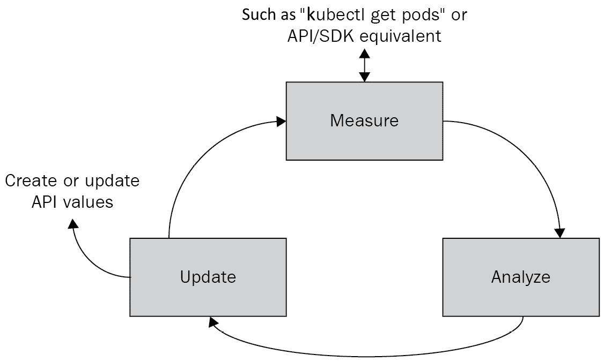

# *第十三章*：通过 CRD 扩展 Kubernetes

本章解释了扩展 Kubernetes 功能的多种可能性。首先讨论了`kubectl`命令，如`get`、`create`、`describe`和`apply`。接着讨论了 Operator 模式，它是 CRD 的一种扩展。然后详细介绍了一些云服务提供商在其 Kubernetes 实现中附加的钩子，最后简要介绍了更广泛的云原生生态系统。通过本章学到的概念，你将能够设计和开发扩展你的 Kubernetes 集群的功能，解锁高级使用模式。

本章的案例研究将包括创建两个简单的 CRD 来支持示例应用程序。我们将从 CRD 开始，这将为你提供一个良好的基础理解，帮助你理解扩展如何构建在 Kubernetes API 之上。

本章将涵盖以下主题：

+   如何通过**自定义资源定义**（**CRDs**）扩展 Kubernetes

+   使用 Kubernetes 操作员进行自我管理功能

+   使用特定云的 Kubernetes 扩展

+   与生态系统集成

# 技术要求

为了运行本章中详细介绍的命令，你需要一台支持`kubectl`命令行工具并且有一个正常运行的 Kubernetes 集群的计算机。请参见*第一章*，*与 Kubernetes 通信*，了解几种快速启动 Kubernetes 的方法，并获取如何安装`kubectl`工具的说明。

本章中使用的代码可以在本书的 GitHub 仓库中找到，地址是[`github.com/PacktPublishing/Cloud-Native-with-Kubernetes/tree/master/Chapter13`](https://github.com/PacktPublishing/Cloud-Native-with-Kubernetes/tree/master/Chapter13)。

# 如何通过自定义资源定义扩展 Kubernetes

让我们从基础开始。什么是 CRD？我们知道 Kubernetes 有一个 API 模型，在该模型中，我们可以对资源进行操作。一些 Kubernetes 资源的例子（你现在应该已经很熟悉了）有 Pods、PersistentVolumes、Secrets 等。

那么，如果我们希望在集群中实现一些自定义功能，编写自己的控制器，并将控制器的状态存储在某个地方该怎么办？我们当然可以将自定义功能的状态存储在 Kubernetes 或其他地方运行的 SQL 或 NoSQL 数据库中（这实际上是扩展 Kubernetes 的一种策略）——但是如果我们的自定义功能更多地作为 Kubernetes 功能的扩展，而不是一个完全独立的应用程序呢？

在这种情况下，我们有两个选择：

+   自定义资源定义

+   API 聚合

API 聚合允许高级用户在 Kubernetes API 服务器外构建自己的资源 API，并使用自己的存储——然后在 API 层聚合这些资源，以便通过 Kubernetes API 进行查询。显然，这种方法具有高度的可扩展性，本质上是将 Kubernetes API 作为代理来访问你自己的自定义功能，这些功能可能与 Kubernetes 集成，也可能没有。

另一个选项是 CRD，我们可以使用 Kubernetes API 和底层数据存储（`etcd`），而不是构建自己的数据存储。我们可以使用我们熟悉的`kubectl`和`kube api`方法来与我们自己的自定义功能进行交互。

在本书中，我们将不会讨论 API 聚合。尽管它比 CRD 更加灵活，但这是一个高级话题，需深入理解 Kubernetes API 并仔细阅读 Kubernetes 文档才能正确实现。你可以在[Kubernetes 文档](https://kubernetes.io/docs/concepts/extend-kubernetes/api-extension/apiserver-aggregation/)中了解更多关于 API 聚合的信息。

现在，我们知道我们正在使用 Kubernetes 控制平面作为我们新自定义功能的有状态存储，我们需要一个架构。类似于 Kubernetes 中的 Pod 资源规范期望某些字段和配置一样，我们可以告诉 Kubernetes 我们对新自定义资源的期望。现在让我们通过 CRD 的规范来了解一下。

## 编写自定义资源定义

对于 CRD，Kubernetes 使用 OpenAPI V3 规范。有关 OpenAPI V3 的更多信息，你可以查看[`github.com/OAI/OpenAPI-Specification/blob/master/versions/3.0.0.md`](https://github.com/OAI/OpenAPI-Specification/blob/master/versions/3.0.0.md)上的官方文档，但我们很快就会看到它是如何转化为 Kubernetes CRD 定义的。

让我们来看一个 CRD 规范示例。现在需要明确的是，这并不是该 CRD 的任何特定记录的 YAML 格式。相反，这是我们在 Kubernetes 内部定义 CRD 要求的地方。创建之后，Kubernetes 将接受符合规范的资源，我们可以开始创建自己的此类记录。

这是一个用于 CRD 规范的 YAML 示例，我们称之为`delayedjob`。这个极为简化的 CRD 旨在延迟启动一个容器镜像任务，这样用户就无需为容器编写延迟启动脚本。这个 CRD 非常脆弱，我们不建议任何人实际使用它，但它很适合展示构建 CRD 的过程。我们先看一下完整的 CRD 规范 YAML，然后再逐步解析：

Custom-resource-definition-1.yaml

```
apiVersion: apiextensions.k8s.io/v1
kind: CustomResourceDefinition
metadata:
  name: delayedjobs.delayedresources.mydomain.com
spec:
  group: delayedresources.mydomain.com
  versions:
    - name: v1
      served: true
      storage: true
      schema:
        openAPIV3Schema:
          type: object
          properties:
            spec:
              type: object
              properties:
                delaySeconds:
                  type: integer
                image:
                  type: string
  scope: Namespaced
  conversion:
    strategy: None
  names:
    plural: delayedjobs
    singular: delayedjob
    kind: DelayedJob
    shortNames:
    - dj
```

让我们回顾一下这个文件的部分内容。乍一看，它看起来像是典型的 Kubernetes YAML 规范——因为它确实是！在`apiVersion`字段中，我们有`apiextensions.k8s.io/v1`，这是 Kubernetes `1.16`版本以来的标准（之前是`apiextensions.k8s.io/v1beta1`）。我们的`kind`将始终是`CustomResourceDefinition`。

`metadata`字段是当事物开始变得具体到我们的资源时。我们需要将`name`元数据字段结构化为我们资源的复数形式，然后是一个点，接着是它的组名。让我们从 YAML 文件中稍作偏离，来讨论 Kubernetes API 中的组是如何工作的。

### 理解 Kubernetes API 组

组是 Kubernetes 在其 API 中对资源进行分段的一种方式。每个组对应 Kubernetes API 服务器的一个不同子路径。

默认情况下，有一个叫做核心组的遗留组——它对应于在 Kubernetes REST API 的`/api/v1`端点上访问的资源。由此，这些遗留组资源在它们的 YAML 规范中具有`apiVersion: v1`。核心组中的一个资源示例是 Pod。

接下来是命名组的集合——它们对应于可以通过`REST` URL 访问的资源，URL 格式为`/apis/<GROUP NAME>/<VERSION>`。这些命名组构成了 Kubernetes 资源的大部分。然而，最古老和最基本的资源，如 Pod、Service、Secret 和 Volume，属于核心组。一个属于命名组的资源示例是`StorageClass`资源，它位于`storage.k8s.io`组中。

重要说明

要查看哪些资源属于哪个组，你可以查阅官方的 Kubernetes API 文档，了解你使用的 Kubernetes 版本。例如，版本`1.18`的文档可以在[`kubernetes.io/docs/reference/generated/kubernetes-api/v1.18`](https://kubernetes.io/docs/reference/generated/kubernetes-api/v1.18)找到。

CRD 可以指定它们自己的命名组，这意味着特定的 CRD 将在 Kubernetes API 服务器可以监听的`REST`端点上可用。记住这一点后，让我们回到 YAML 文件，继续讨论 CRD 的主要部分——版本规范。

### 理解自定义资源定义版本

如你所见，我们选择了`delayedresources.mydomain.com`组。这个组理论上会包含所有其他延迟类型的 CRD——例如，`DelayedDaemonSet`或`DelayedDeployment`。

接下来，我们有 CRD 的主要部分。在`versions`字段下，我们可以定义一个或多个 CRD 版本（在`name`字段中），以及该版本的 API 规范。然后，当你创建 CRD 实例时，可以在 YAML 的`apiVersion`键的版本参数中定义将使用的版本——例如，`apps/v1`，或者在这种情况下是`delayedresources.mydomain.com/v1`。

每个版本项也有一个`served`属性，基本上是用来定义该版本是否启用。如果`served`为`false`，则 Kubernetes API 不会创建该版本，并且对于该版本的 API 请求（或`kubectl`命令）将失败。

此外，可以在特定版本上定义一个`deprecated`键，这会导致当使用已弃用版本对 API 发出请求时，Kubernetes 返回警告信息。这就是带有弃用版本的 CRD `yaml` 文件的样子——我们去掉了一些 spec 以保持 YAML 简洁：

Custom-resource-definition-2.yaml

```
apiVersion: apiextensions.k8s.io/v1
kind: CustomResourceDefinition
metadata:
  name: delayedjob.delayedresources.mydomain.com
spec:
  group: delayedresources.mydomain.com
  versions:
    - name: v1
      served: true
      storage: false
      deprecated: true
      deprecationWarning: "DelayedJob v1 is deprecated!"
      schema:
        openAPIV3Schema:
		…
    - name: v2
      served: true
      storage: true
      schema:
        openAPIV3Schema:
		...
  scope: Namespaced
  conversion:
    strategy: None
  names:
    plural: delayedjobs
    singular: delayedjob
    kind: DelayedJob
    shortNames:
    - dj
```

如你所见，我们已将`v1`标记为已弃用，并且还包括了 Kubernetes 作为响应发送的弃用警告。如果没有包括弃用警告，将使用默认消息。

接下来是`storage`键，它与`served`键交互。之所以需要这个是因为虽然 Kubernetes 支持同时运行多个活动（即`served`）版本的资源，但只有一个版本可以存储在控制平面中。然而，`served`属性意味着 API 可以提供资源的多个版本。那么它是如何工作的呢？

答案是 Kubernetes 会将 CRD 对象从存储版本转换为你请求的版本（或者在创建资源时，反向转换）。

这个转换是如何处理的呢？我们跳过其余的版本属性，看看`conversion`键是如何处理的。

`conversion`键让你指定一个策略，用于 Kubernetes 如何在你请求的版本和存储的版本之间转换 CRD 对象。如果两个版本相同——例如，当你请求一个`v1`资源并且存储版本也是`v1`时，则不会发生任何转换。

截至 Kubernetes 1.13，默认值是`none`。使用`none`设置时，Kubernetes 不会在字段之间进行任何转换。它只会包括在`served`（或创建资源时存储的）版本中应该出现的字段。

另一种可能的转换策略是`Webhook`，它允许你定义一个自定义 webhook，该 webhook 将接受一个版本并将其转换为你所需的目标版本。以下是我们使用`Webhook`转换策略的 CRD 示例——我们为了简洁去掉了一些版本模式：

Custom-resource-definition-3.yaml

```
apiVersion: apiextensions.k8s.io/v1
kind: CustomResourceDefinition
metadata:
  name: delayedjob.delayedresources.mydomain.com
spec:
  group: delayedresources.mydomain.com
  versions:
    - name: v1
      served: true
      storage: true
      schema:
        openAPIV3Schema:
		...
  scope: Namespaced
  conversion:
    strategy: Webhook
    webhook:
      clientConfig:
        url: "https://webhook-conversion.com/delayedjob"
  names:
    plural: delayedjobs
    singular: delayedjob
    kind: DelayedJob
    shortNames:
    - dj
```

如你所见，`Webhook`策略允许我们定义一个 URL，向其发送请求，传递关于传入资源对象的信息，包括其当前版本和需要转换到的版本。

其原理是我们的`Webhook`服务器将处理转换并返回经过修正的 Kubernetes 资源对象。`Webhook`策略很复杂，可能有许多配置选项，本书中不会详细探讨。

重要提示

要了解如何配置转换 Webhook，请查看官方 Kubernetes 文档：[`kubernetes.io/docs/tasks/extend-kubernetes/custom-resources/custom-resource-definition-versioning/`](https://kubernetes.io/docs/tasks/extend-kubernetes/custom-resources/custom-resource-definition-versioning/)。

现在，回到我们 YAML 文件中的 `version` 条目！在 `served` 和 `storage` 键下，我们看到 `schema` 对象，它包含我们资源的实际规格。如前所述，这遵循 OpenAPI Spec v3 的规范。

由于空间原因，前面的代码块中移除了 `schema` 对象，下面是其内容：

Custom-resource-definition-3.yaml（续）

```
     schema:
        openAPIV3Schema:
          type: object
          properties:
            spec:
              type: object
              properties:
                delaySeconds:
                  type: integer
                image:
                  type: string
```

如你所见，我们支持一个名为 `delaySeconds` 的字段，它是一个整数，以及一个名为 `image` 的字段，它是一个字符串，表示我们的容器镜像。如果我们真的想让 `DelayedJob` 适用于生产环境，我们还需要包括各种其他选项，使其更接近原始的 Kubernetes Job 资源——但这并非我们的目的。

回到原始代码块中的版本列表之外，我们看到了一些其他属性。首先是 `scope` 属性，它可以是 `Cluster` 或 `Namespaced`。这个属性告诉 Kubernetes 是否将 CRD 对象的实例视为命名空间特定的资源（例如 Pods、Deployments 等），或者视为集群范围的资源——比如命名空间本身，因为在一个命名空间内获取命名空间对象是没有意义的！

最后，我们有 `names` 块，它允许你定义资源名称的复数和单数形式，以供在不同情况下使用（例如，`kubectl get pods` 和 `kubectl get pod` 都可以使用）。

`names` 块还允许你定义驼峰式命名的 `kind` 值，这将在资源 YAML 文件中使用，同时还可以定义一个或多个 `shortNames`，用于在 API 或 `kubectl` 中引用该资源——例如，`kubectl get po`。

解释了我们的 CRD 规范 YAML 后，让我们看一下我们 CRD 的一个实例——根据我们刚才审阅的规范，YAML 文件将如下所示：

Delayed-job.yaml

```
apiVersion: delayedresources.mydomain.com/v1
kind: DelayedJob
metadata:
  name: my-instance-of-delayed-job
spec:
  delaySeconds: 6000
  image: "busybox"
```

如你所见，这与我们在 CRD 中定义的对象完全相同。现在，所有部分就位，让我们来测试我们的 CRD！

### 测试自定义资源定义

让我们继续在 Kubernetes 上测试我们的 CRD 概念：

1.  首先，让我们在 Kubernetes 中创建 CRD 规范——就像我们创建任何其他对象一样：

    ```
    kubectl apply -f delayedjob-crd-spec.yaml
    ```

    这将产生以下输出：

    ```
    customresourcedefinition "delayedjob.delayedresources.mydomain.com" has been created
    ```

1.  现在，Kubernetes 将接受对我们的 `DelayedJob` 资源的请求。我们可以通过使用前面提供的资源 YAML 最终创建一个实例来测试这一点：

    ```
    kubectl apply -f my-delayed-job.yaml
    ```

如果我们正确定义了 CRD，我们将看到以下输出：

```
delayedjob "my-instance-of-delayed-job" has been created
```

如你所见，Kubernetes API 服务器已成功创建我们的 `DelayedJob` 实例！

现在，你可能会问一个非常相关的问题 —— 接下来怎么办？这是一个非常好的问题，因为实际上到目前为止，我们所做的只是简单地向 Kubernetes API 数据库中添加了一张新的 `table`。

仅仅因为我们给我们的 `DelayedJob` 资源分配了一个应用镜像和一个 `delaySeconds` 字段，并不意味着我们期望的功能就会发生。通过创建我们的 `DelayedJob` 实例，我们只是向该 `table` 添加了一个条目。我们可以使用 Kubernetes API 或 `kubectl` 命令获取、编辑或删除它，但没有实现任何应用功能。

为了让我们的 `DelayedJob` 资源执行某些操作，我们需要一个自定义控制器，它将处理我们的 `DelayedJob` 实例并执行相应操作。最终，我们仍然需要使用官方的 Kubernetes 资源 —— 如 Pods 等，来实现实际的容器功能。

这就是我们现在要讨论的内容。有许多方法可以为 Kubernetes 构建自定义控制器，但一种流行的方法是将 `DelayedJob` 资源赋予其自身的生命周期。

# 使用 Kubernetes 操作符实现自管理功能

在讨论 Kubernetes 操作符之前，必须先讨论 **Operator Framework**。一个常见的误解是认为操作符是通过 Operator Framework 特别构建的。Operator Framework 是一个开源框架，最初由 Red Hat 创建，旨在简化 Kubernetes 操作符的编写。

实际上，操作符只是一个自定义控制器，它与 Kubernetes 接口并对资源进行操作。Operator Framework 是一种创建 Kubernetes 操作符的标准方法，但你也可以使用许多其他开源框架，或者从零开始创建一个！

在使用框架构建操作符时，最受欢迎的两个选项是前面提到的 **Operator Framework** 和 **Kubebuilder**。

这两个项目有很多相似之处。它们都使用了 `controller-tools` 和 `controller-runtime`，这两个库是用于构建 Kubernetes 控制器的官方支持库。如果你是从零开始构建操作符，使用这些官方支持的控制器库会让事情变得更容易。

与 Operator Framework 不同，Kubebuilder 是 Kubernetes 项目的一部分，类似于 `controller-tools` 和 `controller-runtime` 库 —— 但这两个项目都有其优缺点。重要的是，这两种选项，以及操作符模式，通常都要求控制器运行在集群内。乍一看，这似乎是最佳选择，但你也可以在集群外部运行控制器，并使其正常工作。要开始使用 Operator Framework，可以访问其官方 GitHub：[`github.com/operator-framework`](https://github.com/operator-framework)。要了解 Kubebuilder，可以访问：[`github.com/kubernetes-sigs/kubebuilder`](https://github.com/kubernetes-sigs/kubebuilder)。

大多数操作符，无论框架如何，都遵循控制循环范式 – 让我们来看一下这个概念是如何工作的。

## 映射操作符控制循环

控制循环是一种系统设计和编程中的控制方案，它由一个永不停息的逻辑处理循环组成。通常，控制循环采用测量-分析-调整的方法，其中它测量系统的当前状态，分析需要哪些变化以使其符合预期状态，然后调整系统组件，使其与预期状态一致（或至少更接近）。

在 Kubernetes 操作符或控制器中，这个操作通常是这样的：

1.  首先是`监视`步骤 – 即监视 Kubernetes API 中的预期状态变化，该状态存储在`etcd`中。

1.  然后，`分析`步骤 – 即控制器决定如何操作以使集群状态与预期状态一致。

1.  最后是`更新`步骤 – 即更新集群状态以实现集群变化的预期目标。

为了帮助理解控制循环，这里有一个图示，展示了各个部分如何组合在一起：



图 13.1 – 测量分析更新循环

让我们使用 Kubernetes 调度器 – 它本身就是一个控制循环过程 – 来说明这个问题：

1.  让我们从一个假设的集群开始，该集群处于稳定状态：所有 Pod 都已调度，节点健康，所有操作正常。

1.  然后，用户创建一个新的 Pod。

我们之前讨论过，kubelet 是基于`拉取`机制工作的。这意味着，当 kubelet 在其 Node 上创建 Pod 时，Pod 已经通过调度器分配到了该 Node。然而，当 Pod 通过`kubectl create`或`kubectl apply`命令首次创建时，Pod 尚未被调度或分配到任何地方。这就是我们的调度器控制循环开始的地方：

1.  第一步是**测量**，即调度器读取 Kubernetes API 的状态。当从 API 列出 Pods 时，它发现其中一个 Pod 没有分配到 Node。然后，它进入下一步。

1.  接下来，调度器对集群状态和 Pod 需求进行分析，以决定将 Pod 分配到哪个 Node。正如我们在前几章中讨论的，这个过程考虑了 Pod 资源限制和请求、Node 状态、放置控制等，因此是一个相当复杂的过程。一旦处理完成，更新步骤就可以开始。

1.  最后，**更新** – 调度器通过将 Pod 分配到从*步骤 2*分析中获得的 Node，来更新集群状态。此时，kubelet 接管自己的控制循环，并在其 Node 上为 Pod 创建相关容器。

接下来，让我们把从调度器控制循环中学到的东西应用到我们自己的`DelayedJob`资源中。

## 为自定义资源定义设计操作符

实际上，为我们的 `DelayedJob` CRD 编写操作符超出了本书的范围，因为它需要编程语言的知识。如果你选择编程语言来构建操作符，Go 提供了与 Kubernetes SDK、**controller-tools** 和 **controller-runtime** 的最佳互操作性，但任何能编写 HTTP 请求的编程语言都可以使用，因为这正是所有 SDK 的基础。

然而，我们仍然会逐步演示如何为我们的 `DelayedJob` CRD 实现一个操作符，并附上一些伪代码。让我们一步一步来。

### 第 1 步：测量

首先是一个永远运行的 `while` 循环。在生产环境中，应该有防抖、错误处理和其他一堆问题，但为了说明清楚，我们将保持简单。

看一下这个循环的伪代码，它本质上是我们应用程序的主函数：

Main-function.pseudo

```
// The main function of our controller
function main() {
  // While loop which runs forever
  while() {
     // fetch the full list of delayed job objects from the cluster
	var currentDelayedJobs = kubeAPIConnector.list("delayedjobs");
     // Call the Analysis step function on the list
     var jobsToSchedule = analyzeDelayedJobs(currentDelayedJobs);
     // Schedule our Jobs with added delay
     scheduleDelayedJobs(jobsToSchedule);
     wait(5000);
  }
}
```

如你所见，我们的 `main` 函数中的循环调用 Kubernetes API 来查找存储在 `etcd` 中的 `delayedjobs` CRD 列表。这是 `measure` 步骤。然后它调用分析步骤，依据分析结果，再调用更新步骤来调度需要调度的 `DelayedJobs`。

重要说明

请记住，在这个例子中，Kubernetes 调度器仍然会执行实际的容器调度——但我们首先需要将 `DelayedJob` 转化为官方的 Kubernetes 资源。

在更新步骤之后，我们的循环会等待完整的 5 秒钟，然后再次执行循环。这设置了控制循环的节奏。接下来，让我们进入分析步骤。

### 第 2 步：分析

接下来，让我们回顾一下我们控制器伪代码中的 `analyzeDelayedJobs` 函数：

Analysis-function.pseudo

```
// The analysis function
function analyzeDelayedJobs(listOfDelayedJobs) {
  var listOfJobsToSchedule = [];
  foreach(dj in listOfDelayedJobs) {
    // Check if dj has been scheduled, if not, add a Job object with
    // added delay command to the to schedule array
    if(dj.annotations["is-scheduled"] != "true") {
      listOfJobsToSchedule.push({
        Image: dj.image,
        Command: "sleep " + dj.delaySeconds + "s",
        originalDjName: dj.name
      });
    }
  }
  return listOfJobsToSchedule;  
}
```

如你所见，前面的函数通过检查 `DelayedJob` 对象的某个注释值来遍历来自集群的 `DelayedJob` 对象列表，以确定该对象是否已被调度。如果尚未调度，它将一个对象添加到名为 `listOfJobsToSchedule` 的数组中，该数组包含在 `DelayedJob` 对象中指定的图像、一个命令用于在 `DelayedJob` 对象中指定的秒数后休眠，以及 `DelayedJob` 的原始名称，我们将在**更新**步骤中使用该名称来标记为已调度。

最后，在 `analyzeDelayedJobs` 函数返回我们新创建的 `listOfJobsToSchedule` 数组给主函数后，我们将通过最终的更新步骤来完成我们的 Operator 设计，即主循环中的 `scheduleDelayedJobs` 函数。

### 第 3 步：更新

最后，我们控制循环的**更新**部分将根据分析的输出更新集群，以创建预期的状态。以下是伪代码：

Update-function.pseudo

```
// The update function
function scheduleDelayedJobs(listOfJobs) {
  foreach(job in listOfDelayedJobs) {
    // First, go ahead and schedule a regular Kubernetes Job
    // which the Kube scheduler can pick up on.
    // The delay seconds have already been added to the job spec
    // in the analysis step
    kubeAPIConnector.create("job", job.image, job.command);
    // Finally, mark our original DelayedJob with a "scheduled"
    // attribute so our controller doesn't try to schedule it again
    kubeAPIConnector.update("delayedjob", job.originalDjName,
    annotations: {
      "is-scheduled": "true"
    });
  } 
}
```

在这种情况下，我们将常规的 Kubernetes 对象（它是从我们的`DelayedJob`对象派生的）创建到 Kubernetes 中，以便`Kube`调度器可以捕捉它，创建相关的 Pod 并进行管理。一旦我们创建了带有延迟的常规 Job 对象，我们还会更新`DelayedJob` CRD 实例，添加一个注释，将`is-scheduled`注释设置为`true`，从而防止它被重新调度。

这完成了我们的控制循环——从此时起，`Kube`调度器接管，我们的 CRD 作为 Kubernetes Job 对象诞生，它控制一个 Pod，最终被分配到一个节点上，并且容器被安排运行我们的代码！

这个例子当然是高度简化的，但你会惊讶于有多少 Kubernetes 操作员执行简单的控制循环来协调 CRD，并将其简化为基本的 Kubernetes 资源。操作员可以变得非常复杂，并执行特定应用的功能，比如备份数据库、清空持久化卷等——但这些功能通常与被控制的对象紧密耦合。

现在我们已经讨论了 Kubernetes 控制器中的 Operator 模式，我们可以谈论一些针对特定云的 Kubernetes 控制器的开源选项。

# 使用特定于云的 Kubernetes 扩展

云特定的 Kubernetes 扩展和控制器通常在托管的 Kubernetes 服务中默认可用，例如 Amazon EKS、Azure AKS 和 Google Cloud 的 GKE，它们可以与相应的云平台紧密集成，并使从 Kubernetes 控制其他云资源变得容易。

即使不添加任何额外的第三方组件，这些特定于云的功能也可以通过**云控制器管理器（CCM）**组件在上游 Kubernetes 中使用，该组件包含许多与主要云服务提供商集成的选项。这是公共云上每个托管 Kubernetes 服务通常默认启用的功能——但它们也可以与在该特定云平台上运行的任何集群集成，无论该集群是否是托管的。

在本节中，我们将回顾一些常见的 Kubernetes 云扩展，包括**云控制器管理器（CCM）**和需要安装其他控制器的功能，如**external-dns**和**cluster-autoscaler**。让我们从一些常用的 CCM 功能开始。

## 了解云控制器管理器组件

如在*第一章*《与 Kubernetes 通信》中回顾的那样，**云控制器管理器（CCM）**是一个官方支持的 Kubernetes 控制器，提供了与多个公共云服务功能的接口。为了正常运行，CCM 组件需要在启动时具有访问相应云服务的权限——例如，AWS 中的 IAM 角色。

对于 AWS、Azure 和 Google Cloud 等官方支持的云，CCM 可以简单地作为 DaemonSet 在集群内运行。我们使用 DaemonSet 是因为 CCM 可以执行诸如在云提供商中创建持久存储等任务，它需要能够将存储附加到特定的节点。如果你使用的云不是官方支持的，你可以为该特定云运行 CCM，且应遵循该项目中的具体说明。这些替代类型的 CCM 通常是开源的，可以在 GitHub 上找到。至于安装 CCM 的具体操作，让我们进入下一部分。

## 安装 cloud-controller-manager

通常，CCM 在集群创建时就已配置。如前一节所述，EKS、AKS 和 GKE 等托管服务已经启用了此组件，即便是 Kops 和 Kubeadm 在安装过程中也会以标志的形式暴露 CCM 组件。

假设你没有以其他方式安装 CCM，并打算使用上游版本支持的公共云中的一个，你可以将 CCM 作为 DaemonSet 安装。

首先，你需要一个`ServiceAccount`：

Service-account.yaml

```
apiVersion: v1
kind: ServiceAccount
metadata:
  name: cloud-controller-manager
  namespace: kube-system
```

这个`ServiceAccount`将用于授予 CCM 所需的访问权限。

接下来，我们需要一个`ClusterRoleBinding`：

Clusterrolebinding.yaml

```
apiVersion: rbac.authorization.k8s.io/v1
kind: ClusterRoleBinding
metadata:
  name: system:cloud-controller-manager
subjects:
- kind: ServiceAccount
  name: cloud-controller-manager
  namespace: kube-system
roleRef:
  apiGroup: rbac.authorization.k8s.io
  kind: ClusterRole
  name: cluster-admin
```

如你所见，我们需要将`cluster-admin`角色的访问权限授予我们的 CCM 服务账户。CCM 将需要能够编辑节点，此外还需要执行其他操作。

最后，我们可以部署 CCM 的`DaemonSet`本身。你需要根据你特定的云提供商填写这个 YAML 文件中的适当设置——请查阅你云提供商的 Kubernetes 文档以获取此信息。

`DaemonSet`规格相当长，因此我们将分两部分进行审查。首先，我们有带有必要标签和名称的`DaemonSet`模板：

Daemonset.yaml

```
apiVersion: apps/v1
kind: DaemonSet
metadata:
  labels:
    k8s-app: cloud-controller-manager
  name: cloud-controller-manager
  namespace: kube-system
spec:
  selector:
    matchLabels:
      k8s-app: cloud-controller-manager
  template:
    metadata:
      labels:
        k8s-app: cloud-controller-manager
```

如你所见，为了匹配我们的`ServiceAccount`，我们将 CCM 部署在`kube-system`命名空间中。我们还使用`k8s-app`标签标记`DaemonSet`，以便将其区分为 Kubernetes 控制平面组件。

接下来是`DaemonSet`的规格：

Daemonset.yaml（续）

```
    spec:
      serviceAccountName: cloud-controller-manager
      containers:
      - name: cloud-controller-manager
        image: k8s.gcr.io/cloud-controller-manager:<current ccm version for your version of k8s>
        command:
        - /usr/local/bin/cloud-controller-manager
        - --cloud-provider=<cloud provider name>
        - --leader-elect=true
        - --use-service-account-credentials
        - --allocate-node-cidrs=true
        - --configure-cloud-routes=true
        - --cluster-cidr=<CIDR of the cluster based on Cloud Provider>
      tolerations:
      - key: node.cloudprovider.kubernetes.io/uninitialized
        value: "true"
        effect: NoSchedule
      - key: node-role.kubernetes.io/master
        effect: NoSchedule
      nodeSelector:
        node-role.kubernetes.io/master: ""
```

如你所见，在此规格中有几个地方需要你查看所选云提供商的文档或集群网络设置，以找到适当的值。特别是在网络标志如`--cluster-cidr`和`--configure-cloud-routes`中，值可能会根据你设置集群的方式发生变化，即使是在同一云提供商上。

现在我们已经通过某种方式在集群上运行了 CCM，接下来让我们深入了解它提供的一些功能。

## 了解 cloud-controller-manager 的功能

默认的 CCM 在几个关键领域提供了功能。首先，CCM 包含用于节点、路由和服务的附属控制器。让我们逐一回顾每个控制器，以了解它为我们提供了什么，首先从节点/节点生命周期控制器开始。

### CCM 节点/节点生命周期控制器

CCM 节点控制器确保集群的状态（即集群中包含哪些节点）与云提供商系统中的状态一致。一个简单的例子是 AWS 中的自动扩展组。当使用 AWS EKS（或仅在 AWS EC2 上运行 Kubernetes，尽管这需要额外的配置）时，可以在 AWS 自动扩展组中配置工作节点组，这些节点组会根据节点的 CPU 或内存使用情况进行扩展。当这些节点被云提供商添加并初始化时，CCM 节点控制器将确保集群中有一个节点资源，与云提供商展示的每个节点相匹配。

接下来，让我们继续讨论路由控制器。

### CCM 路由控制器

CCM 路由控制器负责以支持 Kubernetes 集群的方式配置云提供商的网络设置。这可能包括 IP 分配和在节点之间设置路由。服务控制器也处理网络设置——但主要是外部方面。

### CCM 服务控制器

CCM 服务控制器提供了在公共云提供商上运行 Kubernetes 的许多“魔法”功能。我们在*第五章*中回顾的一个方面是`LoadBalancer`服务，标题为*服务和入口——与外部世界的通信*。例如，在配置了 AWS CCM 的集群中，类型为`LoadBalancer`的服务将自动配置匹配的 AWS 负载均衡器资源，提供了一种轻松暴露集群服务的方法，无需处理`NodePort`设置，甚至不需要使用 Ingress。

现在我们已经了解了 CCM 提供的功能，我们可以更进一步，讨论在公共云上运行 Kubernetes 时，通常使用的其他云提供商扩展。首先，让我们看看`external-dns`。

## 使用 `external-dns` 与 Kubernetes

`external-dns` 库是一个官方支持的 Kubernetes 插件，它允许集群配置外部 DNS 提供商，以自动化方式为服务和入口提供 DNS 解析。`external-dns` 插件支持广泛的云提供商，如 AWS 和 Azure，以及其他 DNS 服务，如 Cloudflare。

重要提示

要安装`external-dns`，可以访问官方的 GitHub 仓库 [`github.com/kubernetes-sigs/external-dns`](https://github.com/kubernetes-sigs/external-dns)。

一旦在集群中实现了`external-dns`，就可以以自动化的方式轻松创建新的 DNS 记录。要测试带有服务的`external-dns`，我们只需要在 Kubernetes 中创建一个带有正确注解的服务。

让我们看看它的样子：

service.yaml

```
apiVersion: v1
kind: Service
metadata:
  name: my-service-with-dns
  annotations:
    external-dns.alpha.kubernetes.io/hostname: myapp.mydomain.com
spec:
  type: LoadBalancer
  ports:
  - port: 80
    name: http
    targetPort: 80
  selector:
    app: my-app
```

如你所见，我们只需要为 `external-dns` 控制器添加一个注释，待其检查并在 DNS 中创建域名记录。该域名和托管区域必须能够被你的 `external-dns` 控制器访问——例如，AWS Route 53 或 Azure DNS。请参考 `external-dns` GitHub 仓库中的具体文档了解详细信息。

一旦服务启动并运行，`external-dns` 将拾取注释并创建一个新的 DNS 记录。这种模式非常适合多租户或按版本部署，因为像 Helm 图表这样的工具可以利用变量根据应用程序的版本或分支来更改域名——例如，`v1.myapp.mydomain.com`。

对于 Ingress，这更简单——你只需在 Ingress 记录中指定一个主机名，如下所示：

ingress.yaml

```
apiVersion: networking.k8s.io/v1beta1
kind: Ingress
metadata:
  name: my-domain-ingress
  annotations:
    kubernetes.io/ingress.class: "nginx".
spec:
  rules:
  - host: myapp.mydomain.com
    http:
      paths:
      - backend:
          serviceName: my-app-service
          servicePort: 80
```

这个主机值将自动创建一个 DNS 记录，指向你的 Ingress 所使用的方法——例如，AWS 上的负载均衡器。

接下来，让我们来了解一下 **cluster-autoscaler** 库的工作原理。

## 使用 cluster-autoscaler 插件

与 `external-dns` 类似，`cluster-autoscaler` 是 Kubernetes 官方支持的插件，支持一些主要云服务提供商的特定功能。`cluster-autoscaler` 的目的是触发集群中节点数量的自动扩展。它通过控制云服务提供商的自动扩展资源（例如 AWS 自动扩展组）来完成此过程。

当任何 Pod 因为节点资源限制而无法调度时，集群自动扩展器将执行向上扩展操作，但前提是现有节点大小（例如 AWS 中的 `t3.medium` 节点）允许该 Pod 被调度。

同样，当任何节点上的 Pod 可以被清空而不对其他节点造成内存或 CPU 压力时，集群自动扩展器将执行向下扩展操作。

要安装 `cluster-autoscaler`，只需按照云服务提供商提供的正确安装指南进行操作，选择适合的集群类型和目标版本的 `cluster-autoscaler`。例如，AWS 上 EKS 的 `cluster-autoscaler` 安装说明可以在[`aws.amazon.com/premiumsupport/knowledge-center/eks-cluster-autoscaler-setup/`](https://aws.amazon.com/premiumsupport/knowledge-center/eks-cluster-autoscaler-setup/)找到。

接下来，让我们通过检查 Kubernetes 生态系统，来看一下如何找到开源和闭源的 Kubernetes 扩展。

# 与生态系统集成

Kubernetes（以及更广泛的云原生）生态系统庞大，包含数百个流行的开源软件库，还有成千上万个新兴的库。由于每个月都会有新技术需要评估，而且收购、整合或公司倒闭可能会将你最喜欢的开源库变成无人维护的烂摊子，因此在这个生态系统中导航是非常困难的。

幸运的是，这个生态系统中有一些结构，了解这些结构对于帮助我们在云原生开源项目的选择中导航非常重要。这个结构的第一个重要组成部分就是 **Cloud Native Computing Foundation** 或 **CNCF**。

## 介绍 Cloud Native Computing Foundation

CNCF 是 Linux 基金会的一个子基金会，Linux 基金会是一个非盈利实体，负责托管开源项目，并协调不断变化的公司名单，这些公司为开源软件做出贡献并使用开源软件。

CNCF 的成立几乎完全是为了引领 Kubernetes 项目的未来。它在 Kubernetes 1.0 发布时宣布成立，随后扩展到涵盖了云原生领域的数百个项目 —— 从 Prometheus 到 Envoy 再到 Helm，还有更多项目。

查看 CNCF 组成项目的概览的最佳方式是查看 CNCF 云原生景观，网址为 [`landscape.cncf.io/`](https://landscape.cncf.io/)。

如果你对 Kubernetes 或云原生领域中遇到的问题的可能解决方案感兴趣，CNCF Landscape 是一个很好的起点。在每个类别（监控、日志、无服务器、服务网格等）中，都有多个开源选项可以审核并选择。

这是当前云原生技术生态系统的优势和劣势。虽然有大量的选择可用，这使得正确的路径往往不明确，但也意味着你很可能能找到一个非常接近你需求的解决方案。

CNCF 还运营着一个官方的 Kubernetes 论坛，用户可以通过 Kubernetes 官方网站 [kubernetes.io](http://kubernetes.io) 加入。Kubernetes 论坛的网址是 [`discuss.kubernetes.io/`](https://discuss.kubernetes.io/)。

最后，值得一提的是 *KubeCon*/*CloudNativeCon*，这是一个由 CNCF 主办的大型会议，涵盖了包括 Kubernetes 本身在内的许多生态系统项目。*KubeCon* 每年都在增长，2019 年 *KubeCon North America* 会议的参会人数接近 12,000 人。

# 总结

在本章中，我们学习了如何扩展 Kubernetes。首先，我们讨论了 CRD —— 它是什么，相关的使用案例，以及如何在集群中实现它们。接下来，我们回顾了 Kubernetes 中操作员的概念，并讨论了如何使用操作员或自定义控制器为 CRD 赋予生命。

然后，我们讨论了 Kubernetes 针对云服务提供商的特定扩展，包括 `cloud-controller-manager`、`external-dns` 和 `cluster-autoscaler`。最后，我们介绍了云原生开源生态系统的一些基本概念，并提供了一些发现适合自己用例的项目的优秀方法。

本章中使用的技能将帮助你扩展 Kubernetes 集群，以便与云服务提供商及你自定义的功能进行交互。

在下一章中，我们将讨论应用于 Kubernetes 的两种新兴架构模式——无服务器架构和服务网格。

# 问题

1.  CRD 的服务版本与存储版本有什么区别？

1.  自定义控制器或操作符控制循环的三个典型部分是什么？

1.  `cluster-autoscaler`如何与现有云提供商的自动扩展解决方案（如 AWS 自动扩展组）交互？

# 深入阅读

+   CNCF Landscape: [`landscape.cncf.io/`](https://landscape.cncf.io/)

+   官方 Kubernetes 论坛: [`discuss.kubernetes.io/`](https://discuss.kubernetes.io/)
