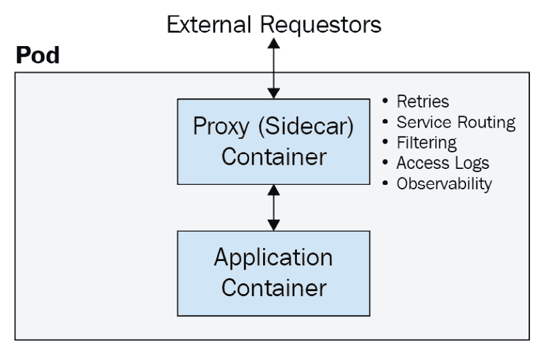
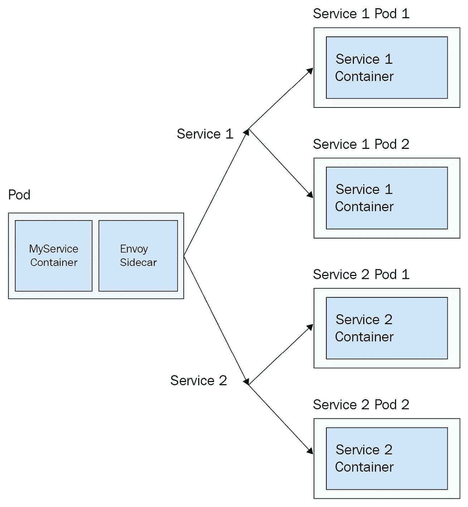
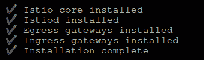
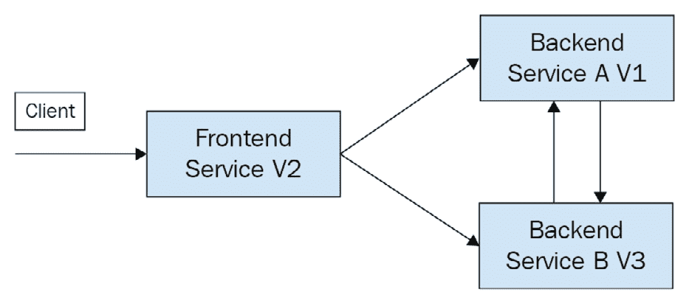

# *第十四章*：服务网格与无服务器架构

本章讨论了高级 Kubernetes 模式。首先，它详细介绍了当前流行的服务网格模式，其中可观察性和服务到服务的发现由边车代理处理，并提供了设置流行服务网格 Istio 的指南。最后，它描述了无服务器模式及其如何在 Kubernetes 中应用。本章的主要案例研究将包括为示例应用程序设置 Istio 和服务发现，以及 Istio 入口网关的配置。

让我们从边车代理的讨论开始，它为服务网格提供了服务到服务连接的基础。

在本章中，我们将涵盖以下主题：

+   使用边车代理

+   向 Kubernetes 添加服务网格

+   在 Kubernetes 上实现无服务器架构

# 技术要求

为了运行本章中详细介绍的命令，您需要一台支持 `kubectl` 命令行工具的计算机，并且需要一个正在运行的 Kubernetes 集群。请参阅 *第一章*，*与 Kubernetes 通信*，了解如何快速启动并运行 Kubernetes，并查看如何安装 `kubectl` 工具的说明。

本章中使用的代码可以在本书的 GitHub 仓库中找到，网址是 [`github.com/PacktPublishing/Cloud-Native-with-Kubernetes/tree/master/Chapter14`](https://github.com/PacktPublishing/Cloud-Native-with-Kubernetes/tree/master/Chapter14)。

# 使用边车代理

如本书前面提到的，边车是一种模式，在这种模式中，一个 Pod 除了运行实际应用容器外，还包含另一个容器。这个额外的容器就是边车。边车有多种用途，其中最常见的用途包括监控、日志记录和代理。

对于日志记录，边车容器可以从应用容器中获取日志（因为它们可以共享卷并在本地主机上进行通信），然后将日志发送到集中式日志堆栈，或解析日志以便进行警报。监控也是类似的情况，边车 Pod 可以跟踪并发送关于应用 Pod 的度量数据。

使用边车代理时，当请求进入 Pod 时，它们首先会进入代理容器，代理容器会在记录日志或进行其他过滤后，将请求路由到应用容器。同样，当请求离开应用容器时，它们首先会进入代理，代理可以提供从 Pod 外部的路由。

通常，像 NGINX 这样的代理边车仅为进入 Pod 的请求提供代理服务。然而，在服务网格模式中，进入和离开 Pod 的请求都必须经过代理，这为服务网格模式本身提供了基础。

请参考以下图表，了解边车代理如何与应用容器进行交互：



图 14.1 – 代理边车

如你所见，边车代理负责将请求路由到 Pod 中的应用容器并返回，支持诸如服务路由、日志记录和过滤等功能。

边车代理模式是基于 DaemonSet 的代理的一种替代方案，其中每个节点上的代理 Pod 负责将请求代理到该节点上的其他 Pod。Kubernetes 代理本身类似于 DaemonSet 模式。使用边车代理比使用 DaemonSet 代理提供了更多的灵活性，但以性能效率为代价，因为需要运行许多额外的容器。

一些流行的 Kubernetes 代理选项包括：

+   *NGINX*

+   *HAProxy*

+   *Envoy*

虽然 NGINX 和 HAProxy 是更传统的代理，Envoy 则是专门为分布式云原生环境构建的。因此，Envoy 成为了构建 Kubernetes 服务网格和 API 网关的核心。

在我们讨论 Envoy 之前，先讨论其他代理作为边车的安装。

## 使用 NGINX 作为边车反向代理

在我们指定 NGINX 如何作为边车代理使用之前，值得注意的是，在即将发布的 Kubernetes 版本中，边车将成为 Kubernetes 资源类型，允许将边车容器轻松注入到大量 Pod 中。然而，目前，边车容器必须在 Pod 或控制器（ReplicaSet、Deployment 等）级别指定。

让我们看一下如何将 NGINX 配置为边车，下面的 Deployment YAML 我们暂时还不创建。这个过程比使用 NGINX Ingress Controller 稍微更手动一些。

为了节省空间，我们将 YAML 分成了两部分，并去掉了一些冗余部分，但你可以在代码库中看到完整内容。我们从部署的容器规格开始：

Nginx-sidecar.yaml：

```
   spec:
     containers:
     - name: myapp
       image: ravirdv/http-responder:latest
       imagePullPolicy: IfNotPresent
     - name: nginx-sidecar
       image: nginx
       imagePullPolicy: IfNotPresent
       volumeMounts:
         - name: secrets
           mountPath: /app/cert
         - name: config
           mountPath: /etc/nginx/nginx.conf
           subPath: nginx.conf
```

如你所见，我们指定了两个容器，一个是我们的主应用容器`myapp`，另一个是`nginx`边车容器，在这里我们通过卷挂载注入了一些配置，以及一些 TLS 证书。

接下来，让我们看一下同一文件中的`volumes`规格，在这里我们注入了一些证书（来自 secret）和`config`（来自`ConfigMap`）：

```
    volumes:
     - name: secrets
       secret:
         secretName: nginx-certificates
         items:
           - key: server-cert
             path: server.pem
           - key: server-key
             path: server-key.pem
     - name: config
       configMap:
         name: nginx-configuration
```

如你所见，我们需要一个证书和一个密钥。

接下来，我们需要使用`ConfigMap`创建 NGINX 配置。NGINX 配置如下所示：

nginx.conf：

```
http {
    sendfile        on;
    include       mime.types;
    default_type  application/octet-stream;
    keepalive_timeout  80;
    server {
       ssl_certificate      /app/cert/server.pem;
      ssl_certificate_key  /app/cert/server-key.pem;
      ssl_protocols TLSv1.2;
      ssl_ciphers EECDH+AES128:RSA+AES128:EECDH+AES256:RSA+AES256:!EECDH+3DES:!RSA+3DES:!MD5;
      ssl_prefer_server_ciphers on;
      listen       443 ssl;
      server_name  localhost;
      location / {
        proxy_set_header X-Forwarded-For $proxy_add_x_forwarded_for;
        proxy_set_header Host $http_host;
        proxy_pass http://127.0.0.1:5000/;
      }
    }
}
worker_processes  1;
events {
    worker_connections  1024;
}
```

如你所见，我们有一些基本的 NGINX 配置。重要的是，我们有`proxy_pass`字段，它将请求代理到`127.0.0.1`或本地主机的某个端口。由于 Pod 中的容器可以共享本地主机端口，这就充当了我们的边车代理。为了本书的目的，我们不再逐一审查其他行，但你可以查看 NGINX 文档，了解每一行的含义（[`nginx.org/en/docs/`](https://nginx.org/en/docs/)）。

现在，让我们根据这个文件创建`ConfigMap`。使用以下命令直接创建`ConfigMap`：

```
kubectl create cm nginx-configuration --from-file=nginx.conf=./nginx.conf
```

这将产生以下输出：

```
Configmap "nginx-configuration" created
```

接下来，让我们为 NGINX 创建 TLS 证书，并将它们嵌入到 Kubernetes 密钥中。你需要安装 CFSSL（CloudFlare 的 PKI/TLS 开源工具包）库来执行这些步骤，但你也可以使用其他任何方法来创建证书。

首先，我们需要创建 **证书授权中心**（**CA**）。从 CA 的 JSON 配置开始：

nginxca.json：

```
{
   "CN": "mydomain.com",
   "hosts": [
       "mydomain.com",
       "www.mydomain.com"
   ],
   "key": {
       "algo": "rsa",
       "size": 2048
   },
   "names": [
       {
           "C": "US",
           "ST": "MD",
           "L": "United States"
       }
   ]
}
```

现在，使用 CFSSL 创建 CA 证书：

```
cfssl gencert -initca nginxca.json | cfssljson -bare nginxca
```

接下来，我们需要 CA 配置：

Nginxca-config.json：

```
{
  "signing": {
      "default": {
          "expiry": "20000h"
      },
      "profiles": {
          "client": {
              "expiry": "43800h",
              "usages": [
                  "signing",
                  "key encipherment",
                  "client auth"
              ]
          },
          "server": {
              "expiry": "20000h",
              "usages": [
                  "signing",
                  "key encipherment",
                  "server auth",
                  "client auth"
              ]
          }
      }
  }
}
```

我们还需要一个证书请求配置：

Nginxcarequest.json：

```
{
  "CN": "server",
  "hosts": [
    ""
  ],
  "key": {
    "algo": "rsa",
    "size": 2048
  }
}
```

现在，我们可以实际生成我们的证书了！使用以下命令：

```
cfssl gencert -ca=nginxca.pem -ca-key=nginxca-key.pem -config=nginxca-config.json -profile=server -hostname="127.0.0.1" nginxcarequest.json | cfssljson -bare server
```

作为我们证书机密的最后一步，使用最后一个 `cfssl` 命令，从证书文件的输出创建 Kubernetes 密钥：

```
kubectl create secret generic nginx-certs --from-file=server-cert=./server.pem --from-file=server-key=./server-key.pem
```

现在，我们终于可以创建我们的部署了：

```
kubectl apply -f nginx-sidecar.yaml 
```

这将产生以下输出：

```
deployment "myapp" created
```

为了检查 NGINX 代理功能，让我们创建一个服务来指向我们的部署：

Nginx-sidecar-service.yaml：

```
apiVersion: v1
kind: Service
metadata:
 name:myapp
 labels:
   app: myapp
spec:
 selector:
   app: myapp
 type: NodePort
 ports:
 - port: 443
   targetPort: 443
   protocol: TCP
   name: https
```

现在，使用 `https` 访问集群的任何节点应该能够建立有效的 HTTPS 连接！然而，由于我们的证书是自签名的，浏览器会显示 *不安全* 的提示信息。

现在你已经了解了如何将 NGINX 用作 Kubernetes 的侧车代理，让我们继续探索一个更现代的云原生代理侧车——Envoy。

## 使用 Envoy 作为侧车代理

Envoy 是为云原生环境构建的现代代理。在本章后面我们将回顾的 Istio 服务网格中，Envoy 既充当反向代理，也充当正向代理。然而，在我们讨论 Istio 之前，让我们尝试将 Envoy 部署为代理。

我们将通过路由、监听器、集群和端点告诉 Envoy 如何路由各种请求。这一功能构成了 Istio 的核心，我们将在本章后面回顾它。

让我们逐一了解每个 Envoy 配置项，看看它是如何工作的。

### Envoy 监听器

Envoy 允许配置一个或多个监听器。对于每个监听器，我们指定 Envoy 监听的端口，以及我们希望应用于监听器的任何过滤器。

过滤器可以提供复杂的功能，包括缓存、授权、**跨源资源共享**（**CORS**）配置等。Envoy 支持多个过滤器的链式配置。

### Envoy 路由

某些过滤器具有路由配置，它指定了应接受请求的域、路由匹配和转发规则。

### Envoy 集群

在 Envoy 中，集群表示一个逻辑服务，请求可以根据监听器中的路由路由到该服务。集群可能包含多个 IP 地址，尤其在云原生环境中，因此它支持如 *轮询* 等负载均衡配置。

### Envoy 端点

最后，端点被指定为集群内的服务逻辑实例。Envoy 支持从 API 获取端点列表（这本质上是 Istio 服务网格中的操作），并在它们之间进行负载均衡。

在 Kubernetes 上的生产环境部署中，可能会使用某种形式的动态、API 驱动的 Envoy 配置。这个功能叫做 xDS，并且被 Istio 所使用。此外，还有其他开源产品和解决方案也使用 Envoy 配合 xDS，包括 Ambassador API 网关。

本书的目的下，我们将查看一些静态（非动态）Envoy 配置；这样我们可以逐个分析配置的每一部分，并且当我们回顾 Istio 时，你将对一切工作原理有清晰的了解。

现在让我们深入了解一个 Envoy 配置，其中单个 Pod 需要能够将请求路由到两个服务，*Service 1* 和 *Service 2*。该配置如下所示：



图 14.2 – 出站 Envoy 代理

如你所见，应用 Pod 中的 Envoy sidecar 将有配置来路由到两个上游服务，*Service 1* 和 *Service 2*。这两个服务各自有两个可能的端点。

在一个动态设置中，Envoy xDS 会从 API 加载端点的 Pod IP，但为了方便我们的审查，我们将在端点中展示静态的 Pod IP。我们将完全忽略 Kubernetes 服务，而是直接在轮询配置中访问 Pod IP。在服务网格场景中，Envoy 也会部署在所有目标 Pod 上，但现在我们保持简单。

现在，让我们看看这个网络映射是如何在 Envoy 配置 YAML 中配置的（你可以在代码库中找到完整的配置）。这当然与 Kubernetes 资源 YAML 非常不同——我们稍后会讲到这部分。整个配置包含大量的 YAML 内容，所以我们将逐步解析它。

### 理解 Envoy 配置文件

首先，让我们看一下配置的前几行——一些关于我们 Envoy 设置的基本信息：

Envoy-configuration.yaml：

```
admin:
  access_log_path: "/dev/null"
  address:
    socket_address:
      address: 0.0.0.0
      port_value: 8001
```

如你所见，我们为 Envoy 的 `admin` 指定了一个端口和地址。与以下配置一样，我们将 Envoy 作为 sidecar 运行，因此地址将始终是本地的——`0.0.0.0`。接下来，我们从一个 HTTPS 监听器开始列出监听器：

```
static_resources:
  listeners:
   - address:
      socket_address:
        address: 0.0.0.0
        port_value: 8443
    filter_chains:
    - filters:
      - name: envoy.filters.network.http_connection_manager
        typed_config:
          "@type": type.googleapis.com/envoy.config.filter.network.http_connection_manager.v2.HttpConnectionManager
          stat_prefix: ingress_https
          codec_type: auto
          route_config:
            name: local_route
            virtual_hosts:
            - name: backend
              domains:
              - "*"
              routes:
              - match:
                  prefix: "/service/1"
                route:
                  cluster: service1
              - match:
                  prefix: "/service/2"
                route:
                  cluster: service2
          http_filters:
          - name: envoy.filters.http.router
            typed_config: {}
```

如你所见，对于每个 Envoy 监听器，我们为监听器指定了一个本地地址和端口（此监听器是一个 HTTPS 监听器）。然后，我们列出了一个过滤器列表——不过在这种情况下，我们只有一个。每个 Envoy 过滤器类型的配置稍有不同，我们不会逐行审查（请查阅 Envoy 文档获取更多信息：[`www.envoyproxy.io/docs`](https://www.envoyproxy.io/docs)），但这个特定的过滤器匹配两个路由，`/service/1` 和 `/service/2`，并将它们路由到两个 Envoy 集群。仍然在 YAML 中的第一个 HTTPS 监听器部分，我们有 TLS 配置，包括证书：

```
      transport_socket:
        name: envoy.transport_sockets.tls
        typed_config:
          "@type": type.googleapis.com/envoy.extensions.transport_sockets.tls.v3.DownstreamTlsContext
          common_tls_context:
            tls_certificates:
              certificate_chain:
                inline_string: |
                   <INLINE CERT FILE>
              private_key:
                inline_string: |
                  <INLINE PRIVATE KEY FILE>
```

如你所见，这个配置传递了一个 `private_key` 和一个 `certificate_chain`。接下来，我们有第二个也是最后一个监听器，一个 HTTP 监听器：

```
  - address:
      socket_address:
        address: 0.0.0.0
        port_value: 8080
    filter_chains:
    - filters:
      - name: envoy.filters.network.http_connection_manager
        typed_config:
          "@type": type.googleapis.com/envoy.config.filter.network.http_connection_manager.v2.HttpConnectionManager
          codec_type: auto
          stat_prefix: ingress_http
          route_config:
            name: local_route
            virtual_hosts:
            - name: backend
              domains:
              - "*"
              routes:
              - match:
                  prefix: "/service1"
                route:
                  cluster: service1
              - match:
                  prefix: "/service2"
                route:
                  cluster: service2
          http_filters:
          - name: envoy.filters.http.router
            typed_config: {}
```

如您所见，这个配置与我们的 HTTPS 监听器配置非常相似，只是它监听的是不同的端口，并且没有包含证书信息。接下来，我们进入集群配置。在我们的案例中，我们有两个集群，一个用于 `service1`，另一个用于 `service2`。首先是 `service1`：

```
  clusters:
  - name: service1
    connect_timeout: 0.25s
    type: strict_dns
    lb_policy: round_robin
    http2_protocol_options: {}
    load_assignment:
      cluster_name: service1
      endpoints:
      - lb_endpoints:
        - endpoint:
            address:
              socket_address:
                address: service1
                port_value: 5000
```

接下来是 `Service 2`：

```
  - name: service2
    connect_timeout: 0.25s
    type: strict_dns
    lb_policy: round_robin
    http2_protocol_options: {}
    load_assignment:
      cluster_name: service2
      endpoints:
      - lb_endpoints:
        - endpoint:
            address:
              socket_address:
                address: service2
                port_value: 5000
```

对于每个集群，我们指定请求应该路由到哪里，以及路由到哪个端口。例如，对于我们的第一个集群，请求将路由到 `http://service1:5000`。我们还指定了一个负载均衡策略（在本例中是轮询）以及连接的超时。现在我们有了 Envoy 配置，可以继续创建我们的 Kubernetes Pod，并将我们的 sidecar 与 Envoy 配置注入。由于文件太大，我们将把它拆分成两个文件：

Envoy-sidecar-deployment.yaml:

```
apiVersion: apps/v1
kind: Deployment
metadata:
  name: my-service
spec:
  replicas: 1
  template:
    metadata:
      labels:
        app: my-service
    spec:
      containers:
      - name: envoy
        image: envoyproxy/envoy:latest
        ports:
          - containerPort: 9901
            protocol: TCP
            name: envoy-admin
          - containerPort: 8786
            protocol: TCP
            name: envoy-web
```

如您所见，这是一个典型的部署 YAML 文件。在这个文件中，实际上我们有两个容器。第一个是 Envoy 代理容器（或 sidecar）。它监听两个端口。接下来，在 YAML 文件的更下方，我们有第一个容器的卷挂载（用于保存 Envoy 配置），以及启动命令和参数：

```
        volumeMounts:
          - name: envoy-config-volume
            mountPath: /etc/envoy-config/
        command: ["/usr/local/bin/envoy"]
        args: ["-c", "/etc/envoy-config/config.yaml", "--v2-config-only", "-l", "info","--service-cluster","myservice","--service-node","myservice", "--log-format", "[METADATA][%Y-%m-%d %T.%e][%t][%l][%n] %v"]
```

最后，我们在 Pod 中有第二个容器，这是一个应用容器：

```
- name: my-service
        image: ravirdv/http-responder:latest
        ports:
        - containerPort: 5000
          name: svc-port
          protocol: TCP
      volumes:
        - name: envoy-config-volume
          configMap:
            name: envoy-config
            items:
              - key: envoy-config
                path: config.yaml
```

如您所见，这个应用在 `5000` 端口上响应。最后，我们还定义了 Pod 级别的卷，以匹配 Envoy 容器中挂载的 Envoy 配置卷。在创建部署之前，我们需要创建一个包含 Envoy 配置的 `ConfigMap`。我们可以使用以下命令来完成：

```
kubectl create cm envoy-config 
--from-file=config.yaml=./envoy-config.yaml
```

这将生成以下输出：

```
Configmap "envoy-config" created
```

现在我们可以使用以下命令创建我们的部署：

```
kubectl apply -f deployment.yaml
```

这将生成以下输出：

```
Deployment "my-service" created
```

最后，我们需要我们的下游服务，`service1` 和 `service2`。为此，我们将继续使用开源的 `http-responder` 容器镜像，它将在 `5000` 端口上响应。部署和服务规格可以在代码仓库中找到，我们可以使用以下命令来创建它们：

```
kubectl create -f service1-deployment.yaml
kubectl create -f service1-service.yaml
kubectl create -f service2-deployment.yaml
kubectl create -f service2-service.yaml
```

现在，我们可以测试我们的 Envoy 配置！在我们的 `my-service` 容器中，我们可以向本地主机的 `8080` 端口发送请求，路径为 `/service1`。这应该会指向我们 `service1` Pod 的一个 IP 地址。为了发出这个请求，我们使用以下命令：

```
Kubectl exec <my-service-pod-name> -it -- curl localhost:8080/service1
```

我们已经设置好服务，让它们在 `curl` 请求时回显它们的名称。看看下面我们 `curl` 命令的输出：

```
Service 1 Reached!
```

现在我们已经了解了 Envoy 如何与静态配置一起工作，接下来让我们来看看基于 Envoy 的动态服务网格——Istio。

# 向 Kubernetes 添加服务网格

*服务网格*模式是 sidecar 代理的逻辑扩展。通过将 sidecar 代理附加到每个 Pod，服务网格可以控制服务间请求的功能，如高级路由规则、重试和超时。此外，通过让每个请求都经过代理，服务网格可以实现服务间的双向 TLS 加密，增强安全性，并为管理员提供对集群中请求的极高可观测性。

有多个服务网格项目支持 Kubernetes。最受欢迎的如下：

+   *Istio*

+   *Linkerd*

+   *Kuma*

+   *Consul*

每个服务网格对服务网格模式有不同的看法。*Istio*可能是最受欢迎和最全面的解决方案，但它也相当复杂。*Linkerd*也是一个成熟的项目，但配置更简单（尽管它使用自己的代理，而不是 Envoy）。*Consul*是一个支持 Envoy 及其他提供商的选项，不仅仅在 Kubernetes 上可用。最后，*Kuma*是一个基于 Envoy 的选项，且在不断增长的流行度中。

探索所有选项超出了本书的范围，因此我们将坚持使用 Istio，因为它通常被认为是默认的解决方案。尽管如此，这些网格都有优缺点，计划采用服务网格时值得逐一了解。

## 在 Kubernetes 上设置 Istio

虽然 Istio 可以通过 Helm 安装，但 Helm 安装选项不再是官方支持的安装方法。

相反，我们使用`Istioctl` CLI 工具将 Istio 及其配置安装到我们的集群中。此配置可以完全自定义，但为了本书的目的，我们将使用“demo”配置：

1.  在集群上安装 Istio 的第一步是安装 Istio CLI 工具。我们可以使用以下命令来安装 CLI 工具的最新版本：

    ```
    curl -L https://istio.io/downloadIstio | sh -
    ```

1.  接下来，我们需要将 CLI 工具添加到路径中，以方便使用：

    ```
    cd istio-<VERSION>
    export PATH=$PWD/bin:$PATH
    ```

1.  现在，让我们安装 Istio！Istio 的配置被称为*配置文件*，正如前面提到的，它们可以通过 YAML 文件完全自定义。

    在本示例中，我们将使用 Istio 的内置`demo`配置文件，它提供了一些基本的设置。使用以下命令安装配置文件：

    ```
    istioctl install --set profile=demo
    ```

    这将产生以下输出：

    

    图 14.3 – Istioctl 配置文件安装输出

1.  由于 sidecar 资源在 Kubernetes 1.19 版本中尚未发布，Istio 将自动将 Envoy 代理注入到任何带有`istio-injection=enabled`标签的命名空间中。

    要为任何命名空间添加标签，请运行以下命令：

    ```
    kubectl label namespace my-namespace istio-injection=enabled
    ```

1.  为了方便测试，使用之前的`label`命令为`default`命名空间添加标签。一旦 Istio 组件启动，该命名空间中的任何 Pod 将自动注入 Envoy sidecar，就像我们在上一节中手动创建的那样。

    为了从集群中移除 Istio，请运行以下命令：

    ```
    istioctl x uninstall --purge
    ```

    这应该会显示一条确认消息，告诉你 Istio 已经被移除。

1.  现在，让我们部署一些内容来测试我们新的网格！我们将部署三个不同的应用服务，每个服务都有一个部署和一个服务资源：

    a. 服务前端

    b. 服务后端 A

    c. 服务后端 B

    这是*服务前端*的部署配置：

    ```
    apiVersion: apps/v1
    kind: Deployment
    metadata:
      name: service-frontend
    spec:
      replicas: 1
      template:
        metadata:
          labels:
            app: service-frontend
            version: v2
        spec:
          containers:
          - name: service-frontend
            image: ravirdv/http-responder:latest
            ports:
            - containerPort: 5000
              name: svc-port
              protocol: TCP
    ```

    这是*服务前端*的服务配置：

    ```
    apiVersion: v1
    kind: Service
    metadata:
      name: service-frontend
    spec:
      selector:
        name: service-frontend
      ports:
        - protocol: TCP
          port: 80
          targetPort: 5000
    ```

    服务后端 A 和 B 的 YAML 与*服务前端*相同，除了交换名字、镜像名称和选择器标签。

1.  现在我们有了几个服务来路由（和在其间路由），让我们开始设置一些 Istio 资源！

    第一件事，我们需要一个`Gateway`资源。在这个例子中，我们并没有使用 NGINX Ingress Controller，但这没关系，因为 Istio 提供了一个`Gateway`资源，可以用于入口和出口。以下是一个 Istio `Gateway`定义的样子：

    ```
    apiVersion: networking.istio.io/v1alpha3
    kind: Gateway
    metadata:
      name: myapplication-gateway
    spec:
      selector:
        istio: ingressgateway
      servers:
      - port:
          number: 80
          name: http
          protocol: HTTP
        hosts:
        - "*"
    ```

    这些`Gateway`定义看起来与入口记录非常相似。我们有`name`和`selector`，Istio 使用这些来决定使用哪个 Istio Ingress Controller。接下来，我们有一个或多个服务器，它们本质上是网关上的入口点。在这种情况下，我们不限制主机，并且接受在`80`端口上的请求。

1.  现在我们有了一个网关来接收请求进入集群，我们可以开始设置一些路由了。我们在 Istio 中通过`VirtualService`来实现。Istio 中的`VirtualService`是一组路由规则，当向特定主机名发出请求时，这些路由应该被遵循。此外，我们可以使用通配符主机来为来自网格中任何地方的请求制定全局规则。让我们看一个`VirtualService`配置的例子：

    ```
    apiVersion: networking.istio.io/v1alpha3
    kind: VirtualService
    metadata:
      name: myapplication
    spec:
      hosts:
      - "*"
      gateways:
      - myapplication-gateway
      http:
      - match:
        - uri:
            prefix: /app
        - uri:
            prefix: /frontend
        route:
        - destination:
            host: service-frontend
            subset: v1
    ```

    在这个`VirtualService`中，我们将请求路由到任何主机，如果它与我们的`uri`前缀之一匹配，则指向我们的入口点*服务前端*。在这种情况下，我们按前缀进行匹配，但你也可以通过将`prefix`替换为`exact`在 URI 匹配器中使用精确匹配。

1.  所以，现在我们有了一个设置，和 NGINX Ingress 相似，集群的入口由路由匹配来决定。

    但是，路由中的`v1`代表什么？这实际上表示我们的*前端服务*的一个版本。让我们通过一个新的资源类型来指定这个版本——Istio `DestinationRule`。以下是一个`DestinationRule`配置的样子：

    ```
    apiVersion: networking.istio.io/v1alpha3
    kind: DestinationRule
    metadata:
      name: service-frontend
    spec:
      host: service-frontend
      subsets:
      - name: v1
        labels:
          version: v1
      - name: v2
        labels:
          version: v2
    ```

    如你所见，我们在 Istio 中指定了前端服务的两个不同版本，每个版本都通过标签选择器来识别。从我们之前的部署和服务来看，我们当前的前端服务版本是`v2`，但我们也可以并行运行两个版本！通过在入口虚拟服务中指定`v2`版本，我们告诉 Istio 将所有请求路由到该版本的服务。此外，我们的`v1`版本也已配置，并在之前的`VirtualService`中进行了引用。这条硬规则是路由请求到 Istio 中不同子集的一个可能方式。

    现在，我们已经通过网关成功地将流量路由到我们的集群，并根据目标规则路由到虚拟服务子集。此时，我们实际上已经“进入”了我们的服务网格！

1.  现在，从我们的*服务前端*，我们希望能够路由到*服务后端 A*和*服务后端 B*。我们该如何做到这一点？更多的虚拟服务是答案！让我们来看一下*后端服务 A*的虚拟服务：

    ```
    apiVersion: networking.istio.io/v1alpha3
    kind: VirtualService
    metadata:
      name: myapplication-a
    spec:
      hosts:
      - service-a
      http:
        route:
        - destination:
            host: service-backend-a
            subset: v1
    ```

    如你所见，这个`VirtualService`将路由到我们服务`service-backend-a`的`v1`子集。我们还需要为`service-backend-b`创建另一个`VirtualService`，尽管我们不会将其全部包括在内（但它几乎完全相同）。要查看完整的 YAML 文件，请查看代码库中的`istio-virtual-service-3.yaml`。

1.  一旦我们的虚拟服务准备好，我们就需要一些目标规则！*后端服务 A*的`DestinationRule`如下所示：

Istio-destination-rule-2.yaml：

```
apiVersion: networking.istio.io/v1alpha3
kind: DestinationRule
metadata:
  name: service-backend-a
spec:
  host: service-backend-a
  trafficPolicy:
    tls:
      mode: ISTIO_MUTUAL
  subsets:
  - name: v1
    labels:
      version: v1
```

对于*后端服务 B*的`DestinationRule`也很相似，只是子集不同。我们不会包括代码，但可以在代码库中的`istio-destination-rule-3.yaml`查看具体规范。

这些目标规则和虚拟服务加起来形成了以下路由图：



图 14.4 – Istio 路由图

如你所见，来自*前端服务*的请求可以路由到*后端服务 A 版本 1*或*后端服务 B 版本 3*，并且每个后端服务也可以路由到另一个服务。这些请求到后端服务 A 或 B 还启用了 Istio 的一项最有价值的功能——双向 TLS。在此设置中，TLS 安全在网格中的任何两点之间保持，且这一切都会自动进行！

接下来，让我们来看一下如何在 Kubernetes 中使用无服务器模式。

# 在 Kubernetes 上实现无服务器

云服务提供商上的无服务器模式迅速变得流行起来。无服务器架构由可以自动扩展的计算资源组成，甚至可以扩展到零（即没有计算资源被用来提供函数或其他应用程序）。**功能即服务**（**FaaS**）是无服务器模式的扩展，其中函数代码是唯一的输入，而无服务器系统负责将请求路由到计算资源并根据需要进行扩展。AWS Lambda、Azure Functions 和 Google Cloud Run 是一些云服务提供商官方支持的较为流行的 FaaS/无服务器选项。Kubernetes 也有许多不同的无服务器框架和库，可以用于运行无服务器、自动扩展到零的工作负载以及在 Kubernetes 上运行 FaaS。以下是一些最受欢迎的选项：

+   *Knative*

+   *Kubeless*

+   *OpenFaaS*

+   *Fission*

本书无法涵盖所有 Kubernetes 上的无服务器选项，因此我们将重点讨论两个不同的选项，它们旨在服务于两种截然不同的用例：*OpenFaaS* 和 *Knative*。

虽然 Knative 具有高度的可扩展性和自定义性，但它使用了多个耦合的组件，这增加了复杂性。这意味着，为了开始使用 FaaS 解决方案，必须进行一些额外的配置，因为函数只是 Knative 支持的众多模式之一。另一方面，OpenFaaS 使得在 Kubernetes 上启动和运行无服务器和 FaaS 非常容易。这两种技术在不同的方面各有其价值。

在本章的教程中，我们将探讨 Knative，作为最流行的无服务器框架之一，它也通过事件功能支持 FaaS。

## 使用 Knative 在 Kubernetes 上实现 FaaS

如前所述，Knative 是一套用于 Kubernetes 上无服务器模式的模块化构建块。因此，在实际使用功能之前，需要进行一些配置。Knative 也可以与 Istio 一起安装，Istio 被用作无服务器应用程序路由和扩展的基础层。也提供了其他非 Istio 的路由选项。

要在 FaaS 中使用 Knative，我们需要安装 *Knative Serving* 和 *Knative Eventing*。虽然 Knative Serving 使我们能够运行无服务器工作负载，但 Knative Eventing 将提供一个途径，以便向这些自动扩展到零的工作负载发出 FaaS 请求。让我们按照以下步骤来实现这一目标：

1.  首先，让我们安装 Knative Serving 组件。我们将从安装 CRDs 开始：

    ```
    kubectl apply --filename https://github.com/knative/serving/releases/download/v0.18.0/serving-crds.yaml
    ```

1.  接下来，我们可以安装服务组件本身：

    ```
    kubectl apply --filename https://github.com/knative/serving/releases/download/v0.18.0/serving-core.yaml
    ```

1.  此时，我们需要为 Knative 安装一个网络/路由层。让我们使用 Istio：

    ```
    kubectl apply --filename https://github.com/knative/net-istio/releases/download/v0.18.0/release.yaml
    ```

1.  我们需要从 Istio 获取网关 IP 地址。根据你的运行环境（即 AWS 或本地），这个值可能有所不同。使用以下命令获取它：

    ```
    Kubectl get service -n istio-system istio-ingressgateway
    ```

1.  Knative 需要特定的 DNS 设置来启用服务组件。在云环境中，最简单的方法是使用 `xip.io` 的“魔术 DNS”，不过这在基于 Minikube 的集群中无法使用。如果您正在运行这些集群（或者只是想查看所有可用选项），请查看 Knative 文档：[`knative.dev/docs/install/any-kubernetes-cluster/`](https://knative.dev/docs/install/any-kubernetes-cluster/)。

    要设置魔术 DNS，请使用以下命令：

    ```
    kubectl apply --filename https://github.com/knative/serving/releases/download/v0.18.0/serving-default-domain.yaml
    ```

1.  现在我们已经安装了 Knative Serving，让我们安装 Knative Eventing 来传递我们的 FaaS 请求。首先，我们需要更多的 CRD。请使用以下命令安装它们：

    ```
    kubectl apply --filename https://github.com/knative/eventing/releases/download/v0.18.0/eventing-crds.yaml
    ```

1.  现在，像我们安装服务组件一样安装事件组件：

    ```
    kubectl apply --filename https://github.com/knative/eventing/releases/download/v0.18.0/eventing-core.yaml
    ```

    此时，我们需要为我们的事件系统添加一个队列/消息层。我们提到过 Knative 支持许多模块化组件吗？

    重要提示

    为了简化操作，让我们使用基本的内存消息层，但了解所有可用的选项还是很有帮助的。关于消息通道的模块化选项，请查看[`knative.dev/docs/eventing/channels/channels-crds/`](https://knative.dev/docs/eventing/channels/channels-crds/)中的文档。对于事件源选项，您可以查看[`knative.dev/docs/eventing/sources/`](https://knative.dev/docs/eventing/sources/)。

1.  要安装`in-memory`消息层，请使用以下命令：

    ```
    kubectl apply --filename https://github.com/knative/eventing/releases/download/v0.18.0/in-memory-channel.yaml
    ```

1.  以为我们已经完成了？不！还有最后一件事。我们需要安装一个代理，它将从消息层获取事件，并将其处理到正确的位置。让我们使用默认的代理层，即 MT-Channel 代理层。您可以使用以下命令安装它：

    ```
    kubectl apply --filename https://github.com/knative/eventing/releases/download/v0.18.0/mt-channel-broker.yaml
    ```

完成了！我们通过 Knative 安装了端到端的 FaaS 实现。正如您所见，这并不是一件简单的事。Knative 的强大之处，正是它令人头痛的地方——它提供了如此多的模块化选项和配置，即使选择每一步的最基本选项，我们仍然花了大量时间来解释安装过程。还有其他选项，例如 OpenFaaS，它们更容易启动运行，我们将在下一节中探讨！不过，在 Knative 方面，既然我们的设置终于准备好了，我们可以开始添加 FaaS 了。

### 在 Knative 中实现 FaaS 模式

现在我们已经设置了 Knative，可以使用它来实现 FaaS 模式，其中事件将通过触发器触发在 Knative 中运行的代码。要设置一个简单的 FaaS，我们需要三样东西：

+   一个代理，用于将我们的事件从入口点路由

+   一个消费者服务，实际处理我们的事件

+   一个触发器定义，指定何时将事件路由到消费者进行处理

第一件事，我们需要创建代理。这很简单，类似于创建入口记录或网关。我们的 `broker` YAML 文件如下所示：

Knative-broker.yaml：

```
apiVersion: eventing.knative.dev/v1
kind: broker
metadata:
 name: my-broker
 namespace: default
```

接下来，我们可以创建一个消费者服务。这个组件实际上就是我们的应用程序，用来处理事件——即我们的函数本身！为了避免展示更多 YAML 文件内容，假设我们的消费者服务只是一个名为 `service-consumer` 的普通 Kubernetes 服务，它将请求路由到一个包含四个副本的 Pod 部署，这些 Pod 运行我们的应用程序。

最后，我们需要一个触发器。它决定了如何以及哪些事件会从代理中路由过来。触发器的 YAML 文件内容如下：

Knative-trigger.yaml：

```
apiVersion: eventing.knative.dev/v1
kind: Trigger
metadata:
  name: my-trigger
spec:
  broker: my-broker
  filter:
    attributes:
      type: myeventtype
  subscriber:
    ref:
     apiVersion: v1
     kind: Service
     name: service-consumer
```

在这个 YAML 文件中，我们创建了一个 `Trigger` 规则，任何通过我们的代理 `my-broker` 且类型为 `myeventtype` 的事件，将会自动路由到我们的消费者 `service-consumer`。有关 Knative 中触发器过滤器的完整文档，请查阅 [`knative.dev/development/eventing/triggers/`](https://knative.dev/development/eventing/triggers/)。

那么，如何创建一些事件呢？首先，使用以下命令检查代理 URL：

```
kubectl get broker
```

这应该会生成以下输出：

```
NAME      READY   REASON   URL                                                                                 AGE
my-broker   True             http://broker-ingress.knative-eventing.svc.cluster.local/default/my-broker     1m
```

现在我们终于可以测试我们的 FaaS 解决方案了。让我们启动一个快速的 Pod，从中可以向我们的触发器发出请求：

```
kubectl run -i --tty --rm debug --image=radial/busyboxplus:curl --restart=Never -- sh
```

现在，在这个 Pod 内部，我们可以使用 `curl` 测试我们的触发器。我们需要发出的请求需要有一个 `Ce-Type` 头，其值为 `myeventtype`，因为这是我们的触发器所要求的。Knative 使用 `Ce-Id`、`Ce-Type` 等头部，如下代码块所示，来进行路由。

`curl` 请求将如下所示：

```
curl -v "http://broker-ingress.knative-eventing.svc.cluster.local/default/my-broker" \
  -X POST \
  -H "Ce-Id: anyid" \
  -H "Ce-Specversion: 1.0" \
  -H "Ce-Type: myeventtype" \
  -H "Ce-Source: any" \
  -H "Content-Type: application/json" \
  -d '{"payload":"Does this work?"}'
```

如你所见，我们正在向代理 URL 发送一个 `curl` `http` 请求。此外，我们还随 HTTP 请求传递了一些特殊头部。重要的是，我们传递了 `type=myeventtype`，这是我们的触发器过滤器要求的，以便发送请求进行处理。

在这个例子中，我们的消费者服务会回显消息体 JSON 的 payload 键，并返回 `200` HTTP 响应，因此运行这个 `curl` 请求会得到如下结果：

```
> HTTP/1.1 200 OK
> Content-Type: application/json
{
  "Output": "Does this work?"
}
```

成功！我们已经测试了我们的 FaaS，它返回了我们期望的结果。从这里开始，我们的解决方案会根据事件数量自动扩展或缩减到零，正如 Knative 的一切一样，仍然有许多自定义和配置选项，可以将我们的解决方案精确调整到我们所需的状态。

接下来，我们将查看在 OpenFaaS 中使用相同的模式，而不是 Knative，以便突出两种方法之间的区别。

## 在 Kubernetes 上使用 OpenFaaS 进行 FaaS

既然我们已经讨论了如何开始使用 Knative，那么让我们也用 OpenFaaS 来做同样的事情。首先，安装 OpenFaaS 本身，我们将使用来自 `faas-netes` 仓库的 Helm charts，地址是 [`github.com/openfaas/faas-netes`](https://github.com/openfaas/faas-netes)。

### 使用 Helm 安装 OpenFaaS 组件

首先，我们将创建两个命名空间来存放我们的 OpenFaaS 组件：

+   `openfaas` 用于存放 OpenFaaS 的实际服务组件

+   `openfaas-fn` 用于存放我们部署的函数

我们可以使用以下命令，通过`faas-netes`仓库中的一个巧妙的 YAML 文件来添加这两个命名空间：

```
kubectl apply -f https://raw.githubusercontent.com/openfaas/faas-netes/master/namespaces.yml
```

接下来，我们需要通过以下 Helm 命令将`faas-netes` `Helm` `仓库`添加到配置中：

```
helm repo add openfaas https://openfaas.github.io/faas-netes/
helm repo update
```

最后，我们实际部署 OpenFaaS！

上述`faas-netes`仓库中的 OpenFaaS Helm 图表包含多个可能的变量，但我们将使用以下配置，确保创建初始的身份验证凭证，并部署入口记录：

```
helm install openfaas openfaas/openfaas \
    --namespace openfaas  \
    --set functionNamespace=openfaas-fn \
    --set ingress.enabled=true \
    --set generateBasicAuth=true 
```

既然我们的 OpenFaaS 基础设施已经部署到集群中，我们接下来需要获取在 Helm 安装过程中生成的凭证。Helm 图表会作为钩子创建这些凭证，并将它们存储在一个 secret 中，因此我们可以通过运行以下命令来获取它们：

```
OPENFAASPWD=$(kubectl get secret basic-auth -n openfaas -o jsonpath="{.data.basic-auth-password}" | base64 --decode)
```

这就是我们所需要的所有 Kubernetes 配置！

接下来，让我们安装 OpenFaaS CLI，这将使我们管理 OpenFaaS 函数变得极其简单。

### 安装 OpenFaaS CLI 并部署函数

要安装 OpenFaaS CLI，我们可以使用以下命令（对于 Windows，请参阅前面的 OpenFaaS 文档）：

```
curl -sL https://cli.openfaas.com | sudo sh
```

现在，我们可以开始构建和部署一些函数。通过 CLI 来做这件事是最简单的。

在为 OpenFaaS 构建和部署函数时，OpenFaaS CLI 提供了一种简单的方式来生成样板文件，并为特定语言构建和部署函数。它通过“模板”来实现，并支持 Node、Python 等多种语言的版本。有关模板类型的完整列表，请访问[`github.com/openfaas/templates`](https://github.com/openfaas/templates)。

使用 OpenFaaS CLI 创建的模板与您从托管的无服务器平台（如 AWS Lambda）中预期的非常相似。让我们使用以下命令创建一个全新的 Node.js 函数：

```
faas-cli new my-function –lang node
```

结果输出如下：

```
Folder: my-function created.
Function created in folder: my-function
Stack file written: my-function.yml
```

如您所见，`new`命令会生成一个文件夹，并在其中创建一些函数代码的样板文件，以及一个 OpenFaaS YAML 文件。

OpenFaaS YAML 文件将如下所示：

My-function.yml：

```
provider:
  name: openfaas
  gateway: http://localhost:8080
functions:
  my-function:
    lang: node
    handler: ./my-function
    image: my-function
```

实际的函数代码（位于`my-function`文件夹内）由一个函数文件`handler.js`和一个依赖清单文件`package.json`组成。对于其他语言，这些文件会有所不同，我们不会深入探讨 Node 中的依赖关系。但我们将编辑`handler.js`文件以返回一些文本。编辑后的文件如下所示：

Handler.js：

```
"use strict"
module.exports = (context, callback) => {
    callback(undefined, {output: "my function succeeded!"});
}
```

这段 JavaScript 代码将返回一个包含我们文本的 JSON 响应。

现在我们已经有了函数和处理器，我们可以继续构建和部署我们的函数。OpenFaaS CLI 让构建函数变得非常简单，我们可以使用以下命令来完成：

```
faas-cli build -f /path/to/my-function.yml 
```

此命令的输出较长，但完成时，我们将拥有一个本地构建的新容器镜像，其中包含我们的函数处理器和嵌入的依赖项！

接下来，我们将容器镜像推送到容器仓库，就像我们为任何其他容器做的那样。OpenFaaS CLI 提供了一个非常方便的包装命令，可以将镜像推送到 Docker Hub 或其他容器镜像仓库：

```
faas-cli push -f my-function.yml 
```

现在，我们可以将我们的函数部署到 OpenFaaS。再次提醒，CLI 使得这一过程变得非常简单。使用以下命令进行部署：

```
faas-cli deploy -f my-function.yml
```

现在一切都已设置好，我们可以测试部署在 OpenFaaS 上的函数！我们在部署 OpenFaaS 时使用了 ingress 设置，以便请求能够通过该 ingress。不过，我们的新函数生成的 YAML 文件是设置为在 `localhost:8080` 上进行请求的，目的是用于开发。我们可以编辑该文件，修改为 ingress 网关的正确 `URL`（可以参考文档 [`docs.openfaas.com/deployment/kubernetes/`](https://docs.openfaas.com/deployment/kubernetes/) 来了解如何操作），但我们可以使用一个捷径，让 OpenFaaS 在本地打开。

我们可以使用 `kubectl port-forward` 命令将 OpenFaaS 服务映射到本地的 `8080` 端口。操作方法如下：

```
export OPENFAAS_URL=http://127.0.0.1:8080
kubectl port-forward -n openfaas svc/gateway 8080:8080
```

现在，让我们将之前生成的身份验证凭证添加到 OpenFaaS CLI，方法如下：

```
echo -n $OPENFAASPWD | faas-cli login -g $OPENFAAS_URL -u admin --password-stdin
```

最后，为了测试我们的函数，我们只需运行以下命令：

```
faas-cli invoke -f my-function.yml my-function
```

这会生成以下输出：

```
Reading from STDIN - hit (Control + D) to stop.
This is my message
{ output: "my function succeeded!"});}
```

如你所见，我们已经成功收到了预期的响应！

最后，如果我们想删除这个特定的函数，可以使用以下命令，类似于使用 `kubectl delete -f`：

```
faas-cli rm -f my-function.yml 
```

就这样！我们的函数已经被删除。

# 总结

在本章中，我们了解了 Kubernetes 上的服务网格和无服务器模式。为了铺垫这些内容，我们首先讨论了如何在 Kubernetes 上运行 sidecar 代理，特别是使用 Envoy 代理。

接着，我们转向了服务网格，学习了如何安装和配置 Istio 服务网格，以便进行服务到服务的路由，并实现双向 TLS。

最后，我们转向了 Kubernetes 上的无服务器模式，在这里你学习了如何配置和安装 Knative，以及另一个无服务器事件和 FaaS 解决方案 OpenFaaS。

本章中你所使用的技能将帮助你在 Kubernetes 上构建服务网格和无服务器模式，帮助你实现完全自动化的服务到服务发现和 FaaS 事件处理。

在下一章（也是最后一章），我们将讨论如何在 Kubernetes 上运行有状态的应用程序。

# 问题

1.  静态和动态 Envoy 配置有什么区别？

1.  Envoy 配置的四个主要部分是什么？

1.  Knative 的一些缺点是什么？OpenFaaS 又是如何对比的？

# 进一步阅读

+   CNCF landscape: [`landscape.cncf.io/`](https://landscape.cncf.io/)

+   官方 Kubernetes 论坛：[`discuss.kubernetes.io/`](https://discuss.kubernetes.io/)
