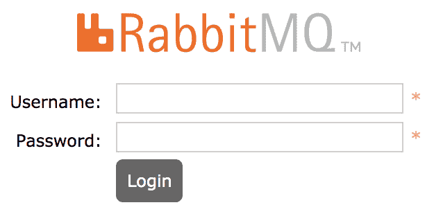

# *第十五章*：Kubernetes 上的有状态工作负载

本章详细介绍了当前在数据库中运行有状态工作负载的行业现状。我们将讨论使用 Kubernetes（以及流行的开源项目）在 Kubernetes 上运行数据库、存储和队列。案例研究教程将包括在 Kubernetes 上运行对象存储、数据库和队列系统。

在本章中，我们将首先了解有状态应用如何在 Kubernetes 上运行，然后学习如何为有状态应用使用 Kubernetes 存储。接下来，我们将学习如何在 Kubernetes 上运行数据库，并讨论消息和队列。我们先从讨论为什么有状态应用比无状态应用在 Kubernetes 上更复杂开始。

本章将涵盖以下主题：

+   理解 Kubernetes 上的有状态应用

+   使用 Kubernetes 存储进行有状态应用

+   在 Kubernetes 上运行数据库

+   在 Kubernetes 上实现消息和队列

# 技术要求

为了运行本章中详细介绍的命令，你需要一台支持 `kubectl` 命令行工具并且有一个工作的 Kubernetes 集群的计算机。请参见*第一章*，*与 Kubernetes 通信*，了解几种快速启动 Kubernetes 的方法，并获得如何安装 kubectl 工具的说明。

本章中使用的代码可以在书籍的 GitHub 仓库中找到：

[`github.com/PacktPublishing/Cloud-Native-with-Kubernetes/tree/master/Chapter15`](https://github.com/PacktPublishing/Cloud-Native-with-Kubernetes/tree/master/Chapter15)

# 理解 Kubernetes 上的有状态应用

Kubernetes 提供了出色的原语来运行无状态和有状态应用，但有状态工作负载在 Kubernetes 上的成熟度要花费更长时间。然而，近年来，一些高调的 Kubernetes 基础的有状态应用框架和项目证明了有状态应用在 Kubernetes 上的逐步成熟。让我们先回顾一下其中的一些，为本章的其他部分奠定基础。

## 流行的 Kubernetes 原生有状态应用

有许多类型的有状态应用。尽管大多数应用是有状态的，但只有其中某些组件存储了*状态*数据。我们可以从应用中剔除这些特定的有状态组件，专注于这些组件进行回顾。在本书中，我们将讨论数据库、队列和对象存储，排除像在*第七章*中回顾的持久存储组件，*Kubernetes 上的存储*。我们还会提到一些较少通用的组件，作为荣誉提名。我们从数据库开始吧！

### Kubernetes 兼容的数据库

除了典型的 **数据库**（**DBs**）和键值存储，如 **Postgres**、**MySQL** 和 **Redis**，这些都可以使用 StatefulSets 或社区操作器在 Kubernetes 上进行部署外，还有一些专为 Kubernetes 设计的重要选项：

+   **CockroachDB**：一种分布式 SQL 数据库，可以无缝地在 Kubernetes 上部署

+   **Vitess**：MySQL 分片协调器，允许 MySQL 的全球可扩展性，也可以通过操作器在 Kubernetes 上安装

+   **YugabyteDB**：一种分布式 SQL 数据库，类似于 **CockroachDB**，也支持类似 Cassandra 的查询

接下来，让我们来看一下 Kubernetes 上的队列和消息传递。

### Kubernetes 上的队列、流处理和消息传递

另外，还有一些行业标准的选项，如 **Kafka** 和 **RabbitMQ**，可以使用社区 Helm charts 和操作器在 Kubernetes 上进行部署，除此之外，还有一些专门制作的开源和闭源选项：

+   **NATS**：开源消息和流处理系统

+   **KubeMQ**：原生 Kubernetes 消息代理

接下来，让我们看看 Kubernetes 上的对象存储。

### Kubernetes 上的对象存储

对象存储从 Kubernetes 中获取基于卷的持久存储，并添加一个对象存储层，类似于（并且在许多情况下兼容）Amazon S3 的 API：

+   **Minio**：与 S3 兼容的对象存储，专为高性能设计。

+   **Open IO**：类似于 *Minio*，具有高性能，支持 S3 和 Swift 存储。

接下来，让我们看一下几项荣誉提名。

### 荣誉提名

除了前面提到的通用组件外，还有一些更专门（但仍然是分类性的）有状态应用程序可以在 Kubernetes 上运行：

+   **密钥和身份管理**：**Vault**、**Keycloak**

+   **容器注册表**：**Harbor**、**Dragonfly**、**Quay**

+   **工作流管理**：**Apache Airflow** 与 Kubernetes 操作器

现在我们已经回顾了一些有状态应用程序的类别，让我们讨论一下这些状态密集型应用程序通常是如何在 Kubernetes 上实现的。

## 理解在 Kubernetes 上运行有状态应用程序的策略

尽管使用 ReplicaSet 或 Deployment 在 Kubernetes 上部署有状态应用程序本身没有问题，但你会发现大多数在 Kubernetes 上运行的有状态应用程序使用的是 StatefulSets。我们在*第四章*《扩展和部署你的应用程序》中讨论过 StatefulSets，但为什么它们对应用程序如此有用呢？我们将在本章中回顾并解答这个问题。

主要原因是 Pod 的身份。许多分布式有状态应用程序有自己的集群机制或共识算法。为了平滑处理这些类型应用程序的过程，StatefulSets 提供了基于序号系统的静态 Pod 命名，从 `0` 到 `n`。结合滚动更新和创建方法，使得应用程序更容易自我集群化，这对于像 CockroachDB 这样的云原生数据库来说非常重要。

为了说明 StatefulSets 如何以及为什么能帮助在 Kubernetes 上运行有状态应用程序，让我们看看如何在 Kubernetes 上使用 StatefulSets 运行 MySQL。

现在，为了明确，在 Kubernetes 上运行单个 MySQL Pod 是非常简单的。我们需要做的就是找到一个 MySQL 容器镜像，并确保它具有正确的配置和 `startup` 命令。

然而，当我们尝试扩展我们的数据库时，就会遇到一些问题。与简单的无状态应用程序不同，在无状态应用程序中，我们可以在不创建新状态的情况下扩展我们的部署，而 MySQL（像许多其他数据库一样）有自己的集群和共识方法。MySQL 集群中的每个成员都知道其他成员，最重要的是，它知道集群中的哪个成员是领导者。这就是像 MySQL 这样的数据库能够提供一致性保证和 **原子性、一致性、隔离性、持久性**（**ACID**）合规性的方式。

因此，由于 MySQL 集群中的每个成员都需要了解其他成员（最重要的是主节点），我们需要以一种方式运行我们的数据库 Pod，使它们能够以一种共同的方式找到并与数据库集群中的其他成员进行通信。

StatefulSets 提供这种功能的方式是，正如我们在本节开始时提到的，通过序号 Pod 编号。通过这种方式，应用程序在 Kubernetes 上运行时，如果需要自我集群化，它们知道会使用从 `0` 到 `n` 的共同命名方案。此外，当特定序号的 Pod 重启时——例如，`mysql-pod-2`——同一个 PersistentVolume 将会挂载到在该序号位置启动的新 Pod 上。这允许在 StatefulSet 中单个 Pod 的重启之间保持状态一致性，这使得应用程序更容易形成稳定的集群。

为了查看这在实践中是如何工作的，让我们看看 MySQL 的 StatefulSet 规范。

### 在 StatefulSets 上运行 MySQL

以下 YAML 规范是根据 Kubernetes 文档版本调整的。它展示了我们如何在 StatefulSets 上运行 MySQL 集群。我们将分别回顾 YAML 规范的每一部分，以便我们能确切理解这些机制如何与 StatefulSet 保证进行交互。

让我们从规范的第一部分开始：

statefulset-mysql.yaml

```
apiVersion: apps/v1
kind: StatefulSet
metadata:
  name: mysql
spec:
  selector:
    matchLabels:
      app: mysql
  serviceName: mysql
  replicas: 3
  template:
    metadata:
      labels:
        app: mysql
```

如你所见，我们将创建一个具有三个 `replicas` 的 MySQL 集群。

这部分内容没有什么其他令人兴奋的地方，所以让我们继续讲解 `initContainers` 的开头。在这个 Pod 中，`initContainers` 和常规容器之间会有相当多的容器在运行，因此我们将分别解释每个容器。接下来是第一个 `initContainer` 实例：

```
    spec:
      initContainers:
      - name: init-mysql
        image: mysql:5.7
        command:
        - bash
        - "-c"
        - |
          set -ex
          [[ `hostname` =~ -([0-9]+)$ ]] || exit 1
          ordinal=${BASH_REMATCH[1]}
          echo [mysqld] > /mnt/conf.d/server-id.cnf
          echo server-id=$((100 + $ordinal)) >> /mnt/conf.d/server-id.cnf
          if [[ $ordinal -eq 0 ]]; then
            cp /mnt/config-map/master.cnf /mnt/conf.d/
          else
            cp /mnt/config-map/slave.cnf /mnt/conf.d/
          fi
        volumeMounts:
        - name: conf
          mountPath: /mnt/conf.d
        - name: config-map
          mountPath: /mnt/config-map
```

如你所见，第一个 `initContainer` 是 MySQL 容器镜像。现在，这并不意味着我们不会在 Pod 中持续运行 MySQL 容器。这种模式在复杂应用中相当常见。有时同一个容器镜像会被用作 `initContainer` 实例和常规运行容器。这是因为该容器包含了正确的嵌入式脚本和工具，能够以编程方式完成常见的设置任务。

在这个例子中，MySQL 的 `initContainer` 创建了一个文件 `/mnt/conf.d/server-id.cnf`，并向文件中添加了一个 `server` ID，值对应于 StatefulSet 中 Pod 的 `ordinal` ID。当写入 `ordinal` ID 时，它会加上 `100` 作为偏移量，以绕过 MySQL 中保留的 `server-id` 值为 `0` 的限制。

然后，根据 Pod 的 `ordinal` D 是否为 `0`，它会将 MySQL 服务器的主节点或从节点配置复制到卷中。

接下来，让我们看一下下一部分中的第二个 `initContainer`（我们省略了一些与卷挂载信息相关的代码以简化内容，但完整代码可以在本书的 GitHub 仓库中找到）：

```
      - name: clone-mysql
        image: gcr.io/google-samples/xtrabackup:1.0
        command:
        - bash
        - "-c"
        - |
          set -ex
          [[ -d /var/lib/mysql/mysql ]] && exit 0
          [[ `hostname` =~ -([0-9]+)$ ]] || exit 1
          ordinal=${BASH_REMATCH[1]}
          [[ $ordinal -eq 0 ]] && exit 0          ncat --recv-only mysql-$(($ordinal-1)).mysql 3307 | xbstream -x -C /var/lib/mysql
          xtrabackup --prepare --target-dir=/var/lib/mysql
```

如你所见，这个 `initContainer` 根本不是 MySQL！相反，容器镜像是一个名为 Xtra Backup 的工具。我们为什么需要这个容器呢？

设想一种情况，一个全新的 Pod，搭配一个全新且空的 PersistentVolume 加入集群。在这种情况下，数据复制进程需要通过复制其他 MySQL 集群成员的数据来填充数据。对于大型数据库，这个过程可能非常缓慢。

因此，我们有一个 `initContainer` 实例，它从 StatefulSet 中的另一个 MySQL Pod 加载数据，这样 MySQL 的数据复制功能就有了起始数据。如果 MySQL Pod 中已经有数据，则不会进行数据加载。`[[ -d /var/lib/mysql/mysql ]] && exit 0` 这一行代码会检查是否已有数据。

一旦这两个 `initContainer` 实例成功完成任务，我们就拥有了第一个 `initContainer` 提供的所有 MySQL 配置，同时也获得了来自 MySQL StatefulSet 中另一个成员的相对较新的数据。

现在，让我们继续讲解 StatefulSet 定义中的实际容器，从 MySQL 本身开始：

```
      containers:
      - name: mysql
        image: mysql:5.7
        env:
        - name: MYSQL_ALLOW_EMPTY_PASSWORD
          value: "1"
        ports:
        - name: mysql
          containerPort: 3306
        volumeMounts:
        - name: data
          mountPath: /var/lib/mysql
          subPath: mysql
        - name: conf
          mountPath: /etc/mysql/conf.d
```

如你所见，这个 MySQL 容器的设置相当基础。除了一个环境变量外，我们还挂载了之前创建的配置文件。这个 Pod 还有一些存活性（liveness）和就绪性（readiness）探针配置——有关这些配置，请查看本书的 GitHub 仓库。

现在，让我们继续查看我们的最后一个容器，这个容器看起来应该很熟悉——它实际上是 Xtra Backup 的另一个实例！让我们看看它是如何配置的：

```
- name: xtrabackup
containerPort: 3307
command:
- bash
- "-c"
- |
set -ex
cd /var/lib/mysql if [[ -f xtrabackup_slave_info && "x$(<xtrabackup_slave_info)" != "x" ]]; thencat xtrabackup_slave_info | sed -E 's/;$//g' > change_master_to.sql.inrm -f xtrabackup_slave_info xtrabackup_binlog_info
elif [[ -f xtrabackup_binlog_info ]]; then[[ `cat xtrabackup_binlog_info` =~ ^(.*?)[[:space:]]+(.*?)$ ]] || exit 1
rm -f xtrabackup_binlog_info xtrabackup_slave_info
echo "CHANGE MASTER TO MASTER_LOG_FILE='${BASH_REMATCH[1]}',\
MASTER_LOG_POS=${BASH_REMATCH[2]}" > change_master_to.sql.in
fi if [[ -f change_master_to.sql.in ]]; then
echo "Waiting for mysqld to be ready (accepting connections)"
until mysql -h 127.0.0.1 -e "SELECT 1"; do sleep 1; done
echo "Initializing replication from clone position"
mysql -h 127.0.0.1 \
-e "$(<change_master_to.sql.in), \
MASTER_HOST='mysql-0.mysql', \
MASTER_USER='root', \
MASTER_PASSWORD='', \
MASTER_CONNECT_RETRY=10; \
START SLAVE;" || exit 1
mv change_master_to.sql.in change_master_to.sql.orig
fi exec ncat --listen --keep-open --send-only --max-conns=1 3307 -c \
"xtrabackup --backup --slave-info --stream=xbstream --host=127.0.0.1 --user=root"
```

这个容器设置有点复杂，所以让我们一节一节地回顾它。

从我们的 `initContainers` 中我们知道，Xtra Backup 会从 StatefulSet 中的其他 Pod 加载数据，以便让该 Pod 为复制过程做准备，以便与 StatefulSet 中的其他成员进行数据复制。

在这种情况下，Xtra Backup 容器实际上是启动复制过程的容器！这个容器首先会检查它所在的 Pod 是否应作为 MySQL 集群中的从属 Pod。如果是，它会启动从主节点的数据复制进程。

最后，Xtra Backup 容器还将在端口 `3307` 上开启一个监听器，若有请求，它会发送 Pod 中数据的克隆。这是当 StatefulSet 中的其他 Pod 请求克隆时，发送克隆数据的设置。记住，第一个 `initContainer` 会查看 StatefulSet 中的其他 Pod，以获取克隆数据。最终，StatefulSet 中的每个 Pod 都能够请求克隆数据，并且能够运行一个进程，向其他 Pod 发送数据克隆。

最后，为了结束我们的配置，来看看 `volumeClaimTemplate` 部分。这个部分也列出了前一个容器的卷挂载和 Pod 的卷设置（但我们为了简洁省略了这些内容。有关其余部分，请查看本书的 GitHub 仓库）：

```
  volumeClaimTemplates:
  - metadata:
      name: data
    spec:
      accessModes: ["ReadWriteOnce"]
      resources:
        requests:
          storage: 10Gi
```

如你所见，最后一个容器的卷设置或卷列表并没有什么特别的地方。然而，值得注意的是 `volumeClaimTemplates` 部分，因为只要 Pod 在相同的序列位置重新启动，数据就会保持不变。一个新添加到集群中的 Pod 将会从一个空的 PersistentVolume 开始，这将触发初始数据克隆。

总的来说，StatefulSets 的这些特性，结合 Pod 和工具的正确配置，使得在 Kubernetes 上轻松扩展有状态数据库成为可能。

既然我们已经讨论了为什么有状态的 Kubernetes 应用可能会使用 StatefulSets，那么让我们开始实现一些示例来验证这一点！我们将从一个对象存储应用开始。

# 在 Kubernetes 上部署对象存储

对象存储与文件系统或块存储不同。它提供了更高层次的抽象，封装了一个文件，赋予它一个标识符，并通常包括版本控制。然后可以通过其特定的标识符访问该文件。

最流行的对象存储服务可能是 AWS S3，但 Azure Blob Storage 和 Google Cloud Storage 是类似的替代方案。此外，还有几种可以在 Kubernetes 上运行的自托管对象存储技术，我们在前一部分中已有讨论。

在本书中，我们将审查在 Kubernetes 上配置和使用**Minio**。Minio 是一个高性能的对象存储引擎，可以部署在 Kubernetes 上，此外也支持其他编排技术，如**Docker Swarm** 和 **Docker Compose**。

Minio 支持使用 Operator 和 Helm chart 在 Kubernetes 上部署。在本书中，我们将重点讲解 Operator，但有关 Helm chart 的更多信息，请查看 Minio 文档 [`docs.min.io/docs`](https://docs.min.io/docs)。让我们从 Minio Operator 开始，这样我们就可以查看一些很酷的社区扩展功能，增强 kubectl 的功能。

## 安装 Minio Operator

安装 Minio Operator 与我们之前做的任何操作都大不相同。Minio 实际上提供了一个 `kubectl` 插件，用于管理 Operator 和 Minio 的安装与配置。

在本书中，我们没有详细讨论 `kubectl` 插件，但它们是 Kubernetes 生态系统中一个不断增长的部分。`kubectl` 插件可以通过新命令提供额外的功能。

为了安装 `minio` kubectl 插件，我们使用 Krew，Krew 是一个 `kubectl` 插件管理工具，它可以轻松地搜索和添加 `kubectl` 插件，只需一条命令。

## 安装 Krew 和 Minio kubectl 插件

首先，让我们安装 Krew。安装过程根据操作系统和环境的不同而有所不同，但对于 macOS，安装过程如下所示（有关更多信息，请查看 Krew 文档 [`krew.sigs.k8s.io/docs`](https://krew.sigs.k8s.io/docs)）：

1.  首先，让我们通过以下终端命令安装 Krew CLI 工具：

    ```
    (
      set -x; cd "$(mktemp -d)" &&
      curl -fsSLO "https://github.com/kubernetes-sigs/krew/releases/latest/download/krew.tar.gz" &&
      tar zxvf krew.tar.gz &&
      KREW=./krew-"$(uname | tr '[:upper:]' '[:lower:]')_$(uname -m | sed -e 's/x86_64/amd64/' -e 's/arm.*$/arm/')" &&
      "$KREW" install krew
    )
    ```

1.  现在，我们可以使用以下命令将 Krew 添加到我们的 `PATH` 环境变量中：

    ```
    kubectl krew commands.
    ```

1.  要安装 Minio kubectl 插件，可以运行以下 `krew` 命令：

    ```
    kubectl krew install minio
    ```

现在，安装了 Minio kubectl 插件后，让我们看看如何在集群上设置 Minio。

## 启动 Minio Operator

首先，我们需要在集群上安装 Minio Operator。这个部署将控制我们稍后需要执行的所有 Minio 任务：

1.  我们可以使用以下命令安装 Minio Operator：

    ```
    kubectl minio init
    ```

    这将产生以下输出：

    ```
    CustomResourceDefinition tenants.minio.min.io: created
    ClusterRole minio-operator-role: created
    ServiceAccount minio-operator: created
    ClusterRoleBinding minio-operator-binding: created
    MinIO Operator Deployment minio-operator: created
    ```

1.  为了检查 Minio Operator 是否已准备好，使用以下命令检查我们的 Pods：

    ```
    kubectl get pods
    ```

你应该在输出中看到 Minio Operator Pod 正在运行：

```
NAMESPACE     NAME                               READY   STATUS    RESTARTS   AGE
default       minio-operator-85ccdcfb6-r8g8b     1/1     Running   0          5m37s
```

现在我们已经在 Kubernetes 上正确运行了 Minio Operator。接下来，我们可以创建一个 Minio 租户。

## 创建一个 Minio 租户

下一步是创建一个**租户**。由于 Minio 是一个多租户系统，每个租户都有自己独立的命名空间，用于存储桶和对象的隔离，以及独立的 PersistentVolumes。此外，Minio Operator 会以分布式模式启动 Minio，确保高可用性和数据复制。

在创建 Minio 租户之前，我们需要为 Minio 安装一个 **容器存储接口**（**CSI**）驱动程序。CSI 是一种标准化的方式，用于在存储提供商和容器之间进行接口——而 Kubernetes 实现了 CSI，允许第三方存储提供商为 Kubernetes 编写自己的驱动程序，以实现无缝集成。Minio 推荐使用 Direct CSI 驱动程序来管理 Minio 的 PersistentVolumes。

要安装 Direct CSI 驱动程序，我们需要使用 Kustomize 执行 `kubectl apply` 命令。然而，安装 Direct CSI 驱动程序时需要设置一些环境变量，以便使用正确的配置创建 Direct CSI 配置，如下所示：

1.  首先，让我们根据 Minio 的建议创建这个环境文件：

    ```
    DIRECT_CSI_DRIVES=data{1...4}
    DIRECT_CSI_DRIVES_DIR=/mnt
    KUBELET_DIR_PATH=/var/lib/kubelet
    ```

    如您所见，环境文件决定了 Direct CSI 驱动程序将在哪里挂载卷。

1.  一旦我们创建了 `default.env`，让我们使用以下命令将这些变量加载到内存中：

    ```
    export $(cat default.env)
    ```

1.  最后，让我们使用以下命令安装 Direct CSI 驱动程序：

    ```
    kubectl apply -k github.com/minio/direct-csi
    ```

    这应该会产生如下输出：

    ```
    kubenamespace/direct-csi created
    storageclass.storage.k8s.io/direct.csi.min.io created
    serviceaccount/direct-csi-min-io created
    clusterrole.rbac.authorization.k8s.io/direct-csi-min-io created
    clusterrolebinding.rbac.authorization.k8s.io/direct-csi-min-io created
    configmap/direct-csi-config created
    secret/direct-csi-min-io created
    service/direct-csi-min-io created
    deployment.apps/direct-csi-controller-min-io created
    daemonset.apps/direct-csi-min-io created
    csidriver.storage.k8s.io/direct.csi.min.io created
    ```

1.  在创建 Minio 租户之前，让我们检查一下 CSI Pods 是否已经正确启动。运行以下命令进行检查：

    ```
    kubectl get pods –n direct-csi
    ```

    如果 CSI Pods 启动了，您应该会看到类似以下的输出：

    ```
    NAME                                          READY   STATUS    RESTARTS   AGE
    direct-csi-controller-min-io-cd598c4b-hn9ww   2/2     Running   0          9m
    direct-csi-controller-min-io-cd598c4b-knvbn   2/2     Running   0          9m
    direct-csi-controller-min-io-cd598c4b-tth6q   2/2     Running   0          9m
    direct-csi-min-io-4qlt7                       3/3     Running   0          9m
    direct-csi-min-io-kt7bw                       3/3     Running   0          9m
    direct-csi-min-io-vzdkv                       3/3     Running   0          9m
    ```

1.  现在，我们的 CSI 驱动程序已经安装完成，接下来让我们创建 Minio 租户——但首先，让我们看看 `kubectl minio tenant create` 命令生成的 YAML 文件：

    ```
    Tenant Tenant CRD. This first part of our spec has two containers specified, a container for the Minio console and one for the Minio server itself. In addition, the replicas value mirrors what we specified in our kubectl minio tenant create command. Finally, it specifies the name of a secret for the Minio console.Next, let's look at the bottom portion of the Tenant CRD:

    ```

    liveness:

    initialDelaySeconds: 10

    periodSeconds: 1

    timeoutSeconds: 1

    mountPath: /export

    requestAutoCert: true

    zones:

    - resources: {}

    servers: 2

    volumeClaimTemplate:

    apiVersion: v1

    kind: persistentvolumeclaims

    metadata:

    creationTimestamp: null

    spec:

    accessModes:

    - ReadWriteOnce

    resources:

    requests:

    storage: 256Mi

    status: {}

    volumesPerServer: 2

    status:

    availableReplicas: 0

    currentState: ""

    ```

    As you can see, the `Tenant` resource specifies a number of servers (also specified by the `creation` command) that matches the number of replicas. It also specifies the name of the internal Minio Service, as well as a `volumeClaimTemplate` instance to be used.This spec, however, does not work for our purposes, since we are using the Direct CSI. Let's update the `zones` key with a new `volumeClaimTemplate` that uses the Direct CSI, as follows (save this file as `my-updated-minio-tenant.yaml`). Here's just the `zones` portion of that file, which we updated: 

    ```

    zones:

    - resources: {}

    servers: 2

    volumeClaimTemplate:

    metadata:

    name: data

    spec:

    accessModes:

    - ReadWriteOnce

    resources:

    requests:

    storage: 256Mi

    storageClassName: direct.csi.min.io

    ```

    ```

1.  现在，让我们继续创建我们的 Minio 租户！我们可以使用以下命令完成此操作：

    ```
    kubectl apply -f my-updated-minio-tenant.yaml
    ```

这应该会产生如下输出：

```
tenant.minio.min.io/my-tenant created
secret/my-tenant-creds-secret created
secret/my-tenant-console-secret created
```

此时，Minio Operator 将开始为我们的新 Minio 租户创建所需的资源，几分钟后，您应该会看到一些 Pods 启动，除了操作员外，显示的内容应该类似于以下内容：


图 15.1 – Minio Pods 输出

现在我们的 Minio 租户已经完全启动并运行了！接下来，让我们看看 Minio 控制台，了解一下我们的租户状况。

## 访问 Minio 控制台

首先，为了获取控制台的登录信息，我们需要提取两个密钥的内容，这些密钥保存在自动生成的 `<TENANT NAME>-console-secret` 密钥中。

要获取控制台的 `access` 密钥和 `secret` 密钥（在我们的例子中将自动生成），我们使用以下两个命令。在我们的例子中，我们使用 `my-tenant` 租户来获取 `access` 密钥：

```
echo $(kubectl get secret my-tenant-console-secret -o=jsonpath='{.data.CONSOLE_ACCESS_KEY}' | base64 --decode)
```

获取 `secret` 密钥时，我们使用以下命令：

```
echo $(kubectl get secret my-tenant-console-secret -o=jsonpath='{.data.CONSOLE_SECRET_KEY}' | base64 --decode)
```

现在，我们的 Minio 控制台将在服务 `<TENANT NAME>-console` 上可用。

让我们通过 `port-forward` 命令访问这个控制台。在我们的情况下，命令如下：

```
kubectl port-forward service/my-tenant-console 8081:9443
```

然后，我们的 Minio 控制台将在浏览器中的 `https://localhost:8081` 可用。由于在此示例中我们没有为 localhost 设置控制台的 TLS 证书，你将需要接受浏览器的安全警告。输入从前面的步骤中获取的 `access` 密钥和 `secret` 密钥进行登录！

现在我们已登录到控制台，可以开始向我们的 Minio 租户添加内容。首先，创建一个桶。为此，点击左侧边栏中的 **Buckets**，然后点击 **Create Bucket** 按钮。

在弹出的窗口中，输入桶的名称（在我们的例子中，我们将使用 `my-bucket`）并提交表单。你应该会看到列表中的一个新桶 – 请参考以下截图作为示例：


图 15.2 – 桶

我们现在已经准备好分布式 Minio 设置，并且已经有了一个桶可以上传。让我们通过上传一个文件到全新的对象存储系统来完成这个示例！

我们将使用 Minio CLI 进行上传，这使得与 S3 兼容的存储（如 Minio）交互的过程变得更加简单。我们将不使用本地机器上的 Minio CLI，而是在 Kubernetes 内运行一个预加载了 Minio CLI 的容器镜像，因为 TLS 设置仅在集群内访问 Minio 时有效。

首先，我们需要获取 Minio 的 `access` 密钥和 `secret`，这与之前获取的控制台 `access` 密钥和 `secret` 不同。要获取这些密钥，请运行以下控制台命令（在我们的例子中，租户是 `my-tenant`）。首先，获取 `access` 密钥：

```
echo $(kubectl get secret my-tenant-creds-secret -o=jsonpath='{.data.accesskey}' | base64 --decode)
```

然后，获取 `secret` 密钥：

```
echo $(kubectl get secret my-tenant-creds-secret -o=jsonpath='{.data.secretkey}' | base64 --decode)
```

现在，让我们启动这个 Pod 并使用 Minio CLI。为此，使用以下 Pod 配置：

minio-mc-pod.yaml

```
apiVersion: v1
kind: Pod
metadata:
  name: minio-mc
spec:
  containers:
  - name: mc
    image: minio/mc
    command: ["/bin/sh", "-c", "sleep 10000000s"]
  restartPolicy: OnFailure
```

使用以下命令创建这个 Pod：

```
kubectl apply -f minio-mc-pod.yaml
```

然后，要 `exec` 进入这个 `minio-mc` Pod，我们运行通常的 `exec` 命令：

```
Kubectl exec -it minio-mc -- sh
```

现在，让我们在 Minio CLI 中配置新创建的 Minio 分布式集群的访问权限。我们可以使用以下命令来实现这一点（此配置需要 `--insecure` 标志）：

```
mc config host add my-minio https://<MINIO TENANT POD IP>:9000 --insecure
```

该命令的 Pod IP 可以是我们任一租户 Minio Pod 的 IP – 在我们的例子中，它们是 `my-tenant-zone-0-0` 和 `my-tenant-zone-0-1`。运行此命令后，系统会提示你输入访问密钥和密钥。输入后，如果成功，你将看到一个确认消息，格式如下：

```
Added `my-minio` successfully.
```

现在，为了测试 CLI 配置是否正常工作，我们可以使用以下命令创建另一个测试桶：

```
mc mb my-minio/my-bucket-2 --insecure
```

这应该会产生以下输出：

```
Bucket created successfully `my-minio/my-bucket-2`.
```

作为设置的最终测试，让我们上传一个文件到我们的 Minio 桶！

首先，在`minio-mc` Pod 上创建一个名为`test.txt`的文本文件。将你想要的任何文本填入该文件。

现在，让我们用以下命令将其上传到我们刚创建的存储桶：

```
mc mv test.txt my-minio/my-bucket-2 --insecure
```

你应该看到一个上传的加载条，最终显示上传的整个文件大小。

最后，检查一下，进入 Minio 控制台的**Dashboard**页面，查看该对象是否显示出来，如下图所示：


图 15.3 – Dashboard

如你所见，我们的文件已成功上传！

这就是关于 Minio 的全部内容——关于配置的内容还有很多，但超出了本书的范围。有关更多信息，请参考文档：[`docs.min.io/`](https://docs.min.io/)。

接下来，让我们来看看如何在 Kubernetes 上运行数据库。

# 在 Kubernetes 上运行数据库

现在我们已经了解了 Kubernetes 上的对象存储工作负载，接下来可以讨论数据库。正如我们在本章以及书中其他地方提到的，许多数据库都支持在 Kubernetes 上运行，成熟度不一。

首先，有几种传统的和现有的数据库引擎支持部署到 Kubernetes。这些引擎通常已经有支持的 Helm 图表或运维工具。例如，像 PostgreSQL 和 MySQL 这样的 SQL 数据库就有由不同组织支持的 Helm 图表和运维工具。像 MongoDB 这样的 NoSQL 数据库也有支持的部署到 Kubernetes 的方式。

除了这些已经存在的数据库引擎外，像 Kubernetes 这样的容器编排器促成了一个新类别的出现——**NewSQL**数据库。

这些数据库不仅提供了 NoSQL 数据库的惊人可扩展性，还支持 SQL 兼容的 API。它们可以被视为在 Kubernetes（以及其他编排器）上轻松扩展 SQL 的一种方式。CockroachDB 是一个流行的选择，**Vitess**也是一个不错的选择，它并非完全替代 NewSQL 数据库，而是为 MySQL 引擎提供了一种简单的扩展方式。

在本章中，我们将重点介绍部署 CockroachDB，这是一款为分布式环境设计的现代化 NewSQL 数据库，非常适合 Kubernetes。

## 在 Kubernetes 上运行 CockroachDB

为了在我们的集群上运行 CockroachDB，我们将使用官方的 CockroachDB Helm 图表：

1.  我们需要做的第一件事是添加 CockroachDB Helm 图表仓库，使用以下命令：

    ```
    helm repo add cockroachdb https://charts.cockroachdb.com/
    ```

    这应该会产生以下输出：

    ```
    "cockroachdb" has been added to your repositories
    ```

1.  在安装图表之前，让我们创建一个自定义的`values.yaml`文件，以调整 CockroachDB 的一些默认设置。我们的文件在本演示中如下所示：

    ```
    storage:
      persistentVolume:
        size: 2Gi
    statefulset:
      resources:
        limits:
          memory: "1Gi"
        requests:
          memory: "1Gi"
    conf:
      cache: "256Mi"
      max-sql-memory: "256Mi"
    ```

    如你所见，我们指定了`2` GB 的持久卷大小，`1` GB 的 Pod 内存限制和请求，以及 CockroachDB 的配置文件内容。该配置文件包括`cache`和最大`memory`的设置，分别设置为内存限制的 25%（`256` MB）。这个比例是 CockroachDB 的最佳实践。请记住，这些设置并不完全适用于生产环境，但它们适用于我们的演示。

1.  此时，让我们使用以下 Helm 命令创建我们的 CockroachDB 集群：

    ```
    helm install cdb --values cockroach-db-values.yaml cockroachdb/cockroachdb
    ```

    如果成功，你将看到来自 Helm 的长时间部署信息，我们不会在这里重复。让我们通过以下命令检查集群上到底部署了什么：

    ```
    kubectl get po 
    ```

    你将看到类似以下的输出：

    ```
    NAMESPACE     NAME                                          READY   STATUS      RESTARTS   AGE
    default       cdb-cockroachdb-0                             0/1     Running     0          57s
    default       cdb-cockroachdb-1                             0/1     Running     0          56s
    default       cdb-cockroachdb-2                             1/1     Running     0          56s
    default       cdb-cockroachdb-init-8p2s2                    0/1     Completed   0          57s
    ```

    如你所见，除了用于一些初始化任务的设置 Pod 外，我们还有三个 Pod 在 StatefulSet 中。

1.  为了检查我们的集群是否正常工作，我们可以使用 CockroachDB Helm 图表输出中便捷给出的命令（具体命令会根据你的 Helm 发布名称有所不同）：

    ```
    kubectl run -it --rm cockroach-client \
            --image=cockroachdb/cockroach \
            --restart=Never \
            --command -- \
            ./cockroach sql --insecure --host=cdb-cockroachdb-public.default
    ```

如果成功，将打开一个控制台，显示类似以下的提示：

```
root@cdb-cockroachdb-public.default:26257/defaultdb>
```

在下一部分，我们将使用 SQL 测试 CockroachDB。

## 使用 SQL 测试 CockroachDB

现在，我们可以向新的 CockroachDB 数据库运行 SQL 命令了！

1.  首先，使用以下命令创建一个数据库：

    ```
    CREATE DATABASE mydb;
    ```

1.  接下来，让我们创建一个简单的表：

    ```
    CREATE TABLE mydb.users (
        id UUID PRIMARY KEY DEFAULT gen_random_uuid(),
        first_name STRING,
        last_name STRING,
        email STRING
     );
    ```

1.  然后，使用以下命令添加一些数据：

    ```
    INSERT INTO mydb.users (first_name, last_name, email)
      VALUES
          ('John', 'Smith', 'jsmith@fake.com');
    ```

1.  最后，让我们使用以下内容来确认数据：

    ```
    SELECT * FROM mydb.users;
    ```

你应该看到以下输出：

```
                  id                  | first_name | last_name |      email
---------------------------------------+------------+-----------+------------------
  e6fa342f-8fe5-47ad-adde-e543833ffd28 | John       | Smith     | jsmith@fake.com
(1 row)
```

成功！

如你所见，我们有一个完全功能的分布式 SQL 数据库。让我们继续查看我们将要评审的最后一种有状态工作负载类型：消息传递。

# 在 Kubernetes 上实现消息传递和队列

对于消息传递，我们将实现 RabbitMQ，一个支持 Kubernetes 的开源消息队列系统。消息传递系统通常用于应用程序中，以解耦应用程序的各个组件，以支持规模和吞吐量，以及异步模式，如重试和服务工作者队列。例如，一个服务在调用另一个服务时，可能不会直接调用，而是将消息放入持久化的消息队列中，随后由一个监听该队列的工作容器取出处理。这种方式相比负载均衡方法，更容易进行横向扩展，并能容忍整个组件的停机。

RabbitMQ 是众多消息队列选项之一。正如我们在本章的第一部分提到的，RabbitMQ 是一个行业标准的消息队列选项，虽然它并不是专为 Kubernetes 构建的队列系统，但它仍然是一个很好的选择，而且非常容易部署，正如我们稍后将看到的那样。

让我们从在 Kubernetes 上实现 RabbitMQ 开始！

## 在 Kubernetes 上部署 RabbitMQ

在 Kubernetes 上安装 RabbitMQ 可以通过操作员或 Helm 图表轻松完成。为了本教程的目的，我们将使用 Helm 图表：

1.  首先，让我们添加正确的 `helm` 仓库（由**Bitnami**提供）：

    ```
    helm repo add bitnami https://charts.bitnami.com/bitnami
    ```

1.  接下来，让我们创建一个自定义的值文件，以调整一些参数：

    ```
    auth:
      user: user
      password: test123
    persistence:
      enabled: false
    ```

    如你所见，在这种情况下，我们禁用了持久化，这对于快速演示非常合适。

1.  然后，可以使用以下命令轻松地在集群中安装 RabbitMQ：

    ```
    helm install rabbitmq bitnami/rabbitmq --values values-rabbitmq.yaml
    ```

    一旦成功，你将看到来自 Helm 的确认消息。RabbitMQ Helm 图表还包含一个管理 UI，所以我们使用这个 UI 来验证我们的安装是否成功。

1.  首先，让我们为 `rabbitmq` 服务启动端口转发：

    ```
    http://localhost:15672. It will look like the following:Figure 15.4 – RabbitMQ management console login
    ```

1.  现在，我们应该能够使用在值文件中指定的用户名和密码登录仪表盘。登录后，你将看到 RabbitMQ 仪表盘的主视图。

    重要的是，你将看到你的 RabbitMQ 集群中的节点列表。在我们的案例中，我们只有一个单节点，显示如下：

    

    图 15.5 – RabbitMQ 管理控制台节点项

    对于每个节点，你可以看到其名称以及一些元数据，包括内存、运行时间等。

1.  为了添加一个新队列，导航到顶部栏的**队列**，点击屏幕底部的**添加新队列**。按照以下方式填写表单，然后点击**添加队列**：

    图 15.6 – RabbitMQ 管理控制台队列创建

    如果成功，屏幕应该会刷新，并且你会看到新队列已添加到列表中。这意味着我们的 RabbitMQ 设置正常工作！

1.  最后，既然我们已经有了一个队列，我们可以向其中发布消息。为此，点击你刚创建的队列，进入**队列**页面，然后点击**发布消息**。

1.  在**有效负载**文本框中输入任何文本，然后点击**发布消息**。你应该会看到一个确认弹窗，告诉你消息已经成功发布，屏幕应该会刷新，显示队列中的消息，如下图所示：

    图 15.7 – RabbitMQ 管理控制台队列状态

1.  最后，为了模拟从队列中获取消息，点击页面底部附近的**获取消息**，此时会展开显示一个新区域，然后点击**获取消息**按钮。你应该能看到你发送的消息输出，证明队列系统正常工作！

# 总结

在本章中，我们了解了如何在 Kubernetes 上运行有状态工作负载。首先，我们回顾了几种有状态工作负载的高层次概述，并给出了每种类型的一些示例。接着，我们实际部署了其中一种工作负载——对象存储系统——到 Kubernetes 上。然后，我们做了同样的操作，部署了一个 NewSQL 数据库 CockroachDB，向你展示了如何轻松地在 Kubernetes 上部署一个 CockroachDB 集群。

最后，我们向你展示了如何使用 Helm 图表在 Kubernetes 上部署 RabbitMQ 消息队列。你在本章中使用的技巧将帮助你在 Kubernetes 上部署和使用流行的有状态应用模式。

如果你已经读到这里，感谢你陪伴我们走过本书的 15 章！我希望你已经学会如何使用 Kubernetes 的广泛功能，并且现在你拥有了构建和部署复杂应用所需的所有工具。

# 问题

1.  Minio 的 API 与哪个云存储服务兼容？

1.  StatefulSet 对分布式数据库有哪些好处？

1.  用你自己的话来说，是什么让有状态应用在 Kubernetes 上运行变得困难？

# 进一步阅读

+   Minio 快速入门文档：[`docs.min.io/docs/minio-quickstart-guide.html`](https://docs.min.io/docs/minio-quickstart-guide.html)

+   CockroachDB Kubernetes 指南：[`www.cockroachlabs.com/docs/v20.2/orchestrate-a-local-cluster-with-kubernetes`](https://www.cockroachlabs.com/docs/v20.2/orchestrate-a-local-cluster-with-kubernetes)
