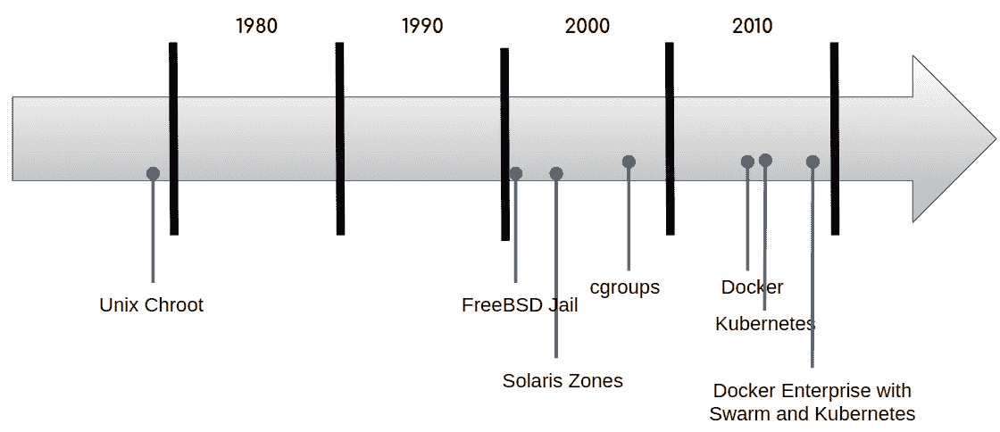
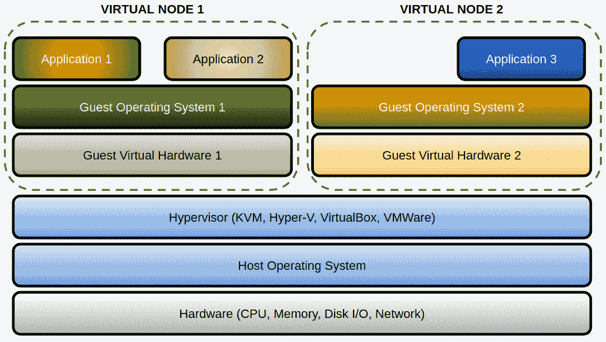
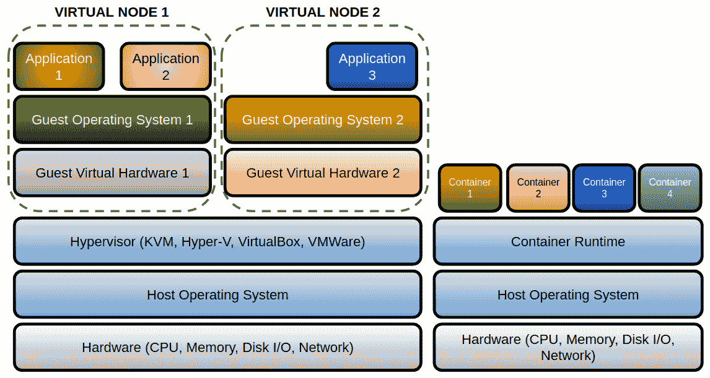
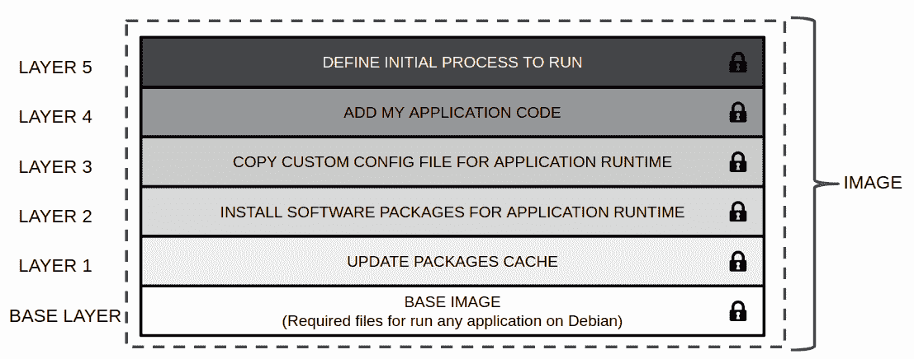
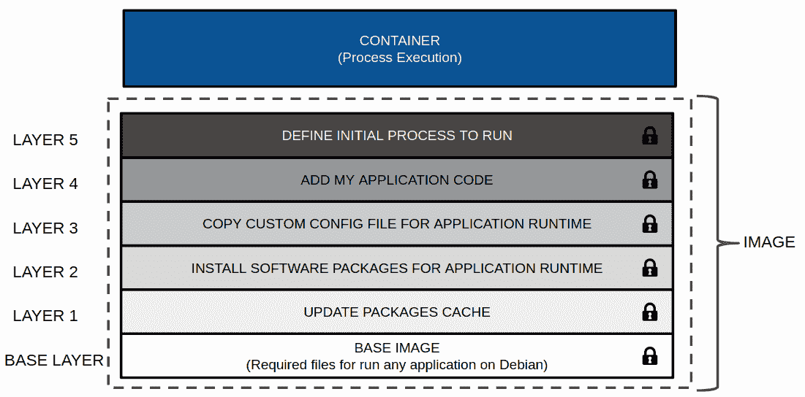
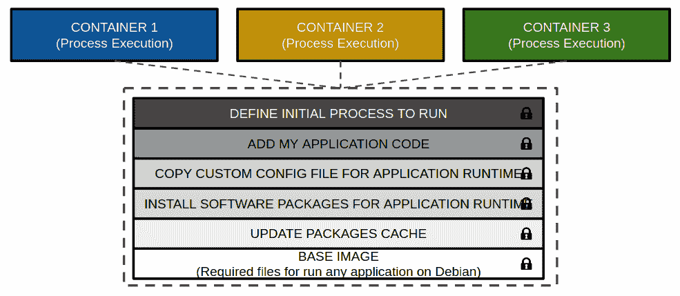
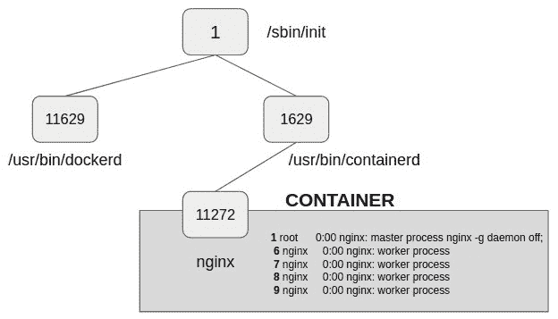
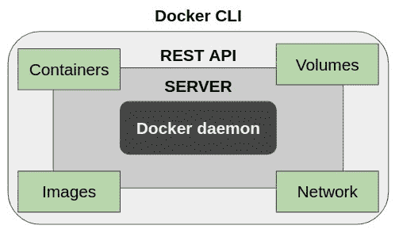
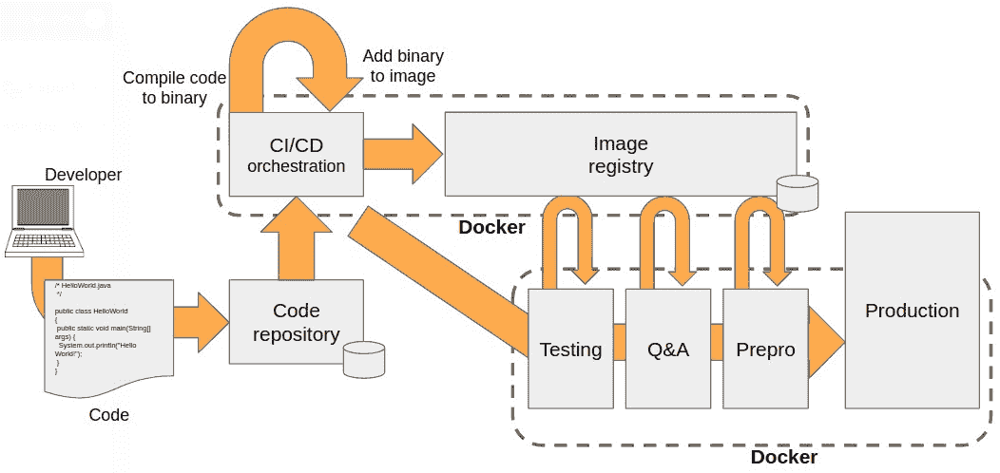
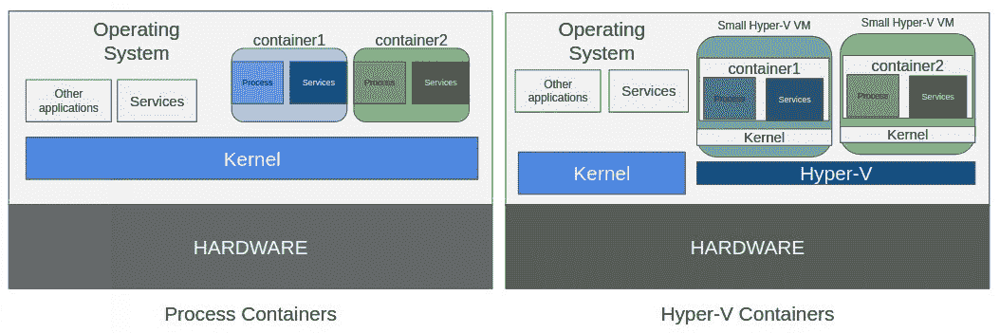

使用 Docker 的现代基础设施和应用程序

微服务和容器可能是近年来最常被提及的流行词汇。如今，我们仍然可以在全球各地的会议上听到关于它们的讨论。虽然这两个术语在谈论现代应用时肯定相关，但它们并不相同。事实上，我们可以在没有容器的情况下执行微服务，也可以在容器中运行大型单体应用程序。在容器的世界中，当我们谈论容器时，一个广为人知的词汇浮现在脑海中——Docker。

本书是一本关于通过 Docker 认证助理考试的指南，这项考试是对与该技术相关的知识的认证。我们将涵盖通过该考试所需的每个主题。本章将从什么是微服务以及它们在现代应用程序中的重要性开始。我们还将讲解 Docker 如何管理该应用程序的逻辑组件的需求。

本章将引导你了解 Docker 的主要概念，并为你提供一个基本的理解，帮助你掌握管理容器所需的工具和资源。

本章我们将涵盖以下主题：

+   理解应用程序的演变

+   基础设施

+   进程

+   微服务与进程

+   什么是容器？

+   学习容器的主要概念

+   Docker 组件

+   构建、运输和运行工作流程

+   Windows 容器

+   自定义 Docker

+   Docker 安全

让我们开始吧！

# 第三章：技术要求

本章我们将学习各种 Docker 引擎的概念。我们将在本章末尾提供一些实验室，这些实验室将帮助你理解和学习所展示的概念。这些实验室可以在你的笔记本电脑或 PC 上运行，使用提供的 Vagrant 独立环境或你拥有的任何已部署的 Docker 主机。你可以在本书的 GitHub 仓库中找到更多信息：[`github.com/PacktPublishing/Docker-Certified-Associate-DCA-Exam-Guide.git`](https://github.com/PacktPublishing/Docker-Certified-Associate-DCA-Exam-Guide.git)

请查看以下视频，了解实际中的代码：

"[`bit.ly/3jikiSl`](https://bit.ly/3jikiSl)"

# 理解应用程序的演变

正如我们可能在每个 IT 媒体中看到的，微服务的概念是现代应用开发的关键。让我们稍微回顾一下，看看多年来应用程序是如何发展的。

单体应用是指将所有组件组合成一个通常在单个平台上运行的单一程序的应用程序。这些应用程序在设计时并未考虑可重用性，也没有考虑模块化。这意味着每次它们的代码需要更新时，所有应用程序都必须参与这个过程；例如，必须重新编译所有应用程序代码才能使其正常工作。当然，那时的要求并不那么严格。

应用程序在任务和功能方面的数量不断增加，其中一些任务被分配到其他系统甚至更小的应用程序中。然而，核心组件保持不变。我们使用这种编程模型，因为将所有应用组件放在同一主机上运行比从其他主机上查找所需信息更好。然而，网络速度在这方面不足。这些应用程序难以扩展，且难以升级。实际上，某些应用程序被锁定在特定的硬件和操作系统上，这意味着开发人员在开发阶段需要使用相同的硬件架构才能演化应用程序。

我们将在下一节讨论与这些单体应用相关的基础设施。以下图表展示了任务或功能的解耦是如何从单体应用程序发展到**简单对象访问协议**（**SOAP**）应用程序，并最终演变成微服务的新范式：


为了实现更好的应用性能和解耦组件，我们转向了三层架构，基于表现层、应用层和数据层。这使得不同类型的管理员和开发人员可以参与到应用更新和升级中。每一层都可以在不同的主机上运行，但组件只会在同一应用内部进行通信。

这一模型现在仍然存在于我们的数据中心中，在到达数据库之前将前端与应用后端分离，数据库中存储着所有必需的数据。这些组件发展成提供可扩展性、高可用性和管理功能的系统。偶尔，我们需要加入新的中间件组件来实现这些功能（从而增加了最终的方程式；例如，应用服务器、分布式事务应用程序、排队和负载均衡器）。更新和升级变得更容易，我们通过隔离组件来专注于不同的应用功能。

随着虚拟机在数据中心的出现，这一模型得到了扩展，并变得更好。我们将在下一节中更详细地讨论虚拟机如何改进该模型的应用。

随着 Linux 系统的普及，不同组件之间的交互，最终是不同应用之间的交互，已经成为了一项必要的要求。SOAP 和其他排队消息集成技术帮助应用程序和组件交换信息，而我们数据中心的网络改进使我们能够开始将这些元素分布到不同的节点，甚至不同的地点。

微服务是将应用程序组件解耦为更小单元的一步。我们通常将微服务定义为一个小的业务功能单元，能够独立开发和部署。按照这个定义，应用程序将由许多微服务组成。微服务在主机资源使用方面非常轻量，这使得它们可以非常快速地启动和停止。同时，它还允许我们将应用程序的健康状态从高可用性概念转向弹性，即使进程崩溃（这可能是由问题或仅仅是组件代码更新引起的），我们也能尽快启动一个新的进程，以保持主要功能的健康。

微服务架构考虑的是无状态设计。这意味着微服务的状态应该在其自身逻辑之外进行管理，因为我们需要能够为我们的微服务运行多个副本（向上或向下扩展），并根据我们的全球负载要求（例如）在环境中的所有节点上运行其内容。我们将功能与基础设施解耦（我们将在下一章中看到这个“随处运行”概念可以走多远）。

微服务提供以下特性：

+   将应用程序分成多个部分进行管理，使我们能够用更新版本甚至完全新的功能替代一个组件，而不会丢失应用程序功能。

+   开发人员可以专注于某个特定的应用功能或特性，只需要知道如何与其他类似的部分交互。

+   微服务之间的交互通常通过标准的 HTTP/HTTPS API **表述性状态转移**（**REST**）调用实现。RESTful 系统的目标是提高性能、可靠性以及可扩展性。

+   微服务是准备拥有独立生命周期的组件。这意味着一个不健康的组件不会完全影响应用程序的使用。我们将为每个组件提供弹性，并且应用程序不会发生完全的故障。

+   每个微服务可以用不同的编程语言编写，这使我们能够选择最适合的语言，以获得最佳性能和可移植性。

现在我们简要回顾了多年来发展起来的著名应用架构，接下来让我们看看现代应用程序的概念。

现代应用程序具有以下特点：

+   这些组件将基于微服务。

+   应用程序组件的健康状态将基于弹性。

+   组件的状态将由外部管理。

+   它将随处运行。

+   它将为组件的轻松更新做好准备。

+   每个应用程序组件将能够独立运行，但会提供一种与其他组件交互的方式。

让我们一起来看看。

# 基础设施

对于开发人员为其应用程序使用的每个描述的应用模型，我们需要提供一些协调一致的基础设施架构。

在单体应用中，正如我们所看到的，所有应用功能都是一起运行的。在某些情况下，应用是为特定的架构、操作系统、库、二进制版本等构建的。这意味着我们至少需要一个硬件节点用于生产环境，并且需要相同的节点架构，最终还需要相同的资源来进行开发。如果将先前的环境（例如认证或预生产环境，用于性能测试）添加到这个方程中，每个应用所需的节点数量在物理空间、资源和应用所花费的资金上都会变得非常重要。

对于每次应用发布，开发人员通常需要一个完整的生产环境，意味着只有配置在不同的环境之间会有所不同。这很困难，因为每当操作系统的组件或功能更新时，必须将这些更改复制到所有应用环境中。虽然有许多工具可以帮助我们完成这些任务，但这并不容易，而几乎完全复制的环境所带来的成本也是一个需要关注的问题。另一方面，节点的提供可能需要数月时间，因为在许多情况下，一个新的应用发布意味着必须购买新的硬件。

第三层应用通常会部署在旧的基础设施上，使用应用服务器来允许应用管理员在可能的情况下扩展组件，并优先考虑某些组件。

在我们的数据中心使用虚拟机后，我们能够在虚拟节点之间分配主机硬件资源。这在节点提供时间、维护成本和许可费用方面是一场革命。虚拟机在单体应用和第三层应用上表现得非常好，但应用性能取决于应用于虚拟节点的主机共享资源。将应用组件部署在不同的虚拟节点上是一个常见的用例，因为它使我们能够几乎在任何地方运行这些应用。另一方面，我们仍然依赖操作系统资源和版本，因此构建新版本仍然依赖于操作系统。

从开发人员的角度来看，拥有不同的环境来构建组件、并行测试它们以及对应用进行认证变得非常简单。然而，这些新的基础设施组件需要新的管理员，并且需要提供开发和部署所需的节点。在快速增长的企业中，应用程序经常发生变化，这种模型帮助开发人员提供工具和环境。然而，当新应用需要每周创建，或者我们需要每天完成大量版本发布/修复时，敏捷性问题依然存在。像 Ansible 或 Puppet 这样的新部署工具使虚拟化管理员能够比以往更快地提供这些节点，但随着基础设施的增长，管理变得更加复杂。

本地数据中心已经变得过时，尽管这花费了一些时间，但基础设施团队开始使用云计算提供商。他们从一些服务开始，比如**基础设施即服务**（**IaaS**），这使我们可以像在数据中心一样，在云上部署虚拟节点。随着新的网络速度和可靠性的出现，我们可以轻松地开始将应用程序部署到任何地方，数据中心变得越来越小，应用程序开始在不同云提供商的分布式环境中运行。为了简化自动化，云提供商为我们准备了基础设施的 API，使用户能够在几分钟内部署虚拟机。

然而，随着许多虚拟化选项的出现，基于 Linux 内核功能及其隔离模型的其他选项也应运而生，重新拾起一些过去的老项目，如 chroot 和监狱环境（在**伯克利软件分发版**（**BSD**）操作系统中相当常见）或 Solaris zones。

进程容器的概念并不新鲜，事实上，它已经有超过 10 年的历史。进程容器的设计目的是将某些资源，如 CPU、内存、磁盘 I/O 或网络，隔离到一组进程中。这一概念就是现在所称的**控制组**（也称为**cgroups**）。

以下图表展示了容器进入企业环境的大致时间线：



几年后，发布了一种容器管理器实现，提供了一种便捷的方式来控制 cgroups 的使用，同时也整合了 Linux 命名空间。这个项目被命名为**Linux 容器**（**LXC**），至今仍然可用，并且对于其他人来说，它为提高进程隔离使用提供了一个简单的解决方案。

2013 年，关于容器如何在我们环境中运行的全新愿景被提出，提供了一个易于使用的容器接口。它从一个开源解决方案开始，Solomon Hykes 等人启动了后来被称为 Docker, Inc.的公司。他们迅速提供了一套工具，用于在社区中运行、创建和分享容器。随着容器的日益流行，Docker, Inc.迅速发展壮大。

容器为我们的应用程序和基础设施带来了巨大的变革，随着我们深入探索这一领域，容器技术将继续发展。

# 进程

进程是我们与底层操作系统交互的一种方式。我们可以将程序描述为一组在系统上执行的编码指令；而进程则是这些代码在执行过程中展现出来的形式。在进程执行过程中，它会使用系统资源，如 CPU 和内存，尽管它在自己的环境中运行，但它可以与在同一系统上并行运行的其他进程共享信息。操作系统提供了可以在执行过程中操作进程行为的工具。

系统中的每个进程都有一个唯一的标识符，称为进程标识符。进程之间的父子关系是在一个进程执行过程中调用另一个进程时创建的。第二个进程成为第一个进程的子进程（即其子进程），我们可以通过称为父 PID 的信息获取到这一关系。

进程的运行是因为用户或其他进程启动了它。这使得系统能够知道是谁发起了该操作，且该进程的所有者会通过其用户 ID 被识别。当主进程使用假冒身份创建子进程时，子进程的有效所有权是隐式的。新进程将使用主进程指定的用户。

为了与底层系统进行交互，每个进程都带有自己的环境变量，并且我们也可以使用操作系统的内建功能来操控这个环境。

进程可以根据需要打开、写入和关闭文件，并在执行过程中使用描述符指针，以便轻松访问文件系统的资源。

系统中运行的所有进程都由操作系统内核进行管理，并且已由内核安排在 CPU 上执行。操作系统内核负责为进程提供系统资源并与系统设备进行交互。

总结来说，我们可以说内核是操作系统的一部分，负责与主机硬件进行交互，并在**内核空间**定义下，使用不同形式的隔离来管理操作系统进程。其他进程则运行在**用户空间**的定义下。内核空间拥有更高的资源优先级并管理用户空间。

这些定义是所有现代操作系统共有的，并且在理解容器时至关重要。现在我们知道了进程是如何被识别的，并且系统与其用户之间有隔离，我们可以进入下一部分，了解容器如何与微服务编程匹配。

# 微服务与进程

到目前为止，我们简要回顾了几种不同的应用模型（单体应用、SOAP 以及新的微服务架构），并将微服务定义为我们可以作为应用组件构建的最小功能软件单元。

根据这个定义，我们将一个微服务与一个进程关联起来。这是运行微服务最常见的方式。一个具有完整功能的进程可以被描述为一个微服务。

一个应用程序由微服务组成，因此也由进程组成。它们之间的交互通常通过 HTTP/HTTPS/API REST 来进行。

这当然是一个定义，但我们推荐这种方法，以确保正确的微服务健康管理。

# 什么是容器？

到目前为止，我们已经定义了微服务以及进程如何适应这个模型。如前所述，容器与进程隔离有关。我们将容器定义为一个进程，它的所有需求都通过内核特性进行隔离。这个类似包的对象将包含运行我们的进程所需的所有代码及其依赖项、库、二进制文件和设置。凭借这个定义，我们很容易理解为什么容器在微服务环境中如此流行，但当然，我们也可以在没有容器的情况下执行微服务。相反，我们可以在一个完整的应用程序中运行容器，容器内部有许多进程，它们不需要在这个类似包的对象中相互隔离。

在多进程容器方面，虚拟机和容器之间有什么区别？让我们对比一下容器和虚拟机的特点。

容器主要基于 cgroups 和内核命名空间（kernel namespaces）。

另一方面，虚拟机基于虚拟机监控程序（hypervisor）软件。这个软件，在许多情况下可以作为操作系统的一部分运行，将为运行虚拟机操作系统的客虚拟化硬件提供沙箱式资源。这意味着每个虚拟机将运行自己的操作系统，并允许我们在同一硬件主机上执行不同的操作系统。虚拟机出现时，人们开始将它们用作沙箱环境进行测试，但随着虚拟机监控程序的成熟，数据中心开始在生产环境中使用虚拟机，现在云服务提供商也普遍采用这种做法（云服务提供商目前也提供硬件即服务）。

在这个架构中，我们展示了不同的逻辑层次，从机器硬件开始。执行虚拟机中的进程将有许多层次。每个虚拟机将拥有自己的操作系统和服务，即使我们仅仅运行一个单一的进程：



每个虚拟机将获得一部分资源和客操作系统，内核将管理如何在不同的运行进程之间共享这些资源。每个虚拟机将执行自己的内核，并运行在主机内核之上的操作系统。由于虚拟机监控程序软件将它们隔离开，因此客操作系统之间是完全隔离的。另一方面，运行多个操作系统并行会带来开销，而当考虑到微服务时，这种解决方案浪费了大量主机资源。仅仅启动操作系统就会消耗大量资源。即使是最快的硬件节点和快速的 SSD 硬盘，也需要资源和时间来启动和停止虚拟机。正如我们所见，微服务只是一个具有完整功能的进程，因此仅为少数进程运行整个操作系统似乎不是一个好主意。

在每个宿主机上，我们需要为微服务配置一切所需的内容。这意味着访问、用户、配置、网络等。事实上，我们需要为这些系统配置管理员，就像它们是裸机节点一样。这需要大量的工作，这也是配置管理工具如此流行的原因。Ansible、Puppet、Chef 和 SaltStack 等工具帮助我们统一环境。然而，记住开发人员也需要自己的环境，因此需要将这些资源乘以开发流水线中所有所需的环境数量。

我们如何在服务高峰期进行扩展？好吧，我们有虚拟机模板，目前几乎所有的虚拟机监控程序都允许我们通过命令行或它们自己的管理 API 实现与之交互，因此很容易复制或克隆节点以扩展应用组件。但这将需要双倍的资源——记住我们将运行另一个完整的操作系统，其自身的资源、文件系统、网络等。虚拟机并不是弹性服务（可以扩展、缩放、到处运行并且在许多情况下按需创建）的完美解决方案。

容器将共享相同的内核，因为它们只是隔离的进程。我们只需为进程添加一个模板化的文件系统和资源（如 CPU、内存、磁盘 I/O、网络等，有时还包括主机设备）。它将在沙箱内运行，并仅使用其定义的环境。因此，容器是轻量级的，启动和停止速度与其主进程一样快。事实上，容器和它们运行的进程一样轻量，因为容器内没有其他东西在运行。容器消耗的所有资源都是与进程相关的。这在硬件资源分配方面非常好。我们可以通过观察所有微服务的负载来了解我们应用程序的实际消耗情况。

容器是微服务的完美解决方案，因为它们只会在内部运行一个进程。该进程应具备执行特定任务所需的所有功能，正如我们在微服务中描述的那样。

类似于虚拟机，容器创建也有一个名为镜像的模板概念。Docker 镜像是许多容器运行时的标准。它们确保所有从容器镜像创建的容器都将以相同的属性和功能运行。换句话说，这消除了 *在我的电脑上能运行！* 的问题。

Docker 容器通过默认安全性提高了我们环境的安全性。内核隔离和容器内管理的资源类型为执行提供了一个安全的环境。我们可以通过接下来的章节进一步了解如何增强这种安全性。默认情况下，容器将仅允许有限的系统调用。

这个架构描述了在不同虚拟机上运行进程与使用容器之间的主要区别：



容器的部署和管理速度更快，轻量且默认安全。由于容器在执行时的速度，容器与**弹性**的概念高度契合。由于其类似软件包的环境，我们可以在任何地方运行容器。我们只需要一个容器运行时来执行任何云服务提供商上的部署，就像我们在数据中心中所做的那样。这个概念将应用于所有开发阶段，因此可以放心地进行集成和性能测试。如果前面的测试通过了，由于我们在所有阶段使用相同的工件，我们可以确保它在生产环境中的执行。

在接下来的章节中，我们将深入探讨 Docker 容器的组件。不过，目前请将 Docker 容器视为一个沙箱化的进程，它在我们的系统中运行，与同一主机上所有其他正在运行的进程隔离，并且基于一个名为 Docker 镜像的模板。

# 学习容器的主要概念

说到容器时，我们需要理解其背后的主要概念。让我们将容器的概念分解成不同的部分，逐一尝试理解每个部分。

## 容器运行时

运行容器的运行时将是使进程执行和隔离成为可能的软件和操作系统功能。

Docker, Inc. 提供了一种名为 Docker 的容器运行时，基于由他们和其他知名企业（如 Red Hat/IBM 和 Google 等）赞助的开源项目，推动容器技术的发展。这个容器运行时与其他组件和工具一起打包。我们将在*Docker 组件*部分详细分析每个组件。

## 镜像

我们使用镜像作为创建容器的模板。镜像将包含我们的进程或多个进程正确运行所需的一切。这些组件可以是二进制文件、库、配置文件等，它们可以是操作系统文件的一部分，也可以是为该应用程序专门构建的组件。

镜像就像模板一样是不可变的。这意味着它们在执行过程中不会改变。每次使用镜像时，我们都会得到相同的结果。我们只会更改配置和环境，以管理不同环境中进程的行为。开发人员将创建自己的应用程序组件模板，他们可以确保如果应用程序通过了所有测试，它将在生产环境中按预期工作。这些特性确保了更快的工作流程和更短的市场投放时间。

Docker 镜像是由一系列层构建而成的，这些层打包在一起，包含了运行我们应用程序进程所需的一切。这些层都是只读的，修改内容会在创建镜像时存储在上面的层中。这样，每一层只包含与前一层的差异。

层是经过打包的，以便在不同的系统或环境之间轻松传输，并且它们包含关于运行所需架构的元信息（例如，它是否可以在 Linux 或 Windows 上运行，或者是否需要 ARM 处理器等）。镜像包含有关如何运行进程的信息，包括哪个用户将执行主进程、持久数据将存储的位置、您的进程将暴露哪些端口以便与其他组件或用户通信等。

镜像可以通过可重现的方法使用 Dockerfile 构建，或者通过存储在运行容器中的更改来获得新镜像：



这是对镜像的简要回顾。现在，让我们来看一下容器。

## 容器

正如我们之前所描述的，容器是一个独立运行的进程，它包含所有所需的资源，并与在同一主机上运行的其他进程相互隔离。现在我们了解了模板是什么，我们可以说容器是使用镜像作为模板创建的。实际上，容器在镜像层之上添加了一个新的读写层，用于存储与这些镜像层的文件系统差异。下图表示了容器执行过程中涉及的不同层次。正如我们所观察到的，最上面的一层才是我们真正称之为容器的部分，因为它是读写的，并允许将更改存储到主机磁盘上：



所有镜像层都是只读层，这意味着所有的更改都存储在容器的读写层中。这意味着，当我们从主机中移除容器时，这些更改将会丢失，但镜像会一直保留，直到我们将其移除。镜像是不可变的，始终保持不变。

这种容器行为使我们能够使用相同的基础镜像运行多个容器，每个容器将在自己的读写层上存储更改。下图表示了不同的镜像如何使用相同的镜像层。所有三个容器都基于相同的镜像：



在构建镜像和容器层执行时，有不同的方法来管理镜像层。Docker 使用存储驱动程序来管理这些内容，包括只读层和读写层。这些驱动程序依赖于操作系统，但它们都实现了所谓的写时复制文件系统。

存储驱动程序（称为**graph-driver**）将管理 Docker 如何存储和管理层之间的交互。正如我们之前提到的，有不同的驱动程序集成可供选择，Docker 将根据主机的内核和操作系统选择最佳的驱动程序。**Overlay2**是 Linux 操作系统中最常见和推荐的驱动程序。其他驱动程序，如 aufs、overlay 和 btfs 等，也可用，但请记住，overlay2 被推荐用于现代操作系统中的生产环境。

Devicemapper 也是一种受支持的图形驱动程序，在现代操作系统版本（Red Hat 7.6 及以上）支持 overlay2 之前，它在 Red Hat 环境中非常常见。Devicemapper 使用块设备来存储层，并且可以采用两种不同的策略进行部署：`loopback-lvm`（默认且仅用于测试目的）和 `direct-lvm`（需要额外的块设备池配置，适用于生产环境）。以下链接提供了部署 `direct-lvm` 所需的步骤：[`docs.docker.com/storage/storagedriver/device-mapper-driver/`](https://docs.docker.com/storage/storagedriver/device-mapper-driver/)

如您所注意到的，使用写时复制文件系统将使容器在磁盘空间使用上非常小。所有常见文件在相同的基于镜像的容器之间是共享的。它们只存储与不可变文件的差异，而这些不可变文件是镜像层的一部分。因此，容器层会非常小（当然，这取决于你在容器中存储的内容，但请记住，好的容器应该很小）。当容器中的现有文件必须被修改时（记住这些文件来自底层层），存储驱动程序会对容器层执行复制操作。这个过程很快，但请记住，容器中所有要更改的内容都将遵循这个过程。作为参考，不要在重 I/O 操作或进程日志中使用写时复制。

写时复制（Copy-on-write）是一种用于创建最大效率和小型层级文件系统的策略。该存储策略通过在层之间复制文件来工作。当某一层需要更改来自另一层的文件时，它会被复制到该层顶部。如果只是需要读取访问，它将使用来自底层层的文件。通过这种方式，I/O 访问被最小化，层的大小也非常小。

许多人常问的一个问题是容器是否是临时性的。简短的回答是*不是*。实际上，容器对主机来说并不是临时性的。这意味着当我们在该主机上创建或运行一个容器时，它将一直存在，直到有人将其删除。如果容器没有被删除，我们可以在同一主机上重新启动已停止的容器。容器中以前的所有内容都会保留，但它不是一个存储进程状态的好地方，因为它只对该主机本地有效。如果我们希望能够在任何地方运行容器并使用编排工具来管理它们的状态，进程必须使用外部资源来存储其状态。

正如我们在后续章节中将看到的，Swarm 或 Kubernetes 将管理服务或应用程序组件的状态，如果所需的容器失败，它将创建一个新的容器。编排将创建一个新容器，而不是重用旧容器，因为在许多情况下，这个新进程会在集群池中的其他主机上执行。因此，理解你的应用程序组件将在容器中运行时必须是逻辑上短暂的，并且它们的状态应由容器之外的机制管理（如数据库、外部文件系统、通知其他服务等）是很重要的。

同样的概念也适用于网络。通常，你会让容器运行时或编排器管理容器的 IP 地址，以简化和动态化操作。除非绝对必要，否则不要使用固定的 IP 地址，而是让内部 IPAM 来为你配置它们。

容器中的网络是基于主机桥接接口和防火墙级别的 NAT 规则。Docker 容器运行时会管理容器虚拟接口的创建，以及在不同逻辑网络之间进行进程隔离，创建上述规则。我们将在第四章中看到所有提供的网络选项及其使用案例，*容器持久性与网络*。此外，发布应用程序是由运行时管理的，编排将添加不同的属性和许多其他选项。

使用卷可以帮助我们管理进程与容器文件系统之间的交互。卷会绕过写时复制文件系统，因此写入操作会更快。除此之外，存储在卷中的数据不会随着容器的生命周期而改变。这意味着，即使我们删除了正在使用该卷的容器，存储在其中的所有数据仍然会保留，直到有人删除它。我们可以将卷定义为在容器之间持久化数据的机制。我们将了解到，卷是容器之间共享数据的简单方式，并且可以部署需要在应用程序生命周期内持久化数据的应用程序（例如，数据库或静态内容）。使用卷不会增加容器的层大小，但在本地使用它们时，需要额外的主机磁盘资源，这些资源位于 Docker 文件系统/目录树下。

## 进程隔离

正如我们之前提到的，内核提供了进程隔离的命名空间。让我们回顾一下每个命名空间提供的内容。每个容器都有自己的内核命名空间，涉及以下方面：

+   **进程**：主进程将成为容器内所有其他进程的父进程。

+   **网络**：每个容器将拥有自己的网络栈，配备自己的接口和 IP 地址，并将使用主机接口。

+   **用户**：我们可以将容器的用户 ID 映射到不同的主机用户 ID。

+   **IPC**：每个容器将拥有自己的共享内存、信号量和消息队列，不会与主机上的其他进程发生冲突。

+   **挂载**：每个容器将拥有自己的根文件系统，我们可以提供外部挂载，关于这一点我们将在接下来的章节中学习。

+   **UTS**：每个容器将拥有自己的主机名，且时间将与主机同步。

以下图示表示了从主机角度和容器内部的进程树。容器内部的进程是命名空间化的，因此，它们的父进程 PID 将是主进程，且 PID 为 1：



命名空间自 Linux 2.6.26 版本（2008 年 7 月）以来就已经可用，它为容器内运行的进程提供了第一层隔离，使其无法看到其他进程。这意味着它们无法影响主机或其他容器中运行的进程。这些内核功能的成熟度使我们能够信任 Docker 命名空间隔离的实现。

网络也是隔离的，因为每个容器都有自己的网络栈，但通信会通过主机桥接接口。每当我们为容器创建 Docker 网络时，我们会创建一个新的网络桥接，这一点我们将在第四章，*容器持久性和网络*中进一步学习。这意味着共享同一网络（即主机桥接接口）的容器将能彼此看到，但所有在不同接口上运行的容器将无法访问它们。编排将为容器运行时网络提供不同的处理方法，但在主机层面，已描述的规则将被应用。

容器可用的主机资源由控制组管理。这种隔离将不允许容器通过耗尽资源使主机崩溃。在生产环境中，您不应允许资源无限制的容器。此项在多租户环境中必须强制执行。

## 编排

本书包含了关于编排的一般章节，第七章，*编排简介*，以及两章分别专门讲解 Swarm 和 Kubernetes，第八章，*使用 Docker Swarm 进行编排*，和第九章，*使用 Kubernetes 进行编排*。编排是管理容器交互、发布和集群池主机健康状况的机制。它将允许我们基于多个组件或容器部署应用程序，并在整个生命周期内保持其健康。通过编排，组件更新变得容易，因为它会负责在平台中进行必要的更改，以实现新的、合适的状态。

使用编排部署应用程序将需要多个实例来运行我们的进程，定义预期的状态，并在执行过程中管理其生命周期。编排将提供新的对象，容器间的通信，运行在集群中特定节点上的容器功能，以及保持所需进程副本数和所需发布版本的机制。

Swarm 包含在 Docker 二进制文件中，并作为标准功能提供。它易于部署和管理。它的部署单元被称为**服务**。在 Swarm 环境中，我们不直接部署容器，因为容器并不是由编排管理的。相反，我们部署服务，这些服务将通过任务来表示，任务会运行容器以维持其状态。

目前，Kubernetes 是最广泛使用的编排形式。它需要额外的部署工作，使用 Docker 社区容器运行时。它增加了许多功能，包括共享网络层的多容器对象，称为**Pod**，以及为所有编排的 Pod 提供的扁平化网络等。Kubernetes 是由社区驱动的，发展非常迅速。使这个平台如此受欢迎的一个特点是能够创建自己的资源类型，当所需资源不可用时，我们可以开发新的扩展功能。

我们将在第九章《使用 Kubernetes 进行编排》中详细分析 Pod 和 Kubernetes 的功能。

Docker Enterprise 提供了在“统一控制平面”下部署的高可用性编排器，确保所有组件的高可用性。

## 镜像仓库

我们已经了解到，容器在一个隔离的环境中执行进程，该环境是通过模板镜像创建的。因此，将容器部署到新节点上的唯一要求是容器运行时和用于创建该容器的模板。这个模板可以通过简单的 Docker 命令选项在节点之间共享。但随着节点数量的增加，这个过程可能会变得更加复杂。为了改善镜像分发，我们将使用镜像仓库，它们是这些对象的存储点。每个镜像将存储在自己的仓库中。这个概念类似于代码仓库，允许我们使用标签来描述这些镜像，从而将代码发布与镜像版本管理对齐。

一个应用程序部署流水线有不同的环境，确保它们之间有一个共同的真实点将帮助我们在不同的工作流阶段管理这些对象。

Docker 提供了两种不同的注册表方法：社区版和 Docker Trusted Registry。社区版完全没有任何安全性，也没有基于角色的访问控制。另一方面，Docker Trusted Registry 随 Docker 企业解决方案提供，是一个企业级注册表，包含了安全性、镜像漏洞扫描、集成工作流和基于角色的访问控制。我们将在第十三章中学习 Docker 企业版的注册表，*实施企业级注册表与 DTR*。

# Docker 组件

在本节中，我们将描述用于构建、分发和部署容器的主要 Docker 组件和二进制文件，涵盖所有执行阶段。

Docker Engine 是容器平台的核心组件。Docker 是一个客户端-服务器应用程序，Docker Engine 提供服务器端。这意味着我们有一个在主机上作为守护进程运行的主进程，以及一个与服务器通过 REST API 调用进行通信的客户端应用程序。

Docker Engine 的最新版本提供了客户端和服务器的独立软件包。例如，在 Ubuntu 上，如果我们查看可用的软件包，会看到如下内容：

`- docker-ce-cli` – Docker CLI：开源应用容器引擎

`- docker-ce` – Docker：开源应用容器引擎

以下图表展示了 Docker 守护进程及其不同的管理层级：



Docker 守护进程监听 Docker API 请求，并将负责所有 Docker 对象的操作，例如创建镜像、列出卷和运行容器。

默认情况下，Docker API 可通过 Unix 套接字访问。Docker API 可以通过多种编程语言的接口在代码中使用。查询正在运行的容器可以通过 Docker 客户端或其 API 直接管理；例如，使用 `curl --no-buffer -XGET --unix-socket /var/run/docker.sock http://localhost/v1.24/containers/json`。

在使用 Swarm 协调器部署集群环境时，守护进程将共享信息，以便在节点池中执行分布式服务。

另一方面，Docker 客户端将为用户提供与守护进程交互所需的命令行。它将构建所需的 API 调用，并携带有效负载，告诉守护进程应执行哪些操作。

现在，让我们深入了解 Docker 守护进程的一个组件，进一步了解它的行为和用法。

## Docker 守护进程

Docker 守护进程通常作为 systemd 管理的服务运行，尽管它也可以作为独立进程运行（例如在调试守护进程错误时非常有用）。正如我们之前所见，`dockerd` 提供了一个 API 接口，允许客户端发送命令并与该守护进程交互。实际上，`containerd` 管理着容器。它在 Docker 1.11 中作为一个独立的守护进程引入，负责管理存储、网络以及命名空间之间的交互。此外，它还会管理镜像传输，最后，它会使用另一个外部组件来运行容器。这个外部组件，`RunC`，将是容器的实际执行者。它的功能就是接收运行容器的命令。这些组件是由社区维护的，因此 Docker 提供的唯一守护进程是 `dockerd`。所有其他守护进程组件都是社区驱动的，并使用标准的镜像规范（**开放容器倡议** – **OCI**）。2017 年，Docker 将 `containerd` 捐赠给开源社区，作为对开源社区的贡献，现在它是 **云原生计算基金会**（**CNCF**）的一部分。OCI 于 2015 年成立，作为一个开放治理结构，旨在围绕容器格式和运行时创建开放的行业标准。CNCF 主持并管理目前大多数最新技术基础设施中最常用的组件。它是非营利的 Linux 基金会的一部分，参与了像 Kubernetes、Containerd 和 The Update Framework 等项目。

总结一下，`dockerd` 将管理与 Docker 客户端的交互。要运行容器，首先需要创建配置，使得守护进程触发 `containerd`（通过 gRPC）来创建容器。此过程将创建一个 OCI 定义，并使用 `RunC` 来运行这个新容器。Docker 以不同的名称实现了这些组件（在不同版本之间有所变化），但其基本概念依然有效。

Docker 守护进程可以在不同类型的套接字上监听 Docker 引擎 API 请求：`unix`、`tcp` 和 `fd`。默认情况下，Linux 上的守护进程会使用一个 Unix 域套接字（或 IPC 套接字），该套接字在启动守护进程时会创建在 `/var/run/docker.sock` 路径下。只有 root 用户和 Docker 组成员可以访问此套接字，因此只有 root 用户和 Docker 组成员能够创建容器、构建镜像等。实际上，执行任何 Docker 操作都需要访问这个套接字。

## Docker 客户端

Docker 客户端用于与服务器交互。它需要连接到 Docker 守护进程才能执行任何操作，例如构建镜像或运行容器。

Docker 守护进程和客户端可以在同一主机系统上运行，或者我们可以管理一个连接的远程守护进程。Docker 客户端和守护进程通过服务器端 REST API 进行通信。正如我们之前所学，这种通信可以通过 UNIX 套接字（默认情况下）或网络接口执行。

## Docker 对象

Docker 守护进程将使用 Docker 客户端命令行管理各种 Docker 对象。

以下是截至本书写作时最常见的对象：

+   `IMAGE`

+   `CONTAINER`

+   `VOLUME`

+   `NETWORK`

+   `PLUGIN`

还有一些对象，仅在我们部署 Docker Swarm 编排时才可用：

+   `NODE`

+   `SERVICE`

+   `SECRET`

+   `CONFIG`

+   `STACK`

+   `SWARM`

Docker 命令行提供了 Docker 守护进程通过 REST API 调用可以执行的操作。有一些常见操作，比如列出（或`ls`）、`create`、`rm`（删除）和`inspect`，还有一些针对特定对象的限制操作，如`cp`（复制）。

例如，我们可以通过运行以下命令来获取主机上正在运行的容器列表：

```
$ docker container ls
```

有许多常用的别名，例如将`docker container ls`简写为`docker ps`，将`docker container run`简写为`docker run`。我建议使用长格式命令行，因为如果我们理解每个对象可以执行哪些操作，长格式会更容易记住。

Docker 生态系统中还有其他工具，例如`docker-machine`和`docker-compose`。

Docker Machine 是由 Docker 创建的社区工具，允许用户和管理员轻松地在主机上部署 Docker Engine。它的开发目的是为了快速在 Azure 和 AWS 等云服务上部署 Docker Engine，但后来发展出其他实现方式，现在可以使用许多不同的驱动程序适用于多种不同的环境。我们可以使用`docker-machine`将`docker-engine`部署到 VMWare（包括 Cloud Air、Fusion、Workstation 或 vSphere）、Microsoft Hyper-V 和 OpenStack 等平台。它对于在 VirtualBox 或 KVM 上进行快速实验、演示和测试环境也非常有用，甚至可以通过 SSH 来配置`docker-engine`软件。`docker-machine`可以在 Windows 和 Linux 上运行，并提供客户端与已配置的 Docker 主机守护进程之间的集成。通过这种方式，我们可以远程与 Docker 守护进程交互，而无需通过 SSH 连接。

另一方面，Docker Compose 是一个工具，可以让我们在单个主机上运行多容器应用程序。我们在这里介绍这个概念，主要是与在 Swarm 或 Kubernetes 集群上运行的多服务应用程序相关。我们将在第五章中了解`docker-compose`，*部署多容器应用程序*。

# 构建、发布和运行工作流

Docker 提供了创建镜像（容器的模板，记住）的工具，将这些镜像分发到除构建镜像的系统以外的其他系统，最后基于这些镜像运行容器：



Docker Engine 将在所有工作流步骤中参与，我们可以在这些过程中只使用一个主机或多个主机，包括开发人员的笔记本电脑。

让我们快速回顾一下常见的工作流过程。

## 构建

使用容器构建应用程序很容易。以下是标准步骤：

1.  开发人员通常在自己的计算机上编写应用程序。

1.  当代码准备好，或者有新版本发布、新功能，或只是修复了一个 bug 时，都会进行提交部署。

1.  如果我们的代码需要编译，可以在这个阶段进行。如果我们使用的是解释型语言编写的代码，我们将把它添加到下一个阶段。

1.  无论是手动操作还是使用持续集成编排，我们都可以创建一个 Docker 镜像，将编译的二进制代码或解释型代码与所需的运行时和所有依赖项集成在一起。镜像是我们新的组件制品。

我们已经完成了构建阶段，构建好的镜像包含了所有内容，必须部署到生产环境。但首先，我们需要确保它的功能和健康状态（它能正常工作吗？性能如何？）。我们可以在不同的环境中使用我们创建的镜像制品进行所有这些测试。

## 发布

使用容器共享创建的制品更为简单。以下是一些新的步骤：

1.  创建的镜像位于我们的构建主机系统上（甚至在我们的笔记本电脑上）。我们将把这个制品推送到镜像注册表，以确保它可以用于下一步的工作流过程。

1.  Docker 企业版提供了与 Docker 信任注册表的集成，按照从第一次推送到镜像扫描以寻找漏洞、以及在持续集成阶段从不同环境拉取不同镜像的步骤进行操作。

1.  所有推送和拉取操作由 Docker 引擎管理，并由 Docker 客户端触发。

现在镜像已经在不同的环境中发布，在集成和性能测试期间，我们需要使用每个阶段的环境变量或配置来启动容器。

## 运行

因此，我们有了易于在不同环境之间共享的新制品，但我们需要在生产环境中执行它们。以下是容器为我们的应用程序带来的一些好处：

+   所有环境将使用 Docker 引擎来执行我们的容器（进程），但仅此而已。实际上，我们不需要除了 Docker 引擎之外的任何软件部分来正确执行镜像（当然，我们简化了这个概念，因为在许多情况下我们需要使用卷和外部资源）。

+   如果我们的镜像通过了工作流中定义的所有测试，它就可以投入生产，这一步将和在之前的环境中部署最初构建的镜像一样简单，只需使用所有必要的参数、环境变量或配置进行生产部署。

+   如果我们的环境是使用 Swarm 或 Kubernetes 进行编排管理的，那么所有这些步骤都会安全地运行，具备韧性，使用内部负载均衡器，并具备所需的副本等平台特性。

总结一下，请记住，Docker 引擎提供了构建、发布和运行基于容器的应用程序所需的所有操作。

# Windows 容器

容器最初是基于 Linux 启动的，但如今我们可以在 Windows 上运行和编排容器。微软在 Windows 2016 中集成了容器功能。通过这一版本，他们与 Docker 建立了合作关系，共同开发了一个在 Windows 上本地运行容器的引擎。

经历几次发布后，微软决定在 Windows 上采用两种不同的容器方式，分别如下：

+   **Windows Server 容器**（**WSC**），或进程容器

+   Hyper-V 容器

由于 Windows 操作系统实现的特性，我们可以共享内核，但无法将进程与系统服务和 DLL 隔离。在这种情况下，进程容器需要复制所需的系统服务和多个 DLL，以便能够向底层主机操作系统发出 API 调用。这意味着，使用进程容器隔离的容器将包含许多系统进程和 DLL。在这种情况下，镜像非常庞大，并且具有不同的可移植性；我们只能运行基于相同底层操作系统版本的 Windows 容器。

正如我们所看到的，进程容器需要将一部分底层操作系统复制到内部才能运行。这意味着我们只能运行相同操作系统的容器。例如，在 Windows Server 2016 上运行容器需要一个 Windows Server 2016 基础镜像。

另一方面，Hyper-V 容器不会有这些限制，因为它们将运行在虚拟化内核之上。这会增加一些开销，但隔离性大大提高。在这种情况下，我们将无法在较旧的 Microsoft Windows 版本上运行这些类型的容器。这些容器将使用优化的虚拟化来隔离我们的进程的新内核。

以下图表表示了两种类型的 Microsoft Windows 容器隔离：



进程隔离是 Windows Server 上的默认容器隔离模式，但 Windows 10 Pro 和 Enterprise 将运行 Hyper-V 隔离。从 Windows 10 2018 年 10 月更新开始，我们可以选择使用旧式进程隔离，并通过`--isolation=process`标志在 Windows 10 Pro 和 Enterprise 上启用。

请检查 Windows 操作系统的可移植性，因为这是 Windows 容器中非常常见的问题。

Windows 容器的网络配置不同于 Linux。Docker 主机使用 Hyper-V 虚拟交换机为容器提供连接，并通过主机虚拟接口（Windows Server 容器）或合成虚拟机接口（Hyper-V 容器）将其连接到虚拟交换机。

# 定制 Docker

Docker 行为可以在守护进程和客户端层面进行管理。这些配置可以通过命令行参数、环境变量或配置文件中的定义来执行。

## 定制 Docker 守护进程

Docker 守护进程行为由各种配置文件和变量进行管理：

+   **key.json**：这个文件包含该守护进程的唯一标识符；实际上，它是守护进程的公钥，采用 JSON Web Key 格式。

+   **daemon.json**：这是 Docker 守护进程的配置文件。它以 JSON 格式包含了所有的参数。它采用键值（或值的列表）格式，所有守护进程的标志都可以在此文件中进行修改。注意，在 `systemd` 服务文件中实现的配置必须与通过 JSON 文件设置的选项不冲突，否则守护进程将无法启动。

+   **环境变量**：`HTTPS_PROXY`、`HTTP_PROXY` 和 `NO_PROXY`（或使用小写字母）将管理 Docker 守护进程及其客户端在代理后面的使用。该配置可以在 Docker 守护进程的 `systemd` 单元配置文件中实现，例如 `/etc/systemd/system/docker.service.d/http-proxy.conf`，并按照以下内容配置 `HTTPS_PROXY`（相同的配置也可以应用于 `HTTP_PROXY`）：

```
[Service]
Environment="HTTPS_PROXY=https://proxy.example.com:443/" "NO_PROXY=localhost,127.0.0.1,docker-registry.example.com,.corp"
```

在克隆虚拟机时要小心 `key.json` 文件，因为在不同守护进程上使用相同的密钥会导致奇怪的行为。此文件由系统管理员拥有，因此你需要使用特权用户查看其内容。这个 JSON 文件包含了 Docker 守护进程的证书，采用 JSON Web Key 格式。我们可以通过 `cat` 和 `jq` 命令查看 `key.json` 文件的内容（`jq` 并非必需，但我用它来格式化输出。此命令对 JSON 文件或 JSON 输出非常有用）：

`**$ sudo cat /etc/docker/key.json |jq**`

`{`

`"crv": "P-256",`

`"d": "f_RvzIUEPu3oo7GLohd9cxqDlT9gQyXSfeWoOnM0ZLU",`

`"kid": "QP6X:5YVF:FZAC:ETDZ:HOHI:KJV2:JIZW: IG47:3GU6:YQJ4:YRGF:VKMP",`

`"kty": "EC",`

`"x": "y4HbXr4BKRi5zECbJdGYvFE2KtMp9DZfPL81r_qe52I",`

`"y": "ami9cOOKSA8joCMwW-y96G2mBGwcXthYz3FuK-mZe14"`

`}`

默认情况下，守护进程配置文件 `daemon.json` 将位于以下位置：

+   Linux 系统中的 `/etc/docker/daemon.json`

+   Windows 系统中的 `%programdata%\docker\config\daemon.json`

在这两种情况下，配置文件的位置可以通过 `--config-file` 来更改，以指定一个自定义的非默认文件。

让我们快速回顾一下我们将为 Docker 守护进程配置的最常见和重要的标志或键。以下这些选项非常重要，通常会出现在 Docker 认证助理考试中。别担心；我们将在这里学习最重要的选项以及它们对应的 JSON 键：

| **守护进程参数** | **JSON 键** | **参数描述** |
| --- | --- | --- |
| `-b`, `--bridge` 字符串 | `bridge` | 将容器连接到网络桥接。此选项允许我们更改默认的桥接行为。在某些情况下，创建自己的桥接接口并使用附加到其中的 Docker 守护进程会非常有用。 |
| `--cgroup-parent` 字符串 | `cgroup-parent` | 为所有容器设置父级 cgroup。 |
| `-D`, `--debug` | `debug` | 此选项启用调试模式，对于解决问题非常重要。通常，最好停止 Docker 服务并手动使用 `-D` 选项运行 Docker 守护进程，以查看所有 `dockerd` 调试事件。 |
| `--data-root` string | `data-root` | 这是持久化 Docker 状态的根目录（默认为 `/var/lib/docker`）。通过此选项，我们可以更改存储所有 Docker 数据（Swarm 键值、镜像、内部卷等）的路径。 |
| `--dns` list | `dns` | 这是要使用的 DNS 服务器（默认为 `[]`）。这三个选项使我们能够更改容器的 DNS 行为，例如，为容器环境使用特定的 DNS。 |
| `--dns-opt` list | `dns-opt` | 这是要使用的 DNS 选项（默认为 `[]`）。 |
| `--dns-search` list | `dns-search` | 这是要使用的 DNS 搜索域（默认为 `[]`）。 |
| `--experimental` | `experimental` | 这启用实验性功能；不要在生产环境中使用它。 |
| `-G`, `--group` string | `group` | 这是 Unix 套接字的组（默认为 `docker`）。 |
| `-H`, `--host` list | `host` | 这是允许我们指定要使用的套接字的选项。 |
| `--icc` | `icc` | 这启用容器间通信（默认为 `true`）。通过此选项，我们可以禁用任何容器的内部通信。 |
| `--ip` IP | `ip` | 这是绑定容器端口时的默认 IP（默认为 `0.0.0.0`）。通过此选项，我们可以确保只有特定子网能够访问容器暴露的端口。 |
| `--label` list | `label` | 为守护进程设置键=值标签（默认为 `[]`）。使用标签时，我们可以配置容器位置的环境属性，当使用主机集群时，便可以应用这些配置。使用 Swarm 时有更好的标签方法，我们将在第八章《*使用 Docker Swarm 进行编排*》中学习。 |
| `--live-restore` | `live-restore` | 启用在容器仍在运行时进行 Docker 的实时恢复。 |
| `--log-driver` string | `log-driver` | 这是容器日志的默认驱动程序（默认为 `json-file`），如果我们需要使用外部日志管理器（例如 ELK 框架或仅使用 Syslog 服务器）。 |
| `-l`, `--log-level` string | `log-level` | 这设置了日志记录级别（`debug`，`info`，`warn`，`error`，`fatal`）（默认为 `info`）。 |
| `--seccomp-profile` string | `seccomp-profile` | 如果我们希望使用默认选项以外的配置，这是 seccomp 配置文件的路径。 |
| `--selinux-enabled` | `selinux-enabled` | 启用 SELinux 支持。此选项对使用 Red Hat Linux/CentOS 的生产环境至关重要。默认情况下它是禁用的。 |
| `-s`，`--storage-driver` 字符串 | `storage-driver` | 这是要使用的存储驱动程序。此参数允许我们更改 Docker 选择的默认驱动程序。在最新版本中，我们将使用`overlay2`，因为它具有更好的稳定性和性能。其他选项包括`aufs`、`btrfs`和`devicemapper`。 |
| `--storage-opt` 列表 | `storage-opts` | 存储驱动程序选项（默认值 `[]`）。根据使用的存储驱动程序，我们需要添加选项作为参数，例如，使用`devicemapper`或指定`overlay2`或 Windows 过滤器（MS Windows 写时复制实现）上的最大容器大小。 |
| `--tls` | `tls` | 此选项启用客户端和服务器之间的 TLS 加密（由`--tlsverify`隐式启用）。 |
| `--tlscacert` 字符串 | `tlscacert` | 仅信任由此 CA 签名的证书（默认值 `~/.docker/ca.pem`）。 |
| `--tlscert` 字符串 | `tlscert` | 这是 TLS 证书文件的路径（默认值 `~/.docker/cert.pem`）。 |
| `--tlskey` 字符串 | `tlskey` | 这是 TLS 密钥文件的路径（默认值 `~/.docker/key.pem`）。 |
| `--tlsverify` | `tlsverify` | 使用 TLS 并验证远程端。 |

容器环境中的日志信息可以通过不同的知识层级进行部署。如前表所示，Docker 守护进程有自己的日志配置，使用`--log-driver`。如果我们在容器执行期间没有指定任何配置，则此配置将默认应用于所有容器。因此，我们可以使用 ELK 框架将所有容器日志重定向到某个远程日志系统，例如([`www.elastic.co/es/what-is/elk-stack`](https://www.elastic.co/es/what-is/elk-stack))，而某些特定容器则可以重定向到另一个日志后端。这也可以通过不同的日志驱动程序在本地应用。

## Docker 客户端定制

客户端将把配置存储在用户的主目录下的`.docker`目录中。这里有一个配置文件，Docker 客户端会在其中查找其配置（在 Linux 上是`$HOME/.docker/config.json`，在 Windows 上是`%USERPROFILE%/.docker/config.json`）。在这个文件中，我们将为容器设置代理，如果需要连接到互联网或其他外部服务时，例如。

如果我们需要在启动时向容器传递代理设置，我们将为我们的用户在`.docker/config.json`中配置`proxies`键，例如，使用`my-company-proxy`：

```
"proxies":
{
    "default":
    {
        "httpProxy": "http://my-company-proxy:3001",
        "httpsProxy": "http://my-company-proxy:3001",
        "noProxy": "*.test.example.com,.example2.com"
    }
}
```

这些配置可以在启动 Docker 容器时作为参数添加，具体如下：

```
--env HTTP_PROXY="http://my-company-proxy:3001"
--env HTTPS_PROXY="https://my-company-proxy:3001"
--env NO_PROXY="*.test.example.com,.example2.com"
```

我们将在第三章《运行 Docker 容器》中看到“环境选项”是什么意思。只需记住，有时我们的公司环境需要应用程序使用代理，并且有配置这些设置的方法，无论是作为用户变量，还是通过客户端配置来实现。

其他客户端功能，例如实验性标志或输出格式，将配置在`config.json`文件中。以下是一些配置的示例：

```
{
 "psFormat": "table {{.ID}}\\t{{.Image}}\\t{{.Command}}\\t{{.Labels}}",
  "imagesFormat": "table {{.ID}}\\t{{.Repository}}\\t{{.Tag}}\\t{{.CreatedAt}}",
  "statsFormat": "table {{.Container}}\t{{.CPUPerc}}\t{{.MemUsage}}"
}
```

# Docker 安全性

与容器安全相关的主题很多。本章将回顾与容器运行时相关的那些。

正如我们所看到的，Docker 提供了一个客户端-服务器环境。从客户端的角度来看，有一些事项可以改善我们访问环境的方式。

不同主机上不同集群的配置文件和证书必须使用操作系统级别的文件系统安全性来加固。然而，正如您应该注意到的，Docker 客户端总是需要一个服务器来与容器进行交互。Docker 客户端只是连接到服务器的工具。牢记这一点，客户端-服务器安全性至关重要。现在，让我们来看看访问 Docker 守护进程的不同方式。

## Docker 客户端-服务器安全性

Docker 守护进程将监听系统套接字（`unix`、`tcp` 和 `fd`）。我们已经看到，我们可以更改此行为，默认情况下，守护进程将监听本地 Unix 套接字`/var/run/docker.sock`。

给予用户对`/var/run/docker.sock`的读写权限将允许其访问本地 Docker 守护进程。这使他们能够创建镜像、运行容器（甚至是特权容器、root 用户容器，并在其中挂载本地文件系统）、创建镜像等等。了解谁可以使用您的 Docker 引擎非常重要。如果您部署了 Docker Swarm 集群，情况会更糟，因为如果被访问的主机拥有主节点角色，用户将能够创建一个服务，在整个集群中运行容器。因此，务必确保 Docker 守护进程的套接字不被不受信任的用户访问，只允许授权用户访问（实际上，我们将查看其他高级机制来为容器平台提供安全的用户访问）。

Docker 守护进程默认是安全的，因为它不会导出其服务。我们可以通过在 Docker 守护进程启动过程中添加 `-H tcp://<HOST_IP>` 来启用远程 TCP 访问。默认情况下，将使用端口`2375`。如果我们使用 0.0.0.0 作为主机 IP 地址，Docker 守护进程将会在所有接口上监听。

我们可以使用 TCP 套接字启用对 Docker 守护进程的远程访问。默认情况下，通信将不安全，并且守护进程将在端口`2375`上监听。为了确保客户端与守护进程之间的连接是加密的，您需要使用反向代理或内建的基于 TLS 的 HTTPS 加密套接字。我们可以允许守护进程在所有主机接口的 IP 地址上监听，或者仅使用此 IP 地址启动守护进程时进行监听。要使用基于 TLS 的通信，我们需要遵循以下步骤（假设您的服务器主机名在 `$HOST` 变量中）：

1.  创建**证书颁发机构**（**CA**）。以下命令将创建其私钥和公钥：

```
$ openssl genrsa -aes256 -out ca-key.pem 4096
 Generating RSA private key, 4096 bit long modulus
 ............................................................................................................................................................................................++
 ........++
 e is 65537 (0x10001)
 Enter pass phrase for ca-key.pem:
 Verifying - Enter pass phrase for ca-key.pem:
 $ openssl req -new -x509 -days 365 -key ca-key.pem -sha256 -out ca.pem
 Enter pass phrase for ca-key.pem:
 You are about to be asked to enter information that will be incorporated
 into your certificate request.
 What you are about to enter is what is called a Distinguished Name or a DN.
 There are quite a few fields but you can leave some blank
 For some fields there will be a default value,
 If you enter '.', the field will be left blank.
 -----
 Country Name (2 letter code) [AU]:
 State or Province Name (full name) [Some-State]:Queensland
 Locality Name (eg, city) []:Brisbane
 Organization Name (eg, company) [Internet Widgits Pty Ltd]:Docker Inc
 Organizational Unit Name (eg, section) []:Sales
 Common Name (e.g. server FQDN or YOUR name) []:$HOST
 Email Address []:Sven@home.org.au
```

1.  创建一个服务器 CA 签名的密钥，确保公共名称与您用于从客户端连接到 Docker 守护进程的主机名匹配：

```
$ openssl genrsa -out server-key.pem 4096
 Generating RSA private key, 4096 bit long modulus
 .....................................................................++
 .................................................................................................++
 e is 65537 (0x10001)

$ openssl req -subj "/CN=$HOST" -sha256 -new -key server-key.pem -out server.csr
 $ echo subjectAltName = DNS:$HOST,IP:10.10.10.20,IP:127.0.0.1 >> extfile.cnf
 $ echo extendedKeyUsage = serverAuth >> extfile.cnf
 $ openssl x509 -req -days 365 -sha256 -in server.csr -CA ca.pem -CAkey ca-key.pem \
 -CAcreateserial -out server-cert.pem -extfile extfile.cnf

Signature ok
 subject=/CN=your.host.com
 Getting CA Private Key
 Enter pass phrase for ca-key.pem:
```

1.  启动启用 TLS 的 Docker 守护程序，并使用 CA、服务器证书和 CA 签名的密钥作为参数。这次，使用 TLS 的 Docker 守护程序将在端口`2376`上运行（这是守护程序 TLS 的标准端口）：

```
$ chmod -v 0400 ca-key.pem key.pem server-key.pem
$ chmod -v 0444 ca.pem server-cert.pem cert.pem
$ dockerd --tlsverify --tlscacert=ca.pem --tlscert=server-cert.pem --tlskey=server-key.pem \
 -H=0.0.0.0:2376
```

1.  使用相同的 CA，创建一个客户端 CA 签名的密钥，指定该密钥将用于客户端身份验证：

```
$ openssl genrsa -out key.pem 4096
 Generating RSA private key, 4096 bit long modulus
 .........................................................++
 ................++
 e is 65537 (0x10001)
 $ openssl req -subj '/CN=client' -new -key key.pem -out client.csr
 $ echo extendedKeyUsage = clientAuth > extfile-client.cnf
 $ openssl x509 -req -days 365 -sha256 -in client.csr -CA ca.pem -CAkey ca-key.pem \
 -CAcreateserial -out cert.pem -extfile extfile-client.cnf
 Signature ok
 subject=/CN=client
 Getting CA Private Key
 Enter pass phrase for ca-key.pem:
```

1.  我们将生成的客户端证书移动到客户端主机（例如客户端的笔记本电脑）。我们还将复制公共 CA 证书文件。拥有自己的客户端证书和 CA 后，我们将能够使用 TLS 连接到远程 Docker 守护程序以保护通信。我们将使用带有`--tlsverify`和其他参数的 Docker 命令行来指定服务器的相同 CA、客户端证书及其签名密钥（守护程序的 TLS 通信默认端口为`2376`）。让我们通过`docker version`命令查看一个示例：

```
$ docker --tlsverify --tlscacert=ca.pem --tlscert=cert.pem --tlskey=key.pem -H=$HOST:2376 version
```

要提供 TLS 通信，应完成所有这些步骤，并且*步骤 4*和*5*应用于所有客户端连接，如果我们希望识别它们的连接（例如，如果不想使用唯一的客户端证书/密钥对）。在企业环境中，具有数百甚至数千用户时，这是不可管理的，Docker Enterprise 将通过自动包含所有这些步骤提供更好的解决方案，从而提供细粒度的访问控制。

自 Docker 18.09 版本起，我们可以使用`$ docker -H ssh://me@example.com:22 ps`命令与 Docker 守护程序交互。要使用 SSH 连接，您需要设置 SSH 公钥身份验证。

## Docker 守护程序安全性

Docker 容器运行时安全性基于以下内容：

+   内核为容器提供的安全性

+   运行时本身的攻击面

+   应用于运行时的操作系统安全性

让我们更详细地看看这些内容。

### 命名空间

我们一直在讨论内核命名空间及其如何为容器实现所需的隔离。每个容器都使用以下命名空间运行：

+   `pid`：进程隔离（**进程 ID** – **PID**）

+   `net`：管理网络接口（**网络** – **NET**）

+   `ipc`：管理对 IPC 资源（**进程间通信** – **IPC**）

+   `mnt`：管理文件系统挂载点（**挂载** – **MNT**）

+   `uts`：隔离内核和版本标识符（**Unix 分时系统** – **UTS**）

每个容器都以自己的`pid`命名空间运行，它只能访问此命名空间中列出的进程。`net`命名空间将提供自己的接口，允许我们在不同容器上的相同端口上启动多个进程。容器的可见性默认启用。所有容器将通过主机桥接口访问外部网络。

每个容器内部都会有一个完整的根文件系统，并将其用作标准的 Unix 文件系统（具有自己的 `/tmp`，以及网络文件如 `/etc/hosts` 和 `/etc/resolv.conf`）。这个专用文件系统基于写时复制（copy-on-write），使用来自镜像的不同层。

命名空间为容器提供了隔离层，而控制组将管理容器可以使用的资源量。这将确保主机不会耗尽资源。在多租户环境中，或者仅仅是为了生产环境，管理容器资源非常重要，不能允许没有资源限制的容器。

守护进程的攻击面基于用户访问权限。默认情况下，Docker 守护进程不提供任何基于角色的访问解决方案，但我们已经看到我们可以为外部客户端确保加密通信。

由于 Docker 守护进程以 root 用户身份运行（实验模式将允许我们以无 root 模式运行），所有容器都将能够，例如，挂载主机上的任何目录。这可能是一个真正的问题，这也是为什么确保只有必要的用户才能访问 Docker 套接字（无论是本地还是远程）是如此重要。

正如我们在第三章《运行 Docker 容器》中看到的，*如果我们在构建镜像或启动容器时未指定用户，容器将以 root 用户身份运行*。我们稍后会复习这个话题并改进默认的用户使用方式。

推荐在专用主机上仅运行 Docker 守护进程，因为当其他服务也运行在同一主机时，Docker 可能会非常危险。

### 用户命名空间

正如我们之前看到的，Linux 命名空间为进程提供了隔离。这些进程只能看到 cgroups 和这些命名空间所提供的内容，对这些进程来说，它们在独立运行。

我们始终建议在容器内以非 root 用户身份运行进程（例如，`nginx` 如果使用上层端口，则无需 root 权限即可运行），但有些情况下它们必须以 root 用户身份运行。为了防止这些 root 容器内的权限提升，我们可以应用用户重映射。该机制将容器内的 root 用户（UID 0）映射为非 root 用户（UID 30000）。

用户重映射由两个文件管理：

+   `/etc/subid`：这设置了下属的用户 ID 范围。

+   `/etc/subgid`：这设置了下属的组 ID 范围。

使用这些文件，我们分别为用户和组设置了第一个序列 ID。这是下属 ID 的示例格式，`nonroot:30000:65536`。这意味着容器内的 UID 0 将映射为 Docker 主机上的 UID `30000`，依此类推。

我们将配置 Docker 守护进程，使用 `--userns-remap` 标志或 JSON 格式中的 `userns-remap` 键来使用此用户重映射。在特殊情况下，我们可以在运行容器时更改用户命名空间的行为。

### 内核能力（seccomp）

默认情况下，Docker 以有限的能力集启动容器。这意味着容器默认以无特权模式运行。因此，在容器内运行进程默认提高了应用程序的安全性。

以下是默认情况下在你的系统中运行的任何容器可用的 14 种能力：`SETPCAP`、`MKNOD`、`AUDIT_WRITE`、`CHOWN`、`NET_RAW`、`DAC_OVERRIDE`、`FOWNER`、`FSETID`、`KILL`、`SETGID`、`SETUID`、`NET_BIND_SERVICE`、`SYS_CHROOT`、和`SETFCAP`。

此时最重要的理解点是，我们可以在容器内部运行监听 1024 以下端口的进程，因为我们具备了`NET_BIND_SERVICE`能力，例如，或者我们可以在容器内使用 ICMP，因为我们启用了`NET_RAW`能力。

另一方面，有许多能力默认情况下并未启用。例如，许多系统操作需要`SYS_ADMIN`能力，或者我们需要`NET_ADMIN`能力来创建新的接口（在 Docker 容器中运行`openvpn`时需要此能力）。

容器内的进程不会拥有实际的 root 权限。通过使用 seccomp 能力，可以做到以下几点：

+   拒绝`mount`操作

+   拒绝访问原始套接字（以防止数据包欺骗）

+   拒绝访问某些文件系统操作，例如文件所有权

+   拒绝模块加载，以及其他许多操作

允许的能力是通过默认的`seccomp`配置文件定义的。Docker 在过滤模式下使用`seccomp`，禁用所有未在其 JSON 格式的配置文件中列入白名单的调用。运行容器时会使用默认配置文件。我们可以通过在启动时使用`--security-opt`标志来使用自定义的`seccomp`配置文件。因此，在容器执行过程中，操作允许的能力非常简单。我们将在第三章*，运行 Docker 容器*的开始部分学习更多关于如何操作容器行为的内容：

```
$ docker container run --cap-add=NET_ADMIN--rm -it --security-opt seccomp=custom-profile.json alpine sh
```

这一行将运行我们的容器，添加`NET_ADMIN`能力。使用自定义的`seccomp`配置文件，我们将添加更多能力，如`custom-profile.json`中所定义的。出于安全原因，如果我们确定不需要某些默认能力，还可以使用`--cap-drop`来删除它们。

避免使用`--privileged`标志，因为你的容器将在无约束的情况下运行，这意味着它将几乎与主机上运行的进程具有相同的访问权限。此时，该容器的资源将不受限制（`SYS_RESOURCE`能力将被启用，且限制标志不会被使用）。对于用户来说，最佳做法是移除所有不必要的能力，只保留进程运行所需的能力。

### Linux 安全模块

Linux 操作系统提供了确保安全的工具。在某些情况下，它们会在开箱即用的安装中预先安装并配置好，而在其他情况下，则需要管理员进行额外的配置。

AppArmor 和 SELinux 可能是最常见的两种。它们都提供对文件操作和其他安全功能的更细粒度控制。例如，我们可以确保只有允许的进程可以修改一些特殊的文件或目录（例如，`/etc/passwd`）。

Docker 提供的模板和策略随产品一起安装，确保与这些工具的完整集成，从而增强 Docker 主机的安全性。绝不在生产环境中禁用 SELinux 或 AppArmor，而是使用策略为你的进程添加功能或访问权限。

我们可以通过查看`Docker system info`输出中的`SecurityOptions`部分来检查在我们的 Docker 运行时中启用了哪些安全模块。

我们可以通过使用`docker system info`轻松查看 Docker 运行时功能。需要注意的是，输出可以通过`docker system info --format '{{json .}}'`以 JSON 格式显示，而且我们可以使用`--filter`选项进行过滤。例如，过滤可以帮助我们仅获取应用于`docker system info --format '{{json .SecurityOptions}}'`守护进程的安全选项。

默认情况下，Red Hat 版本的主机不会启用 SELinux，另一方面，Ubuntu 默认情况下会启用 AppArmor。

在将默认 Docker 数据根路径移动到 Red Hat Linux 的其他位置时，有一个非常常见的问题。如果启用了 SELinux（在这些系统上默认启用），则需要通过使用`# semanage fcontext -a -e /var/lib/docker _MY_NEW_DATA-ROOT_PATH`来将新路径添加到允许的上下文中，然后使用`# restorecon -R -v _MY_NEW_DATA-ROOT_PATH`。

### Docker 内容信任

Docker 内容信任是 Docker 提供的一种机制，用于增强内容安全性。它将提供镜像的所有权和不可变性的验证。此选项在 Docker 运行时应用，有助于加强内容执行的安全性。我们可以确保只有特定的镜像可以在 Docker 主机上运行。这将提供两个不同级别的安全性：

+   仅允许签名镜像

+   仅允许特定用户或组/团队签名的镜像（我们将在第十一章中了解与 Docker UCP 集成的概念，*统一控制平面*）

我们将在第四章中了解卷，这些卷是用于容器持久存储的对象，*容器持久性和网络*。

启用和禁用 Docker 内容信任可以通过在客户端会话中设置`DOCKER_CONTENT_TRUST=1`环境变量，在`systemd` Docker 单元中进行管理。或者，我们可以在镜像和容器操作中使用`--disable-content-trust=false`（默认值为 true）。

启用任何这些标志以启用内容信任时，所有 Docker 操作都会被信任，这意味着我们将无法下载和执行任何非受信任的标志（签名镜像）。

# 本章实验

除非另有说明，否则我们将在本书中使用 CentOS 7 作为节点实验室的操作系统。我们将现在安装 Docker 社区版，并在涉及该平台的特定章节中安装 Docker 企业版。

如果您还没有这样做，请从本书的 GitHub 仓库（[`github.com/PacktPublishing/Docker-Certified-Associate-DCA-Exam-Guide.git`](https://github.com/PacktPublishing/Docker-Certified-Associate-DCA-Exam-Guide.git)）部署 `environments/standalone-environment`。您也可以使用自己的 CentOS 7 服务器。请从 `environments/standalone-environment` 文件夹使用 `vagrant up` 启动虚拟环境。

如果您使用的是独立环境，请等待直到它正在运行。我们可以使用 `vagrant status` 来检查节点的状态。使用 `vagrant ssh standalone` 连接到您的实验节点。`standalone` 是您的节点名称。您将使用具有 root 权限的 `vagrant` 用户，通过 `sudo` 进行操作。您应该会看到以下输出：

```
Docker-Certified-Associate-DCA-Exam-Guide/environments/standalone$ vagrant up
Bringing machine 'standalone' up with 'virtualbox' provider...
==> standalone: Cloning VM...
==> standalone: Matching MAC address for NAT networking...
==> standalone: Checking if box 'frjaraur/centos7' version '1.4' is up to date...
==> standalone: Setting the name of the VM: standalone
...
==> standalone: Running provisioner: shell...
 standalone: Running: inline script
 standalone: Delta RPMs disabled because /usr/bin/applydeltarpm not installed.
Docker-Certified-Associate-DCA-Exam-Guide/environments/standalone$ vagrant status
Current machine states:
standalone running (virtualbox)
...
Docker-Certified-Associate-DCA-Exam-Guide/environments/standalone$
```

现在，我们可以使用 `vagrant ssh standalone` 连接到独立节点。如果您之前已部署过独立虚拟节点，并且只是使用 `vagrant up` 启动它，那么这个过程可能会有所不同：

```
Docker-Certified-Associate-DCA-Exam-Guide/environments/standalone$ vagrant ssh standalone
[vagrant@standalone ~]$ 
```

现在，您可以开始实验了。

## 安装 Docker 运行时并执行一个 "hello world" 容器

本实验将引导您完成 Docker 运行时安装步骤，并运行您的第一个容器。让我们开始吧：

1.  为了确保没有安装任何旧版本，我们将删除任何 `docker*` 软件包：

```
[vagrant@standalone ~]$ sudo yum remove docker*

```

1.  通过运行以下命令来添加所需的软件包：

```
[vagrant@standalone ~]$ sudo yum install -y yum-utils   device-mapper-persistent-data   lvm2
```

1.  我们将使用一个稳定版本，因此我们将添加其软件包仓库，如下所示：

```
[vagrant@standalone ~]$ sudo yum-config-manager \
--add-repo https://download.docker.com/linux/centos/docker-ce.repo
```

1.  现在，安装 Docker 软件包和 `containerd`。我们正在为此主机安装服务器和客户端（自版本 18.06 起，Docker 提供了不同的软件包用于 `docker-cli` 和 Docker 守护进程）：

```
[vagrant@standalone ~]$ sudo yum install -y docker-ce docker-ce-cli containerd.io

```

1.  Docker 已安装，但在类似 Red Hat 的操作系统中，默认情况下它不会在启动时启用，因此不会自动启动。验证这种情况并启用并启动 Docker 服务：

```
[vagrant@standalone ~]$ sudo systemctl enable docker
[vagrant@standalone ~]$ sudo systemctl start docker
```

1.  现在 Docker 已安装并正在运行，我们可以运行我们的第一个容器：

```
[vagrant@standalone ~]$ sudo docker container run hello-world
 Unable to find image 'hello-world:latest' locally
 latest: Pulling from library/hello-world
 1b930d010525: Pull complete
 Digest: 
sha256:b8ba256769a0ac28dd126d584e0a2011cd2877f3f76e093a7ae560f2a5301c00
 Status: Downloaded newer image for hello-world:latest

Hello from Docker!

This message shows that your installation appears to be working correctly. To generate this message, Docker took the following steps:
1\. The Docker client contacted the Docker daemon.
2\. The Docker daemon pulled the "hello-world" image from the Docker Hub. (amd64)
3\. The Docker daemon created a new container from that image that runs the executable, which produces the output you are currently reading.
4\. The Docker daemon streamed that output to the Docker client, which sent it to your terminal.

To try something more ambitious, you can run an Ubuntu container with:
$ docker run -it ubuntu bash

Share images, automate workflows, and more with a free Docker ID: 
https://hub.docker.com/.

For more examples and ideas, visit: 
https://docs.docker.com/get-started/.
```

该命令将向 Docker 守护进程发送请求，运行一个基于 `hello-world` 镜像的容器，该镜像位于 Docker Hub 上（[`hub.docker.com`](http://hub.docker.com)）。为了使用此镜像，如果我们之前没有运行过任何该镜像的容器，Docker 守护进程将下载所有镜像层；换句话说，如果该镜像在本地 Docker 主机上不存在。一旦所有镜像层下载完成，Docker 守护进程将启动一个 `hello-world` 容器。

本书是 DCA 考试的指南，也是我们可以轻松部署的最简单实验。尽管如此，你应该能够理解并描述这个简单的过程，并思考我们可能遇到的所有常见问题。例如，如果镜像在你的主机上并且不同，但名称和标签相同，会发生什么？如果某一层无法下载，会发生什么？如果你连接到远程守护进程，会发生什么？我们将在本章末尾回顾其中的一些问题。

1.  正如你应该已经注意到的，我们总是使用`sudo`来获取根权限，因为我们的用户没有访问 Docker UNIX 套接字的权限。这是攻击者必须绕过的系统的第一层安全防护。我们通常在生产环境中启用用户运行容器，因为我们希望将操作系统的职责和管理与 Docker 隔离开来。只需要将我们的用户添加到 Docker 组中，或者添加一个新组，允许该组的用户访问套接字。在这种情况下，我们将把我们的实验室用户添加到 Docker 组中：

```
[vagrant@standalone ~]$ docker container ls
Got permission denied while trying to connect to the Docker daemon socket at unix:///var/run/docker.sock: Get http://%2Fvar%2Frun%2Fdocker.sock/v1.40/containers/json
: dial unix /var/run/docker.sock: connect: permission denied

[vagrant@standalone ~]$ sudo usermod -a -G docker $USER

[vagrant@standalone ~]$ newgrp docker

[vagrant@standalone ~]$ docker container ls -a
CONTAINER ID IMAGE COMMAND CREATED STATUS PORTS NAMES
5f7abd49b3e7 hello-world "/hello" 19 minutes ago Exited (0) 19 minutes ago  festive_feynman
```

## Docker 运行时进程与命名空间隔离

在本实验中，我们将回顾我们关于进程隔离、Docker 守护进程组件和执行工作流的学习内容。让我们开始吧：

1.  简要回顾一下 Docker 的`systemd`守护进程：

```
[vagrant@standalone ~]$ sudo systemctl status docker
 ● docker.service - Docker Application Container Engine
 Loaded: loaded (/usr/lib/systemd/system/docker.service; enabled; vendor preset: disabled)
 Active: active (running) since sáb 2019-09-28 19:34:30 CEST; 25min ago
 Docs: https://docs.docker.com
 Main PID: 20407 (dockerd)
 Tasks: 10
 Memory: 58.9M
 CGroup: /system.slice/docker.service
 └─20407 /usr/bin/dockerd -H fd:// --containerd=/run/containerd/containerd.sock

 sep 28 19:34:30 centos7-base dockerd[20407]: time="2019-09-28T19:34:30.222200934+02:00" level=info msg="[graphdriver] using prior storage driver: overlay2"
 sep 28 19:34:30 centos7-base dockerd[20407]: time="2019-09-28T19:34:30.234170886+02:00" level=info msg="Loading containers: start."
 sep 28 19:34:30 centos7-base dockerd[20407]: time="2019-09-28T19:34:30.645048459+02:00" level=info msg="Default bridge (docker0) is assigned with an IP a... address"
 sep 28 19:34:30 centos7-base dockerd[20407]: time="2019-09-28T19:34:30.806432227+02:00" level=info msg="Loading containers: done."
 sep 28 19:34:30 centos7-base dockerd[20407]: time="2019-09-28T19:34:30.834047449+02:00" level=info msg="Docker daemon" commit=6a30dfc graphdriver(s)=over...n=19.03.2
 sep 28 19:34:30 centos7-base dockerd[20407]: time="2019-09-28T19:34:30.834108635+02:00" level=info msg="Daemon has completed initialization"
 sep 28 19:34:30 centos7-base dockerd[20407]: time="2019-09-28T19:34:30.850703030+02:00" level=info msg="API listen on /var/run/docker.sock"
 sep 28 19:34:30 centos7-base systemd[1]: Started Docker Application Container Engine.
 sep 28 19:34:43 centos7-base dockerd[20407]: time="2019-09-28T19:34:43.558580560+02:00" level=info msg="ignoring event" module=libcontainerd namespace=mo...skDelete"
 sep 28 19:34:43 centos7-base dockerd[20407]: time="2019-09-28T19:34:43.586395281+02:00" level=warning msg="5f7abd49b3e75c58922c6e9d655d1f6279cf98d9c325ba2d3e53c36...

```

该输出显示服务使用的是默认的`systemd`单元配置，并且`dockerd`使用默认参数；也就是说，它使用的是`/var/run/docker.sock`上的文件描述符套接字和默认的`docker0`桥接接口。

1.  请注意，`dockerd`使用一个单独的`containerd`进程来执行容器。让我们在后台运行一些容器并查看它们的进程。我们将运行一个简单的 alpine 镜像，带有`nginx`守护进程：

```
[vagrant@standalone ~]$ docker run -d nginx:alpine
 Unable to find image 'nginx:alpine' locally
 alpine: Pulling from library/nginx
 9d48c3bd43c5: Already exists 
 1ae95a11626f: Pull complete 
 Digest: sha256:77f340700d08fd45026823f44fc0010a5bd2237c2d049178b473cd2ad977d071
 Status: Downloaded newer image for nginx:alpine
 dcda734db454a6ca72a9b9eef98aae6aefaa6f9b768a7d53bf30665d8ff70fe7

```

1.  现在，我们将查找`nginx`和`containerd`进程（进程 ID 在你的系统上会完全不同；你只需要理解其工作流程）：

```
[vagrant@standalone ~]$ ps -efa|grep -v grep|egrep -e containerd -e nginx 
 root     15755     1  0 sep27 ?        00:00:42 /usr/bin/containerd
 root     20407     1  0 19:34 ?        00:00:02 /usr/bin/dockerd -H fd:// --containerd=/run/containerd/containerd.sock
 root     20848 15755  0 20:06 ?        00:00:00 containerd-shim -namespace moby -workdir /var/lib/containerd/io.containerd.runtime.v1.linux/moby/dcda734db454a6ca72a9
 b9eef98aae6aefaa6f9b768a7d53bf30665d8ff70fe7 -address /run/containerd/containerd.sock -containerd-binary /usr/bin/containerd -runtime-root /var/run/docker/runtime-runc
 root     20863 20848  0 20:06 ?        00:00:00 nginx: master process nginx -g daemon off;
 101      20901 20863  0 20:06 ?        00:00:00 nginx: worker process

```

1.  请注意，最后，容器是从 PID `20848`启动的。跟随`runtime-runc`位置，我们发现了`state.json`，它是容器的状态文件：

```
[vagrant@standalone ~]$ sudo ls -laRt /var/run/docker/runtime-runc/moby
 /var/run/docker/runtime-runc/moby:
 total 0
 drwx--x--x. 2 root root 60 sep 28 20:06 dcda734db454a6ca72a9b9eef98aae6aefaa6f9b768a7d53bf30665d8ff70fe7
 drwx------. 3 root root 60 sep 28 20:06 .
 drwx------. 3 root root 60 sep 28 13:42 ..
 /var/run/docker/runtime-runc/moby/dcda734db454a6ca72a9b9eef98aae6aefaa6f9b768a7d53bf30665d8ff70fe7:
 total 28
 drwx--x--x. 2 root root    60 sep 28 20:06 .
 -rw-r--r--. 1 root root 24966 sep 28 20:06 state.json
 drwx------. 3 root root    60 sep 28 20:06 ..
```

该文件包含容器运行时信息：PID、挂载、设备、应用的能力、资源等。

1.  我们的 NGINX 服务器在 Docker 主机上运行，其 PID 为`20863`，而`nginx`子进程的 PID 为`20901`，但让我们深入了解一下：

```
[vagrant@standalone ~]$ docker container exec dcda734db454 ps -ef
 PID USER TIME COMMAND
 1 root 0:00 nginx: master process nginx -g daemon off;
 6 nginx 0:00 nginx: worker process
 7 root 0:00 ps -ef

```

使用`docker container exec`，我们可以使用容器命名空间运行一个新进程。这就像在容器内运行一个新进程。

如你所观察到，在容器内部，`nginx`的 PID 是`1`，它是工作进程的父进程。当然，我们可以看到我们的命令`ps -ef`，因为它是通过使用其命名空间启动的。

我们可以使用相同的镜像运行其他容器，并获得相同的结果。每个容器内部的进程与其他容器和主机进程是隔离的，但 Docker 主机上的用户可以看到所有进程及其真实 PID。

1.  让我们来看看 `nginx` 进程命名空间。我们将使用 `lsns` 命令来查看所有主机运行的进程命名空间。我们将获取所有正在运行的进程及其命名空间的列表。我们将查找 `nginx` 进程（我们不会使用 `grep` 来过滤输出，因为我们希望查看标题）：

```
[vagrant@standalone ~]$ sudo lsns
 NS TYPE NPROCS PID USER COMMAND
 ..............
 ..............
 4026532197 mnt 2 20863 root nginx: master process nginx -g daemon off
 4026532198 uts 2 20863 root nginx: master process nginx -g daemon off
 4026532199 ipc 2 20863 root nginx: master process nginx -g daemon off
 4026532200 pid 2 20863 root nginx: master process nginx -g daemon off
 4026532202 net 2 20863 root nginx: master process nginx -g daemon off
```

本实验演示了容器内进程的隔离。

## Docker 能力

本实验将涵盖 seccomp 能力管理。我们将使用丢弃的能力启动容器，以确保通过使用 seccomp 避免某些系统调用，容器内的进程仅执行允许的操作。让我们开始吧：

1.  首先，使用默认允许的能力运行一个容器。在执行这个 Alpine 容器时，我们将更改 `/etc/passwd` 文件的所有权：

```
[vagrant@standalone ~]$ docker container run --rm -it alpine sh -c "chown nobody /etc/passwd; ls -l /etc/passwd"
 -rw-r--r-- 1 nobody root 1230 Jun 17 09:00 /etc/passwd
```

正如我们所见，没有任何事情能阻止我们更改容器文件系统内的文件所有权，因为主进程（在本例中是 `/bin/sh`）以 root 用户身份运行。

1.  丢弃所有能力。让我们看看会发生什么：

```
[vagrant@standalone ~]$ docker container run --rm -it --cap-drop=ALL alpine sh -c "chown nobody /etc/passwd; ls -l /etc/passwd"
 chown: /etc/passwd: Operation not permitted
 -rw-r--r-- 1 root root 1230 Jun 17 09:00 /etc/passwd
```

你会发现操作被禁止了。由于容器在没有任何能力的情况下运行，`chown` 命令不允许更改文件所有权。

1.  现在，只需添加 `CHOWN` 能力，允许更改容器内文件的所有权：

```
[vagrant@standalone ~]$ docker container run --rm -it --cap-drop=ALL --cap-add CHOWN alpine sh -c "chown nobody /etc/passwd; ls -l /etc/passwd"
 -rw-r--r-- 1 nobody root 1230 Jun 17 09:00 /etc/passwd
```

# 总结

在本章中，我们看到了现代应用程序如何基于微服务构建。我们了解了什么是容器及其优点，以及微服务和容器如何匹配。当我们将一个进程与特定功能或任务（微服务）关联并将其运行在容器内时，我们探讨了容器的概念。接着，我们谈论了镜像、容器以及将进程与主机隔离的机制。我们介绍了编排和注册表，作为在集群环境中部署具有韧性的应用程序的要求，以及我们可以管理镜像的方式。

然后，我们了解了 Docker 的主要组件以及 Docker 客户端如何与 Docker 引擎安全交互。我们介绍了最常见的 Docker 对象以及我们将用来创建、共享和部署基于容器的新应用程序的工作流程。

现在，我们可以在 Microsoft Windows 上使用容器，但这一切始于 Linux。我们比较了这两种方法，以理解它们之间的相似性和差异，并探讨了在 Windows 上使用 Hyper-V 隔离进程的高级方法。

最后，我们回顾了如何使用 JSON 文件和环境变量配置 Docker 引擎，了解到容器默认是安全的，并回顾了实现这一点的不同机制。

在下一章中，我们将使用不同的方法构建镜像，并学习创建优质镜像所需的流程和原语。

# 问题

1.  只有一个进程可以在每个容器中运行吗？（选择哪些句子是正确的）

a) 我们不能在每个容器中执行多个进程。这是一个限制。

b) 我们可以在一个容器中运行多个进程，但不推荐这样做。

c) 我们将只在每个容器中运行一个进程，以遵循微服务逻辑。

d) 上述所有句子都是错误的。

1.  哪些内核功能提供容器的主机 CPU 资源隔离？

a) 内核命名空间。

b) Cgroups（控制组）。

c) 内核域。

d) 都不是。无法隔离主机资源。

1.  以下哪些句子是正确的？

a) 所有容器默认都将以 root 用户身份运行。

b) 用户命名空间将允许我们将 UID 0 映射到主机系统上的另一个 UID，受控并且没有任何不必要的权限。

c) 由于 Docker 守护进程以 root 用户身份运行，因此只有 root 用户才能在 Docker 主机上运行容器。

d) 上述所有句子都是错误的。

1.  我们关于 Windows Docker 主机学到了什么？

a) Linux 容器也可以在 Windows 主机上运行。

b) Windows Hyper-V 容器将运行一个小型虚拟机，为容器提供所需资源，并且没有任何 Windows 操作系统依赖性。

c) Windows 进程隔离需要系统 DLL 和服务才能在容器中正常运行，且无法提供完全的可移植性。

d) Windows 镜像比 Linux 镜像大，因为许多情况下，运行即使是小进程也需要集成 Windows 操作系统组件。

1.  以下哪些句子关于 Docker 守护进程配置是正确的？

a) 我们将在 Linux 上使用 JSON 格式的键值对配置 Docker 守护进程，配置文件位于 `/etc/docker/daemon.json` 或 `systemd` 单元文件中。

b) 在 Windows 主机上，我们将使用 `%programdata%\docker\config\daemon.json` 来配置 Docker 守护进程。

c) 默认情况下，Docker 客户端连接到远程 Docker 守护进程是不安全的。

d) 上述句子都不正确。

# 进一步阅读

+   什么是微服务?: [`microservices.io/`](https://microservices.io/)

+   什么是容器?: [`www.docker.com/resources/what-container`](https://www.docker.com/resources/what-container)

+   什么是 Docker?: [`www.redhat.com/en/topics/containers/what-is-docker`](https://www.redhat.com/en/topics/containers/what-is-docker)

+   Docker 引擎安装与配置: [`docs.docker.com/engine/`](https://docs.docker.com/engine/)

+   Docker 存储驱动程序: [`docs.docker.com/storage/storagedriver/`](https://docs.docker.com/storage/storagedriver/)
