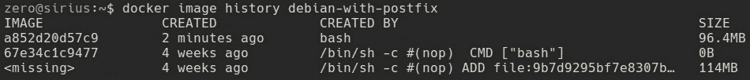
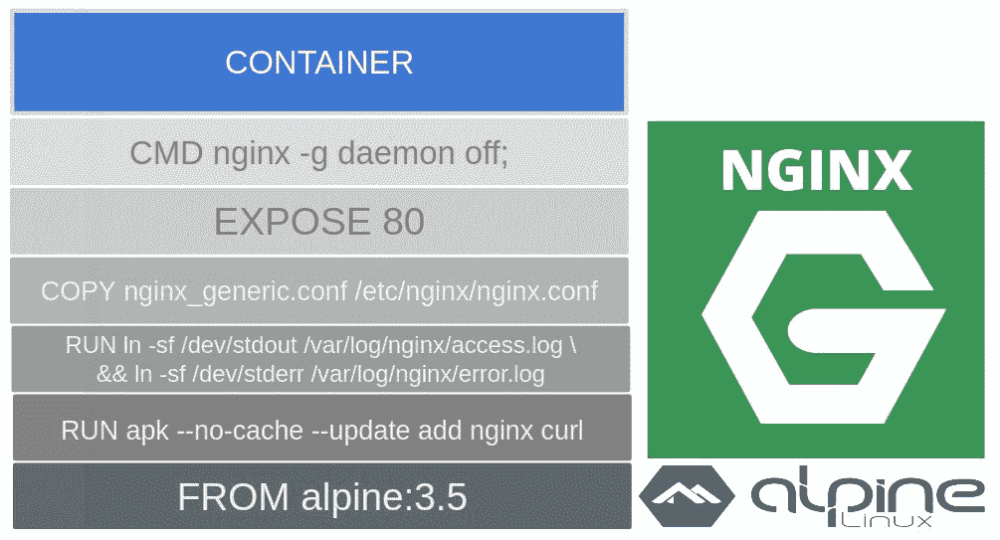

构建 Docker 镜像

构建镜像是部署你自己的基于容器的应用程序的第一步。这个过程很简单，任何人都可以从头开始构建镜像，但要创建足够质量和安全的生产级镜像并不容易。在本章中，我们将学习创建优秀、适用于生产的镜像的所有基础知识和技巧。我们将回顾保存和分发我们的工作所需的要求，以及如何改进这些过程，以在企业环境中当镜像和发布的数量较大时获得更好的性能。

在本章中，我们将涵盖以下主题：

+   构建 Docker 镜像

+   了解写时复制（Copy-on-write）文件系统

+   使用 Dockerfile 参考构建镜像

+   镜像标签和元信息

+   Docker 注册表与仓库

+   镜像安全

+   管理镜像及其他相关对象

+   多阶段构建与镜像缓存

+   模板化镜像

+   镜像发布和更新

让我们开始吧！

# 技术要求

在本章中，我们将学习 Docker 镜像构建的概念。在本章末尾，我们将提供一些实验，帮助你理解并学习本章所解释的概念。这些实验可以在你的笔记本电脑或 PC 上运行，使用提供的 Vagrant 独立环境，或任何你自己部署的 Docker 主机。你可以在本书的 GitHub 仓库中找到更多信息，链接是 [`github.com/PacktPublishing/Docker-Certified-Associate-DCA-Exam-Guide.git`](https://github.com/PacktPublishing/Docker-Certified-Associate-DCA-Exam-Guide.git)。

查看以下视频，了解代码的实际应用：

"[`bit.ly/31v3AJq`](https://bit.ly/31v3AJq)"

# 构建 Docker 镜像

开发人员创建自己的镜像，以及自己的代码和运行时组件，以运行他们的应用程序组件。然而，构建过程通常从一个之前的镜像开始。所有的镜像构建过程都会以`FROM`语句开始。这表示将使用之前的镜像（在多层基础上叠加）来添加新的组件、二进制文件、配置或操作，以构建我们的新镜像。

你可能会问，*谁负责镜像的创建？* 如果没有通过持续集成平台自动生成，开发人员可能会创建应用程序镜像，但也会有团队创建供其他用户使用的基础镜像。例如，数据库管理员会创建数据库基础镜像，因为他们知道应该包含哪些组件以及如何确保其安全。开发人员会根据这些基础镜像来创建他们的组件。在大公司中，可能有许多团队在创建镜像，或者至少定义必须包含哪些组件、哪些用户使用、暴露哪些端口等等。

然而，还有一些其他的情况。如今，许多应用程序都已为容器环境做好了准备，软件制造商会提供镜像来部署他们的软件。企业将寻求统一和架构，而 DevOps 团队将为他们的同事提供标准的基础镜像。容器的基础设施运行时将对所有这些环境通用，监控应用程序、中间件、数据库等将与开发的业务应用组件一起在这个环境中运行。

创建镜像有三种方法：

+   使用包含所有指令的文件来创建此镜像（Dockerfile）

+   与不同容器层中的文件交互，执行一个容器，修改其内容，然后存储所做的更改（提交）

+   使用一个空层并手动逐个文件地添加组件，这也被称为从零开始创建镜像

现在，我们将回顾每个构件，并讨论它们的优缺点和使用场景。

## 使用 Dockerfile 创建镜像

Dockerfile 是一个脚本文件，描述了创建新镜像所需的所有步骤。每个步骤都会被解释，并且在许多情况下，会创建一个容器来执行声明的更改，应用于之前的层。在这个 Dockerfile 中，我们将有一个创建镜像的指南。这个指南创建了一个可重复的过程。我们将确保每次使用这个脚本时，我们都会得到相同的结果。当然，这可能依赖于一些变量，但通过一些关键机制，我们可以确保相同的结果。在本章中，我们将介绍创建 Docker 镜像的主要基本构件。

一个 Dockerfile 看起来类似于以下内容：

```
FROM ubuntu:18.04
RUN apt-get update -qq && apt-get install -qq package1 package2
COPY . /myapp
RUN make /myapp
CMD python /myapp/app.py
```

在这个简单的示例中，正如我们之前提到的，我们在开始时有一个 `FROM` 语句：

1.  首先，我们使用 Ubuntu 18.04 作为基础镜像。为了使用这个镜像，我们需要在我们的构建环境中获取它。因此，如果该镜像不在我们的环境中，Docker 守护进程将下载它的层，并将其提供给我们，以便在后续步骤中使用。这个过程是自动发生的；Docker 守护进程会为我们完成这项工作。

1.  使用下载的 Ubuntu 18.04 层，Docker 将自动运行一个容器，使用这个镜像并执行声明的命令，因为我们使用了 `RUN` 基本构件。在这个简单的例子中，Shell（因为它是 Ubuntu 18.04 镜像的默认命令）将执行 `apt-get update` 来更新容器的包缓存。如果此命令执行成功，它将使用 `apt-get install` 安装 `package1` 和 `package2`。

1.  软件安装完成后，Docker 将内部执行 `Docker container commit` 命令，将这些更改持久化到一个新的层中，以便将其用作下一步的基础。第三行将把我们当前目录的内容复制到新运行容器中的应用代码目录。

1.  下一行将执行`make`（这只是一个示例；我们没有说明我的应用程序使用的编程语言等）。这行命令将在新容器中运行该操作。结果，当操作完成时，一个新的镜像将自动创建。

1.  我们了解到，容器总是使用镜像作为模板来创建的。代码的最后一行定义了每次我们使用此镜像创建容器时要运行的命令行。

总结来说，Dockerfile 提供了创建镜像所需的所有步骤指南，以便我们能够运行应用程序。这是一个可复现的过程，因此，每次使用该文件创建新镜像时，我们应该获得相同的结果（例如，在这种情况下，我们已更新了包缓存并安装了所需的软件；也许这些包自上次构建以来发生了变化，但如果没有，我们将拥有相同的镜像）。

构建的镜像具有一个独特的标识符，格式为`algorithm:hexadecimal_code_using_algorithm`。这意味着每次我们构建该镜像时，除非过程中进行了一些更改，否则我们将获得相同的镜像标识符。该镜像 ID 或摘要 ID 是通过与层的内容相关的算法计算得出的，因此任何层的更改都会获得新的 ID。这个标识符允许 Docker 引擎验证描述的镜像是否是正确的使用镜像。Docker 镜像包含关于所有层的信息，并通知 Docker 引擎所需的新容器的层内容。

当我们检查镜像信息时，我们将获得创建该镜像所需的所有必要层，`RootFS`。以下是一个示例：

```
"RootFS": {
 "Type": "layers",
 "Layers": [
 "sha256:f1b5933fe4b5f49bbe8258745cf396afe07e625bdab3168e364daf7c956b6b81",
 "sha256:402522b96a27c1af04af5650819febc11f71db14152b1db8e5eab1ae581fdb2e",
 "sha256:cf2850b10a1aba79774a291266262f1af49fac3db11341a5ca1a396430f17507",
 "sha256:c1912ec50df66e3e013851f6deb80f41810b284509eebc909811115a97a1fe01"
 ]
 }
```

该输出显示了使用 Dockerfile 中定义的代码创建的不同层。这些层将在可能的情况下在镜像之间互换。如果我们使用 Dockerfile 的前两行创建镜像，那么那些命令创建的层将与之前的镜像共享。这确保了最小的磁盘空间使用。

## 交互式创建镜像

镜像可以通过运行容器并实时修改`rootfs`来交互式创建。当应用程序的安装无法自动化且缺乏可复现性时，这非常有用。让我们通过一个示例来看看这个过程的实际操作：

1.  启动一个交互式容器：

```
$ docker container run -ti debian
 Unable to find image 'debian:latest' locally
 latest: Pulling from library/debian
 4a56a430b2ba: Pull complete
 Digest: sha256:e25b64a9cf82c72080074d6b1bba7329cdd752d51574971fd37731ed164f3345
 Status: Downloaded newer image for debian:latest
 root@60265b7c8a61:/#
```

1.  启动后，我们将收到命令提示符，因为我们通过分配伪终端并以交互模式启动容器。我们需要更新包的数据库，然后安装例如`postfix`包，它需要一些交互式配置（请注意，部分输出将被截断并省略）：

```
root@60265b7c8a61:/# apt-get update -qq
 root@60265b7c8a61:/# apt-get install postfix
 Reading package lists... Done
 Building dependency tree
 Reading state information... Done
 The following additional packages will be installed:
 bzip2 cpio file libexpat1 libicu63 .....
 Suggested packages:
 bzip2-doc libarchive1 libsasl2-modules-gssapi-mit | libsasl2-modules-gssapi-heimdal  .....
 The following NEW packages will be installed:
 bzip2 cpio file libexpat1 libicu63 libmagic-mgc libmagic1 l ....
 0 upgraded, 29 newly installed, 0 to remove and 5 not upgraded.
 Need to get 19.0 MB of archives.
 After this operation, 76.4 MB of additional disk space will be used.
 Do you want to continue? [Y/n] y
 Get:1 http://cdn-fastly.deb.debian.org/debian buster/main amd64 libpython3.7-minimal amd64 3.7.3-2 [588 kB]
 .....
 .....
 debconf: falling back to frontend: Teletype
 Postfix Configuration
 ---------------------
Please select the mail server configuration type that best meets your needs.
No configuration:
 Should be chosen to leave the current configuration unchanged.
 Internet site:
 Mail is sent and received directly using SMTP.
 Internet with smarthost:
 Mail is received directly using SMTP or by running a utility such
 as fetchmail. Outgoing mail is sent using a smarthost.
 Satellite system:
 All mail is sent to another machine, called a 'smarthost', for delivery.
 Local only:
 The only delivered mail is the mail for local users. There is no network.

1\. No configuration 2\. Internet Site 3\. Internet with smarthost 4\. Satellite system 5\. Local only
 General type of mail configuration: 1
Unpacking postfix (3.4.5-1) ...
 ......
 ......
 Adding group `postfix' (GID 102) ...
 Done.
 Adding system user `postfix' (UID 101) ...
 Adding new user `postfix' (UID 101) with group `postfix' ...
 Not creating home directory `/var/spool/postfix'.
 Creating /etc/postfix/dynamicmaps.cf
 Adding group `postdrop' (GID 103) ...
 Done.
 /etc/aliases does not exist, creating it.
Postfix (main.cf) was not set up. Start with
 cp /usr/share/postfix/main.cf.debian /etc/postfix/main.cf
 . If you need to make changes, edit /etc/postfix/main.cf (and others) as
 needed. To view Postfix configuration values, see postconf(1).
After modifying main.cf, be sure to run 'service postfix reload'.
invoke-rc.d: could not determine current runlevel
 invoke-rc.d: policy-rc.d denied execution of start.
 Setting up libpython3-stdlib:amd64 (3.7.3-1) ...
 Setting up python3.7 (3.7.3-2) ...
 Setting up python3 (3.7.3-1) ...
......
......
 Processing triggers for libc-bin (2.28-10) ...
```

1.  软件已安装，并且您被要求确认安装`postfix`包以及一些默认配置。现在，我们可以退出当前容器：

```
root@60265b7c8a61:/# exit
```

1.  我们在这里所做的是退出当前的主进程（在 Debian 镜像中是一个 shell），结果返回到我们的主机。我们将查找在主机上执行的最后一个容器，然后将容器层保存为一个新的镜像层（这意味着我们创建了一个新的镜像，如果我们省略名称或标识的话）：

```
$ docker container ls -l
CONTAINER ID IMAGE COMMAND LABELS
f11f8ad3b336 debian "bash"

$ docker container commit f11f8ad3b336 debian-with-postfix
sha256:a852d20d57c95bba38dc0bea942ccbe2c409d48685d8fc115827c1dcd5010aa6
```

1.  最后，我们在主机系统上回顾新创建的镜像（在您的环境中，ID 可能会发生变化）：

```
$ docker image ls
IMAGE ID REPOSITORY TAG CREATED AT
a852d20d57c9 debian-with-postfix latest 2019-10-05 13:18:45 +0200 CEST
c2c03a296d23 debian latest 2019-09-12 01:21:51 +0200 CEST

```

使用这种方法，我们通过与先前运行的 Debian Docker 容器进行交互，创建了一个新的镜像。如我们所见，新的镜像具有不同的摘要。如果我们检查其元信息，我们可以识别其前一个镜像层：

```
        "RootFS": { 
          "Type": "layers", 
          "Layers": [ 
             "sha256:78c1b9419976227e05be9d243b7fa583bea44a5258e52018b2af4cdfe23d148d", 
             "sha256:998e883275f6192039dd6eff96ece024e259cf74dd362c44c5eb9db9f3830aa0" 
           ]
        }

```

使用 Docker 容器提交创建的镜像有一个关键概念，那就是它们是不可重复的；你实际上不知道它们是如何创建的，因此必要的步骤应当记录下来，以便于更新和管理。

有一个镜像操作，它提供了创建镜像的详细步骤回顾。`docker image history` 将提供一个历史视图，展示创建该镜像时所采取的步骤。然而，它无法作用于使用提交的容器创建的镜像。我们只会看到一行包含 bash 的内容，例如，指示所有操作都发生在一个活动容器上，因此无法提取额外的信息。例如，使用之前创建的镜像，执行 `docker image history debian-with-postfix` 将提供以下输出：



## 从零开始创建镜像

从零开始创建镜像是最有效的方法。在这种情况下，我们将使用一个 Dockerfile，如第一种方法所述，但初始的基础镜像将是一个空的保留镜像，字面上称为 `scratch`。一个简单的示例定义如下所示：

```
FROM scratch
ADD hello /
CMD ["/hello"]
```

Dockerfile 定义中的主要区别是 `FROM` 行，因为我们使用了一个名为 `scratch` 的空白镜像。`scratch` 并不是真正的镜像；它仅包含根文件系统结构及其元信息。使用这种方法构建的镜像必须包含我们进程所需的所有二进制文件、库文件和其他文件（这应当是始终如此）。然而，我们并没有使用预定义的镜像及其内容；它将是空的，我们必须添加每个所需的文件。这个过程并不容易，且需要更多的实践，但镜像会更加精简，因为它们只包含我们应用所需的部分。我们将在本章末尾看到一个完整的实验。

# 理解写时复制文件系统

在上一章中，我们了解了什么是容器。容器内运行的隔离进程将拥有自己的根文件系统以及其他命名空间。容器在镜像层之上添加了一层薄层，每个进程执行期间所做的更改将仅存储在这一层。为了管理这些更改，Docker 存储驱动程序将使用可堆叠的层和**写时复制**（有时简称为 **CoW**）。

当容器内部的进程需要修改文件时，Docker 守护进程的存储文件系统机制会将该文件从底层复制到最上层。这些文件仅对容器可用。当创建新文件时也会发生相同的情况；新文件将只写入容器的最上层存储。其他容器中运行的进程会管理它们各自版本的文件。如果没有做任何更改，这些文件实际上就是来自其他层的原始文件。每个容器使用自己的最上层来写入文件更改。

我们已经看到了使用容器构建镜像过程的工作原理，每一层的创建过程。我们了解到，我们可以提交容器的层来获得一个新的镜像。使用 Dockerfile 创建镜像时，会运行使用先前镜像的中间容器，并将其提交以获得一个包含其各层之间所有文件更改的中间镜像。这个过程将按顺序执行，遵循 Dockerfile 代码中定义的顺序。最终，创建的镜像将是一个包含层间差异的薄层合集。

Docker 的写时复制减少了运行容器所需的空间和启动所需的时间，因为它只需要为每个容器创建这个可写层：



该镜像表示一个作为容器运行的 NGINX 进程。基础镜像是从一个全新的 `alpine` 3.5 镜像创建的。我们添加了一些软件包，进行了配置，并复制了我们自己的 `nginx.conf` 文件。最后，我们添加了一些元信息，以便使用此镜像创建容器，声明了将用于暴露 NGINX 的端口，并声明了默认用于运行容器的命令行，从而在前台启动 NGINX。

CoW 逻辑有三种策略：

+   在基于 AUFS 和 overlay 的驱动程序中，Docker 使用联合文件系统（union filesystem）。

+   在 BTFS 和 ZFS 驱动程序中，Docker 使用文件系统快照。

+   在 device-mapper（适用于类似 Red Hat 的操作系统）中，Docker 使用 LVM 快照来管理块。

现在，几乎所有 Docker 主机操作系统都默认使用基于 overlay 的驱动程序（尽可能使用）。过去有些实现使用块设备，但这些现在已经被弃用。CoW 过程增加的开销取决于所使用的驱动程序。

我们可以查看一个容器使用了多少空间。Docker 提供了 `docker container ls -s/--size` 选项来实现这一点。它将返回当前薄层的使用空间以及从原始镜像中使用的只读数据，定义为**虚拟**。为了了解容器实际消耗了多少空间，我们需要将每个容器的两种大小结合起来，得到所有容器在我们环境中使用的总数据量。这不包括卷或容器的日志文件等小部分，这些都会贡献到实际的使用空间中。

CoW 是为最大化磁盘空间效率而设计的，但它取决于本地镜像中有多少层是共享的，以及有多少容器会使用相同的镜像。如你所料，向其可写层写入大量数据的容器会消耗比其他容器更多的空间。

CoW（写时复制）是一个非常快速的过程，但对于容器上的重写操作，它并不够。如果我们有一个需要创建许多小文件、非常深的目录结构，或者只是非常大的文件的进程，我们需要绕过 CoW 操作，因为性能会受到影响。这将导致我们使用卷（volumes）来缓解这种情况。我们将在第四章《容器持久性与网络》中学习卷，它们是用于容器持久存储的对象。

# 使用 Dockerfile 构建镜像参考

正如我们之前提到的，构建镜像很容易，但构建优秀的镜像并非如此。本节将带你了解基本知识，并提供一些技巧，帮助你在使用 Dockerfile 时改进镜像构建过程。

## Dockerfile 快速参考

我们已经了解了构建镜像时可用的方法。对于生产环境，建议使用 Dockerfile，因为这种方法提供了可重现性，并且我们可以使用代码版本控制方法。我们将在此介绍 Dockerfile 的主要指令，并按照其标准使用顺序进行讲解：

| **指令** | **描述和使用方法** |
| --- | --- |
| `FROM` | 该指令设置基础镜像并初始化一个新的构建（我们将在本章后面的*多阶段构建和镜像缓存*部分回顾这个概念）。它是所有 Dockerfile 开头的唯一必选指令。我们可以使用任何有效的镜像作为基础镜像进行构建，或者使用保留的 `scratch` 词从一个空的根文件系统开始，正如我们在上一节中所学。我们可以在同一个 `FROM` 指令中使用 `AS name` 定义构建阶段的名称。我们将在本章最后的*多阶段构建*部分中使用它。基础镜像可以通过其镜像名称（仓库）和特定标签（镜像版本）或其摘要（digest）来定义，例如，`FROM <image>[:tag] 或 FROM <image>[@digest]`。 |
| `ARG` | `ARG`指令定义了一个变量，在构建时会将其设置为提供的值，通过`--build-arg <variable>=<value>`将其作为参数传递。为了避免在构建过程中缺少值导致的问题，我们可以使用`ARG`定义一个默认值，该值将在传递参数时被覆盖。每次调用时，`ARG`都会获取该值。这在创建 Dockerfile 时非常重要。`ARG`可以在`FROM`指令之前使用，通过参数指定不同的基础镜像。 |

| `LABEL` | 使用`LABEL`，我们可以为镜像添加元信息。这些信息应以键值对的格式呈现，并且我们可以在同一个`LABEL`语句中包含多个键值对。下面是一些简短的示例：

```
LABEL version="1.0"
LABEL description="This image has these \
and these properties...."
LABEL maintainer="Javier Ramirez" team="Docker Infrastructures"  environment="preproduction"
```

|

| `ENV` | 使用`ENV`指令，我们可以为下一步以及之后的所有步骤设置一个环境变量。我们可以在同一个语句中添加多个环境变量，如果在创建 Docker 容器时指定了新值，原来的值将被覆盖：

```
ENV DATABASE_NAME=TEST
```

|

| `WORKDIR` | `WORKDIR`设置接下来及之后语句的工作目录。我们可以指定完整路径或相对路径：

```
WORKDIR /myappcode
```

|

| `RUN` | `RUN`可能是你在 Dockerfile 中最常用的指令之一。它会在一个新的层中执行行中的所有命令，并将结果提交到一个新的层（如我们在前一章节中所描述的）。这个新层将在下一条语句中作为基础层使用，并包含`RUN`指令所做的更改。这意味着每条`RUN`指令都会创建一个新的层。因此，`RUN`直接影响镜像中层的数量。为了避免使用比需要更多的层，我们通常会在每个`RUN`语句中添加多个命令：

```
RUN apt-get update -qq \
​&& apt-get install curl
```

|

| `COPY` | `COPY`指令将新的文件和目录从构建上下文（在构建执行过程中设置）复制到容器文件系统的指定目录中（记住，构建镜像是基于在容器上执行命令，并将结果提交为镜像，用于后续的阶段）。`COPY`支持`--chown=<user>:<group>`参数，用于为 Linux 容器提供文件所有权。如果不使用该参数，所有者将默认为`root:root`。`COPY`还支持`--from=<name or index>`，用于从其他构建阶段复制文件或目录（当使用多阶段构建时，这一点至关重要，我们将在本章后面学习）：

```
COPY mycode/* /myapp
```

|

| `ADD` | `ADD`类似于`COPY`，但也可以与 URL 和 TAR 包文件一起使用。它接受相同的所有权参数，以更改目标文件和目录的权限：

```
ADD http://example.com/bigpackagefile.tar.gz /myapp
```

|

| `USER` | `USER` 指令用于指定在接下来的语句中使用的用户及其所属组。理解我们进程所需的权限并使用 `USER` 指定用户及其组是非常重要的。如果没有指定，步骤将使用 `root:root`，并且容器内的进程将以 root 用户身份运行。在生产环境中，应强制使用特定的非 root 用户运行容器进程，如果需要 root 用户，则应使用用户映射（如前一章所述）：

```
USER www-data:www-data
```

|

| `VOLUME` | `VOLUME` 定义将创建一个挂载点，用以绕过 CoW 系统。这意味着该目录的内容将不属于容器生命周期的一部分。由于它在容器外部，因此对该目录的任何后续更改都会被丢弃。因此，如果我们希望在初始化卷时提供某些文件，`VOLUME` 语句应位于我们已将文件放入目录之后：

```
VOLUME /mydata  
```

|

| `EXPOSE` | `EXPOSE` 用于通知 Docker 守护进程有关通过此镜像创建的容器的监听端口。这并不意味着定义的端口在 Docker 主机级别监听，它们只会在容器的网络内部监听。我们可以定义使用哪种传输协议——UDP 或 TCP（默认为 TCP）：

```
EXPOSE 80/tcp 
```

|

| `CMD` | `CMD` 指令定义了执行基于该镜像的容器时的默认进程或参数。无论是否定义了 `ENTRYPOINT` 指令，这一行为都会被应用。默认情况下，根据使用的格式，`CMD` 将为 shell 提供默认的参数，shell 是默认的入口点（容器内进程的主要执行器）：

```
CMD ["/usr/bin/curl","--help"]
CMD /usr/bin/curl -I https://www.packtpub.com
```

|

| `ENTRYPOINT` | `ENTRYPOINT` 指令将设置容器运行的命令作为可执行文件。如前所述，`CMD` 将是该命令的参数。`CMD` 和 `ENTRYPOINT` 之间的交互定义了在运行容器时执行的命令。它们不是必需的，但最好至少定义 `CMD`，以便在执行时具有默认的进程启动命令。 |
| --- | --- |

| `HEALTHCHECK` | `HEALTHCHECK` 定义了一个命令行，该命令将在容器内运行以验证进程或进程的健康状况。如果没有 `HEALTHCHECK`，Docker 守护进程将只验证主进程是否存活，如果主进程不存在，容器将退出。`HEALTHCHECK` 指令通过定义更好的脚本或基于二进制的进程状态监控，帮助我们改善应用程序的健康状况。我们可以调整检查之间的间隔、超时设置以及在声明为不健康状态之前的重试次数。如果我们有一个启动需要时间的进程，我们可以设置开始监控容器进程健康状况的时间：

```
HEALTHCHECK \
--interval=DURATION (default: 30s) \
--timeout=DURATION (default: 30s) \
--start-period=DURATION (default: 0s) \
--retries=N (default: 3) \
CMD /bin/myverificationscript 
```

非常重要的一点是，默认情况下，如果容器内运行的主进程没有按预期工作（进程仍在运行，但健康检查失败），在进行三次失败验证之前，它不会被标记为不健康，默认情况下每次验证之间会有 30 秒的间隔。这意味着，默认情况下，一个进程可能会失败 90 秒，容器才会被标记为不健康。这在许多情况下过长，你应该采取措施来改变这种行为。我们可以在容器内使用自己的脚本，只需要管理两种不同的退出状态（`0` – 验证通过；`1` – 验证失败）。

如果你在 Dockerfile 中多次定义了原始键，请小心。这些文件是从上到下读取的，定义的优先级很重要，因为某些指令的值会被覆盖（`ARG`、`ENV`、`CMD`、`ENTRYPOINT`、`LABEL`、`USER`、`WORKDIR`、`HEALTHCHECK` 等），而其他指令的值会被添加（`VOLUME`、`EXPOSE` 等）。

有些指令支持两种不同的格式，`shell` 和 `exec`，它们在每种情况下有不同的行为：

+   `RUN`：当使用 `shell` 形式时，所有命令都将在 Shell 中启动，就像我们使用 `/bin/sh -c`（默认在 Linux 上）或 `cmd /S` 或 `cmd /C`（默认在 Windows 上）一样。我们可以通过 `SHELL` 指令来更改在该形式中使用的 Shell。

```
RUN <command> <argument1> <argument2> <-- shell form
RUN ["executable", "argument1", "argument2"] <-- exec JSON form
```

我们需要在 Windows 容器中使用 `exec` 格式。此格式在这种情况下是必要的，因为某些键的定义值，如目录路径，将包含反斜杠（`\`），并且必须避免使用。

+   `CMD`：此键用于定义传递给主容器进程的命令或参数：

```
CMD <command> <argument1> <argument2> <-- shell form
CMD ["executable or argument0", "argument1", "argument2"] <-- exec JSON form
```

正如我们之前所学，Shell 形式会使用 Shell 执行命令（可以通过设置 `SHELL` 键来更改使用的 Shell）。

为了在没有 Shell 的情况下执行 CMD 命令，我们必须使用 `exec` 形式。如果我们想将 CMD 值作为已定义入口点的参数使用，也将使用 `exec` 形式，但必须在 `ENTRYPOINT` 和 CMD 定义中都使用该形式。

+   `ENTRYPOINT`：此键用于定义在创建的容器内执行的主进程：

```
ENTRYPOINT <command> <argument1> <argument2> <-- shell form
ENTRYPOINT ["executable", "argument1", "argument2"] <-- exec JSON form
```

在 Shell 形式中预期会有相同的行为，但在这种情况下，使用此形式将不允许使用 CMD 值作为参数。因为 `ENTRYPOINT` 使用 Shell 形式时，会使用 `/bin/sh -c` 启动主进程，而在这种情况下，它将不会拥有 PID 1，并且无法直接接收 Unix 信号（我们将在第三章《运行 Docker 容器》中回顾 Unix 信号如何与容器进程交互）。

记住，为了将 CMD 值作为 `ENTRYPOINT` 的参数使用，`ENTRYPOINT` 必须以 `exec` 形式定义。

当我们使用基础镜像创建新的镜像时，基础镜像定义的值会被新镜像继承。这意味着，除非我们覆盖它们，否则 CMD 和 `ENTRYPOINT` 的定义将被使用，从而为我们的镜像设置新值。然而，有一个例外；如果我们在新镜像中设置了新的 `ENTRYPOINT`，CMD 会被重置为空值。

## 构建过程操作

Docker 命令行提供了用于管理 Docker 对象的操作，正如我们在上一章中学习的那样。镜像是 Docker 对象，命令行将提供构建和操作它们的工具。

我鼓励使用 `docker image build` 而不是常用的 `docker build`。正如你可能已经注意到的，`docker image build` 遵循 `对象动作` 模式，这种方式更容易记住。

我们可以在不同类别中查看 Docker 镜像操作：

+   **用于管理**：`ls`、`prune`、`rm` 和 `tag`。这些操作允许我们列出、移除和为镜像设置标识。

+   **获取信息**：`history` 和 `inspect`。这些操作提供了有关创建该镜像所需步骤的信息，以及其所有属性。

+   **在主机之间共享镜像**：`pull`、`push`、`load`、`import` 和 `save`。这些操作允许我们与注册表交互，以下载和上传镜像层，并通过不同方式导入和导出镜像到不同的 Docker 主机。

+   **创建新镜像**：`build`。通过 `build` 操作，我们将能够使用基础镜像或从空根文件系统开始创建新镜像。

    因此，我们将使用 Docker 镜像构建来创建新镜像。这里有一些非常重要的选项会改变构建行为，这些内容必须在 Docker Certified Associate 考试中进行复习。

我们将使用 `docker image build [options] <context>` 并带上一些额外的选项：

+   `--add-host`：此选项允许我们在镜像中包含主机到 IP 的条目。它在添加非 DNS 条目或遮蔽外部资源时非常有用，例如。

+   `--build-arg`：在构建新镜像时使用参数是持续集成流水线中结合模板化 Dockerfile 的标准做法。

在集群环境中，我们需要指定哪些节点应构建所需的镜像。为了确保镜像在特定节点上构建，我们将使用某些标签作为约束，将它们作为参数指定；例如，在一个同时拥有 Windows 和 Linux 节点的集群中，使用 `--build-arg constraint:ostype==linux` 会将构建过程仅发送到 Linux 节点。

+   `--file` 或 `-f`：我们可以定义使用哪个 Dockerfile。我们可以为每个环境、架构等定义不同的文件，但如今有其他功能，例如“目标定义”，允许我们为不同的目的使用一个唯一的 Dockerfile，并根据需要构建每一个。

+   `--force-rm`：此选项将保持环境的清洁，因为它会删除所有中间容器。默认情况下，只有在构建成功后，中间容器才会被删除。

+   `--isolation`：在构建 Windows 镜像时，此选项是必需的，因为我们需要选择使用的隔离模式。

+   `--label`：此选项允许我们以键值对的格式添加元信息。

+   `--no-cache`：默认情况下，Docker 守护进程在构建新镜像时会使用主机缓存的层。有些情况下我们需要创建一个全新的镜像，例如当有新软件包更新时。在这些情况下，我们会使用此选项避免使用之前构建的层。使用此选项时需要注意时间和开销，因为禁用缓存会增加构建时间，并且我们需要执行所有步骤来生成新镜像。

+   `--tag` 或 `-t`：为镜像打标签是必须的。默认情况下，Docker 不会“命名”镜像，我们只能通过其 `IMAGE` ID 来引用镜像（我们在本章前面已经学习过这个内容）。指定一个仓库名称（我们将在后续章节中学习什么是仓库；目前，只需理解它是一个简单的名称）及其版本对镜像管理非常重要。我们可以在构建时使用多个 `--tag` 或 `-t` 参数，带上镜像名称和标签。我们还会学习到，镜像名称也称为仓库名称，并且在不使用 Docker Hub 时，我们需要添加自己的注册表（包括非标准端口）、用户名和所属的团队或组织作为前缀。

`IMAGE` ID 是唯一的。每个创建的镜像都有一个唯一的 ID 来标识这个由多层组成的镜像，且在所有系统中都是唯一的。但我们可以为该 `IMAGE` ID 添加标签以便于管理。一个镜像只有一个唯一的标识符，但可以有多个名称和版本。这个概念非常重要，它是确保在生产环境中执行正确镜像的关键。

+   `--target`：我们可以在同一个 Dockerfile 中定义多个构建阶段。这些定义允许我们在不同的结果镜像之间执行多阶段构建，例如使用已编译的二进制文件，但它们也允许我们定义多个架构或环境并选择要构建的一个，而不必使用不同的 Dockerfile 文件。

我们可以使用诸如 `--cpu-quota`、`--cpu-shares` 和 `--memory` 等选项限制构建过程中使用的资源，这将限制每个容器在构建过程中可用的资源数量。

构建上下文是位于某个目录或 URL（如 Git URL 或 tarball 文件）中的一组文件，我们在构建时使用它来引用这些文件。这些文件会被发送到 Docker 守护进程，供其在构建镜像时使用或不使用。因此，了解构建过程中实际需要哪些文件非常重要。如果我们在构建上下文中有很多小文件或非常大的文件，Docker 守护进程将会获取这些文件，并根据 Dockerfile 指令决定是否将其纳入镜像中。因此，构建上下文目录应仅包含镜像所需的文件。那些在镜像构建过程中不应由 Docker 管理的文件，应该不放在构建上下文中。

无论你使用的是 Git URL 还是 tarball 文件，行为都是类似的。Docker 守护进程将获取该仓库或 `.tar` 文件，并解压或解压缩数据，以便将临时目录作为构建上下文。

我们通常将 Dockerfile 存储在应用代码中，因此构建上下文就是 Dockerfile 所在的目录。因此，如果我们从相同目录启动构建，我们会使用 `.` 来表示当前目录。

一个简单的命令行示例，展示了带有多个选项的镜像构建如下：

```
$ docker image build [-t MY_TAG] [--label MY_LABEL=VALUE] [--file MY_DOCKERFILE] [BUILD_CONTEXT]

```

Docker 守护进程将尝试查找名为 Dockerfile 的文件以编写构建脚本。如果你没有使用标准名称，可以使用 `--file` 或 `-f`，并指定文件位置（我们可以使用 Dockerfile 的完整路径或相对路径，但需要注意构建上下文的位置与其相对关系）。

并且，在替换了一些实际值后，我们将得到类似于以下内容的结果（这行内容来自本章末尾的一个实验）：

```
$ docker build --file Dockerfile.application -t templated:production --build-arg ENVIRONMENT=production .

```

在这里，我们使用了一个非标准的 Dockerfile 名称，使用 `ENVIRONMENT` 变量并在构建过程中设置 `production` 值，创建一个名为 `templated:production` 的镜像，并使用当前目录作为构建上下文。注意命令末尾的 `.`。这意味着我们使用当前目录作为构建上下文来创建镜像。如果我们从上级目录运行此命令，则会使用包含所需 Dockerfile 的目录作为构建上下文。

使用相同的 Git 仓库哲学，如果有一些文件我们希望存储在 Docker 构建上下文中（例如，随 Git 仓库数据一起提供的文件），但不希望它们在构建过程中被处理，我们可以使用 `.dockerignore` 文件将其排除。只需在 `.gitignore` 中写下不需要的文件名，Docker 守护进程就不会在镜像构建过程中处理它们。

# 镜像标签和元信息

通常，你不会只管理少量的镜像，而是可能管理数百个或数千个镜像，因此尽可能多地了解它们的信息非常重要。

使用标签，我们将能够按环境搜索特定的镜像，如下所示：

```
$ docker image ls --filter label=environment
 REPOSITORY   TAG       IMAGE ID         CREATED             SIZE
 myapp        1.0      7dad160a2b02    4 seconds ago        5.6MB
 myapp       latest    285c3d16e672    7 minutes ago        5.6MB

$ docker image ls --filter label=environment=test              
 REPOSITORY      TAG       IMAGE ID       CREATED         SIZE
 myapp          latest    285c3d16e672   7 minutes ago    5.6MB

$ docker image ls --filter label=environment=production
 REPOSITORY      TAG        IMAGE ID      CREATED         SIZE
 myapp           1.0      7dad160a2b02  18 seconds ago    5.6MB

$ docker image inspect myapp:1.0 --format "{{ index .Config.Labels }}"
 map[environment:production]
```

请记住，一个镜像可以有多个名称和标签，但其摘要是唯一的。使用不同的标签和名称对于与不同的 CI/CD 工作流阶段交互非常有用，使用相同的镜像内容。例如，开发人员在开发和测试过程中会创建许多镜像，但只有少数会进入质量保障或认证阶段。我们可以基于 Docker 企业版中的镜像名称和标签自动化这些过程，正如我们将在第十三章中学习的，*使用 DTR 实现企业级注册中心*。

我们已经学过，同一张图片可以有多个名称，因此通过名称删除某个镜像并不会真正删除其内容，如果它仍然被其他名称使用。如果我们使用镜像 ID 来删除 `docker image rm <imageid>`，Docker 守护进程会提示我们多个使用相同层的不同名称的镜像，并且除非我们使用 `--force`，否则它不会删除该镜像，在这种情况下，它将删除该镜像及其所有层和引用的名称。

我们可以使用 `docker rmi` 作为 `docker image rm` 的命令别名。另一方面，`docker image prune` 将用于删除悬空镜像。

有一些特殊的**未标记镜像**，它们会出现在我们创建新镜像时的 Docker 构建主机上。这些镜像是不同编译之间变更的结果。它们没有被引用且未被使用。在你的主机中，当它们作为层使用时，其他镜像不会使用它们，因此可以从系统中删除（事实上，你应该删除它们，因为它们占用了宝贵的磁盘空间）。这些镜像通常被称为**悬空镜像**，我们将在本章稍后学习如何清理它们。

要给镜像添加新标签，我们将使用 Docker 镜像标签，`SOURCE_IMAGE[:TAG] TARGET_IMAGE[:TAG]`。默认情况下，如果我们省略标签，系统将使用 `latest` 标签。避免使用 `latest` 标签，因为这并不真正表明这是最新构建的镜像。确保镜像构建时间的唯一方法是查看其创建日期。

# Docker 注册表和仓库

镜像必须存储在某个地方。默认情况下，每个 Docker 主机会将其数据存储在 Linux 系统中的 `/var/lib/docker/image` 和 Windows 系统中的 `c:\programdata\docker\image` 目录下。但这些目录仅在本地有效，我们通常需要使用镜像来构建新的镜像并在多个节点之间共享。

我们可以使用 Docker 命令行在不同主机之间导出和导入镜像层，但这很难维护，而且这种方法无法扩展。Docker Registry 是一个服务器应用程序，用于存储并根据需要让我们下载和上传镜像。它提供一个 API，用于通过 Docker 客户端共享信息和镜像层。因此，我们可以将注册表定义为容器镜像的存储和内容分发系统。镜像将使用在 Docker 守护进程级别定义的设置本地存储。要使用远程注册表，我们将设置不同的存储后端，可以处理云环境中的 S3、Microsoft Azure、OpenStack Swift，以及本地数据中心中的 NFS。

在本章的最后，我们将进行一个实验室实践，创建一个本地注册表。Docker Registry 是一个开源解决方案，可以通过 `/etc/docker/registry/config.yml` 配置文件进行配置，以更改存储后端、端口和其他高级设置。

Docker Hub 是 Docker 提供的基于云的注册表。我们可以使用它来存储公有或私有镜像，并且作为一种软件即服务的解决方案，有些功能需要付费订阅。

Docker Registry 不提供任何身份验证方法，也不支持 TLS，以允许 Docker 客户端使用加密连接。这些安全增强功能仅在 Docker Hub（Docker 公有/私有镜像注册表作为服务）和 Docker Trusted Registry（部署在 Docker 企业平台上的注册表）中可用。

我们通常描述三种不同的镜像命名空间或命名约定：

+   **根目录（docker.io 托管镜像）**：我们使用镜像的名称和标签来引用这些镜像，例如 `nginx:alpine` 和 `postgres:12.0`。它们是公开的。

+   **根目录下的用户或组织镜像（docker.io 托管镜像）**：在这种情况下，镜像可以是私有的或公开的，具体取决于用户许可。镜像名称将包含用户名或组织名，用户可以在其中拉取或推送镜像，例如 `frjaraur/simplest-demo:simplestapp` 或 `codegazers/colors:1.13`**。

+   **完整注册表格式（用于云端或自有数据中心的私有注册表）**：我们将使用用户名、团队或组织，但需要使用注册表的完全限定名称；例如，`dtr.myorganization.com[:my_registry_port][/myteam 或 /myorganization][/myusername]/<repository>[:tag]`。

实际上，根注册表和仓库名称可以使用完整的注册表格式来填写；例如，我们可以使用完整的名称约定来拉取 `docker.io/codegazers/colors:1.13` 镜像。

你应该已经注意到，在这个例子中，我们添加了 `my_registry_port` 和 `repository`。我们添加了 `my_registry_port`，因为默认情况下，Docker Hub 和 Docker Trusted Registry 使用 HTTPS，因此端口是 `443`，但我们可以使用自定义端口部署我们自己的注册中心。`repository` 是对具有相同名称的镜像的引用，每个镜像都有不同的 `IMAGE` ID（唯一）和标签（多个）。因此，当我们谈论 `nginx:alpine` 镜像时，我们是指 `docker.io` 注册中心、`nginx` 仓库和 alpine 标签，所有其他镜像在本章中使用时也应遵循相同的规则。

# 镜像安全

如前一章所见，Docker 容器默认是安全的，但这是因为它们在命名空间和 cgroups 隔离中运行。镜像是不同的对象，它们的安全性与其内容有关。基于这个概念，很容易理解，内容越少，安全性就越高。因此，确保镜像安全的主要规则如下：

+   镜像应仅包含运行我们容器化进程所需的必要二进制文件、库和配置。不要在生产镜像中添加任何不必要的应用程序或调试工具。减少攻击面更为重要，而过多的二进制文件会增加这个面。

+   始终声明镜像上的资源。在这里，我们使用“资源”一词来描述用户、暴露的端口和卷。始终描述运行镜像所需的内容，并避免在容器内使用 root 权限。

+   如果有安全漏洞修复，更新镜像内容包，重建所有衍生镜像，并重新部署容器。实际上，还有更多步骤需要遵循，但这一点是正确的。如果你发现任何可能导致安全问题的漏洞或错误，必须尽快使用 Docker 容器的生命周期进行修复。要通过更新构建修复基础镜像并重建所有衍生镜像，请遵循 CI/CD 工作流，并在将这些新版本的镜像部署到生产环境之前，重新通过所有测试。

在 Docker 企业版部分，我们将学习 Docker 镜像安全扫描，这是一种自动化工具，用于验证镜像的所有内容与 CVE 数据库的匹配情况。如果发现漏洞或漏洞利用，我们可以将镜像标记为不安全。该工具可以触发新的事件来实现安全的管道，在镜像进入生产阶段前扫描所有镜像，并提供关于发现的安全风险的信息。

我们知道镜像层对于容器是只读的，每个容器都会创建一个新的可写层。在下一章，我们将学习如何通过使用只读根文件系统来改进这种情况，只允许对外部卷进行写访问。

# 管理镜像及其他相关对象

我们在本章中学习了如何管理镜像容器，现在，让我们看看最常见的镜像管理任务。

如果从一开始没有处理好悬空镜像，它们可能会变成一场噩梦。正如我们在前面的章节中提到的，*悬空镜像*是指那些未被引用、因此不被任何其他镜像使用的镜像。实际上，它们是连续构建的结果，因为 Docker 使用它们进行缓存和提高构建性能。它们只是构建镜像过程中使用的层，在特定步骤中由于我们更改了某个包、更新了代码、更改了配置文件等原因，这些镜像不再被使用，因此它们不再必要。我们应该删除这些镜像，因为它们可能占用大量磁盘空间。

自 1.13 版本以来，Docker 提供了 *Docker* 镜像清理操作，默认情况下会删除所有悬空镜像。然而，我们可以选择删除我们希望删除的镜像，例如，可以按日期或标签进行过滤：

```
$ docker image prune --force --filter label=environment=test 
Deleted Images:
deleted: sha256:285c3d16e6721700724848024b9258b05a0c8cd75ab9bd4330d9d48f3313ff28
deleted: sha256:62ee8a779b918d678f139941d19e33eeecc8e333a1c00d120c3b83b8545a6650
deleted: sha256:fb077551608a1c7244c4ed5f88e6ba301b6be2b7db7dd2a4f7194e03db6e18dd
deleted: sha256:9a704cd7c7c2a5233fad31df5f7186a9cf631b9b22bc89bc4d32d7ab0a1bc4a7

Total reclaimed space: 19.83kB
```

该命令行已删除所有环境标签为 `test` 的悬空镜像。

Docker 镜像清理不仅会删除悬空镜像，还会删除旧镜像。然而，您应该管理这种情况，因为它取决于您在环境中运行了哪些容器。在生产环境中删除非悬空镜像之前，请确认没有容器在使用该镜像；例如，`docker container ls --filter ancestor=<image_to_be_removed>`。

许多容器用于构建操作。默认情况下，Docker 守护进程会删除所有在构建过程中正确退出的容器，因此所有在正确构建过程中使用的容器将被移除。然而，曾在构建失败时使用的容器应手动删除。识别与镜像构建相关的故障容器非常简单。通常，我们会在其他情况下手动启动的所有容器中设置容器名称。在*第二部分*，*容器编排*，专门讲解编排时，我们将学习 Kubernetes 和 Swarm 编排器在创建容器时使用的命名模式，从而帮助我们识别它们的来源。

查看 Docker 主机文件系统使用情况总是很有用，特别是 Docker 守护进程使用的空间。我们可以使用 `docker system df --verbose` 获取关于每个主机的镜像、容器和卷使用情况的详细信息。

其他常见任务包括检查镜像，以了解每种情况下所需的资源并共享它们。

## 列出镜像

列出镜像是审查主机系统内容的常见任务。我们可以通过在 GoLang 格式结构中使用 `--format` 修饰符来修改默认的 `docker image ls` 命令输出：

```
$ docker image ls --format "table {{.ID}}\\t{{.Repository}}:{{.Tag}}\\t{{.CreatedAt}}"
IMAGE ID            REPOSITORY:TAG               CREATED AT
 28b4509cdae8        debian-with-postfix:latest   2019-10-05 13:18:45 +0200 CEST
 c2c03a296d23        debian:latest                2019-09-12 01:21:51 +0200 CEST
 d87c83ec7a66        nginx:alpine                 2019-08-28 00:20:07 +0200 CEST
```

正如我们在前面的示例中学到的，我们可以使用标签过滤输出，例如，只显示特定的镜像。

## 使用注册表共享镜像

我们了解到，注册表是可以存储镜像的服务器，使用 HTTP REST API。Docker 客户端知道如何管理所需的请求，从而简化了在这些位置的镜像管理。

执行容器时始终需要镜像。因此，每次我们运行一个新的容器时，如果该镜像不在 Docker 主机上，它将从仓库中下载。

我们可以使用 `docker image pull <IMAGE:TAG>` 手动下载镜像。这将下载所有镜像层，并且我们准备好基于此镜像启动新的容器。这对于在启动容器之前预热主机非常有用；例如，想象一个 2 GB 的镜像需要从互联网下载。

我们可以使用 `--all-tags` 从仓库中下载所有镜像；例如，`docker image pull --all-tags --quiet codegazers/colors`。使用这个命令行，我们正在下载 `codegazers/colors` 仓库中所有可用的镜像（所有标签），且不会输出任何信息。

因此，我们将使用 Docker `push` 将镜像上传到仓库。但请记住使用完整的名称，包括注册表的完全限定域名和端口（如果我们没有使用 `docker.io` 和默认的 `443` 端口）。我们将使用自定义仓库的完整路径 – `myregistry.com[:non-default-port]/myusername/myrepository[:tag]`；例如，`$ docker push docker.io/codegazers/colors:test`。

Docker 注册表需要登录才能访问，无论是拉取还是推送。通常，我们将使用 TLS 加密连接到注册表，且在 Docker 客户端中默认启用。Docker 引擎需要信任注册表证书才能允许登录和拉取或推送镜像。如果您不想使用此功能，您需要在 `/etc/docker/daemon.json` 中将注册表添加为不安全注册表，并重启 Docker Daemon。

还有其他共享镜像的方法。我们可以使用 `docker image save` 保存一个镜像及其所有层和元数据信息。此命令默认将内容流式传输到标准输出，因此我们通常使用 `--output` 将所有内容存储到一个文件中（或将其输出重定向到文件）：

```
$ docker image save docker.io/codegazers/colors:test -o /tmp/codegazers_colors_test.tar

$ file /tmp/codegazers_colors_test.tar
 /tmp/codegazers_colors_test.tar: POSIX tar archive

$ tar -tf /tmp/codegazers_colors_test.tar
.........
.........
d420450ab5b04122577e05172291941dcd735eaefd01ab61c64c056b148ebfde/layer.tar
 f99211cb5c4f5e30e2c5d6ce0f0f2ac42361aecbdcc77fd0e2eccf1650558a0c/
 f99211cb5c4f5e30e2c5d6ce0f0f2ac42361aecbdcc77fd0e2eccf1650558a0c/VERSION
 f99211cb5c4f5e30e2c5d6ce0f0f2ac42361aecbdcc77fd0e2eccf1650558a0c/json
 f99211cb5c4f5e30e2c5d6ce0f0f2ac42361aecbdcc77fd0e2eccf1650558a0c/layer.tar
 manifest.json
 repositories
```

因此，`docker image save` 将创建一个 `.tar` 文件，包含所有层及其所有文件，并包含重建该镜像所需的清单文件（以及其他元数据信息）以便在主机中重建该镜像。请注意，我们可以选择文件名及其扩展名（`.tar` 默认不会添加，但这不会影响内容的上传）。

上传这个 `.tar` 镜像文件很简单。我们有两个选项。

第一个选项是使用 `docker image import`。通过此操作，我们将只导入镜像层，而没有任何元数据信息，因此我们将无法定义入口点、命令参数、暴露的端口、卷定义等。它只会将镜像提供的层导入到我们的主机中。

因此，我们无法直接使用此镜像运行容器（但我们可以在导入时添加类似 Dockerfile 的指令以避免这种情况）：

```
$ docker import /tmp/codegazers_colors_test.tar 
 sha256:5bd30fec31de659bbfb6e3a294e826ada0474817f4c4163dd8a62027b627c81d 

$ docker image ls 
 REPOSITORY            TAG                   IMAGE ID            CREATED             SIZE 
 <none>                <none>                5bd30fec31de        4 seconds ago       77MB

$ docker inspect codegazers/colors:test --format '{{json .Config.ExposedPorts }}'
 {"3000/tcp":{}}

$ docker inspect 5bd30fec31de --format '{{json .Config.ExposedPorts }}'
 null
```

我们可以使用`docker image load`上传保存的镜像，连同所有其层和启动容器所需的信息。这是一个直接步骤，没有任何修改，我们可以直接使用加载后的镜像。此命令默认使用标准输入读取内容，但我们也可以通过添加`--input`参数或直接使用重定向，来使用`.tar`文件：

```
$ docker image rm codegazers/colors:test
Untagged: codegazers/colors:test

$ docker image load </tmp/codegazers_colors_test.tar  
 Loaded image: codegazers/colors:test $ docker inspect codegazers/colors:test --format '{{json .Config.ExposedPorts }}'
 {"3000/tcp":{}}

```

正如你所注意到的，我们没有使用任何名称，因为它是从镜像`.tar`文件的元信息中获取的。

使用`docker image save`在原主机上保存镜像，并在目标主机上通过 Docker 的导入/加载功能，我们可以避免使用外部存储。但随着平台上镜像和主机数量的增加，这种方法已不再足够，我们应该使用注册表来管理镜像共享。

# 多阶段构建与镜像缓存

多阶段构建是 Docker 17.05 版本引入的一项功能。在此版本之前，如果我们想要确保最小的镜像大小并避免在最终生产镜像中使用编译器，我们通常需要安装编译所需的包，执行二进制文件的构建，然后删除所有不需要的软件，包括使用过的编译器，而这些编译器在生产环境中是一个真实的安全隐患。

自动化这种编译过程并不容易，有时我们需要创建自己的脚本，以便在每次构建时重新执行这些步骤，通常使用第三方的 CI/CD 协调工具。

我们可以在 Dockerfile 中使用多个构建定义来创建小巧且不包含编译器的镜像。这些镜像只会包括应用程序库、可执行文件和配置。所有的编译步骤将在另一个镜像上完成，我们只需将结果文件包含到新镜像中。在此过程中，我们还可以使用外部镜像。我们将仅把应用所需的文件复制到新的镜像中。这被称为多阶段构建。

让我们看一个例子，帮助我们理解这个新过程：

```
FROM alpine AS sdk
RUN apk update && \
apk add --update --no-cache alpine-sdk
RUN mkdir /myapp
WORKDIR /myapp
ADD hello.c /myapp
RUN mkdir bin
RUN gcc -Wall hello.c -o bin/hello

FROM alpine
COPY --from=sdk /myapp/bin/hello /myapp/hello
CMD /myapp/hello
```

在这个例子中，我们开始一个名为`sdk`的构建阶段。我们添加名称以便在下一个阶段中使用它作为引用。在`sdk`阶段，我们在安装了`alpine-sdk`包并包含了所需工具后，编译我们的 C 代码。最终，我们得到一个包含我们应用程序的 hello 二进制文件，位于`/myapp/bin`目录下（查看`WORKDIR`指令）。在下一个阶段，我们再次从一个全新的 alpine 镜像开始，只需将从`sdk`构建阶段（来自之前编译的镜像容器）复制过来的已编译 hello 二进制文件到新阶段构建容器的`/myapp/hello`目录下。正如构建过程中的常规操作一样，这个容器被提交为我们的新镜像。

多阶段构建简化了镜像的创建并提高了安全性。这样，构建过程只会添加先前创建的二进制文件和库，而不是编译器，从而避免了潜在的安全漏洞。

# 模板化镜像

使用准备好的 Dockerfile 并遵循特定的模板格式是很常见的。这无疑是一个非常有用的方法。在构建过程中传递参数并使用环境变量将为不同的 CI/CD 阶段创建不同的镜像，例如，使用相同的 Dockerfile。

在使用 CI/CD 编排构建时，模板化是关键，但有一些规则：

+   不要在生产镜像中使用调试工具，因此请注意这些镜像，并且默认情况下在模板中使用更精简的镜像（包含更少的组件）。

+   在构建时不要将凭证作为参数。管理用户和密码有其他机制，并且 Docker 的`history`命令将会暴露这些信息。

+   代理设置已经准备好作为构建时的参数。因此，`HTTP_PROXY`、`HTTPS_PROXY`、`FTP_PROXY`和`NO_PROXY`环境变量可以在构建过程中使用。这些变量将从 Docker 历史输出中排除，并且不会被缓存，因此我们需要使用`ARG`定义，以便在使用相同 Dockerfile 的多个构建之间更改代理设置。换句话说，在使用`HTTP_PROXY`变量之前，我们应该调用`ARG`指令来从 Docker 构建参数中获取其值：

```
FROM alpine:latest
ARG HTTP_PROXY
RUN apk update
```

之前的代码展示了一个例子，说明了如代理设置在每次构建时都会更新，如果其值发生变化的话。

操作系统和其他应用程序会使用`http_proxy`、`https_proxy`、`ftp_proxy`和`no_proxy`，而不是本节中描述的大写字符串。请检查应用程序的要求并使用适当的格式。

在本章的最后，我们将看到一个简单但具有说明性的实验，使用模板化的 Dockerfile 来构建生产和开发环境的不同版本，并使用包含一些调试工具的不同基础镜像，供开发人员使用。

# 镜像发布和更新

之前，我们提到过如何管理镜像更新。在那个实例中，我们专注于安全更新，以避免生产环境中的漏洞和 bug。同样，我们也可以将这个概念应用于应用程序修复和发布。

基础镜像应该更新关键的镜像组件，这些更改并不经常发生。通常，应用程序的发布是每周甚至每天发布（或者根据许多因素，如业务需求和关键修复，可能是每小时发布）。

根据基于特定镜像运行的容器数量，新的镜像发布可能是一次重大更改。这些更改可以在几分钟内完成，也可能需要一个小时。然而，使用容器的过程非常迅速；*让编排器来处理它*。Kubernetes 和 Swarm 将提供自动化的镜像更新和回滚，我们将能够管理如何执行此部署，多少容器将并行更新其镜像，我们将在这些更新之间等待多长时间，等等。

很容易理解，对基础镜像（用于构建其他镜像的镜像）进行更改需要特别小心。这些镜像的更新必须级联到所有派生镜像。我们通常会自动化这种级联构建。这些更改将要求所有派生镜像重新构建，并且会涉及更多的工作。建议使用持续集成协调器来自动化这些任务。

另一方面，当我们创建代码或二进制更新时，变化会更容易，因为我们只会影响为特定应用创建的容器。我们可以在通过组织内所有必要的测试后，快速部署这些更新。

# 章节实验

在本节中，我们将回顾 Docker 认证助理考试中的最重要概念。在这些实验中，我们将使用一台安装了 Docker 引擎的 CentOS Linux 主机，这一点在上一章中已经讲过。

如果你还没有部署，请从本书的 GitHub 仓库 ([`github.com/PacktPublishing/Docker-Certified-Associate-DCA-Exam-Guide.git`](https://github.com/PacktPublishing/Docker-Certified-Associate-DCA-Exam-Guide.git)) 部署`environments/standalone-environment`。你也可以使用你自己的 CentOS 7 服务器。从`environments/standalone-environment`文件夹中运行`vagrant up`来启动你的虚拟环境。

如果你正在使用`standalone-environment`，请等待它启动。我们可以通过`vagrant status`检查节点的状态。使用`vagrant ssh standalone`连接到你的实验节点。`standalone`是你的节点名称。你将使用具有 root 权限的`vagrant`用户，通过`sudo`来执行操作。你应该看到以下输出：

```
Docker-Certified-Associate-DCA-Exam-Guide/environments/standalone$ vagrant up
Bringing machine 'standalone' up with 'virtualbox' provider...
...
Docker-Certified-Associate-DCA-Exam-Guide/environments/standalone$ vagrant status
Current machine states:
standalone running (virtualbox)
...
Docker-Certified-Associate-DCA-Exam-Guide/environments/standalone$
```

现在，我们可以使用`vagrant ssh standalone`连接到`standalone`节点。如果你之前已经部署过`standalone`虚拟节点，并且刚刚通过`vagrant up`启动了它，这个过程可能会有所不同：

```
Docker-Certified-Associate-DCA-Exam-Guide/environments/standalone$ vagrant ssh standalone
[vagrant@standalone ~]$ 
```

现在，你已经准备好开始实验了。

## Docker 构建缓存

本实验将向我们展示在构建镜像时缓存是如何工作的。我们将能够加速构建过程，但这将取决于镜像层的排序。让我们开始吧：

1.  首先，在 Docker 主机的主目录中创建一个名为`chapter2`的目录。我们将使用这个目录来进行这些实验：

```
[vagrant@standalone ~]$ cd $HOME
[vagrant@standalone ~]$ mkdir chapter2
[vagrant@standalone ~]$ cd chapter2
```

1.  创建一个名为`Dockerfile.cache`的文件，文件内容如下：

```
FROM alpine:latest
RUN echo "hello world"
```

1.  现在，构建一个名为`test1`的镜像，同时将该目录作为镜像上下文：

```
[vagrant@standalone chapter2]$ docker image build \
--file Dockerfile.cache --no-cache --label lab=lab1 -t test1 . 
 Sending build context to Docker daemon 2.048kB
 Step 1/2 : from alpine:latest
 ---> 961769676411
 Step 2/2 : run echo "hello world"
 ---> Running in af16173c7af8
 hello world
 Removing intermediate container af16173c7af8
 ---> 9b3e0608971f
 Successfully built 9b3e0608971f
 Successfully tagged test1:latest
```

1.  由于我们没有使用任何特定的标签，Docker 会添加`latest`标签。现在，在没有任何更改的情况下重新构建镜像：

```
[vagrant@standalone chapter2]$ docker image build \
--file Dockerfile.cache --no-cache --label lab=lab1 -t test2 . 
 Sending build context to Docker daemon 2.048kB
 Step 1/2 : from alpine:latest
 ---> 961769676411
 Step 2/2 : run echo "hello world"
 ---> Running in 308e47ddbf7a
 hello world
 Removing intermediate container 308e47ddbf7a
 ---> aa5ec1fe2ca6
 Successfully built aa5ec1fe2ca6
 Successfully tagged test2:latest
```

1.  现在，我们可以使用在构建过程中创建的`lab`标签列出我们的镜像：

```
[vagrant@standalone chapter2]$ docker image ls --filter label=lab=lab1
 REPOSITORY          TAG                 IMAGE ID            CREATED              SIZE
 test2               latest              fefb30027241        About a minute ago   5.58MB
 test1               latest              4fe733b3db42        About a minute ago   5.58MB

```

尽管我们没有更改任何内容，镜像 ID 还是不同。这是因为我们避免了层缓存，每一层都重新编译了。由于我们是一个接一个地启动镜像构建，两个构建之间仅相隔几秒钟。然而，元数据信息在它们之间发生了变化，因此它们的 ID 是不同的，尽管它们的内容是相同的。

1.  现在，我们将使用缓存，因为它将提高构建时间。在许多情况下，这可以带来很大区别。让我们在 Dockerfile 中仅添加一行安装 Python 的指令。更新包缓存并安装 Python 及其依赖项将花费一些时间。当我们使用之前构建的缓存层时，构建过程会更快：

```
FROM alpine:latest
RUN echo "hello world"
RUN apk add --update -q python3
```

1.  现在，我们重新构建一次，不使用缓存，测量过程完成所需的时间（以秒为单位）：

```
[vagrant@standalone chapter2]$ time docker image build \
--file Dockerfile.cache -q -t test3 --no-cache .
 sha256:f2b524ac662682bdc13f77216ded929225d1b4253ebacb050f07d6d7e570bc51

 real    0m8.508s
 user    0m0.021s
 sys     0m0.042s

```

1.  现在，添加一行来安装`httpie`，它需要安装 Python（以及包缓存）。现在，让我们分别使用和不使用缓存来运行构建：

```
FROM alpine:latest
RUN echo "hello world"
RUN apk add --update -q python3
RUN apk add -q httpie
```

不使用缓存，构建将花费超过一分钟：

```
[vagrant@standalone chapter2]$ time docker image build \
--file Dockerfile.cache -q -t test4 --no-cache . 
 sha256:b628f57340b34e7fd2cba0b50f71f4269cf8e8fb779535b211dd668d7c21912f real 1m28.745s
 user 0m0.023s
 sys 0m0.030s

```

在使用缓存进行新的构建之前，我们使用`docker image rm test4`删除了`test4`镜像，因为我们只想使用先前的层。

使用缓存，只需几秒钟：

```
[vagrant@standalone chapter2]$ time docker image build --file Dockerfile.cache -q -t test5 .
 sha256:7bfc6574efa9e9600d896264955dcb93afd24cb0c91ee5f19a8e5d231e4c31c7
real 0m15.038s
 user 0m0.025s
 sys 0m0.025s
```

由于此过程使用了先前的缓存层，它只花了 15 秒钟（`test4`，没有缓存，构建花了 1 分钟 28 秒）。我们只添加了一个层，且仅安装了一个包，尽管镜像很小（约 100MB），但差异超过了 1 分钟。编译 5GB 的镜像可能需要几个小时（这并不推荐，尽管使用缓存是一个不错的做法）。

## 在 Dockerfile 中使用卷的位置

在本实验中，我们将回顾`VOLUME`键的定义如何由 Docker Daemon 管理，以指定持久化存储或在构建时避免容器空间。让我们开始吧：

1.  让我们考虑一个小型的 Dockerfile，它使用卷在构建时在各个层之间持久化数据。卷的定义还将通知 Docker Daemon 绕过 CoW 机制中的卷目录。我们将这个 Dockerfile 命名为`Dockerfile.chapter2.lab2`：

```
FROM alpine
RUN mkdir /data
RUN echo "hello world" > /data/helloworld
VOLUME /data
```

1.  让我们构建这个镜像：

```
[vagrant@standalone ~]$ docker image build \
-f Dockerfile.chapter2.lab2 -t ch2lab2 --label lab=lab2 .

 Sending build context to Docker daemon  3.072kB
 Step 1/5 : FROM alpine
 ---> 961769676411
 Step 2/5 : RUN mkdir /data
 ---> Running in fc194efe122b
 Removing intermediate container fc194efe122b
 ---> d2d208a0c39e
 Step 3/5 : RUN echo "hello world" > /data/helloworld
 ---> Running in a390abafda32
 Removing intermediate container a390abafda32
 ---> b934d9c51292
 Step 4/5 : VOLUME /data
 ---> Running in 33df48627a75
 Removing intermediate container 33df48627a75
 ---> 8f05e96b072b
 Step 5/5 : LABEL lab=lab2
 ---> Running in 353a4ec552ef
 Removing intermediate container 353a4ec552ef
 ---> 4a1ad6047fea
 Successfully built 4a1ad6047fea
 Successfully tagged ch2lab2:latest

```

1.  现在，使用`ch2lab2`镜像运行容器，以获取容器的`/data`目录内容：

```
[vagrant@standalone ~]$ docker container run ch2lab2 ls -lt /data
 total 4
 -rw-r--r--    1 root     root            12 Oct  7 19:30 helloworld

```

1.  现在，我们将改变`VOLUME`指令的顺序。我们将`VOLUME`定义写在执行`echo`之前。我们将使用一个名为`Dockerfile.chapter2.lab2-2`的新文件：

```
FROM alpine
RUN mkdir /data
VOLUME /data
RUN echo "hello world" > /data/helloworld
```

1.  现在，让我们构建一个新的镜像，并查看`/data`内容发生了什么：

```
[vagrant@standalone ~]$ docker image build \
-f Dockerfile.chapter2.lab2-2 -t ch2lab2-2 --label lab=lab2 .

 Sending build context to Docker daemon  4.096kB
 Step 1/5 : FROM alpine
 ---> 961769676411
 Step 2/5 : RUN mkdir /data
 ---> Using cache
 ---> d2d208a0c39e
 Step 3/5 : VOLUME /data
 ---> Using cache
 ---> 18022eec6fd2
 Step 4/5 : RUN echo "hello world" > /data/helloworld
 ---> Using cache
 ---> dbab99bb29a0
 Step 5/5 : LABEL lab=lab2
 ---> Using cache
 ---> ac8ef5e1b61e
 Successfully built ac8ef5e1b61e
 Successfully tagged ch2lab2-2:latest

```

1.  让我们再次查看`/data`内容：

```
[vagrant@standalone ~]$ docker container run ch2lab2-2 ls -lt /data 
 total 0

```

正如我们预期的那样，`VOLUME`指令允许容器绕过 CoW 文件系统。在构建过程中，容器不会保持卷的内容，因为提交操作仅会将容器内容转换为镜像，而卷不会出现在容器内部。

## 多阶段构建

在本实验中，我们将创建一个简单的 C 语言 Hello World 二进制文件，并使用中间镜像在第一阶段编译此代码，然后将二进制文件复制到一个更干净的镜像中。最终，我们将获得一个小的镜像，包含运行已编译应用程序所需的所有组件。让我们开始吧：

1.  在`chapter2`目录下创建一个名为`multistage`的新目录：

```
[vagrant@standalone ~]$ cd $HOME/chapter2
[vagrant@standalone ~]$ mkdir multistage
[vagrant@standalone ~]$ cd multistage
```

1.  现在，创建一个名为`helloword.c`的文件，内容如下：

```
#include <stdio.h>
 int main()
 {
   printf("Hello, World!\n");
   return 0;
 }

```

1.  准备一个基于 `alpine` 的多阶段 Dockerfile，命名为 `Dockerfile.multistage`。第一阶段命名为 `compiler`，在其中我们将安装 `alpine-sdk` 以编译 C 代码。我们在第一阶段编译 C 代码，然后使用 `COPY` 语句将二进制文件从上一个阶段复制过来。它看起来是这样的：

```
FROM alpine AS compiler 
RUN apk update && \ 
apk add --update -q --no-cache alpine-sdk 
RUN mkdir /myapp 
WORKDIR /myapp 
ADD helloworld.c /myapp 
RUN mkdir bin 
RUN gcc -Wall helloworld.c -o bin/helloworld 

FROM alpine 
COPY --from=compiler /myapp/bin/helloworld /myapp/helloworld 
CMD /myapp/helloworld
```

使用之前的代码，我们将构建一个新的镜像：

```
[vagrant@standalone multistage]$ docker build \
--file Dockerfile.multistage --no-cache -t helloworld --label lab=lab3 . 
 Sending build context to Docker daemon  3.072kB
 Step 1/11 : FROM alpine AS compiler
 ---> 961769676411
 Step 2/11 : RUN apk update && apk add --update -q --no-cache alpine-sdk
 ---> Running in f827f4a85626
 fetch http://dl-cdn.alpinelinux.org/alpine/v3.10/main/x86_64/APKINDEX.tar.gz
 fetch http://dl-cdn.alpinelinux.org/alpine/v3.10/community/x86_64/APKINDEX.tar.gz
 v3.10.2-102-ge3e3e39529 [http://dl-cdn.alpinelinux.org/alpine/v3.10/main]
 v3.10.2-103-g1b5ddad804 [http://dl-cdn.alpinelinux.org/alpine/v3.10/community]
 OK: 10336 distinct packages available
 Removing intermediate container f827f4a85626
 ---> f5c469c3ab61
 Step 3/11 : RUN mkdir /myapp
 ---> Running in 6eb27f4029b3
 Removing intermediate container 6eb27f4029b3
 ---> 19df6c9092ba
 Step 4/11 : WORKDIR /myapp
 ---> Running in 5b7e7ef9504a
 Removing intermediate container 5b7e7ef9504a
 ---> 759173258ccb
 Step 5/11 : ADD helloworld.c /myapp
 ---> 08033f10200a
 Step 6/11 : RUN mkdir bin
 ---> Running in eaaff98b5213
 Removing intermediate container eaaff98b5213
 ---> 63b5d119a25e
 Step 7/11 : RUN gcc -Wall helloworld.c -o bin/helloworld
 ---> Running in 247c18ccaf03
 Removing intermediate container 247c18ccaf03
 ---> 612d15bf6d3c
 Step 8/11 : FROM alpine
 ---> 961769676411
 Step 9/11 : COPY --from=compiler /myapp/bin/helloworld /myapp/helloworld
 ---> 18c68d924646
 Step 10/11 : CMD /myapp/helloworld
 ---> Running in 7055927efe3e
 Removing intermediate container 7055927efe3e
 ---> 08fd2f42bba9
 Step 11/11 : LABEL lab=lab3
 ---> Running in 3a4f4a1ad6d8
 Removing intermediate container 3a4f4a1ad6d8
 ---> 0a77589c8ecb
 Successfully built 0a77589c8ecb
 Successfully tagged helloworld:latest 

```

1.  我们现在可以验证 `helloworld:latest` 是否按预期工作，并且它将只包含位于干净的 `alpine:latest` 镜像之上的 `/myapp/helloworld` 二进制文件：

```
[vagrant@standalone multistage]$ docker container run helloworld:latest
 Hello, World! 

```

现在，我们将列出镜像，以便查看我们最近创建的镜像：

```
[vagrant@standalone multistage]$ docker image ls --filter label=lab=lab3
 REPOSITORY          TAG                 IMAGE ID            CREATED             SIZE
 helloworld          latest              0a77589c8ecb        2 minutes ago       5.6MB 

```

## 部署一个本地注册中心

在这个实验中，我们将运行一个本地注册中心并推送/拉取一个镜像。让我们开始吧：

1.  首先，我们将使用官方的 Docker Registry 镜像部署一个注册中心。我们将它启动在标准的注册中心端口 `5000` 上：

```
[vagrant@standalone ~]$ cd $HOME/chapter2  [vagrant@standalone ~]$ docker container run -d \
-p 5000:5000 --restart=always --name registry registry:2
....
....
0d63bdad4017ce925b5c4456cf9f776551070b7780f306882708c77ce3dce78c
```

1.  然后，我们需要下载一个简单的 `alpine:latest` 镜像（如果你还没有的话）：

```
[vagrant@standalone ~]$ docker pull alpine
Using default tag: latest
latest: Pulling from library/alpine
e6b0cf9c0882: Pull complete 
Digest: sha256:2171658620155679240babee0a7714f6509fae66898db422ad803b951257db78
Status: Downloaded newer image for alpine:latest
docker.io/library/alpine:latest
```

1.  然后，我们需要为这个镜像添加一个新的标签，以便能够将其上传到我们本地的注册中心，该注册中心运行在 `5000` 端口：

```
[vagrant@standalone ~]$ docker tag alpine localhost:5000/my-alpine 
```

我们将使用 `docker image tag <ORIGINAL_TAG> <NEW_TAG>` 为镜像添加名称和标签。这样会添加新的名称和标签；旧的标签会保留，直到它们被移除。我们将使用 `docker image rm` 来移除镜像的名称和标签。这只会移除作为参数传入的名称和标签。与同一 ID 相关联的其他镜像会保留，直到它们被明确移除。如果我们创建一个新的构建，一些层会变成未引用的，甚至会被从任何镜像构建链中移除。

我们可以使用 `docker image rm --force <IMAGE_ID>` 移除与特定 ID 相关联的所有镜像。与它相关联的所有镜像名称和标签都会被移除。

未引用的镜像，也称为 **dangling** 镜像，应该被移除，特别是在镜像构建主机上。这些镜像在 CI/CD 环境中很常见，我们为此过程分配了一些节点。我们将使用 `docker image prune` 来执行该镜像的清理工作。

1.  然后，我们将镜像推送到本地注册中心：

```
[vagrant@standalone ~]$ docker image push localhost:5000/my-alpine
The push refers to repository [localhost:5000/my-alpine]
6b27de954cca: Pushed 
latest: digest: sha256:3983cc12fb9dc20a009340149e382a18de6a8261b0ac0e8f5fcdf11f8dd5937e size: 528
```

1.  为确保没有其他 alpine 镜像存在，我们通过其 ID 移除它：

```
[vagrant@standalone ~]$ docker images --filter=reference='alpine:latest' 
REPOSITORY TAG IMAGE ID CREATED SIZE
alpine latest cc0abc535e36 42 hours ago 5.59MB
```

1.  我们移除这个 ID 及其所有子镜像（ID 可能会有所不同）：

```
[vagrant@standalone ~]$ docker image rm cc0abc535e36 --force
Untagged: alpine:latest
Untagged: alpine@sha256:2171658620155679240babee0a7714f6509fae66898db422ad803b951257db78
Untagged: localhost:5000/my-alpine:latest
Untagged: localhost:5000/my-alpine@sha256:3983cc12fb9dc20a009340149e382a18de6a8261b0ac0e8f5fcdf11f8dd5937e
Deleted: sha256:cc0abc535e36a7ede71978ba2bbd8159b8a5420b91f2fbc520cdf5f673640a34
```

1.  然后，我们使用 `localhost:5000/my-alpine:latest` 镜像运行一个容器：

```
[vagrant@standalone ~]$ docker container run localhost:5000/my-alpine:latest ls /tmp
Unable to find image 'localhost:5000/my-alpine:latest' locally
latest: Pulling from my-alpine
e6b0cf9c0882: Already exists 
Digest: sha256:3983cc12fb9dc20a009340149e382a18de6a8261b0ac0e8f5fcdf11f8dd5937e
Status: Downloaded newer image for localhost:5000/my-alpine:latest
```

在这里，我们使用了从 `localhost:5000` 注册中心下载的镜像。

正如我们之前提到的，Docker Registry 默认是不安全的。它容易部署，但在生产环境中，我们需要身份验证和授权。身份验证可以通过前端代理与验证来部署。NGINX 即使仅提供基本身份验证也能部署，并且还可以提供 TLS 证书加密。授权并不像身份验证那样简单，因此 Docker Trusted Registry 是一个更好的解决方案。

在这个示例中，我们将我们的注册中心发布到本地端口`5000`。如果主进程终止，应用容器将重新启动，并且镜像的数据将保存在主机的`/var/lib/docker/volumes/REGISTRY_DATA/_data`目录下。我们使用了名为`REGISTRY_DATA`的卷，因此即使我们删除`registry`容器，注册中心数据也会保留。

Docker Registry 可以配置为使用不同的存储后端。我们将在第十三章中学习关于 DTR 的这个功能，*实现企业级注册中心与 DTR*。Docker Registry 可以通过`/etc/docker/registry/config.yml`文件进行配置。要在当前目录下部署一个本地主机配置文件，我们将使用`$(pwd)/config.yml:/etc/docker/registry/config.yml`。这将把自定义文件作为绑定挂载卷进行集成。

1.  最后，我们移除已部署的注册中心：

```
[vagrant@standalone ~]$ docker container rm --force registry
registry
```

## 使用 Dockerfile 进行镜像模板化

本实验将向我们展示如何通过添加一些调试工具来构建适用于不同环境的镜像，例如，调试容器的进程。

在`chapter2`目录下创建一个名为`templating`的新目录：

```
[vagrant@standalone ~]$ cd $HOME/chapter2
[vagrant@standalone ~]$ mkdir templating
[vagrant@standalone ~]$ cd templating
```

我们将有几个镜像：一个用于生产环境，一个用于开发环境。我们将为每个环境使用各自的 Dockerfile 来构建镜像；在这种情况下，我们将使用一个简单的`nginx:alpine`镜像作为两者的基础：

+   开发环境 – `Dockerfile.nginx-dev`：

```
FROM nginx:alpine 
RUN apk update -q
RUN apk add \ 
curl \ 
httpie
```

+   生产环境 – `Dockerfile.nginx`：

```
FROM nginx:alpine 
RUN apk update -q

```

让我们构建这两个镜像：

1.  我们将这两个镜像分别构建为`baseimage:development`和`baseimage:production`：

```
[vagrant@standalone templating]$ docker image build \
--quiet --file Dockerfile.nginx-dev -t baseimage:development --label lab=lab4 .     

 sha256:72f13a610dfb1eee3332b87bfdbd77b17f38caf08d07d5772335e963377b5f39 
[vagrant@standalone templating]$ docker image build \
 --quiet --file Dockerfile.nginx -t baseimage:production --label lab=lab4 .

 sha256:1fc2505b3bc2ecf3f0b5580a6c5c0f018b03d309b6208220fc8b4b7a65be2ec8

```

1.  现在，我们可以查看镜像的大小。由于调试镜像包含了`curl`和`httpie`用于测试（这是一个示例实验），所以它们的大小有很大不同。我们将使用这些镜像启动调试工具，以便查看容器的进程或与其他组件进行比较：

```
[vagrant@standalone templating]$ docker image ls --filter label=lab=lab4 
 REPOSITORY       TAG         IMAGE ID      CREATED              SIZE
 baseimage    development   72f13a610dfb  13 seconds ago       83.4MB
 baseimage     production   1fc2505b3bc2  4 minutes ago        22.6MB

```

1.  现在，我们可以使用`ENVIRONMENT`变量和模板化的`Dockerfile.application`文件为开发和生产环境构建我们的应用镜像：

```
ARG ENVIRONMENT=development 
FROM baseimage:${ENVIRONMENT} 
COPY html/* /usr/share/nginx/html

```

1.  现在，我们只需准备一个名为`index.html`的简单文本文件，并将其放在`html`目录中：

```
[vagrant@standalone templating]$ mkdir html
[vagrant@standalone templating]$ echo "This is a simple test and of course it is not an application!!!" > html/index.html

```

1.  最后，我们只需为`DEV`和`PROD`环境编译这两个镜像。对于开发环境，我们使用`ENVIRONMENT`参数，如下所示：

```
[vagrant@standalone templating]$ docker image build \
--file Dockerfile.application \
-t templated:development \
--build-arg ENVIRONMENT=development \
--label lab=lab4 .
 Sending build context to Docker daemon  5.632kB
 Step 1/4 : ARG ENVIRONMENT=development
 Step 2/4 : FROM baseimage:${ENVIRONMENT}
 ---> 1fc2505b3bc2
 Step 3/4 : COPY html/* /usr/share/nginx/html
 ---> Using cache
 ---> e038e952a087
 Step 4/4 : LABEL lab=lab4
 ---> Running in bee7d26757da
 Removing intermediate container bee7d26757da
 ---> 06542624803f
 Successfully built 06542624803f
 Successfully tagged templated:development
```

对于生产环境，我们将做相同的操作：

```
[vagrant@standalone templating]$ docker image build \
--file Dockerfile.application \
-t templated:production \
--build-arg ENVIRONMENT=production \
--label lab=lab4 . 
 Sending build context to Docker daemon  5.632kB
 Step 1/4 : ARG ENVIRONMENT=development
 Step 2/4 : FROM baseimage:${ENVIRONMENT}
 ---> 1fc2505b3bc2
 Step 3/4 : COPY html/* /usr/share/nginx/html
 ---> Using cache
 ---> e038e952a087
 Step 4/4 : LABEL lab=lab4
 ---> Using cache
 ---> 06542624803f
 Successfully built 06542624803f
 Successfully tagged templated:production

```

通过本实验，我们使用一个 Dockerfile 构建了不同的镜像。参数将改变构建过程。

# 总结

本章向我们展示了如何构建容器镜像。我们学习了所有构建步骤以及一些技巧和窍门，这些将帮助我们确保镜像的安全性。构建良好的安全镜像是生产环境的关键，正如我们所学到的，拥有良好的基础镜像将帮助我们构建更好的应用镜像。我们将重用许多层，因此从底到顶确保安全性会更加安全。为了确保安全性，我们只需添加必要的软件，暴露必需的进程，并避免不必要的 root 进程。

我们还学习了如何使用类似代码版本控制的标签存储镜像及其元数据，以确保在生产环境中运行正确的镜像。

最后，我们学习了如何实现模板来为不同的环境或阶段在 CI/CD 流水线中创建镜像。

在下一章，我们将学习如何运行容器。

# 问题

1.  我们如何唯一标识一个镜像？

a) 所有带有标签的镜像都是唯一的

b) 镜像 ID 是使镜像唯一的关键；我们可以拥有一个镜像 ID，但它有多个名称和标签，它们都会引用相同的层和元数据

c) 只有根注册表命名空间中的基础镜像是唯一的，因为所有其他镜像都是基于这些镜像创建的

d) 以上所有答案都正确

1.  哪些方法可以用来创建容器镜像？

a) 我们可以从容器构建镜像，将其读写层提交到只读层之上

b) 我们可以使用 Dockerfile，从一个基础镜像开始

c) 我们可以从一个空的镜像开始，这个镜像被称为 scratch

d) 以上所有选项都正确

1.  哪些镜像创建方法是可重现的？

a) 提交容器为镜像是可重现的，因为我们知道执行了哪些步骤

b) 使用 Dockerfile，我们将确保编写必要的步骤，并确保创建过程是可重现的

c) 创建镜像没有可重现的方法

d) 以上所有选项都不正确

1.  哪些 Dockerfile 指令接受 Shell 和 Exec 格式？

a) `RUN`

b) 仅使用 `CMD`

c) `ENTRYPOINT` 和 `CMD`

d) 所有 Dockerfile 指令都接受执行（Exec）和 Shell 格式

1.  我们如何在基于镜像启动容器时避免使用命令参数？

a) 我们可以通过使用 Shell 格式的 `ENTRYPOINT` 来避免用户修改主进程的参数和参数

b) 永远无法修改容器主进程

c) 无论使用何种`ENTRYPOINT`格式，都始终可以修改主容器进程的参数

d) 以上所有选项都不正确

# 进一步阅读

您可以参考以下链接，了解本章涵盖的更多信息：

+   使用新构建的多架构镜像：[`www.docker.com/blog/multi-arch-images/`](https://www.docker.com/blog/multi-arch-images/)

+   Dockerfile 最佳实践：[`www.docker.com/blog/intro-guide-to-dockerfile-best-practices/`](https://www.docker.com/blog/intro-guide-to-dockerfile-best-practices/)

+   Dockerfile 参考：[`docs.docker.com/engine/reference/builder/`](https://docs.docker.com/engine/reference/builder/)
