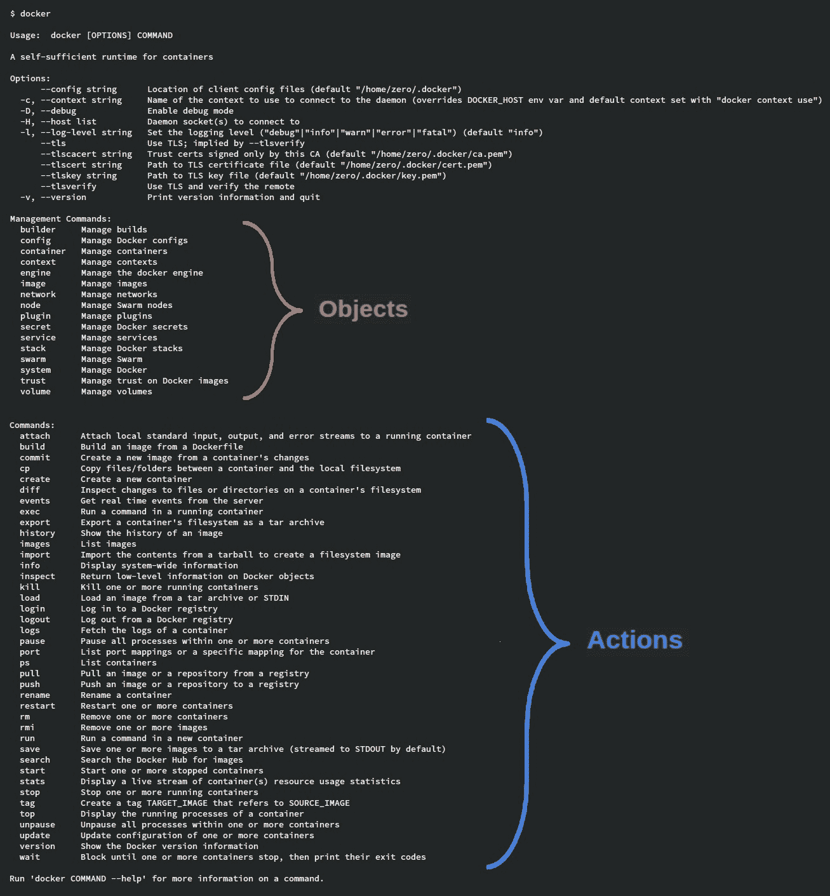

运行 Docker 容器

本章专门讲解 Docker 命令行。在之前的章节中，我们运行了一些容器，但并未详细讨论使用的参数和选项。

在本章中，我们将讨论不同的 Docker 对象，如镜像、容器和数据卷，以及它们的相关操作。并非所有对象都具有相同的功能，因此它们的操作和参数也不同。

记住，镜像构建是基于容器执行的。每一层都是在容器上执行命令后自动“提交”到 Docker 节点文件系统中的结果。所有这些层合并在一起，构成一个镜像。

在本章中，我们将涵盖以下主题：

+   深入审视 Docker 命令行

+   了解 Docker 对象

+   运行容器

+   与容器的交互

+   限制主机资源

+   将容器转换为镜像

+   格式化与筛选信息

+   管理设备

让我们首先来看一下如何使用 Docker 命令行。

# 第五章：技术要求

在本章中，我们将学习 Docker 容器的概念。在本章结束时，我们将提供一些实验，帮助你理解并学习涵盖的概念。这些实验可以在你的笔记本电脑或 PC 上运行，使用提供的 Vagrant 独立环境或你自己部署的任何 Docker 主机。更多信息可以在本书的 GitHub 仓库找到：[`github.com/PacktPublishing/Docker-Certified-Associate-DCA-Exam-Guide.git`](https://github.com/PacktPublishing/Docker-Certified-Associate-DCA-Exam-Guide.git)。

查看以下视频，看看代码如何实际运行：

"[`bit.ly/32AEGHU`](https://bit.ly/32AEGHU)"

# 深入审视 Docker 命令行

正如我们在前几章中学到的那样，Docker 是一个客户端-服务器应用程序。早期版本的 Docker 会同时安装这两个组件，但新版本允许我们只安装客户端来使用远程服务器。

我们在第一章，*现代基础设施与 Docker 应用* 中了解了各种 Docker 守护进程的选项和参数。在本章中，我们将回顾 Docker 客户端命令行。

当我们在 Linux 或 Windows 上使用 Docker 命令行时，我们总是指向 Docker 客户端，通常情况下，二进制文件或可执行程序分别位于 Linux 和 Windows 上的 `/usr/bin/docker` 或 `C:\ProgramData\Docker`。

Docker 的命令行使用格式是 `docker [OPTIONS] COMMAND`。各种选项用于定义我们将连接的守护进程以及如何建立这次通信。调试和日志级别也在此时进行管理。这些选项中的一些可以通过 Docker 客户端配置，在每个用户的 `config.json` 文件中设置，该文件位于用户的 `home` 目录下。

Docker 客户端配置文件 `config.json` 将管理过滤选项，我们将在本章末尾学习这些内容。它还存储对注册表的登录访问。

环境变量也可以用于配置 Docker 客户端的行为。以下是最常用的环境变量列表：

+   `DOCKER_CONFIG`: 这将设置 Docker 客户端的配置文件路径。

+   `DOCKER_CERT_PATH`: 这设置了客户端与服务器之间证书的路径。

+   `DOCKER_HOST`: 我们可以使用远程 Docker 引擎。默认情况下，我们将使用本地 Docker 守护进程。

+   `DOCKER_TLS`: 此选项启用 TLS 通信（需要证书才能正常工作）。

+   `DOCKER_TLS_VERIFY`: 此选项将不验证远程守护进程证书。

+   `DOCKER_CONTENT_TRUST`: 我们将使用此选项来启用内容信任功能（镜像不可变性和所有权）。

Docker 命令始终需要一个 Docker 守护进程，并且它们将针对**对象**执行。**这些是由 Docker 管理的内部资源，按类别分布，具有不同的功能和属性**。我们将在下一节中详细讨论这一点。

所有 Docker 对象都有自己的 ID。名称是与这些 ID 关联的标签，因此，在某些情况下，我们可以为一个对象指定多个名称。对象 ID 将唯一标识每个对象，因此，Docker 可以在不使用其类别的情况下显示或管理有关该对象的信息。我们建议在 Docker 命令行中始终使用类别。

下表显示了所有对象共有的命令：

| `ls` or `list` | 这将显示该类别中所有对象的列表。输出可能会有所不同，这取决于查询哪些对象，但通常会获得对象名称及其 ID。我们将使用 `--all` 或 `-a` 修饰符来显示所选类别的所有对象，因为在某些情况下，输出可能仅显示子集。例如，如果我们列出容器对象，默认情况下，我们只会得到正在运行的容器。已停止（退出）的容器将不会显示，除非使用 `--all` 命令修饰符。过滤功能允许我们仅检索对象的子集。我们将使用 `--filter` 或 `-f` 参数进行此操作。每个对象类别都将有自己的键，以便轻松过滤信息。稍后在本章节中，我们将学习如何过滤信息。格式化也非常重要。我们将使用 `--format` 选项格式化输出的信息。通常的格式包括 `table` 和 `json`，分别用于获取类似表格的信息和 JSON 格式。我们可以定制和排序获得的信息。所有过滤器应使用 Go 模板格式构建。格式化输出是一门艺术！稍后在本章节中，我们将看到许多选项。一个很好的起点始终是使用 `--format='{{json .}}'` 来查看可以用于格式化的 JSON 键。我们可以使用 `--quiet` 或 `-q` 避免完整命令的输出。此参数将仅显示该类别中列出的对象 ID。这对于将输出串联或管道化到其他命令非常有用。 |
| --- | --- |
| `rm` or `remove` | 此操作将删除定义的对象。我们可以使用它们的 ID 或名称来删除它们。一旦删除，它们将无法恢复。为了避免确认对象删除，我们将使用 `--force` 参数。 |
| `create` | 所有对象都可以创建和删除，但每个对象都有自己的参数。因此，我们将在不同章节中学习每个对象的参数。我们将从下一部分开始介绍容器参数。 |
| `inspect` | 要查看对象定义的属性，我们将使用 `inspect` 操作。默认情况下，对象描述将以 JSON 格式显示。我们还可以使用 `--format` 格式化其输出。在这种情况下，我们可以格式化对象描述的输出。这对于仅获取所需的几个值非常有用，如下例所示：`**$ docker image inspect nginx:alpine --format "{{ json .Config.Cmd }}"**``**["nginx","-g","daemon off;"]**` |

Docker 客户端是用 Go 编写的，它包含许多 Go 模板格式化和过滤选项。

每次我们使用 `docker ps`，实际上都在执行 `docker container ls`***.***

在接下来的部分中，我们将介绍 Docker 中可用的不同资源或对象。

# 学习关于 Docker 对象

让我们定义独立 Docker 守护程序可用的不同对象类别：

+   **镜像**：这些是创建容器的基础。在第二章《构建 Docker 镜像》中，我们了解了多层模板的概念，这些模板为容器的主进程提供根文件系统，并包含执行它所需的所有元信息。

+   **容器**：正如我们在第一章《现代基础设施与 Docker 应用》中所学，容器是为进程（或多个进程）隔离命名空间、资源和文件的组合。该进程将在一个封装环境中运行，仿佛它独自在自己的系统中运行，分享主机的内核及其资源。

+   **卷**：卷用于绕过写时复制容器的文件系统。因此，我们可以将数据存储在容器之外，避免其生命周期的影响。我们将在第四章《容器持久性与网络》中深入了解卷。

+   **网络**：容器在自己的网络命名空间中运行，但它们需要访问真实的基础设施网络。它们将使用主机的物理接口在桥接模式下运行，为每个容器接口创建虚拟接口。我们将在第四章《容器持久性与网络》中进一步了解这种工作模式和许多其他选项，*容器持久性和网络*。

+   **插件**：Docker 插件通过与 Docker 守护进程并行运行的进程扩展引擎功能。它们将与守护进程共享信息和配置，以提供新特性。插件有三种不同类型：授权插件、卷插件和网络插件。Docker 客户端命令行提供了安装和管理插件的接口。它们的配置将部署在 `/usr/lib/docker/plugins` 或 `/etc/docker/plugins` 目录下。

这些对象在独立的 Docker 守护进程中可用，但当主机参与分布式 Docker Swarm 集群时，还有其他对象。我们将在编排章节中讨论这些内容，但在这里我们将简要概述一下：

+   **Swarm**：该对象提供集群属性。它允许我们创建新的集群并加入或离开已创建的集群。它还通过管理证书颁发机构或锁定对集群证书的访问来维护集群安全。

+   **节点**：节点是集群中的主机。我们可以在集群中更新节点角色，并在需要时将其删除。我们还可以修改哪些节点将运行已定义的工作负载。

+   **服务**：Docker Swarm 不会管理容器。Docker Swarm 中的最小调度单元是服务。服务将创建任务，而任务将通过容器呈现。在 Docker Swarm 中，我们通过声明服务的状态和所需的健康任务数来部署服务。我们将能够创建服务、更新它们的属性（副本、用于容器的镜像等），或删除它们。

+   **堆栈**：当我们谈论在 Swarm 上部署工作负载时，通常使用堆栈，它是多服务应用程序。我们将定义一个应用程序运行所需的所有组件。这些组件将包括服务及其所有的卷、网络等，以及它们之间的交互。

Swarm 对象具有之前描述的所有操作。然而，我们还可以使用 `update` 操作来设置和更改对象属性。此操作仅在使用 Docker Swarm 时可用。

在下一节中，我们将学习如何使用描述的命令行安全地运行容器。

# 运行容器

容器只是以隔离方式在 Docker 主机上运行的进程。运行该进程所需的所有功能或属性可以在容器创建时进行调整。

## 主要容器操作

容器可以在需要时创建、执行和停止。下表将介绍此工作流程的主要容器操作：

| `create` | 因为容器是 Docker 对象，所以我们可以创建它们。当我们创建一个容器时，我们配置该容器的工作方式，但不启动它。这个阶段将准备一个容器，我们可以使用 `inspect` 查看其静态配置。任何动态配置都不会存在，因为容器尚未运行。 |
| --- | --- |
| `start` | 一旦容器被创建，就可以使用 `start` 启动它。这意味着容器定义的进程将以配置的隔离方式（内存、CPU、网络等）以及所需的外部资源执行。容器启动后，我们将能够列出它或查看其状态。 |
| `run` | 此操作将创建并启动一个容器。这是我们通常启动容器的方式。许多对象和操作有一些命令别名，例如 `docker run`。我们建议使用完整的句子，包括您正在执行操作的对象。无论是使用 `docker container run` 还是 `docker run` 启动的 Docker 容器将会在前台运行。默认情况下，您的终端将连接到容器的输出。为了避免这种行为，我们必须使用 `--detach` 或 `-d` 将容器启动在后台，与当前终端分离。 |
| `pause/unpause` | 我们可以使用 Linux 中的 cgroups 冻结容器的进程。该进程将保持暂停状态，直到被解冻。 |
| `stop` | 停止容器将遵循以下工作流程。首先，主进程将收到 `SIGTERM` 信号。这将尝试正常关闭和终止进程。默认情况下，Docker 守护程序将在发送第二个信号之前等待 10 秒。然后，守护程序将发送 `SIGKILL` 信号以完全终止进程。因此，守护程序首先尝试优雅地终止容器的主进程，如果未停止，则会强制终止。我们可以使用 `--stop-signal` 配置要发送的停止容器的信号。默认为 `SIGTERM`，如前所述。此外，我们可以使用 `--time` 参数更改等待发送第二个 `SIGKILL` 信号的秒数（默认为 10 秒）。当容器已经运行时，可以在创建或执行中使用 `--stop-timeout` 进行配置。 |
| `kill` | 正如我们先前提到的，当我们运行 `docker container stop` 时，Docker 守护程序将首先尝试优雅地停止它。有些情况下，我们希望立即完全杀死主进程。在这些情况下，我们可以使用 `docker container kill` 立即停止容器。可以使用 `-s` 更改发送的信号，默认情况下将发送 `SIGKILL` 信号。 |
| `restart` | `restart` 操作将停止并重新启动容器。这意味着先前学习的程序将被执行，并且将执行 Docker 容器的 `stop` 和 `start` 操作。因此，先前描述的参数也将有效。 |
| `rm` | 如我们在之前的章节中学到的，容器不是临时的。它们将保留在我们的系统中，直到有人删除它们。我们将使用 `docker container rm` 来删除它们。运行中的容器除非使用 `--force/-f` 参数，否则无法删除。建议在删除生产中的容器之前停止它们，以避免因错误而删除重要容器。 |
| `prune` | 此命令将删除所有已停止的容器。可以使用 `--force` 强制执行，可以使用 `--filter` 参数使用过滤器限制要删除的容器。 |
| `rename` | 使用此操作，我们更改容器名称。 |
| `update` | 使用 `update` 操作，我们可以更改容器的主机资源限制和其重启策略。 |

仅使用 Hyper-V 隔离的容器可以在 Windows 上暂停。

默认情况下，所有容器将使用非限制资源执行。除非我们限制它们访问主机资源，否则它们不会运行隔离。要限制容器可用的资源数量，必须在创建时指定其阈值。我们将在本章节的 *限制主机资源* 部分中使用相同的参数来管理容器资源。

我们可以使用`--rm`选项在容器执行完毕后将其删除。它还会删除在容器生命周期内创建的所有未命名卷。这些卷是临时定义的，用于覆盖写时复制文件系统。我们必须手动删除它们，或者使用`docker container rm`命令配合`-v`参数来删除它们。

## 容器网络属性

容器在自己的网络命名空间中运行。它们将获得自己的 IP 地址和网络资源。默认情况下，Docker 守护进程使用桥接网络，容器将通过复制主机值来获得自己的名称解析配置。我们可以在容器创建和执行时更改此行为。让我们回顾一下可以用于配置容器内部网络的选项：

| `--name` | 我们可以为每个容器指定一个名称。如果不指定容器名称，系统将生成一个随机名称。这样，我们可以通过这个定义的名称来管理容器。默认情况下，它将作为主机名使用。 |
| --- | --- |
| `--add-host` | 使用此参数，我们可以添加主机及其 IP 地址。我们将使用`host:ip`格式的条目。 |
| `--dns` | 此选项将允许我们避免使用默认的 DNS 解析。每当嵌入式 DNS 服务器无法解析名称时，查询将被转发到定义的外部 DNS 服务器（默认从主机复制）。 |
| `--dns-option` | 此选项将把与容器相关的选项添加到嵌入式 DNS 服务器中。 |

每个桥接网络将提供内部名称解析，使用 Docker 嵌入式 DNS 服务器，地址为`127.0.0.11`。唯一的例外是默认桥接接口。在这种情况下，我们需要使用`--link`来根据容器名称允许从另一个容器通过桥接接口访问已部署的容器。

| `--dns-search` | 此选项设置名称解析的搜索域名。 |
| --- | --- |
| `--domainname` | 此选项设置容器的域名。 |
| `--ip` 和 `--ip6` | 有时我们需要指定容器的 IP 地址，可以是 IPv4 或 IPv6。我们将在创建或执行容器时传递版本 4 或版本 6 的地址作为参数。内部 IPAM 将从桥接网络接口范围分配内部 IP 地址。 |
| `--hostname` | 我们可以设置容器的内部主机名，默认值为容器 ID。 |
| `--link` | 我们可以使用`CONTAINER_NAME:DNS_ALIAS`的形式添加到其他容器的内部名称解析。这些链接名称将可以被其他容器通过它们的名称或 IP 地址访问（这是默认选项）。 |
| `--mac-address` | 此选项允许我们设置容器的 MAC 地址。 |
| `--network` | 我们可以选择为容器提供何种类型的网络连接。默认情况下，所有容器将在默认的桥接网络上运行。在本章中，我们将只使用默认的网络模式，但也有其他选项，我们将在后续章节中学习这些选项。 |
| `--network-alias` | 此选项帮助我们为容器指定网络别名。这样我们可以对容器的 IP 地址进行更多的名称解析。 |

我们需要定义一个重启策略来管理容器的生命周期。我们要求容器快速停止/死亡和重新启动。弹性是应用程序可用性的关键。我们可以使用 `--restart` 参数来管理容器的行为。共有四个选项：

+   `no`：这是默认选项。如果容器停止或被手动停止，容器将保持停止状态。

+   `on-failure`：此选项仅当容器因主进程失败而停止时才会重新启动容器。

+   `always`：不管容器是被人为停止还是自我停止，我们都希望容器持续运行；因此，Docker 守护进程将始终尝试重新启动它。

+   `unless-stopped`：如果我们执行了 Docker `stop` 命令，此选项将不会重新启动容器。

这些选项非常重要，因为它们管理 Docker 守护进程在重新启动时需要对容器执行的操作。例如，当我们需要重启主机时。

## 容器行为定义

以下表格展示了一些可用于覆盖镜像预定义值的选项：

| `--entrypoint` | 我们可以在创建或执行容器时覆盖定义的入口点。不要依赖于此功能的安全性，因为任何人都可以将你的入口点更改为镜像中包含的任何其他二进制文件或脚本。 |
| --- | --- |
| `--env` 或 `-e` 或 `--env-file` | 我们可以覆盖基础镜像中定义的变量，或为新容器添加新的变量。 |
| `--expose` | 我们可以为容器暴露新的端口。这些端口将在内部可用，但不会被发布。 |
| `--health-cmd,` `--health-interval,` `--health-retries,` `--health-start-period,` `--health-timeout` | 所有这些选项将覆盖镜像中定义的健康检查值。 |
| `--no-healthcheck` | 此选项禁用镜像中定义的健康检查。 |
| `--label` 或 `-l` 或 `--label-file` | 此选项允许在创建或执行容器时添加标签。这些标签将帮助我们筛选或查找与进程相关的信息。Docker 守护进程或编排器自动添加一些标签，用于标识分组对象。 |
| `--user` 或 `-u` | 此选项覆盖镜像中定义的用户。 |
| `--volume` 或 `-v` | 此选项使用定义的卷或主机路径，并将其挂载到容器内。此选项非常重要，因为用于绕过写时复制文件系统的临时卷（也称为未命名卷）将在 `/var/lib/docker/volumes`（或 MS Windows 主机上的等效路径）下创建。它们通过随机 ID 进行标识。卷不会随容器的生命周期变化，除非我们在执行 `docker container rm` 操作时使用 `-v` 参数，否则必须手动删除。 |

在容器创建时传递的参数将作为参数添加到镜像定义的入口点中。因此，镜像定义的 CMD 值将被容器执行时传递的参数所覆盖。其他参数，如 `--user`、`--env`、`--entrypoint` 或 `--health-cmd`、`--health-timeout` 等，将覆盖镜像定义的值，从而修改镜像的进程行为。请注意，参数语法与镜像定义的键相关。

一旦容器被创建并执行，默认情况下，终端将连接到其标准输出和错误输出。我们将获得所有主要进程的错误和输出。我们还可以通过使用 `--interactive` 或 `-i` 选项以交互方式启动容器。通常，我们会使用 `--tty` 或 `-t` 分配一个伪终端，以便将一个完全功能的终端附加到主进程上。

## 执行容器

一个简单的例子将帮助我们理解这种行为。我们将使用`nginx:alpine`镜像启动一个小型的 web 服务器。在这种情况下，我们使用的是来自 `docker.io` 注册表的官方 `nginx` 镜像，标记为 `alpine`，它是基于 Alpine Linux 的最小镜像：

```
$ docker container run nginx:alpine
 Unable to find image 'nginx:alpine' locally
 alpine: Pulling from library/nginx
 9d48c3bd43c5: Already exists
 1ae95a11626f: Pull complete
 Digest: sha256:77f340700d08fd45026823f44fc0010a5bd2237c2d049178b473cd2ad977d071
 Status: Downloaded newer image for nginx:alpine
```

如果镜像已经存在于您的 Docker 主机上，输出可能会有所不同。所有对象 ID 在您的系统中将不同，因为它们会自动为您创建。

我们可以通过执行 `exit` 命令或按下 *Ctrl + C* 键盘组合来退出正在运行的容器的标准输出。

我们被困在这个终端中，因为我们启动了一个以 Nginx 为主进程的容器。发生了什么呢？好吧，我们正在附着到容器的主进程上。如果我们按下 *Ctrl* + *C* 键组合，由于我们附着在该进程上，它会向容器的主进程发送中断信号，导致 `nginx` 进程结束。然而，如果我们打开另一个终端并列出正在运行的容器，它将按预期列出：

```
$ docker container ls
 CONTAINER ID IMAGE COMMAND CREATED STATUS PORTS NAMES
 f84f6733537c nginx:alpine "nginx -g 'daemon of…" 11 seconds ago Up 10 seconds 80/tcp gallant_lederberg
```

由于我们没有为容器设置名称，它会随机生成一个名称；在此情况下是 `gallant_lederberg`。

所有名称将通过随机组合的名称和形容词来创建。

我们还可以检查这个正在运行的容器以获取其当前的 IP 地址。要访问其信息，我们可以使用其 ID 或名称。我们将获得所有由 Docker 守护进程管理的对象信息。接下来，我们将查看 `docker container inspect` 命令输出中的 `NetworkSettings` 部分：

```
$ docker container inspect gallant_lederberg

 {
 "Id": "f84f6733537c3733bda67387b394cabce3f35cf7ee50a46937cb1f59f2a7a680",
 "Created": "2019-10-20T09:34:46.179017074Z",
 "Path": "nginx",
......
......
......
"NetworkSettings": {
 "Bridge": "",
 "SandboxID": "7bb519745e9b7becc806f36bc16b141317448388f7c19a3bd86e1bc392bea469",
 "HairpinMode": false,
......
......
"Gateway": "172.17.0.1",
 "IPAddress": "172.17.0.2",
......
......
```

这个输出显示容器已创建，并且正在我们的系统上运行，IP 为`172.17.0.2`。我们没有将其服务暴露给外部世界，尽管我们在之前的`docker container ls`输出中注意到它的端口和协议（`80`/`tcp`）。创建`nginx:alpine`镜像的人声明了这个端口来访问容器的主进程。我们不会继续在这里审查容器的网络方面，因为我们有一个完整的网络章节，[第四章，*容器持久性与网络*。只需了解我们在系统中运行着一个`nginx`进程，但它对用户不可访问：

```
$ ps -fea |grep -v grep |egrep -e nginx -e f84f67
 zero 1524 5881 0 11:34 pts/0 00:00:00 docker container run nginx:alpine
 root 1562 1693 0 11:34 ? 00:00:00 containerd-shim -namespace moby -workdir /var/lib/containerd/io.containerd.runtime.v1.linux/moby/f84f6733537c3733bda67387b394cabce3f35cf7ee50a46937cb1f59f2a7a680 -address /run/containerd/containerd.sock -containerd-binary /usr/bin/containerd -runtime-root /var/run/docker/runtime-runc
 root 1594 1562 0 11:34 ? 00:00:00 nginx: master process nginx -g daemon off;
 systemd+ 1644 1594 0 11:34 ? 00:00:00 nginx: worker process
 systemd+ 1646 1594 0 11:34 ? 00:00:00 nginx: worker process
 systemd+ 1647 1594 0 11:34 ? 00:00:00 nginx: worker process
 systemd+ 1648 1594 0 11:34 ? 00:00:00 nginx: worker process
```

我们没有更改原始镜像中的任何参数，因此我们使用了镜像创建者的选项和声明的值。例如，`nginx`在容器内部以 root 身份运行。容器的端口`80`无法从桥接网络外部访问。

我们已经学过一些允许容器交互的参数，因此让我们启动一个简单的`busybox`容器，访问之前容器的服务：

```
$ docker run -ti busybox
 Unable to find image 'busybox:latest' locally
 latest: Pulling from library/busybox
 7c9d20b9b6cd: Pull complete
 Digest: sha256:fe301db49df08c384001ed752dff6d52b4305a73a7f608f21528048e8a08b51e
 Status: Downloaded newer image for busybox:latest
# wget http://172.17.0.2 -q -O -
 <!DOCTYPE html>
 <html>
 <head>
 <title>Welcome to nginx!</title>
 <style>
 body {
 width: 35em;
 margin: 0 auto;
 font-family: Tahoma, Verdana, Arial, sans-serif;
 }
 </style>
 </head>
 <body>
 <h1>Welcome to nginx!</h1>
 <p>If you see this page, the nginx web server is successfully installed and
 working. Further configuration is required.</p>

 <p>For online documentation and support please refer to
 <a href="http://nginx.org/">nginx.org</a>.<br/>
 Commercial support is available at
 <a href="http://nginx.com/">nginx.com</a>.</p>

 <p><em>Thank you for using nginx.</em></p>
 </body>
 </html>
/ # exit
```

在运行的`nginx`容器的输出中，我们将读取几行内容。这些是`nginx`的日志行，因为主`nginx`进程被重定向到标准输出。实际上，错误日志和访问日志都被重定向到容器的输出。如果我们回到第一个终端，这就是我们从运行`nginx`容器的标准输出和错误中得到的内容：

```
$ docker container run nginx:alpine
 172.17.0.3 - - [20/Oct/2019:10:26:56 +0000] "GET / HTTP/1.1" 200 612 "-" "Wget" "-"
 172.17.0.3 - - [20/Oct/2019:10:27:09 +0000] "GET / HTTP/1.1" 200 612 "-" "Wget" "-"
```

请注意，`busybox`容器的 IP（在第二个终端中运行）显示在`nginx`请求中。

我们已经了解到，在同一网络子网中运行两个容器会有无限制的访问权限。这是因为我们没有任何规则来禁止这种交互。两个容器都使用默认的桥接网络，因此它们运行在同一网络中。

如果我们通过在容器的 shell 中使用简单的`exit`命令退出`busybox`容器，我们将退出主进程（shell），因此容器会死亡。

我们可以通过使用`--all`或`-a`来列出非运行中的容器，因为默认情况下，`docker container ls`只会显示正在运行的容器：

```
$ docker container ls --all
 CONTAINER ID IMAGE COMMAND CREATED STATUS PORTS NAMES
 4848ed569f61 busybox "sh" 34 minutes ago Exited (0) 31 minutes ago interesting_yalow
 f84f6733537c nginx:alpine "nginx -g 'daemon of…" About an hour ago Up About an hour 80/tcp gallant_lederberg
```

在这里，我们可以看到可以查看运行和停止的容器。我们将停止`gallant_lederberg`容器（ID：`f84f6733537c`）。请记住，执行`docker container stop`时，会先尝试优雅地停止，然后才会杀死主进程：

```
$ docker stop gallant_lederberg
 gallant_lederberg
```

容器立即停止。现在，让我们运行另一个不容易停止的容器。我们可以运行一个执行无限 ping 命令到`www.google.com`的`busybox`镜像，并查看我们尝试停止它时会发生什么：

```
$ docker container run --name ping busybox ping www.google.com
 PING www.google.com (172.217.16.228): 56 data bytes
 64 bytes from 172.217.16.228: seq=0 ttl=56 time=694.384 ms
 64 bytes from 172.217.16.228: seq=1 ttl=56 time=291.257 ms
 64 bytes from 172.217.16.228: seq=2 ttl=56 time=365.674 ms
 64 bytes from 172.217.16.228: seq=3 ttl=56 time=433.928 ms
 64 bytes from 172.217.16.228: seq=4 ttl=56 time=718.424 ms
```

我们已经通过传递的参数`ping www.google.com`修改了`busybox`镜像定义的 CMD。结果，我们将获得一个无限 ping 输出。为了停止这个容器并查看它需要多长时间才能停止，我们可以从另一个终端发送`stop`命令：

```
$ time docker container stop ping
 ping
 real 0m10,721s
 user 0m0,019s
 sys 0m0,032s
```

我们在 Docker 命令前添加了`time`来查看容器停止所需的时间。正如我们预期的那样，ping 进程需要被终止，因此`stop`命令的执行时间超过了默认的 10 秒。

我们使用`--name`参数启动了一个命名容器。为了确保容器名称的唯一性，一旦使用名称创建了容器，就无法创建另一个同名的容器。当我们进入本书的编排章节时，我们将学习如何使用编排工具管理容器名称。要部署另一个 ping 容器，在这种情况下，我们需要先使用`docker container rm ping`删除第一个 ping 容器。

我们已经了解了如何使用`docker container run`命令启动容器以及如何停止容器。现在让我们回顾一下容器创建过程，以便理解容器的生命周期：

```
$ docker container create --name webserver nginx:alpine
 6121184dd136781ceb87a210049b25334ce140968dd110ea7d6945ced3ca6668
```

我们获得了容器的标识符，但它并没有运行。我们可以通过执行`docker container ls --filter name=webserver`来验证这一点。

如果我们过滤所有容器，包括那些未运行的容器，我们可以看到容器已创建：

```
$ docker container ls --all --filter name=webserver
 CONTAINER ID        IMAGE               COMMAND                  CREATED             STATUS              PORTS               NAMES
 6121184dd136        nginx:alpine        "nginx -g 'daemon of…"   2 minutes ago       Created                                 webserver
```

现在容器已经创建完成，我们可以使用`docker container start`启动它：

```
$ docker container start webserver
 webserver
```

容器已启动，但我们没有附加到其主进程的输入/输出。容器的创建与容器的运行是不同的。正如我们将要学习的，Docker Swarm 服务和 Kubernetes Pod 会创建容器配置，并且还会启动一定数量的副本。这与启动单个容器不同。

`STATUS` 列显示容器现在正在运行：

```
$ docker container ls --filter name=webserver
 CONTAINER         ID       IMAGE    COMMAND        CREATED     STATUS PORTS NAMES
 6121184dd136 nginx:alpine "nginx -g 'daemon of…" 10 minutes ago  Up     3 minutes 80/tcp webserver
```

我们可以通过向`docker container run`命令添加`--attach`参数来附加容器的输入/输出。这样，我们将以交互模式运行容器。记住，您与容器主进程的交互将取决于创建容器时传递的参数。我们也可以将`--interactive`作为`start`参数。

## 容器安全选项

有许多与容器安全相关的选项，用于容器的创建和执行。让我们通过一些示例来回顾最重要的几个选项：

| `--cap-add or --cap-drop` | 请记住，并非所有系统调用在容器内部都可用。我们可以使用此选项添加或删除默认的系统调用。例如，如果容器需要一些特殊的网络功能，比如创建接口或允许 1024 以下的端口，我们将添加`NET_ADMIN`能力。 |
| --- | --- |
| `--disable-content-trust` | 我们使用此选项来禁用任何内容信任验证（例如检查镜像的来源或所有权）。在生产环境中不推荐使用此选项。 |
| `--isolation` | 此选项仅在 MS Windows 容器中使用。允许的值为 `process` 或 `hyper-v`。我们将选择容器中使用的隔离方式。记住，它们具有不同的特性，正如我们在第一章中学习的，*《使用 Docker 构建现代基础设施和应用程序》*。 |
| `--privileged` | 特权容器将以具有所有功能并且没有任何资源限制的方式运行。使用此类容器时要小心，并始终尝试确定应用程序所需的功能，而不是使用特权模式。 |
| `--read-only` | 我们可以使用只读根文件系统来运行容器。一般来说，这是一个非常好的实践，但我们必须确保所有必需的容器存储将使用卷。 |
| `--security-opt` | 我们将能够在更改默认安全行为时更改容器选项；例如，使用不同的 seccomp 配置文件或指定容器将以未受限制的方式运行。自定义的 SELinux 策略也将使用此参数来通知 SELinux 非默认值。 |

所有在此描述的安全选项都必须谨慎使用。理解应用程序的功能或需求非常重要，而不是使用默认或不安全的配置。 |

理解执行特权模式容器将绕过所有资源限制非常重要。确保 `--privileged` 选项仅在您真正理解以所有功能和没有任何资源限制的方式运行容器的影响时使用。被允许执行特权容器的用户可以在没有 CPU 或内存限制的情况下运行进程，并且可以修改重要的系统文件。 |

在执行特权容器之前，花时间审查应用程序要求。仅在非常明确的情况下使用它们，并且要注意这些容器的任何可疑行为。 |

以只读模式执行容器非常有用。我们可以确保应用程序在其生命周期中不会发生变化。当然，使用只读模式取决于您的应用程序，但花点时间分析过程并尝试使其在只读文件系统中工作是很好的做法。我们将可写目录分离到临时卷中，以存储进程数据。这是提高安全性的一个非常好的做法。 |

## 使用主机命名空间 |

以下选项与安全性没有直接关系，但非常重要。它们与容器隔离有关，必须小心管理，因为任何滥用都可能导致重大安全问题： |

| `--ipc``--pid``--uts` | 如果需要，我们可以共享主机命名空间。例如，如果我们在容器内执行监控应用程序，并且需要能够监视主机进程，我们将使用 `--pid host` 包含主机的 `pid` 命名空间。注意这些选项，因为如果我们还使用额外的能力或特权模式，容器将能够管理主机进程。 |
| --- | --- |
| `--network` | 我们之前提到过这个选项，但在这个上下文中没有提到。我们可以使用主机网络。在这种情况下，我们将在容器内使用主机的网络。因此，所有主机接口都将在容器内可用。其他容器的接口也将被包括在内。 |
| `--userns` | 在第一章中，我们讨论了容器内的用户命名空间。当我们介绍容器的主要概念时，我们了解了进程隔离。此选项将允许我们在容器内实现一个隔离的用户命名空间。我们必须首先准备用户映射，然后在创建或执行容器时设置使用哪个映射。 |

我们可以在 Docker 主机上轻松验证一些提到的选项。例如，我们可以使用主机网络模式运行一个容器，并检索容器的接口：

```
$ docker container run busybox ip add
 1: lo: <LOOPBACK,UP,LOWER_UP> mtu 65536 qdisc noqueue qlen 1000
 link/loopback 00:00:00:00:00:00 brd 00:00:00:00:00:00
 inet 127.0.0.1/8 scope host lo
 valid_lft forever preferred_lft forever
 37: eth0@if38: <BROADCAST,MULTICAST,UP,LOWER_UP,M-DOWN> mtu 1500 qdisc noqueue
 link/ether 02:42:ac:11:00:03 brd ff:ff:ff:ff:ff:ff
 inet 172.17.0.3/16 brd 172.17.255.255 scope global eth0
 valid_lft forever preferred_lft forever
```

现在，我们可以使用相同的镜像启动另一个容器，但使用主机网络：

```
$ docker container run --network=host busybox ip add
 1: lo: <LOOPBACK,UP,LOWER_UP> mtu 65536 qdisc noqueue qlen 1000
 link/loopback 00:00:00:00:00:00 brd 00:00:00:00:00:00
 inet 127.0.0.1/8 scope host lo
 valid_lft forever preferred_lft forever
 inet6 ::1/128 scope host
 valid_lft forever preferred_lft forever
 2: enp0s25: <NO-CARRIER,BROADCAST,MULTICAST,UP> mtu 1500 qdisc fq_codel qlen 1000
 link/ether 68:f7:28:c1:bc:13 brd ff:ff:ff:ff:ff:ff
 3: wlp3s0: <BROADCAST,MULTICAST,UP,LOWER_UP> mtu 1500 qdisc mq qlen 1000
 link/ether 34:02:86:e3:f6:25 brd ff:ff:ff:ff:ff:ff
 inet 192.168.200.161/24 brd 192.168.200.255 scope global dynamic wlp3s0
 valid_lft 49sec preferred_lft 49sec
 inet6 fe80::ee87:e44f:9189:f720/64 scope link
 valid_lft forever preferred_lft forever
 6: virbr1: <NO-CARRIER,BROADCAST,MULTICAST,UP> mtu 1500 qdisc noqueue qlen 1000
 link/ether 52:54:00:f7:57:34 brd ff:ff:ff:ff:ff:ff
 inet 192.168.39.1/24 brd 192.168.39.255 scope global virbr1
 valid_lft forever preferred_lft forever
 ......
```

所有主机接口都可以在这个小型 busybox 容器内使用。这对于监控主机资源非常有用。这可以帮助我们解决主机网络问题，而无需安装任何软件，尤其是在生产环境中。

在下一节中，我们将学习如何与运行中的容器进行交互，在容器内执行新进程，以及将内容复制到容器或从容器复制。

# 与容器交互

我们可以与运行中的或已停止的容器进行交互。我们需要与容器交互，以在其中运行一些进程，查看其文件，或获取主进程的输出。这些是我们将用于与容器交互的主要操作：

| `attach` | 使用 `attach`，我们将能够连接到主进程的 `STDIN/STDOUT/STDERR`。换句话说，我们将附加到这个进程上与它交互。需要小心，因为用键盘发送信号可能会中断进程和容器的生命周期（我们可以通过 `--sig-proxy false` 来省略这种行为）。我们只能附加到正在运行的容器上。 |
| --- | --- |
| `cp` | 这个操作将允许我们向容器的文件系统发送/接收内容。它的作用与正常的复制相同，但我们可以使用 `--archive` 来保持文件的所有权。我们只需使用源路径和目标路径，并使用 `<container>:</path_to_file>` 符号来引用容器内的文件。在将文件复制到/从 Docker 主机时，容器可以是停止状态。 |
| `exec` | 使用`exec`，我们能够在容器的隔离环境中执行命令。这个新命令会继承所有主进程的命名空间。因此，这个新命令似乎在容器内运行，因为它们共享命名空间。 |
| `logs` | 我们可以通过访问容器的`STDERR`和`STDOUT`来查看容器的所有输出。通过使用日志驱动程序可以改进日志记录功能，例如将这些日志发送到外部主机或日志后端。在执行后台容器或服务时，日志记录是非常重要的。了解容器内部发生了什么，唯一的方法就是监控其日志。 |

一旦附加到容器，我们可以使用 *Ctrl* + *P* + *Q* 键盘组合来分离，但我们可以在附加容器时使用`--detach-keys`选项来更改此键盘组合，或者在创建或启动容器时进行更改。

现在我们将快速查看正在运行的容器（如果你没有任何容器，请按照上一节中的描述运行一个容器）：

```
$ docker container ls
 CONTAINER ID IMAGE COMMAND CREATED STATUS PORTS NAMES
 4b2806790a4f nginx:alpine "nginx -g 'daemon of…" 2 hours ago Up 40 minutes 80/tcp webserver
```

现在，我们使用`docker exec`在容器内执行`ps -ef`：

```
$ docker container exec webserver ps -ef
 PID USER TIME COMMAND
 1 root 0:00 nginx: master process nginx -g daemon off;
 6 nginx 0:00 nginx: worker process
 7 nginx 0:00 nginx: worker process
 8 nginx 0:00 nginx: worker process
 9 nginx 0:00 nginx: worker process
 10 root 0:00 ps -ef
```

我们在容器的隔离环境内执行了该命令，使用的是主进程声明的用户（在本示例中为`root`）。

如果我们想执行交互式命令——例如一个 shell，可以通过指定`--interactive`（或`-i`）并使用`--tty`（或`-t`）分配伪终端来实现。我们可以使用`--env`为这个新进程设置环境变量，或者使用`--user`改变执行用户。如果我们需要在容器内以特殊权限执行新命令，还可以使用`--privileged`。这在测试环境中调试时非常有用：

```
$ docker exec -ti --user nginx --env ENVIRONMENT=test webserver /bin/sh
 / $ id
 uid=101(nginx) gid=101(nginx) groups=101(nginx)
 / $ env|grep ENVIRON
 ENVIRONMENT=test
```

我们可以使用`docker container cp`将主机`/tmp`目录中的文件复制到容器内：

```
$ docker container cp /tmp/TEST webserver:/tmp/TEST
```

正如我们之前提到的，日志记录是管理容器的一个重要方面。我们可以在运行或停止的容器上使用`docker container logs`。这些是非常有用的选项，可以改进日志显示的方式：

| `--follow` 或 `-f` | 使用此选项，我们可以获取正在运行的容器的实时输出。每次有新条目时，输出将被更新。 |
| --- | --- |
| `--tail` | 使用此选项，我们可以指定要显示的前几行日志。默认情况下，将显示所有行。 |
| `--since` 或 `--until` | 这两个选项对于仅显示某个时间戳或相对时间段（例如 30 分钟或 30m）之前或之后的日志非常有用。 |

现在，让我们回顾一下之前执行的 Web 服务器容器中的一些`docker container logs`参数。在以下示例中，我们将提取所有来自`webserver`容器输出的行：

```
$ docker container logs --tail all webserver
 172.17.0.3 - - [20/Oct/2019:18:39:52 +0000] "GET / HTTP/1.1" 200 612 "-" "Wget" "-"
 172.17.0.3 - - [20/Oct/2019:18:39:55 +0000] "GET / HTTP/1.1" 200 612 "-" "Wget" "-"
 172.17.0.3 - - [20/Oct/2019:18:39:57 +0000] "GET / HTTP/1.1" 200 612 "-" "Wget" "-"
```

在下一节中，我们将回顾如何通过限制容器访问主机资源来避免主机问题。

# 限制主机资源

我们已经看过了一些限制容器资源消耗的选项。我们将能够限制对 CPU、内存和块设备的访问。当我们关注内存资源时，有两种类型的限制：软限制和硬限制。

软限制将表示资源的预留。这意味着容器可以消耗超过声明值的内存，但该值将被预留。

另一方面，硬限制将确保不会消耗超过声明值的资源。实际上，如果超过此限制，容器将被终止。如果超出内存限制，**内存不足**（也称为 **OOM**）杀手会终止主进程以防止主机出现问题。

请记住，默认情况下，如果没有指定任何限制，容器将能够消耗所有主机资源。

有许多选项可确保资源访问的限制。我们可以通过这些参数自动修改默认的 cgroups 设置：

| `--cpu-period` 和 `--cpu-quota` | CFS 是 Linux 内核的 CPU 调度程序，使用这些参数，我们可以修改调度程序的周期。两个参数都必须以微秒为单位配置，并将修改 CPU 限制。 |
| --- | --- |
| `--cpu-shares` | 此参数管理容器主进程的权重。默认情况下，它的值为 1024，我们可以通过增减该值来设置 CPU 周期的比例。这是一个软限制，这意味着 Docker 守护进程不会阻止容器在 Docker Swarm 上的调度。 |
| `--cpus` 或 `-c` | 此选项帮助我们设置将提供给容器进程的可用 CPU 资源量。它与主机中可用的 CPU 数量相关。例如，在拥有三个 CPU 的主机上，使用 `--cpus=1.5` 的值将为该容器保证一半的 CPU 资源。 |
| `--cpuset-cpus` | 此 CPU 设置比 CPU 权重或设置使用多少 CPU 更简单。我们只需指定一个以逗号分隔的主机 CPU 列表，容器可以在这些 CPU 上运行（我们在写 CPU 范围时从 0 开始）。 |
| `--memory` 或 `-m` | 这将设置容器进程可用的最大内存量。这是一个阈值，Docker 守护进程不会允许容器超过此限制。每当超过此限制时，内核将终止容器的主进程。我们将得到内存不足错误。这一过程被称为 `oom-killer`。我们可以使用 `--oom-kill-disable` 禁用 `oom-killer`。这可能会很危险，使用此选项时必须小心，因为容器可能会消耗掉所有主机的内存资源。 |
| `--memory-reservation` | 使用此参数，我们将为进程配置内存预留。它应该设置为低于之前提到的 `--memory` 阈值。 |
| `--blkio-weight` 和 `--blkio-weight-device` | 第一个参数将管理容器可以使用的总块直接 I/O 带宽，而第二个参数将管理特定块设备可用的带宽。默认情况下，所有容器使用相同的带宽，值为 500，我们可以将其增加或减少，范围为 10 到 1000。 |

我们将要使用的许多功能都需要宿主机内核支持 Linux 能力。我们可以使用 `docker system info` 来查看所有被禁用的能力，并查找任何 `WARNING` 消息。

每当我们需要更新容器限制时，可以使用 `docker container update` 操作，它允许我们更改容器的内存、CPU 和块设备使用限制。

有一些操作可以帮助我们审查容器的资源使用情况。

我们将使用 `docker container stats` 来获取容器的使用指标。默认情况下，仅显示 CPU 使用百分比、内存使用及其限制、网络和块 I/O，以及容器内进程的数量。我们可以使用 `--format` 参数格式化输出，支持常见的 Go 语言格式模式。通常我们会使用表格格式：

```
$ docker stats --all --format "table [{{.Container}}] {{.Name}}\t{{.CPUPerc}}\t{{.MemUsage}}"
 [CONTAINER] NAME CPU % MEM USAGE / LIMIT
 [8ab15ccdc42f] stress 0.00% 0B / 0B
 [ed19e4376cdc] intelligent_easley 0.00% 0B / 0B
 [0ca76903840f] vigilant_mendeleev 0.00% 0B / 0B
 [afa67a5a2162] inspiring_mclaren 0.00% 0B / 0B
 [49229db83166] mystifying_maxwell 0.00% 0B / 0B
 [4cef73c07691] naughty_diffie 0.00% 0B / 0B
 [5dcc40de271e] adoring_wright 0.00% 0B / 0B
 [07aeb6f9c6df] focused_fermi 0.00% 0B / 0B
 [bbe4cb0d9cac] magical_chaplygin 0.00% 0B / 0B
 [4b2806790a4f] webserver 0.00% 4.676MiB / 11.6GiB
```

我们可以指定容器的名称或 ID，只显示它的统计信息。需要注意的是，`docker stats` 是一个流式命令。这意味着除非我们使用 `--no-stream` 参数来获取静态输出，否则它将不断刷新内容并显示新数据。

根据显示的数据量，有时，值会被截断。这在许多其他对象的操作中也可能发生。为了避免重要数据的截断，我们可以在需要获取所有列数据时使用 `--no-trunc`。

另一方面，`docker container top` 将以类似 top 的格式显示容器内部所有进程的信息。使用我们之前示例中的 Web 服务器，我们可以执行 `docker container top webserver` 来获取 `nginx` 主进程及其子进程的状态：

```
$ docker container top webserver
 UID PID PPID C STIME TTY TIME CMD
 root 17878 17848 0 19:06 ? 00:00:00 nginx: master process nginx -g daemon off;
 systemd+ 17924 17878 0 19:06 ? 00:00:00 nginx: worker process
 systemd+ 17925 17878 0 19:06 ? 00:00:00 nginx: worker process
 systemd+ 17927 17878 0 19:06 ? 00:00:00 nginx: worker process
 systemd+ 17928 17878 0 19:06 ? 00:00:00 nginx: worker process
```

我们可以使用 `--memory-swap` 和 `--memory-swappiness` 来增加交换访问，但不推荐这么做。交换可能会降低应用程序性能，而且它会破坏分布式微服务的逻辑。调度将允许我们根据不同组件的需求在不同的节点上运行它们。

在接下来的部分，我们将回顾与图像相关的操作。通过这些操作，我们将能够从容器创建图像，正如我们在 *第二章，构建 Docker 图像* 中所学到的那样。

# 将容器转换为图像

我们已经学习了三种不同的构建图像的方法，它们都以某种方式使用了容器。现在让我们回顾一下可以用来创建图像的容器操作：

| `commit` | `docker commit` 将允许我们从容器创建镜像。我们将一个容器的层添加为新的镜像层。结果，我们获得一个新的镜像。我们将设置一个新的镜像名称（尽管我们学会了可以根据需要随时更改镜像名称）以及其标签。在提交过程中，容器将被暂停，以避免其执行期间的文件更改。 |
| --- | --- |
| `export` | 此操作将创建一个包含容器文件系统（包括其所有层的数据）的`.tar`文件。默认情况下，此命令将二进制内容流式传输到`STDOUT`，但我们可以使用`--output`或`-o`来定义此内容的文件。 |

当我们需要了解我们对原始镜像层所做的更改时，我们可以使用`docker container diff`。这将显示修改或创建在容器层上的所有文件的列表。

使用前面示例中的容器 Web 服务器，我们可以观察到在其执行期间所做的所有更改：

```
$ docker container diff webserver
 C /var
 C /var/cache
 C /var/cache/nginx
 A /var/cache/nginx/client_temp
 A /var/cache/nginx/fastcgi_temp
 A /var/cache/nginx/proxy_temp
 A /var/cache/nginx/scgi_temp
 A /var/cache/nginx/uwsgi_temp
 C /root
 A /root/.ash_history
 C /run
 A /run/nginx.pid
 C /tmp
 A /tmp/TEST 
```

此列表显示已添加的文件，标记为`A`，以及已更改的文件和目录，标记为`C`。请注意，每次向目录添加文件时，目录也会更改。

我们通常会在 Docker 主机中部署数十、数百甚至数千个容器。重要的是能够检索关于它们的信息，以便管理其属性和状态。在下一节中，我们将审查一些用于在容器环境中格式化和过滤信息的选项。

# 格式化和过滤信息

对任何命令输出进行格式化和过滤始终是有用的。在 Docker 命令中，具有长列表或输出时，这确实是必要的。让我们开始格式化一些命令输出。

几乎所有表示或显示任何信息的操作都可以进行格式化。Docker 使用 Go 模板来修改输出格式。能够根据我们的特定需求格式化输出非常有用。在这里，我们将使用表格格式。每列将表示一个指定的键。

我们将考虑一个简短的示例输出，列出主机上所有部署容器，使用`docker container ls`以表格格式：

```
$ docker container ls --all --format "table {{.Names}}: {{.Image}} {{.Command}}" --no-trunc 
NAMES: IMAGE COMMAND
loving_diffie: alpine "/bin/sh"
recursing_fermi: alpine "/bin/sh"
silly_payne: centos "/bin/bash"
wonderful_visvesvaraya: centos "/bin/bash"
optimistic_lamarr: centos "/bin/bash"
focused_shtern: centos "/bin/bash"
stress: frjaraur/stress-ng:alpine "stress-ng stress-ng --vm 2 --vm-bytes 1G --timeout 60s"
vibrant_faraday: baseimage:development "curl"
lucid_wright: baseimage:production "curl"
elastic_cori: baseimage:production "env"
```

我们已使用`--no-trunc`来禁用打印数值的截断。如果不使用此选项，所有长字符串都会被截断，只显示少量字符。通常，这些字符足以识别值，但有时我们需要整个字符串；例如，用于查看容器的主要执行命令。

知道可以查询哪些键来进行格式化非常有用。为了获取所有允许用于格式化的键，我们将使用`--format='{{json .}}'`。这将显示指定操作的所有列或键（例如，尝试`docker container ls --all --format='{{json .}}'`）。输出将显示为未格式化的 JSON。

未格式化的 JSON 输出不容易阅读。我们可以使用 **jq** ([`stedolan.github.io/jq/`](https://stedolan.github.io/jq/))，这是一种命令行 JSON 处理器，便于阅读。使用 jq，我们将获得更漂亮的 JSON 格式化输出。

有许多定制化的格式化选项：

| `json` | 如我们所见，此选项将输出格式化为单行 JSON 字符串。例如，我们可以使用 `--format='{{json .Config}}'` 与 `docker inspect` 输出容器，获取其所有配置的键和值。 |
| --- | --- |
| `table` | 表格格式选项并非在所有输出中都可用，但在列表中会表现得非常好。 |
| `join/split` | 使用这些选项，我们可以连接或拆分关键输出；例如，`'{{json .Mounts}}'` 或 `'{{split .Image ":"}}'`。 |
| `lower/upper/title` | 这些选项允许我们将字符串转换为小写、大写或仅将首字母大写；例如，`'{{title .Name}}'` 将显示所有首字母大写的名称。 |
| `range` | 此选项将帮助我们格式化列表/数组值。你必须使用 `'{{range <JSON keys> }}{{end}}'` 来正确管理列出的值。 |
| `println` | 此选项将在新的一行中打印每个查询值。它对于格式化范围值非常有趣。 |

`--pretty` 选项可用于检查某些对象。它非常有用，但如前所述，并非所有对象都可用。例如，您可以使用它来检查服务，我们将在第八章中学习，*使用 Docker Swarm 进行编排*。

格式化将帮助我们只获取所需的信息，但当我们必须处理大量项目时，将不太容易。我们将使用 `--filter` 选项来过滤信息，只检索匹配某些键和值的特定对象。并非所有键都可用于过滤。我们将使用带有其值的键进行过滤，并且可以根据需要使用多个过滤选项。如果我们添加多个相同键的过滤器，它们将作为 `OR` 使用。但如果我们使用不同的键，则将是 `AND` 过滤器。我们将使用“相等”（使用 `=`）或“不同”（使用 `<>`）来比较键值。

容器对象可以通过以下方式进行过滤：

+   **ID 或名称**：使用这些选项，我们可以通过容器的 ID 或名称来查找容器。

+   **标签**：此情况特别，因为我们可以使用键来匹配所有带有该标签或键值格式的容器，以便找到该键的特定值。

+   **已退出**：当使用 `--all` 过滤停止并带有错误的容器时，我们将使用带有退出整数的此选项，例如。

+   **状态**：我们使用此选项按容器状态（`created`、`restarting`、`running`、`removing`、`paused`、`exited` 或 `dead`）进行过滤。

+   **祖先**：这一点非常重要，因为它将允许我们按镜像名称和标签进行过滤。

+   **之前/自此**：此过滤器允许我们指定日期，例如，查找运行时间较长的容器或按其创建日期进行筛选。

+   **卷/网络**：这个选项允许我们筛选使用卷或网络的容器。它对于删除旧资源非常有用。

+   **发布或暴露**：这些选项过滤哪些容器正在发布或暴露指定的端口。我们可以使用一系列的端口和协议（`<startport-endport>`/`[<proto>]`）。

+   **健康**：此过滤器允许我们根据容器的健康检查状态（健康、不健康、启动中或无）进行筛选。

+   **Is-task**：这个选项非常有趣，因为它允许我们在使用 Docker Swarm 编排时，按任务创建的容器进行筛选。

注意，`--format` 用于过滤 `docker <object> inspect` 命令。我们只能查询特定的对象键和子键。例如，使用 `--format='{{json .Config}}'` 将只显示 `Config` 键下的键和值***。***

在下一部分，我们将回顾如何将主机附加的设备像在容器内部一样使用。

# 管理设备

我们可以为容器提供主机设备的访问权限。我们使用 `--device` 参数与 `docker container create` 或 `docker container run` 一起使用来实现这一点。这样，我们将能够使用直接连接到主机的硬件设备，例如串口控制器、块存储或音频设备。

默认情况下，设备将具有读写权限。为了能够操作特殊设备，默认情况下还会添加 `mknod` 权限。我们可以通过在命令行中使用 `r`、`w` 和 `m` 来覆盖这些默认设置，作为 `--device` 选项的修饰符。

作为示例，我们可以将我们的 `lvm` 映射的块设备挂载到定义的目录；请注意，必须添加挂载功能。在这个例子中，我们添加了 `SYS_ADMIN` 功能：

```
$ docker run -ti --cap-add SYS_ADMIN --device /dev/mapper/centos-root:/dev/sdx centos
 [root@5ccb0ef8ce84 /]# mkdir /data
 [root@5ccb0ef8ce84 /]# mount /dev/sdx /data
 [root@5ccb0ef8ce84 /]# cd /data
 [root@5ccb0ef8ce84 data]# ls
 bin  boot  dev  etc  home  lib  lib64  media  mnt  opt  proc  root  run  sbin  srv  sys  tmp  usr  vagrant  var
```

在以下示例中，我们在容器内使用我们的主机声音设备。将这些设备添加到容器中将允许我们运行带有声音的应用程序：

```
$ docker container run -ti --device /dev/snd alpine
 / # apk add --update -q alsa-utils
 / # speaker-test -t wav -c 6 -l1

 speaker-test 1.1.9

 Playback device is default
 Stream parameters are 48000Hz, S16_LE, 6 channels
 WAV file(s)
 Rate set to 48000Hz (requested 48000Hz)
 Buffer size range from 2048 to 16384
 Period size range from 1024 to 1024
 Using max buffer size 16384
 Periods = 4
 was set period_size = 1024
 was set buffer_size = 16384
 0 - Front Left
 1 - Front Right
 2 - Unused
 3 - Unused
 4 - Unused
 5 - Unused
 Time per period = 8.298695
```

在这里，我们了解到不仅仅是文件或目录可以在容器内部访问。我们可以像直接连接到容器一样使用特殊设备。

# 本章实验

在本章的实验中，我们将运行容器并与它们互动。我们还将回顾一些示例，限制它们的资源，格式化和过滤命令输出。

若要运行这些实验，请从本书的 GitHub 仓库中部署 `environments/standalone-environment`（[`github.com/PacktPublishing/Docker-Certified-Associate-DCA-Exam-Guide.git`](https://github.com/PacktPublishing/Docker-Certified-Associate-DCA-Exam-Guide.git)），如果您还没有这样做。您也可以使用自己的 CentOS 7 服务器。从 `environments/standalone-environment` 文件夹中使用 `vagrant up` 启动虚拟环境。

如果你正在使用`standalone-environment`，请等待它启动。我们可以使用`vagrant status`检查节点的状态。使用`vagrant ssh standalone`连接到你的实验节点。`standalone`是你节点的名称。你将使用`vagrant`用户，并通过`sudo`获取管理员权限。你应该得到如下输出：

```
Docker-Certified-Associate-DCA-Exam-Guide/environments/standalone$ vagrant up
Bringing machine 'standalone' up with 'virtualbox' provider...
...
Docker-Certified-Associate-DCA-Exam-Guide/environments/standalone$ vagrant status
Current machine states:
standalone running (virtualbox)
...
Docker-Certified-Associate-DCA-Exam-Guide/environments/standalone$
```

现在，我们可以使用`vagrant ssh standalone`连接到`standalone`节点。如果你之前已经部署过`standalone`虚拟节点，并且只是通过`vagrant up`启动它，过程可能有所不同：

```
Docker-Certified-Associate-DCA-Exam-Guide/environments/standalone$ vagrant ssh standalone
[vagrant@standalone ~]$ 
```

如果你正在重用`standalone-environment`，这意味着 Docker Engine 已经安装。如果你启动了一个新的实例，请执行`/vagrant/install_requirements.sh`脚本，以确保你拥有所有必需的工具（Docker Engine 和 docker-compose）：

```
[vagrant@standalone ~]$ /vagrant/install_requirements.sh 
```

现在，你已准备好开始实验。

## 审查 Docker 命令行对象选项

Docker 命令行将允许我们与 Docker 守护进程交互。我们将使用 Docker 对象或资源及其允许的操作。在下面的截图中，我们可以轻松地查看 Docker `help`命令输出中的这种行为：



对象将在第一部分中出现，之后是常见的选项。在底部，我们将看到所有允许的选项。正如我们在本章中提到的，并非所有对象都有相同的操作。本章专门讨论容器。那么，让我们回顾容器允许的操作（输出被截断）：

```
[vagrant@standalone ~]$ docker container --help
Usage: docker container COMMAND
Manage containers
Commands:
 attach Attach local standard input, output, and error streams to a running container
 commit Create a new image from a container's changes
.....
.....
.....
 unpause Unpause all processes within one or more containers
 update Update configuration of one or more containers
 wait Block until one or more containers stop, then print their exit codes
Run 'docker container COMMAND --help' for more information on a command.
```

我们应该在每种对象上使用`--help`来查看它们可用的操作。如果我们没有设置任何`DOCKER_HOST`变量（也没有使用`-H`），我们将与本地 Docker 守护进程交互。我们将在命令行中使用这些参数来连接远程守护进程。

事实上，有许多知名的 Docker 命令行别名：

+   `docker run`: `docker container run`

+   `docker ps`: `docker container ls`

+   `docker rm`: `docker container rm`

+   `docker start/stop`: `docker container start/stop`

+   `docker port`: `docker container port`

+   `docker rmi`: `docker image rm`

建议使用长命令行术语，因为它们实际上指示了一个对象和一个操作。这将避免混淆或拼写错误。

## 执行容器

这是一个长时间的实验，我们将回顾容器的许多操作和选项。让我们开始吧：

1.  在后台基于 Alpine 镜像执行一个交互式容器：

```
[vagrant@standalone ~]$ docker container run -ti -d alpine
aa73504ba37299aa7686a1c5d8023933b09a0ff13845a66be0aa69203eea8de7
```

1.  现在，我们将查看并重命名容器`myalpineshell`：

```
[vagrant@standalone ~]$ docker container ls -l
CONTAINER ID IMAGE COMMAND CREATED STATUS PORTS NAMES
aa73504ba372 alpine "/bin/sh" About a minute ago Up About a minute elastic_curran
```

我们使用`-l`或`--last`来获取在 Docker 主机上执行的最新容器。请注意，接下来的代码中我们将使用`-q`来获取容器的 ID。

现在，我们使用容器的 ID 来重命名之前启动的容器：

```
[vagrant@standalone ~]$ docker container rename $(docker container ls -ql) myalpineshell
```

如果我们再次查看最新的容器，我们会看到它有一个不同的名称。注意，容器正在运行（输出将显示不同的日期）：

```
[vagrant@standalone ~]$ docker container ls -l
CONTAINER ID IMAGE COMMAND CREATED STATUS PORTS NAMES
aa73504ba372 alpine "/bin/sh" 11 minutes ago Up 11 minutes myalpineshell
```

1.  我们将终端附加到正在运行的`myalpineshell`容器，并在`/tmp`目录下创建一个名为`TESTFILE`的空文件。然后，我们从容器中`exit`：

```
[vagrant@standalone ~]$ docker container attach myalpineshell
/ # touch /tmp/TESTFILE
/ # exit
```

1.  如果我们再次查看容器状态，我们会发现它已经停止，但退出状态是正确的：

```
[vagrant@standalone ~]$ docker container ls -l
CONTAINER ID IMAGE COMMAND CREATED STATUS PORTS NAMES
aa73504ba372 alpine "/bin/sh" 14 minutes ago Exited (0) 46 seconds ago myalpineshell
```

该容器现在显示`Exited (0)`状态。Alpine 镜像的主进程是一个 shell。其 CMD 是`/bin/sh`。我们通过执行`exit`命令退出。因此，退出状态是`0`，执行过程中没有发现问题。

1.  现在，我们将通过执行一个不存在于镜像中的命令来强制使容器失败。例如，我们将在一个新容器中执行`curl`命令：

```
[vagrant@standalone ~]$ docker container run alpine curl www.google.com
docker: Error response from daemon: OCI runtime create failed: container_linux.go:345: starting container process caused "exec: \"curl\": executable file not found in $PATH": unknown.
ERRO[0001] error waiting for container: context canceled 
```

由于`curl`二进制文件不存在，我们甚至无法执行所需的命令。因此，容器已创建但未执行：

```
[vagrant@standalone ~]$ docker container ls -l
CONTAINER ID IMAGE COMMAND CREATED STATUS PORTS NAMES
466cc346e5d3 alpine "curl www.google.com" 17 seconds ago Created fervent_tharp
```

1.  现在，我们将在新容器中执行`ls -l /tmp/TESTFILE`：

```
[vagrant@standalone ~]$ docker container run alpine ls -l /tmp/TESTFILE
ls: /tmp/TESTFILE: No such file or directory

[vagrant@standalone ~]$ docker container ls -l
CONTAINER ID IMAGE COMMAND CREATED STATUS PORTS NAMES
7c328b9a0609 alpine "ls -l /tmp/TESTFILE" 8 seconds ago Exited (1) 6 seconds ago priceless_austin
```

如预期的那样，`/tmp/TESTFILE`文件在这个新容器中不存在。我们只在`myalpineshell`容器中创建了它。实际上，文件仍然在那里。请注意，这次容器被执行了，且退出状态显示为错误代码。这是执行`ls`命令时因文件不存在而导致的退出代码。

1.  让我们再次重命名最后执行的容器：

```
[vagrant@standalone ~]$ docker container rename $(docker container ls -ql) secondshell
```

1.  现在，我们将在主机文件系统上创建`/tmp/TESTFILE`文件，并将其复制到`secondshell`容器中：

```
[vagrant@standalone ~]$ touch /tmp/TESTFILE

[vagrant@standalone ~]$ docker container cp /tmp/TESTFILE secondshell:/tmp/TESTFILE
```

无法使用`docker container cp`从一个容器复制文件到另一个容器。

1.  现在，让我们重新启动`secondshell`容器并观察新的结果：

```
[vagrant@standalone ~]$ docker container start secondshell
secondshell

[vagrant@standalone ~]$ docker container ls -l
CONTAINER ID IMAGE COMMAND CREATED STATUS PORTS NAMES
7c328b9a0609 alpine "ls -l /tmp/TESTFILE" 32 minutes ago Exited (0) 4 seconds ago secondshell
```

该文件现在存在于`secondshell`容器内，因此执行正确退出。我们可以在`STATUS`列中看到这一新结果（`Exited (0)`）。我们通过将文件复制到已停止的容器中，操作了一个死容器。因此，容器仍然存在于主机系统中，直到我们将其删除。

1.  现在，我们将删除`secondshell`容器，并尝试过滤容器列表的输出。我们将搜索`secondshell`和`myalpineshell`容器：

```
[vagrant@standalone ~]$ docker container rm secondshell
secondshell

[vagrant@standalone ~]$ docker container ls --all --filter name=myalpineshell --filter name=secondshell
CONTAINER ID IMAGE COMMAND CREATED STATUS PORTS NAMES
aa73504ba372 alpine "/bin/sh" 59 minutes ago Exited (0) 45 minutes ago myalpineshell
```

如预期的那样，我们只得到了`myalpineshell`容器。

1.  为了完成这个实验，我们将再次启动`myalpineshell`容器，使用`docker container start -a -i`将终端附加到已启动的容器。然后，我们将使用*Ctrl* + *P* + *Q*逃脱序列将容器发送到后台。最后，我们将使用`docker container exec`命令附加第二个 shell 到容器：

```
[vagrant@standalone ~]$ docker container start -a -i myalpineshell
<PRESS Ctrl+p+q>
/ # read escape sequence

[vagrant@standalone ~]$ docker container exec -ti myalpineshell sh
/ # ps -ef
PID USER TIME COMMAND
 1 root 0:00 /bin/sh
 6 root 0:00 sh
 11 root 0:00 ps -ef
/ # exit
```

我们可以观察到，退出新执行的 shell 进程并不会终止`myalpineshell`容器。两个进程共享相同的命名空间：

```
[vagrant@standalone ~]$ docker container ls --all --filter name=myalpineshell
CONTAINER ID IMAGE COMMAND CREATED STATUS PORTS NAMES
aa73504ba372 alpine "/bin/sh" About an hour ago Up 4 minutes myalpineshell
```

## 限制容器资源

在这个实验中，我们将使用来自 Docker Hub 的`frjaraur/stress-ng:alpine`镜像。该镜像基于 Alpine Linux，并安装了`stress-ng`包。它很小，有助于我们对容器施加压力。

我们将从测试内存限制开始。在这个实验中，我们将在同一主机上使用两个终端。在第一个终端中，我们将启动 `docker container stats`。在所有实验过程中保持这个终端运行，因为在这个终端中，我们将观察不同的行为。

在第二个终端中，我们将启动两个容器，这两个容器将尝试消耗 2 GB 内存。我们将使用 `--vm 2 --vm-bytes 1024M` 创建两个进程，每个进程分配 1,024 MB 内存：

1.  我们将启动一个具有内存预留的容器。这意味着 Docker 守护进程将为该容器预留至少该数量的内存。请记住，这不是限制；这是预留：

```
[vagrant@standalone ~]$ docker container run --memory-reservation=250m --name 2GBreserved -d frjaraur/stress-ng:alpine --vm 2 --vm-bytes 1024M
b07f6319b4f9da3149d41bbe9a4b1440782c8203e125bd08fd433df8bac91ba7
```

1.  现在，我们将启动一个限制内存的容器。只允许 250 MB 内存，尽管该容器会尝试消耗 2 GB：

```
[vagrant@standalone ~]$ docker container run --memory=250m --name 2GBlimited -d frjaraur/stress-ng:alpine --vm 2 --vm-bytes 1024M
e98fbdd5896d1d182608ea35df39a7a768c0c4b843cc3b425892bee3e394eb81
```

1.  在第一个终端中，我们运行 `docker container stats` 来查看容器的资源消耗。我们会看到类似这样的内容（ID 和使用情况会有所不同）：

```
CONTAINER ID NAME CPU % MEM USAGE / LIMIT MEM % NET I/O BLOCK I/O PIDS
b07f6319b4f9 2GBreserved 203.05% 1.004GiB / 11.6GiB 8.65% 6.94kB / 0B 0B / 0B 5
e98fbdd5896d 2GBlimited 42.31% 249.8MiB / 250MiB 99.94% 4.13kB / 0B 1.22GB / 2.85GB 5
```

如果你收到关于限制资源的警告消息，这是正常的。`WARNING: Your kernel does not support swap limit capabilities or the cgroup is not mounted. Memory limited without swap.` 这条消息表示你的操作系统不会限制容器的 `swap`。在 Debian/Ubuntu 上，默认情况下它是禁用的。

我们可以观察到没有限制的容器正在消耗超过指定的内存。在第二个案例中，容器限制为 250 MB，尽管进程可以消耗更多内存，但它被限制在 250 MB 内，不会超过此限制。正如我们在 `MEM USAGE/LIMIT MEM` 列中看到的，它最多只能达到其限定的内存，但不能超过这个限制。

1.  删除 `2GBreserved` 和 `2GBlimited` 容器：

```
[vagrant@standalone ~]$ docker container rm -f 2GBlimited 2GBreserved
2GBlimited
2GBreserved
```

现在，我们将限制 CPU 消耗。

1.  我们将启动三个具有不同 CPU 限制和进程要求的容器。第一个容器限制为一个 CPU，但需要两个 CPU。这不是一个真实的需求，但如果系统中有两个 CPU，进程将尝试使用两个 CPU：

```
[vagrant@standalone ~]$ docker container run -d --cpus=1 --name CPU2vs1 frjaraur/stress-ng:alpine --cpu 2 --timeout 120 
```

第二个容器限制为两个 CPU，并且需要两个 CPU。在执行过程中，它将尝试使用这两个 CPU：

```
[vagrant@standalone ~]$ docker container run -d --cpus=2 --name CPU2vs2 frjaraur/stress-ng:alpine --cpu 2 --timeout 120
```

第三个容器限制为四个 CPU，且需要两个 CPU。在这种情况下，进程可以使用四个 CPU，但由于它们只使用两个 CPU，因此除非我们尝试使用超过四个 CPU，否则不会有真正的限制：

```
[vagrant@standalone ~]$ docker container run -d --cpus=4 --name CPU2vs4 frjaraur/stress-ng:alpine --cpu 2 --timeout 120
```

1.  如果我们观察 Docker 容器的统计输出，我们可以确认预期结果：

```
CONTAINER ID        NAME                CPU %               MEM USAGE / LIMIT    MEM %               NET I/O             BLOCK I/O           PIDS
0dc652ed28b0        CPU2vs4             132.47%             7.379MiB / 11.6GiB   0.06%               4.46kB / 0B         0B / 0B             3
ec62ee9ed812        CPU2vs2             135.41%             7.391MiB / 11.6GiB   0.06%               5.71kB / 0B         0B / 0B             3
bb1034c8b588        CPU2vs1             98.90%              7.301MiB / 11.6GiB   0.06%               7.98kB / 0B         262kB / 0B          3
```

到此为止，我们已经回顾了如何限制容器的资源。我们通过 `docker container stats` 测试了 CPU 和内存的使用情况，将它们推向了预定的限制。

现在，让我们通过一些实验来回顾格式化和过滤。

## 格式化和过滤容器列表输出

在这个实验中，我们将回顾 `docker container ls` 输出。让我们开始吧：

1.  启动多个容器。在这个示例中，我们将运行三个 `nginx:alpine` 实例，并使用顺序名称：

```
[vagrant@standalone ~]$ docker run -d --name web1 --label stage=production nginx:alpine
bb5c63ec7427b6cdae19f9172f5b0770f763847c699ff2dc9076e60623771da3

[vagrant@standalone ~]$ docker run -d --name web2 --label stage=development nginx:alpine
4e7607f3264c52c9c14b38412c95dfc8c286835fd1ffab1d7898c5cfab47c9b8

[vagrant@standalone ~]$ docker run -d --name web3 --label stage=development nginx:alpine
fcef82c80ed0b049705609885bc9c518bf062a39bbe2b6d68b7017bcc6dcaa14
```

1.  让我们使用`docker container ls`默认输出列出正在运行的容器：

```
[vagrant@standalone ~]$ docker container ls
CONTAINER ID IMAGE COMMAND CREATED STATUS PORTS NAMES
fcef82c80ed0 nginx:alpine "nginx -g 'daemon of…" About a minute ago Up 59 seconds 80/tcp web3
4e7607f3264c nginx:alpine "nginx -g 'daemon of…" About a minute ago Up About a minute 80/tcp web2
bb5c63ec7427 nginx:alpine "nginx -g 'daemon of…" About a minute ago Up About a minute 80/tcp web1
```

1.  由于我们希望能够查看容器的当前状态，因此我们可以格式化输出，使其包括标签信息：

```
[vagrant@standalone ~]$ docker container ls \
--format "table {{.Names}} {{.Command}}\\t{{.Labels}}" 
NAMES COMMAND                 LABELS
web3 "nginx -g 'daemon of…"   maintainer=NGINX Docker Maintainers <docker-maint@nginx.com>,stage=development
web2 "nginx -g 'daemon of…"   stage=development,maintainer=NGINX Docker Maintainers <docker-maint@nginx.com>
web1 "nginx -g 'daemon of…"   stage=production,maintainer=NGINX Docker Maintainers <docker-maint@nginx.com>
```

1.  现在，让我们只过滤出开发容器（`stage=development`）：

```
[vagrant@standalone ~]$ docker container ls --format "table {{.Names}} {{.Command}}\\t{{.Labels}}" --filter label=stage=development
NAMES COMMAND LABELS
web3 "nginx -g 'daemon of…" maintainer=NGINX Docker Maintainers <docker-maint@nginx.com>,stage=development
web2 "nginx -g 'daemon of…" maintainer=NGINX Docker Maintainers <docker-maint@nginx.com>,stage=development
```

1.  现在，让我们使用列表输出杀死那些开发容器：

```
[vagrant@standalone ~]$ docker container kill $(docker container ls --format "{{.ID}}" --filter label=stage=development)

[vagrant@standalone ~]$ docker container ls --format "table {{.Names}}\\t{{.Labels}}"
NAMES               LABELS
web1                maintainer=NGINX Docker Maintainers <docker-maint@nginx.com>,stage=production
```

只有被标记为`production`的`web1`仍在按预期运行。

过滤和格式化非常有用。练习这些方法，因为它们对 Docker 认证助理考试非常重要。

# 总结

本章专门讲解了 Docker 命令行和运行容器。我们发现了一个强大的命令行工具，它允许我们从镜像工件创建容器，在主机之间共享它们，并执行已经构建好的应用组件。

我们学习了如何与不同的 Docker 对象进行交互，以及在独立 Docker 主机环境和编排环境中有哪些可用的对象。

然后，我们回顾了如何创建、执行、暂停/恢复、停止或杀死容器。它们会一直存在于我们的 Docker 主机中，直到被从系统中移除。我们还学习了如何操控容器的执行行为以及它们如何在网络中存在。为了提高安全性，我们介绍了许多选项，并且还学习了以只读模式执行容器是如何非常有用的。

限制容器资源是生产环境中的必要操作。默认情况下，它们可以消耗主机的所有资源，这可能非常危险。我们学习了如何通过软硬限制来避免这种情况，确保我们的应用程序可以在具有足够资源的主机上运行，并且不会干扰其他应用。

在动态环境中部署应用时，需要格式化和过滤特定信息。我们学习了格式化和过滤操作如何帮助我们检索特定的信息。

本章最后，我们学习了如何将主机的设备作为直接附加到容器的设备来使用。

在下一章，我们将讨论容器的持久性和它们的网络功能。

# 问题

1.  以下哪个选项不适用于容器？

a) `build` b) `update` c) `destroy` d) `create`

1.  以下哪个句子是错误的？

a) 容器的生命周期通过`start`和`stop`命令来管理

b) 容器总是在 10 秒后停止

c) 容器可以先创建然后启动

d) 容器生命周期内创建的卷必须手动删除，除非我们在删除容器时使用`-v`选项

1.  以下哪个句子是关于`docker kill`的正确描述？

a) 它会杀死所有容器进程

b) 它会向容器的主进程发送一个`SIGKILL`信号

c) 它会在容器被杀死后移除容器

d) 它默认会等待 10 秒钟再真正杀死容器

1.  我们执行了一个名为`webserver`的容器。以下哪一句是错误的？

a) 可以使用`docker container rm --force`删除它。 b) 我们可以使用`docker container update`更新它的镜像。 c) 我们可以使用`docker container rename`将`webserver`容器重命名为`websrv`。 d) 我们可以使用`docker container logs`查看容器的输出。

1.  我们执行了`docker container run --name app1 --user 1000 --memory 100m --privileged alpine touch /testfile`命令。以下哪一句是正确的？

a) `/testfile`作为 root 用户创建，因为容器执行时具备所有权限。

b) 容器无法使用超过 100m 的主机内存。

c) `/testfile`没有创建，因为我们使用了 ID 为`1000`的用户，并且该用户无法在根目录(`/`)写入。

d) 我们使用了`--privileged`选项。这个选项将禁用容器内所有的 root 权限，因此无法创建文件。

# 进一步阅读

请参考以下链接，了解本章涉及的主题：

+   Docker 命令行参考：[`docs.docker.com/engine/reference/commandline/docker/`](https://docs.docker.com/engine/reference/commandline/docker/)

+   内存限制行为：[`medium.com/faun/understanding-docker-container-memory-limit-behavior-41add155236c`](https://medium.com/faun/understanding-docker-container-memory-limit-behavior-41add155236c)
