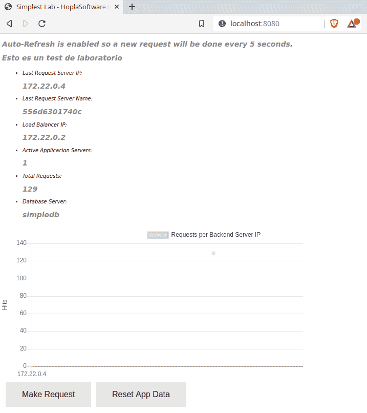

容器的持久性和网络

容器是运行在主机上的进程。这看起来很简单，但在一组节点上如何实现呢？如果我们追求高可用性，能够在池中的任何主机上运行容器将确保在任何地方都能执行。但这种方法需要在我们的应用程序中一些特殊的逻辑。我们的应用必须完全可移植，并避免与任何主机之间的摩擦和依赖关系。具有大量依赖的应用总是更难移植。我们需要找到一种方法来管理容器的状态数据。本章将回顾不同的持久化策略。

另一方面，前述的主机池必须能够与所有容器进行通信。在本章中，我们将学习基本的独立主机网络，并介绍高级集群编排网络概念。

在本章中，我们将讨论无状态和有状态应用程序之间的差异，卷如何工作以及我们如何使用它们，以及 Docker 守护进程如何在独立环境中提供网络功能。我们还将考虑容器之间的交互以及如何发布容器内运行的进程提供的服务。

本章将涵盖以下主题：

+   了解无状态容器和有状态容器

+   了解不同的持久化策略

+   容器中的网络

+   了解容器交互

+   发布应用程序

让我们开始吧！

# 技术要求

在本章中，我们将学习 Docker 卷和网络概念。在本章的最后，我们将提供一些实验，帮助你理解并学习所展示的概念。这些实验可以在你的笔记本电脑或 PC 上运行，使用提供的 Vagrant 独立环境或你自己已部署的任何 Docker 主机。你可以在本书的 GitHub 仓库中找到更多信息：[`github.com/PacktPublishing/Docker-Certified-Associate-DCA-Exam-Guide.git`](https://github.com/PacktPublishing/Docker-Certified-Associate-DCA-Exam-Guide.git)

查看以下视频，看看代码如何运行：

"[`bit.ly/34DJ3V4`](https://bit.ly/34DJ3V4)"

# 了解无状态容器和有状态容器

可移植性是现代应用程序的关键，因为它们应该能够在每个环境中运行（无论是本地还是云端）。容器为这些情况做好了准备。我们还将追求生产环境中应用的高可用性，而容器也将在这里帮助我们。

不是所有的应用程序默认都可以使用容器。进程的状态和数据在容器内管理起来很困难。

在第一章，*现代基础设施和基于 Docker 的应用程序*中，我们了解到容器并不是短暂的。它们存在于我们的主机中。容器被创建、执行并停止或杀死，但它们会一直存在于主机中，直到被删除。我们可以重新启动之前停止的容器。但这仅适用于独立环境，因为所有信息都存储在主机数据路径定义的目录下（在 Linux 和 Windows 中，默认路径分别是`/var/lib/docker`和`C:\ProgramData\docker`）。如果我们将工作负载（即作为容器运行的应用组件）迁移到另一台主机上，我们将无法在那儿获取它们的数据和状态。如果我们需要升级它们的镜像版本，会发生什么呢？在这种情况下，我们可以运行一个新的容器，所有内容将重新创建。我们可以启动一个新的容器，但我们需要保持所有的应用数据。

之前，我们介绍了卷作为绕过容器内部文件系统及其生命周期的一种方法。卷中的一切，实际上都在容器的文件系统之外。这将帮助我们通过直接访问主机的设备来提升应用性能，同时它也能保存数据。即使容器被移除，卷也会保持存在（除非在移除时使用`--volumes`或`-v`选项）。因此，卷有助于我们本地维护应用数据，但如果需要在其他 Docker 主机上执行怎么办？我们可以共享镜像，但除非我们也能在它们之间共享卷，否则容器相关的数据将无法存在。

在这些情况下，无状态进程——那些不需要任何持久数据来工作的进程——更容易管理。这些进程总是容器运行的候选者。

那么对于有状态的进程——那些在执行之间使用持久数据的进程，怎么办呢？在这种情况下，我们必须小心。我们应该提供外部卷或数据库来存储进程的状态及其所需数据。当我们设计基于微服务的应用架构时，这些概念是非常重要的。

让我们深入了解卷是如何工作的。

## 学习卷是如何工作的

之前，我们学习了如何在镜像中定义卷，以简单地绕过容器的文件系统。以下是一个简单的 Dockerfile 定义，展示了定义的卷（这是 PostgreSQL 数据库官方镜像的摘录）：

```
FROM alpine:3.10
RUN set -ex; \
 postgresHome="$(getent passwd postgres)"; \
 postgresHome="$(echo "$postgresHome" | cut -d: -f6)"; \
 [ "$postgresHome" = '/var/lib/postgresql' ]; \
 mkdir -p "$postgresHome"; \
 chown -R postgres:postgres "$postgresHome"
...
...
RUN mkdir -p /var/run/postgresql && chown -R postgres:postgres /var/run/postgresql && chmod 2777 /var/run/postgresql
ENV PGDATA /var/lib/postgresql/data
RUN mkdir -p "$PGDATA" && chown -R postgres:postgres "$PGDATA" && chmod 777 "$PGDATA"

VOLUME /var/lib/postgresql/data

COPY docker-entrypoint.sh /usr/local/bin/
ENTRYPOINT ["docker-entrypoint.sh"]
EXPOSE 5432
CMD ["postgres"]
```

我们省略了许多行，因为我们只想回顾 `VOLUME` 的定义。在这种情况下，存储在`/var/lib/postgresql/data` 目录下的所有数据将位于容器文件系统之外。这是一个**未命名卷**的定义，它将在我们运行使用此镜像的容器时，通过随机 ID 在系统中进行标识。此卷的定义是为了绕过写时复制文件系统。每次创建或运行新的容器时，都将创建一个新的随机标识符卷。这些卷应当手动删除，或者在删除关联容器时使用 `--volume` 或 `-v` 选项来删除。

现在是时候定义我们可以在 Docker 中使用的不同类型的卷了：

+   **未命名卷**：这些是在镜像上定义的卷，因此使用随机标识符创建它们。由于它们没有名称，因此很难在本地文件系统上跟踪它们。由于卷可能会随着应用程序的增长而快速增大，因此在本地系统上运行任何镜像之前，检查卷定义非常重要。记住，未命名的卷将会在 Docker 数据根路径下增长，无论该路径位于何处。

+   **命名卷**：这些是我们手动创建的卷。正如我们在*第一章*《现代基础设施与 Docker 应用》中学到的那样，*卷是 Docker 对象，我们可以对其进行一些操作来控制它们*。在这一章中，我们将学习与它们相关的操作以及如何使用它们。这些卷也会位于数据根路径下，但我们可以使用不同的插件或驱动程序来创建它们。驱动程序将允许本地或远程卷，例如通过 NFS。在这些情况下，我们在数据根路径下看到的将是指向实际挂载的远程文件系统的链接。因此，如果这些卷是远程的，它们将不会消耗本地存储。

+   **本地主机目录或文件**：在这种情况下，我们将在容器内使用主机的目录和文件。我们通常将这些卷称为**绑定挂载**。我们必须小心文件和目录的权限，因为我们也可以在容器内使用任何特殊文件（包括设备）。如果权限设置得过于开放，将使用户能够访问主机设备。它们将需要适当的进程能力和权限。重要的是要理解，Docker 不关心块设备、目录和文件系统在 Docker 主机上的挂载方式。它们总是像本地可用一样被使用。绑定挂载不会作为卷列出。

+   **tmpfs 卷**：这种类型的卷是临时的。它们只会在主机内存中保持。当容器停止时，卷将被移除。它们内部的文件不会持久化。

各种类型的卷可以以只读模式挂载到容器内。当卷数据不应该被运行中的进程修改时，这非常重要且有用，例如在提供静态网页内容时。我们可以有一些容器应该能够修改数据，另一些容器则只会读取并以只读模式提供这些已修改的数据。

命名卷或绑定挂载将保留数据。未命名卷将在新容器中创建。请记住这一点。如果我们需要为未命名卷提供一些数据，应该在容器启动时进行。我们还可以在镜像定义中定义一个过程。这个概念非常重要，因为`VOLUME`定义在 Dockerfile 中的位置非常关键。正如我们在第二章《构建 Docker 镜像》中学到的那样，镜像的创建是基于容器执行的顺序。如果我们为特定路径添加一个卷，所有后续的执行将不会在该目录中保留数据。构建过程将在每个新容器上创建一个新的未命名卷，执行之间的内容不会被复用。

## 学习卷对象操作

卷可以被创建、使用和移除。我们还可以检查它们的所有属性。下表展示了卷对象的可执行操作：

| **对象** | **操作** |
| --- | --- |
| `create` | 我们能够创建命名卷。我们可以添加标签以过滤列出的输出，正如我们在之前的章节中学到的那样。我们可以指定用于创建新卷的驱动程序。默认情况下，卷将使用本地驱动程序。该驱动程序将在`volumes`目录下创建目录。每个新卷将拥有自己的目录，包含所需的元信息和一个**`_data`**子目录。该目录包含所有添加到卷中的文件。如前所述，一些驱动程序将提供主机外部存储资源。链接目录将提供连接信息而不是其数据。我们将使用`--driver`来指定除`local`之外的其他驱动程序。`--opt`或`-o`参数允许我们为指定的驱动程序添加所需的选项。每个驱动程序都有自己的特殊选项。 |
| `inspect` | 所有对象都可以被检查。在这种情况下，`inspect`操作将提供有关对象位置、使用的驱动程序和提供的标签的信息。 |
| `ls` | 我们可以使用`ls`操作列出所有卷。本书中学到的几乎所有过滤和格式化选项都可以应用。格式化也将取决于给定卷的属性。 |
| `prune` | `prune`选项将帮助我们进行卷的清理。它将移除所有未被任何容器使用的创建卷。它不会删除任何绑定挂载，因为这些并不被真正视为卷。 |
| `rm` | 我们可以使用`rm`操作来删除卷。需要注意的是，附加到现有容器的卷无法被删除。必须先删除容器，然后才能删除卷。或者，您可以在容器删除时使用`--volumes`选项。 |

现在，让我们介绍容器如何使用卷。

## 在容器中使用卷

首先，我们将从未命名的卷开始。这些卷是容器镜像中定义的卷。如前所述，在执行前一定要检查镜像。如果我们运行一个将大量数据存储在预定义的未命名卷上的应用程序，我们的 Docker 主机可能会耗尽磁盘空间。因此，检查运行的镜像和所需的资源非常重要。例如，如果我们快速查看`postgres:alpine`镜像（基于 Alpine Linux 的 PostgreSQL 数据库镜像），我们会发现有卷定义（我们首先从 Docker Hub 拉取`postgres:alpine`镜像）：

```
$ docker image pull --quiet postgres:alpine
docker.io/library/postgres:alpine

$ docker image inspect postgres:alpine --format "{{ .Config.Volumes }} "
map[/var/lib/postgresql/data:{}] 
```

如我们所见，`postgres:alpine`将定义一个未命名的卷，以绕过写时复制容器文件系统，允许进程在`/var/lib/postgresql/data`目录下写入或修改任何内容。

让我们创建一个名为`mydb`的容器，使用`postgres:alpine`镜像：

```
$ docker container run -d --name mydb postgres:alpine
e1eb5e5df725541d6a3b31ee86746ab009251c5292b1af95b22b166c9d0922de
```

现在，我们可以检查`mydb`容器，查找它的挂载点（在您的系统中标识符会有所不同）：

```
$ docker container inspect mydb --format "{{ .Mounts }} "
[{volume c888a831d6819aea6c6b4474f53b7d6c60e085efaa30d17db60334522281d76f /var/lib/docker/volumes/c888a831d6819aea6c6b4474f53b7d6c60e085efaa30d17db60334522281d76f/_data /var/lib/postgresql/data local true }] 
```

使用获取的卷标识符，我们可以查看它的属性：

```
$ docker volume inspect c888a831d6819aea6c6b4474f53b7d6c60e085efaa30d17db60334522281d76f
[
 {
 "CreatedAt": "2019-11-03T19:20:59+01:00",
 "Driver": "local",
 "Labels": null,
 "Mountpoint": "/var/lib/docker/volumes/c888a831d6819aea6c6b4474f53b7d6c60e085efaa30d17db60334522281d76f/_data",
 "Name": "c888a831d6819aea6c6b4474f53b7d6c60e085efaa30d17db60334522281d76f",
 "Options": null,
 "Scope": "local"
 }
]
```

输出显示了该卷在主机上挂载的位置（`/var/lib/docker/volumes/c888a831d6819aea6c6b4474f53b7d6c60e085efaa30d17db60334522281d76f/_data`）以及哪个容器在使用它并将其挂载在（`/var/lib/postgresql/data`）的位置。

如果我们查看`/var/lib/docker/volumes/c888a831d6819aea6c6b4474f53b7d6c60e085efaa30d17db60334522281d76f/_data`目录，我们可以列出所有 PostgreSQL 数据库数据文件（请注意，以下日志中的目录归 root 所有，因此需要 root 权限访问）：

```
$ sudo ls -lart /var/lib/docker/volumes/c888a831d6819aea6c6b4474f53b7d6c60e085efaa30d17db60334522281d76f/_data
total 64
drwxr-xr-x 3 root root 19 nov 3 19:20 ..
-rw------- 1 70 70 3 nov 3 19:20 PG_VERSION
drwx------ 2 70 70 6 nov 3 19:20 pg_twophase
...
...
-rw------- 1 70 70 94 nov 3 19:20 postmaster.pid
drwx------ 2 70 70 25 nov 3 19:42 pg_stat_tmp
```

请注意，文件和目录的所有者是`userid`（`70`）和`groupid`（`70`）。这是因为容器的主进程不是以 root 用户身份运行，因此所有由 PostgreSQL 进程创建的文件都将归一个内部的`postgres:postgres`用户所有，该用户的 ID 可能与我们的主机不同，甚至可能在我们的主机上不存在。这是在容器内使用的 ID。

让我们停止`mydb`容器并检查我们的卷。您将看到该卷仍然存在于系统中：

```
$ docker container stop mydb
 mydb

$ docker volume ls --filter name=c888a831d6819aea6c6b4474f53b7d6c60e085efaa30d17db60334522281d76f
 DRIVER VOLUME NAME
 local c888a831d6819aea6c6b4474f53b7d6c60e085efaa30d17db60334522281d76f
```

再次启动`mydb`容器，它将重用其卷数据。如果我们向数据库中添加了数据，我们仍然可以访问它，因为卷会持久化我们的数据。

现在，让我们删除`mydb`容器：

```
$ docker container rm mydb
mydb
```

我们可以验证该卷是否仍在`/var/lib/docker/volumes`下：

```
$ docker volume ls --filter name=c888a831d6819aea6c6b4474f53b7d6c60e085efaa30d17db60334522281d76f
DRIVER VOLUME NAME
local c888a831d6819aea6c6b4474f53b7d6c60e085efaa30d17db60334522281d76f
```

容量会保留在容器外，除非我们使用`--volume`将它们与关联的容器一起删除。我们还可以将卷的内容与其他容器共享。但未命名的容器难以管理，因为它们仅通过摘要来识别。我们将删除这个卷：

```
$ docker volume rm c888a831d6819aea6c6b4474f53b7d6c60e085efaa30d17db60334522281d76f
c888a831d6819aea6c6b4474f53b7d6c60e085efaa30d17db60334522281d76f
```

现在，让我们创建一个名为`mydata`的卷：

```
$ docker volume create mydata
mydbdata
```

在这种情况下，我们可以使用这个卷创建一个新容器，并且它的内容将对我们的新进程可用。

需要理解的是，镜像中的`VOLUME`定义并不是使用容器卷的必要条件。但它们有助于我们了解哪些目录应该管理容器外部的文件系统。好的容器镜像会定义持久数据应该存储的目录。

Docker 容器可以在容器创建或执行时使用两种不同的选项挂载卷：

| `--volume` 或 `-v` | 我们将使用三个参数与这个选项，参数之间用`:`分隔。我们将使用最后一个参数来声明将提供的访问类型（只读或读写）。第二个参数将指示容器中将挂载卷的目录或文件。第一个参数将根据我们使用的资源类型而有所不同。如果我们使用绑定挂载，它将作为主机中的文件或目录。如果我们使用命名卷，该参数将声明将在容器中挂载的卷。 |
| --- | --- |

使用`--volume`选项时，第三个参数还有其他选项。除了读取或写入访问权限，我们在使用 SELinux 时可以指定`z`或`Z`。如果卷将在多个容器之间共享，我们将使用这些选项将卷内容声明为私有且不可共享。

| `--mount` | 这个符号表示比`--volume`接受更多的参数。我们将使用键/值格式来声明多个选项。可用的键如下：**- type**：可用的值有`bind`、`volume`或`tmpfs`。**- source (或 src)**：这将描述卷或主机路径。**- destination (或 dst 或 target)**：这描述了将挂载卷内容的路径。**- readonly**：这表示卷内容的访问类型。 |
| --- | --- |

使用`--volume`和`--mount`选项之间只有一个区别。使用`--volume`时，如果我们在使用绑定挂载时指定的路径在 Docker 主机中不存在，它将创建该端点，而`--mount`在这种情况下会报错并且不会创建该路径。

现在，我们将启动一个`alpine`容器，使用挂载在`/data`中的定义卷。我们在这里将其命名为`c1`。我们将在其`/data`目录下创建一个文件：

```
$ docker container run --name c1 -v mydata:/data -ti alpine
/ # touch /data/persistent-file-test
/ # exit
```

退出容器后，我们可以列出`mydata`卷文件系统下的文件：

```
$ sudo ls -lart /var/lib/docker/volumes/mydata/_data
total 0
drwxr-xr-x 3 root root 19 nov 3 20:34 ..
-rw-r--r-- 1 root root 0 nov 3 20:44 persistent-file-test
drwxr-xr-x 2 root root 34 nov 3 20:44 .
```

现在，我们可以创建一个新容器，并重新使用我们之前创建的命名卷`mydata`。在这个示例中，我们将其挂载到`/tmp`下：

```
$ docker container run --name c2 -v mydata:/tmp -ti alpine ls -lart /tmp
total 0
-rw-r--r-- 1 root root 0 Nov 3 19:44 persistent-file-test
drwxr-xr-x 2 root root 34 Nov 3 19:44 .
drwxr-xr-x 1 root root 6 Nov 3 19:48 ..
```

现在，`c1`和`c2`两个容器都已经挂载了`mydata`卷。因此，除非两个容器都从本地系统中删除，否则我们无法删除`mydata`卷（即使我们使用`--force`进行删除）：

```
$ docker volume rm mydata
Error response from daemon: remove mydata: volume is in use - [a40f15ab8977eba1c321d577214dc4aca0f58c6aef0eefd50d6989331a8dc723, 472b37cc19571960163cdbcd902e83020706a46f06fbb6c7f9f1679c2beeed0e]
```

只有当两个容器都被删除时，我们才能删除`mydata`卷：

```
$ docker container rm c1 c2
c1
c2

$ docker volume rm mydata
mydata
```

现在，让我们了解在容器化环境中存储持久化数据的一些策略和用例。

# 学习不同的持久化策略

正如我们已经了解到的，容器中的持久化有不同的方法。选择正确的解决方案将取决于环境和我们应用程序的用例或需求。

## 本地持久化

每当我们在隔离的独立 Docker 守护进程上部署应用程序时，我们将使用本地目录或文件。在这种方法中，你应该注意文件系统权限和安全模块配置。对于开发人员来说，这种策略非常有趣，因为他们可以在笔记本电脑上使用容器内的本地源代码文件运行多容器应用程序。因此，所有在本地文件上做出的更改将在容器内同步（实际上，它们并不会完全同步；而是作为绑定挂载卷挂载到容器文件系统中的相同文件）。我们将在*章节实验*部分回顾一些例子。这个解决方案不会提供高可用性。

## 分布式或远程卷

这些是编排环境中首选的解决方案。我们应该提供一个分布式或远程存储端点池，以便应用程序可以在集群内的任何地方运行。根据你的应用程序，卷的速度可能是决定使用哪个驱动程序的关键。我们也会有不同的云服务提供商选择。但是，对于具有静态内容的常见用例，**网络文件系统**（**NFS**）就足够了。虽然它对于数据库或高 I/O 应用要求来说可能不够，但在我们使用共享资源扩展实例时，需要对文件系统文件进行锁定。Docker 守护进程不会管理这些情况，因为它们超出了 Docker 的范围。卷的 I/O 和文件锁定实际上取决于应用程序的逻辑及其架构。分布式或远程卷解决方案都不会提供高可用性。事实上，Docker 并不真正了解存储。它只关心卷，无论你的主机上存储是如何实现的。

卷驱动程序提供扩展功能，以扩展 Docker 的开箱即用功能。Docker 插件系统在 Docker 1.12 版本中发生了变化。因此，我们将旧的插件称为*传统插件*，这些插件不使用 `docker plugin` 命令进行管理。我们可以在[`docs.docker.com/engine/extend/legacy_plugins/#volume-plugins`](https://docs.docker.com/engine/extend/legacy_plugins/#volume-plugins)找到传统卷插件的列表。新的插件总是通过 `docker plugin` 命令行操作进行管理。这些插件可能需要特殊的权限，因为它们应该能够在主机系统级别执行特权操作。在本章的最后，我们将回顾一个快速实验，我们将使用 `sshfs` 插件。

这些描述的用例更偏向于数据管理。但应用程序状态呢？通常通过卷来管理，但这确实取决于你的应用架构。对于新的应用开发项目，有一个建议是将应用程序状态追踪放在容器外部，甚至是卷外部。这使得在我们需要扩展或缩减某些组件时，更容易管理实例复制。但请记住，这应该在应用程序级别管理。Docker 只会管理容器化应用程序组件的运行方式；它不会管理它们的应用状态或依赖关系。

既然我们已经了解了如何使用持久卷来管理容器数据及其状态，接下来我们来探讨网络功能。

# 容器中的网络

我们已经了解容器是运行在宿主操作系统上的独立进程。这种隔离通过为用户、进程树、进程间通信以及每个容器化进程的一整套网络资源使用不同的命名空间来提供。因此，每个容器将拥有自己的网络接口。为了能够与外界通信，默认情况下，Docker 守护进程将创建一个名为`docker0`的桥接接口。Docker 网络平面在最新版本中变化不大。它可以通过外部工具和插件扩展，基于桥接和虚拟网络接口，连接宿主机和容器资源。

默认情况下，新的 Docker 安装将显示三个网络对象：

```
$ docker network ls
 NETWORK ID NAME DRIVER SCOPE
 033e4c3f3608 bridge bridge local
 82faac964567 host host local
 2fb14f721dc3 none null local
```

正如我们已经学习的，所有对象都通过其唯一的 ID 来识别。Docker 网络列表显示了网络的`NAME`（我们可以设置自己的网络名称）、`DRIVER`（网络类型）和`SCOPE`列（指示此网络将在哪些地方可用）。根据网络驱动程序的不同，容器将被附加到不同类型的网络上。

除了所有常见的对象操作，如`create`、`list`（使用`ls`）、`inspect`和`remove`（使用`rm`或`prune`）外，网络还具有`connect`和`disconnect`操作，用于将容器附加或从网络中分离。

在深入每种网络类型之前，让我们先回顾一下创建选项：

| **选项** | **描述** |
| --- | --- |
| `--attachable` | 此选项启用手动容器附加。对于本地作用域网络，它不是必需的。 |
| `--aux-address` | 使用`--aux-address`，我们可以将一个主机及其地址添加到此网络。例如，我们可以使用`--aux-address="mygateway=192.168.1.10"`在声明的网络上设置特定的主机到 IP 的映射。通常用于`macvlan`网络。 |
| `--config-from` 和 `--config-only` | 我们可以创建（或重用之前创建的）网络配置。这对于使用自动化工具构建配置非常有用，例如在不同的宿主机上，并能够在需要时使用它们。 |
| `--driver` 或 `-d` 和 `--opt` | 这个选项允许我们指定要使用的驱动程序。默认情况下，我们只能使用 `macvlan`、`none`、`host` 和 `bridge`。但我们可以使用其他外部插件来扩展 Docker 的网络功能。我们将使用 `--opt` 来定制所应用的驱动程序。 |
| `--gateway` | 我们可以覆盖默认网关（默认是定义子网的最低 IP 地址），并为此指定另一个 IP 地址。 |
| `--ingress` | 这个选项将在我们需要为内部服务管理创建一个特殊的 Swarm vxLan 网络时使用。 |
| `--internal` | 这个选项仅适用于覆盖网络。我们将只使用它来定义内部网络，因为默认情况下，所有覆盖网络都会连接到 `docker_gwbridge` 桥接网络（在操作 Swarm 时自动创建）以提供外部连接。 |
| `--ip-range` | 配置完子网后，我们可以指定一段 IP 地址范围供容器使用。 |
| `--ipam-driver` 和 `--ipam-opt` | 使用这些选项，我们可以使用外部 IP 地址管理驱动程序。 |
| `--ipv6` | 我们将使用这个选项来启用该网络的 IPv6。 |
| `--label` | 通过这个选项，我们可以向网络添加元数据，以便更好地进行过滤。 |
| `--scope` | 通过这个选项，我们声明网络将为本地或 Swarm 使用而创建的范围。 |
| `--subnet` | 该选项指定一个 CIDR 格式的子网，用来表示一个网络段。 |

创建后，网络对象将一直存在，直到被删除。但是，只有当没有容器连接到它们时，才能进行删除。需要理解的是，已删除的容器仍然会在现有网络上配置端点，因此必须先删除容器才能删除网络。另一方面，`prune` 操作将删除所有未使用的网络。 |

Docker 每次创建网络或需要实现某些连接或容器进程发布时，都会为你操作 `iptables` 规则。你可以避免这一特性，但我们强烈建议允许 Docker 守护进程为你管理这些规则。追踪意外行为并不容易，而且会有很多规则需要管理。 |

现在我们已经掌握了基本的 `create` 命令选项，让我们来看一下可以创建的不同标准网络。 |

## 使用默认的桥接网络 |

Bridge 是所有容器的默认网络类型。任何其他网络类型必须在容器创建或执行时使用 `--network` 可选参数声明。 |

在操作系统术语中，我们使用桥接接口来允许从其他虚拟接口转发流量。所有这些虚拟接口将使用与桥接关联的物理接口，以与其他网络设备或连接的主机进行通信。在容器的世界中，所有容器接口都是虚拟的，它们将被附加到主机级别的这些桥接接口上。因此，附加到同一桥接接口的所有容器将彼此可见。

让我们看一个使用桥接网络的快速示例：

1.  我们只运行了两个容器，`c1`和`c2`，附加到默认网络（注意我们根本没有定义任何网络）：

```
zero@sirius:~$ docker container run -ti -d --name c1 alpine ping 8.8.8.8
c44fbefb96b9321ef1a0e866fa6aaeb26408fc2ef484bbc9ecf904546f60ada7

zero@sirius:~$ docker container run -ti -d --name c2 alpine ping 8.8.8.8
cee980d7f9e587357375e21dafcb406688ac1004d8d7984ec39e4f97533492ef
```

1.  我们找到它们的 IP 地址：

```
$ docker container inspect c1 --format "{{ .NetworkSettings.Networks.bridge.IPAddress }}"
172.17.0.2

$ docker container inspect c2 --format "{{ .NetworkSettings.Networks.bridge.IPAddress }}"
172.17.0.3
```

1.  因此，我们可以对它们中的每一个进行 ping 测试：

```
$ docker exec c1 ping -c 2 172.17.0.3 
PING 172.17.0.3 (172.17.0.3): 56 data bytes
64 bytes from 172.17.0.3: seq=0 ttl=64 time=0.113 ms
64 bytes from 172.17.0.3: seq=1 ttl=64 time=0.210 ms
--- 172.17.0.3 ping statistics ---
2 packets transmitted, 2 packets received, 0% packet loss
round-trip min/avg/max = 0.113/0.161/0.210 ms
```

1.  让我们快速查看一些`c1`容器的属性：

```
$ docker container inspect c1 --format "{{json .NetworkSettings.Networks }}"
{"bridge":{"IPAMConfig":null,"Links":null,"Aliases":null,"NetworkID":"033e4c3f360841b0826f3b850fe9f5544d145bea644ee1955717e67d02df92ce","EndpointID":"390d2cf0b933ddd3b11fdebdbf6293c97f2a8568315c80794fad6f5b8eef3207","Gateway":"172.17.0.1","IPAddress":"172.17.0.2","IPPrefixLen":16,"IPv6Gateway":"","GlobalIPv6Address":"","GlobalIPv6PrefixLen":0,"MacAddress":"02:42:ac:11:00:02","DriverOpts":null}}
```

1.  每个容器都将有自己的 IP 地址和`EndpointID`。让我们检查由 Docker 默认创建的桥接网络的配置：

```
$ docker network inspect bridge
[
 {
 "Name": "bridge",
 "Id": "033e4c3f360841b0826f3b850fe9f5544d145bea644ee1955717e67d02df92ce",
 ...
 "IPAM": {
 ... 
 "Config": [
 {
 "Subnet": "172.17.0.0/16",
 "Gateway": "172.17.0.1"
 }
 ]
 },
 ...
 "Containers": {
 "c44fbefb96b9321ef1a0e866fa6aaeb26408fc2ef484bbc9ecf904546f60ada7": {
 "Name": "c1",
 "EndpointID": "390d2cf0b933ddd3b11fdebdbf6293c97f2a8568315c80794fad6f5b8eef3207",
 "MacAddress": "02:42:ac:11:00:02",
 "IPv4Address": "172.17.0.2/16",
 "IPv6Address": ""
 },
 "cee980d7f9e587357375e21dafcb406688ac1004d8d7984ec39e4f97533492ef": {
 "Name": "c2",
 "EndpointID": "cb49b93bc0bdd3eb887ad3b6fcd43155eb4ca7688c788719a27acc9e2f2e2a9d",
 "MacAddress": "02:42:ac:11:00:03",
 "IPv4Address": "172.17.0.3/16",
 "IPv6Address": ""
 }
 },
 "Options": {
 "com.docker.network.bridge.default_bridge": "true",
 "com.docker.network.bridge.enable_icc": "true",
 "com.docker.network.bridge.enable_ip_masquerade": "true",
 "com.docker.network.bridge.host_binding_ipv4": "0.0.0.0",
 "com.docker.network.bridge.name": "docker0",
 "com.docker.network.driver.mtu": "1500"
 },
 "Labels": {}
 }
]
```

让我们谈谈此输出中一些最重要的部分：

+   此网络未使用 IPv6。它被称为`bridge`，使用了`bridge`驱动程序创建，并且只能在此主机上本地使用。

+   它是使用了`172.17.0.0/16`子网创建的，因此，此网络上的所有容器将在该段范围内获得一个 IP 地址。

+   桥接口的 IP 地址是`172.17.0.1`，将成为所有容器的默认网关。

+   我们在此网络上有两个正在运行的容器。它们都在`Containers`部分下列出，带有它们的虚拟 MAC 地址、IP 地址和关联的端点。

+   在网络创建期间，有许多有趣的选项可以使用：

    +   `com.docker.network.bridge.default_bridge: true`: 这意味着当未定义任何网络时，这是默认的桥接。

    +   `com.docker.network.bridge.enable_icc: true`: 此参数表示连接到此网络的容器可以彼此通信。我们可以在自定义桥上禁用此功能，只允许南北流量。

    +   `com.docker.network.bridge.name: docker0`: 这是关联主机接口的名称。

当我们提到*南北流量*时，我们指的是从 Docker 主机到容器及其反向的通信类型。另一方面，*东西流量*是不同容器之间的流量。这些是用来描述网络流量的广为人知的网络术语参考。

## 理解空网络

当我们需要部署一个没有任何网络接口的容器时，使用空网络（Null 或 none 网络）。虽然这听起来似乎没有用，但实际上有很多情况我们可能需要启动一个任务来执行数学运算、压缩或许多其他不需要网络功能的操作。在这些情况下，我们只需要使用数据卷，而不需要任何网络操作。使用空网络可以确保任务只会访问所需的资源。如果不需要网络访问，就不提供网络。默认情况下，容器将使用 `bridge` 网络，除非我们指定 `none`：

```
$ docker run -ti --network none alpine
/ # ip add
1: lo: <LOOPBACK,UP,LOWER_UP> mtu 65536 qdisc noqueue state UNKNOWN qlen 1000
 link/loopback 00:00:00:00:00:00 brd 00:00:00:00:00:00
 inet 127.0.0.1/8 scope host lo
 valid_lft forever preferred_lft forever
/ #
```

现在我们已经理解容器可以使用空接口来避免网络连接，接下来我们可以看看主机的网络命名空间。

## 理解主机网络

主机网络仅在 Linux 主机上可用。这一点非常重要，因为它是 Windows 容器的一个重要区别。

使用主机网络时，容器共享 `host` 网络命名空间。因此，容器将获取所有主机的 IP 地址，容器级别使用的每个端口都将在主机上设置。因此，不允许多个容器同时使用特定端口运行。另一方面，网络性能更好，因为容器服务直接连接到主机端口，不需要进行 NAT 或防火墙规则适配：

```
$ docker run -ti --network host alpine
/ # ip add
1: lo: <LOOPBACK,UP,LOWER_UP> mtu 65536 qdisc noqueue state UNKNOWN qlen 1000
 link/loopback 00:00:00:00:00:00 brd 00:00:00:00:00:00
 inet 127.0.0.1/8 scope host lo
 valid_lft forever preferred_lft forever
 inet6 ::1/128 scope host 
 valid_lft forever preferred_lft forever
2: enp0s25: <NO-CARRIER,BROADCAST,MULTICAST,UP> mtu 1500 qdisc fq_codel state DOWN qlen 1000
 link/ether 68:f7:28:c1:bc:13 brd ff:ff:ff:ff:ff:ff
3: wlp3s0: <BROADCAST,MULTICAST,UP,LOWER_UP> mtu 1500 qdisc mq state UP qlen 1000
 link/ether 34:02:86:e3:f6:25 brd ff:ff:ff:ff:ff:ff
 inet 192.168.200.165/24 brd 192.168.200.255 scope global dynamic wlp3s0
 valid_lft 51sec preferred_lft 51sec
 inet6 fe80::ee87:e44f:9189:f720/64 scope link 
 valid_lft forever preferred_lft forever
...
...
10: docker0: <BROADCAST,MULTICAST,UP,LOWER_UP> mtu 1500 qdisc noqueue state UP 
 link/ether 02:42:11:73:cc:2b brd ff:ff:ff:ff:ff:ff
 inet 172.17.0.1/16 brd 172.17.255.255 scope global docker0
 valid_lft forever preferred_lft forever
 inet6 fe80::42:11ff:fe73:cc2b/64 scope link 
 valid_lft forever preferred_lft forever
...
...
18: docker_gwbridge: <BROADCAST,MULTICAST,UP,LOWER_UP> mtu 1500 qdisc noqueue state UP 
 link/ether 02:42:4b:21:09:6d brd ff:ff:ff:ff:ff:ff
 inet 172.18.0.1/16 brd 172.18.255.255 scope global docker_gwbridge
 valid_lft forever preferred_lft forever
 inet6 fe80::42:4bff:fe21:96d/64 scope link 
 valid_lft forever preferred_lft forever
20: veth82a8134@if19: <BROADCAST,MULTICAST,UP,LOWER_UP,M-DOWN> mtu 1500 qdisc noqueue master docker_gwbridge state UP 
 link/ether a6:5d:02:ed:79:0a brd ff:ff:ff:ff:ff:ff
 inet6 fe80::a45d:2ff:feed:790a/64 scope link 
 valid_lft forever preferred_lft forever
22: veth4b1102e@if21: <BROADCAST,MULTICAST,UP,LOWER_UP,M-DOWN> mtu 1500 qdisc noqueue master docker0 state UP 
 link/ether fa:08:70:aa:b1:4b brd ff:ff:ff:ff:ff:ff
 inet6 fe80::f808:70ff:feaa:b14b/64 scope link 
 valid_lft forever preferred_lft forever
27: wwp0s20u4: <BROADCAST,MULTICAST,NOARP> mtu 1428 qdisc noop state DOWN qlen 1000
 link/ether 06:1b:05:d6:e9:12 brd ff:ff:ff:ff:ff:ff
/ # 
```

在这里，您可以看到所有主机接口被列出，因为容器正在使用其网络命名空间。

这种网络模式有一定风险，因为它允许容器之间进行任何类型的通信。应当在**特权模式**下谨慎使用。它在监控工具中非常常见，或者当我们运行需要高性能网络接口的应用程序时。

我们可以定义自己的网络接口。我们将在下一部分创建自定义桥接网络。

## 创建自定义桥接网络

正如我们在默认桥接网络示例中讨论的那样，这种网络类型将与主机的 `bridge` 接口关联。默认情况下，它会附加到 `docker0`，但每次我们创建一个新的桥接网络时，都会为我们创建一个新的 `bridge` 接口，所有附加的容器都将拥有与该接口相连接的虚拟接口。

默认桥接网络与自定义创建的桥接网络之间有一些非常重要的区别：

+   **自定义桥接隔离**：每个创建的自定义桥接网络都会有自己关联的桥接接口，并且有自己的子网和主机 `iptables`。此功能提供了更高的隔离级别，因为只有附加的容器才能相互通信。所有在同一主机上运行的其他容器将无法*看到*运行在自定义桥接网络上的这些容器。

+   **内部 DNS**：Docker 守护进程为每个自定义桥接网络提供自定义的 DNS。这意味着在同一网络上运行的所有容器将通过名称彼此识别。这是一个非常重要的特性，因为服务发现不需要任何外部的知识来源。但请记住，这仅适用于网络内的内部使用。

我们可以通过使用传统的 `--link` 功能，在默认桥接网络上提供这种类型的 DNS 解析。这是旧版 Docker 中连接容器的方式。如今，使用自定义桥接网络被认为提供了更好的隔离性。

+   **动态容器附加**：在默认桥接网络中，我们必须在容器创建或执行时提供连接。假设我们为容器使用了一个 null 或 none 网络，并且之后想将其连接到默认桥接网络——这是不可能的。一旦容器创建，就不能再将其附加到默认桥接网络。必须从头开始重新创建该容器，并附加该网络。另一方面，自定义桥接网络是可以附加的，这意味着我们可以考虑这样一种情况：容器在创建时没有特定的网络连接，后来可以添加该连接。我们还可以在不同的自定义网络上运行一个容器，并为其提供名称解析。

让我们回顾一个简单的示例。我们将在本章的 *章节实验* 部分提供更详细的示例：

```
$ docker network create --driver bridge --internal --subnet 192.168.30.0/24 --label internal-only internal-only
c275cdd25b422b35d3f2b4fbbb153e7cd09c8721133667cfbeb9c297af89364a
```

我们回顾一下创建的网络属性（请注意定义的子网）和内部设置：

```
$ docker network inspect internal-only 
[
 {
 "Name": "internal-only",
 "Id": "c275cdd25b422b35d3f2b4fbbb153e7cd09c8721133667cfbeb9c297af89364a",
 "Created": "2019-11-10T11:03:20.490907017+01:00",
 "Scope": "local",
 "Driver": "bridge",
 "EnableIPv6": false,
 "IPAM": {
 "Driver": "default",
 "Options": {},
 "Config": [
 {
 "Subnet": "192.168.30.0/24"
 }
 ]
 },
 "Internal": true,
 "Attachable": false,
 "Ingress": false,
 "ConfigFrom": {
 "Network": ""
 },
 "ConfigOnly": false,
 "Containers": {},
 "Options": {},
 "Labels": {
 "internal-only": ""
 }
 }
]
```

现在，我们创建一个容器并测试互联网访问：

```
$ docker container run --network internal-only -ti --name intc1 alpine sh
/ # ping 8.8.8.8 -c 2
PING 8.8.8.8 (8.8.8.8): 56 data bytes
--- 8.8.8.8 ping statistics ---
2 packets transmitted, 0 packets received, 100% packet loss
/ # 
```

请记得使用 *Ctrl* + *P* + *Q* 快捷键将 `intc1` 容器运行在后台。

你可能已经注意到我们没有任何外部连接。让我们通过另一个容器来查看内部连接情况：

```
$ docker container run --network internal-only -ti --name intc2 alpine sh
/ # ping intc1 -c2
PING intc1 (192.168.30.2): 56 data bytes
64 bytes from 192.168.30.2: seq=0 ttl=64 time=0.185 ms
64 bytes from 192.168.30.2: seq=1 ttl=64 time=0.157 ms
--- intc1 ping statistics ---
2 packets transmitted, 2 packets received, 0% packet loss
round-trip min/avg/max = 0.157/0.171/0.185 ms
/ # 
```

如前面的输出所示，我们有内部通信和 DNS 解析，但无法与任何其他外部 IP 地址进行通信。

如果我们查看 `iptables`，我们可以看到内部网络的创建为本地防火墙添加了一些非常有趣的规则。执行 `iptables -L` 并忽略所有与 Docker 无关的规则，我们可以观察到这些规则：

```
Chain DOCKER (4 references)
target prot opt source destination
Chain DOCKER-ISOLATION-STAGE-1 (1 references)
target prot opt source destination 
DOCKER-ISOLATION-STAGE-2 all -- anywhere anywhere 
DOCKER-ISOLATION-STAGE-2 all -- anywhere anywhere 
DROP all -- !192.168.30.0/24 anywhere 
DROP all -- anywhere !192.168.30.0/24 
DOCKER-ISOLATION-STAGE-2 all -- anywhere anywhere 
DOCKER-ISOLATION-STAGE-2 all -- anywhere anywhere 
RETURN all -- anywhere anywhere

Chain DOCKER-ISOLATION-STAGE-2 (4 references)
target prot opt source destination 
DROP all -- anywhere anywhere 
DROP all -- anywhere anywhere 
DROP all -- anywhere anywhere 
DROP all -- anywhere anywhere 
RETURN all -- anywhere anywhere

Chain DOCKER-USER (1 references)
target prot opt source destination 
RETURN all -- anywhere anywhere 
```

这些是管理我们先前创建的内部网络隔离的规则。

我们将在本章的 *章节实验* 部分检查一些多接口示例。

## MacVLAN 网络 – macvlan

MacVLAN 驱动程序为每个容器接口分配一个虚拟 MAC 地址。因此，容器将能够管理其在真实网络上的 IP 地址。为了管理这种类型的网络接口，我们需要声明一个主机物理接口。由于容器将拥有自己的 MAC 地址，我们可以在这些接口上使用 VLAN，为容器提供仅访问定义 VLAN 的权限。但请注意，在这种情况下，我们需要将所有所需的 VLAN 分配给 `macvlan` 所分配的主机接口。

`macvlan`驱动程序仅在 Linux 主机上有效（内核版本需高于 3.9，推荐使用 4.0）。这种接口通常会在云服务提供商处被阻止。

因此，我们描述了`macvlan`的两种不同模式：

+   **桥接模式**：在这种情况下（默认模式），流量将通过定义的主机物理接口。

+   **802.1q 中继桥接模式**：流量将通过由 Docker 守护进程在网络创建时创建的 802.1q VLAN 接口。

在这些网络中，我们通常使用`--aux-address`将现有的节点或网络设备添加到这个新创建的 Docker 网络中。

我们已经回顾了 Docker 默认提供的不同接口。现在，让我们继续了解这些通信在主机级别是如何发生的。

# 学习容器交互

容器环境中有两种不同的通信类型：

+   与外部世界的通信

+   容器间通信

我们将在本节中查看这两者。

## 与外部世界的通信

要允许容器与外部世界通信，主机级别需要两个特性：

+   IP 转发是允许来自容器 IP 地址的数据包走出容器化环境所必需的。这是在内核级别完成的，Docker 守护进程会管理所需的参数（`ip_forward`内核参数将设置为`1`）以允许此策略。我们可以在守护进程配置中使用`--ip-forward=false`更改此默认行为设置。通常，容器间所有种类的通信都需要这种转发。

+   一旦启用转发，`iptables`将管理所需的规则，仅严格允许所需的通信。我们可以手动设置`iptables`规则，而不是允许 Docker 守护进程处理这些设置，方法是在守护进程配置中使用`--iptables=false`选项。除非你非常清楚需要做哪些更改，否则建议允许 Docker 守护进程管理这些规则。Docker 只会管理`DOCKER`和`DOCKER-ISOLATION`过滤链，而我们可以在`DOCKER-USER`链中管理自定义规则。

默认情况下，Docker 会转发所有数据包，并允许所有外部源 IP 地址。如果我们只需允许必要的 IP 地址，可以添加自定义规则来`DROP`所有不被允许的通信。

## 容器间通信

我们还可以通过 IP 转发和`iptables`来管理容器间的通信。正如我们已经学到的那样，我们可以在创建网络时使用`--internal`选项，仅允许内部通信。任何超出此定义子网的通信将被丢弃。

另一方面，我们可以通过应用`--icc=false`来禁止任何容器之间的通信。此选项管理与同一桥接网络相连的容器之间的内部交互。如果我们将该参数设置为`false`，即使它们运行在同一子网内，也不允许容器之间的通信。这是最安全的网络配置，因为我们仍然可以通过`--link`选项允许特定的通信。容器链接将创建特定的`iptables`规则，以允许这些特定的通信。

## 自定义桥接网络上的 DNS

我们已经了解了自定义桥接网络拥有一个内部 DNS。这意味着任何容器交互都可以通过容器名称进行管理。此内部 DNS 将始终运行在`127.0.0.11`上。我们可以修改其某些特性，例如添加新的主机等。

让我们回顾一些常见的特性，这些特性可以轻松地被操作以改善应用程序的发现和交互：

| **特性** | **描述** |
| --- | --- |
| `--network-alias=ALIAS` | 此选项允许我们为容器添加另一个内部 DNS 名称。 |
| `--link=CONTAINER_NAME:ALIAS` | 我们之前讨论了针对传统环境的链接选项。它也是一种在默认不允许容器交互的情况下，允许特定通信的方法。此选项还会向内部 DNS 添加一条条目，以允许将`CONTAINER_NAME`解析为定义的`ALIAS`。此用例与`--network-alias`不同，因为它用于不同的容器。 |
| `--dns`,`--dns-search` 和 `--dns-option` | 这些选项将在内部 DNS 无法解析已定义名称的情况下管理转发的 DNS 解析。我们可以添加转发 DNS 及其特定选项，以允许或禁止某些容器的外部搜索。这将帮助我们使用不同的名称解析来访问内部或外部应用程序。 |

现在我们已经了解了可用的不同接口以及通信是如何在主机系统层面工作的，接下来让我们学习如何从客户端访问应用程序。我们刚刚介绍了`iptables`作为一种机制，可以在不同网络上部署容器时自动获得访问权限。在下一节中，我们将深入探讨如何在独立的 Docker 主机上发布应用程序的方法。

# 发布应用程序

默认情况下，所有容器进程都与外部访问隔离。这意味着尽管我们为进程服务定义了一个端口（在镜像上使用`EXPOSE`），但除非我们明确声明它为公开可用，否则它是无法访问的。这是一项很好的安全措施。在没有明确声明之前，不会允许任何外部通信。只有连接到同一桥接网络或主机上的容器，使用其主机内部 IP（连接到桥接网络），才能使用该进程服务。

让我们通过一个快速示例来回顾一下使用`nginx:alpine`基础镜像的情况。我们知道`nginx:alpine`暴露了`80`端口：

```
$ docker container run -d --name webserver nginx:alpine
4a37b49721b4fe6ffc57aee07c3fb42e5c08d4bcc0932e07eb7ce75fe696442d

$ docker container inspect webserver --format "{{json .NetworkSettings.Networks.bridge.IPAddress }}"
"172.17.0.4"

$ curl http://172.17.0.4
<!DOCTYPE html>
<html>
<head>
<title>Welcome to nginx!</title>
<style>
 body {
 width: 35em;
 margin: 0 auto;
 font-family: Tahoma, Verdana, Arial, sans-serif;
 }
</style>
</head>
<body>
<h1>Welcome to nginx!</h1>
<p>If you see this page, the nginx web server is successfully installed and
working. Further configuration is required.</p>

<p>For online documentation and support please refer to
<a href="http://nginx.org/">nginx.org</a>.<br/>
Commercial support is available at
<a href="http://nginx.com/">nginx.com</a>.</p>

<p><em>Thank you for using nginx.</em></p>
</body>
```

在这种情况下，我们的主机 IP 地址是在默认桥接网络上的 `172.17.0.1`，我们可以访问容器的 `80` 端口，但其他主机无法访问此端口。它是由 `webserver` 容器内部暴露的。

要发布一个内部暴露的端口，我们需要在容器创建或执行时使用 `--publish` 或 `-p` 参数进行声明。

我们将使用 `--publish [HOST_IP:][HOST_PORT:]CONTAINER_PORT[/PROTOCOL]` 来实现这一点。这意味着唯一需要的参数是容器端口。默认情况下，将使用 TCP 协议和 `32768` 到 `65000` 之间的随机端口，并且该端口将在所有主机 IP 地址（`0.0.0.0`）上公开发布。我们还可以使用 `-P` 来发布给定容器镜像定义中暴露的所有端口。

如果我们需要声明 UDP 应用程序的发布，我们需要指定该协议。

主机模式网络不需要任何端口发布，因为任何暴露的容器进程都会对外部可访问。

我们可以以 `--publish StartPort-EndPort[/PROTOCOL]` 的形式声明一个端口范围，以发布多个端口。

出于安全原因，在多网卡主机上使用特定的 IP 地址非常重要，这样可以只允许访问指定的 IP 地址：

```
$ docker container run -d --name public-webserver --publish 80 nginx:alpine
562bfebccd728fdc3dff649fe6ac578d52e77c409e84eed8040db3cfc5589e40

$ docker container ls --filter name=public-webserver
CONTAINER ID IMAGE COMMAND CREATED STATUS PORTS NAMES
562bfebccd72 nginx:alpine "nginx -g 'daemon of…" About a minute ago Up About a minute 0.0.0.0:32768->80/tcp public-webserver

$ curl http://0.0.0.0:32768
<!DOCTYPE html>
<html>
<head>
<title>Welcome to nginx!</title>
<style>
 body {
 width: 35em;
 margin: 0 auto;
 font-family: Tahoma, Verdana, Arial, sans-serif;
 }
</style>
</head>
<body>
<h1>Welcome to nginx!</h1>
<p>If you see this page, the nginx web server is successfully installed and
working. Further configuration is required.</p>

<p>For online documentation and support please refer to
<a href="http://nginx.org/">nginx.org</a>.<br/>
Commercial support is available at
<a href="http://nginx.com/">nginx.com</a>.</p>

<p><em>Thank you for using nginx.</em></p>
</body>
</html>
```

我们将在下一部分看到更多关于此的例子。

# 本章实验

本章致力于学习如何管理有状态环境以及容器网络背后的原理。现在，让我们完成一些实验，以复习我们所学到的内容。对于这些实验，我们将使用安装了 Docker 引擎的 CentOS Linux 主机。

如果你还没有这样做，请从本书的 GitHub 仓库（[`github.com/PacktPublishing/Docker-Certified-Associate-DCA-Exam-Guide.git`](https://github.com/PacktPublishing/Docker-Certified-Associate-DCA-Exam-Guide.git)）部署 `environments/standalone-environment`。你也可以使用自己的 CentOS 7 服务器。从 `environments/standalone-environment` 文件夹中使用 `vagrant up` 启动你的虚拟环境。

如果你使用的是独立环境，请等待它运行起来。我们可以使用 `vagrant status` 检查节点的状态。使用 `vagrant ssh standalone` 连接到你的实验节点。`standalone` 是你的节点名称。你将使用具有 root 权限的 `vagrant` 用户，并使用 `sudo`。你应该看到以下输出：

```
Docker-Certified-Associate-DCA-Exam-Guide/environments/standalone$ vagrant up
Bringing machine 'standalone' up with 'virtualbox' provider...
...
Docker-Certified-Associate-DCA-Exam-Guide/environments/standalone$ vagrant status
Current machine states:
standalone running (virtualbox)
...
Docker-Certified-Associate-DCA-Exam-Guide/environments/standalone$
```

现在我们可以使用 `vagrant ssh standalone` 连接到独立节点。如果你之前部署了独立虚拟节点，并且刚刚使用 `vagrant up` 启动了它，那么这个过程可能会有所不同：

```
Docker-Certified-Associate-DCA-Exam-Guide/environments/standalone$ vagrant ssh standalone
[vagrant@standalone ~]$ 
```

如果你正在重用你的独立环境，这意味着 Docker 引擎已经安装。如果你启动了一个新实例，请执行 `/vagrant/install_requirements.sh` 脚本，以确保安装所有必需的工具（Docker 引擎和 `docker-compose`）：

```
[vagrant@standalone ~]$ /vagrant/install_requirements.sh 
```

现在，你准备好开始实验了。

## 在你的笔记本电脑上使用卷来编写代码

在本实验中，我们将在容器内运行包含应用程序代码的容器。由于该应用程序是使用解释型语言创建的，任何更改或代码修改都会被刷新（我们已添加调试功能，以便在每次更改时重新加载应用程序，使用`debug=True`）：

1.  我们为您创建了一个简单的 Python Flask 应用程序。以下是`app.py`文件的内容：

```
from flask import Flask, render_template

app = Flask(__name__)

@app.route('/')

def just_run():
 return render_template('index.html')

if __name__ == '__main__':
 app.run(debug=True,host='0.0.0.0')
```

1.  我们只需要`Flask` Python 模块，因此`requirements.txt`文件中只有一行内容：

```
Flask
```

1.  我们将使用一个简单的模板 HTML 文件`templates/index.html`，其内容如下：

```
<!DOCTYPE html>
<html lang="en">
<head>
 <meta charset="UTF-8">
 <title>Simple Flask Application</title>
</head>
<body>
 <h1>Simple Flask Application</h1>
 <h1>Version 1</h1>
</body>
</html>
```

1.  我们将在容器内运行这个应用程序。我们将创建一个 Dockerfile，并构建一个名为`simpleapp`的镜像，标签为`v1.0`。以下是 Dockerfile 的内容：

```
FROM python:alpine
WORKDIR /app
COPY ./requirements.txt requirements.txt
RUN pip install -r requirements.txt
COPY app.py .
COPY templates templates 
EXPOSE 5000
CMD ["python", "app.py"]
```

1.  让我们构建我们的应用程序镜像（`simpleapp:v1.0`）：

```
[vagrant@standalone ~]$ docker image build -q -t simpleapp:v1.0 .
sha256:1cf398d39b51eb7644f98671493767267be108b60c3142b3ca9e0991b4d3e45b
```

1.  我们可以通过执行一个独立容器并暴露`5000`端口来运行这个简单的应用程序：

```
[vagrant@standalone ~]$ docker container run -d --name v1.0 simpleapp:v1.0 
1e775843a42927c25ee350af052f3d8e34c0d26f2510fb2d85697094937f574f
```

1.  现在，我们可以查看容器的 IP 地址。我们在主机中运行此容器，这意味着我们可以访问进程端口和定义的 IP 地址：

```
[vagrant@standalone ~]$ docker container ls --filter name=v1.0
CONTAINER ID IMAGE COMMAND CREATED STATUS PORTS NAMES
1e775843a429 simpleapp:v1.0 "python app.py" 35 seconds ago Up 33 seconds 5000/tcp v1.0
 "python app.py" 35 seconds ago Up 33 seconds 5000/tcp v1.0

[vagrant@standalone ~]$ docker container inspect v1.0 \
 --format "{{.NetworkSettings.Networks.bridge.IPAddress }}"
 172.17.0.6
```

1.  我们可以使用容器定义的 IP 和端口按预期访问我们的应用程序：

```
[vagrant@standalone ~]$ curl http://172.17.0.6:5000
<!DOCTYPE html>
<html lang="en">
<head>
 <meta charset="UTF-8">
 <title>Simple Flask Application</title>
</head>
<body>
 <h1>Simple Flask Application</h1>
 <h1>Version 1</h1>
</body>
</html>
```

1.  如果我们进入容器，更改`index.html`是很简单的。但问题在于，当我们运行一个新容器时，所做的更改不会被存储，`index.html`会丢失。每次都会得到在基础镜像中定义的`index.html`。因此，如果我们希望更改能够持久化，我们需要使用卷。让我们使用绑定挂载，在容器运行时更改`index.html`文件：

```
[vagrant@standalone ~]$ docker container run -d \
--name v1.0-bindmount -v $(pwd)/templates:/app/templates simpleapp:v1.0 
 fbf3c35c2f11121ed4a0eedc2f47b42a5ecdc6c6ff4939eb4658ed19999f87d4

[vagrant@standalone ~]$ docker container inspect v1.0-bindmount --format "{{.NetworkSettings.Networks.bridge.IPAddress }}"
172.17.0.6

[vagrant@standalone ~]$ curl http://172.17.0.6:5000
<!DOCTYPE html>
<html lang="en">
<head>
 <meta charset="UTF-8">
 <title>Simple Flask Application</title>
</head>
<body>
 <h1>Simple Flask Application</h1>
 <h1>Version 1</h1>
</body>
</html>
```

1.  现在，我们可以更改`templates/index.html`，因为我们已经使用了`-v $(pwd)/templates:/app/templates`，假设当前目录为工作目录。使用 vi 编辑器，我们可以修改`templates/index.html`文件的内容：

```
<!DOCTYPE html>
<html lang="en">
<head>
 <meta charset="UTF-8">
 <title>Simple Flask Application</title>
</head>
<body>
 <h1>Simple Flask Application</h1>
 <h1>Version 2</h1>
</body>
</html>
~ 
~ 
```

1.  我们更改包含`Version`键的行，并使用`curl`再次访问它：

```
[vagrant@standalone ~]$ curl http://172.17.0.6:5000
<!DOCTYPE html>
<html lang="en">
<head>
 <meta charset="UTF-8">
 <title>Simple Flask Application</title>
</head>
<body>
 <h1>Simple Flask Application</h1>
 <h1>Version 2</h1>
</body>
</html>
```

这些变化之所以能反映出来，是因为我们在主机的文件系统上进行了操作，并且该文件系统已挂载到我们的容器内。我们还可以通过挂载`app.py`来更改应用程序代码。根据所使用的编程语言，我们可以实时更改应用程序代码。如果更改需要持久化，我们需要遵循版本控制策略。我们将构建一个包含所需更改的新镜像。

## 挂载 SSHFS

在本实验中，我们将安装并使用`sshfs`卷插件：

1.  首先，我们需要安装`sshfs`插件：

```
[vagrant@standalone ~]$ docker plugin install vieux/sshfs
Plugin "vieux/sshfs" is requesting the following privileges:
 - network: [host]
 - mount: [/var/lib/docker/plugins/]
 - mount: []
 - device: [/dev/fuse]
 - capabilities: [CAP_SYS_ADMIN]
Do you grant the above permissions? [y/N] y
latest: Pulling from vieux/sshfs
52d435ada6a4: Download complete 
Digest: sha256:1d3c3e42c12138da5ef7873b97f7f32cf99fb6edde75fa4f0bcf9ed277855811
Status: Downloaded newer image for vieux/sshfs:latest
Installed plugin vieux/sshfs
```

1.  让我们查看主机的 IP 地址，并启动`sshd`或`ssh`守护进程（具体取决于您的系统及其是否已在运行）：

```
[vagrant@standalone ~]$ sudo systemctl status ssh
● ssh.service - OpenBSD Secure Shell server
 Loaded: loaded (/lib/systemd/system/ssh.service; enabled; vendor preset: enabled)
 Active: active (running) since Mon 2019-11-11 23:59:38 CET; 6s ago
 Main PID: 13711 (sshd)
 Tasks: 1 (limit: 4915)
 CGroup: /system.slice/ssh.service
 └─13711 /usr/sbin/sshd -D

nov 11 23:59:38 sirius systemd[1]: Starting OpenBSD Secure Shell server...
nov 11 23:59:38 sirius sshd[13711]: Server listening on 0.0.0.0 port 22.
nov 11 23:59:38 sirius sshd[13711]: Server listening on :: port 22.
nov 11 23:59:38 sirius systemd[1]: Started OpenBSD Secure Shell server.
```

1.  让我们查看已安装的插件：

```
[vagrant@standalone ~]$ docker plugin ls
ID NAME DESCRIPTION ENABLED
eb37e5a2e676 vieux/sshfs:latest sshFS plugin for Docker true
```

由于插件是对象，我们可以检查已安装的插件。我们可以查看插件的关键方面，如版本、调试模式或该插件将管理的挂载点类型：

```
[vagrant@standalone ~]$ docker plugin inspect eb37e5a2e676
[
 {
 "Config": {
..
 "Description": "sshFS plugin for Docker",
 "DockerVersion": "18.05.0-ce-rc1",
 "Documentation": "https://docs.docker.com/engine/extend/plugins/",
 "Entrypoint": [
 "/docker-volume-sshfs"
 ],
...
...
 "Source": "/var/lib/docker/plugins/",
 "Type": "bind"
 },
...
...
 "Enabled": true,
 "Id": "eb37e5a2e676138b6560bd91715477155f669cd3c0e39ea054fd2220b70838f1",
 "Name": "vieux/sshfs:latest",
 "PluginReference": "docker.io/vieux/sshfs:latest",
 "Settings": {
 "Args": [],
 "Devices": [
...
...
]
```

1.  现在，我们将创建一个名为`sshvolume`的新卷（假设您已拥有有效的 SSH 用户名和密码）。请注意，我们正在使用`127.0.0.1`和`/tmp`目录或文件系统进行演示：

```
[vagrant@standalone ~]$ docker volume create -d vieux/sshfs \
-o sshcmd=ssh_user@127.0.0.1:/tmp \
-o password=ssh_userpasswd \
sshvolume
```

1.  现在，我们可以轻松地通过挂载之前创建的`sshvolume`来运行一个`alpine`容器：

```
[vagrant@standalone ~]$ docker container run --rm -it -v sshvolume:/data alpine sh
/ # ls -lart /data
total 92
drwx------ 1 root root 17 Nov 9 08:27 systemd-private-809bb564862047608c79c2cc81f67f24-systemd-timesyncd.service-gQ5tZx
drwx------ 1 root root 17 Nov 9 08:27 systemd-private-809bb564862047608c79c2cc81f67f24-systemd-resolved.service-QhsXg9
drwxrwxrwt 1 root root 6 Nov 9 08:27 .font-unix
drwxrwxrwt 1 root root 6 Nov 9 08:27 .XIM-unix
drwxr-xr-x 1 root root 30 Nov 11 23:13 ..
drwxrwxrwt 1 root root 4096 Nov 11 23:13 .
/ # 
```

让我们继续进行一些网络实验。

## 多网卡容器

现在，我们来看一下如何将容器连接到多个网络的快速实验。让我们开始吧：

1.  首先，我们将创建两个不同的区域，`zone-a` 和 `zone-b`：

```
[vagrant@standalone ~]$ docker network create zone-a
bb7cb5d22c03bffdd1ef52a7469636fe2e635b031b7528a687a85ff9c7ee4141

[vagrant@standalone ~]$ docker network create zone-b
818ba644512a2ebb44c5fd4da43c2b1165f630d4d0429073c465f0fe4baff2c7
```

1.  现在，我们可以在 `zone-a` 上启动一个名为 `cont1` 的容器：

```
[vagrant@standalone ~]$ docker container run -d --name cont1 --network zone-a alpine sleep 3000 
ef3dfd6a354b5310a9c97fa9247739ac320da1b4f51f6a2b8da2ca465b12f95e
```

1.  接下来，我们将 `cont1` 容器连接到 `zone-b`，并查看其 IP 地址：

```
[vagrant@standalone ~]$ docker network connect zone-b cont1

$ docker exec cont1 ip add
1: lo: <LOOPBACK,UP,LOWER_UP> mtu 65536 qdisc noqueue state UNKNOWN qlen 1000
 link/loopback 00:00:00:00:00:00 brd 00:00:00:00:00:00
 inet 127.0.0.1/8 scope host lo
 valid_lft forever preferred_lft forever
92: eth0@if93: <BROADCAST,MULTICAST,UP,LOWER_UP,M-DOWN> mtu 1500 qdisc noqueue state UP 
 link/ether 02:42:ac:13:00:02 brd ff:ff:ff:ff:ff:ff
 inet 172.19.0.2/16 brd 172.19.255.255 scope global eth0
 valid_lft forever preferred_lft forever
94: eth1@if95: <BROADCAST,MULTICAST,UP,LOWER_UP,M-DOWN> mtu 1500 qdisc noqueue state UP 
 link/ether 02:42:ac:14:00:02 brd ff:ff:ff:ff:ff:ff
 inet 172.20.0.2/16 brd 172.20.255.255 scope global eth1
 valid_lft forever preferred_lft forever
```

1.  现在，我们可以通过仅一个接口运行两个容器。一个容器将连接到 `zone-a`，而另一个容器则仅连接到 `zone-b`：

```
[vagrant@standalone ~]$ docker container run -d --name cont2 --network zone-b --cap-add NET_ADMIN alpine sleep 3000 
048e362ea27b06f5077306a71cf8adc95ea9844907aec84ec09c0b991d912a33

[vagrant@standalone ~]$ docker container run -d --name cont3 --network zone-a --cap-add NET_ADMIN alpine sleep 3000 
20c7699c54786700c65a0bbe002c750672ffb3986f41d106728b3d598065ecb5
```

1.  让我们查看两个容器的 IP 地址和路由：

```
[vagrant@standalone ~]$ docker exec cont2 ip route
default via 172.20.0.1 dev eth0 
172.20.0.0/16 dev eth0 scope link src 172.20.0.3 

[vagrant@standalone ~]$ docker exec cont3 ip route
default via 172.19.0.1 dev eth0 
172.19.0.0/16 dev eth0 scope link src 172.19.0.3 
```

1.  如果我们希望 `cont3` 容器能够联系 `cont2` 容器，我们应该通过 `cont1` 容器添加一条路由，因为 `cont1` 容器包含两个网络。在 `cont2` 容器中，输入以下命令：

```
[vagrant@standalone ~]$ docker exec cont2 route add -net 172.19.0.0 netmask 255.255.255.0 gw 172.20.0.2

[vagrant@standalone ~]$ docker exec cont2 ip route 
default via 172.20.0.1 dev eth0 
172.19.0.0/24 via 172.20.0.2 dev eth0 
172.20.0.0/16 dev eth0 scope link  src 172.20.0.3
```

在 `cont3` 容器中，输入以下内容：

```
[vagrant@standalone ~]$ docker exec cont3 route add -net 172.20.0.0 netmask 255.255.255.0 gw 172.19.0.2

[vagrant@standalone ~]$ docker exec cont3 ip route 
default via 172.19.0.1 dev eth0 
172.19.0.0/16 dev eth0 scope link  src 172.19.0.3 
172.20.0.0/24 via 172.19.0.2 dev eth0 
```

1.  请记住，我们不同网络之间没有名称解析功能。因此，我们无法通过名称访问 `cont2`：

```
[vagrant@standalone ~]$ docker exec cont3 ping -c 3 cont2
ping: bad address 'cont2'

[vagrant@standalone ~]$ docker exec cont3 ping -c 3 cont1
PING cont1 (172.19.0.2): 56 data bytes
64 bytes from 172.19.0.2: seq=0 ttl=64 time=0.063 ms
64 bytes from 172.19.0.2: seq=1 ttl=64 time=0.226 ms
64 bytes from 172.19.0.2: seq=2 ttl=64 time=0.239 ms

--- cont1 ping statistics ---
3 packets transmitted, 3 packets received, 0% packet loss
round-trip min/avg/max = 0.063/0.176/0.239 ms
```

正如我们预期的那样，`zone-a` 网络内的名称解析工作正常。任何其他网络中的容器将无法通过名称解析其他容器。

1.  我们应该能够通过 `cont3` 使用 `cont2` 的 IP 地址进行 ping：

```
[vagrant@standalone ~]$ docker exec cont3 ping -c 3 172.20.0.3
PING 172.20.0.3 (172.20.0.3): 56 data bytes
64 bytes from 172.20.0.3: seq=0 ttl=63 time=0.151 ms
64 bytes from 172.20.0.3: seq=1 ttl=63 time=0.229 ms
64 bytes from 172.20.0.3: seq=2 ttl=63 time=0.201 ms

--- 172.20.0.3 ping statistics ---
3 packets transmitted, 3 packets received, 0% packet loss
round-trip min/avg/max = 0.151/0.193/0.229 ms
```

所以，尽管我们没有名称解析功能，但我们可以通过一个在所有网络上都有接口的容器网关访问其他网络上的容器。为了使其工作，我们为每个网络容器添加了一条路由，将所有其他网络流量路由到网关容器。我们本可以添加别名，通过名称访问其他网络容器。试试吧，挺简单的！

## 发布应用程序

在这个实验中，我们将部署一个简单的三层应用程序。实际上，它是一个两层应用程序，额外添加了一个负载均衡器以便用于我们的实验：

1.  首先，我们将创建一个名为 `simplenet` 的桥接网络，在其中附加所有应用程序组件：

```
[vagrant@standalone ~]$ docker network create simplenet
b5ff93985be84095e70711dd3c403274c5ab9e8c53994a09e4fa8adda97f37f7
```

1.  我们将部署一个 PostgreSQL 数据库，并使用 `changeme` 作为 root 用户的密码。我们为本实验创建了一个名为 `demo` 的简单数据库，包含一个名为 `demo` 的用户，密码为 `d3m0`：

```
[vagrant@standalone ~]$ docker container run -d \
--name simpledb \
--network simplenet \
--env "POSTGRES_PASSWORD=changeme" \
codegazers/simplestlab:simpledb
```

请注意，我们尚未为数据库发布任何端口。

永远不要使用环境变量存储安全内容。管理此类数据有其他机制。请使用 Docker Swarm 或 Kubernetes 的密钥管理功能为这些密钥提供安全性。

1.  现在，我们需要启动名为 `simpleapp` 的后端应用程序组件。请注意，在这种情况下，我们使用了许多环境变量来配置应用程序端。我们设置了数据库主机、数据库名称以及所需的凭据，如下所示：

```
[vagrant@standalone ~]$ docker container run -d \
 --name simpleapp \
--network simplenet \
--env dbhost=simpledb \
--env dbname=demo \
--env dbuser=demo \
--env dbpasswd=d3m0 \
codegazers/simplestlab:simpleapp
556d6301740c1f3de20c9ff2f30095cf4a49b099190ac03189cff3db5b6e02ce
```

我们尚未发布该应用程序。因此，它仅在本地可访问。

1.  让我们查看已部署的应用程序组件的 IP 地址。我们将检查附加到 `simplenet` 的容器：

```
[vagrant@standalone ~]$ docker network inspect simplenet --format "{{range .Containers}} {{.IPv4Address }} {{.Name}} {{end}}"
 172.22.0.4/16 simpleapp 172.22.0.3/16 simpledb
```

1.  如果我们查看每个镜像定义中暴露（未发布）的端口，我们将在数据库组件中看到以下内容：

```
[vagrant@standalone ~]$ docker inspect codegazers/simplestlab:simpledb \
--format "{{json .Config.ExposedPorts }}" 
{"5432/tcp":{}}
```

在应用程序后端中，我们将观察到以下内容：

```
[vagrant@standalone ~]$ docker inspect codegazers/simplestlab:simpleapp \
--format "{{json .Config.ExposedPorts }}" 
 {"3000/tcp":{}} 
```

1.  现在，我们已经拥有所有必要的信息来测试与这两个组件的连接。我们甚至可以使用 `curl` 命令来测试服务器是否为数据库服务器。让我们尝试在 IP 地址为 `172.22.0.3`、端口为 `5432` 的数据库。我们将使用 `curl -I`，因为我们不关心响应内容。我们只想确保能够连接到暴露的端口：

```
[vagrant@standalone ~]$ curl -I 172.22.0.3:5432
curl: (52) Empty reply from server
```

在这种情况下，`Empty reply from server` 是 `OK`（它不使用 HTTP 协议）。数据库正在监听该 IP-端口组合。在 IP 地址 `172.22.0.4` 和端口 `3000` 的应用程序后台也会发生同样的情况：

```
[vagrant@standalone ~]$ curl -I 172.22.0.4:3000
HTTP/1.1 200 OK
Content-Type: text/html; charset=UTF-8
Date: Sat, 16 Nov 2019 11:38:22 GMT
Connection: keep-alive
```

在这种情况下，我们可以在浏览器中打开 `http://172.22.0.4:3000`。应用程序将可见，但只能在本地使用。它还没有被发布。

1.  让我们部署负载均衡器组件。该组件将在我们的主机上发布一个端口。请注意，我们添加了两个环境变量，以允许负载均衡器连接到后台应用程序（我们通过这些变量动态配置了负载均衡器，因为这个镜像已被修改以支持这种行为）：

```
[vagrant@standalone ~]$ docker container run -d \
--name simplelb \
--env APPLICATION_ALIAS=simpleapp \
--env APPLICATION_PORT=3000 \
--network simplenet \
--publish 8080:80 \
codegazers/simplestlab:simplelb
35882fb4648098f7c1a1d29a0a12f4668f46213492e269b6b8262efd3191582b
```

1.  让我们查看本地的 `iptables`。Docker 守护进程已添加了一条 NAT 规则，将流量从端口 `8080` 引导到负载均衡器组件上的端口 `80`：

```
[vagrant@standalone ~]$ sudo iptables -L DOCKER -t nat --line-numbers --numeric
Chain DOCKER (2 references)
num target prot opt source destination 
1 RETURN all -- 0.0.0.0/0 0.0.0.0/0 
2 RETURN all -- 0.0.0.0/0 0.0.0.0/0 
3 RETURN all -- 0.0.0.0/0 0.0.0.0/0 
4 RETURN all -- 0.0.0.0/0 0.0.0.0/0 
5 RETURN all -- 0.0.0.0/0 0.0.0.0/0 
6 DNAT tcp -- 0.0.0.0/0 0.0.0.0/0 tcp dpt:8080 to:172.22.0.2:80
```

请注意，负载均衡器将在所有主机的 IP 地址上可用，因为我们没有在发布选项中设置任何特定的 IP 地址。

1.  现在，在你的网页浏览器中打开 `http://localhost:8080`。你将能够使用已部署的应用程序。你将在浏览器中看到以下图形用户界面：



这个图形用户界面实际上是应用程序后台的首页。正如我们之前提到的，它并不是真正的三层应用程序。我们添加了一个负载均衡器作为前端，目的是能够发布它并在其中添加一些规则。

为了确保应用程序仅在所需的接口上监听，我们可以指定它们以避免不安全的接口。始终使用特定的 IP 地址与 `--publish` 选项一起发布应用程序（例如，`--listen MY_PUBLIC_IP_ONLY:8080:80`），以便在定义的 IP 地址上发布你的应用程序。

在本实验中，我们发布了一个简单的应用程序，并确保只有特定组件在外部可见。记住，使用容器网关和仅内部网络是可行的。这些功能将提高应用程序的安全性。

# 摘要

在本章中，我们回顾了如何管理与容器相关的数据。我们查看了管理进程数据及其状态的不同策略。我们使用了主机文件系统、无名卷和有名卷，并学习了如何通过使用插件扩展可用的 Docker 守护进程卷管理功能。我们注意到，Docker 守护进程不会处理任何应用程序锁，也不会确定主机级别的存储资源如何定义。

有两种不同的方式可以使用 `--volume` 或 `--mount` 将卷或绑定挂载到容器中。我们还回顾了所有必要的参数及它们之间的区别。

我们讨论了如何在高可用性环境中管理数据和进程状态。我们还没有介绍任何编排概念，但理解高可用性或多个进程实例将需要特别的应用程序逻辑是很重要的。Docker 不会管理这些逻辑，而这是你必须意识到的。

我们还介绍了一些基本的网络概念。我们解释了可以在 Docker 守护进程中直接使用的不同类型的网络以及每种网络的特殊功能。接着我们回顾了容器之间的交互，以及它们如何与外部网络通信。最后，我们通过学习如何发布在容器内部运行的应用程序进程来结束本章内容。

下一章将介绍如何在多个容器上运行应用程序。我们将学习应用程序组件如何运行和交互。

# 问题

在本章中，我们回顾了非集群环境中的容器持久性和网络配置。接下来，我们通过一些问题来验证我们对这些主题的理解：

1.  以下哪一项说法是错误的？

a) 容器不是短暂的——一旦创建，它们会保留在主机中，除非被删除。

b) 我们可以使用相同的镜像同时运行多个容器。

c) 从同一镜像创建的容器共享它们的文件系统。

d) 所有这些说法都是错误的。

1.  创建卷时允许使用哪些方法？

a) 我们可以使用 `docker volume create` 命令手动创建卷对象。

b) 我们可以在 Dockerfile 中声明一个 `VOLUME` 语句，以便在从构建的镜像创建的容器中使用卷。

c) 我们可以像使用 Docker 卷一样，在容器内部使用 Docker 主机的文件系统。

d) 仅在容器创建或执行时允许创建卷。

1.  当我们删除容器时，所有相关的卷都会被删除。这是真的吗？

a) 这是错误的。你需要在删除容器时使用 `--force` 或 `-f` 选项。

b) 这是错误的。你需要在删除容器时使用 `--volumes` 或 `-v` 选项。

c) 这是错误的。你需要在删除容器时使用 `--volumes` 或 `-v` 选项，且只会删除未命名的卷。

d) 这是错误的。卷只能通过 `docker volume rm` 或 `docker volume purge` 手动删除。

1.  以下哪一项关于容器网络的说法是错误的？

a) 默认情况下，所有暴露的容器端口都可以从 Docker 主机访问。

b) `docker network prune` 将删除所有未使用的网络。

c) 默认情况下，所有桥接网络都可以动态连接。

d) Docker 为每个自定义桥接网络提供了一个内部 DNS。

1.  以下哪一项关于容器发布暴露端口 `80` 的 Nginx Web 服务器的说法是正确的？

a) 如果我们使用主机驱动程序，我们需要以`NET_ADMIN`权限运行此容器。

b) 如果我们使用`--publish-all`或`-P`选项，主机层将为每个暴露的容器端口关联一个介于`32768`和`65535`之间的随机端口。你需要在`iptables`中添加一条 NAT 规则，以允许请求访问容器的内部端口`80`。

c) 使用`--publish 192.168.2.100:1080:80`，我们将确保只有指向主机 IP 地址`192.168.2.100`端口`1080`的请求会被重定向到内部 Web 服务器容器端口。（我们假设 IP 地址`192.168.2.100`是一个主机接口。）

d) 如果我们使用`--publish 80`或`-p 80`，主机层将为端口`80`关联一个介于`32768`和`65535`之间的随机端口，并且会在`iptables`中添加一条 NAT 规则。

# 进一步阅读

以下链接将帮助你更深入地了解卷和网络概念：

+   使用存储卷: [`docs.docker.com/storage/volumes/`](https://docs.docker.com/storage/volumes/)

+   卷插件: [`docs.docker.com/engine/extend/legacy_plugins/`](https://docs.docker.com/engine/extend/legacy_plugins/)

+   网络概览: [`docs.docker.com/network/`](https://docs.docker.com/network/)
