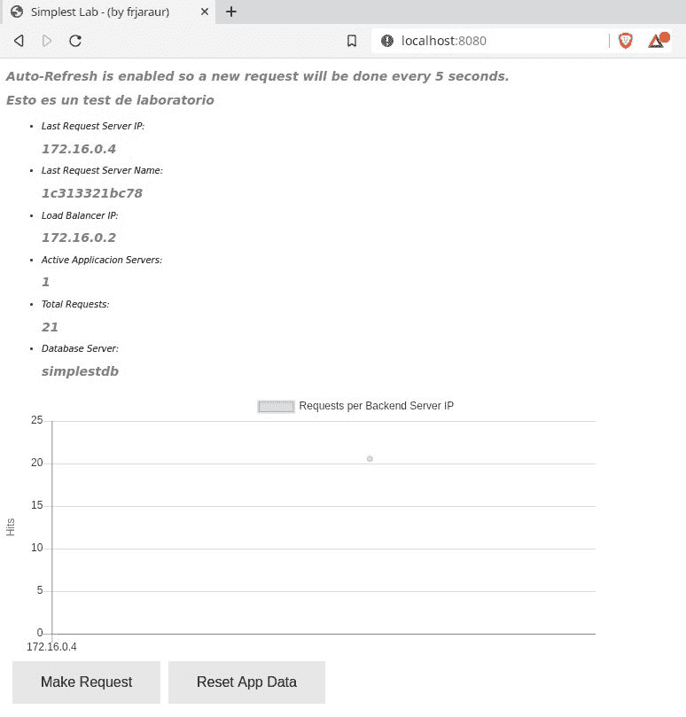
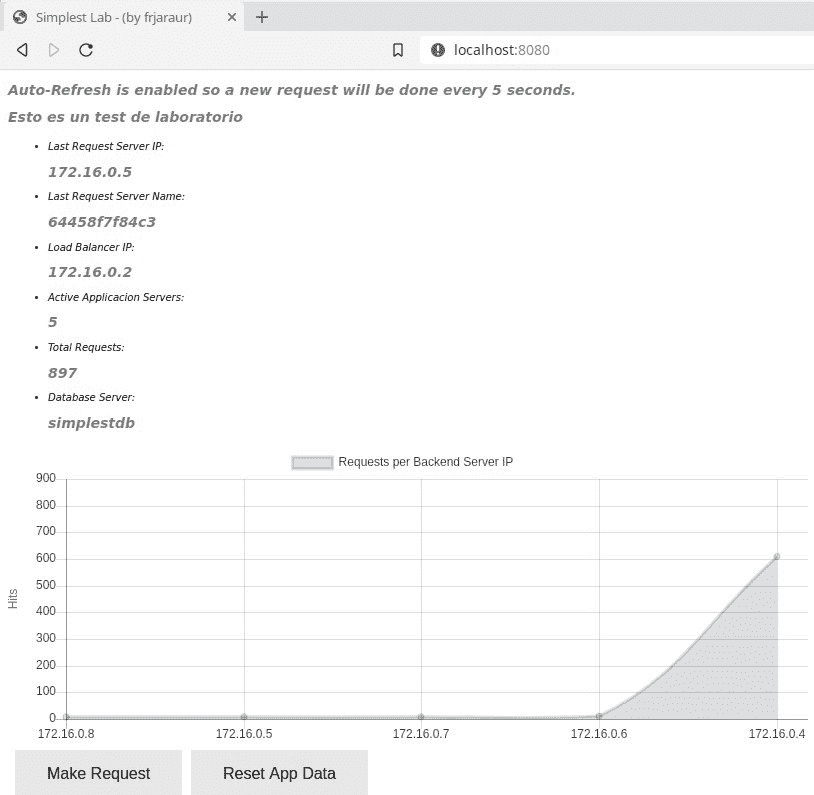
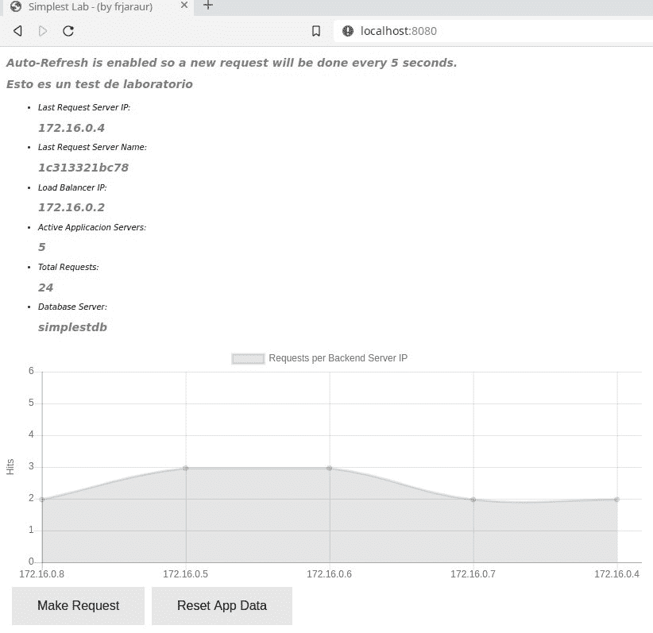
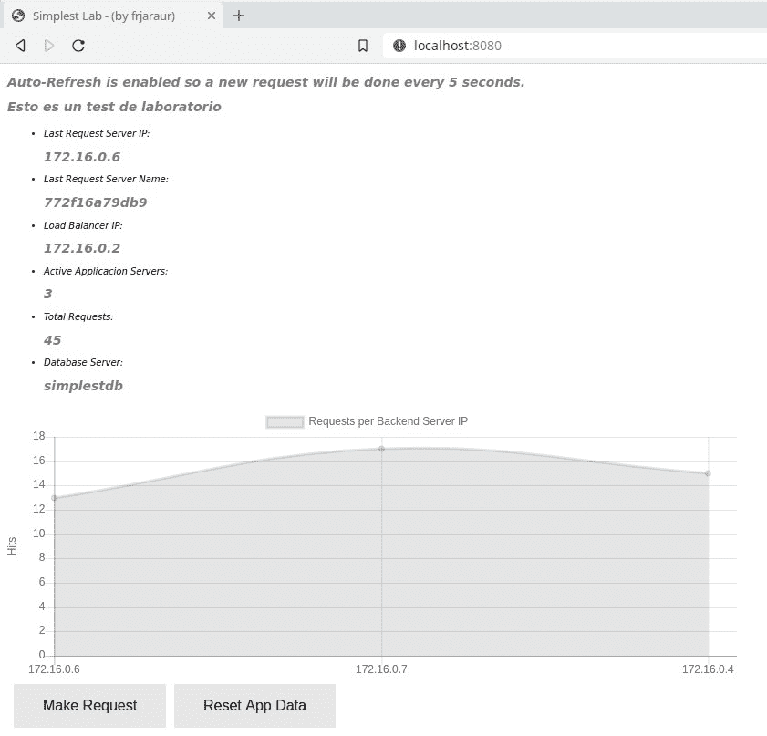
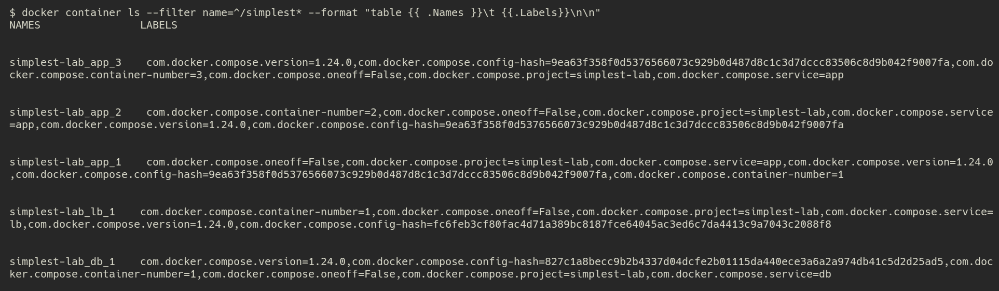
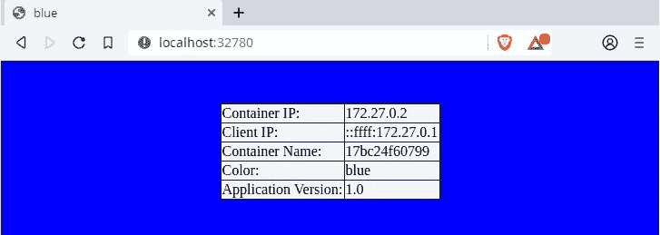

部署多容器应用程序

在本章中，我们将学习 Docker Compose 工具，这是任何 Docker 环境中的关键组件。使用 Docker Compose，我们可以管理多容器应用程序，所有我们通常用来管理基于容器的应用程序的操作和功能，Docker Compose 都能在多容器环境中提供。我们可以一次性构建项目所需的所有镜像，无需逐个构建、拉取/推送和执行容器。我们可以在一个文件中声明所有组件及其相互连接、存储、环境等。我们还能够从单一端点调试多容器应用程序，这在生产环境中有许多独立元素运行时尤为重要。

但这不仅仅是一个工具。Docker Compose 声明了一种新类型的文件，`docker-compose.yaml`。该文件提供了多容器应用程序的所有要求，并可与其他 Docker 工具一起使用。引入这种文件类型非常重要，因为它是 Swarm 编排部署和最新的基于 CNAB 的应用程序的基础。我们在本书中不会介绍**云原生应用程序捆绑包**（**CNABs**），但如果你感兴趣，可以查看[`cnab.io`](https://cnab.io)。Docker 有自己的 CNAB 实现，但在编写本书时，它处于实验阶段，并且不属于 DCA 考试的内容。

在本章中，我们将回顾 Docker Compose。我们将学习如何通过不同方法安装该工具，并了解其关键内容以及如何使用它们。我们将探索该工具提供的一些操作及其应用场景。最后，我们将给出一些使用 `docker-compose` 和变量的技巧，这可以让我们使用相同的部署文件为不同环境提供动态内容。

本章将涵盖以下主题：

+   安装和使用 Docker Compose

+   理解 docker-compose.yaml 文件

+   使用 docker-compose

+   使用 docker-compose 自定义镜像

+   使用 docker-compose 自动化你的桌面和 CI/CD

让我们开始吧！

# 技术要求

在本章中，我们将学习 Docker 化的多容器应用程序。我们将在本章的最后提供一些实验室练习，帮助你理解和学习所涵盖的概念。这些实验室可以在你的笔记本电脑或 PC 上运行，使用提供的 Vagrant 独立环境或你自己已经部署的 Docker 主机。查看本书 GitHub 代码库中的额外信息：[`github.com/PacktPublishing/Docker-Certified-Associate-DCA-Exam-Guide.git`](https://github.com/PacktPublishing/Docker-Certified-Associate-DCA-Exam-Guide.git)。

查看以下视频，查看代码的实际操作：

"[`bit.ly/3hz0IB0`](https://bit.ly/3hz0IB0)"

# 安装和使用 Docker Compose

在深入了解 Docker Compose 工具之前，让我们先了解一下多容器应用和多服务应用之间的区别：

+   多容器应用是基于多个容器的应用。这些容器将一起在同一主机上运行。因此，我们可以在我们的笔记本电脑或任何其他 Docker 守护进程上部署多容器应用。所有应用组件将一起在一台主机上运行。因此，可能的网络性能问题将得到缓解，因为所有组件会一起运行。请注意，这种部署方式如果主机宕机将无法提供高可用性。我们可以配置所有组件的自动重启，但这对于生产环境来说还不够。

+   多服务应用是基于多个服务的应用。这些应用将通过 Swarm 编排运行，容器将分布在不同的主机上。我们将在第八章《*使用 Docker Swarm 编排*》中了解 Docker Swarm 编排。但你应该理解，服务是 Docker Swarm 环境中调度的最小单元。我们不会调度容器；我们会调度一个服务，基于执行多个任务的情况。这些任务与容器相关联；事实上，每个任务对应一个容器。因此，一个服务由多个任务（称为副本）组成，负责运行容器。我们在 Docker Swarm 中调度服务，设置所需的副本数量以确保服务健康。Docker Swarm 会处理容器的状态。正如我们之前提到的，服务将分布在不同的主机上运行。多服务应用的组件通常会在整个集群中分布运行。组件之间的互联将依赖于内部和外部网络，而 Swarm 则提供基于弹性的开箱即用高可用性，确保所有服务任务的可用性。请牢记这些特性。我们将在《*容器编排*》部分学习 Swarm 和 Kubernetes 编排背后的强大功能。

总结来说，我们在一个节点上部署多容器应用，而多服务应用则分布在不同的节点上运行。

`docker-compose` 在安装 Docker 时并不随附。它是一个不同的产品。在 macOS 和 Windows 上的 Docker Desktop 中，Docker Compose 已包含并可以直接使用。

我们首先需要了解 Docker Compose 是一个基于 Python 的应用。因此，我们可以像安装其他 Python 模块一样安装它，或者下载它作为二进制文件。我们还可以在容器内运行 `docker-compose`。我们可以在[`docs.docker.com/compose/install`](https://docs.docker.com/compose/install)找到简单的安装说明。请注意，在撰写本文时，最新的 `docker-compose` 版本是 1.24.1。我们将使用此版本来进行接下来的所有安装方法。

## 安装 docker-compose 作为 Python 模块

使用`pip`（Python 模块安装程序）在 Linux 系统上安装很容易。我们将回顾这种方法，并且还将下载 Docker Compose 二进制文件。首先，我们需要在系统中安装`pip`。它是几乎所有 Linux 系统上都能找到的包，因此是否已经安装取决于所使用的 Linux 版本（包名可能是`py-pip`、`python3-pip`或`pip-python`；这实际上取决于你的操作系统和使用的 Python 版本）。

我们不会涵盖这个软件包的安装，并假设您已在系统中安装了`pip`。我们将以 root 用户身份安装`docker-compose`模块，以便所有主机用户都可以使用它。

有一个适用于 Python 2.x 的`pip`版本和一个适用于 Python 3.x 的版本。记住，Python 2.x 现在已经过时，所以可能是时候迁移到 Python 3.x 了。出于这个原因，我们只会讨论 Python 3 的安装。

我们使用`sudo`作为 root，并加上`-H`来使用我们登录用户的主目录：

```
$ sudo -sH pip install -q docker-compose
```

执行后，我们将在`/usr/local/bin/docker-compose`安装`docker-compose`。

## 使用下载的二进制文件安装 docker-compose

在这里，我们只需要`curl`或`wget`来从该项目的 GitHub 页面（[`github.com/docker/compose/releases`](https://github.com/docker/compose/releases)）下载定义版本的二进制文件。确保选择适合您架构处理器和系统的正确二进制文件和版本。我们将回顾 CentOS 7 Linux 系统的安装，它用于我们的所有实验室：

```
$ curl -sL "https://github.com/docker/compose/releases/download/1.24.1/docker-compose-$(uname -s)-$(uname -m)" -o /tmp/docker-compose

$ sudo chmod +x /tmp/docker-compose

$ sudo mv /tmp/docker-compose /usr/local/bin/docker-compose
```

我们还可以使用容器来执行`docker-compose`，如下一节中所述。

## 使用容器执行 docker-compose

这一点相当有趣，因为正如我们所学，作为容器执行应用程序只需要在我们的系统上运行 Docker 守护进程。这是执行应用程序的一个好方法！在这种情况下，`run.sh`是一个脚本，它将准备所有所需的卷和参数（`curl -L`将跟随重定向，`-o`参数将允许我们选择目标文件名）：

```
$ sudo curl -L --fail https://github.com/docker/compose/releases/download/1.24.1/run.sh -o /usr/local/bin/docker-compose

$ sudo chmod +x /usr/local/bin/docker-compose
```

Docker Compose 也可以安装在 Windows 节点上，如下一节中所述。

## 在 Windows 服务器上安装 docker-compose

在 Windows 服务器上，我们将使用提升的 PowerShell（即以管理员身份运行）。

由于 GitHub 现在要求使用 TLS1.2，在执行安装之前，需要在管理员 PowerShell 中运行以下命令：

`[Net.ServicePointManager]::SecurityProtocol = [Net.SecurityProtocolType]::Tls12`

一旦进入管理员 PowerShell，我们需要运行以下命令：

```
Invoke-WebRequest "https://github.com/docker/compose/releases/download/1.24.1/docker-compose-Windows-x86_64.exe" -UseBasicParsing -OutFile $Env:ProgramFiles\Docker\docker-compose.exe
```

在下一节中，我们将学习 Docker Compose 文件。

# 理解 docker-compose.yaml 文件

Docker Compose 引入了多容器应用程序的概念，使用一个集成所有应用组件定义的文件。这个文件被称为`docker-compose.yaml`。通常，我们会管理一个`docker-compose.yaml`文件。请注意，这是一个 YAML 文件，因此缩进至关重要。该文件将包含所有应用组件及其属性。

这是一个简单的`docker-compose.yaml`文件的样子（我们可以使用`.yaml`或`.yml`扩展名来表示 YAML 文件）：

```
version: "3.7"
services:
  lb:
    build: simplestlb
    image: myregistry/simplest-lab:simplestlb
    environment:
      - APPLICATION_ALIAS=simplestapp
      - APPLICATION_PORT=3000
    networks:
      simplestlab:
          aliases:
          - simplestlb
    ports:
      - "8080:80"
  db:
    build: simplestdb
    image: myregistry/simplest-lab:simplestdb
    environment:
        - "POSTGRES_PASSWORD=changeme"
    networks:
       simplestlab:
        aliases:
          - simplestdb
    volumes:
      - pgdata:/var/lib/postgresql/data
  app:
    build: simplestapp
    image: myregistry/simplest-lab:simplestapp
    environment:
      - dbhost=simplestdb
      - dbname=demo
      - dbuser=demo
      - dbpasswd=d3m0
    networks:
       simplestlab:
        aliases:
          - simplestapp
    depends_on:
      - lb
      - db
volumes:
  pgdata:
networks:
  simplestlab:
    ipam:
      driver: default
      config:
        - subnet: 172.16.0.0/16
```

`docker-compose.yaml`文件将包含所有基于 Docker 的应用组件（服务、网络和卷）的定义。在此文件中，我们首先声明文件定义的版本。这个定义管理 Docker Compose 如何解释一些编写的指令。我们将使用版本 3.x 的文件定义，因为它是最新的并且是目前推荐的版本。不同版本之间有一些差异，尽管`docker-compose`提供了向后兼容性，所以你应该查阅 Docker 文档获取更多信息。需要注意的是，版本之间的键和值结构可能有所不同，因此在使用较旧的 Docker 引擎时，应该使用特定的版本。我们将使用版本 3.7（这是编写时的当前版本）。

让我们来学习一下文件的内容。

我们使用环境变量来提供凭证并访问某些服务。这只是为了演示目的——绝不要使用环境变量来存储密码、凭证或连接字符串。在 Docker Swarm 中，我们使用`secrets`和`configuration`对象。在 Docker Compose 中，我们没有这种类型的对象，因此建议使用外部配置工具或安全的键值存储来管理这些值。

我们有一个用于`services`的部分和另一个用于`networks`的部分。我们还可以有一个`volumes`部分。`volumes`和`networks`部分将为应用程序定义它们的属性。在这些部分，我们将声明特殊功能以及为其使用的驱动程序。在示例文件中，我们声明了一个特殊的子网，用于在`simplestlab`网络上使用默认的桥接驱动程序。正如我们在所有服务定义中看到的，这将是为所有组件创建并使用的网络。

在 Docker Swarm 中，我们还可以定义`Configs`和`Secrets`，它们是集群对象。我们将在文件的一个部分中声明这些对象，然后在每个服务定义中使用这些对象。

每个服务代表一个组件。让我们以`app`服务的定义为例，详细了解一下。

每个服务定义都有一些关键配置，用来说明该应用组件如何运行。在`app`服务中，我们有一个`build`定义，指示如何创建这个组件。`build`键的值指示用于构建这些组件镜像的上下文路径（即`simplestapp`目录）。因此，我们可以使用这个`docker-compose.yaml`文件和`simplestapp`目录中的内容来构建这个组件。我们已经学到，为了构建镜像，我们需要一个 Dockerfile；因此，`simplestapp`目录中必须包含一个 Dockerfile。所有需要编译`myregistry/simplest-lab:simplestapp`镜像的文件都应该在这个目录中。

当我们讨论 Docker Compose 中的多容器应用时，服务定义与 Swarm 服务不同，后者由 Swarm 编排管理。在非 Swarm 环境中，我们将服务称为应用组件。

下一行包含`image`键，定义了镜像的名称。如果该镜像在主机中不存在，它将使用这个名称进行构建。如果没有`build`定义，Docker 守护进程将尝试从镜像仓库下载已定义的镜像。

下一个键定义了一组变量及其值，在容器执行期间作为环境变量使用。我们可以覆盖镜像定义的`ENVIRONMENT`、`CMD`、`ENTRYPOINT`和`VOLUME`值等，正如我们在容器中通常所做的那样。稍后我们将进一步了解 Docker Compose 定义，但请记住，我们在`docker container run`或`docker container create`操作中使用的几乎每个选项，都可以作为`docker-compose.yaml`中的一个键来使用。

接着，我们定义了此组件中要使用的网络。我们还定义了一个别名，用于在该网络中使用。这个组件将被称为`app`，这是它的服务名称，同时也使用其定义的别名`simplestapp`。

值得注意的是，Docker Compose 允许我们定义执行顺序，正如在最后几行中看到的那样。我们使用了`depends_on`键，直到列表中的所有组件都可用（即所有容器都被标记为健康）后才继续执行。

这样，我们已经回顾了前面代码文件中的`services`部分。在这个例子中，我们还有`volumes`和`networks`部分。

在`volumes`部分，我们有最简单的定义。它是空的，仅定义了一个具有默认参数（本地驱动程序）的卷。在`services`部分，我们定义了这些卷应该在哪里以及如何附加。

现在我们了解了基本概念，可以看看一些最常用的键定义：

| **Key** | **Definitions** |
| --- | --- |

| `build` | 这个键定义了用于构建应用程序镜像的选项。以下是一些最常用的选项：

+   `context`：此选项定义了构建上下文的路径，即包含 Dockerfile 和所有其他所需文件的目录。

+   `dockerfile`: 这定义了一个替代的 Dockerfile 名称。

+   `args`: 我们可以在这里设置 Dockerfile 参数。

+   `labels`: 此选项允许我们设置镜像标签。

|

| `image` | 这是要使用的镜像名称。如果镜像不存在，将从注册表中拉取。如果必须构建镜像，则会使用此值作为其名称。 |
| --- | --- |
| `environment` | 我们可以在容器内设置环境变量。这将覆盖任何镜像定义的值。我们也可以使用`env_file`来定义一个包含许多值的文件。 |
| `command` | 这将设置或覆盖镜像的`command`定义。 |
| `entrypoint` | 这将设置或覆盖镜像的`entrypoint`定义。 |
| `ports` | 这些是服务要公开的端口，以便在主机级别可达。 |
| `expose` | 此选项定义了哪些服务端口将对其他服务可用。 |
| `privileged``cap_add/cap_drop``read_only` | 这些选项将设置与我们在第三章中讨论的容器执行相同的功能。 |
| `user` | 这将设置或覆盖镜像的`user`定义。 |
| `labels` | 这将设置或覆盖镜像的标签。 |
| `restart` | 使用`restart`，我们可以设置关联容器的管理方式。如果它们停止了，Docker 是否应该重新启动它们或者保持停止状态？请记住为我们的容器定义的选项 - 我们将在这里使用相同的值。 |
| `container_name` | 我们可以使用此变量设置容器名称。如果未定义，容器名称将使用服务项目名称作为前缀，后跟服务名称和实例编号，从`1`开始。请注意此参数；正如您已经了解的那样，每台主机只能有一个定义名称的容器。 |
| `hostname``domainname` | 这些选项将允许我们更改容器的主机名和其域名。在`network`定义下，我们可以添加任意数量的 DNS 别名。 |
| `extra_hosts` | 使用此选项，我们可以添加外部主机以通过内部 DNS 发现。这将帮助我们像在容器内运行一样访问外部服务。 |
| `depends_on` | 此键允许我们设置组件的依赖关系。它在版本`3`中已被弃用，但在这里包括是为了解释它实际上并未提供真正的依赖性。此选项只会控制启动顺序。 |

| `networks` | 我们可以设置要使用的网络驱动程序、它们的选项和子网范围，以及它们将如何可访问（内部和/或可附加）。让我们来看一个简单的例子： |

```
networks:
  mynet:
    driver: bridge
    ipam:
      driver: default
      config:
       - subnet: 172.28.0.0/16
```

在上述代码中，我们已将`mynet`定义为所有容器的桥接网络，并为其定义了一个子网。我们可以在每个服务部分使用这个定义的网络：

```
  myservice:
 build:
 context: .
 dockerfile: ./src/myapp/Dockerfile
 networks:
 - mynet
```

|

| `volumes` | 卷在`volumes`部分中定义。我们可以设置它们的驱动程序和特殊选项。以下是一个我们可以在`services`部分中使用的简单本地定义示例：

```
...
...
  myservice:
    image: myregistry/myimage:tag
    volumes:
     - data:/appdata/
...
...
volumes:
  config-data:
    driver: local
```

|

| `tmpfs` | 我们可以使用`tmpfs`创建一个内存文件系统。此选项对于绕过叠加文件系统以提高 I/O 性能或出于安全原因非常有用。当容器终止时，内存文件系统会消失：

```
 - type: tmpfs
     target: /app
     tmpfs:
       size: 1000
```

|

| `healthcheck` | 这将设置或覆盖镜像的`healthcheck`定义。 |
| --- | --- |

这些是最常用的键。有关更多信息，请查阅 Docker Compose 文档，文档可以在 Docker 官方网站上找到，网址为[`docs.docker.com/compose/compose-file/`](https://docs.docker.com/compose/compose-file/)。

有许多仅允许在 Docker Swarm 环境中使用的键。我们没有在前面的信息表中包含它们，因为 Swarm 选项将在第八章，*使用 Docker Swarm 进行编排*中展示。在`docker-compose.yaml`文件中定义容器资源限制仅在使用 Docker Swarm 模式或 Docker Compose 版本 2 时允许。

一旦我们创建了`docker-compose.yaml`文件，就可以使用文件中编写的 Docker Compose 命令行定义。

# 使用 Docker Compose 命令行界面

我们在前一节中安装了`docker-compose`二进制文件，这意味着我们现在可以查看可用的操作。`docker-compose`将提供大部分适用于 Docker 的操作，因为我们将同时在多个容器上执行这些操作。让我们在下表中查看可用的`docker-compose`操作：

| **命令** | **定义** |
| --- | --- |
| `build` | 如预期的那样，此操作将构建或重建所有`docker-compose.yaml`文件中的组件，或者仅构建选定的组件。此操作将查找`docker-compose.yaml`文件中的任何`build`键，并启动构建或重建。如果我们使用`--project`设置了项目名称，则所有镜像将在没有定义镜像名称的情况下被创建为`<project_name>_<service_name>`。如果定义了镜像名称，这个名称将在我们将其推送到注册表时使用。 |
| `pull`/`push` | 我们将能够一次性推送或拉取所有镜像，因为我们使用`docker-compose`管理所有应用程序组件。 |
| `images` | 此操作将列出所有应用程序镜像。 |
| `create` | 请记住，我们可以创建容器。在这种情况下，我们将创建应用程序所需的所有容器，但直到执行`start`操作时，它们才会被启动。 |
| `rm` | 此操作将删除所有已停止的容器。记得使用项目名称，或者留空以使用当前目录作为应用程序名称。 |
| `up` (`-d` 或 `--detach`) | 我们将通过这个简单的动作创建并启动所有组件。所有组件将一次性运行。我们将使用 `--detach` 使应用在后台运行，就像我们在容器中学到的那样。 |
| `down` | 要移除所有应用组件，我们将使用 `down` 动作。这将结束所有应用容器，或仅结束指定的容器。请注意，外部定义的资源不会被删除，必须手动移除。 |
| `start/stop/restart` | 这些选项将允许我们管理组件，可以一次性应用于所有组件，或仅应用于指定的组件。 |
| `run` | 通过这个选项，我们可以执行一个组件来运行指定的命令，例如初始化数据库或创建所需文件。 |
| `pause`/`unpause` | 就像我们在容器中学到的那样，我们可以暂停和恢复应用组件。 |
| `ps` | `docker-compose` 将显示所有应用容器（进程）及其端口。 |
| `top` | 这个选项将显示为应用程序部署的每个容器上运行的进程。 |
| `exec` | 我们可以在任何应用容器的命名空间内运行一个进程。记住我们在第三章中学到的内容，*运行 Docker 容器*。 |
| `logs` | 使用单个命令检索所有应用容器的日志非常有用。我们可以使用 `logs` 动作一次性检索所有应用日志。日志将按服务名称一起显示，帮助我们识别每个组件。 |
| `config` | 我们可以使用 `config` 动作验证 Docker Compose 定义。我们还可以使用 `services` 参数列出已定义的服务。 |

有了这些信息，我们可以快速了解如何在多容器环境中通过 Docker Compose 实现常见的容器工作流程，它为我们提供了一个新的命令行界面来构建、共享并一次性运行所有应用组件。 |

我们可以定义外部资源，如 `volume` 或 `networks`。在这些情况下，我们将使用 `external: true` 选项，并且必须手动创建这些资源。 |

使用 `docker-compose` 部署的每个应用将有自己的项目定义。每个项目将在同一主机上与其他项目隔离运行。默认情况下，`docker-compose` 将使用当前目录名作为项目名。我们可以使用 `--project-name` 或 `-p` 覆盖此行为，设置一个更具描述性的名称。

在第一章，*使用 Docker 构建现代基础设施与应用程序*中，我们了解到对象名称是唯一的（我们可以为对象分配多个名称，但每个名称都是唯一的，且不能有重复的名称）；因此，`docker-compose` 会将项目名称作为前缀添加到每个创建的对象。这使得我们能够识别所有应用程序组件并确保它们具有唯一的名称。当然，我们可以使用相同的 `docker-compose` 文件两次部署相同的应用程序，但每次应选择不同的项目名称。

我们可以使用 `docker-compose.yaml` 文件多次启动相同的应用程序，但我们不能在卷之间共享唯一资源，如端口、卷和 IP 地址。组件间共享卷取决于应用程序行为，但 IP 地址或端口将在给定的 Docker 主机上保持唯一。

让我们回顾一下使用之前的 `docker-compose.yaml` 文件（见 *理解 docker-compose 文件* 部分）进行完整应用程序部署的工作流程。

首先，我们需要构建应用程序镜像。你可以从本书的 GitHub 仓库下载所有应用程序代码，链接地址为 [`github.com/PacktPublishing/Docker-Certified-Associate-DCA-Exam-Guide.git`](https://github.com/PacktPublishing/Docker-Certified-Associate-DCA-Exam-Guide.git)。

让我们克隆这个仓库，以获取所有源代码目录和配置文件。你的输出可能与以下内容不同：

```
$ git clone https://github.com/PacktPublishing/Docker-Certified-Associate-DCA-Exam-Guide.git
Cloning into 'dca-book-code'...
remote: Enumerating objects: 26, done.
remote: Counting objects: 100% (26/26), done.
remote: Compressing objects: 100% (22/22), done.
remote: Total 26 (delta 0), reused 26 (delta 0), pack-reused 0
Unpacking objects: 100% (26/26), done.
```

我们将为 `simplest-lab` 项目创建一个目录，其中包含 `docker-compose.yaml` 文件以及每个应用程序组件的不同目录：

```
$ cd chapter5/simplest-lab/

$ ls -lRt
.:
total 4
-rw-rw-r-- 1 zero zero 982 nov 24 11:06 docker-compose.yaml
drwxrwxr-x 2 zero zero 146 nov 24 11:06 simplestapp
drwxrwxr-x 3 zero zero 112 nov 24 11:06 simplestdb
drwxrwxr-x 2 zero zero 80 nov 24 11:06 simplestlb
./simplestapp:
total 32
-rw-rw-r-- 1 zero zero 91 nov 24 11:06 dbconfig.json
-rw-rw-r-- 1 zero zero 466 nov 24 11:06 Dockerfile
-rw-rw-r-- 1 zero zero 354 nov 24 11:06 package.json
-rw-rw-r-- 1 zero zero 191 nov 24 11:06 README.md
-rw-rw-r-- 1 zero zero 1244 nov 24 11:06 reset.html
-rw-rw-r-- 1 zero zero 3837 nov 24 11:06 simplestapp.html
-rw-rw-r-- 1 zero zero 6556 nov 24 11:06 simplestapp.js
./simplestdb:
total 12
drwxrwxr-x 2 zero zero 26 nov 24 11:06 docker-entrypoint-initdb.d 
-rwxrwxr-x 1 zero zero 2587 nov 24 11:06 docker-entrypoint.sh 
-rw-rw-r-- 1 zero zero 152 nov 24 11:06 Dockerfile 
-rw-rw-r-- 1 zero zero 2568 nov 24 11:06 Dockerfile.scratch
./simplestdb/docker-entrypoint-initdb.d:
total 4
-rw-rw-r-- 1 zero zero 484 nov 24 11:06 init-demo.sh
./simplestlb:
total 16
-rw-rw-r-- 1 zero zero 467 nov 24 11:06 Dockerfile
-rwxrwxr-x 1 zero zero 213 nov 24 11:06 entrypoint.sh
-rw-rw-r-- 1 zero zero 837 nov 24 11:06 nginx.conf
-rw-rw-r-- 1 zero zero 24 nov 24 11:06 README.md
```

在每个项目目录中，都有一个 Dockerfile，我们可以用来构建该特定组件。所以，让我们一次性构建所有组件。

我们在移除中间容器（用于构建并禁止镜像缓存）时，拥有与 `docker image build` 命令相同的选项。我们将分别使用 `--force-rm` 和 `--no-cache`。

为了确保定义的 `docker-compose.yaml` 文件有效，我们可以使用 `docker-compose config --quiet`。如果有问题，它将被报告。我们还可以列出已定义的服务或卷的名称：

```
$ docker-compose config --services
db
lb
app 
$ docker-compose config --volumes
pgdata
```

我们将在本节后面使用这些服务名称定义。

我们将执行 `docker-compose build` 来构建在 `docker-compose.yaml` 文件中定义的所有组件镜像。此命令将花费一些时间，因为我们不仅仅是在构建一个镜像，而是在构建所有必需的镜像。以下输出已被截断：

```
$ docker-compose build 
Building db
Step 1/2 : FROM postgres:alpine
alpine: Pulling from library/postgres
....
Successfully built 336fb84e7fbf
Successfully tagged myregistry/simplest-lab:simplestdb
Building lb
Step 1/10 : FROM alpine:latest
latest: Pulling from library/alpine
....
Successfully built 4a5308d90123
Successfully tagged myregistry/simplest-lab:simplestlb
Building app
Step 1/15 : FROM alpine
 ---> 965ea09ff2eb
Step 2/15 : RUN apk --update --no-progress --no-cache add nodejs npm
....
Successfully built ffa49ee4228e
Successfully tagged myregistry/simplest-lab:simplestapp
```

几分钟后（或几秒钟，取决于您的互联网连接和处理器速度），将创建所有三个映像。由于我们尚未设置项目名称，`docker-compose`已为您创建了一个项目名称。如前所述，默认情况下，所有组件都将使用目录名作为前缀创建。在这种情况下，我们在`docker-compose.yaml`文件上有一个映像键，因此将使用映像命名语法，而不是本地目录引用。

请注意，我们使用了一个虚拟的注册表名称（`myregistry`）。这意味着我们无法将映像推送到这个虚拟注册表，但重要的是理解映像名称背后的逻辑。如果我们在 Docker 守护程序上列出当前映像，我们应该有为这个项目创建的所有映像。

```
$ docker images --filter=reference='myregistry/*:*'
REPOSITORY TAG IMAGE ID CREATED SIZE
myregistry/simplest-lab simplestapp ffa49ee4228e About an hour ago 56.5MB
myregistry/simplest-lab simplestlb 4a5308d90123 About an hour ago 7MB
myregistry/simplest-lab simplestdb 336fb84e7fbf About an hour ago 72.8MB
```

现在我们有了我们的映像，我们可以分享它们。我们现在可以执行`docker-compose push`命令将它们推送到`myregistry`（在我们的示例文件中）。这将逐个上传带有定义标签的映像。

我们准备使用`docker-compose up`一起运行所有应用程序组件。为了在后台启动它，我们将使用`--detach`选项。如果我们不使用此选项，我们将连接到所有容器的标准输出和错误输出。我们学会了如何在第三章，*运行 Docker 容器*中附加到容器输出。请记住，在`docker container run`中没有`--detach`或`-d`选项时，这种行为是预期的：

```
$ docker-compose up --detach
Creating network "simplest-lab_simplestlab" with the default driver
Creating simplest-lab_db_1 ... done
Creating simplest-lab_lb_1 ... done
Creating simplest-lab_app_1 ... done
```

通过这行，我们刚刚启动了我们的应用程序。重要的是要理解`docker-compose up`不仅仅执行所有组件。在这种情况下，我们首先构建了我们的组件，但是`docker-compose up`指令将验证组件映像是否存在于 Docker 主机上。如果不存在，它将构建或拉取它们。如果映像不存在，它们应该被下载，这就是 Docker 守护程序将要做的事情。

应用程序应该正在运行。让我们验证所有组件的执行。我们将使用`docker-compose ps`来获取应用程序组件的状态：

```
$ docker-compose ps
 Name Command State Ports 
----------------------------------------------------------------------------------
simplest-lab_app_1 node simplestapp.js 3000 Up 3000/tcp 
simplest-lab_db_1 docker-entrypoint.sh postgres Up 5432/tcp 
simplest-lab_lb_1 /entrypoint.sh /bin/sh -c ... Up 0.0.0.0:8080->80/tcp
```

查看应用程序组件名称。它们都使用`simplest-lab`前缀创建，后跟`_`和服务定义中使用的名称。这是我们预期的，因为我们还没有定义项目名称。默认情况下，目录名被用作项目名称。

我们还可以看到组件名称以 `_` 结尾，后跟一个数字（在本例中为 `1`）。这表示我们为此组件有多个副本。我们对某些应用程序组件使用多个副本。请记住，Docker Compose 不了解我们应用程序的逻辑。因此，我们需要编写此组件以使其可伸缩。在我们的示例中，我们有一个三层应用程序，包括一个简单的负载均衡器 `lb`，一个应用程序后端 `app` 和一个数据库组件 `db`。我们将无法扩展我们的数据库组件，因为这将破坏数据库数据。不超过一个 `postgres` 进程可以使用特定的数据文件集，这也适用于我们的情况。另一方面，我们的 `app` 示例应用程序组件准备好多次运行。

让我们来看看我们的应用程序环境。通过查看 `docker-compose ps` 的输出，我们可以看到只有一个组件在暴露其服务。我们只发布了 `lb` 组件。这是我们的应用程序前端（实际上，它是一个负载均衡器组件，将流量路由到不同的 `app` 组件后端）。如果我们在 `http://0.0.0.0:8080` 上在 Web 浏览器中打开，我们将获得一个类似于以下截图中显示的 Web 应用程序：



在此时，应用程序已经部署完成。我们可以使用服务名称和 `docker-compose logs` 命令来查看组件日志。如果不添加服务名称，我们将查看使用此 `docker-compose.yaml` 文件部署的所有容器的日志。这非常有用，因为我们可以从单一端点查看所有输出。每个组件的日志将以不同的颜色显示，以帮助我们区分它们。

例如，要查看数据库组件日志，我们将使用以下命令：

```
$ docker-compose logs db
Attaching to simplest-lab_db_1
db_1 | 
db_1 | PostgreSQL Database directory appears to contain a database; Skipping initialization
db_1 | 
db_1 | 2019-11-24 11:57:14.011 UTC [1] LOG: starting PostgreSQL 12.1 on x86_64-pc-linux-musl, compiled by gcc (Alpine 8.3.0) 8.3.0, 64-bit
db_1 | 2019-11-24 11:57:14.011 UTC [1] LOG: listening on IPv4 address "0.0.0.0", port 5432
db_1 | 2019-11-24 11:57:14.011 UTC [1] LOG: listening on IPv6 address "::", port 5432
db_1 | 2019-11-24 11:57:14.025 UTC [1] LOG: listening on Unix socket "/var/run/postgresql/.s.PGSQL.5432"
```

需要注意的是，服务名称是我们 `docker-compose.yaml` 文件中定义的名称，而不是正在运行的服务名称。

所有 `docker-compose` 命令都需要一个 `docker-compose.yaml` 文件（或使用 `--file` 或 `-f` 选项指定的任何其他文件名）和一个项目名称（默认情况下使用 `--project` 或 `-p` 选项定义，或者使用当前目录）。这两个参数定义了所有 `docker-compose` 命令将应用的实例。

就像我们在 第三章 中处理容器时，*运行 Docker 容器*，我们可以使用 `docker-compose exec` 在容器的进程命名空间内运行新的进程：

```
$ docker-compose exec app sh
/APP $ ls -lart
total 344
-rwxr-xr-x 1 root root 314658 May 24 2017 Chart.js
-rw-rw-r-- 1 root root 6556 Nov 24 10:06 simplestapp.js
-rw-rw-r-- 1 root root 1244 Nov 24 10:06 reset.html
-rw-rw-r-- 1 root root 354 Nov 24 10:06 package.json
-rw-rw-r-- 1 root root 91 Nov 24 10:06 dbconfig.json
-rw-rw-r-- 1 root root 3826 Nov 24 14:38 simplestapp.html
-rw-r--r-- 1 root root 7654 Nov 24 14:38 package-lock.json
drwxr-xr-x 31 root root 4096 Nov 24 14:38 node_modules
drwxr-xr-x 1 root root 22 Nov 24 14:38 .
drwxr-xr-x 1 root root 6 Nov 24 14:38 ..
```

注意，默认情况下它分配一个终端。因此，不需要使用 `-t` 和 `-i` 选项。

使用 `docker-compose top` 命令，我们将获取每个容器中每个进程的消耗情况：

```
$ docker-compose top
simplest-lab_app_1
UID PID PPID C STIME TTY TIME CMD 
--------------------------------------------------------------------------
zero 9594 9564 0 15:38 ? 00:00:05 node simplestapp.js 3000

simplest-lab_db_1
UID PID PPID C STIME TTY TIME CMD 
-------------------------------------------------------------------------------------------
70 9374 9304 0 15:38 ? 00:00:00 postgres 
70 9558 9374 0 15:38 ? 00:00:00 postgres: checkpointer 
70 9559 9374 0 15:38 ? 00:00:00 postgres: background writer 
70 9560 9374 0 15:38 ? 00:00:00 postgres: walwriter 
70 9561 9374 0 15:38 ? 00:00:00 postgres: autovacuum launcher 
70 9562 9374 0 15:38 ? 00:00:00 postgres: stats collector 
70 9563 9374 0 15:38 ? 00:00:00 postgres: logical replication launcher 
70 9702 9374 0 15:38 ? 00:00:00 postgres: demo demo 172.16.0.4(37134) idle

simplest-lab_lb_1
 UID PID PPID C STIME TTY TIME CMD 
--------------------------------------------------------------------------------------------------------------------
root 9360 9295 0 15:38 ? 00:00:00 nginx: master process nginx -g pid /run/nginx.pid; daemon off;
systemd+ 9467 9360 0 15:38 ? 00:00:01 nginx: worker process 
systemd+ 9468 9360 0 15:38 ? 00:00:00 nginx: worker process
```

让我们回顾一下这个多容器部署创建的一些对象。我们有一个新的网络，名称按照我们之前学过的格式定义；即，`<项目或目录名>_<定义的网络名>`。我们没有指定特定的网络类型，因此，默认情况下，它是一个桥接网络，符合预期。输出可能会在您的环境中有所不同，但新部署的网络名称将会存在：

```
$ docker network ls
NETWORK ID NAME DRIVER SCOPE
0950a6281629 bridge bridge local
82faac964567 host host local
2fb14f721dc3 none null local
a913507af228 simplest-lab_simplestlab bridge local
```

记住，所有自定义桥接网络都管理其自己的内部 DNS 解析。因此，在同一网络上部署的所有服务（应用组件）都可以通过它们的服务名称进行访问。

同样，我们定义的卷也会如此。如果列出本地卷，我们会得到一个新的卷，遵循相同的命名约定。输出可能会因您的环境而异，但新部署的卷名称将会存在：

```
$ docker volume ls
DRIVER VOLUME NAME
local 3f93b55b105f64dd03a9088405484909d2f8cad83dacc5fb5a53ea27af1f33e6
local mydbdata
local simplest-lab_pgdata
vieux/sshfs:latest sshvolume
```

我们可以使用`docker-compose.yaml`文件中定义的服务名称来停止和启动（或重启）任何服务。以下操作将重启一个定义服务的所有实例：

```
$ docker-compose restart lb
Restarting simplest-lab_lb_1 ... done
```

回到实例的概念，我们可以为一个服务定义多个实例。这就是为什么我们给所有实例编号的原因。如前所述，进程是否能扩展并不是 Docker 定义的，它与您的应用逻辑相关。在这个例子中，我们可以扩展`app`组件的实例数量。我们可以使用`docker-compose scale`命令来改变某个定义的应用组件的实例（容器）数量：

```
$ docker-compose scale app=5
WARNING: The scale command is deprecated. Use the up command with the --scale flag instead.
Starting simplest-lab_app_1 ... done
Creating simplest-lab_app_2 ... done
Creating simplest-lab_app_3 ... done
Creating simplest-lab_app_4 ... done
Creating simplest-lab_app_5 ... done
```

请注意，`scale`操作已被弃用，因此现在我们应该使用`docker-compose up --scale <service=number_of_instances>`。

结果是，我们现在有了五个`app`应用组件实例。所有实例的 IP 地址都被添加到了内部 DNS 解析中。因此，我们可以通过轮询的方式将服务名称解析到所有实例的 IP 地址：

```
$ docker-compose ps
 Name Command State Ports 
----------------------------------------------------------------------------------
simplest-lab_app_1 node simplestapp.js 3000 Up 3000/tcp 
simplest-lab_app_2 node simplestapp.js 3000 Up 3000/tcp 
simplest-lab_app_3 node simplestapp.js 3000 Up 3000/tcp 
simplest-lab_app_4 node simplestapp.js 3000 Up 3000/tcp 
simplest-lab_app_5 node simplestapp.js 3000 Up 3000/tcp 
simplest-lab_db_1 docker-entrypoint.sh postgres Up 5432/tcp 
simplest-lab_lb_1 /entrypoint.sh /bin/sh -c ... Up 0.0.0.0:8080->80/tcp
```

如果我们回到应用程序的 GUI 界面`http://localhost:8080/`，会发现图表已经发生变化，因为请求现在已分配到五个不同的后端：



在这个图表中，我们可以看到现在有五个不同的 IP 地址，请求在它们之间分配。由于我们已经运行应用程序很长时间（期间自动化请求一直在执行），所以第一 IP 地址（启动的第一个实例）的请求会更多。

我们可以使用“Reset App Data”按钮从数据库中删除之前的数据。点击这个按钮后，查看请求计数。你可以选择等待更多请求（每 5 秒会生成一个新请求），或者直接点击“Make Request”按钮几次。现在，你应该看到类似于下面的图表：



该图表显示了五个已定义的 `app` 组件实例的请求分布。现在，我们将实例数量缩减为三个，如下所示：

```
$ docker-compose up -d --scale app=3
simplest-lab_db_1 is up-to-date
simplest-lab_lb_1 is up-to-date
Stopping and removing simplest-lab_app_4 ... done
Stopping and removing simplest-lab_app_5 ... done
Starting simplest-lab_app_1 ... done
Starting simplest-lab_app_2 ... done
Starting simplest-lab_app_3 ... done
```

现在，我们可以查看 `app` 实例：

```
$ docker-compose ps app
 Name Command State Ports 
----------------------------------------------------------------
simplest-lab_app_1 node simplestapp.js 3000 Up 3000/tcp
simplest-lab_app_2 node simplestapp.js 3000 Up 3000/tcp
simplest-lab_app_3 node simplestapp.js 3000 Up 3000/tcp
```

图表将再次变化，只有三个后端会接收请求（因为只有三个在运行）。我们将再次使用重置应用数据按钮，并获得一个类似于以下的图表：



快速查看与部署的 `docker-compose.yaml` 应用程序文件相关的运行容器。在这种情况下，我们使用过滤器来获取所有名称以 `simplest` 模式开头的容器。我们格式化了结果以仅显示它们的名称和标签：



请注意，`docker-compose` 为每个应用程序组件添加了标签，指示项目名称、容器名称和关联的服务名称。

我们可以轻松停止或杀死单个组件，或者一次性停止所有组件。我们还可以使用 `down` 或 `rm` 选项移除所有组件。通常，我们使用 `docker-compose down`，因为它更容易记住。我们还可以使用 `stop_grace_period` 定义组件停止的超时时间，默认值为 10 秒（请参阅 `docker-compose` 文件参考，以获取在 [`docs.docker.com/compose/compose-file/`](https://docs.docker.com/compose/compose-file/) 中可用的选项）。使用 `docker-compose down`，组件在停止后将被移除：

```
$ docker-compose down 
Stopping simplest-lab_app_3 ... done
Stopping simplest-lab_app_2 ... done
Stopping simplest-lab_app_1 ... done
Stopping simplest-lab_lb_1 ... done
Stopping simplest-lab_db_1 ... done
Removing simplest-lab_app_3 ... done
Removing simplest-lab_app_2 ... done
Removing simplest-lab_app_1 ... done
Removing simplest-lab_lb_1 ... done
Removing simplest-lab_db_1 ... done
Removing network simplest-lab_simplestlab
```

让我们查看所有与应用程序相关的对象。在这里，我们可以看到 `network` 被移除，但 `volume` 仍然存在。这是因为 Docker 不知道该如何处理卷。我们稍后还会使用它吗？因此，除非我们使用 `docker-compose down --volumes`（或 `-v`）选项删除与应用程序相关的所有卷，否则最好不要删除卷：

```
$ docker volume ls
DRIVER VOLUME NAME
local 3f93b55b105f64dd03a9088405484909d2f8cad83dacc5fb5a53ea27af1f33e6
local mydbdata
local simplest-lab_pgdata
vieux/sshfs:latest sshvolume

$ docker network ls
NETWORK ID NAME DRIVER SCOPE
0950a6281629 bridge bridge local
82faac964567 host host local
2fb14f721dc3 none null local
```

在这一部分，我们已经学习了与常规 Docker 工作流相关的所有主要 `docker-compose` 操作。在下一部分，我们将回顾一些用于构建镜像的特定选项。

# 使用 `docker-compose` 自定义镜像

使用 `docker-compose` 构建应用程序非常有用，因为我们可以用它来创建 Docker Swarm 或 Kubernetes 环境中的所有镜像。我们只需要一个 `docker-compose` 文件定义和应用程序组件的代码。

我们一直在使用静态的 `docker-compose` 文件定义，但在许多情况下，我们会使用一些变量来为特定需求提供它们的值。事实上，我们也可以在 Dockerfile 中使用变量，以在各个层次完成动态配置。

让我们在应用程序的 `docker-compose.yaml` 文件中引入一些变量（我们这么做是为了允许不同的行为）：

```
version: "3.7"

services:
  lb:
 build:
 context: ./simplestlb
 args:
 alpineversion: "latest"
 dockerfile: Dockerfile.custom
 labels:
 org.codegazers.dscription: "Test image"
 image: ${dockerhubid}/simplest-lab:simplestlb
    environment:
      - APPLICATION_ALIAS=simplestapp
      - APPLICATION_PORT=3000
    networks:
      simplestlab:
          aliases:
          - simplestlb
    ports:
      - "${LB_PORT}:80"

...
...
```

你可以在 [`github.com/PacktPublishing/Docker-Certified-Associate-DCA-Exam-Guide.git`](https://github.com/PacktPublishing/Docker-Certified-Associate-DCA-Exam-Guide.git) 找到这个文件，名为 `docker-compose.dev.yaml`，以及前一部分中使用的所有其他代码文件。

首先，我们将使用 `docker-compose config` 命令检查定义的配置：

```
$ docker-compose --file docker-compose.dev.yaml config
WARNING: The dockerhubid variable is not set. Defaulting to a blank string.
WARNING: The LB_PORT variable is not set. Defaulting to a blank string.
ERROR: The Compose file './docker-compose.dev.yaml' is invalid because:
services.lb.ports contains an invalid type, it should be a number, or an object
```

这些警告和错误表明，必须设置以下变量：

+   `dockerhubid`：默认情况下，此项为空。

+   `LB_PORT`：必须设置为一个端口号，因为这是我们将发布用于消费应用程序的端口。

我们需要为这些变量设置值。我们还可以在 Dockerfile 中使用变量来添加更多的细节。然而，这不是我们要讨论的重点，我们也不会深入探讨 Dockerfile 变量的使用。对于 Docker 认证助理考试，重要的是要了解如何使用变量为 `docker-compose` 部署提供值。我们可以使用带变量的动态配置，通过一个 `docker-compose.yaml` 文件来部署不同的项目。例如，这在构建带有开发者工具的调试镜像时非常有用。

让我们设置 `LB_PORT` 和 `dockerhubid` 变量，并再次检查我们的项目配置：

```
$ LB_PORT=8081 docker-compose --file docker-compose.dev.yaml config
WARNING: The dockerhubid variable is not set. Defaulting to a blank string.
networks:
  simplestlab:
    ipam:
      config:
      - subnet: 172.16.0.0/16
      driver: default
services:
  app:
    build:
      context: <..>/Docker-Certified-Associate-DCA-Exam-Guide/simplest-lab/simplestapp
    depends_on:
    - db
    - lb
    environment:
      dbhost: simplestdb
      dbname: demo
      dbpasswd: d3m0
      dbuser: demo
    image: myregistry/simplest-lab:simplestapp
    networks:
      simplestlab:
        aliases:
        - simplestapp
  db:
    build:
      context: <..>/Docker-Certified-Associate-DCA-Exam-Guide/simplest-lab/simplestdb
    environment:
      POSTGRES_PASSWORD: changeme
    image: myregistry/simplest-lab:simplestdb
    networks:
      simplestlab:
        aliases:
        - simplestdb
    volumes:
    - pgdata:/var/lib/postgresql/data:rw
  lb:
    build:
      args:
        alpineversion: latest
      context: <..>/Docker-Certified-Associate-DCA-Exam-Guide/simplest-lab/simplestlb
      dockerfile: Dockerfile.custom
      labels:
        org.codegazers.description: Test image
    environment:
      APPLICATION_ALIAS: simplestapp
      APPLICATION_PORT: '3000'
    image: /simplest-lab:simplestlb
    networks:
      simplestlab:
        aliases:
        - simplestlb
    ports:
    - published: 8081
      target: 80
version: '3.7'
volumes:
  pgdata: {}
```

其他变量尚未设置。我们定义了不同的配置，以提供一些生产环境功能，例如，使用特定的凭证：

```
$ LB_PORT=8081 dockerhubid=frjaraur docker-compose --project-name test --file docker-compose.dev.yaml build --build-arg alpineversion="3.6" 
Building db
Step 1/2 : FROM postgres:alpine
...
...
[Warning] One or more build-args [alpineversion] were not consumed
Successfully built 336fb84e7fbf
Successfully tagged myregistry/simplest-lab:simplestdb
Building lb
Step 1/12 : ARG alpineversion=latest
...
...
Step 12/12 : LABEL org.codegazers.dscription=Test image
 ---> Using cache
 ---> ea4739af8eb5
Successfully built ea4739af8eb5
Successfully tagged frjaraur/simplest-lab:simplestlb
Building app
Step 1/15 : FROM alpine
...
...
[Warning] One or more build-args [alpineversion] were not consumed
Successfully built ff419f0998ae
Successfully tagged myregistry/simplest-lab:simplestapp
```

如果我们查看新的构建镜像，我们会注意到它现在有了一个新的标签，并且是使用 `alpine:3.6` 创建的，而不是使用最新版本：

```
"Labels": {
 "org.codegazers.dscription": "Test image"
 }
```

这样，我们就学会了如何使用变量准备不同的环境。通过变量，我们可以使用一个 `docker-compose.yaml` 文件来适应环境中的任何阶段。我们已经学会了如何为以下内容准备部署：

+   开发环境，使用带有编译器或调试工具的镜像

+   测试，通过添加工具来验证与第三方应用程序的连接，例如

+   预生产或集成阶段，使用库执行负载和性能测试，在将应用程序推向生产环境之前

+   生产阶段，只有经过充分测试的应用程序组件才会在镜像中标记为 `release`，例如

Docker Compose 允许我们通过 YAML 文件跟踪每个阶段所需的所有配置。该文件将作为代码库存储在我们的基础设施中。版本控制将帮助我们在生产中控制已部署的应用程序。

# 使用 Docker Compose 自动化桌面和 CI/CD 流程

Docker Compose 让我们能够轻松地在自己的笔记本电脑上进行开发。DevOps 团队将提供完整的应用程序堆栈文件、`docker-compose.yaml` 文件，以及所有必需的组件和配置。开发人员无需了解所有组件的工作原理。他们可以专注于自己正在开发的组件，因为其他组件将通过 `docker-compose` 自动运行。

我们可以在**持续集成**/**持续部署**（**CI**/**CD**）管道中使用 Docker Compose，一次性构建所有组件。

Docker Compose 帮助我们在开发阶段构建所有应用组件，但我们也可以使用这个工具将所有组件一起运行。CI/CD 编排器将在不同阶段执行`docker-compose`文件。

通过这些步骤和变量的描述，我们可以轻松设想如何实施一个从开发阶段开始，到应用部署到生产的管道。我们将在生产中使用不同的镜像标签，这些标签是通过在不同环境之间应用不同变量值来创建的。

理解`docker-compose.yaml`文件在**基础设施即代码**（**IaC**）环境中的关键作用非常重要。我们需要存储这些文件并使用版本控制系统。这些文件描述了将运行哪些应用组件，以及它们将使用哪些资源。例如，我们可以为应用的发布端口添加变量，以避免如果在同一主机上使用相同的`docker-compose`文件部署多个应用时发生端口冲突。我们还可以在开发和测试中使用相同的`docker-compose`文件，以及将应用部署到这些环境中。为了避免环境冲突，我们可以使用变量来定义应用组件的端点，例如数据库或在不同环境之间应有所不同的任何连接链。

开发人员将使用这些文件在他们的笔记本电脑上启动所需的应用组件，在开发新功能或修复代码错误时，他们可以专注于编写代码，因为不需要创建复杂的基础设施来测试他们编写的代码。实际上，他们根本不需要开发基础设施，因为可以使用自己的计算机。

本章将通过回顾一些实验来帮助我们理解并巩固迄今为止学到的概念。

# 章节实验

我们将部署一个简单的实验来回顾本章中描述的不同步骤。首先，我们将构建所需的镜像，然后继续执行并扩展组件。我们将使用安装了 Docker 引擎的 CentOS Linux 主机。

如果你还没有部署过，请从本书的 GitHub 仓库中部署`environments/standalone-environment`（[`github.com/PacktPublishing/Docker-Certified-Associate-DCA-Exam-Guide.git`](https://github.com/PacktPublishing/Docker-Certified-Associate-DCA-Exam-Guide.git)）。你也可以使用你自己的 CentOS 7 服务器。从`environments/standalone-environment`文件夹中使用`vagrant up`启动你的虚拟环境。

如果你正在使用`standalone-environment`，请等待它启动完成。我们可以通过`vagrant status`检查节点的状态。使用`vagrant ssh standalone`连接到你的实验室节点。现在，`standalone`是你的节点名称。你将以`vagrant`用户身份使用根权限通过`sudo`执行操作。你应该会看到以下输出：

```
Docker-Certified-Associate-DCA-Exam-Guide/environments/standalone$ vagrant up
Bringing machine 'standalone' up with 'virtualbox' provider...
...
Docker-Certified-Associate-DCA-Exam-Guide/environments/standalone$ vagrant status
Current machine states:
standalone running (virtualbox)
...
Docker-Certified-Associate-DCA-Exam-Guide/environments/standalone$
```

现在，我们可以使用`vagrant ssh standalone`连接到`standalone`节点。如果你之前已部署`standalone`虚拟节点，并使用`vagrant up`启动它，那么该过程可能会有所不同：

```
Docker-Certified-Associate-DCA-Exam-Guide/environments/standalone$ vagrant ssh standalone
[vagrant@standalone ~]$ 
```

如果你正在重复使用你的`standalone-environment`实例，这意味着 Docker 引擎已经安装。如果你启动了一个新的实例，请执行`/vagrant/install_requirements.sh`脚本，以获得所有所需的工具（Docker 引擎和`docker-compose`）：

```
[vagrant@standalone ~]$ /vagrant/install_requirements.sh 
```

现在，你已经准备好开始这些实验了。

## 颜色应用程序实验

我们将通过部署一个简单的应用程序来开始这些实验，该应用程序将运行一个小的 Python 进程。这个进程是一个使用 Flask 开发的 Web 服务器，默认情况下会显示一个带有一些关于容器名称、IP 地址和应用程序版本信息的彩色页面（随机颜色）。

本实验所需的所有文件可以在本书的 GitHub 仓库中的`Docker-Certified-Associate-DCA-Exam-Guide/chapter5`文件夹中找到，网址为[`github.com/PacktPublishing/Docker-Certified-Associate-DCA-Exam-Guide.git`](https://github.com/PacktPublishing/Docker-Certified-Associate-DCA-Exam-Guide.git)。让我们开始吧：

1.  我们先通过克隆我们的仓库，进入我们的文件夹，并列出文件夹中的文件：

```
[vagrant@standalone ~]$ git clone https://github.com/PacktPublishing/Docker-Certified-Associate-DCA-Exam-Guide.git [vagrant@standalone ~]$ cd Docker-Certified-Associate-DCA-Exam-Guide/chapter5
[vagrant@standalone chapter5]$ ls -1
app
docker-compose.loadbalancer.yaml
docker-compose.multicolor.yaml
docker-compose.random.yaml
docker-compose.red.yaml
lb
Readme.md
```

1.  让我们快速查看一下`docker-compose.random.yaml`文件的内容：

```
version: "3.7"
services:
    red:
        build: app
        environment:
            COLOR: "red"
        labels:
            role: backend
        ports:
        - 3000
        networks:
        - lab
networks:
    lab:
```

这个非常简单。我们定义了一个`random`服务，使用`app`目录中的代码。我们将容器端口`3000`暴露到一个随机的主机端口。

1.  我们将使用`lab1`作为项目名称来构建镜像。注意，我们定义了`lab`网络。Docker 守护进程将创建一个`lab1_random`镜像和一个`lab1_lab`网络：

```
[vagrant@standalone chapter5]$ docker-compose -p lab1 -f docker-compose.random.yaml build
Building random
Step 1/9 : FROM node:alpine
alpine: Pulling from library/node
89d9c30c1d48: Already exists
5320ee7fe9ff: Pull complete
...
...
Step 9/9 : EXPOSE 3000
 ---> Running in 51379c5e7630
Removing intermediate container 51379c5e7630
 ---> c0dce423a972

Successfully built c0dce423a972
Successfully tagged lab1_random:latest
```

1.  现在，我们执行我们的多容器应用程序（在这种情况下，我们只有一个服务定义）：

```
[vagrant@standalone chapter5]$ docker-compose -p lab1 -f docker-compose.random.yaml up -d
Creating network "lab1_lab" with the default driver
Creating lab1_random_1 ... done
```

让我们查看`docker-compose`项目的`lab1`执行：

```
[vagrant@standalone chapter5]$ docker-compose -p lab1 -f docker-compose.random.yaml ps
 Name Command State Ports 
-------------------------------------------------------------------------
lab1_random_1 docker-entrypoint.sh node ... Up 0.0.0.0:32780->3000/tcp
```

注意，应用程序的端口`3000`已链接到 Docker 主机端口`32780`（使用 NAT）。

1.  我们可以通过那个随机端口访问应用程序，也就是`32780`：

```
[vagrant@standalone chapter5]$ curl 0.0.0.0:32780/text
APP_VERSION: 1.0
COLOR: blue
CONTAINER_NAME: 17bc24f60799
CONTAINER_IP: 172.27.0.2
CLIENT_IP: ::ffff:172.27.0.1
CONTAINER_ARCH: linux
```

我们可以使用网页浏览器访问正在运行的应用程序。我们也可以使用`curl`，因为该应用程序已准备好使用`/text` URI 显示文本响应：



将使用一个随机颜色。在这种情况下，我们得到了一个蓝色页面。由于如果`COLOR`变量未设置，则会选择一个随机颜色，因此在你的环境中可能会有所不同。

如果你使用提供的`vagrant`独立环境部署了`随机颜色`应用程序，应该在浏览器中使用`192.168.56.11:<PUBLISHED_PORT>`，因为你正在使用虚拟机。然而，我们已经准备好了主机与虚拟节点之间的接口（即`192.168.56.11`的 IP 地址）。

1.  我们现在可以删除该应用程序，并使用`docker-compose down`继续进行下一个实验：

```
[vagrant@standalone chapter5]$ docker-compose -p lab1 -f docker-compose.random.yaml down
Stopping lab1_random_1 ... done
Removing lab1_random_1 ... done
Removing network lab1_lab
```

现在，我们将创建一个`red`应用程序，定义一个简单的变量来改变应用程序的行为。

## 执行一个红色应用程序

在这个实验中，我们将通过设置`COLOR`环境变量来改变应用程序的行为。在这种情况下，我们将执行`red`应用程序。这个新应用只需少量更改就可以部署，这将帮助我们在接下来的实验中集成更多的组件。

现在，让我们执行`red`应用程序。在这种情况下，我们只需更改服务名称并添加一个环境变量来定义后端颜色（`COLOR`键和`red`值）。以下是`docker-compose.red.yaml`文件的内容：

```
version: "3.7"

services:
  red:
    build: app
    environment:
      COLOR: "red" 
    labels:
      role: backend
    ports:
    - 3000
    networks:
    - lab

networks:
  lab:
```

我们可以重用`lab1`项目名称，或者创建一个新的项目名称。如果我们将`lab2`作为新项目名称，新的标签将被添加。构建它时不会创建新的层，因为我们没有更改任何代码。我们将简单地使用`docker-compose up -d`，如下所示：

```
[vagrant@standalone ~]$ docker-compose -p lab2 -f docker-compose.red.yaml up -d 
Creating network "lab2_lab" with the default driver
Building red
Step 1/9 : FROM node:alpine
 ---> fac3d6a8e034
Step 2/9 : ENV APPDIR /APP
 ---> Using cache
 ---> 61bbe191216e
Step 3/9 : WORKDIR ${APPDIR}
 ---> Using cache
...
...
 ---> Using cache
 ---> df0f6838dfca
Step 9/9 : EXPOSE 3000
 ---> Using cache
 ---> 24ae28db3e15

Successfully built 24ae28db3e15
Successfully tagged lab2_red:latest
WARNING: Image for service red was built because it did not already exist. To rebuild this image you must use `docker-compose build` or `docker-compose up --build`.
Creating lab2_red_1 ... done
```

我们可以使用`docker-compose ps`查看部署状态：

```
[vagrant@standalone ~]$ docker-compose -p lab2 -f docker-compose.red.yaml ps
 Name Command State Ports 
-----------------------------------------------------------------------------
lab2_red_1 docker-entrypoint.sh node ... Up 0.0.0.0:32781->3000/tcp
```

我们可以轻松地通过`curl`访问`0.0.0.0:32781`来访问`red`应用：

```
[vagrant@standalone ~]$ curl 0.0.0.0:32781/text
APP_VERSION: 1.0
COLOR: red
CONTAINER_NAME: fc05e400d02a
CONTAINER_IP: 172.29.0.2
CLIENT_IP: ::ffff:172.29.0.1
CONTAINER_ARCH: linux
```

现在，让我们尝试扩展应用实例的数量。

## 扩展`red`应用的后端

在这个实验中，我们将通过使用`docker-compose`扩展其中一个组件，增加应用的后端数量。

让我们使用`docker-compose scale`设置应用程序所需的新实例数量：

```
[vagrant@standalone ~]$ docker-compose -p lab2 -f docker-compose.red.yaml scale red=5
WARNING: The scale command is deprecated. Use the up command with the --scale flag instead.
Starting lab2_red_1 ... done
Creating lab2_red_2 ... done
Creating lab2_red_3 ... done
Creating lab2_red_4 ... done
Creating lab2_red_5 ... done
```

注意，在这种情况下，我们正在部署一个无状态应用，没有任何持久化。在这种情况下，还需要注意一件事——我们没有设置主机链接的端口。因此，每个容器实例都会使用一个随机端口。让我们使用`docker-compose ps`查看新的实例端口号：

```
[vagrant@standalone ~]$ docker-compose -p lab2 -f docker-compose.red.yaml ps
 Name Command State Ports 
-----------------------------------------------------------------------------
lab2_red_1 docker-entrypoint.sh node ... Up 0.0.0.0:32781->3000/tcp
lab2_red_2 docker-entrypoint.sh node ... Up 0.0.0.0:32784->3000/tcp
lab2_red_3 docker-entrypoint.sh node ... Up 0.0.0.0:32785->3000/tcp
lab2_red_4 docker-entrypoint.sh node ... Up 0.0.0.0:32783->3000/tcp
lab2_red_5 docker-entrypoint.sh node ... Up 0.0.0.0:32782->3000/tcp
```

现在，我们可以访问所有的实例。每个实例都使用自己的 NAT 端口，所有这些端口在 Docker 主机中都是可用的。我们可以再次使用`curl`进行检查：

```
[vagrant@standalone ~]$ curl 0.0.0.0:32781/text
APP_VERSION: 1.0
COLOR: red
CONTAINER_NAME: fc05e400d02a
CONTAINER_IP: 172.29.0.2
CLIENT_IP: ::ffff:172.29.0.1
CONTAINER_ARCH: linux

[vagrant@standalone ~]$ curl 0.0.0.0:32782/text
APP_VERSION: 1.0
COLOR: red
CONTAINER_NAME: f5de33465357
CONTAINER_IP: 172.29.0.3
CLIENT_IP: ::ffff:172.29.0.1
CONTAINER_ARCH: linux

[vagrant@standalone ~]$ curl 0.0.0.0:32783/text
APP_VERSION: 1.0
COLOR: red
CONTAINER_NAME: 5be016aadadb
CONTAINER_IP: 172.29.0.4
CLIENT_IP: ::ffff:172.29.0.1
CONTAINER_ARCH: linux

[vagrant@standalone ~]$ curl 0.0.0.0:32784/text
APP_VERSION: 1.0
COLOR: red
CONTAINER_NAME: 413c9d605bd5
CONTAINER_IP: 172.29.0.5
CLIENT_IP: ::ffff:172.29.0.1
CONTAINER_ARCH: linux

[vagrant@standalone ~]$ curl 0.0.0.0:32785/text
APP_VERSION: 1.0
COLOR: red
CONTAINER_NAME: fe879a59c3aa
CONTAINER_IP: 172.29.0.6
CLIENT_IP: ::ffff:172.29.0.1
CONTAINER_ARCH: linux
```

所有 IP 地址都是不同的，因为我们在访问不同的容器。然而，所有的都是`red`，正如预期的那样。

让我们删除所有应用实例：

```
[vagrant@standalone ~]$ docker-compose -p lab2 -f docker-compose.red.yaml down
Stopping lab2_red_2 ... done
Stopping lab2_red_3 ... done
Stopping lab2_red_4 ... done
Stopping lab2_red_5 ... done
Stopping lab2_red_1 ... done
Removing lab2_red_2 ... done
Removing lab2_red_3 ... done
Removing lab2_red_4 ... done
Removing lab2_red_5 ... done
Removing lab2_red_1 ... done
Removing network lab2_lab
```

在下一个实验中，我们将通过单个文件添加更多的颜色。

## 添加更多的颜色

我们现在将通过添加更多颜色来增加我们应用的组件。

让我们添加更多颜色的应用程序。在`docker-compose.multicolor.yaml`文件中，我们将添加几个服务，并为它们设置各自的`COLOR`变量：

```
version: "3.7"

services:
  red:
    build: app
    environment:
      COLOR: "red" 
    labels:
      role: backend
    ports:
    - 3000
    networks:
    - lab
  green:
    build: app
    environment:
      COLOR: "green" 
    labels:
      role: backend
    ports:
    - 3000
    networks:
    - lab
  white:
    build: app
    environment:
      COLOR: "white" 
    labels:
      role: backend
    ports:
    - 3000
    networks:
    - lab

networks:
  lab:
```

我们将使用`docker-compose up`启动我们的`red`、`green`和`white`应用程序：

```
[vagrant@standalone ~]$ docker-compose -p lab3 -f docker-compose.multicolor.yaml up -d 
Creating network "lab3_lab" with the default driver
Building white
Step 1/9 : FROM node:alpine
 ---> fac3d6a8e034
...
Successfully built 24ae28db3e15
Successfully tagged lab3_white:latest
...
Building green
...
Successfully tagged lab3_green:latest
...
Building red
...
Successfully tagged lab3_red:latest
WARNING: Image for service red was built because it did not already exist. To rebuild this image you must use `docker-compose build` or `docker-compose up --build`.
Creating lab3_green_1 ... done
Creating lab3_white_1 ... done
Creating lab3_red_1 ... done
```

我们将能够访问不同的应用程序。让我们使用`docker-compose ps`查看它们的进程和端口，然后通过`curl`访问每个实例：

```
[vagrant@standalone ~]$ docker-compose -p lab3 -f docker-compose.multicolor.yaml ps
 Name Command State Ports 
-------------------------------------------------------------------------------
lab3_green_1 docker-entrypoint.sh node ... Up 0.0.0.0:32789->3000/tcp
lab3_red_1 docker-entrypoint.sh node ... Up 0.0.0.0:32791->3000/tcp
lab3_white_1 docker-entrypoint.sh node ... Up 0.0.0.0:32790->3000/tcp

$ curl 0.0.0.0:32789/text 
APP_VERSION: 1.0
COLOR: green
CONTAINER_NAME: a25a4cc36232
CONTAINER_IP: 172.31.0.2
CLIENT_IP: ::ffff:172.31.0.1
CONTAINER_ARCH: linux

$ curl 0.0.0.0:32791/text 
APP_VERSION: 1.0
COLOR: red
CONTAINER_NAME: 5e12b0de196c
CONTAINER_IP: 172.31.0.4
CLIENT_IP: ::ffff:172.31.0.1
CONTAINER_ARCH: linux

$ curl 0.0.0.0:32790/text 
APP_VERSION: 1.0
COLOR: white
CONTAINER_NAME: b67b09c8c836
CONTAINER_IP: 172.31.0.3
CLIENT_IP: ::ffff:172.31.0.1
CONTAINER_ARCH: linux
```

在这种情况下，所有应用组件都可以通过随机发布的端口进行访问。我们可以使用固定端口将用户请求路由到外部负载均衡器等。在生产环境中，我们不会使用随机端口。

请注意，后端端口是动态关联到随机端口的。这允许我们多次运行此应用，而无需更改任何`docker-compose`文件。我们只需要使用另一个项目名称以确保创建的对象唯一性。

现在，让我们添加一个简单的负载均衡器，看看一些其他的部署功能。我们将发布这个负载均衡器，其他服务将只能通过这个组件访问。

## 添加一个简单的负载均衡器

在这个实验中，我们将添加一个简单的`nginx`负载均衡器来将流量路由到不同的颜色后端。

让我们来看一下新的部署文件：

```
version: "3.7"

services:
  loadbalancer:
    build: lb
    environment:
      APPLICATION_PORT: 3000
    ports:
    - 8080:80
    networks:
    - lab
  red:
    build: app
    environment:
      COLOR: "red"
    labels:
      role: backend
    networks:
    - lab
  green:
    build: app
    environment:
      COLOR: "green"
    labels:
      role: backend
    networks:
    - lab
  white:
    build: app
    environment:
      COLOR: "white"
    labels:
      role: backend
    networks:
    - lab

networks:
  lab:
```

请注意，我们已经移除了所有颜色服务后端的端口。现在，我们只暴露`8080`端口，该端口链接到内部`nginx`组件的端口，也就是`80`端口。

让我们启动应用程序部署并使用`docker-compose up -d`来查看结果：

```
[vagrant@standalone ~]$ docker-compose -p lab5 -f docker-compose.loadbalancer.yaml up -d
Creating network "lab5_lab" with the default driver
Building white
...
Successfully tagged lab5_white:latest
WARNING: Image for service white was built because it did not already exist. To rebuild this image you must use `docker-compose build` or `docker-compose up --build`.
Building green
...
Successfully tagged lab5_green:latest
WARNING: Image for service green was built because it did not already exist. To rebuild this image you must use `docker-compose build` or `docker-compose up --build`.
Building red
...
Successfully tagged lab5_red:latest
WARNING: Image for service red was built because it did not already exist. To rebuild this image you must use `docker-compose build` or `docker-compose up --build`.
Building loadbalancer
...Successfully tagged lab5_loadbalancer:latest
WARNING: Image for service loadbalancer was built because it did not already exist. To rebuild this image you must use `docker-compose build` or `docker-compose up --build`.
Creating lab5_loadbalancer_1 ... done
Creating lab5_white_1 ... done
Creating lab5_red_1 ... done
Creating lab5_green_1 ... done
```

一旦所有组件准备就绪，我们可以使用不同的主机头来测试所有颜色的后端，以访问每个后端。我们为此准备了一个简单的`nginx`负载均衡配置（我们在`lb/nginx.conf`中提供了负载均衡器配置文件的简要回顾）。每次我们请求特定的主机头时，通过指定的颜色，我们都会被路由到正确的后端：

```
[vagrant@standalone ~]$ cat lb/nginx.conf 
...
...
 server {
 listen 80;
 set $port "__APPLICATION_PORT__";
...
...
 location / {
 proxy_pass http://$host:$port;
 }
...
...
```

使用`curl`，我们可以测试所有的后端：

```
[vagrant@standalone ~]$ curl -H "Host: white" 0.0.0.0:8080/text
APP_VERSION: 1.0
COLOR: white
CONTAINER_NAME: 86871cba5a71
CONTAINER_IP: 192.168.208.5
CLIENT_IP: ::ffff:192.168.208.4
CONTAINER_ARCH: linux

[vagrant@standalone ~]$ curl -H "Host: green" 0.0.0.0:8080/text
APP_VERSION: 1.0
COLOR: green
CONTAINER_NAME: f7d90dc89255
CONTAINER_IP: 192.168.208.2
CLIENT_IP: ::ffff:192.168.208.4
CONTAINER_ARCH: linux

[vagrant@standalone ~]$ curl -H "Host: red" 0.0.0.0:8080/text
APP_VERSION: 1.0
COLOR: red
CONTAINER_NAME: 25bb1b66bab8
CONTAINER_IP: 192.168.208.3
CLIENT_IP: ::ffff:192.168.208.4
CONTAINER_ARCH: linux
```

记住，除`loadbalancer`外，其他服务都不可访问。让我们通过`docker-compose ps`查看已发布的端口：

```
[vagrant@standalone ~]$ docker-compose -p lab5 -f docker-compose.loadbalancer.yaml ps
 Name Command State Ports 
-----------------------------------------------------------------------------------
lab5_green_1 docker-entrypoint.sh node ... Up 3000/tcp 
lab5_loadbalancer_1 /entrypoint.sh /bin/sh -c ... Up 0.0.0.0:8080->80/tcp
lab5_red_1 docker-entrypoint.sh node ... Up 3000/tcp 
lab5_white_1 docker-entrypoint.sh node ... Up 3000/tcp 
```

如果我们将`green`服务扩展到四个实例，会发生什么？我们预计可以访问所有实例，因为服务实例会被添加到内部 DNS 中。让我们使用`docker-compose up -d`扩展该服务：

```
[vagrant@standalone ~]$ docker-compose -p lab5 -f docker-compose.loadbalancer.yaml up -d --scale green=4 
Starting lab5_green_1 ... 
lab5_white_1 is up-to-date
lab5_red_1 is up-to-date
Starting lab5_green_1 ... done
Creating lab5_green_2 ... done
Creating lab5_green_3 ... done
Creating lab5_green_4 ... done
```

让我们再次使用`curl`请求`green`服务：

```
[vagrant@standalone ~]$ curl -H "Host: green" 0.0.0.0:8080/text 
APP_VERSION: 1.0
COLOR: green
CONTAINER_NAME: ba90c57914f9
CONTAINER_IP: 192.168.208.7
CLIENT_IP: ::ffff:192.168.208.4
CONTAINER_ARCH: linux

[vagrant@standalone ~]$ curl -H "Host: green" 0.0.0.0:8080/text
APP_VERSION: 1.0
COLOR: green
CONTAINER_NAME: c1a9ebcf82ac
CONTAINER_IP: 192.168.208.6
CLIENT_IP: ::ffff:192.168.208.4
CONTAINER_ARCH: linux

[vagrant@standalone ~]$ curl -H "Host: green" 0.0.0.0:8080/text
APP_VERSION: 1.0
COLOR: green
CONTAINER_NAME: d5436822ca8f
CONTAINER_IP: 192.168.208.8
CLIENT_IP: ::ffff:192.168.208.4
CONTAINER_ARCH: linux

[vagrant@standalone ~]$ curl -H "Host: green" 0.0.0.0:8080/text
APP_VERSION: 1.0
COLOR: green
CONTAINER_NAME: f7d90dc89255
CONTAINER_IP: 192.168.208.2
CLIENT_IP: ::ffff:192.168.208.4
CONTAINER_ARCH: linux
```

正如我们预期的那样，我们在每次请求时都得到了不同的后端，因为 DNS 给负载均衡器分配了不同的后端 IP 地址。

为了完成本实验，我们将在`loadbalancer`容器中安装`bind-tools`包，以使用`host`工具查询内部 DNS。我们将查询`red`和`green`服务，以验证内部 DNS 解析。当使用组件名称进行应用程序部署时，这一点至关重要。我们将使用`docker-compose exec`在`loadbalancer`容器中安装`bind-tools`包。包安装完成后，我们将再次使用`docker-compose exec`和`host`命令来查询 DNS：

```
[vagrant@standalone ~]$ docker-compose -p lab5 \
-f docker-compose.loadbalancer.yaml exec loadbalancer apk add -q --update bind-tools

[vagrant@standalone ~]$ docker-compose -p lab5 -f docker-compose.loadbalancer.yaml \
exec loadbalancer host red
red has address 192.168.208.3

[vagrant@standalone ~]$ docker-compose -p lab5 \
-f docker-compose.loadbalancer.yaml exec loadbalancer host green
green has address 192.168.208.8
green has address 192.168.208.2
green has address 192.168.208.7
green has address 192.168.208.6
```

内部 DNS 给出了与`green`和`red`服务关联的所有 IP 地址。这些就是关联容器的 IP 地址。因此，我们定义的`green`服务被负载均衡到所有运行中的`green`后端。

使用适当的`docker-compose`文件和项目名称，使用`docker-compose down`删除所有实验环境。

# 总结

本章介绍了如何在 Docker 主机上部署多容器应用程序。我们了解到，`docker-compose` 命令不仅用于部署应用程序，还允许我们构建和共享所有应用组件。由于 `docker-compose` 提供了一个命令行界面来获取所有应用容器的标准输出和错误输出，因此查看所有组件的状态变得更加容易。我们可以同时启动和停止所有组件。但我们可以更进一步：我们还能够扩展每个组件实例的数量。这个功能取决于我们的应用逻辑，因为 Docker 守护进程对我们的应用进程一无所知。

所有应用组件都在一个 YAML 格式的文件中定义，可以使用变量进行自定义。我们了解了此实例中最重要的键及其默认值。`docker-compose` 文件至关重要，因为它描述了所有应用组件及其资源，以及它们之间的交互。每个组件都有自己的版本，因为我们使用带有标签和参数的镜像。我们还可以编写版本控制系统来跟踪 `docker-compose` 的变更，因为这提供了基础设施即代码（IaC）信息。我们需要确切知道哪些应用组件在生产环境中运行，而 Docker Compose 允许我们为应用部署使用的文件应用版本号。这将确保正确的应用组件在运行。引入这些文件中的变量使我们能够在不同的开发和部署阶段使用它们，只需做出少量更改。

在接下来的部分中，您可以尝试一些问题，以巩固我们在本章中学习的内容。下一章将教我们如何使用 Docker 内容信任管理镜像所有权和内容。

# 问题

1.  哪些陈述是错误的？

a) Docker Compose 可以运行分布在不同服务上的多服务应用程序。

b) Docker Compose 可以在 Docker 主机上运行多容器应用程序。

c) Docker Compose 是一个不包含在标准 Docker 包中的软件应用程序。

d) 上述所有都是正确的。

1.  我们可以用 `docker-compose` 做什么？

a) 我们可以构建所有应用镜像。

b) 我们可以拉取和推送应用组件镜像。

c) 我们可以同时运行所有应用组件。

d) 上述所有。

1.  如果我们执行 `docker-compose up` 并使用一个定义了前端、后端和数据库服务的 `docker-compose` 文件，会发生什么？（从以下选项中选择所有正确的说法。）

a) Docker Compose 会查找所有服务的定义镜像，如果当前主机上没有这些镜像，它会拉取它们。

b) Docker Compose 只会执行定义了 `start` 键的镜像。

c) Docker Compose 会同时运行所有容器，并将您的终端附加到它们的标准输出和错误输出。

d) 上述所有都是错误的。

1.  如何使用 `docker-compose` 文件启动应用程序服务多次？

a) 实际上，我们无法做到这一点，但我们可以通过 `scale` 操作启动服务进程实例。这个服务名称将解析为所有副本的 IP 地址。

b) Docker Compose 只会执行定义了 `start` 键的镜像。

c) Docker Compose 会同时运行所有容器，而没有任何优先顺序。

d) 以上所有说法都是错误的。

1.  执行 `docker-compose down` 命令会做什么？

a) 它将停止与应用程序相关的所有正在运行的容器。

b) 它将尝试停止与应用程序相关的所有正在运行的容器。

c) 它将尝试停止与应用程序相关的所有正在运行的容器。一旦它们全部停止，它将删除它们。

d) 它将尝试停止与应用程序相关的所有正在运行的容器。一旦它们全部停止，它将删除它们及其所有相关资源，除非它们是外部定义的。

# 深入阅读

你可以参考以下链接，获取更多有关本章内容的信息：

+   Docker Compose 文件参考：[`docs.docker.com/compose/compose-file/`](https://docs.docker.com/compose/compose-file/)

+   Docker Compose 的 GitHub 仓库：[`github.com/docker/compose.git`](https://github.com/docker/compose.git)

+   Docker Compose 与 Visual Studio Code：[`code.visualstudio.com/docs/containers/docker-compose`](https://code.visualstudio.com/docs/containers/docker-compose)

+   Docker Compose 示例：[`github.com/dockersamples/example-voting-app`](https://github.com/dockersamples/example-voting-app)

+   Docker Compose 发布：[`github.com/docker/compose/releases`](https://github.com/docker/compose/releases)
