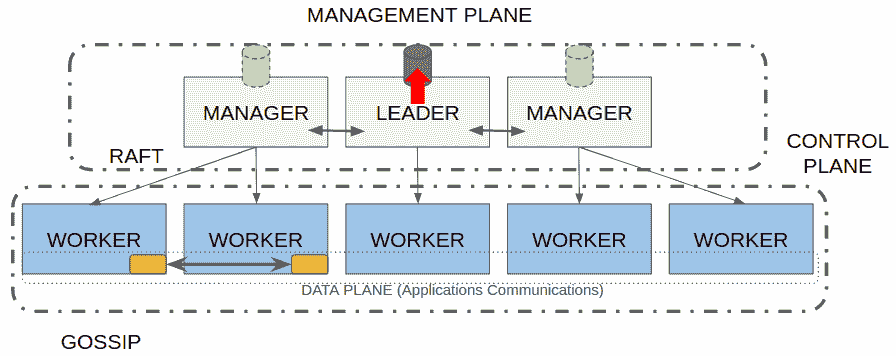
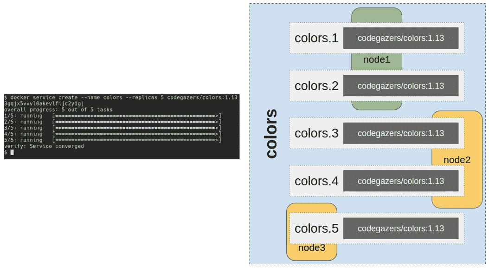
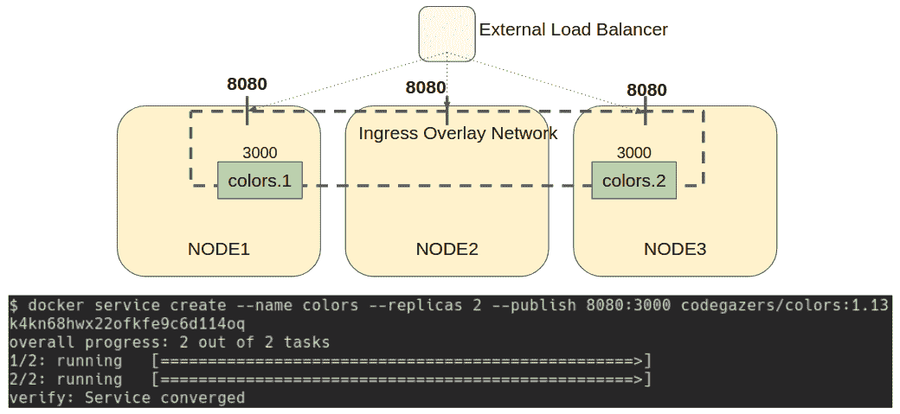

使用 Docker Swarm 进行编排

在上一章中，我们学习了编排功能。在本章中，我们将基于此继续学习 Docker Swarm。它与 Docker 引擎（Docker 安装包）一起捆绑提供，因此我们无需安装其他软件。相比其他编排器，掌握 Docker Swarm 的基础更为简单，而且它足够强大，可以用于生产部署。

总结来说，在本章中，我们将学习如何在生产环境中部署 Docker Swarm。我们还将回顾 Docker Swarm 引入的新对象以及部署基于容器的完整应用程序所需的步骤。网络是节点分布式应用的关键，因此我们将探讨 Docker Swarm 如何提供解决方案来处理内部网络、服务发现和发布已部署的应用程序。在本章结束时，我们将回顾 Docker Swarm 如何帮助我们在不中断服务的情况下升级应用程序的组件。

本章我们将讨论以下主题：

+   部署 Docker Swarm

+   创建 Docker Swarm 集群

+   在集群中调度工作负载 – 任务与服务

+   使用 Stacks 和其他 Docker Swarm 资源部署应用程序

+   Docker Swarm 中的网络

让我们开始吧！

# 技术要求

在本章中，我们将学习 Docker Swarm 的编排器功能。我们将在本章末尾提供一些实验，供你测试理解并展示你学到的概念。这些实验可以在你的笔记本电脑或个人电脑上使用提供的 Vagrant “Docker Swarm”环境运行，或者使用你自己已经部署的 Docker Swarm 集群。请查看本书的 GitHub 代码库，获取我们将在本章中使用的代码以及更多信息，地址是 [`github.com/PacktPublishing/Docker-Certified-Associate-DCA-Exam-Guide.git`](https://github.com/PacktPublishing/Docker-Certified-Associate-DCA-Exam-Guide.git)。

查看以下视频，了解代码演示：

"[`bit.ly/31wfqmu`](https://bit.ly/31wfqmu)"

# 部署 Docker Swarm

Docker Swarm 是与 Docker 引擎捆绑在一起的内置编排器。它是在 Docker 引擎 1.12 版本中引入的（版本号在 1.13 后改为四位数字），以*swarm 模式*呈现。之前有一种称为传统 Swarm 的方法，它的架构更接近 Kubernetes，需要一个外部的键值存储数据库等组件。Swarm 模式与此不同，因为它包含了运行编排器所需的所有内容，可以开箱即用。

Swarm 架构相当简单，因为它默认提供了组件之间的安全通信。在部署 Docker Swarm 集群之前，让我们回顾一下它的主要特点：

+   **每个 Docker Engine 都包含多节点容器编排**：这意味着我们可以部署一个不需要其他软件的集群。Docker Engine 提供了部署和管理集群所需的所有组件。

+   **节点角色可以在运行时更改**：编排基于不同的节点角色。虽然控制平面由管理者或主节点管理，但计算或应用程序部署将在从节点、工作节点或随从节点上完成。每个编排器对这些不同角色使用不同名称，但它们本质上是相同的。Swarm 允许我们在一个角色不健康或需要执行维护任务时将节点从一个角色更改为另一个角色。

+   **工作负载将被声明为服务，定义需要保持健康的实例数量**：Docker 编排器将保持所需数量的副本存活。如果其中一些实例失败，编排器将运行新任务以保持所需数量的实例存活。编排器将管理此调解过程。如果一个节点失败，编排器将所有容器迁移到一个新的、健康的节点。

+   **由于工作负载基于所需实例数量，编排器允许我们随时更改此数字**：因此，我们可以根据请求的高需求来扩展或减少服务（应用程序组件）的实例数量。

+   **我们将基于多个服务组件部署应用程序，并满足它们的所有需求和连接要求**：由于组件可能在任何集群节点上运行，Docker Swarm 将提供内部叠加网络以连接所有应用程序组件。

+   **Swarm 将提供服务发现和内部负载均衡**：在*服务发现和负载均衡*部分，我们将了解 Docker Swarm 如何提供内部应用程序 DNS 解析，以便所有组件可以轻松发现彼此，并通过虚拟 IP 在服务副本之间进行负载均衡。

+   **编排将允许我们自动更新应用程序组件**：事实上，我们只需决定如何管理这些更新；编排将完成其余工作。这样，我们可以更新应用程序组件而不会影响用户。

+   **我们可以确保默认情况下集群安全运行**：Docker Swarm 将部署**传输层安全**（**TLS**）来连接控制平面组件。它将为所有节点管理证书，创建内部 CA 并验证所有节点证书。

只有控制平面默认安全，用户访问应用发布等功能需要额外配置。

正如我们在上一章中所学到的，调度器需要数据库来存储和管理工作负载及其他集群资源信息。Docker Swarm 在`/var/lib/docker/swarm`路径下有一个内建的键值存储（这是 Linux 上的路径；在 Windows 上，它可以在`C:\ProgramData\docker`目录下找到其对应的路径）。

重要的是要理解，`/var/lib/docker/swarm`目录是必不可少的，万一我们需要恢复一个不健康的集群时，请务必保护好这个目录，并保持备份。

我们可以使用密钥锁定用户对`/var/lib/docker/swarm`路径的访问权限，从而提高安全性。如果路径被解锁，拥有足够系统权限的人可以获取 Docker Swarm 证书。

## Docker Swarm 整体架构

如前所述，Docker Swarm 部署了其自己的安全控制平面。节点角色有两种：

+   **管理节点**：这些节点管理整个 Swarm 集群环境。它们共享一个内部的键值数据库。更具体地说，其中一个管理节点担任不同的角色，即集群的领导者。每个集群只有一个领导者，领导者负责对数据库进行所有必要的更新。其他所有管理节点都会跟随并将它们的数据库与领导者的数据库同步。管理节点维护集群健康，提供 Swarm HTTP API 服务，并在可用计算节点上调度工作负载。

+   **工作节点**：工作负载将在工作节点上运行。需要注意的是，管理节点也有工作节点角色。这意味着，如果我们没有指定特殊的调度位置，工作负载也可以在管理节点上运行。工作节点永远不会参与调度决策，它们只会运行分配的工作负载。

我们通过对每个工作负载使用位置约束或禁用某些节点上的容器执行来管理工作负载的位置。

在具有多个网络接口的节点上，我们将能够选择用于控制平面的接口。管理节点将实现 Raft 共识算法来管理 Swarm 集群状态。该算法要求多个服务器就数据和状态达成一致。一旦它们就某个值做出决定，该决定会被写入磁盘。这将确保信息在多个管理节点间一致地分发。

如前所述，存在一个领导节点，它修改并存储数据库中的变更；所有其他节点将与其同步数据库。为了保持一致性，Swarm 实现了 Raft 协议。该算法将管理数据库中的所有更改，并在领导节点不健康时进行新领导的选举。当领导节点需要做出更改（例如，修改应用程序的组件状态及其数据）时，它会询问所有其他节点的意见。如果所有节点都同意更改，领导节点将提交该更改，并将其同步到所有节点。如果领导节点失败（例如，节点宕机，服务器进程崩溃等），将触发新的选举。在这种情况下，所有剩余的管理节点将投票选举新的领导节点。

该过程需要达成共识，绝大多数节点需同意选举结果。如果没有达成多数意见，将触发新的选举过程，直到选出新的领导节点。选举完成后，集群将恢复健康。记住这些概念，因为它们是 Docker Swarm 和其他协调器的关键。

以下图示表示 Swarm 协调器的基本架构：



让我们详细回顾每个平面的内容。

### 管理平面

管理平面是执行所有管理任务的层次。所有集群管理流量和工作负载维护都将在此平面进行。管理平面提供基于奇数个管理节点的高可用性。

默认情况下，所有在此平面中的通信都使用 TLS（双向 TLS）进行加密。这是 Raft 协议运行的地方。

### 控制平面

该平面管理集群的状态。Gossip 协议会定期通知所有节点集群状态，减少节点所需的相关信息，仅提供集群健康概况。这一协议管理主机之间的通信，因此被称为*控制平面*，因为每个主机只与它最近的伙伴通信，信息通过该平面流动，传递至控制平面内的所有节点。

### 数据平面

数据平面管理所有服务的内部通信。它基于 VXLAN 隧道，将二层数据包封装在三层头部内。它将使用 UDP 传输，但 VXLAN 保证没有丢包。我们可以在创建（或加入）Docker Swarm 时使用适当的标志，将数据平面与控制和管理平面隔离开来。

当我们初始化一个新的 Docker Swarm 集群时，它会生成一个自签名的**证书颁发机构**（**CA**），并向每个节点发放自签名证书。这确保了双向 TLS 通信。以下是当一个新节点加入集群时，确保安全通信的步骤概述：

1.  当一个节点加入时，它会将其加入令牌和证书请求一起发送给管理节点。

1.  然后，如果令牌有效，管理节点接受该节点的请求并返回一个自签名的节点证书。

1.  然后，管理节点将新节点注册到集群中，它将成为 Docker Swarm 集群的一部分。

1.  一旦节点被包含在集群中，它将准备好（默认情况下）接受由管理节点调度的任何新工作负载。

在下一部分，我们将学习如何使用常见的 Docker 命令行操作轻松部署 Docker Swarm 集群。

## 使用命令行部署 Docker Swarm 集群

我们可以使用 Docker 的`swarm`对象来初始化一个新集群，加入或离开一个先前创建的集群，并管理所有 Docker Swarm 属性。让我们来看一下`docker swarm`操作：

+   `init`：我们将使用`docker swarm init`来初始化一个新集群或重新创建一个已有集群（我们将在*高可用性与 Swarm*部分更详细地描述这种情况）。在集群创建过程中，我们将设置许多集群选项，但有些选项可以稍后更改。最重要的选项是`--data-path-addr`和`--data-path-port`，因为它们用于设置在多网卡节点上哪个节点接口将专门用于控制平面。

这些是创建集群时最常用的参数：

+   `--advertise-addr`：此选项允许我们设置用于宣布集群的接口。所有其他节点将使用该接口的 IP 地址来加入集群。

+   `--data-path-addr`/`--data-path-port`：这些选项配置用于控制平面的接口和端口。该接口的所有流量将使用 TLS 加密，证书将由 Swarm 内部管理。我们可以使用 IP 地址/端口或主机接口表示法。默认端口是`4789`。

+   `--external-ca`/`--cert-expiry`：尽管 Swarm 会为我们管理 TLS，但我们可以使用此参数部署自己的 CA 以管理所有证书。我们还可以指定证书的旋转频率。默认情况下，证书每 90 天（2160 小时）自动重新创建。

+   `--listen-addr`：此选项允许我们指定将用于提供集群 API 的主机接口。我们可以使用 IP 地址/端口或主机接口表示法，默认值为`0.0.0.0:2377`。

+   `--autolock`：正如我们之前提到的，我们可以锁定对内部 Docker Swarm 数据的访问。这很重要，因为`/var/lib/docker/swarm`包含了 CA 和其他证书。如果您不确定节点访问权限，最好将此目录锁定，以防止用户访问。使用此选项时要小心，因为任何系统或 Docker 守护进程的重启都需要解锁密钥才能再次启用此节点。

+   `--dispatcher-heartbeat`：此选项将管理节点报告健康状况的频率。默认值为 5 秒，但如果您的集群存在高延迟，可以进行更改。

+   `--max-snapshots`/`--snapshot-interval`: Swarm 将为管理节点的同步创建数据库快照。我们可以设置保留的快照数量。默认情况下，不会保留任何快照（只为同步保留一个），但这些快照在调试或灾难恢复时可能非常有用。我们还可以设置快照之间的间隔。更改此选项时要小心，因为保存过多的快照会触发大量的同步操作到其他节点，可能会导致高性能开销。但另一方面，较少的同步也可能使集群进入不同步的状态。此参数的默认值为 10,000 毫秒。

+   `join`: 集群初始化后，所有其他节点将加入先前创建的集群，无论它们是管理节点还是工作节点。将 Docker 节点加入集群需要集群特定的令牌，管理节点和工作节点的令牌不同。我们始终需要一个令牌和领导者的 IP 地址来加入集群。请记住，领导者的 IP 可能会发生变化。我们还可以设置控制平面的 IP 和端口、要向其他节点公布的 IP 地址以及 API 的监听 IP 地址。我们将在加入节点上执行以下命令：`docker swarm join --token <MANAGER_OR_WORKER_TOKEN> <LEADER_IP:PORT>`。

+   `leave`: 一旦节点成为集群的一部分，我们可以根据需要让其退出集群。理解*退出*集群的含义很重要。`leave`命令将在退出集群的节点上执行。管理节点无法退出集群，因为这样会导致集群进入不健康状态。我们可以使用`--force`强制让节点退出集群，即使它是管理节点，但这会带来一些风险，必须在操作前充分理解。退出集群并不会将节点从内部的 Docker Swarm 数据库中移除。相反，我们需要通过执行`docker node rm <NODE_NAME_OR_ID>`命令来通知管理节点这一变化。

+   `update`: 通过此操作，我们可以更改 Docker Swarm 集群的一些描述属性，例如外部 CA、证书过期设置和快照行为。

+   `ca`: 如前所述，所有内部控制平面的通信都是基于 TLS 证书的。`ca`选项允许我们自定义 CA 和其他证书行为。我们可以轮换证书或选择自己的 CA。

+   `join-token`：通过此操作，我们可以查看当前的管理器和工作节点令牌。事实上，我们可以执行`join-token`，后跟所需的角色，以检索它们的值。我们不需要将其保管，因为我们可以根据需要随时检索这些令牌。这些令牌仅在加入集群时使用。我们可以随时更改它们，使用`docker swarm join-token --rotate`来创建一个新的令牌，这不会影响已经加入的节点。我们通常执行`docker swarm join-token worker`来检索加入节点到集群所需的命令行和令牌。我们可以使用`--quiet`仅检索令牌，这对自动化加入过程非常有用。

+   `unlock`/`unlock-key`：我们之前提到过，允许用户访问`/var/lib/docker`目录是不安全的。默认情况下，只有 root 用户允许访问，但将 Docker Swarm 信息加锁会更安全。例如，所有集群证书将存储在`/var/lib/docker/swarm/certificates`目录下。加锁 Swarm 信息是一个好习惯，但要注意不要丢失解锁密钥。每次集群节点启动时（例如 Docker Engine 或节点重启时），都需要解锁密钥。这在某些情况下会导致集群处于非自动、高可用环境。`unlock`选项用于解锁 Docker Swarm 集群信息，而`unlock-key`允许我们管理用于此行为的密钥。

Docker Swarm 还会创建新的对象：

+   `swarm`：这就是集群本身及其相关的属性，如前所述。

+   `node`：这些是集群中的节点。我们将为它们添加标签，并作为集群的一部分管理它们的角色。

+   `service`：我们在 Docker Swarm 集群上部署服务。我们不会部署独立的容器。我们将在*集群中的工作负载调度——任务和服务*部分学习更多关于服务的内容。

+   `secret` 和 `config`：这两个对象允许我们在集群中共享服务配置。请记住，即使应用程序完全无状态，管理不同主机上的信息也并不容易。

+   `stack`：我们将使用堆栈来部署应用程序。我们将使用类似 Docker Compose 的文件格式，其中包含所有应用程序组件及其交互。

所有这些对象都将与之关联常见的操作，包括列出、部署/创建、删除和检查其属性。服务和堆栈将与容器相关联，因此我们将能够列出集群范围内的进程分布。

我们可以在笔记本电脑上运行单节点集群。对于测试或开发服务或堆栈，运行单节点集群并不成问题。

在下一部分，我们将学习如何部署具有高可用性的 Docker Swarm 环境。

## 部署具有高可用性的 Docker Swarm

到目前为止，我们已经了解了 Docker Swarm 集群中不同的角色。然而，为了提供高可用性，我们需要部署多个管理节点和工作节点。

Raft 一致性算法要求有奇数个健康节点才能工作，因为大多数节点必须就所有变更和资源状态达成一致。这意味着我们需要至少*N/2+1*个健康节点达成一致才能提交变更或资源状态。换句话说，如果少于*N/2+1*个管理节点健康，我们将无法保证 Docker Swarm 的可用性。让我们通过下表回顾这些选项，以便更好地理解：

| **管理节点数量** | **所需共识数量 (*N/2+1)** | **允许的故障数** | **提供高可用性？** |
| --- | --- | --- | --- |
| 1 | 1 | 0 | 否。 |
| 2 | 2 | 0 | 否。 |
| 3 | 2 | 1 | 是的。 |
| 4 | 3 | 1 | 是的，但这不比三节点管理选项更好，如果领导节点失败，可能会导致选举问题。 |
| 5 | 3 | 2 | 是的。 |
| 6 | 4 | 2 | 是的，但这不比五节点管理选项更好，如果领导节点失败，可能会导致选举问题。 |
| 7 | 4 | 3 | 是的。 |

当一个管理节点在 3 节点管理配置中失败时，两个节点可以达成一致，变更将不受问题影响地更新。但如果其中一个节点失败，只剩下一个节点，变更将无法提交。没有共识，也无法进行集群操作。这意味着，集群中部署的任何服务将继续运行。除非某个服务失去了一些副本，并且 Docker Swarm 应当启动新的副本以达到所需数量，否则用户不会受到影响。由于这些操作需要更新数据库数据，而这在此情况下是不允许的，因此不允许自动操作。在这种情况下，我们将无法添加或移除任何节点，集群将变得不一致。

因此，Swarm 需要奇数个管理节点来提供高可用性。虽然管理节点的数量没有限制，但不推荐超过七个。增加管理节点的数量会降低写入性能，因为领导节点需要更多节点的确认响应才能更新集群变更。这将导致更多的网络往返流量。

理解这些行为至关重要。即使我们已经部署了一个三节点集群，如果有足够多的节点变得不健康，我们仍然可能会失去法定人数。重要的是要尽快处理节点故障。

我们通常会部署三节点集群，因为它们允许 1 个节点的故障。这对生产环境来说已经足够，但在一些关键环境中，我们将部署五节点集群，以便允许两个节点的故障。

在需要将 Swarm 集群分布在不同位置的情况下，推荐的管理节点数量是七个。这将允许跨多个数据中心进行分布。我们将在第一个数据中心部署三个节点，在第二个数据中心部署两个节点，在第三个数据中心部署两个节点（3+2+2）。这种分布将使我们能够处理整个数据中心的故障，如果工作节点有足够的资源，服务可以重新分配。

当管理节点失败时会发生什么？领导节点将开始存储已提交的更改，以便在该管理节点重新恢复时同步它。这将增加 Docker Swarm 的目录大小。如果没有足够的磁盘空间来应对这种情况，节点可能会消耗整个文件系统，特别是在故障未能及时恢复的情况下。然后，你将得到第二个不健康的节点，集群将变得不一致。我们所描述的情况并不是恐怖电影——在新安装中，管理员通常认为集群可以在几周内容忍一些不健康的节点，这种情况发生得太频繁。

我们在讨论 Docker Swarm 集群初始化时提到过一个重要的选项，即 `docker swarm` 命令行表中的选项。在集群不健康但至少有一个管理节点正常工作的情况下，我们将使用 `docker swarm init --force-new-cluster`。如果集群未能达到法定人数并且无法对集群资源执行任何操作（即无法添加/删除节点，服务在失败后无法修复），我们可以强制创建一个新集群。这是一个极端情况。

在重新创建集群之前，请先处理好环境。强制创建新集群会将执行命令的节点设置为领导节点。集群中的所有其他节点（包括那些未能达到法定人数的管理节点）将被设置为工作节点。这就像是**集群法定人数重置**。服务和其他资源将保留其状态和配置（无论是已提交的还是从节点中恢复的）。因此，最终我们将得到一个单管理节点的集群，所有其他节点都将是工作节点。服务和其他内容不应受到影响。在这种情况下，查看管理节点的日志是一个好习惯，因为如果某些集群更改没有被提交，某些容器可能会被遗留在未管理状态。

虽然管理节点可以充当工作节点，但在生产环境中，最好仅在工作角色节点上运行工作负载。管理节点的进程可能会影响应用程序，反之亦然。

我们在生产环境中始终会部署多个工作节点。这将确保我们的服务在某个工作节点意外下线或需要执行维护任务（例如更新 Docker 引擎）时，服务的健康状态不会受到影响。通常，我们应该根据应用程序的资源需求部署工作节点。增加工作节点将提高集群的总工作负载容量。

在下一节中，我们将学习如何部署 Docker Swarm 集群。

# 创建 Docker Swarm 集群

现在我们已经回顾了 Docker Swarm 架构以及初始化集群所需的命令行操作，我们可以创建一个集群。到本章结束时，我们将拥有一个具有高可用性的完全功能集群。让我们先回顾一下 Docker Swarm 集群创建过程：

1.  首先，我们在管理节点上初始化一个 Swarm 集群。由于没有其他管理节点可用，当前节点自动成为集群领导者。如果我们有一个具有多个接口的节点，我们将选择哪个接口与控制平面关联，哪些接口将用于其他节点和 Swarm API。输出将在您的环境中有所不同。让我们执行`docker swarm init`：

```
$ docker swarm init
Swarm initialized: current node (ev4ocuzk61lj0375z80mkba5f) is now a manager.
To add a worker to this swarm, run the following command:
docker swarm join --token SWMTKN-1-4dtk2ieh3rwjd0se5rzwyf2hbk7zlyxh27pbh4plg2sn0qtitx-50zsub5f0s4kchwjcfcbyuzn5  192.168.200.18:2377
To add a manager to this swarm, run 'docker swarm join-token manager' and follow the instructions.
```

1.  一旦集群创建完成，我们可以使用`docker node ls`来查看集群节点及其属性：

```
$ docker node ls
ID                            HOSTNAME    STATUS AVAILABILITY     MANAGER STATUS ENGINE VERSION
ev4ocuzk61lj0375z80mkba5f    * sirius     Ready     Active         Leader             19.03.2
```

第一列显示节点对象标识符。正如我们之前提到的，新的对象已通过 Docker Swarm 创建。第二列显示其来自内部主机解析服务的名称（这可能包含**完全限定域名**（**FQDN**））。请注意主机名旁边的星号。这意味着我们当前正在操作该节点。所有命令都在该节点上执行，无论它是否是领导节点。

在 Docker Swarm 上，与集群范围对象相关的集群命令仅在管理节点上可用。我们不需要在领导节点上执行命令，但在工作节点上无法执行任何集群命令。我们不能列出节点或部署服务。

最后一列显示每个节点的 Docker Engine 版本。让我们来看一下`STATUS`、`AVAILABILITY`和`MANAGER STATUS`列：

+   `STATUS`，顾名思义，显示节点在集群中的状态。如果节点不健康，它将在此显示。

+   `MANAGER STATUS`显示节点的当前角色（在这种情况下，该节点是领导者）。我们有三种不同的状态：

    +   `Leader`，当该节点是集群领导者时。

    +   `Manager`，意味着该节点是集群的管理节点之一。

    +   如果值为空，则表示该节点具有工作节点角色，因此不属于控制平面的一部分。

+   `AVAILABILITY`表示节点接收工作负载的可用性。在这里，我们可以看到管理节点也能接收工作负载。我们可以设置这个节点属性。实际上，有三种不同的状态：

    +   `active`，意味着该节点能够接收任何工作负载。

    +   `passive`，意味着该节点不会运行任何额外的工作负载。已经在运行的工作负载将保持其状态，但不会允许新的工作负载。

    +   `drain`是当我们禁用该节点上的任何工作负载时的状态。发生这种情况时，所有正在运行的工作负载将被移到任何其他健康且可用的节点上。

我们可以在节点加入集群时，甚至在我们创建集群时，通过使用`docker swarm init`或`docker swarm join`命令中的`--availability`标志来强制节点的行为。我们将为新工作负载设置节点可用性（`active` | `pause` | `drain`）。默认情况下，所有节点都将处于活动状态，准备接收工作负载。

1.  我们将加入另一个节点作为工作节点来演示此操作，使用之前显示的集群初始化输出和`docker swarm join`：

```
$ docker swarm join --token SWMTKN-1-4dtk2ieh3rwjd0se5rzwyf2hbk7zlyxh27pbh4plg2sn0qtitx-50zsub5f0s4kchwjcfcbyuzn5 192.168.200.18:2377
```

1.  现在，我们可以通过执行`docker node ls`再次查看集群节点状态（记住，这个命令仅在管理节点上可用）：

```
$ docker node ls
ID                         HOSTNAME     STATUS   AVAILABILITY MANAGER STATUS  ENGINE VERSION
glc1ovbcqubmfw6vgzh5ocjgs   antares     Ready     Active                          19.03.5
ev4ocuzk61lj0375z80mkba5f * sirius      Ready     Active          Leader          19.03.2
```

在这个例子中，我们在`*`标记的`sirius`节点上执行命令，它是一个领导者，因此是一个管理节点。注意，`antares`是一个工作节点，因为它在`MANAGER STATUS`列中没有值。

我们可以通过执行`docker node inspect`操作来查看节点信息（以下输出已被截断）：

```
$ docker node inspect antares 
[
 {
 "ID": "glc1ovbcqubmfw6vgzh5ocjgs",
...
 "Spec": {
 "Labels": {},
 "Role": "worker",
 "Availability": "active"
 },
 "Description": {
 "Hostname": "antares",
 "Platform": {
 "Architecture": "x86_64",
 "OS": "linux"
 },
 "Resources": {
 "NanoCPUs": 16000000000,
 "MemoryBytes": 33736785920
 },
 "Engine": {
 "EngineVersion": "19.03.5",
            ...
 ...
         },
 "TLSInfo": {
 "TrustRoot": "-----BEGIN CERTIFICATE-----\nMIIBaTCCARCgAwIBAgIUUB8yKqt3uUh2wmF/z450dyg9EDAwCgYIKoZIzj0EAwIw\nEzERMA8GA1UEAxMIc3dhcm0tY2EwHhcNMTkxMjI5MTA1NTAwWhcNMzkxMjI0MTA1\nNTAwWjATMREwDwYDVQQDEwhzd2FybS1jYTBZMBMGByqGSM49AgEGCCqGSM49AwEH\nA0IABACDe6KWpqXiEMyWB9Qn6y2O2+wH8HLoikR+48xqnjeU0SkW/+rPQkW9PilB\ntIYGwaviLPXpuL4EpVBWxHtMDQCjQjBAMA4GA1UdDwEB/wQEAwIBBjAPBgNVHRMB\nAf8EBTADAQH/MB0GA1UdDgQWBBTbL48HmUp/lYB1Zqu3GL7q5oMrwTAKBggqhkjO\nPQQDAgNHADBEAiAh1TVNulaIHf2vh6zM9v6raer5WgTcGu8xQYBcDViPnwIgU4sl\ntK70bgSfEzLx6WpOv4yjr+c0tlJt/6Gj3waQl10=\n-----END CERTIFICATE-----\n",
 "CertIssuerSubject": "MBMxETAPBgNVBAMTCHN3YXJtLWNh",
 "CertIssuerPublicKey": "MFkwEwYHKoZIzj0CAQYIKoZIzj0DAQcDQgAEAIN7opampeIQzJYH1CfrLY7b7AfwcuiKRH7jzGqeN5TRKRb/6s9CRb0+KUG0hgbBq+Is9em4vgSlUFbEe0wNAA=="
 }
 },
 "Status": {
 "State": "ready",
 "Addr": "192.168.200.15"
 }
 }
]
```

当我们检查一个节点时，关于其状态、节点 IP 地址和 TLS 信息将以 JSON 格式显示。

我们可以在节点上使用标签，帮助 Docker Swarm 为特定工作负载选择最佳位置。它使用节点架构将工作负载部署到合适的地方，但如果我们希望工作负载在特定节点上运行，可以添加一个独特的标签并添加约束来部署该工作负载。我们将在*章节实验*部分进一步学习服务位置和标签。

在`Spec`键下，我们可以在`docker node inspect`输出中查看节点角色。我们可以在必要时更改节点角色。这相较于其他编排器是一个巨大改进，因为其他编排器的角色是静态的。请记住，角色更改将影响 Docker Swarm 架构，因为它会改变管理节点和工作节点的数量。记住高可用性要求管理节点数量为奇数，以及在节点故障时的后果。

1.  角色只是一个节点属性，这意味着我们可以像更改其他对象属性一样更改它。记住，更改只能从管理节点部署。我们可以通过执行`docker node update`来更改节点的角色：

```
$ docker node update --role manager antares
antares
```

再次执行`docker node ls`列出集群中的所有节点，这次使用筛选器只获取管理节点：

```
$ docker node ls --filter role=manager
ID HOSTNAME STATUS AVAILABILITY MANAGER STATUS ENGINE VERSION
glc1ovbcqubmfw6vgzh5ocjgs antares Ready Active Reachable 19.03.5
ev4ocuzk61lj0375z80mkba5f * sirius Ready Active Leader 19.03.2
```

现在我们可以使用`docker node inspect`来获取`ManagerStatus`键：

```
$ docker node inspect antares --format "{{.ManagerStatus}}"
{false reachable 192.168.200.15:2377}
```

可以使用`docker node rm`将节点从集群中移除，就像我们对其他 Docker 对象所做的那样。我们只会移除工作节点。通常，将管理节点从 Docker Swarm 集群中移除需要先将其角色更改为工作节点。一旦节点角色更改为工作节点，我们就可以移除该节点。如果需要移除故障的管理节点，可以使用`--force`强制移除节点。但不推荐这么做，因为这可能会使集群处于不一致状态。必须在移除任何节点之前更新管理节点的数据库，这也是我们在这里描述的移除顺序如此重要的原因。

记住，如果降级或移除任何管理节点，确保管理节点的数量为奇数。如果没有奇数个管理节点，且在没有奇数个管理节点的情况下出现领导节点问题，当其他管理节点需要选举新领导时，可能会导致集群状态不一致。

如前所述，标签是节点的属性。我们可以在运行时添加和删除它们。这与第一章《使用 Docker 的现代基础设施与应用程序》中介绍的标签有很大的不同。那些标签是在 Docker 守护进程级别设置的，并且是静态的。我们需要将它们添加到`daemon.json`文件中，因此必须重新启动节点的 Docker 引擎才能使其生效。而在本例中，节点标签由 Docker Swarm 管理，可以通过常见的节点对象的`update`操作（`docker node update`）来更改。

如我们在前几章中观察到的那样，Docker 命令行提供了一些快捷方式。在这种情况下，我们可以通过将管理节点降级为工作节点角色，或将工作节点提升为管理节点角色来更改节点角色。我们使用`docker node <promote|demote> <NODENAME_OR_ID>`来在节点角色之间进行切换。

我们还可以更改节点的工作负载可用性。这使得节点可以接收（或不接收）集群部署的工作负载。与任何其他节点属性一样，我们将使用`docker node update --availability <available|drain|pause> <NODENAME_OR_ID>`来排空或暂停处于活动状态的节点。无论是排空还是暂停，都会阻止我们在该节点上调度任何新工作负载，而仅排空则会将任何当前运行的工作负载从受影响的节点上移除。

记住，当我们排空一个节点时，调度器会将任何正在该节点上运行的任务重新分配到其他可用的工作节点。请记住，其他节点在排空该节点之前应该有足够的资源。

在下一节中，我们将回顾如何备份和恢复故障的 Docker Swarm 集群。

## 恢复故障的 Docker Swarm 集群

我们将回顾一些备份和恢复 Docker Swarm 集群的步骤。丢失集群法定人数并不是什么大问题。正如我们所学，即使只有一个健康的管理节点，我们也可以通过强制初始化一个新集群来恢复集群。但是，如果丢失了集群数据，将完全摧毁您的环境，前提是没有任何一个操作正常的管理节点。在这些情况下，我们可以通过恢复在集群正常运行时采集的包含健康数据的副本来恢复集群。现在让我们学习如何备份我们的集群。

### 备份您的 Swarm

正如我们在本章中所学，`/var/lib/docker/swarm`（以及其对应的微软 Windows 目录）包含了键值存储数据、证书和加密的 Raft 日志。没有它们，我们无法恢复故障集群，因此让我们在任何一个管理节点上备份这个目录。

保持一致的备份需要静态文件。如果文件被打开或某些进程正在写入它们，那么它们将不一致。因此，我们需要停止指定节点上的 Docker Engine。不要在主节点上启动备份操作。

请记住，在备份操作进行时，如果 Docker 守护进程被停止，管理节点的数量将会受到影响。领导节点将继续管理更改，并生成新的同步点以恢复与丢失管理节点的同步。如果其他管理节点失败，您的集群将容易丧失法定人数。如果您计划进行每日备份，建议使用五个管理节点。

### 恢复您的 Swarm

如果我们需要恢复一个完全失败的集群（即所有管理节点无法达到法定人数，并且我们无法强制创建一个新集群），我们将停止一个管理节点上的 Docker Engine。删除所有`/var/lib/docker/swarm`目录内容（或其微软 Windows 对应目录）并将备份的内容恢复到该目录。然后，重新启动 Docker Engine，并使用`docker swarm init --force-new-cluster`重新初始化集群。

当单节点管理的集群健康时，开始添加其他旧 Swarm 集群的管理节点。在添加这些管理节点之前，确保它们已经退出了旧的 Swarm 集群。

如果我们启用了 Swarm 自动锁定功能，我们将需要与恢复的备份一起存储的密钥。即使您在备份发出后更改了密钥，您仍然需要使用旧的密钥。

在下一节中，我们将学习如何在集群上部署工作负载，以及 Docker Swarm 如何跟踪应用程序组件的健康状况，以确保在出现故障时服务不受影响。

# 在集群中调度工作负载 —— 任务和服务

我们不在 Swarm 集群上运行容器，而是部署服务。这些是可以在 Docker Swarm 集群中部署的原子工作负载。服务由任务定义，每个任务在 Docker Swarm 模型中由一个容器表示。Swarm 基于 SwarmKit，并继承了其逻辑。SwarmKit 是应对任何任务（例如虚拟机）集群化的需求而创建的，但 Docker Swarm 是与容器协同工作的。

Docker Swarm 调度器使用声明式模型。这意味着我们定义服务的期望状态，Docker Swarm 会处理其余的部分。如果服务的副本数或任务数不正确——例如，如果其中一个副本挂掉——Docker Swarm 将采取措施恢复服务的正确状态。在这个例子中，它会部署一个新的副本，以保持所有所需节点的健康。

以下图示表示了与容器相关的服务和任务。`colors` 服务有五个副本（`colors.1` 到 `colors.5`）。每个副本都在同一镜像 `codegazers/colors:1.13` 的一个容器上运行，这些容器在 `node1`、`node2` 和 `node3` 上分布式运行：



创建服务需要以下信息：

+   哪个镜像将运行关联的容器？

+   该服务需要多少个容器才能保持健康？

+   该服务是否应该在任何端口和协议上对用户可用？

+   服务更新应如何管理？

+   是否有该服务运行的首选位置？

创建服务时需要在命令行输入所有这些信息。由于服务是 Docker 对象，我们可以使用常见的操作，如列出、创建、删除、更新和检查它们的属性。Docker Swarm 将管理所有任务与服务的集成。我们永远不会部署任务或容器，只会创建和管理服务。让我们来看一下与服务相关的 Docker 命令行操作和选项：

+   `create`：这与其他对象相似，但服务有许多非标准属性。我们不会列出并审查所有服务参数，因为其中大多数是从容器继承的。在这里，我们将回顾与服务行为相关的最重要的几个：

    +   `--config`：我们仅能创建服务配置，而不是一个实际的服务。这将创建所有服务环境和要求，但不会运行任何任务。

    +   `--container-label`/`--label`：我们在这里添加这个选项是因为理解服务和容器是不同的对象很重要，我们可以为两者添加标签。默认情况下，Docker Swarm 会在每个服务容器上创建许多标签，以便将它们相互关联。我们可以轻松地使用这些标签来过滤关于我们服务容器的任何主机信息。

    +   `--constraint`/`--placement-pref`：如前所述，我们可以指定哪些节点应该运行某个服务的任务。我们使用一组键值对作为约束条件来实现这一点。所有定义的键必须满足，才能在指定节点上调度该服务的任务。如果没有节点满足这些定义的约束条件，任务将无法执行，因为 Docker Swarm 的调度器找不到符合要求的节点。另一方面，`placement-pref` 提供了一种放置偏好设置。这不会限制哪些节点会运行任务，但我们可以通过定义的键来将服务的任务分布到不同的节点上。例如，我们可能会将某个服务的任务分布到不同的物理位置（例如数据中心）中。

    +   `--mode`：有两种不同的服务模式（事实上，后来我们会在 *Docker Swarm 网络配置* 部分了解到三种，但此时只需要记住以下两种）。默认情况下，所有服务都将使用复制模式。这意味着我们将设置要保持健康的副本数（默认情况下是一个副本）。我们还有全局服务。在这种情况下，我们会创建与集群节点数量相等的副本，但每个节点上只运行一个副本。这种模式对于监控应用程序非常有趣，因为所有节点都会接收到自己的监控进程。关于这些服务，有一个重要的事情是每个加入集群的节点都会收到它自己的副本。Docker Swarm 会自动将其部署到新的节点上。

    +   `--with-registry-auth`：这是一个非常重要的选项，因为它允许我们在集群节点之间分发凭证，从而使用私有镜像。还需要理解的是，Docker Swarm 需要外部或内部的注册表来工作。我们不再在集群节点上使用本地镜像。使用本地镜像会导致不一致的部署，因为镜像名称可能匹配，但不同节点上的内容可能完全不同。

    +   `--endpoint-mode`：此选项设置服务如何宣布或管理它们的任务。我们可以使用 `vip` 和 `dnsrr` 来设置。服务默认为 `vip`，这意味着每个服务将接收一个与其名称相关联的虚拟 IP，并且内部负载均衡器会将流量路由到与之关联的每个副本进程（容器/任务）。另一方面，`dnsrr` 将使用内部名称解析来关联每个副本的 IP 地址，每当我们请求服务名称时。这样，当给定服务以多个任务部署时，内部名称解析会为我们提供一个不同的 IP 地址。

    +   `--network`：我们可以将新服务连接到现有的网络。就像我们在容器中做的那样，我们也可以使用主机网络命名空间。这里的区别在于，我们不能执行特权服务，因此我们的服务必须暴露高于 `1024` 的端口。

    +   `--publish`: 我们将使用此选项来将端口公开到外部。Docker Swarm 将通过每个节点上的 Docker Swarm 路由器网格公开端口。如果外部请求到达一个没有执行任何服务任务的主机，Docker Swarm 将内部重新路由请求到适当的节点。

    +   `--replicas`/`--replicas-max-per-node`: 服务是通过部署多少个副本或任务来维持其健康状态的。默认情况下，所有服务部署一个副本。正如我们稍后会看到的，我们可以随时更改副本数量。如果我们扩展或缩减副本数量，并不是所有的应用组件（进程）都会正常工作。例如，想象一个 SQL 数据库。它是一个完全有状态的组件，因为数据库进程会写入数据。如果我们增加一个新的数据库副本来访问相同的存储，数据库将会损坏。如果每个数据库副本都有自己的存储，它们将管理不同的数据。因此，并不是所有服务都可以扩展或缩减。

    +   `--reserve-cpu`/`--reserve-memory`: 我们可以为服务保留所需的资源。如果没有节点提供足够的资源，该服务将不会被调度。

    +   `--update-delay`/`--update-failure-action`/`--update-max-failure-ratio`/`--update-monitor`/`--update-order`/`--update-parallelism`: `update`选项管理服务变更的执行方式。我们将设置每次更新多少个服务任务、在每个实例更新之间等待多少秒以及如何执行更新过程。`--update-order`选项设置更新过程的执行顺序。默认情况下，正在运行的容器将在旧容器完全停止后被停止并创建一个新容器。使用此设置时，服务将受到影响。我们可以通过首先启动新容器来设置不同的顺序。然后，一旦一切正常，旧容器将被停止。这样，服务将不受影响，但您的应用进程必须能够适应这种情况。例如，它在标准 SQL 数据库上将无法工作，正如我们之前提到的那样。我们还将设置当某些更新失败时该如何处理，您可以选择执行自动回滚，或者暂停其余服务的更新，直到手动采取行动。

    +   `--rollback-delay`/`--rollback-failure-action`/`--rollback-max-failure-ratio`/`--rollback-monitor`/`--rollback-order`/`--rollback-parallelism`: 如果更新过程出错，我们可以设置自动回滚。这些设置会修改回滚的方式。我们有与`update`过程相同的选项，但这次参数会涉及到`rollback`过程。

+   `ps`: 有了这个，我们可以回顾所有服务的任务及其在集群中的分布。我们还可以使用过滤器和输出格式。在*章节实验*部分，我们将看到一些例子。

+   `logs`：这是一个非常有用的操作，因为 Docker Swarm 会为我们获取所有任务的日志。我们可以从管理节点的命令行查看它们，而不是去任务运行的地方读取容器的日志。

+   `update`：服务属性可以进行更新。例如，我们可以更改镜像的发布版本，发布新端口，改变副本数量等。

+   `rollback`：通过这个操作，我们可以恢复服务的先前属性。需要理解的是，之前执行过的镜像应该保留在我们的主机上，以便支持应用程序的回滚。

+   `inspect`/`ls`/`rm`：这些是我们在所有其他类型的对象中都会遇到的常见操作。我们已经学习了如何使用它们。

需要注意的是，服务中不允许使用特权容器。因此，如果我们想要使用主机网络命名空间，容器进程应该暴露并使用非特权端口（大于 `1024`）。

Docker 服务约束可以通过自定义标签进行设置，但还有一些是默认创建的内部标签，它们非常有用：

| **标签** | **属性** |
| --- | --- |
| `node.id` | 节点 ID |
| `node.hostname` | 节点主机名；例如，`node.hostname==antares` |
| `node.role` | 节点的 Swarm 角色；例如，`node.role!=manager` |
| `node.labels` | Swarm 节点分配的标签；例如，`node.labels.environment==production` |
| `engine.labels` | Docker 引擎定义的标签；例如，`engine.labels.operatingsystem==ubuntu 18.04` |

我们可以使用变量来定义服务属性。在以下示例中，我们在容器的主机名中使用了内部的 Docker Swarm 变量：

```
$ docker service create --name "top" --hostname="{{.Service.Name}}-{{.Task.ID}}" busybox top
```

总结一下，在继续处理其他 Swarm 资源之前：服务是一组任务，每个任务执行一个容器。所有这些容器一起运行以保持服务的状态。Docker Swarm 会监控服务的状态，如果一个容器宕机，它会运行一个新容器以保持实例的数量。需要注意的是，容器的 ID 和名称会发生变化。然而，尽管可以创建新的任务，任务的名称不会改变。

在继续下一个主题之前，让我们看一个快速的示例。我们将使用 `docker service create` 创建一个简单的 NGINX Web 服务器服务：

```
$ docker service create --name webserver --publish 80 nginx:alpine
lkcig20f3wpfcbfpe68s72fas
overall progress: 1 out of 1 tasks 
1/1: running [==================================================>] 
verify: Service converged 
```

我们可以使用 `docker service ps` 查看创建的任务运行在哪个节点：

```
$ docker service ps webserver
ID NAME IMAGE NODE DESIRED STATE CURRENT STATE ERROR PORTS 
lb1akyp4dbvc webserver.1 nginx:alpine sirius Running Running about a minute ago 
```

然后，我们移动到任务所在的节点。一旦到达，我们使用 `docker container kill` 杀死相关容器：

```
$ docker container ls
CONTAINER ID IMAGE COMMAND CREATED STATUS PORTS NAMES
6aeaee25ff9b nginx:alpine "nginx -g 'daemon of…" 6 minutes ago Up 6 minutes 80/tcp webserver.1.lb1akyp4dbvcqcfznezlhr4zk

$ docker container kill 6aeaee25ff9b              
6aeaee25ff9b
```

几秒钟后，一个新的任务将自动创建并伴随一个新的容器。任务名称没有改变，但它是一个新任务，从其 ID 我们可以看出这一点：

```
$ docker service ps webserver
ID NAME IMAGE NODE DESIRED STATE CURRENT STATE ERROR PORTS
lnabvvg6k2ne webserver.1 nginx:alpine sirius Running Running less than a second ago 
lb1akyp4dbvc \_ webserver.1 nginx:alpine sirius Shutdown Failed 7 seconds ago "task: non-zero exit (137)"
```

最后，我们可以查看一些由 Swarm 创建的标签，以便通过它们来完整识别使用服务的容器。我们使用 `docker container inspect` 来查看：

```
$ docker container ls
CONTAINER ID IMAGE COMMAND CREATED STATUS PORTS NAMES
1d9dc2407f74 nginx:alpine "nginx -g 'daemon of…" 13 minutes ago Up 13 minutes 80/tcp webserver.1.lnabvvg6k2ne6boqv3hvqvth8

$ docker container inspect 1d9dc2407f74 --format "{{.Config.Labels}}"
map[com.docker.swarm.node.id:ev4ocuzk61lj0375z80mkba5f com.docker.swarm.service.id:lkcig20f3wpfcbfpe68s72fas com.docker.swarm.service.name:webserver com.docker.swarm.task: com.docker.swarm.task.id:lnabvvg6k2ne6boqv3hvqvth8 com.docker.swarm.task.name:webserver.1.lnabvvg6k2ne6boqv3hvqvth8 maintainer:NGINX Docker Maintainers <docker-maint@nginx.com>]
```

有一些服务选项可以通过字符串设置，帮助我们识别其配置和其他相关资源。当我们需要隔离特定服务任务的资源或使用一些特殊信息访问其他服务时，这是非常重要的，例如容器的主机名。我们可以使用标签为容器添加元信息，但也有一些 Docker Swarm 定义的变量，我们可以在字符串中使用它们。这些变量使用 Go 的模板语法（正如我们在格式化列出命令输出时学到的），并可以与 `docker service create` 以及 `--hostname`、`--mount` 和 `--env` 参数一起使用。

因此，我们可以使用这些变量将关联服务容器的主机名设置为任务间唯一；例如，`--hostname="{{.Service.Name}}-{{.Task.ID}}"`。我们甚至可以使用节点的名称，通过`--hostname="{{.Node.Hostname}}"`来标识任务所属的节点。这在全局服务中非常有用。

以下是有效的服务模板替换的快速列表：

+   **服务**：`.Service.ID`、`.Service.Name` 和 `.Service.Labels`

+   **节点**：`.Node.ID` 和 `.Node.Hostname`

+   **任务**：`.Task.ID`、`.Task.Name` 和 `.Task.Slot`

在接下来的章节中，我们将介绍一些新的 Docker Swarm 对象，它们将帮助我们在集群中部署应用程序。

# 使用 Stacks 和其他 Docker Swarm 资源部署应用程序

在本节中，我们将学习其他 Docker Swarm 对象，它们将帮助我们在集群内完全部署应用程序。

我们已经学习了如何使用环境变量配置应用程序。这不推荐在生产环境中使用，因为任何具有系统 Docker 访问权限的人都可以读取它们的值。为了避免这种情况，我们将使用外部数据源。我们还学会了如何将主机资源集成到容器中。我们可以将配置和密码设置在主机和容器之间共享的文件中。这在独立环境中可以正常工作，但对于分布式工作负载（容器可能在不同主机上运行）来说则不行。我们将需要在所有集群节点上同步这些文件。

为了避免在多个节点之间同步文件，Docker Swarm 提供了两种不同的对象来管理它们。我们可以拥有私有文件、密钥和配置。两者都将其值存储在 Swarm 键值存储中。存储的值将对每个需要它们的集群节点可用。这些对象是相似的，但密钥用于密码、证书等，而配置对象则用于应用程序配置文件。现在，让我们深入了解它们。

## 密钥

密钥是包含密码、证书以及任何其他不应在网络上传输的信息的数据块。它们将以加密方式存储，以防止被窥探。Docker Swarm 会为我们管理和存储密钥。由于这些数据存储在键值存储中，只有管理节点才能访问我们创建的任何密钥。当容器需要使用存储的密钥时，负责运行该容器的主机（服务任务容器）也将能够访问该密钥。容器将接收到一个临时的文件系统（在 Linux 主机上为内存中的 `tmpfs`），其中包含该密钥。当容器停止时，该密钥将无法在主机上访问。密钥仅在容器运行时需要时才会可用。

由于密钥是 Docker Swarm 对象，因此我们可以使用所有常规操作（`list`、`create`、`remove`、`inspect` 等）。不要指望通过 `inspect` 操作读取密钥数据。一旦创建，无法读取或更改密钥的内容。我们可以通过文件或使用标准输入来创建密钥。我们还可以添加标签，以便在大型集群环境中轻松列出密钥。

一旦创建了密钥，我们可以在服务中使用它。我们有短格式和长格式两种表示方式。默认情况下，使用短格式时，一个包含密钥数据的文件将会在 `/run/secrets/<SECRET_NAME>` 下创建。该文件将在 Linux 上的 `tmpfs` 文件系统中挂载。Windows 不支持内存文件系统，因此不同于 Linux。我们可以使用长格式指定密钥文件在 `/run/secrets` 下的文件名，以及其所有权和文件权限。这样可以帮助我们避免在容器内使用 root 权限来访问该文件。让我们通过 `docker secret create` 创建一个密钥，并在服务中使用它：

```
$ echo this_is_a_super_secret_password|docker secret create app-key -
o9sh44stjm3kxau4c5651ujvr

$ docker service create --name database \
 --secret source=ssh-key,target=ssh \
 --secret source=app-key,target=app,uid=1000,gid=1001,mode=0400 \
 redis:3.0
```

正如我们之前提到的，无法检索密钥数据。我们可以使用常见的 `docker secret inspect` 操作来检查之前创建的密钥：

```
$ docker secret inspect app-key
[
 {
 "ID": "o9sh44stjm3kxau4c5651ujvr",
 "Version": {
 "Index": 12
 },
 "CreatedAt": "2019-12-30T20:42:59.050992148Z",
 "UpdatedAt": "2019-12-30T20:42:59.050992148Z",
 "Spec": {
 "Name": "app-key",
 "Labels": {}
 }
 }
]
```

在接下来的章节中，我们将学习配置对象。

## 配置

配置对象与密钥类似，但它们不会在 Docker Swarm Raft 日志中加密，并且不会在容器中的 `tmpfs` 文件系统上挂载。配置可以在服务任务运行时添加或删除。事实上，我们甚至可以更新服务配置。我们将使用这些对象来存储应用程序的配置。它们可以包含字符串或二进制文件（最多 500 KB，这对配置来说足够了）。

当我们创建一个配置对象时，Docker Swarm 会将其存储在加密的 Raft 日志中，并通过相互 TLS 协议将其复制到其他管理节点。因此，所有管理节点将拥有新的配置对象值。

在服务中使用配置文件需要在容器内有一个挂载路径。默认情况下，挂载的配置文件将是世界可读的，并且由运行容器的用户拥有，但如果需要，我们可以调整这两个属性。

让我们看一个简单的例子。我们将使用`docker config create`创建一个配置文件，然后在服务中使用它：

```
$ echo "This is a sample configuration" | docker config create sample-config -
d0nqny24g5y1tiogwggxmesox

$ docker service create \
 --name sample-service \
 --config source=sample-config,target=/etc/sample.cfg,mode=0440 \
 nginx:alpine
```

在这种情况下，我们可以查看配置内容并确认其可读性。使用`docker config inspect`，我们得到以下输出：

```
$ docker config inspect sample-config --pretty
ID: d0nqny24g5y1tiogwggxmesox
Name: sample-config
Created at: 2019-12-10 21:07:51.350109588 +0000 utc
Updated at: 2019-12-10 21:07:51.350109588 +0000 utc
Data:
This is a sample configuration
```

让我们继续讨论堆栈。

## 堆栈

堆栈帮助我们部署完整的应用程序。它们是**基础设施即代码**（**IaC**）文件，包含所有组件定义、它们的交互方式以及部署应用所需的外部资源。我们将使用`docker-compose`文件定义（`docker-compose.yaml`）。并非所有`docker-compose`文件中的基本键都会可用。例如，`depends_on`在堆栈中不可用，因为它们没有依赖声明。这是需要在自己的应用逻辑中管理的。

正如我们在第五章《部署多容器应用程序》中所学到的，*部署多容器应用程序*，每个已部署的应用程序默认会在自己的网络中运行。当在 Docker Swarm 上使用堆栈时，应用组件会在整个集群中部署。将使用覆盖网络，因为每个组件应该能够相互访问，无论它们运行在哪里。堆栈也会默认在自己的网络中部署。

堆栈通过服务来部署应用程序。因此，我们将把服务定义保存在`docker-compose`文件中。为了能够将这些服务与其他堆栈区分开来，我们将设置堆栈的名称。

重要的是要理解，`docker-compose`将在一个 Docker 引擎上部署多容器应用程序，而`docker stack`将在 Swarm 集群上部署多服务应用程序。请注意，尽管如此，它们都使用相同类型的 IaC 文件。

让我们快速浏览一下`docker stack`命令行：

+   `deploy`：部署堆栈需要`docker-compose`文件版本为 3.0 及以上。我们将使用`deploy`操作一次性创建并运行所有应用组件。也可以使用 Docker 应用包文件，这是本书不涉及的内容，但值得知道的是，我们有多个选项可以通过 Docker 堆栈在 Docker Swarm 上部署应用程序。如前所述，我们需要为堆栈的部署命名，以便在集群中完全识别其所有组件。堆栈的所有资源将以堆栈的名称作为前缀，除非它们是从堆栈的文件定义外部创建的。在这种情况下，它们将保留原始名称。

    这些是`docker stack deploy`的主要选项：

    +   `--compose-file`/`-c`：我们使用`docker-compose.yaml`作为堆栈定义文件，除非我们使用此选项指定自定义文件名。

    +   `--orchestrator`：此选项是最近添加的，它允许我们选择哪个编排工具来部署和管理堆栈。在我们的环境中，当 Docker Swarm 和 Kubernetes 都可用时，我们可以选择其中之一。

    +   `--with-registry-auth`：正如我们在使用服务时所学到的，使用私有注册表时共享身份验证至关重要。没有这个选项，我们无法确保所有节点使用相同的镜像，或者它们能访问注册表，因为这将依赖于本地存储的身份验证。

+   `services`：`services`选项显示已部署堆栈的服务列表。与所有其他列出操作一样，我们可以格式化并过滤其输出。

+   `ps`：此操作列出所有服务及其任务部署的位置。它的输出可以轻松进行过滤和格式化，正如我们将在*本章实验*部分看到的那样。

+   `ls`/`rm`：这些是常见的对象操作，用于列出和删除对象。

关于堆栈没什么更多要说的了。基础设施即代码（IaC）要求每个部署都是可重现的。即使是一个简单的独立服务，也请确保使用堆栈文件来部署它。*本章实验*部分将通过更多示例来讲解这些操作和选项。在下一节中，我们将学习 Swarm 如何在集群范围内更改应用程序的网络。

# Docker Swarm 中的网络

当我们谈论 Docker Swarm 时，我们需要引入一个关于网络的新概念：*覆盖*网络。正如我们在本章开头提到的，由于 Docker Swarm 将把所有应用组件分布到多个节点上，它们必须无论运行在哪个位置都能互相访问。因此，将提供一个新的网络驱动程序，覆盖网络将在使用**用户数据报协议**（**UDP**）的 VXLAN 隧道上工作。我们将能够加密这种通信，但通常会有一些额外的开销。

覆盖网络驱动程序将跨集群节点创建一个分布式网络，并自动提供数据包路由以互连分布式容器。

当 Swarm 首次初始化时，创建了两个网络：

+   `docker_gwbridge`：此桥接网络将连接集群中所有的 Docker 守护进程。

+   `ingress`：这是一个覆盖网络，将管理 Docker Swarm 服务的控制和数据流量。所有服务将连接到该网络，以便它们可以相互访问，如果我们没有指定任何自定义的覆盖网络。

Docker Swarm 只会管理覆盖网络。我们可以为应用程序创建新的覆盖网络，并且这些网络彼此隔离。当我们在本地使用自定义桥接网络时也会发生类似的情况。我们将能够将服务连接到多个网络，就像我们在桥接环境中所做的那样。我们还可以将容器连接到覆盖网络，尽管这不是常见的做法。请记住，我们不会在 Docker Swarm 中运行独立容器。

如果您的环境中启用了防火墙，您需要允许以下流量：

| **端口或端口范围** | **协议** | **用途** |
| --- | --- | --- |
| **2377** | TCP | 集群管理流量 |
| **7946** | TCP/UDP | Swarm 节点之间的相互通信 |
| **4789** | UDP | 覆盖网络 |

Docker Swarm 的管理流量默认始终是加密的，正如我们在前面的章节中所了解的。我们还可以加密覆盖网络。当我们在创建覆盖网络时使用加密参数时，Docker Swarm 会在覆盖 VXLAN 上创建 **互联网协议安全** (**IPSEC**) 加密。虽然这增加了安全性，但也会带来性能开销。您需要在应用程序中管理安全性和性能之间的平衡。由于加密发生在网络创建时，因此一旦网络创建完成，就无法更改。

创建覆盖网络很简单——我们只需通过 `docker network create` 指定覆盖驱动程序：

```
$ docker network create -d overlay testnet 
1ff11sixrjj7cqppgoxhrdu3z
```

默认情况下，它是以未加密且不可附加的方式创建的。这意味着容器将无法连接到此网络，只有服务才能连接。我们可以通过尝试使用 `docker container run` 将一个简单的容器附加到已创建的网络来验证这一点：

```
$ docker container run -ti --network testnet alpine 
Unable to find image 'alpine:latest' locally
latest: Pulling from library/alpine
Digest: sha256:2171658620155679240babee0a7714f6509fae66898db422ad803b951257db78
Status: Downloaded newer image for alpine:latest
docker: Error response from daemon: Could not attach to network testnet: rpc error: code = PermissionDenied desc = network testnet not manually attachable.
```

为了避免这种情况，我们需要从一开始就将网络声明为可附加。这第二个示例还使用 `docker network create --attachable --opt encrypted` 添加了加密选项：

```
$ docker network create -d overlay testnet2 --attachable --opt encrypted
9blpskhcvahonytkifn31w91d

$ docker container run -ti --network testnet2 alpine 
/ # 
```

我们成功连接到了新创建的加密网络，因为它是通过具有`attachable`属性的方式创建的。

所有连接到同一覆盖网络的服务将通过它们的名称彼此识别，并且所有暴露的端口将在内部可用，无论它们是否已发布。

默认情况下，所有 Swarm 覆盖网络都会有 24 位掩码，这意味着我们可以分配 255 个 IP 地址。每个部署的服务可能会消耗多个 IP 地址，同时每个节点与给定覆盖网络上的节点进行对等连接时也会占用一个 IP 地址。在某些情况下，可能会遇到 IP 地址耗尽的问题。为避免这种情况，如果有很多服务需要使用网络，可以考虑创建更大的网络。

在接下来的章节中，我们将详细了解服务发现以及 Docker 如何将流量路由到所有服务副本。

## 服务发现与负载均衡

Docker Swarm 具有内部的 **互联网协议地址管理** (**IPAM**) 和 **域名系统** (**DNS**) 组件，用于自动为每个创建的服务分配虚拟 IP 地址和 DNS 条目。内部负载均衡将基于服务的 DNS 名称将请求分发到服务的任务。正如我们之前提到的，所有在同一网络上的服务都会相互识别，并且能够通过它们的暴露端口进行访问。

Docker Swarm 管理器（实际上是领导者）将使用创建的入口覆盖网络来发布我们声明为可从集群外部访问的服务。如果在服务创建时没有声明端口，Docker Swarm 会自动为每个暴露的端口分配一个端口，端口范围在 `30000`-`32767` 之间。我们必须手动声明所有大于 `1024` 的端口，因为我们不能创建特权服务。

所有节点都将参与此入口路由器网格。因此，无论节点是否运行请求的任务，这些节点都会接受已发布端口上的连接。路由器网格将所有传入的请求路由到所有节点上已发布端口的正在运行的任务（容器）。因此，已发布的端口将在所有 Swarm 节点上分配，因此只有一个服务能够使用已声明的端口。换句话说，如果我们在端口`8080`上发布一个服务，我们将无法将该端口重新用于另一个服务。这将限制集群中可以运行的最大服务数量，受限于所使用的 Linux 或 Windows 系统中可用的端口数量。我们了解到，Docker Engine 无法通过 NAT 在同一端口上发布多个容器。在这种情况下，所有节点将固定端口以供已发布的服务使用。

路由器网格监听所有节点的可用 IP 地址上的已发布端口。我们将使用集群外部的负载均衡器将流量路由到集群的主机。我们通常使用它们中的几个进行发布，并且负载均衡器会将所有请求转发到这些主机。

我们可以使用`docker service update`修改或删除已声明的端口，或添加新的端口。

下图展示了路由器网格在一个三节点集群中如何工作，该集群发布了一个带有两个副本的服务。颜色服务运行两个任务。因此，一个容器分别运行在 NODE1 和 NODE2 上（这些是 Docker Swarm 调度的任务，如下图所示）。在内部，这些容器通过端口`3000`暴露它们的应用程序。定义该容器端口为`3000`的服务将会发布在主机的端口上，也就是`8080`。即使某些节点未运行任何服务任务，该端口也会在所有节点上发布。内部负载均衡将使用入口覆盖网络将请求路由到合适的容器。最终，用户将通过外部负载均衡器访问发布的服务。这不是 Docker Swarm 环境的一部分，但它有助于我们提供高可用性，将请求转发到一组可用的节点：



我们将提供短格式和长格式用于发布服务。长格式通常提供更多选项。在以下示例中，我们将在集群端口`8080`上发布一个 NGINX 进程，并通过`docker service create --publish`将其流量转发到容器的端口`80`：

```
$ docker service create --name webserver \
 --publish published=8080,target=80,protocol=tcp \
nginx:alpine
```

在任何节点上，我们都能通过端口`8080`访问 NGINX 服务。我们可以使用`curl`命令进行测试：

```
$ curl -I 0.0.0.0:8080
HTTP/1.1 200 OK
Server: nginx/1.17.6
Date: Tue, 31 Dec 2019 17:51:26 GMT
Content-Type: text/html
Content-Length: 612
Last-Modified: Tue, 19 Nov 2019 15:14:41 GMT
Connection: keep-alive
ETag: "5dd406e1-264"
Accept-Ranges: bytes
```

我们可以通过查询 DNS 中的`tasks.<SERVICE_NAME>`来获取当前服务任务的 IP 地址。

默认情况下，所有服务都使用路由器网格。然而，我们可以避免这种默认行为，正如在接下来的部分中所看到的那样。

## 绕过路由器网格

使用主机模式或**循环** **DNS**（**RRDNS**）端点，我们可以绕过路由器网格。这将使我们能够在指定的节点上通过定义的端口访问实例，或应用我们自己的负载均衡器。在某些情况下，我们需要包括特殊的负载均衡特性，如权重或用户会话的持久性。Docker Swarm 的默认路由器网格行为将请求路由到所有可用服务的后端实例。识别应用程序的需求非常重要，以决定是否应该使用 Docker Swarm 的默认负载均衡来部署其组件。

Docker 的内部负载均衡器只会执行 L3 路由。它不会提供基于权重的路由或特殊功能。

### 使用主机模式

使用主机模式，只有运行实例的节点才会接收流量。我们可以为节点打标签，使它们只调度一些任务，并从负载均衡器接收流量。在这种情况下，我们不能为该服务运行比定义的标签节点数更多的副本。

在以下示例中，我们将在集群中的每个节点上运行一个 NGINX 进程，因为我们定义了一个全局服务。我们将使用`docker service create --mode global --publish mode=host`：

```
$ docker service create --name webserver \
 --publish published=8080,target=80,protocol=tcp,mode=host \
 --mode global \
nginx:alpine
```

服务的定义端口将在集群中的所有节点上可用。

### 使用循环 DNS 模式

我们还可以使用 RRDNS 模式来避免服务的虚拟 IP 地址。在这种情况下，Docker Swarm 不会为服务分配虚拟 IP，而是为该服务创建一个 DNS 条目，包含其所有副本的 IP 地址。当我们希望在 Docker Swarm 集群内使用自己的负载均衡器，将其作为另一个服务部署时，这很有用。在负载均衡器服务中维护副本的 IP 地址并不容易。我们可能会在负载均衡器的配置中使用 DNS 解析，查询 DNS 以获取所有实例的 IP 地址。

下一节将通过一些实验帮助我们理解本章所学的概念。

# 本章实验

现在，我们将完成本章的实验，以帮助我们加深对所学概念的理解。如果你还没有部署本书 GitHub 仓库中的`environments/swarm-environment`，请部署它（[`github.com/PacktPublishing/Docker-Certified-Associate-DCA-Exam-Guide.git`](https://github.com/PacktPublishing/Docker-Certified-Associate-DCA-Exam-Guide.git)）。你也可以使用自己的 Linux 服务器。从`environments/swarm`文件夹中使用`vagrant up`启动虚拟环境。

等待所有节点运行完毕。我们可以使用`vagrant status`检查节点的状态。使用`vagrant ssh swarm-node1`连接到实验节点。Vagrant 已为你部署了四个节点。你将使用`vagrant`用户，并通过`sudo`获取 root 权限。你应该能看到以下输出：

```
Docker-Certified-Associate-DCA-Exam-Guide/environments/swarm$ vagrant up
--------------------------------------------------------------------------------------------
 Docker SWARM MODE Vagrant Environment
 Engine Version: current
 Experimental Features Enabled
--------------------------------------------------------------------------------------------
Bringing machine 'swarm-node1' up with 'virtualbox' provider...
Bringing machine 'swarm-node2' up with 'virtualbox' provider...
Bringing machine 'swarm-node3' up with 'virtualbox' provider...
Bringing machine 'swarm-node4' up with 'virtualbox' provider... 
...
Docker-Certified-Associate-DCA-Exam-Guide/environments/swarm$
```

节点将有三个接口（IP 地址和虚拟硬件资源可以通过更改`config.yml`文件进行修改）：

+   `eth0 [10.0.2.15]`：内部接口，Vagrant 所需。

+   `eth1 [10.10.10.X/24]`：用于 Docker Swarm 内部通信。第一个节点将获得 IP 地址`10.10.10.11`，依此类推。

+   `eth2 [192.168.56.X/24]`：这是一个仅主机接口，用于主机与虚拟节点之间的通信。第一个节点将获得 IP 地址`192.168.56.11`，依此类推。

我们将使用`eth1`接口进行 Docker Swarm 通信，并且可以通过`192.168.56.X/24`的 IP 地址范围连接到已发布的应用程序。所有节点都安装了 Docker Engine Community Edition，并且`vagrant`用户被允许执行`docker`命令。

现在，我们可以使用`vagrant ssh swarm-node1`连接到第一个已部署的虚拟节点。如果你之前已经部署过 Docker Swarm 虚拟环境，并通过`vagrant up`启动了它，这个过程可能会有所不同：

```
Docker-Certified-Associate-DCA-Exam-Guide/environments/swarm$ vagrant ssh swarm-node1
vagrant@swarm-node1:~$
```

现在，你已经准备好开始实验了。让我们先从创建 Docker Swarm 集群开始。

## 创建 Docker Swarm 集群

一旦 Vagrant（或你自己的环境）部署完成，我们将有四个节点（命名为`node<index>`，从`1`到`4`），每个节点都安装了 Ubuntu Xenial 和 Docker Engine。

首先，检查实验节点的 IP 地址（如果你使用了 Vagrant，地址范围为`10.10.10.11`到`10.10.10.14`，因为第一个接口是 Vagrant 的内部主机到节点接口）。当你熟悉了环境的 IP 地址后，我们可以在`node1`上启动集群，例如。

如果你使用的是 Linux 作为 VirtualBox 主机，可以在终端执行`alias vssh='vagrant ssh'`，使用`vssh`代替`vagrant ssh`连接节点，这样会更加符合非 Vagrant 环境的使用习惯。

现在，我们已经准备好开始实验环境，并且四个节点和 Docker Engine 已经安装好，让我们开始吧：

1.  连接到`node1`并使用`docker swarm init`初始化一个新集群：

```
Docker-Certified-Associate-DCA-Exam-Guide/environments/swarm$ vagrant ssh swarm-node1
--------------------------------------------------------------------------------------------
 Docker SWARM MODE Vagrant Environment
 Engine Version: current
 Experimental Features Enabled
--------------------------------------------------------------------------------------------
...
...

vagrant@swarm-node1:~$ docker swarm init
Error response from daemon: could not choose an IP address to advertise since this system has multiple addresses on different interfaces (10.0.2.15 on eth0 and 10.10.10.11 on eth1) - specify one with --advertise-addr
```

如果你使用 Vagrant，这种情况是正常的，因为节点至少会有两个接口。第一个接口是 Vagrant 内部的主机到节点的接口，另一个接口是为实验室准备的。在这种情况下，我们需要使用`--advertise-addr`指定集群使用哪个接口。我们将执行`docker swarm init --advertise-addr`：

```
vagrant@swarm-node1:~$ docker swarm init --advertise-addr 10.10.10.11
Swarm initialized: current node (b1t5o5x8mqbz77e9v4ihd7cec) is now a manager.

To add a worker to this swarm, run the following command:

 docker swarm join --token SWMTKN-1-3xfi4qggreh81lbr98d63x7299gtz1fanwfjkselg9ok5wroje-didcmb39w7apwokrah6xx4cus 10.10.10.11:2377

To add a manager to this swarm, run 'docker swarm join-token manager' and follow the instructions.
```

现在，Swarm 已经正确初始化。

1.  添加第二个节点，它将连接到`node2`并执行初始化输出中描述的命令。我们将使用获取的令牌，通过`docker swarm join`命令将其加入集群：

```
Docker-Certified-Associate-DCA-Exam-Guide/environments/swarm$ vagrant ssh swarm-node2

vagrant@swarm-node2:~$ docker swarm join --token SWMTKN-1-3xfi4qggreh81lbr98d63x7299gtz1fanwfjkselg9ok5wroje-didcmb39w7apwokrah6xx4cus 10.10.10.11:2377
This node joined a swarm as a worker.
```

这样，一个节点就作为工作节点被添加了。

1.  在`node1`上，通过使用`docker node ls`验证新节点是否已被添加：

```
Docker-Certified-Associate-DCA-Exam-Guide/environments/swarm$ vagrant ssh swarm-node1

vagrant@swarm-node1:~$ docker node ls
ID HOSTNAME STATUS AVAILABILITY MANAGER STATUS ENGINE VERSION
b1t5o5x8mqbz77e9v4ihd7cec * swarm-node1 Ready Active Leader 19.03.5
rj3rgb9egnb256cms0zt8pqew swarm-node2 Ready Active 19.03.5
```

注意，`swarm-node1`是领导者，因为这是初始化集群的节点。我们不能在`swarm-node2`上执行`docker node ls`，因为它不是管理节点。

1.  我们将在`swarm-node3`上执行相同的加入过程，再次使用`docker swarm join`：

```
vagrant@swarm-node1:~$ docker node ls
ID HOSTNAME STATUS AVAILABILITY MANAGER STATUS ENGINE VERSION
b1t5o5x8mqbz77e9v4ihd7cec * swarm-node1 Ready Active Leader 19.03.5
rj3rgb9egnb256cms0zt8pqew swarm-node2 Ready Active 19.03.5
ui67xyztnw8kn6fjjezjdtwxd swarm-node3 Ready Active 19.03.5
```

1.  接下来，我们将查看管理节点的令牌，以便将下一个节点作为管理节点添加。我们将使用`docker swarm join-token manager`：

```
vagrant@swarm-node1:~$ docker swarm join-token manager
To add a manager to this swarm, run the following command:

 docker swarm join --token SWMTKN-1-3xfi4qggreh81lbr98d63x7299gtz1fanwfjkselg9ok5wroje-aidvtmglkdyvvqurnivcsmyzm 10.10.10.11:2377
```

现在，我们连接到 `swarm-node4`，并使用新的令牌执行所示的加入命令（`docker swarm join`）：

```
vagrant@swarm-node4:~$ docker swarm join --token SWMTKN-1-3xfi4qggreh81lbr98d63x7299gtz1fanwfjkselg9ok5wroje-aidvtmglkdyvvqurnivcsmyzm 10.10.10.11:2377
This node joined a swarm as a manager
```

1.  目前集群有四个节点：两个管理节点和两个工作节点。如果领导节点失败，这将无法提供高可用性。让我们将 `swarm-node2` 也提升为管理节点，例如，通过执行 `docker node update --role manager`：

```
vagrant@swarm-node4:~$ docker node update --role manager swarm-node2
swarm-node2
```

我们也可以使用 `promote` 和 `demote` 命令来更改节点角色，但了解它们对节点属性更新的实际含义会更方便。此外，请注意，我们可以随时更改节点角色，但应保持健康的管理节点数量。

我们可以再次查看节点的状态。管理节点显示为 `Reachable` 或 `Leader`，表示该节点是集群的领导者。使用 `docker node ls`，我们得到如下输出：

```
vagrant@swarm-node4:~$ docker node ls
ID HOSTNAME STATUS AVAILABILITY MANAGER STATUS ENGINE VERSION
b1t5o5x8mqbz77e9v4ihd7cec swarm-node1 Ready Active Leader 19.03.5
rj3rgb9egnb256cms0zt8pqew swarm-node2 Ready Active Reachable 19.03.5
ui67xyztnw8kn6fjjezjdtwxd swarm-node3 Ready Active 19.03.5
jw9uvjcsyg05u1slm4wu0hz6l * swarm-node4 Ready Active Reachable 19.03.5
```

请注意，我们在 `node4` 上执行了这些命令。我们之所以能这样做，是因为它是一个管理节点（不是领导者，但仍是管理节点）。我们可以使用任何管理节点来管理集群，但只有领导节点会执行内部数据库的更新。

1.  我们将只保留一个管理节点用于接下来的实验，但首先，我们将停止 `node1` 的 Docker 引擎守护进程，看看集群中会发生什么。我们将使用 `systemctl stop docker` 来停止 Docker 守护进程：

```
Docker-Certified-Associate-DCA-Exam-Guide/environments/swarm$ vagrant ssh swarm-node1

vagrant@swarm-node1:~$ sudo systemctl stop docker
```

连接到另一个管理节点（例如 `node2`，即最近被提升的节点）。现在，让我们使用 `docker node ls` 来查看该节点的状态：

```
Docker-Certified-Associate-DCA-Exam-Guide/environments/swarm$ vagrant ssh swarm-node2

vagrant@swarm-node2$ docker node ls
ID HOSTNAME STATUS AVAILABILITY MANAGER STATUS ENGINE VERSION
b1t5o5x8mqbz77e9v4ihd7cec swarm-node1 Down Active Unreachable 19.03.5
rj3rgb9egnb256cms0zt8pqew * swarm-node2 Ready Active Reachable 19.03.5
ui67xyztnw8kn6fjjezjdtwxd swarm-node3 Ready Active 19.03.5
jw9uvjcsyg05u1slm4wu0hz6l swarm-node4 Ready Active Leader 19.03.5
```

从其他正在运行的管理节点中选举出了一个新的领导者。现在，我们可以重新启动 `node1` 的 Docker 引擎守护进程，使用 `systemctl start docker`：

```
Docker-Certified-Associate-DCA-Exam-Guide/environments/swarm$ vagrant ssh swarm-node1

vagrant@swarm-node1$ sudo systemctl start docker

vagrant@swarm-node1$ docker node ls
ID HOSTNAME STATUS AVAILABILITY MANAGER STATUS ENGINE VERSION
b1t5o5x8mqbz77e9v4ihd7cec * swarm-node1 Ready Active Reachable 19.03.5
rj3rgb9egnb256cms0zt8pqew swarm-node2 Ready Active Reachable 19.03.5
ui67xyztnw8kn6fjjezjdtwxd swarm-node3 Ready Active 19.03.5
jw9uvjcsyg05u1slm4wu0hz6l swarm-node4 Ready Active Leader 19.03.5
```

该节点仍然是管理节点，但由于在故障时选举出了新的领导者，它不再是集群的领导者。

1.  让我们使用 `docker node update --role worker` 将所有非领导节点降级为工作节点，供接下来的实验使用：

```
vagrant@swarm-node1$ docker node update --role worker swarm-node2
swarm-node2

vagrant@swarm-node1:~$ docker node update --role worker swarm-node1
swarm-node1

vagrant@swarm-node1:~$ docker node ls
Error response from daemon: This node is not a swarm manager. Worker nodes can't be used to view or modify cluster state. Please run this command on a manager node or promote the current node to a manager.
```

请注意再次列出时的错误。`node1` 现在不是管理节点，因此我们无法再从该节点管理集群。所有管理命令将在接下来的实验中从 `node4` 运行。`node4` 是唯一的管理节点，因此它成为了集群的领导者，正如我们通过 `docker node ls` 再次观察到的那样：

```
Docker-Certified-Associate-DCA-Exam-Guide/environments/swarm$ vagrant ssh swarm-node4

vagrant@swarm-node4:~$ docker node ls
ID                            HOSTNAME      STATUS    AVAILABILITY    MANAGER STATUS    ENGINE VERSION
b1t5o5x8mqbz77e9v4ihd7cec     swarm-node1    Ready    Active                            19.03.5
rj3rgb9egnb256cms0zt8pqew     swarm-node2    Ready    Active                            19.03.5
ui67xyztnw8kn6fjjezjdtwxd     swarm-node3    Ready    Active                            19.03.5
jw9uvjcsyg05u1slm4wu0hz6l *   swarm-node4    Ready    Active        Leader              19.03.5
```

在下一个实验中，我们将部署一个简单的 Web 服务器服务。

## 部署一个简单的复制服务

在 `swarm-node4` 上，我们将创建一个复制服务（默认情况下），并测试如何将更多副本分布到不同的节点。让我们开始吧：

1.  使用简单的 `nginx:alpine` 镜像，通过执行 `docker service create` 来部署 `webserver` 服务：

```
vagrant@swarm-node4:~$ docker service create --name webserver nginx:alpine
kh906v3xg1ni98xk466kk48p4
overall progress: 1 out of 1 tasks 
1/1: running [==================================================>] 
verify: Service converged 
```

请注意，我们需要等几秒钟，直到所有实例正确运行。如果镜像配置了健康检查，所需时间可能会有所不同。

我们可以在服务创建时或通过更新配置使用 `--health-cmd` 和其他相关参数来覆盖镜像定义的健康检查。实际上，我们可以更改几乎所有使用过的镜像，就像我们处理容器一样。

1.  部署完成后，我们可以使用 `docker service ps` 来查看副本启动的位置：

```
vagrant@swarm-node4:~$ docker service ps webserver
ID                  NAME                IMAGE               NODE                DESIRED STATE       CURRENT STATE            ERROR               PORTS
wb4knzpud1z5        webserver.1         nginx:alpine        swarm-node3               Running             Running 14 seconds ago                                         
```

在这种情况下，`nginx`已部署在`swarm-node3`上。这在你的环境中可能会有所不同。

1.  我们可以将副本数量扩展到`3`，并查看它们的分布情况。我们将使用`docker service update --replicas`命令：

```
$ docker service update --replicas 3 webserver
webserver
overall progress: 3 out of 3 tasks 
1/3: running [==================================================>] 
2/3: running [==================================================>] 
3/3: running [==================================================>] 
verify: Service converged 
```

如果我们回顾副本的分布情况，可以通过`docker service ps webserver`命令发现容器的运行位置：

```
vagrant@swarm-node4:~$ docker service ps webserver
ID NAME IMAGE NODE DESIRED STATE CURRENT STATE ERROR PORTS
wb4knzpud1z5 webserver.1 nginx:alpine swarm-node3 Running Running 2 minutes ago 
ie9br2pblxu6 webserver.2 nginx:alpine swarm-node4 Running Running 50 seconds ago 
9d021pmvnnrq webserver.3 nginx:alpine swarm-node1 Running Running 50 seconds ago 
```

请注意，在这种情况下，`swarm-node2`没有收到副本，但我们可以强制副本在该节点上运行。

1.  要强制特定位置，我们可以为特定节点添加标签并添加约束。我们将使用`docker node update --label-add`命令添加标签：

```
vagrant@swarm-node4:~$ docker node update --label-add tier=front swarm-node2
swarm-node2
```

现在，我们可以修改当前的服务，使其仅在标记为`tier==front`的特定节点上运行。我们将使用`docker service update --constraint-add node.labels.tier`命令，然后再次使用`docker service ps`来查看其分布的任务：

```
vagrant@swarm-node4:~$ docker service update --constraint-add node.labels.tier==front webserver
webserver
overall progress: 3 out of 3 tasks 
1/3: running   [==================================================>] 
2/3: running   [==================================================>] 
3/3: running   [==================================================>] 
verify: Service converged 

vagrant@swarm-node4:~$ docker service ps webserver
ID                  NAME                IMAGE               NODE                DESIRED STATE       CURRENT STATE             ERROR               PORTS
wjgkgkn0ullj        webserver.1         nginx:alpine        swarm-node2               Running             Running 24 seconds ago 
wb4knzpud1z5         \_ webserver.1     nginx:alpine        swarm-node3               Shutdown            Shutdown 25 seconds ago 
bz2b4dw1emvw        webserver.2         nginx:alpine        swarm-node2               Running             Running 26 seconds ago 
ie9br2pblxu6         \_ webserver.2     nginx:alpine        swarm-node4               Shutdown            Shutdown 27 seconds ago 
gwzvykixd5oy        webserver.3         nginx:alpine        swarm-node2               Running             Running 28 seconds ago 
9d021pmvnnrq         \_ webserver.3     nginx:alpine        swarm-node1               Shutdown            Shutdown 29 seconds ago  
```

现在，所有副本都运行在`swarm-node2`上。

1.  现在，我们将对`node2`执行一些维护任务。在这种情况下，我们将在排空`swarm-node2`之前，先移除`service`约束。如果不这样做，其他节点将无法接收工作负载，因为它们被限制为`tier=front`节点标签。我们通过`docker service update --constraint-rm node.labels.tier`命令移除了服务的约束：

```
vagrant@swarm-node4:~$ docker service update --constraint-rm node.labels.tier==front webserver
webserver
overall progress: 3 out of 3 tasks 
1/3: running   [==================================================>] 
2/3: running   [==================================================>] 
3/3: running   [==================================================>] 
verify: Service converged 

vagrant@swarm-node4:~$ docker service ps webserver
ID                  NAME                IMAGE               NODE                DESIRED STATE       CURRENT STATE            ERROR               PORTS
wjgkgkn0ullj        webserver.1         nginx:alpine        swarm-node2               Running             Running 4 minutes ago 
wb4knzpud1z5         \_ webserver.1     nginx:alpine        swarm-node3               Shutdown            Shutdown 4 minutes ago 
bz2b4dw1emvw        webserver.2         nginx:alpine        swarm-node2               Running             Running 4 minutes ago 
ie9br2pblxu6         \_ webserver.2     nginx:alpine        swarm-node4               Shutdown            Shutdown 4 minutes ago 
gwzvykixd5oy        webserver.3         nginx:alpine        swarm-node2               Running             Running 4 minutes ago 
9d021pmvnnrq         \_ webserver.3     nginx:alpine        swarm-node1               Shutdown            Shutdown 4 minutes ago                       
```

任务没有迁移到其他节点，因为这些任务已经满足了服务约束（在新的情况下没有约束）。

Docker Swarm 永远不会迁移任务，除非真的有必要，因为它总是尽量避免任何服务中断。我们可以通过`docker service update --force <SERVICE_NAME>`强制更新服务任务的重新分配。

1.  在这一步，我们将暂停`swarm-node3`并排空`swarm-node2`。我们分别使用`docker node update --availability pause`和`docker node update --availability drain`来执行这两个操作：

```
vagrant@swarm-node4:~$ docker node update --availability pause swarm-node3
swarm-node3

vagrant@swarm-node4:~$ docker node update --availability drain swarm-node2
swarm-node2
```

现在，让我们再次使用`docker service ps`命令回顾一下我们的服务副本分配情况：

```
vagrant@swarm-node4:~$ docker service ps webserver --filter desired-state=running
ID                  NAME                IMAGE               NODE                DESIRED STATE       CURRENT STATE           ERROR               PORTS
6z55nch0q8ai        webserver.1         nginx:alpine        swarm-node4               Running             Running 3 minutes ago 
8il59udc4iey        webserver.2         nginx:alpine        swarm-node4               Running             Running 3 minutes ago 
1y4q96hb3hik        webserver.3         nginx:alpine        swarm-node1               Running             Running 3 minutes ago      
```

请注意，只有`swarm-node1`和`swarm-node4`接收了一些任务，因为`swarm-node3`已暂停，而且我们已移除`swarm-node2`上的所有任务。

我们可以使用`docker node ps <NODE>`命令来获取指定节点上所有服务的任务。

1.  我们将移除`webserver`服务并重新启用`node2`和`node3`节点。我们将执行`docker service rm`命令来移除该服务：

```
vagrant@swarm-node4:~$ docker service rm webserver
webserver

vagrant@swarm-node4:~$ docker node update --availability active swarm-node2
swarm-node2

vagrant@swarm-node4:~$ docker node update --availability active swarm-node3
swarm-node3
```

在下一个实验中，我们将创建一个全球服务。

## 部署一个全球服务

在这个实验中，我们将部署一个全球服务。它将在每个集群节点上运行一个任务。让我们学习如何使用`global`模式：

1.  在本章中，我们了解到，全球服务将在每个节点上部署一个副本。让我们创建一个服务并回顾其分布情况。我们将使用`docker service create --mode global`命令：

```
vagrant@swarm-node4:~$ docker service create --name webserver --mode global nginx:alpine
4xww1in0ozy3g8q6yb6rlbidr
overall progress: 4 out of 4 tasks 
ui67xyztnw8k: running   [==================================================>] 
b1t5o5x8mqbz: running   [==================================================>] 
rj3rgb9egnb2: running   [==================================================>] 
jw9uvjcsyg05: running   [==================================================>] 
verify: Service converged 
```

所有节点都会收到自己的副本，正如我们通过`docker service ps`命令看到的那样：

```
vagrant@swarm-node4:~$ docker service ps webserver --filter desired-state=running
ID                  NAME                                  IMAGE               NODE                DESIRED STATE       CURRENT STATE                ERROR               PORTS
0jb3tolmta6u        webserver.ui67xyztnw8kn6fjjezjdtwxd   nginx:alpine        swarm-node3               Running             Running about a minute ago 
im69ybzgd879        webserver.rj3rgb9egnb256cms0zt8pqew   nginx:alpine        swarm-node2               Running             Running about a minute ago 
knh5ntkx7b3r        webserver.jw9uvjcsyg05u1slm4wu0hz6l   nginx:alpine        swarm-node4               Running             Running about a minute ago 
26kzify7m7xd        webserver.b1t5o5x8mqbz77e9v4ihd7cec   nginx:alpine        swarm-node1               Running             Running about a minute ago            
```

1.  现在，我们将对`swarm-node1`进行排空操作，并查看新的任务分配情况。我们将使用`docker node update --availability drain`命令来排空该节点：

```
vagrant@swarm-node4:~$ docker node update --availability drain swarm-node1
swarm-node1

vagrant@swarm-node4:~$ docker service ps webserver --filter desired-state=running
ID                  NAME                                  IMAGE               NODE                DESIRED STATE       CURRENT STATE           ERROR               PORTS
0jb3tolmta6u        webserver.ui67xyztnw8kn6fjjezjdtwxd   nginx:alpine        swarm-node3               Running             Running 3 minutes ago 
im69ybzgd879        webserver.rj3rgb9egnb256cms0zt8pqew   nginx:alpine        swarm-node2               Running             Running 3 minutes ago 
knh5ntkx7b3r        webserver.jw9uvjcsyg05u1slm4wu0hz6l   nginx:alpine        swarm-node4               Running             Running 3 minutes ago                       
```

没有节点接收到`swarm-node1`任务，因为全局服务只会在每个节点上运行一个定义好的服务副本。

1.  如果我们再次使用`docker node update --availability active`启用`swarm-node1`，其副本将重新启动：

```
vagrant@swarm-node4:~$ docker node update --availability active swarm-node1
node1
vagrant@swarm-node4:~$ docker service ps webserver --filter desired-state=running
ID                  NAME                                  IMAGE               NODE                DESIRED STATE       CURRENT STATE           ERROR               PORTS
sun8lxwu6p3k        webserver.b1t5o5x8mqbz77e9v4ihd7cec   nginx:alpine        swarm-node1               Running             Running 1 second ago 
0jb3tolmta6u        webserver.ui67xyztnw8kn6fjjezjdtwxd   nginx:alpine        swarm-node3               Running             Running 5 minutes ago 
im69ybzgd879        webserver.rj3rgb9egnb256cms0zt8pqew   nginx:alpine        swarm-node2               Running             Running 5 minutes ago 
knh5ntkx7b3r        webserver.jw9uvjcsyg05u1slm4wu0hz6l   nginx:alpine        swarm-node4               Running             Running 5 minutes ago                       
```

Swarm 将在每个节点上运行任何全局服务的一个任务。当一个新节点加入集群时，它也会接收到集群中定义的每个全局服务的一个副本。

1.  我们将再次删除`webserver`服务，以便通过`docker service rm webserver`清理集群，为接下来的实验做准备：

```
vagrant@swarm-node4:~$ docker service rm webserver
webserver
```

现在，我们将快速了解服务更新，以学习如何更新服务的基础镜像。

## 更新服务的基础镜像

让我们学习如何刷新已部署并正在运行的服务的新镜像版本，同时*避免*用户访问中断：

1.  首先，我们使用`docker service create --replicas 6`创建一个 6 副本的`webserver`服务：

```
vagrant@swarm-node4:~$ docker service create --name webserver \
--replicas 6 --update-delay 10s --update-order start-first \
nginx:alpine 
vpllw7cxlma7mwojdyswbkmbk
overall progress: 6 out of 6 tasks 
1/6: running   [==================================================>] 
2/6: running   [==================================================>] 
3/6: running   [==================================================>] 
4/6: running   [==================================================>] 
5/6: running   [==================================================>] 
6/6: running   [==================================================>] 
verify: Service converged 
```

1.  接下来，我们将更新到一个支持`perl`的特定`nginx:alpine`版本，例如。我们使用`docker service update --image`仅更改其基础镜像：

```
vagrant@swarm-node4:~$ docker service update --image nginx:alpine-perl webserver
webserver
overall progress: 6 out of 6 tasks 
1/6: running [==================================================>] 
2/6: running [==================================================>] 
3/6: running [==================================================>] 
4/6: running [==================================================>] 
5/6: running [==================================================>] 
6/6: running [==================================================>] 
verify: Service converged 
```

更新花费了超过 60 秒，因为 Swarm 会每隔 10 秒更新一个任务。它首先会启动一个使用新定义镜像的新容器。一旦它变得健康，它将停止旧版本的容器。这必须在每个任务上执行，因此需要更多时间，但这样我们可以确保始终有一个`webserver`任务在运行。在这个例子中，我们没有发布任何`webserver`端口，所以不会有用户交互。它只是一个简单的实验，但现实环境也会是如此，内部 Docker Swarm 负载均衡会始终将用户的请求引导到存活的实例上，即使更新正在进行中。

新版本现在正在运行，我们可以通过再次使用`docker service ps`来观察：

```
vagrant@swarm-node4:~$ docker service ps webserver --filter desired-state=running
ID                  NAME                IMAGE               NODE                DESIRED STATE       CURRENT STATE           ERROR               PORTS
n9s6lrk8zp32        webserver.1         nginx:alpine-perl   swarm-node4               Running             Running 4 minutes ago 
68istkhse4ei        webserver.2         nginx:alpine-perl   swarm-node1               Running             Running 5 minutes ago 
j6pqig7njhdw        webserver.3         nginx:alpine-perl   swarm-node1               Running             Running 6 minutes ago 
k4vlmeb56kys        webserver.4         nginx:alpine-perl   swarm-node2               Running             Running 5 minutes ago 
k50fxl1gms44        webserver.5         nginx:alpine-perl   swarm-node3               Running             Running 5 minutes ago 
apur3w3nq95m        webserver.6         nginx:alpine-perl   swarm-node3               Running             Running 5 minutes ago       
```

1.  我们将再次删除`webserver`服务，以便通过`docker service rm`清理集群，为接下来的实验做准备：

```
vagrant@swarm-node4:~$ docker service rm webserver
webserver
```

在下一个实验中，我们将使用堆栈部署应用程序，而不是手动创建服务，这样可以避免例如配置错误等问题。使用堆栈将提供环境的可重现性，因为我们始终会运行相同的 IaC 定义。

## 使用 Docker Stacks 进行部署

在这个实验中，我们将使用密钥、配置和卷在 IaC 文件中部署 PostgreSQL 数据库。该文件将包含所有应用程序的需求，并将用于作为 Docker Stack 部署应用程序。让我们开始吧：

1.  首先，我们将创建一个用于所需 PostgreSQL 管理员用户密码的密钥。我们将执行`docker service create`，并将标准输入作为密钥内容：

```
vagrant@swarm-node4:~$ echo SuperSecretPassword|docker secret create postgres_password -
u21mmo1zoqqguh01u8guys9gt
```

我们将它作为`docker-compose`文件中的外部密钥来使用。

1.  我们将创建一个简单的初始化脚本，在 PostgreSQL 启动时创建一个新的数据库。我们将在当前目录中创建一个名为`create-docker-database.sh`的文件，内容如下，并设置适当的`755`权限：

```
#!/bin/bash
set -e

psql -v ON_ERROR_STOP=0 --username "$POSTGRES_USER" --dbname "$POSTGRES_DB" <<-EOSQL
    CREATE USER docker;
    CREATE DATABASE docker;
    GRANT ALL PRIVILEGES ON DATABASE docker TO docker;
EOSQL
```

然后，我们创建一个配置文件，并将文件的内容添加到其中。我们将使用这个文件在启动 PostgreSQL 时创建一个名为`docker`的数据库。这是我们可以使用的功能，因为它是官方 Docker Hub PostgreSQL 镜像提供的。我们将使用`docker config create`与`create-docker-database.sh`文件：

```
vagrant@swarm-node4:~$ docker config create create-docker-database ./create-docker-database.sh
uj6zvrdq0682anzr0kobbyhk2
```

1.  我们将为一些节点添加标签，以确保数据库始终在这些节点上运行，因为我们只会在该节点上创建外部卷。对于这个示例，我们将使用`node2`。我们将使用`docker volume create`来创建一个卷：

```
Docker-Certified-Associate-DCA-Exam-Guide/environments/swarm$ vagrant ssh swarm-node2

vagrant@swarm-node2:~$ docker volume create PGDATA
PGDATA
```

这个卷仅存在于`swarm-node2`上，所以我们将基于节点标签创建约束，以便仅在`swarm-node2`上运行服务任务。我们将使用`docker node update --label-add tier=database`来实现：

```
vagrant@swarm-node4:~$ docker node update --label-add tier=database swarm-node2
swarm-node2 
```

这是一个简单的示例。在生产环境中，你永远不会使用本地卷。我们需要定义并使用一些插件，允许我们在不同的主机之间共享同一个卷，例如 NFS 和 RexRay。

1.  现在，我们将创建以下的 Docker Compose 文件，命名为`postgres-stack.yaml`：

```
version: '3.7'
services:
  database:
    image: postgres:alpine
    deploy:
      placement:
        constraints:
          - node.role == worker
          - node.labels.tier == database
    environment:
      - POSTGRES_PASSWORD_FILE=/run/secrets/postgres_password
    secrets:
      - source: postgres_password
        target: "/run/secrets/postgres_password"
    configs:
      - source: create-docker-database
        target: "/docker-entrypoint-initdb.d/create-db.sh"
        mode: 0755
        uid: "0"
    volumes:
      - type: volume
        source: PGDATA
        target: /var/lib/postgresql/data
    ports:
      - target: 5432
        published: 15432
        protocol: tcp
    networks:
      net:
        aliases:
         - postgres
         - mydatabase
configs:
  create-docker-database:
    external: true
secrets:
  postgres_password:
    external: true
volumes:
  PGDATA:
    external: true
networks:
  net:
    driver: overlay
    attachable: true
```

请注意文件中的以下内容；我们在这里添加了许多已学到的信息：

+   我们为`database`服务定义了`postgres:alpine`镜像。

+   `database`服务将只在具有`tier`标签键和值为`database`的工作节点上调度。在这种情况下，它只会在`node2`上运行任务。

+   `postgres`镜像可以使用 Docker Swarm 的密钥文件作为环境变量，在这种情况下，它将使用挂载在`/run/secrets/postgres_password`上的`postgres_password`。该密钥声明为外部密钥，因为它之前在这个文件之外已经创建。

+   我们还添加了一个配置文件，用来创建一个名为`docker`的初始数据库。这个配置文件也是外部的，因为我们将其放在了`postgres-stack.yaml`文件之外。

+   我们还添加了一个名为`PGDATA`的外部卷。我们将使用这个卷来存储数据库数据，但它仅存在于`node2`上。它被定义为外部卷，因为我们手动在`node2`上创建了`PGDATA`卷。

+   我们将 PostgreSQL 应用程序的端口`5432`发布到主机的端口；即`15432`。我们更改了发布的端口，以便能够识别它们不相同，因为`5432`将是定义的名为`net`网络中的一个内部端口。

+   最后，我们将`net`网络定义为`attachable`，以便能够用一个简单的容器运行`postgres`客户端来测试我们的数据库。我们在这个网络内的`database`服务中添加了两个别名：`postgres`和`mydatabase`。

请注意，所有为堆栈创建的对象都将使用堆栈名称作为前缀。外部定义的对象不会这样做。它们将会被使用，但我们手动创建它们，超出了堆栈的生命周期。

1.  我们使用`docker stack deploy`来部署`postgres`堆栈：

```
vagrant@swarm-node4:~$ docker stack deploy -c postgres-stack.yaml postgres
Creating network postgres_net
Creating service postgres_database
```

我们可以使用`docker stack ps`轻松查看堆栈的状态。

```
vagrant@swarm-node4:~$ docker stack ps postgres
ID NAME IMAGE NODE DESIRED STATE CURRENT STATE ERROR PORTS
53in2mik27r0 postgres_database.1 postgres:alpine swarm-node2 Running Running 19 seconds ago 
```

它运行在`swarm-node2`上，正如我们预期的那样。

1.  我们将端口`5432`发布到端口`15432`。我们可以从集群中任何节点的 IP 地址连接到此端口，因为 Swarm 使用路由网格。我们使用`curl`命令检查端口的可用性：

```
vagrant@swarm-node4:~$ curl 0.0.0.0:15432
curl: (52) Empty reply from server

vagrant@swarm-node2:~$ curl 0.0.0.0:15432
curl: (52) Empty reply from server

vagrant@swarm-node3:~$ curl 0.0.0.0:15432
curl: (52) Empty reply from server
```

我们收到此`curl`响应是因为我们没有使用正确的软件客户端（但端口正在监听）。让我们运行一个简单的`alpine`容器，并使用`postgres`客户端。

1.  现在，我们可以运行一个简单的`alpine`容器，连接到堆栈部署的网络。在本示例中，它是`postgres_net`：

```
vagrant@swarm-node4:~$ docker network ls --filter name=postgres_net
NETWORK ID NAME DRIVER SCOPE
mh53ek97pi3a postgres_net overlay swarm
```

在这里，我们运行了一个简单的`alpine`容器，并使用`docker container run`和适当的网络安装了`postgresql-client`软件包：

```
vagrant@swarm-node4:~$ docker container run -ti --network postgres_net alpine
Unable to find image 'alpine:latest' locally
latest: Pulling from library/alpine
e6b0cf9c0882: Pull complete 
Digest: sha256:2171658620155679240babee0a7714f6509fae66898db422ad803b951257db78
Status: Downloaded newer image for alpine:latest
/ # apk add --update --no-cache postgresql-client --quiet
```

记住我们将`mydatabase`和`postgres`别名添加到了`database`服务中。因此，任何一个都可以用于测试数据库连接性，因为 Swarm 已将这些条目添加到内部 DNS 中。我们可以通过在容器内运行简单的`ping`命令来测试：

```
/ # ping -c 1 mydatabase
PING mydatabase (10.0.3.2): 56 data bytes
64 bytes from 10.0.3.2: seq=0 ttl=64 time=0.237 ms
--- mydatabase ping statistics ---
1 packets transmitted, 1 packets received, 0% packet loss
round-trip min/avg/max = 0.237/0.237/0.237 ms

/ # ping -c 1 postgres
PING postgres (10.0.3.2): 56 data bytes
64 bytes from 10.0.3.2: seq=0 ttl=64 time=0.177 ms
--- postgres ping statistics ---
1 packets transmitted, 1 packets received, 0% packet loss
round-trip min/avg/max = 0.177/0.177/0.177 ms

/ # ping -c 1 database
PING database (10.0.3.2): 56 data bytes
64 bytes from 10.0.3.2: seq=0 ttl=64 time=0.159 ms
--- database ping statistics ---
1 packets transmitted, 1 packets received, 0% packet loss
round-trip min/avg/max = 0.159/0.159/0.159 ms
```

我们将使用已安装的客户端测试我们部署的 PostgreSQL。记得使用我们之前作为机密创建的密码`SuperSecretPassword`。我们将使用`psql`命令测试数据库的连接性：

```
/ # psql -h mydatabase -U postgres
Password for user postgres: 
psql (12.1)
Type "help" for help.

postgres=# \l
 List of databases
 Name | Owner | Encoding | Collate | Ctype | Access privileges 
-----------+----------+----------+------------+------------+-----------------------
 docker | postgres | UTF8 | en_US.utf8 | en_US.utf8 | =Tc/postgres +
 | | | | | postgres=CTc/postgres+
 | | | | | docker=CTc/postgres
 postgres | postgres | UTF8 | en_US.utf8 | en_US.utf8 | 
 template0 | postgres | UTF8 | en_US.utf8 | en_US.utf8 | =c/postgres +
 | | | | | postgres=CTc/postgres
 template1 | postgres | UTF8 | en_US.utf8 | en_US.utf8 | =c/postgres +
 | | | | | postgres=CTc/postgres
(4 rows)

postgres=# 
```

我们使用`\l`列出了已部署的数据库，并列出了通过`create-db.sh`脚本创建的`docker`数据库。请注意，我们使用的是默认的 PostgreSQL 数据库端口`5432`（应客户请求未进行端口定制），而不是`15432`。这是因为`docker`容器在内部连接到数据库。`postgres_database.1`任务和外部运行的容器都使用相同的网络`postgres_net`。

请注意，我们可以使用所有已学习的选项与创建的堆栈服务`postgres_database`。无论如何，我们可以修改 Docker Compose 文件并重新部署相同的堆栈并进行一些更改。Swarm 将审查所需的更新并对所有组件采取必要的行动。

让我们通过执行`exit`命令退出正在运行的容器，然后使用`docker stack rm`删除`postgres`堆栈和`node2`卷，以便清理为后续实验做准备：

```
postgres=# exit
/ # exit

vagrant@swarm-node4:~$ docker stack rm postgres
Removing service postgres_database
Removing network postgres_net
```

在下一个实验中，我们将启动一个简单的复制服务并审查内部入口负载均衡。

## Swarm 入口内部负载均衡

在本实验中，我们将使用`codegazers/colors:1.13`镜像。这是一个简单的应用程序，将显示不同的随机前端颜色或文本。让我们开始吧：

1.  让我们基于`codegazers/colors:1.13`镜像创建一个名为`colors`的服务。由于我们不会使用环境变量设置特定的颜色，因此将为我们选择随机颜色。使用`docker service create --constraint node.role==worker`，如下所示：

```
vagrant@swarm-node4:~$ docker service create --name colors \
 --publish 8000:3000 \
--constraint node.role==worker \
codegazers/colors:1.13 

mkyz0d94ovb144xmvo0q4py41
overall progress: 1 out of 1 tasks 
1/1: running [==================================================>] 
verify: Service converged 
```

我们选择不在管理节点上运行副本，因为在本实验中我们将从`node4`使用`curl`。

1.  让我们使用`curl`从`swarm-node4`管理节点测试本地连接性：

```
vagrant@swarm-node4:~$ curl 0.0.0.0:8000/text
APP_VERSION: 1.0
COLOR: orange
CONTAINER_NAME: d3a886d5fe34
CONTAINER_IP: 10.0.0.11 172.18.0.3
```

```
CLIENT_IP: ::ffff:10.0.0.5
CONTAINER_ARCH: linux
```

我们部署了一个副本，并且它正在运行`orange`颜色。请注意容器的 IP 地址及其名称。

1.  让我们通过执行`docker service update --replicas 6`来运行更多的副本：

```
vagrant@swarm-node4:~$ docker service update --replicas 6 colors --quiet
colors
```

1.  如果我们再一次使用`curl`测试服务端口`8080`，我们会得到不同的颜色。这是因为容器启动时没有设置颜色：

```
vagrant@swarm-node4:~$ curl 0.0.0.0:8000/text
APP_VERSION: 1.0
COLOR: red
CONTAINER_NAME: 64fb2a3009b2
CONTAINER_IP: 10.0.0.12 172.18.0.4
CLIENT_IP: ::ffff:10.0.0.5
CONTAINER_ARCH: linux

vagrant@swarm-node4:~$ curl 0.0.0.0:8000/text
APP_VERSION: 1.0
COLOR: cyan
CONTAINER_NAME: 73b07ee0c287
CONTAINER_IP: 10.0.0.14 172.18.0.3
CLIENT_IP: ::ffff:10.0.0.5
CONTAINER_ARCH: linux
```

我们在不同的容器上得到了不同的颜色。路由器网格正在使用入口覆盖网络将请求引导到`colors`任务的容器。

我们可以使用`docker service logs colors`查看所有`colors`服务任务的日志。

1.  使用`docker service rm`命令移除`colors`服务，为下一个也是最后一个实验做准备：

```
vagranr@swarm-node4:~$ docker service rm colors
colors
```

在下一个实验中，我们将回顾服务端点模式，并考虑 DNS 如何解析`vip`和`dnsrr`情况。

## 服务发现

在本实验中，我们将创建一个测试用的覆盖附加网络，并回顾`vip`和`dnsrr`端点模式的 DNS 条目。让我们开始吧：

1.  首先，我们需要使用`docker network create --attachable -d overlay`命令创建一个可附加的覆盖`test`网络，如下所示：

```
vagrant@swarm-node4:~$ docker network create --attachable -d overlay test
32v9pibk7cqfseknretmyxfsw
```

1.  现在，让我们创建两个不同的`colors`服务。每个服务将使用不同的端点模式。对于`vip`模式，我们将使用`docker service create`：

```
vagrant@swarm-node4:~$ docker service create --replicas 2 \
--name colors-vip --network test --quiet codegazers/colors:1.13
4m2vvbnqo9wgf8awnf53zr5b2
```

让我们使用`docker service create --endpoint-mode dnsrr`命令创建第二个服务，使用`dnsrr`模式，如下所示：

```
vagrant@swarm-node4:~$ docker service create --replicas 2 \
--name colors-dnsrr --network test --quiet --endpoint-mode dnsrr codegazers/colors:1.13
wqpv929pe5ehniviclzkdvcl0
```

1.  现在，让我们使用`docker container run`在`test`网络上运行一个简单的`alpine`容器，并测试内部名称解析功能。我们需要安装`bind-tools`包，以便使用`host`和`nslookup`工具：

```
vagrant@swarm-node4:~$ docker run -ti --rm --network test alpine 
/ # apk add --update --no-cache bind-tools --quiet
/ # host colors-vip
colors-vip has address 10.0.4.2
/ # host colors-dnsrr
colors-dnsrr has address 10.0.4.7
colors-dnsrr has address 10.0.4.8
/ #exit
```

如预期的那样，使用`vip`端点模式时，服务会获得一个虚拟 IP 地址。所有请求都会重定向到该地址，入口会使用内部负载均衡将请求路由到适当的容器。

另一方面，使用`dnsrr`端点模式时不会提供虚拟 IP 地址。内部 DNS 会为每个容器 IP 添加一个条目。

1.  我们还可以查看附加到`test`网络的容器。这些容器将获得一个内部 IP 地址，以及一个将在覆盖网络上路由的 IP 地址。我们可以使用`docker container exec`命令，查看运行中的`colors-dnsrr`任务的容器，执行`ip add show`命令：

```
vagrant@swarm-node4:~$ docker exec -ti colors-dnsrr.1.vtmpdf0w82daq6fdyk0wwzqc7 ip add show
1: lo: <LOOPBACK,UP,LOWER_UP> mtu 65536 qdisc noqueue state UNKNOWN qlen 1
 link/loopback 00:00:00:00:00:00 brd 00:00:00:00:00:00
 inet 127.0.0.1/8 scope host lo
 valid_lft forever preferred_lft forever
111: eth0@if112: <BROADCAST,MULTICAST,UP,LOWER_UP,M-DOWN> mtu 1450 qdisc noqueue state UP 
 link/ether 02:42:0a:00:04:07 brd ff:ff:ff:ff:ff:ff
 inet 10.0.4.7/24 brd 10.0.4.255 scope global eth0
 valid_lft forever preferred_lft forever
113: eth1@if114: <BROADCAST,MULTICAST,UP,LOWER_UP,M-DOWN> mtu 1500 qdisc noqueue state UP 
 link/ether 02:42:ac:12:00:04 brd ff:ff:ff:ff:ff:ff
 inet 172.18.0.4/16 brd 172.18.255.255 scope global eth1
 valid_lft forever preferred_lft forever

```

所有 Vagrant 环境可以通过执行`vagrant destroy -f`来轻松移除，从而删除本实验中之前创建的所有节点。此命令应该在你的`environments/swarm`本地目录中执行。

使用`docker service rm colors-dnsrr colors-vip`命令移除你为上一个实验创建的所有服务。

# 总结

在本章中，我们回顾了如何部署和使用 Docker Swarm 调度器。它是 Docker 的默认调度器，因为它是 Docker Engine 自带的。

我们了解了 Docker Swarm 的功能，以及如何使用栈（基础设施即代码文件）和服务来部署应用程序，而不是使用容器。编排将管理应用程序的组件，以保持它们的运行，帮助我们在不影响用户的情况下进行升级。Docker Swarm 还引入了新的对象，如 secrets 和 config，帮助我们在集群节点之间分发工作负载。卷和网络应该在集群范围内进行管理。我们还学习了覆盖网络，以及 Docker Swarm 的路由网格如何简化应用程序发布。

在下一章中，我们将学习 Kubernetes 编排器。目前，Kubernetes 是 Docker Certified Associate 考试的一个小部分，但在未来的版本中这一部分可能会增加。同时，了解和理解 Kubernetes 的概念与 Docker Swarm 一起使用是很有用的。Docker Enterprise 提供了这两者，并且我们可以让它们协同工作。

# 问题

1.  从以下选项中选择所有错误的陈述：

a) Docker Swarm 是唯一可以与 Docker 配合使用的编排器。

b) Docker Swarm 已经随 Docker Engine 一起包含在内。

c) Docker Swarm 允许我们在多个节点池上部署应用程序，这些节点池一起工作，被称为集群。

d) 所有前述陈述均为假。

1.  以下哪些陈述关于 Swarm 默认提供的功能是错误的？

a) 服务发现

b) 内部负载均衡

c) 在集群节点之间进行分布式容器的覆盖网络

d) 所有前述陈述均为假。

1.  以下哪些陈述关于管理节点是正确的？

a) 我们不能在管理节点上创建带有任务的复制服务。

b) 每个集群中只有一个领导节点，负责管理所有 Swarm 集群的变化和对象状态。

c) 如果领导节点故障，所有更改将被冻结，直到领导节点恢复健康。

d) 所有前述陈述均为真。

1.  以下哪些陈述关于工作节点是错误的？

a) 工作节点只运行工作负载。

b) 如果我们排空一个工作节点，所有运行在该节点上的工作负载将转移到其他可用节点。

c) Swarm 角色可以在集群中的任何节点上根据需要进行更改。

d) 所有前述陈述均为真。

1.  以下哪些关于 Swarm 栈的陈述是错误的？

a) 默认情况下，所有栈将部署在各自的网络上。

b) 栈将使用 Docker Compose 文件来定义所有应用组件。

c) 用于栈的所有内容应该在`docker-compose`文件中定义。我们不能添加外部对象。

d) 所有前述陈述均为真。

# 进一步阅读

请参考以下链接，了解本章所涉及的更多信息：

+   Docker Swarm 概述：[`docs.docker.com/engine/swarm/`](https://docs.docker.com/engine/swarm/)

+   在 Docker Swarm 上部署应用程序: [`docs.docker.com/get-started/swarm-deploy/`](https://docs.docker.com/get-started/swarm-deploy/)

+   使用 Docker Swarm 进行编排: [`hub.packtpub.com/orchestration-docker-swarm/`](https://hub.packtpub.com/orchestration-docker-swarm/)

+   使用 Swarm 进行本地 Docker 集群: [`www.packtpub.com/virtualization-and-cloud/native-docker-clustering-swarm`](https://www.packtpub.com/virtualization-and-cloud/native-docker-clustering-swarm)
