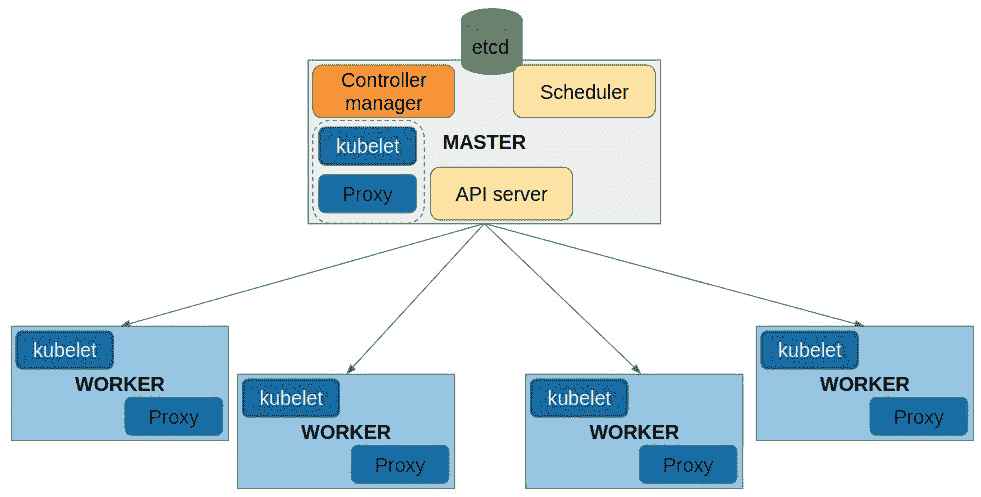
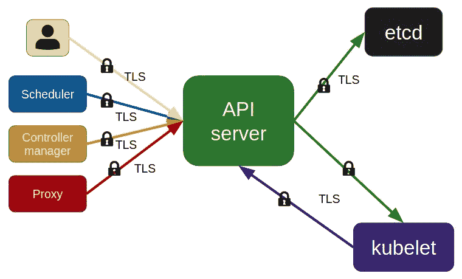
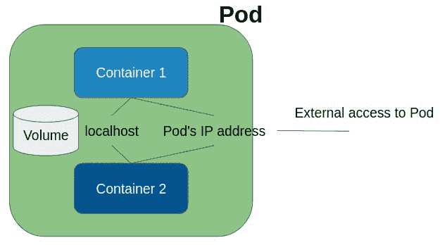
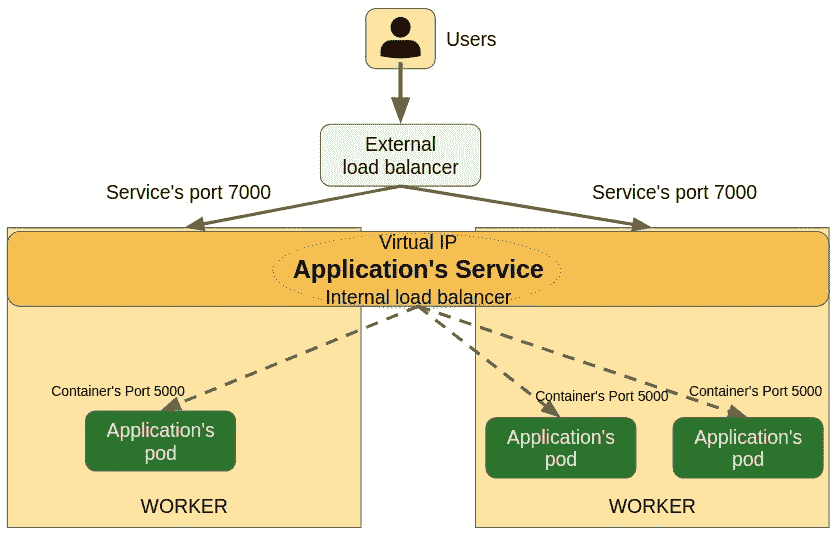
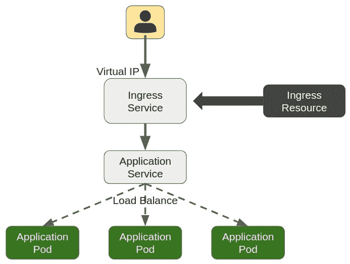

使用 Kubernetes 进行编排

本章专门介绍当今最广泛使用的容器编排工具——Kubernetes。2018 年，51%的容器用户选择将 Kubernetes 作为他们的主要编排工具。近年来，Kubernetes 的采用率不断增长，现在它已成为大多数 **容器即服务**（**CaaS**）平台的核心。

云服务提供商已经跟随 Kubernetes 的扩展，且大多数提供商（包括 Amazon、Google 和 Azure）现在都提供自有的 **Kubernetes 即服务**（**KaaS**）平台，用户无需处理 Kubernetes 的管理任务。这些服务旨在简化操作并保证在云平台上的可用性。用户只需在这些平台上运行其工作负载，而云服务提供商则负责复杂的维护任务。

在本章中，我们将了解 Kubernetes 的工作原理以及它提供的功能。我们将回顾部署一个高可用性 Kubernetes 集群所需的内容。接下来，我们将学习 Kubernetes 对象，如 pods 和服务等。网络是将工作负载分配到集群中的关键，我们将学习 Kubernetes 网络是如何工作的，以及它如何提供服务发现和负载均衡。最后，我们将回顾 Kubernetes 提供的一些特殊安全功能，用于管理集群的认证和授权。

本章将涵盖以下主题：

+   部署 Kubernetes

+   使用 Kubernetes 实现高可用性

+   Pods、服务和其他 Kubernetes 资源

+   部署编排资源

+   Kubernetes 网络

+   发布应用程序

Kubernetes 目前还不包括在 Docker Certified Associate 考试中，但它可能会在下一个版本中加入，因为 Docker Enterprise 包含了一个完全兼容的 Kubernetes 平台，并且部署在 Docker Swarm 编排工具之上。Docker Enterprise 是唯一同时提供这两种编排工具的容器平台。我们将在本书的第三部分学习 Docker Enterprise 的组件和功能，每个组件都有独立的章节。

# 技术要求

在本章中，我们将了解 Docker Swarm 编排工具的功能。我们还将在章末提供一些实验室，帮助你理解和学习我们将要覆盖的概念。这些实验可以在你的笔记本电脑或个人电脑上运行，使用提供的 Vagrant *Kubernetes 环境* 或自行部署的任何 Docker Swarm 集群。你可以在本书的 GitHub 代码库中查看更多信息，地址为 [`github.com/PacktPublishing/Docker-Certified-Associate-DCA-Exam-Guide.git`](https://github.com/PacktPublishing/Docker-Certified-Associate-DCA-Exam-Guide.git)。

查看以下视频，观看代码演示：

"[`bit.ly/3gzAnS3`](https://bit.ly/3gzAnS3)"

# 使用 Docker 引擎部署 Kubernetes

Kubernetes 具有许多功能，比 Docker Swarm 更为复杂。它提供了 Docker Swarm 没有的额外功能，且不需要修改应用程序代码。Docker Swarm 更符合微服务逻辑，而 Kubernetes 更接近虚拟机应用程序的**提升与迁移**方法（将应用程序原样迁移到新的基础设施）。这是因为 Kubernetes 的 pod 对象可以与虚拟机进行比较（其中应用程序进程作为容器在 pod 内部运行）。

在开始讨论 Kubernetes 架构之前，让我们回顾一下我们已学到的一些编排概念。

编排应该提供部署解决方案所需的所有功能，用于执行、管理和发布基于容器的分布式应用程序。因此，它应该提供一个控制平面，以确保集群的可用性，一个调度器来部署应用程序，以及一个网络平面来互联分布式应用程序。它还应提供发布集群分布式应用程序的功能。应用程序的健康状况也将由编排器进行管理。因此，如果某个应用程序组件出现故障，编排器会部署一个新的组件，以确保应用程序的健康。

Kubernetes 提供了所有这些功能，Docker Swarm 也提供这些功能。然而，Kubernetes 有更多的功能，具有可扩展性，并且有一个更大的社区支持该项目。Docker 也在其 Docker Enterprise 2.0 版本中采纳了 Kubernetes。它是唯一一个在同一基础设施上同时支持 Docker Swarm 和 Kubernetes 的平台。

Kubernetes 提供了更高的容器密度，因为它能够为每个应用程序组件同时运行多个容器。它还提供了自动扩展功能以及其他高级调度功能。

由于 Kubernetes 是一个大型社区项目，它的某些组件也被解耦到不同的项目中，以便提供更快的部署速度。这个主要的开源项目由**云原生计算基金会**（**CNCF**）托管。Kubernetes 每 6 个月发布一个新版本——想象一下每 6 个月就要在生产环境中更新旧的遗留应用程序。正如前面提到的，许多其他产品很难跟上这种应用生命周期，但 Kubernetes 提供了一种方法，使得升级到新软件版本变得更加容易。

Kubernetes 的架构模型基于常见的编排组件。我们部署主节点来执行管理任务，工作节点（也称为从节点）来运行应用程序负载。我们还部署了一个`etcd`键值数据库来存储所有集群对象的数据。

让我们来介绍一下 Kubernetes 的组件。主节点和工作节点运行不同的过程，它们的数量可能会根据每个角色所提供的功能而有所不同。这些组件中的大多数可以作为系统服务或容器进行安装。以下是 Kubernetes 集群组件的列表：

+   `kube-apiserver`

+   `kube-scheduler`

+   `kube-controller-manager`

+   `etcd`

+   `` `kubelet` ``

+   `kube-proxy`

+   容器运行时

请注意，这个列表与我们在 Docker Swarm 中学到的内容有很大不同，在 Docker Swarm 中，一切都是内建的。让我们回顾一下每个组件的特性和属性。记住，这不是一本 Kubernetes 的书——我们只会学习基础知识。

我们将运行专用的主节点来提供隔离的集群控制平面。以下组件将在这些节点上运行：

+   `kube-apiserver`：这是 Kubernetes 的核心，它通过 HTTP（如果使用 TLS 证书，则为 HTTPS）暴露 Kubernetes API。我们将连接到该组件，以便部署和管理应用程序。

+   `kube-scheduler`：当我们部署应用程序的组件时，如果没有定义特定节点位置，调度器将决定每个组件运行的位置。为了决定在哪里运行已部署的工作负载，它将检查工作负载的属性，如特定资源、限制、架构要求、亲和性或约束。

+   `kube-controller-manager`：该组件将管理控制器，控制器是始终监视集群对象状态变化的过程。例如，它将管理节点和工作负载的状态，以确保所需数量的实例正在运行。

+   `etcd`：这是所有 Kubernetes 对象信息和状态的键值存储。某些生产环境将会将 `etcd` 部署在主节点基础设施之外，以避免性能问题并提高组件的高可用性。

另一方面，工作进程可以在任何节点上运行。正如我们在 Docker Swarm 中学到的，我们可以决定在工作节点和主节点上运行应用程序工作负载。这些是计算节点所需的组件：

+   `kubelet`：这是 Kubernetes 的核心代理组件。它将在能够执行应用程序工作负载的任何集群节点上运行。该过程还将确保分配给节点的 Kubernetes 工作负载正在运行且处于健康状态（它只会管理在 Kubernetes 内创建的 Pods）。

我们在讨论在 Kubernetes 集群上调度容器或工作负载。实际上，我们将调度的是 Pods，Pods 是 Kubernetes 特有的对象。Kubernetes 会运行 Pods；它永远不会运行独立的容器。

+   `kube-proxy`：该组件将使用操作系统的数据包过滤和路由功能管理工作负载的网络交互。`kube-proxy` 应该在任何工作节点上运行（即运行工作负载的节点）。

前面我们提到过容器运行时作为 Kubernetes 集群的一个组件。事实上，它是一个必要的要求，因为 Kubernetes 本身并不提供容器运行时。我们将使用 Docker 引擎，因为它是最广泛使用的引擎，而且我们已经在前面的章节中讨论过它。

以下工作流展示了所有 Kubernetes 组件在五个节点上的分布（注意主节点上也有工作组件，并且 `etcd` 也部署在主节点之外）：



如在第八章中讨论的，*使用 Docker Swarm 进行编排*，外部负载均衡器将为复制服务提供 L4 和 L7 路由。在这种情况下，集群管理组件不会使用类似路由器网状服务。我们将通过在不同节点上运行复制进程来为核心组件提供高可用性。我们将需要一个虚拟 IP 地址，并且还会使用**完全限定域名**（**FQDN**）作为**传输层安全性**（**TLS**）证书。这将确保 Kubernetes 组件之间的安全通信和访问。

以下图展示了为确保组件之间的安全通信而创建的 TLS 证书：



我们将使用`kubectl`命令行与 Kubernetes 集群进行交互，并始终连接到`kube-apiserver`进程。

在下一节中，我们将学习如何实现高可用性 Kubernetes 集群环境。

# 部署具有高可用性的 Kubernetes 集群

Docker Swarm 容易实现。为了提供高可用性，我们只需更改节点角色来实现所需的奇数个管理节点。在 Kubernetes 中，这并非如此简单；角色不能更改，通常管理员不会更改主节点的初始数量。

因此，安装具有高可用性组件的 Kubernetes 集群需要一些规划。幸运的是，Docker Enterprise 会为你部署集群（自 2.0 版本起）。我们将在第十一章中回顾这种方法，因为**统一控制平面**（**UCP**）将基于 Docker Swarm 部署 Kubernetes。

为了提供高可用性，我们将部署奇数个控制平面组件。通常会在另外三个节点上部署`etcd`。在这种情况下，这些节点既不是主节点也不是工作节点，因为`etcd`将部署在 Kubernetes 节点之外。我们只需要从主节点访问这些外部的`etcd`。因此，在这种情况下，我们将运行一个由八个节点组成的集群：三个节点运行`etcd`，三个主节点运行所有其他控制平面组件（集群管理），并且至少有两个工作节点以提供冗余，以防其中一个宕机。这种配置适用于许多 Kubernetes 环境。我们将`etcd`与控制平面组件隔离，以提供更好的管理性能。

我们可以在主节点上部署`etcd`。这与我们在 Docker Swarm 中学到的类似。我们可以拥有*纯主节点*—只运行管理组件—以及用于处理工作负载的工作节点。

安装 Kubernetes 并不容易，许多软件供应商已经开发了自己的 KaaS 平台，提供不同的安装方法。

为了实现高可用性，我们将运行 `etcd` 的分布式副本。在这种情况下，`kube-apiserver` 将连接到一组节点，而不是仅连接到一个 `etcd` 节点。`kube-apiserver`、`kube-scheduler` 和 `kube-controller-manager` 进程将在不同的主节点上运行多个副本（每个主节点上一个实例）。

我们将使用 `kube-apiserver` 来管理集群。Kubernetes 客户端将通过 HTTP/HTTPS 协议连接到此服务器进程。我们将使用外部负载均衡器在主节点上的不同副本之间分配流量。Kubernetes 使用 Raft 算法，因为 `etcd` 使用了该算法。

部署在集群中的应用程序将基于弹性默认具有高可用性（就像在 Docker Swarm 集群中一样）。一旦应用程序及其所有组件被部署，如果其中一个组件失败，`kube-controller-manager` 将启动一个新的实例。有不同的控制器进程，负责根据副本在所有节点上同时执行应用程序以及其他特定的执行情况。

在下一节中，我们将介绍 pod 概念，这是理解 Kubernetes 和 Docker Swarm 之间区别的关键。

# Pods、服务和其他 Kubernetes 资源

pod 概念是理解 Kubernetes 的关键。一个 pod 是一组一起运行的容器。它非常简单。所有这些容器共享一个网络命名空间和存储。它就像一个小的逻辑主机，因为我们在一起运行多个进程，共享相同的 IP 地址和卷。我们在第一章《现代基础设施与应用程序使用 Docker》中学到的隔离方法，在这里同样适用，*现代基础设施和应用程序使用 Docker*。

## Pods

Pods 是 Kubernetes 环境中最小的调度单元。一个 pod 内的容器将共享相同的 IP 地址，并且可以通过 `localhost` 相互发现。因此，分配的端口在 pod 内必须是唯一的。我们不能为其他容器和进程间通信重复使用端口，因为进程将像在同一个逻辑主机上执行一样运行。一个 pod 的生命周期依赖于其容器的健康状态。

Pods 可以用于集成完整的应用程序堆栈，但它们通常用于少量容器。事实上，微服务依赖于小的功能模块；因此，我们每个节点上只运行一个容器。由于 pod 是 Kubernetes 中最小的调度单元，因此我们扩展的是 pod，而不是容器。因此，如果许多应用组件在同一个 pod 内一起执行，则完整的堆栈将被复制。

另一方面，Pods 允许我们执行容器，例如为了初始化另一个容器的某些特殊功能或属性。还记得 第八章 中的 *使用 Docker Stacks 部署* 部分吗？在那个实验中，我们启动了一个 PostgreSQL 数据库，并添加了一个初始化脚本来创建一个特定的数据库。我们可以在 Kubernetes 上使用 Pod 中的初始容器来完成这个操作。

终止和移除 Pod 将取决于停止或删除 Pod 内所有容器所需的时间。

以下图表示一个包含多个容器的 Pod，共享相同的 IP 地址和卷等特性（我们可以为 Pod 中的所有容器应用一个特殊的安全上下文）：



现在让我们回顾一下 Kubernetes 上的服务资源。

## 服务

服务在 Kubernetes 中有不同的含义。服务是集群的抽象对象；我们在 Kubernetes 中不会调度服务。它们定义了一组协同工作的 Pod，用于提供应用程序组件。我们还可以将服务与外部资源（端点）关联。这个服务将像集群内的其他服务一样使用，但例如，可以使用外部 IP 地址和端口。

我们还使用服务来发布应用程序，既可以在 Kubernetes 集群内，也可以在外部发布。为此，存在不同类型的服务。除了无头服务外，所有这些服务都提供 Pod 副本之间的内部负载均衡，供公共服务使用：

+   **Headless**：我们使用无头服务与非 Kubernetes 服务发现解决方案进行交互。不会分配虚拟 IP。也不会有负载均衡或代理来访问服务的 Pod。这种行为类似于 Docker Swarm 的 DNSRR 模式。

+   **ClusterIP**：这是默认的服务类型。Kubernetes 将提供一个从可配置池中选择的内部虚拟 IP 地址。这样只有集群内部的对象才能访问定义的服务。

+   **NodePort**：NodePort 服务也会接收一个虚拟 IP（ClusterIP），但是暴露的服务端口将在所有集群节点上可用。Kubernetes 将请求路由到服务的 ClusterIP 地址，无论请求到达哪个节点。因此，服务的定义端口将在 `<ANY_CLUSTER_NODE>:<NODEPORT_PORT>` 上可用。这实际上让我们想起了 Docker Swarm 上的路由网格行为。在这种情况下，我们需要将一些集群节点添加到外部负载均衡器中，以便访问定义并暴露的服务端口。

+   **LoadBalancer**：此服务类型仅在云服务提供商的 Kubernetes 部署中可用。我们使用自动创建的（通过云服务提供商的 API 集成）负载均衡器将服务暴露到外部。它同时使用 ClusterIP 虚拟 IP 进行内部路由，并使用 NodePort 概念从负载均衡器访问服务定义的端口。

+   **ExternalName**：这种方式现在不太常见，因为它依赖于 DNS CNAME 记录，并且是新的实现。它用于添加外部服务，位于 Kubernetes 集群之外。外部服务将通过其名称进行访问，就像它们在集群内部运行一样。

    Kubernetes 集群。

以下架构表示 NodePort 服务类型的常见配置。在此示例中，服务可以通过外部负载均衡器在`7000`端口访问，而 Pod 则可以在`5000`端口内部访问。所有流量将在服务的所有 Pod 端点之间进行负载均衡：



Kubernetes 中还有许多其他资源。我们将在深入了解如何在 Kubernetes 集群上部署应用之前，快速浏览其中的一些资源。

## 配置映射和机密

我们已经学会了如何使用 Docker Swarm 在集群范围内分发所需的应用信息。Kubernetes 也提供了类似的解决方案。我们将使用配置映射，代替 Docker Swarm 的配置对象，以及机密。

在这两种情况下，我们可以使用文件或标准输入（使用`--from-literal`选项）来创建这些资源。字面量选项允许我们通过命令行创建这些对象，而不是使用 YAML 文件。

Kubernetes 的`kubectl`命令行提供了两种不同的方法来创建集群资源/对象（命令式和声明式）。我们将使用命令行生成器或资源文件，通常是 YAML 格式。第一种方法通常被称为命令式，但并非所有资源都可以使用这种方法，使用文件的方法被称为声明式。这适用于所有 Kubernetes 资源；因此，我们可以使用带参数的`kubectl create pod`，或者使用`kubectl create -f <POD_DEFINITION_FILE_IN_YAML_FORMAT>`。我们可以轻松地将之前生成的命令行对象导出为 YAML 格式，以便实现资源的可重现性，并将其定义保存在某个安全的地方。

配置映射和机密允许我们将配置从镜像内容中解耦，而无需使用不安全的运行时可见变量或某些节点上共享的本地文件。我们将使用机密来处理敏感数据，而配置映射则用于常见的配置。

## 命名空间

命名空间可以理解为基于名称的作用域。它们允许我们在不同命名空间之间隔离资源。资源的名称在每个命名空间内是唯一的。资源只能存在于一个命名空间内；因此，我们可以使用命名空间来划分对资源的访问。

命名空间的最简单用途之一是限制用户访问和 Kubernetes 对象及资源配额的使用。基于命名空间，我们将为用户提供一组特定的主机资源。例如，不同的用户组或团队将拥有自己的资源和配额，限制他们环境中的行为。

## 持久卷

我们在第四章《*容器持久性和网络*》中了解了卷。在 Kubernetes 中，卷是附加到 pod 的，而不是容器；因此，卷将跟随 pod 的生命周期。

Kubernetes 中有许多不同类型的卷，我们可以在 pods 内部混合使用它们。卷对运行在 pod 中的任何容器都可用。有些卷是专为云服务提供商设计的，还有些卷是大多数数据中心中可用的存储解决方案。让我们回顾一些有趣的、常用的卷：

+   `emptyDir`: 这个卷在 pod 被分配到节点时创建，并随着 pod 被删除。它一开始是空的，通常用于在同一个 pod 内的容器之间共享信息。

+   `hostPath`: 我们已经在 Docker 中使用过这种类型的卷。这些卷允许我们将主机上的文件或目录挂载到 pods 中。

每种卷类型都有自己独特的选项来启用其独特功能。

这些卷设计用于在 pods 内部使用，但它们并没有为 Kubernetes 集群和存储永久数据做好准备。对于这些情况，我们使用**持久化卷**（**PVs**）。

PV 使我们能够抽象存储是如何提供的。无论存储主机是如何进入集群的，我们只关心如何使用它们。PV 由管理员预配置，例如，用户可以使用它。PV 是 Kubernetes 资源，因此，我们可以将它们与命名空间关联，并且它们有自己的生命周期。它们是与 pod 独立的。

PV 是通过**持久化卷声明**（**PVCs**）请求的。因此，PVC 消耗已定义的 PV。这是将 pod 与 PV 关联起来的方式。

因此，PVC 允许用户使用存储。我们可以根据存储的内部属性（如速度、主机上的提供方式等）来指定存储，并通过**存储类**实现动态配置。通过这些对象，我们描述集群中所有可用存储解决方案的属性作为配置文件，Kubernetes 会为使用这些存储做好持久化存储准备。

需要知道的是，我们可以决定在 pod 死亡后 PV 数据的行为。**回收策略**描述了在 pod 不再使用卷及其内容时应该怎么做。因此，我们可以选择删除卷、保留卷及其内容，或回收它。

我们可以说，PV（持久化卷）是 Kubernetes 集群资源，用于应用程序持久化存储，而 PVC（持久化卷声明）是请求使用这些资源的方式。

存储类是一项新功能，允许管理员将动态配置集成到我们的集群中。这帮助我们在不需要手动配置每个卷的情况下提供存储。我们只需定义存储的配置文件和特性，存储提供者就会为所需的卷提供最佳解决方案。

在下一部分，我们将学习如何在 Kubernetes 集群上部署工作负载。

# 部署编排资源

在 Kubernetes 中部署工作负载很简单。我们将使用 `kubectl` 来指定要创建的资源，并与 `kube-apiserver` 进行交互。

如前所述，我们可以使用命令行来使用内置生成器或 YAML 文件。根据 Kubernetes API 的版本，某些选项可能不可用，但我们假设 Kubernetes 版本为 1.11 或更高。

在本章中，所有示例使用 Kubernetes 1.14，因为这是在编写本书时，当前 Docker Enterprise 3.0 版本上可用的版本。

我们从创建一个简单的 Pod 开始。我们将回顾两种方式——命令行的命令式方式和使用 YAML 清单的声明式方式。

使用 Pod 生成器，我们将运行 `kubectl run --generator=run-pod/v1` 命令：

```
$ kubectl run --generator=run-pod/v1 --image=nginx:alpine myfirstpod --labels=example=myfirstpod
pod/myfirstpod created
```

使用 YAML 定义文件，我们将描述 Pod 所需的所有属性：

```
apiVersion: v1
kind: Pod
metadata:
 name: myfirstpod
  labels:
    example: myfirstpod
spec:
  containers:
  - name: myfirstpodcontainer
    image: nginx:alpine
```

要部署这个 `.yaml` 定义文件，我们只需运行 `kubectl create -f <YAML_DEFINITION_FILE>`。这将会在指定的命名空间中创建文件中定义的所有资源。由于我们没有使用参数来指定命名空间，它们将在用户定义的命名空间中创建。在我们的例子中，默认使用的是 `default` 命名空间。

我们可以在每个 YAML 文件中定义命名空间，或者通过命令行参数来定义。后者会覆盖 YAML 定义。

两个示例都会创建相同的 Pod，Pod 内部有一个容器，运行 `nginx:alpine` 镜像。

在 Kubernetes 中使用 `args` 和 `command` 定义时需要小心。这些键与我们用于 Docker 容器或镜像的定义不同。Kubernetes 的 `command` 表示 `ENTRYPOINT`，而 `args` 表示容器/镜像的 `CMD` 定义。

我们可以通过简单地删除它来终止这个 Pod，命令是 `kubectl delete`。要获取在命名空间中运行的 Pod 列表，我们将使用 `kubectl get pods`。如果在 `kubectl` 执行时省略了命名空间，将使用用户指定的命名空间：

```
$ kubectl get pods
NAME         READY   STATUS    RESTARTS   AGE
myfirstpod   1/1     Running   0          11s
```

但这只是创建了一个简单的 Pod；我们无法使用这种资源创建更多的 NGINX 副本。要使用副本，我们将使用 ReplicaSets，而不是单个 Pod。

我们将设置一个 Pod 模板部分和 Pod 选择器，以识别哪些已部署的 Pod 属于这个 `ReplicaSet` 资源，并将其写入新的 YAML 文件。这将帮助控制器监控 Pod 的健康状态。

在这里，针对之前的 Pod 定义，我们添加了一个 `template` 部分和一个带有标签的 `selector` 键：

```
apiVersion: apps/v1
kind: ReplicaSet
metadata:
  name: myfirstrs
  labels:
    example: myfirstrs
spec:
  replicas: 3
  selector:
    matchLabels:
      example: myfirstrs
  template:
    metadata:
      name: myfirstpod
      labels:
        example: myfirstrs
    spec:
      containers:
      - name: myfirstpodcontainer
        image: nginx:alpine
```

因此，我们使用与之前相同的 Pod 定义创建了三个副本。这个 Pod 的定义被用作所有副本的模板。我们可以使用 `kubectl get all` 来查看所有已部署的资源。在以下命令中，我们过滤结果，只获取带有 `example` 标签和 `myfirstrs` 值的资源：

```
$ kubectl get all -l example=myfirstrs
NAME                  READY   STATUS    RESTARTS   AGE
pod/myfirstrs-2xrpk   1/1     Running   0          47s
pod/myfirstrs-94rb5   1/1     Running   0          47s
pod/myfirstrs-jm6lc   1/1     Running   0          47s

NAME                        DESIRED   CURRENT   READY   AGE
replicaset.apps/myfirstrs   3         3         3       47s
```

每个副本将具有相同的前缀名称，但其 ID 将成为名称的一部分。这使得该资源在 Kubernetes 集群中唯一标识。

我们正在使用 `kubectl get all -l <KEY=VALUE>` 来过滤所有我们用 `example` 键和 `myfirstrs` 值标记的资源。

我们可以使用`DaemonSet`在集群的每个节点上部署副本，就像我们在 Docker Swarm 的全局服务中所做的那样：

```
apiVersion: apps/v1
kind: DaemonSet
metadata:
  name: myfirstds
  labels:
    example: myfirstds
spec:
  selector:
    matchLabels:
      example: myfirstds
  template:
    metadata:
      name: myfirstpod
      labels:
        example: myfirstds
    spec:
      containers:
      - name: myfirstpodcontainer
        image: nginx:alpine
        resources:
          limits:
            memory: 100Mi
          requests:
            cpu: 100m
            memory: 10Mi
```

我们现在可以再次使用 `kubectl get all` 回顾 pod 的分布情况。

请注意，我们添加了容器的资源限制和资源请求。`limits` 键允许我们为每个容器指定资源限制。另一方面，`requests` 向调度器提供有关运行此组件所需最小资源的信息。如果没有足够的资源满足请求的 CPU、内存等要求，pod 将无法在节点上运行。如果任何容器超出了它们的限制，它们将被终止：

```
$ kubectl get all -l example=myfirstds -o wide
NAME READY STATUS RESTARTS AGE IP NODE NOMINATED NODE READINESS GATES
pod/myfirstds-cr7xc 1/1 Running 0 84s 192.168.135.5 node3 <none> <none>
pod/myfirstds-f6x8n 1/1 Running 0 84s 192.168.104.6 node2 <none> <none>

NAME DESIRED CURRENT READY UP-TO-DATE AVAILABLE NODE SELECTOR AGE CONTAINERS IMAGES SELECTOR
daemonset.apps/myfirstds 2 2 2 2 2 <none> 84s myfirstpodcontainer nginx:alpine example=myfirstds
```

`Deployment` 资源是一个更高级的概念，因为它管理 `ReplicaSet` 并允许我们发布应用程序组件的更新。推荐使用`Deployment`而不是`ReplicaSet`。我们将再次使用`template`和`select`部分：

```
apiVersion: apps/v1
kind: Deployment
metadata:
  name: myfirstdeployment
  labels:
    example: myfirstds
spec:
  replicas: 3
  selector:
    matchLabels:
      example: myfirstdeployment
  template:
    metadata:
      name: myfirstpod
      labels:
        example: myfirstdeployment
    spec:
      containers:
      - name: myfirstpodcontainer
        image: nginx:alpine
        ports:
        - containerPort: 80
```

因此，部署将运行三个`nginx:alpine`的副本，这些副本将再次分布在集群节点上：

```
$  kubectl get all -l example=myfirstdeployment -o wide
NAME                                     READY   STATUS    RESTARTS   AGE   IP               NODE    NOMINATED NODE   READINESS GATES
pod/myfirstdeployment-794f9bfcd7-9m8vg   1/1     Running   0          12s   192.168.135.9    node3   <none>           <none>
pod/myfirstdeployment-794f9bfcd7-f7499   1/1     Running   0          12s   192.168.104.10   node2   <none>           <none>
pod/myfirstdeployment-794f9bfcd7-kfzfk   1/1     Running   0          12s   192.168.104.11   node2   <none>           <none>

NAME                                           DESIRED   CURRENT   READY   AGE   CONTAINERS            IMAGES         SELECTOR
replicaset.apps/myfirstdeployment-794f9bfcd7   3         3         3       12s   myfirstpodcontainer   nginx:alpine   pod-template-hash=794f9bfcd7,example=myfirstdeployment
```

请注意，副本仅在某些节点上运行。这是因为其他节点上存在一些污点（默认情况下，某些 Kubernetes 部署会避免在主节点上运行工作负载）。污点和容忍帮助我们只允许在特定节点上调度 pods。在此示例中，主节点将不会运行工作负载，尽管它也有一个工作节点角色（它运行我们学习过的 Kubernetes 工作进程，即 `kubelet` 和 `kube-proxy`）。这些特性让我们想起了 Docker Swarm 的节点可用性概念。实际上，我们也可以执行 `kubectl cordon <NODE>` 将节点设置为不可调度。

本章是 Kubernetes 主要概念的简要介绍。我们强烈建议您查看 Kubernetes 文档以获取更多信息：[`kubernetes.io`](https://kubernetes.io)。

我们可以根据 pod 的性能和限制设置副本。这称为**自动扩缩**，它是 Docker Swarm 中没有的一个有趣特性。

当应用程序的副本组件需要持久性时，我们使用另一种资源类型。StatefulSets 保证 pods 的顺序和唯一性。

现在我们知道如何部署应用程序，让我们回顾一下 Kubernetes 如何本地管理和部署网络，并将组件分布在不同节点上。

# Kubernetes 网络

Kubernetes 和其他编排工具一样，提供本地和分布式网络。Kubernetes 要完成几个重要的通信假设：

+   容器到容器的通信

+   Pod 到 Pod 的通信

+   Pod 到 Service 的通信

+   用户访问和外部或内部应用程序之间的通信

容器到容器的通信很简单，因为我们了解到，同一 pod 内的容器共享相同的 IP 和网络命名空间。

我们知道每个 pod 都有自己的 IP 地址。因此，Kubernetes 需要提供路由功能，以便从不同主机上运行的 pod 之间进行访问和通信。按照我们在 第四章《*容器持久性与网络*》中学到的 Docker 概念，Kubernetes 也使用桥接网络为在同一主机上运行的 pod 提供服务。因此，所有在同一主机上运行的 pod 都能通过桥接网络相互通信。

还记得 Docker 如何让我们在单一主机上部署不同的桥接网络吗？通过这种方式，我们可以使用不同的网络在主机上隔离应用程序。利用这一本地概念，覆盖网络在 Docker Swarm 集群上也会部署桥接接口。这些接口将通过在主机之间创建的 VXLAN 隧道进行连接。在 Docker 独立主机和 Docker Swarm 上，隔离变得简单。Docker 引擎必须管理所有后台的操作，使其与防火墙规则和路由配合工作，但覆盖网络是开箱即用的。

Kubernetes 提供了一种更简单的方法。所有 pod 都运行在同一网络中，因此每个 pod 都能看到同一主机上的其他 pod。实际上，我们可以更进一步——pod 可以从主机上本地访问。

让我们用几个 pod 来考虑这个概念。我们将同时运行 `example-webserver` 和 `example-nettools`，执行简单的 `nginx:alpine` 和 `frjaraur/nettools:minimal`（这是一个带有一些有用网络工具的小 alpine 镜像）pod。首先，我们将使用 `kubectl create deployment` 为 `example-webserver` 创建一个部署：

```
$ kubectl create deployment example-webserver --image=nginx:alpine
deployment.apps/example-webserver created
```

我们使用 `kubectl get pods` 查看 pod 的 IP 地址：

```
$ kubectl get pods -o wide
NAME                                READY   STATUS    RESTARTS   AGE   IP               NODE    NOMINATED NODE   READINESS GATES
example-webserver-7789c6d697-kts7l   1/1     Running   0          69s   192.168.104.16   node2   <none>           <none>
```

正如我们所说，`localhost` 与 pod 之间的通信是有效的。让我们从主机向 pod 的 IP 地址尝试一个简单的 `ping` 命令：

```
node3:~$ ping -c 2 192.168.104.16 
PING 192.168.104.16 (192.168.104.16) 56(84) bytes of data.
64 bytes from 192.168.104.16: icmp_seq=1 ttl=63 time=0.483 ms
64 bytes from 192.168.104.16: icmp_seq=2 ttl=63 time=0.887 ms

--- 192.168.104.16 ping statistics ---
2 packets transmitted, 2 received, 0% packet loss, time 1001ms
rtt min/avg/max/mdev = 0.483/0.685/0.887/0.202 ms
```

此外，我们还可以访问其正在运行的 `nginx` 进程。让我们再次尝试使用 pod 的 IP 地址进行 `curl`，但这次我们将使用端口 `80`：

```
node3:~$ curl -I 192.168.104.16:80
HTTP/1.1 200 OK
Server: nginx/1.17.6
Date: Sun, 05 Jan 2020 22:20:42 GMT
Content-Type: text/html
Content-Length: 612
Last-Modified: Tue, 19 Nov 2019 15:14:41 GMT
Connection: keep-alive
ETag: "5dd406e1-264"
Accept-Ranges: bytes
```

因此，主机可以与所有在 Docker 引擎上运行的 pod 进行通信。

我们可以使用 `jsonpath` 获取 pod 的 IP 地址，以格式化 pod 的信息输出，当我们有数百个 pod 时，这非常有用：`kubectl get pod example-webserver -o jsonpath='{.status.podIP}'`。

让我们执行一个交互式 pod，使用前述的 `frjaraur/nettools:minimal` 镜像。我们将使用 `kubectl run --generator=run-pod/v1` 来执行这个新的 pod。注意，我们添加了 `-ti -- sh` 来在这个 pod 中运行一个交互式 shell。从这个 pod 中，我们将再次运行 `curl`，连接到 `example-webserver` pod 的 IP 地址：

```
$ kubectl run --generator=run-pod/v1 example-nettools --image=frjaraur/nettools:minimal -ti -- sh 
If you don't see a command prompt, try pressing enter.
/ # ping -c 2 192.168.104.16 
PING 192.168.104.16 (192.168.104.16): 56 data bytes
64 bytes from 192.168.104.16: seq=0 ttl=62 time=0.620 ms
64 bytes from 192.168.104.16: seq=1 ttl=62 time=0.474 ms

--- 192.168.104.16 ping statistics ---
2 packets transmitted, 2 packets received, 0% packet loss
round-trip min/avg/max = 0.474/0.547/0.620 ms

/ # curl -I 192.168.104.16:80
HTTP/1.1 200 OK
Server: nginx/1.17.6
Date: Sun, 05 Jan 2020 22:22:16 GMT
Content-Type: text/html
Content-Length: 612
Last-Modified: Tue, 19 Nov 2019 15:14:41 GMT
Connection: keep-alive
ETag: "5dd406e1-264"
Accept-Ranges: bytes
```

我们已经成功地使用 `ping` 和 `curl` 访问了部署的 `example-webserver` pod，并向其运行的 `nginx` 进程发送了一些请求。很明显，两个容器可以相互看到。

在这个示例中，还有一个更有趣的地方：我们还没有查看这些 pod 是在哪些主机上运行的。事实上，它们运行在不同的主机上，正如我们从 `kubectl get pods -o wide` 命令的输出中可以看到的那样：

```
$ kubectl get pods -o wide
NAME                                READY   STATUS    RESTARTS   AGE    IP               NODE    NOMINATED NODE   READINESS GATES
example-nettools                     1/1     Running   1          85s    192.168.135.13   node3   <none>           <none>
example-webserver-7789c6d697-kts7l   1/1     Running   0          5m8s   192.168.104.16   node2   <none>           <none>
```

主机之间的网络通信由另一个组件控制，这个组件将允许这些分布式通信。在此情况下，这个组件是 Calico，它是应用于此 Kubernetes 集群的 **容器网络接口** (**CNI**) 。Kubernetes 的网络模型提供了一个平面网络（所有 pod 都分布在同一网络上），而数据平面网络基于可互换的插件。我们将使用最适合我们环境所需特性的插件。

除了 Calico 之外，还有其他 CNI 实现，如 Flannel、Weave、Romana、Cilium 等。每个实现都提供自己的特性和主机到主机的实现。例如，Calico 使用 **边界网关协议** (**BGP**) 来路由集群内的真实容器 IP 地址。一旦部署了 CNI，所有容器 IP 地址将由其实现进行管理。它们通常在 Kubernetes 集群实现的开始阶段进行部署。Calico 允许我们实施网络策略，这对于确保安全非常重要，因为在这个平面网络中，每个 pod 都能看到其他 pod。

我们还没有查看任何服务网络设置，这在这里也很重要。如果一个 pod 死掉了，新的 IP 地址将会分配，从而导致之前的 IP 地址无法访问；这就是我们使用服务的原因。记住，服务是 pod 的逻辑分组，通常具有虚拟 IP 地址。这个 IP 地址将从另一个 IP 地址池中分配（即服务 IP 地址池）。Pod 和服务不会共享同一个 IP 地址池。当新的 pod 被重新创建时，服务的 IP 地址不会改变。

## 服务发现

让我们创建一个与当前已部署的 `example-webserver` 部署相关联的服务。我们将使用 `kubectl expose`：

```
$ kubectl expose deployment example-webserver \
--name example-webserver-svc --type=NodePort --port=80

service/example-webserver-svc exposed
```

我们本可以使用 `kubectl create service`（命令式格式）或 YAML 定义文件（声明式格式）来完成这项工作。我们使用了 `kubectl expose`，因为它更简单，可以快速发布任何类型的资源。我们可以使用 `kubectl get services` 查看服务的 IP 地址：

```
$ kubectl get services -o wide
NAME                   TYPE        CLUSTER-IP     EXTERNAL-IP   PORT(S)        AGE   SELECTOR
kubernetes             ClusterIP   10.96.0.1      <none>        443/TCP        11h   <none>
example-webserver-svc   NodePort    10.98.107.31   <none>        80:30951/TCP   39s   app=example-webserver
```

记住，我们通过选择器定义与 pod 相关联的服务。在此情况下，服务将把所有带有 `app` 标签和 `example-webserver` 值的 pod 归为一组。这个标签是自动创建的，因为我们创建了 `Deployment`。因此，所有为此服务分组的 pod 都可以通过 `10.98.107.31` IP 地址和内部 TCP 端口 `80` 进行访问。我们定义了哪个 pod 的端口会与此服务关联——在这两种情况下，我们设置了端口 `80`：

```
$ curl -I 10.98.107.31:80
HTTP/1.1 200 OK
Server: nginx/1.17.6
Date: Sun, 05 Jan 2020 22:26:09 GMT
Content-Type: text/html
Content-Length: 612
Last-Modified: Tue, 19 Nov 2019 15:14:41 GMT
Connection: keep-alive
ETag: "5dd406e1-264"
Accept-Ranges: bytes
```

它按预期可访问。Kubernetes 的内部网络已将此服务发布到定义的 ClusterIP 地址。

因为我们创建了一个 `NodePort` 服务，所以该服务已与一个随机端口关联。在这种情况下，它是端口 `30951`。因此，当我们通过随机选择的端口访问集群节点的 IP 地址时，请求将被路由到集群内应用程序的 pod。

`NodePort` 端口默认是随机分配的，但我们可以手动设置它们，范围在 `30000` 到 `32767` 之间。

让我们验证这个功能。我们将向集群节点上监听的端口发送一些请求。在这个例子中，我们将使用 `curl` 命令通过本地 `0.0.0.0` IP 地址和端口 `30951` 在不同的节点上进行测试：

```
node1:~$ curl -I 0.0.0.0:30951
HTTP/1.1 200 OK
Server: nginx/1.17.6
Date: Sun, 05 Jan 2020 22:26:57 GMT
Content-Type: text/html
Content-Length: 612
Last-Modified: Tue, 19 Nov 2019 15:14:41 GMT
Connection: keep-alive
ETag: "5dd406e1-264"
Accept-Ranges: bytes

node3:~$ curl -I 0.0.0.0:30951
HTTP/1.1 200 OK
Server: nginx/1.17.6
Date: Sun, 05 Jan 2020 22:27:41 GMT
Content-Type: text/html
Content-Length: 612
Last-Modified: Tue, 19 Nov 2019 15:14:41 GMT
Connection: keep-alive
ETag: "5dd406e1-264"
Accept-Ranges: bytes
```

即使 pod 没有运行在同一节点上，它们之间也可以进行通信。以下输出显示 pod 并没有运行在 `node1` 或 `node3` 上，应用程序的 pod 运行在 `node2` 上，内部路由正常工作：

```
$ kubectl get pods -o wide -l app=example-webserver
NAME                                READY   STATUS    RESTARTS   AGE   IP               NODE    NOMINATED NODE   READINESS GATES
example-webserver-7789c6d697-kts7l   1/1     Running   0          10m   192.168.104.16   node2   <none>           <none>
```

还有一些更有趣的事情——服务会创建一个以其名称为基础的 DNS 记录，格式如下：

```
<SERVICE_NAME>.<NAMESPACE>.svc.<CLUSTER>.<DOMAIN>
```

在我们的例子中，我们没有使用命名空间或域名。服务解析将是简单的：`example-webserver.default.svc.cluster.local`。这种解析默认只有在 Kubernetes 集群内可用。因此，我们可以通过执行一个 pod 并使用 `host` 或 `nslookup` 工具来测试此解析。我们将通过 `kubectl attach` 交互式连接到运行中的 `example-nettools` pod，并运行 `host` 和 `curl` 来测试 DNS 解析：

```
$ kubectl attach example-nettools -c example-nettools -i -t
If you don't see a command prompt, try pressing enter.
/ # host example-webserver.default.svc.cluster.local
example-webserver.default.svc.cluster.local has address 10.101.195.251
/ # curl -I example-webserver.default.svc.cluster.local:80
HTTP/1.1 200 OK
Server: nginx/1.17.6
Date: Sun, 05 Jan 2020 21:58:37 GMT
Content-Type: text/html
Content-Length: 612
Last-Modified: Tue, 19 Nov 2019 15:14:41 GMT
Connection: keep-alive
ETag: "5dd406e1-264"
Accept-Ranges: bytes
```

我们已经确认该服务具有一个可以被任何其他 Kubernetes 集群资源访问的 DNS 记录。我们还通过 `NodePort` 发布了该服务，因此它可以通过任何节点的 IP 地址访问。我们可以通过外部负载均衡器将请求路由到集群中任一节点的 IP 地址以及选择的（或手动设置的）端口。此端口将在该服务存在期间保持固定，直到它被移除。

请注意，我们使用 `kubectl attach example-nettools -c example-nettools -i -t` 重新连接到一个在后台运行的 pod。

在接下来的章节中，我们将学习扩容如何改变描述的行为。

## 负载均衡

如果我们现在将副本数扩展到三个，而不更改任何已部署的服务，我们将添加负载均衡功能。让我们使用 `kubectl scale` 来扩容：

```
$ kubectl scale --replicas=3 deployment/example-webserver
deployment.extensions/example-webserver scaled
```

现在，我们将有三个运行中的实例或 pod 来支持 `example-webserver` 部署。

请注意，我们已经通过命令行使用资源类型和名称来进行扩缩容：`kubectl scale --replicas=<NUMBER_OF_REPLICAS> <RESOURCE_TYPE>/<NAME>`。

我们可以通过 `kubectl get pods` 和相关标签来查看部署的 pod：

```
$ kubectl get pods -o wide -l app=example-webserver
NAME                                READY   STATUS    RESTARTS   AGE    IP               NODE    NOMINATED NODE   READINESS GATES
example-webserver-7789c6d697-dnx6l   1/1     Running   0          4m8s   192.168.135.14   node3   <none>           <none>
example-webserver-7789c6d697-kts7l   1/1     Running   0          23m    192.168.104.16   node2   <none>           <none>
example-webserver-7789c6d697-zdrtr   1/1     Running   0          4m8s   192.168.104.17   node2   <none>           <none>
```

如果我们现在再次测试服务的访问，我们将访问到三个副本中的每一个。我们执行下一个简单的循环，以便五次访问服务的后端 pod：

```
$ for I in $(seq 5);do curl -I 10.98.107.31:80;done
```

如果我们使用 `kubectl logs` 查看部署的 pod 日志，我们会发现并不是所有请求都被记录。尽管我们使用服务的 IP 地址发出了超过两个请求，但日志中只记录了几个请求：

```
$ kubectl logs example-webserver-7789c6d697-zdrtr
192.168.166.128 - - [05/Jan/2020:22:44:32 +0000] "HEAD / HTTP/1.1" 200 0 "-" "curl/7.47.0" "-"
192.168.166.128 - - [05/Jan/2020:22:45:38 +0000] "HEAD / HTTP/1.1" 200 0 "-" "curl/7.47.0" "-"
```

每个 pod 仅记录了每个请求的三分之一；因此，内部负载均衡器在所有可用应用程序的 pod 之间分发流量。内部负载均衡默认在与服务关联的所有 pod 之间部署。

正如我们所见，Kubernetes 为 pod 和服务提供了扁平网络，简化了网络和内部应用的可访问性。另一方面，由于任何 pod 都可以访问任何其他 pod 或服务，因此它是不安全的。在接下来的部分，我们将学习如何避免这种情况。

## 网络策略

网络策略定义了允许组内 pod 和其他组件通信的规则。使用标签，我们可以为匹配的 pod 应用特定规则，用于定义端口上的入口和出口流量。这些规则可以使用 IP 范围、命名空间，甚至其他标签来包含或排除资源。

网络策略是通过网络插件应用的；因此，我们集群上部署的 CNI 必须支持它们。例如，Calico 支持`NetworkPolicy`资源。

我们将能够为集群中所有 pod 定义默认规则，隔离所有 Internet 流量，例如，或一组定义的主机。

这个 YAML 文件代表了一个应用入口和出口流量规则的`NetworkPolicy`资源示例：

```
apiVersion: networking.k8s.io/v1
kind: NetworkPolicy
metadata:
  name: database-traffic
spec:
  podSelector:
    matchLabels:
      tier: database
  policyTypes:
  - Ingress
  - Egress
  ingress:
  - from:
    - ipBlock:
        cidr: 172.17.10.0/24
    - podSelector:
        matchLabels:
          tier: frontend
    ports:
    - protocol: TCP
      port: 5432
  egress:
  - to:
    - ipBlock:
        cidr: 10.0.0.0/24
    ports:
    - protocol: TCP
      port: 5978
```

在这个示例中，我们将为包括具有`database`值的`tier`标签的所有 pod 应用定义的入口和出口规则。

入口规则允许来自同一命名空间中具有`tier`标签和`frontend`值的任何 pod 的流量。也将允许访问定义的`database` pods 上的子网`172.17.10.0/24`中的所有 IP 地址。

出口规则允许从定义的`database` pods 到子网`10.0.0.0/24`上所有 IP 地址的端口`5978`的流量。

如果我们没有在命名空间中应用`NetworkPolicy`资源，那么所有流量都是允许的。我们可以使用`podSelector: {}`来改变这种行为。这将匹配命名空间中的所有 pod。例如，为了禁止所有出口流量，我们可以使用以下`NetworkPolicy` YAML 定义：

```
apiVersion: networking.k8s.io/v1
kind: NetworkPolicy
metadata:
  name: default-deny
spec:
  podSelector: {}
  policyTypes:
  - Egress
```

因此，我们已经学到，即使在 Kubernetes 的扁平网络上，我们也可以通过`NetworkPolicy`资源确保安全。让我们来回顾一下入口资源。

# 发布应用程序

Ingress 资源帮助我们在 Kubernetes 集群上发布部署的应用程序。它们与 HTTP 和 HTTPS 服务非常配合，提供许多功能来在服务之间分发和管理流量。这些流量将位于 OSI 模型的传输和应用层，它们也被称为第 4 层和第 7 层。它还与原始 TCP 和 UDP 服务一起工作；但在这些情况下，流量将仅在第 4 层进行负载平衡。

这些资源将流量从集群外部路由到集群内运行的服务。Ingress 资源需要一个名为 **ingress 控制器** 的特殊服务。这些服务将使用 ingress 资源创建的规则进行负载均衡或路由流量。因此，使用此功能发布应用程序需要两个组件：

+   **Ingress 资源**：应用于传入流量的规则。

+   **Ingress 控制器**：一个负载均衡器，它会自动将 ingress 规则转换或翻译为负载均衡配置。

两者的结合提供了应用程序的动态发布。如果某个应用程序的 pod 死亡，会自动创建一个新的 pod，服务和 ingress 控制器将自动将所有流量路由到新的 pod。这也将服务与外部网络隔离。我们将只发布一个端点，而不是为所有服务使用 `NodePort` 或 `LoadBalancer` 服务类型，这样可以节省许多节点的端口或云 IP 地址。这个端点就是负载均衡器，它将使用 ingress 控制器和 ingress 资源规则，将流量内部路由到已部署的服务：



本章的实验向我们展示了一个有趣的负载均衡示例，使用了 **NGINX Ingress 控制器**。让我们快速回顾一下示例的 YAML 配置文件：

```
apiVersion: networking.k8s.io/v1beta1
kind: Ingress
metadata:
  name: simple-fanout-example
  annotations:
    nginx.ingress.kubernetes.io/rewrite-target: /
spec:
  rules:
  - host: example.local
    http:
      paths:
      - path: /example1
        backend:
          serviceName: example-webserver
          servicePort: 80
      - path: /example2
        backend:
          serviceName: another-service
          servicePort: 8080
```

本示例概述了应应用的规则，以便将请求路由到特定的 `example.local` 主机头。任何 URL 中包含 `/example1` 的请求将被引导到 `example-webserver`，而包含 `/example2` 路径的请求则会转发到 `another-service`。注意，我们使用了内部服务的端口，因此不需要额外的服务曝光。一个 ingress 控制器端点将会把流量重定向到 `example-webserver` 和 `another-service` 服务。这节省了主机的端口（以及云提供商上的 IP 地址，因为 `LoadBalancer` 服务类型每个服务使用一个公开的 IP 地址）。

我们可以根据需要提供多个 ingress 控制器。实际上，在多租户环境中，我们通常会部署不止一个控制器，以便在不同租户之间隔离发布平面。

这一简要的 Kubernetes 应用程序发布介绍，已完成对 Kubernetes 主要网络功能的回顾。接下来，我们将转向 Kubernetes 的安全特性。

# Kubernetes 的安全组件和特性

Kubernetes 提供了认证和授权访问其 API 的机制。这使我们能够为集群内的用户或角色应用不同级别的权限。这可以防止未经授权的访问某些核心资源，如调度或集群中的节点。

一旦用户被允许使用集群资源，我们使用命名空间将他们的资源与其他用户的资源隔离开来。这在多租户环境中也能有效工作，尤其是在需要更高安全性的场景下。

Kubernetes 与非常精细的**基于角色的访问控制**（**RBAC**）环境配合使用，提供了很高的粒度，允许对某些资源执行特定操作，同时拒绝其他操作。

我们管理`Role`和`ClusterRole`资源，以描述不同资源的权限。我们使用`Role`来定义命名空间内的权限，使用`ClusterRole`来定义集群范围内的资源权限。规则通过一些已定义的动词提供，例如`list`、`get`、`update`等，这些动词作用于资源（甚至特定的资源名称）。`RoleBinding`和`ClusterRoleBinding`资源将角色中定义的权限授予用户或用户集合。

Kubernetes 还提供以下功能：

+   服务账户用于标识 pod 内的进程对其他资源的访问

+   Pod 安全策略控制 pod 的特殊行为，例如特权容器、主机命名空间、限制以 root 用户运行容器，或启用容器的只读根文件系统等功能。

+   审批控制器拦截 API 请求，允许我们验证或修改请求，以确保镜像的新鲜度和安全性，强制创建的 pod 始终从注册表拉取，设置默认存储，禁止在特权容器中执行进程，或在未声明时指定默认的主机资源限制范围等其他安全功能。

在生产环境中限制主机的资源使用非常重要，因为未限制的 pod 默认可以消耗所有资源。

Kubernetes 提供了许多功能，确保集群在各个层级的安全。是否使用这些功能由你决定，因为大多数功能默认情况下不会启用。我们将在第十一章中学习更多关于角色和权限应用于资源的内容，*通用控制平面*，因为许多这些配置已经集成到 Docker Enterprise 中。

我们不会深入探讨这个话题，因为 Kubernetes 不是当前 Docker 认证助理课程的一部分，这只是一个简要的介绍。

建议你更仔细地查看 Kubernetes 的安全功能，因为它比 Docker Swarm 有更多的安全特性。另一方面，确实 Docker Enterprise 为 Docker Swarm 提供了许多这些功能。

# 将 Docker Swarm 和 Kubernetes 进行并排比较

在本节中，我们将对比 Docker Swarm 和 Kubernetes 的功能，以便更好地理解它们如何解决常见问题。我们在本章和第八章，*使用 Docker Swarm 进行编排*中都讨论了这些概念。它们在许多问题上有共同的解决方法：

| **参数** | **Docker Swarm** | **Kubernetes** |
| --- | --- | --- |
| 高可用性解决方案 | 为核心组件提供高可用性。 | 为核心组件提供高可用性。 |
| 弹性 | 所有服务根据状态定义以弹性方式运行。 | 基于复制控制器的所有资源将根据状态定义提供弹性（`ReplicaSet`、`DaemonSet`、`Deployment` 和 `StatefulSet`）。 |
| 基础设施即代码 | Docker Compose 文件格式将允许我们部署堆栈。 | 我们将使用 YAML 格式化资源文件，这将允许我们使用声明性格式部署工作负载。 |
| 动态分配 | 应用程序组件及其副本将自动在整个集群中分配，尽管我们可以提供一些约束。 | Kubernetes 也会分配组件，但我们可以使用标签和其他功能提供高级约束。 |
| 自动更新 | 应用程序组件可以使用滚动更新和回滚在发生故障时进行升级。 | Kubernetes 也提供滚动更新和回滚功能。 |
| 发布应用程序 | Docker Swarm 在服务副本之间提供内部负载均衡，并通过**路由网格**同时在所有集群节点上发布应用程序的服务端口。 | Kubernetes 也提供内部负载均衡，`NodePort` 类型服务也会在所有节点上同时发布应用程序的组件。但 Kubernetes 还提供负载均衡服务（以及其他类型的服务），可以自动配置外部负载均衡器来将请求路由到已部署的服务。 |
| 集群内部网络 | 部署为每个服务任务的容器可以与同一网络中部署的其他容器通信。内部 IP 管理将提供其 IP 地址，服务可以通过其名称进行访问，从而实现内部 DNS 解析。 | Pod 之间的通信正常工作，IP 地址由内部**互联网协议地址管理**（IPAM）提供。我们还将实现服务到服务的通信和解析。 |
| 键值存储 | Docker Swarm 提供一个内部存储来管理所有对象及其状态。该存储将具有高可用性，并且需要一个奇数个主节点。 | Kubernetes 也需要一个键值存储来管理其资源。此组件使用 `etcd` 提供，并且我们可以将其部署在 Kubernetes 集群节点之外。我们应提供一个奇数个 `etcd` 节点以提供高可用性。 |

上述表格展示了我们在解决常见问题方面的主要相似之处。接下来的表格将展示主要差异：

| **参数** | **Docker Swarm** | **Kubernetes** |
| --- | --- | --- |
| Pods 与任务 | Docker Swarm 为服务部署任务。每个任务一次只能运行一个容器。如果容器崩溃，会创建一个新的容器以确保所需的副本数（任务）。服务是最小的部署单元。我们将部署运行其组件的应用程序作为服务。 | Kubernetes 有 pod 的概念。每个 pod 可以运行多个容器，并且它们共享相同的 IP 地址（网络命名空间）。pod 内的容器共享卷，并且始终运行在相同的主机上。pod 的生命周期依赖于容器。如果其中一个容器崩溃，pod 会变得不健康。pod 是 Kubernetes 中最小的部署单元；因此，我们通过扩缩 pods 来调整它们的规模，包括所有容器。 |
| 服务 | Docker Swarm 中的服务是具有 IP 地址的对象，用于在副本之间进行内部负载均衡（默认情况下，我们可以使用 `dnsrr` 端点模式避免此情况）。我们创建服务来执行应用程序组件，并根据需要扩展或缩减副本数量，以确保服务健康。 | 在 Kubernetes 中，服务有所不同。它们是逻辑资源。这意味着它们仅用于发布一组 pod 资源。Kubernetes 服务是共同工作的 pod 的逻辑分组。Kubernetes 服务还会获取一个 IP 地址用于内部负载均衡（`clusterIP`），我们也可以通过使用“无头”功能来避免这种情况。 |
| 网络 | Docker Swarm 默认部署覆盖网络。这确保了应用程序的组件在不同主机上部署时能相互通信。Docker Swarm 中的堆栈将部署在不同的网络上。这意味着我们可以为每个应用程序提供一个子网。多个网络的部署能提供较好的安全性，因为它们彼此隔离。通过使用可用的网络加密（默认禁用），可以进一步提高安全性。然而，另一方面，它们很难管理，当我们需要为集成到多个堆栈中的服务提供隔离时，事情会变得复杂。 | Kubernetes 提供了一个扁平网络，使用一个名为 CNI 的公共接口。网络已从 Kubernetes 核心解耦，以允许我们使用多种不同的网络解决方案。每个解决方案都有其特性和在集群环境中的路由实现。扁平网络简化了操作，所有的 pod 和服务默认都能互相看到。另一方面，安全性没有默认提供。我们将部署 `NetworkPolicy` 资源，以确保集群内资源之间的安全通信。这些策略将管理在 Kubernetes 环境中谁可以与谁通信。 |
| 身份验证和授权 | Docker Swarm 默认不提供任何机制来验证或授权特定请求。一旦 Docker Swarm 节点公开了其守护进程访问权限（在 `daemon.json` 配置文件中），任何人都可以连接到它并管理集群（如果我们使用管理节点）。这是一种安全风险，应始终避免。我们可以使用 SSL/TLS 证书创建安全的客户端配置。但在 Docker Swarm 中，证书只确保安全的通信，并不会进行授权验证。Docker Enterprise 会提供所需的功能，为 Docker Swarm 集群提供 RBAC。 | Kubernetes 确实提供了身份验证和授权功能。实际上，它包含一个功能齐全的 RBAC 系统来管理用户和应用程序对 Kubernetes 集群中资源的访问。这个 RBAC 系统允许我们为用户或团队的访问设置特定权限。使用 Kubernetes 命名空间也将在多租户或团队场景中提高安全性。 |
| 密钥 | Docker 默认情况下加密密钥。它们仅在容器运行时可读。 | Kubernetes 默认使用 Base64 算法对密钥进行编码。我们需要使用外部密钥提供者或额外的加密配置（`EncryptionConfig`）来确保密钥的完整性。 |
| 发布应用程序 | Docker Swarm 仅提供用于发布应用程序的路由网格。这将把应用程序端口发布到所有集群节点。这可能不安全，因为所有节点都会发布所有应用程序，我们将使用大量端口（至少每个已发布的应用程序一个端口）。Docker Enterprise 将提供 Interlock，它具有与入口控制器相似的许多功能。 | Kubernetes 提供了入口控制器资源。入口控制器发布一些端点（使用 `NodePort` 或任何其他云服务定义），这些内部入口将与服务的后端（pods）进行通信。这将需要更少的端口来发布应用程序（仅需要发布入口控制器的端口）。请求将通过这些资源路由到实际的后端服务。由于我们在请求中间添加了一种智能软件，帮助我们决定哪些后端将处理请求，因此安全性得到了提升。入口控制器充当反向代理，并且会验证每个请求是否使用了有效的主机头。如果没有使用，请求将被转发到默认的后端。如果请求包含有效的头部，它们将被转发到定义的服务虚拟 IP，内部负载均衡器将选择哪个 pod 最终接收它们。调度器将管理已定义的规则和集群，内部或外部负载均衡器将解读这些规则，以确保正确的后端接收到用户的请求。 |

到目前为止，我们已经学习了 Docker Swarm 和 Kubernetes 之间的一些相似点和差异。我们可以注意到以下几点：

+   Kubernetes 提供了更高的容器密度。

+   Docker Swarm 默认提供集群范围的网络，并使用子网进行隔离。

+   Kubernetes 提供基于角色的集群资源访问。

+   在 Kubernetes 中发布应用时，最好使用 ingress 控制器。

现在让我们通过将所学应用到一些简单的实验中来回顾一些我们已经学过的主题。

# 章节实验

我们现在将进行一个较长的实验，这将帮助我们回顾迄今为止所学的概念。

如果你还没有这样做，请从本书的 GitHub 仓库中部署`environments/kubernetes`（[`github.com/PacktPublishing/Docker-Certified-Associate-DCA-Exam-Guide.git`](https://github.com/PacktPublishing/Docker-Certified-Associate-DCA-Exam-Guide.git)）。你也可以使用自己的 Linux 服务器。从`environments/kubernetes`文件夹中运行`vagrant up`来启动你的虚拟环境。这些实验中使用的所有文件可以在`chapter9`文件夹中找到。

等待所有节点都启动。我们可以通过`vagrant status`来检查节点的状态。使用`vagrant ssh kubernetes-node1`连接到你的实验节点。Vagrant 会为你部署三个节点，你将使用`vagrant`用户，并通过`sudo`获得 root 权限。你应该看到如下输出：

```
Docker-Certified-Associate-DCA-Exam-Guide/environments/kubernetes$ vagrant up
--------------------------------------------------------------------------------------------
 KUBERNETES Vagrant Environment
 Engine Version: current
 Kubernetes Version: 1.14.0-00
 Kubernetes CNI: https://docs.projectcalico.org/v3.8/manifests/calico.yaml
--------------------------------------------------------------------------------------------
Bringing machine 'kubernetes-node1' up with 'virtualbox' provider...
Bringing machine 'kubernetes-node2' up with 'virtualbox' provider...
Bringing machine 'kubernetes-node3' up with 'virtualbox' provider... 
...
Docker-Certified-Associate-DCA-Exam-Guide/environments/kubernetes$
```

节点将有三个接口（IP 地址和虚拟硬件资源可以通过修改`config.yml`文件来进行更改）：

+   `eth0 [10.0.2.15]`：这是一个内部接口，Vagrant 所必需。

+   `eth1 [10.10.10.X/24]`：这是为 Docker Kubernetes 内部通信准备的。第一个节点将获得`10.10.10.11` IP 地址，依此类推。

+   `eth2 [192.168.56.X/24]`：这是一个仅限主机的接口，用于主机与虚拟节点之间的通信。第一个节点将获得`192.168.56.11` IP 地址，依此类推。

我们将使用`eth1`接口来进行 Kubernetes，并且我们将能够使用`192.168.56.X/24` IP 地址范围来连接已发布的应用。所有节点都安装了 Docker Engine Community Edition，并且允许 Vagrant 用户执行`docker`命令。一个小型的 Kubernetes 集群将为你部署，其中包含一个主节点（`kubernetes-node1`）和两个工作节点（`kubernetes-node2`和`kubernetes-node3`）。

我们现在可以使用`vagrant ssh kubernetes-node1`连接到第一个已部署的虚拟节点。如果你已经部署了 Kubernetes 虚拟环境并且只是刚刚使用`vagrant up`启动它，过程可能会有所不同：

```
Docker-Certified-Associate-DCA-Exam-Guide/environments/kubernetes$ vagrant ssh kubernetes-node1
vagrant@kubernetes-node1:~$
```

现在你已经准备好开始实验了。我们将通过部署一个简单的应用程序来开始这些实验。

## 在 Kubernetes 中部署应用

一旦 Vagrant（或你自己的环境）部署完成，我们将拥有三个节点（命名为`kubernetes-node<index>`，从`1`到`3`），它们将安装 Ubuntu Xenial 和 Docker Engine。Kubernetes 也会为你启动并运行，包含一个主节点和两个工作节点。Calico CNI 也会为你自动部署。

首先，检查您的节点 IP 地址（如果您使用了 Vagrant，范围是`10.10.10.11`到`10.10.10.13`，因为第一个接口将是 Vagrant-internal）。

部署应用的步骤如下：

1.  连接到`kubernetes-node1`并使用`kubectl get nodes`查看已部署的 Kubernetes 集群。一个名为`config`的文件（包含所需的凭据和 Kubernetes API 端点）将自动复制到`~/.kube`目录下。我们也将此文件称为**Kubeconfig**。该文件为您配置`kubectl`命令行：

```
Docker-Certified-Associate-DCA-Exam-Guide/environments/kubernetes$ vagrant ssh kubernetes-node1

vagrant@kubernetes-node1:~$ kubectl get nodes
NAME STATUS ROLES AGE VERSION
kubernetes-node1 Ready master 6m52s v1.14.0
kubernetes-node2 Ready <none> 3m57s v1.14.0
kubernetes-node3 Ready <none> 103s v1.14.0 
```

Kubernetes 集群版本 1.14.00 已部署并正在运行。请注意，`kubernetes-node1`是该集群中唯一的主节点；因此，我们没有提供高可用性。

目前，我们使用的是`admin`用户，默认情况下，所有部署将运行在`default`命名空间，除非另行指定。此配置也在`~/.kube/config`文件中完成。

Calico CNI 也已部署，因此，集群范围内的主机与容器的网络连接应该是正常的。

1.  使用您喜欢的编辑器创建一个名为`blue-deployment-simple.yaml`的部署文件，内容如下：

```
apiVersion: extensions/v1beta1
kind: Deployment
metadata:
  name: blue-app
  labels:
    color: blue
    example: blue-app
spec:
  replicas: 2
  selector:
    matchLabels:
      app: blue
  template:
    metadata:
      labels:
        app: blue
    spec:
      containers:
      - name: blue
        image: codegazers/colors:1.12
        env:
        - name: COLOR
          value: blue
        ports:
        - containerPort: 3000
```

这将部署`codegazers/colors:1.12`镜像的两个副本。部署后，我们预计会看到两个运行中的 Pod。我们将`COLOR`环境变量设置为`blue`，因此，所有应用组件都会是`blue`。容器将在集群内部暴露端口`3000`。

1.  使用`kubectl create -f <KUBERNETES_RESOURCES_FILE>.yaml`部署这个`blue-app`应用：

```
vagrant@kubernetes-node1:~$ kubectl create -f blue-deployment-simple.yaml
deployment.extensions/blue-app created
```

该命令行创建了一个名为`blue-app`的部署，并且有两个副本。让我们使用`kubectl get deployments`查看已创建的部署：

```
vagrant@kubernetes-node1:~$ kubectl get deployments -o wide
NAME READY UP-TO-DATE AVAILABLE AGE CONTAINERS IMAGES SELECTOR
blue-app 2/2 2 2 103s blue codegazers/colors:1.12 app=blue
```

因此，将有两个 Pod 与`blue-app`部署关联。让我们使用`kubectl get pods`查看已部署的 Pod：

```
vagrant@kubernetes-node1:~$ kubectl get pods -o wide
NAME READY STATUS RESTARTS AGE IP NODE NOMINATED NODE READINESS GATES
blue-app-54485c74fc-wgw7r 1/1 Running 0 2m8s 192.168.135.2 kubernetes-node3 <none> <none>
blue-app-54485c74fc-x8p92 1/1 Running 0 2m8s 192.168.104.2 kubernetes-node2 <none> <none>
```

在这种情况下，一个 Pod 运行在`kubernetes-node2`上，另一个 Pod 运行在`kubernetes-node3`上。让我们尝试连接到它们的虚拟分配 IP 地址，使用暴露的端口。请记住，IP 地址会随机分配，因此在您的环境中可能会有所不同。我们将使用`curl`命令连接到`kubernetes-node1`的 IP 地址和 Pod 的内部端口：

```
vagrant@kubernetes-node1:~$ curl 192.168.104.2:3000/text
APP_VERSION: 1.0
COLOR: blue
CONTAINER_NAME: blue-app-54485c74fc-x8p92
CONTAINER_IP: 192.168.104.2
CLIENT_IP: ::ffff:192.168.166.128
CONTAINER_ARCH: linux
```

我们可以从`kubernetes-node1`正确连接到其他主机上运行的 Pod。因此，Calico 工作正常。

我们应该能够连接到任何 Pod 的部署 IP 地址。每当容器死亡并且新 Pod 部署时，这些 IP 地址将发生变化。我们永远不会直接连接 Pod 以消费其应用程序进程。正如我们在本章中已经讨论过的，我们将使用服务而不是 Pod 来发布应用程序。这样，当作为 Pod 运行的应用组件需要重新创建时，它们的 IP 地址将不会发生变化。

1.  让我们创建一个服务，用于在已部署的 Pod 之间进行负载均衡，并为其分配一个固定的虚拟 IP 地址。创建一个名为`blue-service-simple.yaml`的文件，内容如下：

```
apiVersion: v1
kind: Service
metadata:
  name: blue-svc
spec:
  ports:
  - port: 80
    targetPort: 3000
    protocol: TCP
    name: http
  selector:
    app: blue
```

一个随机的 IP 地址将与该服务关联。这个 IP 地址将是固定的，即使 Pod 死亡，它仍然有效。注意，我们为该服务暴露了一个新的端口。这个端口将是服务的端口，访问定义端口 `80` 的请求将被路由到每个 Pod 上的 `3000` 端口。我们将使用 `kubectl get svc` 获取服务的端口和 IP 地址：

```
vagrant@kubernetes-node1:~$ kubectl create -f blue-service-simple.yaml
service/blue-svc created

vagrant@kubernetes-node1:~$ kubectl get svc
NAME TYPE CLUSTER-IP EXTERNAL-IP PORT(S) AGE
blue-svc ClusterIP 10.100.207.49 <none> 80/TCP 7s
kubernetes ClusterIP 10.96.0.1 <none> 443/TCP 53m
```

1.  我们将通过使用 `curl` 访问其 IP 地址的 `blue-svc` 服务来验证内部负载均衡，访问端口 `80`：

```
vagrant@kubernetes-node1:~$ curl 10.100.207.49:80/text
APP_VERSION: 1.0
COLOR: blue
CONTAINER_NAME: blue-app-54485c74fc-x8p92
CONTAINER_IP: 192.168.104.2
CLIENT_IP: ::ffff:192.168.166.128
CONTAINER_ARCH: linux
```

1.  让我们再次尝试使用 `curl`。我们将通过向服务的 IP 地址和端口发送请求来测试内部负载均衡：

```
vagrant@kubernetes-node1:~$ curl 10.100.207.49:80/text
APP_VERSION: 1.0
COLOR: blue
CONTAINER_NAME: blue-app-54485c74fc-wgw7r
CONTAINER_IP: 192.168.135.2
CLIENT_IP: ::ffff:192.168.166.128
CONTAINER_ARCH: linux
```

该服务已在两个 Pod 之间负载均衡了我们的请求。现在让我们尝试将此服务暴露出来，让应用程序的用户能够访问它。

1.  现在我们将删除之前服务的定义，并部署一个新的服务，使用 `NodePort` 类型。我们将使用 `kubectl delete -f <KUBERNETES_RESOURCES_FILE>.yaml`：

```
vagrant@kubernetes-node1:~$ kubectl delete -f blue-service-simple.yaml
service "blue-svc" deleted
```

创建一个新的定义文件 `blue-service-nodeport.yaml`，其内容如下：

```
apiVersion: v1
kind: Service
metadata:
  name: blue-svc
spec:
  type: NodePort
  ports:
  - port: 80
    targetPort: 3000
    protocol: TCP
    name: http
  selector:
    app: blue
```

1.  我们现在只需创建一个服务定义，并注意到与之关联的随机端口。部署完成后，我们还将使用 `kubectl create` 和 `kubectl get svc`：

```
vagrant@kubernetes-node1:~$ kubectl create -f blue-service-nodeport.yaml
service/blue-svc created

vagrant@kubernetes-node1:~$ kubectl get svc
NAME TYPE CLUSTER-IP EXTERNAL-IP PORT(S) AGE
blue-svc NodePort 10.100.179.60 <none> 80:32648/TCP 5s
kubernetes ClusterIP 10.96.0.1 <none> 443/TCP 58m
```

1.  我们了解到，`NodePort` 服务将充当 Docker Swarm 的路由网格。因此，该服务的端口将在每个节点上固定。让我们使用 `curl` 来验证此功能，访问任何节点的 IP 地址和分配的端口。在本例中，它是 `32648`。这个端口在您的环境中可能会有所不同，因为它会动态分配：

```
vagrant@kubernetes-node1:~$ curl 0.0.0.0:32648/text
APP_VERSION: 1.0
COLOR: blue
CONTAINER_NAME: blue-app-54485c74fc-x8p92
CONTAINER_IP: 192.168.104.2
CLIENT_IP: ::ffff:192.168.166.128
CONTAINER_ARCH: linux
```

1.  在本地，`node1` 的端口 `32648` 上可以访问该服务。它应该可以在同一端口上在任何节点上访问。例如，我们可以尝试在 `node3` 上使用 `curl`：

```
vagrant@kubernetes-node3:~$ curl 10.10.10.13:32648/text
APP_VERSION: 1.0
COLOR: blue
CONTAINER_NAME: blue-app-54485c74fc-wgw7r
CONTAINER_IP: 192.168.135.2
CLIENT_IP: ::ffff:10.0.2.15
CONTAINER_ARCH: linux
```

我们了解到，即使一个节点没有运行相关工作负载，服务仍然可以通过定义的（或者在这种情况下是随机的）端口使用 `NodePort` 进行访问。

1.  我们将通过升级部署镜像到新版本来完成这个实验。我们将使用 `kubectl set image deployment`：

```
vagrant@kubernetes-node1:~$ kubectl set image deployment blue-app blue=codegazers/colors:1.15
deployment.extensions/blue-app image updated
```

1.  让我们再次查看部署，验证更新是否完成。我们将使用 `kubectl get all -o wide` 获取所有已创建的资源及其位置：

```
vagrant@kubernetes-node1:~$ kubectl get all -o wide
NAME READY STATUS RESTARTS AGE IP NODE NOMINATED NODE READINESS GATES
pod/blue-app-787648f786-4tz5b 1/1 Running 0 76s 192.168.104.3 node2 <none> <none>
pod/blue-app-787648f786-98bmf 1/1 Running 0 76s 192.168.135.3 node3 <none> <none>

NAME TYPE CLUSTER-IP EXTERNAL-IP PORT(S) AGE SELECTOR
service/blue-svc NodePort 10.100.179.60 <none> 80:32648/TCP 22m app=blue
service/kubernetes ClusterIP 10.96.0.1 <none> 443/TCP 81m <none>

NAME READY UP-TO-DATE AVAILABLE AGE CONTAINERS IMAGES SELECTOR
deployment.apps/blue-app 2/2 2 2 52m blue codegazers/colors:1.15 app=blue

NAME DESIRED CURRENT READY AGE CONTAINERS IMAGES SELECTOR
replicaset.apps/blue-app-54485c74fc 0 0 0 52m blue codegazers/colors:1.12 app=blue,pod-template-hash=54485c74fc
replicaset.apps/blue-app-787648f786 2 2 2 76s blue codegazers/colors:1.15 app=blue,pod-template-hash=787648f786
```

1.  注意，新创建的 Pod 使用了更新的镜像。我们可以通过 `kubectl rollout status` 来验证更新：

```
vagrant@kubernetes-node1:~$ kubectl rollout status deployment.apps/blue-app
deployment "blue-app" successfully rolled out
```

1.  我们只需执行 `kubectl rollout undo` 就可以回到之前的镜像版本。让我们回到之前的镜像版本：

```
vagrant@kubernetes-node1:~$ kubectl rollout undo deployment.apps/blue-app
deployment.apps/blue-app rolled back
```

1.  现在，我们可以验证当前的 `blue-app` 部署是否再次运行 `codegazers/colors:1.12` 镜像。我们将再次使用 `kubectl get all` 来检查部署位置：

```
vagrant@kubernetes-node1:~$ kubectl get all -o wide
NAME READY STATUS RESTARTS AGE IP NODE NOMINATED NODE READINESS GATES
pod/blue-app-54485c74fc-kslgw 1/1 Running 0 62s 192.168.104.4 node2 <none> <none>
pod/blue-app-54485c74fc-lrkxv 1/1 Running 0 62s 192.168.135.4 node3 <none> <none>

NAME TYPE CLUSTER-IP EXTERNAL-IP PORT(S) AGE SELECTOR
service/blue-svc NodePort 10.100.179.60 <none> 80:32648/TCP 29m app=blue
service/kubernetes ClusterIP 10.96.0.1 <none> 443/TCP 87m <none>

NAME READY UP-TO-DATE AVAILABLE AGE CONTAINERS IMAGES SELECTOR
deployment.apps/blue-app 2/2 2 2 58m blue codegazers/colors:1.12 app=blue

NAME DESIRED CURRENT READY AGE CONTAINERS IMAGES SELECTOR
replicaset.apps/blue-app-54485c74fc 2 2 2 58m blue codegazers/colors:1.12 app=blue,pod-template-hash=54485c74fc
replicaset.apps/blue-app-787648f786 0 0 0 7m46s blue codegazers/colors:1.15 app=blue,pod-template-hash=787648f786
```

返回到之前的状态非常简单。

我们可以使用 `--record` 选项为每次更改设置注释，记录在 `update` 命令中。

## 使用卷

在这个实验中，我们将使用不同的卷部署一个简单的 Web 服务器。我们将使用 `webserver.deployment.yaml`。

我们已经准备好了以下卷：

+   `congigMap`: 配置卷，路径为`/etc/nginx/conf.d/default.conf`（配置文件）

+   `emptyDir`: NGINX 日志的空卷，路径为`/var/log/nginx`

+   `secret`: 秘密卷，用于指定一些变量来组成`index.html`页面

+   `persistentVolumeClaim`: 数据卷绑定到使用主机`/mnt`内容定义的`persistentVolume`的`hostPath`

我们已经为我们的 Web 服务器声明了一个特定节点，以确保`index.html`文件位于`/mnt`目录下。我们在部署文件`webserver.deployment.yaml`中使用了`nodeName: kubernetes-node2`：

1.  首先，我们验证在`kubernetes-node2`节点的`/mnt`目录下没有文件。我们连接到`kubernetes-node2`，然后查看`/mnt`目录的内容：

```
$ vagrant ssh kubernetes-node2

vagrant@kubernetes-node2:~$ ls  /mnt/
```

1.  然后，我们切换到`kubernetes-node1`来克隆我们的仓库并启动 Web 服务器部署：

```
$ vagrant ssh kubernetes-node1

vagrant@kubernetes-node1:~$ git clone https://github.com/PacktPublishing/Docker-Certified-Associate-DCA-Exam-Guide.git
```

我们进入`chapter9/nginx-lab/yaml`目录：

```
vagrant@kubernetes-node1:~$ cd Docker-Certified-Associate-DCA-Exam-Guide/chapter9/nginx-lab/yaml/
vagrant@kubernetes-node1:~/Docker-Certified-Associate-DCA-Exam-Guide/chapter9/nginx-lab/yaml$
```

1.  我们将在本实验中使用`ConfigMap`、`Secret`、`Service`、`PersistentVolume`和`PersistentVolumeClaim`资源，并通过 YAML 文件部署它们。所有资源文件将部署在`yaml`目录下：

```
vagrant@kubernetes-node1:~/Docker-Certified-Associate-DCA-Exam-Guide/chapter9/nginx-lab/yaml$ kubectl create -f .
configmap/webserver-test-config created
deployment.apps/webserver created
persistentvolume/webserver-pv created
persistentvolumeclaim/werbserver-pvc created
secret/webserver-secret created
service/webserver-svc created
```

1.  现在，我们将回顾所有创建的资源。我们没有定义命名空间，因此将使用`default`命名空间（我们在命令中省略了它，因为它是默认命名空间）。我们将使用`kubectl get all`列出默认命名空间中所有可用的资源：

```
vagrant@kubernetes-node1:~/Docker-Certified-Associate-DCA-Exam-Guide/chapter9/nginx-lab/yaml$ kubectl get all
NAME                            READY   STATUS    RESTARTS   AGE
pod/webserver-d7fbbf4b7-rhvvn   1/1     Running   0          31s
NAME                    TYPE        CLUSTER-IP      EXTERNAL-IP   PORT(S)        AGE
service/kubernetes      ClusterIP   10.96.0.1       <none>        443/TCP        107m
service/webserver-svc   NodePort    10.97.146.192   <none>        80:30080/TCP   31s
NAME                        READY   UP-TO-DATE   AVAILABLE   AGE
deployment.apps/webserver   1/1     1            1           31s
NAME                                  DESIRED   CURRENT   READY   AGE
replicaset.apps/webserver-d7fbbf4b7   1         1         1       31s
```

然而，并未列出所有资源。`PersistentVolume`和`PersistentVolumeClaim`资源没有显示。因此，我们将使用`kubectl get pv`（`PersistentVolumes`）和`kubectl get pvs`（`PersistentVolumeClaims`）命令向 Kubernetes API 查询这些资源：

```
vagrant@kubernetes-node1:~/Docker-Certified-Associate-DCA-Exam-Guide/chapter9/nginx-lab/yaml$ kubectl get pv
NAME           CAPACITY   ACCESS MODES   RECLAIM POLICY   STATUS   CLAIM                    STORAGECLASS   REASON   AGE
webserver-pv   500Mi      RWO            Retain           Bound    default/werbserver-pvc   manual                  6m13s

vagrant@kubernetes-node1:~/Docker-Certified-Associate-DCA-Exam-Guide/chapter9/nginx-lab/yaml$ kubectl get pvc
NAME             STATUS   VOLUME         CAPACITY   ACCESS MODES   STORAGECLASS   AGE
werbserver-pvc   Bound    webserver-pv   500Mi      RWO            manual         6m15s
```

1.  让我们向 Web 服务器发送一些请求。你可以在`kubectl get all`输出中看到，`webserver-svc`是通过`NodePort`在端口`30080`上发布的，将主机端口`30080`与服务端口`80`关联。如前所述，所有主机将发布端口`30080`；因此，我们可以在当前主机（`kubernetes-node1`）和端口`30080`上使用`curl`尝试访问我们的 Web 服务器的 Pods：

```
vagrant@kubernetes-node1:~/Docker-Certified-Associate-DCA-Exam-Guide/chapter9/nginx-lab/yaml$ curl 0.0.0.0:30080
<!DOCTYPE html>
<html>
<head>
<title>DEFAULT_TITLE</title>
<style>
 body {
 width: 35em;
 margin: 0 auto;
 font-family: Tahoma, Verdana, Arial, sans-serif;
 }
</style>
</head>
<body>
<h1>DEFAULT_BODY</h1>
</body>
</html>
```

1.  我们使用了一个`ConfigMap`资源来指定 NGINX 配置文件`webserver.configmap.yaml`：

```
apiVersion: v1
kind: ConfigMap
metadata:
  creationTimestamp: null
  name: webserver-test-config
data:
  default.conf: |+
        server {
            listen       80;
            server_name  test;
            location / {
                root   /wwwroot;
                index  index.html index.htm;
            }
            error_page   500 502 503 504  /50x.html;
            location = /50x.html {
                root   /usr/share/nginx/html;
            }
        }
```

这个配置包含在我们的部署文件`webserver.deployment.yaml`中。以下是定义部分的代码：

```
...
        volumeMounts:
        - name: config-volume
          mountPath: /etc/nginx/conf.d/
...
      volumes:
      - name: config-volume
        configMap:
          name: webserver-test-config
...
```

第一部分声明了这个配置文件将被挂载的位置，而第二部分链接了已定义的资源：`webserver-test-config`。因此，`ConfigMap`资源中定义的数据将集成到 Web 服务器的 Pod 中，路径为`/etc/nginx/conf.d/default.conf`（查看数据块）。

1.  如前所述，我们还拥有一个`Secret`资源（`webserver.secret.yaml`）：

```
apiVersion: v1
data:
  PAGEBODY: SGVsbG9fV29ybGRfZnJvbV9TZWNyZXQ=
  PAGETITLE: RG9ja2VyX0NlcnRpZmllZF9EQ0FfRXhhbV9HdWlkZQ==
kind: Secret
metadata:
  creationTimestamp: null
  name: webserver-secret
```

我们可以在这里验证，密钥是可见的，而值则不可见（使用 Base64 算法进行编码）。

我们还可以通过`kubectl`命令行使用命令式格式来创建这个密钥：

`kubectl create secret generic webserver-secret \ --from-literal=PAGETITLE="Docker_Certified_DCA_Exam_Guide" \ --from-literal=PAGEBODY="Hello_World_from_Secret"`

我们还在我们的部署中使用了这个密钥资源：

```
...
        env:
...
        - name: PAGETITLE
          valueFrom:
            secretKeyRef:
              name: webserver-secret
              key: PAGETITLE
        - name: PAGEBODY
          valueFrom:
            secretKeyRef:
              name: webserver-secret
              key: PAGEBODY
...
```

在这种情况下，`PAGETITLE`和`PAGEBODY`键将作为环境变量集成在 Web 服务器 Pod 内。这些值将在我们的实验中作为`index.html`页面的值使用。`DEFAULT_BODY`和`DEFAULT_TITLE`将会从 Pod 的容器进程中更改。

1.  这个实验还有另一个卷定义。实际上，我们在部署的定义中包含了`PersistentVolumeclaim`作为一个卷：

```
...
        volumeMounts:
...
        - mountPath: /wwwroot
          name: data-volume
...
      - name: data-volume
        persistentVolumeClaim:
          claimName: werbserver-pvc
...
```

卷声明在这里使用，并且挂载在 Web 服务器 Pod 内的`/wwwroot`目录。`PersistentVolume`和`PersistentVolumeClaim`分别定义在`webserver.persistevolume.yaml`和`webserver.persistevolumeclaim.yaml`中。

1.  最后，我们有一个`emptyDir`卷定义。这个将用于绕过容器的文件系统并保存 NGINX 日志：

```
...
        volumeMounts:
...
        - mountPath: /var/log/nginx
          name: empty-volume
          readOnly: false
...
      volumes:
...
      - name: empty-volume
        emptyDir: {}
...
```

1.  第一个 Pod 执行将会在其中创建一个默认的`/wwwroot/index.html`文件。这个文件被挂载在`kubernetes-node2`节点的文件系统内，位于`/mount`目录。因此，在第一次执行后，我们发现`/mnt/index.html`文件被创建（你可以通过重新执行*步骤 1*来验证）。文件已发布，并且我们可以在*步骤 5*中执行`curl 0.0.0.0:30080`来获取它。

1.  我们的应用程序非常简单，但它准备修改`index.html`文件的内容。如前所述，默认的标题和正文将会被在密钥资源中定义的值所替代。如果`index.html`文件已存在，这将在容器创建后发生。现在它已经创建，如*步骤 10*所验证，我们可以删除 Web 服务器的 Pod。Kubernetes 将创建一个新的 Pod，因此应用程序的内容将会发生变化。我们使用`kubectl delete pod`：

```
vagrant@kubernetes-node1:~/Docker-Certified-Associate-DCA-Exam-Guide/chapter9/nginx-lab/yaml$ kubectl delete pod/webserver-d7fbbf4b7-rhvvn
pod "webserver-d7fbbf4b7-rhvvn" deleted
```

几秒钟后，一个新的 Pod 被创建（我们正在使用部署，Kubernetes 负责应用程序组件的容错性）：

```
vagrant@kubernetes-node1:~/Docker-Certified-Associate-DCA-Exam-Guide/chapter9/nginx-lab/yaml$ kubectl get pods
NAME READY STATUS RESTARTS AGE
webserver-d7fbbf4b7-sz6dx 1/1 Running 0 17s
```

1.  让我们再次使用`curl`验证 Web 服务器的内容：

```
vagrant@kubernetes-node1:~/Docker-Certified-Associate-DCA-Exam-Guide/chapter9/nginx-lab/yaml$ curl 0.0.0.0:30080
<!DOCTYPE html>
<html>
<head>
<title>Docker_Certified_DCA_Exam_Guide</title>
<style>
 body {
 width: 35em;
 margin: 0 auto;
 font-family: Tahoma, Verdana, Arial, sans-serif;
 }
</style>
</head>
<body>
<h1>Hello_World_from_Secret</h1>
</body>
</html>
```

现在内容已更改，在定义的`PersistentVolume`资源中。

1.  我们也可以在`kubernetes-node2`中验证`/mnt/index.html`的内容：

```
$ vagrant ssh kubernetes-node2

vagrant@kubernetes-node2:~$ cat /mnt/index.html
<!DOCTYPE html>
<html>
<head>
<title>Docker_Certified_DCA_Exam_Guide</title>
<style>
 body {
 width: 35em;
 margin: 0 auto;
 font-family: Tahoma, Verdana, Arial, sans-serif;
 }
</style>
</head>
<body>
<h1>Hello_World_from_Secret</h1>
</body>
</html>
```

在这个实验中，我们使用了四种不同的卷资源，具有不同的定义和功能。这些实验非常简单，向你展示了如何在 Kubernetes 上部署一个小型应用程序。所有的实验都可以通过在`environments/kubernetes`目录中使用`vagrant destroy`销毁所有 Vagrant 节点来轻松删除。

我们强烈建议深入学习 Kubernetes，因为它将在不久的将来成为考试的一部分。然而，现在 Kubernetes 超出了 Docker 认证助理考试的范围。

# 总结

在本章中，我们快速回顾了 Kubernetes 的一些主要特性。我们将大多数必备的编排功能与 第八章 中讨论的内容进行了比较，*使用 Docker Swarm 进行编排*。两者都提供了工作负载的部署和分布式节点池的管理。它们监控应用程序的健康状况，并允许我们在不中断服务的情况下升级组件。它们还提供了网络和发布解决方案。

Pod 提供更高的容器密度，允许我们同时运行多个容器。这个概念更接近于在虚拟机上运行的应用程序，使得容器的采用更加容易。服务是 Pod 的逻辑组合，我们可以用它们来暴露应用程序。服务发现和负载均衡开箱即用，并且是动态的。

集群级别的网络需要在 Kubernetes 中安装额外的插件，我们还了解到，扁平化网络可以促进不同主机上的路由，并使一些操作更加简单；然而，它默认并不提供安全性。Kubernetes 提供了足够的机制来确保网络安全，利用网络策略和单一端点提供多个服务的入口。通过入口（Ingress）发布应用程序变得更加容易。它动态地增加了内部负载均衡功能，并通过使用入口资源管理规则。这使我们能够节省节点端口和公共 IP 地址。

在本章结束时，我们回顾了 Kubernetes 安全性的多个要点。我们讨论了 RBAC 如何为在同一集群中运行工作负载的用户提供不同的环境。我们还谈到了一些 Kubernetes 提供的功能，以确保资源的默认安全性。

关于 Kubernetes，还有更多内容需要学习，但我们将在这里结束本章。我们强烈建议您查看 Kubernetes 文档和项目网站上的发布说明 ([`kubernetes.io/`](https://kubernetes.io/))。

在下一章，我们将并排比较 Swarm 和 Kubernetes 的异同。

# 问题

1.  下面哪个功能在 Kubernetes 中默认不包括？

a) 一个内部的键值存储。

b) 分布在不同 Docker 主机上的容器之间的网络通信。

c) 用于在没有服务中断的情况下部署工作负载更新的控制器。

d) 这些功能都没有包含在内。

1.  关于 Pod，下面哪个说法是正确的？

a) Pod 总是成对运行，以提供应用程序的高可用性。

b) Pod 是 Kubernetes 中最小的部署单元。

c) 我们可以在每个 Pod 中部署多个容器。

d) 我们需要选择在 Pod 扩展时应该复制哪些容器。

1.  关于 Pod，下面哪个说法是正确的？

a) 所有的 Pod 容器都使用独立的网络命名空间运行。

b) Pod 中的所有容器可以共享卷。

c) 所有在 Docker 引擎上运行的 Pod 都可以通过它们的 IP 地址从主机进行访问。

d) 以上所有陈述都正确。

1.  Kubernetes 提供不同的控制器来部署应用程序工作负载。以下哪项陈述是正确的？

a) `DaemonSet` 会在每个集群节点上运行一个副本。

b) `ReplicaSet` 允许我们扩展或缩减应用程序 pods。

c) Deployments 是更高层次的资源。它们管理 `ReplicaSet`。

d) 以上所有陈述都正确。

1.  我们如何在 Kubernetes 中将服务暴露给用户？（以下哪项陈述是错误的？）

a) ClusterIP 服务提供一个虚拟 IP，用户可以访问。

b) NodePort 服务在所有节点上监听，并通过提供的 ClusterIP 路由流量，以便访问所有服务后端。

c) LoadBalancer 在云服务提供商上创建简单的负载均衡器，以便将请求负载均衡到服务后端。

d) Ingress 控制器帮助我们使用单一端点（每个 ingress 控制器一个）将请求负载均衡到未公开的服务。

# 进一步阅读

你可以参考以下链接，了解本章所涵盖的主题的更多信息：

+   Kubernetes 文档: [`kubernetes.io/docs/home/`](https://kubernetes.io/docs/home/)

+   Kubernetes 概念: [`kubernetes.io/docs/concepts/`](https://kubernetes.io/docs/concepts/)

+   Kubernetes 学习任务: [`kubernetes.io/docs/tasks/`](https://kubernetes.io/docs/tasks/)

+   Kubernetes on Docker Enterprise: [`docs.docker.com/ee/ucp/kubernetes/kube-resources`](https://docs.docker.com/ee/ucp/kubernetes/kube-resources)

+   *Kubernetes 入门指南*: [`www.packtpub.com/virtualization-and-cloud/getting-started-kubernetes-third-edition`](https://www.packtpub.com/virtualization-and-cloud/getting-started-kubernetes-third-edition)
