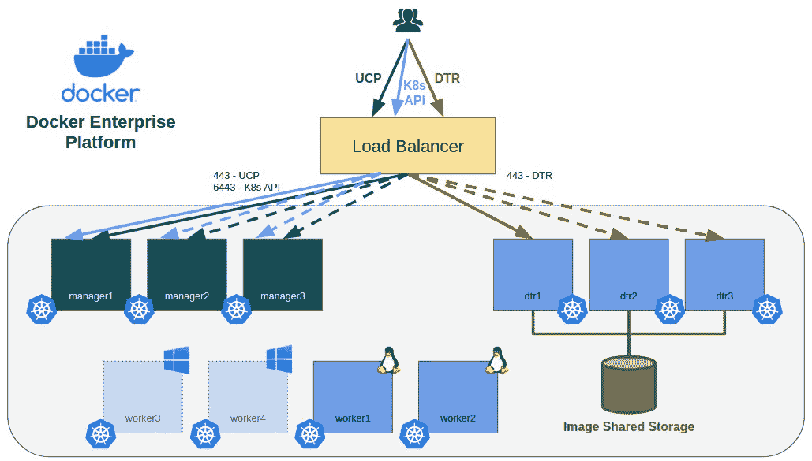

Docker Enterprise 平台简介

在前几章中，我们讨论了 Docker 的功能和 Docker 环境。我们介绍了容器的概念，并探讨了如何将应用程序部署到协调的环境中。我们看到的所有功能都基于 Docker Community Edition。在本章中，我们将学习所有不同的 Docker 版本及其差异，然后介绍 Docker Enterprise 平台。

在本章中，我们将介绍不同的 Docker 版本和工具。我们还将回顾**容器即服务**（**CaaS**）的概念，并了解在这种环境中我们需要什么。Docker 提供了一个面向企业的 CaaS 平台，我们将回顾其所有组件。

本章将涵盖以下主题：

+   回顾 Docker 版本

+   理解 CaaS

+   Docker Enterprise 平台

+   规划您的 Docker Enterprise 部署

让我们从学习所有不同的 Docker 版本及其具体功能开始本章内容。

# 回顾 Docker 版本

在本节中，我们将快速回顾不同的 Docker 版本。我们在前几章中一直使用的是 Docker Community，但现在是时候了解 Docker Enterprise 了。因为它对于 Docker Certified Associate 考试非常重要。实际上，它可能涉及超过 50% 的考试所需知识，因为你将学习的所有概念都将与这个平台相关。

Docker Community 是我们在开发基于容器的应用程序时使用的 Docker 平台。它是免费的，并在 GitHub 上提供支持 ([`github.com/docker/docker-ce`](https://github.com/docker/docker-ce)) 和 Docker 论坛 ([`forums.docker.com/`](https://forums.docker.com/))。

Docker Enterprise 是一个面向企业的解决方案。Docker/Mirantis 提供*24/7*的支持，并通过订阅授权。

## Docker Community

当我们谈论 Docker Community Edition，通常称为**docker-ce**时，我们仅指 Docker 引擎（守护进程），尽管 Docker 团队还开发了其他社区软件产品：

+   **Docker Toolbox**：这是微软 Windows 和苹果 Mac 用户可用的第一个工具。在 Windows 容器出现之前，这是在 Windows 节点上使用 Docker 的唯一方式。它提供了一个桌面环境，包含许多工具和快捷方式，用于大多数组件和操作。

+   **Docker Machine**：Docker Machine 允许我们配置 Docker 主机。它自带一些预定义的配置器，我们还可以通过外部二进制文件扩展这个列表，以便在最流行的云提供商和本地基础设施上部署节点。

+   **Docker Desktop**：这是在 Windows 专业版环境中 Docker Toolbox 环境的演进。开发者对使用 Docker Toolbox 的体验非常满意。为了响应这一需求，Docker 创建了一个能够启动小型 Kubernetes 环境的桌面环境，同时还包含了应用模板，帮助开发者仅通过几次点击鼠标就能轻松创建简单的应用程序。

Docker 社区版提供了一个完整的 Docker 引擎平台。因此，我们可以使用 Docker Swarm 或 Kubernetes 创建集群。所有社区版的功能在前几章中已经覆盖——我们从未讨论过任何企业版特有的集成。Docker Swarm 不提供**基于角色的访问控制**（**RBAC**）来管理用户。我们还必须提供一个安全发布应用程序的解决方案。请记住，Docker 仅提供路由网格和主机发布功能，它们并不安全。对于许多用户来说，Docker Swarm 经过一些调整后已经足够使用。它易于学习和管理，还为核心组件提供了弹性和高可用性。

Kubernetes 可以部署在 Docker 社区版之上。我们将仅使用 Docker 引擎作为 Kubernetes 集群的运行时。这是目前最常见的解决方案，因为它是最常用的。Kubernetes 提供了一个丰富的生态系统，并且带有一些开箱即用的生产所需功能。然而，另一方面，某些细节（如网络）则需要第三方解决方案。Kubernetes 对容器世界的处理方式与 Docker 不同。Docker 遵循“*电池包含，但可互换*”的方式，提供了开箱即用的所有功能，尽管我们可以更改其中大部分组件。而 Kubernetes 则采用了“*一切都应该是可插拔的*”的思维方式。Kubernetes 拥有更丰富的生态系统，因为在其核心组件周围有许多解决方案。这些帮助它比 Docker 更快速、更多地发展。

## Docker 企业版

Docker 企业版具备 Docker Swarm 所缺少的所有功能。它提供了一个完整的 CaaS 平台，基于两个组件：Docker **Universal Control Plane**（**UCP**）和 **Docker Trusted Registry**（**DTR**）。在 2018 年 12 月的欧洲 DockerCon 上，Docker Desktop 企业版正式宣布，并表示它将为开发者提供桌面功能。Docker Desktop 企业版允许开发者轻松使用 Docker 创建应用程序。他们还可以在本地测试已开发的容器，甚至可以选择在某个生产环境中进行测试，以确保他们的应用程序能够在生产环境中顺利运行。Docker Desktop 的创建专门为开发者考虑，而企业版则帮助他们减少开发与生产之间的摩擦。

在撰写本书时，Docker 可以在两个不同的产品品牌下找到。Mirantis 收购了 Docker 企业版产品，而 Docker 继续维护 Docker Community 软件及其桌面产品。完整的企业平台将成为 Mirantis 目录的一部分。

因此，Docker 企业版涵盖以下产品：

+   **Docker 企业引擎**：Docker 引擎是 Docker 企业平台所需的，它提供所有必需的运行时功能。社区版和企业版之间有一些细微的区别。事实上，最重要的一点与支持服务相关。Docker 企业版提供了企业 *24/7* 支持订阅选项以及工作时间支持订阅选项。而 Docker Community 版不提供此类支持。这一小差异可能会促使企业用户选择 Docker 企业版。

+   **Docker UCP**：集群的控制平面也包含在 Docker 企业版中。这个产品叫做 Docker UCP。它还提供了一个开箱即用的 Kubernetes 生产就绪平台，建立在一个生产就绪的 Docker Swarm 集群之上。这可能是获得一个 Kubernetes 集群的最简单方式。这个集群发行版也得到了 Docker 的支持，这意味着所有 Kubernetes 集成都已在 Docker 企业平台上经过充分测试。缺点是 Kubernetes 版本必须在产品生命周期内冻结。在撰写本书时，目前支持并分发的 Kubernetes 版本是 1.14，而社区版中一般提供的是 1.17。这对于企业产品来说是正常的。所有东西都必须在更新到更高版本之前进行测试和验证，这需要时间。

+   **Docker 受信注册表**：工作时始终需要一个注册表与容器配合使用。尽管 Docker 开发了 **Docker Registry** 并且它是开源的，但它不足以用于生产环境。它既没有身份验证也没有授权，而这对于确保安全访问镜像至关重要。我们可以集成 **Docker Trusted Content**，*但这并不简单*。我们需要包括 Notary 服务并将其集成到其他已部署的平台中。相信我，这并不容易。我以前做过，实施起来很困难，维护起来更难。DTR 包括基于 RBAC 模型的身份验证和授权。我们可以创建组织、团队，并为不同用户设置不同的访问权限，还可以将部分镜像公开。我们可以完全控制访问和镜像发布。它还包括 Docker 受信内容的实现，包含所有必需的组件和集成。它还包括不同阶段的 CI/CD 工作流集成和安全镜像扫描。这些功能将确保只有经过批准且无漏洞的镜像在我们的生产 CaaS 平台上运行。

+   **Docker Desktop Enterprise**：这是撰写本书时最新添加的功能。目前 Docker Certified Associate 考试不包括任何关于它的问题。因此，在这里我们只提供 Docker Desktop 的基本介绍。这是一个桌面应用程序，为开发人员提供完整的 Docker Swarm 和 Kubernetes 环境，以便他们可以在笔记本电脑上开发和测试其应用程序，然后将其工件移到其他阶段。

正如我们所见，有许多不同的组件打包在 Docker Enterprise 版本中。如果我们访问 [`success.docker.com/article/compatibility-matrix`](https://success.docker.com/article/compatibility-matrix)，我们可以查看哪些组件版本是经过验证并支持一起工作的。在撰写本书时，这些是 Docker Enterprise Edition 3.0 的每个组件的最新支持版本：

+   Docker Engine 19.03.x

+   Universal Control Plane 3.2.x

+   Docker Trusted Registry 2.7.x

Docker Engine 受支持的许多 Linux 发行版（如 Red Hat/CentOS、SUSE SLES、Oracle Linux 和 Ubuntu）和 Windows（2016 和 2019 发行版）。

Windows 节点仅支持作为工作节点，并且它们仅将作为 Docker Swarm 编排的一部分。在 Docker Enterprise 3.0 上不支持 Windows 平台上的 Kubernetes。

在接下来的部分，我们将讨论 CaaS 平台是什么以及 Docker 如何提供所有期望的功能。

# 理解 CaaS

CaaS 平台是一个可用于向用户提供容器服务的平台。 *作为服务* 这个术语通常与云提供商及其解决方案相关联。在此，我们将这个术语扩展到本地环境。我们将讨论 CaaS 作为一个设计用于向用户提供完整基于容器的解决方案的应用程序框架或复合物。CaaS 解决方案必须提供完整的容器工作流程（构建、部署和运行）。现在也有另一个新术语：**KaaS** 解决方案。这个术语指的是 **Kubernetes 作为服务** 平台，其中 Kubernetes 是环境的核心。这些解决方案增加了一些在 Kubernetes 默认安装中不包含的功能，例如监控、日志记录和 CI/CD。

CaaS 和 KaaS 环境旨在为需要完整解决方案的用户提供服务。将有解决方案的管理员和将在环境中使用提供的服务的客户端。

这些平台必须提供以下内容：

+   **身份验证**：访问平台的用户应该经过身份验证，以便只允许已批准的用户。

+   **授权**：角色将为不同的用户提供不同的访问权限。应该有管理员和用户。每个用户在平台内部应具有不同级别的访问权限和视图。非授权用户不应该可以对容器执行操作。

+   **运行时**：所有容器将在容器引擎上运行。这是一个要求。虽然有不同的引擎，但 Docker 引擎现在仍然是最常见的。

+   **发布**：我们使用这些平台来创建和运行基于容器的应用程序，但人们必须能够消费我们已部署的服务。CaaS/KaaS 平台必须提供一个组件，允许我们发布部署在环境内的应用程序。

+   **注册表**：所有镜像必须存储在某个地方。记住，镜像是必需的。没有镜像就没有容器，将镜像和代码更改一起版本化将有助于你跟踪问题和新功能。拥有一个包含在 CaaS/KaaS 平台中的注册表是至关重要的。

+   **状态**：我们需要对所有平台组件的状态有一个完整的视图。如果出现故障，我们需要知道哪些组件会受到影响，我们是否能够推送新镜像，以及我们的服务是否正常运行，举个例子。

+   **集成**：尽管在我看来，日志记录和监控并不是严格要求的，但至少为这些功能提供对外平台的集成是一个不错的选择。一些 CaaS 平台将这些服务包括在其部署中（例如 Red Hat 的 OpenShift 等），但我们应该能够轻松地将日志记录和监控环境集成。有时，运维团队会有自己的监控平台；CaaS 平台应该将所有必要的事件转发给它们。CI/CD 工作流是另一种有趣的集成方式。如果 CaaS 平台能够在平台内集成开发和测试阶段，用户将只需要编码。其他一切都可以通过 CI/CD 工具自动化。

正如我们之前提到的，这些平台需要一些管理员来完成所有的维护任务和配置，而用户只需消费提供的服务以创建和运行他们的应用程序。有些云服务提供商采取了不同的方法。**Azure Kubernetes 服务**（**AKS**）、亚马逊的**弹性 Kubernetes 服务**（**EKS**）和**Google Kubernetes 服务**（**GKS**）是这些环境中最知名的例子。

在这些平台上，我们只需要选择要在集群中部署的工作节点数量。所有维护任务由云服务提供商管理；我们只需要配置用户访问权限，并准备一些云服务提供商的负载均衡器来路由流量。其余的配置和部署都在 Kubernetes 中进行。这非常好，因为我们可以专注于部署应用程序。我们不需要关心环境的高可用性、备份或平台升级。云服务提供商将为我们管理所有这些任务。这些平台还包括集成到其**平台即服务**（**PaaS**）环境中的监控和日志记录设施。

在本节中，我们回顾了在 CaaS 或 KaaS 平台中需要提供的内容。在下一节中，我们将学习 Docker 企业版如何实现这些概念。

# Docker 企业版平台

Docker 企业版提供了一个 CaaS 平台。在本节中，我们将尝试将我们对 CaaS 平台的了解应用到 Docker 企业版中。我们将涵盖许多概念，以帮助您理解如何使用 Docker 企业版实现端到端的基于容器的解决方案。我们不会涉及 Docker Desktop 企业版，因为它不包含在 Docker 认证助理考试中。

## Docker 引擎

Docker 引擎是平台的核心部分。它提供了执行平台的运行时。与 Kubernetes 不同，Docker Swarm 需要 Docker 引擎才能运行。Kubernetes 提供了直接使用 `containerd` 或 **容器运行时接口优化版** (**CRI-O**，用于兼容 OCI 的容器)的选项。Docker 引擎包括 Swarm 模式，我们无需任何其他软件即可实现一个功能齐全的分布式调度环境。Docker 引擎为所有平台组件提供了底层执行层。

在 Docker 引擎之上，我们将创建一个 Docker Swarm 集群，其他 Docker 企业版组件将作为 Docker Swarm 服务或多容器应用程序运行。这一点至关重要，因为有些组件将作为代理在平台中运行，我们将自动将它们部署为 **全球服务**（记住这些概念）。但也有一些组件必须在集群中唯一。它们将在一些指定的主机上作为 **多容器**应用程序运行。这些组件将使用不同的执行架构。

对于 Docker 企业版，我们将部署 Docker 企业版引擎，并支持特定的发布版本。企业版发布必须长期得到支持，因此这会影响发布的时间。如我们在*Docker 企业版引擎*一节中所看到的，目前支持的版本是 19.03.x（截至写作本书时），而对于社区版，支持的版本可能不同（目前也是 19.03.6，但直到最近，版本之间可能会有较大差异）。这是正常现象，因为 Docker 工程师和支持团队必须验证所有组件的集成并解决当前 Docker 企业版发布中的任何问题，同时在此过程中通过增加新特性来推动产品的演进。这些新特性通常会先出现在 Docker 社区版中，然后在充分测试并实现后才会应用于 Docker 企业版。

由于我们将在集群环境中工作，我们将能够执行维护任务并在节点之间移动工作负载，而不会中断服务。Docker 引擎的更新将顺畅且简单。

## 通用控制平面

UCP 为 Docker Enterprise 平台提供控制平面。它提供了管理所有集群组件及其状态所需的所有进程和工具。UCP 将部署组件在主节点和工作节点上，正如我们将在第十一章中学习的那样，*通用控制平面*。它基于 Docker Swarm 编排，但正如我们之前提到的，核心组件将作为多容器应用程序运行。主节点将运行控制平面进程。如果这些进程失败，它们不会在其他节点上运行。理解这些核心进程只能在指定节点上运行非常重要。其他节点无法承载这些工作负载。如果主节点发生问题，且我们无法恢复该主节点，我们需要创建一个新的主节点。我们将提升一个工作节点，或者在移除旧节点后安装一个新的主节点。

UCP 将部署一些分布式数据库，保持其法定人数（quorum）非常重要。我们将在第十一章中回顾一些常见问题，*通用控制平面*。请记住，UCP 管理节点非常重要，进程必须在指定节点上运行。

所有内部集群通信将使用 TLS 进行加密。UCP 管理所有节点、所有组件及其证书。它还将为经过认证和授权的用户提供证书。默认情况下，我们可以确保客户端与服务器之间的安全通信。

Kubernetes 集群也将默认部署所需的**容器网络接口**（**CNI**）Calico，并配置安全设置。UCP 提供一个生产就绪的 Docker Swarm 和 Kubernetes 平台。

集群的认证和授权将由 UCP 管理。我们将能够集成第三方认证系统，如**轻量目录访问协议**（**LDAP**）和 Active Directory。所有授权机制和实现也都包含在 UCP 中。我们可以提供统一登录，将所有 DTR 认证请求委托给 UCP。这是通常的且首选的配置。UCP 提供一个完整的基于资源、角色和权限的 RBAC 系统。我们可以在集群内的任何资源上指定高度定制的访问权限。

UCP 提供一个管理 Web UI 和一个 API 接口，用于访问集群的资源。我们将能够配置所有 Docker Swarm 和 Kubernetes 资源。对于 Kubernetes，提供一个简单的界面来部署资源的 YAML 文件。我们将远程使用集群。我们永远不会允许用户访问管理节点或工作节点。

禁止任何未经授权访问集群节点非常重要。通过 SSH 访问 Docker 主机或直接访问 Docker Engine 的守护进程将绕过 UCP 应用的所有安全实现。

Web UI 还将提供一些简单的监控功能，用于验证整个集群的状态。我们可以查看所有容器、Pod、服务的状态，以及一般来说，所有由集群管理的资源。我们还可以使用 Prometheus 的标准集成导出集群的指标。Web UI 还提供对容器日志的访问，我们甚至可以使用它们来查看应用程序的行为。所有这些访问将通过 UCP 的 RBAC 系统进行管理。

Docker Swarm 和 Kubernetes 将通过其 API 提供服务。如我们在第九章《*使用 Kubernetes 进行编排*》中所学，Kubernetes 提供了其自有的 RBAC。Docker Swarm 则需要外部工具。UCP 提供了这些外部工具，将所有 API 请求代理到 UCP 的内部 RBAC 集成，并提供适当的身份验证和授权机制。

UCP 还提供了一个集成组件，用于发布集群内部署的应用程序。这个组件是 Interlock，并且在编写本书时，它基于 NGINX。Interlock 仅适用于 Docker Swarm 部署，监控集群的 API 以获取已定义服务的变化。我们将定义哪些服务需要发布，以及哪些头部、名称和路由应该可用。对服务应用的所有更改将自动填充到 Interlock 的反向代理组件中，该组件会将请求转发到相关的后台服务。我们将在第十二章《*在 Docker Enterprise 中发布应用程序*》中更深入地学习这一内容。

## Docker 信任的注册中心

正如我们在讨论 CaaS 要求时提到的，我们需要一个注册中心来存储镜像。这个注册中心必须提供安全访问和角色，因为在发布镜像时，我们需要一些粒度控制。一些用户将是自己镜像的所有者，而其他用户只能使用这些镜像。我们需要确保镜像的不可变性。DTR 提供了这一点。它是建立在开源的 Docker Registry 基础之上，但添加了许多改进，以提供企业级解决方案。

DTR 提供了一个安全的存储库来存储所有 CaaS/KaaS 镜像。我们可以确保源追溯性和不可变性。我们还将为镜像提供不同的访问级别。一些用户将是基础镜像的维护者，而其他用户将能够将其用于自己的项目。我们还拥有团队和组织。我们可以在多租户环境中的组织内发布镜像，确保组织内的所有用户都能使用其公共镜像。团队将共享镜像维护责任，但只有部分成员能够修改镜像内容。

由于安全性在 CaaS 环境中至关重要，DTR 将提供镜像扫描和签名功能。镜像扫描将检查所有镜像，寻找二进制漏洞。它将使用 **常见漏洞和暴露**（**CVE**）数据库来查找任何存在漏洞的文件。所有漏洞内容将被报告，管理员将在平台内处理这些问题。我们可以决定只执行干净的镜像，即没有报告任何漏洞的镜像。镜像签名将确保我们禁止任何未签名的镜像进入我们的基础设施。这确保我们只执行在我们组织内创建并签名的镜像。如果镜像被外部修改，将无法运行容器。

DTR 还可以集成到 CI/CD 流水线中，结合其镜像推广功能。镜像标签可以通过触发器进行修改。这个过程还可以告诉外部应用程序进行跟踪，帮助我们在部署工作流中实现特殊的阶段。镜像是应用程序的新代码构件，我们可以将 DTR 集成到我们的 CI/CD 流水线中。

在下一节中，我们将描述使用 Docker 企业版进行生产的最小环境。

# 规划你的 Docker 企业版部署

正如我们在本章中讨论的那样，Docker 企业版提供了一个生产就绪的 CaaS 平台。在本节中，我们将回顾部署 Docker 企业版到生产环境中的最小逻辑要求。

我们了解到，Docker Swarm 和 Kubernetes 需要奇数个主节点才能正常工作。Docker Swarm 不需要外部键值存储，而 Kubernetes 需要。Docker 企业版将通过 UCP 部署这个键值存储，因此至少需要三个管理节点以提供高可用性。所有管理节点将运行相同的服务。在 Docker Swarm 和 Kubernetes 中，我们有一个领导节点，用于在数据库中记录集群的变更。其他管理节点将同步其数据，但我们也可以在任何一个管理节点上运行管理命令。我们需要集成外部负载均衡器，以便将 API 请求分发到所有管理节点。

记住，三个节点只有在其中一个节点失败时才能保护集群。集群在两个管理节点下也能正常工作，但如果另一个节点失败，集群将变得不一致。

UCP 要求至少有三个管理节点。那么 DTR 呢？该组件有自己的分布式数据库：它使用**RethinkDB**。这个数据库也要求副本数量为奇数；因此，至少需要三个节点。DTR 将使用多容器架构在工作节点上部署。因此，我们可以说，DTR 至少需要三个工作节点。镜像扫描可能消耗大量的 CPU 资源，建议将 DTR 节点与其他工作节点隔离，以避免对应用程序产生影响。DTR 集群需要节点之间的共享存储，因为只有接收应用请求的节点才能向数据库写入更改。但所有节点必须写入相同的存储位置，因此需要共享存储。我们将在 DTR 的 API 前面使用外部负载均衡器，以便在服务节点之间分配请求。

我们将根据需要向该平台添加工作节点。事实上，我们将从最少两个工作节点开始，以确保高可用性。所有应用负载都必须具备弹性；因此，如果我们在两个架构上都进行部署，Windows 和 Linux 工作负载的最小节点数将要求至少为两个。下图展示了描述的场景：

我们将为管理节点和工作节点使用固定 IP 地址。这是首选方案，尽管工作节点可以使用 DHCP 进行部署。我们将如在第八章中讨论的那样，*使用 Docker Swarm 进行编排*，将控制平面与数据平面隔离。数据平面将用于应用程序，而控制平面将用于内部集群通信。

Calico 将默认作为 Kubernetes CNI 使用，检查是否存在 IP 范围冲突非常重要。下表显示了 Docker Engine、Docker Swarm 和 Kubernetes 使用的默认 IP 地址：

| **组件** | **子网** | **范围** | **默认 IP 地址** |
| --- | --- | --- | --- |
| 引擎 | `fixed-cidr` | `docker0`接口和本地容器的 CIDR 范围 | `172.17.0.0/16` |
| 引擎 | `default-address-pools` | `docker_gwbridge`接口和桥接网络的 CIDR 范围 | `172.18.0.0/16` |
| Swarm | `default-addr-pool` | Docker Swarm 覆盖网络的 CIDR 范围 | `10.0.0.0/8` |
| Kubernetes | `pod-cidr` | Kubernetes Pods 的 CIDR 范围 | `192.168.0.0/16` |
| Kubernetes | `service-cluster-ip-range` | Kubernetes 服务的 CIDR 范围 | `10.96.0.0/16` |

为了避免任何防火墙问题，请查看以下链接，该链接描述了某些 Linux 平台上所需的配置：[`docs.docker.com/ee/ucp/admin/install/plan-installation`](https://docs.docker.com/ee/ucp/admin/install/plan-installation)。

我们将使用**完全合格的域名**（**FQDNs**）为与 UCP/Kubernetes 和 DTR API 相关的虚拟 IP 地址提供服务。

我们将在第十一章，*通用控制平面*，和第十三章，*使用 DTR 实现企业级注册表*中回顾所有必需的端口。但客户端通过特定的暴露端口来访问集群服务。默认情况下，UCP 和 DTR 将在端口 `443` 上暴露它们的 API 和 Web UI，而 Kubernetes 则暴露在端口 `6443` 上。

我们通常在产品安装过程中需要互联网连接，尽管我们可以执行离线安装。如果需要提供自动的镜像扫描数据库同步，DTR 需要互联网连接。例如，我们可以每周从 Docker 网站下载一个压缩的数据库文件，以避免这种所需的连接性。

许可证处理流程也可以自动化，订阅续期可以在产品许可证到期前同步。

这是对将 Docker 企业组件部署到生产环境的简要描述。我们将在后续章节中更深入地探讨这些组件。

# 总结

在本章中，我们介绍了 Docker 企业平台。我们回顾了 Docker Community 工具和 Docker 企业产品之间的主要差异。

我们还介绍了 CaaS 和 KaaS 平台的概念。我们了解了这些平台应该提供什么，以及不同的制造商和云服务提供商如何部署它们的实现。

我们还描述了 Docker 企业平台的最重要功能，即 Docker 企业引擎（Docker Enterprise Engine）、UCP 和 DTR。这些组件提供了 Docker 的 CaaS 解决方案。通过这些内容，我们已经涵盖了规划 Docker 企业生产环境时需要考虑的最重要事项。

在下一章中，我们将更深入地探索 UCP。

# 问题

1.  以下哪一项组件不属于 Docker 企业平台？

a) DTR。

b) Docker 企业引擎。

c) Docker Machine。

d) 这些都是 Docker 企业平台的一部分。

1.  以下哪些陈述关于 Docker Community 和 Docker Enterprise 是正确的？

a) Docker 企业版提供了一个企业级的平台。

b) 我们不能将 Docker Swarm 部署到生产环境中。

c) Docker 企业版不支持 Kubernetes；只支持 Docker Swarm。

d) Docker 注册表是一个企业级的注册表。

1.  部署 KaaS 解决方案需要哪些 Docker 组件？

a) Docker 企业引擎。

b) UCP。

c) Kubernetes。

d) DTR。

1.  以下关于部署 Docker 企业环境的哪些陈述是正确的？

a) 我们仅为管理节点使用固定的 IP 地址。

b) 我们只需将流量路由到其中一个管理节点。

c) 在 UCP 完成 Kubernetes 安装后，我们需要部署一个 CNI。

d) 以上都不是。

1.  在 Docker 企业平台上执行 Linux 工作负载并确保高可用性所需的最少节点数是多少？

a) 我们需要部署三个管理节点、三个带有 DTR 的工作节点，以及一个足够资源的 Linux 工作节点来运行所有工作负载。

b) 我们需要部署三个运行 DTR 的管理节点，以及两个 Linux 工作节点。

c) 我们需要部署三个带有 DTR 的管理节点，三个 DTR 工作节点，以及两个 Linux 工作节点。

d) 所有这些选项都是有效的。

# 进一步阅读

你可以参考以下资料，了解本章涉及的更多内容：

+   Docker 企业版简介： [`docs.docker.com/ee/`](https://docs.docker.com/ee/)

+   Docker 企业版组件： [`docs.docker.com/ee/docker-ee-architecture/`](https://docs.docker.com/ee/docker-ee-architecture/)

+   Mirantis Docker 企业版网站： [`www.mirantis.com/software/docker/docker-enterprise/`](https://www.mirantis.com/software/docker/docker-enterprise/)

+   Mirantis 收购 Docker： [`www.mirantis.com/company/press-center/company-news/mirantis-acquires-docker-enterprise/`](https://www.mirantis.com/company/press-center/company-news/mirantis-acquires-docker-enterprise/)
