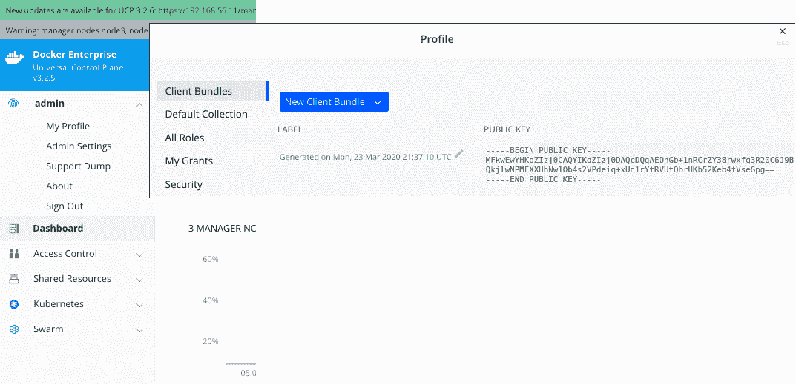
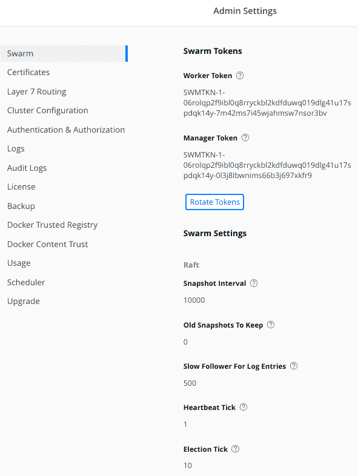

Universal Control Plane

在本章中，我们将学习所有与 Docker 的 **Universal Control Plane** (**UCP**) 相关的内容，这些内容是 Docker 认证助理考试所需的。Universal Control Plane 是 Docker 企业版中负责管理集群的组件。首先，我们将介绍 UCP 的组件及其功能。值得注意的是，UCP 在近年来发生了很多变化。Docker 企业平台之前被称为 Docker Datacenter。在 2.0 版本发布时，Docker 更改了名称。这个版本也很重要，因为它是第一个将 Kubernetes 作为第二个编排工具引入的版本。在本章中，我们将学习 Kubernetes 如何集成，以及如何部署一个生产就绪的平台。

2019 年 11 月，Mirantis 公司收购了 Docker 企业平台业务，包括其产品、客户和员工。因此，Docker 企业版目前是 Mirantis 公司的产品。

我们将探索 UCP 的主要组件，并学习如何部署一个高可用的生产环境。企业环境有许多安全需求，UCP 包括基于 RBAC 的身份验证和授权系统，所有这些都可以轻松与企业的用户管理平台集成。Docker 企业版基于 Docker Swarm，但还包括集群中的企业级 Kubernetes 环境。我们将学习 UCP 的管理任务、安全配置、特殊功能，以及如何基于备份和恢复功能提供灾难恢复策略。本章将通过回顾在该平台上应监控的内容来确保其健康状态。

本章将涵盖以下主题：

+   理解 UCP 组件和功能

+   部署具有高可用性的 UCP

+   回顾 Docker UCP 的环境

+   基于角色的访问控制与隔离

+   UCP 的 Kubernetes 集成

+   UCP 管理和安全

+   备份策略

+   升级、健康检查和故障排除

让我们开始吧！

# 技术要求

您可以在 GitHub 仓库中找到本章的代码：[`github.com/PacktPublishing/Docker-Certified-Associate-DCA-Exam-Guide.git`](https://github.com/PacktPublishing/Docker-Certified-Associate-DCA-Exam-Guide.git)

查看以下视频，观看代码实践：

"[`bit.ly/34BHHdj`](https://bit.ly/34BHHdj)"

# 理解 UCP 组件和功能

Docker 的 UCP 提供了 Docker 企业平台的控制平面。它基于 Docker Swarm，但还集成了 Kubernetes 编排器。以下是其当前功能的快速列表：

+   集中式集群管理界面

+   集群资源环境

+   基于角色的访问控制

+   通过 WebGUI 或 CLI 的客户端环境

正如我们之前提到的，UCP 基于 Docker Swarm 编排。我们将部署一个包含管理节点和工作节点角色的 Docker Swarm 集群。

首先，我们将安装一个管理节点。在安装过程中，这将是领导节点。所有组件将作为容器部署，因此我们只需要一个 Docker 企业版引擎来运行它们。

一旦安装了第一个管理节点，并且所有 UCP 组件都启动并运行，我们将继续向集群中添加节点。这个过程非常简单。

所有组件将由一个名为`ucp-agent`的主代理进程进行管理。该进程将根据已安装节点的角色部署其他所有组件。

让我们回顾一下部署在管理节点和工作节点角色上的不同组件。

## 管理节点上的 UCP 组件

在第八章《使用 Docker Swarm 进行编排》中，我们学习了这些集群是如何工作的。管理节点运行所有管理进程。我们将部署奇数个管理节点，以提供高可用性，因为 Docker Swarm 基于 Raft 协议，需要在管理平面中达成共识或法定人数。

管理节点运行所有 UCP 核心服务，包括 Web UI 和持久化 UCP 状态的数据存储。这些是运行在管理节点上的 UCP 服务：

| **组件** | **描述** |
| --- | --- |
| `ucp-agent` | 该组件是运行在每个节点上的代理，用于监控并确保所需的服务正在运行。 |
| `ucp-swarm-manager` | 为了与 Docker Swarm 环境兼容，该组件运行在管理节点上。 |
| `ucp-proxy` | 该组件使用 TLS 提供对平台上每个 Docker 引擎的安全访问，并将请求转发到本地套接字。 |
| `ucp-auth-api` | 该组件运行在管理节点上，提供身份验证 API，用于授权访问。 |
| `ucp-auth-store` | 该组件存储 UCP 平台上用户、组织和团队的数据及配置。 |
| `ucp-auth-worker` | 一个身份验证工作进程定期与外部身份验证后台进行同步任务。 |
| `ucp-client-root-ca` | 该组件提供一个证书颁发机构，用于签署平台上用户的包。包是由管理平台颁发的，旨在为用户提供访问权限。 |
| `ucp-cluster-root-ca` | 为了确保平台组件之间的安全通信，该组件提供一个证书颁发机构（CA）用于签署 TLS 证书。 |
| `ucp-kv` | 该组件提供一个键值数据库，用于存储集群配置。它曾仅用于传统 Swarm（我们尚未看到 Docker Swarm 过去是如何部署的，但它今天与 Kubernetes 类似），但目前它也被用作 Kubernetes 的键值存储。 |
| `ucp-controller` | UCP Web UI 是管理的关键。`ucp-controller`提供此功能。当用户无法访问集群时，它是第一个发生故障的组件。 |
| `ucp-reconcile` | 为了监控组件的健康状况，UCP 运行 `ucp-agent`，如果某些组件出现故障，它会尝试重新启动它们。此组件仅在出现问题时运行。 |
| `ucp-dsinfo` | UCP 可以运行故障排除报告。它执行此组件以检索所有可用的信息。我们使用支持转储将信息发送到支持服务。 |
| `ucp-metrics` | 该组件用于恢复节点指标。这些数据可以在其他监控环境中使用。 |
| `ucp-interlock`/`ucp-interlock-proxy` | Interlock 组件允许高级用户发布在集群中部署的应用程序。`ucp-interlock` 查询 UCP API 以获取要配置以发布服务的更改，并在 `ucp-interlock-proxy` 组件中配置反向代理，UCP 会为您自动部署和配置该反向代理。 |

以下进程也会在主节点上运行，但由于它们与 Kubernetes 相关，因此被单独列在不同的表格中：

| **进程** | **描述** |
| --- | --- |
| `ucp-kube-apiserver` | 这是 Kubernetes 主 API 组件。所有 Kubernetes 进程都将作为容器部署在我们的主机中。使用容器来部署应用程序有助于我们维护应用程序的组件及其升级。 |
| `ucp-kube-controller-manager` | 这个 Kubernetes 进程将管理所有控制器，用于控制、复制和监控 Pods。 |
| `ucp-kube-scheduler` | `kube-scheduler` 在集群节点中调度工作负载。 |
| `ucp-kubelet` | `kubelet` 是 Kubernetes 代理。它是 Kubernetes 用来管理节点及其交互的端点。 |
| `ucp-kube-proxy` | `kube-proxy` 管理 Pod 的发布和通信。 |
| `k8s_ucp-kube-dns`/`k8s_ucp-kubedns-sidecar`/`k8s_ucp-dnsmasq-nanny` | 这些容器管理和监控 DNS 过程及 UCP 和 Kubernetes 所需的解析。 |
| `k8s_calico-node`/`k8s_install-cni_calico-node`/`k8s_calico-kube-controllers` | Calico 是 Kubernetes 的默认**容器网络接口**（**CNI**），并且在 UCP 安装过程中会自动部署。 |

在较新的版本中，还有一个重要组件用于帮助 Docker Swarm 和 Kubernetes 之间的交互：

| **进程** | **描述** |
| --- | --- |
| `k8s_ucp-kube-compose` | `kube-compose` 允许我们将 Docker Compose 的工作负载部署到 Docker Swarm 上作为堆栈或 Kubernetes 中。 |

这些是可以部署在管理节点上的组件。我们通常会部署至少三个管理节点，因为无论是 Docker Swarm 还是 Kubernetes 都需要奇数个节点来进行分布式一致性。

现在，让我们回顾一下工作节点的组件。

## 工作节点上的 UCP 组件

以下是工作节点加入集群后部署的组件：

| **组件** | **描述** |
| --- | --- |
| `ucp-agent`、`ucp-proxy`、`ucp-dsinfo` 和 `ucp-reconcile` | 这些进程具有与管理节点相同的功能。 |
| `ucp-interlock-extension` | `interlock-extension` 根据从 Docker Swarm 服务配置中获取的更改，为 `interlock-proxy` 准备配置。这一过程基于动态重新配置的模板，以完成集群范围内发布工作负载中发生的所有更新。 |
| `ucp-interlock-proxy` | `interlock-proxy` 运行一个代理进程，这一进程是通过所有其他 Interlock 进程动态配置的。它为代理组件准备一个配置文件，包含每个发布服务所需的所有运行后端。 |

为了使 Kubernetes 正常工作，工作节点还会执行以下进程：

| **进程** | **描述** |
| --- | --- |
| `ucp-kubelet` 和 `ucp-kube-proxy` | 这两个过程仅在工作节点上需要用于 Kubernetes。 |
| `k8s_calico-node` 和 `k8s_install-cni_calico-node` | 集群节点之间的网络需要 Calico，因此它的进程也会在工作节点上部署。 |

从这些列表中，我们可以轻松理解 Kubernetes 如何在 Docker 企业版上部署。管理节点运行 Kubernetes 的控制平面，而工作节点接收工作负载。请注意，管理节点运行 `kube-proxy` 和 `kubelet`，因此它们也能够接收工作负载。这对于 Docker Swarm 也同样适用，正如我们在第八章《使用 Docker Swarm 进行编排》中所学到的，*使用 Docker Swarm 进行编排*。Docker 企业版默认允许管理节点执行应用程序工作负载。

我们还将回顾在 UCP 上部署的卷，并将其分为两类：

+   **证书卷**：所有这些卷与集群中的证书管理相关。请小心处理它们，因为如果我们丢失它们，将会导致 UCP/Kubernetes 进程之间出现严重的身份验证问题：

    +   `ucp-auth-api-certs`

    +   `ucp-auth-store-certs`

    +   `ucp-auth-worker-certs`

    +   `ucp-client-root-ca`

    +   `ucp-cluster-root-ca`

    +   `ucp-controller-client-certs`

    +   `ucp-controller-server-certs`

    +   `ucp-kv-certs`

    +   `ucp-node-certs`

+   **数据卷**：这些是数据卷，用于存储集群内部署的不同数据库以及从不同组件获取的度量数据：

    +   `ucp-auth-store-data`

    +   `ucp-auth-worker-data`

    +   `ucp-kv`

    +   `ucp-metrics-data`

    +   `ucp-metrics-inventory`

所有这些卷对于集群非常重要。键值对、常见证书和身份验证数据卷会在控制平面节点上进行复制。除非我们已经使用不同的驱动程序创建它们，否则它们会使用默认的本地卷驱动程序创建。请记住，如果我们希望将数据存储在非标准位置（`/var/lib/docker/volumes` 或环境中定义的 `data-root` 路径），它们应该在部署集群之前创建。

这一部分对于 Docker 认证助理考试非常重要，因为我们需要了解组件如何分布以及它们在平台上的功能。

现在我们知道每个集群角色将部署哪些组件，接下来我们将学习如何安装生产就绪的环境。

# 部署高可用的 UCP

首先，我们将查看平台的硬件和软件要求。我们将使用版本 3.0——这是写本书时的当前版本。众所周知，DCA 考试甚至是在 Docker Enterprise 2.0 版本发布之前就已经准备好了。当时 Docker Desktop 和 Kubernetes 并不属于 Docker Enterprise 平台的一部分。我们将部署当前版本，因为考试已经发展到涵盖新版本中的重要主题。让我们快速回顾一下当前的维护生命周期：

| **Docker Enterprise 2.1** | **Docker Enterprise 3.0** |
| --- | --- |
| 2020-11-06 停止支持 | 2021-07-21 停止支持 |

| 组件：- 企业引擎 18.09.z - 通用控制平面 3.1.z

- Docker 受信任注册表 2.6.z | 组件：- 企业引擎 19.03.z - 通用控制平面 3.2.z - Docker 受信任注册表 2.7.z |

Docker 提供从发布之日起 2 年的支持。我们建议查看 Docker 网站，获取有关维护生命周期和兼容性矩阵的最新信息：

+   [`success.docker.com/article/maintenance-lifecycle`](https://success.docker.com/article/maintenance-lifecycle)

+   [`success.docker.com/article/compatibility-matrix`](https://success.docker.com/article/compatibility-matrix)

所有列出的版本都包含 Kubernetes，但部署的版本会有所不同。写本书时，Docker Enterprise 部署的是 Kubernetes v1.14.8。

我们可以在本地或云提供商上部署 Docker Enterprise 平台。在部署第一个节点之前，让我们回顾一下最小节点要求：

+   管理节点需要 8 GB 的 RAM，工作节点需要 4 GB 的 RAM。

+   管理节点需要 2 个 vCPU。工作节点的 vCPU 数量将取决于将要部署的应用程序。

+   管理节点的 `/var` 分区需要 10 GB 的可用磁盘空间（推荐至少 6 GB，因为 Kubernetes 会在安装之前检查磁盘空间），工作节点的 `/var` 分区需要至少 500 MB 的可用磁盘空间。工作节点的空间将取决于将要部署的应用程序，它们的镜像大小，以及需要在节点上存在的镜像发布数量。

对于控制平面和镜像管理，可能更为实际的资源配置如下：

+   管理节点和带有 DTR 的工作节点需要 16 GB 的 RAM（我们将在第十三章，*实现企业级注册表与 DTR* 中学习有关 DTR 的内容）。

+   管理节点和带有 DTR 的工作节点需要 4 个 vCPU。如果没有足够的 CPU 可用，控制平面 CPU 和镜像扫描可能会永远进行下去。

请记住，集群的规模实际上取决于要部署的应用程序。通常建议将应用程序组件分布在多个节点上，因为节点较少的集群更难维护。拥有多个资源的少数节点比将相同的资源分布在多个节点上更糟糕。当某些节点出现故障时，将资源分散到多个节点上可以提供更好的集群生命周期管理和负载分配。

在控制平面节点上，我们将部署 Docker 企业版引擎版本 19.03（写作时的最新版本）。这些节点应该部署静态 IP 地址并且 Linux 内核版本应为 3.10 或更高版本。由于我们将部署多个副本，因此我们需要一个外部负载均衡器，将控制平面的请求路由到任何可用的管理节点。我们将使用一个虚拟 IP 地址和与此负载均衡器关联的**完全限定域名**（**FQDN**）。我们将它们作为**主题备用名称**（**SAN**）添加，以确保证书有效。证书应该与可以作为 UCP 服务一部分访问的任何节点相关联（作为 SAN）。在这种情况下，管理节点将运行控制平面组件，因此证书应对它们中的任何一个有效，包括与 UCP 管理端点相关联的所有可能的 FQDN 名称（默认情况下，Docker Swarm 和 Kubernetes 的端口分别为 `443` 和 `6443`）。

我们将默认公开 TCP 端口 `443` 和 `6443`，也可以将它们更改为更适合我们环境的其他端口。第一个端口允许用户通过 Web 浏览器、API 或 Docker 命令行与 UCP 的控制平面进行交互。第二个端口则公开 Kubernetes API 服务器，使我们可以直接与 Kubernetes 调度器交互。

工作节点不需要静态 IP 地址，但它们应该能够通过 DNS 使用其名称进行访问。

我们不能在 UCP 中部署用户命名空间。（我们在第三章中了解了用于提高主机安全性的用户命名空间，*运行 Docker 容器*。）在 UCP 环境下使用此功能并不容易，因此不支持该功能。

高可用性环境的最低配置将包括三个管理节点和至少两个工作节点。下图显示了最小环境（不包括 DTR 节点）。我们可以说，UCP 具有三个主要的逻辑组件：


因此，总结来说，我们将需要以下逻辑要求来进行部署：

+   管理节点的静态 IP 地址

+   控制平面的 VIP 地址和 FQDN

+   一个外部负载均衡器，拥有 VIP，并通过 TCP 将请求转发到管理节点的 `443` 和 `6443` 端口（默认情况下）

应该允许以下端口和协议（除非明确说明，否则为 TCP 端口）：

+   在管理节点上：

    +   端口 `443` 用于 UCP Web UI 和 API

    +   端口 `6443` 用于 Kubernetes API 服务器

    +   `2376`和`2377`端口用于 Docker Swarm 通信

    +   从`12379`到`12388`的端口用于 UCP 组件之间的内部通信

+   在工作节点和管理节点上：

    +   `7946`端口（TCP 和 UDP）用于 Docker Swarm 的 gossip 协议

    +   `4789`端口（UDP）用于覆盖网络

    +   `12376`端口用于 TLS 认证代理，以访问 Docker 引擎

    +   `6444`端口用于 Kubernetes API 反向代理

    +   `179`端口用于 Kubernetes 网络的 BGP 对等连接

    +   `9099`端口用于 Calico 健康检查

    +   `10250`端口用于 Kubernetes Kubelet

用户将通过 HTTPS 协议使用`443`和`6443`端口访问 UCP 服务。

所有集群节点都会运行容器。这些节点中的一些将作为管理节点运行管理组件，而另一些则仅运行少量的工作组件和负载。但是，管理节点和工作节点有两个共同点：UCP 代理和 Docker 引擎。

Docker 引擎始终是必需的，因为我们需要运行容器。Docker Enterprise 需要 Docker Enterprise 引擎。安装过程很简单，并将基于许可证密钥文件以及每个客户在`https://hub.docker.com/u/<YOUR_USER_OR_ORGANIZATION>/content`可用的特定软件包。首先，我们将访问`https://hub.docker.com/`并注册 Docker Hub 账户。Docker 提供了 Docker Enterprise 平台的 1 个月试用，试用详情请访问 [`hub.docker.com/editions/enterprise/docker-ee-trial`](https://hub.docker.com/editions/enterprise/docker-ee-trial)。在第十一章 *通用控制平面*、第十二章 *在 Docker Enterprise 中发布应用程序* 和 第十三章 *使用 DTR 实现企业级注册表* 中，我们将以我自己的账户（`frjaraur`）为例，并通过不同的步骤和图片帮助你理解。

以下截图显示了`frjaraur`内容的 URL。登录 Docker Hub 网站后，你将获得自己的内容。在注册 Docker Enterprise 30 天试用版后，我们将在此页面找到所需的许可证和我们的软件包仓库 URL：


在右下角，我们将看到软件包的 URL。点击复制按钮，并按照接下来的步骤安装 Docker Enterprise 引擎。这个过程对于每个 Linux 发行版来说会有所不同。在本书中，我们将遵循 Ubuntu 的安装步骤。该过程已在之前提供的客户内容 URL 中进行了描述。Microsoft Windows 节点也可以在 Docker Enterprise 平台中使用，尽管在撰写本书时，它们只能作为工作节点使用。

以下是在 Ubuntu 节点上安装 UCP 高可用性配置的步骤：

1.  将 Docker Engine 的版本和之前显示的 URL 分别导出到 `DOCKER_EE_VERSION` 和 `DOCKER_EE_URL` 变量中。在本书编写时，最新的 Docker 企业版引擎版本是 19.03：

```
# export DOCKER_EE_URL="https://storebits.docker.com/ee/trial/sub-76c16081-298d-4950-8d02-7f5179771813"
# export DOCKER_EE_VERSION=19.03
```

请注意，你的 `DOCKER_EE_URL` 将完全不同。你可以申请试用许可证以便遵循这些步骤。

1.  接下来，我们需要将 Docker 客户端的包仓库添加到我们的环境中：

```
# curl -fsSL "${DOCKER_EE_URL}/ubuntu/gpg" | sudo apt-key add -
# apt-key fingerprint 6D085F96
# add-apt-repository \ 
"deb [arch=$(dpkg --print-architecture)] $DOCKER_EE_URL/ubuntu \   $(lsb_release -cs) \   stable-$DOCKER_EE_VERSION"
# apt-get update -qq
```

1.  最后，我们将安装所需的包：

```
# apt-get install -qq docker-ee docker-ee-cli containerd.io
```

在安装 UCP 之前，必须将这些步骤应用于所有集群节点。正如我们之前提到的，我们将为不同的 Linux 发行版提供不同的操作步骤，但我们也可以将 Microsoft Windows 节点包含在集群中。Microsoft Windows Docker Engine 的安装完全不同，具体过程请参见`https://hub.docker.com/u/<YOUR_USER_OR_ORGANIZATION>/content`。

在安装 Docker 企业版引擎之前，始终查看 Docker 客户端的内容页面，因为安装过程可能会发生变化。

当所有集群节点都安装了 Docker Engine 后，我们可以继续安装 Docker UCP。这个工作流程并非强制要求，但建议使用，因为它可以在安装 UCP 之前避免出现任何问题。这是因为 UCP 的组件将在你的主机上以容器形式运行。

Docker 提供对不同基础设施的支持，并且认证可以在这些基础设施上运行 Docker 企业版平台。在本书编写时，亚马逊 Web 服务（AWS）和 Microsoft Azure 是认证的环境。在这两种情况下，Docker 还提供了基础设施脚本和/或逐步文档，用于成功部署 Docker 企业版平台。

Docker 企业版平台基于 Docker Swarm，尽管也有部署 Kubernetes。因此，我们将使用 UCP 安装程序创建一个 Docker Swarm 集群，然后将其他节点添加为管理员或工作节点。

安装过程将需要启动一个名为 `ucp` 的容器。这非常重要，因为它确保一次只进行一次安装。我们还将使用 Docker Engine 的本地套接字作为安装容器内的卷。UCP 安装过程有许多选项——我们将在这里介绍最重要的几个。

要安装 UCP，我们将启动 `docker container run --name ucp docker/ucp:<RELEASE_TO_INSTALL>`。安装特定版本非常重要，因为 `docker/ucp` 容器也将用于备份/恢复和其他任务。

让我们为集群中的第一个管理员节点写下并执行一个常规安装命令：

```
(first manager node) # docker container run --rm -it --name ucp \
 -v /var/run/docker.sock:/var/run/docker.sock \
 docker/ucp:3.2.5 install \
 --host-address <MANAGEMENT_HOST_IP_ADDRESS> \
 --san <LOAD_BALANCED_FQDN> \
 --san <OTHER_FQDN_ALIAS_OR_IP> \
 --admin-username <ADMIN_USER> \
 --admin-password <ADMIN_USER_PASSWORD>

 INFO[0000] Your Docker daemon version 19.03.5, build 2ee0c57608 (4.4.0-116-generic) is compatible with UCP 3.2.5 (57c1024)
  WARN[0000] None of the Subject Alternative Names we'll be using in the UCP certificates ["<NODE_IP_ADDRESS>" "<NODE_NAME>"] contain a domain component. Your generated certs may fail TLS validation unless you only use one of these short names or IP addresses to connect. You can use the --san flag to add more aliases
 INFO[0000] Checking required ports for connectivity
 INFO[0004] Checking required container images
 INFO[0007] Running install agent container ...
 INFO[0000] Loading install configuration
 INFO[0000] Running Installation Steps
 INFO[0000] Step 1 of 35: [Setup Internal Cluster CA]
 ...
 INFO[0014] Step 16 of 35: [Deploy UCP Controller Server]
 INFO[0016] Step 17 of 35: [Deploy Kubernetes API Server]
 ...
 INFO[0033] Step 24 of 35: [Install Kubernetes CNI Plugin]
 INFO[0063] Step 25 of 35: [Install KubeDNS]
 INFO[0064] Step 26 of 35: [Create UCP Controller Kubernetes Service Endpoints]
 INFO[0066] Step 27 of 35: [Install Metrics Plugin]
 INFO[0067] Step 28 of 35: [Install Kubernetes Compose Plugin]
 INFO[0073] Step 29 of 35: [Deploy Manager Node Agent Service]
 INFO[0073] Step 30 of 35: [Deploy Worker Node Agent Service]
 INFO[0073] Step 31 of 35: [Deploy Windows Worker Node Agent Service]
 INFO[0073] Step 32 of 35: [Deploy Cluster Agent Service]
 INFO[0073] Step 33 of 35: [Set License]
 INFO[0073] Step 34 of 35: [Set Registry CA Certificates]
 INFO[0073] Step 35 of 35: [Wait for All Nodes to be Ready]
 INFO[0078] All Installation Steps Completed 
```

在 35 个步骤之后，UCP 的环境将安装在第一个 Linux 节点上。请小心使用 DNS 解析和外部负载均衡器。如前所述，所有管理节点将运行相同的控制平面组件。因此，需要一个外部负载均衡器来引导请求到其中的任何一个。可以按照轮询算法进行，例如（无论哪个 UCP 管理节点接收请求都无所谓，但至少应有一个节点可以访问）。

外部负载均衡器将为 UCP 控制平面提供一个虚拟 IP 地址，我们还将为端口`443`和`6443`（如果你更改了它们，使用自定义端口）提供端口透传路由。我们将添加此外部负载均衡器的虚拟 IP 地址以及关联的完全限定域名（FQDN）作为 SAN。实际上，我们将根据环境的需要，使用`--san`参数添加所需的多个 SAN。

这些步骤对于你的组织访问和**Docker 可信注册表**（**DTR**）至关重要，因为通常将两者集成到 UCP 中。在这种情况下，DTR 将请求 UCP 进行用户身份验证，因此必须能够访问和解析 UCP 的 FQDN 和端口。

我们将在外部负载均衡器上使用透传或透明代理，允许 UCP 的后端管理 TLS 证书和连接。

UCP 镜像将允许我们执行以下操作：

+   使用`install`和`uninstall-ucp`操作安装和卸载 UCP。卸载选项将从所有集群节点中移除所有 UCP 组件。我们无需执行其他程序即可完全从节点中删除 UCP。Docker 引擎不会被移除。

+   使用`images`选项从 Docker Hub 下载所需的 Docker 镜像。

+   使用`backup`和`restore`操作备份和恢复 UCP 管理节点。

+   使用`id`和`dump-certs`选项提供 UCP 集群 ID 及其证书。转储证书使我们能够安全地存储它们，以避免如果我们不小心删除任何必要的卷时出现证书问题。

+   使用`support`操作创建支持转储。这些转储将包含关于我们环境的所有有用信息，包括应用程序/容器日志。

+   执行`upgrade`选项来升级 UCP 平台。此选项将升级所有 UCP 组件，可能会影响我们的服务。建议添加`--manual-worker-upgrade`参数，以避免工作节点被自动升级。我们需要处理工作负载并将其移动到工作节点上，然后手动升级 UCP。

+   创建一个示例 UCP 配置文件并验证所需的端口状态。UCP 可以通过提供的 Web UI 或使用配置文件进行配置。使用配置文件将允许我们保持可重复性，且可以通过任何配置管理应用来管理更改。此方法可以在 UCP 安装完成后使用，或者在安装过程中通过自定义 `example-config` 选项生成的示例配置文件，并使用 `docker/ucp install --existing-config` 来应用这个修改后的文件。可用的选项在以下链接中描述：[`docs.docker.com/ee/ucp/admin/configure/ucp-configuration-file`](https://docs.docker.com/ee/ucp/admin/configure/ucp-configuration-file)。

以下是最常用的 UCP 安装选项：

| **选项** | **描述** |
| --- | --- |
| `--swarm-grpc-port`,`--controller-port`,`--kube-apiserver-port` 和 `--swarm-port` | 这些选项允许我们修改多个服务使用的默认端口。最重要的端口，可能会在你的环境中进行定制，分别是 `kube-apiserver-port`（默认值为 `6443`）和 `controller-port`（默认值为 `443`）。它们发布 Kubernetes 和 UCP 用户端点，允许我们与集群进行交互。 |
| `--host-address` 和 `--data-path-addr` | 第一个选项设置哪个节点的 IP 地址将用于发布控制平面。第二个选项允许我们将控制平面与数据平面隔离开来。我们为数据平面设置一个不同的接口或 IP 地址。 |
| `--pod-cidr`, `--service-cluster-ip-range` 和 `--nodeport-range` | 这些选项允许我们自定义 Kubernetes Pods 和 Services 的 IP 地址范围以及 `NodePort` 服务的发布端口。 |
| `--external-server-cert` | 使用此选项，我们可以在 UCP 集群内配置自己的证书。 |
| `--san` | 我们根据需要在 UCP 证书中添加这些别名的 SAN（主题备用名称）。考虑用户和管理员如何使用 UCP 集群，并添加与这些服务相关的 FQDN 名称。 |
| `--admin-username` 和 `--admin-password` | 建议在安装过程中设置管理员用户名和密码，以提供可重复的工作流程。我们将避免使用 `--interactive` 选项，从而实现 **基础设施即代码** (**IaC**) 的 UCP 安装过程。 |

一旦 UCP 安装在第一个管理节点上，我们只需要将其他管理节点和工作节点加入集群，正如我们在第八章《使用 Docker Swarm 的编排》中所学到的那样。为了获取所需的 `docker join` 命令行，我们只需执行 `docker swarm join-token manager` 用于管理节点，执行 `docker swarm join-token worker` 用于工作节点。然后我们复制它们的输出，并在每个管理节点和工作节点上执行 `docker join` 命令。这个过程非常简单。

也可以通过访问共享资源 | 节点菜单，从 Web UI 获取所需的加入指令。

UCP 集群中的节点可以与 Docker Swarm 或 Kubernetes 一起工作，甚至可以使用混合模式。这允许节点同时运行 Docker Swarm 和 Kubernetes 工作负载。

不推荐在生产环境中使用混合模式，因为协调器不会共享其负载信息。因此，一个协调器的节点可能几乎满载，而另一个协调器的节点可能为空。在这种情况下，非满载的协调器仍然可以继续接收新的工作负载，从而影响其他协调器的应用性能。

总结一下，我们安装了 Docker Engine，然后安装了 UCP。我们回顾了这个过程以及在我们的环境中安装 Docker Enterprise 平台所需的主要参数。

如果你计划在 Amazon AWS 或 Microsoft Azure 云上安装 Docker Enterprise，你应该阅读 Docker 文档中的具体说明和选项（AWS 版本：[`docs.docker.com/ee/ucp/admin/install/cloudproviders/install-on-aws`](https://docs.docker.com/ee/ucp/admin/install/cloudproviders/install-on-aws); Azure 版本：[`docs.docker.com/ee/ucp/admin/install/cloudproviders/install-on-azure`](https://docs.docker.com/ee/ucp/admin/install/cloudproviders/install-on-azure)）。

现在，我们将回顾 UCP 环境。

# 回顾 Docker UCP 环境

在这一部分，我们将回顾 Docker UCP 环境。我们可以使用 Web UI、命令行或者其发布的 REST API。在本书中，我们将覆盖 Web 应用界面以及如何将我们的 `docker` 客户端命令行与 UCP 集成。

首先，我们将介绍 Web UI。

## Web UI

Web UI 将在所有管理节点上运行。我们将使用 UCP 的完全限定域名，该域名与其虚拟 IP 地址相关联。默认使用端口 `443`，除非你手动配置了不同的端口。如果我们在浏览器中打开 `https://<UCP_FQDN>:<UCP_PORT>`，我们将访问 UCP 登录页面。如果我们使用的是自动生成的证书，浏览器会提醒我们存在不受信任的 CA。这是正常现象，因为 UCP 会自动为我们生成一个内部 CA，用于签署所有内部和外部证书。我们可以将公司的或私人证书上传到 UCP。

请记得在外部负载均衡器上应用直通（或透明代理）配置，以访问 UCP 后端。我们将使用 `https://<MANAGER_IP>:<UCP_PORT>/_ping` 来进行后端健康检查。

让我们快速回顾一下 UCP 的 Web UI。以下截图显示了主要的登录界面。在安装过程中，我们设置了管理员密码，可以通过执行该过程并使用 `--interactive` 参数进行交互，或者通过添加 `--admin-username` 和 `--admin-password` 参数来自动化这些设置。安装过程中使用的用户名和密码应当用于登录 UCP。

主页面还会提示我们，如果在安装过程中没有应用许可证文件，需要添加一个。可以使用 `--license` 参数来完成 `docker run docker/ucp:<RELEASE> install`：


下图显示了 UCP 仪表盘。每个用户都可以访问自己的仪表盘。左侧面板将提供访问用户个人资料、仪表盘、访问控制、共享资源以及与 Kubernetes 和 Swarm 相关的资源：


Dashboard 屏幕展示了集群组件状态的快速回顾。它还提供了 Swarm 和 Kubernetes 工作负载的摘要以及集群负载的概览。不要认为这就足够进行监控，因为这太简单了。我们应添加监控工具来增强警报、性能报告和容量规划功能。

Access Control 仅在 UCP 管理员访问集群的 Web UI 时出现。管理员将能够管理 RBAC 的所有行为：

+   Orgs & Teams 提供了一个接口，用于创建组织和团队，并将用户集成到其中。

+   Users 端点将允许我们按预期管理用户。我们将在下一个主题中学习如何创建和管理用户。

+   Roles 提供了一个用于 Kubernetes 和 UCP 角色的接口。Kubernetes 资源应使用声明性方法（使用 YAML 资源文件）进行管理，而 Docker Swarm 的资源（由 UCP 管理）将通过 Web UI 创建。

+   Grants 帮助我们管理 Kubernetes 角色绑定和 Swarm 角色及集合集成。

Shared Resources 提供了对 Kubernetes 或 Docker Swarm 资源的访问。我们将管理集合、堆栈、容器、镜像和节点：


节点可以通过 Nodes 入口点进行管理。我们将设置节点属性和编排器模式。正如我们所看到的，添加新节点非常简单。Add Node 选项向我们展示了集群的`docker join`命令行。我们只需将此指令复制到新节点的终端中即可。这同样适用于 Microsoft Windows 节点。

Stacks 将显示部署在 Docker Swarm 集群上的多容器或多服务应用程序。此视图还显示 Kubernetes 工作负载。

Kubernetes 和 Swarm 端点显示了每个编排器的特定资源：

+   Kubernetes 显示命名空间、服务账户、控制器、服务、入口资源、Pod 配置和存储。我们将能够更改所有用户 Web UI 端点所使用的命名空间。我们还将使用声明性方法回顾和创建 Kubernetes 资源。

+   Swarm 允许我们创建和查看服务、卷、网络、机密和配置。

我们可以查看 UCP 文档以及 Kubernetes 和 UCP API 文档。这将帮助我们基于 REST API 集成实现自动化流程。

## 使用 UCP 包的命令行

UCP 包可能是访问您用户和管理员最重要的部分。虽然每个用户都可以访问 UCP 的 Web UI、CI/CD、监控工具和 DevOps，但用户将使用 Docker 命令行查看和启动他们的工作负载。因此，这种访问应该是安全的。请记住，Docker Swarm 部署了加密的控制平面。其所有内部通信将通过 TLS 进行加密保护。然而，用户的访问是没有加密的。另一方面，UCP 提供了一个完全安全的解决方案。通过使用 TLS 保护用户和管理员访问来确保安全。这个安全是通过个性化证书来管理的。每个用户都会获得一组属于他们自己的证书。Kubernetes 访问同样通过 UCP 用户包来加密保护。

要获取此 UCP 包，用户可以使用 Web UI，或者通过一个简单的`curl`命令——或任何命令行 Web 客户端——下载这个压缩为 ZIP 文件的包：



上面的截图展示了通过 Web GUI 访问用户包文件。我们只需通过浏览器下载它。一旦文件下载到我们的计算机上，我们将解压它。此文件包含证书、配置和脚本，用于在我们的计算机上加载客户端环境，无论它是运行 Linux、Mac 还是 Windows 操作系统。每个操作系统都有一个对应的环境文件。我们将查看 Linux 系统中的内容和过程，但在 Windows 系统中也类似（只是命令不同）。

我们可以使用`curl`和`jq`从命令行下载用户包：

```
$ AUTHTOKEN=$(curl -sk -d '{"username":"<username>","password":"<password>"}' https://<UCP_FQDN>:<UCP_PORT>/auth/login | jq -r .auth_token)

$ curl -k -H "Authorization: Bearer $AUTHTOKEN" https://<UCP_FQDN>:<UCP_PORT>/api/clientbundle -o ucp-bundle-admin.zip
```

如果我们使用`unzip`解压缩管理员包文件`ucp-bundle-admin.zip`，将获得连接到集群所需的所有文件：

```
$ unzip ucp-bundle-admin.zip
```

然后，我们将加载此环境。我们将在 Microsoft Windows PowerShell 中使用`env.ps1`，或者在命令提示符中使用`env.cmd`。在 Linux 主机上，我们将使用`env.sh`。当我们在 Shell 中加载此环境时，就可以使用`docker`或`kubectl`客户端软件远程连接到 UCP 集群：

```
$ source env.sh
 Cluster "ucp_<UCP_FQDN>:6443_admin" set.
 User "ucp_<UCP_FQDN>:6443_admin" set.
 Context "ucp_<UCP_FQDN>:6443_admin" created.
```

请注意，Kubernetes 上下文也已经设置好。因此，我们将能够管理集群并在 Kubernetes 或 Docker Swarm 上部署工作负载。每个用户的 UCP 包必须安全存储。如果我们删除它，可以生成一个新的，但要保持安全；否则，可能会有人利用它获取对您的环境文件的访问权限。

UCP 为我们的管理节点提供了适用于 Microsoft Windows 和 Linux 的客户端软件，网址为`https://<UCP_FQDN>:<UCP_PORT>/manage/dashboard/dockercli`。我们可以下载这些软件以连接到集群。

使用 UCP 包连接集群，而不是通过 SSH 或其他本地访问方式，是至关重要的。我们绝不会允许本地访问集群节点。每个人必须通过命令行或 Web UI 访问集群。

UCP 的 REST API 也使用证书进行安全保护。我们需要 UCP 包中的证书文件才能使用其 API 访问集群。

我们将在下一节中审查 UCP 的访问控制，并提供一个简单的示例，帮助我们理解 RBAC 概念。

# 基于角色的访问控制与隔离

**基于角色的访问控制**（**RBAC**）管理 Docker Swarm 和 Kubernetes 的授权。Docker Enterprise 让我们管理用户对资源的访问权限。我们使用角色来允许用户查看、编辑和使用集群资源。

授权基于以下概念：

+   **主题**：我们在组织中管理用户、团队和服务账户。用户是团队的一部分，包含在组织中。

+   **资源**：这些是我们在第一章中讨论的 Docker 对象组，*现代基础设施与应用程序使用 Docker*。由于 Kubernetes 也集成到了 UCP 集群中，因此 Kubernetes 资源也属于这些组。UCP 管理按集合分组的资源。

+   **集合**：这些是资源的集合，包括不同种类的对象，如卷、密钥、配置、网络、服务等。

+   **角色**：这些是权限的集合，我们将其分配给不同的主题。角色定义了谁可以做什么。

+   **授权**：将主题与角色和资源集结合，我们获得了授权。这些是应用于资源组的有效用户权限。

服务账户仅对 Kubernetes 有效。这些不是用户账户；它们与分配管理访问权限的应用程序或 API 相关联。

有一些预定义的角色，但我们可以创建自己的角色。以下是 Docker Enterprise 的 UCP 中包含的默认角色列表：

+   无：此角色不提供任何 Docker Swarm 资源的访问权限。此角色应为新用户的默认角色。

+   仅查看：拥有此角色的用户可以查看服务、卷和网络等资源，但无法创建新资源。

+   限制控制：拥有此角色的用户可以查看和编辑资源，但不能使用绑定挂载（主机目录）或通过 `docker exec` 在容器中执行新进程。他们不能运行特权容器或具有增强功能的容器。

+   调度员：此角色允许用户查看节点，从而能够在节点上调度工作负载。默认情况下，所有用户都对 `/Shared` 集合获得 `Scheduler` 角色授权。

+   完全控制：此角色应仅限于高级用户。这些用户可以查看和编辑卷、网络和镜像，也可以创建特权容器。

用户将只能管理自己的容器或 Pods。这种行为使得可以将命名空间（Kubernetes）和集合（Docker Swarm）结合在一起。因此，具有对集合中一组资源完全控制访问权限的用户，将在 Docker Swarm 中对这些资源拥有所有权限。如果我们在命名空间中添加资源，并且该用户包含在 Kubernetes 中的完全特权角色中，同样的情况也会发生。

还有一个更高级的角色是分配给 Docker Enterprise 管理员的。他们将拥有对 UCP 环境的完全控制和管理权限。可以通过用户属性页面上的“Is Admin”复选框进行管理。

授权将用户和权限与应应用的资源集合相互连接。授权管理工作流包括它们的创建、用户分配、应应用的角色以及资源关联。通过这种方式，我们确保为分配给一组用户（或单个用户）的资源集合应用适当的权限。

集合是分层的，并包含资源。它们通过类似目录的结构来表示，每个用户都有自己的私人集合，并且拥有默认的用户权限。通过此方法，我们可以嵌套集合。一旦授予用户对某个集合的访问权限，他们将可以访问该集合的所有层级子集合。主要有三个集合：`/`、`/System` 和 `/Shared`。

在 `/System` 集合下，我们将找到 UCP 的管理节点以及 UCP 和 DTR 的系统服务。默认情况下，只有管理员才能访问此集合。另一方面，`/Shared` 集合将包含所有准备好运行工作负载的工作节点。我们可以添加额外的集合并将一些工作节点移动到这些集合中，以便将它们隔离并提供多租户功能。将工作节点分布在不同的集合中，还可以为不同的团队或租户分配工作负载执行。

每个用户默认都有一个私人集合，位于`/Collections/Swarm/Shared/Private/<USER_NAME>`。这确保用户的工作负载默认是安全的，只有管理员才能访问。因此，用户必须在他们团队共享的集合中部署工作负载。

与集合关联的标签管理用户对资源的访问，这使得动态地允许或禁止用户的可见性变得容易。

让我们通过一个简短的示例来回顾这些概念。

我们的组织（`myorganization`）中有两个项目：`projectA` 和 `projectB`。我们还假设在我们的组织中有三个团队：开发人员、质量保证和 DevOps。让我们描述一些用户及其在组织中的角色：

+   **开发人员**：`dev1` 和 `dev2`

+   **质量保证：** `qa1` 和 `qa2`

+   **DevOps：** `devops1` 和 `devops2`

+   **UCP 管理员**

以下图片展示了用户创建过程的一些截图。首先，我们创建一个组织，然后在之前创建的组织内创建团队和用户：


每个用户将在 UCP 中拥有自己的用户账户。我们将创建开发人员、质量保证和 DevOps 团队，并添加他们的用户。我们还将创建三个主要的集合作为阶段，并为每个项目创建子集合。因此，我们将有以下内容：

+   `development/projectA` 和 `development/projectB`

+   `certification/projectA` 和 `certification/projectB`

+   `production/projectA` 和 `production/projectB`

假设每个开发者一次只负责一个项目。在开发阶段，他们应该对自己的项目拥有完全访问权限，但在认证阶段，他们只能拥有查看权限。质量保证用户在认证阶段只能创建和修改他们的部署。DevOps 可以在生产环境中创建和修改资源，并允许开发者仅对`projectA`进行查看权限访问。实际上，`projectB`应该是安全的，只有`devops2`用户才能修改此项目的资源。

以下截图展示了为用户添加权限以允许其访问集合的过程。首先，我们创建一个集合，然后将该集合添加到新角色中：


我们将启动两个部署，并使用不同的用户查看这些部署的情况。

我们假设所有所需的用户已经创建，并且每个用户的`ucp-bundle`已经下载。作为`dev1`用户，我们将为`projectB`创建一个简单的`nginx`部署，使用`com.docker.ucp.access.label=/development/projectB`作为标签：

```
(as user dev1)$ source env.sh 
Cluster "ucp_192.168.56.11:6443_dev1" set.
User "ucp_192.168.56.11:6443_dev1" set.
Context "ucp_192.168.56.11:6443_dev1" modified.

(as user dev1)$ docker service create --name nginx-dev --label com.docker.ucp.access.label=/development/projectB nginx
k7hsizrvlc0cmy9va78bri06k
overall progress: 1 out of 1 tasks 
1/1: running [==================================================>] 
verify: Service converged 

(as user dev1)$ $ docker service ls
ID NAME MODE REPLICAS IMAGE PORTS
k7hsizrvlc0c nginx-dev replicated 1/1 nginx:latest 
```

如果我们现在模拟`qa1`用户，我们将得到不同的结果：

```
(as user qa1)$ source env.sh 
Cluster "ucp_192.168.56.11:6443_qa1" set.
User "ucp_192.168.56.11:6443_qa1" set.
Context "ucp_192.168.56.11:6443_qa1" modified.

(as user qa1)$ docker service ls
ID NAME MODE REPLICAS IMAGE PORTS
```

用户`qa1`将无法列出任何服务，因为它没有访问`dev1`集合的权限。但是，如果我们使用`devops2`用户查看这个列表，我们将获得一个包含`dev1`用户服务的列表：

```
(as user devops2)$ docker service ls
ID NAME MODE REPLICAS IMAGE PORTS
k7hsizrvlc0c nginx-dev replicated 1/1 nginx:latest 
```

如果我们尝试修改这个资源（`nginx-dev`服务），我们将遇到访问错误，因为我们只有查看权限。另一方面，`dev2`用户可以扩展副本数，因为他们属于开发者组：

```
(as user devops2)$ docker service update --replicas 2 nginx-dev
Error response from daemon: access denied:
no access to Service Create, Service Update, on collection 8185981a-5e15-4906-9fbf-465e9f712918
no access to Service Create, Service Update, on collection 8185981a-5e15-4906-9fbf-465e9f712918
no access to Service Update, on collection 8185981a-5e15-4906-9fbf-465e9f712918

(as user dev2)$ docker service update --replicas 2 nginx-dev
nginx-dev
overall progress: 2 out of 2 tasks 
1/2: running [==================================================>] 
2/2: running [==================================================>] 
verify: Service converged 
```

为了完成这个示例，我们将作为`devops2`用户创建两个不同的服务。我们将分别从`projectB`和`projectA`部署安全和不安全的服务：

```
(as user devops2)$ docker service create --quiet --name nginx-prod-secure \
--label com.docker.ucp.access.label=/production/projectB nginx

4oeuld63v96ck26efype57320

(as user devops2)$ docker service create --quiet --name nginx-prod-unsecure \
--label com.docker.ucp.access.label=/production/projectA nginx

txmuqfcr751n8cb445hqu73td

(as user devops2)$ docker service ls
ID NAME MODE REPLICAS IMAGE PORTS
k7hsizrvlc0c nginx-dev replicated 2/2 nginx:latest 
4oeuld63v96c nginx-prod-secure replicated 1/1 nginx:latest 
txmuqfcr751n nginx-prod-unsecure replicated 1/1 nginx:latest
```

在这种情况下，`devops1`用户应该只能管理与`projectA`关联的`nginx-prod-unsecure`服务：

```
(as user devops1)$ docker service ls
ID NAME MODE REPLICAS IMAGE PORTS
k7hsizrvlc0c nginx-dev replicated 2/2 nginx:latest 
txmuqfcr751n nginx-prod-unsecure replicated 1/1 nginx:latest
```

这是使用标签进行授权管理的一个简单示例。在这个示例中，我们手动添加了这些标签，但如果需要，我们可以为每个用户设置默认集合。这将提供一个与他们的工作流相关联的默认标签，而不是使用开箱即用的`/Collections/Swarm/Shared/Private/<USER>`集合。我们还可以将约束与集合关联，以确保特定位置的设置。这在多租户环境中非常重要。

# UCP 的 Kubernetes 集成

正如我们所学，Kubernetes 在安装 UCP 时与 Docker Swarm 一起部署。如果我们查看所有必需的 Kubernetes 组件，我们会注意到它们都作为容器在集群中运行。所需的键值存储也会提供。端口 `6443`（默认）将提供 Kubernetes 访问，用户和管理员将使用此端口来管理集群或执行工作负载。

我们将使用 Docker 包中的证书和配置文件 `kube.yml`。正如我们在本章中学到的，我们将加载用户的包环境，然后使用 `kubectl` 命令行访问 Kubernetes 集群。

一旦使用 `source env.sh` 加载了 `env.sh`，我们就会获得所需的环境变量并访问我们的证书。如果使用 `kubectl get nodes` 获取 Kubernetes 集群节点，我们将得到它们的状态：

```
$ kubectl get nodes
NAME STATUS ROLES AGE VERSION
node1 Ready master 4d13h v1.14.8-docker-1
node2 Ready master 4d13h v1.14.8-docker-1
node3 Ready master 4d13h v1.14.8-docker-1
node4 Ready <none> 4d12h v1.14.8-docker-1
```

如果使用 `kubectl get pods -n kube-system` 查看 `kube-system` 命名空间中运行的 Pods，我们会注意到 Kubernetes 的 `calico` 和 `compose` 也已部署：

```
$ kubectl get pods -n kube-system
 NAME READY STATUS RESTARTS AGE
 calico-kube-controllers-5c48d7d966-cncw2 1/1 Running 3 4d13h
 calico-node-8sxh2 2/2 Running 6 4d13h
 calico-node-k2fgh 2/2 Running 6 4d13h
 calico-node-nrk62 2/2 Running 6 4d13h
 calico-node-wgl9c 2/2 Running 6 4d13h
 compose-779494d49d-wk8m4 1/1 Running 3 4d13h
 compose-api-85c67b79bd-7sbhj 1/1 Running 4 4d13h
 kube-dns-6b8f7bdd9-g6tfq 3/3 Running 9 4d13h
 kube-dns-6b8f7bdd9-ls2z2 3/3 Running 9 4d13h
 ucp-metrics-6nfz4 3/3 Running 9 4d13h
 ucp-metrics-hnsfb 3/3 Running 9 4d13h
 ucp-metrics-xdl24 3/3 Running 9 4d13h
```

这些组件非常重要，因为 Calico 是 UCP 默认部署的 CNI。它允许我们在集群范围内部署分布式应用。即使 Pods 和服务没有在同一主机上运行，它们仍然能够在集群内进行通信。在 Docker Swarm 中不需要这个，因为覆盖网络默认包含在内。Calico 还允许我们提高 Kubernetes 的安全性，因为它可以部署网络策略来隔离和管理 Pods 和服务之间的通信。

另一方面，Compose for Kubernetes 为 Docker Swarm 和 Kubernetes 提供了一个标准接口。Docker 堆栈可以部署在 Docker Swarm 或 Kubernetes 上。

我们还可以注意到，`ucp-metrics` 也运行着 Kubernetes 工作负载，作为其他与系统相关的部署，使用 `kubectl get deployments -A` 可以获得：

```
$ kubectl get deployments -A 
NAMESPACE NAME READY UP-TO-DATE AVAILABLE AGE 
kube-system calico-kube-controllers 1/1 1 1 4d14h 
kube-system compose 1/1 1 1 4d14h 
kube-system compose-api 1/1 1 1 4d14h 
kube-system kube-dns 2/2 2 2 4d14h 
```

Kubernetes 角色和角色绑定可以通过命令行和 Web UI 进行管理。所有 1.14.8 版本发布中的 Kubernetes 功能都可以使用。这一点也非常重要。Docker Enterprise 提供的是原生 Kubernetes 版本，并且产品发布也会升级 Kubernetes，但你不能手动升级 Kubernetes。

在下一部分，我们将回顾主要的管理任务和安全性改进。

# UCP 管理和安全性

UCP 管理员管理 Docker Swarm 和 Kubernetes 集群。他们集成外部 LDAP/AD 认证。认证可以委托，但 UCP 管理授权，正如我们在 *基于角色的访问控制和隔离* 部分中学到的那样。

以下截图显示了管理员设置端点：



Docker Enterprise 许可证可以在安装过程中引入，但也可以在管理员设置的 Web UI 中进行管理。此端点还允许我们执行以下管理任务：

+   轮换 Docker Swarm 的令牌以提高集群的安全性。令牌仅用于将节点加入集群；我们可以在需要时更改它们。

+   管理 Interlock 的端口并启用使用此功能发布应用程序。我们将在第十二章中讨论 Interlock，*Docker 企业版中的应用程序发布*。

+   配置一些集群配置，如 UCP 的端口和键值数据库快照。

+   集成外部 LDAP 并配置新用户的默认角色和一些会话设置。此选项将身份验证委托给外部 LDAP/AD 系统，如果该系统不可用，UCP 将仅作为身份验证缓存。我们使用属性设置用户筛选器，以便仅集成 UCP 环境中的部分用户。UCP 会定期同步 LDAP 更改。

+   更改 UCP 的应用程序和审计日志级别。

+   通过 Web UI 执行和配置备份。

+   集成 Docker 受信注册表和 Docker 内容信任，只允许签名镜像。这将应用于集群中的所有节点。

+   为新节点设置默认编排器。我们可以选择 Docker Swarm、Kubernetes 或混合模式。

+   授权管理员或用户在 UCP 管理节点或运行 DTR 的工作节点上执行工作负载。我们将决定谁可以在管理节点上运行工作负载。推荐避免在管理节点上运行非控制平面工作负载。

+   自定义并启动平台升级。这将允许我们在完全自动化的流程和部署手动升级到工作节点之间做出选择，以避免影响应用程序服务。

推荐禁止在 UCP 管理节点上运行应用程序工作负载。这些节点应仅运行 UCP 系统和 DTR 容器。这样可以避免由于 UCP 控制平面导致的应用程序性能问题。另一方面，如果某个应用组件消耗了过多资源，控制平面也不会受到影响。

在生产环境中只允许签名镜像至关重要。这将确保镜像的来源和 CI/CD 工作流。还可以要求某些特定的签名来标识镜像。例如，我们可以确保只有由 `运营团队`、`开发主管` 和 `IT 经理` 签名的镜像才能在生产环境中运行。这将适用于集群中的所有节点。

UCP 和 Kubernetes 的许多功能可以通过 UCP 的 REST API 查询或修改。我们应查看文档 `https://<UCP_FQDN>[:443]/apidocs/` 和 `https://<UCP_FQDN>[:443]/kubernetesdocs/`。

UCP 还提供了一些在 Kubernetes 集群中默认应用的 Pod 安全策略。这些 Pod 安全策略将执行以下操作：

+   管理特权容器。

+   配置主机的命名空间（IPC、PID、网络和端口）。

+   管理主机的路径及其权限和卷类型。

+   管理容器进程执行的用户和组，以及容器内的`setuid`权限。

+   更改默认容器的权限。

+   集成 Linux 安全模块

+   允许使用 `sysctl` 配置主机内核

默认情况下，只有管理员才能在 UCP 的 Kubernetes 中部署特权容器。这是在特权 Pod 安全策略中配置的。默认情况下，UCP 提供了两个特殊的策略，如我们在 `kubectl get PodSecurityPolicies` 输出中看到的：

```
$ kubectl get PodSecurityPolicies
NAME PRIV CAPS SELINUX RUNASUSER FSGROUP SUPGROUP READONLYROOTFS VOLUMES 
privileged true * RunAsAny RunAsAny RunAsAny RunAsAny false *
unprivileged false RunAsAny RunAsAny RunAsAny RunAsAny false *
```

你可以在 Kubernetes 文档中阅读更多关于 Docker Enterprise 包含的 Pod 安全策略及如何创建新策略的内容，或者访问此博客文章：[`www.mirantis.com/blog/understanding-kubernetes-security-on-docker-enterprise-3-0/`](https://www.mirantis.com/blog/understanding-kubernetes-security-on-docker-enterprise-3-0/)。

Admission controllers（准入控制器）是 Kubernetes 安全性中的其他重要组件。它们拦截 Kubernetes API 请求，在调度或执行任何操作之前允许或修改这些请求。这样，我们可以强制在资源上应用默认的安全策略，即使用户尝试执行不被允许的操作。Admission controllers 被应用于 Kubernetes API 进程。因此，我们应该检查 `ucp-kube-apiserver` 容器的命令行选项，以验证哪些 Admission controllers 已应用于我们的环境。由于 Kubernetes 目前尚未包含在 DCA 考试中，我们将在这个话题上停止讨论。但重要的是要理解，Docker Enterprise 使用公认的 Kubernetes 机制在 Kubernetes 中应用安全性。UCP 应用三个特殊的 Admission controllers，以防止任何人删除 UCP 所需的核心 Kubernetes 角色，确保在需要时进行镜像签名，并仅在非混合节点上管理非系统 Kubernetes Pods 的执行。

在接下来的部分，我们将回顾如何创建和恢复 UCP 的备份。

# 备份策略

在这一部分，我们将学习如何备份和恢复 Docker Enterprise UCP 平台。

由于 UCP 运行在 Docker Swarm 之上，因此在准备良好的备份策略时，这是第一个需要回顾的组件。

我们应该定期备份 Docker Swarm。这些备份将允许我们恢复集群配置和工作负载。

## Docker Swarm 的备份

我们在第八章中介绍了如何执行 Docker Swarm 备份，*使用 Docker Swarm 进行编排*。在那一章中，我们描述了需要关注的内容。接下来，让我们了解实施 Docker Swarm 生产级备份的步骤，以便为 Docker Enterprise 平台做好准备。

确保已启用自动锁定功能，以提高对 Docker Swarm 数据的安全访问，因为我们将需要它。锁定密钥不会与备份一起存储。你应该将其存放在安全的地方。

我们将在所有非领导管理节点上执行备份步骤。这将确保除领导节点外的任何管理节点都可以恢复。事实上，完全摧毁一个集群不应该容易，因此仅备份一个节点应该是足够的。如果所有集群完全丢失，我们将恢复该节点，然后添加其他节点，就像安装过程中一样。你的集群健康状况不应依赖于备份恢复功能。这就是为什么我们运行 Raft 协议来同步集群组件并运行多个管理节点。

应用程序部署及其配置应存储在代码库中，正如我们在本书中提到的几次一样。有时，使用自动化工具重新部署一个新的集群并再次启动所有应用程序更加容易。

以下步骤建议用于创建 Docker Swarm 调度器数据的良好备份：

1.  在执行此备份过程之前，请验证平台是否健康。

1.  我们将通过执行 `systemctl stop docker` 来停止非领导管理节点上的 Docker 引擎。

1.  使用 `/var/lib/docker/swarm` 目录内容创建一个 `.tar` 文件：`tar -cvzf "<DIRECTORY_FOR_YOUR_BACKUPS>/swarm-backup-$(hostname -s)-$(date +%y%m%d).tgz" /var/lib/docker/swarm/`。

1.  通过执行 `systemctl start docker` 再次启动 Docker 引擎。

1.  我们可以在其他非领导管理节点上执行此过程，但如果备份成功，我们将仅能通过一个节点来恢复 Docker Swarm。

UCP 运行在 Docker Swarm 之上。让我们回顾一下备份 UCP 所需的步骤。

## 备份 UCP

与 Docker Swarm 不同，在 UCP 中，执行备份时无需暂停或停止任何平台组件。这个功能相当新。在旧版本中，备份执行时必须暂停节点上的组件。我们将只在单个节点上执行备份，因为 UCP 数据将允许我们恢复整个集群。但关于这个备份有一些重要的注意事项：

+   该备份不包括 Docker Swarm 部署的工作负载、网络、配置或秘密。

+   我们不能使用旧版本的备份来恢复更新后的 UCP。

+   `ucp-metrics-data` 和 `ucp-node-certs` 卷不包含在备份中。

+   Kubernetes 数据将包含在 UCP 备份中。

+   无论是 Router Mesh 还是 Interlock 设置都不会被存储。一旦恢复的组件重新部署，配置也将被恢复。

+   备份内容将存储在一个 `.tar` 文件中，位置由用户定义。它可以通过密码短语进行保护。

我们可以通过 Web UI、命令行或其 API（在最新版本中）来创建 UCP 备份。

使用命令行时，我们需要使用 `ucp` 发布容器。针对本书写作时的当前版本，我们将使用 `docker/ucp:3.2.4` 镜像。要通过命令行创建备份，我们将执行 `docker container run docker/ucp:<RELEASE> backup`：

```
$ docker container run \
 --rm \
 --interactive \
 --log-driver none \
 --name ucp \
 --volume /var/run/docker.sock:/var/run/docker.sock \
 --volume <FULL_PATH_FOR_UCP_BACKUP_DIRECTORY>:/backup \
 docker/ucp:3.2.4 backup \
 --file <BACKUP_FILENAME>.tar \
 --passphrase "<PASSPHRASE>" \
 --include-logs=false
```

在这个例子中，我们没有包括 UCP 平台日志（默认情况下会包括）。如果启用了 SELinux（推荐启用），我们还需要添加 `--security-opt label=disable`。

使用 Web UI，我们首先导航到管理员设置。然后，我们选择备份管理员，最后点击立即备份以立刻启动备份执行。

本书中不会涉及 API 方法以及如何在流程完成后验证备份内容，但在 Docker 文档网站上有相关描述。建议查阅 [`docs.docker.com/ee/admin/backup/back-up-ucp/`](https://docs.docker.com/ee/admin/backup/back-up-ucp/) 上提供的最新备份信息。

要恢复 UCP 备份，我们可以从以下几种情况开始：

+   我们可以从头开始，在新安装的 Docker 企业引擎上恢复 UCP 备份。

+   我们还可以在已启动的 Docker Swarm 上恢复 UCP 备份，从而恢复一个新的、完全功能的集群。

+   我们可以在创建 UCP 的 Docker Swarm 集群上恢复 UCP。只需选择其中一个管理节点，在先前的 UCP 部署完全卸载后运行恢复过程。这是唯一一种先前创建的用户包仍然有效的情况。

如果从头开始恢复或使用新的 Docker Swarm 集群，之前使用的 IP 地址和 SAN 将无效。因此，我们需要在 UCP 恢复后重新生成服务器证书。

成功恢复 UCP 后，您可以像全新安装后那样添加新的管理节点和工作节点。

要恢复先前创建的备份，我们将执行 `docker container run docker/ucp:<RELEASE> restore`。我们需要使用与创建备份时相同的镜像版本。这一点非常重要，因为我们不能从不同版本恢复：

```
$ docker container run \
 --rm \
 --interactive \
 --name ucp \
 --volume /var/run/docker.sock:/var/run/docker.sock \
 docker/ucp:3.2.4 restore \
--passphrase "<PASSPHRASE>" < <FULL_PATH_FOR_UCP_BACKUP_DIRECTORY>/<BACKUP_FILENAME>.tar
```

重要的是要知道，备份和恢复是当其他一切都无法正常工作时需要执行的操作。我们部署高可用的 UCP 环境以避免突发情况。您必须积极监控集群环境，避免监控系统上出现未处理的错误或警报。如果发生管理节点故障，集群将继续工作，但我们必须尽快恢复健康状态。根据我的经验，生产环境中的大多数问题都与文件系统无限增长、进程消耗所有资源或通信问题有关。要关注这些潜在问题，监控集群健康，并定期备份（并更新备份流程），以确保在一切失败时能恢复环境。

在下一节中，我们将学习如何监控以及如何检查不同组件的状态，以避免未被察觉的故障。

# 升级、监控与故障排除

在本节中，我们将回顾集群升级必须如何部署。我们将在集群环境中进行操作。为了执行平台更新而不发生服务中断，需要遵循一些步骤。在生产环境中，监控和故障排除至关重要。我们将学习哪些重要的键和值应该进行检查，以确保集群的健康，并且我们应该遵循哪些步骤来排查降级或故障的环境。

## 升级你的环境

我们必须查看每个版本的 Docker UCP 发布说明和升级程序。在编写本书时，当前版本的文档可以在 Docker 网站上找到：[`docs.docker.com/reference/ucp/3.2/cli/upgrade`](https://docs.docker.com/reference/ucp/3.2/cli/upgrade)。

在任何操作之前，我们应始终执行备份，通常我们会从升级 Docker 引擎开始。你应该查看 Docker 文档，以确保这些步骤在不同版本之间没有变化。节点的升级应逐个进行。我们将从非领导管理节点开始。一旦所有管理节点都完成升级，我们将把正在运行的服务在不同的工作节点之间迁移，以确保在升级过程中尽量减少服务中断。

一旦所有 Docker 引擎实例都已更新，我们将开始进行 UCP 升级。我们可以通过 Web UI 或命令行执行此过程。我们建议遵循命令行步骤，因为此过程将提供更多的信息。如果所有必需的镜像已事先下载到所有节点，我们可以离线执行此过程。我们可以通过以下链接查看所需镜像：[`docs.docker.com/ee/ucp/admin/install/upgrade-offline/`](https://docs.docker.com/ee/ucp/admin/install/upgrade-offline/)。我们将使用 `docker image load -i <PACKAGE_WITH_ALL_IMAGES>.tar.gz` 预加载所有镜像。

我们将使用适当的参数运行 `docker container run docker/ucp upgrade` 来升级我们的 UCP 环境。在执行此命令之前，Docker 引擎应该已经升级。

```
docker container run --rm -it \
 --name ucp \
 -v /var/run/docker.sock:/var/run/docker.sock \
 docker/ucp:3.2.X \
 upgrade --interactive
```

如果你的节点使用多个接口，我们还需要添加 `--host-address` 并提供适当的 IP 地址。

我们可以使用 `--debug` 调试选项运行并升级该过程，如果出现问题，这非常有助于识别错误。

当前版本有一个有趣的选项，因为我们可以使用 `--manual-worker-upgrade` 手动升级工作节点。这帮助我们控制对环境中已部署服务的影响。

除非使用 `--manual-worker-upgrade` 选项，否则所有 UCP 进程将在所有节点上进行升级。升级过程结束后，环境将完全升级到新版本。此时，验证集群的健康状态非常重要。

## 监控集群健康状态

我们可以使用命令行或 Web UI 来检查环境的健康状况。我们将使用常见的 Docker Swarm 命令，因为我们是在该调度器上运行环境的。我们可以通过 `docker node ls` 来查看节点状态。如果我们使用 Docker UCP 包连接到环境，可能会错过一些组件。确保您使用的是管理员用户，以便能够获取其健康状况。使用该包时，我们可以列出所有控制平面进程，并使用 `docker container ls` 来验证它们的状态。

我们可以通过每个管理节点的 IP 地址或 FQDN 名称，从 `https://<ucp-manager-url>/_ping` 端点获取管理节点的状态。对该 URL 的请求可以返回 `200` 状态码表示节点健康，若有故障组件则返回 `500` 状态码。

需要理解的是，必须在每个节点上验证该端点，因为我们是通过负载均衡器访问每个管理节点的。此配置有助于为环境提供高可用性。

Web UI 还提供集群状态信息。仪表板页面为我们提供环境的清晰状态概览。此页面包括管理节点和工作节点的错误、警告或挂起状态计数器。我们可以快速发现平台节点的错误。管理节点和工作节点的性能摘要可以帮助我们验证集群的规模及其使用情况。我们还可以看到在 Docker Swarm 和 Kubernetes 上部署的服务信息。通过这种方式，我们可以深入到不同的 UCP 部分，详细查看遇到的错误。以下截图展示了 UCP 仪表板显示描述的平台概览时的样子：


在每个 UCP 资源部分，我们将看到资源的状态及其属性。为了监控集群节点的健康状况，我们将查看“节点”部分，该部分位于共享资源下。在此部分，我们将检查每个节点的 CPU 和内存使用情况。此视图还将帮助我们在节点资源使用过高时发现可能的服务降级。

## 故障排除 UCP

在本章中，我们一直在回顾 UCP 组件的主要监控端点。集群中有一些关键端点。我们还描述了一些管理重要集群持久数据的数据库过程。这些组件运行在管理节点上，并在它们之间复制数据。这些应该足够支持 UCP 环境，但有时，可能会发生一些问题，导致节点之间的同步丢失。网络延迟和性能问题可能会导致这种情况的发生。

### 故障排除 UCP-KV

如果我们丢失了一些管理节点，`ucp-kv` 可能会显示不正确的节点数量。我们可以使用 `etcdctl` 检查配置的节点数量。我们可以直接在 `ucp-kv` 容器上执行 `etcdctl`：

```
$ docker exec -it ucp-kv etcdctl \
 --endpoint https://127.0.0.1:2379 \
 --ca-file /etc/docker/ssl/ca.pem \
 --cert-file /etc/docker/ssl/cert.pem \
 --key-file /etc/docker/ssl/key.pem \
 cluster-health
```

如果配置的管理节点数量健康，它将显示`cluster is healthy`消息。如果`ucp-kv`不健康，我们应检查所有管理节点是否正常。如果我们删除了一个管理节点，但该更改未能正确更新到其他节点，可能会导致集群不健康。要恢复此状态，我们需要使用`etcdctl member remove`从`etcd`数据库中删除已删除的节点（请参见[`etcd.io/docs/v3.4.0/op-guide/runtime-configuration/`](https://etcd.io/docs/v3.4.0/op-guide/runtime-configuration/)的`etcd`文档）。

逐一更新组件配置及其状态（例如，删除节点）。在执行新的更新命令之前，等待更改在集群中同步。

我们还可能遇到认证数据库的问题。在下一部分，我们将学习如何在丢失一个管理节点的情况下，修正节点数量。

### 故障排除 UCP-Auth

首先，我们会检查当前健康的管理节点数量。如果其中一些节点仍然不健康，我们应首先解决这个问题。管理节点恢复健康后，如果认证数据库仍处于不一致状态，我们将按照以下步骤进行操作：

```
$ docker container run --rm -v ucp-auth-store-certs:/tls \
docker/ucp-auth:<RUNNING_VERSION> \
--db-addr=<HEALTHY_MANAGER_IP_ADDRESS>:12383 \
--debug reconfigure-db --num-replicas <NUMBER_OF_MANAGERS>
```

该命令将使用 RethinkDB 的`reconfigure-db`命令运行一个`docker/ucp-auth`容器，以修复正确数量的管理节点。

### 故障排除节点

正如我们之前提到的，网络延迟和性能问题可能会导致问题的出现。请注意节点资源和文件系统。如果管理节点资源耗尽，集群将会进入不健康状态。

如果节点无法在 10 秒内联系到，则会出现心跳失败的情况。如果工作节点无法联系到管理节点，它们将进入挂起状态。我们在本地检查这些节点，也会查看是否存在网络或性能问题。

管理节点也可能变得不健康。如果其他管理节点无法访问它们，`ucp-controller`进程将会受到影响。我们可以检查容器日志以排查网络问题。

这些是 Docker UCP 平台上最常见的一些问题。我们通常从查看 Web UI 仪表板和`ucp-controller`容器日志开始。如果其他组件看起来不健康，我们会检查它们的日志。

在下一章，我们将学习如何使用 Interlock 功能发布部署在 Docker Enterprise 平台上的应用。

# 总结

本章介绍了 Docker UCP 的主要功能。我们学习了如何部署具有高可用性的集群，并通过 UCP 的 Web UI 或用户捆绑包结合 Docker 和 Kubernetes 命令行来管理和部署工作负载。我们还介绍了 UCP 的基于角色的访问控制，它帮助我们精细化地管理集群资源的访问。我们还查看了 Web UI 和用于管理 Docker Enterprise 控制平面的主要配置。

我们还了解了 UCP 的组件，以及如何在生产中部署和管理 Docker Enterprise 的控制平面和用户资源。最后，我们学习了如何通过验证集群组件的状态和执行备份来确保平台的可用性。

在下一章，我们将学习如何使用 Docker 的集成工具和功能发布已部署的应用程序。

# 问题

1.  以下哪些句子是正确的？

a) Docker UCP 安装过程还将安装 Docker Enterprise Engine 到我们的主机上。

b) UCP 提供一个集成的 RBAC 系统，帮助我们在其数据库中进行用户身份验证和授权。

c) Docker UCP 提供两种访问方式：Web UI 和 UCP 套件。

d) 上述所有句子都是正确的。

1.  以下哪些句子关于 `docker`/`ucp` 镜像是错误的？

a) 该镜像将提供 UCP 的备份和恢复功能。

b) 我们应该始终在我们的环境中使用最新的 `docker`/`ucp` 版本。

c) 可以使用 `docker`/`ucp` 镜像完全删除 Docker UCP。

d) 升级过程必须在每个集群节点上手动执行。

1.  我们从 UCP 安装过程学到了什么（以下哪项是正确的）？

a) 我们可以使用特殊参数更改 UCP 控制器和 Kubernetes 端口。

b) 我们可以使用 `--data-path-addr` 来指定数据平面使用的接口或 IP 地址，从而隔离控制平面。

c) 我们只能为 UCP 环境设置一个主题别名，默认情况下，这将是管理节点的 IP 地址。

d) 我们将在管理节点上使用 `docker/ucp install` 过程安装 UCP，然后加入工作节点。

1.  以下哪项关于 UCP 高可用性是正确的？

a) UCP 部署在 Docker Swarm 集群之上，因此我们需要一个奇数个节点来提供高可用性。

b) 安装 UCP 后，我们需要部署高可用性的 Kubernetes。

c) 需要外部负载均衡器，通过透明代理（passthrough）将客户端请求分配到不同的节点，以允许管理节点提供端到端的 TLS 隧道。

d) 我们可以通过 `https://<ucp-manager-url>/_ping` 端点检查管理节点的可用性。

1.  以下哪个角色在 UCP 中默认未包含？

a) `Privileged`

b) `Full Control`

c) `Administrator`

d) `Scheduler`

# 进一步阅读

有关本章所涵盖主题的更多信息，请参考以下链接：

+   Universal Control Plane 概览：[`docs.docker.com/ee/ucp/`](https://docs.docker.com/ee/ucp/)

+   Docker 企业架构：[`docs.docker.com/ee/docker-ee-architecture/`](https://docs.docker.com/ee/docker-ee-architecture/)

+   Docker 企业产品：[`docs.docker.com/ee/supported-platforms/`](https://docs.docker.com/ee/supported-platforms/)

+   UCP 的访问控制模式：[`docs.docker.com/ee/ucp/authorization/`](https://docs.docker.com/ee/ucp/authorization/)

+   在 UCP 的 Kubernetes 上部署应用程序: [`docs.docker.com/ee/ucp/kubernetes/`](https://docs.docker.com/ee/ucp/kubernetes/)

+   使用命令行访问 UCP: [`docs.docker.com/ee/ucp/user-access/cli/`](https://docs.docker.com/ee/ucp/user-access/cli/)

+   排查 UCP 节点状态问题: [`docs.docker.com/ee/ucp/admin/monitor-and-troubleshoot/troubleshoot-node-messages/`](https://docs.docker.com/ee/ucp/admin/monitor-and-troubleshoot/troubleshoot-node-messages/)

+   Docker UCP 的 API: [`docs.docker.com/reference/ucp/3.2/api/`](https://docs.docker.com/reference/ucp/3.2/api/)

+   Docker Enterprise 最佳实践与设计考虑因素: [`success.docker.com/article/docker-enterprise-best-practices`](https://success.docker.com/article/docker-enterprise-best-practices)

+   设计灾难恢复策略: [`success.docker.com/article/dr-failover-strategy`](https://success.docker.com/article/dr-failover-strategy)
