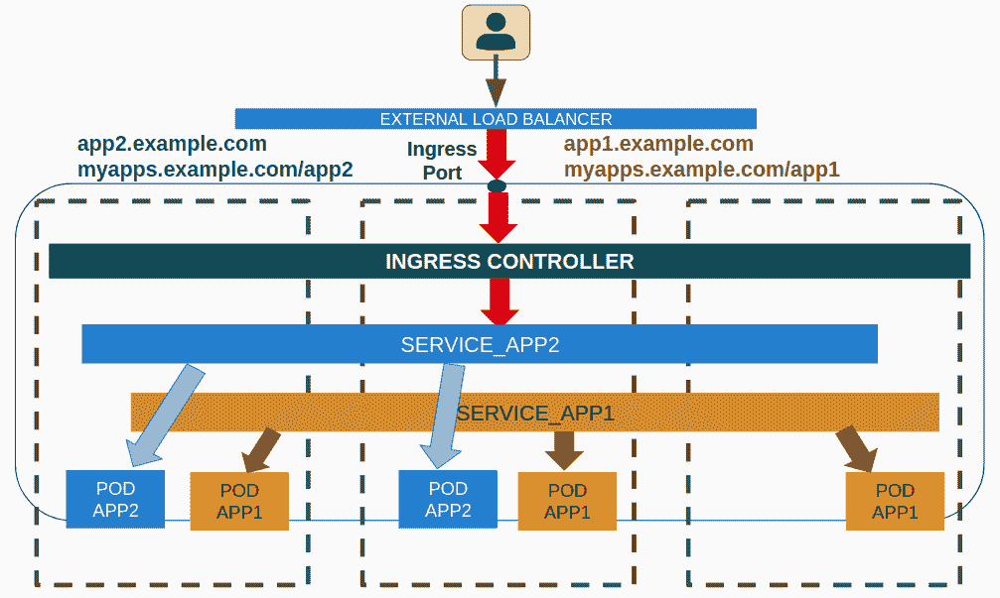
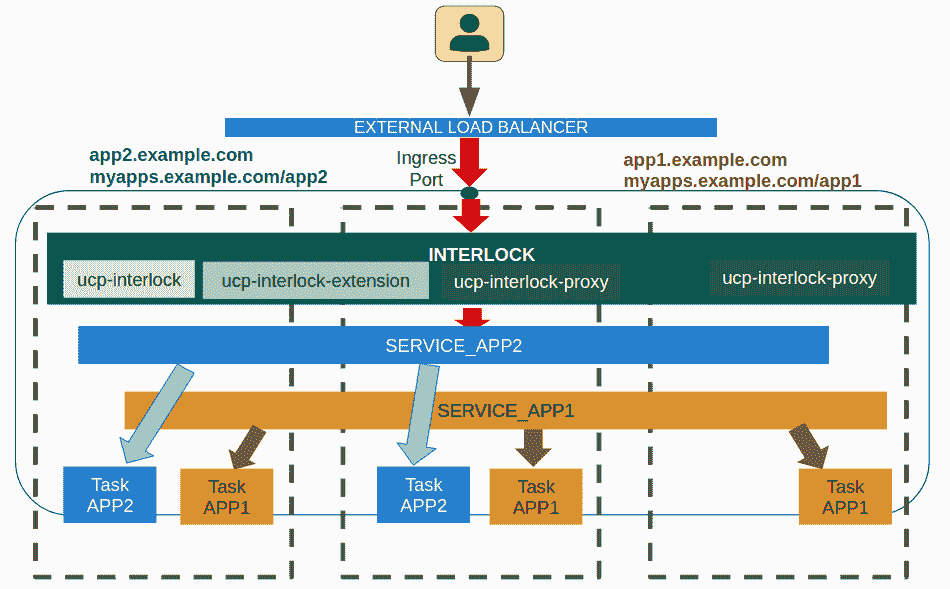
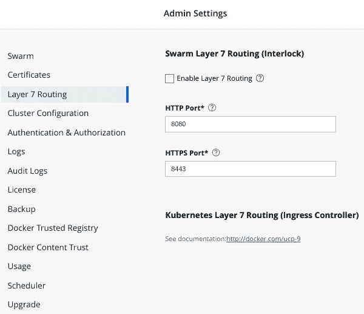

在 Docker 企业版中发布应用程序

前一章帮助我们理解了 Docker 企业版的控制平面组件。Docker UCP 在相同节点上部署 Docker Swarm 和 Kubernetes 集群。这两个编排器共享主机组件和设备。每个编排器将管理自己的硬件资源。可用内存和 CPU 等信息不会在编排器之间共享。因此，如果我们在同一主机上同时使用这两者时，必须小心。

那么，如何发布部署在它们上的应用程序呢？我们已经学习了如何在 Docker Swarm 和 Kubernetes 上发布应用程序，但在企业环境中工作必须是安全的。本章将学习如何在 Docker 企业环境中发布应用程序，使用的是 UCP 提供的工具或社区工具。

本章将向我们展示 UCP 为 Docker Swarm 和 Kubernetes 提供的主要发布资源和功能。这些组件将帮助我们只发布前端服务，从而确保应用程序的安全性。我们将了解 ingress 控制器，这是发布 Kubernetes 应用程序的首选解决方案，以及 Interlock，这是 UCP 提供的一个企业级解决方案，用于在 Docker Swarm 中发布应用程序。

本章将涵盖以下主题：

+   理解发布概念和组件

+   深入分析你的应用程序逻辑

+   Ingress 控制器

+   Interlock

+   章节实验

本章将从回顾与 Docker Swarm 和 Kubernetes 部署相关的一些概念开始。

# 技术要求

你可以在 GitHub 仓库中找到本章的代码：[`github.com/PacktPublishing/Docker-Certified-Associate-DCA-Exam-Guide.git`](https://github.com/PacktPublishing/Docker-Certified-Associate-DCA-Exam-Guide.git)

查看以下视频，观看代码演示：

"[`bit.ly/2EHobBy`](https://bit.ly/2EHobBy)"

# 理解发布概念和组件

第八章，*使用 Docker Swarm 进行编排*，向我们展示了当应用程序部署在 Docker Swarm 集群上时的工作原理。

我们将使用服务对象在 Docker Swarm 中部署应用程序。如果它们运行在同一网络中，服务之间的内部通信始终是允许的。因此，我们将把应用程序的组件部署在同一网络中，它们将与其他已发布的应用程序进行交互。如果两个应用程序必须相互作用，它们应该共享网络或被发布。

发布应用程序很简单；我们只需指定主机上应该监听的端口。然而，我们了解到 Docker Swarm 会在所有集群主机上发布应用程序的端口，而路由器网格（Router Mesh）会将内部流量路由到合适的服务任务。在回顾多服务应用程序之前，我们先回顾一下与容器和服务相关的这些主题。

我们有不同的选项来发布容器应用程序，正如我们在第四章中所学到的，*容器持久性与网络*。为了使进程能够从容器的隔离网络命名空间中可见，我们将使用不同的网络策略：

+   **桥接网络**：这是默认选项。容器的进程将通过主机的**网络地址转换**（**NAT**）功能进行暴露。因此，监听某个端口的容器进程将与主机的端口绑定。NAT 规则将应用于 Linux 或 Microsoft Windows 容器。这使我们能够使用不同主机的端口执行多个容器实例。

我们将使用`--publish`或`-p`选项（甚至使用`--publish-all`或`-P`发布所有镜像声明的暴露端口）来发布容器进程，同时指定可选的 Docker 主机 IP 地址和端口，以及发布的端口和协议（TCP/UDP）：`docker container run -p [HOST_IP:HOST_PORT:]<CONTAINER_PORT>[/PROTOCOL]`。默认情况下，将使用主机的所有 IP 地址和`32768`到`65000`范围内的随机端口。

+   **主机的网络命名空间**：在这种情况下，我们将使用主机的网络命名空间。进程将直接可用，监听主机的端口。容器与主机之间不会使用端口转换。由于进程端口是直接绑定的，因此每个主机只允许一个容器实例。我们将使用`docker container run --net=host`将新容器与主机的网络命名空间关联。

+   **MacVLAN**：这是一个特殊情况，容器将使用自己的命名空间，但它将在主机的网络级别可用。这使我们能够将 VLAN（虚拟局域网）直接附加到容器上，并使它们在实际网络中可见。容器将获得自己的 MAC 地址，因此服务将在网络中像节点一样可用。

这些是基本选项。我们将使用外部 DNS 来宣布如何访问这些服务。我们还可以在自定义桥接网络上部署容器。自定义网络具有自己的 DNS 命名空间，容器将在同一网络内通过其名称或别名互相访问。服务不会对同一网络中运行的其他服务进行发布。我们只会将它们发布到其他网络或供用户访问。在这些情况下，我们将使用 NAT（常见的桥接网络）、主机命名空间或 MacVLAN。

这些设置适用于独立主机，但如果我们将工作负载分布到整个集群中，情况将发生变化。现在我们将介绍 Kubernetes 网络模型。该模型必须涵盖以下情况：

+   运行在节点上的 Pods 应该能够与其他主机上运行的 Pods 进行通信，而无需使用 NAT。

+   系统组件（kubelet 和控制平面守护进程）应该能够与运行在主机上的 Pods 进行通信。

+   运行在节点主机网络中的 Pods 可以与其他主机上运行的所有 Pods 进行通信，而无需使用 NAT。

如我们所知，Pod 中的所有容器共享一个 IP 地址，且所有 Pod 都运行在一个扁平化网络中。Kubernetes 中没有网络分割，因此我们需要其他工具来进行隔离。我们将使用网络策略来实现类似防火墙或网络 ACL 的规则。这些规则同样适用于发布服务（入口流量）。

Docker 的网络模型基于**容器网络模型**（**CNM**）标准，而 Kubernetes 的网络模型则是使用**容器网络接口**（**CNI**）模型来实现的。

Docker 的 CNM 管理**互联网协议地址管理**（**IPAM**）和网络插件。IPAM 将用于管理地址池和容器的 IP 地址，而网络插件则负责管理每个 Docker 引擎上的网络。CNM 通过 Docker 引擎的`libnetwork`库来实现，尽管我们可以添加第三方插件来替代这个内置的 Docker 驱动程序。

另一方面，CNI 模式暴露了一个接口来管理容器的网络。CNI 将为 Pod 分配 IP 地址，尽管我们也可以添加外部 IPAM 接口，并使用 JSON 格式描述其行为。这些描述了当我们添加第三方插件时，任何 CNI 插件必须提供集群和独立网络的功能。如前所述，Docker 企业版的默认 CNI 插件是 Calico。它使用 IP 内嵌（IP in IP）封装提供集群网络和安全功能（尽管它也提供 VXLAN 模式）。

接下来我们继续。Docker 引擎提供了所有主机所需的网络功能，而 Kubernetes 也将使用 CNI 提供集群范围的网络。Docker Swarm 内置了使用 VXLAN 的集群级别网络功能。一个覆盖网络驱动程序通过主机的桥接网络接口在所有主机之间创建分布式网络。我们只需要初始化一个 Docker Swarm 集群，之后无需进行额外操作。将会创建一个入口覆盖网络和一个`docker_gwbridge`桥接网络。前者将管理与 Swarm 服务相关的控制和数据流量，而`docker_gwbridge`则用于在 Docker Swarm 覆盖网络中互连 Docker 主机。

我们通过加密覆盖网络提高了集群的安全性，但这也意味着我们会遇到一定的开销，并对性能造成轻微的负面影响。如在独立网络和容器共享网络中所展示的那样，所有连接到同一覆盖网络的服务将能够互相通信，即使我们没有发布任何端口。必须显式地使用`-p [ HOSTS_PORT:]<CONTAINER_PORT>[/PROTOCOL]`来发布应对外部服务网络可访问的端口。

发布服务端口的格式较长，虽然需要写更多内容，但它更清晰。我们将写作`-p published=<HOSTS_PORT>,target=<CONTAINER_PORT>,protocol=<PROTOCOL>`。

在 Docker Swarm 中发布服务将在集群中的所有主机上公开定义服务的端口。这个特性是**路由器网格**。所有主机将发布这个服务，即使它们实际上并不运行任何服务进程。Docker 将通过内部入口覆盖网络将流量引导到集群中的服务任务。

记住，所有服务都会获得一个虚拟 IP 地址。这个 IP 地址在服务的生命周期内是固定的。每个服务由与容器关联的任务组成。Docker 会运行尽可能多的任务，因此容器，以便这个服务可以工作。每个任务将只运行一个容器，具有其自己的 IP 地址。由于容器可以在集群中的任何地方运行，并且它们是临时的（在不同主机之间），它们将获得不同的 IP 地址。服务的 IP 地址是固定的，并将在 Docker Swarm 的内嵌 DNS 中创建 DNS 条目。因此，所有在覆盖网络内的服务都可以通过它们的名称（和别名）被访问和识别。

Kubernetes 中也有类似的方法。在这种情况下，服务只是一组 Pod。Pod 将获得不同的动态 IP 地址，因为弹性将管理它们的生命周期，如果它们死掉了，会创建新的。但是服务在其生命周期内始终有一个固定的 IP 地址。这对于 Docker Swarm 也是如此。因此，我们将发布服务，内部路由和负载均衡将引导流量到 Pod 或任务的容器。

这两个编排器都允许我们绕过这些默认行为，但我们不会深入探讨这些想法，因为我们已经在第八章，*使用 Docker Swarm 进行编排*，和第九章，*使用 Kubernetes 进行编排*中进行了覆盖。

现在我们对此有了基本的理解，我们可以介绍入口控制器。这些是一些软件组件，它们将允许我们在集群内发布较少的端口。它们将帮助我们通过默认访问控制来确保安全性，只发布较少的端口和特定的应用程序路由。入口控制器将提供反向代理和负载均衡功能，以帮助我们发布作为容器基础设施内服务运行的应用程序后端。我们将使用内部网络而不是发布应用程序的服务。我们只会发布入口控制器，所有应用程序的流量将从此端点变为内部流量。

入口控制器的概念可以应用于 Kubernetes 和 Docker Swarm。Kubernetes 有专门的资源来实现这一点，但 Docker Swarm 并没有已经准备好的内容。在这种情况下，我们将不得不使用外部应用程序。Docker Enterprise 确实为 Docker Swarm 服务提供了一个即用即走的解决方案。Interlock 集成了描述的入口控制器功能，但应用于 Docker Swarm 的行为。

在下一节中，我们将简要讨论应用程序逻辑以及容器平台上预期的行为。

# 理解应用程序的逻辑

我们已经回顾了如何为应用程序的组件进行发布，但它们都应该被发布吗？简短的回答可能是否定的。假设我们有一个三层应用程序。我们会有一个中间层作为某种后端，它会消耗一个数据库，并且应该通过前端来访问。在传统的数据中心中，这种分层应用程序可能会将每个服务运行在不同的节点上。这些节点会在不同的子网中运行，以通过防火墙隔离它们之间的访问。这种架构相当常见。后端组件位于中间层，处于数据库和前端之间。前端不应该直接访问数据库。实际上，数据库应该仅能从后端组件访问。那么，我们是否应该发布数据库组件服务？前端组件将访问后端，但我们是否必须发布后端组件？不，但前端应该能够访问后端服务。用户和其他应用程序将使用前端组件来消费我们的应用程序。因此，应该只发布前端组件。这通过使用容器的功能而不是防火墙和子网来保证安全性，但最终结果是一样的。

Docker Swarm 允许我们使用覆盖自定义网络来实现多网络应用程序。这些网络可以使我们将来自不同应用程序的组件互联，且共享某些网络。如果来自不同应用程序的许多服务需要访问一个服务，那么这可能会变得复杂。这种多对一的网络行为可能在你的环境中无法正常工作。为了避免这种复杂性，你有两个选择：

+   使用扁平网络，可以迁移到 Kubernetes 或定义大型覆盖子网。在这种情况下，第一个选项更好，因为 Kubernetes 提供了网络策略来增强扁平网络的安全性。而 Docker Swarm 中的大型网络则不会为其组件提供任何安全性。你需要使用外部工具来提高安全性。

+   发布这个常见的服务并允许其他应用程序像访问集群外部一样访问它。我们将使用 DNS 记录来为服务命名，其他应用程序将知道如何访问它。我们将使用负载均衡器和/或 API 管理器来提高可用性和安全性。这些外部组件超出了本书的范围，但它们将提供非容器化应用程序的行为。

现在我们了解了应用程序如何部署和发布，在介绍 Docker Enterprise 的 Interlock 之前，我们将先介绍 ingress 控制器及其组件的概念。

# 使用 ingress 控制器在 Kubernetes 中发布应用程序

如前所述，ingress 控制器是特殊的 Kubernetes 组件，部署后用于发布应用程序和服务。

入口资源将定义暴露 HTTP 和 HTTPS 部署服务所需的规则和路由。

入口控制器将作为反向代理完成这个过程，增加负载均衡功能。这些功能可以通过外部边缘路由器或集群内部部署的软件代理来配置。任何这些都将使用动态配置来管理流量，动态配置是基于入口资源规则构建的。

我们还可以使用入口控制器为 TCP 和 UDP 原始服务提供发布。这将取决于已部署的哪个入口反向代理。通常，发布一个应用的服务时，使用的是 HTTP 和 HTTPS 以外的协议。在这种情况下，我们可以使用 Docker Swarm 上的 Router Mesh 或 Kubernetes 上的 NodePort/LoadBalancer。

一个入口资源可能看起来像下面的 YAML 文件：

```
apiVersion: networking.k8s.io/v1beta1
kind: Ingress
metadata:
  name: test-ingress
  annotations:
    nginx.ingress.kubernetes.io/rewrite-target: /
spec:
  rules:
  - http:
      paths:
      - path: /testpath
        pathType: Prefix
        backend:
          serviceName: test
          servicePort: 80
```

入口规则包含一个可选的 host 键，用于将此资源与传入流量的代理主机头关联。所有后续规则将应用于此主机。

它还将包含一组路径列表，每个路径与不同的服务相关联，定义为代理后的后端。所有匹配主机和路径键的请求将被重定向到列出的后端。部署的服务和端口将为每个应用定义后端。

我们将定义一个默认的后端，用于路由任何不匹配入口资源规则的请求。

如前所述，入口控制器将部署不同代理服务上的入口规则。我们将使用现有的外部硬件或软件负载均衡器，或者将这些组件部署在集群内。由于这些组件是可互换的，不同的部署将提供不同的行为，尽管入口资源配置将是相似的。这些部署应该被发布，但后端服务不需要直接外部访问。入口控制器组件将管理访问服务所需的路由和规则。

入口控制器将使用本章描述的任何方法发布，尽管我们通常会使用 NodePort 类型和 LoadBalancer 类型的服务。

我们可以在任何 Kubernetes 集群上部署多个入口控制器。这一点非常重要，因为我们可以通过为每个客户使用特定的入口控制器，改善多租户环境中的隔离性。

我们描述了一种适用于 Kubernetes 的第 7 层路由架构。下图展示了一个入口控制器部署的示例。外部负载均衡器将用户的请求路由到入口控制器。该组件将审查入口资源表并将流量路由到适当的内部服务的 ClusterIP。然后，Kubernetes 将管理内部服务与 Pod 之间的通信，确保用户的请求能够到达服务关联的 Pod：



在接下来的部分，我们将学习 Docker Enterprise 如何为 Docker Swarm 服务部署此发布逻辑。

# 使用 Interlock 发布在 Docker Swarm 中部署的应用

Interlock 基于之前描述的入口控制器的逻辑。Docker Swarm 架构不同，当我们谈到 Kubernetes 和 Docker Swarm 的网络实现时，它们的差异更加明显。Kubernetes 提供了一个扁平化的网络架构，正如我们所看到的那样。集群中的多个网络将增加额外的安全功能，但也会带来更多的复杂性。

Interlock 替代了以前 Docker Enterprise 的路由网格 L7 路由实现。路由网格在以前的 UCP 版本中可用。Interlock 出现在 Docker Enterprise 的 2.0 版本中。

Interlock 将集成 Docker Swarm 和 Docker Remote API 功能，以使用扩展动态地隔离和配置应用代理（如 NGINX 或 HA-Proxy）。Interlock 将利用 Docker Swarm 的著名对象，如配置和机密，来管理代理所需的配置。我们将能够管理 TLS 隧道，并集成滚动更新（和回滚）以及零停机时间的重新配置。

Interlock 的逻辑分布在三个主要服务中：

+   **Interlock 服务** 是主进程。它将与 Docker Remote API 交互，以监控 Docker Swarm 事件。此服务将创建代理路由请求到应用程序端点所需的所有配置，包括头部、路由和后端。它还将管理扩展和代理服务。Interlock 服务将通过其 gRPC API 被使用。其他 Interlock 服务和扩展将通过访问 Interlock 的 API 来获取它们准备好的配置。

+   **Interlock-extension** 服务将查询 Interlock 的 API 以获取上游创建的配置。扩展将使用此预配置来准备与扩展相关联的代理的真实配置。对于部署在集群中的代理服务，如 NGINX 或 HA-Proxy，Interlock-extension 服务将创建其配置，然后通过 API 将这些配置发送给 Interlock 服务。接着，Interlock 服务将在 Docker Swarm 集群中为部署的代理服务创建一个配置对象。

+   **Interlock-proxy** 是代理服务。它将使用存储在配置对象中的配置来路由和管理 HTTP 和 HTTPS 请求。

Docker Enterprise 将 NGINX 部署为 Interlock-proxy。影响已发布服务的 Docker Swarm 集群变更将动态更新。

Interlock 允许 DevOps 团队实现 **蓝绿部署** 和 **金丝雀部署** 服务部署。这些部署方式将帮助 DevOps 在不影响用户访问的情况下进行应用程序升级。

下图展示了一个基本的 Interlock 架构。如前所述，Interlock 看起来像一个入口控制器。以下架构表示常见应用程序的流量。用户请求将由外部负载均衡器转发到 Interlock 代理实例。该组件将检查其规则，并将请求转发到配置的服务 IP 地址。然后，Docker Swarm 将使用内部路由和负载均衡将请求转发到服务的任务：



Interlock 的第 7 层路由支持以下功能：

+   由于 Interlock 服务作为 Docker Swarm 服务运行，因此提供基于弹性的高可用性。

+   Interlock 与 Docker API 交互，因此提供动态和自动配置。

+   自动配置：Interlock 使用 Docker API 进行配置。你不需要手动更新或重启任何服务即可使服务可用。UCP 会监控你的服务并自动重新配置代理服务。

+   我们可以对代理服务进行上下扩展，因为它作为一个独立的组件进行部署。

+   Interlock 提供 TLS 隧道服务，可以用于 TLS 终止或 TCP 透传。证书将通过 Docker Swarm 的机密对象进行存储。

+   Interlock 支持根据上下文或路径进行请求路由。

+   我们可以同时部署多个扩展和代理配置，以便在多租户或多区域环境中隔离访问。

Interlock-proxy 和 Interlock-extension 服务的实例运行在工作节点上。这将提高安全性，将控制平面与发布服务隔离开来。

我们可以使用主机模式网络来绕过默认的路由网格服务行为，以优化 Interlock-proxy 服务的网络性能。

使用 Interlock 发布服务是基于标签自定义的。我们至少需要以下内容：

+   `com.docker.lb.hosts`：此标签将管理主机头，因此也会管理服务的发布名称。

+   `com.docker.lb.port`：内部服务的端口也是必需的，并且通过此标签进行关联。记住，该端口不应被公开。

+   `com.docker.lb.network`：此标签定义了 Interlock-proxy 服务应连接到哪个网络，以便能够与定义的服务进行通信。

其他标签将允许我们修改已配置的代理行为和功能。以下是一些其他重要标签的列表：

| **标签** | **描述** |
| --- | --- |
| `com.docker.lb.ssl_cert` 和 `com.docker.lb.ssl_key` | 这些密钥允许我们集成后端的证书和密钥。 |
| `com.docker.lb.sticky_session_cookie` | 我们将设置一个 cookie，以允许粘性会话定义服务实例的后端。 |
| `com.docker.lb.backend_mode` | 这规定了请求如何到达不同的后端（默认为 `vip`，这是 Docker Swarm 服务的默认模式）。 |
| `com.docker.lb.ssl_passthrough` | 我们可以关闭应用后端的隧道，从而启用 SSL 透传。 |
| `com.docker.lb.redirects` | 这个键允许我们通过主机头定义将请求重定向到不同的 FQDN。 |

你可以查看 Docker Enterprise 文档中所有可用的标签([`docs.docker.com/ee/ucp/interlock/usage/labels-reference`](https://docs.docker.com/ee/ucp/interlock/usage/labels-reference))。

如果服务仅隔离在一个网络中，我们不需要添加 `com.docker.lb.network`，但如果它与 `com.docker.lb.ssl_passthrough` 配合使用，则需要。如果我们使用堆栈发布服务，我们将使用堆栈的名称。

对于 Interlock 所描述的组件，有许多可用的选项和配置。我们将能够更改代理的默认端口、Docker API 套接字和轮询间隔等。扩展功能将有许多特性和配置，具体取决于外部负载均衡集成。我们建议你查看 Docker Enterprise 文档中所有可用的键和配置([`docs.docker.com/ee/ucp/interlock/config`](https://docs.docker.com/ee/ucp/interlock/config))。

我们建议查看这个链接，[`success.docker.com/article/how-to-troubleshoot-layer-7-loadbalancing`](https://success.docker.com/article/how-to-troubleshoot-layer-7-loadbalancing)，以获取有关排查 Interlock 相关问题的一些有趣的技巧。

在下一章中，我们将介绍 Docker Trusted Registry。这个工具提供了一个安全的镜像存储，集成了镜像签名功能和漏洞扫描功能。这些功能，等等，提供了一个生产就绪的镜像存储解决方案。

# 回顾 Interlock 的使用

现在，我们将回顾一些 Interlock 使用的示例。

我们需要在 Docker Enterprise 中启用 Interlock。它默认是禁用的，并且是管理员设置部分的一部分。我们可以更改默认端口（HTTP 的 `8080` 和使用 HTTPS 的安全访问端口 `8443`），如下所示的截图：



启用后，Interlock 的服务会被创建，我们可以通过使用管理员的 UCP 包并执行 `docker service ls` 来验证：

```
$ docker service ls --filter name=ucp-interlock
ID NAME MODE REPLICAS IMAGE PORTS
onf2z2i5ttng ucp-interlock replicated 1/1 docker/ucp-interlock:3.2.5 
nuq8eagch4in ucp-interlock-extension replicated 1/1 docker/ucp-interlock-extension:3.2.5 
x2554tcxb7kw ucp-interlock-proxy replicated 2/2 docker/ucp-interlock-proxy:3.2.5 *:8080->80/tcp, *:8443->443/tcp
```

重要的是要注意，默认情况下，如果没有足够的节点来运行所需数量的实例，Interlock-proxy 将不会在工作节点上隔离。我们可以通过使用简单的位置约束来改变这一行为（[`docs.docker.com/ee/ucp/interlock/deploy/production`](https://docs.docker.com/ee/ucp/interlock/deploy/production)）。

在这个示例中，我们将再次使用 `colors` 应用程序。我们在第五章，*部署多容器应用程序*中使用了这个简单的应用程序。这是一个简单的 `docker-compose` 文件，用于部署 `colors` 服务。我们将使用一个随机颜色，并将 `COLORS` 变量留空。我们将创建一个名为 `colors-stack.yml` 的文件，内容如下：

```
version: "3.2"

services:
 colors:
 image: codegazers/colors:1.16
 deploy:
 replicas: 3
      labels:
        com.docker.lb.hosts: colors.lab.local
        com.docker.lb.network: colors-network
        com.docker.lb.port: 3000
    networks:
      - colors-network

networks:
  colors-network:
    driver: overlay
```

我们将使用有效的用户及其捆绑包连接到 Docker Enterprise。对于本实验，我们将使用在安装过程中创建的`admin`用户。我们将按照第十一章中描述的任何流程下载该用户的`ucp`捆绑包，*Universal Control Plane*。下载并解压后，我们只需使用`source env.sh`加载 UCP 环境：

```
$ source env.sh 
Cluster "ucp_<UCP_FQDN>:6443_admin" set.
User "ucp_<UCP_FQDN>:6443_admin" set.
Context "ucp_<UCP_FQDN>:6443_admin" modified.
```

加载完 UCP 环境后，我们将使用本书的 Git 仓库（[`github.com/frjaraur/dca-book-code.git`](https://github.com/frjaraur/dca-book-code.git)）。Interlock 的实验位于`interlock-lab`目录下。我们将使用`docker stack deploy -c colors-stack.yml lab`部署`colors`堆栈：

```
interlock-lab$ docker stack deploy -c colors-stack.yml lab
Creating network lab_colors-network
Creating service lab_colors
```

我们将使用`docker stack ps`查看`colors`实例在集群中的分布情况：

```
$ docker stack ps lab
ID NAME IMAGE NODE DESIRED STATE CURRENT STATE ERROR PORTS
ksoie4oin10e lab_colors.1 codegazers/colors:1.16 node4 Running Running 8 seconds ago 
b0dykjgp8ack lab_colors.2 codegazers/colors:1.16 node2 Running Preparing 9 seconds ago 
m13tvfbw5cgb lab_colors.3 codegazers/colors:1.16 node3 Running Preparing 9 seconds ago 
```

我们在 UCP 的管理员设置部分启用了 Interlock。我们使用了默认端口，因此应该可以在`8080`端口访问我们部署的服务（因为我们在本实验中使用的是 HTTP）。请注意，我们没有在`docker-compose`文件中使用任何`port`键，也没有发布任何服务的端口。让我们通过指定所需的主机头`colors.lab.local`来检查 Interlock 是否正常工作：

```
$ curl -H "host: colors.lab.local" http://<UCP_NODE>:8080/text
APP_VERSION: 1.15
COLOR: black
CONTAINER_NAME: e69a7ca3b74f
CONTAINER_IP: 10.0.5.15 172.18.0.4
CLIENT_IP: 10.0.0.2
CONTAINER_ARCH: linux
$ curl -H "host: colors.lab.local" http://<UCP_NODE>:8080/text
APP_VERSION: 1.15
COLOR: yellow
CONTAINER_NAME: 69ebb6f349f6
CONTAINER_IP: 10.0.5.14 172.18.0.3
CLIENT_IP: 10.0.0.2
CONTAINER_ARCH: linux
```

输出可能会有所不同，我们将发起一些请求，确保得到不同的后端（我们部署了三个实例）。如果没有指定任何主机头，将使用默认值。如果没有配置（默认行为），我们将得到一个代理错误。由于我们使用的是 NGINX（默认），我们将得到一个`503`错误：

```
$ curl -I http://<UCP_NODE>:8080/text
HTTP/1.1 503 Service Temporarily Unavailable
Server: nginx/1.14.2
Date: Tue, 31 Mar 2020 19:51:05 GMT
Content-Type: text/html
Content-Length: 537
Connection: keep-alive
ETag: "5cad421a-219"
```

我们可以使用特殊标签`com.docker.lb.default_backend: "true"`来更改默认的 Interlock 后端，并将其与我们的某个服务关联。当请求的头信息与任何已配置的服务不匹配时，这将作为默认站点。

在继续之前，让我们先移除这个实验。我们将使用`docker stack rm`。由于堆栈现在需要小心移除，我们可能会遇到一个错误：

```
$ docker stack rm lab
Removing service lab_colors
Removing network lab_colors-network
Failed to remove network 97bgcu0eo445sz8ke10bacbge: Error response from daemon: Error response from daemon: rpc error: code = FailedPrecondition desc = network 97bgcu0eo445sz8ke10bacbge is in use by service x2554tcxb7kwv0wzsasvfjh6dFailed to remove some resources from stack: lab
```

这个错误是正常的。Interlock-proxy 组件已连接到我们的应用网络，因此无法移除。Interlock 会每隔几秒刷新一次配置（Docker API 会每 3 秒轮询一次，经过这些间隔后，Interlock 将管理所需的更改）。如果我们等待几秒钟并再次执行移除命令，它将删除堆栈剩余的组件（网络）：

```
$ docker stack rm lab
Removing network lab_colors-network
```

现在我们将使用`com.docker.lb.redirects`键测试一个简单的重定向。

## 简单的应用重定向

在这个例子中，我们将查看如何将请求从一个服务重定向到另一个服务。当我们希望将用户从旧应用程序迁移到新版本时，这可能非常有用。这里我们讨论的不是镜像升级，而是简单地使用`docker network create`创建一个新的覆盖网络：

```
$ docker network create -d overlay redirect
```

我们现在将创建一个简单的 Web 服务器应用程序服务（最小的 NGINX 镜像，`nginx:alpine`）。请注意，我们将在`com.docker.lb.hosts`标签中添加主机头。我们还添加了`com.docker.lb.redirects`，以确保所有发送到`http://old.lab.local`的请求将被重定向到`http://new.lab.local`。服务定义如下所示：

```
$ docker service create --name redirect --network redirect \
--label com.docker.lb.hosts=old.lab.local,new.lab.local \
--label com.docker.lb.port=80 \
--label com.docker.lb.redirects=http://old.lab.local,http://new.lab.local nginx:alpine
```

如果我们测试对其中一个 UCP 节点的访问，端口为`8080`，并使用`old.lab.local`作为主机头，系统会将我们重定向到`http://new.lab.local`。我们在`curl`命令中添加了`-L`选项，以允许所需的重定向：

```
$ curl -vL http://<UCP_NODE>:8080/ -H Host:old.lab.local
* Trying <UCP_NODE>...
* TCP_NODELAY set
* Connected to <UCP_NODE> (<UCP_NODE>) port 8080 (#0)
> GET / HTTP/1.1
> Host:old.lab.local
> User-Agent: curl/7.58.0
> Accept: */*
> 
< HTTP/1.1 302 Moved Temporarily
< Server: nginx/1.14.2
< Date: Tue, 31 Mar 2020 22:21:26 GMT
< Content-Type: text/html
< Content-Length: 161
< Connection: keep-alive
< Location: http://new.lab.local/
< x-request-id: d4a9735f8880cfdc99e0478b7ea7d583
< x-proxy-id: 1bfde5e3a23e
< x-server-info: interlock/v3.0.0 (27b903b2) linux/amd64
< 
* Ignoring the response-body
* Connection #0 to host <UCP_NODE> left intact
* Issue another request to this URL: 'http://new.lab.local/'
* Could not resolve host: new.lab.local
* Closing connection 1
curl: (6) Could not resolve host: new.lab.local
```

请注意，`new.lab.local`是一个虚拟的 FQDN，因此我们无法解析它，但测试请求已转发到这个新的应用程序站点。

我们现在将部署一个使用 TLS 证书保护的示例服务。Interlock 将管理其证书，并确保访问是安全的。

## 使用 TLS 通过 Interlock 安全发布服务

在本示例中，我们将部署一个应该使用 TLS 安全发布的服务。我们可以直接为用户创建通道到我们的服务，将 Interlock 配置为透明代理，或者允许 Interlock 管理通道。在这种情况下，服务可以通过 HTTP 部署，但从用户的角度来看，HTTPS 将是必需的。用户将首先与 Interlock-proxy 组件交互，然后才能访问定义的服务后端。

在本示例中，我们将再次使用`colors`应用程序，配以随机配置。我们将使用`colors-stack-https.yml`文件，内容如下：

```
version: "3.2"

services:
  colors:
    image: codegazers/colors:1.16
    deploy:
      replicas: 1
      labels:
        com.docker.lb.hosts: colors.lab.local
        com.docker.lb.network: colors-network
        com.docker.lb.port: 3000
        com.docker.lb.ssl_cert: colors_colors.lab.local.cert
        com.docker.lb.ssl_key: colors_colors.lab.local.key
    networks:
     - colors-network

networks:
  colors-network:
    driver: overlay
secrets:
  colors.lab.local.cert:
    file: ./colors-lab-local.cert
  colors.lab.local.key:
    file: ./colors-lab-local.key
```

我们将创建一个示例密钥和一个关联的证书，这些将自动集成到 Interlock 的配置中。

始终建议使用 Docker 服务日志查看 Interlock 组件的日志；例如，我们可以使用`docker service logs ucp-interlock`检测配置错误。

我们将使用`openssl`创建一个有效期为 365 天的证书：

```
$ openssl req \
 -new \
 -newkey rsa:4096 \
 -days 365 \
 -nodes \
 -x509 \
 -subj "/C=US/ST=CA/L=SF/O=colors/CN=colors.lab.local" \
 -keyout colors.lab.local.key \
 -out colors.lab.local.cert
```

一旦这些密钥和证书创建完成，我们将再次使用`admin`用户连接到 Docker Enterprise。尽管管理员环境可能已经加载（如果你按顺序跟随这些实验），我们仍将使用`source env.sh`加载`ucp`环境：

```
$ source env.sh 
Cluster "ucp_<UCP_FQDN>:6443_admin" set.
User "ucp_<UCP_FQDN>:6443_admin" set.
Context "ucp_<UCP_FQDN>:6443_admin" modified.
```

一旦 UCP 环境加载完成，我们将使用本书的示例`colors-stack-ssl.yaml`文件。我们将通过`docker stack deploy -c colors-stack-https.yml lab`部署带有 HTTPS 的`colors`堆栈。该目录还包含了准备好的证书和密钥：

```
interlock-lab$ $ docker stack deploy -c colors-stack-https.yml colors
Creating network colors_colors-network
Creating secret colors_colors.lab.local.cert
Creating secret colors_colors.lab.local.key
Creating service colors_colors
```

我们将通过`docker stack ps`查看`colors`实例在集群中的分布情况：

```
$ docker stack ps colors
ID NAME IMAGE NODE DESIRED STATE CURRENT STATE ERROR PORTS
xexbvl18d454 colors_colors.1 codegazers/colors:1.16 node4 Running Running 4 minutes ago 
```

我们在 UCP 的管理员设置部分启用了 Interlock。我们使用了默认端口，因此我们应通过`8443`端口访问我们部署的服务（因为我们使用的是 HTTPS）。请注意，我们在`docker-compose`文件中没有使用任何`port`键。我们没有发布任何服务的端口。

我们可以通过读取相关的 `com.docker.interlock.proxy.<ID>` 配置对象来查看 Interlock 的代理配置。我们可以使用 `docker config inspect` 并过滤其输出。首先，我们将获取当前的 `ucp-interlock-proxy` 配置对象：

```
$ export CFG=$(docker service inspect --format '{{(index .Spec.TaskTemplate.ContainerSpec.Configs 0).ConfigName}}' ucp-interlock-proxy)
```

然后，我们将检查这个对象：

```
$ docker config inspect --pretty ${CFG}
```

检查 Interlock 代理配置在排查 Interlock 问题时非常有用。尽量一次检查一个服务或堆栈。这样可以避免配置混合，帮助我们追踪错误配置问题。

# 总结

本章介绍了 Docker Enterprise 的发布功能。我们学习了 Docker Swarm 和 Kubernetes 的不同发布策略，以及如何将这些工具集成到 Docker Enterprise 中。

我们已经看到这些方法如何通过隔离不同层次并允许我们仅发布前端和必要的服务来提高应用程序的安全性。

下一章将教我们 Docker Enterprise 如何实现一个完全安全、适用于生产的镜像存储解决方案。

# 问题

1.  使用 Interlock 发布服务需要哪些标签？

a) `com.docker.lb.backend_mode`

b) `com.docker.lb.port`

c) `com.docker.lb.hosts`

d) `com.docker.lb.network`

1.  以下哪一项不是 Interlock 过程的一部分？

a) `ucp-interlock`

b) `ucp-interlock-controller`

c) `ucp-interlock-extension`

d) `ucp-interlock-proxy`

1.  Interlock 进程在 Docker 企业节点中运行的位置是哪里？

a) `ucp-interlock` 在 Docker Swarm 的领导者节点上运行。

b) `ucp-interlock-extension` 在任何管理节点上运行。

c) `ucp-interlock-proxy` 仅在工作节点上运行。

d) 以上答案均不正确。

1.  Interlock 支持哪些功能？

a) SSL/TLS 端点管理

b) 透明代理或 SSL/TLS 透传

c) 使用 Docker API 进行动态配置

d) TCP/UDP 发布

1.  以下关于在容器编排环境中发布应用程序的哪些陈述是正确的？

a) Ingress 控制器和 Interlock 采用相同的逻辑，通过反向代理服务发布应用程序。

b) Ingress 控制器通过仅暴露必要的服务，帮助我们安全地发布应用程序。

c) Interlock 需要访问应用程序的前端服务网络。

d) 这些前提条件都不正确。

# 进一步阅读

有关本章所涉及主题的更多信息，请参考以下链接：

+   Docker Interlock 文档：[`docs.docker.com/ee/ucp/interlock/`](https://docs.docker.com/ee/ucp/interlock/)

+   Swarm 的通用控制平面服务发现与负载均衡：[`success.docker.com/article/ucp-service-discovery-swarm`](https://success.docker.com/article/ucp-service-discovery-swarm)

+   Kubernetes 的通用控制平面服务发现与负载均衡：[`success.docker.com/article/ucp-service-discovery-k8s`](https://success.docker.com/article/ucp-service-discovery-k8s)
