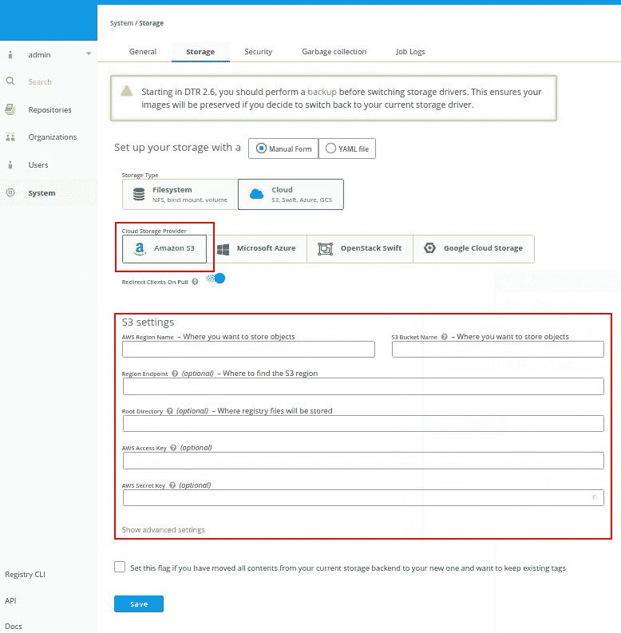
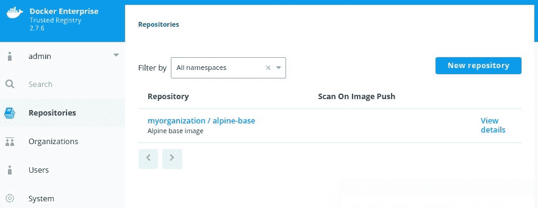
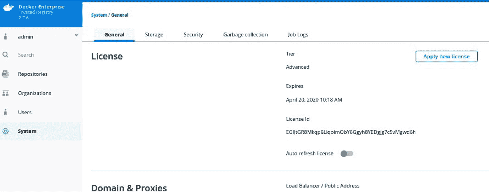
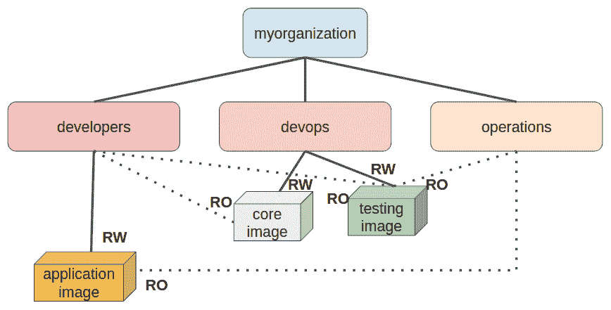
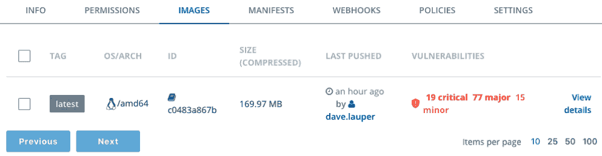
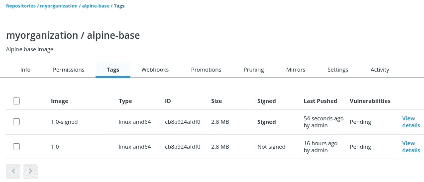
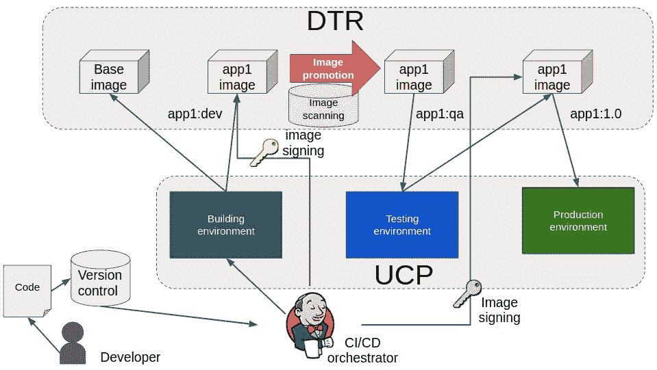
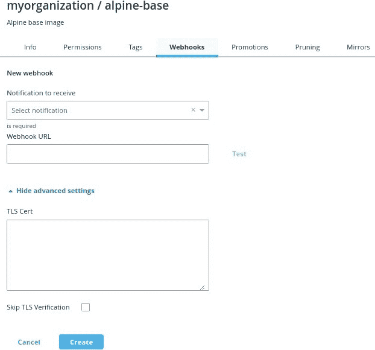
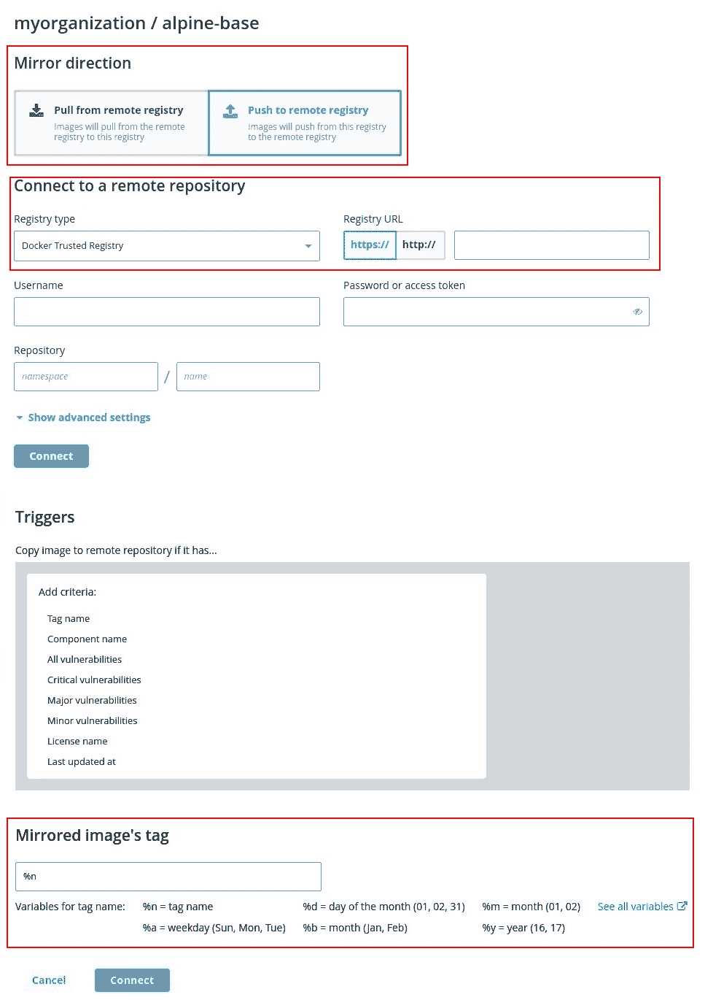
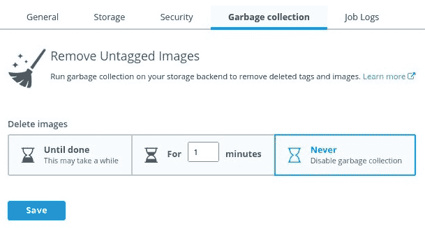

使用 DTR 实现企业级注册表

Docker 企业版是一个完整的 **容器即服务** (**CaaS**) 平台。在前面的章节中，我们学习了 **通用控制平面** (**UCP**) 如何为 Docker Swarm 和 Kubernetes 编排器提供完整的控制平面解决方案。我们还学习了 UCP 如何通过 Interlock 提供发布功能。一个面向企业的完整平台还应该涵盖镜像的存储。在本章中，我们将学习 **Docker 可信注册表** (**DTR**)，这是 Docker 企业平台的一个组件，旨在管理和确保 Docker 镜像的安全性。

在本章中，我们将了解 DTR 组件以及如何在其组件方面部署和管理一个安全的高可用性注册表。我们还将学习 DTR 如何通过 **基于角色的访问控制** (**RBAC**)、镜像扫描和其他安全特性提供企业解决方案。最后的内容将展示如何将 DTR 自动化和推广功能集成到我们的 CI/CD 工作流中，并提供确保 DTR 健康的策略。通过这系列关于 Docker 企业版的章节，你将对这个平台有深入的了解。

本章将涵盖以下主题：

+   理解 DTR 组件和特性

+   部署具有高可用性的 DTR

+   学习 RBAC（基于角色的访问控制）

+   镜像扫描和安全特性

+   集成和自动化镜像工作流

+   备份策略

+   更新、健康检查和故障排除

# 技术要求

你可以在 GitHub 仓库中找到本章的代码：[`github.com/PacktPublishing/Docker-Certified-Associate-DCA-Exam-Guide.git`](https://github.com/PacktPublishing/Docker-Certified-Associate-DCA-Exam-Guide.git)

查看以下视频以查看代码示例：

"[`bit.ly/32tg6sn`](https://bit.ly/32tg6sn)"

# 理解 DTR 组件和特性

DTR 是 Docker 企业版的容器平台注册表，用于存储和管理镜像。它部署在定义好的 UCP 工作节点之上。DTR 将作为一个多容器应用程序运行。这意味着所有容器将一起运行，并且仅与一个定义的节点相关联。在节点出现故障时，不会有其他节点接管其 DTR 容器。这一点非常重要，因为我们需要在不同的节点上部署多个 DTR 实例。

DTR 使用 RethinkDB 作为数据库，用于存储和同步注册表节点之间的数据。为了确保 DTR 的高可用性，我们需要部署奇数个副本。我们将使用三个副本，因此需要在三个工作节点上部署 DTR 工作负载。同步将使用覆盖网络进行。DTR 安装将创建一个 `dtr-ol` 覆盖网络，并将用于副本同步。

每个副本将部署以下进程：

| **副本（DTR 实例）**  | **进程** |
| --- | --- |
| `dtr-api-<replica_id>` | 该进程内部暴露 DTR 的 API。 |
| `dtr-garant-<replica_id>` | DTR 的身份验证通过此组件管理。 |
| `dtr-jobrunner-<replica_id>` | `jobrunner`用于调度 DTR 的不同内部维护任务。 |
| `dtr-nginx-<replica_id>` | `nginx`进程充当反向代理，将 DTR 的 API 和 Web UI 发布在`80`端口和`443`（安全端口）上。 |
| `dtr-notary-server-<replica_id>` 和 `dtr-notary-signer-<replica_id>` | 这些进程帮助我们签署和维护用户的签名。 |
| `dtr-registry-<replica_id>` | 一个基于社区的注册表将作为 DTR 的核心组件安装。 |
| `dtr-rethinkdb-<replica_id>` | RethinkDB 是用来存储 DTR 仓库信息的数据库。 |
| `dtr-scanningstore-<replica_id>` | 此组件管理并存储扫描数据。 |

请注意，所有进程都会有一个共同的后缀，以便识别集群中每个副本。我们将部署不同的副本，但它们的数据会同步。

公证服务器进程还会在任何用户通过启用了内容信任的客户端推送或拉取镜像时接收请求。公证签名者将执行服务器端的时间戳和镜像签名快照。

卷将用于持久化 DTR 数据。每个运行 DTR 副本的节点将管理自己的卷。如果 DTR 检测到它们的存在，它们将被使用。这可以防止销毁之前的安装（我们必须使用先前的`replica_id`标识）：

| **副本（DTR 实例）** | **进程** |
| --- | --- |
| `dtr-ca-<replica_id>` | 此卷管理颁发 DTR CA 所需的密钥和根信息。 |
| `dtr-notary-<replica_id>` | 此卷存储公证密钥和证书。 |
| `dtr-postgres-<replica_id>` | 此卷用于镜像的漏洞扫描。 |
| `dtr-registry-<replica_id>` 和 `dtr-nfs-registry-<replica_id>` | 注册表的数据存储在此卷中。这是默认选项，但我们可以集成第三方存储。实际上，共享存储将是提供 DTR 进程高可用性的必要条件。如果存储后端是 NFS，则将使用`dtr-nfs-registry-<replica_id>`。 |
| `dtr-rethink-<replica_id>` | 此卷存储仓库信息。 |

DTR 的数据存储非常重要，因为这里是镜像存放的地方。请注意镜像的层，因为 DTR 的备份不会备份它们的数据和元信息。你必须部署自己的备份，以便能够恢复镜像数据。

DTR 可以部署在本地或云中。我们可以使用 Amazon、Google 或 Microsoft Azure。它支持以下存储后端：

+   NFS

+   Amazon S3

+   Cleversafe

+   Google Cloud Storage

+   OpenStack Swift

+   Microsoft Azure

我们可以使用任何与 S3 对象存储兼容的解决方案（例如 Minio）。对象存储非常适合存储镜像的数据，尤其是当我们有包含大量内容的大镜像层时。

DTR 提供了多站点环境下的镜像缓存功能，在这种环境下，用户与注册表之间的通信延迟可能成为问题。镜像缓存将确保用户从最近的注册表节点获取所需的镜像。

与 UCP 一样，DTR 提供了基于角色的访问控制（RBAC）。这两个应用可以集成在一起，实现单点登录解决方案，但 RBAC 是独立的。DTR 将身份验证转发给 UCP，UCP 会验证用户的身份，但每个应用会管理不同的角色和配置文件。通过这种方式，UCP 的高级用户可以对 DTR 中的镜像进行有限的访问。

DTR 的安全性基于镜像安全扫描和 Docker 内容信任。镜像安全扫描将通过二进制文件和库的**物料清单**（**BOMs**）来查找镜像内容中的漏洞。**常见漏洞与暴露**（**CVE**）数据库用于查找我们镜像中已知的问题。

BOM 是镜像中所有文件的详细清单。CVE 数据库是一个公开的数据库，列出了世界各地文件中已知的漏洞。它是由社区驱动的，许多贡献者在报告和寻找应用程序代码中的漏洞。

DTR 还包括镜像促销和任务调度。这些功能允许我们监控镜像标签和安全性，以触发与外部工具或 DTR 集成工具的不同修改或交互。

仓库镜像和缓存将帮助我们将 DTR 集成到企业环境中。

我们将在下一节学习如何部署具有高可用性的 DTR。

# 部署具有高可用性的 DTR

部署具有高可用性的 DTR 需要执行所有 DTR 组件的多个副本。我们将部署奇数个副本以确保高可用性。

DTR 应部署在专用工作节点上。这将确保非系统进程不会影响 DTR 的行为，反之亦然。DTR 在扫描和其他过程中的进程可能会占用大量 CPU。因此，我们将使用三个专用工作节点。我们通常允许工作节点使用 DHCP，但我们将要求 DTR 的工作节点使用固定 IP 地址。我们还需要固定的主机名。

我们可以将 Docker Enterprise 平台部署在本地或云端。第十一章，*通用控制平面* 中简要描述了 DTR 的要求。

要在专用工作节点上部署 DTR，这些节点至少需要满足以下要求：

+   16 GB 内存

+   2 个 vCPU（虚拟 CPU）

对于生产环境，我们将要求使用更大配置的节点，提供更多的资源：

+   32 GB 内存

+   4 个 vCPU

由于镜像扫描功能，硬件资源的增加是必需的。这将消耗大量的 CPU 和内存资源，因为它需要加载所有镜像的内容并创建所有二进制文件和库的 `md5-checksum-hashes`，以便将这些值与 CVE 数据库进行对比。

默认情况下，镜像的数据将下载到 `dtr-registry-<REPLICA_ID>` 卷中。例如，如果您部署了一个独立的副本进行测试，请确保您有足够的空间来存储镜像。最低要求为 25 GB，但如果您计划管理 Microsoft Windows 镜像，建议至少拥有 500 GB 的空间。 |

在编写本书时，最新的 DTR 版本是 2.7.6。我们将首先安装一个 DTR 副本。安装第一个副本后，我们将加入另外两个副本。我们建议在继续其他副本之前先配置第一个副本。这将确保副本之间配置变化的同步。这对于配置 DTR 的数据存储非常重要。 |

如果我们在 UCP 上配置了许可证，则该许可证将被复制到 DTR。如果没有，我们需要在两个环境中进行配置。 |

正如我们在 Docker 的 UCP 安装中所看到的，`installation-container` 将有许多相关的操作，如 `backups`/`restore`、`install` 和 `join`： |

| **命令** | **操作** |
| --- | --- |
| `install` | DTR 将使用 `docker/dtr` 镜像进行安装。我们将从任何 UCP 节点启动此过程，因为 UCP URL 将被使用，并且一旦连接建立，过程将从管理节点执行。 |
| `join` | 我们将执行多个 DTR 副本以提供高可用性。在这种情况下，我们将首先安装第一个副本，然后将其他副本加入到该副本中。 |
| `reconfigure` | 我们可以使用 DTR 镜像修改 DTR 配置。有些配置需要重启。我们将配置 DTR 副本以避免停机。 |
| `remove` | 有时我们需要移除多个 DTR 副本。我们将使用 `docker/dtr` 镜像中的 `remove` 操作来删除 DTR 环境中的副本。此操作将整洁地移除副本，并更新其他副本关于此变化的信息。 |
| `destroy` | 此命令将用于强制删除所有 DTR 副本的容器和卷。此过程应谨慎使用，因为副本删除是强制的，且不会通知其他副本这一变化，这意味着集群可能会处于不健康状态。使用此选项可以完全从集群中删除 DTR。 |
| `backup`/`restore` | 此命令将创建一个 TAR 文件，其中包含恢复 DTR 副本所需的所有信息和文件，包括非镜像卷和配置。这不会备份镜像的数据层。镜像的数据必须使用第三方工具存储。请小心，因为您应该能够恢复您的 DTR 集群到运行状态，但可能会丢失所有镜像。 |
| `upgrade` | `upgrade` 选项将帮助我们自动部署平台升级。所有 DTR 组件将更新到定义的升级版本。如果我们已部署高可用性 DTR，这个过程应该不会影响用户。 |
| `images` | 我们可以在安装之前下载 DTR 所需的镜像。这非常有用，例如，在我们必须执行离线安装时。我们将使用具有互联网访问权限的 Docker Engine 实例来下载 DTR 镜像。 |
| `emergency-repair` | 当所有 DTR 副本都不健康，但有一个副本正在运行并且核心进程健康时，我们将使用 `emergency-repair` 操作来修复集群。 |

我们通常会为大多数操作使用以下常见参数：

| **参数** | **操作** |
| --- | --- |
| `--ucp-url` | 这应该是我们有效的 UCP URL。我们将使用集群的 **完全限定域名**（**FQDN**）和端口（默认是 `443`）。 |
| `--ucp-ca` 和 `--ucp-insecure-tls` | 我们将选择其中一个选项，使用 UCP 的有效 CA 或不安全的 TLS，避免任何 CA 认证。 |
| `--ucp-username` 和 `--ucp-password` | 这些选项将提供 UCP 用户认证。如果没有使用这些选项，执行过程中将会要求输入。它们必须有效且具有管理员权限。 |

始终使用适当的 `docker/dtr:<RELEASE>` 版本进行所有操作。除非您正在进行 DTR 升级，否则不要混用不同的版本。本书写作时的当前版本是 2.7.6。

DTR 安装需要 UCP 的 URL 和一个管理员的用户名及密码。我们可以交互式地使用它们，但正如我们在前面的章节中所学的，最好将安装作为脚本结构的一部分。这将帮助我们提供可复现的配置和安装方法。

现在我们将描述 DTR 的安装过程。第一个副本将通过 `docker container run docker/dtr:<RELEASE> install` 命令安装。我们将在任何集群节点上启动安装过程。实际上，我们可以从笔记本电脑上部署 DTR，因为我们会提供 UCP 的 URL 以及管理员的用户名和密码。安装可以通过交互式或自动化过程完成。我们还将选择哪个 UCP 节点将运行第一个副本的进程，使用 `--ucp-node`：

```
$ docker run -it --rm \
 docker/dtr:<RELEASE> install \
 --dtr-external-url <DTR_COMPLETE_URL>\
 --ucp-node <UCP_NODE_TO_INSTALL> \
 --ucp-username <UCP_USERNAME> \
 --ucp-password <UCP_PASSWORD> \
 --ucp-url <UCP_COMPLETE_URL> \
 --ucp-ca "$(curl -s -k <UCP_COMPLETE_URL>/ca)"

INFO[0000] Beginning Docker Trusted Registry installation 
INFO[0000] Validating UCP cert 
INFO[0000] Connecting to UCP 
INFO[0000] health checking ucp 
INFO[0000] The UCP cluster contains the following nodes without port conflicts: <LIST_OF_UCP_CLUSTER_NODES>
INFO[0000] Searching containers in UCP for DTR replicas 
...
...
INFO[0000] Creating network: dtr-ol 
INFO[0000] Connecting to network: dtr-ol 
INFO[0000] Waiting for phase2 container to be known to the Docker daemon 
INFO[0001] Setting up replica volumes... 
...
...
INFO[0011] License config copied from UCP. 
INFO[0011] Migrating db... 
...
...
INFO[0004] Migrated database from version 0 to 10 
INFO[0016] Starting all containers... 
...
...
INFO[0114] Successfully registered dtr with UCP 
INFO[0114] Installation is complete 
INFO[0114] Replica ID is set to: c8a9ec361fde 
INFO[0114] You can use flag '--existing-replica-id c8a9ec361fde' when joining other replicas to your Docker Trusted Registry Cluster 
```

由于 DTR 的安装过程将连接到 UCP 的 API，TLS 将被使用，并且证书将被发送。我们已将 UCP 的 CA 添加到验证其证书。

一旦第一个副本安装完成，我们将进行配置，然后加入其他副本。如果在安装过程中没有更改共享存储和其他设置，配置这些内容非常重要。

注意安装输出的最后一行。它显示了 `You can use flag '--existing-replica-id c8a9ec361fde' when joining other replicas to your Docker Trusted Registry Cluster` 这段文字。请记住这个副本的 ID；我们将在重新配置它并加入其他副本时使用它。

我们可以配置需要执行 `reconfigure` 操作的共享存储。我们可以使用文件系统或对象存储类型：

+   **文件系统存储类型**：**网络文件系统**（**NFS**）、绑定挂载和卷

+   **对象存储（云）类型**：Amazon S3、Openstack 的 Swift、Microsoft Azure 和 Google Cloud Storage

对象存储和 NFS 都是有效的共享存储选项。每个云服务提供商会要求不同的规格。常见的参数包括用户名或账户名、密码和桶名。对象存储是 DTR 共享镜像存储的首选选项。有一些本地解决方案，如 Minio，容易在我们的数据中心实现。NFS 也是有效的选项，并且在当前的数据中心中非常常见。在这种情况下，我们将使用 `--nfs-storage-url` 参数与 `reconfigure` 操作。`nfs-storage-url` 将要求以下格式：`nfs://<ip|hostname>/<mountpoint>`。

DTR 的存储后端配置也可以使用 YAML 格式进行管理。

许多 DTR 选项可以通过环境变量进行设置。要查看可用的变量，执行 `docker container run docker/dtr:<RELEASE> <ACTION> --help` 来获取操作的帮助。变量将在每个参数或选项上显示。

加入副本将为 DTR 的进程提供高可用性。复制需要外部存储以共享镜像的 blob（数据层）和元信息。因此，如果在安装时没有选择共享存储，我们将重新配置第一个副本的存储。我们已经有了第一个副本的 ID，将使用 `docker/dtr:<RELEASE> reconfigure --existing-replica-id <FIRST_REPLICA'S_ID>` 来重新配置存储后端。在此示例中，我们将仅使用 NFS，这是我们数据中心常见的配置。

在执行存储配置之前，我们将把注册表卷的数据复制到我们的 NFS 文件系统中。

以下几行展示了将 NFS 端点作为本地目录挂载到 DTR 主机上的快速示例（我们使用了一个示例 IP 地址和先前创建的副本 ID）：

```
$ sudo mount -t nfs 10.10.10.11:/data /mnt
$ sudo cp -pR /var/lib/docker/volumes/dtr-registry-c8a9ec361fde/_data/* /mnt/
```

这一步将确保如果我们在使用 `--storage-migrated` 和 `reconfigure` 操作时，之前的数据不会丢失。如果您将 NFS 用作本地卷，应该确保它在重启时能够通过在 `fstab` 文件中添加适当的行进行挂载。这只是一个示例。我们不会在 DTR 中使用本地挂载的 NFS；我们可以直接使用 NFS，通过适当的命令行选项，将 NFS 端点挂载为 DTR 卷。

以下截图展示了 Amazon S3 选项集成在 DTR 的 Web UI 中。每种后端类型将集成不同的选项：



我们已使用变量作为命令参数，但我们保留了命令的输出，因为它展示了 NFS 和当前副本的 ID 信息：

```
$ docker container run --rm -it docker/dtr:<RELEASE> reconfigure \
--existing-replica-id <FIRST_REPLICA'S_ID> \
--nfs-storage-url nfs://<NFS_SERVER>/<NFS_SHARED_DIR> \
--storage-migrated \
--ucp-username <UCP_USERNAME> \
--ucp-password <UCP_PASSWORD> \
--ucp-url <UCP_COMPLETE_URL> \
--ucp-insecure-tls
INFO[0000] Starting phase1 reconfigure
INFO[0000] Validating UCP cert
INFO[0000] Connecting to UCP
INFO[0000] health checking ucp
INFO[0000] Searching containers in UCP for DTR replicas
INFO[0000] Cluster reconfiguration will occur on all DTR replicas
...
...
INFO[0000] Connecting to network: dtr-ol
INFO[0000] Waiting for phase2 container to be known to the Docker daemon
INFO[0000] Establishing connection with Rethinkdb
...
...
INFO[0003] Getting container configuration and starting containers...
INFO[0003] Waiting for database to stabilize for up to 600 seconds before attempting to reconfigure replica c8a9ec361fde
INFO[0003] Establishing connection with Rethinkdb
INFO[0003] Configuring NFS
...
... INFO[0004] Recreating volume node4/dtr-registry-nfs-c8a9ec361fde
...
... INFO[0009] Recreating dtr-registry-c8a9ec361fde...
INFO[0013] Recreating dtr-garant-c8a9ec361fde...
INFO[0017] Changing dtr-api-c8a9ec361fde mounts from [dtr-ca-c8a9ec361fde:/ca dtr-registry-c8a9ec361fde:/storage] to [dtr-ca-c8a9ec361fde:/ca dtr-registry-nfs-c8a9ec361fde:/storage]
...
... INFO[0038] Recreating dtr-scanningstore-c8a9ec361fde...
INFO[0042] Trying to get the kv store connection back after reconfigure
INFO[0042] Establishing connection with Rethinkdb
INFO[0042] Verifying auth settings...
INFO[0042] Successfully registered dtr with UCP
INFO[0042] The `--storage-migrated` flag is set. Not erasing tags.
```

注意 `--storage-migrated` 参数。如果我们在创建多个仓库后迁移存储，如果没有迁移注册表卷的数据，所有的工作将会丢失。在这种情况下，我们只复制了卷的内容。

现在我们有了共享注册表的存储后端，我们可以加入新的副本。我们将使用当前副本的 ID，因为新的副本需要一个基础副本来同步。我们将在任何集群节点上使用 `join` 操作，因为我们将为这个副本选择另一个工作节点（我们已经用 `<NEW_UCP_NODE>` 模拟了我们的例子）：

```
$ docker container run --rm -it docker/dtr:<RELEASE> \
 join \
 --ucp-node <NEW_UCP_NODE> \
 --ucp-username <UCP_USERNAME> \
 --ucp-password <UCP_PASSWORD> \
 --ucp-url <UCP_COMPLETE_URL> \
 --ucp-insecure-tls \
 --existing-replica-id c8a9ec361fde
 INFO[0000] Beginning Docker Trusted Registry replica join
 INFO[0000] Validating UCP cert
 INFO[0000] Connecting to UCP
 INFO[0000] health checking ucp
 INFO[0000] The UCP cluster contains the following nodes without port conflicts: <UCP_NODES_AVAILABLE>
 INFO[0000] Searching containers in UCP for DTR replicas
 INFO[0001] Searching containers in UCP for DTR replicas
 INFO[0001] verifying [80 443] ports on node3
 INFO[0012] Waiting for running dtr-phase2 container to finish
 INFO[0012] starting phase 2
 INFO[0000] Validating UCP cert
 ...
 ...
 INFO[0057] Recreating dtr-scanningstore-c8a9ec361fde...
 INFO[0061] Configuring NFS
 INFO[0062] Using NFS storage: nfs://10.10.10.11/data
 INFO[0062] Using NFS options:
 ...
 ...
INFO[0176] Transferring data to new replica: cc0509711d05
 INFO[0000] Establishing connection with Rethinkdb
 ...
 ... INFO[0183] Database successfully copied
 INFO[0183] Join is complete
 INFO[0183] Replica ID is set to: cc0509711d05
 INFO[0183] There are currently 2 replicas in your Docker Trusted Registry cluster
 INFO[0183] You currently have an even number of replicas which can impact cluster availability
 INFO[0183] It is recommended that you have 3, 5 or 7 replicas in your cluster
```

除了第一个副本的 ID 外，所有其他值都被模拟了，`join` 命令的输出也已简化。请注意，我们使用了 `--ucp-insecure-tls` 而不是添加 UCP 的 CA。在执行了 `183` 步之后，新的副本已成功加入。至少需要三个副本才能保证高可用性。所有副本都作为多容器应用部署在定义好的工作节点上。

从 DTR 2.6 版本开始，在切换存储驱动程序之前，您应该先执行备份。这确保了如果您决定切换回当前的存储驱动程序，您的镜像将被保留。

DTR 将安全地公开其 API，使用 TLS 协议。因此，证书将用于创建安全的隧道。默认情况下，DTR 会创建一个 CA 来签署服务器证书。我们可以使用公司私有或公有证书。它们可以在安装过程中通过 `--dtr-ca` 和 `--dtr-cert` 参数进行应用，但我们也可以稍后在 DTR 的 Web UI 或通过使用 `reconfigure` 操作进行更改。如果您使用了自定义证书，您的证书可能会包含在您的系统中。如果 Docker 为我们创建了自动签名的证书，这些证书在您的系统中将不被信任。Docker 创建了一个 CA 来签署 DTR 证书，当您尝试从命令行执行任何注册表操作时，您可能会看到以下错误信息：

```
Error response from daemon: Get https://<DTR_FQDN>[:DTR_PORT]/v2/: x509: certificate signed by unknown authority.
```

为了避免这个问题，我们可以选择不验证 SSL，定义不安全的注册表，或者将 DTR 的 CA 添加为受信任的证书：

+   **不安全的注册表**：要为我们的客户端设置一个不安全的注册表，我们将在 Docker 引擎的 `daemon.json` 文件中添加 `"insecure-registries" : ["<DTR_FQDN>[:DTR_PORT]"]`。这不推荐在生产环境中使用，因为有人可能会劫持我们的服务器身份。

+   **将 DTR 的 CA 添加到我们的系统中**：这个过程可能会根据 Docker 引擎主机的操作系统有所不同。我们将描述 Ubuntu/Debian 和 Red Hat/CentOS 节点的操作流程。它们在我们的数据中心中非常常见：

```
CA updating procedure on Ubuntu/Debian nodes: $ openssl s_client -connect <DTR_FQDN>:<DTR_PORT> -showcerts </dev/null 2>/dev/null | openssl x509 -outform PEM | sudo tee /usr/local/share/ca-certificates/<DTR_FQDN>.crt
$ sudo update-ca-certificates
$ sudo systemctl restart docker

CA updating procedure on Red Hat/CenOS nodes: $ openssl s_client -connect <DTR_FQDN>:<DTR_PORT> -showcerts </dev/null 2>/dev/null | openssl x509 -outform PEM | sudo tee /etc/pki/ca-trust/source/anchors/<DTR_FQDN>.crt
$ sudo update-ca-trust
$ sudo systemctl restart docker
```

将 DTR 的 CA 添加到我们的客户端系统中是首选方法，因为我们仍然会验证其证书。

我们可以使用定义好的 DTR URL 登录到 DTR 的 Web UI。由于默认情况下登录集成了 UCP，重定向将会整合到这个过程中，并且 UCP 将授权用户。

以下截图显示了我们登录后 DTR 的主界面。仓库将以树形结构展示，用户只能访问自己的资源：



DTR 的 Web UI 非常简单。它允许管理员管理用户、团队、组织和 RBAC 集成。以下是系统端点的截图：



系统的端点提供对以下资源和配置的访问：

+   **常规标签**：

    +   允许我们管理 DTR 的许可证。

    +   DTR 的负载均衡 URL。

    +   集成企业代理以下载所需的镜像扫描 CVE 数据库。

    +   UCP 和 DTR 之间的单点登录集成。

    +   配置客户端的浏览器 cookies。这将帮助我们将请求转发到特定的 DTR 后端。

    +   允许我们设置是否可以在推送时创建仓库。这使得用户可以推送镜像，如果仓库不存在，将自动创建该仓库。

+   **存储标签**：此标签允许我们配置所有 DTR 的存储后端。我们可以在文件系统存储和对象存储（云）之间进行选择，每个后端会有不同的选项。

+   **安全标签**：安全对于镜像至关重要。此标签允许我们配置 DTR 的镜像扫描功能。

+   **垃圾回收标签**：未标记的镜像占用空间，如果某些镜像使用了非引用的层，还会增加风险。此标签允许我们安排自动删除未标记镜像。

+   **作业日志标签**：可以在此标签中查看内部任务的日志。该日志将显示与镜像同步和镜像修剪等内部功能的信息。

接下来的部分将展示如何管理不同的访问权限，以使用存储在 DTR 仓库中的镜像。

# 了解 RBAC

DTR 提供了一个完整的 RBAC 环境。DTR 将对有效用户进行身份验证和授权。我们可以集成第三方身份验证解决方案，如在第十一章 *通用控制平面* 中所学的那样。集成外部的 **轻量级目录访问协议**（**LDAP**）/**活动目录**（**AD**）身份验证机制将允许我们将用户密码委托给他们，而 UCP 和 DTR 将管理用户授权。

默认情况下，DTR 会将用户身份验证重定向到 UCP，因为包括了单点登录。我们可以在系统 | 常规菜单中更改此行为。建议保持此设置，以便仅在一个应用程序中管理用户。所有身份验证将委托给 UCP，并且此设置将用户路由到其集成的第三方身份验证机制（如果已配置）。

一旦我们通过身份验证进入 DTR 环境，我们将获得不同的权限，允许我们管理来自仓库的镜像或仅从中拉取不同的版本。

默认情况下，匿名用户将能够从公共仓库中拉取镜像。您必须确保只有允许的镜像存储在公共仓库中。

我们可以在 UCP 或 DTR 上创建用户，因为默认情况下，我们将拥有一个单点登录环境，用户将在这两个应用程序之间共享。

用户在团队和组织中进行管理，正如我们在第十一章《通用控制平面》中所学的那样，*通用控制平面*。这允许我们将团队整合到组织中，同时用户会被分配到这些团队中：

+   **组织**将提供一个逻辑层次的抽象和隔离。它们允许我们为其他资源命名空间。

+   **团队**将允许我们为仓库分配用户访问权限。

用户将被整合到组织和团队中。这使我们能够限制组织内镜像的访问权限，并使用团队赋予的权限和允许的操作。

仓库的访问权限由两个概念管理：

+   **所有权**：仓库创建者

+   **公共可访问性**：公共或私人仓库

仓库的所有者可以决定其他用户的访问权限。如前所述，我们可以有公共和私有镜像。

私人仓库只能由所有者和 DTR 管理员使用。其他用户无法从这些仓库拉取镜像。只有仓库的所有者才能将镜像推送到这些仓库。

在组织内部，我们将为特定团队提供对组织私人仓库的读写权限。这些团队将能够将镜像推送到这些仓库。这些团队是这些仓库的所有者，我们可以为某些团队提供只读权限。它们只能拉取镜像。其他所有团队将无法访问，因为我们讨论的是组织的私人仓库。

公共仓库是不同的。用户的公共仓库允许其他用户从中拉取镜像，而只有仓库所有者才能推送镜像。它们具有读写权限。一个组织的公共仓库将允许用户同样拉取镜像。在这些情况下，只有具有读写权限的团队才能推送镜像。

下表表示可以应用于仓库的权限：

| **权限** | **描述** |
| --- | --- |
| **只读权限** | 用户可以浏览/搜索并从仓库中拉取镜像。用户无法向该仓库推送镜像。 |
| **读写权限** | 用户可以浏览/搜索、拉取和推送镜像到仓库。 |
| **所有者** | 所有者对其仓库具有读写权限，但他们也可以管理其权限和描述。还可以设置仓库的隐私级别（公共/私有）。 |

组织的成员对该组织的公共镜像具有只读访问权限。因此，组织的用户始终可以拉取其公共镜像。组织的成员可以看到其他成员并查看组织内所有团队。但是，我们需要将用户整合到组织的团队中，以便提供管理和读写权限。

组织的成员如果未加入任何团队，则无法管理组织的仓库。他们只能拉取其公共镜像。

另一方面，组织的所有者将能够管理该组织及其所有仓库。我们可以将任何用户包括在组织内作为所有者。这些用户还可以管理组织内的团队及其访问级别。

我们将使用一个简单的示例帮助你理解如何在不同仓库中为用户分配权限和访问。

假设有一个名为 **myorganization** 的组织。让我们为 **devops** 团队和其他 **开发人员** 和 **运维** 团队创建一个示例。在这个示例中，**devops** 团队将定义核心图像，而 **开发人员** 将使用这些图像来构建他们的应用程序。

**devops** 组成员将拥有读写权限，而 **开发人员** 将拥有只读权限。他们只会拉取图像来创建自己的图像。他们将使用 **devops** 团队创建的企业定义的核心图像。在这种情况下，**运维** 团队无法访问这些应用程序核心图像。

另一方面，**devops** 团队创建了一系列用于测试平台的图像，这些图像存放在 **测试图像** 仓库中。这个仓库是公开的，组织内的所有用户都可以在 Docker Enterprise 平台上使用它。下图展示了描述的 RBAC 情况：



在下一部分，我们将回顾 DTR 平台中包含的图像扫描和其他安全功能。

# 图像扫描和安全功能

在这一部分，我们将回顾 DTR 的安全功能，如安全扫描和图像签名。

## 安全扫描

DTR 包含内置的图像安全扫描功能。它将扫描每个图像层中的二进制文件和库。扫描报告将包含每一层的汇总 BOM。我们现在可以完整查看图像的文件及其 MD5 哈希值。这确保了每一层内容在图像发布之间的不可变性。如果我们更改了某一层中的文件，其哈希值会发生变化，扫描将针对新层的内容执行。图像扫描还将下载并管理 Docker 提供的 CVE 数据库。这将用于将图像层报告与给定的漏洞信息进行关联。

扫描将向我们展示一份报告，关于我们图像的健康状况，报告图像层中检测到的所有已知漏洞。

这个 CVE 数据库应该频繁更新，因为新的威胁几乎每天都会出现。我们可以使用在线同步或离线手动更新。无论哪种方式，我们都需要有效的 Docker Enterprise 许可证。在线同步要求有效的互联网连接（我们可以在 DTR 内使用公司代理，通过在 DTR 安装时或安装后重新配置环境来配置 `--http-proxy` 和/或 `--https-proxy` 选项）。

不要忘记使用 `--no-proxy` 选项来配置你们企业内部的所有 FQDN。

镜像扫描消耗大量 DTR 主机的资源。实际上，每层的第一次安全扫描需要大量资源。随后的扫描将使用之前层的报告。如果镜像的层大小较大，扫描将消耗大量资源来生成该层的报告。报告中应包括所有文件的哈希值，以便与数据库中的数据进行关联。如果我们在镜像中使用公共层，这个过程只会执行一次。如果我们更改该层的内容，该层的报告将被更新，该层会变得过时，并且将执行新的扫描。在镜像更改时需要注意这些过程。

扫描可以在 DTR 注册表中每次更新或创建镜像时自动执行。这个功能将通过在每个仓库中启用“推送时扫描”来设置。我们也可以定期手动执行镜像扫描，但如果不使用 DTR 的 API，这将很难维护。

镜像的扫描报告将显示在每个仓库的标签上。我们将获得镜像漏洞的健康报告，如下图所示：



镜像的漏洞状态可以如下：

+   **绿色**：未发现漏洞，镜像是安全的。

+   **橙色**：发现了一些轻微或严重的漏洞。

+   **红色**：发现了严重漏洞，可能会危及安全。

我们可以通过点击每个标签的详细信息来查看其报告。我们将能够查看完整的扫描结果，包括镜像的元数据、大小、所有者和最新扫描。

我们有两种不同的视图来查看标签的扫描详情：

+   **层**视图将按镜像构建的顺序显示镜像的层列表。我们将看到每一层及其上识别出的漏洞。我们可以点击每一层，深入查看其组件。

+   **组件**视图将列出所有镜像的组件。组件将根据发现的漏洞数量进行排序，因为一个文件可能有多个问题。

我们可以集成触发器，在扫描结果完成后通知其他进程或应用程序。

## 镜像不可变性

另一个有趣的功能可以为每个镜像的仓库启用。镜像的不可变性意味着将避免覆盖标签。这将确保标签的唯一性。在生产发布方面，这非常有趣。没有人会重新使用已经使用过的标签，因此开发生命周期不会受到影响，因为每个发布都会有一个唯一的 ID。

## DTR 中的内容信任

DTR 与 **Docker 内容信任** (**DCT**) 集成。我们在第六章中讨论过这个话题，*Docker 内容信任简介*。我们了解到，镜像签名能够提升集群和应用的安全性，确保镜像的所有权、不变性和来源。如果我们有一个生成镜像作为应用程序工件的 CI/CD 管道，我们可以确保在生产环境中运行的是正确的镜像。UCP 允许我们只在组织内运行已签名的镜像。

DTR 提供了一个公证服务器和一个公证签名者。这些组件是 DCT 所必需的。这两个应用程序组件将通过内部代理访问，并与 UCP 的角色和访问环境集成。这种集成使得我们能够签名 UCP 可以信任并安全执行的镜像。

Docker 客户端将允许我们为仓库配置内容信任并签名镜像。我们将使用一个简单的 Docker 客户端命令行来签名镜像。企业环境中的主要区别在于，我们需要确保镜像是由企业用户签名的。我们将使用我们自己的证书，这些证书包含在我们的用户捆绑包中。我们将使用`key.pem`和`cert.pem`作为私钥和公钥。

现在，我们将描述在 Docker 企业环境中签名镜像所需的步骤：

1.  首先，我们将下载用户的捆绑包。我们已经在第十一章中描述了这个过程，*通用控制平面*。一旦我们将捆绑包下载到系统中（已经解压并准备使用），我们将把私钥添加到笔记本电脑或 Docker 客户端节点的信任存储中。我们将使用`docker trust load`：

```
$ docker trust key load --name <MY_USERNAME> key.pem
Loading key from "key.pem"...
Enter passphrase for new <MY_USERNAME> key with ID ....:
Repeat passphrase for new <MY_USERNAME> key with ID ....:
Successfully imported key from key.pem
```

1.  接下来，我们将为特定的仓库初始化信任元数据。我们应该将自己添加为每个我们将推送镜像的仓库的签名者。记住，仓库应包含注册表的 FQDN 和端口。我们将使用`docker trust signer add`命令：

```
$ docker trust signer add \
--key cert.pem \
<MY_USERNAME> <DTR_FQDN>[:DTR_PORT][/ORGANIZATION][/USERNAME][/REPOSITORY]
Adding signer "<MY_USERNAME>" to <DTR_FQDN>[:DTR_PORT][/ORGANIZATION][/USERNAME][/REPOSITORY]...
Initializing signed repository for <DTR_FQDN>[:DTR_PORT][/ORGANIZATION][/USERNAME][/REPOSITORY]...
Enter passphrase for root key with ID ....:
Enter passphrase for new repository key with ID ....:
Repeat passphrase for new repository key with ID .....:
Successfully initialized "<DTR_FQDN>[:DTR_PORT][/ORGANIZATION][/USERNAME][/REPOSITORY]"
Successfully added signer: <MY_USERNAME> to <DTR_FQDN>[:DTR_PORT][/ORGANIZATION][/USERNAME][/REPOSITORY]
```

1.  通过这几个步骤，我们准备好签名镜像了。让我们回顾一个简单的示例，使用`alpine`镜像。我们将为我们的镜像打上准备推送到注册表的标签，并使用`docker trust sign`进行签名：

```
$ docker tag alpine <DTR_FQDN>[:DTR_PORT]/myorganization/alpine:signed-test
$ docker trust sign <DTR_FQDN>[:DTR_PORT]/myorganization/alpine:signed-test
Signing and pushing trust data for local image <DTR_FQDN>[:DTR_PORT]/myorganization/alpine:signed-test, may overwrite remote trust data
The push refers to repository [<DTR_FQDN>[:DTR_PORT]/myorganization/alpine]
beee9f30bc1f: Layer already exists 
signed-test: digest: sha256:cb8a924afdf0229ef7515d9e5b3024e23b3eb03ddbba287f4a19c6ac90b8d221 size: 528
Signing and pushing trust metadata
Enter passphrase for <MY_USERNAME> key with ID c7690cd: 
Successfully signed <DTR_FQDN>[:DTR_PORT]/myorganization/alpine:signed-test
```

1.  一旦签名完成，我们可以将镜像推送到注册表中。请注意，我们使用`<DTR_FQDN>[:DTR_PORT]`作为 DTR 的注册表地址：

```
$ docker push <DTR_FQDN>[:DTR_PORT]/myorganization/alpine:signed-test
The push refers to repository [192.168.56.14/myorganization/alpine-base]
beee9f30bc1f: Layer already exists 
signed-test: digest: sha256:cb8a924afdf0229ef7515d9e5b3024e23b3eb03ddbba287f4a19c6ac90b8d221 size: 528
```

我们现在在注册表中有了签名的镜像，正如我们在下面的截图中所看到的：



1.  我们可以使用`docker trust inspect`来查看镜像的所有权及其签名：

```
$ docker trust inspect --pretty <DTR_FQDN>[:DTR_PORT]/myorganization/alpine:signed-test

Signatures for <DTR_FQDN>[:DTR_PORT]/myorganization/alpine:signed-test

SIGNED TAG DIGEST SIGNERS 
signed-test cb8a924afdf0229ef7515d9e5b3024e23b3eb03ddbba287f4a19c6ac90b8d221 <MY_USERNAME>

List of signers and their keys for <DTR_FQDN>[:DTR_PORT]/myorganization/alpine:signed-test

SIGNER KEYS
<MY_USERNAME> c7690cd8374b

Administrative keys for <DTR_FQDN>[:DTR_PORT]/myorganization/alpine:signed-test

Repository Key: 63116fb0f440e1d862e0d2cae8552ab2bcc5a332c26b553d9bfa0a856f15fe91
 Root Key: 69129c50992ecd90cd5be11e3a379f63071c1ffab20d99c45e1c1fa92bfee6ce
```

我们已经模拟了本章中看到的此输出和其他输出，但你将看到类似的输出。用户应该出现在`SIGNER KEYS`部分（我们在前面的命令输出中有`<MY_USERNAME>`）。

1.  还有一个与签名相关的重要话题。用户可以委托其他人进行镜像签名。这个概念允许其他用户为我们签名，或者在团队内共享签名。如果我们需要模拟其他用户的签名过程，我们需要导入他们的密钥。因此，我们需要另一个用户的 `key.pem` 密钥文件。我们将按照之前的步骤加载该密钥：

```
$ docker trust key load --name <MY_TEAMMATE_USERNAME> key.pem
Loading key from "key.pem"...
Enter passphrase for new <MY_TEAMMATE_USERNAME> key with ID ......:
Repeat passphrase for new <MY_TEAMMATE_USERNAME> key with ID .....:
Successfully imported key from key.pem
```

我们模拟了用户的姓名和 ID。

1.  然后，我们将团队成员的公钥添加到我们的存储库中：

```
$ docker trust signer add --key cert.pem <MY_TEAMMATE_USERNAME> <DTR_FQDN>[:DTR_PORT][/ORGANIZATION][/USERNAME][/REPOSITORY]
Adding signer "<MY_TEAMMATE_USERNAME>" to  <DTR_FQDN>[:DTR_PORT][/ORGANIZATION][/USERNAME][/REPOSITORY]...
Enter passphrase for repository key with ID ......:
Successfully added signer: <MY_TEAMMATE_USERNAME> to <DTR_FQDN>[:DTR_PORT][/ORGANIZATION][/USERNAME][/REPOSITORY]
```

1.  现在，我们可以使用两个签名进行签名：

```
$ docker trust sign <DTR_FQDN>[:DTR_PORT][/ORGANIZATION][/USERNAME][/REPOSITORY][:TAG]
Signing and pushing trust metadata for <DTR_FQDN>[:DTR_PORT][/ORGANIZATION][/USERNAME][/REPOSITORY][:TAG]
Existing signatures for tag 1 digest 5b49c8e2c890fbb0a35f6....................
from:
<MY_TEAMMATE_USERNAME>
Enter passphrase for <MY_TEAMMATE_USERNAME> key with ID ...:
Enter passphrase for <MY_USERNAME> key with ID ...:
Successfully signed <DTR_FQDN>[:DTR_PORT][/ORGANIZATION][/USERNAME][/REPOSITORY][:TAG]
```

1.  现在，我们可以进行进一步检查，并查看到两个签名：

```
$ docker trust inspect --pretty <DTR_FQDN>[:DTR_PORT][/ORGANIZATION][/USERNAME][/REPOSITORY][:TAG]
Signatures for <DTR_FQDN>[:DTR_PORT][/ORGANIZATION][/USERNAME][/REPOSITORY][:TAG]
SIGNED TAG DIGEST SIGNERS
1 5b49c8e2c890fbb0a35f6050ed3c5109c5bb47b9e774264f4f3aa85bb69e2033 <MY_TEAMMATE_USERNAME>, <MY_USERNAME>
List of signers and their keys for <DTR_FQDN>[:DTR_PORT][/ORGANIZATION][/USERNAME][/REPOSITORY][:TAG]
SIGNER KEYS
<MY_USERNAME> 927f30366699
<MY_TEAMMATE_USERNAME> 5ac7d9af7222
Administrative keys for <DTR_FQDN>[:DTR_PORT][/ORGANIZATION][/USERNAME][/REPOSITORY][:TAG]
Repository Key: e0d15a24b741ab049470298734397afbea539400510cb30d3b996540b4a2506b
 Root Key: b74854cb27cc25220ede4b08028967d1c6e297a759a6939dfef1ea72fbdd7b9a
```

要删除存储库的 DCT，我们将使用 `notary delete <DTR_FQDN>[:DTR_PORT][/ORGANIZATION][/USERNAME][/REPOSITORY] --remote`。你将需要在主机中安装 `notary` 应用的二进制文件。

记住，所有客户端操作都可以强制执行安全操作，通过 `export DOCKER_CONTENT_TRUST=1` 来启用内容信任，从而对当前 shell 中执行的所有命令生效。

内容信任可以与 CI/CD 流程编排器和其他自动化工具集成。为了避免用户在镜像签名过程中进行交互，我们可以使用以下变量：

+   `DOCKER_CONTENT_TRUST_ROOT_PASSPHRASE`：将用于本地根密钥的密码短语

+   `DOCKER_CONTENT_TRUST_REPOSITORY_PASSPHRASE`：将用于存储库密码短语

正如我们所学到的，用户可以通过 UCP 使用 Docker 捆绑包来签名他们的图像。也可以使用 `docker trust key generate command` 命令生成密钥，但这些密钥不会被包括在 DTR 中。

DTR 内置了 Notary，因此你可以使用 DCT 来签名和验证镜像。有关在 DTR 中管理 Notary 数据的更多信息，请参考 DTR 专用的 Notary 文档。

接下来的部分将展示我们如何使用 DTR 内置功能将 Docker Enterprise 集成到我们的 CI/CD 流水线中。

# 集成和自动化镜像工作流

DTR 提供了与 CI/CD 流水线构建逻辑相一致的内置功能。我们将有可以触发的 Webhook，用于通知其他应用或进程某些事件，如完成图像扫描或新图像/标签到达。我们还有图像推广功能，该功能将在存储库之间重新标记图像。以下图示展示了构建、分发和执行应用程序的简单工作流。我们列出了 DTR 提供的一些功能：



该工作流展示了如何在多个开发阶段中实现 DTR。在本示例中，通过推广扫描图像进行测试，将确保其在投入生产前的安全性。在本节的末尾，我们还将回顾镜像镜像功能。这是一个用于在不同 DTR 环境之间共享图像的功能。

## 镜像推广

DTR 允许我们在仓库之间自动推广镜像。推广是基于仓库定义的策略进行的。因此，策略在仓库级别定义。当镜像被推送到该仓库时，策略会被审核，如果规则匹配，则会将镜像推送到另一个注册表。

镜像推广在 CI/CD 流水线阶段非常有用。通过快速示例可以更容易理解。假设有一个用于前端应用程序组件的开发仓库。开发人员将把镜像推送到`development/frontend`仓库，他们在这个仓库中管理所有更新。事实上，除了他们自己，没有人可以访问这个仓库。他们会在此开发新的更新，包括修复和新功能。当需要将版本发布到生产环境时，他们会准备一个`release`版本，并在该镜像的标签中加入`release`字符串。一个策略将匹配此字符串，然后会在`质量保证`仓库为该应用组件创建一个新的镜像。

当`release`镜像被推送时，该过程会创建一个新的镜像供质量保证团队进行测试。这些用户无法访问非发布镜像。只有标记为`release`的镜像才能供质量保证用户使用。我们知道，只有镜像的 ID 是唯一的。每个镜像可以有多个标签。因此，我们并没有重复镜像，只是为定义的镜像添加了新的标签和名称。

我们可以根据以下属性定义策略：

| **属性** | **描述** |
| --- | --- |
| 标签名称 | 我们为仓库的镜像标签定义匹配字符串。匹配标签可以相等，或者可以是以某个字符串开头、结尾、包含某个字符串，或者是镜像定义的标签之一。 |
| 组件名称 | 如果镜像具有给定组件，并且其名称等于、以某个字符串开头、结尾、包含某个字符串，或者是指定的名称之一，则此规则将匹配。 |
| 漏洞 | 我们可以定义将监控多少个关键、重大或轻微漏洞（或所有漏洞），以便将镜像提升到另一个仓库。当满足定义的值和镜像之间的方程时，使用如“更大于”，“大于或等于”，“小于或等于”，“等于”或“非”等比较表达式，只有当方程式成立时，镜像才会被提升。 |
| 许可证 | 如果镜像使用许可证，则此规则将匹配。通常，这与 Microsoft Windows 镜像相关。 |

我们可以将多个属性应用于此策略的规则。一旦选择了将应用的标准，我们可以设置新的仓库和标签。新的镜像标签有许多命名模板。这些模板允许我们包含镜像的源标签或时间戳。

## DTR Webhook

DTR 提供了一系列集成的 Webhooks，这些 Webhooks 会在特定情况下触发。当某些事件发生时，DTR 将能够向第三方应用程序发送 Webhook。这对将 DTR 集成到您的 CI/CD 流水线中至关重要。如果接收方后端也具有此功能，DTR 的 Webhooks 可以通过 TLS 安全传输。

我们将覆盖大部分重要的 Webhooks，但此链接提供了当前 Webhooks 的准确列表：[`docs.docker.com/ee/dtr/admin/manage-webhooks/`](https://docs.docker.com/ee/dtr/admin/manage-webhooks/)：

| **Webhooks** | **描述** |
| --- | --- |
| `TAG_PUSH`、`TAG_PULL` 和 `TAG_DELETE` | 仓库的标签事件将在有人推送或拉取仓库，或仓库被删除时触发 Webhook。 |
| `SCAN_COMPLETED` 和 `SCANNER_UPDATE_COMPLETED` | 扫描是确保安全性的关键。我们将在镜像扫描数据库更新或仓库扫描正确结束时发送通知。 |
| `PROMOTION` | 每当应用促销策略时，我们将发送一个 Webhook。这有助于我们跟踪 DTR 镜像的内部工作流程。 |

我们必须拥有仓库的管理员权限，才能通过 DTR 的 Web UI 或 API 配置其 Webhooks。Web UI 允许我们通过点击“测试”来测试已定义的 Webhooks。

以下截图显示了仓库的 Webhook 配置：



接下来的部分将向我们展示如何实现注册表镜像。

## 镜像在注册表之间的同步

注册表镜像也可以帮助我们在 CI/CD 中。当镜像推送到仓库并且存在镜像配置时，DTR 会将其推送到另一个定义好的注册表。这有助于我们将仓库分布到不同的注册表上，提供高可用性。

镜像配置基于之前讲解的促销逻辑。我们将首先配置镜像方向，以定义使用的操作：拉取或推送。DTR 镜像允许我们将 Docker Hub 与本地的 Docker Enterprise DTR 环境集成。

我们需要理解 DTR 的元数据在注册表之间并未同步。因此，第一个注册表中的镜像扫描和签名信息在第二个注册表中将不可用。所有这些操作也必须在镜像注册表上执行。当镜像被推送到第二个注册表时，我们可以自动集成扫描。镜像签名需要外部集成。以下截图显示了仓库的镜像配置：



现在我们已经了解了自动化的内置功能，我们将回顾注册表缓存，以改善开发者的工作。

## 注册表缓存

注册表缓存将帮助我们在分布式环境中管理镜像。来自远程位置的用户可能会遇到延迟问题，而大镜像可能需要很长时间才能加载。我们可以部署中间注册表缓存以减少拉取时间。

缓存对用户是透明的，因为他们将使用原始的 DTR URL。当用户拉取镜像时，DTR 将检查是否经过授权，然后会将请求重定向到定义的缓存。这些缓存从 DTR 拉取镜像层并为用户保留副本。新的请求无需再次从 DTR 拉取镜像层。

要部署注册表缓存服务，我们将使用 `docker/dtr-content-cache:<RELEASE>` 镜像。

注册表缓存帮助我们管理分布式环境。Docker 客户端必须进行配置才能使用此功能。我们将把 `"registry-mirrors": ["https://<REGISTRY's_MIRROR_URL>"]` 添加到 `daemon.json` 配置文件中，或者通过用户设置页面配置用户使用它。为了使其工作，必须使用 DTR 的 API 将部署的缓存注册到 DTR 配置中。详细说明可以在以下链接中找到：[`docs.docker.com/ee/dtr/admin/configure/deploy-caches/simple/`](https://docs.docker.com/ee/dtr/admin/configure/deploy-caches/simple/)

我们现在将了解 DTR 的自动垃圾删除功能。

## 垃圾回收

垃圾回收将从 DTR 中移除未引用的层和清单。注册表数据可能会占用我们存储后端大量空间。这不仅仅是存储资源的问题。如果未加固的层仍然存在，安全性可能会受到威胁。建议移除所有未使用的层（也称为**悬空镜像**）。

该过程分为两个阶段：

1.  DTR 的垃圾回收器将搜索所有注册表清单。那些具有活动内容并且被其他镜像包含的图像层将不会被删除。

1.  该过程将扫描所有的二进制大对象（blobs）。未包含在第一阶段清单中的对象将被删除。

可以通过 `bin/registry garbage-collect` 命令手动运行垃圾回收。通常我们会通过集成到 DTR Web UI 中的计划任务来进行。垃圾回收选项将允许我们使用类似 cron 的逻辑定期配置移除未引用的层。我们还将设置允许移除过程运行的时间，因为这可能需要相当长的时间。以下截图展示了垃圾回收配置页面：



在下一部分，我们将学习如何部署 DTR 的备份。

# 备份策略

DTR 的备份过程不会导致任何服务中断。备份过程可以在集群的任何节点上执行。建议从同一副本创建所有备份。这将帮助我们至少恢复该副本。我们可以使用该副本重建完整的 DTR 集群环境。

以下清单显示了将作为 DTR 备份 TAR 文件一部分存储的内容：

+   DTR 配置

+   仓库元数据

+   用户访问控制和仓库配置

+   DTR 通信所需的 TLS 证书和密钥

+   图像的签名和摘要，包括 Notary 的集成

+   图像扫描结果

以下内容将不会包含在您的备份中：

+   图像的层

+   用户、团队和组织

+   用于图像扫描的漏洞数据库

注意图像的内容，因为用户、团队和组织将包含在 UCP 的备份中，漏洞数据库（CVE 和报告）可以在需要时重新创建。

默认情况下，如果我们没有执行任何备份，DTR 的 web UI 会显示警告信息。

我们将通过使用`REPLICA_ID=$(docker inspect -f '{{.Name}}' $(docker ps -q -f name=dtr-rethink) | cut -f 3 -d '-') && echo $REPLICA_ID`来查找健康副本的 ID，然后我们将使用此 ID 执行备份：

```
$ docker container run \
--rm \
--interactive \
--log-driver none \
--ucp-username <UCP_USERNAME> \
--ucp-password <UCP_PASSWORD> \
--ucp-url <UCP_COMPLETE_URL> \
--ucp-ca "$(curl -s -k <UCP_COMPLETE_URL>/ca)" \
--existing-replica-id <REPLICA_ID> > dtr-backup.tar.gz
```

请记住，此文件不包括图像的二进制数据或元信息。我们需要为 DTR 的存储后端包含第三方备份解决方案。

我们可以使用有效的 UCP CA 证书通过`--ucp-ca`或使用`--ucp-insecure-tls`连接到 UCP。

要恢复 DTR，我们将使用相同的`docker/dtr`镜像版本。我们将使用`docker container run docker/dtr:<RELEASE> restore`：

```
$ docker container run --rm --ti docker/dtr:<RELEASE> restore \
 --ucp-insecure-tls \
 --ucp-url <UCP_COMPLETE_URL> \
 --ucp-username <UCP_USERNAME> \
 --ucp-password <UCP_PASSWORD> < PREVIOUS-DTR-BACKUP.tar
```

此命令不会恢复图像的二进制数据和元信息，因为备份仅提供恢复所有 DTR 进程及其配置所需的信息。

以下部分将帮助我们了解如何监控 DTR 的健康状况。

# 更新、健康检查和故障排除

DTR 应用程序升级有时会集成数据库修改。因此，必须确保正确的升级路径。`upgrade`命令可以从任何节点执行，因为我们将在所有 DTR 副本上执行此命令。我们将使用副本的 ID 或交互模式来升级每个 DTR 副本。升级过程将替换所有副本容器。

建议查看 Docker 文档中关于更新程序的相关内容，链接如下：[`docs.docker.com/ee/dtr/admin/upgrade`](https://docs.docker.com/ee/dtr/admin/upgrade)

DTR 使用语义版本控制。这对于遵循升级路径至关重要。由于有时升级会修改数据库对象，因此不支持降级。

不同补丁版本之间的升级可以跳过，如果应用了小版本。补丁不会修改数据库，因此可以应用 CA，而对象的数据不会发生变化。

另一方面，小版本之间的升级必须遵循版本号，尽管我们可以跳过中间的补丁，如前所述。

重大版本升级需要先升级到最新的小版本/补丁版本，然后才能进行下一个重大版本的升级。此过程将实施一系列更改，在此升级之前，必须确保有有效的备份。记得验证有效图像的数据备份。

为了监控 DTR，我们将使用常见的容器监控程序。我们也可以使用 UCP 的堆栈视图，因为 DTR 是作为多容器应用程序部署的。所有副本都会显示。然后，我们可以点击每个副本的链接并检查其资源。

DTR 提供以下监控端点。我们将使用它们来验证其健康状态：

| **端点** | **描述** |
| --- | --- |

| `/_ping` | 这个端点显示副本的状态。我们可以使用第三方监控工具验证状态。如果副本正常，我们将获得 `"Healthy":true`：

```
$ curl -ks https://<DTR_COMPLETE_URL>/_ping
{"Error":"","Healthy":true}
```

|

| `/nginx_status` | 这将显示常见开源 `nginx` 的状态和统计信息页面。 |
| --- | --- |
| `/api/v0/meta/cluster_status` | 对于所有副本的状态，我们将使用这个端点。此操作需要认证，因为我们将访问 DTR 的 API。我们将使用任何管理员的访问权限。此端点将显示集群的整体状态及其副本列表和状态。 |

我们还将检查 DTR 容器日志中的错误。在这种情况下，我们通常会将这些日志集成到第三方日志管理应用程序中。

## 日志记录

按照标准，DTR 的容器日志会显示所有应用程序错误。DTR 还在其 Web UI 中提供了一个视图，显示所有作业日志。我们将获得关于环境中执行的众多操作的详细信息。此日志视图提供了有用的审计信息，因为它包含了 DTR 中执行的所有镜像管理操作。

接下来的部分将向我们展示如何恢复不健康的 DTR 环境。

## DTR 灾难恢复

DTR 使用高可用策略进行部署。因此，我们会遇到多种情况，取决于有多少副本处于不健康状态。

### 一些副本不健康，但我们保持集群法定人数的状态

在这种情况下，大多数副本是健康的，因此整体集群的状态是健康的。我们将尽快移除不健康的副本并添加新的副本。重要的是，在移除不健康副本之后，才加入新的副本。我们将逐步执行此过程，移除一个不健康副本，添加一个新的副本，依此类推。这样可以保持整体集群的状态不变。我们只会移除已识别的不健康副本，因此我们需要首先识别哪些副本处于失败状态，使用 `docker ps --format "{{.Names}}" | grep dtr` 来查找。一旦识别出不健康副本，我们将执行 `docker container run docker/dtr:<RELEASE> remove` 来删除相关副本：

```
$ docker container run --rm --ti docker/dtr:<RELEASE> remove \
 --existing-replica-id <HEALTHY_REPLICA_ID> \
 --replica-ids <HEALTHY_REPLICA_ID> \
 --ucp-insecure-tls \
 --ucp-url <UCP_COMPLETE_URL> \
 --ucp-username <UCP_USERNAME> \
 --ucp-password <UCP_PASSWORD>
```

尽管 `--replica-ids` 参数允许我们移除副本列表，但建议对每个不健康的副本执行以下步骤，每移除一个副本就添加一个新的副本：

```
$ docker container run --rm --ti docker/dtr:<RELEASE> join \
 --existing-replica-id <HEALTHY_REPLICA_ID> \
 --ucp-insecure-tls \
 --ucp-url <UCP_COMPLETE_URL> \
 --ucp-username <UCP_USERNAME> \
 --ucp-password <UCP_PASSWORD>
```

这将加入一个新的副本。请务必等待同步完成后，再继续添加新的副本。

### 大多数副本不健康

如果大多数副本都不健康，集群的状态将变得不健康，因为它失去了法定人数。然而，如果我们仍然有至少一个健康节点，就可以使用这个副本来修复集群。我们将使用 `docker container run docker/dtr:<RELEASE> emergency-repair` 执行紧急修复程序。

我们可以通过 `REPLICA_ID=$(docker inspect -f '{{.Name}}' $(docker ps -q -f name=dtr-rethink) | cut -f 3 -d '-') && echo $REPLICA_ID` 查找到健康副本的 ID，然后执行紧急修复程序：

```
$ docker container run --rm --ti docker/dtr:<RELEASE> emergency-repair \
 --existing-replica-id <HEALTHY_REPLICA_ID> \
 --ucp-insecure-tls \
 --ucp-url <UCP_COMPLETE_URL> \
 --ucp-username <UCP_USERNAME> \
 --ucp-password <UCP_PASSWORD>
```

该过程应完全恢复一个副本，然后我们将添加新的副本以恢复集群的一致性。

### 所有副本都不健康

在这种情况下，如果没有现有的备份，我们将无法恢复集群。我们将使用 `docker container run docker/dtr:<RELEASE> restore`。拥有有效的 DTR 备份至关重要：

```
$ docker container run --rm --ti docker/dtr:<RELEASE> restore \
 --ucp-insecure-tls \
 --ucp-url <UCP_COMPLETE_URL> \
 --ucp-username <UCP_USERNAME> \
 --ucp-password <UCP_PASSWORD> < PREVIOUS-DTR-BACKUP.tar
```

此命令不会恢复 Docker 镜像。我们必须为此数据实施单独的程序。我们将使用正常的文件系统备份和恢复程序。一旦我们有了健康的副本，就可以按照先前描述的程序将新的副本加入集群。

# 总结

本章介绍了 DTR 的功能和组件。我们学习了如何通过高可用性策略在生产环境中实施 DTR。我们回顾了不同的安全存储镜像的解决方案。

我们还介绍了镜像扫描和签名。这两种选项使我们能够通过与 UCP 的应用程序部署平台集成来提高镜像的安全性。组织内的用户将通过 DTR 集成的 RBAC 系统享有不同级别的镜像访问权限。

CI/CD 环境已经改变了我们如今创建和部署应用程序的方式。我们回顾了使用 DTR 构建的不同功能，这些功能帮助我们在 CI/CD 管道中集成镜像构建、共享和安全性。我们还学习了如何镜像仓库并通过注册表缓存改善用户体验。

需要了解 DTR 和 UCP 的知识才能通过考试。我们需要了解它们在集群节点上的组件分布以及它们如何工作。我们还需要理解它们的安装过程，以及如何确保它们的健康状态。

这是与 Docker 企业平台相关的最后一章。后续章节将覆盖考试所需的内容，包括一些快速的主题复习和进一步的问题解答。

# 问题

1.  DTR 包含哪些功能？

a) 仓库负载均衡

b) 仓库镜像

c) 仓库签名

d) 以上所有内容

1.  我们需要多少个 DTR 副本才能为 Docker 镜像的层提供高可用性？

a) 我们将需要至少三个 DTR 副本才能提供高可用性。

b) DTR 不管理数据的高可用性。我们需要为 DTR 存储提供第三方解决方案。

c) DTR 管理当我们部署多个副本时的卷同步。

d) 以上所有陈述都为真。

1.  DTR 包含哪些过程？

a) `garant`

b) `jobrunner`

c) `notary-client`

d) `auth-store`

1.  关于如何部署具有高可用性的 DTR，哪些陈述是正确的？

a) 配置负载均衡器作为透明反向代理。我们将所有针对 DTR FQDN 的请求转发到任何一个副本。

b) 部署共享存储，允许所有 DTR 副本在相同位置存储镜像的数据和元信息。

c) 在一个节点上使用之前创建的共享存储部署第一个 DTR 副本。然后，在不同的节点上添加至少两个更多的副本。

d) 上述所有陈述都是正确的。

1.  DTR 的备份中不包含哪些内容？

a) 仓库元数据和镜像的层。

b) RBAC 配置。

c) 图像签名。

d) 上述所有陈述都是正确的。

# 深入阅读

以下链接将帮助我们理解本章中涉及的一些主题：

+   DTR 中的内容信任集成：[`docs.docker.com/engine/security/trust/content_trust/`](https://docs.docker.com/engine/security/trust/content_trust/)

+   部署注册表缓存：[`docs.docker.com/ee/dtr/admin/configure/deploy-caches/simple/`](https://docs.docker.com/ee/dtr/admin/configure/deploy-caches/simple/)

+   DTR 中的身份验证和授权：[`docs.docker.com/ee/dtr/admin/manage-users/`](https://docs.docker.com/ee/dtr/admin/manage-users/)
