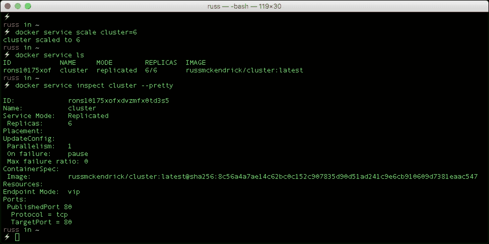

# 第四章 Docker Swarm

到目前为止，我们已经学会了如何使用 Docker for Mac、Docker for Windows 和 Docker Machine 在本地启动单个 Docker 主机，以及在 Linux 上本地使用 Docker。单个 Docker 主机非常适合本地开发，或启动一些测试实例，但随着你向生产环境推进，你需要减少单点故障的风险。

在这一章中，我们将变得更加冒险，创建一个 Docker 主机集群。Docker 提供了一种名为 Swarm 的工具，部署后它作为 Docker 客户端和 Docker 主机之间的调度器，根据调度规则决定在哪里启动容器。

我们将要讨论以下主题：

+   手动启动 Docker Swarm 集群

+   启动 Amazon Web Services 上的 Docker

+   启动 Azure 上的 Docker

以及如何在我们的集群中启动容器。

# 手动创建 Swarm

在第三章开始时，*Docker 在云端*我们探讨了如何使用 Docker Machine 在 Digital Ocean 启动 Docker 主机。我们将再次从 Digital Ocean 开始，但这次我们将启动三个主机，然后在它们上面创建一个 Docker Swarm 集群。

首先，我们需要启动主机，为此，运行以下命令，记得将 Digital Ocean API 访问令牌替换为你自己的：

```
docker-machine create \
 --driver digitalocean \
 --digitalocean-access-token 57e4aeaff8d7d1a8a8e46132969c2149117081536d50741191c79d8bc083ae73 \
 swarm01

docker-machine create \
 --driver digitalocean \
 --digitalocean-access-token 57e4aeaff8d7d1a8a8e46132969c2149117081536d50741191c79d8bc083ae73 \
 swarm02

docker-machine create \
 --driver digitalocean \
 --digitalocean-access-token 57e4aeaff8d7d1a8a8e46132969c2149117081536d50741191c79d8bc083ae73 \
 swarm03

```

启动后，运行`docker-machine ls`应该会显示你的镜像列表。此外，这应该会在你的 Digital Ocean 控制面板中有所体现：


现在我们有了 Docker 主机，并需要为集群中的每个节点分配角色。Docker Swarm 有两种节点角色：

+   **管理节点**：管理节点是一个分配任务给工作节点的节点，你与 Swarm 集群的所有交互都将针对一个管理节点进行。你可以拥有多个管理节点，但在本例中我们将只使用一个。

+   **工作节点**：工作节点接受管理节点分配的任务，所有的服务都会在这里启动。我们将在集群配置完成后，进一步深入讨论服务。

在我们的集群中，**swarm01**将是管理节点，**swarm02**和**swarm03**将是我们的两个工作节点。我们将使用`docker-machine ssh`命令直接在三个节点上执行命令，从配置管理节点开始。

### 注意

请注意，文档中的命令仅适用于 Mac 和 Linux，Windows 上的命令将在本节末尾讲解。

在初始化管理节点之前，我们需要捕获`swarm01`的 IP 地址作为命令行变量：

```
managerIP=$(docker-machine ip swarm01)

```

现在我们有了 IP 地址，运行以下命令检查它是否正确：

```
echo $managerIP

```

然后，配置管理节点，运行以下命令：

```
docker-machine ssh swarm01 docker swarm init --advertise-addr $managerIP

```

然后，你会收到确认信息，表明`swarm01`现在是管理节点，并附有将工作节点添加到集群的运行指令：


你不需要记下这些指令，因为我们将以稍微不同的方式运行命令。

为了添加我们的两个工作节点，我们需要以类似于获取管理节点 IP 地址的方式来捕获加入令牌，使用`$managerIP`变量；为此，请运行：

```
joinToken=$(docker-machine ssh swarm01 docker swarm join-token -q worker)

```

再次，`echo`该变量以检查它是否有效：

```
echo $joinToken

```

现在是时候通过运行以下命令将我们的两个工作节点添加到集群中：

```
docker-machine ssh swarm02 docker swarm join --token $joinToken $managerIP:2377
docker-machine ssh swarm03 docker swarm join --token $joinToken $managerIP:2377

```

你应该能看到类似以下的终端输出：


使用以下命令将本地 Docker 客户端连接到管理节点：

```
eval $(docker-machine env swarm01)

```

然后再次运行`docker-machine ls`，可以看到。正如从主机列表中看到的那样，`swarm01`现在是激活的，但**SWARM**列中没有任何内容；为什么会这样？

令人困惑的是，Docker Swarm 集群有两种不同的类型，一种是由 Docker Machine 管理的传统 Docker Swarm，另一种是由 Docker Engine 本身管理的新的 Docker Swarm 模式。

我们已经启动了一个 Docker Swarm 模式集群。这现在是启动 Swarm 的首选方式，传统的 Docker Swarm 正在慢慢退役。

要获取 Swarm 集群中节点的列表，我们需要运行以下命令：

```
docker node ls

```


有关每个节点的信息，你可以运行以下命令（`--pretty`标志会渲染 Docker API 的 JSON 输出）：

```
docker node inspect swarm01 --pretty

```

你会获得关于主机的大量信息，包括它是一个管理节点，并且它已经在 Digital Ocean 上启动。运行相同的命令，但针对工作节点，会显示类似的信息：

```
docker node inspect swarm02 --pretty

```

然而，由于该节点不是管理节点，因此该部分缺失。

在我们开始将服务部署到集群之前，应该先了解如何在 Windows 上使用 Docker Machine 启动集群。我们将使用 PowerShell 来执行此操作，而不是更传统的 Windows CMD 提示符，然而，即使是使用 PowerShell，命令也有一些差异，原因在于 PowerShell 和 bash 之间的差异。

首先，我们需要启动三个主机：

```
docker-machine.exe create --driver digitalocean --digitalocean-access-token 57e4aeaff8d7d1a8a8e46132969c2149117081536d50741191c79d8bc083ae73 swarm01
docker-machine.exe create --driver digitalocean --digitalocean-access-token 57e4aeaff8d7d1a8a8e46132969c2149117081536d50741191c79d8bc083ae73 swarm02
docker-machine.exe create --driver digitalocean --digitalocean-access-token 57e4aeaff8d7d1a8a8e46132969c2149117081536d50741191c79d8bc083ae73 swarm03

```

一旦三个主机都启动并运行：


你可以通过运行以下命令来创建管理节点：

```
$managerIP = $(docker-machine.exe ip swarm01)
echo $managerIP
docker-machine.exe ssh swarm01 docker swarm init --advertise-addr $managerIP

```


一旦你有了管理节点，你可以添加两个工作节点：

```
$joinIP = "$(docker-machine.exe ip swarm01):2377"
echo $joinIP
$joinToken = $(docker-machine.exe ssh swarm01 docker swarm join-token -q worker)
echo $joinToken
docker-machine.exe ssh swarm02 docker swarm join --token $joinToken $joinIP
docker-machine.exe ssh swarm03 docker swarm join --token $joinToken $joinIP

```

然后配置本地 Docker 客户端以使用管理节点，并检查集群状态：

```
docker-machine.exe env  swarm01 | Invoke-Expression
docker-machine.exe ls
docker node ls

```

到目前为止，无论你使用哪个操作系统，你应该已经在 Digital Ocean 上有了一个三节点的 Docker Swarm 集群，我们现在可以开始将服务部署到集群中。

# 启动一个服务

与其使用`docker container run`命令启动容器，不如创建一个服务。服务定义了一个任务，管理节点将该任务传递给某个工作节点，然后启动一个容器。

让我们启动一个名为 cluster 的简单服务，它使用的是我们在第二章中查看过的镜像，*使用 Docker 启动应用程序*：

```
docker service create --name cluster -p:80:80/tcp russmckendrick/cluster

```

就这样，我们现在应该在三个节点中的一个上运行了一个容器。要检查服务是否在运行并获取更多关于服务的信息，请运行以下命令：

```
docker service ls
docker service inspect cluster --pretty

```

现在我们已经确认服务正在运行，你可以打开浏览器，输入你三个节点中任意一个的 IP 地址（可以通过运行`docker-machine ls`获得）。Docker Swarm 的一个特点就是它的路由网格。


路由网格？当我们使用`-p:80:80/tcp`标志暴露端口时，我们做的不仅仅是将主机的端口`80`映射到容器的端口`80`，我们实际上是在集群内的所有主机上创建了一个 Swarm 负载均衡器，并将其绑定到`80`端口。然后，Swarm 负载均衡器将请求定向到集群中的容器。

运行下面的命令，应该能显示哪些任务正在各个节点上运行，记住，任务是由服务启动的容器：

```
docker node ps swarm01
docker node ps swarm02
docker node ps swarm03

```

像我一样，你可能在`swarm01`上运行着单一任务：


我们可以通过扩展服务来增加更多任务，使得事情变得更加有趣，简单地运行以下命令来扩展和检查我们的服务：

```
docker service scale cluster=6
docker service ls
docker service inspect cluster --pretty

```

正如你所看到的，我们现在在集群服务中有 6 个任务正在运行：



检查节点时，应该能看到任务在我们的三个节点之间均匀分布：

```
docker node ps swarm01
docker node ps swarm02
docker node ps swarm03

```


在浏览器中点击刷新也应该更新 Docker 镜像下的主机名，在 Mac 和 Linux 中查看这一点的另一种方法是运行以下命令：

```
curl -s http://$(docker-machine ip swarm01)/ | grep class=

```

从以下终端输出可以看出，我们的请求在正在运行的任务之间进行了负载均衡：


在我们终止 Docker Swarm 集群之前，让我们看看另一种启动服务的方法，在此之前，我们需要移除当前正在运行的服务，为此，只需运行以下命令：

```
docker service rm cluster

```

服务移除后，我们可以启动一个新的堆栈。

# 启动堆栈

这可能会让人感到困惑。如果服务等同于运行容器，那么堆栈就是运行一组服务，就像你使用 Docker Compose 启动多个容器一样。实际上，你可以使用 Docker Compose 文件启动堆栈，只需进行一些调整。

让我们再来看一下如何启动我们的集群应用程序。你可以在`/bootcamp/chapter04/cluster/`文件夹中的仓库里找到我们将要使用的 Docker Compose 文件，在我们查看`docker-compose.yml`文件的内容之前，先启动堆栈。为此，请运行以下命令：

```
docker stack deploy --compose-file=docker-compose.yml cluster

```

你应该会收到确认，表示堆栈的网络已与服务一起创建。你可以通过运行以下命令列出堆栈启动的服务：

```
docker stack ls

```

然后通过运行以下命令查看服务中的任务：

```
docker stack ps cluster

```


你可能会惊讶地发现，服务仅在 `swarm02` 和 `swarm03` 上启动了任务。为了说明原因，让我们打开 `docker-compose.yml` 文件：

```
version: "3"
services:
  cluster:
    image: russmckendrick/cluster
    ports:
      - "80:80"
    deploy:
      replicas: 6
      restart_policy:
        condition: on-failure
placement:
        constraints:
          - node.role == worker
```

正如你所看到的，`docker-compose.yml` 文件看起来就像我们在第二章中介绍的内容，*使用 Docker 启动应用程序*，直到我们到达 `deploy` 部分。

你可能已经发现我们为什么只在两个工作节点上运行任务的原因，正如你在 `placement` 部分看到的，我们告诉 Docker 只在角色为工作节点的节点上启动任务。

接下来，我们定义了一个 `restart_policy`，它告诉 Docker 如果任何任务停止响应应该怎么办，在我们的案例中，我们告诉 Docker 在 `on-failure` 时重启任务。最后，我们告诉 Docker 在我们的服务中启动六个 `replicas`。

让我们通过终止我们其中一个工作节点来测试重启策略。虽然通过排空节点有一种优雅的方式，但更有趣的做法是直接终止该节点，运行以下命令即可：

```
docker-machine rm swarm03

```

在删除主机后，立即运行 `docker stack ps` 集群会显示 Docker 还没有同步更新。

稍等几秒钟后运行 `docker stack ps`，你会看到我们仍然有六个任务在运行，但从终端输出中可以看出，它们现在都在 `swarm02` 上运行，而新的任务替代了之前的任务，显示为 **已关闭**。

我们的应用程序应该仍然可以通过在浏览器中输入 `swarm01` 或 `swarm02` 的 IP 地址访问。完成剩余两个主机的操作后，你可以通过运行以下命令将它们移除：

```
docker-machine rm swarm01 swarm02

```

到目前为止，我们已经在 Digital Ocean 上手动创建了 Docker Swarm 集群，我相信你同意到目前为止，这个过程非常简单，特别是考虑到集群技术的强大，你现在可能已经开始思考如何部署服务和堆栈。

在接下来的几个部分，我们将研究 Docker for Amazon Web Services 和 Docker for Azure，以及 Docker 如何利用这两大公共云服务提供的一系列支持功能。

# Docker for Amazon Web Services

Docker for AWS 是一个已经为 Amazon Web Services 调优的 Swarm 集群。

### 注意

AWS CloudFormation 是一个模板引擎，允许你以可控和可预测的方式定义 AWS 基础设施和资源。

AWS CloudFormation 模板可以在以下位置找到：

[`editions-us-east-1.s3.amazonaws.com/aws/stable/Docker.tmpl`](https://editions-us-east-1.s3.amazonaws.com/aws/stable/Docker.tmpl)

如你所见，内容相当丰富，下面的图片是上述模板的可视化展示——虽然你可能无法看到图片中的所有内容，但你应该能大致了解 Docker 提供的**CloudFormation**模板的复杂性。


如你所见，模板为你完成了所有繁重的工作，这意味着你几乎不需要做什么，唯一需要做的事就是创建一个 SSH 密钥。为此，登录到 AWS 控制台 [`console.aws.amazon.com/`](https://console.aws.amazon.com/)，从屏幕顶部的**服务**菜单中选择**EC2**，EC2 仪表板打开后，点击左侧菜单中的**密钥对**。

在这里你可以选择**创建密钥对**或**导入密钥对**。一旦你创建或导入了 SSH 密钥，就可以开始启动 Docker for Amazon Web Services 集群，接下来，从**服务**菜单中选择**CloudFormation**。

点击**创建新堆栈**将带你到一个页面，在该页面上你可以定义你的堆栈，由于 Docker 已经为我们完成了这项工作，你只需要输入堆栈定义文件的 URL：

[`editions-us-east-1.s3.amazonaws.com/aws/stable/Docker.tmpl`](https://editions-us-east-1.s3.amazonaws.com/aws/stable/Docker.tmpl)

在下面的区域中，找到**指定一个 Amazon S3 模板 URL**，确保在你输入 URL 的上方选择了单选框后，点击**下一步**：


你将进入的下一页是定义你的堆栈外观的页面，对于这个快速演示，我使用了以下配置，大致匹配我们在 Digital Ocean 启动的手动 Swarm 集群的大小：

+   **堆栈名称**：Bootcamp

+   **Swarm 管理节点数量？** 1

+   **Swarm 工作节点数量？** 3

+   **使用哪个 SSH 密钥？** <你自己的 SSH 密钥>

+   **启用每日资源清理？** 否

+   **使用 Cloudwatch 进行容器日志记录？** 是

+   **Swarm 管理节点实例类型？** t2.micro

+   **管理节点临时存储卷大小？** 20

+   **管理节点临时存储卷类型** standard

+   **代理工作节点实例类型？** t2.micro

+   **工作节点临时存储卷大小？** 20

+   **工作节点临时存储卷类型**：standard

填写完所有细节后，点击页面底部的**下一步**按钮。接下来你将进入一个包含额外选项的页面，例如标签，我们不需要在此输入任何内容，因此只需点击**下一步**按钮。

最后一页是我们在正式启动堆栈之前对所有内容进行复审的页面。如果你需要更改任何值，可以点击**上一步**，一旦你对填写的详情满意，就需要勾选**我确认 AWS CloudFormation 可能会创建 IAM 资源**，然后点击**创建**按钮。

这将立即开始部署你的 Docker for Amazon Web Service 集群资源，你可以通过保持**Events**标签页打开来检查部署状态。

点击**refresh**按钮应该会显示类似以下屏幕的内容：


启动堆栈需要几分钟时间，完成后你应该能看到**Status**显示为**CREATE_COMPLETE**。看到这个后，点击**Outputs**标签页：


在这里你应该能看到四条消息，第一条包含 Elastic Load Balancer 的 URL，第二条是关于你的实例可用性的消息，最后你应该能看到关于**Managers**的消息，其中包含一个链接——点击它。

这将带你到 EC2 仪表盘的实例页面，你还会注意到我们的单一管理节点已被过滤，选择它后可以看到该实例的公共 URL 和 IP 地址等信息：


为了与我们的集群进行交互，我们将通过 SSH 连接到管理节点，你需要使用`docker`用户名。我使用了以下命令：

```
ssh docker@54.194.20.19

```

如果你下载了密钥对，则可以使用类似如下的命令：

```
ssh docker@54.194.20.19 -I ~/path/to/keypair.pem

```

一旦登录，你应该能看到类似如下的内容：


运行`docker node ls`可以看到我们有三个工作节点和我们当前登录的一个管理节点：


现在让我们启动我们的集群应用程序，由于我们登录的是一个非常基础的操作系统，实际上正如你从运行命令的输出中看到的那样：

```
cat /etc/*release

```

我们已登录到一个 Alpine Linux 服务器：


Git 默认没有安装，所以让我们切换到 root 用户并使用 APK 安装 Git 包：

```
sudo su –
apk update
apk add git

```

现在 Git 已安装，我们可以克隆 Bootcamp 的 repo：

```
git clone https://github.com/russmckendrick/bootcamp
.git

```

一旦 Git 安装完成，我们就可以使用以下命令启动我们的堆栈：

```
docker stack deploy --compose-file=/root/bootcamp/chapter04/cluster/docker-compose.yml cluster
docker stack ls
docker stack ps cluster

```

你应该看到类似以下的输出：


现在我们的堆栈已启动，你可以通过 CloudFormation 堆栈的**Outputs**标签页中的 Elastic Load Balancer URL 访问它，在我的案例中 URL 是（请注意，我的 URL 现在已失效）：

`http://bootcamp-elb-1145454691.eu-west-1.elb.amazonaws.com/`

如下图所示，页面按预期显示，容器的主机名是内容所在的主机名：


与之前一样，运行 curl 命令访问 Elastic Load Balancer URL，可以看到容器的主机名在变化（记得替换成你自己的 URL）：

```
curl -s http://bootcamp-elb-1145454691.eu-west-1.elb.amazonaws.com/ | grep class=

```

在我们拆解集群之前，还有最后一个需要快速查看的地方，如果在启动 Docker for Amazon Web Service 堆栈时我们选择了**Use Cloudwatch for container logging**。

这个选项将您的容器日志流式传输到 Amazon 自己的中央日志服务，要查看日志，请返回 AWS 控制台并从 **服务** 菜单中选择 **Cloudwatch**，一旦 Cloudwatch 仪表板加载完成，点击左侧菜单中的 **日志**，然后点击 **Bootcamp-lg** 链接，在这里您应该能看到由 `docker stack create` 命令启动的容器列表：


点击其中一个日志流将显示该容器记录的所有内容，在我们的例子中，应该只是来自 supervisord 进程的大量信息：


要拆除我们的 Docker for Amazon Web Services 集群，请返回 CloudFormation 仪表板，选择您的堆栈，然后从 **操作** 菜单中选择 **删除堆栈**。这将弹出一个提示框，点击 **是，删除** 按钮，您的堆栈将立即开始删除。

删除所有资源需要几分钟，确保所有资源都被删除非常重要，因为 Amazon 采用按需付费模式，这意味着如果某个资源（如 EC2 实例）正在运行，您将为其付费，因此建议您保持窗口打开，并确保删除操作成功。

说到费用，您可能已经注意到，当我们启动堆栈时，有一个链接指向预估费用，这个链接会将 CloudFormation 模板中定义的所有资源通过 Amazon 的简单成本计算器应用程序进行处理，我们的四个实例的 Docker for Amazon Web Services 估计每月花费 $66.98。

如您所见，我们在几乎没有任何努力的情况下启动了一个相当复杂的配置，Docker 也将同样的方法应用于 Microsoft Azure，让我们现在来看一下。

# Docker for Azure

Docker for Azure 需要在部署之前做一些更多的准备工作。幸运的是，Docker 已经尽可能简化了这个过程，通过提供作为容器的 Azure 命令行界面。

我们需要为部署创建一个服务配置文件和资源组，要做到这一点，只需运行以下命令：

```
docker run -ti docker4x/create-sp-azure bootcamp-sp bootcamp-resource westus

```

这将下载 Azure CLI。我们传递给命令的三个变量如下：

+   服务配置文件的名称

+   资源组的名称

+   我们希望在哪个区域启动我们的集群

几秒钟后，您应该会收到一个 URL 和一个身份验证代码：


在浏览器中打开 [`aka.ms/devicelogin/`](https://aka.ms/devicelogin/) 并输入您获得的代码，在我的例子中是 **DQQXPYV7G**：


如上图所示，应用程序正在自我识别为**Microsoft Azure 跨平台命令行界面**，因此我们知道请求是正确的；点击继续将要求您登录。登录后，您将收到确认，表示您的请求已被授权并且应用程序已登录。

一两秒钟后，您应该看到命令行开始响应，首先它会询问您使用哪个订阅：


选择正确的订阅，然后让命令完成，它大约需要五分钟时间。在过程结束时，您应该会收到您的访问凭证，记下这些信息，因为您将需要它们来启动您的堆栈：


现在我们已经完成了准备工作，是时候启动 Docker for Azure 模板了，您可以通过以下网址查看该模板：

[`download.docker.com/azure/stable/Docker.tmpl`](https://download.docker.com/azure/stable/Docker.tmpl)

要启动它，只需在浏览器中访问以下网址：

[`portal.azure.com/#create/Microsoft.Template/uri/https%3A%2F%2Fdownload.docker.com%2Fazure%2Fstable%2FDocker.tmpl`](https://portal.azure.com/#create/Microsoft.Template/uri/https%3A%2F%2Fdownload.docker.com%2Fazure%2Fstable%2FDocker.tmpl)

您应该已经通过授权命令行界面登录，如果没有登录，请登录，您将被引导到一个页面，要求提供一些有关您希望堆栈外观的信息：

+   **订阅** <选择您的订阅>

+   **使用现有** <选择您在上一步生成的资源组>

+   **位置** <此项将被灰显>

+   **AD 服务主体应用程序 ID** <输入您在上一步生成的 AD 服务主体应用程序 ID>

+   **AD 服务主体应用程序密钥**：<输入您在上一步生成的 AD 服务主体应用程序密钥>

+   **启用系统清理**：否

+   **管理节点数**：1

+   **管理虚拟机大小**：Standard_D2_v2

+   **SSH 公钥**：<输入您的公钥，见下文>

+   **Swarm 名称**：dockerswarm

+   **工作节点数**：3

+   **工作节点虚拟机** **大小**：Standard_D2_v2

要在 Mac 或 Linux 上快速复制您的 SSH 公钥到剪贴板，请运行以下命令（如果需要，修改路径为您的密钥路径）：

```
cat ~/.ssh/id_rsa.pub | pbcopy

```

确保勾选**我同意上述条款和条件**旁边的框，确认表单内容无误后，点击**购买**。这将启动您的部署，过程将持续几分钟，完成后您的仪表板上会添加一个新的资源，取决于您现有的资源，您可能需要滚动查看或刷新页面。

点击您的资源卡片中的**查看更多**将显示 Docker for Azure 创建的所有资源列表：


你应该能看到分配的两个公共 IP 地址，一个是**externalLoadBalancer-public-ip**，另一个是**externalSSHLoadBalancer-public-ip**，请记下这两个地址，我们需要用到它们，找到 IP 地址的方法是点击资源查看更多信息。

现在我们知道了两个 IP 地址，我们可以通过 SSH 进入我们的管理节点，SSH 监听在端口`50000`，所以要 SSH 到节点，请运行以下命令，确保使用**externalSSHLoadBalancer-public-ip**地址：

```
ssh docker@52.160.107.69 -p50000

```

登录后，运行`docker node ls`，你应该能看到你的三个工作节点，如果没有看到，可能它们仍在启动中，再等几分钟：


和 Amazon Web Services 上的 Docker 一样，你是通过 SSH 进入了一个 Alpine Linux 主机。

这意味着，要安装 Git，我们需要切换到 root 用户，并使用 APK 进行安装：

```
sudo su -
apk update
apk add git

```

一旦安装了 Git，我们可以使用以下命令检出 Bootcamp 仓库：

```
git clone https://github.com/russmckendrick/bootcamp.git

```

然后使用以下命令启动我们的应用程序栈：

```
docker stack deploy --compose-file=/root/bootcamp/chapter04/cluster/docker-compose.yml cluster

```

并确保一切正常运行，通过执行以下命令：

```
docker stack ls
docker stack ps cluster

```

将 externalLoadBalancer-public-ip 地址输入浏览器后，应该会显示你的集群应用程序。再次使用 CURL 命令应该会显示流量正在分发到我们的容器（记得使用你自己的负载均衡器 IP 地址）：

```
curl -s http://52.160.105.160/ | grep class=

```

就这样，我们成功部署了 Docker for Azure 和我们的集群应用程序。最后要做的就是删除资源，以避免产生任何意外费用，操作步骤是：从左侧菜单中选择**资源组**，然后点击**bootcamp-resource**条目旁边的三个点，选择**删除**。

删除所有资源和组大约需要 10 分钟，但最好保持 Azure 门户打开，直到删除过程完成，因为你不希望产生额外的费用。

根据资源运行的时长，这整个演示的费用应该不会超过$0.10。

# 总结

我猜到到本章结束时，事情可能变得非常可预测，没有真正的惊喜，这也是故意的。正如你所体验到的，Docker 提供了一个非常强大的集群解决方案，一旦部署，无论你在什么平台上启动集群，它都会以一致和可预测的方式运行。

还有一件重要的事情我们还没有提到，那就是为容器提供持久存储。这一点很重要，尤其是在集群中，因为它不仅允许我们的容器在主机之间迁移，还引入了我们可以对应用程序进行滚动更新的方式。

在下一章，我们将了解 Docker 网络和卷插件。
