# 第六章 故障排除与监控

在本章中，我们将查看在故障排除容器时会非常有用的命令，所有我们将查看的命令都是 Docker 引擎的核心命令，我们还将研究一种调试 Dockerfile 的方法。

完成故障排除命令后，我们将了解如何使用 cAdvisor 监控容器，并通过 Prometheus 后端和 Grafana 仪表板进行展示——别担心，这并不像听起来那么复杂。

### 注意

由于我们将暴露服务，其中一些使用默认凭证，因此我建议您在本章中使用本地的 Docker 安装。

# 容器故障排除

计算机程序（软件）有时不能按预期行为运行。这通常是由于代码错误或开发、测试和部署系统之间的环境变化造成的。Docker 容器技术通过容器化所有应用程序的依赖项，尽可能消除开发、测试和部署之间的环境问题。然而，仍然可能由于代码错误或内核行为的变化而出现异常，这需要调试。调试是软件工程领域中最复杂的过程之一，而在容器化环境下，由于隔离技术的存在，调试变得更加复杂。在本节中，我们将学习如何使用 Docker 原生工具以及外部工具调试容器化应用的一些技巧和窍门。

最初，Docker 社区的许多人分别开发了自己的调试工具，但后来 Docker 开始支持原生工具，如 `exec`、`top`、`logs`、`events` 等等。在本节中，我们将深入了解以下 Docker 工具：

+   `exec`

+   `ps`

+   `top`

+   `stats`

+   `events`

+   `logs`

+   `attach`

我们还将考虑调试 Dockerfile。

## exec 命令

`docker container exec` 命令为用户提供了极大的帮助，尤其是对于那些在容器中部署自己 web 服务器或后台运行其他应用的用户。

现在，运行容器中的 SSH 守护进程不再需要登录。

首先，启动一个容器：

```
docker container run -d --name trainingapp training/webapp:latest 

```

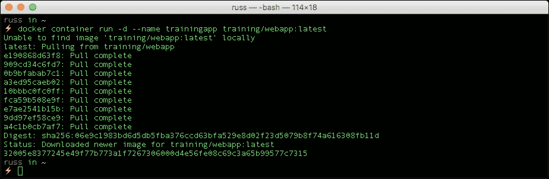

第二，运行 `docker container ps` 命令以获取容器 ID。现在你已经拥有了容器 ID，可以使用容器 ID 或我们为其命名的 `trainingapp` 来运行 `docker container exec` 命令登录容器：

```
docker container exec -it 32005e837724 bash

```

### 注意

请注意，并非每个容器都安装了 bash，有些容器（如 Alpine Linux）默认没有 bash，而是使用基于 bash 的 sh。

需要注意的是，`docker container exec`命令只能访问正在运行的容器，所以如果容器停止工作，你需要重新启动停止的容器才能继续。`docker container exec`命令通过 Docker API 和 CLI 在目标容器的命名空间中生成一个新的进程。

容器的命名空间是将容器彼此隔离的机制，例如，你可以有多个容器同时运行相同的进程，但由于这些进程是启动在每个容器的命名空间内，它们彼此隔离。一个好的例子是 MySQL 进程，在传统服务器上尝试运行多个 MySQL 服务器进程意味着你需要在不同的端口上启动进程，使用不同的锁、PID 和日志文件以及不同的初始化脚本。

由于 Docker 隔离了每个 MySQL 服务器进程，你只需要担心的是，如果你在主机机器上暴露了 MySQL 端口，那么不要将其分配给与另一个容器相同的端口。

所以，如果你在目标容器内运行`ps -aef`命令，结果如下：

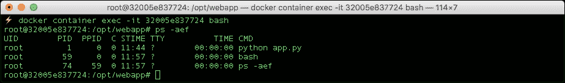

这里，`python app.y`是目标容器中已经运行的应用程序，而`docker container exec`命令在容器内部添加了`bash`进程。如果你运行`kill -9 59`（将`59`替换为你自己`bash`进程的 PID），你将自动从容器中注销。

建议你仅将`docker container exec`命令用于监控和诊断目的，我个人相信每个容器一个进程的概念，这是广泛强调的最佳实践之一。

## ps 命令

`ps`命令在容器内部可用，用于查看进程的状态。这与 Linux 环境中的标准`ps`命令类似，并不是我们在 Docker 主机上运行的`dockercontainerps`命令。

这个命令在 Docker 容器内运行：

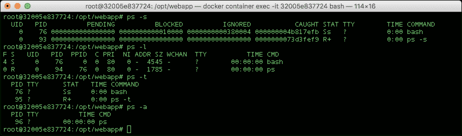

使用`ps --help <simple|list|output|threads|misc|all>`或`ps --help <s|l|o|t|m|a>`获取更多帮助信息。

## top 命令

你可以使用以下命令从 Docker 主机机器运行 top 命令：

```
docker container top CONTAINER [ps OPTIONS]

```

这会列出容器中运行的进程，而无需登录容器，如下所示：

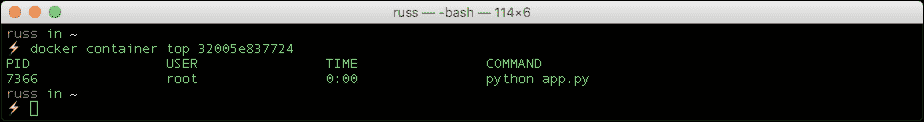

在容器内，top 命令提供关于 CPU、内存和交换区使用情况的信息，就像任何正常的 Linux 主机一样：

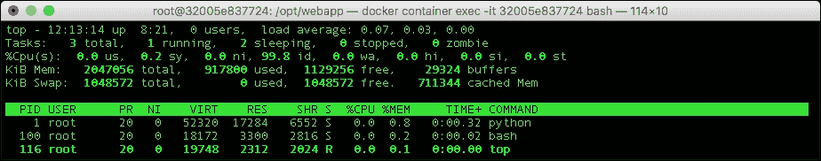

如果在容器内运行`top`命令时出现`error - TERM environment variable not set`错误，请按照以下步骤进行解决。

运行`echo$TERM`，如果返回结果是`dumb`，那么运行以下命令：

```
export TERM=dumb 

```

这将解决你的错误，你可以运行`top`命令。

## stats 命令

`docker container stats`命令允许你查看 Docker 主机上容器的内存、CPU 和网络使用情况，如下所示。运行以下命令：

```
docker container stats 32005e837724

```

给你以下输出：

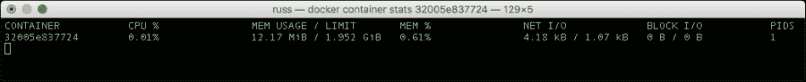

你可以运行`stats`命令来查看多个容器的使用情况：

```
docker container stats 32005e837724 5e33f02f5fd2 7c9cf27ff46a

```

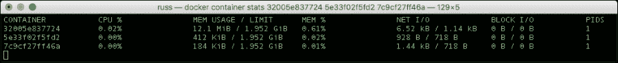

从 Docker 1.5 版本开始，你可以访问容器统计的*只读*参数。这将简化容器的 CPU、内存、网络 I/O 和块 I/O。

这有助于你选择资源限制和性能分析。Docker stats 工具仅为运行中的容器提供这些资源使用详情。

你可以通过以下网址的端点 API 获取详细信息：[`docs.docker.com/engine/api/v1.26/`](https://docs.docker.com/engine/api/v1.26/)。

## Docker 事件命令

Docker 容器将报告以下实时事件：`create`、`destroy`、`die`、`export`、`kill`、`omm`、`pause`、`restart`、`start`、`stop`和`unpause`。让我们`pause`和`unpause`我们的容器：

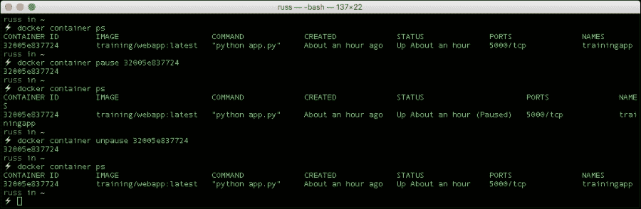

如果指定了镜像，它还将报告`untag`和`delete`事件。

使用多个过滤器将作为`AND`操作处理，例如：

```
docker events --filter container=32005e837724 --filter event=pause --filter event=unpause --since 12h 

```

上述命令将显示容器`a245253db38b`过去 12 小时内所有的`pause`和`unpause`事件：

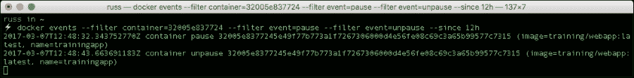

目前，支持的过滤器有`container`、`event`和`image`。

## logs 命令

此命令在不登录容器的情况下获取容器的日志。它批量检索执行时存在的日志。这些日志是 STDOUT 和 STDERR 的输出。一般用法如下：

```
docker container logs [OPTIONS] CONTAINERID

```

`--follow`选项将继续提供输出，直到 Docker 日志命令终止，并实时打印任何新的日志条目，`-t`将提供时间戳，`--tail=<number of lines>`将显示容器日志消息的行数：

```
docker container logs 32005e837724

```

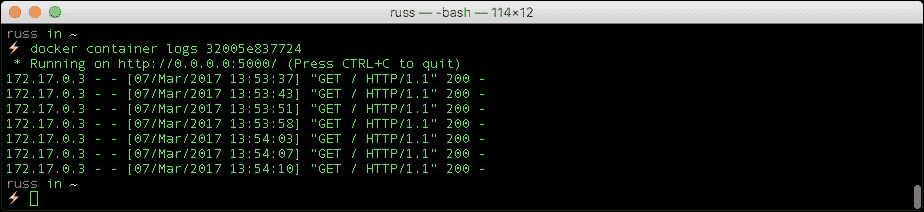

```
docker container logs -t 32005e837724

```

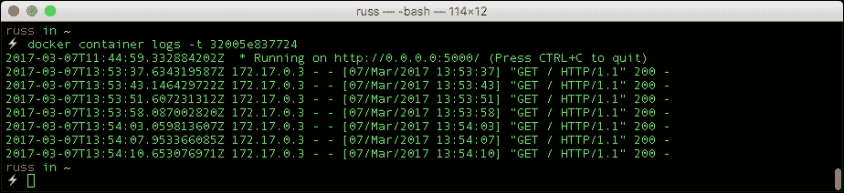

我们在前面的章节中也使用了`docker container logs`命令来查看数据库容器的日志。

## attach 命令

此命令附加到正在运行的容器，并且在你想要实时查看`stdout`中写入的内容时非常有用，接下来我们启动一个新的测试容器，它向`stdout`输出内容：

```
docker container run -d --name=newtest alpine /bin/sh -c "while true; do sleep 2; df -h; done"

```

现在我们可以使用以下命令附加到容器以查看输出：

```
docker container attach newtest

```

默认情况下，该命令会附加`stdin`并将信号代理到远程进程。可以使用选项来控制这两种行为。要从进程中分离，请使用默认的*Ctrl* + *Q*组合键。

# 调试 Dockerfile

我们在 Dockerfile 中设置的每条指令都会作为一个单独的临时镜像构建，用于其他指令在其基础上构建。

在仓库的 `/bootcamp/ch` `apter06/debu` `g` 目录下有一个 Dockerfile：

```
FROM alpine
RUN ls -lha /home
RUN ls -lha /vars
CMD echo Hello world
```

使用以下命令构建镜像：

```
docker image build

```

给你以下输出：

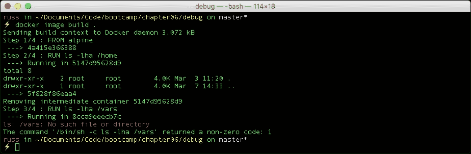

所以，我们的 Dockerfile 中有一个错误。你可能会注意到输出中有一行显示 `--->5f828f86eaa4`，这实际上是一个镜像文件，它是在成功执行 `RUN ls -lha /` `home` 行之后构建的。

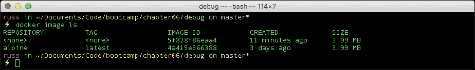

这意味着我们可以使用这个镜像来启动一个容器：

```
docker container run -it --name=debug 5f828f86eaa4 /bin/sh

```

### 注意

注意，由于我们使用的是 Alpine Linux 作为基础镜像，因此我们使用 `/bin/sh` 而不是 `/bin/bash`

然后我们可以调试我们的应用程序，在这种情况下非常简单：

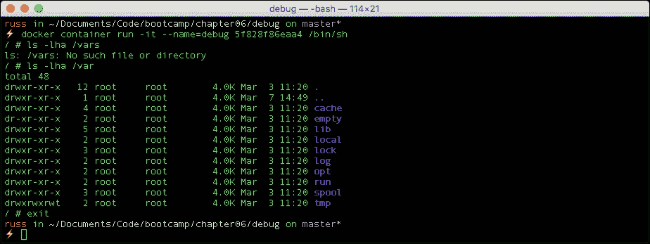

调试是一个分析正在发生的事情的过程，每种情况都不同，但通常我们开始调试的方法是通过手动执行失败的指令并理解错误。当我使指令工作时，我通常会退出容器，更新我的 Dockerfile，然后重复这个过程，直到我得到一个可以正常工作的结果。

注意，当导致错误的那一行被更正（通过提供正确的行 `RUN ls -lha /var`）并且我们再次尝试构建时，Docker 并不会为成功的那一步创建一个新的镜像：

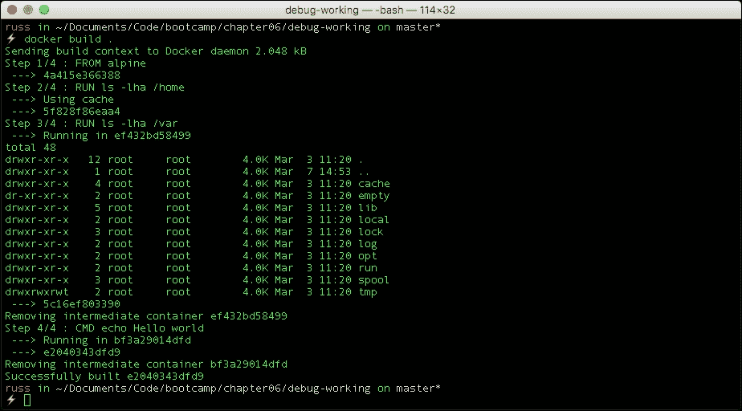

一旦构建完成，临时镜像会被删除，我们只剩下最终的镜像：

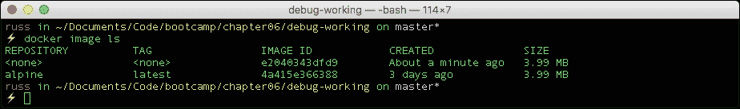

这是一个相当简单的例子，但它应该能让你了解如何调试更复杂的 Dockerfile。

# 容器监控

在上一节中，我们介绍了如何使用 Docker 内置的 API 通过运行 `docker container stats` 和 `docker container top` 命令来获取容器运行时的资源信息。现在，我们将看看如何通过使用 **cAdvisor**（Google 提供的工具）将其提升到一个新层次。

Google 对 cAdvisor 的描述如下：

> cAdvisor（容器顾问）为容器用户提供了关于其正在运行的容器的资源使用情况和性能特征的理解。它是一个运行中的守护进程，收集、汇总、处理并导出有关正在运行的容器的信息。具体来说，对于每个容器，它保持资源隔离参数、历史资源使用情况、完整历史资源使用的直方图以及网络统计信息。这些数据由容器导出，并且是机器范围的。

该项目最初作为 Google 的一个内部工具，用于获取有关使用其自有容器栈启动的容器的深入信息。

### 注意

Google 自己的容器堆栈被称为 "Let Me Contain That For You" 或简称 lmctfy。lmctfy 项目的工作已被作为 Google 在 libcontainer 上的移植功能，这也是 Open Container Initiative（OCI）的一部分。关于 lmctfy 的更多细节可以在 [`github.com/google/lmctfy/`](https://github.com/google/lmctfy/) 找到。

cAdvisor 是用 Go 语言编写的 ([`golang.org`](https://golang.org))；你可以选择自行编译二进制文件，或者使用通过容器提供的预编译二进制文件，这些文件可通过 Google 自家的 Docker Hub 账户获取。你可以在 [`hub.docker.com/u/google/`](http://hub.docker.com/u/google/) 找到它。

安装后，cAdvisor 会在后台运行并捕获类似于 `dockercontainer` `stats` 命令的指标。我们将在本章后续内容中详细了解这些指标及其含义。

cAdvisor 会收集这些指标，并与主机机器的指标一起，通过一个简单且易于使用的内置网页界面进行展示。

安装 cAdvisor 有多种方法；最简单的方式是下载并运行包含预编译 cAdvisor 二进制文件的容器镜像：

```
docker network create monitoring
docker container run -d \
 --volume=/:/rootfs:ro \
 --volume=/var/run:/var/run:rw \
 --volume=/sys:/sys:ro \
 --volume=/var/lib/docker/:/var/lib/docker:ro \
 --publish=8080:8080 \
 --name=cadvisor \
 google/cadvisor:latest

```

现在，你应该在主机上成功启动了 cAdvisor 容器。

在查看统计数据之前，我们先更详细地了解一下 cAdvisor，讨论为什么我们要将所有选项传递给容器。

cAdvisor 二进制文件设计为与 Docker 二进制文件一起在主机上运行，因此通过在容器中启动 cAdvisor，我们将二进制文件隔离在它自己的环境中。为了让 cAdvisor 访问它在主机上所需的资源，我们必须挂载多个分区，并且还需要为容器提供特权访问权限，让 cAdvisor 二进制文件认为它是在主机上执行的。

现在，我们已经让 cAdvisor 正常运行；接下来我们需要做什么来配置服务以开始收集指标？

简单来说，什么也没有发生。当你启动 cAdvisor 进程时，它会立即开始轮询主机，查看有哪些容器在运行，并收集关于正在运行的容器和主机机器的信息。

cAdvisor 应该运行在 8080 端口上；如果你打开 `http://localhost:8080/`，你应该能看到 cAdvisor 的 logo 和主机机器的概览：

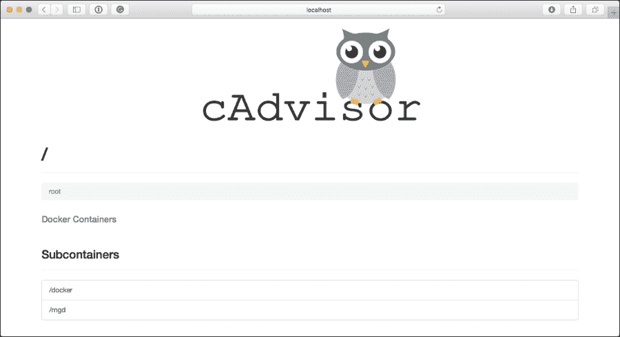

这个初始页面会实时流式传输主机机器的统计信息，每个部分会在你开始深入查看容器时重复显示。首先，我们来看看使用主机信息的每个部分。

概览部分给出了你系统的全貌；它使用了仪表盘，让你能够快速了解哪些资源已经接近极限。在以下截图中，CPU 使用率很低，文件系统的使用也相对较低；然而，我们已经使用了 66% 的可用 RAM：

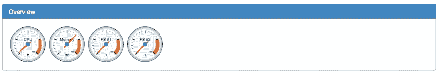

接下来是显示过去一分钟 CPU 利用率的图表：

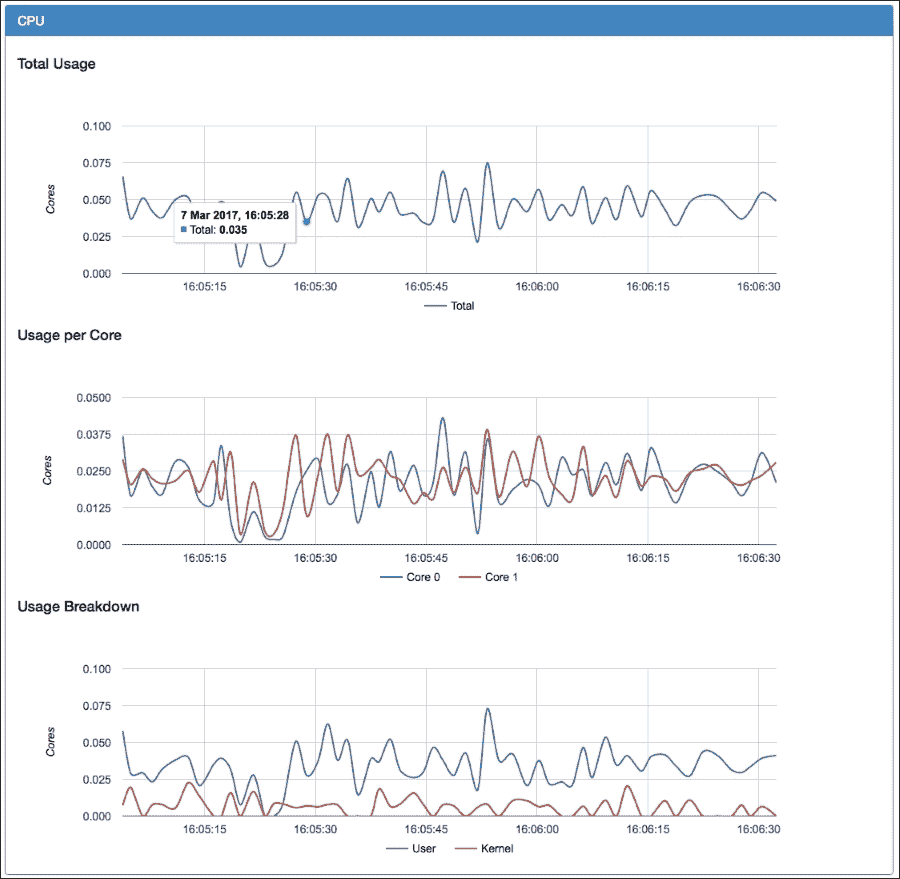

以下是每个术语的含义：

+   **总使用情况**：此项显示所有核心的总使用情况

+   **每个核心的使用情况**：此图表显示每个核心的使用情况

+   **使用情况细分**：此项显示了所有核心的总体使用情况，但会将其分解为由内核和用户拥有的进程所使用的内存

内存部分分为两部分。图表显示了所有进程在主机或容器中使用的总内存量；这是热内存和冷内存的总和。热内存是当前工作集；即内核最近访问过的页面。冷内存是长时间没有被访问的页面，如果需要，可以回收。

使用情况细分提供了主机机器的总内存或容器中的配额的可视化表示，以及总使用量和热使用量。

网络部分显示了过去一分钟的进出流量。你可以使用左上角的下拉框更改接口。

还有一个图表显示任何网络错误。通常情况下，这个图表应该是平的。如果不是，那么说明你的主机或容器可能存在性能问题。

最后一部分，文件系统，提供了文件系统使用情况的详细信息。在以下屏幕截图中，`/dev/vda1` 是启动分区，overlay 是运行容器的主要文件系统。

现在我们可以查看我们的容器了。在页面顶部有一个链接，显示你正在运行的容器，名称为 **Docker 容器**；你可以点击链接，也可以直接访问 `http://localhost:8080/docker/`。

页面加载后，你应该能够看到所有正在运行的容器列表，以及有关 Docker 进程的详细概览，最后是你下载的镜像列表。

子容器显示了你的容器列表；每个条目都是一个可点击的链接，点击后将带你到一个页面，页面上会显示以下详细信息：

+   **隔离**：

    +   **CPU**：此项显示容器的 CPU 配额；如果没有设置任何资源限制，你将看到主机的 CPU 信息

    +   **内存**：此项显示了容器的内存配额；如果你没有设置任何资源限制，容器将显示为无限配额

+   **使用情况**：

    +   **概览**：此项显示了仪表盘，你可以快速查看是否接近任何资源限制

    +   **进程**：此项显示仅选定容器的进程

    +   **CPU**：此项显示仅限于你容器的 CPU 利用率图表

    +   内存：此项显示了容器的内存利用情况

驱动状态部分提供了关于主 Docker 进程的基本统计信息，同时也包含主机机器内核、主机名以及底层操作系统的信息。

它还提供关于容器和镜像的总数的信息。你可能会注意到，镜像的总数远远超出你预期的数字；这是因为它将每个文件系统都当作一个独立的镜像来计算。

最后，你将得到一个主机上可用的 Docker 镜像列表。它列出了仓库、标签、大小以及镜像的创建时间，还包括镜像的唯一 ID。这让你了解镜像的来源（仓库）、你下载的是哪个版本的镜像（标签）以及镜像的大小（大小）。

这一切都很好，那么问题是什么呢？

所以，你也许在想，浏览器中提供的这些信息真的很有用；能够以易读的格式看到实时的性能指标，确实是一个很大的优势。

使用 cAdvisor 的 Web 界面最大的缺点是，正如你可能已经注意到的，它只显示一分钟前的度量数据；你可以清晰地看到信息在实时消失。

就像一块窗户玻璃提供了容器的实时视图一样，cAdvisor 是一个非常棒的工具；不过，如果你想查看超过一分钟的数据，恐怕就没办法了。

也就是说，除非你配置某个地方存储所有数据；这就是 Prometheus 的作用。那么，Prometheus 到底是什么呢？它的开发者这样描述它：

> Prometheus 是一个开源的系统监控和告警工具包，最初由 SoundCloud 开发。自 2012 年推出以来，它已经成为 SoundCloud 为新服务提供监控的标准，并且在外部使用和贡献方面不断增长。

好的，但这和 cAdvisor 有什么关系呢？嗯，Prometheus 有一个非常强大的数据库后端，它将导入的数据存储为事件的时间序列。

cAdvisor 默认做的一件事是将它捕获的所有度量数据显示在一个页面上，路径是`/metrics`；你可以在`http://localhost:8080/metricson`看到我们安装的 cAdvisor。每次加载页面时，度量数据都会更新，你应该能看到如下内容：

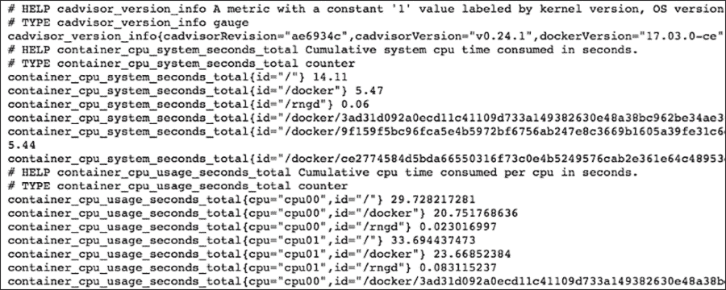

正如你在前面的截图中看到的，这只是一页长的原始文本。Prometheus 的工作方式是，你配置它以在用户定义的间隔（比如每五秒）抓取`/metrics` URL；这些文本的格式是 Prometheus 可识别的，并被导入到 Prometheus 的时间序列数据库中。

这意味着，使用 Prometheus 强大的内置查询语言，你可以开始深入挖掘你的数据。接下来，让我们看看如何启动和运行 Prometheus。

首先，仓库中有一个工作配置文件，路径是`/bootcamp/chapter06/prometheus/`，你需要确保自己处于这个文件夹中，因为我们将从这里挂载配置文件：

```
docker container run -d \
 --volume=$PWD/prometheus.yml:/etc/prometheus/prometheus.yml \
 --publish=9090:9090 \
 --network=monitoring \
 --name=prometheus \
 prom/prometheus:latest

```

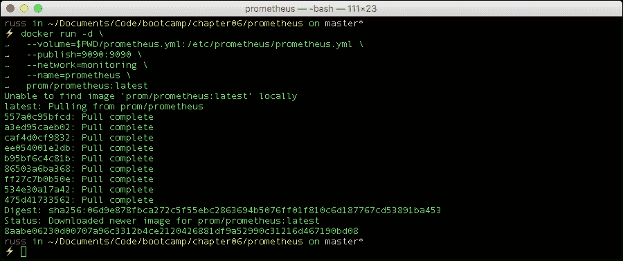

我们启动 Prometheus 时使用的配置文件如下所示：

```
global:
scrape_interval: 15s # By default, scrape targets every 15 seconds.
external_labels:
    monitor: 'Docker Bootcamp'
scrape_configs:
  - job_name: 'cadvisor'
scrape_interval: 5s
static_configs:
      - targets: ['cadvisor:8080']
```

由于我们已经在监控网络中启动了 Prometheus 容器，我们的安装将能够从 `http://cadvisor:8080/` 获取指标，同时请注意，我们没有在 URL 中添加 `/metrics`，这是 Prometheus 自动添加的。

在浏览器中打开 `http://localhost:9090/targets` 应该会显示类似以下内容：

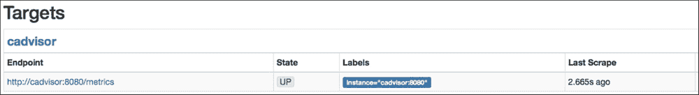

此外，状态菜单中有以下信息页面的链接：

+   **运行时信息与构建信息**：这显示了 Prometheus 已运行并获取数据的时间，如果你配置了终端点，还会显示你运行的 Prometheus 版本信息

+   **命令行标志**：这显示了所有运行时变量及其值

+   **配置**：这是我们在容器启动时注入的配置文件副本

+   **规则**：这是我们注入的任何规则的副本；这些规则将用于警报

由于目前我们只有少数容器在运行，接下来让我们启动一个运行 Redis 的容器，以便我们可以开始查看 Prometheus 内置的查询语言。

我们将使用官方的 Redis 镜像，作为示例我们不需要传递任何用户变量：

```
docker container run -d --name my-redis-server redis

```

现在，我们有一个名为 my-redis-server 的容器正在运行。cAdvisor 应该已经将容器的指标暴露给 Prometheus；让我们来看看。

在 Prometheus Web 界面中，点击页面顶部菜单中的 **图表** 链接。你会看到一个文本框，你可以在其中输入查询。首先，让我们查看 Redis 容器的 CPU 使用情况。

在框中输入以下内容：

```
container_cpu_usage_seconds_total{job="cadvisor",name="my-redis-server"}
```

然后，点击执行后，你应该会看到两个结果，这些结果列在页面的控制台标签中。如果你还记得，cAdvisor 会记录容器访问的每个 CPU 核心的使用情况，因此我们会返回两个值，一个是 `cpu00`，另一个是 `cpu01`。点击 **图表** 链接将显示一段时间内的结果：

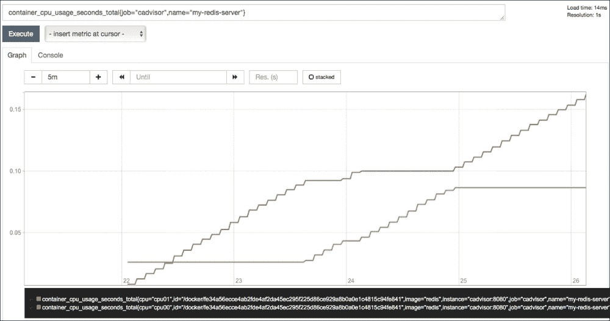

如前面的截图所示，我们现在可以查看过去 5 分钟的使用情况图表，这大约是我在生成图表之前启动 Redis 实例的时间。

如你所见，绘图并不是 Prometheus 的强项。幸运的是，Grafana 已经能够将 Prometheus 作为数据源使用一段时间了，现在让我们启动一个 Grafana 容器：

```
docker container run -d \
 --publish=3000:3000 \
 --network=monitoring \
 --name=grafana \
grafan
a/grafana:latest

```

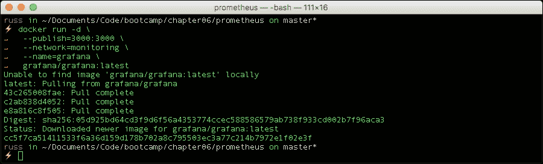

容器启动后，在浏览器中访问 `http://localhost:3000/`，你会被提示登录，默认的用户名和密码是 `admin` / `admin`。

现在你已经登录，你应该会看到如下页面：

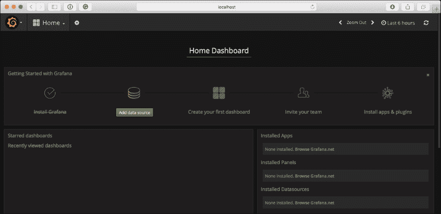

如你所料，我们需要点击 **添加数据源**，然后输入以下信息：

+   **名称**：prometheus

+   **类型**：<从下拉列表中选择 Prometheus>

+   **网址**：`http://prometheus:9090`

+   **访问**：<从下拉列表中选择代理>

保持其他设置不变，然后点击**添加**，等待一两秒，您的数据源应该已经成功添加，并且连接测试通过。

现在我们已经添加了数据源，可以添加一个仪表板。有很多现成的仪表板可用，我们将使用由 Brian Christner 发布的仪表板，您可以在 [`grafana.net/dashboards/179/`](https://grafana.net/dashboards/179/) 找到。

要导入仪表板，点击左上角的**Grafana 标志**，在打开的菜单中选择**仪表板**，然后选择**导入**。在弹出的对话框中，输入仪表板的 URL [`grafana.net/dashboards/179/`](https://grafana.net/dashboards/179/)，然后点击**加载**按钮。

这将加载仪表板配置，下一页将提供两个选项，**名称**已经填写好，只需从下拉菜单中选择**prometheus**，然后点击**导入**按钮。

导入后，您应该会看到一个与以下内容类似的仪表板（我已为截图进行了调整）：

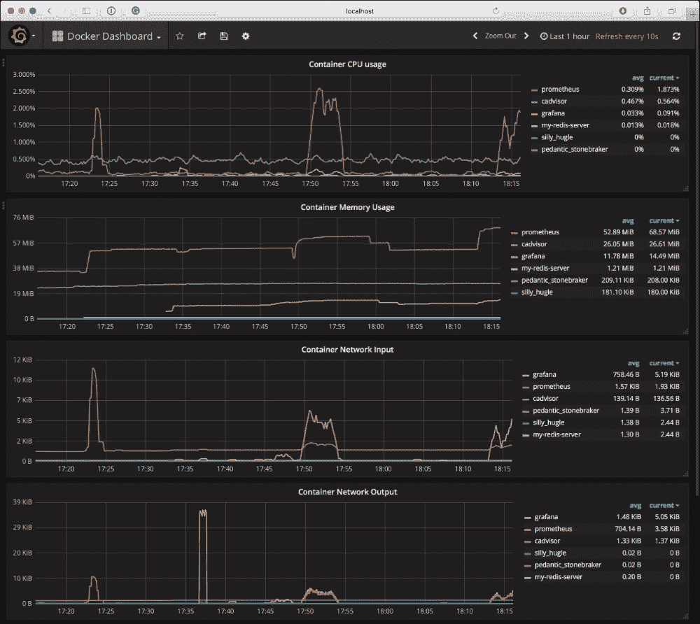

您可能会注意到从上面的屏幕中，我们现在已经从 cAdvisor 存储在 Prometheus 中的数据显示出超过一个小时的数据。

值得指出的是，目前 Docker 的实验版本已内置 Prometheus 端点，类似于 cAdvisor 的方式。一旦发布稳定版，我预计这将成为监控 Docker 主机的一个极好的开箱即用解决方案。

然而，这只是监控容器的其中一种方式，还有许多其他工具可以使用，包括自托管和作为云中的软件即服务运行的工具，例如：

+   Sysdig - [`www.sysdig.org/`](http://www.sysdig.org/)

+   Sysdig Cloud - [`sysdig.com/`](https://sysdig.com/)

+   Datadog - [`docs.datadoghq.com/integrations/docker/`](http://docs.datadoghq.com/integrations/docker/)

+   New Relic - [`newrelic.com/partner/docker`](https://newrelic.com/partner/docker)

+   Coscale - [`www.coscale.com/docker-monitoring`](http://www.coscale.com/docker-monitoring)

+   Elastic Metric Beat - [`www.elastic.co/products/beats/metricbeat`](https://www.elastic.co/products/beats/metricbeat)

# 总结

希望现在您应该对如何开始排查容器问题有所了解，无论是构建容器、检查日志、连接容器深入问题，还是收集性能指标。

在下一章，也是我们的最后一章中，我们将探讨一些 Docker 和我们在本章及前五章中介绍的技术的不同场景和用例。
