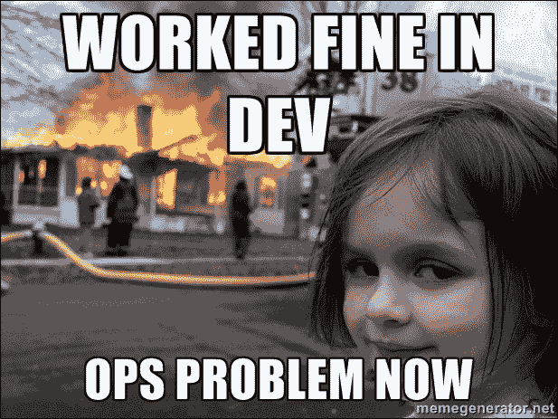

# 第七章. 整合所有内容

在本章，我们将回顾如何将前面各章所学的内容结合起来，并探讨它如何与您的开发和部署工作流契合。

此外，我们还将讨论如何向他人最好地描述 Docker，通常你会发现人们会认为 Docker 容器就像虚拟机一样。我们还将探讨 Docker 的优势以及一些使用案例。

# 工作流

本书的前五章介绍了一个典型的工作流，涵盖了从开发到生产环境中使用 Docker 容器的全过程：

+   本地开发与打包（第一章，*本地安装 Docker* 和 第二章，*使用 Docker 启动应用程序*）

+   暂存与远程测试（第三章，*Docker 在云端*）

+   生产环境（第四章，*Docker Swarm* 和 第五章，*Docker 插件*）

+   持续支持（第六章，*故障排除与监控*）

在前几章中，我们学习了如何在本地安装和使用 Docker，通常在开发应用程序或软件堆栈时，开发人员或系统管理员会先在本地进行测试。

一旦应用程序/堆栈完全开发完成，你可以通过 Docker Hub 共享它，作为公有或私有镜像，或者如果你的镜像包含一些你不想通过第三方分发的内容，你可以托管自己的 Docker 注册表。

一旦你有了打包好的镜像，你可能需要其他人来测试它。因为你的镜像已在注册表中可用，所以你的同事或朋友可以拉取你的镜像，并按你预期的方式在他们自己的机器上本地运行，而不必担心安装和配置你的应用程序或软件堆栈。

如果你需要让其他人进行远程测试，可以在公有云提供商上启动一个 Docker 主机，并迅速在那部署你的应用程序或软件堆栈。

一旦大家都满意，你可以在 Docker Swarm 运行的多主机集群中部署你的应用程序/软件堆栈服务，这意味着你的服务将运行在一个高可用且易于维护的环境中。作为服务进行部署，还可以让你利用 Swarm 内置的服务更新功能轻松地推出应用程序或软件堆栈的更新。

如果你需要在容器或主机之间共享或持久化存储，可以安装众多卷插件中的一个；同样，如果你需要比 Swarm 提供的多主机网络更高级的功能，也没问题，可以用网络插件替换它，记住，“内置电池，但可以替换”。

最后，如果你需要调试你的镜像或正在运行的容器，你可以使用第六章中讨论的命令和工具，*故障排除与监控*。

# 描述容器

包含虚拟化和容器化的隔离化是 IT 敏捷性的新时代常态。虚拟化一直是云计算巨大成功的神秘基础。现在，随着容器化理念的普及和可用，重新聚焦于利用容器加速应用程序的构建、部署和交付。容器具有一些改变游戏规则的独特功能，因此人们纷纷接受并推动容器化技术和工具的发展。

本质上，容器是轻量的、虚拟化的、可移植的，是一个软件定义的环境，软件可以在其中独立运行，不与同一物理主机上运行的其他软件发生干扰。运行在容器内的软件通常是单一功能的应用程序。容器为 IT 环境带来了备受追捧的模块化、可移植性和简化性。开发人员喜爱容器，因为它们加速了软件工程的进程，而运维团队则喜爱容器，因为他们可以专注于运行时任务，如日志记录、监控、生命周期管理和资源利用，而不必担心部署和依赖管理。

# 描述 Docker

Linux 容器非常复杂且不友好。认识到多种复杂因素妨碍了容器的广泛生产和流畅使用，一个开源项目应运而生，旨在提供一个精密且模块化的平台，包含一个简化和优化容器生命周期各阶段的引擎。也就是说，Docker 平台的构建目标是自动化任何软件应用程序的设计、打包、运输、部署和交付，这些应用程序都嵌入在一个轻量、可扩展且自给自足的容器内。

Docker 被定位为实现高效且企业级分布式应用的最灵活且具有前瞻性的容器化技术。这一定位旨在对 IT 行业中的新兴趋势产生巧妙且决定性的影响：现在，企业正构建更小、更自定义、更可持续、易于管理且离散的应用，而不是单一物理或虚拟服务器上分布的大型单体应用。简而言之，服务正在成为微服务，以推动容器化的进程。

Docker 平台使得从不同的、分布式的组件中艺术性地组装应用成为可能，消除了在代码交付过程中可能出现的任何缺陷和偏差。通过一系列脚本和工具，Docker 简化了软件应用的隔离，使它们通过在临时容器中运行变得自给自足。Docker 为每个应用之间以及与底层主机之间提供了所需的隔离。我们已经习惯了通过额外的间接层来形成虚拟机，以提供必要的隔离。

这个额外的层和开销消耗了大量宝贵的资源，因此它是系统变慢的一个不必要原因。另一方面，Docker 容器共享所有资源（计算、存储和网络），并能够在最优水平上运行，因此可以更快地执行。由于 Docker 镜像采用标准形式生成，因此可以广泛共享并轻松存储，从而生成更大更好的应用容器。简而言之，Docker 平台为各种 IT 基础设施的最佳消费、管理和操作性奠定了激励人心的基础。

Docker 平台是一个开源的容器化解决方案，能够聪明而迅速地将任何软件应用和服务打包成容器，并加速容器化应用在任何 IT 环境中的部署（本地或远程系统、虚拟化或裸机、通用设备或嵌入式设备等）。容器生命周期管理任务完全由 Docker 平台负责。整个过程从为已识别的软件及其依赖关系形成标准化且优化的镜像开始。接着，Docker 平台利用准备好的镜像构建容器化软件。镜像仓库有公开的，也有私有的，开发者和运维团队可以利用这些仓库以自动化的方式加速软件部署。

Docker 生态系统正在迅速发展，许多第三方产品和工具开发者正在努力将 Docker 打造成企业级的容器化平台。它有助于跳过开发环境和特定语言工具的设置与维护，而是专注于创建和添加新功能、修复问题和交付软件。“构建一次，到处运行”是 Docker 启用容器化的基本口号。简而言之，Docker 平台带来了以下几项能力。

+   **敏捷性**：开发者可以自由定义环境并创建应用，IT 运维团队可以更快地部署应用，帮助企业超越竞争对手。

+   **可控性**：开发者拥有从基础设施到应用的所有代码。

+   **可管理性**：IT 运维团队成员可以管理标准化、安全性和扩展操作环境，同时降低组织的总体成本。

## 区分 Docker 容器

精确来说，Docker 容器将软件包装在一个完整的文件系统中，其中包含运行所需的一切：源代码、运行时、系统工具和系统库（可以安装在服务器上的任何东西）。这保证了软件无论在哪种操作环境下都能始终运行相同：

在单台机器上运行的容器共享相同的操作系统内核。它们启动迅速并且使用的 RAM 较少。容器镜像由分层文件系统构建，并共享通用文件，使得磁盘使用和镜像下载更加高效。

+   Docker 容器基于开放标准。这种标准化使得容器能够在所有主要的 Linux 发行版以及其他操作系统如 Windows 和 macOS 上运行。

与 Docker 容器相关的有几个好处，如下所列。

+   **效率**：在单台机器上运行的容器都利用共同的内核，因此它们轻量级、启动迅速，并且更有效地使用 RAM。

    +   **资源共享** 允许工作负载之间比使用专用和单一用途设备更高效。这种共享增强了资源的利用率。

    +   **资源分区** 确保资源被适当地分割以满足每个工作负载的系统需求。此分区的另一个目标是防止任何工作负载之间的不良交互。

    +   **资源即服务** (**RaaS**)：可以独立选择、配置和提供各种资源，直接供应到应用程序或用户以运行应用程序。

+   **本地性能**：由于其轻量级和更少浪费，容器保证了更高的性能。

+   **可移植性**：应用程序、依赖项和配置都打包在一个完整的文件系统中，确保应用程序在任何环境中无缝运行（虚拟机、裸金属服务器、本地或远程、通用或专用机器等）。这种可移植性的主要优势是可以在部署之间更改运行时依赖关系（甚至编程语言）。结合 Volume 插件，您的容器真正具有可移植性。

+   **实时可伸缩性**：可以在几秒钟内配置任意数量的新容器，以满足用户和数据负载。相反地，当需求降低时，额外配置的容器可以被关闭。这确保了更高的吞吐量和按需容量。类似的工具有：

    +   Docker Swarm

    +   Kubernetes ([`kubernetes.io/`](https://kubernetes.io/))

    +   Apache Mesos([`mesos.apache.org/`](http://mesos.apache.org/))

    +   DC/OS ([`dcos.io/`](https://dcos.io/))

    仅举几个进一步简化弹性扩展的集群解决方案。

+   **高可用性**：通过运行多个容器，可以将冗余构建到应用程序中。如果一个容器失败，那么其他提供相同功能的存活容器将继续提供服务。通过 orchestration，失败的容器可以自动重新创建（重新调度），无论是在同一宿主机还是不同宿主机上，从而恢复完全的容量和冗余性。

+   **可操作性**：运行在 Docker 容器中的应用程序可以轻松修改、更新或扩展，而不会影响宿主机中的其他容器。

+   **灵活性**：开发人员可以自由使用他们喜欢的任何编程语言和开发工具。

+   **集群化**：容器可以按需集群化用于特定目的，并且有集成的管理平台用于集群启用和管理。

+   **可组合性**：托管在容器中的软件服务可以被发现、匹配并链接，以形成对业务至关重要的、面向过程的和复合的服务。

+   **安全性**：容器通过为应用程序提供额外的保护层，将应用程序与彼此及底层基础设施隔离开来。

+   **可预测性**：通过不可变镜像，镜像始终在任何地方表现出相同的行为，因为代码被包含在镜像中。这在部署和管理应用生命周期方面具有重要意义。

+   **可重复性**：使用 Docker，可以构建镜像、测试镜像，然后在生产环境中使用相同的镜像。

+   **可复制性**：使用容器，可以轻松实例化相同的完整应用栈和配置的副本。这些副本可以供新员工、合作伙伴、支持团队和其他人使用，以安全地进行隔离实验。

# 虚拟机与容器

容器与高度可见且可行的**虚拟机**（**VMs**）有显著区别。虚拟机代表硬件虚拟化，而容器则实现操作系统级别的虚拟化。一些文献指出，虚拟机是系统或操作系统容器，而容器通常代表应用程序容器。

在功能方面，容器类似于虚拟机，但在许多其他方面有所不同。像虚拟机一样，容器也共享各种系统资源，如处理、内存、存储等。关键的不同点是，宿主机器中的所有容器共享宿主操作系统的相同内核。

尽管存在大量共享，容器本质上通过使用最近引入的内核功能（如命名空间和控制组）将应用程序、运行时和其他相关服务相互隔离，从而保持高度的隔离性。

在资源配置方面，应用容器可以在几秒钟内实现，而虚拟机通常需要几分钟。容器还允许通过内核直接访问设备驱动程序，从而加速 I/O 操作。

通过容器化能力，可以加速将工作负载迁移到附近或远程的云环境中。Docker 容器技术提供的工具和 API 功能非常强大，并且比虚拟机（VM）提供的工具更加开发者友好。这些 API 允许将容器管理集成到各种自动化系统中，以加速软件工程。

# Docker 的使用案例

容器化正在成为软件行业前进的道路，因为它为构建、打包任何类型的软件，运输并在任何地方运行它们提供了更新、更丰富的方式。容器化的快速发展承诺并提供了软件可移植性，这一直是 IT 开发者和管理员多年来常常面临的困扰。Docker 的理念在这里蓬勃发展，得益于多个促进因素和面向的方面。本节特别准备了关于 Docker 理念的关键使用案例。

## 将容器集成到工作流中

工作流是一种被广泛接受和使用的抽象，用于明确表示任何复杂的大型商业和科学应用的详细信息，并在分布式计算系统（如集群、云和网格）上执行它们。然而，工作流管理系统在传达相关的底层环境信息方面大多存在回避现象，而这些信息对于工作流中的任务执行至关重要。也就是说，工作流任务可以在为其设计的环境中完美运行。真正的挑战在于如何在多个 IT 环境中运行这些任务，而不必修改和扭曲原始任务的源代码。随着 IT 环境的日益异构，操作系统（**OSes**）、中间件、编程语言和框架、数据库等的差异化被越来越广泛地利用。典型的工作流系统专注于任务之间和特定环境之间的数据交换。一个在某个环境中运行良好的工作流，在迁移并部署到不同的 IT 环境中时，可能会开始出现问题。各种已知和未知的依赖关系与不兼容性会不断涌现，破坏工作流的顺利执行，延误整个 IT 设置、应用安装和配置、部署以及交付的过程。容器是解决这一复杂局面的一劳永逸的最佳选择。

*Chao Zheng 和 Douglas Thain（将容器集成到工作流中：使用 Makeflow、Work Queue 和 Docker 的案例研究）* 很好地分析了几种方法，以实验性地证明容器在赋能工作流/过程管理系统方面的独特贡献。他们探讨了在启用 Docker 的集群上运行大规模生物信息学工作负载的性能，并观察到最佳配置是由多个任务共享的本地管理容器。

## Docker 在高性能计算（HPC）和技术计算（TC）应用中的应用

（Douglas M. Jacobsen 和 Richard Shane Canon）– 目前，容器在网页、企业、移动和云应用程序中得到了广泛应用。然而，仍然有一些问题被提出，是否容器能够作为一个可行的运行时环境来承载技术和科学计算应用程序。特别是许多高性能计算应用程序渴望得到完美的部署和执行环境。本文的作者们意识到，Docker 容器可以是高性能计算（HPC）工作负载的完美解决方案。

在许多情况下，用户希望能够在与开发环境或社区采用的环境相同的环境中轻松执行其科学应用程序和工作流。一些研究人员尝试过云选项，但那里存在许多挑战。用户需要解决如何处理工作负载管理、文件系统和基础资源配置的问题。容器承诺提供云类型系统的灵活性，同时兼具裸金属系统的性能。此外，容器更容易与传统的 HPC 环境集成，这意味着用户可以在不增加管理其他系统层（如批处理系统、文件系统等）负担的情况下获得灵活性的好处。

*Minh Thanh Chung* 和团队分析了虚拟机和容器在高性能应用中的性能，并对结果进行了基准测试，结果清晰地表明容器是 HPC 应用程序的下一代运行时。简而言之，Docker 在 HPC 环境中提供了许多有吸引力的优势。为了验证这些优势，IBM Platform LSF 和 Docker 已经在 Platform LSF 的核心之外进行了集成，并且该集成利用了丰富的 Platform LSF 插件框架。

我们都知道，隔离的目的是为了资源的划分和配置。也就是说，物理机器被细分成多个逻辑机器（虚拟机和容器）。而从另一方面来看，这些由多个物理机器构成的逻辑系统可以被连接起来，构建一个虚拟超级计算机，用以解决某些复杂问题。*许恩·余*和*魏成·黄*在研究论文《*通过 Docker 构建一个自动扩展的虚拟 HPC 集群*》中描述了他们是如何构建虚拟高性能计算集群的。他们将服务发现的自动扩展功能与轻量级虚拟化范式（Docker）结合，并开始实现基于物理集群硬件的虚拟集群。

### 电信应用的容器化

*Csaba Rotter 和团队*探讨并发布了一篇名为《*在电信应用中使用 Linux 容器*》的调研文章。电信应用具有强大的性能和高可用性要求，因此，将其运行在容器中需要进一步的研究。电信应用是负责特定任务的单节点或多节点应用。电信应用使用标准化接口连接到其他网络元素，并实现标准化功能。在标准化功能之上，电信应用可以有特定厂商的功能。存在一系列**服务质量**（**QoS**）和**体验质量**（**QoE**）属性，如高可用性、容量、性能/吞吐量等。文章清楚地阐述了容器在支持下一代电信应用方面的独特贡献。

*使用 Docker-Hadoop 高效原型化容错 Map-Reduce 应用（哈维尔·雷和团队）* – 分布式计算是应对计算和数据密集型工作负载的未来方向。有两个主要趋势。数据变得庞大，并且人们意识到，大数据通过利用开创性的算法、脚本和并行语言如 Scala、集成平台、新一代数据库以及动态 IT 基础设施，可以带来重大见解。MapReduce 是当前用于对大量数据进行计算的并行编程范式。Docker-Hadoop1 是一种虚拟化测试平台，旨在支持快速部署 Hadoop 集群。通过 Docker-Hadoop，可以控制节点特性并进行可扩展性和性能测试，否则这些测试需要庞大的计算环境。Docker-Hadoop 使得模拟和重现不同的故障场景成为可能，从而验证应用的正确性。

*互动社交媒体应用 - AlinCalinciuc* 和他的团队发布了一篇名为 *OpenStack 和 Docker：为互动社交媒体应用构建高性能 IaaS 平台* 的研究论文。众所周知，互动社交媒体应用面临着有效配置新资源的挑战，以满足不断增长的应用用户需求。作者详细说明了 Docker 如何作为虚拟机管理程序运行，以及他们如何通过自己开发的 nova-docker 插件在 OpenStack IaaS 内部实现计算资源的快速配置。

# 摘要

目前，Docker 已经成为一种“流行病”，全球各地的创业型企业几乎都为容器化的热潮所着迷，因为它能带来极致的自动化、转型和颠覆。

随着混合 IT 的蓬勃发展，基于 Docker 的容器化在智能赋能 IT 业务方面的作用稳步增长。本章讨论了 Docker 模式的主要功能和贡献。

很少能用一个梗图总结一本书，但我认为至少你对容器世界的探索将解决这个过于常见的问题：

图片由 Dave Roth 拍摄

过去，开发者通常在与生产平台完全不同的本地配置中使用某种语言的版本进行代码开发，但现在这一切已经过去，你可以轻松开发、打包并发布一致的容器，这些容器可以在任何地方运行。
