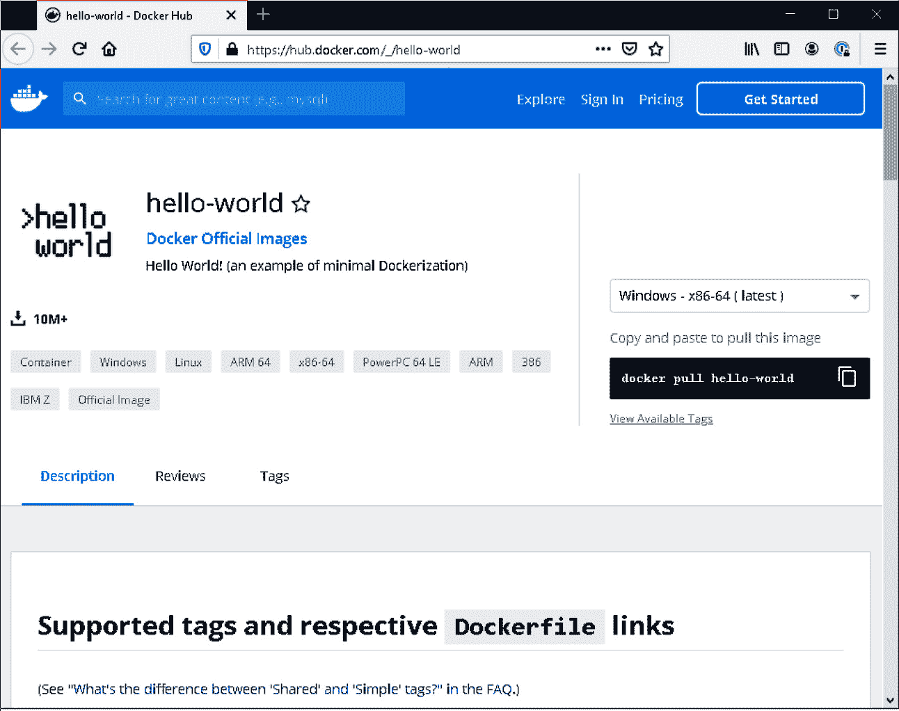
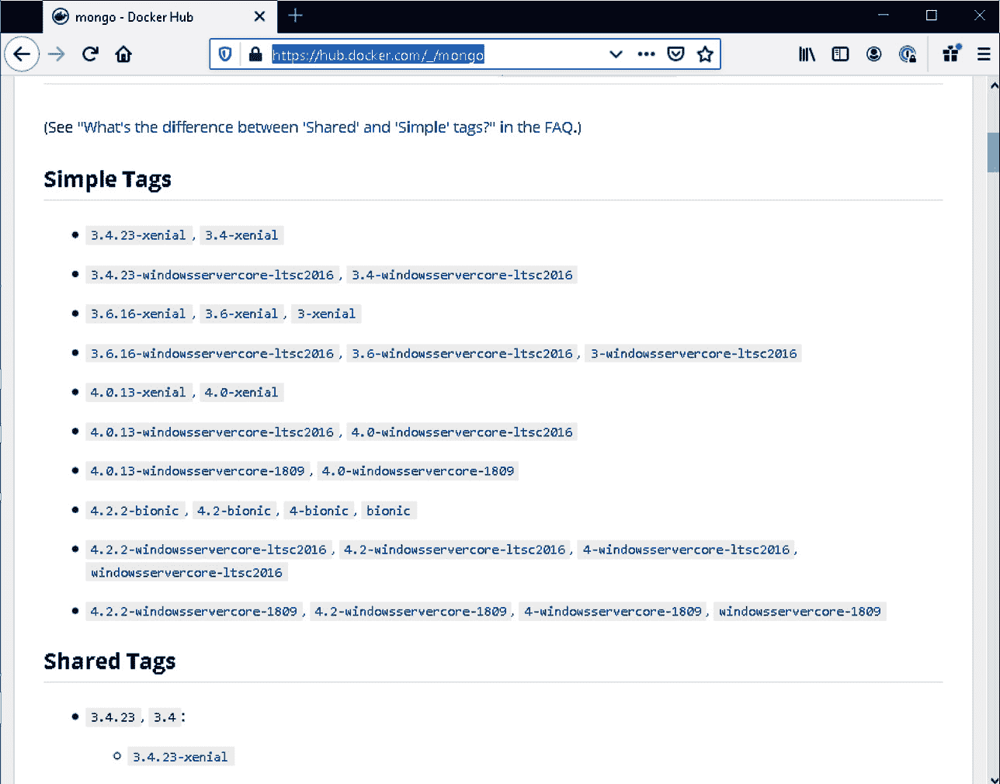
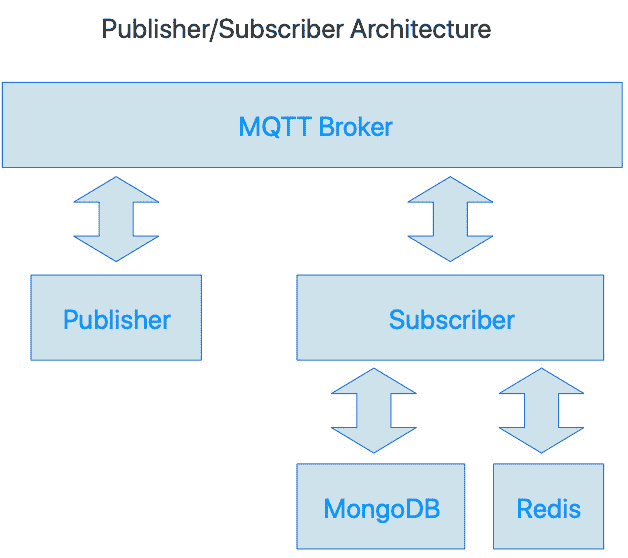
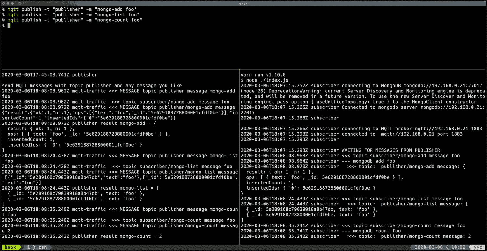

# 第三章：*第三章*：使用 Docker Hub 共享容器

在上一章中，我们学习了如何构建一个容器并在工作站上运行它。我们使用了一个 Debian 镜像作为起点，但这个镜像来自哪里呢？答案是，它来自 Docker Hub。Docker Hub 是 Docker 的官方容器镜像库，由为我们带来 Docker 本身的团队运营。

容器库包含了许多程序、服务器、服务等的官方镜像，这些程序你可以安装到自己的容器中。例如，有各种 Linux 发行版的官方镜像，版本的[Node.js](http://Node.js)、MySQL 和 MongoDB 等。

你可以将 Docker Hub 视为类似 GitHub。你可以浏览现有的组织和预制容器，还可以上传自己的容器并创建自己的组织。

我们将演示如何使用 Docker Hub 网站搜索并获取第三方容器的信息，以便在你的应用程序中使用。我们还将演示如何通过命令行使用 Docker Hub 中的第三方容器。我们将使用 Docker Hub 上的官方 MongoDB 容器，该容器由 MongoDB, Inc.发布。

整个后端应用程序可以通过多个 Docker 容器协作来实现。这种应用程序结构允许每个自定义容器的实现保持简单和最小化。我们将应用微服务架构来构建一个简单的应用程序。这展示了容器如何协同工作来创建一个完整的工作应用程序。最后，我们将看到如何使用 Docker Hub 与第三方和开发团队共享你已经准备好的生产环境容器。

在本章中，我们将涵盖以下主题：

+   介绍 Docker Hub

+   实现我们的应用程序的 MongoDB 容器

+   介绍微服务架构

+   实现一个示例微服务应用程序

+   在 Docker Hub 上共享你的容器

# 技术要求

唯一的技术要求是主机上安装了 Docker，以及一个浏览器，如 Google Chrome、Firefox 或 Microsoft Edge。这是 Docker 的最佳部分之一——你不需要在主机上安装复杂的服务器/服务；我们将它们安装在 Docker 容器中。

我们已准备好可以直接使用而无需修改的示例，这些示例存放在一个公共的 GitHub 仓库中，可以在[`github.com/PacktPublishing/Docker-for-Developers`](https://github.com/PacktPublishing/Docker-for-Developers)找到。

查看以下视频，看看代码是如何在实际中运作的：

[`bit.ly/2PTADjH`](https://bit.ly/2PTADjH)

# 介绍 Docker Hub

通常，你会通过命令行或 Dockerfile 与 Docker Hub 进行交互，但你也可以通过 Docker Hub 网站（[`hub.docker.com`](https://hub.docker.com)）来搜索任何你知道需要使用的预构建容器。你还可以利用该网站发现一些可能对你有用的预构建容器。

一般来说，你会从 Docker Hub 上的一些预构建 Docker 容器继承，以创建你自己的自定义容器。例如，你可能会从一个 Linux 发行版容器继承，并在该继承的/自定义容器中安装你项目所需的软件。

当你从 Linux 发行版继承时，该发行版的一些基础软件包将会被安装。如果你从 Debian 系列的 Linux 容器继承，你将能够在容器内使用 `apt` 包管理器来安装软件，就像你在专用机或虚拟机上运行该 Debian 系列 Linux 容器一样。

一些预构建容器继承自某种 Linux 发行版，并提供与该产品特定的软件包。比如，当你从 [Node.js](http://Node.js) 容器继承时，该 [Node.js](http://Node.js) 容器可能继承自某个 Linux 发行版容器，并且已经安装了 [Node.js](http://Node.js)、`npm` 和 `yarn`。

## 从命令行与 Docker Hub 交互

查看 Docker Hub 和 Docker 协同工作最简单的方法就是运行官方的 `hello-world` 容器。从 Docker Hub 运行容器的命令是 `docker run name-of-container`；我们可以输入 `docker run hello-world`：

```
# docker run hello-world Unable to find image 'hello-world:latest' locally latest: Pulling from library/hello-world 1b930d010525: Pull complete Digest: sha256:4fe721ccc2e8dc7362278a29dc660d833570ec2682f4e 4194f4ee23e415e1064 Status: Downloaded newer image for hello-world:latest
Hello from Docker!
This message shows that your installation appears to be working correctly.
To generate this message, Docker took the following steps: 1\. The Docker client contacted the Docker daemon. 2\. The Docker daemon pulled the "hello-world" image from the Docker Hub.
    (amd64)
 3\. The Docker daemon created a new container from that image which runs the
    executable that produces the output you are currently reading.
 4\. The Docker daemon streamed that output to the Docker client, which sent it
    to your terminal.
To try something more ambitious, you can run an Ubuntu container with:
 $ docker run -it ubuntu bash
Share images, automate workflows, and more with a free Docker ID:
 https://hub.docker.com/
For more examples and ideas, visit:
 https://docs.docker.com/get-started/
```

Docker 没有在本地容器缓存中找到该容器，所以它会自动下载并在 Docker 引擎中运行。容器中的代码很简单——它只是打印出前面的消息。

注意

你可以以相同的方式运行在 Docker Hub 网站上找到的任何容器！

如果你的输出结果与前面的输出不一致，那可能是你的 Docker 安装存在问题，或者从你的主机无法访问 Docker Hub 服务器。一个可能的问题是你的 Docker 安装要求你以 root 或管理员身份运行 `docker` 命令。

安装说明可以在 [`docs.docker.com/install/`](https://docs.docker.com/install/) 找到，而 Docker 的安装后说明可以在 [`docs.docker.com/install/linux/linux-postinstall/`](https://docs.docker.com/install/linux/linux-postinstall/) 找到。这些安装后说明解释了如何设置 Docker，以便你可以作为非 root 用户管理它。

## 使用 Docker Hub 网站

让我们去 Docker Hub 找找 `hello-world` 容器页面—[`hub.docker.com/_/hello-world`](https://hub.docker.com/_/hello-world)。页面大概会是这个样子：



图 3.1 – Docker Hub 上的 hello-world 镜像页面

这通常是你在 Docker Hub 上看到的大多数共享容器的典型情况。像 MongoDB 这样的特定软件包被封装在容器中，提供了各种版本的软件镜像。这使得你能够处理依赖于特定版本 Docker Hub 包的软件。

MongoDB 在 Docker Hub 上的页面是[`hub.docker.com/_/mongo`](https://hub.docker.com/_/mongo)。要找到它，只需在**hello-world**（或其他任何包）页面顶部的搜索框中输入`mongodb`，然后从搜索结果页面中选择它。你可以使用搜索框查找任何你需要的共享镜像。

页面中的**简单标签**和**共享标签**部分是重点。MongoDB 的各个版本镜像都使用了简单标签和共享标签进行标记。

例如，**3.4-xenial**简单标签意味着 MongoDB 3.4 版本的镜像运行在 Ubuntu Xenial 容器中。

**3.4**共享标签意味着有适用于多个主机操作系统（通常是 Windows Server、Linux 或 macOS）的 MongoDB 3.4 版本的镜像。Docker 守护进程会选择适合主机操作系统的镜像。

截至本文写作时，已有 MongoDB 3.4、3.6、4.0 和 4.2 的主要版本镜像，以及这些主要版本的次要点版本镜像：



图 3.2 – hello-world 的简单标签和共享标签

查找可用的第三方预构建容器的过程是相同的。例如，您可以搜索 Redis，您将得到一个类似的页面，其中包含有关可用 Redis 容器的详细信息。

# 为我们的应用实现 MongoDB 容器

我们可以通过实现 MongoDB 容器，探索使用 Docker Hub 上预构建的容器。稍后我们将把这个容器作为演示应用程序的一部分，这个应用程序由多个容器组成，并且它们协同工作。

我们将使用 MongoDB 的官方 Docker 镜像，可以在 Docker Hub 网站上找到，网址是[`hub.docker.com/_/mongo`](https://hub.docker.com/_/mongo)。我们将创建一个`.sh`脚本，在 Docker 中启动我们的镜像，以便启动过程简便且可重复。

我们在*第二章*《使用 VirtualBox 和 Docker 容器进行开发》中了解到，我们可以将容器的网络端口暴露给主机。这意味着我们可以在 Docker 中运行 MongoDB 容器镜像，并通过访问主机上的 MongoDB 端口，访问容器内正在运行的 MongoDB 服务器。

在这本书的 GitHub 仓库中 ([`github.com/PacktPublishing/Docker-for-Developers`](https://github.com/PacktPublishing/Docker-for-Developers))，有一个 `chapter3/` 目录，它是本章的配套内容。在这个目录中有一个 shell 脚本，[start-mongodb.sh](http://start-mongodb.sh)。这个脚本比我们在上一章中使用的简单脚本稍微复杂一点。我们将使用环境变量来配置 MongoDB，并且我们将使用主机上的一个目录来存储 MongoDB 的数据文件—这样备份数据就像将这些文件复制到备份介质上一样简单：

```
#!/bin/bash
# start-mongodb.sh
SERVICE=mongodb # name of the service
# You can set these in this script (uncomment and edit the lines) or set them in your .zshrc/.bashrc/etc.
# Change this to an EXISTING directory on the HOST where the mongodb database files will be created #!/bin/bash
# start-mongodb.sh
SERVICE=mongodb # name of the service
# Change this to an EXISTING directory on the HOST where the mongodb database files will be created and maintained.
#MONGO_DATADIR="$HOME/data"
# Stop any running MongoDB container, remove previous container, pull newer version
docker stop $SERVICE
docker rm $SERVICE
docker pull mongo:3.4
# Now we run it!
docker run …
```

你确实需要一个 Dockerfile 来创建容器镜像。然而，如果你使用的是来自 Docker Hub 的预构建容器镜像（如 MongoDB）并且是独立的，那么你就不需要 Dockerfile。MongoDB 的开发者们在将镜像上传到 Docker Hub 之前，会使用 Dockerfile 来生成这些镜像。

事实上，你可以从 MongoDB 在 Docker Hub 页面中的 **Supported tags** 部分看到，他们生产并支持了不少镜像，包括不同版本的镜像—有些是 Windows 操作系统版的，有些是 Linux 版的，等等。MongoDB 的开发者们肯定有很多 Dockerfile—每个镜像一个！

我们必须为 [start-mongodb.sh](http://start-mongodb.sh) 提供一个环境变量：`MONGO_DATADIR`，这是你工作站上一个现有的目录，用于存储 MongoDB 在容器中的数据文件。设置这个变量有几种方法：

+   你可以将 `export MONGODB_DATADIR=/path/to/data/dir` 添加到你的 shell 启动文件中（如 `.zshrc`、`.bashrc` 等）。

+   你可以在运行脚本之前手动在终端中进行 `export`（环境变量）操作。

+   你可以在命令行中运行 [start-mongodb.sh](http://start-mongodb.sh) 脚本时设置环境变量的值：`# MONGODB_DATADIR=~/data ./`[start-mongodb.sh](http://start-mongodb.sh)。

+   你可以取消注释 [start-mongodb.sh](http://start-mongodb.sh) 脚本文件中设置 `MONGO_DATADIR` 的那一行，并编辑它，将其设置为每次运行脚本时你希望使用的数据目录。

[start-mongodb.sh](http://start-mongodb.sh) 脚本中的最后一行是一个单独的命令行。行末的反斜杠（`\`）字符表示该行正在继续或与下一行连接。这个命令是启动容器的命令。可以想象，如果每次都必须输入这么长的命令来启动 MongoDB 容器，那会非常麻烦。`.sh` 脚本让这个过程变得相当轻松：

```
docker run \
  --name $SERVICE \
  -d \
  --restart always \
  -e TITLE=$SERVICE \
  -p 27017:27017 \
  -v "$MONGO_DATADIR":/data/db \
  mongo:3.4
```

让我们来看一下前面命令的不同部分：

+   `docker run` 命令为正在运行的 `mongodb` 容器命名。

+   `-d` 开关将容器以分离模式运行。容器将在工作站重启时自动启动。

+   `-e` 开关允许你将环境变量传递给容器；在这种情况下，我们传递了 `TITLE=mongodb` 环境变量。如果你想传递多个变量，可以使用多个 `-e` 开关。

+   `-p` 开关将容器中的端口 `27017` 映射到主机上的端口 `27017`。你可以将容器中的暴露端口重新映射到主机上的不同端口号。如果你已经在容器或主机上运行 MongoDB 服务器，你会这样做。然而，Docker 使我们能够灵活地始终在容器中运行 MongoDB，因此我们永远不必在主机上安装它。

    我们可能希望在主机上安装 MongoDB 客户端程序，以便使用 MongoDB REPL/shell 访问 MongoDB。一旦主机上暴露了端口 `27017`，任何程序都可以访问 MongoDB 数据库，就像它在主机上运行一样。

+   `-v` 开关将主机上的一个目录映射到容器中 MongoDB 将管理其数据库和其他文件的目录。

+   我们选择从 Docker Hub 下载并运行 `mongo:3.4`（标签/版本 3.4）。

    注意

    `docker run` 命令仅在容器尚未存在于你的工作站中，或者如果 Docker Hub 上的容器镜像较新时，才会从 Docker Hub 下载容器。

你可以用相同的方式运行你在 Docker Hub 上找到的任何容器！

让我们通过以下命令来运行脚本：

```
# mkdir -p ~/mongodb
# MONGO_DATADIR=~/mongodb ./start-mongodb.sh
```

以下输出包含一些关于无法停止名为 `mongodb` 的已运行容器的警告（这是预期的）：

```
# mkdir -p ~/mongodb && MONGO_DATADIR=~/mongodb ./start-mongodb.sh
stopping mongodb Error response from daemon: No such container: mongodb removing old mongodb Error: No such container: mongodb pulling mongodb 3.4: Pulling from library/mongo 976a760c94fc: Pull complete c58992f3c37b: Pull complete 0ca0e5e7f12e: Pull complete …
3757d63ce2b9: Pull complete Digest: sha256:4c7003e140fc7dce5f12817d510b5a9bd265f2 c3bbd6f81d50a60cc11f6395d9 Status: Downloaded newer image for mongo:3.4 docker.io/library/mongo:3.4 e3854f6931e1aa4b64557d5a54e652653123f84a 544fedf39a5cf68d2ee9d0af  # docker ps CONTAINER ID        IMAGE               COMMAND                  CREATED             STATUS              PORTS                      NAMES e3854f6931e1        mongo:3.4           "docker-entrypoint.s…"   5 seconds ago       Up 3 seconds        0.0.0.0:27017->27017/tcp   mongodb  #
```

Docker 拉取了正确的 MongoDB 镜像，并在 Docker 引擎中后台运行。你可以观察到以下内容：

+   MongoDB 镜像由几个已经下载的层组成（`Pull complete`）。

+   工作站上已经有一个现存的（但较旧的）镜像（`Downloaded newer image…`）。

+   容器是通过 `docker ps` 命令运行的。

如果容器遇到错误，可能会退出并在输出中打印诊断信息。你可以在容器中运行一个 shell 以进行取证诊断。

## 在容器中运行 shell

通常，你会在容器中运行一个 shell，以便你可以进一步了解容器的环境。例如，可能在你的 Dockerfile 中存在 bug——比如忘记将某个文件复制到容器中。你可以在容器中运行一个 shell，列出目录，你会发现文件缺失。

在 MongoDB 容器的情况下，你可能希望在容器内部运行 MongoDB 客户端命令。MongoDB 容器的 Docker Hub 页面说明我们可以通过简单地连接到正在运行的容器来运行客户端命令（[`hub.docker.com/_/mongo`](https://hub.docker.com/_/mongo)）。来自 MongoDB Docker Hub 页面的命令如下：

```
docker exec -it mongodb bash
```

该命令的不同部分如下：

+   `docker exec` 在运行中的容器中执行命令（[`docs.docker.com/engine/reference/commandline/exec/`](https://docs.docker.com/engine/reference/commandline/exec/)）。

+   `-it`选项指定 Docker 以交互模式运行容器——这意味着它从键盘获取输入并将输出发送到终端窗口。

在容器内，我们可以使用`ls`命令列出目录：

```
# docker exec -it mongodb bash root@e3854f6931e1:/# ls bin   data  docker-entrypoint-initdb.d  etc   js-yaml.js  lib64  mnt  proc  run   srv  tmp  var boot  dev   entrypoint.sh               home  lib         media  opt  root  sbin  sys  usr
```

我们可以通过在容器内使用`ps`命令查看 Docker 容器是否正在运行：

```
root@e3854f6931e1:/# ps -aux USER         PID %CPU %MEM    VSZ   RSS TTY      STAT START   TIME COMMAND mongodb        1  0.7  0.0 954676 62028 ?        Ssl  22:37   0:02 mongod root          40  2.8  0.0  18240  3248 pts/0    Ss   22:41   0:00 bash root          51  0.0  0.0  34420  2848 pts/0    R+   22:41   0:00 ps -aux root@e3854f6931e1:/# 
```

我们可以在容器内运行命令行 MongoDB 工具。我们不需要在工作站上安装这些工具！在这里，我们运行 MongoDB 命令，然后在 Mongo REPL 内运行`show collections`和`show databases`命令：

```
root@e3854f6931e1:/# mongo MongoDB shell version v3.4.23 connecting to: mongodb://127.0.0.1:27017 MongoDB server version: 3.4.23 Welcome to the MongoDB shell.For interactive help, type "help".For more comprehensive documentation, see         http://docs.mongodb.org/Questions? Try the support group         http://groups.google.com/group/mongodb-user Server has startup warnings:2019-12-13T22:37:12.342+0000 I CONTROL  [initandlisten]2019-12-13T22:37:12.342+0000 I CONTROL  [initandlisten] ** WARNING: Access control is not enabled for the database.2019-12-13T22:37:12.342+0000 I CONTROL  [initandlisten] **          Read and write access to data and configuration is unrestricted.2019-12-13T22:37:12.342+0000 I CONTROL  [initandlisten]> show collections > show databases admin  0.000GB local  0.000GB >root@e3854f6931e1:/# exit
```

一切准备就绪——MongoDB 正在运行，我们可以使用 REPL。`show collections`命令没有返回任何集合，因为我们还没有创建任何集合。`show databases`命令显示 MongoDB 默认有两个数据库：`admin` 和 `local`。

`docker logs`命令显示容器的`stdout`和`stderr`输出：

```
# docker logs mongodb 2019-12-13T22:37:09.161+0000 I CONTROL  [initandlisten] MongoDB starting : pid=1 port=27017 dbpath=/data/db 64-bit host=e3854f6931e1 2019-12-13T22:37:09.162+0000 I CONTROL  [initandlisten] db version v3.4.23 2019-12-13T22:37:09.162+0000 I CONTROL  [initandlisten] git version: 324017ede1dbb1c9554dd2dceb15f8da3c59d0e8 2019-12-13T22:37:09.162+0000 I CONTROL  [initandlisten] OpenSSL version: OpenSSL 1.0.2g  1 Mar 2016 2019-12-13T22:37:09.162+0000 I CONTROL  [initandlisten] allocator: tcmalloc 2019-12-13T22:37:09.162+0000 I CONTROL  [initandlisten] modules: none 2019-12-13T22:37:09.162+0000 I CONTROL  [initandlisten] build environment:2019-12-13T22:37:09.162+0000 I CONTROL  [initandlisten]     distmod: ubuntu1604 2019-12-13T22:37:09.162+0000 I CONTROL  [initandlisten]     distarch: x86_64 2019-12-13T22:37:09.162+0000 I CONTROL  [initandlisten]     target_arch: x86_64 2019-12-13T22:37:09.162+0000 I CONTROL  [initandlisten] options: {}2019-12-13T22:37:09.165+0000 I STORAGE  [initandlisten] wiredtiger_open config: create,cache_size=31491M,session_max=20000,eviction=(threads_min=4,threads_m ax=4),config_base=false,statistics=(fast),log=(enabled=true,archive=true,path=journal,compressor=snappy),file_manager=(close_idle_time=100000),checkpoint=(w ait=60,log_size=2GB),statistics_log=(wait=0),verbose=(recovery_progress),2019-12-13T22:37:14.335+0000 I INDEX    [initandlisten]          building index using bulk method; build may temporarily use up to 500 megabytes of RAM     2019-12-13T22:37:14.342+0000 I INDEX    [initandlisten] build index done.  scanned 0 total records. 0 secs 2019-12-13T22:37:14.344+0000 I COMMAND  [initandlisten] setting featureCompatibilityVersion to 3.4 (
…
```

你可能会使用`docker logs`命令查看容器的调试输出。

从我们之前的日志中可以看到，MongoDB 似乎在容器内运行得很好。没有打印任何错误信息。

你可以使用`docker logs`命令加上`-f`命令行选项来跟踪日志文件。当命令处于跟踪模式时，应用程序运行时写入日志的任何新行都会追加到屏幕显示中。

到目前为止，我们已经探索了如何使用 Docker 运行复杂的服务器应用程序（MongoDB），而无需在工作站上安装 MongoDB。通过 Docker，我们可以访问 MongoDB。

我们可以使用我们的`.sh`脚本启动 MongoDB，也可以停止它——我们可以随时这样做，这样就不必始终让 MongoDB 在后台运行。

现在我们知道如何运行 Docker 容器，让我们来看一下如何处理多个协同工作的容器。

# 介绍微服务架构

Docker 和 Docker Hub 支持使用微服务架构进行开发。该架构强调构建和运行专注于应用程序整体单一方面的容器。当所有容器都在运行时，你就有了完整的后端应用程序。这些容器可以很复杂，比如一个完整的数据库服务器，或者很简单，比如一个简短的 shell 脚本。理想情况下，你为应用程序实现的容器应该是简单的、短小的并且专注的。你编写的每个微服务应该易于调试，因为你不需要很多行代码。

假设我们想开发一个使用 MongoDB 和 Redis 的后端应用程序，并且其应用代码是使用 [Node.js](http://Node.js) 编写的。我们可以选择创建一个 Dockerfile，并从 MongoDB 镜像开始。然后通过使用 `apt` 安装 Redis，并将我们的程序添加到其中，就像我们在 *第二章* 中做的那样，*使用 VirtualBox 和 Docker 容器进行开发*。使用这种方法创建应用程序的问题是，当你因开发原因停止容器时，也会停止正在运行的 MongoDB 和 Redis 服务器。

与其使用一个包含所有安装内容的单体容器，你可以分别运行 MongoDB、Redis 和自定义应用程序容器。你甚至可以将你的自定义应用程序分成多个容器。你所需要的只是一个机制来实现应用程序容器之间的通信。

注意

在你的设计中，最好避免使用单体容器！虽然看起来像 MongoDB 这样的大型复杂程序可能是单体的，但它实际上只是一个你可以作为微服务使用的专用服务。

现在我们对微服务架构有了简要的了解，我们可以检查容器作为微服务的一些好处和要求。

## 可扩展性

可扩展性几乎总是后端实现中的一个重要考虑因素。例如，如果有足够多的人同时尝试从一个简单的 HTTP/WWW（网页）服务器上获取我们的页面，它可能会停止响应。因此，服务器农场的存在是为了你可以部署两个或更多这样的 HTTP/WWW 服务器，复制我们的页面服务功能。对于一个双服务器农场，你基本上能得到比单个服务器更多的用户在同时访问页面。随着流量的增长——例如，如果网站变得更受欢迎——你可以增加第三台服务器，然后是第四台服务器，以此类推。后端提供页面的能力会随着你的需求增长。

在微服务架构中，我们实现类似的可扩展性方式。我们可以运行多个 MongoDB 容器实例，以提高数据库操作的容量。唯一的诀窍是将 MongoDB 配置为集群或分片，并使应用程序容器使用这种数据库配置。

## 容器间通信

容器间通信通常涉及一些技术，允许消息从一个容器发送到另一个容器，并将响应或状态返回。能够在运行的容器之间进行通信可以通过几种技术实现，包括以下几种：

+   套接字

+   文件系统

+   数据库记录

+   HTTP

+   MQTT

现在让我们来讨论一下它们。

### 使用套接字

使用套接字是容器之间通信的一种复杂方法。如果您有五个容器，您可能需要为每个容器创建五个套接字，以提供容器间的通信路径。当您进行扩展时，每个容器需要创建更多的套接字，您实际上希望能够自动化这个过程。这涉及到相当多的业务逻辑。

### 使用文件系统

使用文件系统的方法涉及在所有容器之间共享某些内容，例如网络驱动器。要发送消息，容器将消息写入文件系统中的文件。要接收消息，容器从文件系统中的文件读取消息。接收方需要轮询或反复检查文件系统，以检测文件是否已被写入。这种方法并不理想，因为我们并不希望以这种方式共享网络驱动器——性能会较慢。

注意

轮询是一种编程技术，指的是持续检查机器状态（例如文件是否发生了变化）。

### 使用数据库记录

使用数据库记录的方法类似于文件系统方法，不同之处在于要发送的消息仅仅是写入到数据库中的记录，接收方只需轮询数据库记录的变化。一些数据库提供通知机制，告知客户端（接收方）数据库已发生变化。

文件系统和数据库方案都需要相当多的业务逻辑和调试。您必须考虑发送和接收消息的顺序，并避免由于旧消息被数据库或文件系统中的新消息覆盖而导致丢失消息。

### 使用 HTTP

HTTP 是一种无状态协议，因此您不需要维护一组开放的套接字来进行通信。该协议定义明确，且可供人类阅读（例如文本格式）。要发送消息，您只需向您希望通信的容器发送一个 HTTP 请求，并等待响应。您可以根据 HTTP 协议的规定关闭或保持连接（保持活跃）。此外，为了避免通过 HTTP 轮询消息或状态变化，您可以使用 WebSockets。

### 使用 MQTT

MQTT 是一个设计良好的消息总线。它的工作方式类似于 IRC 或 Slack，您有房间（主题）和在房间中的人（订阅者）。发送到房间（主题）的消息会被房间中的人（订阅者）接收。人们（订阅者）可以加入多个房间（主题），并接收那些房间（主题）的消息。

对于一个 MQTT 应用，必须有一个可以从其他容器访问的 MQTT 服务器（代理）容器。其他容器无需彼此了解，只需要知道 MQTT 代理的地址。

MQTT 代理接受来自一个或多个客户端的连接。客户端可以订阅一个或多个主题。主题就像 IRC 或 Slack 中的频道/房间名称一样是任意的，通常是字符串。当向 MQTT 代理发送某个特定主题的消息时，代理会将该消息发送给所有订阅了该主题的客户端。

Mosca（[`hub.docker.com/r/matteocollina/mosca`](https://hub.docker.com/r/matteocollina/mosca)）是一个用 JavaScript 编写的 MQTT 代理。你可以像运行 MongoDB 或 Redis 一样在容器中运行它。

还有几个其他的 MQTT 代理可供选择，你可以在 Docker Hub 上找到它们。

### HTTP 与 MQTT

MQTT 是一种专门为传递键/值对消息设计的协议。它的优势在于其广播能力。每个客户端都负责根据其关心的特定键请求修改值。每个客户端可以确保它们的更新会被任何其他感兴趣的客户端接收。MQTT 还具有保留特定键/值对的功能，因此当新客户端订阅时，它可以收到当前的键/值对（最近发送的那个）。

MQTT 并没有提供请求/响应协议，尽管实现一个很简单。使用 MQTT 进行请求/响应类型事务的缺点是，响应不能保证尽快发生。

HTTP 需要自定义编程才能提供 MQTT 所提供的消息传递服务。你可以实现一个类似消息总线的系统来模拟 MQTT 的功能，但这意味着你需要更多的编程工作，并且未来还会增加维护成本。HTTP 的优势在于它是一个请求/响应协议，因此你通常可以立刻收到响应。缺点是，如果服务器正在维护一组键/值对，你将需要从客户端轮询服务器，查看值是否发生了变化，并将更新的值提交给服务器。轮询会导致服务器消耗 CPU，即使值没有变化，这可能会导致服务器在足够多的客户端频繁轮询时崩溃。你可以使用 WebSockets，但最终你重新发明了 MQTT。

如果你需要比 MQTT 提供的更多功能，HTTP 是一个不错的选择。当然，HTTP 支持 PHP 或[Node.js](http://Node.js)（以及其他语言）后端服务。

HTTP 和 MQTT 是可以结合使用的。使用 HTTP 进行请求/响应类型事务，使用 MQTT 进行状态更新。

MQTT 对于我们的需求来说是一个不错的选择。

附带的 GitHub 仓库中的`chapter3/`目录包含一个简单的基于微服务的后端演示应用。它使用 MongoDB、Redis 和 MQTT，并包括一些发布者和订阅者应用程序，你可以在本书的 GitHub 仓库中找到它们（[`github.com/PacktPublishing/Docker-for-Developers`](https://github.com/PacktPublishing/Docker-for-Developers)）。在本章的后面，我们将学习如何通过 Docker Hub 共享我们的订阅者和发布者容器。

# 实现一个示例的微服务应用

我们可以使用 Mosca、MongoDB 和 Redis 容器，结合一些自定义容器，来实现一个简单但完整的应用：



图 3.3 – 我们的示例微服务应用程序图

发布者和订阅者将通过 MQTT 进行通信。订阅者将监听若干 MQTT 主题，指示它操作或从 MongoDB 和 Redis 数据库中检索信息。发布者将发送这些 MQTT 主题并打印响应。

发布者将基于 [Node.js](http://Node.js) 版本 11，订阅者将基于 [Node.js](http://Node.js) 版本 12。没有 Docker 或虚拟机的情况下，在同一台机器上并行运行两个 [Node.js](http://Node.js) 版本需要使用 **Node 版本管理器**（**nvm**）并在工作站上安装多个版本的 [Node.js](http://Node.js)。Docker 容器使得使用所需的多个版本变得简单，并将版本与使用该版本的应用程序一起打包成一个便捷的包（容器）。

发布者和订阅者应用程序位于伴随仓库中 `chapter3/` 目录下各自的 `publisher/` 和 `subscriber/` 子目录中。这些程序各自需要一个 Dockerfile，以便我们可以构建两个独立的容器。它们还各自有自己的辅助 `.sh` 脚本（[debug.sh](http://debug.sh)，[run.sh](http://run.sh)，[build.sh](http://build.sh) 等）。发布者应用只需要一个 MQTT 库。订阅者应用需要 MQTT 库、MongoDB 库和 Redis 库。这些库将通过 `npm`（[Node.js](http://Node.js) 包管理器）在容器内安装。

发布者和订阅者应用程序演示了微服务架构如何工作，使用多个 Docker 容器。

订阅者通过 [Node.js](http://Node.js) 包/库连接到 MongoDB 和 Redis 容器，这些包/库通过 `npm` 在容器中安装。订阅者提供基本的 **创建、读取、更新和删除**（**CRUD**）功能，用于在 MongoDB 和 Redis 数据库中添加、列出、删除和获取记录数量。发布者通过 MQTT 消息向订阅者发送请求，以调用这些功能。

我们的主题是基于一种模式派生的字符串：container/command。如果我们想与订阅者通信，模式是 subscriber/command。如果我们想与发布者通信，模式是 publisher/command。这个约定使得每个微服务希望订阅或发布的主题一目了然。

MQTT 主题和消息如下：

+   `subscriber/mongo-count`：返回 MongoDB 数据库中记录的数量。

+   `subscriber/mongo-add`：将消息内容添加到 MongoDB 数据库。

+   `subscriber/mongo-list`：返回一个包含 MongoDB 数据库中记录列表的 JSON 对象。如果消息是一个非零长度的字符串，则用于过滤返回的记录列表。

+   `subscriber/mongo-remove`：从 MongoDB 数据库中删除一条记录。消息可以是适合传递给 MongoDB 的`collection.deleteOne()`方法的字符串或对象（JSON）。

+   `subscriber/mongo-removeall`：删除 MongoDB 数据库中的所有记录。

+   `subscriber/redis-count`：返回 Redis 数据库中记录的数量。

+   `subscriber/redis-flushall`：删除 Redis 数据库中的所有记录。

+   `subscriber/redis-set`：向 Redis 数据库添加一条记录；消息是`key=value`形式。

+   `subscriber/redis-list`：列出 Redis 数据库中的所有记录，并返回一个记录的 JSON 数组。

+   `subscriber/redis-del`：从 Redis 数据库中删除一条记录。

+   `subscriber/commands`：返回可用命令（MQTT 主题）的列表。

在`chapter3/`目录的根目录下有一些 Shell 脚本，分别启动 Redis（[start-redis.sh](http://start-redis.sh)）、MongoDB（[start-mongodb.sh](http://start-mongodb.sh)）和 Mosca MQTT 代理（[start-mosca.sh](http://start-mosca.sh)），还有一个脚本[start-all.sh](http://start-all.sh)，可以启动所有三个服务。

我们之前已经详细介绍了[start-mongodb.sh](http://start-mongodb.sh)脚本的工作原理。[start-redis.sh](http://start-redis.sh)和[start-mosca.sh](http://start-mosca.sh)脚本大致相同；只是启动的程序（Redis 和 Mosca）名称有所不同。

需要注意的是，[start-mongodb.sh](http://start-mongodb.sh)脚本将主机的端口`27017`连接到容器的端口`27017`。这样，其他容器可以通过默认端口访问 MongoDB。[start-mosca.sh](http://start-mosca.sh)脚本将端口`1883`和`80`连接到主机，以便可以从任意容器使用 MQTT 和 WebSocket 上的 MQTT。[start-redis.sh](http://start-redis.sh)脚本将端口`6379`连接到主机，以便容器通过 Redis 的默认端口访问 Redis。当然，主机也可以访问任何容器。

`subscriber/start-subscriber.sh`和[publisher-start-publisher.sh](http://publisher-start-publisher.sh)脚本都在主机上本地运行应用程序，而不是在容器中运行。这允许使用 WebStorm 或其他 IDE，或[Node.js](http://Node.js)调试器进行主机本地调试功能。在下一章中，将详细介绍如何在 Docker 容器内完全开发和调试发布者和订阅者。

注意

要使用[start-subscriber.sh](http://start-subscriber.sh)和[start-publisher.sh](http://start-publisher.sh)脚本，您需要在开发工作站上安装[Node.js](http://Node.js)和`yarn`。确保在`subscriber/`和`publisher/`目录下分别运行`yarn install`。

这就是[start-subscriber.sh](http://start-subscriber.sh)的样子：

```
#!/bin/sh
# start-subscriber.sh
yarn start
```

[start-publisher.sh](http://start-publisher.sh)脚本与[start-subscriber.sh](http://start-subscriber.sh)脚本完全相同。发布者目录中的`package.json`文件指示`yarn start`来启动发布者程序。

`HOSTIP`变量必须设置为主机机器的 IP 地址，这个地址对我们的发布者和订阅者可见，并且在我们的 Node.js 程序中用于连接 MQTT 代理、MongoDB 服务器和 Redis 服务器。

在 macOS 上查找 IP 地址（假设你使用`192.168.*.*`作为家庭网络 IP 地址范围）：

```
# ifconfig | grep 192
inet 192.168.0.19 netmask 0xffff0000 broadcast 192.168.255.255
```

此主机的 IP 地址是`192.168.0.19`。

在 Linux 上查找 IP 地址，使用以下命令：

```
$ ip address | grep 192
inet 192.168.0.21/16 brd 192.168.255.255 scope global dynamic enp0s31f6
```

此主机的 IP 地址是`192.168.0.21`。

你将使用以下命令运行`start-publisher.sh`脚本：

```
HOSTIP=192.168.0.19 ./start-publisher.sh
```

要运行`start-subscriber.sh`脚本，使用以下命令：

```
HOSTIP=192.168.0.19 ./start-subscriber.sh
```

发布者程序相对简单。它连接到 MQTT 代理并监听以`publisher/`开头的主题。接收到的主题和消息会被转换成`subscriber/`格式的主题，并发布到 MQTT。订阅者会响应`publisher`主题和响应消息。

在发布者和订阅者都运行的情况下，我们使用 MQTT 命令行工具向发布者发送消息。在以下截图中，你可以看到我们如何执行一些订阅者命令。

这两个脚本假设我们已经在主机上安装了 Mosca。我们不需要为 MQTT 代理安装它，但需要它来使用命令行工具。从主机的命令行、`.sh`脚本或主机上的 crontab 中发送 MQTT 主题/命令非常有用。你也可以将 Mosca 作为库来实现你自己的[Node.js](http://Node.js)代码中的代理。

注意

对于有好奇心的读者，截图显示的是运行 tmux 的终端窗口，分为三个窗格。**tmux**是一个**终端复用器**：它允许在一个屏幕上创建、访问和控制多个终端。tmux 的 GitHub 仓库可以在[`github.com/tmux/tmux`](https://github.com/tmux/tmux)找到。

在以下截图中，你可以看到我们如何执行一些订阅者命令：



图 3.4 – 三个终端展示发布者和订阅者的协同工作

正如我们所看到的，发布者和订阅者按预期工作，容器与主机之间的数据库查询也正常。我们可以编辑和调试发布者和订阅者程序，直到它们按我们的需求正常工作。

现在我们已经有了正常工作的发布者和订阅者容器，接下来我们希望将它们与开发团队的其他成员共享。

# 在 Docker Hub 上共享你的容器

为了共享我们的容器，我们将使用 Docker Hub 并发布这两个容器。团队的其他成员可以从 Docker Hub 拉取预构建的容器并使用它们，而无需处理源代码库。他们对这些容器来说只是微服务，就像我们使用 Mosca、MongoDB 或 Redis 容器时并不需要源代码一样。

当然，开发团队需要运行这些脚本。

我们在 Docker Hub 上创建了一个名为 `dockerfordevelopers` 的组织，我们将用它来发布本书的容器。你无法推送到该组织，但我们可以。为了向 Docker Hub 发布，你需要使用 `docker login` 命令，并且必须已经在 [`hub.docker.com/`](https://hub.docker.com/) 上创建了帐户。

你也可以在 Docker Hub 上创建自己的组织，以便共享你自己的容器。如果你想使用本章 GitHub 仓库中的示例，你需要编辑脚本，将 `dockerfordevelopers` 替换为你自己的组织名称。

由于我们正在创建自己的自定义容器，我们需要为每个容器准备一些 `.sh` 脚本，正如上一章所述。发布者和订阅者各自有一套 `.sh` 脚本。

用于构建发布者容器的 Dockerfile 与上一章使用的几乎完全相同：

```
# we will inherit from the NodeJS v12 image on Docker Hub
FROM node:12
# set time zone so files' timestamps are correct
ENV TZ=America/Los_Angeles
# we include procps and telnet so you can use these with shell.sh prompt
RUN apt-get update -qq >/dev/null && apt-get install -y -qq curl procps telnet >/dev/null
# add a user - this user will own the files in /home/app
RUN useradd --user-group --create-home --shell /bin/false app
# set up and copy files to /home/app
ENV HOME=/usr/app
WORKDIR /home/app
COPY . /home/app
# install our NodeJS packages (from package.json)
RUN yarn install
# we run a script to stat the server; the array syntax makes it so ^C will work as we want
CMD  ["yarn", "start"]
```

这个 Dockerfile 与上一章中的一个主要区别是，我们没有安装 Apache 和 PHP，而是从 `node:12` 继承并安装了我们 [Node.js](http://Node.js) 程序所需的包。

在这个发布者的 Dockerfile 中，我们从 `node:12` 继承。订阅者的 Dockerfile 完全相同，只不过它是从 `node:13` 继承。这说明了你如何在同一主机上运行使用不同基础软件版本的容器；如果没有容器，这将是非常不便的。

注意

`node:12` 和 `node:13` 容器是从 Docker Hub 拉取并在每次构建容器时进行更新的。

以下是用于构建发布者的 [build.sh](http://build.sh) 脚本：

```
#!/bin/sh
# build.sh
# we use the "docker build" command to build a container named "dockerfordevelopers/publisher" from . (current directory)
# Dockerfile is found in the current directory, and determines how the container is built.
docker build -t dockerfordevelopers/publisher .
```

[build.sh](http://build.sh) 脚本非常简短，实际上只包含一行命令。输入 `./`[build.sh](http://build.sh) 比完整输入 `docker build -t dockerfordevelopers/publisher .` 命令要容易。这也使得整个过程更不容易出错，而且你不必记住命令行选项和格式。

对于订阅者，亦有一个几乎相同的 [build.sh](http://build.sh) 脚本。唯一不同的是构建的容器名称：`dockerfordevelopers/subscriber`。

发布者的 [build.sh](http://build.sh) 脚本输出如下：

```
# ./build.sh
Sending build context to Docker daemon  4.902MB
Step 1/9 : FROM node:12
Step 2/9 : ENV TZ=America/Los_Angeles
Step 3/9 : RUN apt-get update -qq >/dev/null && apt-get install -y -qq curl procps telnet >/dev/null
Step 4/9 : RUN useradd --user-group --create-home --shell /bin/false app
Step 5/9 : ENV HOME=/usr/app
Step 6/9 : WORKDIR /home/app
Step 7/9 : COPY . /home/app
Step 8/9 : RUN yarn install
yarn install v1.16.0
[1/4] Resolving packages...
[2/4] Fetching packages...
[3/4] Linking dependencies...
[4/4] Building fresh packages...
Done in 1.55s.
Step 9/9 : CMD  ["yarn", "start"]
 ---> Running in f882d870bc6a
Removing intermediate container f882d870bc6a
 ---> b8f9439e36fa
Successfully built b8f9439e36fa
Successfully tagged dockerfordevelopers/publisher:latest
```

你可以看到，`1/9`、`2/9`、`3/9` 等步骤与我们的 Dockerfile 中的每一行一一对应。我们 Dockerfile 中的第一行是 `From Node:12`，而 `Step 1/1` 行也是 `From Node:12`。类似地，`Step 2/2` 是 Dockerfile 中的第二行。构建过程按 Dockerfile 中的步骤依次执行，最终构建出容器镜像。

输出中的最后一行告诉我们容器的名称是 `dockerfordevelopers/publisher:latest`。我们使用这个名称将构建的容器推送到 Docker Hub。

我们使用 [push.sh](http://push.sh) 脚本来执行将发布者容器推送到 Docker Hub 组织的命令：

```
#!/bin/sh
# push.sh
docker push dockerfordevelopers/publisher
```

这是另一个方便我们的单行 `.sh` 脚本。

以下是发布者的 [push.sh](http://push.sh) 脚本的输出：

```
# ./push.sh
The push refers to repository [docker.io/dockerfordevelopers/publisher]
9502c45a0d0e: Pushed
79b7f0047832: Pushed
bca5484440a2: Pushed
…
6a335755bda7: Pushed
latest: digest: sha256:e408ae01416511ad8451c31e532e3c2c6eb3324 ad43834a966ff161f9062e9ad size: 3056
#
```

我们在微服务架构项目中，有一种用于与自定义容器协作的模板或模式：

1.  我们编辑并调试我们的容器代码。

1.  我们运行 [build.sh](http://build.sh) 脚本来构建容器镜像。

1.  我们运行 [push.sh](http://push.sh) 脚本将容器推送到 Docker Hub。

现在，你的同事们可以运行发布者镜像。这是在第二台机器上运行的，例如开发者的工作站：

```
# docker run --rm dockerfordevelopers/publisher
Unable to find image 'dockerfordevelopers/publisher:latest' locally
latest: Pulling from dockerfordevelopers/publisher
c5e155d5a1d1: Pull complete
221d80d00ae9: Pull complete
4250b3117dca: Pull complete
69df12c70287: Pull complete
…
Digest: sha256:e408ae01416511ad8451c31e532e3c2c6eb3324ad 43834a966ff161f9062e9ad
Status: Downloaded newer image for dockerfordevelopers/publisher:latest
yarn run v1.16.0
$ node ./index.js
```

当然，在这第二台机器上，开发者已经安装并运行了所需的微服务：Mosca、MongoDB 和 Redis。如果没有所有微服务在 Docker 中运行，应用程序将无法启动。

在你的开发主机上推送到 Docker Hub，并在生产主机上从 Docker Hub 拉取，是一种简单的生产环境容器部署方式。然而，这并不太健壮。我们将在后面的章节中讨论更好的部署方案。

# 总结

在本章中，我们学会了如何将一个通常会在虚拟机中运行并包含多个服务（MongoDB、Redis 和 Mosca）的应用程序，拆分为基于微服务的架构，并在 Docker 容器中运行。

我们学会了如何浏览 Docker Hub 网站，并找到一些有用的预制 Docker 容器，只需下载并运行它们。

我们还学会了如何将自己的微服务打包为 Docker 容器，并将它们推送到 Docker Hub，以便公共用户或开发团队成员使用。

多个容器被用来启动完整的应用程序，作为通过端口与主机端口映射的微服务进行通信。这并不理想，特别是当你已经在 `80` 端口上运行 WWW 服务器时；Mosca 也使用 `80` 端口。

在下一章中，我们将讨论如何使用 Docker Compose 工具设计完整的微服务架构应用程序并运行它们，以便它们拥有一个私有的内部网络，从而不再需要主机端口。

# 深入阅读

你可以参考以下链接，了解本章中涉及的更多内容：

+   官方 Docker 文档：[`docs.docker.com`](https://docs.docker.com)

+   Dockerfile 参考文档: [`docs.docker.com/engine/reference/builder/`](https://docs.docker.com/engine/reference/builder/)

+   Docker Hub 网站: [`hub.docker.com/`](https://hub.docker.com/)

+   Docker Hub 的文档: [`docs.docker.com/docker-hub/`](https://docs.docker.com/docker-hub/)

+   Node.js 容器在 Docker Hub 上的文档: [`hub.docker.com/_/node`](https://hub.docker.com/_/node)

+   Redis 容器在 Docker Hub 上的文档: [`hub.docker.com/_/redis`](https://hub.docker.com/_/redis)

+   MongoDB 容器在 Docker Hub 上的文档: [`hub.docker.com/_/mongo`](https://hub.docker.com/_/mongo)

+   Mosca 容器在 Docker Hub 上的文档: [`hub.docker.com/r/matteocollina/mosca`](https://hub.docker.com/r/matteocollina/mosca)
