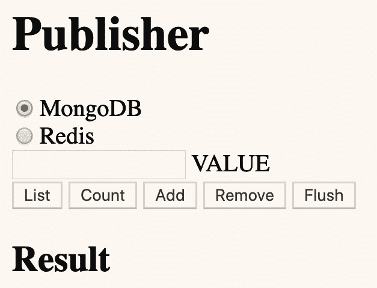

# 第四章： 使用容器组合系统

在上一章中，我们使用微服务架构创建了一个服务器端应用程序。该应用程序由五个独立的容器组成：三个官方镜像和两个自定义镜像。官方镜像分别用于 MongoDB、Redis 和 Mosca（MQTT）。

在大多数情况下，容器之间的通信是通过 MQTT 消息传递进行的。订阅者容器执行数据库 `localhost`（`127.0.0.1`）的操作，且订阅者和发布者程序都可以访问位于 `localhost` 的 Mosca/MQTT。

在本章中，我们将讨论如何组合系统——具体来说是 Docker Compose。我们还将学习如何保持网络访问的私密性，以便服务可以从容器内部访问，但无法从主机访问。我们将了解如何在容器之间共享文件系统中的卷。Docker Compose 也有替代方案，我们将看看其中的一些。

本章将涵盖以下主题：

+   Docker Compose 介绍

+   使用 Docker 本地网络

+   本地卷

+   其他组合工具

总结一下，我们有三个官方 MongoDB、Mosca 和 Redis 的镜像容器。我们还为本书创建了两个额外的容器——发布者和订阅者微服务。

发布者微服务已修改为在 web 浏览器中呈现一个表单。表单中的字段和提交按钮使我们能够执行由订阅者微服务支持的各种操作：



图 4.1 – 我们更新后的发布程序生成的表单

您可以选择执行 CRUD 操作的数据库。您还可以设置一个值，用于**列表**、**计数**、**添加**和**移除**操作。每个 CRUD 操作都有一个按钮，还有一个**刷新**按钮，用于从所选数据库中删除所有记录。操作的返回值/结果显示在表单下方的**结果**标题下。

# 技术要求

本章的前提软件包括 Docker、Docker Compose（参见 [`docs.docker.com/compose/install/`](https://docs.docker.com/compose/install/)）、Git 以及一种 web 浏览器，如 Google Chrome 或 Safari。

Docker 和 Docker Compose 文档使用“*服务*”这个术语，而我们使用“*微服务*”这个术语。对于本章来说，这两个术语可以互换使用。

在 GitHub 仓库中 ([`github.com/PacktPublishing/Docker-for-Developers`](https://github.com/PacktPublishing/Docker-for-Developers))，有一个 `chapter4/` 目录，包含本章的相关内容。该目录包含了上章中使用的微服务架构代码的修改版本。

查看以下视频，了解代码的实际应用：

[`bit.ly/3iRWqoH`](https://bit.ly/3iRWqoH)

# Docker Compose 介绍

容器的编排系统是一种工具，允许我们在配置文件中描述整个微服务架构程序，然后对所描述的系统进行操作。Docker Compose 就是这样的工具。在我们深入了解 Docker Compose 是什么以及它能做什么之前，让我们先来看一下我们为什么需要这样一个工具。

## .sh 脚本的问题

到目前为止，我们一直在使用`.sh`脚本来简化我们的微服务应用的工作。我们已经使用了以下脚本：

+   start-mongodb.sh

+   start-redis.sh

+   start-mosca.sh

+   `subscriber/`start-subscriber.sh

+   `publisher/`start-publisher.sh

+   `subscriber/`build.sh

+   `publisher/`build.sh

+   `subscriber/`push.sh

+   `publisher/`push.sh

我们不再需要将这些命令分别调用，可以通过编写一个单独的 start-all.sh 脚本来依次执行它们：

```
#!/bin/sh
./start-mosca.sh
./start-mongodb.sh
./start-redis.sh
cd subscriber && ./start-subscriber.sh & cd ..
cd publisher && ./start-publisher.sh & cd ..
```

注意

start-all.sh 脚本仅供参考。接下来我们将不再使用它！

这个方法是可行的，但关于哪些端口开放以及其他容器特定的访问信息都隐藏在这些`.sh`脚本中。例如，mongodb.sh 脚本启动 MongoDB 并将容器的`27017`端口绑定到主机的`27017`端口。

修改配置可能需要编辑这些`.sh`脚本中的每一个，甚至可能需要修改 start-all.sh 脚本本身以及它的对应脚本 stop-sll.sh。我们还有一些额外的脚本，用于构建和发布容器，并执行其他管理任务。这个方法既不方便，也容易出错。

Docker Compose 工具解决了大部分`.sh`脚本的问题，尽管我们仍然可能希望使用`.sh`脚本来调用带有各种命令行参数的`docker-compose`命令。

## Docker Compose 配置文件

Docker Compose 的配置通过`.yml`文件完成，文件内容是 YAML。YAML 是一种标记语言，允许数据序列化。它类似于 JSON 格式，但语法上对人类更友好。

一个名为`docker-compose.yml`的文件是 Docker Compose 的默认配置文件。你可以拥有多个配置文件，并且可以通过命令行参数告诉 Docker Compose 使用哪些配置文件。

让我们看一下仓库中`chapter4/`目录下的`docker-compose-example.yml`文件。Docker Compose 工具可以取代我们迄今为止使用的 shell 脚本方法：

```
# Example Docker Compose file for our chapter 4 application
version: '3'
services:
```

Docker Compose 支持不同版本的`docker-compose.yml`格式。新版的版本号较高，并添加了额外的`docker-compose`功能。在`services`部分，我们描述了要构建和运行的每个容器。

我们在`services`部分下有一个`redis`容器。`image`字段指定我们将使用来自 Docker Hub 的`redis`镜像。我们将数据库持久化到`/tmp/redis`，以便在容器停止和重新启动时不会丢失数据：

```
  redis:
    image: redis
    volumes:
      - /tmp/redis:/data
    ports:
      - 6379:6379
```

我们在主机上暴露`6379`端口，这是默认的 Redis 端口。暴露该端口可以让主机和其他容器访问 Redis 服务器。

在 Redis 之后，我们有 MongoDB 容器。我们将使用来自 Docker Hub 的`mongo`镜像。我们将数据保存在主机的`/tmp/mongo`目录中，这样在停止和重启容器时，数据库的内容可以被保留：

```
  mongodb:
    image: mongo
    volumes:
      - /tmp/mongo:/data/db
    ports:
      - 27017:27017
```

MongoDB 的默认 TCP 端口是`27017`，我们将其暴露出来，将容器中的`27017`端口映射到主机上的`27017`端口。主机和容器中的工具可以通过`localhost`访问 MongoDB，我们无需在命令行中指定端口，因为默认端口已配置。

接下来是 Mosca 容器。我们使用来自 Docker Hub 的`matteocollina/mosca`镜像。我们将容器中的`/db`卷设置为主机上的`/tmp/mosca`，以持久化 Mosca 的状态：

```
  mosca:
    image: matteocollina/mosca
    volumes:
      - /tmp/mosca:/db
    ports:
      - 1883:1883
      - 80:80
```

我们将`1883`和`80`端口暴露为与主机上相同的端口。端口`1883`是默认的 MQTT 端口。端口`80`用于支持 WebSocket 上的 MQTT，因此您可以在浏览器中的 JavaScript 程序中使用 MQTT。

在我们的`publisher`容器中，`build:`行告诉`docker-compose`我们需要构建位于`publisher/`目录中的容器。`publisher`目录中的 Dockerfile 用于定义容器的构建方式：

```
  publisher:
    build: publisher
    environment:
    - MQTT_HOST=${HOSTIP}
    - REDIS_HOST=${HOSTIP}
    - MONGO_HOST=${HOSTIP}
    ports:
      - 3000:3000
```

我们暴露`3000`端口，以便我们能够使用主机上的 Web 浏览器访问容器中运行的 Web 服务器。

在我们的`subscriber`容器中，`build:`行告诉`docker-compose`我们需要构建位于`subscriber/`目录中的容器。`subscriber`目录中的 Dockerfile 用于定义容器的构建方式：

```
  subscriber:
    build: subscriber
    environment:
    - MQTT_HOST=${HOSTIP}
    - REDIS_HOST=${HOSTIP}
    - MONGO_HOST=${HOSTIP}
```

我们不暴露任何内容——订阅者通过直接的 API 调用来执行所有 I/O 操作，访问 MongoDB 和 Redis，同时通过 MQTT 接受命令并报告状态。

需要注意的几点如下：

+   所有的容器都在单一的配置文件中进行简洁描述。

+   容器仍然暴露与`.sh`脚本相同的端口到主机。

+   容器仍然需要通过`HOSTIP`环境变量找到数据库和 MQTT 经纪人容器。该变量仍然需要像前一章中解释的那样进行设置。

要使用我们的`docker-compose-example.yml`脚本启动所有五个微服务，我们使用`docker-compose up`命令。`-f`选项告诉`docker-compose`使用哪个 Docker Compose `.yml` 文件：

```
% docker-compose -f docker-compose-example.yml up
```

默认情况下，`docker-compose`以调试模式运行配置文件中的所有容器。它们会按照打印行的顺序将输出打印到终端/控制台。你可能会看到首先是订阅者的输出，接着是发布者的输出，然后再是订阅者的输出。如果按下*Ctrl* + *C*，它将终止所有容器并返回到命令提示符。

如果你希望容器以分离模式或守护进程模式运行，可以使用`-d`选项：

```
% docker-compose -f docker-compose-example.yml up -d
```

在分离模式或守护模式下，容器不会向终端/控制台输出信息，你将立即返回到命令提示符。

为了停止所有五个微服务，我们使用类似的`docker-compose`命令：

```
% docker-compose -f docker-compose-example.yml down
```

如果我们没有指定要使用的 Docker Compose 配置文件（`-f docker-compose-example.yml`），则`docker-compose`命令会查找并使用名为`docker-compose.yml`的文件。

`docker-compose up`/`down`命令还允许我们启动和停止一个或多个服务。例如，我们可以只启动`mongodb`和`redis`容器：

```
% docker-compose -f docker-compose-example.yml up mongodb redis
```

现有的`mongodb`和/或`redis`容器将被停止并启动新的容器。由你的程序来检测这些服务的连接是否被停止，并相应地处理错误。

我们可以使用`docker-compose`构建任何或所有的服务：

```
% docker-compose -f docker-compose-example.yml build publisher
```

这个命令构建了我们的发布者容器，但不会启动任何容器。

能够指定一个或多个容器（通过名称）的能力，替代了我们许多旧的`.sh`脚本。我们不再需要启动脚本，因为可以使用`docker-compose up`；我们不再需要停止脚本，因为可以使用`docker-compose down`；我们不再需要构建脚本，因为可以使用`docker-compose build`；等等！更多详细信息请参见[`docs.docker.com/compose/reference/`](https://docs.docker.com/compose/reference/)。

我们很可能会为开发和生产环境设置不同的配置，甚至可能有额外的场景。在`.sh`脚本中，我们为开发和生产环境分别设置了 debug.sh 和 run.sh 脚本。这个`.sh`文件方案的问题在于，我们在每个脚本中几乎有相同的`docker run`命令，只有细微的差异。

Docker Compose 有一个继承功能，允许在`docker-compose`命令行中指定多个配置文件。

## 使用多个配置文件进行继承

我们可以实现一个基础的`docker-compose.yml`文件，然后使用我们自己的覆盖配置文件来覆盖该文件中的设置。这个功能被称为`docker-compose`文件及其设置覆盖功能。

Docker Compose 从命令行上的第一个配置文件开始，然后将第二个文件合并到其中，再将第三个（如果有的话）合并进去，依此类推。合并意味着将第二个（或第三个）配置文件中的设置应用到当前的配置状态中，这最终将被使用。如果第二个配置文件中的设置存在，它们将替换第一个配置文件中的设置；如果不存在，它们将添加新的服务或设置。

让我们看看从现在开始将使用的`docker-compose.yml`基础文件：

```
version: '3'
services:
  redis:
    image: redis
  mongodb:
    image: mongo
    volumes:
      - /tmp/mongo:/data/db
  mosca:
    image: matteocollina/mosca
    volumes:
      - /tmp/mosca:/db
  publisher:
    build: publisher

    depends_on:
      - "mosca"
      - "subscriber"
  subscriber:
    build: subscriber
    depends_on:
      - "redis"
      - "mongodb"
      - "mosca"
```

这看起来像前一节中的`docker-compose-example.yml`文件，但你可能会注意到几个不同点：

+   有两个`depends_on`选项——一个用于发布者，另一个用于订阅者。

+   我们不再将容器的端口暴露或绑定到主机的端口。

接下来我们将详细查看它们。

## `depends_on` 选项

`depends_on` 选项允许我们控制容器的启动顺序（参考 [`docs.docker.com/compose/startup-order/`](https://docs.docker.com/compose/startup-order/)）。此外，`depends_on` 表示容器之间的相互依赖。更多关于 `depends_on` 选项的信息，请参考 https://docs.docker.com/compose/compose-file/#depends-on#depends_on。

服务依赖关系会导致以下行为：

+   `docker-compose up` 按照依赖顺序启动服务。在我们的示例中，`redis`、`mongo` 和 `mosca` 服务会在 `subscriber` 容器之前启动，且 `mosca` 和 `subscriber` 都会在 `publisher` 之前启动。

+   `docker-compose up SERVICE` 会自动包含 `SERVICE` 下的依赖项。

`docker-compose stop` 按照依赖顺序停止服务（首先是 `mosca`，然后是 `mongodb`，再是 `redis`，这些服务在我们的 `docker-compose.yml` 文件中定义）。

启动服务的顺序很重要，因为如果我们在 `mosca` 启动之前启动 `publisher`，`publisher` 程序中连接 MQTT 代理的逻辑将失败。同样，若在数据库和 MQTT 代理服务启动之前启动 `subscriber`，则 `subscriber` 中的连接数据库和 MQTT 代理的逻辑也可能失败。在 `subscriber` 启动之前启动 `publisher` 是没有意义的，因为 `publisher` 通过 MQTT 发送的任何内容都不会被接收，可以说是“白费力气”。

即使容器已经启动，也不能保证在使用它们的微服务尝试连接时，容器中的程序已经完成初始化。在我们的发布者和订阅者代码中，我们创建了一个 `wait_for_services()` 方法，确保只有在服务启动并准备好后，我们才尝试连接。

我们在发布者和订阅者程序中首先调用 `wait_for_services()`，以确保我们等待足够长的时间，直到依赖服务启动并准备好。

`publisher/`index.js 中的 `wait_for_services()` 方法如下：

```
/**
 * wait_for_services
 *
 * This method is called at startup to wait for any dependent containers to be running.
 */
const waitOn = require("wait-on"),
  wait_for_services = async () => {
  try {
    await waitOn({ resources: [`tcp:${mqtt_host}:${mqtt_port}`] });
  } catch (e) {
    debug("waitOn exception", e.stack);
  }
};
```

我们的 `publisher` 微服务仅连接到 MQTT 代理，因此 `wait_for_services()` 方法只等待我们的 MQTT 代理的 TCP 端口可访问。

`subscriber/`index.js 中的 `wait_for_services()` 方法稍微复杂一些：

```
/**
 * wait_for_services
 *
 * This method is called at startup to wait for any dependent containers to be running.
 */
const waitOn = require("wait-on"),
  wait_for_services = async () => {
  try {
    debug(`waiting for mqtt (${mqtt_host}:${mqtt_port})`);
    await waitOn({ resources: [`tcp:${mqtt_host}:${mqtt_port}`] });
    debug(`waiting for redis (${redis_host}:${redis_port})`);
    await waitOn({ resources: [`tcp:${redis_host}:${redis_port}`] });
    debug(`waiting for mongo (${mongo_host}:${mongo_port})`);
    await waitOn({ resources: [`tcp:${mongo_host}:${mongo_port}`] });
  } catch (e) {
    debug("***** exception ", e.stack);
  }
};
```

`subscriber` 微服务需要连接到 MQTT 代理、`redis` 服务器和 `mongo` 服务器。我们等待这些服务器的 TCP 端口可访问。

还有其他方法可以等待服务可用，其中包括在容器中安装命令行程序/脚本，并在启动发布者或订阅者服务之前运行它们。例如，您可以使用这个方便的 `wait-for-it.sh` 脚本，详情请见 [`github.com/vishnubob/wait-for-it`](https://github.com/vishnubob/wait-for-it)。

在`docker-compose.yml`文件中没有暴露容器端口选项并非疏忽。我们完全可以在重写文件中指定这些选项，从而为现有容器提供选项。

## 使用重写文件添加端口绑定

在代码库中的`chapter4/`目录下，我们有一个`docker-compose-simple.yml`文件，它是一个重写文件的示例：

```
version: '3'
services:
  redis:
    ports:
      - 6379:6379
  mongodb:
    ports:
      - 27017:27017
  mosca:
    ports:
      - 1883:1883
      - 80:80
  publisher:
    environment:
    - MQTT_HOST=${HOSTIP}
    - REDIS_HOST=${HOSTIP}
    - MONGO_HOST=${HOSTIP}
    ports:
      - 3000:3000
  subscriber:
    environment:
    - MQTT_HOST=${HOSTIP}
    - REDIS_HOST=${HOSTIP}
    - MONGO_HOST=${HOSTIP}
```

在这里，我们指定了每个容器的端口。我们正在从`docker-compose.yml`文件中继承选项，并添加暴露每个容器端口的选项。

我们没有为`subscriber`微服务暴露任何端口，因为它从不将任何端口暴露到主机的端口。

我们还定义了三个环境变量，供发布者和订阅者容器访问`MQTT_HOST`（`mosca`）、`REDIS_HOST`（`redis`）和`MONGO_HOST`（`mongodb`）服务。

使用这两个配置文件（继承）的`docker-compose`命令来启动我们的服务，如下所示：

```
% HOSTIP=192.168.0.21 docker-compose -f docker-compose.yml -f docker-compose-simple.yml up
```

由于我们没有使用`-d`开关，我们的容器没有被分离，而是将其控制台/调试输出打印到终端。直到你按下*Ctrl*+*C*，你才能输入更多命令。这样做将按反向`depends_on`顺序停止所有容器，并将你带回命令提示符：

```
% HOSTIP=192.168.0.21 docker-compose -f docker-compose.yml -f docker-compose-simply.yml up -d
```

添加`-d`开关会使所有容器以守护进程模式启动。它们在后台运行，你会立即得到一个命令行提示符。不会再有进一步的输出发送到终端。

如果容器以守护进程模式运行，你可以使用`docker-compose down`命令来停止它们：

```
% HOSTIP=192.168.0.21 docker-compose -f docker-compose.yml -f docker-compose-simple.yml down
```

我们也可以使用三个或更多配置文件。每个在命令行中指定的附加文件都会进一步扩展容器和选项。

到目前为止，我们实际上是通过继承设置的生产环境。使用这种方式调试特别痛苦，因为你诊断错误的唯一方法就是向发布者和/或订阅者添加`debug()`调用，然后重新构建容器，并重新运行整个应用程序。

为了改善我们的开发和调试周期，我们可以将`publisher/`和`subscriber/`目录绑定/挂载到容器中的`/home/app`目录。两个容器的 Dockerfile 使用 nodemon（[`nodemon.io/`](https://nodemon.io/)）工具来启动容器内的应用程序。

nodemon 工具做的事情远不止启动我们的程序：

+   它还会监控程序的状态，如果程序停止，nodemon 会重新启动它。这非常有用，因为我们的 Node.js 程序可能会遇到一些无法轻易恢复的错误，然后直接退出，让 nodemon 重启它们。

+   对于开发，nodemon 还会监控代码目录中文件的时间戳，如果任何文件发生变化，它将重新启动程序。

由于我们可以将源代码直接绑定/挂载到容器中，因此我们在主机上使用编辑器或 IDE 对文件进行的任何更改将立即影响容器中的变化。

我们可以创建一个 `docker-compose-simple-dev.yml` 文件，将我们的绑定/挂载添加到发布者和订阅者：

```
version: '3'
services:
  publisher:
    volumes:
      - ./publisher:/home/app
  subscriber:
    volumes:
      - ./subscriber:/home/app 
```

我们使用 `docker-compose up` 命令来运行此命令：

```
% HOSTIP=192.168.0.21 docker-compose -f docker-compose.yml -f docker-compose-simple.yml -f dockercompose-simple-dev.yml up -d
```

如果我们在主机上编辑，比如 `publisher/`index.js 文件，我们可以看到 nodemon 检测到更改并重新启动发布者程序：

```
publisher_1   | [nodemon] restarting due to changes...
publisher_1   | [nodemon] starting `node ./index.js`
publisher_1   | 2020-03-30T18:03:39.537Z publisher publisher microservice, about to wait for MQTT host(192.168.0.21, 1883
publisher_1   | 2020-03-30T18:03:39.546Z publisher ---> wait succeeded
publisher_1   | 2020-03-30T18:03:39.587Z publisher publisher connecting to MQTT mqtt://192.168.0.21
publisher_1   | 2020-03-30T18:03:39.591Z publisher connected to  192.168.0.21 port 1883
publisher_1   | 2020-03-30T18:03:39.638Z publisher listening on port  3000
```

我们现在已经很好地掌握了 `docker-compose`，但是我们正在将容器的端口绑定到主机的端口。如果你有一个容器需要绑定主机的 `80` 端口，而主机上已经在运行一个 Web 服务器或另一个项目的容器，也想绑定到 `80` 端口，那么这会带来问题。

幸运的是，Docker 提供了一种功能，只将我们的端口暴露给我们的容器！

# 使用 Docker 本地网络

Docker 和 Docker Compose 都有命令行选项来指定应用将使用的 Docker 本地网络。使用该 Docker 本地网络可以让我们的容器访问另一个容器的端口，而无需将这些端口绑定/暴露到主机的端口上。

## 使用 .sh 脚本进行网络配置

你可以使用 `docker network create` 命令来创建一个命名网络，供你的容器彼此私密通信。你可以定义任意数量的这些私有网络——你可能希望同时处理多个不相关的项目，每个项目都需要自己的网络：

```
% docker network create chapter4
```

该命令创建了一个名为 `chapter4` 的网络，我们可以在微服务示例程序中使用它。我们可以使用 `docker network rm` 命令销毁我们创建的网络：

```
% docker network rm chapter4
```

该命令将 `chapter4` 网络从系统中移除。

start-mongodb.sh、start-redis.sh、start-mosca.sh、`publisher/`run.sh 和 `subscriber/`run.sh 脚本被 up.sh 脚本用来通过 `docker run` 命令启动我们的应用容器。

让我们检查一下我们的 up.sh 脚本：

```
#!/bin/sh
./stop-all.sh
```

我们运行 `docker network create` 命令来创建我们的 `chapter4` 网络：

```
docker network create chapter4
```

我们启动我们的三台服务器：

```
./start-mosca.sh
./start-mongodb.sh
```

我们还运行 `./`start-redis.sh：

```
###### SUBSCRIBER
cd subscriber
./run.sh
```

最后，我们启动发布者：

```
###### PUBLISHER
# publisher needs to expose port 3000 
# so we can access the WWW interface
cd ../publisher
./run.sh
```

start-mongodb.sh 和 start-redis.sh 脚本大致与 start-mosca.sh 脚本相同。start-mosca.sh 脚本中的相关行是用于 `docker run` 命令的：

```
docker run \
  --name $SERVICE \
  -d \
  --restart always \
  -e TITLE=$SERVICE \
  --network chapter4 \
  -v /tmp/mosca:/db \
  matteocollina/mosca
```

只有服务名称、要使用的第三方/Docker Hub 容器以及任何容器到主机目录的绑定是特定于 `mongodb`、`mosca` 或 `redis` 的。它们都共享 `chapter4` 网络。

`subscriber/`run.sh 脚本中的 `docker run` 命令如下所示：

```
docker run \
  --name $SERVICE \
  -d \
  --restart always \
  -e TITLE=$SERVICE \
  --network chapter4 \
  dockerfordevelopers/$SERVICE
```

我们不再定义 `HOSTIP` 环境变量，因为 Docker 本地网络系统提供了一个 DNS 功能，允许容器中的程序通过名称查找其他容器。这个名称就是容器的名称，它是在 `docker run` 命令脚本中通过 `–name` 命令行选项指定的。

`subscriber/`index.js 中的相关代码如下：

```
const debug = require("debug")("subscriber"),
  mongo_host = process.env.MONGO_HOST || "mongodb",
  mongo_port = 27017,
  mongoUrl = `mongodb://${mongo_host}:${mongo_port}`,
  mqtt_host = process.env.MQTT_HOST || "mosca",
  mqtt_port = 1883,
  mqttUrl = `mqtt://${mqtt_host}`,
  redis_host = process.env.REDIS_HOST || "redis",
  redis_port = 6379,
  redisUrl = `redis://${redis_host}`;
```

代码设计接受`MONGO_HOST`环境变量；否则，它将使用`mongodb`容器名称。`MQTT_HOST`/`mosca`和`REDIS_HOST`/`redis`也是同样的情况。

注意

我们一直在定义`HOSTIP`、`MONGO_HOST`、`MQTT_HOST`和`REDIS_HOST`环境变量，特别是在`.sh`脚本示例中。由于我们使用`--name`选项在`docker run`命令中为容器命名，Docker 的本地 DNS 将在`.sh`脚本中工作。也就是说，如果我们给容器命名，就不需要定义这些环境变量。我们仍然需要将容器端口绑定到主机端口，除非我们还添加`--network`选项和`docker network create`到 Docker 本地网络。

down.sh 脚本停止所有容器并移除`chapter4`网络：

```
#!/bin/sh
docker stop publisher
docker stop subscriber
docker stop redis
docker stop mongodb
docker stop mosca
docker network rm chapter4
```

我们可以使用这些`.sh`脚本，但我们已经了解到，Docker Compose 是管理微服务的更优方法。

## 使用 Docker Compose 进行网络配置

我们创建的`docker-compose.yml`配置文件仍然足够用作执行`docker-compose`命令来管理容器的基础。然而，我们不再需要将容器端口暴露或绑定到主机的端口；唯一的例外是，我们会继续绑定端口`3000`，以便可以通过主机上的浏览器访问发布者网页。基础的`docker-compose.yml`文件并没有绑定端口`3000`，因此我们将继续使用覆盖文件来绑定端口。

默认情况下，如果命令行中没有指定配置文件，`docker-compose`会查找`docker-compose.yml`并使用它，然后查找`docker-compose.override.yml`并使用它。

如果需要指定第三个配置文件，必须为每个配置文件使用`-f`命令行选项。

我们的`docker-compose.override.yml`文件处理我们的生产场景：

```
version: '3'
services:
  redis:
    networks:
      - chapter4
  mongodb:
    networks:
      - chapter4
  mosca:
    networks:
      - chapter4
  publisher:
    ports:
      - 3000:3000
    networks:
      - chapter4
  subscriber:
    networks:
      - chapter4
networks:
  chapter4:
```

此文件添加了`chapter4`网络，将其分配给每个容器，并将发布者容器的端口`3000`绑定到主机上的端口`3000`。

我们需要做的就是运行一个简单的`docker-compose`命令来使用`docker-compose.yml`和`docker-compose.override.yml`：

```
% docker-compose up
```

几秒钟后，我们的五个容器已经启动并运行，我们可以通过主机上的浏览器访问应用程序。我们可以看到一切正常工作。我们还可以执行以下操作：

+   使用`-d`选项以分离/守护进程模式运行容器。

+   使用`docker-compose`停止和启动一个或多个容器。

+   使用`docker-compose`构建一个或多个容器。

+   使用`docker-compose logs`查看运行在守护进程模式下的任何容器的日志。

我们现在拥有一对适用于生产模式的配置文件。接下来，我们需要一种在开发模式下工作的方式，通过将源代码绑定到容器的主目录。

# 在容器内绑定主机文件系统

之前，我们使用了第三个 `docker-compose` 配置文件来指定绑定，以便将源代码目录映射到容器内（替换应用的主目录）。我们将为最新版本的 Docker Compose 设置做同样的事情。

我们首先创建一个 `docker-compose-dev.yml` 文件：

```
version: '3'
services:
  publisher:
    volumes:
      - ./publisher:/home/app
  subscriber:
    volumes:
      - ./subscriber:/home/app
```

这个重载文件只是将发布者和订阅者源代码目录映射到相关容器中的 `/home/app`。现在，我们可以自由地在主机上编辑源代码，且得益于 nodemon，我们的更改几乎能立即在运行中的容器内生效。无需停止、重建或重启任何容器。

不幸的是，`docker-compose` 没有提供通过继承移除选项的功能；我们只能修改现有选项或添加新选项。如果可以移除选项，我们可以在 `docker-compose.override.yml` 文件中绑定源代码，并在 `docker-compose-production.yml` 文件中移除它们。这将使我们能够在开发时使用简短的 `docker-compose up` 命令，并在生产环境中使用带有三个 `-f` 开关的命令行。这将很方便，因为我们大部分时间都使用开发模式，而很少使用生产模式。

按目前的情况，我们必须指定三个 `-f` 开关：

```
% docker-compose -f docker-compose.yml -f docker-compose.override.yml -f docker-compose-dev.yml up
```

卷还有其他用途，我们将进一步探索。

## 优化我们的容器大小

我们可以使用 `docker images` 命令查看我们的容器镜像：

```
% docker images | grep pub
chapter4_publisher                latest              15f3a84d348d        24 minutes ago      987MB
```

如你所见，我们的发布者镜像是 `987` 兆字节！这只是一个几乎 250 行的 JavaScript 程序。我们可以尝试通过将 `node_modules` 目录移出容器并放入一个命名卷中来缩小这个大小。这还可以加速容器的构建，因为 `node_modules` 会在这个命名卷中从构建到构建地被保存，并且使用 `yarn` 命令安装模块时，只会安装新的模块。

注意

我们将 Dockerfile 重命名为 `Dockerfile.chapter3`，并放置在 `publisher/` 目录下。新 Dockerfile 已被修改为构建一个非常小的镜像。

通过优化我们的 Dockerfile，可以创建一个更小的镜像。我们将构建一个基础镜像和我们的结果镜像。基础镜像将安装 `node_modules`。只有当某些内容发生变化并需要重新构建其层时，基础镜像才会重新构建。

让我们看一下发布者的优化 Dockerfile：

```
FROM node:12-alpine
```

我们从 Alpine OS 的 Node v12 镜像继承。这个镜像比 Debian 风味的默认 Node 容器要轻得多：

```
ENV TZ=America/Los_Angeles
WORKDIR /home/app
# add a user - this user will own the files in /home/app
RUN adduser -S app
ENV HOME=/home/app
COPY . /home/app
```

生成的镜像在构建时不会安装或更新 `node_modules`。我们将在另一个步骤中安装这些模块。这使我们避免了每次构建容器时都需要使用 `yarn` 安装模块：

```
CMD  ["yarn", "start"]
```

我们使用 `yarn start` 启动我们的发布应用。

在运行 `docker-compose build publisher` 后，我们可以看到容器的大小大大减少了！

在优化之前，容器大小为 `987` 兆字节。优化后，容器为 `89.5` 兆字节，几乎减少了 900 兆字节：

```
# docker images | grep pub
chapter4_publisher                   latest              080efb97e0d3        About a minute ago   89.5MB
```

我们仍然需要安装我们的 `node_modules/` 模块，这将在一个命名卷中完成，并在 `docker-compose-overrides.yml` 文件中定义。只需完成一次，之后如果你向 `publisher/` 目录下的 `packages.json` 文件添加包，则需要重新执行：

```
# docker-compose run publisher yarn install
```

该命令在发布者容器内使用 `yarn install` 安装 `node_modules/` 包。命名卷被正确挂载，因为它在 `docker-compose` 配置（`.yml`）文件中指定。

注意

我们没有优化订阅者的构建。

我们可以通过检查卷的 `_data` 目录来验证卷是否已创建并包含已安装的 `node_modules` 模块，在 Linux 上该目录应位于 `/var/lib/docker/volumes`：

```
# cd /var/lib/docker/volumes/
# ls -1 chapter4_node_modules_publisher/_data/
abbrev
accepts
ajv
ansi-align
ansi-regex
ansi-styles
anymatch
```

对于 macOS，卷的位置有显著不同。你需要使用以下命令获取运行 Docker 的 Linux 虚拟机中的 shell：

```
# screen ~/Library/Containers/com.docker.docker/Data/vms/0/tty
```

你可能需要按 `^C` 几次才能得到 shell 提示符。这个提示符是在虚拟机中运行的 shell。在虚拟机内，容器中 `node_modules/` 目录的挂载点是 `/var/lib/docker/volumes`，就像在 Linux 上的 Docker 一样。

我们可以看到构建的加速效果。在完全删除系统中所有镜像后，发布者的初始构建大约需要 16 秒：

```
# time docker-compose build publisher
Successfully built e50ec5f4d53b
Successfully tagged chapter4_publisher:latest
docker-compose build publisher  0.36s user 0.09s system 2% cpu 16.187 total
```

如果没有安装 `node_modules`，随后的构建大约需要半秒钟：

```
# time docker-compose build publisher
Successfully tagged chapter4_publisher:latest
docker-compose build publisher  0.34s user 0.08s system 74% cpu 0.568 total
```

编辑 index.js 并重新构建后，时间不到 1 秒：

```
# time docker-compose build publisher
Successfully tagged chapter4_publisher:latest
docker-compose build publisher  0.34s user 0.08s system 49% cpu 0.842 total
```

正如你所看到的，我们成功地减少了容器的大小和构建时间！

## 使用 build.sh 脚本

在 GitHub 仓库的 `chapter4/` 目录中提供了一个 build.sh 脚本。它仅包含几行实际的 shell 命令：

```
#!/bin/sh
# build.sh
# build publisher and subscriber and install node_modules in each
docker-compose build --force-rm --no-cache
docker-compose run publisher yarn install
docker-compose run subscriber yarn install
```

build.sh 脚本构建了所有五个容器，并在发布者和订阅者容器中运行 `yarn install`，以便在各自的命名卷中安装 `node_modules` 模块。命令行开关切换到 `docker-compose build` 命令如下：

+   `--force-rm`：强制 Docker 在构建过程中移除所有中间容器镜像

+   `--no-cache`：强制 Docker 不使用任何缓存的/已下载的/已构建的版本

你可以省略这两个开关，显著提高构建速度。它们在此提供，目的是演示一种从头强制重建所有内容的方法。

这就是 Docker Compose 的一个不错的概述。它是描述、构建和运行 Docker 应用程序的第一个工具之一，甚至可能是第一个。但是，市场上也有其他的替代工具。

# 其他组合工具

我们已经看到如何使用 `docker-compose` 和 `.sh` 脚本来组合并构建一个多服务应用程序。但还有其他一些你可能想要考虑的选项。

## Docker Swarm

Docker Swarm 是一个集群管理系统。它允许你将通过 `docker-compose` 定义的容器部署到一组节点或服务器上。如果你想使用 Docker Swarm，`docker-compose.yml` 的使用有一些限制。例如，你不能在 Docker Swarm 中使用卷，并且绑定容器端口到主机时需要仔细规划。

## Kubernetes

Kubernetes 是 `docker-compose` 的一种功能丰富的替代方案。它允许将容器部署到一组 Docker 容器服务器上，并使用类似于 `docker-compose.yml` 的配置文件格式。

## Packer

Packer 是一个生成多种输出格式的工具，包括 Docker 容器。你通过 JSON 文件定义容器，并且该工具从这些文件中读取。Packer 使用构建器来生成输出文件。输出可以是（但不限于）以下内容：

+   Azure 虚拟机镜像

+   DigitalOcean 虚拟机镜像

+   Docker 容器镜像

+   Google 云镜像

+   Parallels（用于 macOS）镜像

+   VirtualBox 镜像

+   VMware 镜像

你选择的编排工具应该使你的工作更轻松。务必选择一个真正适合你需求的工具。Docker Compose 是官方的 Docker 编排工具，其他工具可能更加现代，并解决 Docker Compose 无法解决的附加问题。

# 总结

在本章中，我们介绍了 Docker Compose 作为管理和运行复杂容器系统的优越管理工具。我们描述了几个有用的 `docker-compose` 配置文件选项，使我们能够指定需要暴露的端口、本地网络和本地卷。我们还利用了 `docker-compose` 工具的继承能力。

使用 Docker 的关键部分是开发周期。我们通常在每个周期中编辑、构建、运行和测试——然后重复。可以通过策略性地减少镜像的大小，以及构建、发布和下载镜像的时间，来优化开发过程。

我们还探讨了使用 `.sh` 脚本和 `docker-compose` 的一些替代方案。这些是你 Docker 学习过程中自然而然的下一步，因为它们提供了将你的编排部署到生产或测试中服务器群集的功能。

接下来的几章将详细介绍如何部署应用程序以及如何实现持续集成和自动化测试。之后，我们将讨论容器化应用程序的安全性考虑。

# 进一步阅读

你可以参考以下网址，获取本章所涉及主题的更多信息：

+   官方 Docker 文档：[`docs.docker.com`](https://docs.docker.com)

+   官方 Docker Compose 文档：[`docs.docker.com/compose/`](https://docs.docker.com/compose/)

+   Dockerfile 参考：[`docs.docker.com/engine/reference/builder/`](https://docs.docker.com/engine/reference/builder/)

+   Docker Hub 网站：[`hub.docker.com/`](https://hub.docker.com/)

+   Docker Hub 文档：[`docs.docker.com/docker-hub/`](https://docs.docker.com/docker-hub/)

+   `Node.js` 容器的文档在 Docker Hub：[`hub.docker.com/_/node`](https://hub.docker.com/_/node)

+   Redis 容器的文档在 Docker Hub：[`hub.docker.com/_/redis`](https://hub.docker.com/_/redis)

+   MongoDB 容器的文档在 Docker Hub：[`hub.docker.com/_/mongo`](https://hub.docker.com/_/mongo)

+   Mosca 容器的文档在 Docker Hub：[`hub.docker.com/r/matteocollina/mosca`](https://hub.docker.com/r/matteocollina/mosca)
