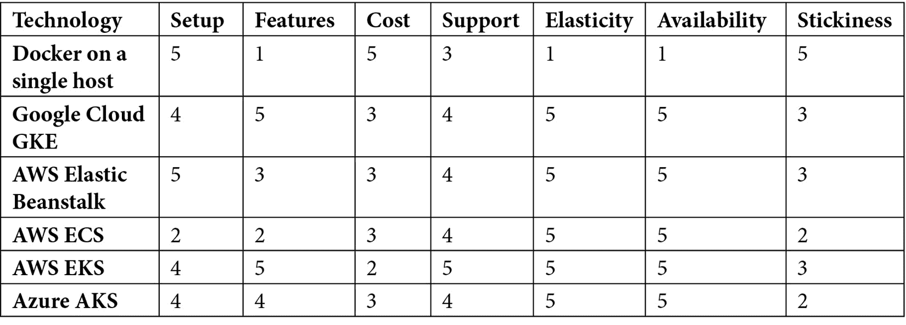
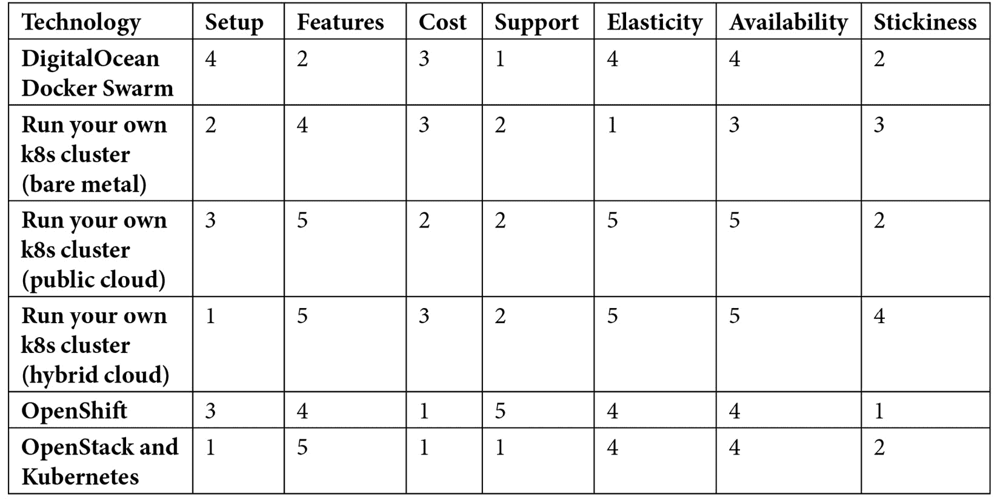
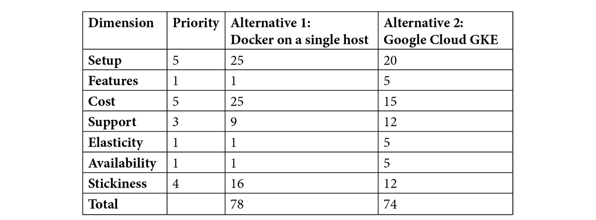

# *第五章*：生产环境中容器的部署与运行替代方案

随着容器技术和云计算的成熟，你部署 Docker 容器的方式也大大增加了。有些选项简单得只需要在单一主机上运行 Docker，而其他的则具备像自动扩展、多云支持等高级功能。你甚至可以将 Docker 容器运行在本地裸金属服务器上，或采用混合云解决方案。

阅读完本章后，你将理解现有的多种选择各自有不同的利弊。你将学会如何构建最小化的可行生产环境。你将能够在不同的云服务提供商及其管理的容器运行时之间做出选择，并阐明将 Docker 运行在本地或混合云环境中的好处。最重要的是，你将能够在多种目标之间权衡，做出关于 Docker 容器部署的生产路径的明智决策。

了解选择的范围将有助于你做出更好的决策。

本章将涵盖以下主要内容：

+   在生产环境中运行 Docker —— 许多路径，明智选择

+   最小化的现实生产环境是什么？

+   托管云服务

+   运行你自己的 Kubernetes 集群 —— 从裸金属服务器到 OpenStack

+   决定合适的 Docker 生产环境设置

# 技术要求

要完成本章的练习，你需要在本地工作站上安装 Git 和 Docker。对于 Mac 和 Windows 用户，请安装 Docker Desktop ([`www.docker.com/products/docker-desktop`](https://www.docker.com/products/docker-desktop))，因为这是大多数使用 Docker 的人们在本地工作站上使用的方式。在选择生产部署工具之前，你需要了解更多选项。

根据你选择的路径，你可能还需要在 Amazon Web Services、Google Cloud、Microsoft Azure 或 Digital Ocean 等平台上建立账户。这些服务大多提供慷慨的免费套餐，允许你在不花费太多钱的情况下进行实验，尤其是当你只使用这些服务短时间时。在考虑什么样的环境适合你的应用时，拥有多个选项是有帮助的。如果你在云端创建了资源，别忘了删除那些不再使用或不打算保留的资源，否则当你看到账单时可能会大吃一惊。大多数云服务提供商都有计费提醒系统。请考虑设置一个警报，如果你的支出超过预算时能及时通知你。

如果你想探索托管更复杂的本地设置，或使用像 Packet ([`www.packet.com/`](https://www.packet.com/)) 这样的裸金属托管服务，你可能需要一台或多台符合 Docker 或 OpenStack 在裸金属硬件上运行要求的服务器。

本章的 GitHub 仓库链接是 [`github.com/Packt-Publishing/Docker-for-Developers`](https://github.com/Packt-Publishing/Docker-for-Developers) —— 请查看其中的 `chapter5` 文件夹。

查看以下视频，看看代码是如何运行的：

[`bit.ly/2DYMria`](https://bit.ly/2DYMria)

# 示例应用程序 – ShipIt Clicker

本章链接的 GitHub 仓库包含一个在线游戏原型的代码——名为 ShipIt Clicker。在这款游戏中，一只戴着礼帽的松鼠敦促你将容器部署到生产环境；你点击的速度越快，积累的 `docker-compose` 就越多，从而运行多个容器。游戏涉及一个网页浏览器客户端、一个使用 Express 的 Node.js 服务器和一个 Swagger 驱动的 API，以及一个 Redis NoSQL 数据库，后者用于跟踪分数和其他游戏信息。

你可以通过实验 ShipIt Clicker 来熟悉比前几章更复杂的应用程序。可以自由地调整和改进配置文件和代码，并结合各种工具和服务进行部署，以便学习如何将应用程序部署到生产环境。在接下来的章节中，我们将学习如何以多种不同方式将该应用程序部署到生产环境中，每种方式都提供了越来越多的功能，但在成本、复杂性和可用性方面存在不同的权衡。 在此之前，让我们更深入了解这些替代方案。

# 在生产环境中运行 Docker —— 多种选择，明智决策。

如果你认为在本地工作站上运行 Docker 提供了很多选择，那么请系好安全带，因为在开发人员和系统管理员使用 Docker 构建应用程序并以一种强大的方式进行部署时，可用的多种方式使得本地开发环境显得简单。世界上一些最大的 IT 公司都使用 Docker（或同类容器技术）来进行大规模运行，而容器编排技术使这一切成为可能。拥有一个自愈集群的承诺，使其能够在面对网络分区和硬件故障时继续运行应用程序，吸引了许多人进入 Docker 领域。当运行一个容错集群的复杂性逐渐显现时，许多人发现他们的热情开始减退。

然而，你不必全程独立完成。多个云服务提供商提供的服务，使得用 Docker 运行应用程序变得更加可管理。大多数大型组织倾向于使用 Kubernetes，这是一个由 Google 赞助的项目，作为一个公开且社区支持的替代品，替代专有的容器编排工具。Kubernetes 从 Google 构建和运营其内部容器编排工具 Borg 中汲取经验，并将这些经验开放给公众。

或者，也许你只需要在尽可能小的设置下运行一个简单的动态网站 – 如果你有一个可以运行 Docker 的联网服务器，你就不需要学习云编排技术来实现这一点。

# 最小的实际生产环境是什么？

Docker 可以运行在多种硬件和软件上，但你从 Docker 本身或第三方（例如捆绑 Docker 的操作系统发行版）获得的支持水平可能会有所不同。Docker 可以运行在多种操作系统上：Linux、Apple macOS、Microsoft Windows，甚至 IBM S/390x。

## 最低要求——在一台主机上运行 Docker 和 Docker Compose

鉴于 Docker 在不同环境中的广泛分布，Docker 托管应用程序的最小生产环境是一台主机，无论是物理主机还是虚拟主机，运行支持 Docker 和 Docker Compose 的操作系统。许多流行的主流操作系统和发行版都内置了一些版本的 Docker，包括当前的 **长期支持版**（**LTS**）Ubuntu（16.04、18.04 和 20.04）和 CentOS（7 和 8）。其他一些更专业的操作系统，如 CoreOS 和 Container Linux，专注于仅运行容器，尽管这些系统对习惯于主流系统的人来说可能有一定的学习曲线，但它们可能是不错的选择。

你甚至可以在 Windows 或 macOS 上运行 Docker 用于生产系统。根据你的风险承受能力和需求，选择运行 Docker 的平台可能会更让你感到舒适，这取决于是否有支持。选择中总是充满权衡！

## Docker 支持

Docker 的社区版获得母公司有限时间的支持——专注于开发者的 Docker 公司（[`www.docker.com`](https://www.docker.com)）每季度发布 **社区版**（**CE**）Docker 工具链，并提供 4 个月的滚动支持期。截至 2019 年 11 月 13 日，Docker 的 **企业版**（**EE**）已由 Mirantis 生产；详情请见 [`www.mirantis.com/company/press-center/company-news/mirantis-acquires-docker-enterprise/`](https://www.mirantis.com/company/press-center/company-news/mirantis-acquires-docker-enterprise/)。Docker 的 EE 版本提供更长的支持期；支持多种 Linux、Windows 和 macOS 操作系统；以及扩展的支持编排系统；有关 Docker EE 的更多信息，请参见 [`docs.docker.com/ee/`](https://docs.docker.com/ee/)。Mirantis 宣布将于 2021 年 11 月停止对 Docker EE 中的 Docker Swarm 容器编排工具的支持，但在 2020 年 2 月撤回了这一退役公告。更多详情请见 [`devclass.com/2020/02/25/mirantis-to-keep-docker-swarm-buzzing-around-pledges-new-features/`](https://github.com/PacktPublishing/Docker-for-Developers)。

考虑到这些消息，Kubernetes 似乎在 Docker 容器编排竞争中胜出，尽管 Mirantis 仍然在支持 Docker Swarm。

## 单主机部署的问题

然而，在单一主机上运行 Docker 存在重大缺点。如果该主机发生重大硬件或软件故障，或者互联网连接受到影响，你的应用程序将面临可用性下降的风险。计算机本质上是不可靠的，即使是具有企业级可用性特性的系统，如冗余磁盘、电源和冷却功能，也可能因环境因素而发生故障。如果你走这条路，明智的做法是增加某种外部监控，并确保你有一个可靠的备份和恢复方案，以减轻这些风险。为了避免这些风险，我们需要考虑更复杂的方法，例如依赖第三方运行的更多容器编排系统。

# 托管云服务

为了克服在单一主机上部署应用程序的限制，最简单的选择是考虑使用提供容器编排解决方案的托管云服务来运行你的应用程序。一些最流行的解决方案包括以下内容：

+   **Google Kubernetes 引擎** (**GKE**)

+   亚马逊网络服务 **弹性 Beanstalk** (**EB**)

+   亚马逊网络服务 **弹性容器服务** (**ECS**)

+   亚马逊网络服务 **弹性 Kubernetes 服务** (**EKS**)

+   微软 **Azure Kubernetes 服务** (**AKS**)

+   DigitalOcean Docker Swarm

这些服务中的大多数支持通过 Kubernetes 运行一组 Docker 容器（[`kubernetes.io/`](https://kubernetes.io/)），这是一个由 Google 发起的项目。多年来，Google 一直在运行名为 Borg 的容器编排系统（[`ai.google/research/pubs/pub43438`](https://ai.google/research/pubs/pub43438)），并且 Google 以此为灵感，创建了一个适用于外部使用的容器编排系统，并命名为 Kubernetes。

一些托管云服务支持 Docker Swarm，而其他服务（包括 AWS Elastic Beanstalk 和 AWS ECS）则拥有自己定制的编排系统。

所有容器编排系统都允许软件开发人员和系统管理员运行一组服务器，这些服务器能够同时执行多个容器，并通过基于策略的机制在集群中分配多个容器实例。容器编排器负责启动、监控并根据健康检查和扩展限制在主机之间移动容器工作负载。自从 Google 推广了运行这些容器编排系统以来，许多供应商已经制定了托管服务，包括 Google、微软、亚马逊网络服务、Digital Ocean 等，接下来我们将在以下小节中讨论这些供应商。

## Google Kubernetes 引擎

Google 提供了一种名为 **Google Kubernetes Engine** (**GKE**) ([`cloud.google.com/kubernetes-engine/`](https://cloud.google.com/kubernetes-engine/)) 的系统，提供在 Google Cloud 内运行的支持的 Kubernetes 集群。如果你使用该服务，你无需自己操作和升级 Kubernetes 集群的主节点；你将根本看不到云控制台中的主节点，因为它们由 Google 直接管理。此外，Google 不向客户收取运行这些 Kubernetes 主节点的费用。这个选项对开发人员具有吸引力，因为它提供了一种运行低成本 Kubernetes 集群的方式。直接获得 Google 支持来运行 Kubernetes 工作负载，也让一些客户对这个系统充满信心。

然而，Google Cloud 不是最大的云服务提供商，甚至连第二大都不是，而且 Google Cloud 提供的其余服务种类没有像 Azure、AWS 或其他云提供商（如阿里巴巴）那样丰富。

如果你已经投资 Google Cloud，或者你希望拥有一个低成本的环境来试验 Kubernetes 或将其投入生产，且不依赖其他云服务提供商的服务，可以考虑评估 GKE 来运行 Docker 和 Kubernetes 负载。

## AWS Elastic Beanstalk

亚马逊 Web 服务通过其平台即服务产品 Elastic Beanstalk ([`aws.amazon.com/elasticbeanstalk/`](https://aws.amazon.com/elasticbeanstalk/)) 提供了一种运行 Docker 应用程序的方法。你可以运行单个 Docker 容器或支持多个 Docker 容器的设置。如果选择多个容器，Elastic Beanstalk 会在后台使用 ECS。通过 Elastic Beanstalk，开发人员使用命令行工具简化部署到多个环境，同时结合一些简洁的配置文件，隐藏了运行自动扩展集群的一些复杂性。

设置 Elastic Beanstalk 比设置 ECS 或 EKS 更加简单，开发人员如果需要一个轻松的途径以低开销和最小化的配置进入生产环境，可能会考虑使用 Elastic Beanstalk。

## AWS ECS 和 Fargate

AWS 还提供了一种容器编排系统，叫做 ECS ([`aws.amazon.com/ecs/`](https://aws.amazon.com/ecs/))。ECS 有两种基本模式：一种是容器运行在由账户拥有者直接管理的 EC2 实例群上，另一种是 AWS 管理容器运行的节点，称为 Fargate ([`aws.amazon.com/fargate/`](https://aws.amazon.com/fargate/))。

如果你在 AWS 上有投入，使用 ECS 与 EC2 或 Fargate 结合可能是合理的。虽然这种路径让你可以在不需要处理 Kubernetes 或 Docker Swarm 的情况下部署容器，但它是一个只有 AWS 支持的专有系统，因此与使用 Kubernetes 或 Docker Swarm 作为编排器相比，你需要做额外的工作才能将系统迁移出去。它有自己的学习曲线，并且需要你承诺将 Docker 工作负载运行在 AWS 上，因为这些接口是 AWS 特定的。

## AWS EKS

亚马逊云服务（AWS）提供 EKS，这是一个托管的 Kubernetes 服务，将 Kubernetes 主服务器的维护和配置工作转交给 AWS。EKS 是 AWS 的 Google GKE 等效服务。它与其他 AWS 服务有着强大的集成，尽管在运行 Kubernetes 主节点的成本上不如 GKE 服务经济，但与运行繁忙应用程序的成本相比，基准成本仍然是适中的。自 2018 年以来，AWS 通常通过 EKS 支持 Kubernetes，并且已修复了启动时出现的一些初期问题（例如，缺乏对一些常见自动扩展策略的支持），使 EKS 成为一个强大的 Kubernetes 发行版。2019 年 12 月，AWS 宣布通过 Fargate 运行由 EKS 管理的 Kubernetes 容器的支持，将 AWS 对 EKS 的支持与其提供的托管容器运行时及弹性透明的资源供应结合在一起。

截至 2020 年初，AWS 提供了来自云服务提供商的最大和最全面的服务。如果你在 AWS 上有投资，并且希望走一条许多人已经走过的熟悉道路，可以考虑使用 AWS EKS 作为你的 Kubernetes 主环境。

## Microsoft Azure Kubernetes 服务

Microsoft Azure 提供强大的容器部署服务——**Azure Kubernetes 服务**（**AKS**）。如果你或你的公司已经在 Microsoft 平台工具上进行了大量投资，包括 Windows、Visual Studio Code 或 Active Directory，这个选项可能特别有吸引力。Microsoft 声称在这些方面提供了强大的支持。微软的开发工具通常比一些其他公司的工具有更平缓的学习曲线。然而，如果你过于依赖 Microsoft 栈中的元素，可能会更难迁移到其他解决方案。

如果你在一个 Microsoft 环境中工作，或者你想要一个紧密集成到 Visual Studio Code 的 Kubernetes 简单入门，可以考虑使用 AKS。

## Digital Ocean Docker Swarm

Digital Ocean 提供通过 Docker Swarm 运行一组容器的支持，这是一个相对简单的容器编排系统。与在 Kubernetes 或甚至 AWS ECS 上部署容器相比，这项技术以其易于部署而闻名。Docker 工具本身就支持直接部署到 Docker Swarm。

然而，在 Mirantis 收购后，Docker Swarm 的支持状态被弃用，随后在客户要求持续支持后复兴。鉴于主要供应商对其支持的态度摇摆不定，你应仔细考虑是否应该使用 Docker Swarm 来部署新应用程序。

既然我们已经了解了在生产环境中运行 Docker 应用程序的替代方案，接下来让我们看看使用 Docker 和 Kubernetes 运行应用程序的替代方案。

# 运行你自己的 Kubernetes 集群 —— 从裸金属到 OpenStack

如果你必须在本地、数据中心运行应用程序，或者需要跨多个云计算提供商运行，你可能需要运行自己的 Kubernetes 集群。一旦你了解了在本地或混合云环境中运行 Docker 和 Kubernetes 的利弊，你应该能够知道何时是适合的解决方案。虽然这些场景比使用托管服务更复杂，但它们可以提供不同的好处，列举如下：

+   按照自己的时间表升级集群软件（或不升级），完全控制今天和明天运行的版本。云服务商可能会滞后于支持的版本，或者通过弃用某些版本带来操作风险。

+   使用许多成熟的 Kubernetes 配置解决方案之一，例如 Kops，这些解决方案有助于在 AWS EC2 上设置 k8s 集群。

+   跨数据中心和云计算环境操作混合云解决方案。虽然一些云服务提供商的解决方案，如 Google Cloud Anthos 或 Azure Arc，支持混合环境，但很多并不支持。

+   在裸金属上运行高性能 Kubernetes 集群，没有虚拟机管理程序的开销。

+   在主要云服务提供商不支持的平台上运行，例如在一群树莓派计算机上运行 Docker 和 Kubernetes。

+   完全控制集群的支持基础设施，并与使用 Kubernetes 作为起点的平台集成，例如 OpenShift 平台。

+   在私有云解决方案上运行，例如 OpenStack 或 VMware Tanzu（前身为 VMware Enterprise PKS）。

+   将 Docker 容器作为一个综合计算平台的一部分运行，该平台拥有超出原生 Kubernetes 的其他主要特性和功能，例如 Red Hat OpenShift 或 Rancher。

实际上，运行这些解决方案要比依赖单主机部署 Docker 或供应商管理的软件即服务 Kubernetes 集群解决方案更为复杂。

# 决定正确的 Docker 生产环境设置

由于可选择的选项令人眼花缭乱，选择正确的路径将应用程序部署到生产环境中是令人生畏的。你可能需要权衡许多因素，包括以下内容：

+   **设置**：从本地开发到生产环境的难度如何？

+   **特性**：部署、测试、监控、警报和成本报告。

+   **成本**：初始费用和持续的月度费用。

+   **支持**：是否可以轻松获得来自供应商或社区的支持？

+   **弹性**：随着负载增加，是否能扩展，并具备自动或手动控制？

+   **可用性**：该设置能否在丢失服务、主机或网络时仍然存活？

+   **粘性**：更改部署策略有多困难？

在单一主机上运行 Docker 成本低，设置简单，但在扩展性和可用性方面表现较差。所有主要的支持 Kubernetes 的云编排服务在功能、扩展性和可用性方面都表现均衡，但它们的设置和操作更为复杂。非 Kubernetes 选项比 Kubernetes 选项更加粘性。无论是在云中、裸金属服务器上，还是在混合云环境中运行你自己的集群，虽然可以提供巨大的灵活性，但也增加了复杂性和支持负担。

学习这些系统的相对优缺点，将帮助你判断合适的技术组合，用于部署你的应用程序。以下矩阵展示了我对不同技术选项的快速判断，评分范围为 1 到 5，其中 5 分表示最好。



你可以使用这个矩阵来帮助对替代方案进行排名。通过比较两个或更多选择，你可以更好地了解哪种解决方案更适合。为了评估这个矩阵，你可以建立一个评估表格，将各个替代方案进行对比。如果你用数字对优先级进行排名，其中 5 为最高优先级，1 为最低优先级，你可以将优先级与表 1 中的得分相乘，从而得到一个加权分数。

以下矩阵展示了强调设置简便、成本最小化以及粘性最小化的优先级，同时忽视了高可用性或负载下弹性这类鲁棒性的因素。这一优先级设置与许多现实世界应用程序在初期启动时的优先需求一致——开发人员面临的挑战往往是快速启动应用程序，并且可以在其他因素上做一些妥协。替代方案列中的评分代表将优先级与生产替代方案排名表中的每个替代方案得分相乘的结果。



在这种情况下，替代方案 1，Docker 在单一主机上运行，具有最高的评分，78 分对比 74 分。重要的因素——设置、成本和粘性，结合加权值使其超越了其他替代方案。考虑到这一评分，你应该考虑使用该部署方案。然而，如果优先考虑可用性或弹性，哪怕只高一个等级，另一个替代方案——Google Cloud GKE，可能会成为排名更高的服务。

你可能会发现一个混合解决方案也能满足你的需求，其中多个解决方案同时适用且必要，以解决你的问题。例如，你可能发现日常需求偏向于本地集群，但高峰需求可能需要扩展到云端。

## 练习——加入 ShipIt Clicker 团队

假设你刚刚加入了 ShipIt Clicker 开发团队。团队中的其他成员已经创建了游戏的基本设计（参见[游戏设计文档](https://github.com/PacktPublishing/Docker-for-Developers/blob/master/chapter5/ShipIt_Clicker-spec.md)），并编写了一个原型，只具备构建、测试和使用 Docker 打包应用程序所需的最低功能。

其他团队成员可能是设计、前端或后端开发方面的专家，但他们不确定如何继续进行生产环境部署。此时，你在 Docker 的使用经验上超过了团队中的其他开发者。他们编写的 Dockerfile 和`docker-compose.yml`文件是有效的。

在本地工作站上运行专为本章制作的 ShipIt Clicker，帮助更好地理解它是如何搭建起来的。

运行`docker-compose up`命令，以便在本地机器上启动容器。这将使你能够评估部署选项，并实验为生产环境使用而准备应用程序的更改。你将看到类似以下的输出；我们将详细解释输出中每组行的含义：

```
$ docker-compose up
Building shipit-clicker-web
Step 1/11 : FROM ubuntu:bionic
---> 775349758637
Step 2/11 : RUN apt-get -qq update &&     apt-get -qq install -y nodejs npm > /dev/null
---> Using cache
---> f8a9a6eddb8e
```

前面的输出显示 Docker 正在使用`ubuntu:bionic`镜像，然后安装操作系统包。

Dockerfile 的第 3-5 步通过创建必要的目录并将节点模块的包配置文件复制到适当位置，准备了应用程序安装的容器镜像：

```
Step 3/11 : RUN mkdir -p /app/public /app/server
---> Using cache
---> f7e56a628e8b
Step 4/11 : COPY src/package.json* /app
---> eede94466dc7
Step 5/11 : WORKDIR /app
---> Running in adcadb6616c2
Removing intermediate container adcadb6616c2
---> 6256f613803e
```

接下来，Dockerfile 安装了节点模块：

```
Step 6/11 : RUN npm install > /dev/null
---> Running in 02ae124cf711
npm WARN deprecated superagent@3.8.3: Please note that v5.0.1+ of superagent removes User-Agent header by default, therefore you may need to add it yourself (e.g. GitHub blocks requests without a User-Agent header).  This notice will go away with v5.0.2+ once it is released.
npm WARN optional Skipping failed optional dependency /chokidar/fsevents:
npm WARN notsup Not compatible with your operating system or architecture: fsevents@1.2.11
npm WARN shipit-clicker@1.0.5 No repository field.
npm WARN shipit-clicker@1.0.5 No license field.
Removing intermediate container 02ae124cf711
---> 64ea4b348ed1
```

在这之后，Dockerfile 会将更多的配置文件复制到容器镜像中，并将应用程序的源代码复制到容器中的`/app`目录下：

```
Step 7/11 : COPY src/.babelrc      src/.env      src/.nodemonrc.json      /app/
---> 88e88c1bc35d
Step 8/11 : COPY src/public/ /app/public/
---> c9872fccc1c9
Step 9/11 : COPY src/server/ /app/server/
---> f6e76811659a
```

最后，Dockerfile 告诉 Docker 暴露哪个端口并如何运行应用程序：

```
Step 10/11 : EXPOSE 3000
---> Running in 75fbd217ef27
Removing intermediate container 75fbd217ef27
---> 03faaa0e8030
Step 11/11 : ENTRYPOINT DEBUG='shipit-clicker:*' npm run dev
---> Running in 0a44ab13b0d3
Removing intermediate container 0a44ab13b0d3
---> ab6e4da773e7
Successfully built ab6e4da773e7
```

此时，Docker 容器已经构建完成，并且 Docker 应用了`latest`标签：

```
Successfully tagged chapter5_shipit-clicker-web:latest
WARNING: Image for service shipit-clicker-web was built because it did not already exist. To rebuild this image you must use `docker-compose build` or `docker-compose up --build`.
```

`docker-compose up`的强大功能接下来将展示出来，因为我们最初运行的这个命令不仅构建了应用程序的 Docker 容器，还同时启动了所有容器。当它启动容器时，会启动应用程序容器和 Redis 容器。Redis 容器在启动过程中会输出一些详细信息。我们的`docker-compose up`命令输出继续显示容器启动的相关信息：

```
Starting chapter5_redis_1 ... done
Creating chapter5_shipit-clicker-web_1 ... done
Attaching to chapter5_redis_1, chapter5_shipit-clicker-web_1
redis_1               | 1:C 04 Feb 2020 06:15:08.774 # oO0OoO0OoO0Oo Redis is starting oO0OoO0OoO0Oo
redis_1               | 1:C 04 Feb 2020 06:15:08.774 # Redis version=5.0.7, bits=64, commit=00000000, modified=0, pid=1, just started
redis_1               | 1:C 04 Feb 2020 06:15:08.774 # Warning: no config file specified, using the default config. In order to specify a config file use redis-server /path/to/redis.conf
redis_1               | 1:M 04 Feb 2020 06:15:08.776 * Running mode=standalone, port=6379.
redis_1               | 1:M 04 Feb 2020 06:15:08.776 # WARNING: The TCP backlog setting of 511 cannot be enforced because /proc/sys/net/core/somaxconn is set to the lower value of 128.
redis_1               | 1:M 04 Feb 2020 06:15:08.776 # Server initialized
```

请注意，Redis 在作为 Docker 容器的一部分运行时，并不完全适应没有专门为其调优的 Linux 内核。这是一个使用 Docker 可能无法获得最佳结果的例子，但结果足够好：

```
redis_1               | 1:M 04 Feb 2020 06:15:08.776 # WARNING you have Transparent Huge Pages (THP) support enabled in your kernel. This will create latency and memory usage issues with Redis. To fix this issue run the command 'echo never > /sys/kernel/mm/transparent_hugepage/enabled' as root, and add it to your /etc/rc.local in order to retain the setting after a reboot. Redis must be restarted after THP is disabled.
redis_1               | 1:M 04 Feb 2020 06:15:08.776 * DB loaded from disk: 0.000 seconds
redis_1               | 1:M 04 Feb 2020 06:15:08.776 * Ready to accept connections
```

你可以看到 Redis 现在已经准备好运行。接下来，`docker-compose` 启动 ShipIt Clicker 容器，使用前面 `ENTRYPOINT DEBUG` 输出中给出的命令（`'shipit-clicker:*' npm run dev`）：

```
shipit-clicker-web_1  |
shipit-clicker-web_1  | > shipit-clicker@1.0.5 dev /app
shipit-clicker-web_1  | > nodemon server --exec babel-node --config .nodemonrc.json | pino-pretty
shipit-clicker-web_1  |
shipit-clicker-web_1  | [nodemon] 1.19.4
shipit-clicker-web_1  | [nodemon] to restart at any time, enter `rs`
shipit-clicker-web_1  | [nodemon] watching dir(s): *.*
shipit-clicker-web_1  | [nodemon] watching extensions: js,json,mjs,yaml,yml
shipit-clicker-web_1  | [nodemon] starting `babel-node server`
shipit-clicker-web_1  | [1580796912837] INFO  (shipit-clicker/47 on 52e6d59c6121): Redis connection established
shipit-clicker-web_1  |     redis_url: "redis://redis:6379"
shipit-clicker-web_1  | [1580796913083] INFO  (shipit-clicker/47 on 52e6d59c6121): up and running in development @: 52e6d59c6121 on port: 3000}
```

一旦完成，你就可以通过浏览器访问 `http://localhost:3005/` 来玩游戏。在下图中，我们可以看到游戏主菜单的输出，并且有一个指向 API 文档的链接 `http://localhost:3005/api-explorer/`：


图 5.1 – ShipIt Clicker 游戏主菜单

一旦你使应用运行起来并探索它，你就可以学习如何以不同的方式部署它。

## 练习 – 从合理的部署替代方案中选择

本章中的设置用于在本地开发环境中运行游戏。然而，该设置存在一些可能会导致生产部署问题的问题。

该游戏在原型阶段的初步受众如下：

+   你的游戏开发同事和公司管理团队

+   一个全球分布的团队，由报名参加 Alpha 项目的热心人组成

+   一个位于离你生活的地方十二个时区远的专业测试人员团队

管理层希望尽快让原型可以供 Alpha 测试志愿者和专业测试人员使用，但他们想知道支持更强大的部署环境的选项和成本，以便在游戏爆红或投资者批准广告活动以提升订阅量时能够扩展。

你的任务是，根据你对 Docker 以及生产环境部署替代方案的了解，执行以下任务：

+   向管理层建议，首个生产部署应该是什么，在构建*生产决策替代方案*表格后。

+   向管理层建议，首个部署的一个或多个合理替代方案，这些方案能提高弹性和可用性。

+   根据供应商的最新价格清单，构建一个电子表格模型，展示每个选项在第一年内产生的一次性和持续性成本。

### 解决方案

将你的决策矩阵与*决定正确的 Docker 生产环境设置*章节中的示例进行比较，看看你的结果是否有所不同。将成本的电子表格模型和你的决策矩阵展示给同事，询问他们可能会选择什么，并询问他们是否同意你的决定。

## 练习 – 评估 Dockerfile 和 docker-compose.yml

管理层希望你能多做一些工作，帮助平滑生产部署的路径。它们希望你能识别需要改进的领域：

+   在 `Dockerfile` 和 `docker-compose.yml` 文件中做出的选择对于该应用来说是否合理？

+   为了更好地准备应用程序进行生产部署，应该做出哪些选择？

+   选择商品操作系统发行版时，在 `FROM` 中选择容器基础镜像会有什么影响？

### 解决方案

查看[`github.com/PacktPublishing/Docker-for-Developers/tree/master/chapter6`](https://github.com/PacktPublishing/Docker-for-Developers/tree/master/chapter6)中的 Dockerfile 和 `docker-compose.yml` 文件版本，看看你的建议如何与之对接。我们将在*第六章*《使用 Docker Compose 部署应用程序》中详细探讨这一点。

现在我们已经了解了更多关于将 Docker 容器部署到生产环境的替代方案，并完成了一些实践练习，让我们回顾一下我们学到的内容。

# 总结

在本章中，我们了解了将基于 Docker 的应用程序部署到生产环境的不同替代方案。我们了解到，许多选择涉及权衡，并且学习了如何构建最小可行的生产环境。我们学习了如何在不同的云服务提供商及其托管的容器运行时之间做出选择，并且了解了在本地或混合云中运行 Docker 的好处。我们还学习了如何根据不同目标选择合适的生产路径来部署 Docker 容器。

基于这些经验教训，你可以应用所学内容来创建一个实际的生产部署。了解技术替代方案的足够背景非常重要——因为不同的策略提供了不同的优缺点。你的公司可能在未来需要一个超级强大的自动扩展部署，但今天可能只需要一个能正常工作的方案。

在下一章中，我们将展示如何创建一个健壮的单主机 Docker 生产部署，同时保持本地开发的能力。
