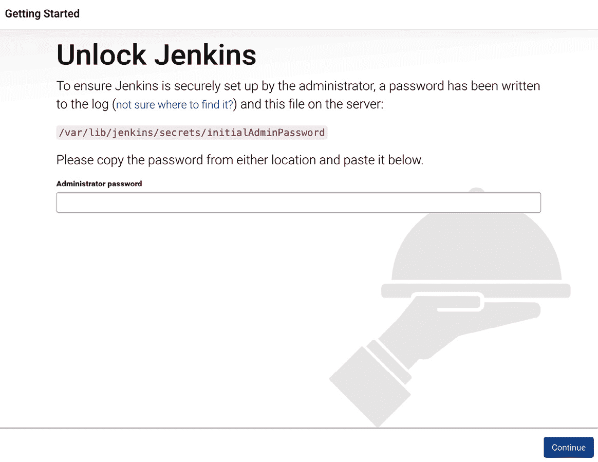
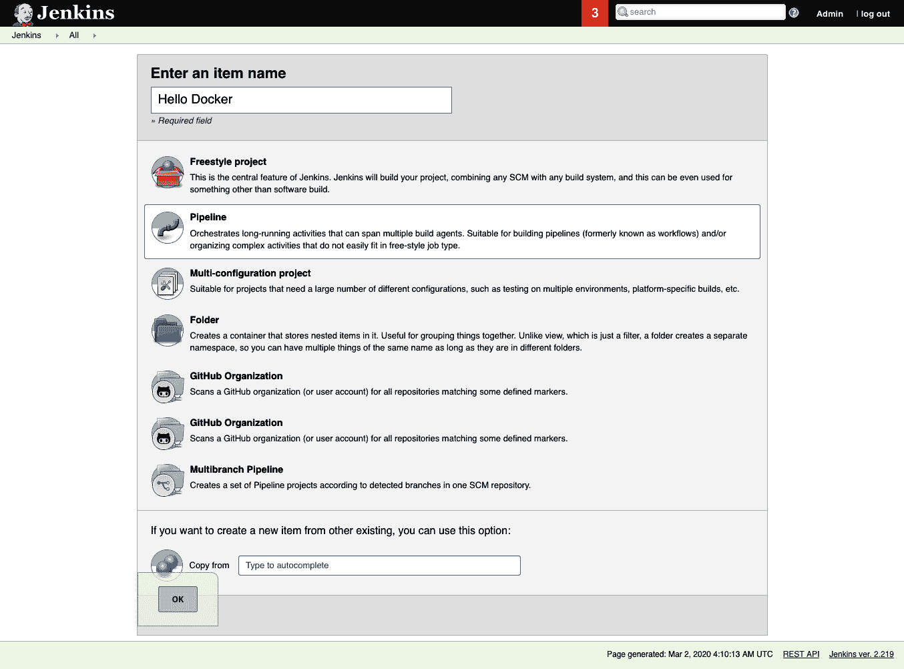
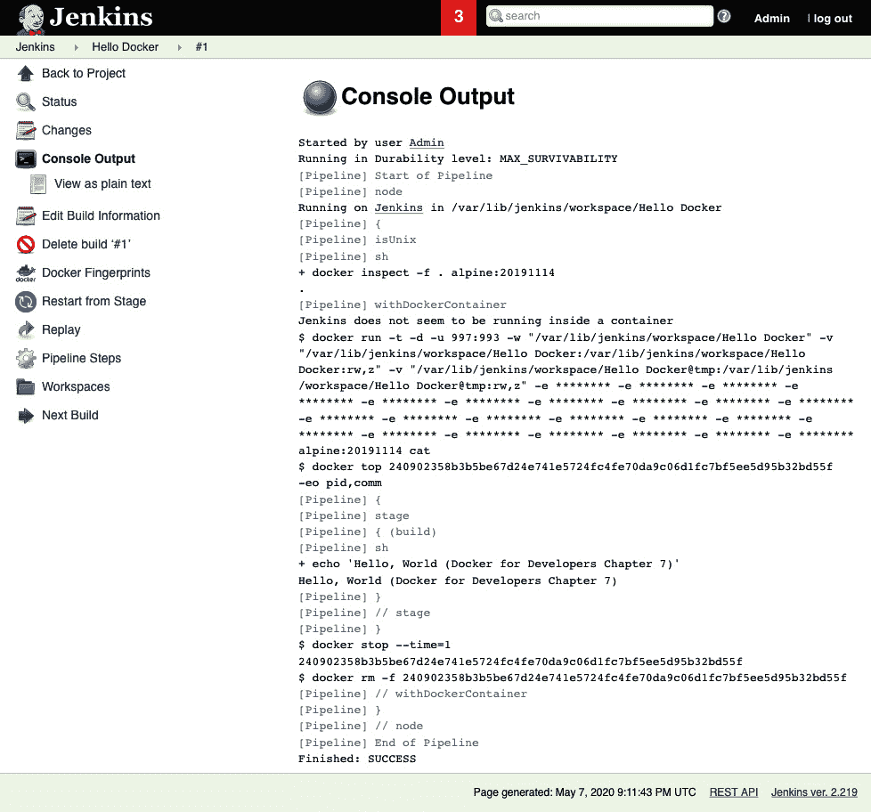
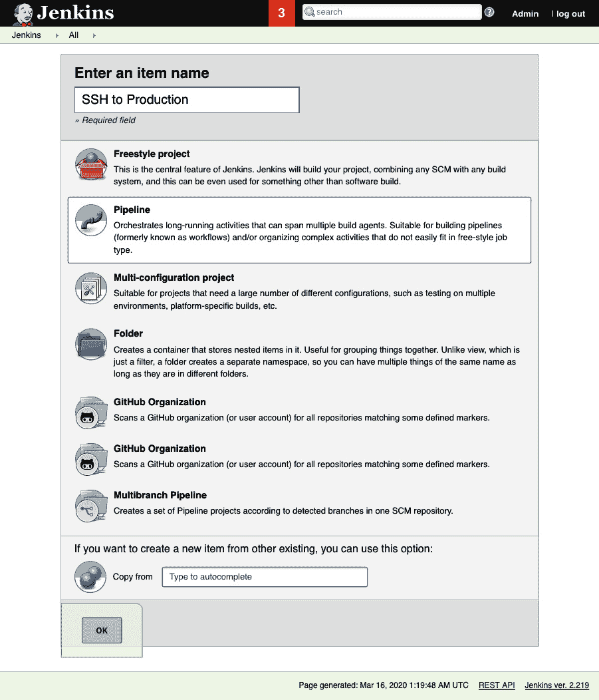
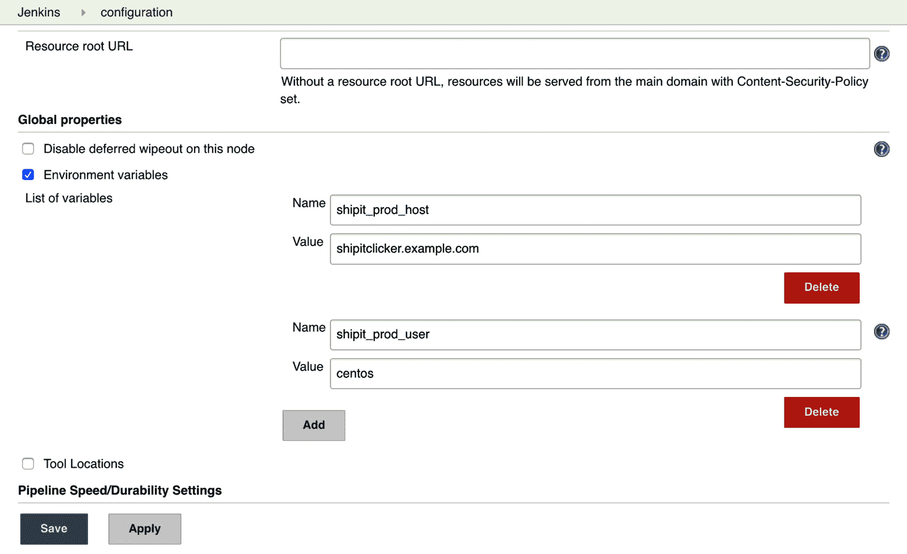
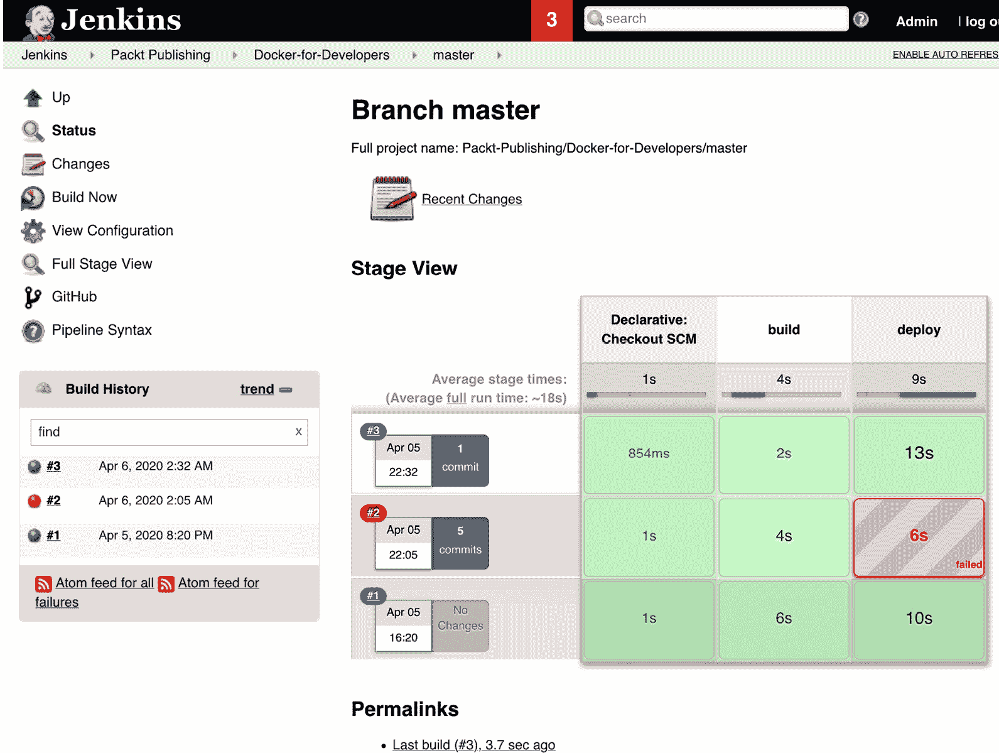

# *第七章*：使用 Jenkins 进行持续部署

为了在生产中可靠地使用 Docker 容器，你需要一个持续构建、测试和部署软件的过程。一个构建非常小型应用的团队，可能会满足于手动运行测试和部署脚本。然而，纪律往往会被打破，导致团队成员之间的协作混乱。这通常会导致构建失败，并且在生产部署前后没有进行测试。结果往往是停机和不满的客户。为了确保我们能够可靠地构建、测试和部署软件，我们可以使用持续集成软件。这类软件能够以一种有纪律且可追溯的方式可靠地构建、测试和部署修订。运行良好的现代项目甚至可以使用这种软件实现持续部署，让即使是最小的变更也能快速推送到测试或生产环境中。

在本章中，我们将展示如何配置 Jenkins，这是一款最受欢迎的持续集成软件系统，以促进部署到前一章展示的最小环境。我们将使用 Jenkins 来管理生产安装和新的暂存环境安装，以测试变更在达到生产环境前的效果。

到本章结束时，你将知道在什么情况下部署 Jenkins 来实现 CI 和 CD 与 Docker 结合是一个好主意。你将学习如何设置一个基本的`Jenkinsfile`，帮助 Jenkins 使用 `docker-compose` 命令更新应用程序。你将发现如何设置 Jenkins 的参数化构建，允许改变和审计配置参数。你将通过增加一个隔离的暂存环境，扩展简单的生产环境设置，使开发人员能够更有信心地进行变更。最后，你将明白何时这种解决方案已达到极限，何时需要采用更复杂的工具。

本章我们将覆盖以下主要内容：

+   使用 Jenkins 促进持续部署

+   Jenkinsfile 和主机连接

+   通过 Jenkins 推动配置变更

+   通过多个分支部署到多个环境

+   通过 Jenkins 扩展部署的复杂性和限制

# 技术要求

要完成本章的练习，你需要在本地工作站上安装 Git 和 Docker，并且需要根据前一章的描述已经设置好生产环境应用程序。为了完成关于部署到多个环境的练习，你还需要一个主机来运行测试环境，测试环境的规格应与生产主机相似。

您还需要一个 Jenkins 服务器。本章将介绍一些选项来简化 Jenkins 服务器的设置和维护，如果您尚未拥有可用的服务器。如果您的公司已经运行 Jenkins 服务器，您可以使用它—请向系统管理员请求权限。此服务器需要能够通过 SSH 访问您的生产服务器。

您需要能够在您控制的区域内创建 DNS 记录，用于暂存服务器和 Jenkins 服务器。您可以使用与上一章相同的 DNS 区域。

本章的 GitHub 存储库是 [`github.com/Packt-Publishing/Docker-for-Developers`](https://github.com/Packt-Publishing/Docker-for-Developers)—请查看其中的 `chapter7` 文件夹。

查看以下视频以查看代码的实际操作：

[`bit.ly/3kL1EUU`](https://bit.ly/3kL1EUU)

## 示例应用程序 – ShipIt Clicker v3

本章的 *ShipIt Clicker* 版本与上一章非常相似。我们将使用它来测试通过 Jenkins 到生产环境和暂存环境的部署。

# 使用 Jenkins 进行持续部署

过去 20 年来，持续集成服务器的世界发展了很长一段路。其中最流行的系统之一是 Jenkins（参见 [`jenkins.io/`](https://jenkins.io/)）—因为它是免费的、灵活的，并且提供了大量的集成和插件。背后的公司 CloudBees（[`www.cloudbees.com`](https://www.cloudbees.com/)）也通过付费版本提供商业支持。您的公司可能已经在运行 Jenkins，如果是这样，您可能不需要做太多设置来构建和运行您的项目。

我们将使用 Jenkins 2.x 流水线项目类型，在 GitHub 中提交 `Jenkinsfile` 到源代码控制，并控制 Jenkins 用于构建和部署项目的步骤。

## 避免这些陷阱

在设置 Jenkins 之前，我们应该确保避免初次设置时人们常遇到的一些常见陷阱。

### 避免在 Docker 上运行 Jenkins

虽然可以使用 Docker 运行 Jenkins 服务器，但这样做会引入一些最好避免的复杂性，尤其是当您首次尝试运行持续集成服务器时。您可能需要使用名为**Docker-in-Docker**（**dind**）的功能或者一个定制的 Jenkins Docker 安装，该安装必须以非常特定的方式从主机映射端口和文件。如果不搞对，可能会遇到问题，例如不能构建 Docker 容器，因为您不能双重挂载联合文件系统。

将 Jenkins 本身作为 Docker 容器运行并解决其中的怪异问题可能需要大量的时间和精力，超出了本书能提供的建议范围。

### 避免在生产服务器上运行 Jenkins

在前一章节中，我们在云中设置了一个生产服务器来托管应用程序。你可能会被诱使让已经运行的服务器再做双重任务，既运行生产服务器，又运行 Jenkins CI 服务器。这虽然经济，但存在风险，因为生产配置或 Jenkins 服务器中的任何问题都可能同时导致生产服务中断并让 CI 服务器下线。这还会使网络和 Web 托管虚拟主机的配置更加复杂——没有更复杂的编排系统，容易导致这些不同的服务发生冲突。

运行可靠系统的一部分是确保进程和系统之间有足够的隔离，尤其是对于具有不同目的的系统，因此避免将 Jenkins 和生产服务器混用；应该在与生产服务器分开的系统上运行 Jenkins。

### 避免在本地工作站上运行 Jenkins

你可能也会被诱使直接在本地工作站上安装 Jenkins 进行测试。然而，你会发现这种做法有几个主要的缺点：

+   你的工作站可能没有稳定的 IP 地址，因此需要动态 DNS 解决方案，可能还需要打洞防火墙并设置 NAT 端口重定向。

+   你需要不断地在系统上运行 Jenkins，以便随着提交的推送，它能够处理并构建软件的更改。

+   Jenkins 可能会非常占用资源，无法与完整的开发环境一起运行——而且它可能会显著减慢你的工作站速度。

如果我们不应该将 Jenkins 作为 Docker 容器运行，也不应该在本地工作站上运行它，那么我们应该在哪里运行 Jenkins？让我们来探索一下这些选项。

## 使用现有的 Jenkins 服务器

如果你有访问正在运行最新版本 Jenkins 2.x 系列的 Jenkins 服务器的权限，就不需要从零开始设置 Jenkins。Jenkins 的新版本对 Docker 提供了极好的支持，前提是运行 Jenkins 构建的主机上已经运行了 Docker。

你需要确保以下 Jenkins 插件已经安装：

+   SSH 凭证

+   Pipeline

+   GitHub

+   GitHub 组织

理想情况下，Jenkins 服务器应该已经安装了 GitHub 组织插件，并且已配置为能够自动管理 GitHub 的 webhooks。如果是这种情况，你可以分叉示例仓库或将其克隆并推送到你的 GitHub 组织中作为新仓库，从那里开始部署。

你需要在 Jenkins 服务器上拥有足够的权限来创建凭证，这些凭证将用于存储构建和部署软件所需的密钥。

## 设置新的 Jenkins 服务器

简化您需要维护的技术栈的一个方便方法是使用与生产主机相同的基础操作系统和 Docker 设置。这里的说明和脚本是针对 CentOS 7 安装定制的，但您可以遵循相同的基本步骤来安装和维护其他操作系统版本，只需对安装操作系统包的特定命令进行一些修改，例如使用 `apt-get` 代替 `yum` 来安装操作系统包。

首先按照上一章中的步骤安装 Docker 和 `docker-compose`。完成后，使用 `docker run --rm hello-world` 命令测试 Docker 是否正常工作，然后安装 Jenkins。如果您使用的是 CentOS 7，可以使用以下脚本 https://github.com/PacktPublishing/Docker-for-Developers/blob/master/chapter7/bin/provision-jenkins.sh 同时安装 Docker 和 Jenkins（将 `centos@jenkins.example.com` 替换为您新 Jenkins 服务器的用户名和 IP 地址或主机名）：

```
$ ssh centos@jenkins.example.com < bin/provision-jenkins.sh
$ ssh centos@jenkins.example.com
```

如果您使用的是其他操作系统，请查阅 Jenkins 官方文档获取安装说明：[`wiki.jenkins.io/display/JENKINS/Installing+Jenkins`](https://wiki.jenkins.io/display/JENKINS/Installing+Jenkins)

为了配置 CentOS 7 允许网络流量到达 Jenkins，您可能需要配置主机防火墙以允许入站流量。

此外，建议让 Jenkins 监听标准端口，如 `80` 或 `443` 端口。这可以通过多种方式实现，包括让 Web 服务器充当 Jenkins 的代理，或使用负载均衡器终止 SSL。在 CentOS 7 上允许网络流量到达 Jenkins 的快捷方式如下（如果您使用了 `provision-docker.sh` 脚本来配置 Jenkins，则此步骤已完成）：

```
$ sudo firewall-cmd --zone=public --permanent --add-masquerade
$ sudo firewall-cmd --permanent --add-service=http
$ sudo firewall-cmd --permanent --add-forward-port=port=80:proto=tcp:toport=8080
$ sudo firewall-cmd --permanent --direct \
   --add-rule ipv4 nat OUTPUT 0 \
   -p tcp -o lo --dport 80 -j REDIRECT --to-ports 8080
$ sudo firewall-cmd --reload
```

`firewall-cmd` 调用将允许您通过端口 `80` 访问 Jenkins，而不是指定端口 `8080`。

安装 Jenkins 后，您必须从其日志中获取密码以连接到服务器：

```
$ sudo grep -A 3 password /var/log/jenkins/jenkins.log
```

请记下此命令输出中的密码。如果此方法未立即生效，请等待几分钟再试，因为 Jenkins 可能仍在启动中。

然后，打开 Web 浏览器并输入带有适当端口的 IP 地址，取决于您是否已重定向连接，端口可以是 `8080` 或 `80`。例如，输入 [`192.2.0.10:8080`](http://192.2.0.10:8080) 访问该站点。

您应该看到一个显示 **解锁 Jenkins** 的屏幕：



图 7.1 – 解锁 Jenkins

使用 `/var/log/jenkins/jenkins.log` 文件中的管理员密码首次登录。

下一屏幕会提示您安装插件。请安装推荐的插件：


](img/B11641_07_002.jpg)

图 7.2 – 自定义 Jenkins

如果您的系统内存少于 4 GB，您需要使用交换文件。运行 `free` 命令查看服务器是否有可用的交换内存。如果没有，请执行以下命令创建一个 1 GB 的交换文件并激活它：

```
$ free
              total        used        free      shared  buff/cache   available
Mem:        1882296       89008     1533220        8676      260068     1612156
Swap:       2097148           0     2097148
$ sudo dd if=/dev/zero of=/swap bs=1M count=1024
1024+0 records in
1024+0 records out
1073741824 bytes (1.1 GB) copied, 2.94343 s, 365 MB/s
[vagrant@localhost ~]$ sudo chmod 0600 /swap
[vagrant@localhost ~]$ sudo mkswap /swap
Setting up swapspace version 1, size = 1048572 KiB
no label, UUID=2bd70cac-3730-45bb-8b77-982425fb7af5
[vagrant@localhost ~]$ echo /swap swap swap defaults 0 0 | sudo tee -a /etc/fstab
/swap swap swap defaults 0 0
[vagrant@localhost ~]$ sudo mount -a
[vagrant@localhost ~]$ free
              total        used        free      shared  buff/cache   available
Mem:        1882296       83120      481244        8668     1317932     1604256
Swap:       2097148           0     2097148
```

您应该能在 `free` 命令的输出中看到系统有非零的交换内存。

Jenkins 安全性与 HTTPS

对于生产环境，您应配置 Jenkins 通过 SSL 终端负载均衡器或已配置 SSL 证书的 Web 服务器后端运行，并监听 HTTPS。有关如何使用 HTTPS 安全化 Jenkins，请参考 Jenkins 文档或互联网上的许多教程。您还应该考虑限制可以直接访问 Jenkins 服务器的 IP 地址范围，因为这些服务器是恶意攻击者的常见目标。有关更多关于如何确保 Jenkins 安全的信息，请参阅本章末尾的*进一步阅读*部分。

要将 Jenkins 与 Docker 一起使用，您需要安装 Docker Pipeline 插件。从 Jenkins 主屏幕，进入 **管理 Jenkins** | **管理插件** 菜单，点击 **可用** 标签，选择 **Docker Pipeline** 插件，然后按 **立即下载并在重启后安装** 按钮。Jenkins 重启后，请重新登录。

现在您已经可以使用 Jenkins 服务器了，可以开始配置它与生产服务器进行通信。

## Jenkins 如何支持持续部署

Jenkins 可以从版本控制中检出项目源代码、构建软件、运行测试并执行部署脚本。由于它支持 Docker，它可以构建 Docker 容器，将容器推送到 Docker Hub 或其他容器仓库，然后运行连接到服务器的部署脚本，指示其更新运行中的 Docker 容器。为了支持这些目标，我们必须配置 Jenkins 与生产服务器、版本控制仓库以及 Docker Hub 集成。首先，我们将确保可以使用 Jenkins 连接到生产服务器。

# Jenkinsfile 和主机连接

为了确保可重复的构建，我们将使用 Jenkins 脚本来运行构建和部署自动化。Jenkins 支持一种名为 `Jenkinsfile` 的脚本类型。由于这些脚本使用 G[roovy 语言编写（请参见 http](https://groovy-lang.org/)s://groovy-lang.org/），您可以声明变量、编写函数，并利用该强大语言的许多功能来帮助构建和部署软件。Jenkins 支持自由形式的脚本风格以及使用 Groovy 特殊领域特定语言（DSL）提供更多框架、简洁脚本的结构化声明式脚本风格。

有关如何编写 `Jenkinsfile` 的更多信息，请参见：[`www.jenkins.io/doc/book/pipeline/jenkinsfile/`](https://www.jenkins.io/doc/book/pipeline/jenkinsfile/)

您可以直接将这些脚本输入到 Jenkins 作业定义中，或者将它们存储在版本控制中。如果您将名为`Jenkinsfile`的文件放在版本控制仓库的根目录中，Jenkins 可以在配置与版本控制系统（如 GitHub）连接后自动发现这些文件。

## 使用管道脚本测试 Jenkins 和 Docker

为了测试 Jenkins 和 Docker 是否正常协同工作，我们将首先通过控制台输入脚本。在 Jenkins 的顶层屏幕上，点击`Hello Docker`：



图 7.3 – 新建项 – Hello Docker 管道

然后，在`chapter7/`的`Jenkinsfile-hello-world`文件中（在配套的 GitHub 项目中）：

```
pipeline {
     agent { docker { image 'alpine:20191114' } }
     stages {
         stage('build') {
             steps {
                 sh 'echo "Hello, World (Docker for Developers Chapter 7)"'
             }
         }
     }
 }
```

保存作业并点击**立即构建**链接，Jenkins 将创建构建**#1**。点击左侧出现的**#1**链接，然后点击**控制台输出**按钮。您应该会看到类似以下内容：



](img/B11641_07_004.jpg)

图 7.4 – 新建项 – Hello Docker 控制台输出

您应该会在 Jenkins 网页的**控制台输出**中看到`Hello, World（Docker for Developers 第七章）`。如果这里出现内存不足错误，请确保您的 Jenkins 服务器上有交换文件。如果看到关于 Docker 不是已知代理类型的错误，请转到**管理 Jenkins** | **管理插件**菜单，安装**Docker Pipeline**插件。

通过 SSH 连接到生产服务器

接下来，我们将配置 Jenkins 通过 SSH 连接到生产服务器。我们需要这样做，以便控制远程服务器上的 Docker 子系统。我们将为 Jenkins 生成一个 SSH 密钥，并将其添加到生产服务器的授权密钥列表中。

### 生成 SSH 密钥并将其添加到 Jenkins 凭证

在本地工作站上，执行以下命令以生成一个 2,048 位的 RSA SSH 密钥对并查看它：

```
ssh-keygen -t rsa -b 2048 -f jenkins.shipit
cat jenkins.shipit
```

将`jenkins.shipit`文件的内容复制到剪贴板，然后转到 Jenkins 主页，在左侧菜单中找到`jenkins.shipit`，并输入生产服务器的非 root 用户的用户名（对于 CentOS 7 云服务器，通常为`centos`）。点击**直接输入**，添加密钥并点击**确定**按钮以保存凭证：


](img/B11641_07_005.jpg)

图 7.5 – 添加凭证 – SSH 密钥

将 SSH 公钥`jenkins.shipit.pub`从本地系统复制到生产服务器，并将其追加到`~/.ssh/authorized_keys`文件中。通过在本地工作站上输入以下命令，将`centos@192.2.0.10`替换为您的生产服务器的用户名和 IP 地址：

```
prod=centos@192.2.0.10
ssh $prod mkdir -p .ssh
ssh $prod tee -a .ssh/authorized_keys < jenkins.shipit.pub
ssh $prod chmod 700 .ssh ssh $prod chmod 600 .ssh/authorized_keys
```

通过使用密钥从本地工作站登录，测试 SSH 密钥认证是否正常工作：

```
$ ssh -i jenkins.shipit $prod
Last login: Mon Mar  2 04:57:35 2020 from gateway.example.net
[centos@ip-172-26-13-202 ~]$
```

完成此操作后，您可以创建一个测试作业，使用这些凭证通过 SSH 连接到服务器。

### 使用 Jenkins 管道作业通过 SSH 连接到生产服务器

在 Jenkins Web 控制台中，创建一个新的 Jenkins 任务，选择 `SSH to Production`，并选择 **Pipeline** 任务类型：



](img/B11641_07_006.jpg)

图 7.6 – 创建项目 – SSH 到生产环境

在任务定义表单中，在 `centos@192.2.0.10` 中填写生产服务器的用户和主机，并保存任务脚本（请参见 `chapter7/Jenkinsfile-ssh-proof-of-concept`）并将其存储在配套的 GitHub 项目中：

```
pipeline {
   agent any
   stages {
      stage('SSH') {
         steps {
            withCredentials([sshUserPrivateKey(
                credentialsId: 'jenkins.shipit', 
                keyFileVariable: 'keyfile')]) {
                    sh '''
prod=centos@192.2.0.10
cmd="docker ps"
ssh -i "$keyfile" -o StrictHostKeyChecking=no $prod $cmd
                       '''
                }
         }
      }
   }
}
```

当你点击 **Build Now** 链接并查看控制台输出时，你应该会看到类似以下的输出：

```
…
+ ssh -i **** -o StrictHostKeyChecking=no centos@34.238.248.192 docker ps
CONTAINER ID        IMAGE                            COMMAND                  CREATED             STATUS              PORTS                  NAMES
6c9ef1ca65f6        chapter6_shipit-clicker-web-v2   "npm start"              6 weeks ago         Up 6 weeks          0.0.0.0:80->3000/tcp   chapter6_shipit-clicker-web-v2_1
…
3f91820e097b        redis:5-alpine3.10               "docker-entrypoint.s…"   7 weeks ago         Up 7 weeks          6379/tcp               chapter6_redis_1
```

如果你没有看到 `docker ps` 的输出，请仔细检查用户名、IP 地址和 SSH 密钥。检查 Jenkins 关于 `Jenkinsfile` 或与 `ssh` shell 命令相关的错误信息以进行故障排除。你需要让这个部分正常工作，才能确保下一阶段的顺利进行。

您可以使用 Jenkins 连接到其他主机来运行使用 `docker` 和 `docker-compose` 的脚本。但如果需要，您也可以直接在 Jenkins 服务器上运行 `docker` 和 `docker-compose`。我们将在本章后面探讨这一点。

现在我们可以通过 SSH 使用 Jenkins 连接到生产服务器，并通过管道脚本使用该连接对生产服务器进行更改，包括将新的更改部署到服务器上。

# 通过 Jenkins 驱动配置更改

接下来，我们将学习如何通过运行托管在 Jenkins 中的 Git 仓库中的脚本来对生产系统进行更改。我们可以使用 Jenkins 来构建应用程序的 Docker 容器，并将这些容器部署到生产服务器上。这样，程序、`Dockerfile` 或 `docker-compose.yml` 文件的任何更改都可以通过自动化传播到生产系统。

这里有一些关于如何将 Jenkins 与其他系统（包括 GitHub）集成的提示，它们可以让你的工作更加轻松。第一个提示是如何通过将 `Jenkinsfile` 存储在版本控制系统中，来配置 Jenkins。

## 使用 Git 和 GitHub 存储你的 Jenkinsfile

在上一节中，我们直接在 Jenkins 任务中使用 `Jenkinsfile` 进行了一些快速测试。这对于进行探索性工作非常有效，但为了构建和管理更复杂的脚本集，您应该使用 Git 版本控制来存储 `Jenkinsfile`，并使用 GitHub 来存储和共享 Git 仓库，因为 GitHub 与 Jenkins 的集成非常顺畅。这将使您能够以受控的方式对程序和部署脚本进行更改。

要了解更多关于为什么你应该将 Git 版本控制系统与 GitHub 一起使用的信息，请参阅这个入门指南：[`guides.github.com/introduction/git-handbook/`](https://guides.github.com/introduction/git-handbook/)。

我们可以将存储在 GitHub 中的脚本与 Jenkins 中的 `Jenkinsfile`（例如本书仓库中的那个）结合，部署示范项目。通过这种对环境变量替换的支持，即使你的生产服务器可能配置了不同的用户和主机，也能使用未改变的 `Jenkinsfile`，同时使用你独特的 SSH、Docker Hub 和 GitHub 凭证。

为了进一步推进，你必须确保 Jenkins 拥有 GitHub 用户名和安全令牌凭证，以便你可以使用 Jenkins 检出 GitHub 仓库。

### 确保 Jenkins 拥有 GitHub 用户名和安全令牌凭证

为了将 Jenkins 与 GitHub 一起使用，你需要保存一个包含 GitHub 个人访问令牌的 Jenkins 凭证。在浏览器中登录 GitHub，访问 [`github.com/settings/tokens`](https://github.com/settings/tokens)，并生成一个同时具备 `repo` 和 `admin:repo_hook` 权限的令牌。将生成的令牌复制到剪贴板。然后，在另一个浏览器窗口中，访问你的 Jenkins 服务器，导航到凭证部分，进入 Jenkins 全局凭证，并创建一个 `github.repo.username` 和描述为 `username` 的凭证，凭证内容为你的实际 GitHub 用户名。点击 **OK** 按钮保存凭证。

### 选项 1 – 使用 GitHub 组织项配置 Jenkins

Jenkins 支持定义 *项*，这些项可能是单独的 Jenkins 作业或相关作业的集合。几种项类型允许你将版本控制系统与 Jenkins 连接，从而自动定义多个 Jenkins 作业。最强大的其中之一就是 `GitHub Organization` 项目。使用 `GitHub Organization` 项目，Jenkins 将扫描 GitHub 上每个拥有 `Jenkinsfile` 的项目，并为在 GitHub 组织中找到 `Jenkinsfile` 的所有仓库自动设置子项集合。

这是让 Jenkins 管理一组相关项目的最简单方法。如果你正在使用新的 Jenkins 服务器来探索 Docker 开发，并且控制着一个 GitHub 组织，尝试进行这个设置。如果你使用的是公司 Jenkins 服务器，这个设置可能已经完成。

从你的 Jenkins 安装主页，点击 `GitHub Organization`。使用标记为 **GitHub 仓库凭证（用户名）** 的凭证，并确保组织字段中的名称与您的 GitHub 组织名称匹配。

你可以设置一个过滤器，这样它只扫描你想要的包含 `Jenkinsfile` 的项目。如果你在组织中有大量的仓库和分支，或者你只希望 Jenkins 构建特定的仓库（这些仓库可能与 Jenkins 配合使用），或者如果还有其他 Jenkins 服务器也构建 GitHub 组织中的一部分项目，这可能是个不错的主意。如果你想这么做，可以添加一个类型为 `Filter by name (with regular expression)` 的 `Behavior`，并构建一个正则表达式来匹配你想要包含的仓库名称。

使用 GitHub，将 Docker-for-Developers 仓库（[`github.com/PacktPublishing/Docker-for-Developers/`](https://github.com/PacktPublishing/Docker-for-Developers/)）分叉到你的组织中。或者，如果你不想分叉仓库，可以在你的组织中创建一个空的仓库。然后，将你本地的仓库副本推送到新创建的仓库中，进入你创建的 GitHub 组织项，你应该能看到 **Docker-for-Developers** 项目。

然而，如果你使用的是个人 GitHub 账户，且无法访问 GitHub 组织，这可能不是一个好的选择。你可以改为使用多分支流水线项配置 Jenkins，从一个单一的 GitHub 仓库中提取 `Jenkinsfile`。

### 选项 2 – 使用多分支流水线项配置 Jenkins

使用多分支流水线项将允许 Jenkins 扫描 GitHub 中每个包含 `Jenkinsfile` 的项目的单一仓库，Jenkins 会自动为每个 Git 分支创建子项，如果该分支中存在 `Jenkinsfile`，并且为合并请求设置 Jenkins 作业。

将 Docker-for-Developers 仓库分叉到你的组织中，或在你的账户中创建一个空的仓库，并将你本地的仓库副本推送到 GitHub。在配置多分支流水线之前，你需要完成这一步。

从你的 Jenkins 安装主页，点击 `Multibranch Pipeline`。在 **Branch Sources** 中，选择 **GitHub**，然后填写 GitHub 表单中的凭据，凭据标签为 **GitHub repo credentials (username)**，并在 **Repository HTTPS URL** 字段中填写你的 GitHub 仓库 URL。然后，保存该项。Jenkins 会扫描该仓库，并为每个 Git 分支设置独立的 Jenkins 作业。

到此为止，无论你是使用多分支流水线还是 GitHub 组织项类型，你的 Jenkins 中应该已经有了一组分支。

## 更改所有已检出仓库的来源

此时，你还应该将你的 Git 仓库的 URL 更改为新的仓库 URL，无论是在本地工作站，还是在前一章节中设置的生产服务器上。将 `example` 替换为你分叉仓库时使用的 GitHub 组织或用户的名称：

```
git remote set-url origin https://github.com/example/Docker-for-Developers.git
```

### 检查你的 GitHub 仓库是否通过 webhook 与 Jenkins 进行通信

GitHub 可以通过 Webhooks 与其他系统通信，这些 Webhooks 是当人们执行某些操作时系统触发的 HTTP 请求，针对另一个系统。

更多关于 GitHub 对 Webhooks 和系统集成的支持信息，请参见：[`developer.github.com/webhooks/`](https://developer.github.com/webhooks/)

当我们设置`GitHub 组织`项目或`多分支流水线`项目时，Jenkins 应该在 GitHub 中设置其中一个 Webhook，以便它可以与 Jenkins 通信。如果没有设置，您可以访问`https://jenkins.example.com/github-webhook/`（将`jenkins.example.com`替换为您的 Jenkins 服务器）。

现在我们已经配置了 Jenkins 可以与 GitHub 通信，我们希望确保将分支推送到 GitHub 会触发 Jenkins 中的构建。根据您的帐户的 GitHub 权限和 Jenkins 配置，它可能没有自动创建 Webhook。

在 Web 浏览器中，导航至您的 GitHub 存储库，进入**设置**，然后进入**Webhooks**，验证是否存在与您的 Jenkins 服务器 URL 相关的 Webhook。

### 现在 Jenkins 已连接到 GitHub，可以预期发生什么

现在我们已经配置了 Jenkins 以能够检查存储库中是否存在`Jenkinsfile`，我们可以继续。Jenkins 将尝试构建您刚刚定义的项目。但是，除非您向 Jenkins 提供额外的变量和凭据，否则构建将失败。

为了将构建的特定配置与您的环境绑定，我们需要使用 Jenkins 设置一些环境变量来存储不太敏感的项，除了使用**凭证**功能存储加密密钥和密码。

## 为生产支持创建 Jenkins 环境变量

Jenkins 支持设置环境变量，可以供项目（例如构建和部署作业）引用。对于诸如 SSH 私钥或 Docker Hub API 凭证之类的机密变量，您可以使用我们在上一节中使用的**凭证**系统来安全存储这些变量。对于不太敏感的值，我们可以使用 Jenkins**配置**屏幕上可用的**环境变量**设置：



图 7.7 – Jenkins 配置 – 生产主机的环境变量

为了继续，请与您使用的 DNS 提供商确认，您的生产主机是否具有与其 IP 地址关联的 DNS 名称。在*第六章*，*使用 Docker Compose 部署应用程序*中，我们为生产服务器设置了 DNS 名称。拥有 DNS 名称将使配置更易读，并使人们在 Web 浏览器中更容易访问服务器。设置这些密钥和值的变量：

+   `shipit_prod_host`：生产服务器 DNS 域名，例如 [shipitclicker.example.com](http://shipitclicker.example.com)

+   `shipit_prod_user`：生产服务器用户名，例如 `centos`

设置完这些变量后，点击 **保存** 按钮。当我们运行 Jenkins 作业以更新正在运行的容器时，将使用这些变量。不过，在此之前，我们需要一个容器存放的地方。在之前的章节中，你已经学会了如何将容器镜像推送到 Docker Hub。接下来，我们将自动化这个过程。

## 构建 Docker 容器并将其推送到 Docker Hub

为了避免在生产服务器上构建容器，我们需要在 Jenkins 上构建容器，然后将它们推送到 Docker 容器注册中心，如 Docker Hub。这可以将构建 Docker 容器与部署分开。如果你尝试在单个小型服务器上同时进行构建和部署，很可能会遇到内存不足或其他系统稳定性问题。而在生产服务器上，你希望最大限度地提高环境的稳定性。

尽管你可以从本地工作站将容器推送到 Docker Hub，使用 Jenkins 的好处之一是可以通过 Jenkins 自动构建并将容器推送到中央仓库。为此，你需要为 Jenkins 提供 Docker Hub 的凭证。

### 将 Docker Hub [凭证添加到 Jenkins](https://hub.docker.com/)的凭证管理器中

使用你的 Docker 账户登录到 [`hub.docker.com/`](https://hub.docker.com/)，并为 Jenkins 创建一个 API token，供其使用。API token 可以在 [`hub.docker.com/settings/security`](https://hub.docker.com/settings/security) 的安全设置页面找到。复制该 API token 到剪贴板，然后在另一个浏览器标签页中访问 Jenkins 凭证管理器，创建一个新的全局无限制凭证，类型为 `用户名和密码`。将其 ID 命名为 [shipit.dockerhub.id](http://shipit.dockerhub.id)，并在 `用户名` 字段中输入你的 Docker 账户用户名，在 `密码` 字段中输入访问 token，然后保存。

这将允许你使用 Docker Hub 凭证将构建推送到 Docker Hub，并且由于我们已经在 Jenkins 中设置了 SSH 凭证，我们可以使用这些凭证在构建完 Docker 镜像后将其推送到 Docker Hub，然后连接到生产服务器以部署新软件。

### 确保停止先前的生产环境

如果上一章节中的生产环境正在运行，你需要停止它才能部署新环境。这将确保新生产环境能够绑定到正确的 TCP 端口。

注意

在你拥有真实的生产应用程序并且有宝贵的客户数据的情况下，你会希望将任何数据库和其他持久化存储备份并恢复到新环境中。ShipIt Clicker 应用程序仅使用 Redis 来保存有关生产环境的详细信息。对于 Redis，可以通过 CLI 使用`SAVE`命令来完成。然后，你可以将生成的`dump.rdb`文件复制到本章 Redis 容器使用的 Docker 卷中。

从你的本地工作站，SSH 到服务器并停止它（将`192.0.2.10`替换为你服务器的 IP 地址）：

```
cmd='cd Docker-for-Developers/chapter6; docker-compose stop'
ssh centos@192.2.0.10 "$cmd"
```

现在，之前的 Docker 容器已经停止，你可以继续使用 Jenkins 构建软件、推送到 Docker Hub 并在生产服务器上部署容器。你只需在从上一章的设置转到本章 Jenkins 管理的环境时执行一次此操作。

接下来，让我们通过 Jenkins 触发生产环境的部署。

## 推送到 Docker Hub 并触发生产部署

现在我们已经准备好了所有的环境变量和凭证，可以触发 Jenkins 构建了。Jenkins 通常在检测到提交时触发构建，但我们也可以强制 Jenkins 启动构建。进入与存放应用代码的 GitHub 仓库挂钩的 Jenkins 作业页面，选择`master`分支，然后点击**立即构建**。Jenkins 将开始构建作业，并在用户界面中显示构建编号：



图 7.8 – GitHub 组织中的 Jenkins 作业 – 主分支

在检查作业进度之前，让我们先了解它是如何工作的。

Jenkins 运行`Jenkinsfile`和脚本`chapter7/bin/`[dep-ssh.sh](http://dep-ssh.sh)的组合，以构建和部署软件。`Jenkinsfile`检查仓库、构建 Docker 容器并将其推送到 Docker Hub。以下是`Jenkinsfile`的一个片段，展示了管理检出、构建和推送过程的代码：

```
pipeline {
  agent any
  stages {
    stage('build') {
      steps {
        checkout scm
        script {
          docker.withRegistry(registry, 'shipit.dockerhub.id') {
            def image = docker.build(
              getImageName(appName),
              "-f ${dockerfile} --network host ./chapter7"
            )
            image.push()
            }
          }
      }
    }
```

下一阶段，`deploy`阶段，当分支为`master`或 staging 时运行，并调用 shell 脚本`chapter7/bin/dep-ssh.sh`，通过 SSH 连接到服务器，更新仓库副本，拉取构建的 Docker 容器并重启容器。请参见以下`dep-ssh.sh`的片段，了解最重要的部分：

```
ssh -i "$keyfile" -o StrictHostKeyChecking=no "$targetEnv" <<EOF
set -euo pipefail
cd Docker-for-Developers/chapter7
git fetch
git reset --hard HEAD
git checkout -f origin/"$GIT_BRANCH"
docker pull "$image"
set -a
DOCKER_IMAGE="$image"
PORT="$port"
bin/restart.sh
EOF
```

现在你已经了解了构建和部署是如何串联在一起的，接下来你应该查看部署到生产环境是否成功。

### 验证部署是否成功

点击最新的构建，然后点击控制台输出末尾的`Finished: Success`。

控制台输出将显示这些基本步骤：

1.  正在从 GitHub 克隆 Git 仓库。

1.  正在构建 Docker 容器。

1.  正在将 Docker 容器推送到 Docker Hub。

1.  Jenkins 通过 SSH 连接到生产服务器。

1.  脚本 `chapter7/bin/ssh-dep.sh` 在生产服务器上运行，它从 Docker Hub 拉取镜像并重新启动 Docker 服务。

如果前面的任何步骤失败，Jenkins 任务将会失败。如果发生这种情况，请仔细检查凭据和环境变量是否正确。你[可以比较](https://github.com/PacktPublishing/Docker-for-Developers/blob/master/chapter7/consoleOutput.txt)你的测试运行输出与样本输出 `chapter7/consoleOutput.txt`，这个样本输出在伴随的 GitHub 仓库中，看看你的 Jenkins 运行是否按预期工作。

如果这已经成功构建，你应该能够访问[上一章中使用的相同 URL](http://shipitclicker.example.com/)（例如，[`shipitclicker.example.com/`](http://shipitclicker.example.com/) 或 [`192.2.0.10/`](http://192.2.0.10/)）来查看应用程序。恭喜你！现在每次推送到主分支，包括合并拉取请求到主分支时，都会部署到生产环境。这是实现持续部署的最简单方法之一。

你可能希望能够在一个独立且稳定的环境中查看你的更改，并且该环境始终可用。这样，如果你做出的更改可能会破坏生产环境，你就可以在隔离的环境中进行测试。在下一节中，我们将学习如何设置一个与生产环境类似的预发布环境，并使用 Jenkins 协调部署到该环境。

# 通过多个分支部署到多个环境

能够部署到单一的生产环境非常有价值，但为了支持开发和测试，最好拥有至少一个除了生产环境外的其他环境来进行测试。这样，测试软件的人如果没有开发环境，也可以看到你做出的更改的效果，而你不必将这些更改部署到生产环境。

在本章的下一部分，我们将创建第二个环境，一个预发布环境，以便在更改进入生产环境之前进行测试。

## 创建预发布环境

你将需要另一台主机，规格与运行生产环境的主机类似，用作预发布环境。一旦你能够通过 SSH 连接到该主机，你可以按照上一章关于安装 Docker 和 Git 的说明进行操作。如果你使用的是 CentOS 7，你可以使用以下脚本片段在该系统上快速配置 Docker，并测试其是否正常工作（将 `centos@192.2.0.11` 替换为你在预发布环境中使用的用户和主机，将 GitHub URL 替换为你组织的项目仓库的 URL）：

```
$ staging=centos@192.2.0.11
$ ssh $staging < bin/provision-docker.sh
$ ssh $staging git clone https://github.com/PacktPublishing/Docker-for-Developers.git
$ ssh $staging docker run --rm hello-world
```

一旦 Docker 在预发布系统上运行正常，您可以输入 `exit` 命令回到本地工作站。然后，确保预发布系统具有与生产系统相同的 SSH 公钥。从包含 `jenkins.shipit.pub` 密钥文件的目录中执行此操作：

```
$ ssh $staging mkdir -p .ssh
$ ssh $staging tee -a .ssh/authorized_keys < jenkins.shipit.pub
$ ssh $staging chmod 700 .ssh $ ssh $staging chmod 600 .ssh/authorized_keys
```

现在，预发布服务器已经准备好，具备了正确的 SSH 凭证和运行 Docker 应用所需的基础软件，我们将配置 Jenkins 以支持这个预发布环境。

## 为支持预发布环境创建 Jenkins 环境变量

为了准备 Jenkins 部署到预发布服务器，我们将返回到 Jenkins **环境变量**设置，这些设置可以在 Jenkins **配置**页面中找到。为了继续，请确保您的预发布主机已与 DNS 名称关联。为以下键值设置环境变量：

+   `shipit_staging_host`：预发布服务器的 DNS 域名，例如 `shipit-staging.example.com`

+   `shipit_staging_user`：预发布服务器用户名，例如 `centos`

## 通过强制推送到预发布分支进行部署

部署脚本会检测正在处理的分支，并将代码部署到正确的环境。这是通过 `Jenkinsfile` 中的指令和部署脚本使用通过 `Jenkinsfile` 和 Jenkins 全局配置设置的环境变量的结合实现的。在我们展示如何使用 Git 强制推送之前，我们需要检查 `Jenkinsfile` 和支持脚本，看看它们如何处理分支名称。

### 脚本如何知道使用哪个服务器？

`Jenkinsfile` 只有在分支名称为 `master` 或 `staging` 时才会运行部署阶段：

```
    stage('deploy') {
      when {
        anyOf {
          branch 'master'
          branch 'staging'
        }
      }
```

接下来，我们将展示使用 `Jenkinsfile` 的一些优势，展示 Groovy 语言的一些特性，如变量插值和调用函数。接下来在 `Jenkinsfile` 中的步骤定义了环境变量，`chapter7/bin/ssh-dep.sh` 脚本使用这些变量来帮助选择正确的环境：

```
      steps {
        echo "BRANCH_NAME is ${env.BRANCH_NAME}"
        echo "Deploying to ${getTarget()}"
        withCredentials([sshUserPrivateKey(
          credentialsId: 'jenkins.shipit',
          keyFileVariable: 'keyfile')]) {
            sh """
               set -a
               target=${getTarget()}
               image=${getImageName(appName)}
               keyfile=${keyfile}
               ./chapter7/bin/ssh-dep.sh
               """
```

这些使用 Jenkins 变量插值表达式来调用用 Groovy 编写的 Jenkins 函数（`getTarget()` 和 `getImageName(appName)`），这些函数设置了 `chapter7/bin/ssh-dep.sh` 脚本使用的一些环境变量。

`getTarget()` 函数使用这个三元表达式来决定是选择 `prod` 环境还是 `staging` 环境：

```
def getTarget() {
  env.BRANCH_NAME == 'staging' ? 'staging' : 'prod'
}
```

一旦控制流传递给 `chapter7/bin/ssh-dep.sh` 脚本，它会使用目标环境变量来选择要部署的环境，并设置变量，以便 SSH 命令能够选择正确的服务器：

```
port=${port:-80}
prod="${shipit_prod_user}@${shipit_prod_host}"
staging="${shipit_staging_user}@${shipit_staging_host}"
image=${image:-dockerfordevelopers/shipitclicker:latest}
if [[ "$target" = "staging" ]]; then
    targetEnv="$staging"
    targetHost="$shipit_staging_host"
else
    targetEnv="$prod"
    targetHost="$shipit_prod_host"
fi
```

通过这种方式，脚本设置了 `targetEnv`，使得接下来的 SSH 命令可以访问正确的服务器：

```
ssh -i "$keyfile" -o StrictHostKeyChecking=no "$targetEnv" <<EOF
```

现在，您已经了解了 `Jenkinsfile` 和 `chapter7/bin/ssh-dep.sh` 中的变量如何交互，您可以使用 Git 来触发部署到预发布环境。

### 准备使用 Git 强制推送分支到预发布环境

尽管在 Git 中强制推送分支可能会带来问题，但在某些情况下这样做是合理的。如果你认为 `staging` 分支是一个特殊的分支，不是你通常会合并到主分支的内容，那么你可以反复将任何分支上的工作进度强制推送到该分支。

在本地工作站上，通过执行命令 `git checkout -b experiment` 在 Git 仓库中创建一个新的分支 `experiment`。编辑 `chapter7/src/public/index.html` 文件，并将 `<h1>` 标签中的文本更改为 `ShipIt Clicker Experiment`。保存文件并执行 `git commit` 命令。然后，强制将你分支的 `HEAD` 推送到 GitHub，命令如下：

```
$ git push origin HEAD:staging --force
```

这将把你刚刚提交的代码推送到 GitHub。然后，打开浏览器访问你的 Jenkins 服务器，查看你仓库的相关项。你应该很快看到 Jenkins 创建了一个 `staging` 分支任务，并将构建软件、推送到 Docker Hub 并部署到预发布环境。观察该 `staging` 分支任务的 Jenkins 控制台日志，确保它与你从 `master` 分支部署生产环境时的日志类似。

如果部署成功，使用浏览器检查预发布服务器上应用程序的标题是否为 `ShipIt Clicker Experiment`——你更改的文本。

到目前为止，我们已经使用 Jenkins 将一个 Docker 应用部署到了生产和预发布服务器。你可能会想，添加第三个或第四个环境需要做什么，或者这种方法的缺点是什么。非常复杂的脚本和环境可能使得用 Jenkins 部署变得更加困难——让我们更详细地检查一下这个问题。

# 通过 Jenkins 扩展部署的复杂性和限制

由于 Jenkins 是一个通用的工具，用于构建和脚本化与软件开发相关的过程，它提供了巨大的灵活性，但也带来了复杂性。尽管它几乎可以执行任何与持续集成和部署相关的功能，但它可能需要比其他更为专门构建的系统（如 Spinnaker、CodeFresh 或 WeaveWorks）更多的脚本和配置。一些其他的持续集成和部署系统专门处理专注于 Docker 的工作流。

使用 Jenkins 管理到一两台主机的构建、测试和部署是相当可行的。但当你开始扩展时，可能会变得更加复杂，并且继续使用 Jenkins 来处理构建和部署可能变得更加困难。构建和部署脚本也可能变得过于复杂，难以管理，因为需要使用许多不同的编程语言和方法。让我们从管理多台主机的限制开始检查这些限制。

## 管理多台主机

本章中展示的脚本处理了两个环境的部署：生产环境和暂存环境。然而，如果我们想要增加四个类似的环境，比如开发、QA、演示和 Beta 环境，我们可能需要启动四个额外的主机，并相应地扩展我们的脚本。很快，这就会变成一个庞大且昂贵的混乱。还要考虑如果某个主机变得太小，无法运行生产站点会发生什么。你可能需要运行一组实例，并确保它们都使用相同的数据库。接着，你将面临如何在不产生停机的情况下更新和部署这组实例的问题。如果你采用蛮力脚本的方法，问题和挑战会变得更大。

如果你打算使用 Jenkins 管理多个主机的大规模部署，你会想要考虑将其与提供额外抽象的服务集成，以处理扩展和部署，例如 AWS EC2 自动扩展组和 AWS CodeDeploy。然而，这些服务都不专注于 Docker 特定的功能。如果你有组织上使用 Jenkins 作为持续集成环境的承诺，你还可以使用 Jenkins 来运行使用 Kubernetes 工具（如 `kubectl` 或 `helm`）的脚本，以便将软件部署到 Kubernetes 集群。

## 构建脚本的复杂性

Jenkins 最好的地方之一是它允许使用 Groovy 领域特定语言来编写构建脚本；然而，这也可能是最糟糕的地方之一。Groovy 是一种强大且简洁的基于 Java 虚拟机的语言，但它远不如许多其他脚本语言（如 Python、Ruby 和 Bash）那么知名。此外，Jenkins 使用沙箱模型来限制允许使用的 Groovy 语句类型。

这通常意味着实现者必须将构建脚本分割为高层次的协调层，该层使用 Groovy 的 Jenkins pipeline DSL 方言编写，并与其他语言一起使用。这个项目通过结合使用 Groovy `Jenkinsfile` 和 Bash shell 脚本来实现这一点，这些脚本驱动 Docker 构建和部署。

## 如何判断何时达到了极限？

有多年经验使用 Jenkins 和手工编写脚本构建和部署软件的人，已经学会识别出一些迹象，表明使用 Jenkins 来完成你的目标已经达到了极限：

+   Jenkins 本身的安装变得脆弱，并且对于项目中新的人来说，快速学习变得太复杂。

+   由于插件的不兼容性，升级 Jenkins 变得困难。

+   构建脚本经常失败，人们忽视这些失败。

+   构建和部署软件的时间开始变得太长，无法满足业务需求。

+   如果你维护多个应用程序，用来构建和维护它们的脚本就变成了一个充满剪切粘贴的意大利面代码的迷宫。

如果你看到以下迹象，可能是时候考虑使用更为专业的工具，比如 Spinnaker、GitLab CI 或 CodeFresh，作为你的 CI 和容器流水线管理工具。

# 概述

在本章中，你已经学习了如何使用 Docker、Jenkins 和 GitHub 构建持续部署流水线。你学习了如何通过 SSH 建立 Jenkins 服务器与多个主机服务器之间的连接，并通过 `Jenkinsfile` 脚本化实现。你还学会了如何将这些技术结合起来，利用 Jenkins 推动配置更改和 Docker 部署到生产主机。你还学习了如何设置第二个 staging 环境，并使用 Jenkins 的环境变量和凭证支持，使一套脚本能够部署到多个环境。最后，你了解了使用 Jenkins 管理大规模部署的局限性，以及何时该使用其他工具来管理持续部署。

现在，你已经掌握了使用 Jenkins 在生产和 staging 环境中构建和部署软件的基础知识，你可以将这些应用到自己的项目中。这将帮助你更可靠地构建和部署软件。

在下一章，我们将看到如何使用 Kubernetes 和 **Amazon Web Services 弹性 Kubernetes 服务**（**AWS EKS**）来管理更大规模、更强大的服务器集群，这些集群可以托管运行在 Docker 中的应用程序。

# 进一步阅读

如果你选择使用 Jenkins 来管理基于 Docker 的环境，应该更深入地查看这些资源：

+   使用 `Jenkinsfile`：[`jenkins.io/doc/book/pipeline/jenkinsfile/`](https://jenkins.io/doc/book/pipeline/jenkinsfile/)

+   Jenkins Docker 集成文档：[`jenkins.io/doc/book/pipeline/docker/`](https://jenkins.io/doc/book/pipeline/docker/)

+   保护 Jenkins： [`jenkins.io/doc/book/system-administration/security/`](https://jenkins.io/doc/book/system-administration/security/)

+   使用 Let's Encrypt 和 Apache 配置 Jenkins 的 SSL：https://www.agileana.com/blog/serve-jenkins-over-https-with-apache-as-proxy-and-certbot-lets[encrypt-ssl/](https://wiki.jenkins.io/display/JENKINS/Jenkins+behind+an+NGinX+reverse+proxy)

+   [使用 NGINX 反向代理或 AWS ELB 为 Jenkins 配置 SSL](https://wiki.jenkins.io/display/JENKINS/Jenkins+behind+an+NGinX+reverse+proxy)： [`wiki.jenkins.io/display/JENKINS/Jenkins+behind+an+NGinX+reverse+proxy`](https://wiki.jenkins.io/display/JENKINS/Jenkins+behind+an+NGinX+reverse+proxy)

如果你在单台主机上使用 `docker-compose` 运行真实的生产应用程序，你应该强烈考虑为你的站点配置 SSL。你可以使用 Let's Encrypt 和一系列 Docker sidecar 容器来实现这一点：

+   如何使用 Let's Encrypt、NGINX 和 Docker 为你的站点配置 SSL：[`github.com/nginx-proxy/docker-letsencrypt-nginx-proxy-companion`](https://github.com/nginx-proxy/docker-letsencrypt-nginx-proxy-companion)

+   使用`docker-compose.yml`配置 Let's Encrypt 与 NGINX 和 Docker：[`github.com/nginx-proxy/docker-letsencrypt-nginx-proxy-companion/blob/master/docs/Docker-Compose.md`](https://github.com/nginx-proxy/docker-letsencrypt-nginx-proxy-companion/blob/master/docs/Docker-Compose.md)
